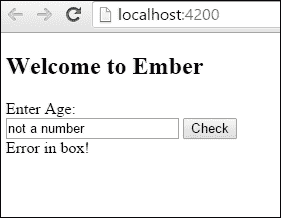
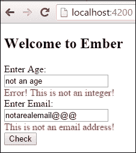
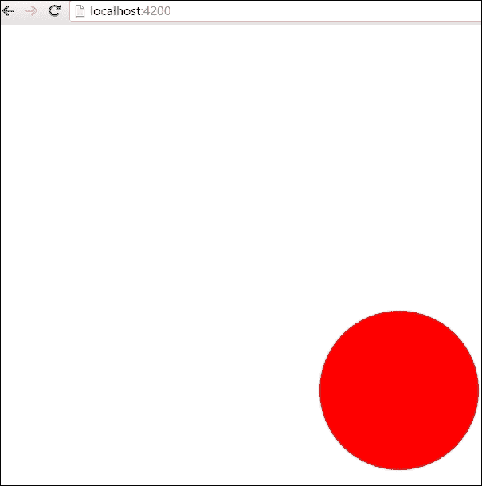
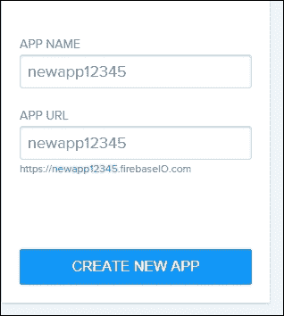
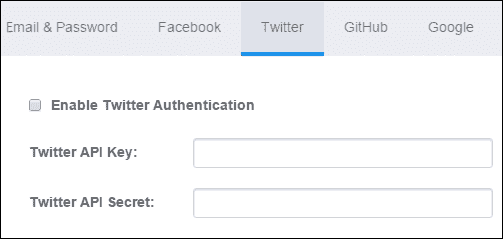
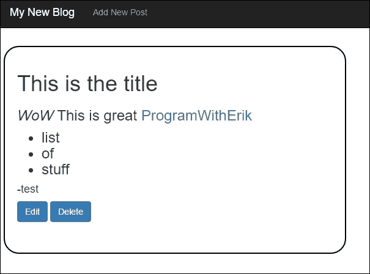
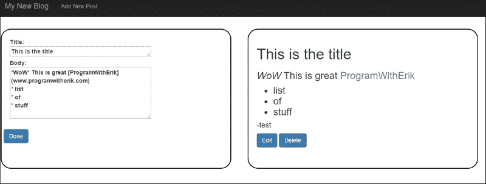

# 第十章. 使用 Ember 的精彩任务

在这一章中，我们将介绍以下菜谱：

+   使用 Ember 验证

+   使用 D3.js 与 Ember.js

+   使用 Ember 与 Sockets

+   使用 Ember 与 Firebase

+   使用服务器端渲染

# 简介

在这一章中，你将学习从验证表单数据到查看 Ember 的服务器端渲染的每一件事。每个菜谱都将向你展示 Ember 为创建雄心勃勃的应用程序所提供的强大功能和可能性。

# 使用 Ember 验证

数据表单验证在 Web 开发中是一个非常常见的用例。当你在应用程序中创建验证规则时，最终用户会立即知道他们是否犯了错误。

在这个菜谱中，我们将查看两个验证示例。在第一个示例中，我们将使用一个组件并根据一些简单的验证规则检查数据。在第二个示例中，我们将使用一个流行的 Ember 插件来简化操作。

## 如何操作...

1.  在新应用中，创建两个组件并安装验证插件：

    ```js
    $ ember g component val-example
    $ ember g component val-example2
    $ ember install ember-cp-validations

    ```

    `val-example` 组件将是第一个示例。`val-example2` 组件将使用 `ember-cp-validations` 插件作为第二个示例。

1.  更新 `val-example.hbs` 组件模板文件：

    ```js
    // app/templates/components/val-example.hbs
    Enter Age:<br>
    {{input value=num}}
    <button {{action 'check'}}>Check</button><br>
    {{error}}<br>
    ```

    此组件要求输入年龄。如果点击按钮，将触发 `'check'` 动作。使用简单的 `input` 辅助器来捕获输入。`{{error}}` 属性显示错误文本。

1.  在 `val-example.js` 组件文件中，添加一个 `check` 动作和简单的 `validation` 方法：

    ```js
    // app/components/val-example.js
    import Ember from 'ember';

    export default Ember.Component.extend({
        num: null,
        actions:{
          check(){
            if(this.validation(this.get('num'))){
              this.set('error','');
            }
            else{
              this.set('error','Error in box!');
            }

            console.log(this.getProperties('num'));
          }
        },
        validation(value){
          return Number(parseInt(value))==value;
        }

    });
    ```

    `check` 动作调用 `validation` 方法。`validation` 方法的唯一目的是如果值是数字则返回 `true`，如果值不是数字则返回 `false`。这个结果用于设置模板中将要使用的 `error` 属性。

    这是一个相当简单的示例。它展示了你可能需要验证字段的内容。另一个示例可能是创建一个新的计算属性，使其依赖于 `num` 属性。无论哪种方式都行得通。

1.  将组件添加到 `application.hbs` 模板文件：

    ```js
    // app/templates/application.hbs
    <h2 id="title">Welcome to Ember</h2>

    {{outlet}}

    {{val-example}}
    ```

    `val-example` 组件将在 `{{val-example}}` 处渲染。

1.  运行 `ember server` 并在文本框中输入一个非数字值。以下窗口将显示：

    **框内错误** 消息显示是因为没有输入数字。这是在点击 **检查** 按钮后触发的。

    对于下一个示例，我们将使用一个 Ember 插件。

1.  更新 `val-example2.hbs` 模板文件，使其能够接受电子邮件和数字：

    ```js
    // app/templates/components/val-example2.hbs
    Enter Age:<br>
    {{input value=num}}<br>
        <div style='color: red'>
          {{message}}<br>
        </div>
    Enter Email:<br>
    {{input value=email}}<br>
        <div style='color: red'>
          {{emailMessage}}<br>
        </div>
    <button {{action 'check'}}>Check</button><br>
    ```

    第二个组件比第一个复杂一些。我们将验证两个表单字段，一个数字字段和一个电子邮件字段。此外，我们将在一个 `div` 标签中包围消息，该标签将用于帮助设置文本的 `color`。在按下 `check` 按钮后，这两个字段都将被验证。

1.  在 `components` 文件夹中创建一个新的 `validations.js` 文件：

    ```js
    // app/components/validations.js
    import { validator, buildValidations } from 'ember-cp-validations';

    export default buildValidations({
        num: [
        validator('number',{
          allowString: true,
          integer: true,
          message: 'Error! This is not an integer!'
        }),
        validator('presence', true)
        ],
        email: [
          validator('format', {
            type: 'email',
            message: 'This is not an email address!'
          }),
        ],
    });
    ```

    此文件是 `ember-cp-validations` 插件所需的。在这个文件中，我们定义我们的验证规则。我们首先命名每个属性并定义所需的验证。我们可以验证许多不同类型的输入。这些验证的列表可以在 [`offirgolan.github.io/ember-cp-validations/docs/index.html`](http://offirgolan.github.io/ember-cp-validations/docs/index.html) 找到。

    `validator` 插件附带了一些预构建的消息。我们可以通过设置 `message` 属性来覆盖这些消息。在上面的代码中，`num` 和 `email` 验证器有自定义消息。`num` 验证器检查字段中是否有任何值，并且它是否是一个数字。电子邮件字段检查值是否为电子邮件地址的格式。

1.  向组件添加一个新的 `check` 动作：

    ```js
    // app/components/val-example2.js
    Import Ember from 'ember';
    import Validations from './validations';

    export default Ember.Component.extend(Validations,{
        num: null,
          email: null,
          message: '',
          emailMessage: '',
          actions: {
            check(){
              this.set('message','');
              this.set('emailMessage','');
              this.validate().then(({model, validations})=>{

                if(validations.get('isValid')){
                  this.set('message','');
                  this.set('emailMessage','');
                }
                else{

                  if(model.get('validations.attrs.num.isInvalid')){
                    this.set('message',model.get('validations.attrs.num.messages'));
                  }
                  if(model.get('validations.attrs.email.isInvalid')){
                    this.set('emailMessage',model.get('validations.attrs.email.messages'));
                  }
                }

              },(errors)=>{
                console.log(errors);
              });

            }
          }
    });
    ```

1.  在设置好 `validations` 文件后，你可以将其作为混合添加到组件中。添加 `validations` 混合后，你将能够访问 `validate()` 方法。这是一个在验证字段后返回的承诺：

    ```js
    …
        this.validate().then(({model, validations})=>{

          if(validations.get('isValid')){
            this.set('message','');
            this.set('emailMessage','');
          }
    …
    ```

    `validations` 有一个 `isValid` 属性。只有当 `num` 和 `email` 这两个属性都通过了 `validation`，它才会返回 `true`。

1.  我们也可以检查每个单独的验证：

    ```js
    …
     else{

        if(model.get('validations.attrs.num.isInvalid')){
          this.set('message',model.get('validations.attrs.num.messages'));
        }
        if(model.get('validations.attrs.email.isInvalid')){
          this.set('emailMessage',model.get('validations.attrs.email.messages'));
    …
    ```

    我们可以在组件中访问 `model` 属性。这个 `model` 将包含 `num` 和电子邮件 `properties`。我们可以使用 `validations.attrs.num.isInvalid` 来检查验证是否失败。如果失败了，我们可以使用 `validations.attrs.num.messages` 设置我们之前创建的 `message`。

    在上面的代码中，如果验证无效，那么在触发 `check` 动作后，我们将设置要在模板中显示的错误消息。

    此插件非常灵活。如果需要，我们可以创建自己的自定义验证。

1.  使用第二个组件更新 `application.hbs` 文件：

    ```js
    // app/templates/application.hbs
    <h2 id="title">Welcome to Ember</h2>

    {{outlet}}

    {{val-example2}}
    ```

    这将在我们的应用模板中显示第二个组件示例。

1.  启动 Ember 服务器，并输入无效的年龄和电子邮件值，然后点击 **检查** 按钮。以下图像将被显示：

    在点击 **检查** 按钮后，将触发一个动作。我们之前创建的验证器将检查文本并返回文本是否有效。在这个例子中，文本无效，因此显示了一个错误消息。

## 它是如何工作的...

数据表单验证是任何网络应用的一个极其重要的功能。任何具有任何类型用户表单的 Ember 应用都需要验证数据。Ember.js 可以从模板中检索数据并进行验证。其他属性可以用来切换或设置要显示的错误消息。

Ember CP 验证插件使这个过程更容易。你可以创建自己的验证或使用一些内置的验证。此代码使用计算属性和其他方法来验证并向用户报告问题。

在 Ember 中还有其他几个流行的验证插件可用。查看此网站获取更多信息：[`emberobserver.com/categories/validations`](http://emberobserver.com/categories/validations)

# 使用 Ember.js 与 D3.js

D3.js 是一个用于操作文档数据的 JavaScript 库。它可以用来创建形状、动画和强大的可视化。它使用 Web 标准，如 HTML、SVG 和 CSS 来实现其目标。

Ember.js 可以通过使用 Bower 或作为插件来导入 D3。我们将使用 Bower 来尝试它。然而，你也可以安装流行的 `ember-cli-d3` 包（`ember install ember-cli-d3`）并获取一些额外的功能。

## 如何操作...

1.  在新应用程序中，在 `application` 文件夹中运行以下命令：

    ```js
    $ bower install d3 –save
    $ ember g component d3-code

    ```

    `bower` 命令将安装 D3 并将其保存到 `bower.json` 文件中。组件最终将包含我们所有的 D3 代码。

1.  编辑 `ember-cli-build.js` 文件并添加 `d3` 文件：

    ```js
    // ember-cli-build.js
    /*jshint node:true*/
    /* global require, module */
    var EmberApp = require('ember-cli/lib/broccoli/ember-app');

    module.exports = function(defaults) {
        var app = new EmberApp(defaults, {
          // Add options here
    });

    app.import('bower_components/d3/d3.js');
    return app.toTree();
    };
    ```

    这个文件是我们添加所有第三方库的地方。要添加 D3，我们必须添加指向 D3 库目录的 `app.import` 语句。此时，D3 将在应用程序的任何地方可用。

1.  打开 `d3-code.js` 模板文件并添加一个 `div` 标签：

    ```js
    <div id='holder'></div>
    ```

    这将是我们在稍后创建的动画的占位符。

1.  编辑 `components` 文件夹中的 `d3-code.js` 文件。添加一个新的圆圈动画：

    ```js
    // app/components/d3-code.js
    import Ember from 'ember';

    export default Ember.Component.extend({
        didInsertElement() {

          let svgContainer = d3.select('#holder').append('svg').attr('width',700)
          .attr('height',700);

          svgContainer.append('circle').attr('cx',250)
          .attr('cy',250)
          .attr('r', 100)
          .transition()
          .attr('cx',500)
          .attr('cy',450)
          .duration(2000)
          .style('fill','red');

        }
    });
    ```

    这个组件的目的是使用 D3 创建一个新的 `svg` 标签和一个新的 `circle` 对象。为了实现这一点，我们希望在组件加载后将其渲染到屏幕上。Ember.js 视图（`components`）有 `didInsertElement`、`willInsertElement` 和 `willDestroyElement` 钩子。这些都与组件的应用程序生命周期中的不同点相对应。

    `willInsertElement` 钩子在视图渲染后但插入到 DOM 之前发生。`didInsertElement` 钩子在视图被插入到 DOM 之后发生。当处理第三方库如 D3 时，这是最有用的钩子。`willDestroyElement` 钩子在元素从 DOM 中移除之前被调用。这是一个放置代码的好地方，这些代码可以移除你可能添加的事件处理器。

    `svgContainer` 变量创建 `svg` 标签并将其附加到我们之前创建的 `div` 持有器中。`circle` 变量附加了将被动画化的 `circle` 标签。

1.  将组件添加到应用程序模板中：

    ```js
    // app/templates/application.hbs

    {{d3-code}}
    ```

    这会将组件添加到应用程序模板中，以便它可以被渲染。

1.  运行 `ember server`，你会看到圆圈从屏幕的一侧移动到另一侧：

    页面加载后，圆圈将从左上角移动到右下角。这发生在组件完全渲染到屏幕上之后。

## 它是如何工作的...

D3 使用网络标准生成强大的可视化。Ember 可以使用内置的 Broccoli 库导入任何第三方库。一旦加载了库，就可以在整个应用程序中访问它。我们可以使用视图中的`didInsertElement`钩子来操作 DOM。D3 将在屏幕上绘制一个圆并对其动画化。

# 使用 Ember 和 Sockets

**WebSocket**使与服务器建立通信会话成为可能。Ember.js 本身不处理这个功能。然而，有一些易于使用的扩展包可以用来实现这一点。

## 如何做...

1.  在一个新应用程序中，生成一个新的路由并安装 WebSocket 扩展包：

    ```js
    $ ember install ember-websockets
    $ ember g component w-s
    $ ember g route ws

    ```

    这将安装我们开始所需的组件路由和扩展包。

1.  在`components`模板文件夹中，编辑`w-s.hbs`文件：

    ```js
    // app/templates/components/w-s.hbs
    Welcome Chat!<br><br>

    Received Message: {{message}}<br>
    <button id="sendButtonPressed" {{action "sendButtonPressed"}}>Press Me</button>
    ```

    在这个模板中，我们有一个`message`属性和发送操作的按钮，即`sendButtonPressed`。当操作被触发时，会向服务器发送一条消息。`message`属性将显示从服务器返回的任何消息。

1.  更新`w-s.js`组件文件，使其能够处理来自模板的操作：

    ```js
    // app/components/w-s.js
    import Ember from 'ember';

    export default Ember.Component.extend({
        websockets: Ember.inject.service(),
        socket: null,
        init() {
          this._super();
          let socket = this.get('websockets').socketFor('ws://localhost:7000/');
          this.set('socket',socket);
          socket.on('open', this.myOpenHandler, this);
          socket.on('message', this.myMessageHandler, this);
          socket.on('close', (event)=> {
            console.log('closed');
          }, this);
        },
        message: '',

        myOpenHandler(event) {
          console.log('On open event has been called: ' + event);
        },

        myMessageHandler(event) {
          console.log('Message: ' + event.data);
          this.set('message',event.data);
        },

        actions: {
          sendButtonPressed() {
            this.get('socket').send('Hello Websocket World');
          }
        }
    });
    ```

    扩展包在应用程序中安装了一个名为`websockets`的服务。可以通过使用`Ember.inject.service`将其注入到组件中来访问它。由于属性名与服务名匹配，我们不需要在注入语句中指定服务名。

1.  首先，我们将设置`init`函数：

    ```js
    …
        init() {
          this._super();
          let socket = this.get('websockets').socketFor('ws://localhost:7000/');
          this.set('socket',socket);
          socket.on('open', this.myOpenHandler, this);
          socket.on('message', this.myMessageHandler, this);
          socket.on('close', (event)=> {
            console.log('closed');
          },this);
        },
    …
    ```

    组件中的`init`函数在对象实例化时被调用。你可以通过设置自己的`init`来覆盖它。为了确保不会发生奇怪的事情，我们必须调用`this._super()`，这样 Ember 就可以正确设置组件。

    `socket.on`方法创建了三个事件，分别称为`open`、`message`和`close`。在实例化过程中，创建了这三个事件处理器。第一个处理器处理与服务器建立连接时发生的事件。

    可以使用`socketFor`方法设置 WebSocket 服务。这告诉服务服务器所在的位置。

    ```js
    …
        message: '',

        myOpenHandler(event) {
          console.log('On open event has been called: ' + event);
        },
    …
    ```

    当连接建立时，会在控制台记录一条消息。

1.  第二个事件是在从服务器接收到消息时触发的：

    ```js
    …
        myMessageHandler(event) {
          console.log('Message: ' + event.data);
          this.set('message',event.data);
        },
    …
    ```

1.  接收消息后，它被设置为`message`属性。当与服务器断开连接时，触发最后一个事件：

    ```js
    …
        socket.on('close', (event)=> {
          console.log('closed');
        }, this);
    ..
    ```

    这将在控制台记录一条消息。

1.  `sendButtonPressed`操作创建一条消息并将其发送到服务器：

    ```js
    …
        actions: {
          sendButtonPressed() {
            this.get('socket').send('Hello Websocket World');
          }
        }
    …
    ```

    操作被触发后，我们使用现有的`socket`属性向服务器发送消息。

1.  将`w-s`组件添加到`ws.hbs`路由：

    ```js
    // app/templates/ws.hbs
    {{w-s}}
    ```

    组件将在`{{w-s}}`处渲染。

1.  加载服务器并导航到`/ws`路由的`w-s`。你会看到以下消息：

    这条消息显示了来自服务器的值。按下按钮会将消息发送到服务器。

    你可以看到我们如何从这个简单的例子中创建一个完整的聊天服务器。

## 它是如何工作的...

WebSockets 有助于促进服务器和浏览器之间的通信。浏览器可以通过套接字发送和接收数据。这可以与事件驱动的消息或 API 一起使用。

## 还有更多...

实现 WebSockets 服务器有许多方法。一种很好的方法是使用 ws 库。在以下步骤中，我们将创建一个基本的 WebSockets 服务器，用于本菜谱：

1.  创建一个新的空目录并运行此命令：

    ```js
    $ npm init

    ```

    按照提示创建你的项目。

1.  安装 `ws` 包：

    ```js
    $ npm install ws –save

    ```

    这将安装 `ws` `npm` 包并将其保存到 `package.json` 文件中。

1.  创建一个新的 `server.js` 文件。创建一个简单的 WebSockets 服务器：

    ```js
    // server.js
    var WebSocketServer = require('ws').Server;
    var ws = new WebSocketServer({port: 7000});

    ws.on('connection', function connection(ws) {
    ws.on('message', function incoming(message) {
        console.log('received: %s', message);
        ws.send('Hey! Welcome to my websocket challenge!');
    });

    });
    ```

1.  启动节点服务器：

    ```js
    $ node ./server.js

    ```

    这个服务器在 `7000` 端口上创建了一个 `port`。然后它等待连接。如果它收到一条消息，它将输出到控制台并返回一条新消息。这将显示在 Ember 模板文件中并由消息处理程序接收。

# 使用 Ember 与 Firebase

Firebase 是一个后端即服务提供商。它只需几行代码即可存储数据和认证你的用户。它与许多不同的框架很好地集成，包括 Ember.js。

在这个菜谱中，我们将通过创建一个博客应用来查看 Firebase 的几个功能。这个应用将允许用户创建、编辑或删除帖子。用户可以使用 Twitter 登录并完成认证。

## 准备工作

在开始之前，我们必须在 Firebase 上创建一个账户，网址为 [`www.firebase.com`](http://www.firebase.com)。由于 Google 拥有 Firebase，所以这应该非常简单。实际上，你应该可以直接使用你的 Google 凭证登录。

登录后，你需要创建一个新的应用并设置一个新的提供者。按照以下步骤操作：

1.  在 Firebase 控制台中创建一个新的应用。它应该看起来像以下图片。记下**应用 URL**以备后用：

1.  创建应用后，点击**管理**，然后点击左侧的**登录与认证**。点击**Twitter**并输入你的**Twitter API 密钥**和**Twitter API 密钥**：

    要获取这些密钥，你需要通过 Twitter 创建一个新的应用。为此，请访问 `apps.twitter.com` 并点击**创建新应用**。遵循屏幕上的说明。确保将回调 URL 设置为 `https://auth.firebase.com/auth/twitter/callback`。

    这就足够了。确保你记下 Firebase 创建的 URL 名称。你稍后设置 `environment.js` 文件中的所有内容时需要它。

## 如何做到这一点...

1.  在一个新应用中，生成并安装这些文件：

    ```js
    $ ember install emberfire
    $ ember install torii
    $ ember install ember-bootstrap
    $ ember install ember-cli-showdown
    $ ember g route new
    $ ember g route posts
    $ ember g route application
    $ ember g controller new
    $ ember g controller posts
    $ ember g model post title:string body:string author:string titleURL:string
    $ ember g template index
    $ ember g util clean

    ```

    生成的文件将是我们的应用程序的骨架。两个 `install` 命令将使用名为 `torii` 的附加组件安装 Firebase 认证所需的文件。

1.  验证应用程序适配器是否已为 Firebase 设置：

    ```js
    // app/adapters/application.js
    import Ember from 'ember';
    import FirebaseAdapter from 'emberfire/adapters/firebase';

    const { inject } = Ember;

    export default FirebaseAdapter.extend({
      firebase: inject.service(),
    });
    ```

    此适配器在我们安装 `emberfire` 扩展时自动为我们生成。它将 Firebase 服务注入到我们的应用程序和数据存储中。

1.  通过编辑 `environment.js` 文件来配置 `emberfire` 适配器：

    ```js
    // config/environment.js
    …
        firebase: 'https://testemberfire.firebaseio.com/',
        torii: {
          sessionServiceName: 'session'
        },
    …
    ```

    要使用 Firebase，您必须将 `firebase` 属性设置为之前创建的 Firebase URL。确保 `torii` 属性也已设置，这样我们就可以在我们的应用程序中使用 `session` 对象。

1.  在名为 `torii-adapters` 的新文件夹中添加 `application.js` 文件：

    ```js
    // app/tori-adapters/application.js
    import Ember from 'ember';
    import ToriiFirebaseAdapter from 'emberfire/torii-adapters/firebase';
    export default ToriiFirebaseAdapter.extend({
        firebase: Ember.inject.service()
    });
    ```

    Torii 是 Ember.js 的认证抽象类型。这将使我们在程序中使用会话变量成为可能。

1.  更新 `utils` 文件夹中的 `clean.j`s 文件：

    ```js
    // app/utils/clean.js
    export default function clean(title) {
        title = title.replace(/ /g, '_');
        return title.replace(/[^a-zA-Z0-9-_]/g, '');
    }
    ```

    此文件仅用于清理 URL 并返回它。换句话说，它移除了除破折号和字符 `a-z` 之外的所有内容。我们将在稍后为我们的 URL 使用此功能。

1.  让我们看一下模型文件，确保它看起来 *OK*：

    ```js
    // app/models/post.js
    import DS from 'ember-data';

    export default DS.Model.extend({
        title: DS.attr('string'),
        body: DS.attr('string'),
        author: DS.attr('string'),
        titleURL: DS.attr('string')

    });
    ```

    模型包含我们将用于应用程序中每个帖子的所有数据。这应该是在之前生成的。

1.  使用 `titleURL` 作为路径来更新 `router.js` 文件：

    ```js
    // app/router.js
    import Ember from 'ember';
    import config from './config/environment';

    const Router = Ember.Router.extend({
        location: config.locationType
    });

    Router.map(function() {
        this.route('posts', {path: '/:titleURL'}, function() {
    });
        this.route('new');
    });

    export default Router;
    ```

    其中一些是在我们创建帖子和新路由时为我们生成的。然而，我们想确保 `titleURL` 被设置为每个单独帖子的路径。我们通过传递 `:titleURL` 动态段到路径来实现这一点。

1.  将每个单独帖子的查询添加到帖子路由中：

    ```js
    // app/routes/posts.js
    import Ember from 'ember';

    export default Ember.Route.extend({
        model(param) {
          return this.store.query('post', {
            orderBy: 'titleURL',
          equalTo: param.titleURL });
        }
    });
    ```

    当用户导航到 `/posts` URL 时，模型将期望传递一个参数。例如，如果您导航到 `/posts/my_post`，则 `my_post` 段将作为参数传递，可以在路由中访问。我们将在 Firebase `this.store.query` 方法中使用此参数。第一个参数是模型的名称。然后我们可以使用 `orderBy` 和 `equalTo` 来指定我们正在寻找的确切帖子。

    ### 小贴士

    **唯一性**

    如您所想象，在创建新帖子时，标题可能唯一，也可能不唯一。`this.store.query` 方法将所有结果作为数组返回给模型。我们可以在 Firebase 中通过使 `titleURL` 唯一来强制执行唯一性。另一种可能性是在创建帖子时检查标题的唯一性。无论如何，在这个例子中，我们将假设所有标题 URL 都是唯一的。

1.  编辑应用程序路由文件并添加模型和几个操作：

    ```js
    // app/routes/application.js
    import Ember from 'ember';

    export default Ember.Route.extend({
        model(){
          return this.store.findAll('post');
        },
        actions:{
          login(){
            this.get('session').open('firebase', { provider: 'twitter'}).then((data)=> {
            });
          },
          logout(){
            this.get('session').close();
          }
        }
    });
    ```

    我们希望主应用程序能够访问模型路由，以便我们可以使用 `findAll` 方法检索所有帖子。这基本上与我们在之前的食谱中使用的 Ember Data 方法相同。

    有两个操作，`login` 和 `logout`。正如我们通过 `torii` 注入会话到程序中一样，我们可以从任何地方访问它。通过调用 `this.get('session')`，我们可以 `打开` 或 `关闭` 会话。Firebase 有几个内置的认证器，包括 Twitter 和 Facebook。此例中的 `login` 操作将 `打开` 一个到 `twitter` 的窗口，以便用户可以进行认证。

    ### 小贴士

    **Firebase 安全性**

    对于任何 JavaScript 浏览器应用程序，安全性可能比较复杂。Firebase 让这变得容易一些。Firebase 跟踪已认证的用户。在 Firebase 控制台中，你可以设置规则，使得只有已认证的用户才能接收数据。这超出了本食谱的范围。然而，使用第三方认证器（如 Twitter 或 Facebook）可以与 Firebase 一起确保数据安全。

1.  打开应用程序模板文件。在顶部添加一个导航栏，并添加登录、登出和添加新帖子的按钮：

    ```js
    //app/templates/application.hbs
    <nav class="navbar navbar-inverse navbar-fixed-top">
        <div class="container-fluid">
        <div class="navbar-header" href="#">
        {{#link-to 'index' class='navbar-brand'}}My New Blog{{/link-to}}
        </div>
        <ul class="nav navbar-nav">
        {{#if session.isAuthenticated}}
        <li>{{#link-to 'new'}}Add New Post{{/link-to}}</li>
        {{/if}}
        </ul>
        <ul class="nav navbar-nav navbar-right">
        {{#unless session.isAuthenticated}}
        <li><a href="#" {{action 'login' }}>Login</a></li>
        {{else}}
        <li><a href="#" {{action 'logout' }}>Logout</a></li>
        {{/unless}}
        </ul>
        </div>
    </nav>
    <br>
    <br>
    <br>
    {{outlet}}
    ```

    由于我们已安装了 `ember-bootstrap` 扩展包，我们可以创建一个非常简单的顶部导航栏。`login` 和 `logout` 按钮被 `if` 辅助器包围。在每一个模板中，你都可以访问 `session` 属性。这个属性有一个名为 `isAuthenticated` 的方法，如果用户已登录则返回 `true`，如果用户未登录则返回 `false`。我们可以使用这个方法仅在用户未登录时显示 `login` 按钮。如果用户已登录，他们将看到 `logout` 按钮。

    我们没有应用程序控制器，所以这些动作将冒泡到应用程序路由，在那里它们将被处理。

1.  现在更新 `index.hbs` 文件，为每个单独的帖子添加链接：

    ```js
    // app/templates/index.hbs

    <div class = 'row'>
        <div class='col-md-4'>
          <h1>Posts</h1>
            {{#each model as |post|}}
              <br>{{#link-to 'posts' post.titleURL}}{{post.title}}{{/link-to}}
            {{/each}}
        </div>

    </div>
    ```

    `model` 会遍历每个帖子，并在屏幕上显示 `title`。每个 `titleURL` 都作为参数传递给帖子路由。

1.  在新模板中，添加一些文本框，以便用户可以添加帖子。添加一个预览帖子的部分：

    ```js
    // app/templates/new.hbs
    <br><br>
    <div class='col-md-4 border' >
        <h1>New Post</h1>
        <form {{action 'save' on="submit"}}>
          <dl>
            <dt>Title:<br> {{textarea value=title cols="40" |rows="1" placeholder='Title'}}</dt>
            <dt>Body:<br> {{textarea value=body cols="40" rows="6" placeholder='Body'}}</dt>
          </dl>
          <button type='submit' class='btn btn-primary'>Add</button>
        </form>
    </div>
    <div class='col-md-4 border'  >
        <h1>Preview</h1>
        <h3>{{title}}</h3>
        <h4>{{markdown-to-html markdown=body}}</h4>
    </div>
    ```

    新模板将用于创建新帖子。`textarea` 辅助器创建了两个文本框。表单有一个 `save` 动作，当表单提交时将被触发。

    在设置项目时，我们安装了一个 `markdown` 扩展包。这允许我们在帖子的正文中使用 `markdown`。Markdown 是一种文本到 HTML 的转换工具。它使得在文本中编写 HTML 更加容易。

1.  在帖子模板中，显示每个帖子，并展示编辑帖子的方式：

    ```js
    // app/templates/posts.js
    {{#each model as |model|}}
    <div class='row'>
        {{#if isEditing}}
          <div class='col-md-4 border'>
            <form {{action 'save' on='submit'}}>
              <dl>
                <dt>Title:<br> {{textarea value=model.title cols='40' rows='1'}}</dt>
                <dt>Body:<br> {{textarea value=model.body cols='40' rows='6'}}</dt>
              </dl>
          <div class = 'row'>
            <button type='submit' class = 'btn btn-primary'>Done</button>
          </div>
            </form>
          </div>
        {{/if}}
        <div class='col-md-4 border'>
          <h1>{{model.title}}</h1>
          <h3>{{markdown-to-html markdown=model.body}}</h3>
          <h4>-{{model.author}}</h4>
          {{#if session.isAuthenticated}}
            <form {{action 'edit' }}>
            <button type='submit' class='btn btn-primary'>Edit</button>
                <button type='delete' class= 'btn btn-primary' {{action 'delete'}}>Delete</button>
            </form>
          {{/if}}
        </div>
    </div>
    {{/each}}
    ```

    这会显示每个单独的帖子。如果用户已认证，他们可以删除或编辑帖子。

    再次使用 `textarea` 模板辅助器来显示文本框。表单有一个附加的 `edit` 动作，它将 `isEditing` 属性设置为 `true`，以便可以编辑帖子。`delete` 动作会删除帖子。

1.  将 `save` 动作添加到新控制器中：

    ```js
    // app/controllers/new.js
    import Ember from 'ember';
    import cleanURI from '../utils/clean';

    export default Ember.Controller.extend({
        actions: {
          save(){

            const titleURL= cleanURI(this.get('title'));
            const post = this.store.createRecord('post',{
            title: this.get('title'),
            body: this.get('body'),
            author: 'test',
            titleURL: titleURL
            });
            post.save();
            this.set('title','');
            this.set('body','');
            this.transitionToRoute('index');
          }
        }
    });
    ```

    `save` 动作用于将数据保存到 Firebase。首先，它获取帖子的标题，并使用 `cleanURI` 工具去除所有特殊字符和空格。Firebase 有一个名为 `createRecord` 的函数，用于创建新记录。然后我们将记录保存到存储中，并将值 `set` 回默认。最后，应用程序返回到索引页面。

1.  在帖子控制器中，添加 `edit`、`delete` 和 `save` 动作：

    ```js
    // app/controllers/posts.js
    import Ember from 'ember';
    import cleanURI from '../utils/clean';

    export default Ember.Controller.extend({
        actions: {
          edit(){
            this.set('isEditing', true);
          },
          delete(){
            this.get('model').forEach(model=>{
              model.deleteRecord();
            });
            this.get('model').save();
            this.set('isEditing', false);
            this.transitionToRoute('index');
          },
          save(){
            this.get('model').forEach(model=>{
              const titleURL = cleanURI(model.get('title'));
              model.set('titleURL', titleURL);
              model.save();
            });
            this.set('isEditing',false);
            this.transitionToRoute('index');
          }
        }
    });
    ```

    让我们更详细地分解一下：

    ```js
    …
        edit(){
          this.set('isEditing',true);
        },
    …
    ```

    编辑函数将`isEditing`属性设置为`true`。帖子模板使用此属性来显示或隐藏编辑窗口：

    ```js
    …
        delete(){
          this.get('model').forEach(model=>{
            model.deleteRecord();
          });
          this.get('model').save();
          this.set('isEditing',false);
          this.transitionToRoute('index');
        },
    …
    ```

    `delete`操作删除记录。为此，我们必须在我们的`model`上使用`forEach`方法。在路由中，我们使用了`query`方法，它返回一个数组。因此，我们必须遍历返回的每个记录，并删除它。再次假设每个标题都是唯一的，并且只有一个记录。请记住始终`.save()`，以便在 Firebase 中持久化记录。记录被删除后，我们将过渡到 index 路由：

    ```js
    …
        save(){
          this.get('model').forEach(model=>{
            const titleURL = cleanURI(model.get('title'));
            model.set('titleURL',titleURL);
            model.save();
          });
          this.set('isEditing',false);
          this.transitionToRoute('index');
        }
    …
    ```

    `save`函数获取标题，清理它，设置它，并保存模型。在这个例子中，我们必须使用`forEach`方法遍历数组。之后，我们将`isEditing`属性设置回`false`，并过渡回`index`。

1.  运行应用程序，将显示以下屏幕：

    这显示了屏幕的左上角。由于我们还没有添加帖子，所以没有列出帖子：

    

1.  屏幕右上角将显示**登录**按钮。我们需要通过按下此按钮来登录。这将弹出一个请求我们 Twitter 账户凭证的窗口。登录后，将显示**添加新帖子**文本：

1.  点击**添加新帖子**将显示以下屏幕：

1.  您可以看到预览将 Markdown 转换为 HTML。添加新帖子后，它将被列出：

1.  点击标题将带我们到编辑屏幕。在这里，我们可以**编辑**或**删除**帖子：

1.  点击**编辑**按钮将弹出编辑屏幕：

    从这里，我们可以进行任何更改并将其保存回来。每次保存时，帖子都会在 Firebase 中持久化。

## 它是如何工作的...

Firebase 通过`emberfire`和`torii`插件与其后端服务通信。EmberFire 是官方的 Ember Data 适配器。它具有许多与其他流行适配器相同的特性。它可以相对容易地保存、删除、编辑和查询数据。其中一个目的是使其能够非常容易地持久化和保存数据，而无需设置自己的后端。

Firebase 还有可以连接的认证提供者。Firebase 处理提供者与应用程序之间的所有认证。这只需要在 Firebase 中设置提供者。

# 使用服务器端渲染

Ember.js 在浏览器中运行。它使用 JavaScript 来处理所有路由和数据渲染。它仅在初始页面加载时与服务器通信，以检索 JSON 数据。这可能会有些限制。较大的应用程序在较慢的连接上可能加载时间更长，并且仍然存在一些关于搜索引擎优化的担忧。

为了帮助缓解这些担忧，Ember 团队创建了 **FastBoot**。FastBoot 是一个 Ember CLI 插件，允许 Ember.js 在服务器上渲染和提供应用程序。截至撰写本文时，它仍在开发中，有一些限制。它不建议用于生产，并且不与 jQuery 或 `didInsertElement` 一起工作。它有望在 Ember v2.4 中准备好用于生产。

尽管如此，它正在改进，并且是 Ember 的重要插件。

## 如何操作...

1.  在一个新应用程序中，运行以下命令：

    ```js
    $ ember install ember-cli-fastboot
    $ rm –rf bower_components
    $ bower install --save ember#canary

    ```

    FastBoot 需要 Ember 的 `canary` 版本来运行。在安装之前，我们必须删除 `bower_components` 文件夹。在安装过程中，你可能会收到一条消息，表明 Bower 找不到 Ember 的合适版本。这是正常的；请确保从列表中选择 `ember#canary`。

1.  为生产构建应用程序：

    ```js
    $ ember build –prod

    ```

    这将构建生产服务器并压缩所有文件。

1.  运行 Ember FastBoot 服务器：

    ```js
    $ ember fastboot --serve-assets --port 4200 --environment production

    ```

    这将运行 FastBoot 服务器。让我们分析这些参数：

    +   **--serve-assets**：这将从 `dist` 文件夹中提供资源。

    +   **--port 4200**：这指定了端口。默认是 3000。在这种情况下，我们可以使用 `4200` 来匹配我们通常使用的测试服务器。

    +   **--environment production**：默认是开发环境。使用生产环境。它效果更好，因为 Ember FastBoot 使用压缩文件运行得更快。

1.  在端口 `4200` 打开 localhost 以查看网页加载：

    页面看起来没有不同。然而，如果你查看浏览器控制台，你会注意到 Ember 应用程序在浏览器中运行时没有下载所有通常需要的 JavaScript。

## 它是如何工作的...

Ember FastBoot 是一个正在开发中的 Ember 插件。截至撰写本文时，它有很多限制。话虽如此，它最终将允许你在服务器上渲染你的 Ember.js 应用程序，或者至少是应用程序的一部分，用于初始页面加载。这将显著减少页面加载时间。要了解更多关于 Ember FastBoot 的信息，请访问他们的网站 [`github.com/tildeio/ember-cli-fastboot`](https://github.com/tildeio/ember-cli-fastboot)。
