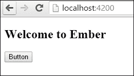
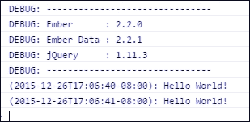
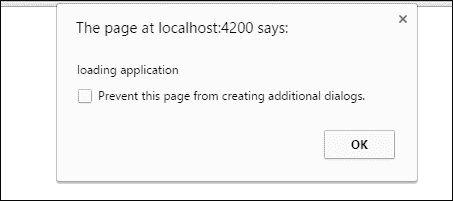
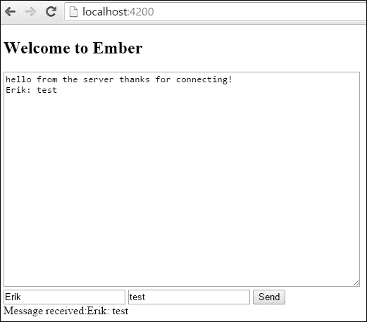
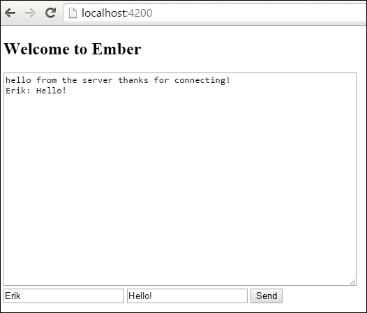
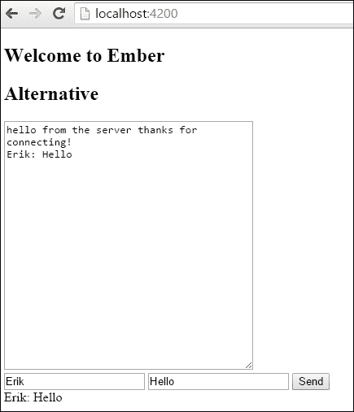
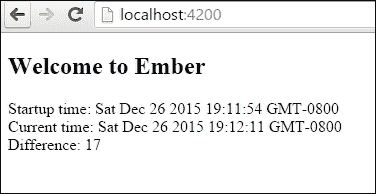

# 第十一章。实时网络应用程序

在本章中，我们将涵盖以下食谱：

+   使用依赖注入

+   与应用程序初始化器一起工作

+   构建聊天应用程序

+   创建和使用插件

+   学习 Ember 运行循环

# 简介

随着你使用 Ember 的技能提升，你将学习如何处理实时应用程序。在这些类型的应用程序中，你将处理来自服务器的更新。你需要能够处理这些事件并在需要时通知用户。

在 Ember 中，我们可以使用诸如依赖注入和 WebSocket 服务之类的功能来处理来自服务器的实时事件。在本章中，我们将探讨这些概念，包括插件。

# 使用依赖注入

依赖注入模式用于声明和实例化对象的类以及处理它们之间的依赖关系。在 Ember 中，我们可以将对象或服务注入到路由、控制器或组件中。

在这个食谱中，我们将使用依赖注入将记录器对象注入到我们的控制器中。

## 如何做到这一点...

1.  在一个新应用程序中安装 `moment` 库并创建一个新的 `initializer`：

    ```js
    $ bower install moment –save
    $ ember g initializer application

    ```

    这将安装 Bower **Moment.js** 库。我们将使用它来创建自定义记录器。

1.  将 Moment 库导入 Ember 项目：

    ```js
    // ember-cli-build.js
    /*jshint node:true*/
    /* global require, module */
    var EmberApp = require('ember-cli/lib/broccoli/ember-app');

    module.exports = function(defaults) {
        var app = new EmberApp(defaults, {
          // Add options here
        });

        app.import('bower_components/moment/min/moment.min.js');
          return app.toTree();
    };
    ```

    `app.import` 语句将 `moment` 库添加到应用程序中。

1.  在 `initializers` 文件夹中的 `application.js` 文件中添加一个新的记录器：

    ```js
    // app/initializers/application.js
    /* global moment */
    import Ember from 'ember';

    export function initialize( application) {
        let MyLogger = Ember.Object.extend({
          log(info){
            let time = moment().format();
            Ember.Logger.debug(`(${time}):`,info);
          }
        });
        application.register('myLogger:zzz', MyLogger);
        application.inject('controller','myLogger','myLogger:zzz');
    }

    export default {
        name: 'application',
        initialize
    };
    ```

    这创建了一个名为 `myLogger` 的新记录器。它使用之前安装的内置 `Ember.Logger` 并添加了一个时间戳。

    让我们更详细地看看：

    ```js
        application.register('myLogger:zzz', MyLogger);
    ```

    `application.register` 方法注册了一个新的工厂。第一个参数是注册键。注册键总是由冒号 `:` 分隔的两个部分组成。第一部分是工厂的类型，第二部分是工厂的名称。工厂的类型可以是模板、`component`、`controller` 或 `service`，或者你可以创建自己的。在这个例子中，我将其命名为 `myLogger`。第二个参数是你想要注册的对象，`MyLogger`：

    ```js
        application.inject('controller','myLogger','myLogger:zzz');
    ```

    这个应用程序注入使新的 `myLogger:zzz` 工厂在所有控制器中可用。`myLogger` 的值来自 `myLogger:zzz` 工厂。

1.  创建一个新的应用程序控制器并添加一个新的使用新的 `myLogger` 调试器的记录动作：

    ```js
    // app/controllers/application.js
    import Ember from 'ember';

    export default Ember.Controller.extend({
        actions: {
          press(){
            this.myLogger.log('Hello World!');

        }
    });
    ```

    当发生新的 `press` 动作时，它会在控制台记录 `Hello World`。

1.  将 `action` 添加到应用程序模板：

    ```js
    <h2 id="title">Welcome to Ember</h2>

    {{outlet}}
    <button {{action 'press'}}>Button</button>
    ```

    当按钮被点击时，`press` 动作被触发。

1.  运行 `ember server`，你将看到以下屏幕：

    按下**按钮**，你将在控制台看到以下内容：

    

    每次点击按钮时，它都会在控制台记录一个调试语句。

## 它是如何工作的...

依赖注入发生在我们实例化时将对象注入到其他对象中的过程。Ember 可以通过`application.inject`方法来实现这一点。要在 Ember 中完成此操作，我们必须创建工厂。工厂只是返回其他对象的简单对象。

Ember 将这些工厂注册到`Ember.Application`中。`Ember.Application`充当一种注册表，其中包含不同的工厂。注册后，它们可以被注入到 Ember 应用的其它部分，如组件或控制器。

# 使用应用初始化器

应用初始化器可以在应用启动时配置您的应用。这是设置应用中依赖注入的主要位置。

在这个例子中，我们将检查应用初始化器何时运行。

## 如何操作...

1.  在新应用中，创建`initializer`：

    ```js
    $ ember g initializer application

    ```

    这将创建一个新的应用`initializer`。它将在应用启动时立即运行。

1.  在初始化器中添加一个警告框：

    ```js
    // app/initializers/application.js
    export function initialize( application ) {
        alert('loading application');
    }

    export default {
        name: 'application',
        initialize
    };
    ```

    这将在应用加载时立即加载一个`alert`框。

1.  运行`ember server`，您应该在应用加载前看到一个警告框：

    在显示此警告框之前，应用中还没有加载任何其他内容。

1.  如果需要，我们也可以在初始化器中`register`或`inject`服务。它可能看起来如下：

    ```js
    // app/initializer/application.js
    export function initialize(app) {
        app.inject('component', 'start', 'service:start');
    }

    export default {
        name: 'init',
        initialize
    };
    ```

    这会将名为 start 的服务注入到所有组件中。您可以在第九章 *使用 Ember.js 的实战任务* 中看到更多此类示例。

    ### 小贴士

    **应用实例初始化器**

    应用实例初始化器在实例加载时运行。它是随着 Ember 的 FastBoot 添加的，以便更容易地并发运行多个请求。在启动过程中，首先运行应用初始化器，然后是实例初始化器。如果需要，您可以在实例初始化器中查找已在应用初始化器中注册的工厂。

    在大多数情况下，您只会使用实例初始化器进行某些 A/B 测试配置、配置初始状态以及与 Ember FastBoot 服务器一起工作时。要生成实例初始化器，请运行`ember g instance-initializer <name>`。

## 工作原理...

应用初始化器在应用启动时立即运行。这是配置依赖注入到您应用中的主要位置。尽量保持初始化器尽可能轻量。向初始化器中添加更多复杂性可能会造成应用加载延迟。像异步加载条件这样的东西在服务或路由钩子中运行会更好。

# 构建聊天应用

在这个菜谱中，我们将结合您从初始化器和依赖注入中学到的知识来创建一个聊天室。聊天室将使用 WebSockets 与主机通信。

## 如何操作...

1.  在新应用中，生成以下文件：

    ```js
    $ ember g service sockjs
    $ ember g component chat-room
    $ ember g initializer application
    $ bower install sockjs --save

    ```

    这些将生成项目所需的文件。`chat-room`组件将包含我们创建的聊天室的逻辑。

1.  将**SockJS**库导入到应用程序中：

    ```js
    // ember-cli-build.js
    …
    app.import('bower_components/sockjs/sockjs.min.js');
    …
    ```

    这将导入库，以便我们可以在应用程序的任何地方使用全局变量`sockjs`。

1.  为`SockJS`创建一个新的服务：

    ```js
    // app/services/sockjs.js
    /* global SockJS */
    import Ember from 'ember';
    const {run} = Ember;

    export default Ember.Service.extend(Ember.Evented,{
        socket: null,
        init() {
          this._super();
          let socket = new SockJS('http://localhost:7000');
          socket.addEventListener('message', run.bind(this, (event)=> {
            this.trigger('messageReceived', event.data);
            console.log(event.data);
          }));
          this.set('socket',socket);
        },
        sendInfo(message) {
          this.get('socket').send(message);

        }

    });
    ```

    让我们更详细地看看这个：

    ```js
    /* global SockJS */
    ```

    这一行是必需的，这样**JSHint**就不会对 SockJS 全局变量提出抱怨。JSHint 是 Ember CLI 的内置库，用于检测程序中的错误：

    ```js
    export default Ember.Service.extend(Ember.Evented,{
    ```

    这将`Ember.Evented`混入添加到服务中。这个混入允许 Ember 对象订阅和发射事件。这对于我们在本例中需要做的事情来说非常合适：

    ```js
    init() {
        this._super(…arguments);
    },
    ```

    `init`方法是在 SockJS 套接字设置和事件监听器创建的地方。这个方法将在服务初始化后触发。`this._super`方法确保`init`方法被正确设置：

    ```js
    let socket = new SockJS('http://localhost:7000');
    ```

    上一行在本地主机的端口`7000`创建了一个新的套接字服务器：

    ```js
    socket.addEventListener('message', run.bind(this, (event)=> {
        this.trigger('messageReceived', event.data);
        console.log(event.data);
    }));
    this.set('socket',socket);
    ```

    这创建了一个在收到消息时触发的事件监听器。`run.bind`方法是 Ember `run`循环的一部分，我们将在本章后面描述它。这确保了所有请求都在`run`循环中得到妥善处理。

    `this.trigger`是`Event.Evented`类的一部分。`trigger`方法创建一个名为`messageReceived`的新事件。我们可以订阅这个事件，以便在收到消息时触发 Ember 中的其他方法。最后，我们将`event.data`中的信息`log`到控制台，并设置`socket`属性：

    ```js
        sendInfo(message) {
          this.get('socket').send(message);
        }
    ```

    这个方法接受`message`并将其发送到我们之前定义的`socket`服务器。在这里访问`socket`属性。

1.  将新服务注入到应用程序的所有组件中：

    ```js
    // app/initializers/application.js
    export function initialize( application ) {
        application.inject('component', 'sockjs', 'service:sockjs');
    }

    export default {
        name: 'websockets',
        initialize
    };
    ```

    初始化器接受名为`sockjs`的服务并将其注入到所有组件中。这将在程序首次启动时运行。我们使用这个方法，这样我们就不必将`sockjs`服务特别注入到每个组件中。

1.  为聊天室创建一个新的组件：

    ```js
    // app/components/chat-room.js
    import Ember from 'ember';
    const {$} = Ember;

    export default Ember.Component.extend({
        message: '',

        init() {
          this._super(…arguments);
          this.sockjs.on('messageReceived',this, 'messageReceived');
        },

        messageReceived(message){
          $('#chat-content').val((i, text)=>
          `${text}${message}\n`;
          );
          this.set('message',message);
        },
        actions: {
          enter(info,username) {
            this.sockjs.sendInfo(`${username}: ${info}`);

          }
        }

    });
    ```

    让我们将这个操作分解成更小的部分：

    ```js
        init() {
          this._super(…arguments);
          this.sockjs.on('messageReceived',this, 'messageReceived');
        },
    ```

    这个`init`方法在初始化时触发，并设置组件。然后我们可以使用`on`订阅在服务中之前创建的事件。第一个参数是事件的名称。第二个是绑定。最后一个是指回调函数的名称。因此，在本例中，每当服务中收到消息时，这个组件中的`messageReceived`回调将被触发：

    ```js
        messageReceived(message){
          $('#chat-content').val((i, text)=>
          `${text}${message}\n`
          );
          this.set('message',message);
    ```

    这是`messageReceived`回调。它使用一点 jQuery 来查找`chat-content` ID，并使用 ES6 字符串插值将现有消息连接到它。此外，设置`message`属性：

    ```js
        actions: {
          enter(info,username) {
            this.sockjs.sendInfo(`${username}: ${info}`);

          }
        }
    ```

    这个操作将`info`和`username`发送到套接字。这样，任何连接的其他客户端都会收到通知。

1.  为组件创建`chat-room.hbs`模板文件：

    ```js
    // app/templates/components/chat-room.hbs

        <textarea id="chat-content" style="width:500px;height:300px" ></textarea><br/>
        {{input type='text' placeholder='User Name' value=uname}}
        {{input type='text' placeholder='Chat Message' value=mess}}
        <button {{action 'enter' mess uname}}>Send</button><br>

    Message received:{{message}}
    ```

    这段代码显示来自服务器的消息。`input` 辅助器捕获用户名和消息。当点击“发送”按钮时，每个值都会传递给 `enter` 动作。

1.  将组件添加到 `application.hbs` 文件中：

    ```js
    // app/templates/application.hbs
    <h2 id="title">Welcome to Ember</h2>

    {{outlet}}
    {{chat-room}}
    ```

    这将组件添加到应用程序中。

1.  启动节点服务器。然后启动 Ember 应用程序。你会看到以下屏幕：

    随着每个客户端的连接，他们可以向服务器发送消息。每个客户端将接收到这些消息并在聊天框中显示它们。

## 它是如何工作的...

聊天室由多个客户端与服务器进行通信组成。服务器的任务是当收到消息时通知所有其他已连接的客户端。在这个例子中，使用 SockJS 和 WebSocket 来实现。SockJS 库有消息事件，我们可以在 Ember 中设置这些事件。当收到消息时，它会被发送到一个组件，该组件会更新其模板以显示消息。

## 还有更多...

要使用前面的示例，你需要设置一个 WebSocket 服务器。以下是创建简单的 Node.js SockJS 服务器步骤。要了解更多关于 SockJS 的信息，请查看他们的 GitHub 页面 [`github.com/sockjs/sockjs-node`](https://github.com/sockjs/sockjs-node)。

1.  在一个新目录中，运行 `npm init` 命令：

    ```js
    $ npm init
    $ npm install sockjs –save

    ```

    这将生成 `package.json` 文件并在其中安装 SockJS 服务器。

1.  为 WebSocket 服务器创建一个新的 `app.js` 文件：

    ```js
    // app.js
    var http = require('http');
    var sockjs = require('sockjs');

    var clients = {};

    function broadcast(message){
        for (var client in clients){
          clients[client].write(message);
        }
    }

    var socketServer = sockjs.createServer({ sockjs_url: 'http://cdn.jsdelivr.net/sockjs/1.0.1/sockjs.min.js' });
    socketServer.on('connection', (conn)=> {
        clients[conn.id] = conn;

        conn.on('data', (message)=> {
          console.log('received ' + message);
          broadcast(message);
        });
        conn.write("hello from the server thanks for connecting!");
        conn.on('close', ()=> {
          delete clients[conn.id];
        });
        console.log("connected");
    });

    var server = http.createServer();
    socketServer.installHandlers(server);
    server.listen(7000, '0.0.0.0');
    ```

    这个服务器使用 SockJS 库创建一个新的 socket 服务器。当一个新的客户端连接时，它会被添加到一个数组中。当它接收到数据时，它会使用这个函数将数据广播到所有通过此连接的其他服务器：

    ```js
    function broadcast(message){
        for (var client in clients){
          clients[client].write(message);
        }
    }
    ```

    这个函数向所有连接的其他客户端发送一个包含刚刚接收到的 `message` 的 `broadcast` `message`。当 Ember 收到这个信息时，它会被写入聊天框。

# 创建和使用插件

Ember 使用一种称为 Ember Addons（也称为插件）的方式来共享代码。Ember 插件使得与其他应用程序一起分发可重用库变得容易。任何人都可以创建插件。你可以将它们发布到 NPM 或你自己的私有 Git 仓库。

请记住，你还可以使用 Bower 来安装前端依赖项。这是通过 Bower 软件包管理器完成的。查看 第一章，*Ember CLI 基础*，了解更多关于如何操作的信息。

在这个菜谱中，我们将从上一节中的聊天程序创建一个插件。

## 如何操作...

1.  创建一个名为 `sockjs-chat` 的新插件。生成以下文件：

    ```js
    $ ember addon sockjs-chat
    $ cd sockjs-chat
    $ ember g component sockjs-chat
    $ ember g service sockjs
    $ ember g blueprint sockjs-chat
    $ npm install ember-cli-htmlbars --save

    ```

    `ember addon` 命令为插件生成文件夹结构。我们将在稍后更详细地讨论文件夹结构。`blueprint` 命令创建一个新的蓝图，称为 `sockjs-chat`。蓝图用于生成代码片段。这是安装 SockJS 库所需的。如果我们做任何与模板相关的事情，我们需要添加 `ember-cli-htmlbars`。

1.  创建 `sockjs-chat` 蓝图，以便安装 SockJS 库：

    ```js
    // blueprints/sockjs-chat/index.js
    /*jshint node:true*/
    module.exports = {
        normalizeEntityName() {
    },

        afterInstall() {
          return this.addBowerPackageToProject('sockjs-client', '~1.0.3');
        }
    };
    ```

    `afterInstall` 钩子用于添加 Bower 包。默认情况下，蓝图文件将在插件安装期间运行。这保证了 `sockjs-client` 库通过 Bower 包管理器安装。

1.  更新根 `index.js` 文件，以便导入 SockJS 库：

    ```js
    // index.js
    /* jshint node: true */
    'use strict';

    module.exports = {
        name: 'sockjs-chat',
          included(app) {
            this._super.included(app);
            app.import(app.bowerDirectory + '/sockjs-client/dist/sockjs.min.js');
          }
    };
    ```

    JavaScript SockJS 库在蓝图中被安装。然而，我们仍然需要将其导入 Ember。这可以在根文件夹的 `index.js` 文件中完成。此文件是应用程序的入口点。`included` 钩子用于将 Bower 组件导入应用程序。导入按它们出现的顺序添加到应用程序中。

1.  使用正确的项目信息设置 `package.json` 文件：

    ```js
    // package.json
    {
        "name": "sockjs-chat",
        "version": "1.0.0",
        "description": "EmberJS Sockjs Chat Addon",
    …
    "repository": "https://github.com/ErikCH/sockjs-chat",
    …
    "author": "Erik Hanchett",
    …
        "keywords": [
          "ember-addon",
          "sockjs",
          "ember websockets"
    …
    ```

    确保你的 `package.json` 文件至少更新了 `name`、`description`、`repository`、`author` 和 `keywords`。如果你计划开源你的插件并将其发布到 NPM，这非常重要。没有这些信息，你的插件将很难找到。

1.  在生成的服务文件中，添加一个新的 `setup` 和 `send` 方法：

    ```js
    // addon/services/sockjs.js
    /* global SockJS */
    import Ember from 'ember';
    var {run} = Ember;

    export default Ember.Service.extend(Ember.Evented,{
        socket: null,
        setupSockjs(url) {
          let socket = new SockJS(url);
          socket.addEventListener('message', run.bind(this, (event)=> {
            this.trigger('messageReceived', event.data);
            console.log(event.data);
          }));
          this.set('socket',socket);
        },
        sendInfo(message) {
          let socket= this.get('socket');
          if(socket != null){
            socket.send(message);
          }
        }

    });
    ```

    这看起来可能很熟悉。这几乎是我们上一次配方中创建的相同服务。然而，这次我们有一个新的 `setupSockjs` 方法，它接受 `url` 作为参数。`url` 参数用于设置新的套接字监听器：

    ```js
          socket.addEventListener('message', run.bind(this,(event)=> {
            this.trigger('messageReceived', event.data);
            console.log(event.data);
          }));
    ```

    当接收到新的 `message` 时，会触发此 `event`。在新的 `message` 到达后，将调用一个新的触发器 `messageReceived`：

    ```js
        sendInfo(message) {
          let socket= this.get('socket');
          if(socket != null){
            socket.send(message);
          }
    ```

    只要 `socket` 不是 `null`，`message` 就会被发送到 WebSocket 服务器。

1.  设置 `sockjs-chat.js` 组件：

    ```js
    // addon/components/sockjs-chat.js
    import Ember from 'ember';
    import layout from '../templates/components/sockjs-chat';
    const {typeOf} = Ember;
    export default Ember.Component.extend({

        sockjs: Ember.inject.service('sockjs'),
        layout,
        message:'',

        init() {
          this._super(...arguments);
          this.get('sockjs').setupSockjs(this.attrs.url);
          this.get('sockjs').on('messageReceived',this,(message)=>{
            this.set('message',message);
            this._actionHandler('receiveAction',message);
          });
        },
        _actionHandler(actionName, ...args) {

          if(this.attrs && typeOf(this.attrs[actionName]) === 'function'){
            this.attrsactionName;
          } else {
            this.sendAction(actionName,...args);

          },

          actions: {
            enter(info,username) {
              this._actionHandler('sendAction',info,username);

            }
          }

    });
    ```

    组件的目的是让某人能够轻松地将聊天功能添加到他们的应用程序中，而无需了解我们之前创建的服务内部结构。要使用此组件，模板必须是块或非块形式，并具有以下属性：

    ```js
    {{sockjs-chat
    url='http://localhost:7000'
    receiveAction=(action 'receiveMessage')
    sendAction=(action 'sendMessage') }}
    ```

    `url` 属性是 WebSocket 的位置。`receiveAction` 方法是父组件的 `action` 名称。每当接收到消息时，它都会被触发。`sendAction` 方法是父组件用于发送消息的 `action` 名称。

    让我们更详细地看看这个组件：

    ```js
        layout,
        message:'',
        init() {
          this._super(...arguments);
          this.get('sockjs').setupSockjs(this.attrs.url);
          this.get('sockjs').on('messageReceived',this,(message)=>{
            this.set('message',message);
            this._actionHandler('receiveAction',message);
          });
        },
    ```

    `layout` 属性与 `layout: layout` 相同。这是 ES6 的一部分。`init` 钩子在组件初始化时运行。每次你 `extend` 内置方法时，总是运行 `this._super` 的好主意。这确保了组件被正确设置。`…arguments` 数组是新的 ES6 语法的一部分。它被称为 `Rest` 参数，表示数组中的不定数量的参数。我们将在本组件中多次使用它。

    在 `super` 运行后，我们将 `url` 属性传递给我们的服务中的 `setupSockjs` 方法。`this.attrs.url` 获取传递给组件的 `url` 属性。

    由于我们使用 `Ember.Event` 混合，我们可以订阅服务并监视 `messageReceived` 触发器。当 `messageReceived` 触发时，我们将内部消息 `this.message` 属性设置为接收到的消息。然后我们将消息传递给一个新的方法 `_actionHandler`：

    ```js
        _actionHandler(actionName, ...args) {

          if(this.attrs && typeOf(this.attrs[actionName]) === 'function'){
            this.attrsactionName;
          } else {
            this.sendAction(actionName,...args);
          }
        },
    ```

    `actionHandler` 的目的是接收由 `receiveAction` 或 `sendAction` 属性传递的 `action` 并调用它。然而，我们需要确保我们可以处理通过闭包动作传递的动作，如 第六章 所述，*Ember 组件*，或者只是一个命名的动作。如果是一个闭包动作，例如 `(action 'receiveMessage')`，那么我们只需使用 `this.attrsactionname` 来调用它。如果不是，那么我们使用 `sendAction`，这将动作发送到父组件：

    ```js
        actions: {
          enter(info,username) {
            this._actionHandler('sendAction',info,username);

          }
        }
    ```

    `enter` 动作调用动作处理程序并传递 `info` 和 `username`。由于我们在 `_actionHandler` 中使用 `Rest` 参数 `(…arguments)`，我们可以传递所需数量的参数。

1.  更新 `sockjs-chat.hbs` 组件模板：

    ```js
    // addon/templates/components/sockjs-chat.hbs
    {{#if hasBlock}}
        {{yield this}}
    {{else}}

        <textarea id="chat-content" style="width:500px;height:300px" ></textarea><br/>
        {{input type='text' placeholder='User Name' value=uname}}
        {{input type='text' placeholder='Chat Message' value=mess}}
        <button {{action 'enter' mess uname}}>Send</button><br>

    {{/if}}
    ```

    这在使用此插件时给用户提供了几个选择。他们可以使用块形式使用组件，这将类似于我们在上一章中创建的服务，或者他们可以设计自己的。如果用户以块形式添加组件，`hasBlock` 辅助函数将返回 `true`。如果组件不是以块形式添加的，那么它将显示正常的聊天窗口。

    在此模板中，一个重要的方面是 `{{yield this}}`。当处于块形式时，这将使块能够访问组件本身。在测试插件时，我们将查看这一点。

### 测试 sockjs-chat 插件

插件中的 `/tests` 文件夹是所有测试用例所在的地方。这与其他任何 Ember 应用程序非常相似。然而，插件还包括测试文件夹中的 dummy 文件夹。这个文件夹通常是插件制作者创建测试应用程序的地方。这个文件夹中的程序将能够访问插件，尽管你可能需要手动安装任何 Bower 依赖项。

1.  运行此命令在 `add-on` 文件夹中安装 `sockjs-client` 以进行测试：

    ```js
    $ bower install sockjs-client –-save-dev

    ```

    这将在 `bower.json` 的 `devDependencies` 部分安装 `sockjs-client`。`bower.json` 文件仅用于 `/tests/dummy/` 文件夹中的应用程序。

1.  使用 `SockJS bower_component` 更新 `ember-cli-build.js` 文件：

    ```js
    // ember-cli-build.js
    /*jshint node:true*/
    /* global require, module */
    var EmberAddon = require('ember-cli/lib/broccoli/ember-addon');

    module.exports = function(defaults) {
        var app = new EmberAddon(defaults, {
          // Add options here
        });

    /*
    This build file specifes the options for the dummy test app of this
    addon, located in `/tests/dummy`
    This build file does *not* influence how the addon or the app using it
    behave. You most likely want to be modifying `./index.js` or app's build file
    */

        app.import('bower_components/sockjs-client/dist/sockjs-0.3.4.js');
        return app.toTree();
    };
    ```

    这将把 `sockjs-client` 库添加到我们的 `/tests/dummy` 应用程序中。

1.  在 `/tests/dummy` 文件夹中，以非块形式添加插件中的组件：

    ```js
    // tests/dummy/app/templates/application.hbs
    <h2 id="title">Welcome to Ember</h2>

    {{sockjs-chat
    url='http://localhost:7000'
    receiveAction=(action 'receiveMessage')
    sendAction=(action 'sendMessage') }}
    ```

    这将添加我们的新组件附加组件到应用程序中。`url` 属性将被传递到服务中，以便它可以连接到端口 `7000` 的 WebSocket 服务器。`receiveAction` 和 `sendAction` 属性指向闭包操作。这将在我们收到消息或想要发送消息时触发。

1.  在应用程序控制器中定义发送和接收操作：

    ```js
    // tests/dummy/app/controllers/application.js

    import Ember from 'ember';
    const {$} = Ember;
    export default Ember.Controller.extend({
        sockjs: Ember.inject.service('sockjs'),
        actions:{
          receiveMessage(message){
            $('#chat-content').val((i, text)=>
            `${text}${message}\n`
            );
            this.set('message',message);

          },
          sendMessage(message, username){
            console.log(username);
            console.log(message);
            var send = this.get('sockjs');
            send.sendInfo(`${username}: ${message}`);

           }
        }
    });
    ```

    这些 `actions` 处理消息的发送和接收。`receive` 方法使用一点 jQuery 将最新消息附加到聊天窗口。`send` 方法使用附加组件中的服务来发送消息。

1.  运行 `ember server` 命令并测试附加组件：

    ```js
    $ ember server

    ```

    您可以直接在 `add-on` 文件夹中运行服务器命令。这将提供 `/tests/dummy/` 文件夹中的文件。请确保同时启动 WebSockets 服务器。查看如何在 Node.js 中创建 WebSocket 服务器的最后一个配方。

1.  打开一个网页浏览器并输入一条消息：

    这个聊天框是从附加组件中的模板生成的。在这里输入的消息将通过控制器中创建的操作发送。

1.  使用块形式的组件并创建自己的聊天框：

    ```js
    // tests/dummy/app/templates/application.hbs
    <h2 id="title">Welcome to Ember</h2>

    {{outlet}}

    <h2>Alternative</h2>
    {{#sockjs-chat
    url='http://localhost:7000'
    receiveAction=(action 'receiveMessage')
    sendAction=(action 'sendMessage') as |sockjs|}}

        <textarea id="chat-content" style="width:300px;height:300px"></textarea><br/>
        {{input type='text' placeholder='User Name' value=uname}}
        {{input type='text' placeholder='Chat Message' value=mess}}
        <button {{action 'enter' mess uname target=sockjs}}>Send</button><br>
        {{sockjs.message}}

    {{/sockjs-chat}}
    ```

    这个模板使用块形式的附加组件。这次，我们创建了一个更小的聊天室，而不是使用附加组件默认创建的聊天室：

    ```js
    {{#sockjs-chat
    url='http://localhost:7000'
    receiveAction=(action 'receiveMessage')
    sendAction=(action 'sendMessage') as |sockjs|}}
    ```

    当一个组件以 hash `#` 开头时，它被认为是块形式。要访问组件本身，我们在末尾添加 `|sockjs|`。现在 `sockjs` 可以访问组件中的所有属性：

    ```js
    <button {{action 'enter' mess uname target=sockjs}}>Send</button><br>
    ```

    由于我们可以在块中访问组件，我们可以将此 `action` 的 `target` 设置为 `sockjs`。我们还可以在任何需要的地方显示消息：

    ```js
        {{sockjs.message}}
    ```

    这将在组件中显示 `message` 属性。

1.  在 `add-on` 文件夹中再次运行 `ember server` 并打开一个网页浏览器。输入一条消息：

    如您所见，这个新的聊天窗口看起来略有不同。然而，它的行为与之前相同，并且使用的是相同的附加组件。

1.  创建一个新的应用程序并将其链接到附加组件以进行测试：

    ```js
    $ cd sockjs-chat
    $ npm link
    $ cd ..
    $ ember new chat 
    $ cd chat
    $ npm link sockjs-chat

    ```

    我们首先做的事情是导航到包含我们的新附加组件的 `sockjs-chat` 文件夹。然后我们运行 `npm link` 命令。这将在本地 NPM 缓存和附加组件项目之间生成符号链接。要访问附加组件，我们必须然后在我们的新应用程序中运行 `npm link sockjs-chat`。这创建了一个指向附加组件的链接。

1.  将附加组件添加到聊天测试应用程序的 `package.json` 文件中：

    ```js
    // chat/package.json
    …
        "devDependencies": {
        "sockjs-chat": "*"
    …
    ```

    这是将附加组件链接到测试时的最后一步之一。Ember 必须在 `devDependencies` 中有这段代码，才能看到附加组件。

1.  运行安装并添加蓝图：

    ```js
    $ npm install
    $ ember g sockjs-chat

    ```

    在更新 `package.json` 文件后，我们必须使用 `npm install` 安装新包。最后，运行 `ember g sockjs-chat` 将运行默认蓝图，该蓝图将在应用程序中安装 `sockjs-client`。蓝图在安装新的 Ember 插件时自动运行。但是，如果我们使用 `npm link` 技术，我们必须手动运行它。

    我们现在可以在应用程序中使用此插件。请注意，我们需要实现与在模拟应用程序中相同的控制器，以便使此插件正常工作。

### 发布 sockjs-chat 插件

有两种方式可以发布新的插件。我们可以使用 NPM 或 Git。

1.  将您的插件发布到私有 Git 仓库：

    ```js
    $ cd sockjs-chat
    $ git add .
    $ git commit –m "first commit"
    $ git remote add origin git@yourserver:username/sockjs-chat.git
    $ git push origin master

    ```

    要私有发布，您需要设置一个私有 Git 仓库。然后将插件推送到此仓库。在此情况下，将 `yourserver:username` 替换为您的私有 Git 仓库的 `server` 和 `username`。

1.  在新应用程序中从 Git 仓库安装插件：

    ```js
    $ cd my-app
    $ ember install git+ssh://git@yourserver:username/sockjs-chat.git 

    ```

    这将在应用程序中安装插件。请确保存储库的名称与插件的名称匹配，否则您将收到一条消息，表明找不到插件。

1.  将您的插件发布到 NPM：

    ```js
    $ cd sockjs-chat
    $ npm adduser
    $ npm publish

    ```

    这将使您成为 [`npm.org`](http://npm.org) 网站的新用户。只要 `package.json` 文件设置正确，您就可以发布 `npm`。稍后，如果需要，您可以使用 `npm` 版本来提升插件版本。

1.  在新应用程序中安装您的插件：

    ```js
    $ cd my-app2
    $ ember install sockjs-chat

    ```

    这将在 `my-app2` 应用程序中从 `npm` 安装 `sockjs-chat` 应用程序。

## 它是如何工作的...

Ember 使用插件系统在应用程序之间共享代码。每个插件都有自己的包，可以添加到任何应用程序中。与 Bower 包管理器不同，这些库可能更复杂，并且可以封装 Ember 代码。

Ember 插件可以通过 NPM 或私有 Git 服务器访问。这可以用于在应用程序之间共享信息。

## 相关内容

使用 Ember 插件可以真正加快开发过程。有数千个插件可供选择。查看以下两个网站：

+   [`www.emberaddons.com/`](http://www.emberaddons.com/)

+   [`emberobserver.com/`](http://emberobserver.com/)

这两个网站都列出了插件并对它们进行排名。请将它们用于您的应用程序。您不会后悔的。

# 学习 Ember `run` 循环

Ember 的 `run` 循环是 Ember 内部极其重要的部分。`run` 循环用于批量、排序并以最有效的方式在 Ember 应用程序中工作。在本食谱中，我们将创建一个简单的计时器，并查看 `run` 循环是如何工作的。

## 准备工作

在我们继续到我们的食谱之前，我们需要了解 Ember `run` 循环的一些基础知识。

### 理解 Ember `run` 队列

Ember 的 `run` 循环由以下六个队列组成：

+   `sync`: 此队列包含绑定同步任务。

+   `actions`: 此队列包含一般工作和承诺。

+   `routerTransitions`: 此队列包含路由器中的转换任务。

+   `render`：这个队列包含旨在渲染的任务，通常用于更新 DOM。

+   `afterRender`：这个队列在所有之前安排的渲染任务完成后运行。这个队列通常用于第三方应用程序。

+   `destroy`：这个最后的队列负责拆解对象。

这些队列不是一直运行的。它们只在响应某些用户和定时器事件时运行。这样，责任就交回到了用户手中；否则，浏览器会挂起。

### 你应该在何时更改 Ember 的`run`循环？

你应该在特定情况下更改 Ember 的`run`循环：

+   异步回调

+   处理定时器

+   Ajax 回调

+   某些类型的测试

+   WebSockets

+   `PostMessage`和`messageChannel`事件处理器

大多数时候，Ember 的`run`循环会处理一切，你不需要去触碰它。

### 与 Ember 的`run`命名空间一起工作

Ember 的`run`命名空间为我们提供了在处理`run`循环时可以使用的方法。最流行的方法如下：

+   `Ember.run.bind`：这对于在第三方库中使用非常棒，并且将函数的执行添加到 Ember 的`run`循环中

+   `Ember.run.later`：这个方法在指定的时间后运行传递的目标/方法

+   `Ember.run.schedule`：这个方法在循环结束时运行传递的目标/方法以及可选参数到命名队列

还有更多方法可用，但当你需要操作`run`循环时，这些是你最常用的方法。

## 如何实现...

1.  在一个新应用程序中，生成一个新的`time-checker`组件：

    ```js
    $ ember g component time-checker
    $ bower install moment –save

    ```

    这将生成一个名为`time-checker`的新组件。此外，我们还将使用 Moment 库来跟踪我们的计时器。

1.  将 Moment 库导入到应用程序中：

    ```js
    // ember-cli-build.js
    /*jshint node:true*/
    /* global require, module */
    var EmberApp = require('ember-cli/lib/broccoli/ember-app');

    module.exports = function(defaults) {
        var app = new EmberApp(defaults, {
          // Add options here
        });

        app.import('bower_components/moment/min/moment.min.js');

        return app.toTree();
    };
    ```

    这将把 Moment 库添加到应用程序中。

1.  更新新的`time-checker.js`组件文件。向其中添加两个属性——一个用于显示组件开始的时间，另一个用于显示当前时间：

    ```js
    // app/components/time-checker.js
    /* global moment */
    import Ember from 'ember';

    export default Ember.Component.extend({
        startTime: null,
        currentTime:null,
        init(){
          this._super(...arguments);
          this.set('startTime',moment());
          this.startWatchingTime();

        },
        startWatchingTime(){
          this.set('currentTime', moment());
          Ember.run.later(()=>{
            this.startWatchingTime();
          }, 1000);
        },
        diff: Ember.computed('startTime','currentTime', function(){
          return this.get('currentTime').diff(this.get('startTime'),'seconds');

        })
    });
    ```

    这个组件的目的是显示组件加载的时间和当前时间。它还显示了这两个时间之间的差异。让我们更详细地看看：

    ```js
        init(){
          this._super(...arguments);
          this.set('startTime',moment());
          this.startWatchingTime();

        },
          startWatchingTime(){
            this.set('currentTime', moment());
            Ember.run.later(()=>{
              this.startWatchingTime();
            }, 1000);
    ```

    `init`函数在组件实例化后立即运行。它设置当前时间并调用`startWatchingTime`方法。这个方法使用`Ember.run.later`等待一秒后再继续。每秒，它会调用自己，然后再次计算新的日期和时间。与`setTimeout`相比，使用这个方法更好，因为它可能会在 Ember 的`run`循环中引起问题：

    ```js
        diff: Ember.computed('startTime','currentTime', function(){
          return  this.get('currentTime').diff(this.get('startTime'),'seconds');

        })
    ```

    `diff`计算属性在`currentTime`变化时更新。它返回两个时间之间的秒数差异。

1.  更新`time-checker.hbs`组件文件的模板：

    ```js
    // app/templates/components/time-checker.hbs
    Startup time: {{startTime}}<br>
    Current time: {{currentTime}}<br>
    Difference: {{diff}}
    ```

    这将显示开始时间、当前时间和时间差。

1.  更新应用程序模板并添加组件：

    ```js
    <h2 id="title">Welcome to Ember</h2>

    {{time-checker}}
    ```

    这将把`time-checker`组件添加到应用程序中。

1.  运行应用程序，你会看到两个时间。第二个时间将每秒更新一次：

    Ember 的 `run` 循环使得这成为可能。

## 它是如何工作的...

Ember 的 `run` 循环帮助在 Ember 应用程序中安排工作。它会在有用户操作或特定的时间事件发生时运行。它由六个不同的队列组成。每个队列负责应用中的不同功能。

在大多数情况下，你不需要担心 `run` 循环。然而，在某些情况下，例如处理异步回调或时间事件时，你需要使用它们。在未来的编程过程中请记住这一点。
