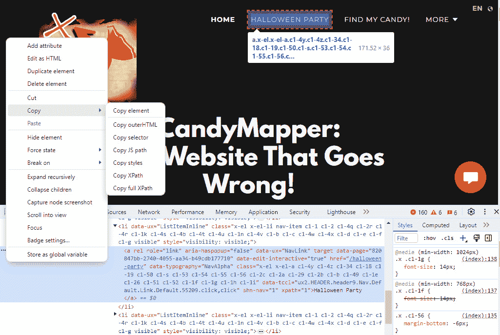

# 第十一章：回声定位 - 跳过页面对象模型

到目前为止，我们使用**页面对象模型**（**POM**）来封装页面内的 UI 元素和交互。我们通常可以用 XPath 或 CSS 定位器清楚地看到我们的目标目标，但考虑一下那些在黑暗中盲目完成任务的超人。虽然 POM 有很多优点，但在某些情况下，仅根据一些线索在黑暗中通过文本找到对象可以提供优势：

+   **快速原型设计和简化测试创建**：对于快速且简单的测试或原型设计，建立包含数千个对象的完整 POM 可能有些过度。在这种情况下，直接定位元素可以加快初始测试开发过程。

+   **处理动态内容的元素**：在现代 Web 应用程序中，内容可能非常动态。元素可能没有固定的 ID、类或其他属性。文本内容在 DOM 背后的后期版本中通常更稳定。

+   **代码可读性**：使用直接文本查询编写的测试有时可能更易读且更具自解释性。任何阅读测试的人都可以理解正在模拟的用户交互，而无需深入研究页面对象来了解每个方法的作用。

在本章中，我们将介绍以下主要内容：

+   减少的代码库

+   使用纯英文进行自动化

+   通过名称获取可见的按钮、字段和列表

+   从集合中获取可见元素

# 减少的代码库

跳过 POM 减少了需要维护的代码量。这在小型项目或概念验证实现中尤其有益，在这些项目中，快速开发比长期可维护性更重要。

虽然“基于文本”的方法有其优点，但重要的是要注意，这并不是一个一刀切解决方案。它的目的是保持高度可靠性，减少维护所需的数量。

在本章中，我们将通过仅传递文本来增强我们的元素定位。使用的方法将提供有关要考虑的节点类型的线索。如果我们只需将`setValueAdv("First name", "Paul")`点击到**名字**字段，或者甚至从**客人数量**列表中选择**2**，这意味着什么呢？

我们将增强我们的三个自定义函数，使它们能够仅基于字符串识别元素。除了传递一个对象外，一个简单的文本字符串还将传递给`clickAdv()`、`setValueAdv()`和`selectAdv()`方法。这样，我们可以完全消除一些页面对象。

本章将介绍以下主要内容：

+   使用纯英文进行自动化

+   点击一个命名的按钮或链接

+   在一个命名的字段中输入文本

+   从一个命名的列表中选择一个项目

+   追踪超过三层深度的兔子洞

# 使用纯英文进行自动化

我们将继续进一步修改我们的自定义方法，允许传递两种不同类型的类。我们的方法仍然支持`WebdriverIO WebElement`，但现在，我们将通过字符串来增强它们。例如，假设我们想点击 CandyMapper 网站顶部的**万圣节派对**按钮。考虑以下代码：



图 11.1 – HALLOWEEN PARTY 链接的 DevTools 视图

这是 POM 方法来查找链接：

```js
public get btnHalloweenParty () {
   return $(`#nav-55206 > li:nth-child(2) > a`);
}
Helpers.clickAdv (btnHalloweenParty);
```

通过使用 echo 位置超级能力，这一行代码可以足够智能，只需这一行就能找到正确的链接：

```js
Helpers.clickAdv ("Halloween Party");
```

或者，你可以在字段中输入电子邮件：

```js
Helpers.setValueAdv ("Email", "me@mydomain.com");
```

你还可以添加总共两名客人陪你参加派对：

```js
Helpers.selectAdv ("Guests","2");
```

现在，我们可以增强该方法，使其沿着一个路径分割，该路径可以是对象或字符串；在这种情况下，我们可以使用我们的`getValidObject()`来返回包含该字符串的可见元素集合。此外，我们可以根据被调用的动作的动词推断要查找的元素类型。`ClickAdv()`将查找按钮、链接和类似元素。`SetValue()`将查找输入字段或`textarea`节点。`SelectAdv()`将与列表交互。

快速提示

虽然我们可以将此扩展到我们的`assertAdv()`函数，但这是不建议的。问题是带有字符串的`assertAdv()`函数需要更多的上下文。几乎不可能确定我们是在验证按钮状态、字段值、列表项或某些显示的文本。最好是保持简单，只确认我们寻求的文本在页面上是可见的，并突出所有潜在的匹配项。对于其他任何内容，只需传递`WebElement`类。

我们的第一步是扩展一个代码路径，该路径将在`clickAdv()`方法中与`WebElement`和字符串交互。这个过程将适用于`getValidElement()`函数，我们将在下一节中这样做。最后，`SetValueAdv()`和`Selectadv()`函数将使用`getValidElement()`中的相关部分进行修改。

## 获取命名的按钮

在这三个自定义函数中的每一个，我们将扩展传递给元素的类型，包括这样的字符串：

```js
export async function clickAdv(
element: WebdriverIO.Element | string,
text: string ) {
```

如果传递了一个字符串，我们将使用它来识别传递的类型的有效元素：

```js
// If button element is a string, find the elements using the string
if (typeof element === 'string') {
element = await getValidElement(element, "button");
}
```

在这个例子中，我们提供了一个线索，这个元素将是一个按钮。接下来，我们将以相同的方式返回一个设置值的字段。

## 获取命名的输入字段

同样，我们将以类似的方式修改`setValueAdv`。然而，我们将指示`getValidElement`寻找输入或`textarea`字段类：

```js
export async function setValueAdv(
inputField: WebdriverIO.Element | string,
text: string ) {
// If inputField is a string, find the elements using the string
if (typeof inputField === 'string') {
inputField = await getValidElement(element, "field");
}
```

与最后两个函数一样，我们将使用一个最终的线索字符串来扩展`selectAdv()`。

## 获取命名的列表

最后，`selectAdv()`也将被修改。可能匹配的元素类型将被列出：

```js
export async function selectAdv(
inputField: WebdriverIO.Element | string,
text: string ) {
// If inputField is a string, find the elements using the string
if (typeof inputField === 'string') {
inputField = await getValidElement(inputField, "list") as Element;
}
```

现在这些三种方法都已更新，我们需要增强`getValidElement()`方法，使其返回适合每种动词类型的元素。

# 通过名称获取可见按钮

`getValidElement()` 方法的第一项改进是允许传递一个字符串，就像前三个方法一样：

```js
export async function getValidElement(
  element: WebdriverIO.Element | String,
  elementType: string
): Promise<WebdriverIO.Element> {
```

我们可以执行的第一项检查是查看是否有任何元素可能匹配我们想要寻找的内容。在这种情况下，我们可以再次利用 XPath 和 CSS 定位器。这个 XPath 定位器将寻找包含传递给方法的文本的任何节点：

```js
if (typeof element == "string") {
    // Try finding "Halloween Party" element by xPath text
    elements = await browser.$$(`//*[contains(normalize-space(),'${eleText}')]`)
```

如果没有返回元素，将进行第二次尝试，使用 CSS 选择器并利用 `href` 属性。这个属性通常包含以连字符为导向的小写文本字符串：

```js
    // No such elements by element
    if (elements.length == 0) {
      //Try finding CSS href contains "halloween-party"
     const elements = await browser.$$(`[href*='${eleText}.toLowerCase().replaceAll(" ", "-")}']`)
    }
```

现在，我们有三种类型的元素需要处理。让我们分别处理每一个，从点击按钮开始：

```js
If (elements.length > 0 and elementType === "button"{
let buttonElements = await browser.$$(`(//a|//button)[contains(normalize-space(),'${element}')]`)
    }
```

如果这仍然没有返回匹配的元素，我们可以尝试这个不区分大小写的方案：

```js
 if (elements.length === 0) {
let buttonElements = await browser.$$(` (//a|//button)[contains(translate(normalize-space(text()), 'ABCDEFGHIJKLMNOPQRSTUVWXYZ', 'abcdefghijklmnopqrstuvwxyz'), '${element}')]
`)
}
```

现在，我们有很好的机会仅基于传递给函数的字符串找到按钮。让我们也以相同的方式处理输入字段和文本区域。

# 通过名称获取可见字段

接下来，我们必须收集一系列字段：

```js
If (elements.length > 0 and elementType === "field"{
elements = await browser.$$(`//label[
normalize-space()='${element}']//preceding::input `)
    }
```

如果没有匹配项，我们将再次尝试找到与标签相关的文本区域：

```js
If (fieldElements.length === 0 and elementType === "field"{
elements = await browser.$$(`//label[normalize-space()='${element}']//preceding::textarea`)
}
```

最后，我们将对一系列列表执行相同的操作。

# 通过名称获取可见列表

接下来，我们将尝试根据文本找到列表元素：

```js
If (lelements.length > 0 and elementType === "list"{
elements = await browser.$$(`//select[@id='${element}'] `)
    }
If no Select element matches that we take a second chance by searching for by the name attribute.
If (elements.length === 0 and elementType === "list"{
elements = await browser.$$(`//select[@name='${element}'] `)
    }
///
```

如果没有 `Select` 元素与这些匹配，我们将通过搜索与标签相关的组合框进行最后的尝试：

```js
If (elements.length === 0 and elementType === "list"{
listElements = await browser.$$(`//label[contains(@for,'#{element}')]/following::select`)
    }
```

我们还没有完成。必须对返回的元素集合进行过滤以确定其可见性。

# 从集合中获取可见元素

现在我们有一系列潜在元素，我们将解析它们以找到第一个可见的元素：

```js
for (let element of elements) {
const tagName = await element.getTagName();
// const tagName = await element.getAttribute('class'); // Alternate class match
await element.waitForDisplayed({ timeout: 0 });
const isVisible = await element.isDisplayed();
// const isVisible = await highlight(element);
// Alternate visible validation.
If (isVisible)
//Found a matching button or an element with anchor class. Exiting loop
break;
}
```

到这一点，我们已经对被引用的元素做出了合理的猜测。我们只需要从调用方法中返回要交互的元素：

```js
return element;
}
```

到这一点，你可能看到了进一步识别集合的方法，我们鼓励你修改两个或三个示例定位器以适应你特定的框架，但...

# 小心无底洞！

当我们接近本节的结尾时，你可能已经注意到我们没有给出超过三个示例来动态地通过文本定位多个节点。而且有很好的理由。你可能会花费数小时试图找到第五个或第六个模板，它将返回完美的元素集合。我们建议将搜索限制在三次尝试之内。深入这个兔子洞不值得，这会降低准确性并减慢结果搜索时间。

# 摘要

在本章中，我们展示了如何仅使用字符串动态定位元素，就像超级英雄利用敏锐的感官仅凭轮廓就能定位恶棍一样。我们利用每个动作的线索，缩小潜在元素的范围，只关注与请求的动作相关的元素，就像超级英雄锁定目标一样。最后，我们为识别有效元素尝试的次数设定了上限，这类似于超级英雄在改变策略之前可能会限制他们的搜索努力。

在下一章中，我们将探讨如何将我们的测试扩展到多个环境，类似于超级英雄如何适应大都会不同郊区的各种挑战。
