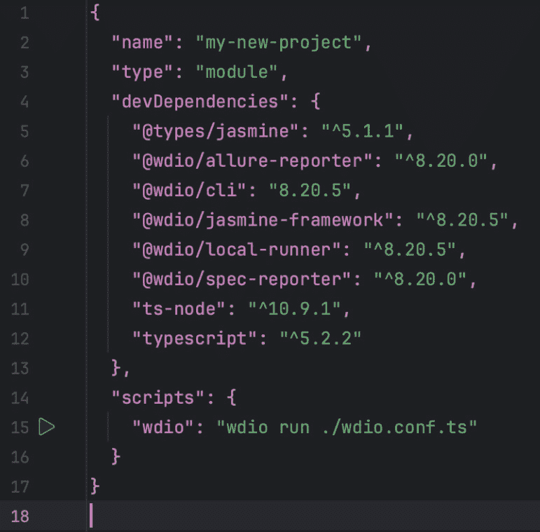
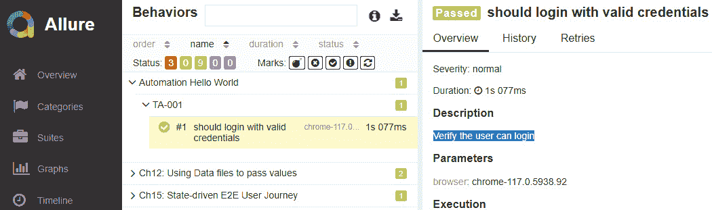

# 第十二章：超级英雄着陆 – 设置灵活的导航选项

我们超级英雄框架着陆的城市总是在变化，他们在巡逻时往往不知道他们面临的是什么。我们的下一步是使着陆页 URL 更加灵活。我们需要能够从 QA 环境切换到预发布环境。同时，它们应该足够健壮，能够处理小的差异。在本章中，我们将探讨处理存在于一个发布或环境中的元素，但在另一个环境中不存在的元素。此外，我们还将增强日志包装器，以包含颜色。

我们将涵盖以下主要主题：

+   使用系统变量

+   添加数据配置文件

+   配置 allure 报告

快速提示

避免在开发环境中进行测试，因为那里会不断发生变化。集中精力在 QA 和预发布环境中。承诺在开发环境中保持测试运行状态将产生更多的维护时间。更多的维护意味着更少的时间来创建新的测试和分析现有结果，这意味着更多的错误会滑入生产环境，增加了我们资金流失的风险。如果当权者坚持，请明确指出可以提供 4-10 个测试的小子集，仅为了给开发者一个关于其环境状态的“温暖舒适”感。我们确实希望左移，但过度分散我们的团队将适得其反。

# 技术要求

所有测试示例都可以在这个 GitHub 仓库中找到：[`github.com/PacktPublishing/Enhanced-Test-Automation-with-WebdriverIO`](https://github.com/PacktPublishing/Enhanced-Test-Automation-with-WebdriverIO)。

# 使用系统变量

当从命令行运行我们的测试时，我们可以轻松设置用户变量来指示要使用或运行的测试环境。这可以通过环境变量 `{``process.env.ENV}` 来完成：

```js
> Env=dev
```

这个变量可以在我们的框架内部读取，并将我们的登录方法重定向到正确的环境，如下所示：

```js
prod=www.candymapper.com
dev=www.candymapperr2.com
```

快速提示

在生产环境中测试时要格外警惕。与领导讨论它可能产生的影响。使用低效的 SQL 调用减慢生产数据库，返回一百万结果将会掩盖任何发现的错误。设置你的作业运行时，使用标记来指示你的生产环境的安全测试用例。

# 添加数据配置文件

传说中，数据文件是由一位聪明而神秘的科学家创建的，他的名字只有知道其存在的人才会低声耳语。据说它们包含着古老的知识、神圣的算法和隐藏的代码，可以解开被测试应用程序的奥秘。

## 测试使用的数据存储位置

使用 TypeScript 将数据文件添加到你的测试代码中，与 JavaScript 的做法完全一样，但使用 TypeScript，你可以利用 TypeScript 的静态类型和模块，这有助于你提前捕获类型相关的错误，使你的测试更加健壮和易于维护。

## 组织测试数据

首先，创建一个目录来存储您的测试数据文件。您可以将其命名为`test-data`或`shared-data`。将您的数据文件（例如 JSON、CSV 等）放在此目录中。

## 设置 TypeScript 配置

确保您的 TypeScript 配置（`tsconfig.json`）包括测试文件和模块的适当设置。以下是一个示例：

```js
   // Json file
   {
     "compilerOptions": {
       "target": "es6",
       "outDir": "./dist",
       "esModuleInterop": true
     },
     "include": ["src", "shared-data", "tests"]
   }
```

在`tsconfig`文件的`include`部分包含`test-data`目录和`tests`目录。

## 从文件中读取数据

在这里，我们使用`fs`模块从文件中读取数据：

```js
   import * as fs from 'fs';
   const jsonData: string = fs.readFileSync('./shared-data/data.json', 'utf-8');
   const parsedData: MyDataInterface = JSON.parse(jsonData);
```

一旦我们有了文件系统对象，我们就可以开始构建数据驱动的测试

## 在测试中使用测试数据

在您的测试文件中，您可以导入必要的数据并在测试用例中使用它，如下所示：

```js
   import { expect } from 'expect-webdriverio';
   import { someFunction } from '../src/someModule';
   import testData from '../shared-data/data.json';
   describe('someFunction', () => {
     it('should return the correct value', () => {
       const result = someFunction(testData.input);
       expect(result).toEqual(testData.expectedOutput);
     });
   });
```

在前面的例子中，我们从共享数据目录中的`data.json`文件中拉取了一些数据。然后，将这些输入数据与实际结果进行比较，断言这些值是否匹配。

## 不仅仅是掩码 – 使机密数据不可见

如前所述，超级英雄们通常会采取各种措施来保护他们的身份，例如戴口罩或戴上一副眼镜。但如果是真的想保持低调，没有什么比一个秘密库更有效了。

使用数据文件来存储诸如用户名和访问密钥之类的机密信息在今天非常普遍。出于安全原因，这些信息**决不**应上传到您的代码仓库。一个优秀的 DevSecOps 团队会解析 GitHub 和 GitLab 仓库，寻找诸如“password”之类的术语，并在找到任何匹配项时标记您的团队，指出其不符合**系统与组织控制 2**（**SOC II**）的要求。

在项目的基础目录中创建一个`.env`文件来存储所有您的机密数据，完成后将`dotenv`添加到您的依赖项中。这将使`process.env`能够访问`.env`文件中的所有数据：

```js
// content of .env
# LambdaTest Credentials
 LT_USERNAME=LT_USERNAME
 LT_ACCESS_KEY=LT_ACCESS_KEY
 LT_HOST_URL=LT_HOST_URL
```

为了做到这一点，我们需要另一个名为`dotenv`的 node 包。这个包允许开发者将配置数据存储在名为`.env`的纯文本文件中。`.env`文件中的每一行通常代表一个形式为`KEY=VALUE`的环境变量，例如`API_KEY=your_api_key_here`。安装它很简单：

```js
> yarn add dotenv
```

接下来，我们将此放在`wdio.config`文件中`import`语句的下方：

```js
require('dotenv').config()
// usage in wdio config
module.exports = {
   // ….
   user: process.env.LT_USERNAME,
   key: process.env.LT_ACCESS_KEY,
   // ….
};
```

在这种情况下，我们创建一个系统变量来保存`LT_USERNAME`和`LT_ACCESS_KEY`。这就是我们传递敏感数据而不在仓库中存储我们的凭证的方式。

## Spec 和 Allure – 立方记者与明星记者

在许多漫画书中，有几位记者记录了城市中的重大事件和犯罪。新手记者为我们的超级英雄提供内部知识以拯救世界，而明星记者则提供引人注目的头版标题。Spec 和 Allure 报告器是 WebdriverIO 中的类似报告机制。它们具有不同的功能并提供不同级别的详细信息。Spec 报告器最适合 SDETs 在测试过程中即时调试失败的测试运行。它告诉你测试是否通过或失败，显示测试的名称，并报告运行时间。如果测试失败，Spec 报告器在控制台中提供错误消息和堆栈跟踪。这为你提供了对所发生情况的即时理解，但需要你自己提供关于测试运行的深入上下文数据。

Allure 提供了适合向项目经理和高级管理人员展示结果的炫目历史图表。它超越了基础功能，为你提供更全面的视角。它生成一份时尚且信息丰富的报告，包含大量附加信息，例如以下内容：

+   测试和套件描述

+   在失败时附加截图

+   将文本/plain 上下文附加到测试报告中

+   使用 BDD 标签和严重性标记你的测试

+   对常见应用程序区域的测试进行测试用例分类

+   趋势历史和故障分析

+   环境信息

因此，Allure 报告器提供的报告比 Spec 报告器更丰富、更详细。它允许更好地理解测试过程中发生的事情，并提供对你测试套件的更全面视图。你可以将其视为简单标题（Spec 报告器）与包含照片、分析和背景的完整新闻文章（Allure 报告器）之间的区别。

第一步是将 Allure 添加到我们的项目中：

```js
> yarn add @wdio/allure-reporter
> yarn add allure-commandline
```

然后，在`wdio.conf.ts`文件中，我们将添加以下配置：

```js
    reporters: ["spec", ["allure",
    {
       outputDir: "./reports/allure-results",
       disableWebdriverStepsReporting: false,
       disableWebdriverScreenshotsReporting: false,
     }]],
```

本节指导了报告细节的存储位置，并包括两个可启用或禁用的选项。默认情况下（`false`），这两个选项都是启用的，允许 Allure 提供详细的逐步报告，并包含相关的截图，以增强测试结果的可视性和可理解性。禁用这些选项的唯一原因可能是为了节省磁盘空间，这并不推荐。从生成的报告中排除 Webdriver 步骤报告和截图报告只会使我们的分析工作更难。

# 配置 Allure 报告

如果你之前没有将`Allure`设置为报告器，可以手动完成。这是一个两步过程：`Allure`，跳转到*步骤 2*：

1.  要安装 Allure，请输入以下命令：

    ```js
    > yarn add @wdio/allure-reporter
    ```

    这将安装 Allure 作为`devDependancies`。我们可以验证该包是否已添加到`package.json`文件中。



图 12.1 – Allure 报告器依赖项添加到 package.json

1.  Allure 包被添加到开发依赖中。接下来，必须在 `wdio.config.ts` 中配置 HTML 报告和屏幕截图的输出目录：


图 12.2 – 将 Allure 配置添加到 wdio.config.ts 文件中

在 `wdio.config.ts` 文件中，`outputDir` 指定了 HTML 文件和屏幕截图的存储位置。让我们使用 `allure-results`。现在再次运行测试：

```js
> yarn wdio
```

这将启动 `example.e2e.ts` 测试。它还会在 `allure-results` 文件夹中生成结果，供 Allure 构建仪表板。


图 12.3 – Allure 创建 HTML 报告页面的新支持文件

1.  要显示结果，请输入以下命令：

    ```js
    > allure generate -–clean && allure open
    ```

1.  Bash 终端也可以执行这样的组合语句：

    ```js
    > allure generate –clean; allure open
    ```

我们已经安装并配置了 WebdriverIO 和 Allure 仪表板服务，以便为我们的利益相关者展示美观的结果图表。但在测试自动化中，有一个恒定不变的因素，那就是变化。我们需要保持所有支持包的版本更新。如果有冲突，肯定会有麻烦。幸运的是，有一个简单的解决方案。

这些信息不需要存储在仓库中，所以我们将将其添加到我们的 `.gitignore` 文件中：

```js
allure-report
allure-results
Screenshots
```

在每个测试的顶部，我们应该保持一致地使用 Allure 报告标签，以帮助在报告中组织和分类我们的测试用例。这包括测试所有者（作者）、功能、故事和描述的标签。高级报告可以包括使用 TMS 链接回 Jira 任务的链接。让我们从 `Owner` 标签开始：

```js
AllureReporter.addOwner("Paul Grossman");
```

任何超级英雄最想回答的第一个问题是，“是谁干的？”在早期章节中，我们提到代码可以快速通过 GitLens 追踪到其所有者。由于测试的原作者最了解他们所编写的测试，因此团队成员应该养成在所编写的每个测试中添加他们名字的习惯。接下来，我们需要按功能组织我们的测试：

```js
allureReporter.addFeature("Automation Hello World");
```

![图 12.4 – 在“Automation Hello World”功能下显示的一个通过测试的 Allure 报告]


图 12.4 – 在“Automation Hello World”功能下显示的一个通过测试的 Allure 报告

一个 `Feature` 标签描述了应用程序的哪个区域正在被这个和其他测试所测试。测试用例可以被分组以更有效地执行。这可以是一个只与一个区域相关的测试的小子集。这将消除通过冒烟测试和回归测试套件分离测试的需要。测试还需要有关测试本身功能的一些细节。

这是向报告中测试添加描述性标签名称的命令：

```js
AllureReporter.addDescription("Verify the user can login");
```

这个描述可以在以下屏幕截图中看到，用蓝色突出显示。

![图 12.5 – 描述表明测试将断言登录功能]



图 12.5 – 描述表明测试将断言登录功能

`Description`标签是测试本身执行的验证的摘要。这通常是从问题跟踪工具中引用现有手动测试的条目标题逐字复制。它也可能是另一个自动化项目的条目标题，该条目链接到另一个项目中单独的手动测试。这些条目编号应与`Story`可追溯性标签匹配。

这就是我们将故事描述添加到测试报告中的方法：

```js
allureReporter.addStory("TA-001");
```

然后将这些信息附加为测试的名称。


图 12.6 – 添加了 Jira 条目引用的“TA-001”故事

测试需要与个别故事详细信息进行可追溯性。在故事条目中重复文本几乎没有意义，因此只需提供条目编号就足够了。它可以被附加到浏览器中保存的 URL 上，以便快速查找。

## 添加自定义注释到 Allure 报告中

在*第八章*中，我们讨论了为`Expect`创建包装器。我们可以使用`addattachment()`函数添加自定义报告：

```js
allureReporter.addAttachment('Assertion Failure: ', `Invalid Assertion Type = ${assertionType}`, 'text/plain');
```

在这个例子中，我们故意使用一个无效的断言动词`equa`来失败。`expectAdv`向 Allure 报告详细错误，描述了原因。


图 12.7 – 报告错误的问题字符串“equa”

最好的建议是尽可能高效。可追溯性可以与单个描述结合：

```js
AllureReporter.addDescription("TA-001 : Verify the user can login");
```

在`Log`包装器内部，我们可以向两个报告者提供详细信息。但不是所有内容。那会导致信号与噪声比很高。所以，我们只记录错误和警告：

```js
let SEND_TO_ALURE = false
```

此外，Spec 报告者可以通过一些颜色变得更加引人注目。假设我们希望任何表示结果通过的文字在控制台中显示为绿色，而失败的测试显示为红色。`Log`包装器可以修改为监视`PASS:`和`FAIL:`文本。这些字符串可以由带有 ANSI 颜色标记的行包围。

首先，让我们将`Allure`添加到我们的项目中：

```js
const { addFeature, addDescription } = require('@wdio/allure-reporter').default;
describe('My feature', () => {
    it('should do some things', () => {
        browser.url('https://webdriver.io');
        // Add a step to the report
        addFeature('Navigate to WebdriverIO website');
        browser.url('https://webdriver.io');
        // Add a description to the report
        addDescription('This is a description of what the test should         do');
    });
});
```

接下来，让我们确定我们的辅助文件顶部的基本颜色，从绿色开始：

```js
const ANSI_GREEN = `\x1b[38;2;140;225;50m` // PASS
```

颜色转义序列在此分解：

+   `\x1b`是转义字符，它启动了序列。

+   `[`是**控制序列引入符**（**CSI**），它告诉终端将以下字符解释为命令。

+   `38`是自定义 ANSI 颜色的`前景`文本。`48`设置背景颜色。使用 30-37 设置颜色为八种默认前景颜色之一，使用 40-47 设置八种默认背景颜色之一。

+   `2`指定颜色将使用 RGB 值设置为浅色。其他选项包括`3`用于斜体，`5`和`6`用于闪烁文本，`7`用于反色文本，以及`9`用于删除线文本。

+   `140;225;50` 分别是红色、绿色和蓝色的值，用于设置颜色。在这种情况下，它们定义了一种绿色。

+   `m` 是最后一个字符，它标志着转义序列的结束。

如您所见，我们可以在文本的颜色和格式上非常具有创意。接下来，我们为失败的消息添加红色，为警告消息添加黄色：

```js
const ANSI_RED= `\x1b[38;2;145;250;45m`    // FAIL
const ANSI_YELLOW = `\x1b[38;2;145;226;45m`  // WARNING
```

当我们输出定位器时，它们也应该有自己的颜色：

```js
const ANSI_PURPLE= `\x1b[38;2;250;235;80m`  // Locator
```

任何用单引号括起来的文本也可以自动格式化为自己的颜色：

```js
const ANSI_WHITE= `\x1b[97m`  // TEXT entered into a field
```

最后，我们希望将任何颜色设置重置为默认值，以便我们可以区分来自我们的框架和 WebdriverIO 的消息：

```js
const ANSI_RESET= `\x1b[0m` //Reset
```

这些颜色可能并不适合每个人。您可以在以下位置找到一组 ANSI RGB 颜色组合，以便根据您的喜好进行自定义：[`github.com/hinell/palette-print.bash`](https://github.com/hinell/palette-print.bash)。

现在，让我们增强日志包装器以获取一些颜色：

```js
if (message.includes("Warning: ")) {
    message = ANSI_YELLOW + message + ANSI_RESET
    SEND_TO_ALLURE = true
else if (message.includes("Error: ") || message.includes(Promise"){
    message = ANSI_RED + message + ANSI_RESET
    SEND_TO_ALLURE = true
} else {
   message = ANSI_GREEN + message + ANSI_RESET
}
```

当我们使用重音符号输出字符串时，我们可以唯一地识别它们并将它们着色：

```js
message  = message .replace(/`([^`]+)`/g, `${ANSI_WHITE}$1${ANSI_RESET}`);
```

我们还可以从日志方法中嵌入我们的 xPath 定位器的颜色：

```js
message = message.replace(/\/{1,2}[\w\-\.\:]*\[[^\]]*\]/g, `${ANSI_PURPLE}$1${ANSI_RESET}`);
```

同样的，CSS 定位器也是如此：

```js
message = message.replace(/[#.|]?[a-zA-Z]+\s?)+[{] /g, `${ANSI_PURPLE}$1${ANSI_RESET}`);
```

现在，当传递结果时，它可以根据内容在运行时以颜色显示：

```js
global.log(`FAIL: Invalid Assertion Type = ${assertionType}`);
```

但从 `Click`、`Select`、`Enter` 和 `Expect` 方法包装器中这样做会更可靠。

最后，我们可以将任何错误日志重定向到 Allure 报告，如下所示：

```js
if (SEND_TO_ALURE){
addStep(str);
}
```

## Webhooks 和屏幕截图

我们的最后一步是在测试用例的末尾添加屏幕截图。您可以选择是否只在失败的测试用例上捕获屏幕截图。然而，根据我们的经验，我们认为无论是否失败都捕获屏幕截图将给您提供机会，在查看 Jenkins 中保存的历史运行时，了解通过和失败之间的差异：

```js
    /**
     * Function to be executed after a test (in Mocha/Jasmine only)
     * @param {object}  test             test object
     * @param {object}  context          scope object the test was executed with
     * @param {Error}   result.error     error object in case the test fails, otherwise `undefined`
     * @param {*}       result.result    return object of test function
     * @param {number}  result.duration  duration of test
     * @param {boolean} result.passed    true if test has passed, otherwise false
     * @param {object}  result.retries   information about spec related retries, e.g. `{ attempts: 0, limit: 0 }`
     */
    afterTest: async function (
        test,
        context,
        {error, result, duration, passed, retries}
    ) {
      if (!passed) {
        await browser.takeScreenshot();
      }
    },
```

这是通过将前面的代码行添加到 `WDIO.config` 文件的 `afterTest` 钩子中实现的。

注意

`onPrepare`、`onWorkerStart`、`onWorkerEnd` 和 `onComplete` 钩子在不同的进程中执行，因此不能与其他钩子共享任何全局数据，这些钩子位于工作进程中。

# 摘要

在本章中，我们踏上了类似穿越超级英雄多元宇宙动态领域的英勇之旅。我们掌握了将测试场景引导到各种操作域的艺术——无论是 QA、预发布，还是当情况需要时，开发甚至生产。与此同时，我们向控制台日志中注入了一道彩虹般的色彩，就像一位斗篷骑士的鲜艳服装。我们的 Allure 报告，就像一个精心组织的工具带，现在以精确和清晰的方式显示信息。我们还解锁了数据文件的力量，保护了我们数字城市的钥匙——敏感凭证——免受邪恶敌人的窥视。

在这些多样化的环境中导航，如同守护者穿越平行宇宙的复杂任务——每个环境在轮廓上都很熟悉，但在内容上却独一无二。随着我们准备进入下一章节，我们将用超级英雄盾牌的韧性加固我们的测试，确保它们能够经受住可能已消失在虚空的缺失元素的考验。此外，我们将拓宽我们的视野，进入广阔的跨浏览器测试领域，确保我们的数字努力像变形英雄的能力一样多变。
