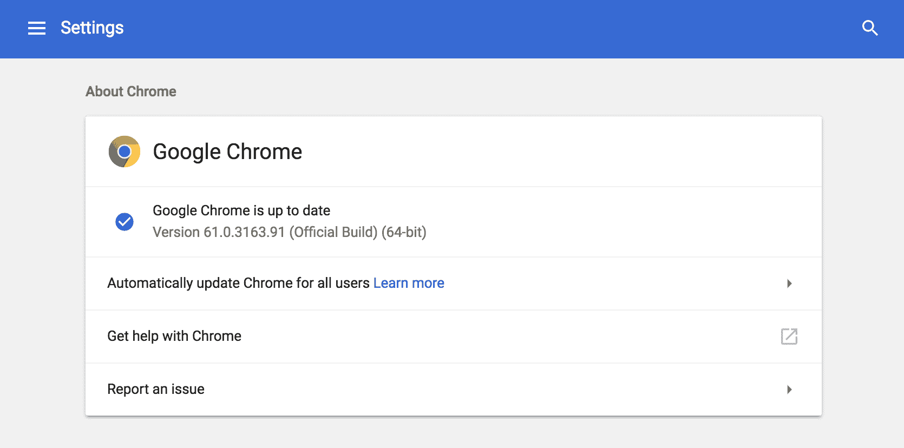
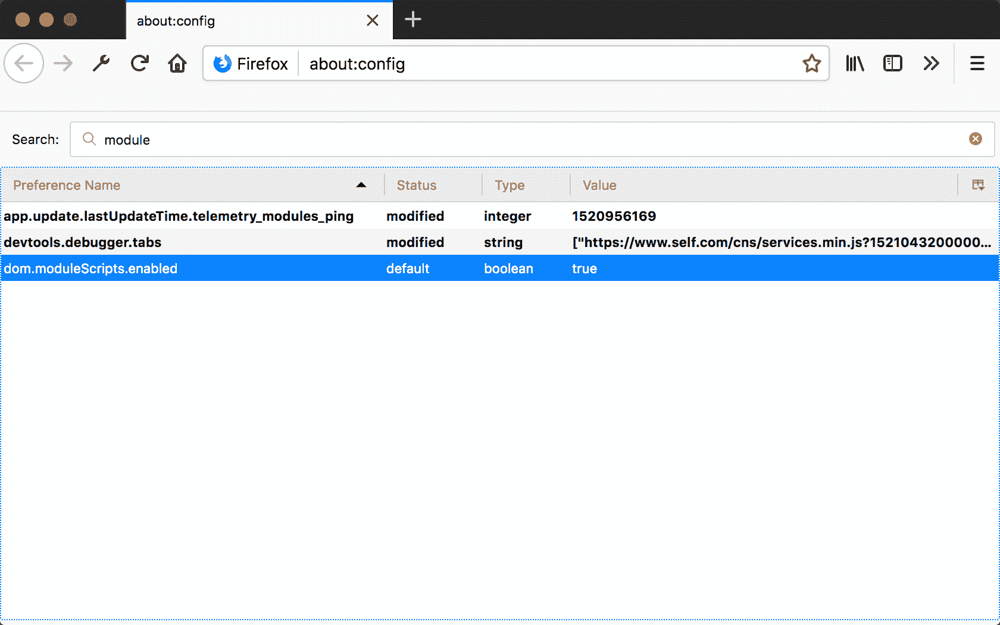
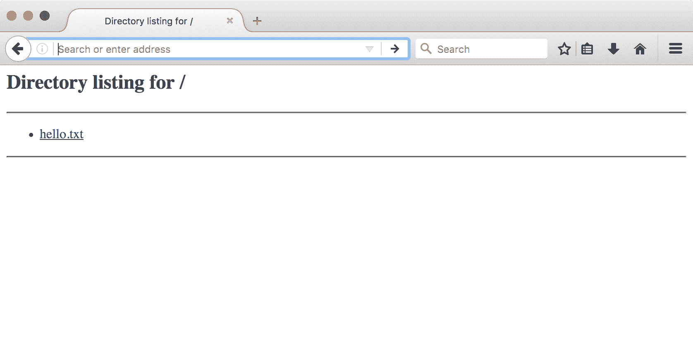
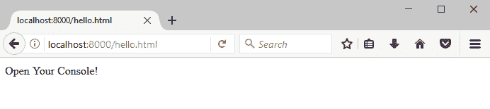
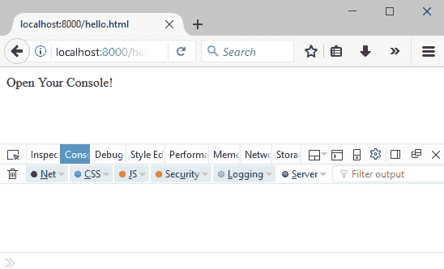
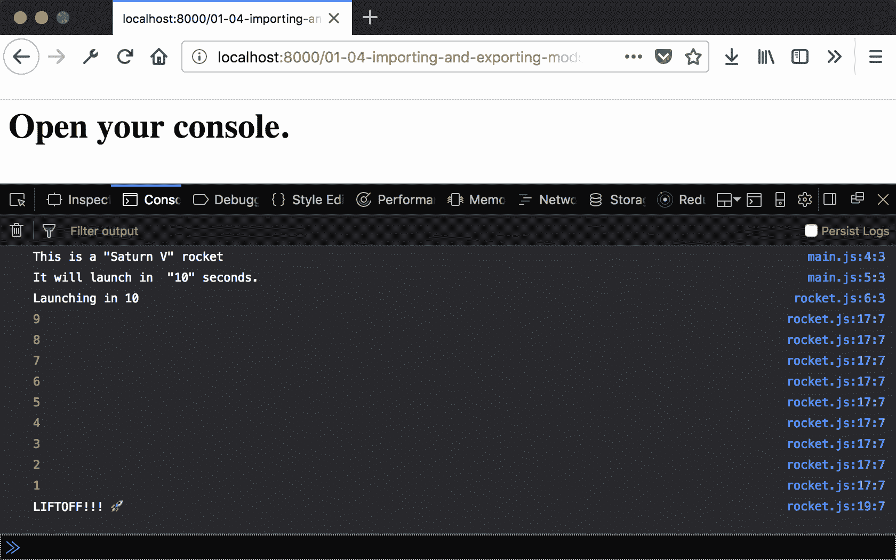
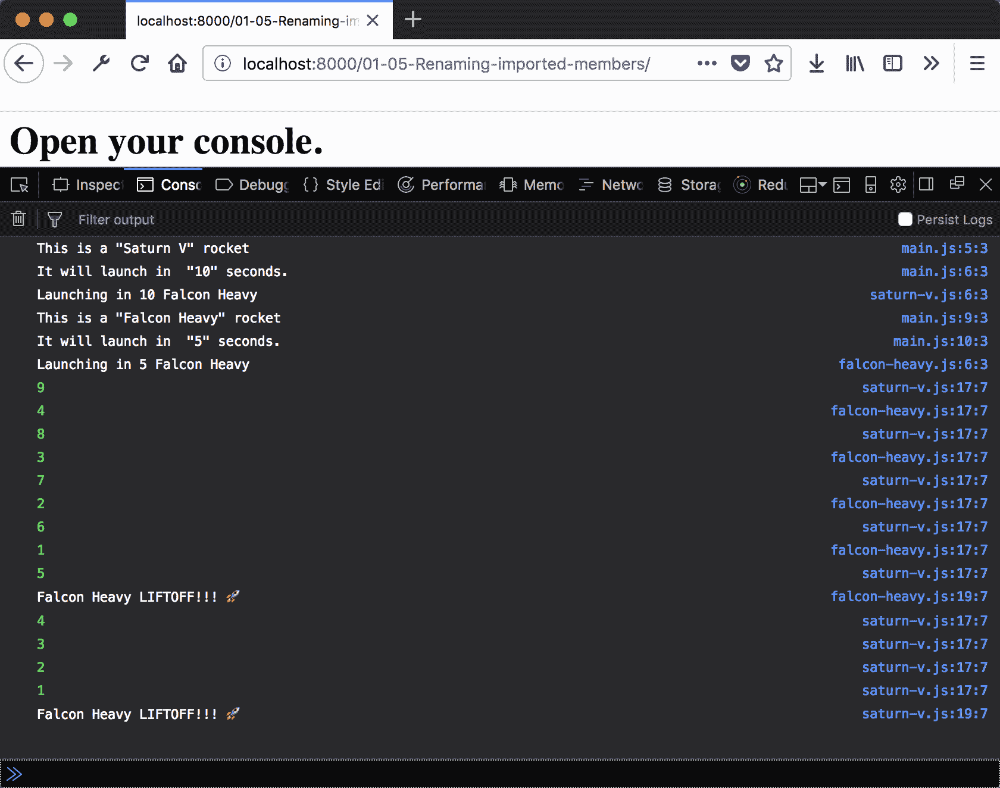
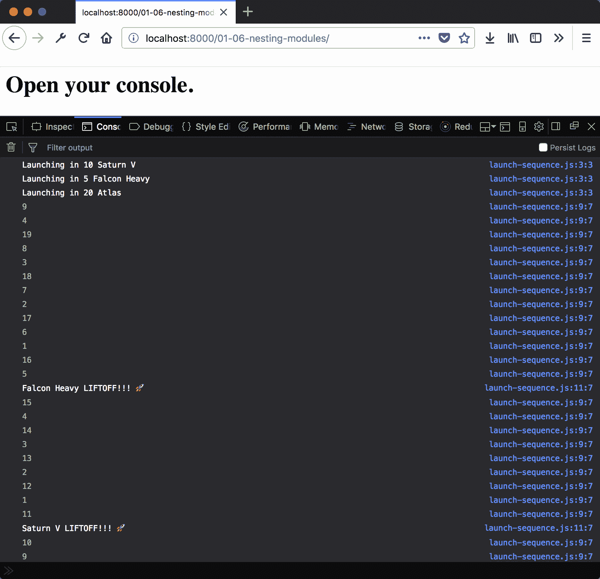

# 第一章：使用模块构建

在本章中，我们将介绍以下内容：

+   安装和配置浏览器—Chrome 和 Firefox

+   安装 Python，使用 SimpleHTTPServer 来托管本地静态文件服务器

+   创建一个加载 ECMAScript 模块的 HTML 页面

+   导出/导入多个模块以供外部使用

+   重命名导入的模块

+   在单个命名空间下嵌套模块

# 简介

JavaScript 是最著名的遵循 ECMAScript 标准的语言。该标准是在 20 世纪 90 年代末期创建的，目的是为了指导语言的发展。在早期，发展缓慢，在前二十年里只有四个主要版本达到了生产阶段。然而，随着曝光度的增加，这很大程度上得益于 Node.js 运行时的普及，发展速度显著加快。2015 年、2016 年和 2017 年每年都发布了新的标准版本，2018 年也计划发布另一个版本。

在所有这些发展之后，现在是 JavaScript 开发者激动人心的时刻。许多新的想法来自其他语言，标准 API 正在扩展以提供更多帮助。本书专注于可以在 JS 的新版本以及未来版本中使用的新特性和技术。

从历史上看，创建跨越多个文件的 JavaScript 程序一直是一种痛苦的经历。最简单的方法是将每个文件包含在单独的 `<script>` 标签中。这也要求开发者正确地定位这些标签。

不同的库试图改善这种情况。RequireJS、Browserify 和 Webpack 都试图解决 JavaScript 依赖项和模块加载的问题。这些都需要某种形式的配置或构建步骤。

近年来，情况有所改善。浏览器制造商合作创建 ECMAScript 规范。然后，制造商需要实现符合该规范的 JavaScript 解释器（实际运行 JavaScript 的程序）。

正在发布支持原生 ECMAScript 模块的浏览器新版本。ECMAScript 模块提供了一种优雅的包含依赖项的方法。最好的是，与之前的方法不同，模块不需要任何构建步骤或配置。

本章中的食谱主要关注安装和配置 Chrome 和 Firefox 网络浏览器，以及如何充分利用 ES 模块和导入/导出语法。

# 安装和配置 - Chrome

后续的食谱将假设一个能够使用 ES 模块的环境。有两种策略可以实现这一点：创建一个构建步骤，将所有使用的模块收集到一个文件中以便浏览器下载，或者使用能够使用 ES 模块的浏览器。这个食谱演示了后者选项。

# 准备工作

要逐步完成此菜谱，您需要一个由 Chrome 支持的操作系统（OS）（不是 Chromium）。它支持 Windows 和 macOS 的最新版本，以及大量 Linux 发行版。如果您的操作系统不支持此浏览器，您可能已经知道了这一点。

# 如何操作...

1.  要下载 Chrome，将您的浏览器导航到以下位置：

    [`www.google.co.in/chrome/`](https://www.google.co.in/chrome/)

1.  点击下载并接受服务条款。

1.  安装程序下载完成后，双击安装程序以启动它并按照屏幕上的说明操作。

1.  检查 Chrome 版本，打开 Chrome 浏览器，并输入以下 URL：

    `chrome://settings/help`。

1.  您应该看到版本号，数字为 61 或更高。请参阅以下截图：



# 工作原理...

Chrome 的当前版本默认启用 ES 模块。因此，无需配置或插件即可使其工作！

# 更多内容...

在撰写本文时，只有少数浏览器支持 ECMAScript。您可以在[`mzl.la/1PY7nnm`](https://mzl.la/1PY7nnm)页面上的浏览器兼容性部分查看哪些浏览器支持模块。

# 安装和配置 - Firefox

后续菜谱将假设一个能够使用 ES 模块的环境。有两种策略可以实现这一点：创建一个构建步骤，将所有使用的模块收集到一个文件中以便浏览器下载，或者使用能够使用 ES 模块的浏览器。本菜谱演示了后者选项。

# 准备工作

要逐步完成此菜谱，您需要一个由 Firefox 支持的操作系统（OS）。它支持 Windows 和 macOS 的最新版本，以及大量 Linux 发行版。如果您的操作系统不支持 Firefox，您可能已经知道了这一点。

# 如何操作...

1.  要安装 Firefox，打开浏览器并输入以下 URL：

    `https://www.mozilla.org/firefox`。

1.  点击显示“下载”的按钮来下载安装程序。

1.  安装程序下载完成后，双击安装程序并按照屏幕上的说明操作。

1.  要配置 Firefox，打开 Firefox 浏览器并输入以下 URL：

    `about:config`。

1.  菜单将允许您启用高级和实验性功能。如果您看到警告，请点击显示“我接受风险！”的按钮！

1.  找到 `dom.moduleScripts.enabled` 设置，并双击它将值设置为 true**，如图所示：



# 工作原理...

Firefox 支持 ES 模块，但默认情况下是禁用的。这允许开发者尝试该功能，而大多数用户不会接触到它。

# 更多内容...

与“安装和配置 - Chrome”部分相同。

# 安装 Python，使用 SimpleHTTPServer 来托管本地静态文件服务器

可以直接从文件系统中浏览网页。然而，Chrome 和 Firefox 的安全特性使得这在进行开发时变得不方便。我们需要的是一个简单的静态文件服务器。本食谱演示了如何（如果需要）安装 Python 并使用它从目录中提供文件。

# 准备工作

查找如何在您的操作系统上打开命令行。在 macOS 和 Linux 上，这被称为终端。在 Windows 上，它被称为命令提示符。

您应该使用配置为加载 ES 模块的浏览器（参见第一个食谱）。

# 如何操作...

1.  检查您是否已安装 Python。

1.  打开命令行。

1.  输入以下命令：

```js
python --version
```

1.  如果您看到如下显示的输出，则表示 Python 已经安装。您可以跳到第 6 步：

```js
Python 2.7.10
```

1.  如果您收到如下错误，请继续进行第 5 步的安装：

```js
command not found: python
```

1.  在您的计算机上安装 Python：

    +   对于 macOS，从以下链接下载并运行 Python 2 或 3 的最新版本安装程序：[`www.python.org/downloads/mac-osx/`](https://www.python.org/downloads/mac-osx/)

    +   对于 Windows，从以下链接下载并运行 Python 2 或 3 的最新版本安装程序：[`www.python.org/downloads/windows/`](https://www.python.org/downloads/windows/)

    +   对于 Linux 系统，请使用操作系统的内置包管理器来安装 Python 包。

1.  在桌面创建一个名为`es8-cookbook-workspace`的文件夹。

1.  在文件夹内创建一个名为`hello.txt`的文本文件，并将一些文本保存到其中。

1.  打开命令提示符并导航到该文件夹：

1.  在 Linux 或 macOS 终端中输入：

```js
    cd ~/Desktop/es8-cookbook-workspace
```

1.  在 Windows 上输入以下命令：

```js
    cd C:Desktopes8-cookbook-workspace 
```

1.  使用以下命令启动 Python HTTP 服务器：

```js
    python -m SimpleHTTPServer # python 2 
```

或者我们可以使用以下命令：

```js
python -m http.server # python 3
```

1.  打开您的浏览器并输入以下 URL：

    `http://localhost:8000/`.

1.  您应该看到一个页面，显示`es8-cookbook-workspace`文件夹的内容：



1.  点击 hello.txt 链接，您将看到您创建的文件的文本内容。

# 它是如何工作的...

我们首先检查 Python 是否已安装。最好的方法是询问 Python 其版本号。这样我们就可以知道 Python 是否已安装，以及它是否足够新以满足我们的需求。

如果尚未安装，可以通过操作系统的包管理器或通过 Python 网站提供的安装程序来获取 Python。

安装完成后，Python 附带了许多实用工具。我们感兴趣的是名为`SimpleHTTPServer`的实用工具。此实用工具监听端口`8000`上的 HTTP 请求，并返回相对于目录根的文件内容。如果路径指向目录，则返回一个列出目录内容的 HTML 页面。

# 创建一个加载 ECMAScript 模块的 HTML 页面

在之前的食谱中，我们介绍了使用 Python 运行静态文件服务器以及配置浏览器使用 ES 模块的安装和配置说明。

# 准备工作

此菜谱假设你在工作目录中运行了静态文件服务器。如果你还没有安装 Python 或配置浏览器以使用 ES 模块，请参阅本书中的前两个菜谱。

以下步骤将演示如何创建一个 ES 模块并将其加载到 HTML 文件中。

# 如何操作...

1.  创建一个包含一些文本内容的 `hello.html` 文件：

```js
<html>
 <meta charset="UTF-8" />
  <head>
  </head>
  <body>
  Open Your Console!
  </body>
</html>
```

1.  通过打开浏览器并输入以下 URL 来打开 `hello.html`：`http://localhost:8000/hello.html`。

1.  浏览器应该会显示 Open Your Console!：



1.  让我们按照页面上的指示打开开发者控制台。对于 Firefox 和 Chrome，命令是相同的：

    +   在 Windows 和 Linux 上：

```js
Ctrl + Shift + I 
```

+   在 macOS 上：

```js
Cmd + Shift + I  
```

1.  接下来，在同一个目录中创建一个名为 `hello.js` 的文件，导出一个名为 `sayHi` 的函数，该函数将消息写入控制台：

```js
// hello.js 
export function sayHi () { 
  console.log('Hello, World'); 
} 
```

1.  接下来，将一个脚本模块标签添加到 `hello.html` 的头部，导入 `hello.js` 中的 `sayHi` 方法（注意类型值）。

1.  打开开发者控制台并重新加载浏览器窗口，你应该会看到文本形式的 `hello` 消息显示：



# 它是如何工作的...

虽然我们的浏览器可以处理 ES 模块，但我们仍然需要指定我们希望代码以这种方式加载。较老的方式包括脚本文件使用 `type="text/javascript"`。这告诉浏览器立即执行标签的内容（无论是从标签内容还是从 `src` 属性）。

通过指定 `type="module"`，我们告诉浏览器这个标签是一个 ES 模块。此标签内的代码可以导入其他模块的成员。我们从 `hello` 模块中导入了 `sayHi` 函数，并在该 `<script>` 标签内执行了它。我们将在接下来的几个菜谱中深入研究 `import` 和 `export` 语法。

# 参见

+   *导出/导入多个模块以供外部使用*

+   *添加回退脚本标签*

# 导出/导入多个模块以供外部使用

在之前的菜谱中，我们将一个 ES 模块加载到 HTML 页面并执行了一个导出的函数。现在我们可以看看如何在程序中使用多个模块。这使我们组织代码时更加灵活。

# 准备工作

确保你已经安装了 Python 并正确配置了你的浏览器。

# 如何操作...

1.  创建一个新的工作目录，使用你的命令行应用程序导航到该目录，并启动 Python 的 `SimpleHTTPServer`。

1.  创建一个名为 `rocket.js` 的文件，导出一个火箭的名称、倒计时持续时间和发射函数：

```js
export default name = "Saturn V"; 
export const COUNT_DOWN_DURATION = 10; 

export function launch () { 
  console.log(`Launching in ${COUNT_DOWN_DURATION}`); 
  launchSequence(); 
} 

function launchSequence () { 
  let currCount = COUNT_DOWN_DURATION; 

  const countDownInterval = setInterval(function () { 
    currCount--; 

    if (0 < currCount) { 
      console.log(currCount); 
    } else { 
      console.log('LIFTOFF!!! '); 
      clearInterval(countDownInterval); 
    } 
  }, 1000); 
}
```

1.  创建一个名为 `main.js` 的文件，从 `rocket.js` 中导入，输出详细信息，然后调用发射函数：

```js
import rocketName, {COUNT_DOWN_DURATION, launch } from './rocket.js'; 

export function main () { 
  console.log('This is a "%s" rocket', rocketName); 
  console.log('It will launch in  "%d" seconds.', COUNT_DOWN_DURATION); 
  launch(); 
} 
```

1.  接下来，创建一个 `index.html` 文件，导入 `main.js` 模块并运行 `main` 函数：

```js
<html> 
  <head> 
    <meta charset='UTF-8' /> 
  </head> 
  <body> 
    <h1>Open your console.</h1> 
    <script type="module"> 
      import { main } from './main.js'; 
      main(); 
    </script> 
  </body> 
</html> 
```

1.  打开你的浏览器，然后打开 `index.html` 文件。你应该会看到以下输出：



# 它是如何工作的...

从模块导出一个成员有两种选择。它可以作为`default`成员导出，或者作为命名成员导出。在`rocket.js`中，我们看到了这两种方法：

```js
export default name = "Saturn V"; 
export const COUNT_DOWN_DURATION = 10; 
export function launch () { ... } 
```

在这种情况下，字符串`"Saturn V"`作为默认成员导出，而`COUNT_DOWN_DURATION`和`launch`作为命名成员导出。我们可以在`main.js`导入模块时看到这种影响：

```js
 import rocketName, { launch, COUNT_DOWN_DURATION } from './rocket.js'; 
```

我们可以看到默认成员和命名成员导入的差异。命名成员出现在大括号内，它们导入的名称与模块源文件中的名称匹配。另一方面，默认模块出现在大括号外，可以分配给任何名称。未导出的成员`launchSequence`不能被另一个模块导入。

# 参见

+   *重命名导入的模块*

+   *将导入的模块嵌套在单个命名空间下*

# 重命名导入的模块

模块允许在组织代码方面有更大的灵活性。这允许使用更短、更具上下文的名字。例如，在前一个菜谱中，我们命名了一个函数为`launch`，而不是更冗长的名称，如`launchRocket`。这有助于使我们的代码更易于阅读，但也意味着不同的模块可以导出使用相同名称的成员。

在这个菜谱中，我们将重命名导入以避免这些命名空间冲突。

# 准备工作

我们将重用前一个菜谱中的代码（*导出/导入多个模块以供外部使用*）。前一个文件中的更改将被突出显示。

# 如何做到这一点...

1.  将为前一个菜谱创建的文件夹复制到一个新目录中。

1.  使用您的命令行应用程序导航到该目录并启动 Python 服务器。

1.  将`rocket.js`重命名为`saturn-v.js`，在日志语句中添加火箭的名称，并更新`main.js`的导入语句：

```js
// main.js 
import name, { launch, COUNT_DOWN_DURATION } from './saturn-v.js'; 

export function main () { 
  console.log('This is a "%s" rocket', name); 
  console.log('It will launch in  "%d" seconds.', COUNT_DOWN_DURATION); 
  launch(); 
} 
// saturn-v.js 
export function launch () { 
 console.log(`Launching %s in ${COUNT_DOWN_DURATION}`, name); 
  launchSequence(); 
} 

function launchSequence () { 
  // . . .  
 console.log(%shas LIFTOFF!!!', name); // . . . }
```

1.  将`saturn-v.js`复制到名为`falcon-heavy.js`的新文件中，并更改默认导出值和`COUNT_DOWN_DURATION`：

```js
    export default name = "Falcon Heavy";
    export const COUNT_DOWN_DURATION = 5;  
```

1.  将`falcon`模块导入`main.js`。重命名导入的成员以避免冲突，并启动 falcon 火箭：

```js
import rocketName, { launch, COUNT_DOWN_DURATION } from './saturn-v.js'; 
import falconName, { launch as falconLaunch, COUNT_DOWN_DURATION as falconCount } from './falcon-heavy.js'; 

export function main () { 
  console.log('This is a "%s" rocket', rocketName); 
  console.log('It will launch in  "%d" seconds.', COUNT_DOWN_DURATION); 
  launch(); 

 console.log('This is a "%s" rocket', falconName); console.log('It will launch in  "%d" seconds.', falconCount); falconLaunch(); 
} 
```

1.  在您的浏览器中打开`index.html`，您应该看到以下输出：



# 它是如何工作的...

当我们将`saturn-v.js`文件复制到并从`falcon-heavy.js`导入成员时，我们遇到了潜在的命名空间冲突。这两个文件都导出了名为`COUNT_DOWN_DURATION`和`launch`的成员。但是使用`as`关键字，我们重命名了这些成员以避免冲突。现在导入的`main.js`文件可以无问题地使用这两组成员。

重命名成员也可以有助于添加上下文。例如，即使没有冲突，将启动重命名为`launchRocket`也可能很有用。这为导入的模块提供了额外的上下文，并使代码更加清晰。

# 在单个命名空间下嵌套模块

随着模块数量的增长，模式开始出现。出于实际和架构的原因，将多个模块组合在一起并作为一个单一包使用是有意义的。

这个配方演示了如何将多个模块收集在一起，并将它们作为一个单一包使用。

# 准备工作

将从之前的配方中提供源代码，以便启动这个配方。否则，您需要参考*导出/导入多个模块以供外部使用*以了解如何创建`index.html`文件。

# 如何做...

1.  创建一个包含`index.html`文件的新文件夹，如*导出/导入多个模块以供外部使用*中所示。

1.  在该目录内，创建一个名为`rockets`的文件夹。

1.  在`rockets`内部创建三个文件：`falcon-heavy.js`、`saturn-v.js`和`launch-sequence.js`：

```js
// falcon-heavy.js 
import { launchSequence } from './launch-sequence.js'; 

export const name = "Falcon Heavy"; 
export const COUNT_DOWN_DURATION = 5; 

export function launch () { 
  launchSequence(COUNT_DOWN_DURATION, name); 
} (COUNT_DOWN_DURATION); 
} 

// saturn-v.js 
import { launchSequence } from './launch-sequence.js'; 

export const name = "Saturn V"; 
export const COUNT_DOWN_DURATION = 10; 

export function launch () { 
  launchSequence(COUNT_DOWN_DURATION, name); 
} 

// launch-sequence.js 
export function launchSequence (countDownDuration, name) { 
  let currCount = countDownDuration; 
  console.log(`Launching in ${COUNT_DOWN_DURATION}`, name); 

  const countDownInterval = setInterval(function () { 
    currCount--; 

    if (0 < currCount) { 
      console.log(currCount); 
    } else { 
      console.log('%s LIFTOFF!!! ', name); 
      clearInterval(countDownInterval); 
    } 
  }, 1000); 
} 
```

1.  现在创建`index.js`，该文件导出这些文件的成员：

```js
import * as falconHeavy from './falcon-heavy.js'; 
import * as saturnV from './saturn-v.js'; 
export { falconHeavy, saturnV }; 
```

1.  创建一个`main.js`文件（在包含`rockets`的文件夹中），该文件从`index.js`文件中导入`falconHeavey`和`saturnV`并启动它们：

```js
import { falconHeavy, saturnV } from './rockets/index.js' 

export function main () { 
  saturnV.launch(); 
  falconHeavy.launch(); 
} 
```

1.  在浏览器中打开，可以看到以下输出：



# 如何工作...

在`index.js`的前两行中看到的*语法*导入了同一对象下的所有导出成员。这意味着`falcon-heavey.js`的`name`、`COUNT_DOWN_DURATION`和`launch`成员都附加到了`falconHeavy`变量上。同样，对于`saturn-v.js`模块和`saturnV`变量也是如此。因此，当在*第 4 行*导出`falconHeavy`和`saturnV`时，这些导出的名称现在包含了它们各自模块的所有导出成员。

这提供了一个单一的位置，另一个模块（在这种情况下是`main.js`）可以导入这些成员。这种模式有三个优点。它很简单；只有一个文件可以导入成员，而不是多个。它是统一的，因为所有包都可以使用一个`index`模块来暴露多个模块的成员。它更加灵活；某些模块的成员可以在整个包中使用，而不需要由`index`模块导出。

# 还有更多...

可以直接导出命名项。考虑以下文件，`atlas.js`：

```js
import { launchSequence } from './launch-sequence.js'; 

const name = 'Atlas'; 
const COUNT_DOWN_DURATION = 20; 

export const atlas = { 
  name: name, 
  COUNT_DOWN_DURATION: COUNT_DOWN_DURATION, 
  launch: function () { 
    launchSequence(COUNT_DOWN_DURATION, name); 
  } 
}; 
```

`atlas`成员可以直接由`index.js`导出：

```js
import * as falconHeavy from './falcon-heavy.js'; 
import * as saturnV from './saturn-v.js'; 

export { falconHeavy, saturnV }; 
export { atlas } from './atlas.js';
```

然后`main.js`文件可以导入`atlas`成员并启动它：

```js
import { atlas, falconHeavy, saturnV } from './rockets/index.js' 

export function main () { 
  saturnV.launch(); 
  falconHeavy.launch(); 
 atlas.launch(); 
} 
```

这始终使用命名导出的一个好处是，更容易从具有多个模块的包中收集和导出特定的成员。

不论是否命名，嵌套是一种用于分组模块的绝佳技术。随着模块数量的持续增长，它提供了一种组织代码的机制。
