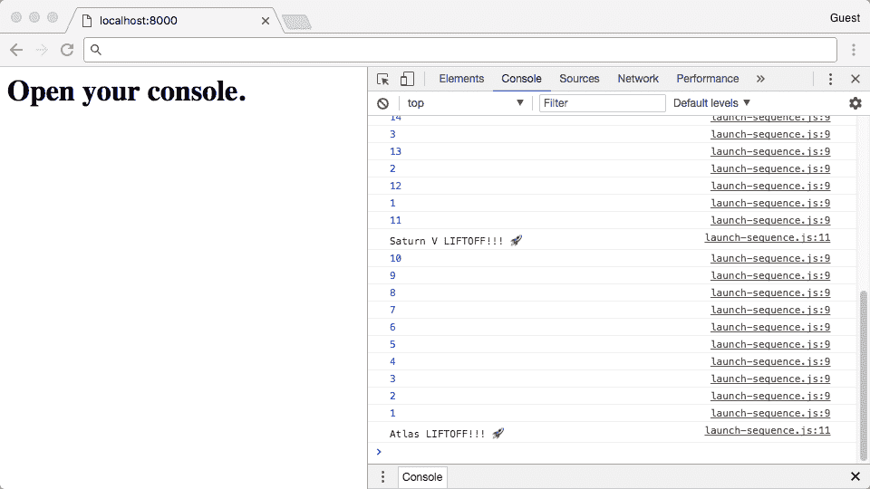

# 第二章：与旧版浏览器保持兼容

在本章中，我们将介绍以下配方：

+   使用 NVM 安装 Node.js

+   安装和配置 webpack

+   添加回退脚本标签以加载客户端包

+   使用 Babel Polyfill 模拟方法

+   使用 Babel 支持新语言功能

+   使用工具分析 webpack 包

# 简介

在上一章中，我们介绍了如何利用新的 ECMAScript 模块从多个文件加载代码并组织我们的代码。这项前沿技术最近才在浏览器中可用。在实践中，生产网站试图针对尽可能多的用户。这通常意味着针对旧浏览器。此外，JavaScript 还运行在其他环境（如 Node.js）中，这些环境不支持 ECMAScript 模块。

好消息是，我们不需要更改源代码来支持这些平台。有工具可以将多个源文件生成一个单一的 JavaScript 文件。这样我们就可以使用模块来组织我们的代码，并在更多平台上运行我们的程序。

本章中的配方侧重于 webpack 的安装和配置，以便为不支持 ES 模块和其他语言更新添加的平台提供回退选项。

# 使用 NVM 在 Linux 和 macOS 上安装 Node.js

Node 在其网站上提供了 Windows 和 macOS 的安装二进制文件：

[`nodejs.org/en/download/`](https://nodejs.org/en/download/).

通过下载适用于您的操作系统和处理器的适当安装程序来安装 Node.js 很容易。然而，拥有一个版本管理器很有用，这样您就可以在需要不同版本的项目上工作，并使用最新版本。这对于您的包管理器不提供 Node.js 的最新版本（例如，Ubuntu）尤其有用。

后续配方将假设已安装 Node.js。此配方演示了如何在 Linux 和 macOS 上安装 Node.js。下一配方将涵盖 Windows 的安装说明。

# 准备工作

此配方仅适用于 Linux 和 macOS。有关 Windows 说明，请参阅下一配方。

您必须已安装 git。它在 macOS 上已安装，Linux 发行版应通过其包管理器提供 git。

# 如何操作...

1.  打开您的命令行应用程序。

1.  将`nvm`项目克隆到您的家目录中的一个目录中：

```js
git clone https://github.com/creationix/nvm.git ~/.nvm
```

1.  将以下代码添加到您的`~/.bashrc`或`~/.zshrc`文件的底部。如果您不知道您正在运行什么 shell，它可能是 bash，您应该将条目添加到`~/.bashrc`：

```js
# Configure NVM 
export NVM_DIR="$HOME/.nvm" 
[ -s "$NVM_DIR/nvm.sh" ] && . "$NVM_DIR/nvm.sh" 
[ -s "$NVM_DIR/bash_completion" ] && . "$NVM_DIR/bash_completion"   
```

1.  保存文件并返回到您的命令行：

```js
source ~/.bashrc # (or ~/.zshrc if you're running zshell)
```

1.  通过检查`nvm`的版本号来确认您的安装：

```js
> nvm --version 0.33.5
```

1.  列出所有可安装的 node 版本：

```js
> nvm list-remote
```

1.  安装最新的**长期支持**（**LTS**）或稳定版本。（在撰写本文时，版本 8.9.4 是最新 LTS 版本）：

```js
    > nvm install 8.9.4
```

1.  通过检查`node`和`npm`的版本号来确认它们的安装：

```js
    >  node --version
    v8.9.4
    > npm --version
    5.6.0
```

# 它是如何工作的...

此安装的关键是 *步骤 4* 和 *步骤 5*。*步骤 4* 确保了 `nvm` 可执行文件是您环境 PATH 的一部分，并且设置了相关环境变量。当您运行 `nvm install 6.11` 时，`nvm` 可执行文件将被运行，node 二进制文件将被安装到预期位置。

# 更多内容...

如果我们还安装了版本 v9.6.1，我们可以使用以下命令将其设置为默认版本：

```js
    nvm alias default 9.6.1 
```

现在我们打开一个新的 shell，v9.6.1 将是正在使用的 Node.js 版本。

# 使用 NVM 安装 Node.js：Windows

后续的食谱将假设已经安装了 Node.js。本食谱演示了如何在 Windows 上安装 Node.js。

# 准备工作

本食谱适用于 Windows 环境。有关 macOS 和 Linux 指令，请参阅前面的食谱。

您还必须安装 git。您可以从以下链接下载 git：

[`git-scm.com/download/win`](https://git-scm.com/download/win)。

# 如何操作...

1.  访问项目发布页面：

    [`github.com/coreybutler/nvm-windows/releases`](https://github.com/coreybutler/nvm-windows/releases)。

1.  下载最新的 `nvm-setup.zip` 文件。

1.  解压下载的 ZIP 文件。

1.  双击 **nvm-setup**。

1.  通过向导完成安装。

1.  打开命令提示符。

1.  通过检查 `nvm` 的版本号来确认安装：

```js
    > nvm version
    1.1.6 
```

1.  列出所有可安装的 Node.js 版本：

```js
    > nvm list available
```

1.  安装最新的 LTS 或稳定版本（截至编写时，版本 8.9.4 是最新的 LTS 版本）：

```js
    > nvm install 8.9.4
    6.11.0
    Downloading node.js version 8.9.4 (64-bit)...
    Complete
    Creating C:UsersrtharAppDataRoamingnvmtemp

    Downloading npm version 5.6.0... Complete
    Installing npm v5.6.0...

    Installation complete. 
```

1.  输入以下命令以激活此版本：

```js
    nvm use 8.9.6
```

# 工作原理...

安装程序会下载安装向导。安装向导会下载与 `nvm` 相关的可执行文件，并调整 PATH 环境变量。PATH 用于在命令行上执行程序时查找程序。如果一个程序位于 PATH 中找到的文件夹之一中，那么它可以不引用其绝对或相对路径而执行。

# 更多内容...

如果我们还安装了版本 v9.6.1，我们可以使用以下命令将其设置为默认版本：

```js
    nvm use 9.6.1
```

现在我们打开一个新的 shell，v8.6.0 将是正在使用的 Node.js 版本。与 macOS 和 Linux 版本不同，最后选择的版本将通过 shell 会话保持，并且不需要设置默认版本。

# 安装和配置 webpack

如前所述，创建 JavaScript 包有几个选项。Rollup 和 Babel 是流行的工具，可以执行此任务。webpack 是一个好的选择，因为它被广泛使用，并且拥有庞大的插件库。

本食谱演示了如何安装和配置 webpack 以构建 JavaScript 包。

# 准备工作

您需要安装 Node.js。如果没有，请参阅使用 `nvm` 安装 Node.js 的相应食谱。

# 如何操作...

1.  打开您的命令行应用程序，导航到您的 workspace，并创建一个新的 node 包：

```js
    mkdir 02-creating-client-bundles
    cd 02-creating-client-bundles
    npm init -y
```

1.  从第一章中的*Nesting modules under a single namespace*配方复制`main.js`文件：

```js
// main.js 
import { atlas, saturnV } from './rockets/index.js' 

export function main () { 
  saturnV.launch(); 
  atlas.launch(); 
} 
```

1.  创建`rockets`依赖目录（这些文件可以从第一章中的*Nesting modules under a single namespace*配方复制而来，*使用模块构建*）:

```js
// rockets/index.js 
import * as saturnV from './saturn-v.js'; 
import * as atlas from './atlas.js'; 
export { saturnV, atlas }; 

// rockets/launch-sequence.js 
export function launchSequence (countDownDuration, name) { 
  let currCount = countDownDuration; 
  console.log(`Launching in ${countDownDuration}`, name); 

  const countDownInterval = setInterval(function () { 
    currCount--; 

    if (0 < currCount) { 
      console.log(currCount); 
    } else { 
      console.log('%s LIFTOFF!!! ', name); 
      clearInterval(countDownInterval); 
    } 
  }, 1000); 
} 

// rockets/atlas.js 
import { launchSequence } from './launch-sequence.js'; 

const name = 'Atlas'; 
const COUNT_DOWN_DURATION = 20; 

export function launch () { 
  launchSequence(COUNT_DOWN_DURATION, name); 
} 

// rockets/saturn-v.js 
import { launchSequence } from './launch-sequence.js'; 

export const name = "Saturn V"; 
export const COUNT_DOWN_DURATION = 10; 

export function launch () { 
  launchSequence(COUNT_DOWN_DURATION, name); 
} 
```

1.  创建一个`index.js`文件，该文件加载并执行`main.js`中的主函数：

```js
// index.js 
import { main } from './main.js'; 
main();  
```

1.  安装 webpack：

```js
   > npm install --save-dev Webpack
```

1.  创建一个名为`webpack.config.js`的 webpack 配置文件，入口点为`index.js`，输出文件名为`bundle.js`:

```js
// webpack.config.js 
const path = require('path'); 

module.exports = { 
  entry: './index.js', 
  output: { 
    filename: 'bundle.js', 
    path: path.resolve(__dirname) 
  } 
}; 
```

1.  在`package.json`中添加一个构建脚本：

```js
{
  /** package.json content**/
  "scripts": {
    "build": "webpack --config webpack.config.js"
  }
}
```

1.  运行 webpack 构建以创建`bundle.js`:

```js
 > npm run build
```

1.  你应该会看到描述构建创建和其中包含的模块的输出。请参阅以下输出：

```js
Hash: 5f2f1a7c077186c7a7a7 
Version: webpack 3.6.0 
Time: 134ms 
    Asset    Size  Chunks             Chunk Names 
bundle.js  6.7 kB       0  [emitted]  main 
   [0] ./rockets/launch-sequence.js 399 bytes {0} [built] 
   [1] ./index.js 42 bytes {0} [built] 
   [2] ./main.js 155 bytes {0} [built] 
   [3] ./rockets/index.js 162 bytes {0} [built] 
   [4] ./rockets/falcon-heavy.js 206 bytes {0} [built] 
   [5] ./rockets/saturn-v.js 203 bytes {0} [built] 
   [6] ./rockets/atlas.js 270 bytes {0} [built]  
```

1.  使用`node`运行生成的`bundle.js`文件：

```js
 node ./bundle.js 
```

1.  你应该看到火箭倒计时并发射。

# 它是如何工作的...

使用`npm`安装 webpack 会将发布的包下载到`node_modules`目录。因为 webpack 还包括一个可执行文件，所以它被安装到`node_modules/.bin`下。

webpack 配置相当简单。它指定了一个入口点和输出点。入口点定义了 webpack 开始遍历的位置。接下来，它访问由入口点导入的所有模块，然后是那些模块导入的所有模块。这个过程会一直重复，直到所有依赖项都被访问。

然后，所有依赖项都被合并到一个文件中。文件位置由输出设置定义。在这种情况下，输出被定义为`bundle.js`。输出捆绑包被放置在当前目录中。

你可以在[`webpack.js.org/`](https://webpack.js.org/)查看 webpack 文档，了解更多关于其工作原理以及如何针对不同场景进行配置的详细信息。

# 添加回退脚本标签以加载客户端捆绑包

在之前的配方中，我们展示了如何使用 webpack 组合多个模块。本配方演示了如何将这些模块加载到不支持 ES 模块的浏览器中。

# 准备工作

本配方假设你已经安装并配置了 webpack。建议你在继续本配方之前完成之前的配方，*安装和配置 webpack*。

你还需要安装 Python。如果你还没有安装，请访问第一章中的*安装 Python，使用`SimpleHTTPServer`托管本地静态文件服务器*配方，以及*使用模块构建*。

# 如何操作...

1.  打开你的命令行应用程序，导航到包含`02-creating-client-bundles`包的目录。

1.  启动 Python HTTP 服务器。

1.  创建一个名为`index.html`的文件（从第一章中的*Nesting modules under a single namespace*配方复制而来，*使用模块构建*）:

```js
<html> 
  <head> 
    <meta charset='UTF-8' /> 
  </head> 
  <body> 
    <h1>Open your console.</h1> 
    <script type="module"> 
      import { main } from './main.js'; 
      main(); 
    </script> 
  </body> 
</html> 
```

1.  在`<script>`标签中现有的`module`之后添加一个`nomodule`脚本标签：

```js
  <body> 
    <h1>Open your console.</h1> 
    <script type="module"> 
      import { main } from './main.js'; 
      main(); 
    </script> 
 <script nomodule type="text/javascript"src="img/bundle.js"></script> 
  </body> 
```

1.  运行`webpack`构建命令：

```js
    ./node_modules/.bin/webpack --config webpack.config.js
```

1.  打开您的 ES 模块兼容浏览器，打开开发者工具到网络标签，并访问 URL：

    `http://localhost:8000/`.

1.  您应该看到浏览器加载的各个文件：


1.  打开一个不兼容 ES 模块的浏览器。打开开发者工具中的网络，并访问 URL：

    `http://localhost:8000/`.

1.  您应该看到加载了 `bundle.js` 文件：


# 它是如何工作的...

在之前的配方中，我们看到了带有属性 `type="module"` 的脚本标签将被执行并像 ES 模块一样处理。不支持 ES 模块的浏览器根本不会执行此脚本。

如果我们插入一个普通的脚本标签，它也会被较新的浏览器执行。为了避免运行重复的代码，我们使用 `nomodule` 属性。这告诉支持 ES 模块的新浏览器忽略 ID。

因此，我们得到了期望的行为。模块标签由兼容的浏览器执行，并由旧浏览器忽略。`nomodule` 属性的脚本由 ES 模块兼容的浏览器忽略并由旧浏览器执行。

在撰写本文时，`nomodule` 是一个实验性功能，并非所有浏览器都支持。然而，它可能在将来得到支持。

# 相关内容

+   使用 Babel 镜像新特性

# 使用 Babel Polyfill 镜像方法

在前两个配方中，我们看到了如何创建客户端包并将其加载到浏览器中。这使得在源代码中使用 ES 模块成为可能，同时不会破坏与旧浏览器的兼容性。

然而，语言的新版本中也有新的方法可用，我们将在后面的章节中使用。

本配方演示了如何使用 `babel-polyfill` 库来支持这些方法。

# 准备工作

本配方假设您已经创建了本章早期配方中的代码，并且已经安装了 Python，并知道如何启动静态 HTTP 服务器。请访问早期配方或复制代码。

# 如何做到这一点...

1.  打开您的命令行应用程序，导航到包含 `02-creating-client-bundles` 包的目录。

1.  启动 Python HTTP 服务器。

1.  更新 `main.js` 文件以使用 `Array.prototype.values` 方法，并使用 `for..of` 循环遍历生成的迭代器：

```js
import { atlas, saturnV } from './rockets/index.js' 

export function main () { 
 const rockets = [saturnV, atlas]; for (const rocket of rockets.values()) { rocket.launch(); } 
}  
```

1.  安装 Babel Polyfill 包：

```js
    npm install --save babel-polyfill  
```

1.  要镜像包，更新 `webpack.config.js` 文件以将 Babel Polyfill 添加到入口点：

```js
const path = require('path'); 

module.exports = { 
 entry: ['babel-polyfill', './index.js'], 
  output: { 
    filename: 'bundle.js', 
    path: path.resolve(__dirname) 
  } 
};  
```

1.  要镜像 ES 模块，您需要直接导入该文件。更新 `index.html` 以导入 polyfill：

```js
<!-- index.html --> 
<script type="module"> 
 import './node_modules/babel-polyfill/dist/polyfill.min.js'; 
  import { main } from './main.js'; 
  main(); 
</script>  
```

1.  现在打开一个浏览器，打开开发者控制台，并访问 URL：

    `http://localhost:8000/`.

1.  不论浏览器是否支持 `Array.prototype.values`，代码都应该运行并显示如下输出：



# 它是如何工作的...

`babel-polyfill` 包，恰如其分地，提供了所谓的 polyfill。polyfill 填补了旧浏览器在 ECMAScript 规范中留下的空白。

在上一个例子中，恰好当前版本，61，的 Chrome 没有实现 `Array.prototype.values` 方法。polyfill 代码在主函数之前运行。它会检查 `Array.prototype` 对象上是否实现了 `values` 方法。如果没有原生的实现，那么 polyfill 会实现这个方法。如果已经实现了，那么 polyfill 就会保留原生的实现。

以这种方式，polyfill 库使大量新的方法变得可用。

# 使用 Babel 支持新语言特性

在上一个配方中，我们看到了如何使用 `babel-polyfill` 库来支持新的 ES 方法。这个库在运行时向语言添加方法，以便依赖于它们的源代码能够正确运行。

ECMAScript 中有一些相对较新的语言特性，例如箭头函数、**let** 和 **const** 变量声明以及扩展运算符。这些特性并不被普遍支持。Babel 提供了一种机制，可以在源代码级别使用它们，同时保持与构建步骤的兼容性。

这个配方演示了如何在 webpack 中使用 Babel，以便在旧浏览器中支持这些特性。

# 准备工作

这个配方假设你已经创建了本章早期配方中的代码，并且已经安装了 Python。请访问这些早期配方或复制代码。

# 如何操作...

1.  打开你的命令行应用程序并导航到包含 `02-creating-client-bundles` 包的目录。

1.  启动 Python HTTP 服务器。

1.  更新 `main.js` 文件以使用箭头函数语法：

```js
import { atlas, saturnV } from './rockets/index.js' 

export function main () { 
  const rockets = [saturnV, atlas]; 
 rockets.map((rocket) => rocket.launch() ); 
} 
```

1.  安装 Babel、`preset-es2015` 以及相关的 webpack 加载器：

```js
    npm install --save-dev babel-cli babel-preset-es2015 babel-loader
```

1.  创建一个名为 `.babelrc` 的 Babel 配置文件：

```js
// .babelrc 
{ 
  "presets": ["es2015"] 
} 
```

1.  配置 `webpack` 以使用 Babel 进行新语言特性的转换：

```js
const path = require('path'); 

module.exports = { 
  entry: ['babel-polyfill', './index.js'], 
  output: { 
    filename: 'bundle.js', 
    path: path.resolve(__dirname) 
 }, module: { rules: [ { test: /.js$/, exclude: /node_modules/, use: 'babel-loader' } ] } 
};  
```

1.  将 webpack 构建命令添加到 `package.json` 文件的脚本部分：

```js
{
  /* package.json configuration */

  "scripts": {
    "bundle": "webpack --config webpack.config.js",
  }

  /* remaining properties */
}   
```

1.  运行 `webpack` 构建：

```js
npm run bundle  
```

1.  现在，打开浏览器并访问以下 URL 时打开开发者控制台：

    `http://localhost:8000/`。

1.  你应该看到代码运行正确：


# 它是如何工作的...

Babel 项目提供了一个编译器，通常称为 **转译器**。转译器是一个程序，它接受源代码并生成一些目标代码。Babel 转译器的最常见用途是将 JavaScript 源文件转换为更新的特性。

当转译器遇到需要翻译的语言特性的表达式时，它会生成一个逻辑上等效的表达式。生成的表达式可以与源表达式非常相似，也可以非常不同。

想要了解更多关于如何使用 Babel 支持不同平台的信息，请访问其网站：

[`babeljs.io/`](https://babeljs.io/)。

# 还有更多...

上一个配方使用了 ES2015 预设。这意味着无论当前浏览器的支持情况如何，Babel 总是会生成 ES2015（ES5）兼容的代码。

Babel 的`env`预设更为复杂，它使用平台兼容性来确定哪些语言特性需要被翻译。请参见项目 readme 中的以下示例：

```js
 // .baberc 
{ 
  "presets": [ 
    ["env", { 
   "targets": { 
     "browsers": ["last 2 versions", "safari >= 7"] 
   } 
 }] 
  ] 
} 
```

之前的配置针对的是除 Safari 以外的所有浏览器的最后两个版本，而 Safari 则从版本 7 开始一直被针对。这个项目允许 Babel 在浏览器实现更多语言特性时丢弃不再需要的翻译。

你可以在`babel-preset-env`项目的仓库中找到更多文档和支持：[`github.com/babel/babel-preset-env`](https://github.com/babel/babel-preset-env)。

# 使用工具分析 webpack 包

将代码转换并使用 Polyfills 的一个主要缺点是源代码可能会与源代码有相当大的差异。这通常会导致包的大小膨胀。如果你查看添加 Polyfill 库后的`bundle.js`文件的大小（参见前两个菜谱），那么你会发现它超过了 200Kb。与没有 Polyfill 的 5Kb 相比，这相当大。

对于许多包，很难找出哪些文件导致了文件大小的增加，以及它们之间的依赖关系。

在这个菜谱中，我们将看到如何使用分析工具来更好地了解我们的 webpack 包。

# 准备工作

如果从之前的菜谱中获取源代码来启动这个菜谱会有所帮助。否则，你需要参考来自第一章的*导出/导入多个模块以供外部使用*菜谱，*使用模块构建*，了解如何创建`index.html`文件。

# 如何做...

1.  打开你的命令行应用程序并导航到包含`02-creating-client-bundles`包的目录。

1.  运行 webpack 并将配置输出到 JSON 文件：

```js
./node_modules/.bin/webpack --config webpack.config.js  --profile --json > compilation-stats.json
```

1.  要查看占用你包最多空间的模块，打开你的浏览器并访问以下 URL：

    [`chrisbateman.github.io/webpack-visualizer/`](https://chrisbateman.github.io/webpack-visualizer/).

1.  拖放文件或使用文件选择器选择编译统计文件`compilation-stats.json`。

1.  你应该会看到一个图表，它将提供可悬停的模块大小信息：


1.  现在你已经知道了哪些模块很大，你可以查找依赖关系。访问 webpack 分析器主页：[`webpack.github.io/analyse/`](https://webpack.github.io/analyse/)。

1.  拖放文件或使用文件选择器选择编译统计文件`compilation-stats.json`。

1.  文件加载后，你应该会看到界面发生变化。点击页眉中的“模块”行。

1.  从这里，你可以看到单个模块以及依赖关系在哪里：


# 如何工作...

在**步骤 2**中，我们运行了 webpack 命令，并将统计信息输出到一个 JSON 文件中。这些数据包括诸如文件大小贡献和依赖项等信息。我们打开的网站读取了这些 JSON 数据，并生成了可视化。第一个网站，WEBPACK VISUALIZER ([`chrisbateman.github.io/webpack-visualizer/`](https://chrisbateman.github.io/webpack-visualizer/))，使用文件大小数据并强调每个包对整体包大小的贡献。这对于识别导致包大小膨胀的罪魁祸首非常有用。

不幸的是，移除大型依赖项并不总是容易的。依赖项可能有多层深度且难以查找。一旦我们知道是什么导致了大型包的大小，那么我们就可以使用第二个工具，Webpack Visualizer，来提取它们。
