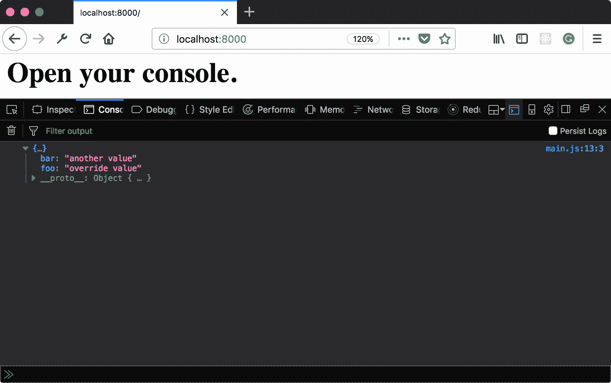
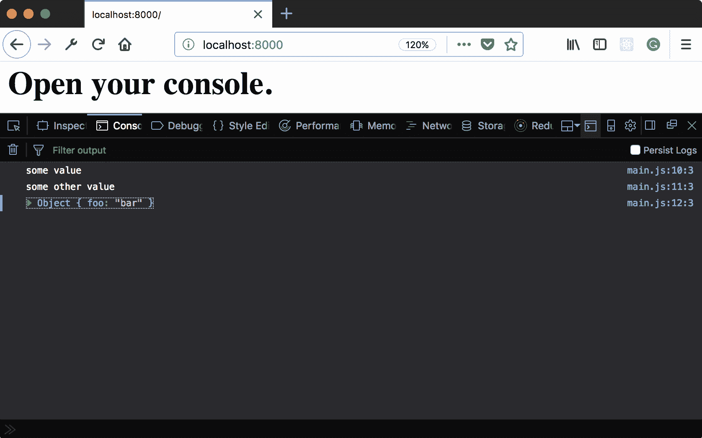

# 第六章：简单对象

在本章中，我们将涵盖以下配方：

+   使用 `Object.assign` 向对象添加属性

+   使用 `Object.entries` 获取可迭代的属性名对

+   使用 `Object.is` 比较两个值

+   在简单对象上定义函数属性作为方法

+   使用 `Object.defineProperty` 定义只读属性

+   使用 `Object.defineProperty` 覆盖只读属性

+   使用 `Object.defineProperty` 创建非枚举属性

+   使用对象结构创建对象

+   使用解构从对象中选取值

+   使用扩展运算符组合对象

# 简介

随着最近版本的 ECMAScript 中提供的所有新功能的推出，很容易忽视基础知识。对象 API，就像其他 API 一样，已经收到了很多更新。与不太熟悉的功能（如 `SharedArrayBuffer`）相比，它们可能看起来很平凡，但它们允许您创建一些有趣和有用的行为。

在本章中，我们将探讨如何使用对象 API 来创建丰富的关系和有趣属性。

# 使用 `Object.assign` 向对象添加属性

从不同的对象组合属性是一个相当常见的任务。这样做按值逐个进行是有限的且繁琐的，因为每个属性都必须枚举。这个配方演示了如何使用 `Object.assign` 方法完成相同的事情。

# 准备工作

这个配方假设您已经有一个工作区，允许您在浏览器中创建和运行 ES 模块。如果您没有，请参阅前两章。

# 如何做...

1.  打开您的命令行应用程序，导航到您的 workspace。

1.  创建一个名为 `06-01-object-assign-add-properties` 的新文件夹。

1.  复制或创建一个 `index.html` 文件，该文件从 `main.js` 加载并运行一个 `main` 函数。

1.  创建一个包含 `main` 函数的 `main.js` 文件，该函数创建两个对象，然后使用 `Object.assign` 将它们与另一个匿名对象组合：

```js
// main.js 
export function main() { 
  const object = {}; 
  const otherObject = { 
    foo: 'original value', 
    bar: 'another value' 
  } 

  Object.assign(object, otherObject, { 
    foo: 'override value' 
  }); 

  console.log(object); 
}  
```

1.  启动您的 Python 网络服务器，并在浏览器中打开以下链接：

    `http://localhost:8000/`.

1.  您将看到以下输出：



# 它是如何工作的...

`Object.assign` 方法遍历传递给它的所有对象的属性。然后，它将这些属性分配给最左边的对象。优先考虑最右边对象的属性。因此，您可以看到 `foo` 的值来自匿名对象。最左边的对象被右边的值所突变，而其他对象保持不变。

我们将在稍后看到如何使用扩展运算符来完成相同的任务。

# 使用 `Object.entries` 获取可迭代的属性名对

`Object.assign` 在从一个对象复制属性到另一个对象方面表现良好。然而，我们有时想根据对象的属性执行其他操作。这个配方展示了如何使用 `Object.entries` 来获取一个对象属性的迭代器。

# 准备工作

本食谱假设你已经有一个工作区，允许你在浏览器中创建和运行 ES 模块。如果你没有，请参阅前两章。

# 如何操作...

1.  打开你的命令行应用程序并导航到你的工作区。

1.  创建一个名为`06-02-object-entries-to-get-iterable`的新文件夹。

1.  复制或创建一个`index.html`文件，该文件加载并运行来自`main.js`的`main`函数。

1.  创建一个名为`main`的函数的`main.js`文件，然后创建一个对象，并使用`for-of`循环遍历`Object.entries`的结果：

```js
// main.js 
export function main() { 
  const object = { 
    foo: Math.random(), 
    bar: Math.random() 
  }; 
  for (let [prop, value] of Object.entries(object)) { 
    console.log(prop, value); 
  } 
} 
```

1.  启动你的 Python 网络服务器并在浏览器中打开以下链接：

    `http://localhost:8000/`.

1.  你将看到以下输出：


# 它是如何工作的...

`Object.entries`返回一个可迭代的值。这些列表可以用`for-of`循环遍历。这个可迭代中的项是属性名和值的对。属性是`foo`和`bar`，而值条目是这些属性的对应值。

语法`[prop, value]`将这个对拆分为单独的变量，然后输出。或者，我们也可以将条目`prop`和`value`作为数组的零和一索引来引用，但解构语法更直接。我们将在未来的食谱中查看解构。

# 使用`Object.is`比较两个值

JavaScript 与相等性有复杂的关系。众所周知，使用`===`比使用`==`更可取，因为它给出了更可预测的结果，在大多数情况下`===`的行为是预期的。不幸的是，由于 JavaScript 类型系统的怪癖，有一些令人沮丧的边缘情况。在本食谱中，我们将了解如何使用`Object.is`来获得比较的预期结果。

# 准备工作

本食谱假设你已经有一个工作区，允许你在浏览器中创建和运行 ES 模块。如果你没有，请参阅前两章。

# 如何操作...

1.  打开你的命令行应用程序并导航到你的工作区。

1.  创建一个名为`06-03-compare-with-object-is`的新文件夹。

1.  复制或创建一个`index.html`文件，该文件加载并运行来自`main.js`的`main`函数。

1.  创建一个包含`main`函数的`main.js`文件，该函数进行一些说明性比较：

```js
// main.js 
export function main() {
  const obj1 = {};
  const obj2 = {};

  console.log('obj1 === obj2', obj1 === obj2);
  console.log('obj1 is obj2', Object.is(obj1, obj2));
  console.log('obj2 === obj2', obj2 === obj2);
  console.log('obj2 is obj2', Object.is(obj2, obj2));
  console.log('undefined === undefined', undefined === 
  undefined);
  console.log('undefined is undefined', Object.is(undefined, 
  undefined));
  console.log('null === undefined', null === undefined);
  console.log('null is undefined', Object.is(null, undefined));

  // Special cases (from MDN documentation)
  console.log('Special Cases:');
  console.log('0 === -0', 0 === -0);
  console.log('0 is -0', Object.is(0, -0));
  console.log('-0 === -0', -0 === -0);
  console.log('-0 is -0', Object.is(-0, -0));
  console.log('NaN === NaN', NaN === NaN);
  console.log('NaN is NaN', Object.is(NaN, NaN));
} 
```

1.  启动你的 Python 网络服务器并在浏览器中打开以下链接：

    `http://localhost:8000/`.

1.  你应该看到以下输出显示：


# 它是如何工作的...

`Object.is`方法与`===`运算符有不同的规范。你可以看到它们大多数时候是一致的，但有一些边缘情况它们不一致。初始测试案例（`object`、`null`和`undefined`比较）都是一致的，但当我们遇到边缘情况时，我们开始看到一些差异。你可以看到正零和负零比较之间的差异，以及 NaN 比较。

更多信息，请参阅 Mozilla 开发者页面上的文档：

[`developer.mozilla.org/en-US/docs/Web/JavaScript/Reference/Global_Objects/Object/is`](https://developer.mozilla.org/en-US/docs/Web/JavaScript/Reference/Global_Objects/Object/is).

# 在普通对象上定义函数属性作为方法

在对象字面量上定义方法始终可以通过正常的键值对来实现。ECMAScript 的较新版本添加了一个简写，它模仿了在类上定义方法的语法。

在这个菜谱中，我们将看到我们可以使用这两种技术中的任何一种在对象字面量上创建和覆盖方法。

# 准备工作

这个菜谱假设你已经有一个工作区，允许你在浏览器中创建和运行 ES 模块。如果你没有，请参阅前两章。

# 如何做到这一点...

1.  打开你的命令行应用程序并导航到你的工作区。

1.  创建一个名为`06-04-define-function-properties-as-method`的新文件夹。

1.  复制或创建一个`index.html`文件，该文件从`main.js`加载并运行一个`main`函数。

1.  创建一个名为`main`的函数的`main.js`文件，使用属性和方法语法定义两个方法，覆盖它们，并在覆盖前后调用它们：

```js
// main.js  
export function main() { 
     const obj = { 
    method0: function() { 
      console.log('Hello, from method one.') 
    }, 
       method1() { 
      console.log('Hello, from method one.') 
    } 
  }; 
  obj.method0(); 
  obj.method1(); 

  obj.method0 = () => console.log('Override of method 0.'); 
  obj.method1 = () => console.log('Override of method 1.'); 
  obj.method0(); 
  obj.method1(); 
}   
```

1.  启动你的 Python 网络服务器并在浏览器中打开以下链接：

    `http://localhost:8000/`.

1.  你应该会看到以下输出显示：


# 它是如何工作的...

正如我们之前看到的，两种语法是等效的。这两种方法被定义为具有函数值的属性，并且由于它们没有任何阻止其被覆盖的属性，因此可以被覆盖。`method0`和`method1`都是在初始对象上定义的，并在之后立即执行。

接下来，我们为同一对象的这些属性分配一个新的函数值。因此，当它们再次被调用时，将执行新函数而不是原始函数。

在未来的菜谱中，我们将看到如何防止这种覆盖。

# 使用 Object.defineProperty 定义只读属性

并非总是理想的做法拥有可以被覆盖的方法。默认情况下，分配给对象的属性可以被重新分配。我们需要另一个选项来向对象添加函数，这样它们就不会被更改。

在这个菜谱中，我们将看到如何使用`Object.defineProperty`向对象添加不可写属性。

# 准备工作

这个菜谱假设你已经有一个工作区，允许你在浏览器中创建和运行 ES 模块。如果你没有，请参阅前两章。

# 如何做到这一点...

1.  打开你的命令行应用程序并导航到你的工作区。

1.  创建一个名为`06-05-define-readonly-props`的新文件夹。

1.  复制或创建一个`index.html`文件，该文件从`main.js`加载并运行一个`main`函数。

1.  创建一个包含`main`函数的`main.js`文件，该函数定义一个不可写属性，然后尝试写入它：

```js
 export function main() { 
  const obj = {}; 

  Object.defineProperty(obj, 'method1',{ 
    writable: false, 
    value: () => { 
      console.log('Hello, from method one.') 
    } 
  }); 
  obj.method1(); 

  // throws error 
  obj.method1 = () => console.log('Override of method 1.'); 
} 
```

1.  启动你的 Python 网络服务器并在浏览器中打开以下链接：

    `http://localhost:8000/`.

1.  你应该会看到以下输出显示：


# 它是如何工作的...

在这个菜谱中，我们看到对象属性不仅仅是简单的键值对。它们有属性来控制其行为。其中一个属性是可写的。这个属性意味着我们可以在之后重新赋值。默认情况下，这个属性被设置为 true；使用 `Object.defineProperty` 我们可以看到其他值。

我们将了解其他属性如何用来控制其他行为。

# 使用 Object.defineProperty 覆盖只读属性

创建不可写的属性并不是最终结果。在某些情况下，仍然有可能重写这些属性。幸运的是，这不太可能是一个意外行为。在这个菜谱中，我们将了解如何使用 `Object.define` 定义和重新定义不可写的属性。

# 准备工作

这个菜谱假设你已经有一个工作区，允许你在浏览器中创建和运行 ES 模块。如果你没有，请参阅前两章。

# 如何操作...

1.  打开你的命令行应用程序，导航到你的工作区。

1.  创建一个名为 `06-06-redefine-read-only-props` 的新文件夹。

1.  复制或创建一个 `index.html` 文件，该文件加载并运行来自 `main.js` 的 `main` 函数。

1.  创建一个包含 `main` 函数的 `main.js` 文件，该函数创建一个对象。定义一个可配置的、不可写的属性 `prop1`，并赋予一个随机值：

```js
export function main() { 
  const obj = {}; 

  Object.defineProperty(obj, 'prop1',{ 
    writable: false, 
    configurable: true, 
    value: Math.random() 
  }); 
  console.log(obj.prop1) 
} 
```

1.  将该属性重新定义为另一个 `random` 值，并将可配置性更改为 `false`：

```js
export function main() { 
  // ... 
 Object.defineProperty(obj, 'prop1',{ writable: false, configurable: false, value: Math.random() }); console.log(obj.prop1)}
```

1.  尝试第三次重新定义属性：

```js
 export function main() { 
  // ... 
 // throws error Object.defineProperty(obj, 'prop1',{ value: Math.random() }); 
} 
```

1.  启动你的 Python 网络服务器，并在浏览器中打开以下链接：

    `http://localhost:8000/`。

1.  你应该会看到以下输出显示：


# 工作原理...

可写性只是方程的一部分。将可写性设置为 false 意味着属性可以被正常重新赋值。默认情况下，它不能使用 `Object.defineProperty` 重新定义。然而，如果 `configurable` 设置为 true，则可以重新定义属性。一旦将 `configurable` 属性设置为 false，我们就不能再重新定义它了。

# 使用 `Object.defineProperty` 创建不可枚举的属性

在之前的菜谱中，我们看到了如何避免属性被覆盖。有些情况下，我们可能不希望属性被读取。回想一下 `Object.entries` 方法，它创建了一个包含对象上所有属性和值的迭代器。嗯，这并不完全正确。它创建了一个包含所有 `enumerable` 属性的迭代器。

在这个菜谱中，我们将了解如何创建不会被包含在迭代器中的属性。

# 准备工作

这个菜谱假设你已经有一个工作区，允许你在浏览器中创建和运行 ES 模块。如果你没有，请参阅前两章。

# 如何操作...

1.  打开你的命令行应用程序，导航到你的工作区。

1.  创建一个名为 `06-07-non-enumerable-props` 的新文件夹。

1.  复制或创建一个 `index.html` 文件，该文件加载并运行来自 `main.js` 的 `main` 函数。

1.  创建一个 `main.js` 文件，其中包含 `main` 函数，该函数创建一个包含书籍和作者键值对的对象：

```js
// main.js
export function main() { 
  const bookAuthors = { 
    "Star's End": "Cassandra Rose Clarke", 
    "Three Body Problem": "Liu Cixin", 
    "Houston Houston, Do You Read?": "James Tiptree Jr." 
  };  
} 
```

1.  定义两个属性，一个是有随机值的 `enumerable`，另一个是非可枚举的，其值为函数：

```js
export function main() { 
  // ... 
 Object.defineProperty(bookAuthors, 'visibleProp', { enumerable: true, value: Math.random() }); Object.defineProperty(bookAuthors, 'invisibleProp', { value: () => console.log('This function is hidden.') }); for (const [prop, value] of Object.entries(bookAuthors)) { console.log(prop, value) } bookAuthors.invisibleProp();
 } 
} 
```

1.  启动你的 Python 网络服务器，并在你的浏览器中打开以下链接：

    `http://localhost:8000/`.

1.  你应该看到以下输出显示：


# 它是如何工作的...

在对象上以字面量定义的键值与之前一样是可枚举的。接下来的两个属性更有趣。第一个属性 `visibleProp` 明确将 `enumerable` 属性设置为 true，并出现在列表中。`invisibleProp` 属性没有明确设置；默认值为 false。只有可枚举的属性出现在迭代器中。

# 使用对象结构创建对象

从对象中提取属性是另一个重复的任务。似乎存在不必要的重复。ECMAScript 的新版本包括一种语法特性，使这个过程不那么繁琐。这个配方演示了如何使用对象解构从对象属性中提取新变量。

# 准备工作

这个配方假设你已经有一个工作区，允许你在浏览器中创建和运行 ES 模块。如果你没有，请参阅前两章。

# 如何操作...

1.  打开你的命令行应用程序，导航到你的工作区。

1.  创建一个名为 `06-08-pick-values-from-object-destructuring` 的新文件夹。

1.  复制或创建一个 `index.html` 文件，该文件从 `main.js` 中加载并运行一个 `main` 函数。

1.  创建一个 `main.js` 文件。创建一个主函数，该函数创建一个新对象，然后从其中的属性创建新的常量：

```js
// main.js
export function main() { 
  const object = { 
    prop1: 'some value', 
    prop2: 'some other value', 
    objectProp: { foo: 'bar' } 
  }; 

  const { prop1, prop2, objectProp } = object; 
  console.log(prop1); 
  console.log(prop2); 
  console.log(objectProp); 
} 
```

1.  启动你的 Python 网络服务器，并在你的浏览器中打开以下链接：

    `http://localhost:8000/`.

1.  你应该看到以下输出显示：



# 它是如何工作的...

解构是一种语法简写。变量的名称用于引用对象上的属性。值被分配给对应名称的变量。

# 使用解构从对象中提取值

将多个属性捆绑成一个单一的对象是 JavaScript 中的另一个常见任务，这可能会非常繁琐。ECMAScript 的较新版本增加了一种新的语法，使这个过程更加方便。

在这个配方中，我们将看到如何使用这种新语法从现有变量中创建一个对象。

# 准备工作

这个配方假设你已经有一个工作区，允许你在浏览器中创建和运行 ES 模块。如果你没有，请参阅前两章。

# 如何操作...

1.  打开你的命令行应用程序，导航到你的工作区。

1.  创建一个名为 `06-09-create-objects-with-structuring` 的新文件夹。

1.  复制或创建一个 `index.html` 文件，该文件从 `main.js` 中加载并运行一个 `main` 函数。

1.  创建一个名为 `main` 的 `async` 函数的 `main.js` 文件，该函数创建几个常量，然后使用对象结构创建具有相应名称和值的对象：

```js
// main.js
export function main() { 
  const prop1 = 'some value'; 
  const prop2 = 'some other value'; 
  const objectProp = { foo: 'bar' }; 
  const object = { prop1, prop2, objectProp }; 

  console.log(object); 
} 
```

1.  启动你的 Python 网络服务器，并在你的浏览器中打开以下链接：

    `http://localhost:8000/`.

1.  你应该看到以下输出显示：


# 它是如何工作的...

与之前的菜谱一样，语法使用花括号之间的变量名来确定对象上的属性名。每个属性都使用相应的常量的变量名和值创建。

# 使用扩展操作符合并对象

在之前的菜谱中，我们看到了如何使用 `Object.assign` 来合并对象。它完成了任务，但通过使用更新的 ECMAScript 语法，我们可以以更紧凑的方式完成这项任务。在这个菜谱中，我们将看到如何使用新的扩展操作符来合并对象。

# 准备工作

这个菜谱假设你已经有一个工作区，允许你在浏览器中创建和运行 ES 模块。如果你没有，请参阅前两章。

# 如何做...

1.  打开你的命令行应用程序，导航到你的工作区。

1.  创建一个名为 `06-10-spread-operator-combine` 的新文件夹。

1.  复制或创建一个 `index.html` 文件，该文件加载并运行来自 `main.js` 的 `main` 函数。

1.  创建一个名为 `main.js` 的文件，其中包含一个名为 `main` 的 `async` 函数，该函数创建几个对象和一个常量。然后它使用扩展操作符和对象结构将它们合并成一个单一的对象：

```js
// main.js
export function main() { 
  const object1 = { 
    prop1: 'some value', 
    prop2: 'some other value', 
  } 
  const object2 = { 
    prop2: 'some overriding value', 
    objectProp: { foo: 'bar' } 
  } 
  const anotherProp = Math.random(); 

  const combinedObject = { ...object1, ...object2, anotherProp }; 
  console.log(combinedObject); 
} 
```

1.  启动你的 Python 网络服务器，并在你的浏览器中打开以下链接：

    `http://localhost:8000/`.

1.  你应该看到以下输出显示：


# 它是如何工作的...

扩展操作符将对象的 `enumerable` 属性展开，以便在构建新对象时它们都被引用。像 `Object.assign` 一样，值从右到左给予优先级，并且最后一个属性的处理方式与之前菜谱中对象结构的方式相同。
