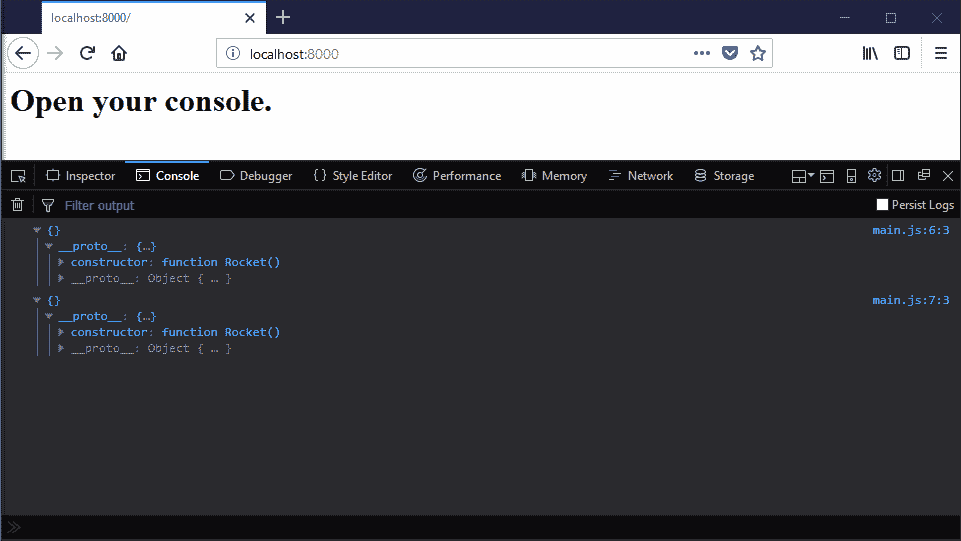
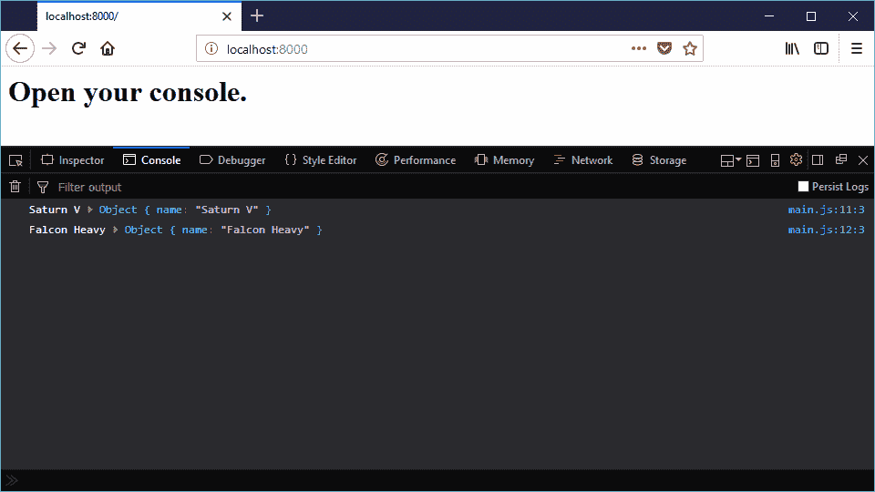
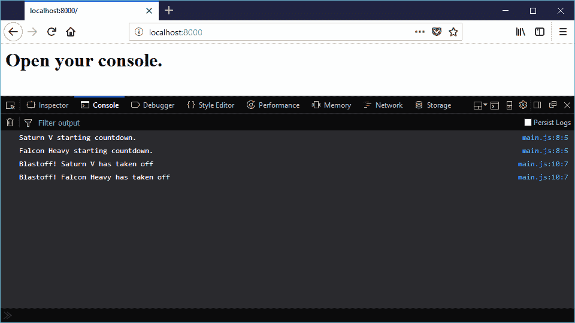
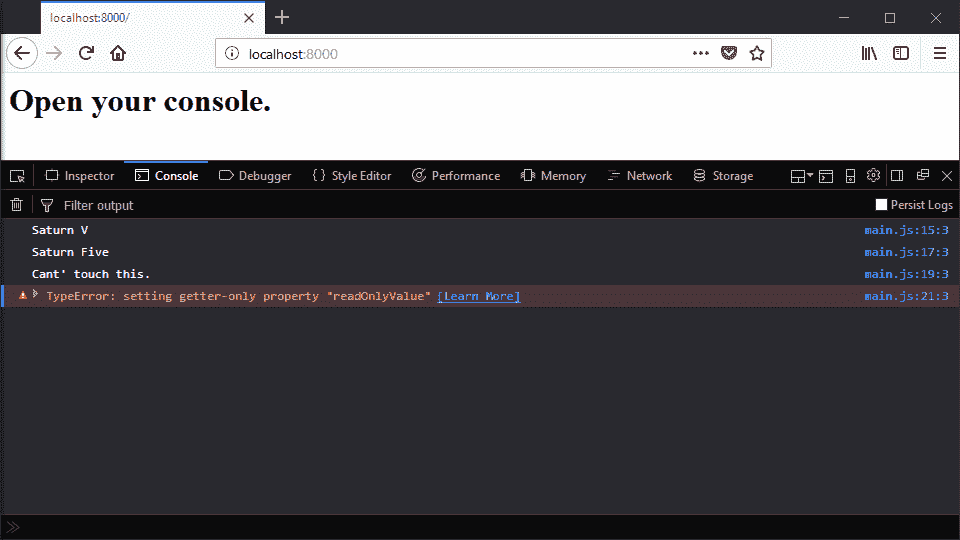
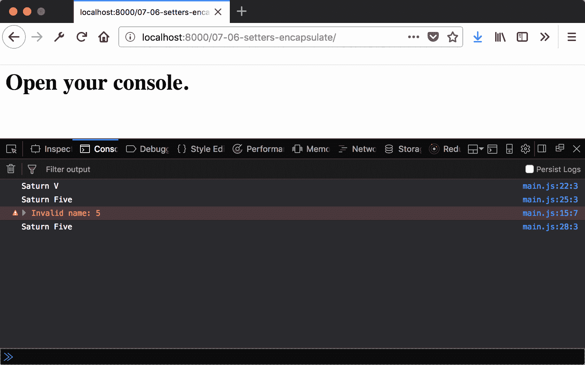
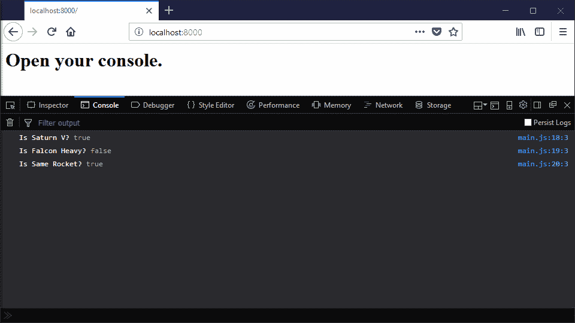

# 第七章：创建类

在本章中，我们将涵盖以下食谱：

+   创建一个新类

+   使用构造函数参数分配属性

+   在类上定义方法

+   使用 instanceOf 检查实例类型

+   使用获取器创建只读属性

+   使用设置器封装值

+   使用静态方法处理所有实例

# 简介

使用 JavaScript 的原型继承模型，创建和扩展类似的对象一直是可能的。通过使用 `new` 操作符和添加原型属性，我们可以创建类似类的结构。

ECMAScript 2015 引入了类语法，作为一种更友好的方式来处理原型继承。有人认为这种 *语法糖* 不值得拥有两种实现 OOP 结构的方法所带来的开销。然而，我认为类提供了一种更简洁地表达相同想法的方法，并且是一个净收益。正如我们将在本章和下一章中看到的，类语法使得表达复杂的 OOP 关系变得更加容易。

# 创建一个新类

最基本的任务类可以用作创建一个新的类。本食谱展示了定义和实例化新类的简单语法。

# 准备工作

本食谱假设您已经有一个工作区，允许您在浏览器中创建和运行 ES 模块。如果您没有，请参阅前两章。

# 如何操作...

1.  打开您的命令行应用程序并导航到您的 workspace。

1.  创建一个名为 `07-01-create-a-new-class` 的新文件夹。

1.  复制或创建一个 `index.html`，它从 `main.js` 加载并运行一个 `main` 函数。

1.  创建一个 `main.js` 文件，定义一个名为 `Rocket` 的新类和一个 `main` 函数，该函数创建两个实例并将它们输出：

```js
// main.js 
class Rocket {} 

export function main() { 
  const saturnV = new Rocket(); 
  const falconHeavy = new Rocket(); 
  console.log(saturnV); 
  console.log(falconHeavy); 
}  
```

1.  启动您的 Python 网络服务器并在浏览器中打开以下链接：

    `http://localhost:8000/`.

1.  您将看到以下输出：



# 它是如何工作的...

`classRocket {}` 语法相当于创建一个名为 `Rocket` 的函数（注意已记录对象的 `constructor` 值）。这意味着在 JavaScript 中，可以使用 `new` 操作符创建 `Rocket` 的实例。这基于原型创建了一个对象。

我们将在未来的食谱中看到如何创建一些更有趣的对象。

# 使用构造函数参数分配属性

现在我们有一个新的类，是时候开始区分实例了。在本食谱中，我们将看到如何在创建实例时通过构造函数参数分配属性。

# 准备工作

本食谱假设您已经有一个工作区，允许您在浏览器中创建和运行 ES 模块。如果您没有，请参阅前两章。

# 如何操作...

1.  打开您的命令行应用程序并导航到您的 workspace。

1.  创建一个名为 `07-02-assigning-constructor-props` 的新文件夹。

1.  复制或创建一个 `index.html`，它从 `main.js` 加载并运行一个 `main` 函数。

1.  创建一个`main.js`文件，创建一个名为`Rocket`的新类。添加一个`constructor`方法，该方法接受一个单一参数`name`，并将其分配给方法体内的同名属性：

```js
// main.js 
class Rocket { 
  constructor(name) { 
    this.name = name; 
  } 
} 
```

1.  创建一个`main`函数，该函数创建两个实例并使用它们的属性记录它们：

```js
// main.js 
export function main() { 
  const saturnV = new Rocket('Saturn V'); 
  const falconHeavy = new Rocket('Falcon Heavy'); 
  console.log(saturnV.name, saturnV); 
  console.log(falconHeavy.name, falconHeavy); 
} 
```

1.  启动你的 Python 网络服务器并在浏览器中打开以下链接：

    `http://localhost:8000/`.

1.  你应该看到以下输出显示：



# 它是如何工作的...

正如我们在前面的配方中看到的，类语法如果未定义，将创建一个空的`constructor`函数。`constructor`是一个在类实例化后立即调用的方法。在这里，我们按照以下方式创建一个新的`Rocket`实例：

```js
const saturnV = new Rocket('Saturn V');
```

这意味着名称属性实际上是在从`new`表达式返回并分配给`saturnV`的`Rocket`实例之前设置的。

在这个配方中，我们定义了`constructor`。`constructor`函数的上下文，即`this`的值，是新对象的实例。因此，当我们为`this`的`name`属性赋值时，它是在那个新实例上设置的。

# 在类上定义方法

保存值的类并不特别有趣。我们还想让它们能够有一些行为，这些行为作为对外部世界的接口。在这个配方中，我们将看到如何向类添加方法。

# 准备工作

这个配方假设你已经有一个工作区，允许你在浏览器中创建和运行 ES 模块。如果你没有，请参阅前两章。

# 如何操作...

1.  打开你的命令行应用程序并导航到你的工作区。

1.  创建一个名为`07-03-defining-methods`的新文件夹。

1.  复制或创建一个`index.html`，该文件从`main.js`加载并运行一个`main`函数。

1.  创建一个包含名为`Rocket`的类的`main.js`，在构造函数中分配一个`name`属性：

```js
// main.js 
class Rocket { 
  constructor(name) { 
    this.name = name; 
  } 
} 
```

1.  添加一个名为`takeoff`的方法，该方法接受一个选项倒计时参数。方法体应该在超时前后记录一条消息：

```js
// main.js 
class Rocket { 
  // ... 
  takeOff(countdown = 1000) { 
    console.log(this.name + ' starting countdown.'); 
    setTimeout(() => { 
      console.log(`Blastoff! ${this.name} has taken off`); 
    }, countdown); 
  } 
} 
```

1.  添加一个`main`函数，该函数创建两个实例然后调用它们的`takeOff`方法：

```js
// main.js 
export function main() { 
  const saturnV = new Rocket('Saturn V'); 
  const falconHeavy = new Rocket('Falcon Heavy'); 
  saturnV.takeOff(500); 
  falconHeavy.takeOff(); 
}  
```

1.  启动你的 Python 网络服务器并在浏览器中打开以下链接：

    `http://localhost:8000/`.

1.  你将看到以下输出：



# 它是如何工作的...

在类定义体中添加方法与将属性附加到函数的原型相同，其值是函数。这意味着这些属性作为属性添加到新对象的实例中。当调用这些方法时，上下文（`this`的值）是当前实例。

# 使用 instanceOf 检查实例类型

在许多情况下，例如参数验证，我们希望检查对象的类。因为 JavaScript 不是静态类型，我们无法在程序开始之前保证函数接收正确的类型参数，我们需要在运行时进行检查。

在本食谱中，我们将了解如何使用`instanceOf`运算符在运行时检查一个对象的原型。

# 准备工作

本食谱假设您已经有一个工作空间，允许您在浏览器中创建和运行 ES 模块。如果您没有，请参阅前两章。

# 如何做...

1.  打开您的命令行应用程序，导航到您的开发空间。

1.  创建一个名为`07-04-checking-with-instanceof`的新文件夹。

1.  复制或创建一个`index.html`，该文件加载并运行来自`main.js`的`main`函数。

1.  创建一个包含两个相同类`Rocket`和`InactiveRocket`的`main.js`：

```js
// main.js class Rocket { 
  constructor(name) { 
    this.name = name; 
  } 
} 

class InactiveRocket { 
  constructor(name) { 
    this.name = name; 
  } 
}  
```

1.  创建一个名为`printRocketType`的函数，该函数使用`instanceOf`来区分火箭类：

```js
// main.js class Rocket { 
function printRocketType(rocket) { 
  if (rocket instanceof InactiveRocket) { 
    console.log(rocket.name + ' is an inactive rocket'); 
  } else { 
    console.log(rocket.name + ' is active'); 
  } 
} 
```

1.  创建一个`main`函数，该函数创建任一类的火箭实例，然后对它们都调用`printRocketType`：

```js
// main.js 
export function main() { 
  const saturnV = new InactiveRocket('Saturn V'); 
  const falconHeavy = new Rocket('Falcon Heavy'); 

  [saturnV, falconHeavy].forEach(printRocketType); 
} 
```

1.  启动您的 Python 网络服务器，并在浏览器中打开以下链接：

    `http://localhost:8000/`.

1.  您应该看到以下输出显示：


# 它是如何工作的...

`instanceOf`运算符比较左侧值的原型与右侧值。如果两者匹配，表达式将被评估为真，否则评估为假。因此，我们可以在条件表达式中使用它。

# 使用 getter 创建只读属性

我们并不总是希望属性可写。在之前的食谱中，我们看到了如何在对象上创建只读属性。在本食谱中，我们将了解如何在类体中使用`get`关键字来完成此操作。

# 准备工作

本食谱假设您已经有一个工作空间，允许您在浏览器中创建和运行 ES 模块。如果您没有，请参阅前两章。

# 如何做...

1.  打开您的命令行应用程序，导航到您的开发空间。

1.  创建一个名为`07-05-getters-read-only`的新文件夹。

1.  复制或创建一个加载并运行来自`main.js`的`main`函数的`index.html`。

1.  创建一个包含`Rocket`类并定义只读属性的`main.js`文件：

```js
class Rocket { 
  constructor(name) { 
    this.name = name; 
  } 

  get readOnlyValue() { 
    return 'Cant' touch this.'; 
  } 
} 
```

1.  创建一个名为`main`的函数，该函数创建`Rocket`类的实例。从可写和只读属性中读取，然后尝试写入它们：

```js
export function main() { 
  const saturnV = new Rocket('Saturn V'); 

  console.log(saturnV.name); 
  saturnV.name = 'Saturn Five'; 
  console.log(saturnV.name); 

  console.log(saturnV.readOnlyValue); 
  // throws error 
  saturnV.readOnlyValue = 'somethingElse'; 
} 
```

1.  启动您的 Python 网络服务器，并在浏览器中打开以下链接：

    `http://localhost:8000/`.

1.  您应该看到以下输出显示：



# 它是如何工作的...

使用`get`关键字创建一个具有函数值的只读属性。我们从该函数返回一个字符串，因此，当读取属性时，返回该值。然而，因为它只读，所以当我们尝试写入它时，会抛出一个运行时错误。

# 使用 setter 来封装值

在上一个食谱中，我们看到了如何防止值被写入**。**然而，有时我们不想阻止一个属性被写入。相反，我们希望控制其写入方式。在本食谱中，我们将了解如何使用`set`来控制属性的写入。

# 准备工作

此配方假设你已经有一个工作区，允许你在浏览器中创建和运行 ES 模块。如果你没有，请参阅前两章。

# 如何做到这一点...

1.  打开你的命令行应用程序并导航到你的工作区。

1.  创建一个名为`07-06-setters-encapsulate`的新文件夹。

1.  复制或创建一个`index.html`，该文件加载并运行来自`main.js`的`main`函数。

1.  创建一个包含`Rocket`类并在构造时写入`_secretName`属性的`main.js`文件：

```js
class Rocket { 
  constructor(name) { 
    this._secretName = name; 
  }  
} 
```

1.  为`name`属性添加一个获取器和设置器，并且只有当`newValue`是一个字符串时才更新它：

```js
class Rocket { 
  // ... 
 get name() { return this._secretName;
 } set name(newValue) { if (typeof newValue === 'string') { this._secretName = newValue; } else { console.error('Invalid name: ' + newValue) } }
```

1.  创建一个尝试将`name`属性设置为不同值的`main`函数：

```js
export function main() { 
  const saturnV = new Rocket('Saturn V'); 
  console.log(saturnV.name) 

  saturnV.name = 'Saturn Five'; 
  console.log(saturnV.name) 

  saturnV.name = 5; 
  console.log(saturnV.name) 
} 
```

1.  启动你的 Python 网络服务器并在浏览器中打开以下链接：

    `http://localhost:8000/`.

1.  你应该看到以下输出显示：



# 它是如何工作的...

与`get`关键字一样，`set`关键字在写入属性时调用一个函数属性。我们不是直接设置值，而是能够执行类型检查。如果`newValue`是一个字符串，它将按正常方式写入。否则，我们记录一个错误，并且不设置秘密属性的值。

显然，`_secretName`可以直接编写。这必须通过文档来解决。库的用户应该只使用公共接口。他们自行承担风险！

# 使用静态方法处理所有实例

将方法组织在类上，而不是类的实例上可能是一个好主意。一个例子是**管理器**模式。当对象创建成本高昂或将被大量重用时，此模式非常有用。

在此配方中，我们将看到如何使用`static`关键字为`Rocket`类的实例创建一个映射。

# 准备工作

此配方假设你已经有一个工作区，允许你在浏览器中创建和运行 ES 模块。如果你没有，请参阅前两章。

# 如何做到这一点...

1.  打开你的命令行应用程序并导航到你的工作区。

1.  创建一个名为`07-07-static-methods-on-all-instances`的新文件夹。

1.  复制或创建一个`index.html`，该文件加载并运行来自`main.js`的`main`函数。

1.  创建一个包含空对象`rocketMap`和类`Rocket`的`main.js`文件：

```js
//main.js
let rocketMap = {};  

class Rocket {} 
```

1.  创建一个名为`find`的静态方法，该方法通过字符串在`Rocket`类中查找火箭：

```js
class Rocket { 
  // ... 
 static find (name) { return rocketMap[name]; } 
} 
```

1.  添加一个分配名称属性的构造函数，并将实例分配给`rocketMap`：

```js
class Rocket { 
  // ... 
 constructor(name) { this.name = name; rocketMap[name] = this; } 
} 
```

1.  创建一个比较`Rocket`类创建的实例与静态`find`方法结果的`main`函数：

```js
//main.js
export function main() { 
  const saturnV = new Rocket('Saturn V'); 
  const falconHeavy = new Rocket('Falcon Heavy'); 

  console.log('Is Saturn V?', saturnV === Rocket.find('Saturn 
  V')); 
  console.log('Is Falcon Heavy?', falconHeavy === 
  Rocket.find('Saturn V')); 
  console.log('Is Same Rocket?', Rocket.find('Saturn V') === 
  Rocket.find('Saturn V')); 
} 
```

1.  启动你的 Python 网络服务器并在浏览器中打开以下链接：

    `http://localhost:8000/`.

1.  你应该看到以下输出显示：



# 它是如何工作的...

静态关键字意味着该函数将成为`Rocket`类的属性，而不是一个实例。这与直接在函数上设置函数属性，而不是在其原型上设置相同。因此，我们将该函数称为类的属性，而不是实例的属性。
