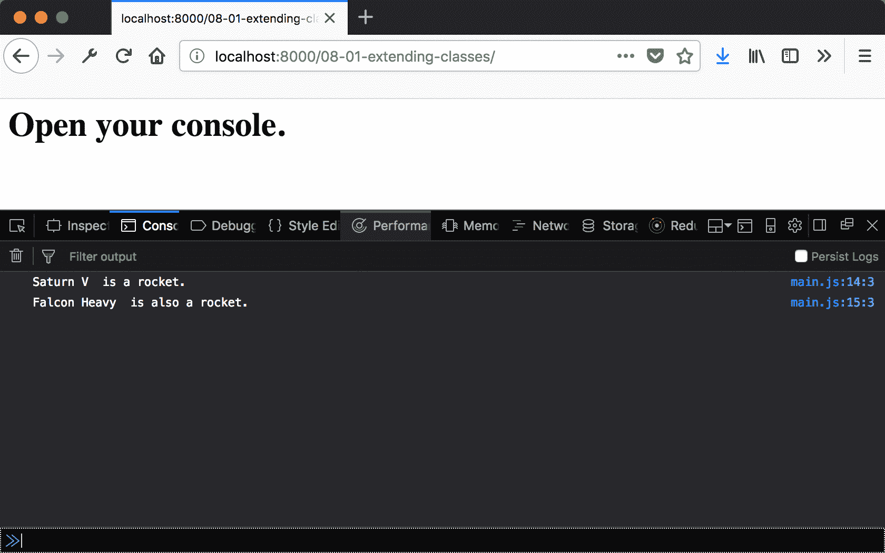
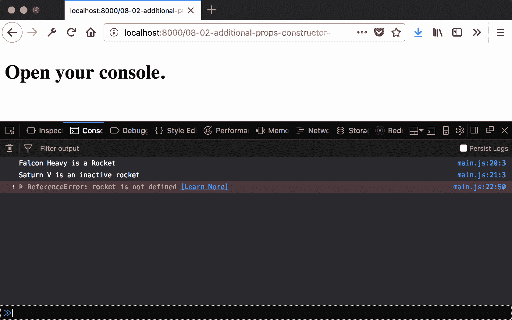
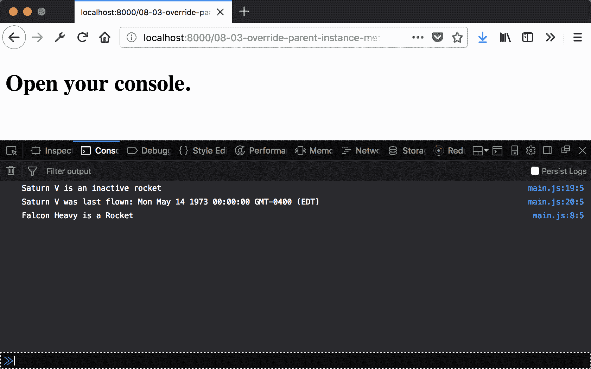
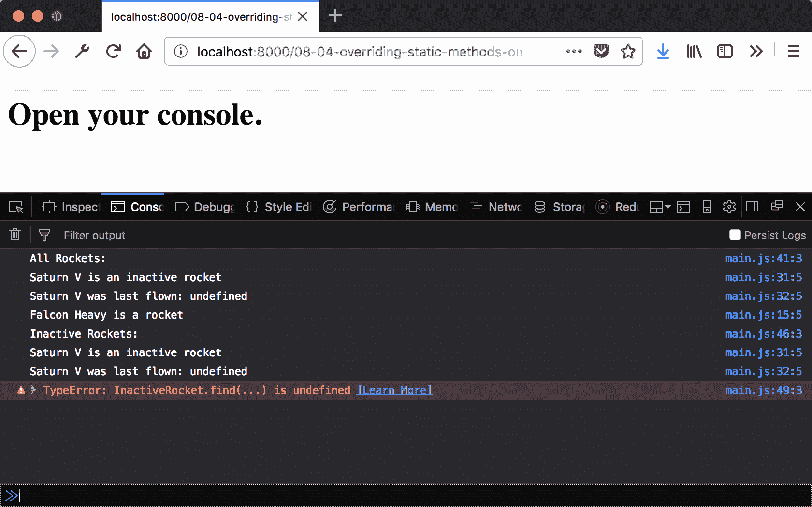
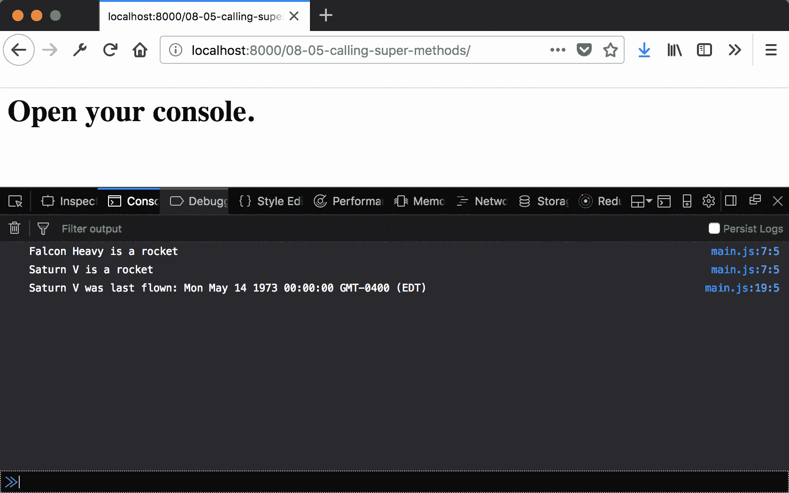
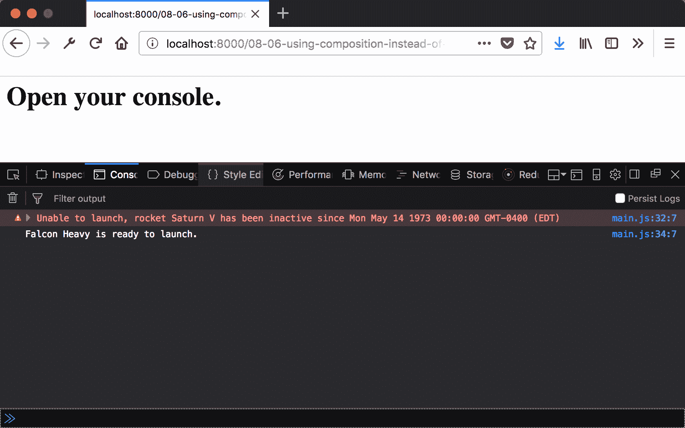
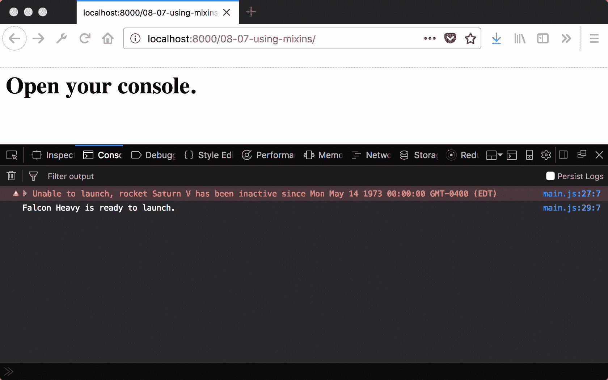
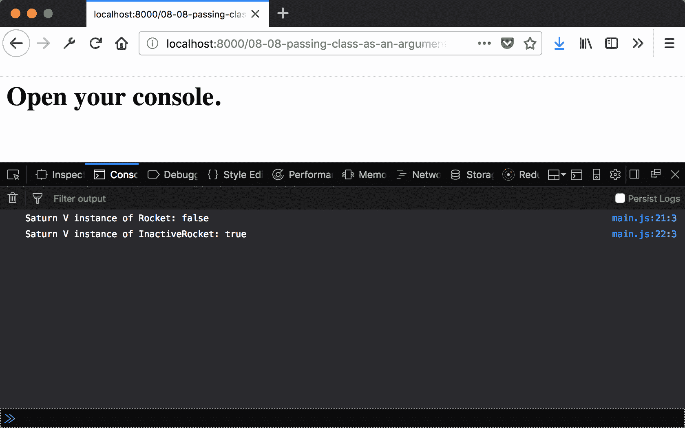
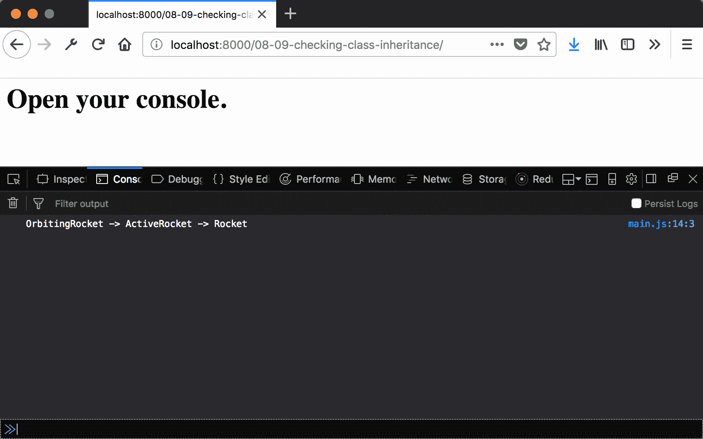
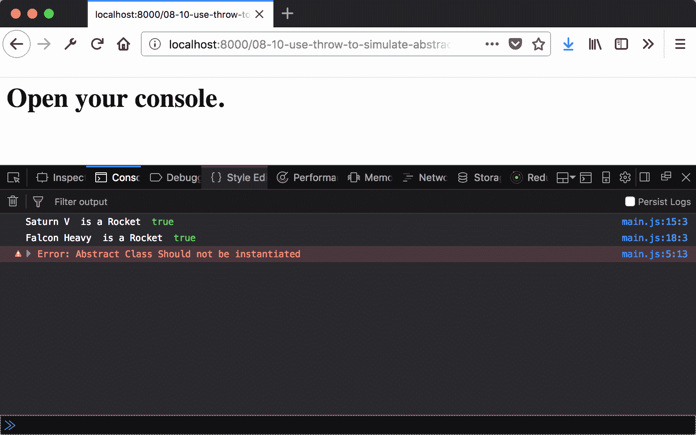

# 第八章：继承和组合

本章将涵盖以下内容：

+   扩展一个类

+   使用构造函数参数分配额外的属性

+   覆盖父类实例方法

+   覆盖父类静态方法

+   调用超类方法

+   使用组合而不是继承来添加行为

+   使用混入（mix-ins）来添加行为

+   将一个类作为参数传递

+   使用 Object.getPrototypeOf 检查类继承

+   使用 throw 来模拟抽象类

# 简介

在上一章中，我们看到了如何使用新的类语法来实现仅比直接使用原型实现稍微复杂的行为。开发者可能会认为这种语言复杂度不值得，毕竟，仅多一行（或可能是一个字符）就能得到相同的行为。

使用新的 ES6 类语法创建对象原型的真正优势在于使用更复杂结构和技术的过程中显现出来。本质上，我们将看到，当行为用关键字定义时，代码更容易理解，而不是用上下文敏感的操作符。

在本章中，我们将探讨如何使用类实现一些更复杂的行为。

# 扩展一个类

扩展类可以用来允许新的行为，同时遵循通用接口。虽然这并不是组织对象之间关系总是最好的方式，但在许多情况下，扩展（有时称为继承）是构建行为最有效的方法。

在本例中，我们将看到一个非常简单的扩展示例。

# 准备工作

本例假设您已经有一个工作区，允许您在浏览器中创建和运行 ES 模块。如果您没有，请参阅前两章。

# 如何做到这一点...

1.  打开您的命令行应用程序并导航到您的 workspace。

1.  创建一个名为 `08-01-extending-classes` 的新文件夹。

1.  复制或创建一个 `index.html` 文件，该文件从 `main.js` 加载并运行一个 `main` 函数。

1.  创建一个 `main.js` 文件，定义一个名为 `Rocket` 的新类，该类接受一个构造函数参数 `name` 并将其分配给实例属性：

```js
// main.js 
class Rocket { 
  constructor(name) { 
    this.name = name; 
  } 
} 
```

1.  创建一个名为 `InactiveRocket` 的类，它扩展了 `Rocket` 类：

```js
// main.js 
class InactiveRocket extends Rocket {} 
```

1.  创建一个 `main` 函数，创建两个类的实例并输出它们的名称：

```js
// main.js 
export function main() { 
  const saturnV = new InactiveRocket('Saturn V'); 
  const falconHeavy = new Rocket('Falcon Heavy'); 

  console.log(saturnV.name, ' is a rocket.'); 
  console.log(falconHeavy.name, ' is also a rocket.'); 
} 
```

1.  启动您的 Python 网络服务器并在浏览器中打开以下链接：

    `http://localhost:8000/`。

1.  您将看到以下输出：



# 它是如何工作的...

`classInactiveRocket` 扩展了 `Rocket`。这意味着除非被覆盖，否则 `Rocket` 原型上的所有属性最终都会出现在 `InactiveRocket` 的实例上。构造函数是特殊的，但也是 `Rocket` 原型上的一个属性。因此，当创建两个实例时，`Rocket` 类的构造函数会为 `Rocket` 和 `InactiveRocket` 实例执行。所以，我们看到两个实例上都分配了 `name` 属性。

我们将在未来的食谱中了解如何覆盖方法和其他行为。

# 使用构造函数参数分配额外的属性

如果我们正在扩展一个类，我们希望它有一些不同。否则，扩展它的意义何在？在本食谱中，我们将通过添加额外的属性来区分子类。

# 准备工作

本食谱假设您已经有一个工作区，允许您在浏览器中创建和运行 ES 模块。如果您没有，请参阅前两章。

# 如何操作...

1.  打开您的命令行应用程序并导航到您的 workspace。

1.  创建一个名为 `08-02-additional-constructor-args` 的新文件夹。

1.  创建一个 `main.js` 文件，定义一个名为 `Rocket` 的新类，该类接受一个构造函数参数 `name` 并将其分配给实例属性：

```js
// main.js 
class Rocket { 
  constructor(name) { 
    this.name = name; 
  } 
} 
```

1.  创建一个名为 `InactiveRocket` 的类，该类扩展了 `Rocket` 类，并在构造函数中分配一个额外的 `lastFlown` 属性：

```js
// main.js 
class InactiveRocket extends Rocket { 
  constructor(name, lastFlown) { 
    super(name); 
    this.lastFlown = lastFlown; 
  } 
} 
```

1.  创建一个 `main` 函数，该函数创建两个类的实例并输出它们的名称，以及 `InactiveRocket` 的 `lastFlown` 属性：

```js
// main.js 
export function main() { 
  const saturnV = new InactiveRocket('Saturn V', new Date('May 
  14,1973')); 
  const falconHeavy = new Rocket('Falcon Heavy'); 

  console.log(falconHeavy.name + ' is a Rocket'); 
  console.log(saturnV.name + ' is an inactive rocket'); 
  console.log(`${saturnV.name} was last flown:
  ${rocket.lastFlown}`); 
} 
```

1.  启动您的 Python 网络服务器并在浏览器中打开以下链接：

    `http://localhost:8000/`。

1.  您应该看到以下输出：



# 工作原理...

本食谱与前面的简单扩展示例不同。通过在 `InactiveRocket` 上实现构造函数，我们能够传递一组不同的参数。`lastFlown` 属性是 `InactiveRocket` 独有的。因此，我们在 `InactiveRocket` 的实例上看到该属性，但在 `Rocket` 的实例上没有看到。

您会注意到在 `InactiveRocket` 的构造函数中调用了 `super` 方法。这手动执行了当前实例的 `Rocket` 构造函数。这就是为什么 `name` 属性也被附加的原因。如果我们没有执行 `super`，那么 `Rocket` 构造函数就不会被调用。

这样，我们保留了父类 `Rocket` 的属性，并为 `InactiveRocket` 子类添加了一个额外的属性。

# 覆盖父类实例方法

理想情况下，类不仅包含属性，还定义行为。因此，子类也应该扩展行为，而不仅仅是添加额外的属性。

在本食谱中，我们将了解如何覆盖父类的方法。

# 准备工作

本食谱假设您已经有一个工作区，允许您在浏览器中创建和运行 ES 模块。如果您没有，请参阅前两章。

# 如何操作...

1.  打开您的命令行应用程序并导航到您的 workspace。

1.  创建一个名为 `08-03-defining-methods` 的新文件夹。

1.  复制或创建一个 `index.html` 文件，该文件加载并运行来自 `main.js` 的 `main` 函数。

1.  创建一个 `main.js` 文件，定义一个名为 `Rocket` 的新类**。** 添加一个构造函数，该构造函数接受一个构造函数参数 `name` 并将其分配给实例属性。然后，定义一个简单的 `print` 方法：

```js
// main.js 
class Rocket { 
  constructor(name) { 
    this.name = name; 
  } 

  print() { 
    console.log(this.name + ' is a Rocket'); 
  } 
}  
```

1.  创建一个名为`InactiveRocket`的类，它扩展了`Rocket`类，并在构造函数中分配一个额外的`lastFlow`属性。然后，覆盖`print`方法以包含新属性：

```js
// main.js 
class InactiveRocket extends Rocket { 
  constructor(name, lastFlown) { 
    super(name); 
    this.lastFlown = lastFlown; 
  } 

  print() { 
    console.log(this.name + ' is an inactive rocket'); 
    console.log(`${this.name} was last flown: 
    ${this.lastFlown}`); 
  } 
} 
```

1.  创建一个`main`函数，创建两个类的实例，并调用两个类的`print`方法：

```js
// main.js 
export function main() { 
  const saturnV = new InactiveRocket('Saturn V', new Date('May 
  14,1973')); 
  const falconHeavy = new Rocket('Falcon Heavy'); 

  [saturnV, falconHeavy].forEach((r) => r.print()); 
}  
```

1.  启动你的 Python 网络服务器，并在浏览器中打开以下链接：

    `http://localhost:8000/`.

1.  你应该看到以下输出：



# 它是如何工作的...

在类定义体中添加方法与将属性附加到函数的原型相同，其中函数是它们的值。这意味着这些属性被添加为新对象的实例属性。当调用这些方法时，上下文（`this`的值）是当前实例。

这与第六章中“在普通对象上定义函数属性作为方法”的菜谱类似，*普通对象*。在那个菜谱中，我们通过直接赋值来覆盖方法。相比之下，在这个菜谱中，我们在原型上这样做。这意味着这个覆盖适用于`InactiveRocket`子类的每个实例。

# 覆盖父类静态方法

我们之前已经看到，行为不仅限于类实例，也附加到类本身。这些`静态`方法也可以被子类覆盖。

在这个菜谱中，我们将看到如何覆盖静态方法。

# 准备工作

这个菜谱假设你已经有一个工作区，允许你在浏览器中创建和运行 ES 模块。如果你没有，请参阅前两章。

# 如何做到这一点...

1.  打开你的命令行应用程序，导航到你的工作区。

1.  创建一个名为`08-04-checking-with-instanceof`的新文件夹。

1.  复制或创建一个`index.html`，它从`main.js`加载并运行一个`main`函数。

1.  创建两个对象`rocketMap`和`inactiveRocketMap`：

```js
// main.js 
let rocketMap = {};  
let inactiveRocketMap = {}; 
```

1.  定义一个名为`Rocket`的新类。添加一个构造函数。使用名称将实例分配给`rocketMap`，并定义一个简单的`print`方法：

```js
// main.js 
class Rocket { 
  constructor(name) { 
    this.name = name; 
    rocketMap[name] = this; 
     } 
  print() { 
    console.log(this.name + ' is a rocket'); 
  } 
}  
```

1.  添加一个静态`find`方法，从`rocketMap`检索实例：

```js
// main.js 
class Rocket { 
  static find (name) { 
    return rocketMap[name]; 
  } 
} 
```

1.  创建一个名为`InactiveRocket`的类，它扩展了`Rocket`类，并在构造函数中分配一个额外的`lastFlow`属性。使用`name`将实例分配给`inactiveRocketMap`，并覆盖`print`方法以包含新属性：

```js
// main.js 
class InactiveRocket extends Rocket { 
 constructor(name, lastFlown) { 
    super(name); 
    this.lastFlown = lastFlown; 
    inactiveRocketMap[name] = this; 
  } 

  print() { 
    console.log(this.name + ' is an inactive rocket'); 
    console.log(`${this.name} was last flown: 
    ${this.lastFlown}`); 
  } 
} 
```

1.  添加一个静态`find`方法，从`rocketMap`检索实例：

```js
// main.js 
class InactiveRocket { 
  static find (name) { 
    return inactiveRocketMap[name]; 
  } 
} 
```

1.  创建一个`main`函数，创建两个类的实例，并尝试从映射中检索实例：

```js
// main.js 
export function main() { 
  const saturnV = new InactiveRocket('Saturn V'); 
  const falconHeavy = new Rocket('Falcon Heavy'); 

  // print rocket for saturn V and falcon heavy 
  console.log('All Rockets:'); 
  Rocket.find('Saturn V').print(); 
  Rocket.find('Falcon Heavy').print(); 

  // print inactive entry for saturn v and attempt falcon 
  console.log('Inactive Rockets:'); 
  InactiveRocket.find('Saturn V').print(); 
  // throws an error 
  InactiveRocket.find('Falcon Heavy').print(); 
} 
```

1.  启动你的 Python 网络服务器，并在浏览器中打开以下链接：

    `http://localhost:8000/`.

1.  你应该看到以下输出：



# 它是如何工作的...

就像实例方法一样，在子类上定义的静态方法会覆盖父类上的方法。我们创建了一个带有静态方法的`Rocket`类，该方法根据其名称定位`Rocket`实例。我们还创建了一个具有自己的`find`方法的`InactiveRocket`类，该方法在另一个映射中搜索。因为`InactiveRocket`类在其构造函数中调用`super`，所以两个类的实例都被添加到`Rocket`类`find`方法使用的映射中。而只有`InactiveRocket`类的实例被添加到该类`find`方法使用的映射中。

当我们在`Rocket`类上调用`find`时，我们能够检索到两个类的实例。你会注意到，我们无法使用`InactiveRocket`类的`find`方法定位`base`类的实例。

# 调用 super 方法

重写方法是扩展行为的好方法。然而，我们有时还想继续使用父类中的行为。通过使用`super`关键字来访问父类方法，这是可能的。

在这个食谱中，我们将看到如何使用这个关键字来访问这些方法。

# 准备工作

本食谱假设你已经有一个工作区，允许你在浏览器中创建和运行 ES 模块。如果你没有，请参阅前两章。

# 如何做...

1.  打开你的命令行应用程序，导航到你的工作区。

1.  创建一个名为`08-05-getters-read-only`的新文件夹。

1.  复制或创建一个`index.html`文件，该文件加载并运行来自`main.js`的`main`函数。

1.  创建一个`main.js`文件，定义一个名为`Rocket`的新类。添加一个接受构造函数参数`name`并将其分配给实例属性的构造函数。然后，定义一个简单的`print`方法：

```js
// main.js 
class Rocket { 
  constructor(name) { 
    this.name = name; 
  } 

  print() { 
    console.log(this.name + ' is a Rocket'); 
  } 
} 
```

1.  创建一个名为`InactiveRocket`的类，它扩展了`Rocket`类并在构造函数中分配一个额外的`lastFlow`属性。然后，重写`print`方法并调用`super.print`：

```js
// main.js 
class InactiveRocket extends Rocket { 
  constructor(name, lastFlown) { 
    super(name); 
    this.lastFlown = lastFlown; 
  } 

  print() { 
    super.print(); 
    console.log(`${this.name} was last flown: 
    ${this.lastFlown}`); 
  } 
} 
```

1.  创建一个`main`函数，创建两个类的实例并调用它们的`print`方法：

```js
// main.js 
export function main() { 
  const saturnV = new InactiveRocket('Saturn V', new Date('May 
  14, 1973')); 
  const falconHeavy = new Rocket('Falcon Heavy'); 

  falconHeavy.print(); 
  saturnV.print(); 
} 
```

1.  启动你的 Python 网络服务器，并在浏览器中打开以下链接：

    `http://localhost:8000/`.

1.  你应该看到以下输出：



# 它是如何工作的...

因为我们在`InactiveRocket`类中重写了`print`方法，调用该方法将执行该类中定义的代码，而不是父类。`super`关键字允许我们引用父类的原型。所以，当在`super`关键字上调用`print`方法时，将执行在父类原型上定义的方法。因此，我们可以看到`saturnV`实例的`print`方法的输出。

# 使用组合而不是继承来添加行为

到目前为止，我们已经看到了如何使用继承来添加行为和组合更大的结构。这并不总是理想的方法。在许多情况下，使用一种称为组合的方法会更好。这涉及到使用没有建立层次关系的不同类进行连接。这里的主要优势是代码清晰度和灵活性。

在这个菜谱中，我们将看到如何使用组合。

# 准备工作

这个菜谱假设你已经有一个工作区，允许你在浏览器中创建和运行 ES 模块。如果你没有，请参阅前两章。

# 如何操作...

1.  打开你的命令行应用程序并导航到你的工作区。

1.  创建一个名为 `08-06-using-composition-instead-of-inherritence` 的新文件夹。

1.  复制或创建一个 `index.html` 文件，该文件加载并运行来自 `main.js` 的 `main` 函数。

1.  创建一个 `main.js` 文件，定义一个名为 `Rocket` 的新类。添加一个接受构造函数参数 `name` 并将其分配给实例属性的构造函数。然后，定义一个简单的 `print` 方法：

```js
// main.js 
class Rocket { 
  constructor(name) { 
    this.name = name; 
  } 

  print() { 
    console.log(this.name + ' is a Rocket'); 
  } 
}  
```

1.  创建一个名为 `InactiveRocket` 的类，它扩展了 `Rocket` 类并在构造函数中分配一个额外的 `lastFlow` 属性。然后，重写 `print` 方法：

```js
// main.js 
class InactiveRocket extends Rocket { 
 constructor(name, lastFlown) { 
    super(name); 
    this.lastFlown = lastFlown; 
  } 

  print() { 
    console.log(this.name + ' is an inactive rocket'); 
    console.log(`${this.name} was last flown: 
    ${this.lastFlown}`); 
  } 
} 
```

1.  创建一个名为 `Launcher` 的类，它接受一个构造函数参数 `rocket`。添加一个名为 `prepareForLaunch` 的方法，如果火箭不活跃则中止：

```js
// main.js 
class Launcher { 
  constructor (rocket) { 
    this.rocket = rocket; 
  } 

  prepareForLaunch () { 
    const { rocket } = this; 

    if (rocket instanceof InactiveRocket) { 
      console.error(`Unable to launch, rocket ${rocket.name} has 
      been inactive since ${rocket.lastFlown}`); 
    } else { 
      console.log(`${rocket.name} is ready to launch.`); 
    } 
  } 
}  
```

1.  创建一个 `main` 函数，创建两个 `Launcher` 实例；每个火箭类一个：

```js
// main.js 
export function main() { 
  const saturnV = new InactiveRocket('Saturn V', new Date('May 
  14,1973')); 
  const falconHeavy = new Rocket('Falcon Heavy'); 

  const saturnVLauncher = new Launcher(saturnV); 
  const falconHeavyLauncher = new Launcher(falconHeavy); 

  saturnVLauncher.prepareForLaunch(); 
  falconHeavyLauncher.prepareForLaunch(); 
} 
```

1.  启动你的 Python 网络服务器并在浏览器中打开以下链接：

    `http://localhost:8000/`.

1.  你应该看到以下输出：



# 它是如何工作的...

在这个菜谱中，我们添加了一个类的实例（两个 `Rocket` 类中的一个）并在另一个类的实例（`Launcher`）中使用它，这两个类之间没有通过继承相关联。通过一个 `LaunchableRocket` 类添加这种发射功能是可能的，但随着火箭类型及其关系的变化，这会变得繁琐。

通常，通过继承添加行为是受限的；它应该限制在小的更改上，并且它们不应该在公共接口上有所不同。**依赖倒置原则（Dependency Inversion Principle）**（**DIP**）在考虑继承时是一个重要的概念。

访问以下链接了解 DIP（依赖倒置原则）的更多信息：[`en.wikipedia.org/wiki/Dependency_inversion_principle`](https://en.wikipedia.org/wiki/Dependency_inversion_principle).

# 使用混入添加行为

我们已经看到了如何使用继承和组合来添加行为。还有一种不同的组合方法，它在不使用继承的情况下将行为附加到现有类上。使用混入（mix-ins）可以在运行时将属性附加到对象实例。

在这个菜谱中，我们将看到如何使用混入（mix-ins）在不使用继承的情况下向类添加共享行为。

# 准备工作

此配方假设你已经有一个工作区，允许你在浏览器中创建和运行 ES 模块。如果你没有，请参阅前两章。

# 如何实现...

1.  打开你的命令行应用程序，导航到你的工作区。

1.  创建一个名为 `08-08-using-mixins` 的新文件夹。

1.  复制或创建一个 `index.html` 文件，该文件加载并运行来自 `main.js` 的 `main` 函数。

1.  创建一个名为 `main.js` 的文件，该文件定义了一个名为 `Rocket` 的新类。在构造函数中，使用名为 `Launcher` 的对象扩展当前实例：

```js
// main.js 
class Rocket { 
  constructor(name) { 
    Object.assign(this, Launcher); 
    this.name = name; 
  } 

  print() { 
    console.log(this.name + ' is a rocket'); 
  } 
}  
```

1.  创建一个名为 `InactiveRocket` 的类，该类继承自 `Rocket` 类，并在构造函数中分配一个额外的 `lastFlow` 属性：

```js
// main.js 
class InactiveRocket extends Rocket { 
 constructor(name, lastFlown) { 
    super(name); 
    this.lastFlown = lastFlown; 
  } 

  print() { 
    console.log(this.name + ' is an inactive rocket'); 
    console.log(`${this.name} was last flown: 
    ${this.lastFlown}`); 
  } 
} 
```

1.  创建一个名为 `Launcher` 的对象，该对象定义了一个名为 `prepareForLaunch` 的方法，如果火箭处于非活动状态，则该方法将终止：

```js
// main.js 
const Launcher = { 
  prepareForLaunch () { 
    if (this instanceof InactiveRocket) { 
      console.error(`Unable to launch, rocket ${this.name} has 
      been inactive since ${this.lastFlown}`); 
    } else { 
      console.log(`${this.name} is ready to launch.`); 
    } 
  } 
}  
```

1.  创建一个名为 `main` 的函数，该函数创建 `Rocket` 类的每个实例，并对每个实例调用 `prepareForLaunch` 方法：

```js
// main.js 

export function main() { 
  const saturnV = new InactiveRocket('Saturn V', new Date('May 
  14,1973')); 
  const falconHeavy = new Rocket('Falcon Heavy'); 

  saturnV.prepareForLaunch(); 
  falconHeavy.prepareForLaunch(); 
} 
```

1.  启动你的 Python 网络服务器，并在浏览器中打开以下链接：

    `http://localhost:8000/`.

1.  你应该看到以下输出：



# 它是如何工作的...

`Object.assign` 将一个对象的所有属性添加到另一个对象中。将 `Launcher` 的所有属性分配给新实例，使得在对象创建后这些属性可用。记住，`this` 上的方法只是具有函数值的原型上的属性。因此，以这种方式添加方法是定义这些方法在原型上的等效。

因此，在应用 `Object.assign` 混合后，我们可以调用在 `Launcher` 上定义的作为 `Rocket` 和 `InactiveRocket` 的实例方法的属性。

# 传递一个类作为参数

类，就像函数一样，是 JavaScript 的一等公民。这意味着它们可以从函数中返回或作为参数传递。在这个配方中，我们将看到如何使用后者。

# 准备就绪

此配方假设你已经有一个工作区，允许你在浏览器中创建和运行 ES 模块。如果你没有，请参阅前两章。

# 如何实现...

1.  打开你的命令行应用程序，导航到你的工作区。

1.  创建一个名为 `08-08-passing-class-as-an-argument` 的新文件夹。

1.  复制或创建一个 `index.html` 文件，该文件加载并运行来自 `main.js` 的 `main` 函数。

1.  创建一个名为 `main.js` 的文件，该文件定义了一个名为 `Rocket` 的新类：

```js
// main.js 
class Rocket {
  constructor(name) { 
    this.name = name; 
  }
}
```

1.  创建一个名为 `InactiveRocket` 的类，该类继承自 `Rocket` 类，并在构造函数中分配一个 `name` 和一个 `lastFlow` 属性：

```js
// main.js 
class InactiveRocket extends Rocket { 
 constructor(name, lastFlown) { 
    super(); 
    this.lastFlown = lastFlown; 
 } 
} 
```

1.  创建一个名为 `isA` 的函数，该函数接受一个实例和一个 `klass` 参数，如果构造函数是传递的类，则返回 `true`：

```js
// main.js 
function isA(instance, klass) { 
  return instance.constructor === klass; 
} 
```

1.  创建一个名为 `main` 的函数，该函数创建 `InactiveRocket` 的一个实例。调用 `isA` 方法来比较实例与两个 `Rocket` 类：

```js
// main.js 
export function main() { 
  const saturnV = new InactiveRocket('Saturn V', new Date('May 
  14,1973')); 

  console.log(saturnV.name + ' instance of Rocket: ' + 
  isA(saturnV,Rocket)); 
  console.log(saturnV.name + ' instance of InactiveRocket: ' + 
  isA(saturnV, InactiveRocket)); 
} 
```

1.  启动你的 Python 网络服务器，并在浏览器中打开以下链接：

    `http://localhost:8000/`.

1.  你应该看到以下输出：



# 它是如何工作的...

`isA`函数比较`instance`构造函数属性与传递的`klass`的标识。如果`instance`参数是`klass`的实例（在这种情况下，我们正在比较`InactiveRocket`类的实例），则返回`true`。对于任何其他类，包括`Rocket`，它将返回`false`。

因为我们是直接将构造函数与类进行比较，所以不考虑继承。如果我们使用`instanceOf`，该函数将返回`true`对于`Rocket`。

# 使用`Object.getPrototypeOf`检查类继承

我们已经看到了如何通过布尔表达式检查实例化类的继承和身份。我们可能还想一次性查看实例的完整继承关系。在这个菜谱中，我们将看到如何做到这一点。

# 准备工作

这个菜谱假设你已经有一个工作区，允许你在浏览器中创建和运行 ES 模块。如果你没有，请参阅前两章。

# 如何实现...

1.  打开你的命令行应用程序并导航到你的工作区。

1.  创建一个名为`08-09-checking-class-inheritance`的新文件夹。

1.  复制或创建一个`index.html`，该文件加载并运行来自`main.js`的`main`函数。

1.  创建一个定义三个新`Rocket`类的`main.js`文件：

```js
// main.js 
class Rocket {} 
class ActiveRocket extends Rocket {} 
class OrbitingRocket extends ActiveRocket {}  
```

1.  创建一个名为`listInheritance`的函数，它接受一个实例并使用`Object.getPrototypeOf`获取所有类直到达到 null 类型：

```js
// main.js 
function listInheritance (instance) { 
  const hierarchy = []; 
  let currClass = instance.constructor; 

  while (currClass.name) { 
    hierarchy.push(currClass.name); 
    currClass = Object.getPrototypeOf(currClass) 
  } 

  console.log(hierarchy.join(' -> ')); 
} 
```

1.  创建一个`main`函数，该函数创建一个`OrbitingRocket`实例并列出其继承关系：

```js
// main.js 
export function main() { 
  const orbitingRocket = new OrbitingRocket(); 
  listInheritance(orbitingRocket); 
} 
```

1.  启动你的 Python 网络服务器并在浏览器中打开以下链接：`http://localhost:8000/`。

1.  你应该看到以下输出：



# 它是如何工作的...

所有 JavaScript 原型都存在于一个层次结构中。这意味着每个原型都从一个另一个扩展而来，反过来又从另一个扩展而来。在层次结构的顶部是 null 类型。`Object.getPrototypeOf`沿着继承树向上遍历，从实例的原型一直爬到 null 类型。然后我们可以使用每个的`name`属性，这将给出该原型的名称（或在我们的情况下是类）。

# 使用`throw`来模拟抽象类

到目前为止，我们已经看到了如何创建和组合类以形成各种不同的形状。然而，有时我们想要能够防止创建一个类，并且只允许扩展类的实例。其他语言提供了一个称为抽象类的功能。在这个菜谱中，我们将看到如何通过抛出错误来模拟这一点。

# 准备工作

这个菜谱假设你已经有一个工作区，允许你在浏览器中创建和运行 ES 模块。如果你没有，请参阅前两章。

# 如何实现...

1.  打开你的命令行应用程序并导航到你的工作区。

1.  创建一个名为`08-10-use-throw-to-simulate-abstract-class`的新文件夹。

1.  复制或创建一个`index.html`，该文件加载并运行来自`main.js`的`main`函数。

1.  创建一个`main.js`文件，该文件定义一个名为`Rocket`的新类。在构造函数中，检查实例的构造函数，如果是`Rocket`，则抛出错误：

```js
// main.js 
class Rocket { 
  constructor (name) { 
    this.name = name; 
    if (this.constructor === Rocket) { 
      throw new Error('Abstract Class Should not be 
      instantiated'); 
    } 
  } 
}  
```

1.  创建`Rocket`的两个子类：

```js
// main.js 
class ActiveRocket extends Rocket {} 
class InactiveRocket extends Rocket {} 
```

1.  创建一个`main`函数，该函数创建每个火箭类实例。注意，`Rocket`类不能被实例化：

```js
// main.js 
export function main() { 
  const saturnV = new InactiveRocket('Saturn V'); 
  console.log(saturnV.name, ' is a Rocket ', saturnV instanceof 
  Rocket); 

  const falconHeavy = new ActiveRocket('Falcon Heavy'); 
  console.log(falconHeavy.name, ' is a Rocket ', falconHeavy 
  instanceof Rocket); 

  // throws an error; 
  new Rocket('Not going to make it!'); 
} 
```

1.  启动你的 Python 网络服务器，并在你的浏览器中打开以下链接：

    `http://localhost:8000/`.

1.  你应该看到以下输出：



# 它是如何工作的...

这样做的目的是强制用户扩展`Rocket`类，而不是直接实例化它。然而，我们仍然希望能够在`base`类中定义行为。在`Rocket`类的构造函数中，你可以看到这是如何实现的。通过比较实例的构造函数属性与`Rocket`，我们可以看到这个类是否被直接实例化。如果类被扩展，那么这个比较将评估为`false`，错误将不会抛出。因此，我们可以创建`ActiveRocket`和`InactiveRocket`实例。

当直接创建`Rocket`实例时，构造函数比较结果为`true`，错误被抛出。因此，我们无法创建`Rocket`类的实例，只能创建它的子类实例。
