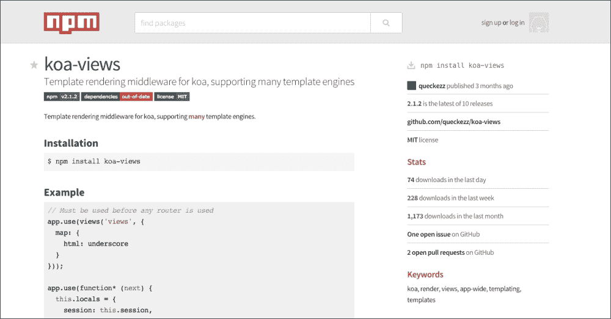
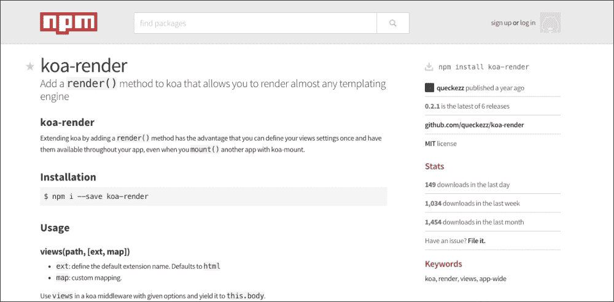
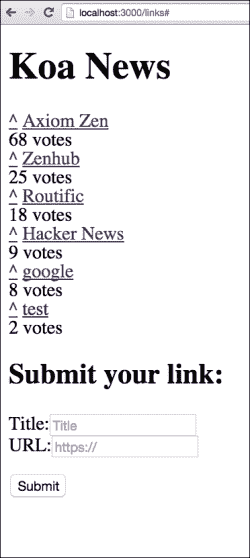

# 第六章：Koa.js 上的 Hacker News API

在本章中，我们将构建一个 API 来为我们的 Hacker News 提供动力！虽然从技术上讲，这与前几章不会有很大不同，但我们将使用完全不同的框架，即 Koa.js ([`koajs.com/`](http://koajs.com/))。

Koa.js 是由 Express 背后的团队设计的新型 Web 框架。他们为什么创建一个新的框架？因为它是从底层设计的，具有最小化的核心以实现更多模块化，并利用 ECMAScript 6 中提出的新的生成器语法，尽管它已经在 node 0.11 中实现。

### 注意

节点的不规则版本被认为是不可稳定的。在撰写本文时，最新的稳定版本是 0.10 版本。然而，当这本书付印时，node 0.12 终于发布，是当时的最新稳定版本。

node 0.11 的一个替代方案是 io.js，在撰写本文时达到了 1.0 版本，并实现了 ES6 的特性（从 Node.js 分叉并由少数几个 node 核心贡献者维护）。在本章中，我们将坚持使用 node 0.11。（当这本书付印时，node 0.12 最终发布，是当时的最新稳定版本。）

生成器语法的主要好处之一是您可以非常优雅地避免回调地狱，而无需使用复杂的 promise 模式。您甚至可以比以前更干净地编写您的 API。我们将讨论一些细微差别以及一些与尖端技术相关的注意事项。

本章我们将涵盖以下内容：

+   生成器语法

+   中间件哲学

+   上下文，与 req,res 对比

+   集中错误处理

+   Koa.js 中的 Mongoose 模型

+   使用 Thunkify 来使用 Express 模块

+   使用 Mocha 测试生成器函数

+   使用 co-mocha 进行并行 HTTP 请求

+   使用 koa-render 渲染视图

+   使用 koa-mount 和 koa-static 提供静态资源

# 生成器语法

生成器函数是 Koa.js 的核心，所以让我们直接深入剖析这个怪物。生成器允许熟练的 JavaScript 用户以全新的方式实现函数。Koa.js 利用新的语法以同步的方式编写代码，同时保持异步流程的性能优势。

以下定义了一个简单的生成器函数`src/helloGenerator.js`（注意星号语法）：

```js
module.exports = function *() {
  return 'hello generator';
};
```

要在 Koa.js 中使用 Mocha：

1.  您需要包含`co-mocha`以添加生成器支持，在测试文件的第一个行引入它是安全的方式。现在您可以将生成器函数传递给 Mocha 的`it`函数，如下所示：

    ```js
    require('co-mocha');
    var expect = require('chai').expect;
    var helloGenerator = require('../src/helloGenerator');

    describe('Hello Generator', function() {
      it('should yield to the function and return hello', function *() {
        var ans = yield helloGenerator();
        expect(ans).to.equal('hello generator');
      });
    });
    ```

1.  为了运行此代码，您需要安装 node 0.11 版本，并在运行 Mocha 时使用`--harmony-generators`标志：

    ```js
    ./node_modules/mocha/bin/mocha --harmony-generators
    ```

1.  如果一切顺利，恭喜您，您刚刚编写了您的第一个生成器函数！现在让我们更深入地探索生成器函数的执行流程。

    ### 注意

    注意`yield`关键字的神奇用法。`yield`关键字只能在`Generator`函数中使用，其工作方式与`return`类似，期望传递一个值，这个值也可以是一个生成器函数（也接受其他可`yield`的对象——稍后详细介绍），并将流程传递给该函数。

    当传递一个`function*`时，执行流程将等待该函数返回后才继续向下执行。本质上，它等同于以下回调模式：

    ```js
    helloGenerator(function(ans) {
      expect(ans).to.equal('hello generator');
    });
    ```

    更干净，对吧？比较以下代码：

    ```js
    var A = yield foo();
    var B = yield bar(A);
    var C = yield baz(A, B);
    ```

    如果没有生成器函数，会有一个讨厌的回调 hello：

    ```js
    var A, B, C;

    foo(function(A) {
      bar(A, function(B) {
        baz(A, B, function(C) {
          return C;
        });
      });
    });
    ```

    另一个很酷的优势是超级干净的错误处理，我们稍后会详细介绍。

    前面的例子不太有趣，因为`helloGenerator()`函数本质上是一个同步函数，所以即使我们没有使用生成器函数，它也会以相同的方式工作！

1.  让我们让它更有趣一些，将`helloGenerator.js`改为以下内容：

    ```js
    module.exports = function *() {
      setTimeout(function(){
        return 'hello generator';
      }, 1000);
    }
    ```

    等等！你的测试失败了？！这里发生了什么？嗯，`yield`应该将流程交给`helloGenerator()`函数，让它异步运行，并在完成后再继续。然而，`ans`是未定义的。没有人撒谎。

    它之所以是未定义的，是因为`generator()`函数在调用`setTimeout`函数后立即返回，该函数被设置为`ans`。本应从`setTimeout`函数内部返回的消息被广播到无尽的虚空，从此再也无处可见。

    ### 注意

    在生成器函数方面，有一点需要注意，一旦你使用了生成器函数，你最好坚持使用，不要在调用栈中回退到回调！回想一下，我们提到`yield`期望一个生成器函数。`setTimeout`函数不是一个生成器函数，所以我们怎么办？`yield`方法也可以接受一个 Promise 或 Thunk（稍后详细介绍）。

1.  `setTimeout()`函数不是一个 Promise，所以我们还有两个选择；我们可以将函数 thunkify，这基本上是将具有回调模式的普通 node 函数转换为一个 Thunk，这样我们就可以向它 yield；或者，我们可以使用 co-sleep，这是一个基本的小型 node 包，它已经为你做了以下事情：

    ```js
    module.exports = sleep;
    function sleep(ms) {
      return function (cb) {
        setTimeout(cb, ms);
      };
    }
    ```

1.  我们将在稍后讨论如何实现 thunkify，所以让我们先使用`co-sleep`。通常，重用现有资源的一个好方法就是快速在 npm 注册表中搜索。那里有大量的`co`包！

    ```js
    var sleep = require('co-sleep');

    module.exports = function *() {
      yield sleep(1000);
      return 'hello generator';
    }
    ```

1.  现在应该一切正常；在休眠 1 秒后，你的测试应该通过。

1.  注意，`co`库是 Koa.js 底层的实现，为其提供了基于生成器的控制流特性。如果你想在 Koa.js 之外使用这种流程，可以使用类似以下的方法：

    ```js
    var co = require('co');
    var sleep = require('co-sleep');

    co(function*(){
      console.log('1');
      yield sleep(10);
      console.log('3');
    });

    console.log('2');
    ```

## 中间件哲学

到现在为止，你应该已经熟悉 Express 中的中间件了。我们大量使用它们来简化代码，尤其是在验证和认证方面。在 Express 中，中间件被放置在接收请求的服务器和响应请求的处理程序之间。请求单向流动，直到在 `res.send` 或等效操作处终止。

在 Koa.js 中，一切都是中间件，包括处理程序本身。实际上，一个 Koa.js 应用程序只是一个对象，它包含一个中间件生成函数的数组！请求在整个中间件堆栈中流动，然后再返回。这最好用一个简单的例子来解释：

```js
var koa = require('koa');
var app = koa();

app.use(function *(next){
  var start = new Date();
  yield next;
  var ms = new Date() - start;
  this.set('X-Response-Time', ms + 'ms');
});

app.use(function *(){
  this.body = 'Hello World';
});

app.listen(3000);
```

这里有一个包含两个中间件的 Koa.js 应用程序。第一个中间件为响应添加一个 `X-Response-Time` 头部，而第二个中间件简单地为每个请求设置响应体为 `Hello World`。流程如下：

+   请求在端口 `3000` 上到来。

+   第一个中间件接收执行流程。

+   创建一个新的 `Date` 对象并将其分配给 `start`。

+   流量将控制权交给堆栈中的下一个中间件。

+   第二个中间件将 `body` 设置为 Context 中的 `Hello World`。

+   由于没有更多的中间件在堆栈中要 `yield`，流程返回上游。

+   第一个中间件再次接收执行流程并继续向下。

+   计算响应时间并设置响应头。

+   请求已到达顶部，Context 被返回。

### 注意

Koa.js 不再使用 `req` 和 `res`；它们被封装到一个单一的 Context 中。

要运行此应用程序，我们可以使用以下命令：

```js
node --harmony app.js
```

## Context 与 req,res 的比较

为每个传入的请求创建一个 Koa.js Context。在每个中间件中，你可以使用 `this` 对象访问 Context。它包括 `this.request` 和 `this.response` 中的请求和响应对象，尽管大多数方法和访问器都直接从 Context 中可用。

最重要的属性是 `this.body`，它设置响应体。当设置响应体时，响应状态自动设置为 `200`。你可以通过手动设置 `this.status` 来覆盖它。

另一个非常有用的语法糖是 `this.throw`，它允许你通过简单地调用 `this.throw(400)` 来返回错误响应，或者如果你想覆盖标准的 HTTP 错误消息，你可以传递一个带有错误消息的第二个参数。我们将在本章后面讨论 Koa.js 的流畅错误处理。

既然我们已经掌握了基础知识，让我们开始构建一个 Hacker News API 吧！

### 链接模型

以下代码描述了 `src/models/links.js` 中的直接链接文档模型：

```js
var mongoose = require('mongoose');

var schema = new mongoose.Schema({
  title: { type: String, require: true },
  URL: { type: String, require: true },
  upvotes: { type: Number, require: true, 'default': 0 },
  timestamp: { type: Date, require: true, 'default': Date.now }
});

schema.statics.upvote = function *(linkId) {
  return yield this.findByIdAndUpdate(linkId, {
    $inc: {
      upvotes: 1
    }
  }).exec();
};

var Links = mongoose.model('links', schema);
module.exports = Links;
```

注意，这基本上与你在 Express 中定义模型的方式相同，只有一个例外：`upvotes` 静态方法。由于 `findByIdAndUpdate` 是一个异步 I/O 操作，我们需要确保我们 `yield` 到它，以确保在继续执行之前等待此操作完成。

之前我们提到，不仅生成器函数可以被传递，它还接受 Promises，这很棒，因为它们非常普遍。例如，使用 Mongoose，我们可以通过调用 `exec()` 方法将 Mongoose 查询实例转换为 Promises。

### 链接路由

在放置好链接模型后，让我们在 `src/routes/links.js` 中设置一些路由：

```js
var model = require('../models/links');

module.exports = function(app) {
  app.get('/links', function *(next) {
    var links = yield model.find({}).sort({upvotes: 'desc'}).exec();
    this.body = links;
  });

  app.post('/links', function *(next) {
    var link = yield model.create({
      title: this.request.body.title,
      URL: this.request.body.URL
    });
    this.body = link;
  });

  app.delete('/links/:id', function *(next) {
    var link = yield model.remove({ _id: this.params.id }).exec();
    this.body = link;
  });

  app.put('/links/:id/upvote', function *(next) {
    var link = yield model.upvote(this.params.id);
    this.body = link;
  });
};
```

这应该开始看起来熟悉了。我们不再使用在 Express 中我们习惯的带有 (`req, res`) 签名的函数处理器，而是简单地使用中间件生成函数，并在 `this.body` 中设置响应体。

### 整合在一起

现在我们已经定义了我们的模型和路由，请执行以下步骤：

1.  让我们在 Koa.js 应用程序中 `src/app.js` 中将其整合起来：

    ```js
    var koa = require('koa'),
        app = koa(),
        bodyParser = require('koa-body-parser'),
        router = require('koa-router');

    // Connect to DB
    require('./db');

    app.use(bodyParser());
    app.use(router(app));
    require('./routes/links')(app);

    module.exports = app;
    ```

    ### 注意

    注意，我们使用 `koa-body-parser` 来解析请求体 `this.request.body` 和 `koa-router`，它允许您定义类似 Express 风格的路由，就像您之前看到的那些。

1.  接下来，我们连接到数据库，这与前面的章节没有不同，所以我们将在这里省略代码。

1.  最后，我们定义 Koa 应用程序，挂载中间件，并加载路由。然后，在根目录中，我们有 `/app.js`，如下所示：

    ```js
    var app = require('./src/app.js');
    app.listen(3000);
    console.log('Koa app listening on port 3000');
    ```

这只是加载应用程序并启动一个监听端口 `3000` 的 HTTP 服务器。现在要启动服务器，请确保您使用 `--harmony-generators` 标志。您现在应该有一个可以驱动类似 Hacker News 网站的 Koa API 了！

# 验证和错误处理

错误处理是 Koa.js 的一个强项。使用生成器函数，我们不需要在回调的每一层处理错误处理，避免了 Node.js 流行起来的 (`err, res`) 签名回调的使用。我们甚至不需要使用 Promises 的 `.error` 或 `.catch` 方法。我们可以使用 JavaScript 自带的 `try/catch`。

这意味着我们现在可以有以下集中的错误处理中间件：

```js
var logger = console;

module.exports = function *(next) {
  try {
    yield next;
  } catch (err) {
    this.status = err.status || 500;
    this.body = err.message;
    this.app.emit('error', err, this);
  }
};
```

当我们将这个中间件作为 Koa 栈中的第一个中间件之一包含时，它将基本上将整个栈（向下传递）包裹在一个巨大的 `try/catch` 子句中。现在我们不需要担心异常被抛入空中。事实上，现在您被鼓励抛出常见的 JavaScript 错误，因为您知道这个中间件会优雅地为您解包它，并将其呈现给客户端。

然而，这并不总是您想要的。例如，如果您尝试对一个不是有效 BSON 格式的 ID 进行点赞，Mongoose 将会抛出带有消息 `Cast to ObjectId failed for value xxx at path _id` 的 `CastError`。虽然对您来说很有信息量，但对客户端来说却相当糟糕。所以，您可以这样通过返回一个带有良好、清晰信息的 `400` 错误来覆盖这个错误：

```js
app.put('/links/:id/upvote', function *(next) {
  var link;
  try {
    link = yield model.upvote(this.params.id);
  } catch (err) {
    if (err.name === 'CastError') {
      this.throw(404, 'link can not be found');
    }
  }

  // Check that a link document is returned
  this.assert(link, 404, 'link not found');

  this.body = link;
});
```

我们基本上在错误发生的地方捕获它，而不是让它一直冒泡到错误处理器。虽然我们可以抛出一个带有 `status` 和 `message` 字段设置的 JavaScript 错误对象，将其传递给错误处理器中间件，但我们也可以直接使用上下文对象的 `this.throw` 辅助函数来处理它。

现在如果你传递了一个有效的 BSON ID，但链接不存在，Mongoose 不会抛出错误。因此，你仍然需要检查 `link` 的值是否不是 `undefined`。这里又是上下文对象的一个漂亮的辅助函数：`this.assert`。它基本上断言一个条件是否满足，如果不满足，它将返回一个带有消息 `link` `not` `found` 的 `400` 错误，该消息作为第二个和第三个参数传递。

这里还有一些对链接提交的验证：

```js
app.post('/links', function *(next) {
  this.assert(typeof this.request.body.title === 'string', 400, 'title is required');
  this.assert(this.request.body.title.length > 0, 400, 'title is required');

  this.assert(utils.isValidURL(this.request.body.URL), 400, 'URL is invalid');

  // If the above assertion fails, the following code won't be executed.
  var link = yield model.create({
    title: this.request.body.title,
    URL: this.request.body.URL
  });
  this.body = link;
});
```

我们确保传递了一个标题以及一个有效的 URL，为此我们使用了以下正则表达式工具：

```js
module.exports = {
  isValidURL: function(url) {
    return /(ftp|http|https):\/\/(\w+:{0,1}\w*@)?(\S+)(:[0-9]+)?(\/|\/([\w#!:.?+=&%@!\-\/]))?/;
  }
};
```

现在仍然有方法可以将验证检查重构为模块化中间件；类似于我们在 第三章 中所做的那样，*多人游戏 API - Connect* 这留作读者的练习。

# 更新路由

一个 CRUD API 如果没有更新路由是不完整的！如果你是 Hacker News 的常客，你会知道提交的标题可能会改变（但 URL 不会变）。这个路由应该是直接的，但有一个注意事项！是的，你可以使用 `findByIdAndUpdate`，这是 `upvote` 使用的，但如果你想使用 Mongoose 的实例方法 `.save()` 呢？

嗯，它不返回 Promise，所以我们不能 `yield` 到它。实际上，在撰写本文时，关于这一点仍然有一个开放的问题。使用 `save()`，我们只能使用传统的回调模式。然而，记住规则——不要将生成器函数与回调混合！

那么，接下来该做什么呢？嗯，对于某些节点模块只以回调格式提供的情况将相当普遍。虽然大多数常见模块都已转换为 Koa 版本，但你仍然可以使用 Express 包；你只需要将它们 `thunkify`。实际上，你可以将任何回调风格的函数转换为 thunk。

```js
npm install --save thunkify
```

现在来看看如何将接受回调的函数转换为可 `yield` 的 thunk：

```js
var thunk = require('thunkify');

...

// Thunkify save method
Links.prototype.saveThunk = thunk(Links.prototype.save);
```

将前面的代码添加到 `model/links.js` 中后，我们可以在更新路由中执行以下操作：

```js
app.put('/links/:id', function *(next) {
  this.assert((this.request.body.title || '').length > 0, 400, 'title is required');

  var link;
  try {
    link = yield model.findById(this.params.id).exec();
  } catch (err) {
    if (err.name === 'CastError') {
      this.throw(400, 'invalid link id');
    }
  }

  // Check that a link document is returned
  this.assert(link, 400, 'link not found');

  link.title = this.request.body.title;
  link = yield link.saveThunk()[0];
  this.body = link;
});
```

注意底部附近对 `saveThunk()` 的使用。它基本上是原始 `save()` 方法的 `thunkified` 版本。这意味着原本作为回调的第一个参数传递的错误现在被抛出为一个 Error。我们可以承担不将其包裹在 `try/catch` 块中的风险，因为错误处理中间件会捕获它并抛出一个 `500` 错误，这在这种情况下是合适的。

此外，请注意 thunk 返回一个数组。这是因为原始回调的参数数量为`3`。第一个参数是错误，第二个参数是新的文档，第三个参数是受影响的文档数量。thunk 返回的数组包含后两个值。如果回调的参数数量是`2`，它将只返回值；这是一个需要注意的点。

# 让我们进行一些测试

在本章中，我们省略了纪律性的 TDD 方法，因为在前面的章节中已经多次介绍过。然而，在 Koa.js 中，测试略有不同，所以让我们突出一些这些差异。

我们仍然可以使用 supertest 以我们之前干净的方式使用，但需要稍作调整，如下所示：

```js
var app = require('../src/app').callback();
```

我们需要调用`.callback()`方法来返回一个对象，我们可以将其传递给 supertest。实际上，返回的对象甚至可以挂载在 Express 应用之上。

测试提交链接的路由相当直接：

```js
var app = require('../src/app').callback(),
    Links = require('../src/models/links');

describe('Submit a link', function() {

  before(function(done) {
    Links.remove({}, function(err) {
      done();
    });
  });

  it('should successfully submit a link', function (done) {
    request(app).post('/links')
      .send({title: 'google', URL: 'http://google.com'})
      .expect(200, done);
  });
```

在这个测试套件的开始，我们在数据库中清空集合，并通过 POST 请求提交一个链接。这里没有什么特别的；请注意，我们使用 Mocha 的默认回调函数处理异步请求，而不是`co-mocha`。

让我们提交更多链接，并检查它们是否确实存储在数据库中：

```js
  it('should successfully submit another link', function (done) {
    request(app).post('/links')
      .send({title: 'Axiom Zen', URL: 'http://axiomzen.co'})
      .expect(200, done);
  });

  it('should successfully submit a third link', function (done) {
    request(app).post('/links')
      .send({title: 'Hacker News', URL: 'http://news.ycombinator.com'})
      .expect(200, done);
  });

  // To be used in next test
  var linkIDs = [];
  it('should list all links', function (done) {
    request(app).get('/links')
      .expect(200)
      .end(function(err, res) {
        var body = res.body;
        expect(body).to.have.length(3);

        // Store Link ids for next test
        for(var i = 0; i < body.length; i++) {
          linkIDs.push(body[i]._id);
        }
        done();
      });
  });
```

注意，我们将链接 ID 存储在一个数组中，以便在下一个测试用例中演示 Koa.js 的最终、最酷的附加功能——开箱即用的并行异步请求！

## 并行请求

Hacker News 的后端应该能够处理竞争条件，也就是说，它应该能够处理数百个并发的`upvote`请求而不会丢失数据（回忆第四章，关于竞争条件的*MMO Word Game*）。因此，让我们编写一个模拟并行请求的测试用例。

传统上，你可能会立即想到使用功能强大且流行的`async`库，它提供了许多非常有用的工具来处理复杂的异步执行流程。`async`提供的一个最有用的工具是`async.parallel`，你可以用它来并行执行异步请求。它曾经是并行请求的首选解决方案，但现在 Koa 提供了开箱即用的功能，并且语法更加简洁！

请记住，`co`实际上是赋予 Koa 生成器功能力量的东西，因此请参考`co`项目的 readme 页面，了解更多它提供的所有模式。

到目前为止，我们已经产出到了生成器函数、Promises 和 thunks。然而，这还不是全部。你还可以`产出`一个前一个数组的数组，这将并行执行它们！下面是如何做的：

```js
// Add to top of file
require('co-mocha');
var corequest = require('co-supertest');

…

  it('should upvote all links in parallel', function *() {

    var res = yield linkIDs.map(function(id) {
     return corequest(app)
        .put('/links/' + id + '/upvote')
        .end()
    });
;

    // Assert that all Links have been upvoted
    for(var i = 0; i < res.length; i++) {
      expect(res[i].body.upvotes).to.equal(1);
    }

  });
```

首先，注意我们使用了一个生成器函数，所以请确保你在测试文件顶部有`require(co-mocha)`。

其次，`supertest`不返回一个 thunk 或 promise，我们可以从中产出，因此我们需要为这个测试用例使用`co-supertest`：

```js
npm install co-supertest --save-dev
```

第三，我们构建一个稍后要执行的请求数组。我们基本上是将 thunks 推入一个数组；它们也可以是承诺。现在当我们产生这个数组时，它将并行执行所有请求，并返回所有响应对象的数组！

如果你习惯了使用 `async.parallel` 来做这些事情，这会让你感到非常震撼，对吧？

## 渲染 HTML 页面

到目前为止，我们有一个简单的 Koa API，它已经对所有基本功能进行了相当充分的测试。现在让我们在上面添加一个简单的视图层，以展示如何从 Koa 应用程序中提供静态文件。所以如果应用程序收到浏览器对 HTML 内容的请求，我们将提供一个功能性的网页，我们可以看到提交的链接，提交一个链接，以及点赞一个链接。

让我们在这里暂停一下，快速分享一个真实开发者的生活趣事来实现前面的功能。模块化的趋势是开源社区的一个强大动力。现代开发者可以访问大量经过良好测试的模块。通常，开发者的主要工作只是将几个这样的模块组合成一个应用程序。我们从以往的经验、书籍、新闻网站、社交媒体等地方了解到这些模块。那么我们如何选择合适的工具而不是重新发明轮子呢？

总是建议先进行简单的搜索，看看是否已经有现成的模块可用。在这种情况下，我们感兴趣的是使用 Koa.js 渲染视图，所以让我们在 [www.npmjs.com](http://www.npmjs.com) 上尝试搜索词 `koa-render`。出现了两个流行的包，看起来非常适合我们的需求，如下面的截图所示：



`koa-views` 是 Koa 的模板渲染中间件，支持许多模板引擎。听起来很有希望！`koa-render` 为 Koa 添加了一个 `render()` 方法，允许你渲染几乎任何模板引擎。也不算差。如下面的截图所示：



我们可以查看的一些指导我们选择的事项之一是下载量；这两个包都有相当多的下载量，这表明它们有一定的可信度。`koa-views` 每个月的下载量是 `koa-render` 的约 5 倍。虽然这些徽章只是小细节，但它确实表明作者非常关心，并且很可能支持它。项目 GitHub 页面上的最近提交次数也是一个很好的指标，包括已解决的 issue 数量等。

在撰写本文时，这两个项目的 GitHub 链接都重定向到 `koa-views`，这出人意料，但对我们来说是个好消息！查看 `koa-render` 的作者 GitHub 账户，我们找不到这个项目了，所以可以安全地假设它已经被废弃；避免使用它！当你有机会时，尽量避免使用不可维护的包，因为考虑到 Node.js（和 io.js）是快速发展的生态系统，这可能会构成威胁。

回到渲染 HTML 页面，与 Express 不同，Koa 对视图的渲染没有预设的意见。然而，它确实为我们提供了一些内容协商的机制，其中一些我们可以用来增强和重用我们为 API 已经拥有的路由。让我们看看我们的 `/links` 处理器将是什么样子：

```js
  app.get('/links', function *(next) {
    var links = yield model.find({}).sort({upvotes: 'desc'}).exec();
    if( this.accepts('text/html') ){
      yield this.render('index', {links: links});
    } else {
      this.body = links;
    }
```

我们的使用案例相当简单；我们要么提供 JSON 或 HTML。当请求头 `accepts` 设置为 `text/html`，这是浏览器自动设置的，我们将渲染 HTML。为了使动态 jade 视图渲染正常工作，我们必须在 `app.js` 中在路由中间件之前某处包含 `koa-views` 中间件：

```js
var views = require('koa-views');

...

app.use(views('./views', {default: 'jade'}));
```

中间件指向一个包含模板的文件夹，其相对路径如下。目前，我们只需要一个单独的模板 `views/index.jade`：

```js
doctype html
html(lang="en")
  head
    title Koa News
  body
    h1 Koa News
    div
      each link in links
        .link-row
          a(href='#', onclick="upvote('#{link._id}', $(this))") ^
          span &nbsp;
          a(href=link.URL)= link.title
          .count= link.upvotes
            |  votes
    h2 Submit your link:
    form(action='/links', method='post')
      label Title:
      input(name='title', placeholder="Title")
      br
      label URL:
      input(name='URL', placeholder="https://")
      br
      br
      button.submit-btn Submit
    script(src="img/jquery-2.1.3.min.js")
    script.
      var upvote = function(id, elem) {
        $.ajax({url:'/links/'+id+'/upvote', type:'put' })
        .done(function(data) {
          elem.siblings('.count').text(data.upvotes + ' votes');
        })
      }
```

这是一个与本书中之前展示的类似的 jade 文件。它遍历控制器中加载的每个链接，控制器有一个单动作用于点赞。链接按投票数降序显示，这仅在页面重新加载时发生。还有一个简单的表单，允许用户提交新的链接。

我们选择从 CDN 加载 jQuery，只是为了简化 `PUT` 请求点赞的过程。请注意，除了使这个例子易于理解之外，我们强烈不建议使用内联 JavaScript 以及使用 onclick 元素添加点击事件。

现在如果您已经运行了您的应用程序，并且您访问 `localhost:3000/links`，这里的结果如下：



所以，从功能角度来看，这是一个起点！如果我们想添加更多的前端 JavaScript 和 CSS 样式，这显然还不够好；我们仍然需要能够提供静态文件。

## 服务器静态资源

虽然通常您会被鼓励为您的资源创建一个单独的服务器，但让我们保持简单，直接进入目标。我们想要从某个文件夹向某个基本路径提供任何文件。为此，我们需要两个小的中间件，分别是 `koa-static` 和 `koa-mount`。在 `src/app.js` 中，我们添加以下内容：

```js
var serve = require('koa-static');
var mount = require('koa-mount');

// ..

app.use(mount('/public', serve('./public') ));
```

函数 `mount()` 将为每个后续的中间件命名空间请求，在这个特定的情况下，它是与 `serve` 结合使用的，这将服务于 `public/` 目录内的任何文件。如果我们决定不对任何特定的 URL 进行挂载，文件服务仍然可以工作；只是它不会有漂亮的命名空间。

现在您只需要在根目录中创建一个 `public/` 目录，并包含 `filepublic/main.css` 文件，它将能够提供样式表。

此方法允许提供您期望的所有静态文件；CSS、JavaScript、图像，甚至是视频。

为了更进一步，有许多前端资源构建工具和最佳实践，包括使用 Grunt、Gulp、Browserify、SASS、CoffeeScript 以及许多其他工具来设置资源管道。更不用说前端框架，如 Angular、Ember、React 等。这只是开始。

希望您喜欢 Koa.js 的介绍！

# 摘要

我们构建了一个 API，您现在可以使用它来托管自己的 Hacker News of X！显然，我们仍然缺少排序和衰减算法，以及评论功能，但既然您已经走到这一步，这应该对您来说是一个简单的练习。

这章的目的实际上是为了让您领略 Koa.js 的便捷特性，并展示生成器函数模式的使用，该模式将在 ECMAScript 6 中提供。如果您喜欢走在技术前沿，并且喜欢生成器语法，那么这绝对是一个比 Express.js 更好的替代方案。
