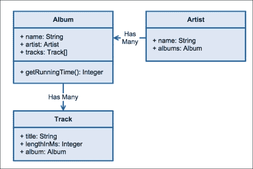
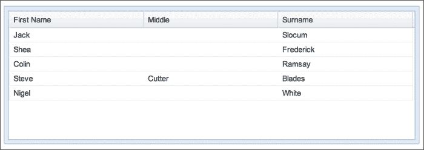

# 第一章. 引言

学习如何理解一行代码，构建第一个“Hello World”脚本，并在它按预期工作时的兴奋感，这些都是吸引我们进入编程世界的小步骤。这本书是关于我们在这个世界中可以使用 Sencha 的 Ext JS 5 构建的项目，以及如何确保你是在一个坚实的基础之上构建。

在本章中，我们将从理论和实践的角度探讨为什么强大的应用程序架构很重要。我们将介绍本书的其余部分，并回答以下问题：

+   应用程序架构是什么？

+   它为什么很重要？

+   Ext JS 如何帮助进行应用程序设计？

+   这本书将如何帮助您提升软件架构？

让我们先来谈谈我们所说的软件架构是什么，以及为什么它对于一个成功的项目来说如此重要。

# 谦逊的起点

作为程序员，我们中的许多人可能都是从编写对我们有帮助的脚本或代码开始的，这些脚本或代码帮助我们的爱好。那种兴奋感，那种你可以创建实用和有用的东西的洞察力，这就是激情的起点。正是这些匆忙拼凑起来的最初几行代码，许多人都建立了自己的职业生涯。

在那些早期日子里，我们发现自己编写了数百行的代码，但并没有考虑到如果我们六个月后回来会是什么样子。它是否容易理解？在不破坏其他东西的情况下能否添加一个功能？此外，如果我们想与他人或互联网上分享它怎么办？试图找出错误的原因将迅速变成一场噩梦。

事实上，互联网上充斥着这样的代码。这为什么会成为问题？假设你被卷入为一个朋友构建一个简单的购物车。你足够了解使其工作，但也足够危险。购物车负责处理商品的支付，一个安全漏洞可能导致有人损失钱财。突然之间，你为朋友做的善事变成了让他们丢脸和损失金钱的事情。

幸运的是，就我而言，作为一个编码的新手，我缺乏开发专业知识并没有带来太大的影响。我创建了一个 PHP 脚本。这个脚本为网站生成相册。它最初是一系列照片，后来扩展到包括缩略图生成、分页和行政/上传功能。这是一个传统上糟糕的 PHP 示例，其中 HTML 与逻辑代码混合，以及意大利面般的循环来尝试使它按我的意愿工作。

随着时间的推移，解决方案会自然产生；我们开始将我们的工作分解成对应用程序有意义的更小的部分。随着代码库的增长，将逐渐变得清晰，有合理的工作方式会使生活变得更轻松。在相册示例中，我可以开始提取非常简单的方面（例如标题、页脚和分页链接），以便专注于核心功能。

当然，并不是每个人都以这种方式开始。将爱好发展成为职业只是编码社区发展技能集的一条途径。大学或在线课程、书籍和论坛都有助于我们的学习过程。重要的是要记住，无论是程序员还是架构师，都不是生来就知道一切的，承认自己的知识有差距是正常的，甚至是必要的。从资深顾问到业余黑客，我们将尽力填补这些差距，随着你构建更大、更复杂的应用程序。

## 成长

与其编写仅供爱好或副项目的代码，我们现在编写的是帮助运营企业的应用程序。有人正在为这种开发时间付费，有人的生活依赖于它。作为专业的软件开发者，我们需要采取专业的心态和技能集。与其立即坐下来编码一个想法，我们需要仔细考虑我们的应用程序是如何构建的。我们需要确保它在现实世界的用户接触到它时能够按预期工作；这将提供一个强大的平台，供未来的开发者在此基础上构建。

作为软件开发者，我们可能要负责成千上万行代码——在许多情况下更多——并且可能在一个由各种其他个人组成的团队中工作。在这个规模上，设计不良的应用程序可能会变得难以控制、不可靠且难以测试。

它难以控制，因为没有强大的设计，功能是按需附加的，建立在已经摇摇欲坠的基础上；不可靠，因为这种摇摇欲坠的基础有裂缝，布满了虫子，难以测试，因为系统的各个部分如此交织在一起，以至于每个组件都没有一个明确的职责和能力集合。

这就是将一个想法付诸实践的危险；你可能会创建出像花园里杂草一样失控的代码。设计是关键，因为它允许你成为园丁（仔细照料系统成长的每一个方面）。我们希望为我们的团队成员提供一个清晰、积极的起点，并在此基础上构建。

我们希望在应用程序中创建的结构应该在我们想要创建的结构中，应该给我们清晰的划分，一个组件与另一个组件之间。系统的每个部分都应该对自己负责，而无需更多（在一个更大的机器中的一个小部分）。我们的代码层（从数据到展示以及所有中间的连接）也应该清晰明确，因为没有人想看到模板直接与后端服务对话。

这是一个典型的重叠关注示例。在这个演示中，代码永远不应该担心获取数据，而应该关注如何展示。通过强大的结构和从一开始就实施的应用程序设计，可以轻松避免许多此类问题。

## 巨人的肩膀

在我们之前，许多人已经走上了可扩展性的道路。值得记住的是，有许多正式的指标可以帮助我们确定我们的代码是否过于复杂。“循环复杂度”就是一个例子，这是一种评估细节（如代码凝聚力和分支深度）的技术，并且可以与自动系统结合，当复杂度超过阈值时发出警告。

然而，在现实中，这样的指标是应对复杂性的方法，而不是避免复杂性的计划。通过考虑我们如何结构化代码以取得成功，我们可以最大限度地减少对这种自动检查的需求。

第一步必须是**面向对象编程**（**OOP**）。通过鼓励将一部分功能封装在类中，我们立即在我们的应用程序中引入了一种分离感。正如将我们的多行脚本拆分成单独的块是有意义的一样，这里我们可以通过创建负责单一功能的类来正式化这种方法。

在相册中，分页是一个很好的例子，说明了关注点可能重叠。我的原始实现只是有很多循环和条件语句与 HTML 混合在一起。相反，我们可以有一个类来处理分页的逻辑（例如，是否可以点击“下一页”链接），另一个类则负责根据这些数据生成 HTML。

在 Ext JS 4 中，Sencha 引入了一种新的类系统，它允许你更好地创建封装应用程序功能以及强大应用程序框架的对象。Ext JS 5 在此基础上进行了扩展，并添加了一些额外功能，使 Ext JS 应用程序架构对每个人（从个人开发者到大型团队）都理想化。它提供的结构化方法允许你在保持其基础稳固的同时扩展代码库。

# 应用程序架构是什么？

大多数人对传统建筑师的角色有一个大致的了解，即创建精确的图表传递给建筑工人和其他工匠，他们将承担建设工作。更重要的是，建筑师需要考虑使用的材料、建筑的美学，并监督施工过程。

在软件的世界里，架构师的角色类似：设计和监督。我们需要投资于架构师的角色，并确保我们将其打造为一个端到端的过程，以确保我们对最终产品的质量负责。设计和监督需要全面了解产品需求、涉及的技术和可用资源。软件程序（我们的“存在理由”）的架构是多方面的，从决定项目如何构建的前期文档的质量，到用户乐于使用的最终产品的精致程度。

## 需求分析

软件项目在没有客户、客户或其他利益相关者的需求列表的情况下不应开始。这通常以详细规范文档的形式出现。需求分析涉及建筑师理解需要解决的问题，并将他们所学应用到过程的下一阶段。

这里有一个简短的例子：

*用户应该能够登录、登出、注册和请求新密码。登录应跨浏览器会话持续。*

建筑师阅读了这些内容，开发者（依次）得到了以下代码来处理用户登录：

```js
Ext.define('MyApp.SessionManager', {
    login: function(username, password) {
        User.login(username, password, {
            success: Ext.bind(this.loginSuccess, this)
        });
    },
    loginSuccess: function() {
        this.isLoggedIn = true;
    }
});
```

这对于经验丰富的 Ext JS 开发者来说应该是熟悉的：我们使用`Ext.define`创建一个名为`MyApp.SessionManager`的类。登录方法包含对`User`类中登录方法的调用，并在成功时触发回调。使用`Ext.bind`，我们设置成功回调的作用域为`SessionManager`类，当它被调用时，我们将`isLoggedIn`值设置为`true`。进一步的代码将重定向认证用户到应用的其余部分。

问题在于建筑师没有正确处理需求。他们遗漏了第二部分（这部分要求登录状态应在会话间持续）。在这个代码示例中，我们存储登录状态在内存中。为了支持这些需求，我们应该使用 cookie、`localStorage`或某种其他存储机制，以便在浏览器会话之间使登录可用。这段代码会是什么样子呢？让我们稍微调整一下这个类，更改一个方法，并添加几个更多的方法：

```js
loginSuccess: function(userDetails) {
    this.setUser(userDetails);
},

isUserLoggedIn: function() {
    return window.localStorage.getItem('user') === null;
},

setUser: function(userDetails) {
    window.localStorage.setItem('user', Ext.encode(userDetails));
},

getUser: function() {
    return Ext.decode(window.localStorage.getItem('user'));
}
```

替换后的`loginSuccess`方法将调用`setUser`，它使用`localStorage`在浏览器会话之间持久化用户详情。我们还提供了一个额外的`isUserLoggedIn`方法来检查`localStorage`中是否有任何用户详情，以及一个`getUser`方法来获取这些详情。注意`Ext.encode`和`Ext.decode`的使用，它们将 JavaScript 对象转换为可以插入到`localStorage`中的字符串。

这是这个功能更现实的实现，需要在更高层次上更好地指定。如果不将这个需求从客户的规定翻译到开发者的指令，我们将遗漏应用功能集的一个重要部分。

## 数据设计

就像应用架构的许多方面一样，这将是建筑师、开发者、数据库管理员和技术团队其他成员之间的协作努力。数据设计是关于需要存储的数据、存储位置以及如何在 Ext JS 的存储和模型中反映这些数据的讨论结果。让我们看看一个应用的理论需求：

*连续三次登录失败后，用户账户将被锁定 30 分钟。*

这意味着我们需要在`User`模型或其他持久化方法（例如服务器端数据库）中记录失败的登录尝试次数和最后一次登录尝试。没有这些信息，我们就无法创建正确的客户端逻辑和 UI 来支持这一需求。

## 代码设计

也许，架构师的大部分工作来自于构建应用程序的代码库。根据团队的大小，架构师可能或可能不直接编写代码，但他们将在更高层次（几乎肯定是在类级别，在重要情况下在方法级别）对应用程序有深入了解。在许多情况下，UML 或其他绘图工具将被用来提供记录和共享设计的方式，如下面的图表所示：



一个类似于 UML 的图表，展示了理论音乐应用程序中的模型

从这个模型中产生的`Album`类将如下所示：

```js
// model/Artist.js
Ext.define('MyApp.model.Artist.', {
    extend: 'Ext.data.Model',

    fields: [
         { name: 'name', type: 'string' }
    ]
});

// model/Album.js
Ext.define('MyApp.model.Album', {
    extend: 'Ext.data.Model',

    fields: [
         { name: 'name', type: 'string' },
         { name: 'artist', reference: 'Artist' }
    ],
    getRunningTime: function() {
          return this.tracks().sum('lengthInMs');
    }
});

// model/Track.js
Ext.define('MyApp.model.Track.', {
    extend: 'Ext.data.Model',

    fields: [
         { name: 'title', type: 'string' },
         { name: 'lengthInMs', type: 'integer' },
         { name: 'album', reference: 'Album' }
    ]
});
```

我们使用`reference`配置定义字段，以在艺术家和专辑、专辑和曲目之间设置多对一关系。在之前类图中展示的`getRunningTime`方法是一个架构师可能不会涉足的领域（他们可以将此方法的实现细节留给开发者）。

这是本书将要涵盖的架构的关键方面。

## 技术评估

在这本书中，我们将讨论 Ext JS 5，因此我们的技术选择应该是相当直接的！然而，对于架构师来说，评估他们技术栈的所有相关部分以确保其支持产品需求是非常重要的。以下是我们当前情况下仍然相关的一些技术问题：

+   我们是否需要适应各种形态（如移动和平板）？

+   我们是否需要支持 Internet Explorer 8？

+   我们是否需要与 SOAP 服务通信？

所有这些都有潜在的后果，架构师在规划项目时必须评估。

## 代码标准和实践

就像建筑架构师必须确保他们创建的设计遵守建筑规范和安全法规，并确保他们使用的材料将创造出令人愉悦的最终效果一样，软件架构师也必须采取措施来保证最终产品的质量。

命名约定、格式指南、部署应用程序的过程——所有这些都有助于建立一个专业的流程，使开发者和项目更容易成功。架构师是指导之手，为顾客带来超出他们期望的东西。

## 文档

记录开发过程有很多原因。例如：

+   团队成员之间的透明度

+   在开发过程中提供参考点

+   为项目后审查提供比较

对于大型团队来说，拥有单一的设计文档参考点有助于提高效率，并帮助新团队成员快速熟悉情况。建筑师将所有想法都保留在头脑中是一个非常糟糕的想法，而让这些知识得到共享、讨论和记录则是一个非常好的主意。此类文档可能以多种形式出现：

+   类图

+   UI 线框

+   用户故事

+   编码标准

+   代码文档

代码文档通常会在构建过程中自动生成，但建筑师将负责强制要求这些代码得到文档化，并实施一个构建步骤来生成它。其他形式将是手动过程的一部分，可能涉及客户、开发团队和建筑师。

### 注意

这些定义是值得讨论的！维基百科的软件架构页面内容丰富，提供了多个观点，请参阅[`en.wikipedia.org/wiki/Software_architecture`](http://en.wikipedia.org/wiki/Software_architecture)。

在接下来的几页中，我们将探讨软件和软件开发人员如何发现自己拥有一个难以管理的代码库，是什么让它难以管理，为什么这是一个问题。我们还将探讨使软件产品架构良好的属性。

# Ext JS

在 Ext JS 4.0 版本之前，Sencha 并没有试图对我们的应用程序施加任何结构。组件分散在多个文件中，但除此之外，我们没有关于它们应该如何通信或如何组合成应用程序的任何指导。Ext JS 始于 2007 年 4 月 15 日的 1.0 版本，作为一个用户界面小部件库——按钮、树、网格和功能（如布局），以帮助它们保持一致，但仅此而已。

当时，这似乎并不重要。用 JavaScript 编写的单页应用程序仍然感觉像是未来的技术，尽管它已经开始出现，但它在 2014 年并不像现在这样普通。通过添加 Ajax 驱动的滑块小部件来增强现有网页已经足够了。

随着时间的推移，随着许多小部件和网站动态部分都需要交互，正式的交互机制的需求变得明显。人们使用 Ext JS 构建需要高可用性的企业级应用程序，因此需要严格的测试制度。面条代码已经不再适用。

## 那个世界

让我们回顾一下 Ext 3.4 时代的一个经典示例代码：

```js
// View a working version at https://fiddle.sencha.com/#fiddle/90s

// Basic JSON sample data
var sampleData = { data: [
    { "firstName": "Jack", "surname": "Slocum" },
    { "firstName": "Shea", "surname": "Frederick" },
    { "firstName": "Colin", "surname": "Ramsay" },
    { "firstName": "Steve", "middle": "Cutter", "surname": "Blades" },
    { "firstName": "Nigel", "surname": "White" },
] };

// Create a store to hold our JSON data
var userStore = new Ext.data.JsonStore({
    data: sampleData,
    root: 'data',
    fields: ['firstName', 'middle', 'surname']
});

// Grid panel using the store, setting the columns to match the incoming data
var grid = new Ext.grid.GridPanel({
    store: userStore,
    colModel: new Ext.grid.ColumnModel({
        defaults: {
            width: 120,
            sortable: true
        },
        columns: [
            { header: 'First Name', dataIndex: 'firstName' },
            { header: 'Middle', dataIndex: 'middle' },
            { header: 'Surname', dataIndex: 'surname' }
        ]
    }),
    viewConfig: {
        forceFit: true
    },
    width: 600,
    height: 300,
    frame: true
});

// Event handler to do something when the user clicks a row
grid.on('rowclick', function(g, idx) {
    Ext.Msg.alert('Alert', 'You clicked on the row at index ' + idx);
});

// Render the grid to the viewport
grid.render(document.body);
```

这段代码对于读者来说应该是熟悉的，因为它生成一个填充的网格：



当在网格上点击一行时，会出现一个警报框，显示目标行的索引。这很好。这是一个相当典型的例子，你在 Ext JS 3.4 时期的文档中可能会看到。

那么，问题是什么？问题是这段代码做了一切。它设置了我们的数据存储，从远程或本地源绘制 JSON。它创建了网格本身及其许多配置选项。它设置了事件处理代码以弹出警告框。在所有这些完成后，它最终将网格渲染到屏幕上。

在这样一段简单的代码中，问题并不明显。尽管如此，当添加更多功能时，例如分页或弹出包含关于记录的更多信息详情窗口，并将所有这些与一个更大的应用程序结合，包括服务器端交互、多个屏幕等，那么事情开始变得复杂。这正是 Sencha 试图通过在 Ext JS 4 中引入定义的架构实践来解决的问题。而不是把所有东西都放在一起，混合所有这些不同的关注点，想法是它们可以被拆分成更逻辑、简洁和明确的对象。

## 最先进的技术

**模型-视图-控制器**（**MVC**）模式是新波 Web 开发者的选择。Ruby on Rails 已经普及了 MVC，许多其他主要框架也提出了自己的观点。

### 小贴士

虽然 MVC 模式近年来在 Web 开发中经常被使用，但在软件开发的其他地方也被使用，实际上它最初是为桌面 GUI 编码开发的。关于 MVC 作为一个一般概念的了解超出了我们的范围，但在网上有大量的信息和示例。

Ext JS 4.0 于 2011 年 4 月 26 日发布，距离 v1.0 版本已有 4 年多，许多开发者已经习惯了在他们的服务器端应用中使用 MVC 模式。框架（如 Backbone.js）已经逐渐开始为开发者提供在客户端代码中使用这种架构模式的工具。Ext JS 4 需要做到同样的事情，并且它做到了。

## 大部分都非常酷

在版本 4 之前，Ext JS 有存储库和记录（MVC 中的“模型”）。它有组件或小部件（MVC 中的“视图”）。架构问题有两个方面；模型和视图如何相互通信？我们如何避免让我们的视图逻辑代码膨胀？

一个解决方案是引入控制器概念。这允许我们创建一个粘合层来创建存储库，将它们连接到组件上，并使用事件来管理应用程序所有这些部分之间的通信。

在 Ext JS 的第五版中，通过 ViewControllers 和 ViewModels 引入了一些额外的功能，完全回答了我们的架构问题。ViewControllers 允许我们将视图中的逻辑代码分离到一个独立的类中，确保视图和 ViewController 都能专注于它们自己的责任集。

## 支持角色

除了在 Ext JS 框架中构建类以帮助我们构建复杂的应用程序之外，Sencha 还提供了一系列辅助工具，这些工具有助于开发过程。特别是，Sencha Cmd 是一个强大的命令行工具，它引入了一些不可或缺的功能。

从一开始，Sencha Cmd 就可以通过生成具有最佳实践布局的应用程序目录结构来帮助你，这个布局是专门为帮助新的 Ext JS 5 跨设备支持而创建的。你可以从命令行添加新的模型、控制器等。

在你开发的过程中，Sencha Cmd 可以通过编译主题文件、切割和切片图像以及运行本地开发 Web 服务器来运行你的代码，从而帮助你。此外，在测试和部署期间，它可以将你的代码打包成优化的包，以便你的用户在浏览器中下载最少的代码。

Sencha Cmd 是成长中的产品的绝佳例子。它代表了你开发基础设施的关键部分，也是 Ext JS 框架本身的绝佳补充。

# 准备工作

我们已经了解了我们想要解决的问题以及我们将如何学习去解决这些问题。因此，现在让我们来看看一些在开始设计之前你可能需要考虑的应用的非架构方面。虽然我们之前讨论的每一件事都谈到了塑造应用发展的总体方法，但拼图的其他部分往往同样重要。

## 规范

你在不知道你要设计什么的情况下如何设计一个应用程序？这正是规范所提供的。一份或一系列文档，详细描述了构成你的软件的功能应该如何表现。在软件行业中，我们开始编写代码之前不收集用户和客户的需求是一个持续的错误。就像在没有正确架构的情况下构建应用程序是不负责任的一样，在没有尽可能确定你为付费客户创建的是正确的东西的情况下构建应用程序也是不负责任的。规范可以避免哪些问题？以下是一些例子：

+   赶不上截止日期

+   超出预算

+   开发者压力

+   客户不满

这看起来像是我们项目期间不希望出现的一些相当通用的列表。

对于本书的目的来说，更重要的是，规范允许你拥有创建应用程序设计所需的所有信息。这并不一定意味着我们的设计将是正确的，但没有规范，你可以保证设计将是错误的。

## 一个好的匹配

创建规范和设计的一部分是理解客户需求；理解代表他们业务的“问题域”。除非你至少对航运有点了解，例如他们如何根据货物重量和运输距离计算运费，否则很难为航运公司编写计算机软件。

关于 Ext JS，我们可能正在与一个外部 SOAP API 合作，该 API 提供这些运费。嗯，Ext JS 支持使用 SOAP（需要 Sencha Complete 许可证），但如果它不支持，这可能会影响我们的设计——我们不得不编写更多代码来与 SOAP API 通信——因此我们的时间表。

我们正在编写一个内容管理系统，但由于与第三方达成的协议，它需要与客户的品牌非常紧密地结合。Ext JS 主题系统是否允许我们融入项目所需的广泛定制？

当财务总监透露他在办公室外的工作都是在 iPad mini 上完成的时，我们开始为一位新客户开发销售门户。我们现在必须回溯以融入触摸屏支持。如果我们能在适当的时候咨询所有利益相关者，我们就能节省几周的工作。

这些例子有些牵强，但有助于强调应用程序设计不仅关乎软件，而且是咨询相关人员、评估资源、理解问题域和创建软件架构的融合。这些需求不是孤立存在的。

## 我们是如何工作的

考虑将新的开发人员或测试人员加入您的团队。他们需要多快才能开始使用您代码的最新版本？他们如何追踪导致他们正在工作的 bug 的代码更改，然后找到负责该 bug 的开发人员？自动测试应该以何种特定方式创建，新代码应该如何编写？

这些都是创建成功应用程序时非常重要的问题，因为它们减少了创建和改进现有代码库之间的障碍，并保持最终代码的质量。以微软和 Fog Creek 著称的乔尔·斯波尔斯基（Joel Spolsky）在 2000 年写了一篇至今仍非常相关的博客文章。题为《乔尔测试：12 步走向更好的代码》（*The Joel Test: 12 Steps to Better Code*），它基于乔尔与各种编码团队和项目（从微软的 Excel 到 Fog Creek 自己的 Trello）的丰富经验，对开发公司提出了十二个问题。整篇文章值得一读，但我们将以 Ext JS 开发为背景，重新审视它。

# 在安全的手中

乔尔的第一问，“你使用源代码控制吗？”

当新开发者加入时，第一步是确定你的代码存储在哪里？我们已经远远超过了共享网络驱动器和手动复制团队中其他开发者的代码，所以你应该使用某种形式的源代码控制。这肯定是一个“有比没有好”的情况，所以我们不会具体讨论替代方案，但在我个人的情况下，我使用 Git，它是作为 Linux 内核的源代码控制系统创建的，现在在软件开发中非常流行。

你的团队中的每个成员现在都可以从彼此那里获取代码，回滚错误，跟踪更改，并找到错误的起源。然而，源代码库不仅仅是一个巨大的洞，其中每个人的文件都存在。有些是针对每个开发者的独特文件（例如，IDE 的配置文件），还有一些是由构建过程或其他脚本自动生成的。使用 Git，我们会使用 `.gitignore` 文件来排除几个仅创建你的仓库和提交信息的项：

```js
# sample gitignore for extjs5
# The build directory can be recreated by developers using Sencha Cmd – it should be excluded from the repo
build/
# Changes every time a build is run
bootstrap.js
bootstrap.css

# Temporary files created when compiling .scss files
.sass-cache/

# Some team members may use Sencha architect – exclude so they keep their custom settings
.architect

# It's possible to create reusable packages using Sencha Cmd but depending on your preference you might want to exclude this directory. Packages are discussed in chapter 3.
packages/
```

如果你的 Ext JS 应用程序与任何服务器端代码共享目录，`.gitignore` 文件中将会包含比这更多的内容。大多数大型项目都会有一个高度定制的 `.gitignore` 文件。此外，并非所有的源代码控制系统都具备类似的功能，而在项目开始时设置它将使你的应用程序历史保持整洁有序。

## 如果你构建了它，他们就会来

乔尔的第二个问题，“你能一步完成构建吗？”

我们之前提到，需要让开发者和测试者能够轻松地从原始源代码构建应用程序的最终版本。这可能是一个压缩你的 CSS 和 JavaScript 的过程，以便用户可以更快地下载。关键是，你希望对你的工作与用户使用的相同最终构建版本进行测试，以避免错误悄悄通过。

在 Ext JS 5 中，我们可以使用 Sencha Cmd 来创建开发、测试和生产版本，甚至可以用来创建适用于触摸设备的应用程序打包版本。这样做可以提供一个统一的机制，让整个团队可以通过单个命令从相同的构建版本中工作，这让乔尔非常高兴。这也与他第三个问题“你每天都会进行构建吗？”相关。使用我们迄今为止描述的工具，自动构建系统可以从源代码控制中获取最新和最好的代码，使用 Sencha Cmd 进行构建，并将其部署到测试或 beta 服务器进行评估。

## 管理你的时间

乔尔的第四个问题，“你有一个最新的日程安排吗？”以及他的第五个问题，“你有一个规范吗？”

当然，这两者都不是特定于 Ext JS 应用程序的，但它们与本书的主题紧密相关。我们已经讨论了拥有一个规范来指导你的应用程序设计，但与之相伴的是最新的日程安排。通过正确设计你的应用程序，你可以将其划分为可以由你自己、你的团队或你的管理层安排的各个部分。

一个控制器及其关联的视图和所需模型可能需要一个月的时间才能完成，所以一个设计有三个控制器的应用程序可能需要三个月。然而，乔尔的第六个问题比这更具体，他要求一个最新的进度表。这意味着检查你的工作以确保你符合进度，并相应地进行调整。这也意味着从拖延的进度中学习，并意识到你的设计可能在某些方面有缺陷。一个具有大量交互的复杂视图显然会比一个简单的视图花费更多的时间，所以它并不像我们的“每个控制器一个月”的建议那样简单。

## 你可以购买时尚，但你不能购买风格

乔尔的其他问题更加普遍，所以我们跳过它们，来谈谈设置你的开发过程的一个重要方面：风格。这里不是指你的开发者穿什么，而是他们编写代码的方式。这里有两个需要考虑的因素，一个是与 JavaScript 相关的，另一个是特定于 Ext JS 的。

Twitter Bootstrap 的开发者们在 2012 年通过选择不在 JavaScript 行尾使用分号，并结合一些稍微晦涩的语法，引起了人们的反感。请参阅[`github.com/twbs/bootstrap/issues/3057`](https://github.com/twbs/bootstrap/issues/3057)。

事实上，在大多数情况下，由于 JavaScript 的自动分号插入，是否使用分号并不太重要。请参阅[`ecma262-5.com/ELS5_Section_7.htm#Section_7.9`](http://ecma262-5.com/ELS5_Section_7.htm#Section_7.9)。

更重要的是，无论你做什么，都要保持一致性，并确保所有参与你应用程序开发的人都这样做。不这样做将会对你的应用程序的可维护性产生严重后果（想象一下拥有两种或三种不同风格的注释、字符串引号和条件语句的文件）。

Ext JS 本身有一些约定，如果你遵守它们，将会使你的生活变得更加容易。当一个控制器需要存储时，你可以这样做：

```js
Ext.define('MyApp.controller.MyController', {
    extend: 'Ext.app.Controller',

    requires: [
        'MyApp.store.Albums'
    ],

    getAlbumsStore: function() {
        return this.getStore('Albums');
    }
});
```

这相当于：

```js
Ext.define('MyApp.controller.MyController', {
    extend: 'Ext.app.Controller',

    stores: ['Albums']
});
```

由于 `Store` 类被定义为 `'MyApp.store.Albums'`，我们可以用 `'Albums'` 快捷方式来引用它。同样，控制器应该总是将 "controller" 作为类名中间的部分，"model" 用于模型，"view" 用于视图。

这部分内容在 Ext JS 5 核心概念指南的命名约定部分有所涉及。没有明确提到的是，这些快捷方式在 Ext JS 中无处不在，以及它们如何使你的代码更加清晰。

# 摘要

尽管这本书讨论了很多关于设计应用程序的整体框架，但开发一个成功的产品有许多不同的标准。我们必须关注我们已提到的细节问题（例如分号风格或命名约定），这不仅是为了为你的代码提供一个坚实的基础，也是为了确保所有与之合作的人都感到投入并且意见一致。你不仅是在描绘一个结构良好的应用程序的图景，而且是在构建一个由数百个活动部件组成的复杂机器。所有这些部件都需要良好的润滑，以便你的项目能够成功。

在下一章中，我们将开始讨论应用程序结构的理论，并讨论那些将帮助我们塑造代码库的设计模式。我们将在这个背景下讨论 Ext JS，并展示它如何提供一套强大的功能，这些功能建立在这些模式之上，并使我们能够开始为健壮的应用程序搭建架构。
