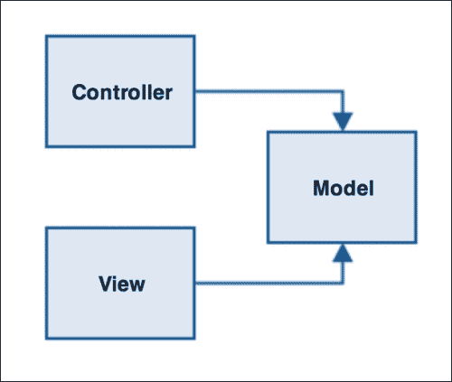
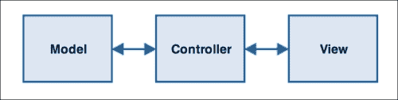
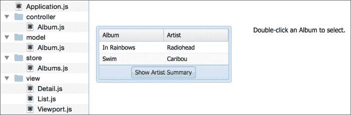
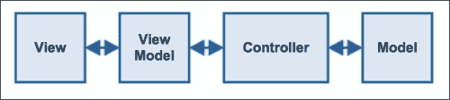
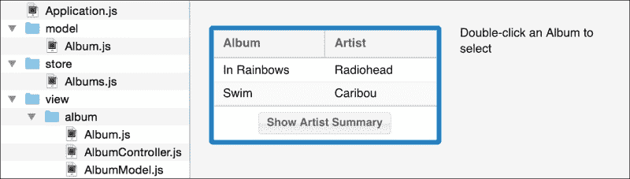

# 第二章。MVC 和 MVVM

软件开发的问题是我们总是在寻找做事情的正确方式。每个软件公司都会有一套自己的指南，指示他们的开发者应该如何操作。这就是软件工作的方式：我们构建一套反映我们最佳思考如何开发的想法，软件社区从这些想法中学习并在此基础上构建。它们被正式化为工作模式，这些模式在整个开发社区中共享。在本章中，我们将更多地讨论这个概念，特别是：

+   MVC 模式

+   MVVM 模式

+   Ext JS 使用两种方式

+   Ext JS 从 MVC 到 MVVM 的演变

+   当前版本 Ext JS 中设计模式的好处

关于设计模式的讨论通常非常枯燥。在本章中，我们将使用一些实际例子来说明它们为什么如此重要以及它们如何帮助你启动架构工作。

# 总是日记

在开始时，情况一团糟。好吧，也许并不完全是这样，但在现代软件开发中，我们有很多设计和架构模式可以利用，帮助我们塑造应用程序并确保我们不是在重新发明轮子。这些模式中的每一个都是数十年的工作的结果，这些工作不断被审查并付诸实践，我们都希望最优雅和最有用的工作能够浮出水面。在这个过程中，我们看到了笨拙的模式被更优雅的模式所取代。希望我们的混乱变得稍微不那么复杂了。

我们构建图形界面方式的一个关键发展是**模型-视图-控制器**（**MVC**），它在 20 世纪 70 年代的近传奇的施乐帕克研究中心（Xerox PARC）由挪威计算机科学家 Trygve Reenskaug 发明。它首先在 Smalltalk 编程语言中被公开采用，这是一种由包括艾伦·凯（Alan Kay）在内的计算机科学家团队开发的编程语言。它汇集了许多想法，这些想法影响了我们今天使用的几乎所有面向对象的语言。这是一件大事，是由一些非常厉害的人创造的。

弗吉尼亚大学计算机科学助理教授康奈利·巴恩斯（Connelly Barnes）给我们提供了一个很好的看待 MVC 的方法：

> *"模型是数据，视图是屏幕上的窗口，控制器是两者之间的粘合剂。"*

它首先在描述软件结构时使用职责术语，例如，视图负责展示。在第一章，*简介*中，我们讨论了它在创建强大应用架构中的重要性。

对于我们回顾创新（如 Smalltalk 和 MVC）并理解它们为何如此重要来说，可能很困难。我们可以花费许多页面来回顾之前的内容以及为什么 MVC 的出现被描述为一个开创性的洞察。然而，真正重要的是，它是一种新的观察基于图形用户界面的软件组织方式，这是一种在接下来的三十年里经得起时间考验的计算科学新范式：



Martin Fowler 的裸骨 MVC

Ext JS 使用的 MVC 实现（Ruby on Rails 带来的）与 Smalltalk 中的原始实现之间存在几个差异。自其诞生以来，它一直在不断优化和调整，以适应其使用的各种环境。

# 将 MVC 引入网络

Smalltalk 的 MVC 实现是针对传统的桌面 GUI 系统而创建的。它所代表的职责分离对于基于网络的软件来说非常有意义；模型是业务和持久层的表示，控制器是服务器端的粘合剂，视图是为客户端浏览器渲染的 HTML。

然而，在传统的 MVC 中，视图通过响应模型发出的事件来观察模型的变化，以反映其当前状态。在标准的 HTTP 请求/响应情况下，这是不可行的。

Model 2 是 MVC 的一个衍生版本，它在 Java Struts 框架中实现，该框架为解决这个问题提供了一个潜在的解决方案。而不是视图和模型直接通信，控制器成为变化的汇集点。它响应视图的变化，并将它们传递给模型，反之亦然，如下面的图所示：



网络上的 MVC/Model 2

这就是 Ruby on Rails 实现 MVC 的方式，进而激发了众多类似 MVC 框架的诞生（如 ASP.NET MVC）。

这与网络技术（如经典 ASP、PHP 和 Cold Fusion）形成对比，在这些技术中，创建一个结合逻辑、渲染和数据库访问的页面是标准做法。这可以描述为（尽管很少这样做）是 MVC 实现逻辑后继者的 Model 1。Model 1 方法会导致我们在第一章开头描述的问题，因此 MVC 的普及，尤其是 Ruby on Rails 采用的简化方法，开始为构建良好的应用程序提供一个坚实的基础。

网络上的 MVC 可能遵循以下请求流程：

1.  浏览器发起请求，并将其传递给控制器。

1.  控制器消费请求参数。

1.  它根据这些参数检索一个模型（通常是数据库中的）。

1.  最后，它根据模型渲染视图，并将其传递回浏览器。

当然，随着 Ajax、WebSockets 和完全客户端 MVC 框架的出现，这是一个非常简化的例子。它确实有助于展示 MVC 如何轻松地适应 Web，并且实际上非常适合 Web。

# Ext JS 和 MVC

我们已经探讨了 MVC 的起源以及它是如何被应用于传统的服务器端 Web 应用的。当我们使用 Ext JS 这样的 JavaScript 重量级应用时，它是如何工作的呢？

整个 MVC 概念完全移动到了浏览器中。就我们而言，服务器可以使用它想要的任何技术。它通常会只是提供和消耗浏览器之间的数据。我们回到了一种更类似于 Smalltalk 版本的 MVC 实现（屏幕上看到的不同的 UI 元素是视图），每个都可以有自己的控制器。

再次强调，这是关于分解责任。我们不是让一个控制器负责整个页面，而是可以有搜索控制器、列表控制器和详细控制器（代表构成我们应用逻辑单元的任何东西）。这是从服务器端 MVC 到客户端 MVC 的步骤如何帮助我们应用架构的关键细节。

我们已经知道 Ext JS 组件是我们的视图，Ext JS 模型命名得很好，可以很好地融入其中。我们剩下了一个重要的问题：控制器实际上应该做什么？可能更容易先移除我们知道它们不应该做的事情，然后看看剩下的是什么。我们知道模型处理数据，但它们也负责围绕这些数据的计算和逻辑。例如，计算和规则属于模型，但不属于控制器。

### 小贴士

这是一个概括。在许多情况下，你会有其他类来完成这种逻辑工作，以便进一步分解你的应用。重要的是要记住，你不想在控制器中包含领域逻辑！

我们还知道视图处理展示。你可以在控制器中构建一个 HTML 字符串，并将其传递给浏览器进行渲染，但这将涉及控制器承担视图的责任。

我们还剩下什么呢？实际上，并不多。你的控制器只需要负责你的视图和模型。仅此而已。它们查看用户提出的请求，获取一个模型，并使用它来将视图渲染到浏览器中。

事实上，如果你的控制器做了更多的事情，这应该被视为一个坏信号。控制器应该是乐队的指挥，而不是创作音乐的人。

## Ext JS MVC 的示例

下面的截图显示了我们的 Ext JS v4 MVC 测试应用：



我们在这里生成了一个股票 Ext JS v4 应用程序，它遵循 MVC 结构，然后我们根据我们的需求对其进行了修改。在这个小应用程序中，左侧有一个音乐专辑的网格。当你点击网格上的按钮时，它会生成在网格中提到的艺术家的摘要，当你双击一行时，它将专辑信息放入右侧面板。这是一个玩具应用程序，但它有助于演示 MVC 的工作原理。稍后，我们将将其与用 Ext JS v5 编写的类似应用程序进行比较。让我们看看代码：

```js
// view/List.js
Ext.define('MvcEx1v4.view.List', {
    extend: 'Ext.grid.GridPanel',
    alias: 'widget.app-list',
    store: 'Albums',
    forceFit: true,
    frame: true,
    requires: ['Ext.Msg'],

    columns: [
        { text: 'Name', dataIndex: 'name' },
        { text: 'Artist', dataIndex: 'artist' }
    ],

    initComponent: function() {
        this.bbar = [
            '->',
            { xtype: 'button', text: 'Show Artist Summary', handler: this.onShowSummary, scope: this },
            '->'
        ];

        this.callParent(arguments);
    },

    onShowSummary: function() {
        var summary = this.getStore().collect('name').join(', ');

        Ext.Msg.alert('Artists', summary);
    }
});
```

这里是我们的 `MvcEx1v4.view.List` 类在 `view/List.js` 中。它是一个相当直接的网格，使用名为 `'Albums'` 的存储和一个位于底部工具栏上的按钮来生成艺术家摘要。请注意，生成此摘要的事件处理程序包含在视图中：

```js
// view/Detail.js
Ext.define('MvcEx1v4.view.Detail', {
    extend: 'Ext.Container',
    alias: 'widget.app-detail',
    html: 'Double-click an Album to select'
});
```

我们的第二个视图是 `MvcEx1v4.view.Detail` 在 `view/Detail.js` 中。这只是一个带有一些占位符 HTML 的简单容器。最后，我们有包含我们的视图的应用程序视口：

```js
// view/Viewport.js
Ext.define('MvcEx1v4.view.Viewport', {
    extend: 'Ext.container.Viewport',
    requires:['MvcEx1v4.view.List'],
    layout: 'hbox',
    defaults: {
        width: 250,
        margin: 20
    },
    items: [{ xtype: 'app-list' }, { xtype: 'app-detail' }]
});
```

再次，这里有一些惊喜。请注意，我们使用在各自的“别名”配置选项中定义的值来引用我们的观点：`app-detail` 和 `app-list`。我们已经处理了 MVC 中的“V”，那么让我们继续到“M”，看看我们的数据来自哪里，如下面的代码所示：

```js
// model/Album.js
Ext.define('MvcEx1v4.model.Album', {
    extend: 'Ext.data.Model',

    fields: [
        { name: 'name', type: 'string' },
        { name: 'artist', type: 'string' }
    ]
});
// store/Albums.js
Ext.define('MvcEx1v4.store.Albums', {
extend: 'Ext.data.JsonStore',

   model: 'MvcEx1v4.model.Album',

   data: [
        { name: 'In Rainbows', artist: 'Radiohead' },
        { name: 'Swim', artist: 'Caribou' }
    ]
});
```

为了便于阅读，我已经将模型和消费它的存储的代码合并在一起。这个应用程序的数据是通过数据配置选项内联添加的（只是为了避免在服务器端 Ajax 调用中乱搞）。让我们看看 MVC 的最后一个方面，即控制器：

```js
// controller/Album.js
Ext.define('MvcEx1v4.controller.Album', {
    extend: 'Ext.app.Controller',

    refs: [{
        ref: 'detail',
        selector: 'app-detail'
    }],

    init: function() {
        this.control({
            '.app-list': {
                itemdblclick: this.onAlbumDblClick
            }
        });
    },

    onAlbumDblClick: function(list, record) {
        var html = Ext.String.format('{0} by {1}', record.get('name'), record.get('artist'));

        this.getDetail().getEl().setHTML(html);
    }
});
```

这里开始与 Ext JS v3 应用程序中通常看到的直接视图到数据实现有所不同。我们引入了一个新类，引入了一个新的架构结构。但目的是什么？

答案是通信。正如我们所知，控制器是粘合“M”和“V”的胶水。在我们的简单示例中，它为我们提供了一个机制，让列表视图（别名为 `app-list`）在没有意识到对方的情况下与详细视图进行通信。`control` 功能用于确定当列表视图（别名为 `app-list`）触发 `itemdblclick` 事件时应该做什么。

我们提供了 `onAlbumDblClick` 方法来响应这个事件。在这里，我们想要与我们的详细视图（别名为 `app-detail`）进行通信。我们之前使用了 `refs` 配置选项来帮助实现这一点。让我们分解一下：

```js
refs: [{
    // We give our ref the name "detail". This autogenerates
    // a method on the controller called "getDetail" which
    // will enable us to access the view defined by the selector.
    ref: 'detail',

    // The selector is passed to Ext.ComponentQuery.query,
    // so any valid component query would work here. We're
    // just directly referencing the app-detail alias we
    // set up in the view's configuration
    selector: 'app-detail'
}]
```

简而言之，`refs` 功能为我们提供了一个简短的方式来访问视图。在 `onAlbumDblClick` 处理程序中，我们使用了 `refs` 提供的自动生成的 `this.getDetail()` 方法。这给了我们一个对视图的引用。然后我们可以根据列表视图提供的事件数据设置其视图元素的 HTML。

# 它如何帮助你的应用程序

让我们回顾一下。在我们涉及任何 MVC 东西之前，我们在 Ext JS 3 中比现在更好吗？

+   我们通过视图和模型实现了展示和数据之间的清晰分离

+   我们有一种使用控制器来协调我们应用程序不同部分的方式

+   我们通过使用多个与相关视图关联的控制器，将我们的应用程序分割成逻辑单元

不仅这有助于从一开始就保持不同功能部分非常分离，从而实现良好的设计，而且还为我们提供了一个良好的维护平台，因为它强制实施了一种非常具体的工作方式。

# MVC 和选择幻觉

考虑到我们刚刚讨论的所有内容，你可能会认为 MVC 是开发的圣杯。它经过测试，适应性强，并且得到 Ext JS 的支持。事实上，在某些情况下，进一步增强 MVC 是有用的。

为了使用 Ext JS 特定的示例，让我们看看当你开始编写更复杂的应用程序时会发生什么。你的控制器可以响应视图触发的事件，协调不同视图之间的交互，甚至存储其他控制器。那么，这意味着你将在控制器、视图或两者的组合中放置事件处理器吗？

这是一个关键问题，可以通过从一开始就非常严格地管理你的开发过程来简单地回答。MVC 提供了“选择幻觉”；在这里，它提供了大量设置应用程序的方法，但只有少数几种方法会导致健康的应用程序。

当你有一个中央数据源，但不同的视图消费它时怎么办？你可能希望为每个视图以略微不同的形式呈现这些数据。视图本身是否负责塑造这些数据？

Ext JS 5 实现了一个称为 **模型-视图-视图模型**（**MVVM**）的模式，试图解决这些问题。

# 引入 MVVM

MVVM 可以被视为 MVC 的一种增强。引入视图模型的概念，它认识到并非每个与数据集相关的视图都会以相同的方式使用这些数据。它通过添加一个称为视图模型的中介层来解决这一问题，这个中介层位于视图和模型之间。它还把关注点的分离放在首位；为什么处理我们数据的模型要关心与处理展示的视图有关的事情呢？



MVVM 的典型表示

## Ext JS 如何使用 MVVM？

在 Ext JS 5 中，MVVM 被全心全意地接纳。Sencha Cmd 生成的示例应用程序结构将提供与 `View` 类并行的 `ViewModel` 类。这通过新的配置选项与 `View` 类紧密集成，这使得它在解决大型 MVC 应用程序中常见的常见问题时成为一等公民，正如我们之前讨论的那样。

此外，创建了一个`ViewController`类来封装你通常会在视图或标准控制器中放置的逻辑。它消除了关于在哪里放置关注视图内部事件的事件处理器的问题，而不是将事件传递到应用程序其他部分的事件处理器。

## 启动我们的 MVVM

我们首先使用 Sencha Cmd 生成一个 Ext JS 5 应用程序模板，并将其作为构建我们示例专辑列表应用程序的基础。默认的 Ext JS 5 模板使用以下 MVVM 实现：



我们的示例应用程序移植到 Ext JS 5 的 MVVM 架构

你最直接会注意到的是，我们已经失去了控制器目录，视图目录中发生了很多事情。让我们分解一下：

```js
// model/Album.js
Ext.define('MvvmEx1v5.model.Album', {
    extend: 'Ext.data.Model',

    fields: [
        { name: 'name', type: 'string' },
        { name: 'artist', type: 'string' }
    ]
});
```

相比之前的例子，专辑模型是相同的，但请注意，我们已经将应用程序名称更改为`MvvmEx1v5`。存储器只有非常细微的不同：

```js
// store/Albums.js
Ext.define('MvvmEx1v5.store.Albums', {
    extend: 'Ext.data.JsonStore',

    model: 'MvvmEx1v5.model.Album',

    data: [
        { name: 'In Rainbows', artist: 'Radiohead' },
        { name: 'Swim', artist: 'Caribou' }
    ]
});
```

我们添加了`alias`配置选项，这样我们就可以稍后使用专辑简称来引用存储器。现在，让我们看看视图目录：

```js
// view/album/Album.js
Ext.define('MvvmEx1v5.view.album.Album', {
    extend: 'Ext.container.Container',
    xtype: 'app-album',
    requires: ['Ext.grid.Panel'],
    controller: 'album',
    layout: 'hbox',
    defaults: {
        width: 250,
        margin: 20
    },
    items: [
        {
            xtype: 'grid',
            reference: 'list',
            viewModel: 'album',
            bind: '{albums}',
            forceFit: true,
            frame: true,
            margin: '20 10 20 20',
            columns: [
                { text: 'Album', dataIndex: 'name' },
                { text: 'Artist', dataIndex: 'artist' }
            ],
            bbar: [
                '->',
                { xtype: 'button', text: 'Show Artist Summary', handler: 'onShowSummary' },
                '->'
            ],
            listeners: {
                rowdblclick: 'onAlbumDblClick'
            }
        },
        { xtype: 'container', margin: '20 10', reference: 'detail', width: 150, html: 'Double-click an Album to select' }
    ]
});
```

我们将之前的`app-list`和`app-detail`视图合并为单个`app-albums`视图，而且之前我们在视图中构建专辑摘要的逻辑，我们现在只定义事件处理器和逻辑放在其他地方。这个视图现在是 100%的展示，并将所有复杂的事情推迟到其他类。

注意，我们有一个`controller`配置选项，它定义了用于此视图类的视图控制器。我们的网格组件也有几个有趣的配置选项：

+   `参考`: 我们稍后会使用这个来从视图控制器获取这个组件。

+   `viewModel`: 这是此组件将使用的视图模型别名。

+   `bind`: 这定义了视图如何与视图模型通信。我们使用最简单的绑定（网格的默认`bindProperty`是 store），所以这里我们基本上只是将存储器的`config`设置为`'albums'`。

现在，让我们继续我们的专辑视图模型：

```js
// view/album/AlbumModel.js
Ext.define('MvvmEx1v5.view.album.AlbumModel', {
    extend: 'Ext.app.ViewModel',
    alias: 'viewmodel.album',

    requires: [
        'MvcEx1.store.Albums'
        'Ext.Msg'
    ],
    stores: {
        albums: {
            type: 'albums'
        }
    },

    buildSummary: function() {
        return this.getStore('albums').collect('name').join(', ');
    }
});
```

此外，这里是我们现在包含这种逻辑的地方之一。一个视图模型从模型（或存储器）获取数据，并以适合其匹配视图的方式呈现。在这种情况下，我们从`'albums'`存储器（如我们之前提到的专辑别名通过`type`配置选项引用）获取数据。它提供了一个`buildSummary`方法，将存储的数据转换为可用于 UI 的字符串，如下所示：

```js
// view/album/AlbumController.js
Ext.define('MvvmEx1v5.view.album.AlbumController', {
    extend: 'Ext.app.ViewController',
    alias: 'controller.album',

    onShowSummary: function() {
        var summary = this.lookupReference('list').getViewModel().buildSummary();

        Ext.Msg.alert('Artists', summary);
    },

    onAlbumDblClick: function(list, record) {
        var html = Ext.String.format('{0} by {1}', record.get('name'), record.get('artist'));
        this.lookupReference('detail').getEl().setHtml(html);
    }
});
```

最后，我们有我们的视图控制器，这是任何管理我们视图的逻辑应该去的地方。在视图控制器中定义的事件处理器将自动对匹配的视图可用。

## 我们的情况更好吗？

是的，我们因为更组织化而过得更好。我们知道所有应用程序的位信息在哪里，尽管我们比一个简单的单类 Ext JS 应用程序有更多的文件，但我们始终知道在哪里查找更改视图配置，在哪里找到我们的专辑逻辑，或者在哪里塑造我们从存储中提取的信息。

关于这个例子，一个重要的观点是我们放弃了第一个例子中的总体控制器，转而采用视图控制器。在这里，这很有意义；我们希望这个视图控制器只关注专辑，而不是应用程序的其他部分。然而，一个高级控制器仍然是 Ext JS MVVM 架构的有效部分，可以在需要以比视图控制器更高层次协调应用程序的情况下重新引入。

## 关于存储的简短插曲

在整个这一章中，我们谈了很多关于模型的内容，但从未具体讨论过存储，尽管我们在示例应用程序中使用了它们。为什么不是“SVC”或“SVVM”？

在 Ext JS 中，存储是一个特定的类，它提供了特定的功能，并且紧密绑定到您的应用程序中。然而，在简单的 MVC 或 MVVM 实现中，“存储”可能只是模型数组，而不是一个单独的架构特性。因此，存储实际上只是收集模型的一种方式，而 Ext JS 恰好是我们可以进行许多额外操作的地方（例如排序、过滤和分批）。

## 交互通信

我们已经展示了如何创建一个简单的应用程序，该应用程序使用几个移动部件来创建一个逻辑单元。多亏了 MVVM 模式，我们有一个允许这个单元的各个部分进行通信的方法，而无需明确绑定到其他部分的实现细节。

当我们扩展我们的应用程序时，我们可能会有几个这样的逻辑单元，也许除了专辑部分外，还有一个艺术家部分。现在，这些部分必须依次相互通信。这代表了软件架构中的一个主要问题：如何允许专辑和艺术家之间进行通信，而不使任何组件受到另一个组件详细信息的污染。这是一个与应用程序的大小和复杂性成正比的问题。

## 主要事件

解决这个问题的方法之一是允许应用程序部分触发自定义事件，每个事件都包含一个可以被任何可能对它们感兴趣的应用程序部分消费的有效负载。

事实上，我们在 Web 开发中经常看到这种情况。事件处理器是 JavaScript 编程的一个基本部分，因为我们把函数绑定到用户界面元素（如按钮）或浏览器事件（如`window.onload`）抛出的事件。我们已经在示例代码中提到了这一点；我们的视图触发了一个`rowdblclick`事件，该事件由我们的视图控制器处理。

在复杂的应用程序中，开发者通常会实现一个名为事件总线（event bus）的功能，这是一种将应用程序组件触发的事件传输到各个订阅者的方式。自从 Ext JS 4.2 版本以来，事件域（event domains）允许开发者将类似的功能集成到他们的代码库中。

## 事件域

事件域允许控制器对应用程序中来自各种不同来源的事件做出反应。默认来源包括：

+   **组件（Components）**：这些是从组件中触发的事件。这本质上就是 `Ext.app.Controller.control()` 通过处理扩展 `Ext.Component` 的类的事件并将它们绑定到事件监听器所提供的功能。

+   **全局（Global）**：这些是从单个全局来源触发的事件，用于绑定任意应用程序范围内的事件。

+   **控制器（Controller）**：这些是从其他控制器中触发的事件。

+   **存储（Store）**：这些是从存储中触发的事件。

+   **直接（Direct）**：这些是从扩展 `Ext.direct.Provider` 的类中触发的事件。这仅在您需要应用程序中的 `Ext.direct.Manager` 时使用。

一些事件域允许您通过选择器（通常是与源关联的 ID）过滤接收到的事件，但在组件（Component）的情况下，您可以使用完整的 `Ext.Component` 查询。这允许您对如何订阅事件有更细粒度的控制。

# 事件域示例

让我们回到我们之前创建的 MVVM 相册示例。我们的视图有处理程序和监听器配置，这些配置将视图事件绑定到我们放在视图控制器中的事件处理程序。然而，事件域允许我们解除这种绑定，并将所有控制权交给视图组件。在我们的前一个示例中，`view/album/Album.js`，我们可以移除网格上的监听器配置和按钮上的处理程序，然后向 `view/album/AlbumController.js` 添加以下代码：

```js
init: function() {
    this.listen({
        component: {
            'app-album grid': {
               'rowdblclick': 'onAlbumDblClick'
            },
            'app-album button': {
               'click': 'onShowSummary'
            }
        }
    });
}, 
```

这稍微有点冗长，所以看看这里到底发生了什么。我们向 `this.listen` 传递一个对象，它包含一个组件属性；这表示我们正在配置组件事件域。在这里，我们使用两个选择器，一个用于网格本身，一个用于摘要按钮，在这些定义中我们指定要绑定的事件和事件处理程序。

这使我们能够从视图中移除任何巧妙的功能，并将其全部放入视图控制器中。视图只处理展示，而视图控制器处理逻辑。

## 使用自定义事件

我们已经展示了如何使用事件域进一步分离我们的代码关注点，但现在，您将看到它们如何帮助在更高层次上编排交互。为此，让我们看看一个理论情况，即我们的应用程序已经发展到包含多个视图和视图控制器：

```js
// view/search/SearchController.js
Ext.define('EventDomain1.view.search.SearchController', {
    extend: 'Ext.app.ViewController',
    alias: 'controller.search',

    init: function() {
        this.listen({
            component: {
                'app-search button': {
                   'click': 'onSearchSubmit'
                }
            }
        });
    },

    onSearchSubmit: function() {
        var val = this.lookupReference('searchfield').getValue();
        this.fireEvent('search', val);
    }
});
```

我们创建了一个新的`SearchController`，它是新`Search`视图的视图控制器。我们使用`this.listen`来监听组件事件域上的事件，并使用选择器`'app-search button'`（我们新`Search`视图中的一个按钮）进行过滤。当按钮被点击时，我们触发一个名为`onSearchSubmit`的事件处理方法。

我们提取用户输入的搜索词，然后触发第二个事件，将搜索词作为事件数据传递。我们触发的事件称为`'search'`，它不是绑定到按钮或其他 UI 组件，而是可以被应用程序的其他部分作为纯应用程序事件订阅。让我们看看它如何被消费：

```js
// partial /view/album/AlbumController.js
init: function() {
    this.listen({
        controller: {
            '*': {
                'search': 'onSearch'
            }
        }
    });
}
```

这是我们之前见过的`AlbumController`片段，增加了一些额外的功能。使用`this.listen`，我们使用`'*'`选择器允许事件域上的所有控制器。然后，我们指定我们想要使用`onSearch`处理方法处理搜索事件。现在这一切都应该感觉非常熟悉了！处理方法可能像以下代码一样简单：

```js
onSearch: function(searchTerm) {
    var list = this.lookupReference('list');
    list.getViewModel().search('searchTerm');
}
```

假设我们在视图模型中创建了一个`search`方法。仅仅通过一小段代码，我们就允许应用程序的两个不同部分通过关于我们应用程序的信息而不是它们自己的信息进行通信。这是保持代码中的搜索部分对专辑部分一无所知的关键，并且使得它们之间的界限非常清晰。这通过关注点的分离提供了更简单的测试，更好的可维护性，以及更容易理解应用程序的结构。

# 摘要

MVC 和 MVVM 是我们开始新项目前必须牢固掌握的关键架构概念。鉴于它们在 Ext JS 中如此根深蒂固，对它们背后的理念以及为什么实现这些模式将有助于我们构建代码库的方式有一个良好的理解就更加重要了。在下一章中，我们将继续探讨更多关于如何构建 Ext JS 应用程序的实际例子，结合 MVVM 概念以及其他一些理念，为构建一个强大的平台奠定基础。
