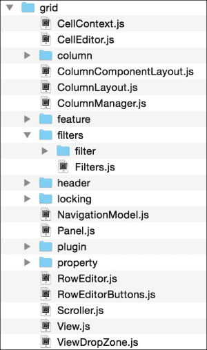
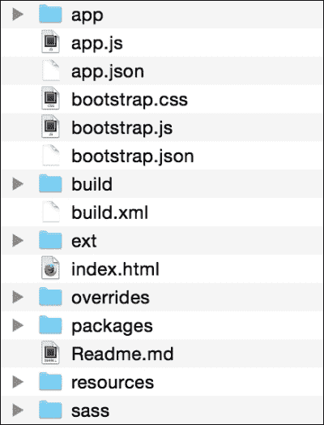
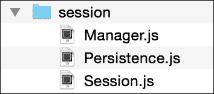
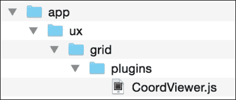

# 第三章：应用程序结构

我们之前讨论了在没有架构感的情况下有机地扩展应用程序可能会导致难以维护的混乱代码。强加结构的一个好处是它自动提供了可预测性（一种文件系统，我们立即知道特定代码片段应该放在哪里）。

同样适用于组成您应用程序的文件。当然，我们可以将所有文件放在网站根目录下，将 CSS、JavaScript、配置和 HTML 文件混合在一个长的字母顺序列表中，但我们会失去许多保持应用程序组织的机会。在本章中，我们将探讨：

+   代码结构思路

+   典型 Ext JS 应用程序的布局

+   单例、混入和继承的使用

+   为什么全局状态是一个坏东西

结构化您的应用程序就像保持您的房子整洁一样。您将知道在哪里找到您的车钥匙，并且您将准备好应对意外的客人。

# 结构化思路

在大型应用程序中，代码结构的一种方式涉及命名空间（通过命名标识符划分代码的实践）。一个命名空间可以包含所有与 Ajax 相关的代码，而另一个命名空间可以包含与数学相关的类。编程语言（如 C#和 Java）甚至将命名空间作为一等语言结构来帮助代码组织。

根据命名空间将代码与目录分离成为这一点的合理扩展：


从左到右：Java 的 Platform API、Ext JS 5 和.NET Framework

命名空间标识符由一个或多个名称标记组成，例如"Java"或"Ext"、"Ajax"或"Math"，通常由一个符号分隔，通常是句号。顶级名称将是整个包的总体标识符（例如"Ext"），随着名称的增加和您深入代码库，它将变得更加具体。

Ext JS 源代码大量使用这种实践来划分 UI 组件、实用类以及框架的其他部分，因此让我们看看一个真实示例。`GridPanel`组件可能是框架中最复杂的组件之一；它包含大量贡献于功能（如列、单元格编辑、选择和分组）的类。这些类共同创建了一个功能强大的 UI 小部件。以下是一些组成`GridPanel`的文件：



Ext JS 网格组件的目录结构

`grid`目录反映了`Ext.grid`命名空间。同样，子目录是子命名空间，最深层的命名空间是`Ext.grid.filters.filter`。

主要的 `Panel` 和 `View` 类：分别是 `Ext.grid.Grid` 和 `Ext.grid.View`，它们位于主目录中。然后，其他功能组件，例如 `Column` 类和各种列子类，被进一步分组到它们自己的子目录中。我们还可以看到一个 `plugins` 目录，其中包含多个针对网格的特定插件。

### 注意

Ext JS 实际上已经有一个 `Ext.plugins` 命名空间。它包含支持插件基础设施的类以及足够通用的插件，可以应用于整个框架。在不确定插件在代码库中最佳位置的情况下，我们可能会错误地将它放在 `Ext.plugins` 中。相反，Ext JS 遵循最佳实践，在 `Ext.grid` 之下创建一个新的、更具体的命名空间。

回到 Ext JS 框架的根目录，我们可以看到在顶层只有几个文件。一般来说，这些将是负责协调框架其他部分（如 `EventManager` 或 `StoreManager`）的类，或者是在整个框架中被广泛重用的类（如 `Action` 或 `Component`）。任何更具体的功能都应该以适当具体的方式进行命名空间化。

作为一条经验法则，你可以从 Ext JS 框架的组织中获得灵感，尽管它是一个框架而不是一个完整的应用程序。它缺少我们很快将要讨论的一些结构方面。

# 了解你的应用程序

当使用 Sencha Cmd 生成 Ext JS 应用程序时，我们最终得到一个代码库，它遵循类名和目录结构中的命名空间概念，如下所示：



使用 Sencha Cmd 的 "generate app" 功能创建的结构

我们应该熟悉所有这些内容，因为当我们讨论 Ext JS 中的 MVVM 时，这些内容已经被涵盖。话虽如此，其中一些部分值得进一步检查，看看它们是否被充分利用。

## /overrides

这是一个很有用的工具，可以帮助我们进入一个积极且可预测的模式。有些情况下，你可能需要在全局级别覆盖 Ext JS 功能。也许，你想要更改低级类（如 `Ext.data.proxy.Proxy`）的实现，以提供你应用程序的定制批量行为。有时，你甚至可能会在 Ext JS 本身中发现一个错误，并使用覆盖来热修复，直到下一个点发布。`overrides` 目录提供了一个合理的放置这些更改的地方（只需镜像你正在覆盖的代码的目录结构和命名空间）。这也为我们提供了一个有用的规则，即子类放在 `/app` 目录，覆盖放在 `/overrides` 目录。

## /.sencha

这包含了由 Sencha Cmd 使用的配置信息和构建文件。一般来说，我会建议你在完全了解 Sencha Cmd 之前尽量避免在这里过多地修改，因为如果你尝试升级到 Sencha Cmd 的新版本，可能会遇到一些讨厌的冲突。幸运的是，第四章，*Sencha Cmd*，全部都是关于 Sencha Cmd 的，我们将深入探讨这个文件夹。

## bootstrap.js, bootstrap.json, 和 bootstrap.css

Ext JS 类系统通过 `requires` 功能提供了强大的依赖管理，这使我们能够创建只包含使用中代码的构建。引导文件包含有关依赖系统提供的运行应用程序所需的最小 CSS 和 JavaScript 的信息。正如我们将在 第四章，*Sencha Cmd* 中看到的那样，你甚至可以根据需求创建自定义的引导文件。

## /packages

与 Ruby 有 RubyGems 和 Node.js 有 npm 类似，Sencha Cmd 有包的概念（一个可以从本地或远程源拖入应用程序的包）。 

这允许你重用和发布功能包（包括 CSS、图像和其他资源）的集合，以减少代码的复制粘贴，并与 Sencha 社区分享你的工作。这个目录在你配置用于应用程序的包之前是空的。

## /resources 和 SASS

SASS 是一种通过促进重用并引入强大的功能（如混合和函数）到样式表中来帮助创建复杂 CSS 的技术。Ext JS 使用 SASS 作为其主题文件，并鼓励你也这样做。我们将在 第四章，*Sencha Cmd* 中探讨这一点。

## index.html

我们知道 `index.html` 是我们应用程序的根 HTML 页面。它可以按需进行定制（尽管，你很少需要这样做）。这里有一个需要注意的地方，它已经在文件中的注释里写明了：

```js
<!-- The line below must be kept intact for Sencha Cmd to build your application -->
<script id="microloader" type="text/javascript" src="img/bootstrap.js"></script>
```

我们知道 `bootstrap.js` 是指什么（加载我们的应用程序并开始根据当前构建满足其依赖），所以请注意注释，并让这个脚本标签保持原样！

## /build 和 build.xml

`/build` 目录包含构建工件（在运行构建过程时创建的文件）。如果你运行生产构建，那么你会在 `/build` 目录内得到一个名为 `production` 的目录，并且你应该在部署时只使用这些文件。`build.xml` 文件允许你在想要向构建过程添加一些额外功能时，避免修改 `/.sencha` 目录中的某些文件。如果你想在构建之前、期间或之后做些什么，这就是你要去的地方。当我们查看 第四章，*Sencha Cmd* 时，我们还会回到构建过程。

## app.js

这是您应用程序的主要 JavaScript 入口点。此文件中的注释建议避免编辑它，以便允许 Sencha Cmd 在未来升级它。位于 `/app/Application.js` 的 `Application.js` 文件可以放心编辑，而不会引起冲突，并使您能够完成可能需要做的绝大多数事情。

## app.json

这包含与 Sencha Cmd 和启动您的应用程序相关的配置选项。我们将在 第四章 中更详细地介绍，*Sencha Cmd*。

当我们提到这本书的主题作为 JavaScript 应用程序时，我们需要记住它只是一个由 HTML、CSS 和 JavaScript 组成的网站。然而，当处理需要针对不同环境的大型应用程序时，使用辅助开发过程工具来增强这种简单性非常有用。起初，可能看起来默认的应用程序模板包含了很多冗余，但它们是支持帮助你打造优质产品的工具的关键。

# 培养你的代码

当您构建应用程序时，将会有一个点，您会创建一个新的类，但它逻辑上不适合 Sencha Cmd 为您创建的目录结构。让我们看看一些例子。

## 我是一名伐木工 - 让我们去登录

许多应用程序都有一个集中的 `SessionManager` 来处理当前登录用户，执行身份验证操作，并为会话凭证设置持久存储。一个应用程序中只有一个 `SessionManager`。一个简化的版本可能看起来像这样：

```js
/**
 * @class CultivateCode.SessionManager
 * @extends extendsClass
 * Description
 */
Ext.define('CultivateCode.SessionManager', {
    singleton: true,
    isLoggedIn: false,

    login: function(username, password) {
        // login impl
    },

    logout: function() {
        // logout impl
    },

    isLoggedIn() {
        return isLoggedIn;
    }
});
```

我们创建一个单例类。这个类不需要使用 new 关键字来实例化。根据其类名 `CultivateCode.SessionManager`，它是一个顶级类，因此它位于顶级目录中。在一个更复杂的应用程序中，可能还有一个专门的 `Session` 类和一些其他辅助代码，因此我们会创建以下结构：



我们会话命名空间的目录结构

关于用户界面元素呢？在 Ext JS 社区中有一个非正式的实践可以帮助这里。我们想要创建一个扩展，显示当前选中单元格的坐标（类似于 Excel 中的单元格引用）。在这种情况下，我们会创建一个 `ux` 目录——用户体验或用户扩展——然后遵循 Ext JS 框架的命名约定：

```js
Ext.define('CultivateCode.ux.grid.plugins.CoordViewer', {
    extend: 'Ext.plugin.Abstract',
    alias: 'plugin.coordviewer',

    mixins: {
        observable: 'Ext.util.Observable'
    },

    init: function(grid) {
        this.mon(grid.view, 'cellclick', this.onCellClick, this);
    },

    onCellClick: function(view, cell, colIdx, record, row, rowIdx, e) {
        var coords = Ext.String.format('Cell is at {0}, {1}', colIdx, rowIdx)

        Ext.Msg.alert('Coordinates', coords);
    }
});
```

它看起来有点像这样，当您点击网格单元格时触发：


此外，相应的目录结构直接来自命名空间：



你可能已经看到了一个模式的出现。

### 小贴士

我们之前提到过，组织一个应用程序通常关于设置事情以成功落位。这种积极的模式是一个好兆头，表明你正在做正确的事情。

我们有一个可预测的系统，应该能够使我们创建新类而无需过多考虑它们将在我们的应用程序中的位置。让我们再看看一个数学辅助类的例子（一个稍微不那么明显的例子）。

再次，我们可以看看 Ext JS 框架本身以获得灵感。有一个 `Ext.util` 命名空间，包含超过 20 个通用类，这些类根本无处可放。所以，在这种情况下，让我们创建 `CultivateCode.util.Mathematics`，它包含我们用于数值工作的专用方法：

```js
Ext.define('CultivateCode.util.Mathematics', {
    singleton: true,

    square: function(num) {
        return Math.pow(num, 2);
    },

    circumference: function(radius) {
        return 2 * Math.PI * radius;
    }
}); 
```

这里有一个需要注意的地方，而且非常重要。有一个真正的危险，那就是在考虑你的代码命名空间及其在应用程序中的位置时，很多内容最终都放在了 `utils` 命名空间下，从而违背了整个目的。在将代码放入 `utils` 桶之前，花时间仔细检查是否有更适合的位置。

这尤其适用于你考虑在 `utils` 命名空间中向单个类添加大量代码的情况。再次看看 Ext JS，有许多专门的命名空间（例如 `Ext.state` 或 `Ext.draw`）。如果你正在处理一个包含大量数学的应用程序，你可能更倾向于以下命名空间和目录结构：

```js
Ext.define('CultivateCode.math.Combinatorics', {
    // implementation here!
});
Ext.define('CultivateCode.math.Geometry', {
    // implementation here!
});
```

以下截图显示了数学命名空间的目录结构：


这又是一个没有明确正确答案的情况。它将随着经验而来，并且完全取决于你正在构建的应用程序。随着时间的推移，构建这些高级应用程序的构建块将变得习以为常。

## 金钱买不到类

现在我们正在学习我们的课程属于哪里，我们需要确保我们实际上正在使用正确的类类型。以下是实例化 Ext JS 类的标准方式：

```js
var geometry = Ext.create('MyApp.math.Geometry');
```

然而，考虑一下你的代码。想想在 Ext JS 中手动调用 `Ext.create` 是多么罕见。那么，类实例又是如何创建的呢？

### 单例

单例只是一个在应用程序生命周期中只有一个实例的类。在 Ext JS 框架中有很多单例类。虽然单例在软件架构中通常是一个有争议的点，但在 Ext JS 中它们通常被很好地使用。

可能你更喜欢将数学函数（我们之前讨论过）实现为单例。例如，以下命令可能可行：

```js
var area = CultivateCode.math.areaOfCircle(radius);
```

然而，大多数开发者会实现一个圆形类：

```js
var circle = Ext.create('CultivateCode.math.Circle', { radius: radius });
var area = circle.getArea();
```

这将圆形相关的功能分区到圆形类中。它还使我们能够将圆形变量传递给其他函数和类进行额外处理。

另一方面，看看`Ext.Msg`。这里的方法都会被触发并遗忘，永远不会有什么进一步的操作。`Ext.Ajax`也是同样的情况。因此，我们再次发现自己面临一个没有明确答案的问题。这完全取决于上下文。

### 小贴士

这将会发生很多次，但这是好事！这本书不会教你一串事实和数字；它会教你独立思考。阅读他人的代码并从经验中学习。这不是按数字编码！

你可能会发现自己需要使用单例（singleton）的强大功能的地方是在创建一个全局管理类（例如内置的`StoreManager`或我们之前的`SessionManager`示例）。关于单例的一个反对意见是，它们往往会滥用以存储大量的全局状态，并破坏我们在代码中设置的职责分离，如下所示：

```js
Ext.define('CultivateCode.ux.grid.GridManager', {

    singleton: true,
    currentGrid: null,
    grids: [],

    add: function(grid) {
        this.grids.push(grid);
    },

    setCurrentGrid: function(grid) {
        this.focusedGrid = grid;
    }
});
```

没有人想在代码库中看到这类东西。它将行为和状态提升到应用的高层次。理论上，代码库的任何部分都可能调用这个管理器并产生意外的结果。相反，我们会这样做：

```js
Ext.define('CultivateCode.view.main.Main', {
    extend: 'CultivateCode.ux.GridContainer',

    currentGrid: null,
    grids: [],

    add: function(grid) {
        this.grids.push(grid);
    },

    setCurrentGrid: function(grid) {
        this.currentGrid = grid;
    }
});
```

我们仍然有相同的行为（一种收集网格的方式），但现在，它被限制在更符合上下文的部分。此外，我们正在使用 MVVM 系统。我们避免全局状态，并以更正确的方式组织我们的代码。这是一场全面的胜利。

作为一般规则，如果你可以避免使用单例，就请这样做。否则，要非常仔细地考虑，确保它是你应用程序的正确选择，并且标准类更适合你的需求。在先前的示例中，我们可以选择走捷径并使用管理单例，但这将是一个糟糕的选择，会损害我们代码的结构。

## 混入

我们习惯于在 Ext JS 中从子类继承的概念——一个网格扩展了一个面板以承担其所有功能。混入提供了类似的机会来复用功能，通过添加一小部分行为来增强现有的类。在《代码大全第二版》中，Steve McConnell，Microsoft Press US，第 6.3 节，McConnell 说：

> *"将封装视为一个“拥有”关系。一辆车“拥有”一个引擎，一个人“拥有”一个名字，等等。”*
> 
> *"将继承视为一个“是”关系。一辆车“是”一个车辆，一个人“是”一个哺乳动物，等等。”*

`Ext.Panel`“是”一个`Ext.Component`，但它也“拥有”一个可固定的特性，该特性通过`Ext.panel.Pinnable`混入提供了一个固定工具。

在你的代码中，你应该查看混入（mixins）以提供功能，尤其是在这个功能可以被复用的场合。在下一个示例中，我们将创建一个名为`shakeable`的 UI 混入，它提供了一个具有摇动方法的 UI 组件，通过从一侧摇到另一侧来吸引用户的注意力：

```js
Ext.define('CultivateCode.util.Shakeable', {
    mixinId: 'shakeable',

    shake: function() {
        var el = this.el,
            box = el.getBox(),
            left = box.x - (box.width / 3),
            right = box.x + (box.width / 3),
            end = box.x;

        el.animate({
            duration: 400,
            keyframes: {
                33: {   
                    x: left
                },
                66: {
                    x: right
                },
                100: {
                    x: end
                }
            }
        });
    }
});
```

我们使用`animate`方法（它本身实际上是混合在`Ext.Element`中的）来设置一些动画关键帧，首先移动组件的元素向左，然后向右，最后回到原始位置。下面是一个实现它的类：

```js
Ext.define('CultivateCode.ux.button.ShakingButton', {
    extend: 'Ext.Button',
    mixins: ['CultivateCode.util.Shakeable'],
    xtype: 'shakingbutton'
});
```

也像这样使用：

```js
var btn = Ext.create('CultivateCode.ux.button.ShakingButton', {
   text: 'Shake It!'
});
btn.on('click', function(btn) {
   btn.shake();
});
```

按钮已经采用了混合提供的新的`shake`方法。现在，如果我们想让一个类具有`shakeable`特性，我们可以在必要时重用这个混合。

此外，混合可以简单地用来将类的功能提取到逻辑块中，而不是有一个包含数千行代码的单个文件。`Ext.Component`就是这样一个例子。事实上，其大部分核心功能都存在于混合在`Ext.Component`中的类中。

这在导航代码库时也很有用。共同构建一个特性的方法可以被分组并放在一个整洁的小包中。让我们看看一个使用混合重构现有类的实际例子。以下是原始类的框架：

```js
Ext.define('CultivateCode.ux.form.MetaPanel', {
    extend: 'Ext.form.Panel',

    initialize: function() {
        this.callParent(arguments);
        this.addPersistenceEvents();
    },

    loadRecord: function(model) {
        this.buildItemsFromRecord(model);
        this.callParent(arguments);
    },

    buildItemsFromRecord: function(model) {
        // Implementation
    },

    buildFieldsetsFromRecord: function(model){
        // Implementation
    },

    buildItemForField: function(field){
        // Implementation
    },

    isStateAvailable: function(){
        // Implementation
    },

    addPersistenceEvents: function(){
        // Implementation
    },

    persistFieldOnChange: function(){
        // Implementation
    },

    restorePersistedForm: function(){
        // Implementation
    },

    clearPersistence: function(){
        // Implementation
    }
});
```

这个`MetaPanel`做了两件事，这是正常`FormPanel`所不具备的：

+   它从`Ext.data.Model`读取`Ext.data.Fields`，并自动根据这些字段生成表单布局。如果字段具有相同的组配置值，它还可以生成字段集。

+   当表单的值发生变化时，它会将它们持久化到`localStorage`，这样用户就可以离开并稍后继续完成表单。这对于长表单很有用。

实际上，实现这些功能可能需要比之前代码框架中显示的更多方法。由于两个额外功能定义得非常明确，重构此代码以更好地描述我们的意图是很容易的：

```js
Ext.define('CultivateCode.ux.form.MetaPanel', {
    extend: 'Ext.form.Panel',

    mixins: [
        // Contains methods:
        // - buildItemsFromRecord
        // - buildFieldsetsFromRecord
        // - buildItemForField
        'CultivateCode.ux.form.Builder',

        // - isStateAvailable
        // - addPersistenceEvents
        // - persistFieldOnChange
        // - restorePersistedForm
        // - clearPersistence
        'CultivateCode.ux.form.Persistence'
    ],

    initialize: function() {
        this.callParent(arguments);
        this.addPersistenceEvents();
    },

    loadRecord: function(model) {
        this.buildItemsFromRecord(model);
        this.callParent(arguments);
    }
});
```

我们有一个更短的文件，并且在这个类中包含的行为描述得更加简洁。而不是七个或更多可能跨越几百行代码的方法体，我们只有两行混合代码，并且相关的方法被提取到一个命名良好的混合类中。

# 污染的解决方案

从本质上讲，我们努力确保新加入项目的成员不会对所见到的内容感到惊讶。一切都应该有明确的标签，决策应该有逻辑支撑，代码应该放在对功能有意义的地点。我们简要地讨论了如何将命名空间（如`utils`）变成不适合立即使用的代码的“桶”。还有一些其他情况，我们会发现自己为那些无人知晓如何使用的函数创建了一个垃圾场。

## 对局部问题的全局解决方案

我们的英雄，一个充满热情且才华横溢的程序员，在编写他们最新的应用程序时意识到一件事。

*我可能需要这个函数很多次；可能在我的大多数 UI 组件中都需要。*

担忧之下，他们考虑了实现它的最佳方式，以及它在现有代码库中的最佳位置。

我需要在应用程序的任何地方调用它。此外，我的应用程序类已经在应用程序的任何地方可用；我会在那里挂载它。`MyApp.myFunc()`，我们来了！

因此，我们的英雄开始踏上疯狂的道路。他们会问`MyApp.isUserLoggedIn()`吗？他们会想`MyApp.isProduction()`或`MyApp.isStaging()`吗？此外，为了方便访问配置，我们有`MyApp.validNames`和`MyApp.apiUrl`数组。

*看看我的全局状态吧，你伟大的存在，绝望吧！*

这是一种夸张的戏剧手法，以便传达观点。使用你的应用程序单例作为简单的万能工具非常容易，就像这里展示的那样：

```js
Ext.define('CultivateCode.Application', {
    extend: 'Ext.app.Application',

    name: 'CultivateCode',

    searchCfg: {
        mode: 'beginsWith',
        dir: 'asc'
    },

    isLoggedIn: false,
    isSecure: false,

    launch: function () {
        this.setupAjaxOverrides();
        this.performCookieCheck();

        Ext.apply(Ext.util.Format, {
            defaultDateFormat: 'd F Y'
        });
    },

    setMasked: function(mask) {
        // Implementation
    },

    setupAjaxOverrides: function() {
        // Implementation
    },

    onAjaxError: function(connection, resp, opt) {
        // Implementation
    }

    performCookieCheck: function() {
        // Implementation
    }
});
```

这里应该做什么才是正确的呢？嗯，`searchCfg`需要移动到它被使用的地方，可能是一个搜索模型或视图模型，也许是在负责搜索的 UI 组件上。

Ajax 重写和错误处理可以移动到`/overrides`文件夹，并放置在它们正确的命名空间中，这使得它们更容易被发现。

确保用户在浏览器上启用了 cookie 的 cookie 检查可能保留在应用程序类中，仅仅因为在这个应用程序中，cookie 可能是一个要求。

像之前的讨论中提到的，像`isLoggedIn`这样的东西最好由`SessionManager`来处理。仍然是一个单例，但这是一个更易于发现和逻辑上更合适的功能位置的单例。

在另一个地方，我们可以从 Ext JS 框架那里得到启示：`setMasked`。而不是在应用程序上作为方法，Ext JS 将其作为每个`Ext.Container`上的方法提供，这意味着你可以直接在面板和网格上调用它。这意味着将组件遮罩的代码将不再跳到全局应用程序范围并希望它指向正确的容器。相反，你可以确信你正在影响你感兴趣的组件，而不会影响其他任何东西，而且这一切都不需要污染你的全局应用程序类。

# 概述——管好自己的事

在这一章中，我们强调了几个要点。

当涉及到构建你的应用程序时，让自己生活得更容易。遵循最小惊讶原则，不要把所有的类堆在一个命名空间中。

使用如 mixins 这样的架构设备来保持你的代码在可管理的块中。当你查看一个类时，你不想看到数千行蜿蜒的代码，而希望看到一个简洁的逻辑单元。

将 Ext JS 框架作为结构上的灵感来源。它可能不是 100%，但它确实向我们展示了非常重要的一点，这应该指导你应用程序架构的各个方面：有一个系统总是比没有系统要好，并且你应该始终保持一致性。

在下一章中，我们将探讨 Sencha Cmd，这是一个与 Ext JS 携手并进的工具，帮助我们生成、开发和部署我们的应用程序。
