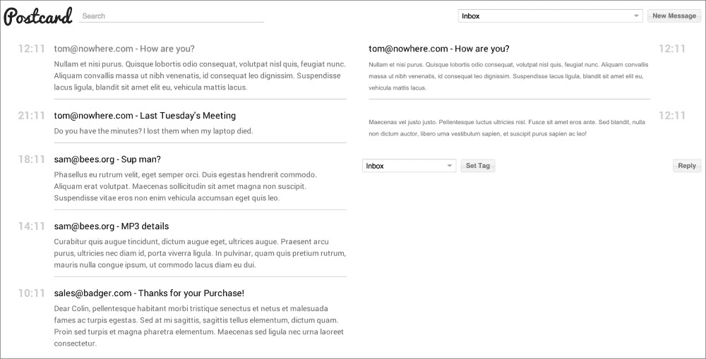
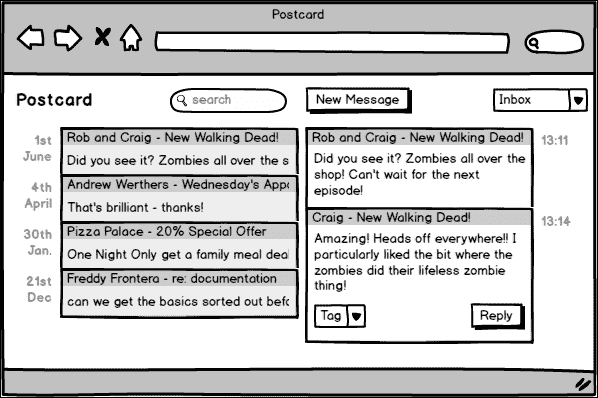
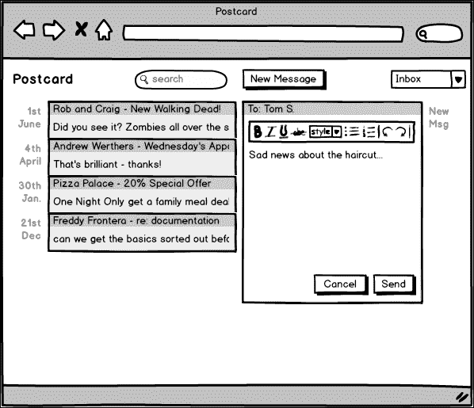
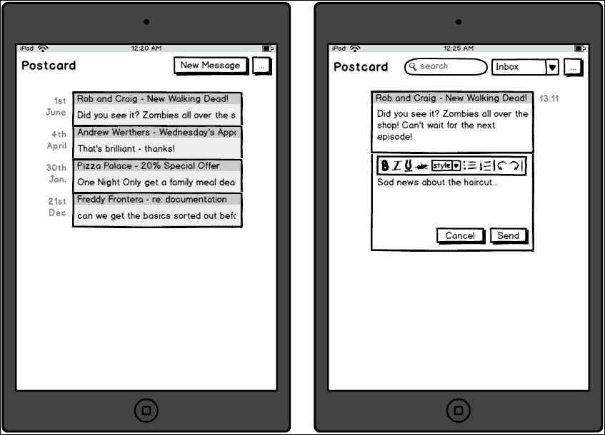
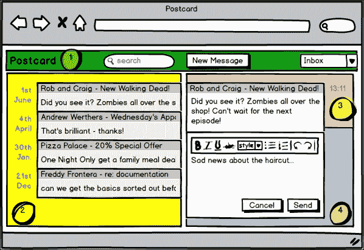
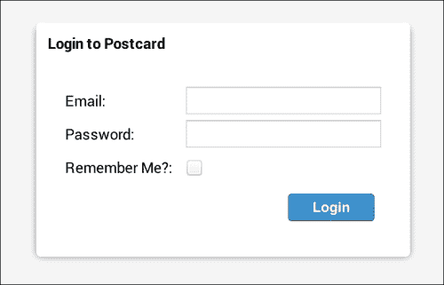

# 第七章：实践 - 邮件客户端

我们过去两个应用程序是相当直接的例子，但它们对于说明如何为未来的更广泛产品创建一个强大的基础是有用的。在本章中，我们将构建一个功能齐全的 Web 邮件客户端，将为桌面浏览器和较小设备（如平板电脑）的用户提供定制体验。

每个人都知道传统的电子邮件界面，但我们将尝试同时展示如何使用 Ext JS 技术快速构建此类应用程序。以下是本章我们将要执行的操作分解：

+   确立应用程序的基本需求

+   为每个形态因子提出理想的用户界面

+   分析在小屏幕上可能出现的問題

+   设计视图和控制器的结构以呈现和协调所有内容

+   评估我们应用程序的设计

在此过程中，我们将加强我们对路由和视图模型的知识，并不断重新评估我们的工作以确保代码的质量。

我们还将花更多的时间来完成这个应用程序的设计，涉足 Ext JS 主题化的领域。虽然我们不会构建一个完整的替代主题，但我们会触及一些应该使用主题化系统来提高您应用程序可维护性的地方。

# 形态因子

此应用程序将适应各种设备，从桌面浏览器到平板电脑和手机。这些设备的尺寸通常被称为“形态因子”，Ext JS 提供了几种机制，允许您根据所使用的设备的形态因子来定制用户体验。

在本章中，我们将重点关注`responsiveConfig`，这是在您的视图中包含`Ext.mixin.Responsive`类时可用的一项选项。在标准桌面应用程序中，我们可能在视口中并排放置两个组件，因为桌面屏幕的宽度通常大于高度。在手机上，用户通常会处于纵向模式，因此这不再成立；屏幕的高度大于宽度。在这种情况下，我们可以使用`responsiveConfig`来覆盖原始的并排配置，并使用不同的布局、项目和组件宽度——实际上可以是原始视口配置的任何方面——并改变应用程序在更高屏幕上的外观和行为。

这一项特性为我们提供了一种异常强大的方式，以提供针对特定形态因子的定制体验。在本章中，我们将看到一些实现`responsiveConfig`的实际示例。

# 应用程序设计

我们期望从电子邮件客户端中获得哪些功能？至少：

+   **登录**：这有助于获取对您自己的账户的访问权限

+   **收件箱**：这是我们的电子邮件列表

+   **已发送**：这是我们过去发送的电子邮件列表

+   **存档**：这是我们已处理的电子邮件列表

+   **撰写器**：这有助于撰写电子邮件

+   **搜索**：这有助于找到归档电子邮件

应用程序的最后版本看起来大致如下：



左侧的线程视图和右侧所选线程的消息

我们需要做什么才能达到这个阶段？让我们绘制一个设计草图：


登录页面相当标准。我们希望验证用户输入，检查电子邮件地址，并确保密码不为空，但这里并没有什么特别之处：



这是应用程序的主要界面。我们将实现线程化电子邮件；我们在左侧有一个线程列表，显示最近消息的摘录作为线程的描述。每个线程的最后一封消息的日期显示在每个线程的左侧。在右侧，我们显示所选的消息线程，最新的消息在最后。每条消息在其左侧显示接收日期。线程有一个**回复**按钮和一个下拉菜单，允许对线程进行标记，稍后会有更多介绍。

在屏幕顶部，我们有一个标志（从左到右），**联系人**部分的图标，一个**搜索**栏，一个创建新电子邮件的按钮，最后是一个下拉菜单，用于按标签筛选线程。

**搜索**栏会导致匹配的消息线程出现在下方（与**收件箱**视图相同的样式）。

我们不是为归档电子邮件、已发送电子邮件等设置单独的屏幕，我们假设**收件箱**线程只是未标记的线程。当它们被标记——无论是自动标记为“已发送”还是其他任意的标签，如“主页”或“工作”——它们就会从**收件箱**视图中移除，如下面的截图所示。这个概念在许多电子邮件客户端中都有，例如 Gmail。



在编写新电子邮件时，它位于右侧位置。由于此时没有选择任何线程，因此空间清晰，可以由包含组合框以选择电子邮件收件人、电子邮件本身的简单 HTML 编辑器和**发送**按钮的面板占用。

回复电子邮件的方式类似；作曲面板出现在消息下方，允许用户撰写回复。

需要注意的另一些事项是，用户将开始时有一系列默认标签：

+   草稿

+   归档

+   垃圾邮件

+   工作

+   主页

当为线程选择标签时，用户可以通过在组合框中输入轻松添加另一个标签。

# 我需要表示钦佩

作为产品的架构师，我们始终需要考虑如何使我们的产品成为典范，如何确保用户体验良好，如何超越利益相关者的期望。第一步是详细规划我们想要构建的产品各个方面的细节。

## 技术上讲

我们明确提出的这些需求如何转化为底层技术？

+   我们希望显示一个带有“记住我”功能的登录表单，因此我们需要某种持久存储

+   我们希望以自定义格式显示线程数据

+   我们希望以自定义格式显示完整的消息线程

+   我们需要一个基本的 HTML 编辑器用于消息正文

+   我们需要一个自动完成框用于收件人

+   我们需要以与消息线程相同的格式显示搜索结果

+   我们需要一个自动完成框用于在各个位置使用标签

让我们将这些翻译成 Ext JS 功能：

+   我们可以使用 cookie 或本地存储在系统之间（使用原生浏览器方法或 Ext JS 驱动的会话类）保存登录信息

+   我们可以使用 Ext JS DataView 创建线程数据的模板视图

+   我们可以使用 Ext JS DataView 创建消息数据的模板视图

+   Ext JS 提供了一个 HTML 编辑器小部件

+   Ext JS 组合框可以由一个检索远程联系人数据的存储提供支持

+   我们可以使用不同的存储来重用消息线程 DataView

+   在需要添加新标签的情况下，我们可以使用 Ext JS 组合框的 `editable:true` 选项

在这里有几个灰色区域，我们稍后会进行审查，但看起来 Ext JS 可以提供我们构建此应用程序所需的所有功能。

# 对情况的响应

在此项目中还有一个要求：适用于较小屏幕设备的响应式设计。好吧，事实证明，我们提出的 UI 在平板电脑上看起来已经相当不错，只有一个缺点。你必须以横向模式握持设备。这是一个在桌面上你不必真正考虑的问题，但在移动设备上变得至关重要。

从架构角度来看，我们需要了解应用程序在不同屏幕尺寸下的布局差异，以便决定如何组装应用程序。在设计到目前为止，有两个面板并排；在竖屏手机或平板电脑上根本不会有足够的屏幕空间来允许这样做。

相反，我们将根据用户操作隐藏或显示“左侧”和“右侧”面板。如果他们点击消息线程或**新消息**按钮，线程将被隐藏，并显示正确的右侧面板。

在竖屏模式下，唯一的另一个问题是应用程序标题栏；其中包含太多组件，无法适应较小屏幕的宽度。相反，我们将显示一个菜单按钮，在竖屏模式下切换时隐藏一些控件并显示其他控件。这为我们提供了一个仅在用户需要时才显示的二级菜单。以下是这些想法的一些原型：



当点击左侧截图中的其中一条消息时，列表被右侧截图中的消息线程所取代。

在基于 HTML 的响应式网站上，可以使用 CSS 媒体查询以适合任何屏幕和方向的样式来设计页面。虽然我们显然仍然可以使用 CSS 与 Ext JS 一起进行定制，但我们的需求更为复杂；Ext JS 能提供任何额外的功能来协助吗？

`responsive`插件允许开发者根据与当前设备屏幕相关的规则集定制任何组件配置。以下是在一个理论上的响应式应用中的几个示例场景：

+   如果屏幕宽度小于 500 像素，默认折叠侧边栏面板

+   如果屏幕处于横幅模式，显示新的数据列

+   如果设备是 iOS 平板，应用一个不同的 CSS 类

在网络邮件应用中，我们已经提到过显示和隐藏标题项。这可以这样做：

```js
{ 
    xtype: 'button', text: 'My Button',
    plugins: ['responsive'],
    responsiveConfig: {
        'portrait': { hidden: true } 
    }
}
```

有一个内置的规则称为“portrait”，它允许你指定一个配置对象，该对象仅在规则生效时应用。作为架构师，我们必须仔细考虑如何最好地利用这个特性，而不会导致大量混乱的配置。

在应用的桌面版本中，我们有两个并排的窗格。为此，我们可以使用`hbox`布局。然而，对于纵向模式，我们希望能够在一个窗格和另一个窗格之间切换。这似乎是卡片布局的一个很好的应用。我们还得考虑如何触发窗格的切换，并确保这段代码只在纵向模式下运行。

重要的收获是，响应式插件——类似于视图模型——允许你避免编写大量响应应用环境状态的粘合代码，而是让我们在配置时声明我们的意图。之后，Ext JS 会处理大部分剩余的工作。

这又是另一个例子，通过深入理解现有技术，分析需求可以导致更简单的架构和更清晰的代码库。

# 必须输入

在前面的章节中，我们已经详细介绍了我们将要与之通信的 API。不可否认的是，它是任何应用设计的关键部分；事实上，许多项目能否成功或失败取决于它们集成的 API 的质量，但我们已经在过去两章中讨论过这个问题，我们还有很多内容要覆盖。从现在开始，我们将一般假设我们正在与一个设计良好的 RESTful API 一起工作，它与 Ext JS 配合良好。这将给我们一些空间来集中精力考虑一些新的想法。

### 小贴士

这并不是说在设计应用时可以跳过 API。你很少会与一个完美的后端一起工作，所以请持续分析服务器是否提供了你需要的端点。

我们将继续查看应用程序的其余部分，但与之前的章节不同；一旦从服务器拉取了数据，我们将尝试考虑它将如何通过我们的应用程序。我们还将更详细地查看设计的两个其他方面：路由和事件。与之前的章节相比，为什么会有这样的方向变化？

随着我们的应用程序变得更加复杂，我们必须不断思考如何保持这种复杂性在可控范围内。这三个功能：视图模型、事件和路由，都允许一种“发射后不管”的态度，配置一些基本设置，在源处触发一个动作，这段代码就完成了。在应用程序的某个地方将订阅这个动作——无论是视图模型绑定、路由更改还是事件的触发——并相应地消费它。

我们将首先识别我们的视图和控制器，就像我们过去做的那样，并查看这将如何影响路由、视图模型和事件，它们将推动我们应用程序的功能。

# 一览众山小

让我们分解构成应用程序主屏幕的主要视图：



1：标题视图，2：线程视图，3：消息视图，4：编辑器视图；主视图包含视图 1-4

登录视图是最简单的；一个自包含的视图、视图控制器和视图模型来绑定登录表单的值。它在上面的原型图中没有显示，因为它在那时是屏幕上唯一的视图，几乎是独立的。

这有一个注意事项。对于第一次，我们将使用一个总控制器来处理视图之间的交互。在前一章中，这被留给了“主要”视图控制器，因为“主要”视图是包含我们应用程序所有部分的容器。在这里，登录视图和应用程序的其余部分实际上是相互独立的，因此有“第三方”帮助他们一起工作是有意义的。

我们将把这个顶级控制器称为我们的“根”控制器。它不是一个视图控制器，而是一个完全自包含的类，负责显示登录视图并对成功的登录做出反应。为了正式化这一点：

```js
Postcard.controller.RootController: extends Ext.app.Controller
- onLaunch -> check for valid login
- onLoginSuccess -> show main view
```

登录视图控制器负责处理登录尝试，并在这样做之后，将触发适当的动作。连同其视图和视图模型，它看起来像这样：

```js
Postcard.view.login.Login: extends Ext.window.Window
- items[]
    - e-mail: extends Ext.form.Text
    - password: extends Ext.form.Text
    - rememberMe: extends Ext.form.Checkbox
    - submit: extends Ext.Button

Postcard.view.login.LoginModel: extends Ext.app.ViewModel
- e-mail
- password
- rememberMe

Postcard.view.login.LoginController: extends Ext.app.ViewController
- onLoginClick

```

假设`onLoginClick`方法成功，我们将继续到应用程序的主屏幕。

## 主要无害

如前几章所述，主要视图是包含应用程序中其他视图的视口，例如应用程序标题和线程列表。根据我们的设计，视图应该看起来像这样：

```js
Postcard.view.main.Main: extends Ext.Panel
- items[]
    - app-header: extends Ext.Container
    - threads: extends Ext.DataView
    - container: extends Ext.Container
        - items[]
            - messages: Ext.Container
            - composer: Ext.form.Panel

```

这里有一些需要注意的事项，组成我们应用程序的主要视图在这里被提及：头部、线程、消息和，作曲家。我们也在设计上做了一些前瞻性的思考，即作曲家和消息视图被包含在一个单独的容器中。

这将使我们能够更轻松地与 Ext JS 布局系统一起工作，将线程视图和这个匿名容器以`hbox`排列。视图模型看起来如下：

```js
Postcard.view.main.MainModel: extends Ext.app.ViewModel
- currentTag
- searchTerm
```

这只是为了方便在主视图中的视图之间共享一些需要共享的状态。视图控制器看起来如下：

```js
Postcard.view.main.MainController: extends Ext.app.ViewController
- onLogout
- onHome
- onShowThread
- onNewThread
- onNewMessage
```

第一个方法（`onLogout`）将处理退出按钮的点击。主视图控制器上的下一个四个方法将由路由触发，并将负责设置应用程序状态的变化。

记住，主视图及其相关类实际上并没有自己的功能；它们负责协调所有包含在其中的其他应用程序部分。

## 全速前进

主视口的第一个子视图是头部视图，其中包含一些在任何地方都可以使用的组件，如下所示：

```js
Postcard.view.header.Header: Ext.Toolbar
- items[]
    - homebutton: extends Ext.Button
    - searchfield: extends Ext.form.TextField
    - tagfilter: extends Ext.form.ComboBox
    - newmessagebutton: extends Ext.Button
    - menubutton: extends Ext.Button

```

实际上这里发生了很多令人惊讶的事情。我们还要考虑到这是我们的纵向功能之一的目标，因此我们的实现中将会使用响应式插件，如下面的代码所示：

```js
Postcard.view.header.HeaderController: extends Ext.app.ViewController
- onHomeClick
- onNewMessageClick
```

这些方法是事件监听器，进而触发进一步的功能。你可能想知道为什么我们没有处理菜单打开和关闭或从组合框中选择项的处理程序。考虑数据绑定。如果我们把菜单按钮和组合框的状态绑定到视图模型，其他组件可以绑定到视图模型中的值，并且会在我们不需要编写任何粘合代码的情况下接收更新。为此，头部视图模型看起来如下：

```js
Postcard.view.header.HeaderModel: extends Ext.app.ViewModel
- tags
```

仅仅是一个用于填充标签筛选组合框的存储。我们将在实现头部时进一步讨论这种数据绑定的用法。

## 线程化我们的方式

线程只是“一组电子邮件消息”的时髦说法。我们将使用`Ext.DataView`来实现这一点：

```js
Postcard.view.threads.Threads: extends Ext.DataView
- stripHtml
```

我们将在本应用中支持 HTML 电子邮件，但为了防止线程视图看起来杂乱，我们将在将其展示给用户之前移除这些 HTML。除此之外，它是对 DataView 的正常实现。

```js
Postbox.view.threads.ThreadsModel: extends Ext.app.ViewModel
- threads
```

视图模型包含以下内容的线程存储：

```js
Postcard.view.threads.ThreadsController: extends
Ext.app.ViewController
- onThreadClick
```

这里只有一个方法，它是由线程 DataView 上的`itemclick`事件触发的。它将负责将用户重定向到该线程的消息列表。

## 发送给我一条消息

消息视图负责显示构成线程的消息。因此，它主要基于 DataView。但这比这要复杂一些，因为 DataView 不继承自`Ext.Panel`；它不能有自己的子项或停靠工具栏。

在这种情况下，我们需要在消息列表底部添加一些工具，以便更改线程标签并发送回复。因此，我们将 DataView 包裹在一个面板中：

```js
Postcard.view.messages.Messages: extends Ext.Panel
- items[]
    - panel: extends Ext.Panel
        - items[]
            - messagelist: extends Ext.DataView
        - bbar[]
            - tagpicker: extends Ext.form.ComboBox
            - reply: extends Ext.Button
```

在视图模型中，我们需要两个存储库：一个用于线程中的消息，另一个用于可供选择的标签。

```js
Postcode.view.messages.MessagesModel: extends Ext.app.ViewModel
- messages
- threads
```

视图控制器有几个事件处理器来管理用户与消息视图的交互：

```js
Postcard.view.messages.MessagesController: extends Ext.app.ViewController
- onReplyClick
- onNewThread
- onShwThread
- onTagChange
```

现在这个应用程序只剩下一个缺失的部分——我们如何编写新消息？

## 保持冷静

编写视图负责撰写新消息和回复。为此，它需要几个 UI 组件：

```js
Postcard.view.composer.Composer: extends Ext.form.Panel
- items[]
    - recipients: extends Ext.form.ComboBox
    - subject: extends Ext.form.TextField
    - message: extends Ext.form.HtmlEditor

```

如果编写视图正在回复现有的线程，则不会使用收件人和主题。它只会在创建新线程时使用：

```js
Postcard.view.Composer.ComposerModel: extends Ext.app.ViewModel
- items[]
    - contacts
    - newMessage

```

我们有一个存储联系人信息的存储库来为收件人字段供电，以及一个对象来存储用户输入的表单值：

```js
Postcard.view.composer.ComposerController: extends
Ext.app.ViewController
- onSendClick
```

视图控制器将负责将消息保存到服务器，然后服务器会将它发送到指定的收件人。

在这个应用程序中，我们并没有一个地址簿；相反，任何之前使用的电子邮件地址都只是保存下来，并在未来的消息中可供选择。

## 设计概述

这次我们跳过了很多数据层设计，因为它本质上是“样板”式的，我们已经在之前的章节中讨论过这类事情。那么为什么还要为视图及其关联的视图控制器和视图模型进行类设计过程呢？我们已经在之前的章节中这样做过了。

显然，每个应用程序都是不同的。以这种方式分解有助于我们在实际编写代码之前完善将要编写的代码。这很重要，因为我们将避免过度思考实现的细节，并更好地理解拼图中更大组件的形状。

下一步是重新审视路由、事件和数据流，看看这些大型组件将如何协同工作。

# 应用程序状态

首先是路由。我们在第六章*实践 - 监控仪表板*中提到，路由是一种将应用程序的部分状态保存在 URL 中的方式。另一种看待这个问题的方式是，随着应用程序通过其各种状态的变化，你正在走过用户在与其界面交互时看到的屏幕。

通过确定我们应用程序的各种高级状态，我们可以更好地可视化用户流程并确定我们可以在代码中使用的路由。

## 主屏幕/初始加载

这是在登录后立即显示的，代表了应用程序主屏幕在用户与之交互之前的默认状态。它看起来如下：

```js
 Route: /#home
```

视图将具有以下状态：

```js
view.threads.Main.activeItem = 'threads'
```

如果我们在纵向视图，我们将使用卡片布局。

### 注意

“卡片”是构建 Ext JS 布局之一，它允许您轻松地切换一个组件为另一个组件。它也是 `Ext.TabPanel` 组件的基础。

这意味着应用程序的初始状态需要将线程视图作为活动项：

```js
view.main.Main.rightPane.hidden = true
```

在正常设备上的初始状态下，用户既没有选择消息也没有选择编写新消息。因此，在右侧面板中没有显示任何内容。

## 新线程

处理请求新线程的路径如下所示：

```js
Route: thread/new
```

当用户按下新消息按钮时，他们会看到编辑器视图。整体状态变化如下：

```js
view.main.Main.activeItem = 'rightPane'
view.composer.Composer.hidden = false
view.messages.Messages.hidden = true
```

记住，更改路由并不意味着状态会重置到初始状态然后改变；我们需要重置所有可能由其他路由显示的东西。在这种情况下，如果用户之前选择了一个线程，那么消息视图就会显示，我们需要在创建新消息时将其隐藏。

## 显示线程

处理特定消息线程请求的路径如下：

```js
Route: thread/:id/messages
```

当用户选择线程时，会触发此操作：

```js
view.main.Main.activeItem = 'rightPane'
view.messages.Messages.hidden = false
view.composer.Composer.hidden = true
view.main.MainModel.currentThreadId = :id
```

几乎与新的消息相反，其中显示消息而隐藏了编辑器。需要选择线程的组件，在这种情况下，是消息视图，以便它可以加载所需的消息。

## 新消息/回复

处理请求新消息线程的路径如下：

```js
Route: thread/:id/messages/new
```

这是我们的应用程序中的最后一个路由，用于在用户选择了一个线程然后点击“回复”按钮时使用。

```js
view.main.Main.activeItem = 'rightPane'
view.messages.Messages.hidden = false
view.composer.Composer.hidden = false
view.main.MainModel.currentThreadId = :id
```

与“显示线程”路由类似，除了显示编辑器和消息视图。

## 路由概述

检查用户可以通过您的应用程序采取的路径可以是非常有价值的方式来确保您的设计中没有遗漏任何内容。这也使网站能够了解应用程序在路径上的各个点的状态，并允许您将这些状态转换为恢复这些状态的路径。

# 绑定协议

应用程序的一些状态存储在 URL 中，但其他瞬态状态存储在视图模型中。我们将通过查看数据如何通过此应用程序的示例来更好地理解数据绑定可以多么强大。

在纵向模式下，我们的应用程序有一个菜单按钮，可以切换其他各种组件的可见性。这个伪代码可能是这样的：

```js
if menu_button_is_pressed
   this.find('searchfield').show()
   this.find('newmessagebutton').hide()
   this.find('logo').hide()
else 
   this.find('searchfield').hide()
   this.find('newmessagebutton').show()
   this.find('logo').show()
end
```

这样的代码并不复杂，但很长且容易出错，编写起来很麻烦。相反，我们可以使用数据绑定来避免这种类型的代码，并在配置期间设置行为，类似于以下内容：

```js
[
    {
   	      xtype: 'button', reference: 'menubutton',
   	      enableToggle: true
   	},
    {
         xtype: 'searchfield', 
         bind: { 
               hidden: '{menubutton.pressed}'
         }
    }
]
```

在这里有几个要点需要理解：首先，一个按钮会“发布”其`pressed`值的当前状态。每当`pressed`值发生变化，无论是通过编程方式还是因为用户点击了按钮，这个值都会被推送到该按钮的视图模型中。其次，如果一个组件设置了其`reference`，那么就可以在视图模型中访问其发布的值。

结合这两者以及搜索字段的绑定配置，搜索字段的`hidden`值绑定到菜单按钮的`pressed`值。如果`pressed`为`true`，则搜索字段将被隐藏。

虽然我们在前面的章节中已经详细介绍了数据绑定和视图模型，但这是我们第一次探讨这种特定方法。只要在组件层次结构中的某个地方有可用的视图模型，就无需在视图模型本身上指定任何配置，这样就可以正常工作。

这是工具库中另一个简化我们代码的武器。使用这种声明式方法，我们指定我们希望发生什么，但不必说明它是如何发生的，我们可以避免编写像之前的伪代码那样的方法，并使用 Ext JS 提供的标准化方法。

困难的部分是充分理解数据绑定和视图模型的概念。通过提前考虑组件之间的依赖关系并通过视图模型传递数据，我们可以用很少的代码创建强大的交互。

# 一个充满事件的应用程序

关于路由和数据绑定的一个有趣观察是，它们都是围绕事件构建的。当路由发生变化时，会触发一个事件，控制器监听它，并相应地设置应用程序的状态。当一个属性被数据绑定时，Ext JS 会发布其更改，其他属性会监听这些更改。

我们也熟悉事件，如`click`、`select`、`show`等，这些事件是由各种 Ext JS 组件触发的。看起来，由于事件在 Ext JS 应用中被广泛使用，我们最好也利用它们！

我们可以使用 Ext JS 中每个`Observable`类的`fireEvent`方法。这允许你在我们应用的几乎任何地方触发一个自定义事件。在 Ext JS 的早期版本中，你需要使用`addEvent`方法事先定义事件，但现在不再是这样了。然而，这有什么用呢？它提供了真正的实际优势吗？让我们通过一些糟糕的代码来展示：

```js
// Theoretical "messages" view controller
message.save({
    success: function(response) {
          var viewport = Ext.ComponentQuery.query('viewport')[0];

          // Refresh the list of records after adding this one.
          viewport.down('list').getStore().reload();

          viewport.showMessage(response.message);

          this.lookupReference('editor').hide();
   },
   scope: this
});
```

我们保存一个消息记录。然后，在回调中，重新加载列表存储，在视口中显示消息，并隐藏编辑器组件。

这有三件事情，其中只有一件——隐藏编辑器——可能放在了正确的位置。其他的事情应该由它们自己的视图控制器来处理。这段代码会更好：

```js
message.save({
    success: function(response) {
          this.fireEvent('messagesaved', response.message.id);
   },
   scope: this
});
```

现在，应用程序中的任何代码都可以监听`messagesaved`事件并相应地执行。这个例子带来的关键好处是，这个消息视图控制器不必了解任何其他视图、控制器，甚至不必了解应用程序的其余部分。

这使得消息视图和视图控制器对整个系统中的任何变化都更加有抵抗力，并且更容易测试。在理论上，它可以从应用程序中提取出来并单独测试。

## 事件与您

让我们回到我们的网络邮件应用程序。除非我们打算使用它们，否则在代码库中添加事件或任何其他内容都没有意义。我们可以在很多地方使用自定义事件，但数据绑定和路由将使这些地方变得不必要。

有一个地方自定义事件将非常有用：在创建回复时。作曲控制器负责这个任务，但是当回复保存后，我们还需要刷新消息视图，以便我们可以看到回复。这是一个利用自定义事件的完美地方。我们很快就会看到它是如何实现的。

# 编码 – 已经很久了

我们花了很多时间检查这个提议的应用程序，并思考我们可以用来优雅地创建它的技术。现在，是时候开始构建它了。

我们提到，这个应用程序的数据层非常直接，有很多样板代码，并且基于我们在前几章中获得的知识，没有什么是出乎意料的。让我们直接进入：

```js
// app/model/BaseModel.js
Ext.define('Postcard.model.BaseModel', {
    extend: 'Ext.data.Model',
    schema: {
        namespace: 'Postcard.model',
        urlPrefix: 'http://localhost:3000',
        proxy: {
            type: 'rest',
            url: '{prefix}/{entityName:uncapitalize}'
        }
    },
});

// app/model/Contact.js
Ext.define('Postcard.model.Contact', {
    extend: 'Postcard.model.BaseModel',
    fields: [
        { name: 'e-mail' }
    ]
});

// app/model/Message.js
Ext.define('Postcard.model.Message', {
    extend: 'Postcard.model.BaseModel',
    fields: [
        { name: 'id' },
        { name: 'people' },
        { name: 'subject' },
        { name: 'body' },
        { name: 'date', type: 'date' },
        { name: 'tag' }
    ]
});

// app/model/Tag.js
Ext.define('Postcard.model.Tag', {
    extend: 'Postcard.model.BaseModel',
    fields: [
        { name: 'name' }
    ]
});

// app/model/Thread.js
Ext.define('Postcard.model.Thread', {
    extend: 'Postcard.model.BaseModel',
    fields: [
        { name: 'id' },
        { name: 'people' },
        { name: 'subject' },
        { name: 'lastMessageOn', type: 'date' },
        { name: 'lastMessageSnippet' }
    ]
});
```

四个模型：`Contact`、`Tag`、`Message`和`Thread`，都扩展了包含我们的数据模式的`BaseModel`类。请注意，`BaseModel`类指定了一个 REST 代理，因此我们知道我们可以在模型上期望什么样的加载和保存行为。这是完全标准的，并且与我们之前的示例应用程序非常熟悉。存储相应地简单：

```js
// app/store/Contacts.js
Ext.define('Postcard.store.Contacts', {
    extend: 'Ext.data.Store',
    model: 'Postcard.model.Contact',
    alias: 'store.contacts',
    autoLoad: true
});

// app/store/Tags.js
Ext.define('Postcard.store.Tags', {
    extend: 'Ext.data.Store',
    model: 'Postcard.model.Tag',
    alias: 'store.tags',
    autoLoad: true
});

// app/store/Messages.js
Ext.define('Postcard.store.Messages', {
    extend: 'Ext.data.Store',
    model: 'Postcard.model.Message',
    alias: 'store.messages'
});

// app/store/Threads.js
Ext.define('Postcard.store.Threads', {
    extend: 'Ext.data.Store',
    autoLoad: true,
    model: 'Postcard.model.Thread',
    alias: 'store.threads'
});
```

每个模型类都有一个存储；除了消息之外，所有内容都将自动加载，因为我们需要在应用程序中使用它们，并且它们不需要传递任何参数。

# 它在控制之下

数据基础已经到位，让我们看看在这个应用程序中我们将首次使用的一个功能：`Controller`。这次不是视图控制器，而是我们在设计中提到的整体应用程序控制器：

```js
// app/controller/Root.js
Ext.define('Postcard.controller.Root', {
    extend: 'Ext.app.Controller',

    routes: {
        'home': 'onHome',
        '': 'checkLogin'
    },

    onLaunch: function() {
        this.checkLogin();
    },

    checkLogin: function() {
        if(!window.localStorage.getItem('loggedin')) {
            this.loginWindow = Ext.create('Postcard.view.login.Login');
        } else {
            Ext.create('Postcard.view.main.Main');
        }
    },

    onHome: function() {
        if(this.loginWindow) {
            this.loginWindow.destroy();
        }

        this.checkLogin();
    }
});
```

在之前的例子中，`app/Application.js`负责创建代表应用程序主要视图的视口。在这种情况下，根控制器承担这个角色。我们覆盖其`onLaunch`方法以检测用户是否已登录，无论他们处于哪个路由。它还指定了应用程序的默认 URL（只是一个空字符串），并再次检查有效的登录。

当检测到有效登录时，显示主要视图，否则显示登录视图。这是一个创建原始登录系统的超级简单机制。

# 登录视图

登录视图是一个位于屏幕中央的窗口，其中包含多个字段。它们的值绑定到视图模型上的登录对象，如下面的代码所示：

```js
Ext.define('Postcard.view.login.Login',{
    extend: 'Ext.window.Window',
    xtype: 'login-window',

    title: 'Login to Postcard',
    closable: false,
    autoShow: true,

    controller: 'login',
    viewModel: 'login',
    items: [{
        xtype: 'textfield',
        name: 'e-mail',
        bind: '{login.e-mail}',
        fieldLabel: 'E-mail',
        allowBlank: false
    }, {
        xtype: 'textfield',
        bind: '{login.password}',
        inputType: 'password',
        fieldLabel: 'Password',
        allowBlank: false
    }, {
        xtype: 'checkbox',
        bind: '{login.rememberMe}',
        fieldLabel: 'Remember Me?'
    }],

    buttons: [{ text: 'Login' }]
});
```

注意`controller`和`ViewModel`配置选项以及绑定值的前缀，它链接到视图模型上的登录对象。说到这个：

```js
Ext.define('Postcard.view.login.LoginModel', {
    extend: 'Ext.app.ViewModel',
    alias: 'viewmodel.login',
    data: {
        login: {}
    }
});
```

这里没有发生任何事情，只是定义了这个登录对象。让我们继续到视图控制器：

```js
Ext.define('Postcard.view.login.LoginController', {
    extend: 'Ext.app.ViewController',
    alias: 'controller.login',

    listen: {
        component: {
            'button': {
                click: function() {
                    window.localStorage.setItem('loggedin', true);
                    this.redirectTo('home');
                }
            }
        }
    }
});
```

视图控制器所做的只是监听登录表单按钮上的`click`事件，然后模拟一个成功的登录。为了简单起见，这个应用程序不对用户详情进行任何验证，所以我们只是立即触发重定向到主页路由。

我们之前看到，根控制器处理主页令牌，这会移除登录视图并创建主视图。让我们继续前进，现在就看看那个视图。

# 主力

回顾我们的设计，主视图是我们应用程序中其余 UI 的容器。它看起来像这样：

```js
// app/view/main/Main.js
Ext.define('Postcard.view.main.Main', {
    extend: 'Ext.Panel',
    xtype: 'app-main',
    plugins: ['viewport', 'responsive'],
    controller: 'main',
    viewModel: 'main',
    session: true,

    responsiveConfig: {
        'tall': {
            layout: {
                type: 'card'
            }
        },

        'wide': {
            layout: {
                type: 'hbox',
                align: 'stretch'
            }
        }
    },

    dockedItems: [
        { xtype: 'app-header' },
        { 
            dock: 'bottom', xtype: 'button', cls: 'logout', 
            overCls: '', focusCls: '', text: 'Logout'
        }
    ],

    items: [
        { xtype: 'threads', flex: 1 },
        {
            xtype: 'container',
            flex: 1,
            defaults: { hidden: true },
            items: [
                { xtype: 'messages' },
                { xtype: 'composer' }
            ]
        }
    ],

    isCard: function() {
        return this.getLayout().type === 'card';
    }
});
```

这里有很多事情在进行，但只有几个新概念。注意，我们向这个类添加了几个插件：`viewport`和`responsive`。因为我们没有让我们的应用程序自动创建一个作为`viewport`的视图，所以添加`viewport`插件就会做到这一点。`responsive`插件允许你使用我们之前在章节中讨论过的`responsiveConfig`选项。

在这个例子中，对于高屏，即高度大于宽度的屏幕，例如竖屏，我们使用卡片布局。对于宽屏，即宽度大于高度的屏幕，我们使用`hbox`布局，因为这里有更多的水平空间。这种简单的声明性设置响应视图的方式使我们能够仅通过几行配置就对应用程序进行非常显著的变化。

我们向这个视图添加了一个实用方法来帮助我们操作响应设置；`isCard`视图将使我们能够整洁地确定这个视图是否正在使用`card`布局或`hbox`布局。

### 提示

语法糖是一种更易于阅读或更好地表达其意图的写作方式。`isCard`方法就是这样一个例子，虽然不是必需的，但它可以使调用代码更短且更容易理解。

此配置的其余部分应该非常熟悉：两个`dockedItems`，一个是应用程序标题视图，另一个提供注销按钮，以及应用程序在项目数组中的其他三个视图。

## 主 ViewModel

初看，这段代码看起来很标准，但当你回顾主视图本身的代码时，你会注意到`currentTag`或`searchTerm`将不会被用到。那么，为什么定义它们如果它们不会被使用呢？参考以下代码中的`ViewModel`：

```js
// app/view/main/MainModel.js
Ext.define('Postcard.view.main.MainModel', {
    extend: 'Ext.app.ViewModel',
    alias: 'viewmodel.main',

    data: {
        currentTag: 'Inbox',
        searchTerm: null
    }
});
```

在 Ext JS 中，我们有父视图模型和子视图模型的概念。配置在主视图上的主视图模型将可供主视图的所有子组件使用。这意味着子视图可以获取主视图的数据，也可以将其信息传递回主视图。这是在两个子组件之间传递数据的一种极好的方式。

## 主视图控制器

在以下代码中参考`ViewController`：

```js
// app/view/main/MainController.js
Ext.define('Postcard.view.main.MainController', {
    extend: 'Ext.app.ViewController',
    alias: 'controller.main',

    routes: {
        'thread/new': 'showRightPane',
        'thread/:id/messages': 'showRightPane',
        'thread/:id/messages/new': 'showRightPane'
    },

    listen: {
        component: {
            'button[cls="logout"]': {
                click: function() {
                    window.localStorage.removeItem('loggedin');
                    window.location = '/';
                }
            }
        }
    },

    showRightPane: function(id) {
        if(this.getView().isCard()) {
            this.getView().setActiveItem(1);
        }
    }
});
```

这里最有趣的事情是路由处理程序；我们给`showRightPane`处理程序提供了几个路由。回顾一下我们对我们应用程序中用户流程和路由的考察，许多路由需要我们确保右侧面板是可见的。这仅适用于响应式纵向视图，所以我们只有在纵向视图的卡片布局可用时才更改活动面板。

有趣的部分是，我们有一些只完成我们预期部分的路由处理程序。传递 ID 并显示子视图的部分在哪里？不用担心，我们很快就会重新访问这个问题。

# 家庭的头部

参考以下`Header.js`文件：

```js
// app/view/header/Header.js
Ext.define('Postcard.view.header.Header', {
    extend: 'Ext.Toolbar',
    requires: ['Postcard.view.header.HomeButton'],
    xtype: 'app-header',
    height: 60,
    controller: 'header',
    viewModel: 'header',
    session: true,
    items: [
        { 
            xtype: 'home-button', cls: 'title', html: 'Postcard',
            bind: { hidden: '{menuButton.pressed}' }
        },
        {
            xtype: 'tbspacer',
            bind: { hidden: '{menuButton.pressed}' } },
        { 
            xtype: 'textfield', flex: 1,
            cls: 'search-box', emptyText: 'Search', 
            bind: '{searchTerm}',
            plugins: ['responsive'],
            responsiveConfig: {
                'tall': { 
                    hidden: true,
                    bind: { hidden: '{!menuButton.pressed}' }
                }, 
                'wide': { hidden: false } 
            }
        },
        { 
            xtype: 'tbfill',
            bind: { hidden: '{menuButton.pressed}' }
        },
        { 
            xtype: 'combobox', flex: 1, editable: false,
            displayField: 'name', idField: 'name', 
            queryMode: 'local', forceSelection: true,
            bind: {
                store: '{tags}', value: '{currentTag}'
            },
            plugins: ['responsive'],
            responsiveConfig: {
                'tall': {
                    hidden: true,
                    bind: { hidden: '{!menuButton.pressed}' }
                }, 
                'wide': { hidden: false } 
            }
        },
        { 
            xtype: 'button', cls: 'new-message',
            text: 'New Message',
            bind: { 
                hidden: '{menuButton.pressed}'
            }
        },
        { 
            text: 'Menu', reference: 'menuButton',
            width: 30, enableToggle: true,
            plugins: ['responsive'],

            responsiveConfig: {
                'tall': { hidden: false }, 
                'wide': { hidden: true } 
            }
        }
    ]
});
```

哇！这实际上是一个标题栏的很多代码！回顾一下我们最初对这个视图的类设计，我们确实说过“发生了很多令人惊讶的事情”，所以我们并没有错。

在*绑定协议*这一节中，我们讨论了该类中发生的事情的一个简化示例。菜单按钮上的`reference`选项用于允许其他标题组件绑定到菜单的按下值；查看前面的代码，你会看到这种方法在各种地方被用来在菜单按钮切换时显示或隐藏组件。

我们不仅再次使用响应式插件来设置标题组件的初始隐藏状态，而且还使用它来确保隐藏配置仅在视口高度时绑定。这避免了当菜单按钮甚至未被使用时其他组件初始可见性的问题。这种条件绑定开辟了一些令人兴奋的可能性。

值得注意的还有两件事：我们提到主视图模型中有些值看起来没有被使用。好吧，现在它们就在这里，与标签过滤器组合和搜索文本字段的值绑定。当这些值发生变化时，它们将被传递到主视图模型，并可供其他组件使用。

值得注意的是最后一项：一个神秘的主页按钮组件。这个代码看起来是这样的：

```js
Ext.define('Postcard.view.header.HomeButton', {
    extend: 'Ext.Container',
    xtype: 'home-button',

    afterRender: function() {
        this.callParent(arguments);
        this.getEl().on('click', function() {
            this.fireEvent('click');
        }, this);
    }
});
```

我们将其用作一个假按钮，扩展简单容器以触发`click`事件。这允许你获得一个轻量级、无样式且可点击的组件，用作主页按钮。

## 标题视图模型

在以下代码中参考`ViewModel`：

```js
Ext.define('Postcard.view.header.HeaderModel', {
    extend: 'Ext.app.ViewModel',
    alias: 'viewmodel.header',
    stores: {
        tags: {
            type: 'tags',
            session: true
        }
    }
});
```

这个`ViewModel`类提供了填充标签过滤器组合的标签。我们使用会话来确保在整个应用程序中使用相同的标签实例。

## 标题视图控制器

在以下代码中参考`ViewController`：

```js
// app/view/header/HeaderController.js
Ext.define('Postcard.view.header.HeaderController', {
    extend: 'Ext.app.ViewController',
    alias: 'controller.header',
    listen: {
        component: {
            'button[cls="new-message"]': {
                click: function() {
                    this.redirectTo('thread/new');
                }
            },

            'home-button': {
                click: function() {
                    this.redirectTo('home');
                }
            }
        },

        controller: {
            '*': {
                tagadded: function() {
                    this.getViewModel().get('tags').reload();
                }
            }
        }
    }
});
```

有两个组件事件监听器，一个在新的消息按钮上，一个在主页按钮上。两者都重定向到其他控制器将消费的路由。

此外，还有一个控制器监听器，等待 `tagadded` 事件，并在 `ViewModel` 上刷新标签存储。这很好，因为我们不必担心这个事件来自哪里或哪个组件发出的；我们只需独立消费它并执行我们感兴趣的操作。

反过来也适用，这意味着 `tagadded` 事件的发出者不需要弄清楚如何刷新标签筛选组合；相反，它只需声明添加了一个标签，然后放心。

# 解开线程

线程是一系列电子邮件消息的集合，线程视图构成了我们应用程序的左侧面板。它看起来像这样：

```js
// app/view/threads/Threads.js
Ext.define('Postcard.view.threads.Threads', {
    extend: 'Ext.DataView',
    xtype: 'threads',
    cls: 'thread-view',
    viewModel: 'threads',
    controller: 'threads',
    border: true,
    deferEmptyText: false,
    emptyText: 'No messages',
    autoScroll: true,
    itemSelector: '.thread',
    bind: '{threads}'
    tpl: new Ext.XTemplate('<tpl for=".">',
        '<div class="thread">',
            '<div class="date">{lastMessageOn:date("H:m")}</div>',
            '<div class="details">',
                '<div class="header">{people} - {subject}</div>',
                '<div class="body">{[this.stripHtml(values.lastMessageSnippet)]}</div>',
            '</div>',
        '</div>',
    '</tpl>', {
        stripHtml: function(html) {
            var div = document.createElement('div');
            div.innerHTML = html;
            return div.textContent || div.innerText || '';
        }
    })
});
```

从我们的设计工作中我们知道我们会使用 DataView 来实现这个类，其实现结果相当直接。我们在视图模型本身（也称为 threads）上也绑定了其 store。

回顾设计，你会发现我们预计会有一个方法来从消息体中删除 HTML，现在它就在这里；一点小技巧，使用一个临时的 DOM 元素让浏览器为我们完成工作。

## 线程视图模型

参考以下代码中的 `ViewModel`：

```js
// app/view/threads/ThreadsModel.js
Ext.define('Postbox.view.threads.ThreadsModel', {
    extend: 'Ext.app.ViewModel',
    alias: 'viewmodel.threads',
    stores: {
        threads: {
            type: 'threads',
            remoteFilter: true,
            filters: [
                {
                    property: 'tag',
                    value: '{currentTag}'
                },
                {
                    property: 'searchTerm',
                    value: '%{searchTerm}%'
                }
            ]
        }
    }
});
```

这实际上是整个应用程序中最复杂的视图模型，其中大部分复杂性应该从第六章 实用 - 监控仪表板中熟悉。过滤器数组，连同 `remoteFilter` 设置，将负责通过服务器发送包含筛选定义的 JSON 对象。在这种情况下，我们看到我们正在消费来自主视图模型作为标签选择组合和头部搜索字段广播的值。

我们之前讨论过这个问题，但再次强调一下。数据从头部视图流向主视图模型，然后进入线程视图。这是在不让这些部分相互了解的情况下，在应用程序的部分之间进行通信的一种极其简单的方式。

## 线程视图控制器

参考以下代码中的 `ViewController`：

```js
// app/view/threads/ThreadController.js
Ext.define('Postcard.view.threads.ThreadsController', {
    extend: 'Ext.app.ViewController',
    alias: 'controller.threads',

    listen: {
        component: {
            'threads': {
                itemclick: function(dataview, record) {
                    this.redirectTo('thread/' + record.getId() + '/' + 'messages');
                }
            }
        },

        controller: {
            '*': {
                threadschanged: function() {
                    this.getViewModel().get('threads').reload();
                }
            }
        }
    }
});
```

更多的事件监听器，等等。我们知道它们会派上用场，但它们无处不在！在线程视图控制器中，我们监听 DataView 的 `itemclick` 事件，并简单地重定向应用程序，以便另一个控制器的路由来处理它。发射并忘记。

相反，我们监听 `threadschanged` 事件，当添加线程时发出。这允许你刷新视图模型中 DataView 的存储，以查看添加的线程的效果。我们不知道或关心 `threadschanged` 来自哪里。

# 我是最好的消息

参考以下代码中的 `Messages.js` 文件：

```js
// app/view/messages/Messages.js
Ext.define('Postcard.view.messages.Messages', {
    extend: 'Ext.Panel',
    xtype: 'messages',
    controller: 'messages',
    viewModel: 'messages',
    autoScroll: true,
    session: true,
    bbar: [
        {
            xtype: 'combobox', displayField: 'name',
            idField: 'name',
            reference: 'tagPicker',
            queryMode: 'local', value: 'Inbox',
            bind: { store: '{tags}' }
        },
        {
            text: 'Set Tag',
            itemId: 'setTag'
        },
        '->',
        {
            text: 'Reply',
            itemId: 'reply',
            reference: 'replyButton'
        }
    ],
    items: [{
        xtype: 'dataview',
        bind: '{messages}',
        flex: 1,
        cls: 'message-view',
        tpl: new Ext.XTemplate('<tpl for=".">',
            '<div class="message">',
                '<div class="date">{date:date("H:m")}</div>',
                '<div class="details">',
                    '<tpl if="xindex == 1">',
                    '<div class="header">{people} - {subject}</div>',
                    '</tpl>',
                    '<div class="body">{body}</div>',
                '</div>',
            '</div>',
        '</tpl>'),
        itemSelector: '.message'

});
```

在理想情况下，代码应该作为设计过程的最终成果从你的团队流出。任何困难的类或方法都应该是一个代码激增的一部分。你的数据层应该是在你的后端 API 之上设计的。用户界面已经在线框图中描述，用户故事提供了路由，等等。

这就是我们现在看到的情况。作为经验丰富的 Ext JS 开发者，我们知道如何配置组合框和存储。这本书并不是为了帮助做这件事。我们将继续关注设计和那些使你的代码简单化的决策。

看看之前的类。消息视图的设计，其 DataView 嵌套在面板内，允许你使用`bbar`；我们在写代码之前就知道这一点。这是良好设计的核心。对于理解他们所使用技术的开发者来说，实现变得容易且可预测，因为所有的事情都已经在事先考虑过了。

## 消息视图模型

参考以下代码中的`ViewModel`：

```js
// app/view/messages/MessagesModel.js
Ext.define('Postcode.view.messages.MessagesModel', {
    extend: 'Ext.app.ViewModel',
    alias: 'viewmodel.messages',
    stores: {
        messages: {
            type: 'messages'
        },

        tags: {
            type: 'tags',
            session: true
        }
    }
});
```

看吧！有了前置设计，你可以将文档交给一个开发者，让他们创建消息视图模型。由于类的形状已经决定，所以出错的可能性很小。

## 消息视图控制器

话虽如此，有时代码会很长，所以真正了解发生了什么非常有帮助，如下所示：

```js
// app/view/messages/MessagesController.js
Ext.define('Postcard.view.messages.MessagesController', {
    extend: 'Ext.app.ViewController',
    alias: 'controller.messages',

    listen: {
        component: {
            '#reply': {
                click: 'onReplyClick'
            },

            '#setTag': {
                click: 'onTagChange'
            }
        }
    },

    routes: {
        'thread/:id/messages': 'onShowThread',
        'thread/new': 'onNewThread'
    },

    onShowThread:function(id) {
        this.getViewModel().get('messages').load({
            params: {
                parentId: id
            },
            callback: function(records) {
                this.getView().show();
            },
            scope: this
        });
    },

    onNewThread: function() {
        this.getView().hide();
    },

    onReplyClick: function() {
        this.redirectTo(window.location.hash + '/new');
    },

    onTagChange: function() {
        var tagPicker = this.lookupReference('tagPicker'),
            newTag = tagPicker.getValue(),
            viewModel = this.getViewModel(),
            threadParent = viewModel.get('messages').getAt(0);

        threadParent.set('tag', newTag);
        threadParent.save({
            callback: function() {
                this.getViewModel().get('tags').reload();
                this.fireEvent('tagadded');
                this.fireEvent('threadschanged');
            },
            scope: this
        });
    }
});
```

如同往常一样，我们有我们的事件监听器。让我们看看组件监听器；首先是一个处理回复按钮的`click`事件的监听器，因为它很简单。它只是重定向到一个将负责设置应用程序以回复线程的路由。

接下来，是处理点击“设置标签”按钮的`onTagChange`方法。这将从标签组合框中获取选定的值并将其设置为线程中第一条消息的标签。然后，它将那条消息保存到服务器。

注意这个保存请求的回调（它触发了我们之前见过的两个事件）。一个（`threadschanged`）通知应用程序线程以某种方式发生了变化；在这种情况下，是一个线程的标签发生了变化，因此可能需要刷新线程列表。另一个（`tagadded`）表示可能有一个新的标签，任何感兴趣的类都应该相应地刷新它们的标签数据。

接下来的两个处理程序是用于路由的，但这里有一些需要注意的地方。这些路由已经被主视图控制器处理过了！这是一个强大的功能；我们可以在多个位置处理路由，这样对这条路由感兴趣的类就可以做它们自己的事情。这避免了我们不得不在主视图控制器中做所有的工作，例如，消息视图控制器可以负责加载消息，而不是在主视图控制器中这样做。

将使用路由的方式与使用事件的方式进行比较。它们非常相似；我们可以重定向到一个路由，触发这个重定向然后忘记它，或者，在应用程序中控制器将处理这个路由的地方。使用路由，你可以获得在 URL 中保持状态的额外好处，从而实现书签支持。使用事件，你可以在事件参数中发送复杂的数据。两者都有其优势。

# 组合完成

现在，我们来到了允许你实际发送电子邮件的视图，这是本应用中一个相当重要的部分！

```js
// app/view/composer/Composer.js
Ext.define('Postcard.view.composer.Composer', {
    extend: 'Ext.form.Panel',
    xtype: 'composer',
    cls: 'composer',
    viewModel: 'composer',
    controller: 'composer',
    session: true,
    items: [
        { xtype: 'hiddenfield', bind: '{newMessage.parentId}' },
        {
            fieldLabel: 'To', xtype: 'combo', width: '100%',
            valueField: 'e-mail',
            displayField: 'e-mail',
            queryMode: 'local',
            bind: {
                hidden: '{newMessage.parentId}',
                store: '{contacts}',
                value: '{newMessage.people}'
            }
        },
        {
            xtype: 'textfield', fieldLabel: 'Subject',
            cls: 'subject', emptyText: 'Subject',
            bind: {
                value: '{newMessage.subject}',
                hidden: '{newMessage.parentId}'
            },
            width: '100%'
        },
        {
            xtype: 'htmleditor',
            bind: { value: '{newMessage.body}' }
        }
    ],
    bbar: [
        '->',
        { xtype: 'button', text: 'Send' }
    ]
});
```

另一个直接的组件定义，表单字段的值绑定到视图模型中的`newMessage`对象，以供以后使用。这里还有一个视图模型技巧，即如果这个`newMessage`对象有一个`parentId`值，我们知道我们正在回复一个现有的线程。这意味着我们可以隐藏主题和收件人表单字段，因此我们将`parentId`绑定到它们的隐藏值，使这一步自动如下：

```js
// app/view/composer/ComposerModel.js
Ext.define('Postcard.view.Composer.ComposerModel', {
    extend: 'Ext.app.ViewModel',
    alias: 'viewmodel.composer',
    stores: {
        contacts: {
            type: 'contacts'
        }
    },

    data: {
        newMessage: {}
    }
});
```

我们有一个与绑定到收件人组合框的视图相对应的联系人存储，然后是对之前讨论过的`newMessage`对象的空定义。

```js
// app/view/composer/ComposerController.js
Ext.define('Postcard.view.composer.ComposerController', {
    extend: 'Ext.app.ViewController',
    alias: 'controller.composer',
    listen: {
        component: {
            'button': {
                click: 'onSendClick'
            }
        }
    },

    routes: {
        'thread/:id/messages': 'hideComposer',
        'thread/:id/messages/new': 'showComposer',
        'thread/new': 'showComposer'
    },

    hideComposer: function() {
        this.getView().hide();
    },

    showComposer: function(parentId) {
        this.getViewModel().set('newMessage.parentId', parentId);
        this.getView().show();
    },

    onSendClick: function() {
        var session = this.getSession(),
            data = this.getViewModel().get('newMessage');

        session.createRecord('Postcard.model.Message', {
            people: data.people,
            subject: data.subject,
            body: data.body,
            parentId: data.parentId
        });

        var batch = session.getSaveBatch().start();

        batch.on('complete', this.onSaveComplete, this);
    },

    onSaveComplete: function(batch, operation) {
        var record = operation.getRecords()[0],
            id = record.getId(),
            parentId = record.get('parentId');

        this.redirectTo('thread/' + (parentId || id) + '/messages');
    }
});
```

在组件监听器中，我们使用`onSendClick`方法处理发送按钮的`click`事件。这将在当前会话中创建一个新的记录并将其保存到服务器。在`callback`方法中，我们将应用程序调度到显示线程消息的路由，但请注意，如果这是一个全新的线程，我们将使用新消息的 ID，如果它是一个回复，我们将使用新消息的`parentID`。

在处理路由方面，有一个（`hideComposer`）在查看线程中的消息时隐藏编辑器，因为在这个时候没有必要让它可见。然后，还有一个第二个（`showComposer`）在`newMessage`上设置`parentId`并显示编辑器。对于新线程，路由没有捕获 ID，所以`parentId`参数将是未定义的，`newMessage.parentId`将被设置为这样的值。这使编辑器视图本身中的收件人和主题的自动显示和隐藏成为可能。在设计应用程序时，我们将其称为`currentThreadId`，但现在我们可以看到将其纳入`newMessage`对象并在保存新记录时将其传递到服务器是有意义的。

# 决定主题

我们已经涵盖了除外观之外的所有应用部分。回想一下本章前面展示的应用程序截图。实际上，看看登录屏幕，看看它与标准的 Ext JS 应用程序有何不同：



我们已经改变了诸如窗口框架的字体和颜色等关键事项，但请查看执行此操作的代码：

```js
// sass/etc/all.scss
$body-font-family: 'Roboto', sans-serif;
$window-base-color: #fff;
$window-header-color: #000;
$window-padding: 20px;
$window-header-font-family: $body-font-family;
$toolbar-footer-background-color: #fff;
$form-label-font-family: $body-font-family;
```

Ext JS 主题提供了一系列由它们前面的美元符号指定的变量。通过定义我们自己的，例如`$body-font-family`，并覆盖现有的变量，我们可以轻松地调整应用的外观以适应不同的需求。

不仅于此，从维护的角度来看，设置几个变量远比编写一大堆 CSS 规则来覆盖主题样式表要优越得多。我们可以避免像 CSS 优先级和找到正确的选择器这样的问题，并继续努力让我们的应用脱颖而出。然而，如果我们需要的话，我们可以降级使用 SASS，这是 Ext JS 用于主题的类似 CSS 的编译器。看看线程视图的样式：

```js
// sass/src/view/threads/Threads.scss
.thread-view {
   font-family: $body-font-family;
   margin: $gutters;

   .x-view-item-focused {
          outline: 0 !important;

         .header {
               color: rgb(255, 20, 108);
         }
   }

   .header {
         font-size: 125%;
   }

   .body {
         font-size: 105%;
         color: #666;
         padding: 10px 0;
         line-height: 160%;
   }

   .date {
         color: $subdued-grey;
         font-size: 150%;
         padding: 0 15px;
         font-weight: bold
   }
}

.thread {
   display: flex;
   padding: 50px;

   &:hover {
          cursor: pointer;
   }

   .details {
          border-bottom: 1px solid $subdued-grey;
   }

   &:last-child .details {
          border-bottom: 0 !important;
   }

   .date {
          width: 80px;
          text-align: right;
   }
    .details {
          flex: 1;
   }
}
```

线程视图是一个 DataView，这意味着其模板可以包含任何自定义 HTML。在这里编写新的 SASS 规则是有意义的，但 Ext JS 允许你以模块化和可重用的方式来做这件事，类似于它提供编写 JavaScript 类的功能。在接下来的几章中，我们将更深入地讨论这个和其他主题功能。

# 摘要

我们在设计并实现这个应用时采取了不同的方法。而不是讨论我们在前几章中已有的相同细节，我们避免了重复旧地，而是讨论了一个更高层次的架构。

通过比以往更广泛地实现路由、视图模型绑定和事件，我们展示了声明式方法如何简化 Ext JS 的代码，并使其理解起来极其容易。同时，发出和监听事件的组件更加解耦，导致错误更少，可测试性更高。

我们还涉及了主题，展示了几行代码如何极大地影响应用的外观，以及我们如何编写自定义样式规则来创建全新的组件。

在下一章中，我们将继续探索我们已经使用的架构思想，但将它们扩展到设计阶段如何最好地使用它们。我们将探讨 Ext JS 架构如何应用于主题，以及我们如何继续在整个应用中提高代码的重用性。
