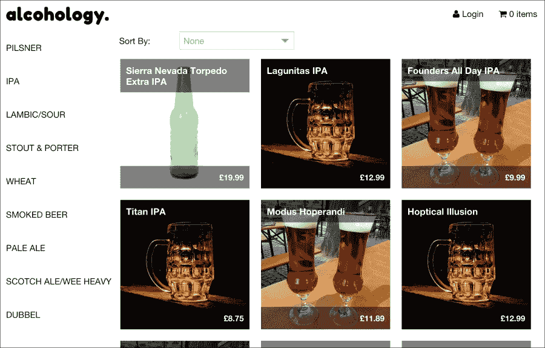

# 第九章. 购物应用

在本章中，我们将从头到尾设计最后一个应用。而不是继续介绍新的想法或技术来可视化和构建应用架构，我们将加倍努力完成我们迄今为止所做的工作。我们将结合路由、视图模型和事件，以巩固所讨论的一切，并创建设计文档来告知应用的结构。

在本书到目前为止的每一章中，我都试图强调，没有“唯一正确”的应用架构方法。每个应用都是不同的；有足够的空间进行解释。在本书的开头，我们讨论了 MVC 和 MVVM 设计模式，以及架构师必须找到自己的模式（一种感觉自然的工作方式）。更重要的是，模式是由于我们工作中的规律性而产生的，也就是说，重复做同样的事情。虽然不同的架构师会有不同的工作方式，并且可以在不同的方式中使用不同的方法，但在实际章节中，我们已经完成了一个逻辑的发展路径，这是很容易陷入的。

“成功陷阱”这个短语用来描述一种用户无需努力就能顺利遵循的方法。这正是我们一直在努力的方向。向您展示 Ext JS 提供的选项，不仅给您提供选择，还试图说明为什么它们是好的选择。到现在为止，您应该对 Ext JS 应用的设计和您可以使用来满足这种设计的功能有一个清晰的了解。

在这个最后的实践章节中，我们再次看到，尽管我们有选择如何实现这个应用，但最终我们会选择一条与之前相似的路径，一条感觉合理且使开发变得容易的路径。

# 关于应用

我们将要构建的应用是为平板电脑大小的屏幕设计的。我们将利用蓬勃发展的“手工啤酒”场景，创建一个允许客户从商店的分类啤酒中选择的应用。以下是完整的功能列表：

+   登录和注册

+   分类列表

+   带排序的产品列表

+   购物车

+   便于触摸

换句话说，这是在直接电子商务网站上可以看到的标准功能集。最终产品看起来是这样的：



我们有一个简单的界面，为平板电脑用户提供了大型的可触摸区域。在这个应用中，比我们迄今为止工作的任何其他应用都有更多的屏幕，所以让我们勾勒出这些屏幕，看看完整的应用将是什么样子：


这里，我们有用户打开网站时看到的第一个屏幕的线框图。正如您所看到的，它映射出了功能和布局，如前一个屏幕截图所示。

此原型提到了应用程序的所有主要功能。请注意，与我们的早期电子邮件应用程序不同，用户不需要登录即可开始浏览。只有在他们想要下单时才会发生这种情况。

啤酒类别按字母顺序列在左侧；当列表超出屏幕底部时，用户可以滚动浏览列表。在屏幕的主要部分，所选类别的啤酒按列表上方的组合框确定的排序顺序列出。每款在售啤酒都由其名称、图片和价格表示。

最后，在屏幕的右上角，我们有“登录”和“购物车按钮”，它们将根据应用程序状态进行更改，并且都是可点击的，可以揭示更多窗口。

## 产品窗口

以下屏幕显示了用户选择查看产品时的产品详情页面：


此屏幕详细说明了我们的需求和它们将如何实现。当用户点击列表中的产品时，会弹出一个模态窗口，显示有关该产品的更多信息，例如显示价格折扣的优惠信息、完整描述、生产啤酒的酿酒厂以及一句吸引顾客的标语。所有这些信息都伴随着产品的大幅图片，以及将啤酒添加到购物车和关闭产品窗口的按钮。

## 购物车

在主应用程序屏幕的右上角，我们可以看到一个购物车图标和一个标签，标签会根据购物车中的项目数量进行更改。当用户点击图标或标签时，将显示购物车窗口。


此模态窗口包含购物车中的产品列表以及每个项目的数量。用户可以通过点击加号或减号图标来调整每个项目的数量。此窗口的另一个关键功能是**立即下单**按钮，它将当前购物车处理成订单。

如果用户尚未登录，点击此按钮将显示登录和注册屏幕，我们将在下一节中讨论。

## 登录和注册

以下截图显示了**登录**和**注册**选项：


登录和注册表单并排显示，因为它们足够简单，可以放在同一个窗口中。字段将进行验证，以确保电子邮件格式正确且必填字段已填写。当完成注册或登录过程后，主屏幕上的**登录**图标将被用户的电子邮件地址替换；点击此链接将显示账户屏幕。

## 用户账户

用户账户页面允许用户编辑他们的详细信息并查看他们的历史订单：


左侧的文本字段允许用户修改他们的地址和用户凭据，右侧的面板是历史订单列表，显示已订购的项目、日期和总金额。

## 设计概述

我们已经逐一查看所有主要的应用程序视图；为了简单起见，我们排除了实际的支付过程，以避免与第三方服务集成。当用户继续订单时，它将立即被处理并添加到他们的账户中的历史订单中。

Ext JS 5 的一个非常好的特点是它增加了对触摸设备的支持，并包含了一个触摸友好的主题。这应该会使向平板用户展示此应用的目标变得非常简单；然而，我们将包括一些主题调整以创建自定义外观并改善平板设备用户的体验。

# 回到 Ext JS

虽然我们现在知道 Ext JS 可以帮助创建触摸友好的界面，但我们的设计是否提出了 Ext JS 可能无法应对的其他想法？记住，设计阶段是对用户适用性和现有技术可能性的探索。让我们来分析一下：

+   滚动产品分类列表可以是具有大多数功能的`Ext.grid.Panel`类，例如标题、禁用

+   滚动产品列表可以是`Ext.view.View`类（也称为 DataView），因为我们需要为每个产品包含自定义 HTML 来显示图片和其他详细信息

+   产品列表排序将通过包含排序标准的组合框来实现

除了这个之外，我们只需要模态窗口（Ext JS 支持），另一个用于购物车的网格，以及几个用于登录和注册的表单字段。我们基本上已经完成了。

此外，我们将使用路由来提供对分类或产品的书签功能，这使用户能够分享链接。我们还将使用视图模型和事件来连接一切。数据将再次从服务器端 API 中获取，所以让我们看看下一个。

# 数据层

购物应用需要提供以下数据：

+   分类列表

+   按分类过滤并按选定标准排序的产品列表

+   单个产品的详细信息

这使得事情非常直接。所以，在接下来的一段时间里，我们将具体说明当我们发起服务器请求时将看到什么样的数据响应。

在此之前，你可能注意到我们正在跳过将与应用程序服务器端集成的部分。这样做的主要原因是它将增加我们示例应用的复杂性，而不会增加太多价值；我们希望突出我们为了拼凑这个应用所做的决策，并以简洁易懂的方式呈现。虽然我们可以向这个应用和我们的前一个示例添加许多功能，但我们想确保构建应用程序的重要方面能够得到突出。

让我们回到我们希望我们的后端提供的数据。首先，检索类别列表：

```js
GET: /category
Accepts: N/A
Returns: [{"id":1,"name":"Pilsner"},{"id":2,"name":"IPA"}]
```

它不接受任何参数，并返回一个包含每个可用类别的 ID 和名称的 JSON 数组。要查看某个类别的产品，我们与产品 API 进行通信：

```js
GET: /product
Accepts:
sort = [{"property":"id","direction":"ASC"}]
filter = [{"property":"categoryId","value":2}]
Returns: [{"id":1,"name":"Sierra Nevada Torpedo Extra IPA","price":"19.99", "imagePath":"snte1.jpg"}]
```

它返回一个对象数组，每个对象都包含渲染产品列表项所需的属性。可以通过传递一个包含排序字段的 JSON 数组的排序查询参数来过滤数组，并且我们通过传递一个包含 JSON 数组的 `filter` 查询参数来获取所需的商品类别。此数组包含一个对象，用于过滤 `categoryId` 属性。这种 JSON 过滤和排序方法是我们过去使用过的，并且与 Ext JS 在客户端的工作方式很好地匹配。

最后，我们有以下单个产品详情的请求。

```js
GET: /product/:id
Accepts: N/A
Returns: { "id": 1, <all product fields omitted> }
```

它本身不接受任何查询参数。相反，ID 作为 URL 路径的一部分传递，这在 RESTful API 中更为常见。为了简洁，省略了完整的 JSON 响应，但它返回填充产品窗口所需的全套字段。

现在我们已经收集了这些信息，我们可以开始思考它将如何塑造我们的数据类。

## 信息沉思

根据我们刚刚描述的 API，我们有两个主要模型及其关联的存储：

```js
Alcohology.model.Product: extends Alcohology.model.BaseModel
- id
- name
- imagePath
- description
- price
- previousPrice
- brewery
- features
- categoryId

Alcohology.model.Category: extends Alcohology.model.BaseModel
- id
- name
```

这些将会有伴随的存储，它们除了包装它们的模型之外不做任何事情。除了与 API 交互的类之外，我们还将有其他几个类来处理应用程序中的其他动态部分。首先，我们将查看购物车中的各种项目：

```js
Alcohology.model.CartItem: extends Alcohology.model.BaseModel
- productId
- productName
- price
- quantity
```

此设计的替代方案是只保留 `productId` 和 `quantity`，并在渲染时从产品存储中查找产品详情。然而，我们选择的方法使生成的代码更简单，并且它还允许您存储用户将其添加到购物车时的数据，如价格。如果产品价格在用户将其添加到购物车后发生变化，这在复杂或繁忙的网站上可能会很有用。

其次，我们有一个模型来保存订单：

```js
Alcohology.model.Order: extends Alcohology.model.BaseModel
- date
- totalCost
- items[]
    - productId
    - productName
    - price
    - quantity
```

这将用于表示已转换为订单的购物车。虽然这个类将由一个简单的包装存储器消费，但 `CartItem` 将有一个执行更多操作的存储器：

```js
Alcohology.store.Cart: extends Ext.data.Store
- addProduct
- toOrder
```

`addProduct` 方法可以传递给要添加到购物车的产品模型。它添加了一些逻辑来检测是否已存在匹配的产品在购物车中；如果存在，则增加数量而不是创建新的购物车项。

`toOrder` 方法将购物车及其所有项目转换为 `Order` 模型，然后可以将其保存到服务器。

这个项目的 API 很简单，但我们也将使用模型和存储来组织我们的数据和应用程序状态，优先使用`Ext.data`类而不是标准 JavaScript 对象，以便利用它们强大的功能。随着数据设计基本完成，我们可以继续看看这些数据将如何与应用程序的其余部分交互。

# 组件交互

在 Ext JS 4 中，我们有 MVC 模式来构建和清理结构良好的应用程序。然而，回顾我们过去的几个实践章节，似乎很难想象从 Ext JS 提供的 MVVM 架构回到 MVC。因为在每个例子中，我们都有效地使用了视图模型来提供数据通过我们应用程序的逻辑流动方式。

这些例子有趣的地方在于，在许多情况下我们写的代码很少。分析应用程序需求并解决一些棘手区域会导致编写少量 UI、控制器、视图模型等的配置。Ext JS 自动构建了数据流动的管道。

这是另一个说明为什么应用程序架构如此重要的例子，尤其是当它与对现有工具的深入了解相结合时。一个天真的开发者可能会轻易地跳进来，开始编写代码来手动处理数据从 API 通过到用户界面的移动，使用`Ext.Ajax`而不是模型和代理，并手动将数据加载到组件中。然而，通过采取耐心和有条理的方法，我们可以构建一个概念性的应用程序概述，它可以轻松地适应 Ext JS 提供的框架。通过提前思考，我们使后续使用变得更加简单。

为了达到这个目的，让我们思考一下在这个应用程序中我们需要哪些控制器和视图。

## In control

控制器的目的是什么？正如你在第二章“MVC 和 MVVM”中学到的，它是作为应用程序其他部分之间的粘合剂，在大多数情况下，这体现在处理事件的代码中。从 UI 点击到路由事件，控制器消耗它们并将实际工作传递给另一个类。

这对我们思考架构的方式意味着什么？这意味着应用程序中的任何动作或事件都可能需要一个相关的控制器。如果这些动作可以捆绑成一个独立的分组，那么这可能表明它们需要自己的控制器。考虑到这一点，让我们再次看看我们的购物应用程序：


页面上的哪些元素可能会引发事件？在蓝色左侧面板中点击一个类别，因此除了类别列表视图外，我们还将有一个如下所示的类别视图控制器：

```js
Alcohology.view.categories.CategoriesController: extends Ext.app.ViewController
- onItemClick
```

在产品列表中点击一个产品是我们需要处理的一个动作，因此我们将有一个产品列表视图和一个产品视图控制器，如下所示：

```js
Alcohology.view.product.ProductController: extends 
Ext.app.ViewController
- onSortSelect
- onCategoryRoute
- onProductRoute
- onProductClick
- onProductClose
- onAddToCart

```

接下来，窗口右上角的两个图标需要触发 UI 更改，因此它们需要一个视图控制器。我们想要一个“标题”控制器来处理购物车和账户图标的事件，还是可以使用一个“主要”控制器？这通常是取决于个人偏好的问题；在这里，我们将使用主要控制器，以保持类数量的可控：

```js
Alcohology.view.main.MainController: extends Ext.app.ViewController
- onLoginRequired
- onCartClick
- onAccountClick
- onAccountRoute
- onCartRoute

```

让我们回顾一下我们的其他 UI 线框图。还有三个剩余的 UI 组件，它们都是模态窗口。首先，是产品详情窗口（与此交互将由我们已确定的产品控制器处理）。

接下来是购物车窗口，它将与一个控制器配对，该控制器处理用户与购物车中各种按钮的交互：

```js
Alcohology.view.cart.CartController: extends 
Ext.app.ViewController
- onCartClose
- onOrderNow

```

最后，以下代码显示了带有账户视图控制器以处理登录和注册的账户窗口：

```js
Alcohology.view.account.AccountController: extends 
Ext.app.ViewController
- onAccountClose
- onLoginRegister

```

有一个地方会引发事件，我们的应用程序需要处理。这个项目的需求规定，我们需要实现路由，以便通过电子邮件或社交媒体共享产品页面。为了满足这一需求，我们将有一个控制器指定路由的定义和匹配处理程序。具体承担这一角色的控制器将取决于路由定义的性质，例如，如果它与产品相关，则产品控制器将处理它。您可以在上一节中控制器设计中看到一些这些路由处理方法。

以这种方式对动作和事件进行分组通常会使得选择要构建哪些控制器变得容易，尤其是在与允许您查看相应 UI 视图的线框图一起使用时。

# 视图模型的简洁性

我们已经多次使用“流程”这个词来讨论视图模型和应用程序架构。当用户操作用户界面的各个部分时，数据通过控制器和视图模型流动，以表示应用程序的当前状态。与其列出在这个应用程序中数据可以流动的所有节点，不如让我们尝试以下方式来想象它：


主视图模型与它的依赖项之间的交互

能够在这个层面上概念化您的应用程序是一个好兆头，表明它被充分理解和构思。在更大的应用程序中，很难以这种方式可视化应用程序的每个部分，因此它通常会被分解成多个较小的可视化。无论如何，构建数据流和用户流的顶层映射是确认设计逻辑和简洁性的绝佳方式。

# 代码，代码，还有更多的代码

是时候动手实践，把手指放在键盘上了。一如既往地，我们使用 Sencha Cmd 生成了一个新基础应用程序，并将生成的“main”视图作为用户界面的起点。不过，首先让我们完善之前设计的底层数据结构：

```js
// app/model/BaseModel.js
Ext.define('Alcohology.model.BaseModel', {
    extend: 'Ext.data.Model',

    schema: {
        namespace: 'Alcohology.model',
        urlPrefix: 'http://localhost:3000',
        proxy: {
            type: 'rest',
            url: '{prefix}/{entityName:uncapitalize}'
        }
    }
});
```

我们在之前的章节中使用了基础模型，因为它为我们提供了一个很好的集中配置代理的方法。从它继承的模型都是直接的，如下面的代码所示：

```js
// app/model/CartItem.js
Ext.define('Alcohology.model.CartItem', {
    extend: 'Alcohology.model.BaseModel',
    fields: [
        { name: 'productId' },
        { name: 'productName' },
        { name: 'price' },
        { name: 'quantity' }
    ]
});

// app/model/Category.js
Ext.define('Alcohology.model.Category', {
    extend: 'Alcohology.model.BaseModel',
    fields: [
        { name: 'id', type: 'integer'}
    ]
});

// app/model/Order.js
Ext.define('Alcohology.model.Order', {
    extend: 'Alcohology.model.BaseModel',
    fields: [
        { name: 'date', type: 'date' },
        { name: 'items', type: 'auto' }
    ]
});

// app/model/Product.js
Ext.define('Alcohology.model.Product', {
    extend: 'Alcohology.model.BaseModel',
 fields: [
        { name: 'id', type: 'integer'},
        { name: 'name', type: 'string' },
        { name: 'imagePath', type: 'string' }
    ]
});
```

回顾我们的设计，这些模型完全符合我们之前制定的规范。我们真正做的只是在上面的原始字段定义之上添加了 Ext JS 实现。

## 购物车中有什么？

如我们所知，存储库通常只是包装器，为我们提供一些更多有用的方法来处理模型集合。回顾我们的设计文档，这种情况适用于本应用中的三个存储库：

```js
// app/store/Categories.js
Ext.define('Alcohology.store.Categories', {
    extend: 'Ext.data.Store',
    model: 'Alcohology.model.Category',
    alias: 'store.categories'
});

// app/store/PastOrders.js
Ext.define('Alcohology.store.PastOrders', {
    extend: 'Ext.data.Store',
    model: 'Alcohology.model.Order',
    alias: 'store.pastorders'
});

// app/store/Products.js
Ext.define('Alcohology.store.Products', {
    extend: 'Ext.data.Store',
    model: 'Alcohology.model.Product',
    alias: 'store.products'
});
```

所有这些都非常直接。购物车存储库稍微有趣一些，如下面的代码所示：

```js
// app/store/Cart.js
Ext.define('Alcohology.store.Cart', {
    extend: 'Ext.data.Store',
    model: 'Alcohology.model.CartItem',
    alias: 'store.cart',

    addProduct: function(product) {
        // find a product with a matching ID
        var item = this.findRecord('productId', product.getId());

        if(item) {
            item.set('quantity', item.get('quantity') + 1);
            item.commit();
        } else {
            item = this.add({
                productName: product.get('name'),
                price: product.get('price'),
                productId: product.getId(),
                quantity: 1
            });
        }

        return item;
    },

    toOrder: function() {
        var items = [], total = 0;

        this.each(function(item) {
            items.push({
                name: item.get('productName'),
                quantity: item.get('quantity')
            });

            total += item.get('price') * item.get('quantity');
        });

        return Ext.create('Alcohology.model.Order', {
            date: new Date(), items: items, total: total
        });
    }
});
```

在过去章节中我们构建的许多存储库都用于存储从服务器获取的信息。在这里，我们将存储用作购物车本身的内存表示；我们添加了一些自定义方法来帮助实现这一功能。

`addProduct`方法将通过将其转换为`CartItem`模型来将指定的产品添加到存储库中。如果购物车中已经存在具有相同 ID 的产品，则其数量将增加一个，而不是重复添加。

`toOrder`方法将整个购物车转换为`Order`模型，该模型在应用程序的后续部分用于显示用户账户中的历史订单。

这些方法很有趣，因为它们展示了我们不是在编写胶水代码或处理事件的代码的地方。这是处理应用程序真正有趣部分的代码，有时也称为“业务逻辑”。开发强大架构和强大开发实践的一个好处是，你将拥有更少的样板代码，并有更多时间专注于对客户重要的业务逻辑。

在第十一章“应用测试”中，我们将探讨隔离这种业务逻辑并创建自动化测试的方法，这些测试将使你对代码库充满信心。

我们的数据层已经就绪，因此我们可以继续构建用户界面。

# 面前的接口

使用 Sencha Cmd 创建的 Ext JS 应用程序将设置主视图为填充整个浏览器窗口的视口。我们将使用这个视图并根据以下代码对其进行调整以满足我们的需求：

```js
// app/view/main/Main.js
Ext.define('Alcohology.view.main.Main', {
    extend: 'Ext.Panel',
    xtype: 'app-main',

    controller: 'main',
    viewModel: 'main',
    layout: 'border',

    header: { xtype: 'app-header' },
    items: [
        { xtype: 'categories', width: 200, region: 'west' },
        { xtype: 'product-list', region: 'center' }
    ],

    initComponent: function() {
        this.callParent(arguments);

        this.add(Ext.create('Alcohology.view.cart.Cart', {
            reference: 'cartWindow'
        }));

        this.add(Ext.create('Alcohology.view.account.Account', {
            reference: 'accountWindow'
        }));
    }
});
```

我们已经到了这里！我们的第一个视图组件，将包含应用程序中所有其他内容的面板。`header`配置设置为稍后我们将构建的自定义`xtype`。面板中的项目配置为使用边框布局，并包括类别列表和产品列表。

这里有一个奇怪的地方：在 `initComponent` 方法中向面板添加窗口。这提供了两个好处：

+   主视图控制器可以使用 `lookupReference` 来引用窗口

+   窗口将通过视图模型继承访问主视图模型

这是一个简单的解决方案，解决了听起来很明显的难题，那就是我在哪里创建我的窗口？把它们放在 `items` 配置中的产品和类别列表中感觉“不对劲”，尽管我们当然可以这样做而没有任何不良影响。另一个常见的解决方案是在视图控制器本身中实例化窗口，但这样窗口就不是主视图的子项了，这会导致视图模型继承的问题。在 `initComponent` 方法中创建窗口感觉是绕过这个问题的自然方式。

## 比别人早一步

我们之前决定主视图控制器也将处理来自头部的事件，所以让我们看看下一个头部视图：

```js
// app/view/header/Header.js
Ext.define('Alcohology.view.header.Header', {
    extend: 'Ext.panel.Header',
    xtype: 'app-header',
    cls: 'app-header',
    layout: 'hbox',
    title: 'alcohology.',
    items: [
        { xtype: 'account-indicator', width: 80, bind: '{currentUser}' },
        bind: { data: { count: '{cartCount}' } }}
    ]
});
```

我们的定制头部组件继承自 `Ext.panel.Header` 并实现了 `hbox` 布局。其中包含的两个项目也是自定义类，一个用于购物车图标，另一个用于账户图标。这些配置绑定到 `currentUser` 和 `cartCount`，它们是主视图模型中的值，我们稍后会查看。

购物车图标称为 `MiniCart`，其外观如下：

```js
// app/view/header/MiniCart.js
Ext.define('Alcohology.view.header.MiniCart', {
    extend: 'Alcohology.ux.ClickContainer',
    xtype: 'minicart',
    cls: 'mini-cart',
    tpl: new Ext.Template('<span style="font-family:FontAwesome;">',
        '&#xf07a;</span> {count} items')
});
```

在 `header` 组件中，我们指定了 `MiniCart` 的 `data` 配置应该是一个具有 `count` 值的对象。这个 `count` 值将绑定到视图模型中的 `cartCount` 值。反过来，我们现在使用这个 `count` 值在模板中，这使得你可以拥有一个随着购物车中项目数量更新图标。

这里还有其他几件事情需要注意。我们使用 `FontAwesome` 图标集为购物车添加一些图形风格；你可以在 `tpl` 配置中的 `span` 标签中看到它的使用。

### 小贴士

`FontAwesome` 可以在 [`fortawesome.github.io/Font-Awesome/`](http://fortawesome.github.io/Font-Awesome/) 找到。

第二个需要注意的点是这个类继承自 `Alcohology.ux.ClickContainer`。这是什么？看看以下代码：

```js
// app/ux/ClickContainer.js
Ext.define('Alcohology.ux.ClickContainer', {
    extend: 'Ext.Container',
    xtype: 'clickcontainer',
    listeners: {
        'afterrender': function(me) {
            me.getEl().on('click', function() {
                me.fireEvent('click');
            });
        }
    }
});
```

一个普通的容器没有 `click` 事件，所以这个 `ClickContainer` 钩子到允许你处理与容器用户交互的底层元素。如果你不需要按钮样式而想有一个简单的可点击组件，这很有用。

### 小贴士

此功能也可以作为一个混合类而不是基类来实现。

账户指示器也扩展了 `ClickContainer`，如下所示：

```js
// app/view/header/AccountIndicator.js
Ext.define('Alcohology.view.header.AccountIndicator', {
    extend: 'Alcohology.ux.ClickContainer',
    xtype: 'account-indicator',
    cls: 'account-indicator',
    config: {
        user: null
    },
    defaultBindProperty: 'user',
    data: {
        label: 'Login'
    },
    tpl: '<span style="font-family:FontAwesome;"></span> {label}',

    applyUser: function(user) {
        if(user) {
            this.setData({ label: user.email });
        }
    }
});
```

我们再次使用绑定到自定义配置选项的技巧，这里有一些变化。如果绑定的用户值为 `null`，即用户尚未登录，我们使用 `data` 配置的默认值为此组件设置一个标签。如果他们已经登录，我们将标签设置为他们的电子邮件地址。

您可以在`tpl`配置中看到我们再次使用了`FontAwesome`。这也是我们使用默认值为`login`的标签的地方。

让我们回到处理用户与这些组件交互的代码。

## 在主控制下

主要控制器不仅处理用户点击和触摸，还定义了一些相关路由的地方。它甚至处理自定义事件。让我们看看：

```js
// app/view/main/MainController.js
Ext.define('Alcohology.view.main.MainController', {
    extend: 'Ext.app.ViewController',
    alias: 'controller.main',

    listen: {
        component: {
            'component[cls="mini-cart"]': { click: 'onCartClick' },
            'component[cls="account-indicator"]': { click: 'onAccountClick' },
        },

        controller: { '*': { loginrequired: 'onLoginRequired' } }
    },

    routes: {
        'account': 'onAccountRoute',
        'cart': 'onCartRoute'
    },

    onLoginRequired: function() {
        Ext.toast('Please login or register.');
        this.redirectTo('account', true);
    },

    onCartClick: function() {
        this.redirectTo('cart', true);
    },

    onAccountClick: function() {
        this.redirectTo('account', true);
    },

    onAccountRoute: function() {
        this.lookupReference('accountWindow').show();
    },

    onCartRoute: function() {
        this.lookupReference('cartWindow').show();
    }
});
```

这里展示了一个非常实用的技术：`account-indicator`和`minicart`的`click`处理程序都简单地重定向到它们的相关路由。这意味着我们可以将显示账户和购物车窗口的逻辑放在`onAccountRoute`和`onCartRoute`路由处理程序中。

在这个视图控制器中实现的其他功能是监听控制器域。它监听任何触发`loginrequired`事件的控制器，并使用`onLoginRequired`方法处理它。在`onLoginRequired`中，我们通过`Ext.toast`功能向用户弹出简短的通知，并简单地将他们重定向到`login/registration`页面。

这使得任何控制器或视图控制器都可以请求用户登录，而无需明确了解账户系统的实现。让我们看看主视口的视图模型：

```js
// app/view/main/MainModel.js
Ext.define('Alcohology.view.main.MainModel', {
    extend: 'Ext.app.ViewModel',
    alias: 'viewmodel.main',

    stores: {
        cart: { type: 'cart' },
        orders: { type: 'pastorders'}
    },

    data: {
        cartCount: 0
    },

    constructor: function() {
        var me = this;

        me.callParent(arguments);

        me.get('cart').on('datachanged', function(store) {
            me.set('cartCount', store.count());
        });
    }
});
```

这个顶级视图模型提供了过去订单和购物车的存储，以及一个属性，它给出了购物车中项目的数量。

由于 Ext JS 的默认设置，我们必须手动监听购物车存储上的`datachanged`事件，以便获取项目的“实时”计数，因为存储大小的变化不会触发数据绑定。

我们已经介绍了“主”视图及其相关类，接下来让我们转向将列出产品类别的视图。

# 按类别划分

我们将使用简化的网格来构建这个视图：

```js
// app/view/categories/Categories.js
Ext.define('Alcohology.view.categories.Categories', {
    extend: 'Ext.grid.Panel',
    xtype: 'categories',
    controller: 'categories',
    viewModel: 'categories',
    bodyCls: 'categories-body',
    requires: [
        'Alcohology.view.categories.CategoriesModel',
        'Alcohology.view.categories.CategoriesController'
    ],
    bind: {
        store: '{categories}'
    },
 hideHeaders: true,
    viewConfig: {
        trackOver: false
    },
    columns: [
        { text: 'Name',  dataIndex: 'name', flex: 1 }
    ]
});
```

我们已经隐藏了`grid`标题，并使用`flex`配置选项来告诉单列填充所有可用空间。这为我们提供了一个简单的滚动列表所需的功能。

列表的存储绑定到我们在稍后将要查看的类别视图模型中定义的`categories`。首先，让我们看看类别视图控制器：

```js
// app/view/categories/CategoriesController.js
Ext.define('Alcohology.view.categories.CategoriesController', {
  extend: 'Ext.app.ViewController',
  alias: 'controller.categories',
  listen: {
    component: {
      'categories': { 'itemclick': 'onItemClick' }
    }
  },

  onItemClick: function(view, record) {
    this.redirectTo('category/' + record.getId());
  }
});
```

这实际上不能再简单了；只需捕获`itemclick`事件，获取所选类别的 ID，并将其传递给路由系统，以便另一个控制器来处理。类别难题的最后一部分是视图模型，它甚至更加直接，如下面的代码所示：

```js
// app/view/categories/CategoriesModel.js
Ext.define('Alcohology.view.categories.CategoriesModel', {
    extend: 'Ext.app.ViewModel',
    requires: ['Alcohology.store.Categories'],
    alias: 'viewmodel.categories',
    stores: {
        categories: {
            type: 'categories',
            autoLoad: true
        }
    }
});
```

这就是 MVVM 模式的作用，这里显示的三个类都在做自己的事情，没有其他。视图类描述了展示，视图模型提供了这个展示背后的数据，而视图控制器处理用户交互。

# 产品定位

这是产品列表的代码：

```js
// app/view/product/List.js
Ext.define('Alcohology.view.product.List', {
    extend: 'Ext.Panel',
    controller: 'product',
    xtype: 'product-list',
    cls: 'product-list',
    viewModel: 'product',
    tbar: [
        {
            xtype: 'combo',
            store: Ext.create('Ext.data.Store', {
                fields: ['text', 'field', 'direction'],
                data : [
                    { text: 'Date Added', property: 'id', direction: 'DESC' },
                    { text: 'Name A-Z', property: 'name', direction: 'ASC' },
                    { text: 'Name Z-A', property: 'name', direction: 'DESC' },
                    { text: 'Price ASC', property: 'price', direction: 'ASC' }
                ]
            }),
            displayField: 'text',
            queryMode: 'local',
            fieldLabel: 'Sort By',
            emptyText: 'None',
            editable: false
        }
    ],
    items: [
        { 
            xtype: 'dataview', itemId: 'productListView', 
            emptyText: '<span class="empty">No Products Found.</span>',
            itemSelector: '.product', bind: '{products}',
            tpl: '<tpl for="."><div class="product"><h2>{name}</h2><p>&pound;{price}</p></div></tpl>',
        }
    ],

    constructor: function() {
        this.callParent(arguments);

        this.add(Ext.create('Alcohology.view.product.Detail', {
            reference: 'productWindow'
        }));
    }
});
```

产品列表的顶部工具栏包含一个组合框，其中包含一个内联存储，包含可用的排序选项。注意，我们包括了排序所针对的属性和排序的方向，这样我们就可以在稍后直接将这些属性传递到服务器。

有一个论点认为这个组合应该提取到一个单独的类中，或者存储应该在视图模型上设置；这可能会使这个类更清晰。另一方面，仅仅是为了文件和类的繁衍也会使事情变得不那么清晰，所以我们将它保持内联。

在这个类中，真正的作业是由绑定到视图模型上的产品存储的 `dataview` 执行的。注意，我们在这个类的构造函数中再次创建了一个窗口，这将使它能够使用与产品列表 `dataview` 相同的视图控制器。

下面是这个窗口的代码（它显示产品的详细信息）：

```js
// app/view/product/Detail.js
Ext.define('Alcohology.view.product.Detail', {
    extend: 'Ext.Window',
    modal: true,
    header: false,
    resizable: false,
    autoScroll: true,
    height: 600,
    width: 800,
    layout: 'column',
    cls: 'product-detail',
    items: [
        {
            xtype: 'container',
            columnWidth: 0.5,
            defaults: {
                xtype: 'component',
                bind: { data: '{currentProduct}' }
            },
            items: [
                { 
                    xtype: 'container', 
                    tpl: '' 
                },
                { tpl: '<ul><li>{features}</li></ul>' }
            ]
        },
        {
            xtype: 'container',
            columnWidth: 0.5,
            defaults: {
                xtype: 'component',
                bind: { data: '{currentProduct}' }
            },
            items: [
                { tpl: new Ext.Template('<h1>{name}</h1>',
                    '<h2 class="brewery">{brewery}</h2>',
                    '<h2><p class="price">&pound;{price}</p>',
                    '<p class="previousPrice">Was: &pound;{previousPrice}</p>',
                    '</h2>') },
                { tpl: '<div class="description">{description}</div>' }
            ]
        }
    ],

    bbar: [
        { text: 'Back', itemId: 'close', glyph: 0xf190 },
        '->',
        { text: 'Add to Cart', itemId: 'addToCart', glyph: 0xf07a }
    ]
});
```

这个类中有一个巧妙的小技巧。窗口通过列布局分成两部分，并填充了若干个组件，这些组件的 `data` 配置绑定到了视图模型上的 `currentProduct`。通过在这些组件上使用 `tpl` 配置来设置 HTML 模板，窗口中的每个面板都可以从 `currentProduct` 中拉取属性，并将它们纳入模板中。这为我们提供了一种混合方法，它利用了 Ext JS 的列布局和标准的 HTML/CSS 进行定制。

### 注意

在这个窗口的 `bbar` 中，我们使用 `glyph` 属性通过图标的相关 `unicode` 字符代码在按钮上设置 `FontAwesome` 图标。

与产品列表和详情一起工作的视图控制器有几个有趣的功能如下：

```js
// app/view/product/ProductController.js
Ext.define('Alcohology.view.product.ProductController', {
    extend: 'Ext.app.ViewController',
    alias: 'controller.product',
    listen: {
        component: {
            '#productListView': { 'itemclick': 'onProductClick' },
            '#close': { 'click': 'onProductClose' },
            '#addToCart': { 'click': 'onAddToCart' },
            'combo': { 'select': 'onSortSelect' }
        }
    },

    routes : {
        'product/:id': 'onProductRoute',
        'category/:id': 'onCategoryRoute'
    },

    onSortSelect: function(combo, records) {
        if(records.length > 0) {
            var prop = records[0].get('property'),
                dir = records[0].get('direction');

            this.getViewModel().set('sortProperty', prop);
            this.getViewModel().set('sortDirection', dir);
        }
    },

    onCategoryRoute: function(id) {
        var cfg = { reference: 'Alcohology.model.Category', id: id };
        this.getViewModel().linkTo('currentCategory', cfg);
        this.lookupReference('productWindow').hide();
    },

    onProductRoute: function(id) {
        var cfg = { reference: 'Alcohology.model.Product', id: id };
        this.getViewModel().linkTo('currentProduct',  cfg);
        this.lookupReference('productWindow').show();
    },

    onProductClick: function(view, record, el) {    
        this.redirectTo('product/' + record.getId());
    },

    onProductClose: function() {
        var id = this.getViewModel().get('currentCategory').getId();
        this.redirectTo('category/' + id);
    },

    onAddToCart: function() {
        var product = this.getViewModel().get('currentProduct');

        this.getViewModel().get('cart').addProduct(product);

        Ext.toast('Product Added');
    }
});
```

在连接事件监听器和路由之后，我们有了 `onSortSelect` 方法，它处理用户对 `sort` 选项的选择。我们挑选出需要的值并将它们发送到视图模型。

这个视图控制器处理的路由：`onCategoryRoute` 和 `onProductRoute` 处理类别的选择（显示产品列表）和产品的选择（显示单个产品），并且使用了一种（对我们来说是新的）技术。

通过使用 `linkTo` 方法，我们告诉 Ext JS 如果指定的记录尚未加载，则加载该记录。通过这样做，我们节省了手动加载记录的劳动。这是一个方便的快捷方式，让我们能够用最少的代码在视图模型上设置 `currentProduct` 和 `currentCategory`。

`onProductClick` 和 `onProductClose` 方法使用 `redirectTo` 将实际行为传递给相关的路由。`onAddToCart` 方法从视图模型中获取购物车存储，并使用我们在数据层中创建的 `addProduct` 方法将当前产品推入购物车。

最后，我们有产品视图模型：

```js
// app/view/product/ProductModel.js
Ext.define('Alcohology.view.product.ProductModel', {
    extend: 'Ext.app.ViewModel',
    alias: 'viewmodel.product',
    links: {
        currentCategory: {
            type: 'Alcohology.model.Category',
            id: 1
        }
    },
    data: {
        sortProperty: 'id',
        sortDirection: 'ASC'
    },
    stores: {
        products: {
            type: 'products',
            autoLoad: true,
            remoteFilter: true,
            remoteSort: true,
            sorters: [{
                property: '{sortProperty}',
                direction: '{sortDirection}'
            }],
            filters: [{
                property: 'categoryId',
                value: '{currentCategory.id}'
            }]
        }
    }
});
```

`links`配置设置了要加载的初始类别；Ext JS 将自动完成此操作，并且任何绑定到它的东西都可以在加载完成后立即使用它。这里不需要手动干预；只需连接配置并继续即可。

`data`对象包含产品排序的默认值，您可以看到这些值被`products`存储使用，并通过`remoteSort`发送到服务器。产品存储用于为类别中的产品列表提供动力，为此它有一个绑定到`currentCategory` ID 的过滤器。这将作为 JSON 与排序选项一起发送。

类别和产品已经处理好了。现在是时候转向购物车 UI 了。

# 一个篮子案例

购物车本身是一个网格，显示购物车中的产品和每个产品的数量。它被包含在一个窗口中，底部有几个操作按钮，如下所示：

```js
// app/view/cart/Cart.js
Ext.define('Alcohology.view.cart.Cart', {
    extend: 'Ext.Window',
    requires: ['Alcohology.view.cart.CartController'],
    controller: 'cart',
    width: 500,
    height: 350,
    modal: true,
    resizable: false,
    header: false,
    onEsc: Ext.emptyFn,
    layout: 'fit',
    items: [
        {
            xtype: 'grid',
            bind: '{cart}',
            plugins: {
                ptype: 'cellediting',
                clicksToEdit: 1
            },
            listeners: {
                edit: function(editor, e) {
                    e.record.commit();
                }
            },
            hideHeaders: true,
            emptyText: 'No items in the cart.',
            columns: [
                { name: 'Product', dataIndex: 'productName', flex: 1 },
                {
                    name: 'Quantity', dataIndex: 'quantity',
                    editor: {
                        xtype: 'numberfield',
                        allowBlank: false
                    }
                }
            ]
        }
    ],
    bbar: [
        '->',
        { text: 'Close', itemId: 'closeCart' },
        { text: 'Order Now', itemId: 'orderNow' }
    ]
});
```

在网格中，我们使用了`cellediting`插件，允许用户轻触数量列并使用 Ext JS 在触摸友好主题中提供的加号和减号图标来调整项目数量。当数量被编辑并且网格上的`edit`事件被触发时，我们立即将更改提交到购物车存储，该存储与父视图模型绑定。

注意，这个视图没有特定的视图模型。相反，由于我们在主视图的构造函数中实例化了此窗口，它将继承主视图模型。这意味着我们可以通过在视图模型层次结构中将其放置得更高来与多个组件共享购物车存储。

让我们继续到购物车视图控制器，如下面的代码所示：

```js
// app/view/cart/CartController.js
Ext.define('Alcohology.view.cart.CartController', {
    extend: 'Ext.app.ViewController',
    alias: 'controller.cart',
    listen: {
        component: {
            '#closeCart': { click: 'onCartClose' },
            '#orderNow': { click: 'onOrderNow' }
        }
    },

    onCartClose: function() {
        this.getView().hide();
    },

    onOrderNow: function() {
        var vm = this.getViewModel();

        if(!vm.get('currentUser')) {
            this.fireEvent('loginrequired');
        } else {
               var order = vm.get('cart').toOrder();

            vm.get('cart').removeAll();
            vm.get('orders').add(order);

            Ext.toast('Order Accepted!');

            this.getView().hide();
        }
    }
});
```

我们通过使用在视图中定义的选择器`itemId`来为窗口的按钮连接事件处理器。`onCartClose`方法很简单，但`onOrderNow`方法则更有趣。

它首先通过检查视图模型上的`currentUser`是否为`null`来确定用户是否已登录。如果用户未登录，将触发`loginrequired`事件；如果您还记得，我们之前在主视图控制器中处理了这个问题。如果用户已登录，我们将执行以下操作：

+   从购物车存储调用`toOrder`方法以获取`Order`模型

+   从购物车中移除所有项目

+   将新的`Order`模型添加到视图模型上的订单存储

+   向用户显示一个吐司通知

+   隐藏购物车窗口

所有这些最终导致购物车被移动到一个订单。在一个全面的电子商务应用中，这部分将由信用卡捕获和支付处理所取代，但在这里我们采取了简单的方法，即通过调用其他类的方法来执行我们需要的操作。

如前所述，购物车视图没有自己的视图模型，因为它继承自父视图，所以我们现在将转向应用中的最后一个视图；账户窗口。

# 账户窗口

账户视图是一个包含多个子组件（如登录、注册和过往订单）的窗口。让我们看看它的冗长但直接的代码：

```js
// app/view/account/Account.js
Ext.define('Alcohology.view.account.Account', {
    extend: 'Ext.Window',
    xtype: 'account',
    layout: 'fit',
    controller: 'account',
    modal: true,
    resizable: false,
    header: false,
    onEsc: Ext.emptyFn,
    width: 800,
    autoHeight: true,
    frame: true,
    items: [
        {
            xtype: 'container',
            layout: 'column',
            items: [
                { xtype: 'login', title: 'Login', columnWidth: 0.5 },
                { xtype: 'register', title: 'Register', columnWidth: 0.5 }
            ],
            bind: { hidden: '{currentUser}' }
        },
        {
            xtype: 'container',
            layout: 'column',
            items: [
                { xtype: 'register', title: 'Register', columnWidth: 0.5 },
                {
                    xtype: 'panel',  title: 'Past Orders',
                    columnWidth: 0.5, items: [
                        { xtype: 'pastorders', bind: '{orders}' }
                    ]
                }
            ],
            bind: { hidden: '{!currentUser}' }
        }
    ],
    bbar: [
        '->',
        { text: 'Close', itemId: 'close' },
        {
            text: 'Login/Register', itemId: 'loginRegister',
            bind: { hidden: '{currentUser}' }
        }
    ]
});
```

这里有两个面板，都设置为使用`column`布局。一个包含登录和注册表单，当用户注销时显示。另一个显示注册表单，作为让用户编辑其个人资料详情和过往订单的方式。第二个面板仅在用户登录时显示。

在账户窗口中隐藏和显示组件是通过将`hidden`配置绑定到顶级主视图模型中的`currentUser`来实现的。Ext JS 将用户对象转换为“真值”，即 true 或 false。这用于设置组件的可见性。

接下来，我们有一个`login`组件，它只是一个带有相关字段和一些解释性文本的`Ext.FormPanel`，如下面的代码所示：

```js
// app/view/account/Login.js
Ext.define('Alcohology.view.account.Login', {
    extend: 'Ext.FormPanel',
    xtype: 'login',
    items: [
        { 
            xtype: 'fieldset', margin: 10, padding: 10,
            defaults: { xtype: 'textfield', width: '100%' },
            items: [
                { fieldLabel: 'Email', bind: '{email}', vtype: 'email' },
                { fieldLabel: 'Password', inputType: 'password' }
            ]
        },
        {
            xtype: 'container',
            padding: 10,
            html: 'If you've already got an Alcohology account,please enter your login details above. If not, please complete the registration form and join us!'
        }
    ]
});
```

然后，我们有一个`register`组件，另一个包含用户必须完成以注册的字段的表单：

```js
// app/view/account/Register.js
Ext.define('Alcohology.view.account.Register', {
    extend: 'Ext.FormPanel',
    xtype: 'register',
    defaultType: 'textfield',
    items: [
        {
            xtype: 'fieldset', margin: 10, padding: 10,
            defaults: { xtype: 'textfield', width: '100%' },
            items: [
                { fieldLabel: 'Email', bind: '{email}', vtype: 'email' },
                { fieldLabel: 'Password', inputType: 'password' }
            ]
        },
        {
            xtype: 'fieldset', margin: 10, padding: 10,
            defaults: { xtype: 'textfield', width: '100%' },
            items: [
                { fieldLabel: 'House Number' },
                { fieldLabel: 'Street' },
                { fieldLabel: 'Town' },
                { fieldLabel: 'County' },
                { fieldLabel: 'Postcode' }
            ]
        }
    ]
});
```

账户用户界面的最后一部分是过往订单组件：

```js
// app/view/account/PastOrders.js
Ext.define('Alcohology.view.account.PastOrders', {
    extend: 'Ext.DataView',
    xtype: 'pastorders',
    tpl: new Ext.XTemplate('<tpl for="."><div class="past-order">',
        '<h3>Ordered on {date:date("m F Y")}</h3>',
        '<ul><tpl for="items">{name} x {quantity}</tpl></ul>',
        '<p>Total: &pound;{total}</p></div></tpl>'),
    itemSelector: '.fake',
    emptyText: 'No Previous Orders.'
});
```

在这里，我们使用配置了`itemTpl`的数据视图来输出所有订单以及遍历此订单内的项目。由于过往订单均不可点击，因此没有可点击的订单详情视图。因此，我们需要指定一个假的`itemSelector`。在包含的账户窗口中将此组件的存储绑定到视图模型上的订单存储。

最后，我们有一个简单的视图控制器来处理与账户窗口的交互，如下面的代码所示：

```js
// app/view/account/AccountController.js
Ext.define('Alcohology.view.account.AccountController', {
    extend: 'Ext.app.ViewController',
    alias: 'controller.account',
    listen: {
        component: {
            '#close': { click: 'onAccountClose' },
            '#loginRegister': { click: 'onLoginRegister' }
        }
    },

    onAccountClose: function(btn) {
        this.getView().hide();
    },

    onLoginRegister: function() {
        this.getViewModel().set('currentUser', {
            email: this.getViewModel().get('email')
        });

        this.getView().hide();
    }
});
```

在`onAccountClose`中，这是标准操作，但在`onLoginRegister`中，我们执行了一个非常简单的登录操作，其中`currentUser`被设置为用户为登录或注册输入的电子邮件地址的对象。如前所述，我们为了简单起见绕过了完整的认证系统，但这演示了基本思想，即执行一个最终将用户设置在继承的视图模型上的操作。再次强调，您将看到我们没有单独的账户视图模型，因为所有内容都是向上和向下传递到主视图上定义的那个。

# 摘要

本章简要介绍了我们应已熟悉的特性和想法。这是过去几章工作的总结，以及如何以低复杂度构建具有多个视图的应用程序的演示。

在下一章中，我们将从完整的应用程序转向查看 Ext JS 项目中涉及的性能和调试考虑。我们如何设计我们的应用程序以帮助开发者解决问题？我们如何尝试确保我们的应用程序对最终用户来说感觉响应迅速？我们将在下一章深入探讨这些问题。
