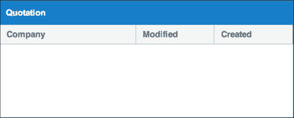
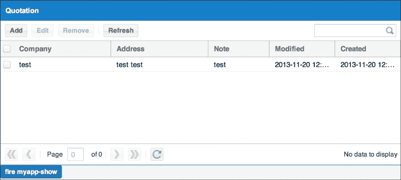
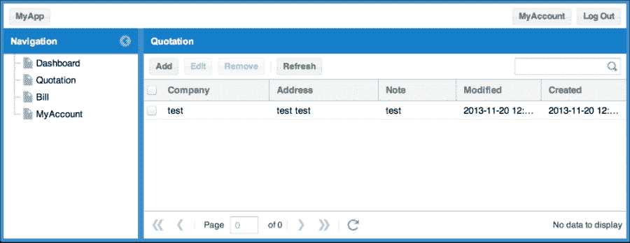
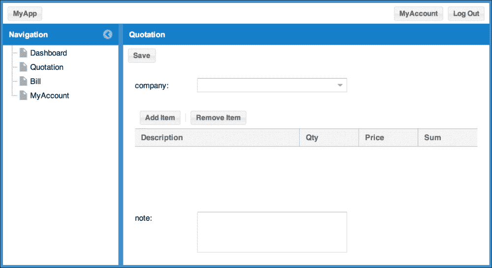

# 第四章。列表和搜索

在前面的章节中，我们研究了准备数据结构和基本的 Ext JS 架构，在第三章，*数据输入*中，我们学习了如何输入数据。然而，我们无法实现从 `Quotation` 表单的数据写入，这是因为由于列表不存在，我们无法判断它是新增还是编辑过程。

当你实际构建一个应用程序时，最常见的情况可能是首先构建列表，然后创建表单。然而，这次我们学习了先读取表单然后保存。所以，只需选择你认为更容易构建的方式即可。

本章主要关于显示上一章读取的数据。然而，用户无疑会想要搜索数据，因此我们还将学习数据搜索。

在本章中，你将学习如何：

+   从数据库获取数据

+   将获取的数据应用到商店

+   连接商店和网格

+   将数据读取到字段中

+   搜索列表

# 创建 `Quotation` 列表

因此，让我们直接开始准备 CT 来创建 `Quotation` 列表。我们将创建 `view_list.htm` 和 `view_list.js`（源文件：`01_creating_quotation_list/ct/quotation/view_list.html`）。

`view_list.html` 文件是其他 `view` 文件的复制品，因此在内部读取时，将正在读取的视图中的 `.js` 文件更改为 `view_list.js`（源文件：`01_creating_quotation_list/ct/quotation/view_list.js`）。

`view_list.js` 文件也几乎相同。只是略有不同。

```js
Ext.onReady(function() {
    Ext.create('MyApp.store.Customer');
    Ext.create('MyApp.store.QuotationItem');
    Ext.create('MyApp.store.Quotation');
    Ext.create('MyApp.view.quotation.Quotation', {
        activeItem: 0,
     ...
```

到目前为止，准备 CT 应该已经变成一个直接的过程。

与编辑不同，将列表中的 `activeItem` 设置为 `0`。如果你检查浏览器中的外观，只有 `Quotation` 面板将被显示。

让我们开始构建内部结构。

# 创建 `Quotation` 模型

首先，你想要建立一个商店，但在那之前让我们先构建一个模型（源文件：`02_creating_quotation_model/app/model/Quotation.js`）。

让我们实现一个具有新获得的 `id`、`customer`、`modified` 和 `created` 的 `Quotation` 模型类。

定义 `id`、`customer`、`name`、`modified 日期/时间` 和 `created 日期/时间` 参数。然后，我们将实现上一步中模型使用的商店（源文件：`02_creating_quotation_model/app/store/Quotation.js`）。

```js
Ext.define('MyApp.store.Quotation', {
    extend: 'Ext.data.Store',
    storeId: 'QuotationList',
    model: 'MyApp.model.Quotation',
    remoteSort: true,
    pageSize: 100,
    proxy: {
        type: 'direct',
        directFn: 'MyAppQuotation.getGrid',
        reader: {
            type: 'json',
            root: 'items',
            totalProperty: 'total'
        }
    }
});
```

在 `directFn` 中指定 `MyAppQuotation.getGrid`。这是商店将要获取数据的方法名称。当然，这是一个新的构建。换句话说，向 PHP 类中添加一个方法，凭借你迄今为止的经验，你应该能够轻松地想象是否需要添加 `config.php`。

因此，首先实现这个方法，即使它是空的（源文件：`02_creating_quotation_model/php/classes/MyAppQuotation.php`）。

有一个参数，为此将从商店发送一个搜索条件（源文件：`02_creating_quotation_model/php/config.php`）。

```js
<?php
$API = array(
    ....
    'MyAppQuotation'=>array(
        'methods'=>array(
            ....
            'getGrid'=>array(
                'len'=>1
            )
        )
    ),
    ....
);
```

# 更新 `Quotation` 视图

你已经为显示网格准备了所有东西，所以让我们实现视图（源文件：`03_update_the_quotation_view/app/view/quotation/List.js`）。

```js
Ext.define('MyApp.view.quotation.List', {
  ...
    initComponent: function() {
        var me = this;
        Ext.apply(me, {
            columns: [{
                text: 'Customer',
                dataIndex: 'customer',
                flex: 1
            }, {
                text: 'Modified',
                dataIndex: 'modified',
                width: 120
            }, {
                text: 'Created',
                dataIndex: 'created',
                width: 120
            }]
        });
        me.callParent(arguments);
    }
});
```

这里你只指定了列。为了抽象网格面板，我们正在创建`MyApp.grid.Panel`类。（源文件：`03_update_the_quotation_view/app/grid/Panel.js`）。

我们将创建一个纯继承自`Ext.grid.Panel`类的`MyApp.grid.Panel`类。

我们只是简单地继承了`Ext.grid.Panel`类。这就是抽象的全部。现在，如果你显示它，应该看起来如下：



自从我们看到了图像以来已经有一段时间了，所以我们现在显示了一个列；然而，让我们开始创建这个列表所需的必要对象。

下一步要添加的是带有按钮的工具栏。让我们继续添加以下按钮（源文件：`03_update_the_quotation_view/app/view/quotation/List.js`）：

+   `添加`

+   `编辑`

+   `删除`

+   `更新`

这可以通过以下代码实现：

```js
Ext.define('MyApp.view.quotation.List', {
    ....
    initComponent: function() {
        var me = this;
        Ext.apply(me, {
            tbar: [{
                text: 'Add',
                disabled: true,
                action: 'add'
            }, {
                text     : 'Edit',
                disabled : true,
                action   : 'edit'
            }, {
                text     : 'Remove',
                disabled : true,
                action   : 'remove'
            }, '-', {
                text     : 'Refresh',
                disabled : true,
                action   : 'refresh'
            }]
        });
    ....
```

我们已经安装了按钮，现在向控制器描述处理这个事件的处理器（源文件：`03_update_the_quotation_view/app/controller/quotation/List.js`）。

在`MyApp.controller.quotation.List`类的控制中，使用以下选择器，并将每个处理程序与`click`事件注册（同时我们也将实现每个空处理程序）：

+   对于`selector: 'myapp-quotation-list button[action=add]'`使用`handler: onItemAdd`

+   对于`selector: 'myapp-quotation-list button[action=edit]'`使用`handler: onItemEdit`

+   对于`selector: 'myapp-quotation-list button[action=remove]'`使用`handler: onItemRemove`

+   对于`selector: 'myapp-quotation-list button[action=refresh]'`使用`handler: onStoreRefresh`

如果你想检查事件是否响应，可以将`disabled`设置为`false`，或者重置它然后检查性能。我们稍后会创建一个实现，以便禁用按钮的状态根据列表是否被选中而改变。

接下来，让我们实现`SearchField`以进行搜索。我们将将其放置在我们之前创建的顶部工具栏中。但在你能够做到这一点之前，你需要实现`SearchField`。`SearchField`从一开始就是作为`ux`分发的，但这次我们将使用这个作为参考来构建一个新的（源文件：`03_update_the_quotation_view/app/form/SearchField.js`）。

```js
Ext.define('MyApp.form.SearchField', {
    extend: 'Ext.form.field.Trigger',
    alias: 'widget.myapp-searchfield',
    trigger1Cls: Ext.baseCSSPrefix + 'form-clear-trigger',
    trigger2Cls: Ext.baseCSSPrefix + 'form-search-trigger',
    hasSearch : false,
    paramName : 'query',
    initComponent: function() {
        var me = this;
        me.callParent(arguments);
        me.on('specialkey', function(f, e){
            if(e.getKey() == e.ENTER) {
                me.onTrigger2Click();
            }
        });
    },
    afterRender: function() {
        this.callParent();
        this.triggerCell.item(0).setDisplayed(false);
    },
    onTrigger1Click : function() {
        var me = this;
        if(me.hasSearch) {
            me.setValue('');
            me.hasSearch = false;
            me.triggerCell.item(0).setDisplayed(false);
            location.href = me.urlRoot;
        }
    },
    onTrigger2Click : function() {
        var me = this,
            value = me.getValue();
        if(value.length > 0) {
            me.triggerCell.item(0).setDisplayed(true);
            location.href = Ext.String.format('{0}q={1}', me.urlRoot, 
            value);
        }
    }
});
```

接下来，添加分页工具栏。将其与`SearchField`一起安装。一次显示 100 到 1,000 个项目将是最优的。为了声明使用`SearchField`，在`requires`中设置`MyApp.form.SearchField`（源文件：`03_update_the_quotation_view/app/view/quotation/List.js`）。

```js
       ....
    initComponent: function() {
        var me = this;
        Ext.apply(me, {
            tbar: [{
                ....
            }, '->', {
                xtype    : 'myapp-searchfield',
                disabled : true,
                width    : 150
            }],
            bbar: {
                xtype       : 'pagingtoolbar',
                displayInfo : true 
            }
    ....
```

最后，让我们稍微自定义一下网格。修改`SelectionModel`，然后通过复选框实现选择功能。我们将安装它，以便提供一个用户界面，允许您批量删除项目。为此，您将使用`Ext.selection.CheckboxModel`（源文件：`03_update_the_quotation_view/app/view/quotation/List.js`）。

```js
Ext.define('MyApp.view.quotation.List', {
    ....
    requires: [
        'MyApp.form.SearchField',
        'Ext.selection.CheckboxModel'
    ],
    initComponent: function() {
        var me = this;
        Ext.apply(me, {
            selModel: Ext.create('Ext.selection.CheckboxModel')
        });
        Ext.apply(me, {
            tbar: {
                text: 'Add',
                ....
```

与`SearchField`类似，在`requires`中定义`Ext.selection.CheckboxModel`的读取。再次，关于`selModel`，设置`Ext.selection.CheckboxModel`实例。如果你完成所有配置，它应该看起来像这样：

![更新引用视图

# 实现引用控制器

看起来越来越像真的了！所以，现在让我们实现实际读取和显示数据的部分。首先，像往常一样，从实现 CT 开始（源文件：`04_implement_quotation_controller/ct/quotation/view_list.html`）。

复制`app_edit.html`并更改正在读取的`.js`文件为`app_list.js`。再次小心，因为我们还将一起读取`api.php`文件（源文件：`04_implement_quotation_controller/ct/quotation/view_list.js`）。

```js
...
Ext.application({
  ...
    controllers: [
        'quotation.Quotation',
        'quotation.Edit',
        'quotation.List'
    ],
    launch: function() {
        var panel = Ext.create('MyApp.view.quotation.Quotation', {
           width: 800,
           height: 600,
           activeItem: 0,
           renderTo: Ext.getBody()
        });
        Ext.util.Observable.capture(panel, function() {
            console.log(arguments);
        });
        Ext.widget('button', {
            text: 'fire myapp-show',
            renderTo: Ext.getBody(),
            scope: this,
            handler: function() {
                this.getController('quotation.Quotation').loadIndex('#!/quotation');
            }
        });
    }
});
```

注意，`direct`设置也在进行中。

现在准备模拟触发`myapp-show`事件的按钮。当然，我们还将添加`List`控制器（源文件：`04_implement_quotation_controller/app/controller/quotation/List.js`）。

在这里，我们将向`stores`、`refs`、`myapp-quotationlist`添加`myapp-show`事件，并最终实现`onShow`方法：

```js
Ext.define('MyApp.controller.quotation.List', {
    extend: 'MyApp.controller.Abstract',
    stores: [
        'Quotation'
    ],
    refs: [{
        ref: 'listView', selector: 'myapp-quotation-list' 
    }],
    init: function() {
        var me = this;
        me.control({
            'myapp-quotation-list': {
                'myapp-show': me.onShow
            },
    ...
    },
    onShow: function(p, owner, params) {
        var me          = this,
            listView    = me.getListView(),
            btnAdd      = listView.down('button[action=add]'),
            btnEdit     = listView.down('button[action=edit]'),
            btnRemove   = listView.down('button[action=remove]'),
            btnRefresh  = listView.down('button[action=refresh]'),
            fieldSearch = listView.down('myapp-searchfield'),
            query       = params.q;
        btnAdd.disable();
        btnEdit.disable();
        btnRemove.disable();
        btnRefresh.disable();
        if(query) {
            fieldSearch.setValue(query);
            fieldSearch.triggerCell.item(0).setDisplayed(true);
            fieldSearch.hasSearch = true;
        }
        fieldSearch.urlRoot = '#!/quotation/';
        fieldSearch.disable();
        listView.getStore().load({
            params: {
                query: query
            },
            callback: function(records, operation, success) {
                btnAdd.enable();
                btnRefresh.enable();
                fieldSearch.enable();
            }
        });
    },
  ...
});
```

添加事件处理程序，然后实现`onShow`事件。从 store 获取列表视图并调用`load`方法。

为了获取`list`视图和 store，确保`stores`和`refs`已配置。这次，我们还将修改组件侧，即视图侧（源文件：`04_implement_quotation_controller/app/view/quotation/List.js`）。

```js
Ext.define('MyApp.view.quotation.List', {
    ....
    initComponent: function() {
        var me = this,
            store = me.getStore();
        if(!store) {
            store = Ext.create('MyApp.store.Quotation');
            me.store = store;
        }
        Ext.apply(me, {
        ....
```

在`initComponent`方法中设置`store`对象。运行 CT，如果按下按钮，store 将使用已设置的`DirectFn`方法，并发生传输。当然，服务器端实现尚未发生，所以列表中不会显示任何内容。

# 加载网格和实现工具栏按钮

一般而言，如果一个网格不能读取数据，那么它就不是网格。目前，让我们只从数据库中读取数据并在网格中显示（源文件：`05_loading_the_grid_and_implementing_toolbar_buttons/php/classes/MyAppQuotation.php`）。

在这里，我们将为`MyAppQuotation.php`实现`getGrid`方法，该方法返回空数据。

### 注意

这段代码有点长，请参考源文件查看代码。

如果我们在数据库中放入任何旧数据，它将显示出来。但是，因为我们想要显示的项目略有增加，我们需要修改 JavaScript 源代码。将两个文件`addr`和`note`添加到`Quotation`模型中（源文件：`05_loading_the_grid_and_implementing_toolbar_buttons/app/model/Quotation.js`）。

现在，让我们将之前步骤中添加的两个文件添加到`MyApp.view.quotation.List`中的`columns`属性（源文件：`05_loading_the_grid_and_implementing_toolbar_buttons/app/view/quotation/List.js`）：

```js
  ...
            }, {
                text: 'Address',
                dataIndex: 'addr',
                flex: 1
            }, {
                text: 'Note',
                dataIndex: 'note',
                flex: 1
            }, {
    ...
```

我们已经添加了`addr`、`modified`和`created`文件。数据是随机的，但列被显示，数据读取方式如下截图所示：



接下来是注册过程的构建，这是我们留在第三章 *数据输入*中未完成的事情。为了做到这一点，首先实现工具栏按钮的事件处理程序，然后显示**添加新**和**编辑**屏幕（源文件：`05_loading_the_grid_and_implementing_toolbar_buttons/app/controller/quotation/List.js`）。

```js
Ext.define('MyApp.controller.quotation.List', {
    ....
    onItemAdd: function() {
        var me          = this,
            listView    = me.getListView();
        listView.fireEvent('myapp-add');
    },
```

在列表视图组件中触发`myapp-add`事件（源文件：`05_loading_the_grid_and_implementing_toolbar_buttons/app/controller/quotation/Quotation.js`）。

```js
Ext.define('MyApp.controller.quotation.Quotation', {
    ....
    init: function() {
        var me = this,
            format = Ext.String.format;
        me.control({
            'myapp-quotation-list': {
                'myapp-add': function() {
                    location.href = format('#!/{0}/new', 
                    me.screenName);
                }
            },
    ....
```

然后在`MyApp.controller.quotation.Quotation`类中描述`myapp-add`事件处理程序。在这里，指定`location.href`中的 URL，然后移动屏幕。不在 CT 中，但如果你在`index.php`中显示整个应用程序，你应该能够检查点击**添加**按钮时屏幕如何变化。



点击**添加**按钮后，您将看到以下截图：



让我们实现`添加新功能`。CT 是开发它的地方。它将在`ct/quotation/app_edit.htm`中实现。

首先实现**保存**按钮。使用组件查询获取**保存**按钮，查询为`'myapp-quotation-edit button[action=save]'`，并设置`click`事件。处理程序名称为`onSave`。

让我们以这样的方式创建它，当按下**保存**按钮时，事件处理程序将在`MyApp.controller.quotation.Edit`类中注册（源文件：`05_loading_the_grid_and_implementing_toolbar_buttons/app/controller/quotation/Edit.js`）。

```js
        me.control({
            ....
            'myapp-quotation-edit button[action=save]': {
                'click': me.onSave
            }
        });
```

我们还将实现处理程序的内部。

```js
    ...
 onSave: function() {
        var me      = this,
            p       = me.getEditView(),
            form    = p.getForm(),
            format  = Ext.String.format,
            id;
        p.setLoading();
        form.submit({
            success: function(form, action) {
                if(action.result.newid) {
                    p.fireEvent('myapp-list-reload');
                    location.href = format('#!/quotation/id={0}', 
                    action.result.newid);
                    return;
                }
                p.setLoading(false);
                form.load({
                    params: {
                        id: form.getValues()['id']
                    },
                    success: function(form, ret) {
                        p.fireEvent('myapp-loadform', p, ret);
                        p.fireEvent('myapp-undirty');
                        p.setLoading(false);
                    },
                    failure: function() {
                        p.setLoading(false);
                    }
                });
            },
            failure: function(form, action) {
                p.setLoading(false);
            }
        });
    },
```

在`onSave`中调用表单的`submit`方法，并将位置传输到服务器端。接下来是服务器端实现。

Ext Direct 模块已经准备好，处理将在那里实现。你可能记得方法名为`writeForm`。

在这里，我们将实现`writeForm`方法。代码非常长，所以请再次参考源文件（源文件：`05_loading_the_grid_and_implementing_toolbar_buttons/php/classes/MyAppQuotation.php`）。

通过这种方法，接收到的位置正在存储在`Quotation`表中。我们已经在引用中存储了某些数据，所以也在不同的表中写入数据。

为了确保正确写入数据，您需要使用`Transaction`，因此使用`begin`、`rollback`和`commit`。在 MySQL 中，如果我们使用`last_insert_id()`，我们可以获取我们之前写入的 ID。

使用此方法并设置引用的父级。在 CT 中，即使我们执行屏幕转换过程，它加载时也会保持原样。它应该看起来像以下 URL。

`<hostname>/ct/quotation/app_edit.html#!/quotation/id=XX`

现在，如果我们运行应用程序，URL 将按以下方式更改：

`<hostname>/#!/quotation/id=XX`

在这种状态下，重新开始读取。您使用的具体数据已经消失，只显示一个项目。这就是我们在第三章中停止创建模拟数据的原因，*数据输入*。

我们需要扩展`readForm`方法，这是所有这些功能的根源。然而，在此之前，为了使 ID 能够跨过`readForm`参数，首先修改`config.php`文件。

我们将把`MyAppQuotation`类的`readForm`方法中的参数从`0`改为`1`（源文件：`05_loading_the_grid_and_implementing_toolbar_buttons/php/config.php`）。

一旦我们修改了`config.php`文件，我们将修改`readForm`方法，使其能够接收参数（源文件：`05_loading_the_grid_and_implementing_toolbar_buttons/php/classes/MyAppQuotation.php`）。

```js
<?php
class MyAppQuotation {
  public function readForm($id) {
```

在`readForm`方法中将`$id`参数设置为标识目标。现在，这次在 JavaScript 端（源文件：`05_loading_the_grid_and_implementing_toolbar_buttons/app/view/quotation/Edit.js`）也做同样的操作。

```js
Ext.define('MyApp.view.quotation.Edit', {
    ....
    paramOrder: ['id'],
    ....
```

通过这种方式，ID 可以传输到服务器端。现在让我们实现主要的`readForm`方法。

这是修改了之前提到的参数的`readForm`方法内部的实现。由于源代码非常长，请参考源文件中的代码（源文件：`05_loading_the_grid_and_implementing_toolbar_buttons/php/classes/MyAppQuotation.php`）。

在您使用您设置的 ID 从`Quotation`表读取数据后，从`Quotations`表获取数据，将数组转换为 JSON，并保存。

客户名称依赖于`MyApp.store.Customer`数据。如果您想与数据库中的客户表匹配，请将其定制为通过`direct`直接读取数据。很简单！

# 根据网格选择状态管理工具栏按钮

现在读取和写入数据已完成。列表中只有`添加`功能，所以目前我们只能添加新信息。让我们创建它，这样我们就可以点击**编辑**和**删除**按钮。之后我们可以实现各种功能。这个实现发生在`ct/quotation/app_list.html`。

让我们控制列表中项目选择和取消选择时的事件。我们还将实现当双击项目时，它将以与点击**编辑**按钮相同的方式执行。

我们将向`MyApp.controller.quotation.List`类的`init`方法控制过程中添加以下事件处理器（源文件：`06_management_toolbar_buttons_depend_on_grid_selection_status/app/controller/quotation/List.js`）。

```js
            ....
            'myapp-quotation-list': {
                'myapp-show': me.onShow,
                'select': me.onSelect,
                'itemdblclick': me.onItemDblClick,
                'deselect': me.onDeselect
            },
            ....
```

以下三个是监听特定事件的处理器：

+   `select`

+   `itemdblclick`

+   `deselect`

让我们继续实现将监听前三个事件的各个事件处理器。接下来，我们将实现前一步骤的事件处理器（源文件：`06_management_toolbar_buttons_depend_on_grid_selection_status/app/controller/quotation/List.js`）。

```js
onSelect
onSelect: function() {
    var me = this,
        listView = me.getListView(),
        btnEdit = listView.down('button[action=edit]'),
        btnRemove = listView.down('button[action=remove]'),
        sm = listView.getSelectionModel(),
        cnt = sm.getCount();
    if(cnt === 1) {
        btnEdit.enable();
    } else {
        btnEdit.disable();
    }
    if(cnt > 0) {
        btnRemove.enable();
    } else {
        btnRemove.disable();
    }
},

onDeselect
onDeselect: function() {
    var me = this,
        listView = me.getListView(),
        btnEdit = listView.down('button[action=edit]'),
        btnRemove = listView.down('button[action=remove]'),
        sm = listView.getSelectionModel(),
        cnt = sm.getCount();
    if(cnt === 1) {
        btnEdit.enable();
    } else {
        btnEdit.disable();
    }
    if(cnt > 0) {
        btnRemove.enable();
    } else {
        btnRemove.disable();
    }
}
```

关于选择，当选择一个项目时，我们只会提供**编辑**按钮。即使选择多个项目，我们也会提供**删除**按钮。当没有选择任何项目时，**编辑**和**删除**按钮都将不可用。

```js
onItemDblClick
onItemDblClick: function(p, record, item, index, e, eOpts) {
    var me          = this,
        listView    = me.getListView();
    listView.fireEvent('myapp-edit', record.data.id);
},
```

当双击时，将触发`myapp-edit`事件，并将选定的项目 ID 添加到参数中。

现在剩下的只是实现当按下**编辑**和**删除**按钮时的过程。**编辑**按钮的实现方式如下：

```js
onItemEdit
onItemEdit: function() {
    var me = this,
        listView = me.getListView(),
        sm = listView.getSelectionModel(),
        record = sm.getLastSelected();
    listView.fireEvent('myapp-edit', record.data.id);
},
```

该过程与`onItemDblClick`类似，但是`record`对象不是通过参数传递的，因此从`SelectionModel`获取已选定的`record`对象。

因此，如果你实现了`myapp-edit`事件处理器，它将开始感觉像是结束。`myapp-edit`事件处理器将由`MyApp.controller.quotation.Quotation`控制器实现（源文件：`06_management_toolbar_buttons_depend_on_grid_selection_status/app/controller/quotation/Quotation.js`）。

```js
Ext.define('MyApp.controller.quotation.Quotation', {
    ....
    init: function() {
        var me = this,
            format = Ext.String.format;
        me.control({
            'myapp-quotation-list': {
                'myapp-add': function() {
                    location.href = format('#!/{0}/new', 
                    me.screenName);
                },
                'myapp-edit': function(itemid) {
                    var query = this.requestParams.q;
                    if(query) {
                        location.href = format('#!/{0}/id={1}/q={2}', 
                        me.screenName, itemid, query);
                    } else {
                        location.href = format('#!/{0}/id={1}', 
                        me.screenName, itemid);
                    }
                }
            }
        });
```

查看`requestParams`属性，我们正在尝试决定是否存在查询。然而，这将在稍后实现的`SearchField`中配置。

按如下方式更改`onShow`方法实现中的一行：

```js
me.requestParams = params = o;
```

通过这种方式，如果你双击或点击**编辑**按钮，URL 将改变。如果你检查整个应用程序，当你点击**编辑**按钮时，你可以检查正在读取数据的特定屏幕。

接下来，实现**删除**按钮（源文件：`06_management_toolbar_buttons_depend_on_grid_selection_status/app/controller/quotation/List.js`）。

```js
onItemRemove: function() {
    var me          = this,
        listView    = me.getListView(),
        sm          = listView.getSelectionModel(),
        records     = sm.getSelection();
    Ext.MessageBox.confirm(
        'Remove Confirm',
        'May I delete that?',
        function(ret) {
            if(ret === 'yes') {
                listView.fireEvent('myapp-remove', records);
            }
        }
    );
},
```

在结构上，它与**编辑**按钮相同。它触发`myapp-remove`事件。同样，`myapp-remove`在`MyApp.controller.quotation.Quotation`中实现了事件处理器（源文件：`06_management_toolbar_buttons_depend_on_grid_selection_status/app/controller/quotation/Quotation.js`）。

```js
onRemove: function(records) {
    var me = this,
        format = Ext.String.format,
        listView = me.getListView(),
        ids = [];
    if(!Ext.isArray(records)) {
        records = [records];
    }
    Ext.iterate(records, function(r) {
        if(r.get) {
            ids.push(r.get('id'));
        } else {
            ids.push(r);
        }
    });
    listView.mask();
    MyAppQuotation.removeItems(ids, function() {
        me.getController(
            format(
                '{0}.List',
                me.screenName.split('-').join('.')
            )
        ).onStoreRefresh();
    listView.unmask();
    });
}
```

我们正在调用名为 `MyAppQuotation.removeItems` 的 `direct` 函数。我们尚未实现此方法。它是用于删除项的，所以让我们快速完成它。

我们将向 `MyAppQuotation` 类添加一个新的 `removeItems (len:1)` 方法（源文件：`06_management_toolbar_buttons_depend_on_grid_selection_status/php/config.php`）。

让我们实现之前添加的方法。代码非常长，所以请参考源文件（源文件：`06_management_toolbar_buttons_depend_on_grid_selection_status/php/classes/MyAppQuotation.php`）。

此方法不是用于物理删除，而是在更新 `UPDATE` 文本的状态后进行逻辑删除。完成此过程后，我们将从客户端调用 `onStoreRefresh`；然而，它尚未实现，所以让我们实现它（源文件：`06_management_toolbar_buttons_depend_on_grid_selection_status/app/controller/quotation/List.js`）。

```js
Ext.define('MyApp.controller.quotation.List', {
    ....
    onStoreRefresh: function() {    },
    ....
```

这实际上只是执行工具栏更新过程，但没有在工具栏上配置存储，它将不会运行。所以为了最后的润色，让我们在工具栏中设置存储（源文件：`06_management_toolbar_buttons_depend_on_grid_selection_status/app/view/quotation/List.js`）。

```js
Ext.define('MyApp.view.quotation.List', {
    ....
    initComponent: function() {
        ....
        Ext.apply(me, {
            ....
            bbar: {
                xtype       : 'pagingtoolbar',
                store       : store,
                displayInfo : true 
            }
        ....
```

现在，在删除过程之后，它将自动执行重新加载过程。通过这种方式，我们已经实现了从开始到结束的过程。这是一段相当复杂且漫长的旅程！对于 `Bill`，请按照与 `Quotation` 相同的方式实现它，因为设置过程基本上是相同的。

# 使用搜索触发字段和关系 URL 哈希

最后，让我们在屏幕右上角实现 `SearchField`。实际上，它已经在客户端实现了。

当我们使用 `cond` 参数调用 `getGrid` 时，搜索条件正在被传输。也就是说，我们只需要在服务器端实现。让我们快速修改。

这只是显示了一个已修改的部分。要查看整个源代码部分，请参考源文件（源文件：`07_using_search_trigger_field_and_relation_url_hash/php/classes/MyAppQuotation.php`）。

```js
        ....
            'ON',
            '    customers.id = quotation.customer',
            'WHERE',
            '    quotation.status = 1'
        ));
        $query = explode(' ', @$cond->query);
        foreach($query as $q) {
            if($q != '') {
                $sql .= ' ' . implode(" \n ", array(
                    'AND (',
                    '    customers.name like \'%' . $q . '%\'',
                    '    OR',
                    '    customers.addr1 like \'%' . $q . '%\'',
                    '    OR',
                    '    customers.`addr2` like \'%' . $q . '%\'',
                    '    OR',
                    '    quotation.`note` like \'%' . $q . '%\'',
                    ')'
                ));
            }
        }
        ....
```

使用 `$cond`，以下参数被发送：

+   `query`

+   `页面`

+   `start`

+   `limit`

您在 `SearchField` 中输入的字符串将被存储在查询中。之后，您只需将那个字符串添加到 SQL 中的新条件即可。

我们在这里不会实现它，但通过将 `page`、`start` 和 `limit` 应用到 SQL 中，分页过程将开始。

再次，为了在点击列时设置显示顺序，我们添加了排序功能并将其发送。使用这些数据，如果我们添加 ORDER BY，我们可以调整顺序。

因此，为了更接近真实的应用，尝试实现它。

# 摘要

到目前为止，我们创建了数据结构、应用程序架构，并实现了数据发送和接收方法。但当前我们只能在一个网格中看到数据。

想象一下，一个公司的经理想要将这类数据以图表的形式展示在报告或演示文稿中，这并不困难。因此，在下一章中，我们将学习如何设计各种类型的可视化图表。
