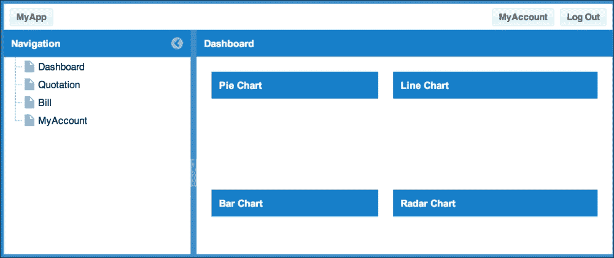
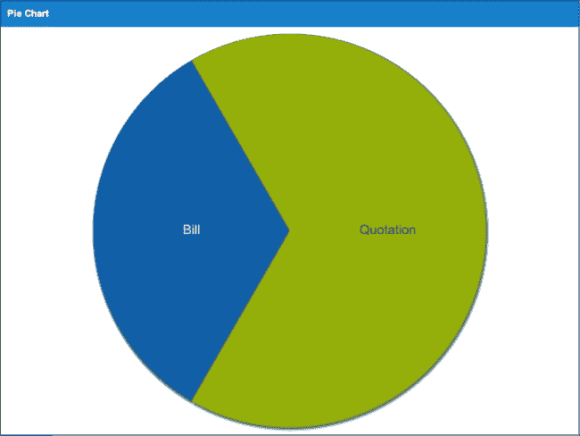
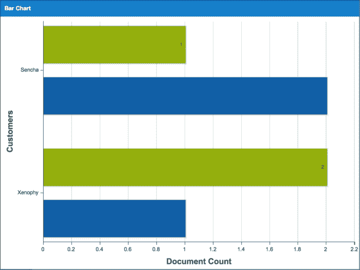
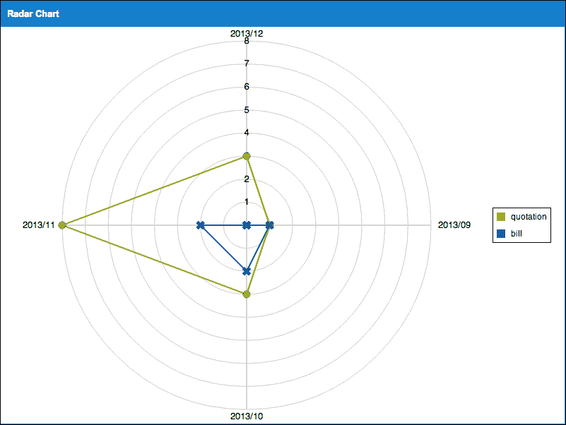
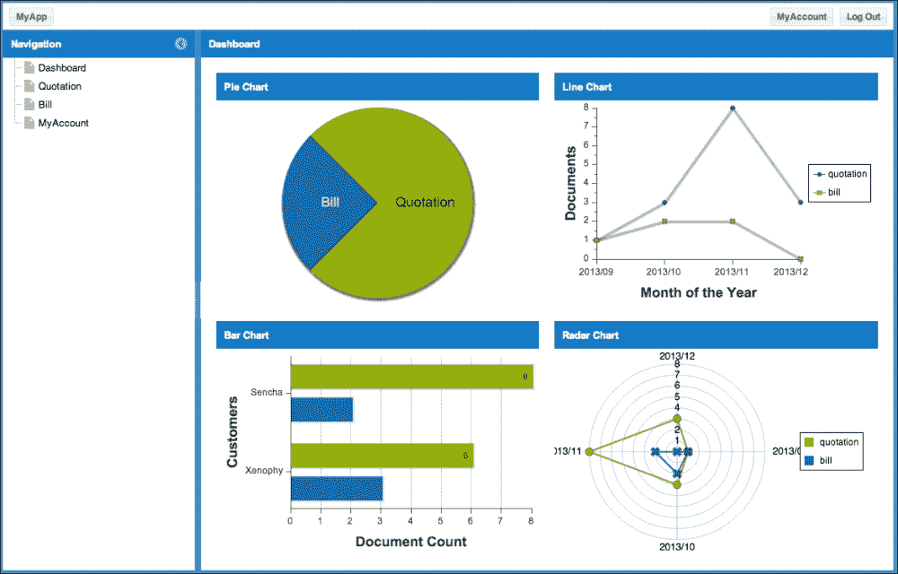

# 第五章。报告

在本章中，我们将创建报告，并在仪表板上使用四种不同类型的图表来显示它。

你将学习到：

+   创建一个饼图来显示报价和账单数据

+   创建一个柱状图来显示客户数据

+   创建一个折线图来按月显示报价和账单数据

+   创建一个用于显示货币金额的雷达图

+   在面板内显示每个图表

+   在仪表板上布局四个面板

# 在仪表板上创建图表

首先，创建四个空面板，并确保**组件测试**（**CT**）可以显示它们。这些面板用于饼图、柱状图、折线图和雷达图。这个过程非常简单，现在你应该已经准备好了四个空面板。

为了像以前一样创建每个图表类，我们将复制不同的 `view.html` 并创建一个新的 HTML 文件，修改标题和 JavaScript 文件。

## CT 的饼图

让我们使用 `MyApp.view.dashboard.Pie` 创建类名。请参阅以下源文件以获取代码：

+   `01_making_charts_on_dashboard/ct/dashboard/pie_view.html`

+   `01_making_charts_on_dashboard/ct/dashboard/pie_view.js`

    ```js
    ...
    Ext.onReady(function() {
        Ext.create('MyApp.view.dashboard.Pie', {
            width: 800,
            height: 600,
            renderTo: Ext.getBody()
        });
    });
    ...
    ```

我们现在将实现前一段代码中指定的类（源文件：`01_making_charts_on_dashboard/app/view/dashboard/Pie.js`）。

```js
Ext.define('MyApp.view.dashboard.Pie', {
    extend: 'Ext.panel.Panel',
    alias : 'widget.myapp-dashboard-pie',
    title: 'Pie Chart'
});
```

## CT 的柱状图

内容与柱状图相同。让我们使用 `MyApp.view.dashboard.Bar` 创建类名。请参阅以下源文件以获取代码：

+   `01_making_charts_on_dashboard/ct/dashboard/bar_view.html`

+   `01_making_charts_on_dashboard/ct/dashboard/bar_view.js`

+   `01_making_charts_on_dashboard/app/view/dashboard/Bar.js`

    ```js
    Ext.define('MyApp.view.dashboard.Bar', {
        extend: 'Ext.panel.Panel',
        alias : 'widget.myapp-dashboard-bar',
        title: 'Bar Chart'
    });
    ```

## CT 的折线图

与饼图和柱状图相同，让我们使用 `MyApp.view.dashboard.Line` 创建类名。请参阅以下源文件以获取代码：

+   `01_making_charts_on_dashboard/ct/dashboard/line_view.html`

+   `01_making_charts_on_dashboard/ct/dashboard/line_view.js`

+   `01_making_charts_on_dashboard/app/view/dashboard/Line.js`

    ```js
    Ext.define('MyApp.view.dashboard.Line', {
        extend: 'Ext.panel.Panel',
        alias : 'widget.myapp-dashboard-line',
        title: 'Line Chart'
    });
    ```

## CT 的雷达图

与其他图表一样，让我们使用 `MyApp.view.dashboard.Radar` 创建类名。请参阅以下源文件以获取代码：

+   `01_making_charts_on_dashboard/ct/dashboard/radar_view.html`

+   `01_making_charts_on_dashboard/ct/dashboard/radar_view.js`

+   `01_making_charts_on_dashboard/app/view/dashboard/Radar.js`

    ```js
    Ext.define('MyApp.view.dashboard.Radar', {
        extend: 'Ext.panel.Panel',
        alias : 'widget.myapp-dashboard-radar',
        title: 'Radar Chart'
    });
    ```

## 布局到仪表板

因此，让我们将这些四个面板排列到仪表板中（源文件：`02_layout_to_dashboard/app/view/dashboard/DashBoard.js`）。

```js
Ext.define('MyApp.view.dashboard.DashBoard', {

    requires: [
        'MyApp.view.dashboard.Pie',
        'MyApp.view.dashboard.Bar',
        'MyApp.view.dashboard.Line',
        'MyApp.view.dashboard.Radar'
    ],
    title: 'Dashboard',
    layout: {
        type: 'hbox',
        pack: 'start',
        align: 'stretch'
    },
    items: [{
        xtype: 'container',
        flex: 1,
        padding: '20 10 20 20',
        layout: {
            type: 'vbox',
            pack: 'start',
            align: 'stretch'
        },
        items: [{
            flex: 1,
            padding: '0 0 10 0',
            xtype: 'myapp-dashboard-pie'
        }, {
            flex: 1,
            padding: '10 0 0 0',
            xtype: 'myapp-dashboard-bar'
        }]
    }, {
        xtype: 'container',
        flex: 1,
        padding: '20 20 20 10',
        layout: {
            type: 'vbox',
            pack: 'start',
            align: 'stretch'
        },
        items: [{
            flex: 1,
            padding: '0 0 10 0',
            xtype: 'myapp-dashboard-line'
        }, {
            flex: 1,
            padding: '10 0 0 0',
            xtype: 'myapp-dashboard-radar'
        }]
    }]
});
```

现在，在仪表板面板的 `requires` 参数中设置你之前制作的四个面板。你可以通过这种方式指定 `xtype`。

接下来是布局部分。在 `hbox` 布局中将顶部和底部平均分成两个相等区域，然后在每个区域中，使用 `vbox` 布局将左右两边分开。

### 小贴士

一个重要点是`container`是由`xtype`指定的。在看过各种 Ext JS 代码后，在这种情况下，很多代码没有指定`xtype`。在这种情况下，`panel`将被指定为初始值。

如果你只想执行布局，你应该指定`container`参数。如果你不这样做而使用`panel`，将只为执行布局而创建不必要的 DOM，这将严重影响性能。

现在你已经成功将仪表板分为四个部分，为了调整外观，对填充进行调整。当然，直接使用 CSS 来做这个也可以。

在四个区域中的每一个，使用`xtype`设置图表面板。

希望你的数据库已经开始成形。让我们继续并实现各种图表。



# 创建饼图

首先，我们为了显示目的创建了 CT，但现在让我们创建一个可以运行的 CT。

我们将使用`Direct`函数，所以让我们也准备一下。实际上，我们已经这样做过了。

复制一个不同的`app.html`并像我们之前做的那样更改 JavaScript 文件。请参阅源文件中的代码：`03_making_a_pie_chart/ct/dashboard/pie_app.html`。

## 实现 Direct 函数

接下来，准备读取数据的`Direct`函数。

首先，是`config.php`文件定义了`API`。让我们把它们放在一起并实现四个图表（源文件：`04_implement_direct_function/php/config.php`）。

```js
    ....
    'MyAppDashBoard'=>array(
        'methods'=>array(
            'getPieData'=>array(
                'len'=>0
            ),
            'getBarData'=>array(
                'len'=>0
            ),
            'getLineData'=>array(
                'len'=>0
            ),
            'getRadarData'=>array(
                'len'=>0
            )
        )
    ....
```

接下来，让我们创建以下方法来获取各种图表的数据：

+   `getPieData`

+   `getBarData`

+   `getLineData`

+   `getRadarData`

首先，实现饼图的`getPieData`方法。我们将实现获取饼图数据的`Direct`方法。请参阅源代码的实际内容（源文件：`04_implement_direct_function/php/classes/ MyAppDashBoard.php`）。

这是在获取有效的报价和账单数据项。对于要发送回客户端的数据，设置数组在`items`中，并在键数组中设置各种名称和数据。现在，将下一个模型中的定义组合起来。

## 为饼图准备存储

图表需要一个存储，所以让我们定义存储和模型（源文件：`05_prepare_the_store_for_the_pie_chart/app/model/ Pie.js`）。

我们将创建具有`name`和`data`字段的`MyApp.model.Pie`类。将其与`Direct`函数的返回值设置的数据连接起来。如果你在刚刚定义的模型内部增加了字段数量，请确保修改返回字段值，否则它将不会应用于图表，所以请小心。我们将使用之前步骤中制作的模型并实现存储（源文件：`05_prepare_the_store_for_the_pie_chart/app/model/ Pie.js`）。

```js
Ext.define('MyApp.store.Pie', {
    extend: 'Ext.data.Store',
    storeId: 'DashboardPie',
    model: 'MyApp.model.Pie',
    proxy: {
        type: 'direct',
        directFn: 'MyAppDashboard.getPieData',
        reader: {
            type: 'json',
            root: 'items'
        }
    }
})
```

然后，使用我们制作的模型定义存储，并在代理中设置我们之前制作的`Direct`函数。

## 创建视图

我们现在已经准备好了演示数据。现在，让我们快速创建视图来显示它（源文件：`06_making_the_view/app/view/dashboard/Pie.js`）。

```js
Ext.define('MyApp.view.dashboard.Pie', {
    extend: 'Ext.panel.Panel',
    alias : 'widget.myapp-dashboard-pie',
    title: 'Pie Chart',
    layout: 'fit',
    requires: [
        'Ext.chart.Chart',
        'MyApp.store.Pie'
    ],
    initComponent: function() {
        var me = this, store;
        store = Ext.create('MyApp.store.Pie');
        Ext.apply(me, {
            items: [{
                xtype: 'chart',
                store: store,
                series: [{
                    type: 'pie',
                    field: 'data',
                    showInLegend: true,
                label: {
                    field: 'name',
                    display: 'rotate',
                    contrast: true,
                    font: '18px Arial'
                }
            }]
            }]
        });
        me.callParent(arguments);
    }
});
```

## 实现控制器

使用前面的代码，数据没有被存储读取，也没有任何内容被显示。

与使用 `onShow` 读取阅读内容的方式相同，让我们实现控制器（源文件：`06_making_the_view/app/controller/DashBoard.js`）：

```js
Ext.define('MyApp.controller.dashboard.DashBoard', {
    extend: 'MyApp.controller.Abstract',
    screenName: 'dashboard',
    init: function() {
        var me = this;
        me.control({
            'myapp-dashboard': {
                'myapp-show': me.onShow,
                'myapp-hide': me.onHide
            }
        });
    },
    onShow: function(p) {
        p.down('myapp-dashboard-pie chart').store.load();
    },
    onHide: function() {
    }
});
```

从现在开始创建的图表，在创建它们时，将阅读过程添加到 `onShow` 中会很好。让我们看看我们的饼图，如下所示：



# 创建条形图

与饼图相同，首先准备 CT。再次与创建饼图相同，让我们更改 JavaScript 文件并创建条形图 HTML（源文件：`07_making_a_bar_chart/ct/dashboard/bar_app.html`）。

除了创建的类名（`MyApp.view.dashboard.Bar`）外，这里的 JavaScript 文件与饼图相同（源文件：`07_making_a_bar_chart/ct/dashboard/bar_app.js`）。

## 实现 Direct 函数

现在，是 `Direct` 函数。由于定义已经在 `config.php` 中完成，所以这里不再重复。

让我们继续实现 `Direct` 方法（`getBarData`）以获取条形图的数据。如果您想查看源代码内容，请参考源文件（源文件：`08_implement_direct_function/php/classes/MyAppDashBoard.php`）。它将获取为每个客户创建的报价或账单级别的计数。

## 为图表准备存储

接下来是模型存储，与创建饼图的方式相同。名称是客户端名称；报价和账单是存储各种计数的地方。

现在我们将创建 `MyApp.model.Bar` 类，它包含字段，例如 `name`、`quotation` 和 `bill`（源文件：`09_prepare_the_store_for_the_pie_chart/app/model/Bar.js`）。

我们将使用之前步骤中创建的模型来实现存储。这与创建饼图的方式相同，所以如果需要参考，请查看源文件。请注意，模型 `name`、`StoreId` 和 `Direct` 方法名称不同（源文件：`09_prepare_the_store_for_the_pie_chart/app/store/Bar.js`）。

## 创建视图

让我们定义其内容，以便我们可以显示它（源文件：`10_making_the_view/app/view/dashboard/Bar.js`）：

```js
Ext.define('MyApp.view.dashboard.Bar', {
    extend: 'Ext.panel.Panel',
    alias : 'widget.myapp-dashboard-bar',
    title: 'Bar Chart',
    layout: 'fit',
    requires: [
        'Ext.chart.Chart',
        'MyApp.store.Bar'
    ],
    initComponent: function() {
        var me = this, store;
        store = Ext.create('MyApp.store.Bar');
        Ext.apply(me, {
            items: [{
                xtype: 'chart',
                store: store,
                axes: [{
                    type: 'Numeric',
                    position: 'bottom',
                    fields: ['quotation', 'bill'],
                    title: 'Document Count',
                    grid: true,
                    minimum: 0
                }, {
                    type: 'Category',
                    position: 'left',
                    fields: ['name'],
                    title: 'Customers'
                }],
                series: [{
                    type: 'bar',
                    axis: 'bottom',
                    highlight: true,
                    tips: {
                        trackMouse: true,
                        width: 140,
                        height: 28,
                        renderer: function(storeItem, item) {
                            var tail = '';
                            if(storeItem.get(item.yField) > 1) {
                                tail = 's';
                            }
                            this.setTitle([
                                 storeItem.get('name'),
                                 ': ',
                                 storeItem.get(item.yField),
                                 ' ',
                                 item.yField,
                            ].join(''));
                        }
                    },
                    label: {
                        display: 'insideEnd',
                        field: 'quotation',
                        renderer: Ext.util.Format.numberRenderer('0'),
                        orientation: 'horizontal',
                        color: '#333',
                        'text-anchor': 'middle'
                    },
                    xField: 'name',
                    yField: ['quotation', 'bill']
                }]
            }]
        });
        me.callParent(arguments);
    }
});
```

## 实现控制器

与我们在 `onShow` 中所做的一样，我将把这个实现放在附录中（源文件：`11_making_the_view/app/controller/DashBoard.js`）。

```js
    ....
    onShow: function(p) {
        p.down('myapp-dashboard-pie chart').store.load();
        p.down('myapp-dashboard-bar chart').store.load();
    },
    ....
```

让我们看看我们的条形图，如下所示：



# 创建折线图

与之前一样，让我们从创建 CT 开始。与饼图相同，更改要读取的 JavaScript 文件并创建折线图 HTML（源文件：`12_making_a_line_chart/ct/dashboard/line_app.html`）。

在这个 JavaScript 文件中，除了创建类名 `MyApp.view.dashboard.Line`（源文件：`12_making_a_line_chart/ct/dashboard/line_app.js`）之外，一切与饼图相同。

## 实现 Direct 函数

以同样的方式，实现 `Direct` 函数。让我们实现 `Direct` 方法（`getLineData`）以获取与条形图相同的数据。如果您想查看源代码，请参考源文件（源文件：`13_implement_direct_function/php/classes/ MyAppDashBoard.php`）。

## 准备图表的存储

以类似的方式创建模型存储。我们将创建具有字段 `name`、`quotation` 和 `bill` 的 `MyApp.model.Line` 类（源文件：`14_prepare_the_store_for_the_pie_chart/app/model/ Line.js`）。

我们现在将使用之前步骤中创建的模型实现存储。细节与饼图相同。有关代码，请参考以下源文件。再次，模型 `name`、`StoreId` 和 `Direct` 方法标题已更改，请注意这一点（源文件：`14_prepare_the_store_for_the_pie_chart/app/store/ Line.js`）。

## 创建视图

让我们将 `quotation` 和 `bill` 变量设置为按月显示。使用 `Direct` 函数，最多可以接收 12 个月的输出，如果数据不存在，月份的数量将减少（源文件：`15_making_the_view/app/view/dashboard/Line.js`）。

```js
Ext.define('MyApp.view.dashboard.Line', {
    extend: 'Ext.panel.Panel',
    alias : 'widget.myapp-dashboard-line',
    title: 'Line Chart',
    layout: 'fit',
    requires: [
        'MyApp.store.Line'
    ],
    initComponent: function() {
        var me = this, store;
        store = Ext.create('MyApp.store.Line');
        Ext.apply(me, {
            items: [{
                xtype: 'chart',
                store: store,
                legend: {
                    position: 'right'
                },
                axes: [{
                    type: 'Numeric',
                    minimum: 0,
                    position: 'left',
                    fields: ['quotation', 'bill'],
                    title: 'Documents',
                    minorTickSteps: 1
                }, {
                    type: 'Category',
                    position: 'bottom',
                    fields: ['mon'],
                    title: 'Month of the Year'
                }],
                series: [{
                    type: 'line',
                    highlight: {
                        size: 7,
                        radius: 7
                    },
                    axis: 'left',
                    xField: 'mon',
                    yField: 'quotation'
                }, {
                    type: 'line',
                    highlight: {
                        size: 7,
                        radius: 7
                    },
                    axis: 'left',
                    xField: 'mon',
                    yField: 'bill'
                }]
            }]
        });
        me.callParent(arguments);
    }
});
```

## 实现 controller

由于过程相同，我将添加关于读取控制器存储的命令的附录（源文件：`16_making_the_view/app/controller/DashBoard.js`）。

```js
    ....
    onShow: function(p) {
        p.down('myapp-dashboard-pie chart').store.load();
        p.down('myapp-dashboard-bar chart').store.load();
        p.down('myapp-dashboard-line chart').store.load();
    },
    ....
```

让我们看看我们的线形图，它如下所示：


# 创建雷达图

现在，让我们制作最终的 CT。

与饼图相同的方式，修改 JavaScript 文件以读取并创建雷达图 HTML（源文件：`17_making_a_radar_chart/ct/dashboard/radar_app.html`）。

再次，在这个 JavaScript 文件中，除了创建类名 `MyApp.view.dashboard.Radar`（源文件：`17_making_a_radar_chart/ct/dashboard/radar_app.js`）之外，一切与饼图相同。

## 实现 Direct 函数

正如标题所说，让我们实现 `Direct` 函数。和之前一样，我们将实现 `Direct` 方法（`getRadarData`）以获取雷达图的数据。有关详细信息，请参考以下源文件（源文件：`18_implement_direct_function/php/classes/ MyAppDashBoard.php`）。

您已经猜到了，过程与 `getLineData` 完全相同。因此，没有必要不必要地实现它，但如果您想在雷达图上显示不同的数据，请修改此方法。

## 准备图表的存储

让我们准备存储。我们将创建具有 `name`、`quotation` 和 `bill` 字段的 `MyApp.model.Radar` 类（源文件：`19_prepare_the_store_for_the_pie_chart/app/model/ Radar.js`）。

再次，我们将使用我们在上一步中制作的模型来实现存储。细节与饼图相同，再次请注意，因为模型 `name`、`StoreId` 和 `Direct` 方法名称不同（源文件：`19_prepare_the_store_for_the_pie_chart/app/store/ Radar.js`）。

## 创建视图

接下来，我们将创建视图（源文件：`20_making_the_view/app/view/dashboard/Radar.js`）：

```js
Ext.define('MyApp.view.dashboard.Radar', {
    extend: 'Ext.panel.Panel',
    alias : 'widget.myapp-dashboard-radar',
    title: 'Radar Chart',
    layout: 'fit',
    requires: [
        'MyApp.store.Radar'
    ],
    initComponent: function() {
        var me = this, store;
        store = Ext.create('MyApp.store.Radar');
        Ext.apply(me, {
            items: [{
                xtype: 'chart',
                store: store,
                insetPadding: 20,
                legend: {
                    position: 'right'
                },
                axes: [{
                    type: 'Radial',
                    position: 'radial',
                    label: {
                        display: true
                    }
                }],
                series: [{
                    type: 'radar',
                    xField: 'mon',
                    yField: 'quotation',
                    showInLegend: true,
                    showMarkers: true,
                    markerConfig: {
                        radius: 5,
                        size: 5
                    },
                    style: {
                        'stroke-width': 2,
                        fill: 'none'
                    }
                },{
                    type: 'radar',
                    xField: 'mon',
                    yField: 'bill',
                    showInLegend: true,
                    showMarkers: true,
                    markerConfig: {
                        radius: 5,
                        size: 5
                    },
                    style: {
                        'stroke-width': 2,
                        fill: 'none'
                    }
                }]
            }]
        });
        me.callParent(arguments);
    }
});
```

## 实现控制器

在 `onShow` 中设置存储的数据读取设置（源文件：`21_making_the_view/app/controller/DashBoard.js`）。

```js
    ....
    onShow: function(p) {
        p.down('myapp-dashboard-pie chart').store.load();
        p.down('myapp-dashboard-bar chart').store.load();
        p.down('myapp-dashboard-line chart').store.load();
        p.down('myapp-dashboard-radar chart').store.load();
    },
    ....
```

最后，让我们看看我们的雷达图表，它看起来如下：



在不久的将来，图表应该看起来像之前的图表。然而，在当前的 Ext JS 4.2.2-GPL 版本中，将存储设置到图表并从服务器获取数据会导致一个错误，该错误扭曲了线条和标签的显示。该错误已被确认为 EXTJSIV-7778。

在前一个图表的情况下，我们通过将服务器接收到的确切响应设置在存储的本地数据中，成功地显示了它。



# 摘要

您必须同意这已经开始看起来像一个应用程序了！

仪表板是您登录后看到的第一个屏幕。图表在视觉上检查大量复杂的数据时非常有效。如果您觉得需要，随时添加面板，这将增加其实用性。这个示例将成为您在未来的项目中可定制的基线。

现在，在下一章和最后一章中，我们将继续学习数据管理。
