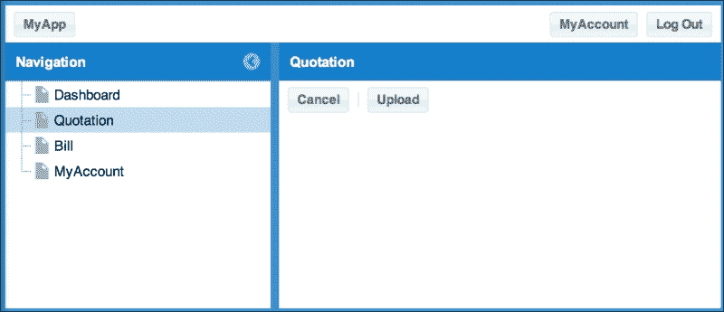
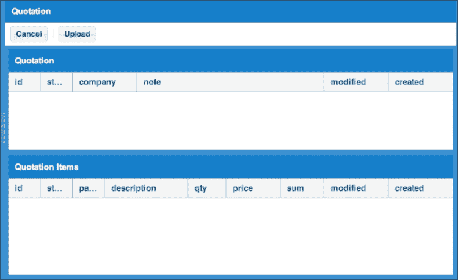

# 第六章. 数据管理

通过我们已经完成的发展，应用程序真的开始成形了。我们可以输入并查看数据。现在，如果我们根据需要自定义内容，我们将得到我们最初希望完成的最终应用程序。在本章的最后，我们将实现数据导入/导出以恢复或备份数据。这次，我们指的是`报价`和`账单`数据。

# 设计导入和导出

让我们先考虑`报价`表。因为`账单`与`报价`大部分相同，所以我们在这里只实现`报价`。尝试用`账单`亲自尝试这种实现。首先，我们在`报价`列表中添加`导出`和`导入`按钮，使其开始工作。接下来，当按下`导出`按钮时，我们将使文件开始下载。我们将添加一个新的面板，以便我们可以直观地检查即将导入的选定的数据。所以让我们继续创建这种类型的数据导入和导出功能。

## 数据格式

在最初导出时，让我们考虑将要下载的数据格式。这次，我们考虑以**TSV 格式**输出，而不是 CSV 或 XML。TSV 对开发者来说更容易阅读，并且使用 JavaScript 生成非常简单。以下列表显示了输出的顺序。

`报价`和`报价单`在一个文件中输出。在报价的情况下，输出的顺序如下：

+   `quotation`

+   `id`

+   `status`

+   `customer`

+   `note`

+   `modified`

+   `created`

在报价的情况下，输出的顺序如下：

+   `quotations`

+   `id`

+   `status`

+   `parent`

+   `description`

+   `qty`

+   `price`

+   `sum`

+   `modified`

+   `created`

对于第一个项目，输入表名，这将允许您同时输出多个表。

## 在报价中创建导入和导出视图

首先，我们将添加`按钮`功能并修改导入和导出的代码（源文件：`01_making_the_import_and_export_view_in_quotation/app/view/quotation/List.js`）：

```js
Ext.define('MyApp.view.quotation.List', {
    ....
    initComponent: function() {
        ....
        Ext.apply(me, {
            tbar: {
                ....
            }, '-', {
                text     : 'Import',
                action   : 'import'
            }, {
                text     : 'Export',
                action   : 'export'
            }, '-', {
            ....
```

您现在应该看到以下表单：

![在报价中创建导入和导出视图

接下来，实现按钮的事件处理器（源文件：`01_making_the_import_and_export_view_in_quotation/app/controller/quotation/List.js`）：

```js
Ext.define('MyApp.controller.quotation.List', {
    ....
    init: function() {
        var me = this;
        me.control({
            ....
            'myapp-quotation-list button[action=import]': {
                'click': me.onImport
            },
            'myapp-quotation-list button[action=export]': {
                'click': me.onExport
            }
        });
    },
    onImport: function() {
        // import
    },
    onExport: function() {
        // export
    },
```

检测在`按钮`功能中设置的`导入`和`导出`操作，然后将`onImport`和`onExport`分配给各种点击事件。当然，我们将从头开始创建`onImport`和`onExport`。

## 准备导出服务器

为了下载文件，我们将创建`quotation-export.php`文件。该文件可以安装在任何位置，但这次我们将其放置在包含`index.php`文件的文档路由中。

导出`报价`数据的过程将由 PHP 实现。这是一个较长的过程，因此请参考源文件中的代码（源文件：`02_preparing_the_server_side_for_export/quotation-export.php`）。

执行 SQL 并将输出与之前构思的数据格式相匹配。

为了将文件名改为第二个，引用之后的文件名将包含年份、月份、日期、小时、分钟和秒。然后，它将以`.tsv`文件扩展名下载。请检查你是否可以直接输入`quotation-export.php` URL 来下载文件。

接下来，让我们在按下我们刚刚制作的按钮时移动这个 URL。（源文件：`02_preparing_the_server_side_for_export/app/controller/quotation/List.js`）：.

```js
onExport: function() {
    location.href='quotation-export.php';
},
```

## 创建导入的临时视图

接下来，我们将继续实现导入过程。就像之前解释的那样，上传你将要导入的数据，然后实现它，这样你就可以在视觉上检查后再导入。

让我们在按下`导入`按钮时触发`myapp-import`事件，并实现它以便面板显示以确认导入数据。

首先，让我们实现监听器。当这个事件发生时，URL 将更改为`#!/quotation/import`（源文件：`03_making_a_temporary_view_for_import/app/controller/quotation/Quotation.js`）：

```js
Ext.define('MyApp.controller.quotation.Quotation', {
    ....
    init: function() {
        ....
        me.control({
            'myapp-quotation-list': {
                ....
                'myapp-import': function() {
                    location.href = '#!/quotation/import';
                }
            }
        });
```

接下来，实现事件触发（源文件：`03_making_a_temporary_view_for_import/app/controller/quotation/List.js`）：

```js
Ext.define('MyApp.controller.quotation.List', {
    ....
    init: function() {
        var me = this;
        me.control({
            ....
            'myapp-quotation-list button[action=import]': {
                'click': me.onImport
            },
            'myapp-quotation-list button[action=export]': {
                'click': me.onExport
            }
        });
    },
    onImport: function() {
        var me          = this,
            listView    = me.getListView();

        listView.fireEvent('myapp-import');
    },
    ....
```

实现我们之前实现的`onImport`方法的内容。从`List`视图对象中，使用`fireEvent`触发`myapp-import`事件。

当这个事件发生时，URL 将会改变。接下来，修改`onShow`，以便导入面板显示出来（源文件：`03_making_a_temporary_view_for_import/app/controller/quotation/Quotation.js`）：

```js
....
onShow: function(p) {
    var me = this,
        o = {},
        hash = location.hash,
        layout = p.getLayout(),
        listView = me.getListView(),
        editView = me.getEditView(),
        params;
    params = hash.substr(('#!/' + me.screenName + '/').length);
    if(params === 'new') {
        o.id = params;
    } else {
        if(!params || !Ext.isString(params)) {
            params = '';
        }
        params = params.split('/');
        Ext.iterate(params, function(text) {
            if(!text || !Ext.isString(text)) {
                text = '';
            }
            text = text.split('=');
            o[text[0]] = text[1];
        });
    }
    me.requestParams = params = o;

    if(params.hasOwnProperty('import')) {
        // Show Import
        layout.setActiveItem(2);
    } else if(params.id === 'new' || Number(params.id)) {
        // Show Edit
        layout.setActiveItem(1);
    } else {
        // Show List
        layout.setActiveItem(0);
    }
    // fire event 'myapp-show'
    layout.activeItem.fireEvent('myapp-show', layout.activeItem, p, 
    params);
},
....
```

参数分析是通过我们之前制作的过程进行的。使用此过程，如果你有一个`导入`属性，`导入`面板将会显示。

我们还没有制作主要的`导入`面板。在这里，我们只是制作了一个非常简单的面板，以便暂时显示（源文件：`03_making_a_temporary_view_for_import/app/view/quotation/Import.js`）：

```js
Ext.define('MyApp.view.quotation.Import', {
    extend: 'MyApp.form.Panel',
    alias : 'widget.myapp-quotation-import',
    itemId: 'screen-quotation-import',
    initComponent: function() {
        var me = this;

        // TopToolbar
        Ext.apply(me, {
           tbar: [{
               text: 'Cancel',
               action: 'cancel'
           }, '-', {
               text: 'Upload',
               action: 'upload'
           }]
        });

        me.callParent(arguments);
    }
});
```

将此面板（`app/view/quotation/Quotation.js`）添加到`screen`面板项（源文件：`03_making_a_temporary_view_for_import/app/view/quotation/Quotation.js`）。

当你配置一个项时，你应该指定`xtype`。为此，设置它所需的类名，以便可以进行动态加载。

在这种状态下，执行整个应用程序。当你按下`导入`按钮时，将显示以下面板：



`导入`面板仍然是临时的，我们之前实现的`网格`面板还没有显示；但我们可以通过`onShow`事件处理器来检查它是否正在正确地变化。

## 创建导入的 CT 视图

我们还没有创建我们通常已经制作的 CT。所以，让我们制作 CT 来显示我们之前制作的临时导入面板（源文件：`04_making_the_ct_view_for_import/ct/quotation/view_import.html`）。

对于 HTML，如果我们复制不同的 HTML 并修改 JavaScript 文件以相同的方式读取，应该不会有任何问题（源文件：`04_making_the_ct_view_for_import/ct/quotation/view_import.js`）

```js
...
Ext.onReady(function() {
    Ext.create('MyApp.store.Customer');
    Ext.create('MyApp.store.QuotationItem');
    Ext.create('MyApp.view.quotation.Quotation', {
        activeItem: 2,
        width: 800,
        height: 600,
        renderTo: Ext.getBody()
    });
});
```

现在，让我们为这个面板准备一个网格。上传完成后，它将从 JSON 数据中接收显示数据。所以，让我们使用`memory`代理创建一个存储（源文件：`04_making_the_ct_view_for_import/app/store/QuotationImport.js`）

```js
Ext.define('MyApp.store.QuotationImport',{
    extend: 'Ext.data.Store',
    storeId:'QuotationImport',
    fields:['id', 'status', 'customer', 'note', 'modified', 'created'],
    data:{'items':[
    ]},
    proxy: {
        type: 'memory',
        reader: {
            type: 'json',
            root: 'items'
        }
    }
});
```

还可以使用以下代码为此面板准备一个网格（源文件：`04_making_the_ct_view_for_import/app/store/QuotationImportItems.js`）

```js
Ext.define('MyApp.store.QuotationImportItems',{
    extend: 'Ext.data.Store',
    storeId:'QuotationImportItems',
    fields:[
        'id',
        'status',
        'parent',
        'description',
        'qty',
        'price',
        'sum',
        'modified',
        'created'
    ],
    data:{'items':[
    ]},
    proxy: {
        type: 'memory',
        reader: {
            type: 'json',
            root: 'items'
        }
    }
});
```

我们创建两个`memory`代理的原因是因为我们将为`Quotation`和`Quotations`各自准备一个，然后制作两个网格。现在，我们将在`Grid`中使用这个，但我们将添加以下代码以确保它在 CT 中无问题显示（源文件：`04_making_the_ct_view_for_import/ct/quotation/view_import.js`）

为了确保我们之前制作的两个存储可以使用 CT 目录中的`view_import.js`脚本，让我们将其修改为在启动时可以实例化。

现在，我们将快速制作视图。我们将重新设计之前制作的临时`Import`面板（源文件：`04_making_the_ct_view_for_import/app/view/quotation/Import.js`）

```js
Ext.define('MyApp.view.quotation.Import', {
    extend: 'MyApp.form.Panel',
    alias : 'widget.myapp-quotation-import',
    itemId: 'screen-quotation-import',
    initComponent: function() {
        var me = this,
            store = Ext.getStore('QuotationImport'),
            itemstore = Ext.getStore('QuotationImportItems'); 

        // Items
        Ext.apply(me, {
            layout: {
                type: 'border',
                padding: 5
            },
            items: [{
                region: 'north',
                xtype: 'grid',
                itemId: 'quotationgrid',
                split: true,
                title: 'Quotation',
                store: store,
                columns: [{
                    text: 'id',
                    dataIndex: 'id',
                    width: 50
                }, {
                    text: 'status',
                    dataIndex: 'status',
                    width : 50
                }, {
                    text: 'customer',
                    dataIndex: 'customer'
                }, {
                    text: 'note',
                    dataIndex: 'note',
                    flex: 1
                }, {
                    text: 'modified',
                    dataIndex: 'modified'
                }, {
                    text: 'created',
                    dataIndex: 'created'
                }],
                flex:1
            }, {
                region: 'center',
                xtype: 'grid',
                title: 'Quotation Items',
                itemId: 'quotationitemsgrid',
                store: itemstore,
                columns: [{
                    text: 'id',
                    dataIndex: 'id',
                    width: 50
                }, {
                    text: 'status',
                    dataIndex: 'status',
                    width : 50
                }, {
                    text: 'parent',
                    dataIndex: 'parent',
                    width : 50
                }, {
                    text: 'description',
                    dataIndex: 'description',
                    flex: 1
                }, {
                    text: 'qty',
                    dataIndex: 'qty'
                }, {
                    text: 'price',
                    dataIndex: 'price'
                }, {
                    text: 'sum',
                    dataIndex: 'sum'
                }, {
                    text: 'modified',
                    dataIndex: 'modified'
                }, {
                    text: 'created',
                    dataIndex: 'created'
                }],
                flex:1
            }]
        });

        // TopToolbar
        Ext.apply(me, {
           tbar: [{
               text: 'Cancel',
               action: 'cancel'
           }, '-', {
               text: 'Upload',
               action: 'upload'
           }]
        });

        me.callParent(arguments);
    }
});
```

如前所述，我们将制作两个`grid`面板。这是为`Quotation`和`Quotations`准备的。再次强调，布局是**边框**布局，并指定了弹性。

经常使用 Ext JS 的用户可能会觉得这很奇怪；但根据当前的 Ext JS，你甚至可以在边框布局中指定弹性。

因此，如果你为`north`和`center`都设置`flex:1`，它将平均安排表单的顶部和底部；并且当`north`设置为`split:true`时，分割器可以显示。

如果检查显示，它将看起来像以下这样：



## 创建上传和显示网格中的数据

这次，上传你导出的数据，让我们在网格中显示它。为此，在`app.js`中添加一个控制器。你可能需要回忆一下，因为上次使用已经有一段时间了！（源文件：`05_making_upload_and_show_data_in_the_grid/app/Application.js`）

```js
....

Ext.application({
    ....
    controllers: [
        ....
        'quotation.Import',
        ....
    ],
```

现在，我们将制作这个控制器（源文件：`05_making_upload_and_show_data_in_the_grid/app/controller/quotation/Import.js`）

```js
Ext.define('MyApp.controller.quotation.Import', {
    extend: 'MyApp.controller.Abstract',
    refs: [{
        ref: 'importView', selector: 'myapp-quotation-import' 
    }],
    stores: [
        'QuotationImport',
        'QuotationImportItems'
    ],
    init: function() {
        var me = this;
        me.control({
            'myapp-quotation-import': {
                'myapp-show': me.onShow,
                'myapp-hide': me.onHide
            },
            'myapp-quotation-import [action=upload]': {
                'change': me.onUploaded
            }
        });
    },
    onShow: function(p, owner, params) {
    },
    onHide: function() {
    },
    onUploaded: function(fb, v) {
        var me = this,
            p = me.getImportView(),
            form = p.getForm(),
            importView = me.getImportView(),
            btnExecute = importView.down('button[action=execute]');

        p.setLoading();
        btnExecute.disable();
        form.submit({
            success: function(form, action) {
                Ext.getStore('QuotationImport').loadData(action.
                result.quotation.items);
                Ext.getStore('QuotationImportItems').loadData(action.
                result.quotations.items);
                p.setLoading(false);
                btnExecute.enable();
            }
        });
    }
});
```

然后，暂时将之前创建的`upload`按钮更改为`filefield`（源文件：`05_making_upload_and_show_data_in_the_grid/app/view/quotation/Import.js`）

```js
Ext.define('MyApp.view.quotation.Import', {
    extend: 'MyApp.form.Panel',
    alias : 'widget.myapp-quotation-import',
    itemId: 'screen-quotation-import',
    api: {
        submit  : 'MyAppQuotation.importData'
    },
    paramOrder: ['importfile'],
    initComponent: function() {
        ....

        // TopToolbar
        Ext.apply(me, {
           tbar: [{
               text: 'Cancel',
               action: 'cancel'
           }, '-', {
               xtype: 'filefield',
               name: 'importfile',
               buttonText: 'Upload',
               buttonOnly: true,
               hideLabel: true,
               action: 'upload'
           }]
        });

        me.callParent(arguments);
    }
});
```

此外，在配置选项中添加`API`密钥，并在`submit`中指定`Direct`函数。这个面板是一个表单面板。使用`submit`方法上传文件。接下来，制作我们在`submit`中指定的`Direct`函数（源文件：`05_making_upload_and_show_data_in_the_grid/php/config.php`）

我们将向`MyAppQuotation`类添加以下方法：

```js
            'importData'=>array(
                'len'=>2,
                'formHandler'=>true
            )
```

我们将实际实现之前添加的方法。由于篇幅过长，无法包含在此文本中，请参考源代码文件（源文件：`05_making_upload_and_show_data_in_the_grid/php/classes/MyAppQuotation.php`）。

再次使用 JSON 返回上传数据。如果你打算构建一个应用程序，你应该执行输入检查，因为用户可以使用 TSV 文件输入他们喜欢的任何信息。

使用你之前实现的控制器，使用`loadData`方法并将从服务器端返回的数据读取到`MemoryStore`方法中。

## 执行导入数据

一旦你在网格中显示了读取的数据并检查了它，你就可以创建一个按钮将其应用到数据库中（源文件：`06_execute_import_data /app/view/quotation/Import.js`）：

```js
Ext.define('MyApp.view.quotation.Import', {
     ....
     initComponent: function() {
        ....

        // TopToolbar
        Ext.apply(me, {
           ....
           }, {
               text: 'Execute',
               disabled: true,
               action: 'execute'
           }]
        });

        me.callParent(arguments);
    }
});
```

让我们确保在初始状态下无法按下按钮。一旦之前的数据上传完成，按钮将被启用（源文件：`06_execute_import_data /app/controller/quotation/Import.js`）：

```js
Ext.define('MyApp.controller.quotation.Import', {
    ....
    init: function() {
        var me = this;
        me.control({
            ....
            'myapp-quotation-import [action=execute]': {
                'click': me.onExecute
            }
        });
    },
    ....
    onExecute: function() {
        var data = {
                quotation: [],
                quotations: [] 
            },
            store = Ext.getStore('QuotationImport'),
            items = Ext.getStore('QuotationImportItems');

        Ext.iterate(store.data.items, function(item) {
            data.quotation.push(Ext.clone(item.data));
        });

        Ext.iterate(items.data.items, function(item) {
            data.quotations.push(Ext.clone(item.data));
        });

        MyAppQuotation.executeImport(data, function() {
            location.href = '#!/quotation';
        });
    }
});
```

现在，我们正在调用`executeImport`和`Direct`函数。没错，我们还没有完成。让我们实现这个功能，使其能够从客户端接收数据（源文件：`06_execute_import_data /php/config.php`）：

```js
    ....
    'MyAppQuotation'=>array(
        'methods'=>array(
            ....
            'executeImport'=>array(
                'len'=>1
            )
        )
    ),
    ....
```

我们将在`config.php`文件中实现之前添加的方法。同样，由于篇幅过长，无法在此展示，请参考源文件（源文件：`06_execute_import_data /php/classes/MyAppQuotation.php`）。

当数据被接收后，使用`Truncate`一次性清空数据库内部，然后插入新的数据。这样做是好是坏将取决于你构建的系统。

此外，如果你仔细查看代码，你会知道错误处理并没有达到高级别。如果你打算将这个项目商业化，你将不得不构建这个区域。已经，实现已经完成。但最后，让我们将 URL 更改为`#!/quotation`以将其更改为列表显示，然后完成。

# 摘要

我们已经完成了`Export`和`Import`数据的实现。还有许多要点需要覆盖，例如输入检查和错误检查。但学习了这个流程后，我认为你现在有了按照你想要的方式定制这个数据库的基础。

干得好！你已经读完了这本书的最后一页！

让我们回顾一下你所取得的成就：

+   你创建了数据结构

+   你创建了应用程序架构

+   你通过使用浏览器上的网格和字段进行了输入和输出

+   你开发了使用各种图表获取信息的应用程序

+   你完成了数据导出和导入管理功能

每个功能对于此类应用程序都是基本的。从现在开始，如果你在下一个项目中考虑创建类似的东西，请将这个示例应用程序作为你应用程序的基础。你只需要更改几个点，然后你应该能够非常快速地创建一个定制应用程序。

将本书中的架构应用到你所制作或即将制作的应用程序中，将简化控制并提高维护性。它还将为你提供高级且通用的历史管理功能，并让你轻松添加新屏幕。

然而，本书中介绍的这个示例应用程序在实际应用中需要一些额外的功能。因此，我们在本章的结尾添加了一些内容，以完善这个应用程序。

本章的示例代码文件夹中可以找到额外编辑的代码文件列表。请参考此列表，查看我们对应用程序所做的最终修改。

此外，我们在任何修改旁边都包含了注释 `// update code`。只需在代码中搜索这个注释，你应该能够立即看到更改。

最后，记住，如果你在未来的某个项目中迷失了方向，或者遇到了难以逾越的障碍，只需再次查看这个应用程序，看看它是否能为你提供某种解决方案。

我希望你们能够创造出一些令人惊叹的应用程序！祝你们好运，编码愉快！
