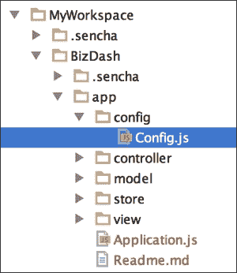
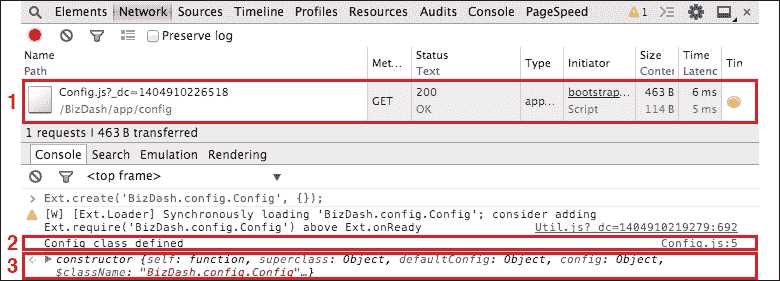
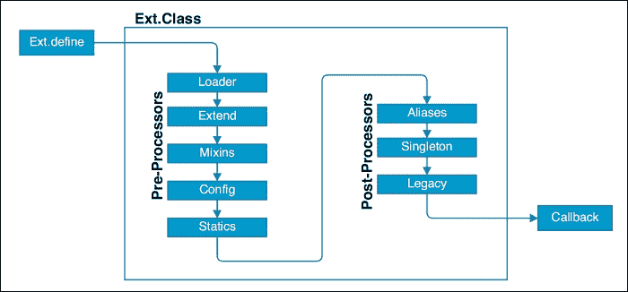
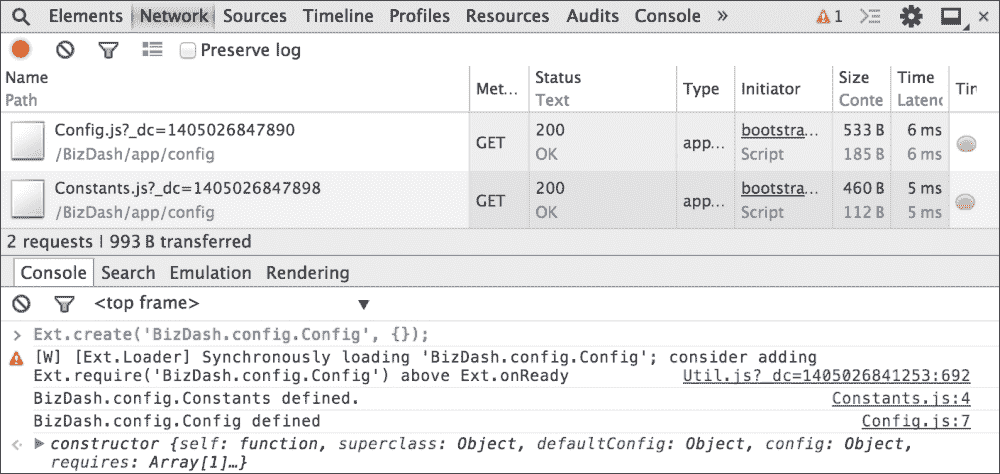
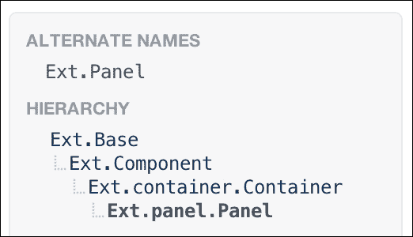
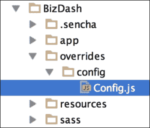
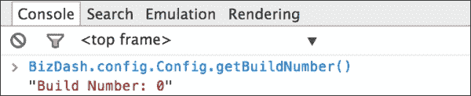
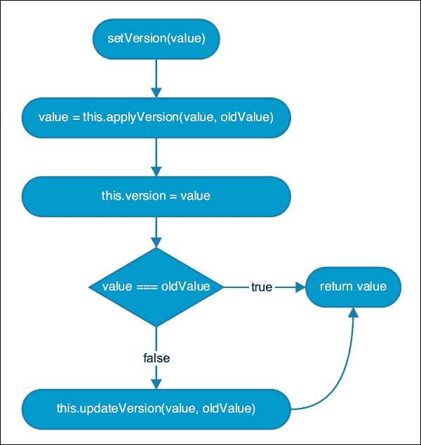

# 第二章 掌握框架的构建块

Ext JS 类系统是框架的基础，为我们提供了一个面向对象的结构来构建我们的应用程序。本章将介绍类系统的基本原理，以及我们如何使用它来定义应用程序的构建块。

我们将在本章讨论以下主题：

+   基本面向对象原则，如继承，是如何被使用的

+   如何使用 Ext.Loader 类动态加载我们的类

+   如何覆盖类方法

+   如何使用 Ext JS 的配置模型

# 定义类

我们应用程序的第一个类将是一个配置类，用于存储我们应用程序的各种选项。我们使用 `Ext.define` 方法定义一个类，如下所示：

```js
Ext.define('BizDash.config.Config', {
},
function(){
  console.log('Config class created');
});
```

第一个参数是一个定义类名的字符串，第二个参数是一个包含所有类成员的对象，第三个是一个可选的回调函数，当类被定义时执行。

类名必须遵循严格的命名约定，以便它们可以被 `Ext.Loader` 类自动加载。这个类在需要时自动加载类，并使用它们的完全限定名在目录结构中找到它们。

+   我们类名的第一部分——`BizDash`——是我们应用程序的名称，也是我们的根命名空间。默认情况下，它映射到我们应用程序文件夹内的 `app` 文件夹。

+   第二部分——`config`——是我们类的子命名空间，用于将我们的类组织到文件夹中。这个名称映射到 `app` 文件夹内的一个子文件夹。我们可以创建任何深度的命名空间，以便我们以对应用程序有意义的方式组织我们的代码。

+   最后，`Config` 是我们类的名称，并形成了我们类定义将驻留的文件名。

以下屏幕截图显示了我们的完全限定类名与其目录结构的关系：



标准的 Sencha 命名约定规定，所有子命名空间都应该小写，所有类名都应该使用大驼峰式。例如，`BizDash.view.users.UserForm` 优于 `BizDash.view.Users.userForm`。

我们现在将使用 `Ext.create` 方法实例化这个类。这个方法接受一个类的完全限定名和一个对象，该对象的属性和值将被用来配置这个类。我们将在本章后面讨论如何添加我们自己的配置选项。

在网页浏览器中打开应用程序，并在开发者工具的控制台中运行以下代码：

```js
Ext.create('BizDash.config.Config', {});
```

运行代码后，我们应该看到一个类似于以下屏幕截图的控制台：



在屏幕截图中，我们可以看到三件事：

1.  通过 `GET` 请求自动加载到页面中的源文件

1.  来自 `Ext.define` 回调的控制台日志

1.  我们的新类实例在控制台中记录

您会注意到，我们能够在不在我们的应用程序或 HTML 页面中引用它的情况下实例化我们的`BizDash.config.Config`类。这是由`Ext.Loader`类的魔法处理的，我们将在下一节中讨论。

# Ext.Loader 背后的魔法

在上一节中，我们看到了一个例子，说明了类源文件如何根据需要自动加载到应用程序中。这是由`Ext.Loader`类处理的，它分析每个类的依赖关系，并确保所有依赖的类都通过 AJAX 加载。有关如何将此与创建生产构建相关联的更多详细信息，请参阅第一章的*使用 Sencha Cmd 创建我们的应用程序*部分，*了解 Ext JS*。

## 类的定义过程

以下图表展示了类定义的过程，从调用`Ext.define`方法开始，以及`Loader`类如何融入这一过程：



## 定义依赖项

确保所有必要的类都已加载到页面上的最佳方式是使用`requires`配置选项构建一个依赖关系树。此选项接受一个完全限定的类名数组，然后所有这些类名在类定义被认为完成之前都加载到页面中。在加载一个依赖类后，这个过程会重复进行，新类及其所有依赖项都会被加载，直到所有所需的类都存在。

我们可以通过在新的类`BizDash.config.Constants`中引入一个依赖项来扩展我们的`Config`类：

```js
Ext.define('BizDash.config.Constants', {
},
function(){
  console.log('BizDash.config.Constants defined.');
});
```

我们希望我们的`Config`类能够使用这个类，因此我们必须确保在定义类时它能够被实例化。我们通过在类定义中添加`requires`配置来实现这一点，告诉框架自动加载它：

```js
Ext.define('BizDash.config.Config', {
  requires: ['BizDash.config.Constants']
},
function(){
  console.log('BizDash.config.Config defined');
});
```

在这一行设置后，我们可以使用`Ext.create`再次实例化我们的类，并看到`Constants`类被自动加载：

```js
Ext.create('BizDash.config.Config', {});
```



## Loader 路径

默认情况下，应用程序的根命名空间（在我们的案例中是`BizDash`）映射到`app`文件夹。这意味着任何子命名空间直接映射到`app`文件夹内的一个文件夹，类名映射到 JavaScript 文件本身。保持这些命名约定非常重要，以便可以找到这些源文件。

如果您希望应用程序从不同的位置加载文件，您可以通过在`Application.js`文件的顶部添加对`Ext.Loader.setConfig`方法的调用，为加载器指定一个自定义路径和命名空间约定。

默认的`paths`对象将`Ext`和应用程序命名空间映射，如下面的代码片段所示：

```js
Ext.Loader.setConfig({
  paths: {
    Ext     : '../ext/src',
    BizDash : 'app'
  }
});
```

您可以通过添加自己的命名空间作为键（这可以是一个命名空间的多个部分；例如，`Custom.namespace`），以及正确的文件夹路径作为值来自定义它：

```js
Ext.Loader.setConfig({
  paths: {
    Ext             : '../ext/src',
    BizDash         : 'app',
    'Custom.path'   : '..CustomClasses/path'
  }
});
```

## Ext.Loader 和 Sencha Cmd

正如我们所见，Sencha Cmd 可以将所有所需的类文件连接成一个单一的文件。这是通过生成这个依赖图并按应用程序启动时加载的顺序组合所有源文件来实现的。这确保了只有实际使用的类被包含在应用程序的最终源文件中，使其比始终包含整个框架小得多。

## 我们的依赖根

在我们的示例中，我们通过`Ext.create`调用强制加载了`Config`配置，这会同步加载源文件。通过依赖这种方式来加载类文件，依赖树仅在运行时建立和满足。这意味着 Sencha Cmd 将无法创建一个完全连接的源文件，并且将被迫在运行时加载缺失的类。

为了解决这个问题，我们应该在`Application.js`文件中将我们的根类作为所需的类包含在内。此文件是应用程序的入口点，因此从这里我们可以建立依赖图，直到应用程序启动前的极端部分。

为了确保我们的`BizDash.config.Config`类在应用程序启动时加载并准备好使用，我们会在`Application.js`文件中的`requires`数组中添加它：

```js
Ext.define('BizDash.Application', {
  extend: 'Ext.app.Application',
  name: 'BizDash',
  requires: [ 'BizDash.config.Config' ],
  ...
});
```

# 添加类成员

到目前为止，我们已经探讨了定义和创建类以及将这些类加载到我们的页面中的方法。现在，我们将探讨如何通过添加类成员（如属性、方法和静态成员）使它们变得有用。

## 属性

可以通过在类的定义对象中包含一个键值对来向类中添加公共属性。以下代码示例展示了我们如何向我们的`Config`类添加一个版本号属性：

```js
Ext.define('BizDash.config.Config', {
  requires: ['BizDash.config.Constants'],
  version: '0.0.1-0'
},
  function(){
  console.log('BizDash.config.Config defined');
});
```

这个属性可以通过在`Config`类的一个实例中使用点符号来访问；例如：

```js
var config = Ext.create('BizDash.config.Config', {});
// logs 0.0.1-0 console.log(config.version);
```

## 方法

可以以与属性相同的方式添加方法。我们可以在`Config`类中添加一个`getBuildNumber`方法，它将从版本属性中提取构建号，如下所示：

```js
Ext.define('BizDash.config.Config', {
  requires: ['BizDash.config.Constants'],
  version: '0.0.1-0',
  getBuildNumber: function(){
    var versionSplit = this.version.split('-');
    return versionSplit[1];
  }
},
function() {
  console.log('BizDash.config.Config defined');
});
```

此方法可以按正常方式执行：

```js
// logs "0"
  console.log(config.getBuildNumber());
```

注意，默认情况下，方法是在类实例的作用域中执行的，这使得我们可以访问版本属性。

## 静态成员

Ext JS 类系统为我们提供了在类中包含静态属性和方法的能力，以消除创建类实例的需要。这些可以在分配给`statics`配置选项的对象内部添加。

以下示例展示了添加到`BizDash.config.Constants`类的名为`ENVIRONMENT`的静态属性，用于跟踪我们是否处于开发或生产环境：

```js
Ext.define('BizDash.config.Constants', {
  statics: {
    ENVIRONMENT: 'DEV'
  }
},
function(){
  console.log('BizDash.config.Constants defined.');
});
```

我们现在可以使用以下代码访问这个静态属性：

```js
// logs "DEV"
console.log(BizDash.config.Constants.ENVIRONMENT);
```

Ext JS 的命名约定指出，静态属性名称应该始终为大写。

## 子类中的静态成员

如果您希望类的静态属性在所有子类中可用，则必须使用`inheritableStatics`属性来定义。

## 单例

作为使用静态方法的替代，可以将类定义为单例，在成功定义后，将实例化类并将其分配回类的属性。这可以通过简单地给类添加 `singleton: true` 配置来实现：

```js
Ext.define('BizDash.config.Config', {
 singleton: true, 
  ...
},
function() {
  console.log('BizDash.config.Config defined');
  // logs "true"
  console.log(BizDash.config.Config.isInstance);
});
```

在所有类实例中都存在的 `isInstance` 属性的记录显示，一旦定义，`BizDash.config.Config` 属性现在成为了该类的一个实例。

# 扩展类

Ext JS 框架的架构意味着功能是通过继承构建和共享的。让我们的自定义类或视图继承另一个或现有的框架类变得极其容易。

例如，当定义您的视图类时，您可能会从基础 `Ext.Component` 类或其子类之一扩展，例如 `Ext.panel.Panel` 或 `Ext.grid.Panel`。

我们通过包含 `extend` 配置并给出要扩展的类的名称来定义我们类的超类。在以下示例中，我们将从 `Ext.util.Observable` 类扩展我们的 `Config` 类，使其能够触发自己的自定义事件。这将使我们的 `Config` 类能够访问这个类的所有方法和属性，例如 `on` 方法：

```js
Ext.define('BizDash.config.Config', {
  extend: 'Ext.util.Observable',
  ...
}, function() {
  // logs "function(){..}"
  console.log(BizDash.config.Config.on);
});
```

Ext JS 文档在其文档页面的右上角显示了每个类的继承树，如下所示，对于 `Ext.panel.Panel` 类：



当省略时，就像我们原始的 `Config` 类一样，类将默认从 `Ext.Base` 类扩展，这是所有框架类的基础基类。

# 覆盖类

有时有必要在不直接修改原始源的情况下更改类的功能。我们可以通过定义一个新的类以及 `overrides` 配置选项来告诉 Ext JS 要修改哪个类。

当改变框架行为时（例如，修复框架代码中的错误）应始终使用这种技术，因为 Ext JS 代码不应直接修改。当未来进行框架升级时，这可能会给你带来麻烦。

在以下示例中，我们将覆盖我们的 `getBuildNumber` 方法，使其返回带有前缀 **Build Number:** 的构建号。您可能已经看到 Sencha Cmd 已经在我们的应用程序结构中创建了一个 `overrides` 文件夹。这就是我们将放置我们的类覆盖文件的地方。

在这个文件夹内，我们创建一个新的 `config` 目录来映射我们的主应用文件夹结构，并在一个名为 `Config.js` 的文件中定义一个新的名为 `Overrides.config.Config` 的类。



`override` 的结构与正常的类定义相同，如下所示：

```js
Ext.define('Overrides.config.Config', {
    override: 'BizDash.config.Config',
});
```

我们现在可以添加对 `getBuildNumber` 方法的覆盖，该方法使用 `callParent` 方法来执行原始方法，并将其输出与我们的标签结合：

```js
Ext.define('Overrides.config.Config', {
  override: 'BizDash.config.Config',
  getBuildNumber: function() {
    return 'Build Number: ' + this.callParent(arguments);
  }
});
```

## 需要我们的覆盖类

为了将此覆盖包含到我们的应用程序中并使更改生效，我们需要告诉应用程序我们的覆盖类所在的位置，以便`Ext.Loader`知道在哪里找到它们。我们通过向`sencha.cfg`文件中添加`overrides`路径来实现，这样 Sencha Cmd 就可以更新应用程序的依赖项。我们通过在`BizDash/.sencha/app/sencha.cfg`文件的底部添加以下行来完成此操作：

```js
app.overrides=${app.dir}/overrides
```

然后，我们可以在`BizDash`文件夹内运行`sencha app refresh`命令来重新生成应用的引导文件。

如果我们现在重新加载我们的应用程序并调用`getBuildNumber`方法，我们应该看到输出为**构建号：0**。



虽然这个覆盖正在覆盖我们自己的自定义方法之一，但可以遵循相同的过程来覆盖任何您想要更改行为的框架自己的类。

## 针对框架版本进行覆盖

现在可以使用兼容性配置来针对特定的框架或包版本进行覆盖。这可以接受一个包含版本号的单一字符串，一个将使用逻辑或运算符匹配版本字符串的数组，或者一个使用`and`或`or`键来创建更复杂匹配的对象。以下示例显示了如何使用这些：

```js
/* matches Ext JS 5.0.0 compatibility: '5.0.0'
matches Ext JS 5.0.0 OR Ext JS 4.2.1 compatibility: ['5.0.0', '4.2.1']
matches the 'Ext JS' package with 5.0.0 and 'Sencha Core' with 5.0.0 */
compatibility: {
  and: [
    'extjs@5.0.0',
    'sencha-core@5.0.0'
  ]
}
```

如果兼容性选项匹配，则包含覆盖；否则不包含。

关于可以使用哪些版本表达式的详细信息，请参阅`Ext.checkVersion`方法的文档。[`docs.sencha.com/extjs/5.1/5.1.0-apidocs/#!/api/Ext-method-checkVersion`](http://docs.sencha.com/extjs/5.1/5.1.0-apidocs/#!/api/Ext-method-checkVersion)。

# 配置类

Ext JS 提供了一种创建可配置属性的有用方法，它为我们提供了一个自动生成的过程来获取和设置它们的值，并且还可以执行在其他区域中所需的任何更新；例如，在 UI 中反映更新值。

当一个类被定义时，在`config`对象中找到的任何属性将完全封装在其他类成员之外，并且会为其提供自己的获取器和设置器方法。

例如，如果我们将`Config`类的`version`属性移动到`config`对象中，如以下代码片段所示，类将获得两个新方法，分别命名为`getVersion`和`setVersion`。请注意，我们必须创建一个`constructor`函数并调用`initConfig`方法，以便类系统初始化这些新方法。我们还必须更新我们的`getBuildNumber`方法，该方法使用`this.version`引用版本号，改为使用新的获取器方法`getVersion`。

```js
Ext.define('BizDash.config.Config', {
  extend: 'Ext.util.Observable',
  singleton: true,
  requires: ['BizDash.config.Constants'],
  config: { version: '0.0.1-0' },
  constructor: function(config){
    this.initConfig(config);
    this.callParent([config]);
  },
  getBuildNumber: function() {
    var versionSplit = this.getVersion().split('-');
    return versionSplit[1];
  }
}, function() {
  ...
});
```

在 Ext JS 5 中，当扩展`Ext.Component`类或其子类时，现在不需要调用`initConfig`，因为它是在内部调用的。

## 设置配置值

当给 `config` 选项赋予新值时，生成的设置器方法比仅仅将给定的值分配给类中的属性要复杂得多。它引入了 `applier` 和 `updater` 方法的概念，这些方法是可选的，如果存在，则按顺序在设置器方法中调用。

应用器函数应使用与获取器和设置器相同的约定命名，名称前缀为 `apply`，属性名称的首字母大写；例如，`applyVersion`。此方法用于在将值存储在类中之前按需转换给定的值。可能的用法可能包括查找值以获取其实例（例如，从其 ID 获取存储实例）。此方法必须返回一个值；否则属性将不会被更新。

更新器函数遵循相同的命名模式（例如，`updateVersion`），并在值经过应用器转换并在类中设置后调用。此函数主要用于更新 UI 以反映组件内的最新值。

以下图展示了在调用生成的设置器方法时此过程是如何工作的：



以下示例展示了我们如何使用和应用此方法以确保版本号的格式；以及一个更新方法来触发自定义事件，允许应用的其他区域通知变化：

```js
Ext.define('BizDash.config.Config', {
  extend: 'Ext.util.Observable',
  singleton: true,
  requires: ['BizDash.config.Constants'],
  config: {
    version: '0.0.1-0',
    ...
  },
  ...
  applyVersion: function(newVersion, oldVersion){
  return newVersion;
  },
  updateVersion: function(newVersion, oldVersion){
    this.fireEvent('versionchanged', newVersion, oldVersion);
  }
}, function() { ... });
```

## 覆盖默认值

当创建新的类实例时，可以通过简单地将属性和所需值添加到传递给 `Ext.create` 方法的配置对象中来轻松覆盖配置属性的默认值。以下代码片段显示了如何设置版本选项（假设 `Config` 类没有被设置为单例）：

```js
var config = Ext.create('BizDash.config.Config', {
  version: '0.2.0-0'
});
// logs "0.2.0-0"
console.log(config.getVersion());
```

## 平台特定配置

Ext JS 5 引入了根据应用程序运行的平台配置类的不同能力的能力，因此我们可以根据平台的能力定制体验。

这是通过使用 `platformConfig config` 选项来完成的，给它一个配置对象数组。这些配置选项必须包含一个平台属性，该属性将用于在当前平台上找到适当的配置。

此选项应包含一个字符串数组，描述配置应针对的平台。这可以是一个或多个以下选项：手机、平板、桌面、iOS、Android、Blackberry、Safari、Chrome 或 IE10。

如果这些平台中的任何一个与当前平台匹配，则其他属性将合并到类配置中。可能存在多个规则评估为真，在这种情况下，所有匹配规则的性质都将应用。

以下代码展示了我们如何根据平台配置我们的 `Config` 类：

```js
Ext.define('BizDash.config.Config', {
  extend: 'Ext.util.Observable',
  singleton: true,
  requires: ['BizDash.config.Constants'],
  config: {
    version: '0.0.1-0',
    isPhone : false,
    isTablet : false,
    isDesktop: false
  },
  platformConfig: [ {
    platform: ['phone'],
    isPhone : true
  },
  {
    platform: ['tablet'],
    isTablet: true
  },
  {
    platform : ['desktop'],
    isDesktop: true
  }]
  ...
});
```

我们可以使用它们的 getter 方法访问这些属性。以下代码在笔记本电脑上运行，将输出`true`给`isDesktop`属性，对于其他两个属性输出`false`：

```js
// logs "true", "false", "false" 
console.log(BizDash.config.Config.getIsDesktop()); 
console.log(BizDash.config.Config.getIsPhone()); 
console.log(BizDash.config.Config.getIsTablet());
```

# 概述

在本章中，我们涵盖了 Ext JS 类系统的所有方面，包括：

+   定义和实例化类

+   添加属性、方法和静态成员

+   扩展其他类和覆盖框架行为

+   配置类并使用应用器和更新器方法

我们还演示了如何使用`Ext.Loader`类确保我们的类文件在需要时被加载到应用程序中。

下一章将讨论 Ext JS 如何处理事件，这些事件既来自用户输入，也来自其他类。
