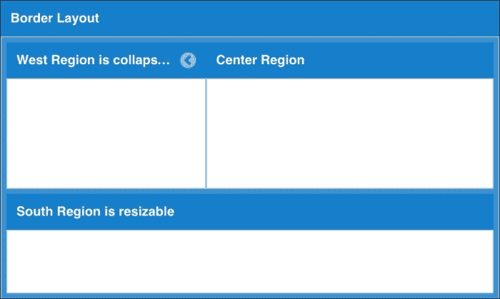
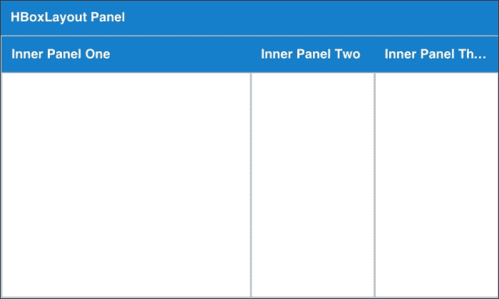
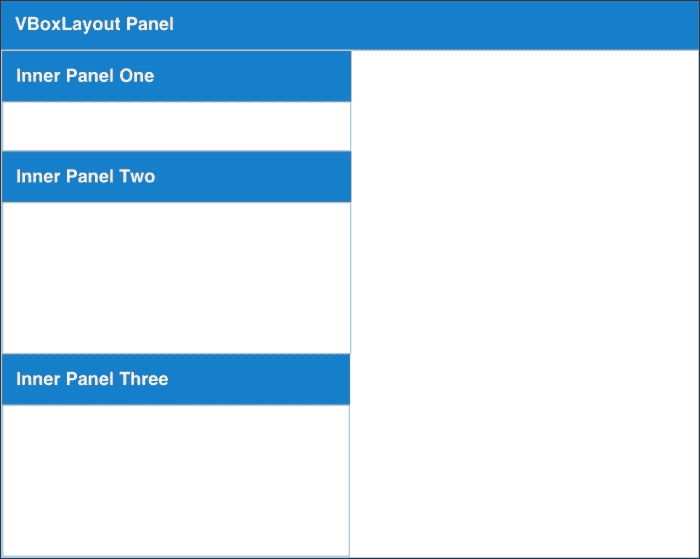

# 第六章。将 UI 小部件组合成完美的布局

布局对于您应用程序的外观和可用性至关重要。UI 小部件可以组合和排列成无数种不同的配置，以创建简单和复杂的应用程序布局。

Ext JS 小部件需要一个布局来管理其在屏幕上的尺寸和位置。该框架提供了大量的不同布局，这些布局提供了简单的配置和灵活性，以生成应用程序。

本章将涵盖与布局最常见的话题。具体如下：

+   组件如何在布局中配合

+   对最常见布局的示例和解释，即：

    +   边界布局

    +   适应布局

    +   HBox 和 VBox 布局

+   如何设计对用户屏幕尺寸做出响应的布局

# 布局及其工作方式

在 Ext JS 中，容器具有布局来管理其子组件的尺寸和位置。传统上，开发者会将对 DOM 元素应用一组 CSS 规则来构建所需的屏幕布局。Ext JS 通过允许我们在容器/组件中定义布局配置，并使用 JavaScript 配置尺寸和位置来为我们处理大部分工作。

默认情况下，容器配置了自动布局，这使得子组件在全宽范围内自然流动，与常规 HTML 页面中的 DIV 元素非常相似。

以下是由框架提供的布局列表。将多个布局组合在一起是可能的，也是常见的；这样可以使子容器或组件适当地定位和调整大小。例如，标签面板（卡片布局）有多个子容器，其中每个容器可能具有不同的布局。每个布局都有不同的配置选项来控制您的应用程序如何渲染。默认情况下，Ext JS UI 小部件已配置了组件布局，您可能需要了解这一点。

+   **绝对布局**：使用 *X* 和 *Y* 坐标，绝对布局固定容器在屏幕上的位置。此布局允许重叠。

+   **手风琴布局**：手风琴布局提供在屏幕上创建手风琴式面板堆叠的能力。

+   **锚点布局**：这是一种布局，允许将包含的元素相对于容器的尺寸进行锚定。

+   **边界布局**：边界布局允许您将容器附加到中央区域的边界，从而提供北、南、东和西区域。此布局具有内置的区域折叠和调整大小的行为。

+   **卡片布局**：卡片布局提供一组可以前后移动的容器。卡片布局非常适合用于向导式组件或标签式组件。

+   **居中布局**：居中布局的内容在其容器内居中。

+   **列布局**：列布局非常适合以多列形式展示您的界面。

+   **Fit**: 这是一个非常常见的布局，fit 布局将小部件拉伸到父容器的大小和位置。fit 布局中只能有一个项目。

+   **HBox**: 与列布局类似，这种布局将组件水平排列。它提供了一些有用的配置来拉伸和定位子组件。

+   **VBox**: 与 HBox 布局类似，这种布局将组件垂直排列，一个接一个。它提供了一些有用的配置来拉伸和定位子组件。

+   **Table**: 尽管表格在开发者中不太受欢迎，但表格布局仍然可能很有用。表格布局中的内容将被渲染为 HTML 表格。

## 布局系统的工作原理

正如我们所知，布局负责容器子组件的大小和位置。正确渲染屏幕需要所有子组件的大小和位置都被计算出来，以便更新 DOM。框架通过`updateLayout`方法来完成这项工作。此方法会递归地遍历所有子组件，并计算适当的定位和大小。

### 注意

对于熟悉框架先前版本的开发者，`updateLayout`方法在 Ext JS 4.1 中替换了`doLayout`方法。

框架通过调用`updateLayout`方法自动处理大小和位置的调整。例如，当浏览器窗口调整或缩放，或者你添加或删除组件时，框架将执行必要的计算以确保你的组件在屏幕上正确显示。

有一些情况下，手动调用`updateLayout`是有益的。布局组件可能是一个资源密集型任务，如果你知道你将要对组件进行多次更新，那么考虑将布局批处理成一个可能是有价值的。例如，连续添加三个组件会触发三次对`updateLayout`的调用（它会递归遍历所有子组件）。通过使用`suspendLayout`标志，我们可以防止我们的应用程序在准备好之前更新 DOM。当我们准备好时，只需将`suspendLayout`标志设置为 false，然后手动调用容器的`updateLayout`方法即可。

# 组件布局

组件还有一个布局，它定义了它如何定义其内部子项的大小和位置。组件布局是通过使用`componentLayout`配置选项来配置的。

在大多数情况下，你不需要`componentLayout`配置，除非你打算编写具有复杂布局要求的自定义组件。

# 使用边界布局

如果你希望创建具有桌面风格的用户界面体验，那么边界布局就是你的选择。



边框布局是一种面向应用程序的布局，支持多个嵌套面板，可以通过点击区域标题或折叠图标来折叠区域，以及通过点击和拖动区域之间的分隔条来调整区域大小。

我们 BizDash 应用程序的构建块之一将是一个带有边框布局的视口。在这里，我们将学习如何使用可配置的最大区域数量（北部、南部、东部、西部和中心）创建一个简单的边框布局。西部和东部区域将是可折叠的，东部区域将预先折叠。我们将演示南部和西部区域的调整大小。这四个边框将围绕中心区域，无论您的配置如何，中心区域对于边框布局的正常工作都是必需的。

## 从视口开始

视口将自身渲染到文档的`body`中，并自动消耗可视区域。它代表整个可视浏览器区域，并自动使用浏览器窗口的 100%宽度和高度（当然，减去地址栏、开发者工具等）。我们的视口将使用边框布局来管理其子容器的尺寸和位置。

在我们的应用程序中，我们在`app.js`中将`autoCreateViewport`属性设置为`BizDash.view.main.Main`。这会自动将我们的主要视图容器设置为视口。

```js
Ext.application({
  name: 'BizDash',
  extend: 'BizDash.Application',
  autoCreateViewport: 'BizDash.view.main.Main'
});
```

## 配置边框布局

我们的主要视图采用以下配置：

```js
Ext.define('BizDash.view.main.Main', {
  extend: 'Ext.container.Container',
  xtype: 'app-main',
  controller: 'main',
  viewModel: {
    type: 'main'
  },
  layout: {
    type: 'border'
  },
  items: [
    {
      region: 'north',
      margins: 5,
      height: 100,
    },
    {
      title: 'West',
      xtype: 'panel',
      region: 'west',
      margins: '0 5 0 5',
      flex: 3,
      collapsible: true,
      split: true,
      titleCollapse: true,
      tbar: [{
        text: 'Button'
      }]
      bind: {
        title: '{name}'
      },
      html: 'This area is commonly used for navigation, for example, using a tree component.',
  {
    title: 'Center',
    region: 'center',
    xtype: 'tabpanel',
    items:[{
      title: 'Tab 1',
      html: 'Content appropriate for the current navigation'
    }]
  },
  {
    title: 'East',
    region: 'east',
    margins: '0 5 0 5',
    width: 200,
    collapsible: true,
    collapsed: true
  },
  {
    title: 'South',
    region: 'south',
    margins: '0 5 5 5',
    flex: .3,
    split: true
  }]
});
```

如其名所示，边框布局创建了一个围绕中心组件的组件布局。因此，边框布局的要求之一是必须指定一个项目作为中心。

中心区域，这是为了使边框布局正常工作而必须包含的区域，会自动扩展以消耗布局中其他区域留下的空余空间。它是通过为高度和宽度都预定义了一个弹性值`1`来实现的。

北部和南部区域采用高度或弹性配置。在我们的应用中，北部区域的高度固定为 100 像素，而南部区域的弹性值为 3。南部和中心区域的高度是基于浏览器窗口中剩余的高度计算的。在这里，南部区域的高度略小于中心区域高度的三分之一。西部和东部区域则采用宽度或弹性配置。

我们通过在所需区域的配置中指定`collapsed`、`collapsible`、`split`和`titleCollapse`来添加更多功能。它们执行以下操作：

+   `collapsed`：如果设置为`true`，则表示该区域将开始折叠（区域需要是`Ext.panel.Panel`才能折叠）

+   `collapsible`：如果设置为`true`，则允许用户通过点击添加到标题中的切换工具来展开/折叠面板

+   `titleCollapse`：如果设置为`true`，则无论用户在面板标题的哪个位置点击，都会使面板折叠

+   `split`：如果设置为`true`，则允许用户通过点击和拖动区域之间的分隔条来调整区域大小。

# 使用 fit 布局

在 Ext JS 中，fit 布局非常适合您想要一个容器将组件扩展以填充其父容器的情况。fit 布局易于使用且无需配置。

```js
Ext.define('BizDash.view.main.Main', {
  extend: 'Ext.container.Container',
  xtype: 'app-main',
  controller: 'main', 
  viewModel: {
    type: 'main'
  },
  layout: {
    type: 'border'
  },
  items: [{
  ...
  },
  {
    title: 'South',
    region: 'south',
    margins: '0 5 5 5',
    flex: .3,
    split: true,
    layout: 'fit',
    items: [{
      xtype: 'component',
      html: 'South Region'
    }]
  }]
});
```

`main`类有一个边界布局，但南区域需要 fit 布局来对其子面板进行配置。

fit 布局通过在父容器中定义`layout`配置选项为`fit`来工作。这告诉 Ext JS 子项应该扩展以填充从其父项可用的整个空间。

值得注意的是，fit 布局只适用于父容器的第一个子项。如果您定义了多个项，第一个将被显示（因为它会扩展到其父项的剩余空间），而其他项将不可见。

# 使用 HBox 布局

HBox 布局允许您以类似于列布局的方式在容器内水平对齐组件。然而，它更为高级，因为它允许您配置额外的属性，例如列的高度等。



让我们创建一个包含三列的概览小部件来显示事件、消息和笔记：

```js
Ext.define('BizDash.view.dashboard.Overview', {
  extend: 'Ext.container.Container',
  xtype: 'app-overview',
  controller: 'overview',
  viewModel: {
    type: 'overview'
  },
  layout: {
    type: 'hbox',
    align: 'stretchmax'
  },
  items: [
    {
      flex: .3,
      title: 'Today\'s Events'
    },
    {
      flex: .3,
      title: 'Messages'
    },
    { 
      width: 200,
      title: 'Notes'
    }
  ]
});
```

定义一个 HBox 布局确保 Ext JS 水平定位每个子项，在我们的仪表板应用程序中呈现出列的样式。

我们在`align`配置选项上配置了`stretchmax`，这意味着所有子项将自动拉伸到最高子项的高度。`align`配置选项控制子项在 HBox 布局中的垂直对齐方式。有效值如下：

+   `begin`：这是默认值。HBox 布局中的所有项都将垂直对齐到容器的顶部

+   `middle`：所有项都将垂直对齐到容器的中间（或中心）

+   `stretch`：每个项都将垂直拉伸以适应容器的高度

+   `stretchmax`：这将垂直拉伸所有项到最大项的高度，创建一个统一的外观，而无需为每个项单独定义高度

VBox 布局与这个布局的配置非常相似，但选项略有不同，因为它们是为了控制水平对齐而设计的。

通过定义高度为 200 并配置`align: 'stretchmax'`，所有其他面板的高度都将拉伸到 200 像素。

## HBox 布局中的宽度

HBox 可以有宽度定义的两种方式：固定宽度和弹性宽度。

### 固定宽度

子容器可以通过在对象中定义宽度配置来固定其宽度。具有固定宽度的容器将保留其宽度尺寸，即使浏览器窗口大小调整也是如此。因此，它们不是流动的。

如果您需要您的布局对窗口大小调整等更加响应，那么就需要一个`flex`配置。

### 弹性宽度

`flex`配置选项在父容器中相对地水平拉伸子项目。例如，考虑一个 flex: 1 的容器和一个 flex: 3 的容器。在这些情况下，剩余父空间的 25%分配给第一个容器，75%的空间分配给另一个。

弹性值按以下方式计算：

```js
((Container Width – Fixed Width of Child Components) / Sum of Flexes) * Flex Value.
```

## 将项目打包在一起

对于 HBox 布局的另一个有用配置选项是`pack`。

`pack`配置选项控制子项目如何打包在一起。如果项目没有拉伸到父容器的完整宽度，则可以使用此选项将它们对齐到左侧、中间或右侧。有效值如下：

+   `start`：这是默认值。它将所有项目对齐到父容器的左侧。

+   `center`：这将对齐所有项目到容器的中间。

+   `end`：它将所有项目对齐到容器的右侧。

VBox 布局包含相同的`pack`配置，但它被设计用来配置子项目的垂直打包。

# 使用 VBox 布局

VBox 布局与 HBox 布局非常相似。唯一的区别是 VBox 允许你在容器中垂直对齐组件。就像 HBox 布局一样，这个布局是通过设置子组件的固定宽度使用`width`配置，或者通过使用`flex`配置自动计算宽度来配置的。



## 对齐和打包

VBox 布局有一些有用的配置选项，在此处进行描述。

### align: 字符串

`align`配置选项控制子项目在 VBox 布局中的水平对齐方式。有效值如下：

+   `begin`：这是默认值。VBox 布局中的所有项目在容器中水平对齐到左侧，并使用它们的`width`配置来定义它们的宽度。

+   `middle`：所有项目都水平对齐到容器的中间（或中心）。

+   `stretch`：每个项目都水平拉伸以适应容器的宽度。

+   `stretchmax`：这将所有项目水平拉伸到最大项目的宽度，创建一个统一的外观，而无需为每个项目单独定义宽度。

### pack: 字符串

`pack`配置选项控制子项目如何打包在一起。如果项目没有拉伸到父容器的完整高度（即没有 flex 值），则可以使用此选项将它们对齐到顶部、中间或底部。有效值如下：

+   `start`：这是默认值。它将所有项目对齐到父容器的顶部。

+   `center`：这将对齐所有项目到容器的中间（或中心）。

+   `end`：这将对齐所有项目到容器的底部。

# 响应式布局

那些只有桌面电脑和笔记本电脑上才有网络浏览器的日子已经一去不复返了。如今，它们可以在各种硬件上找到，如手机、平板电脑、电视和汽车等。自 2007 年 iPhone 发布以来，一种新的网络类型——移动网络，已经越来越受欢迎，用户的期望也发生了变化。用户期望无论屏幕大小如何，都能访问网络应用并获得出色的体验。

直到 Ext JS 5 的出现，很难满足用户的不同需求。然而，Ext JS 5 已经采纳了流行的响应式设计趋势，为开发者提供了一种根据展示屏幕的大小和分辨率来适应应用布局的实用方法。

## Ext.mixin.Responsive 和 Ext.plugin.Responsive

现在有一个新的响应式混合和插件，它添加了一个 `responsiveConfig` 选项。

在我们的边框布局中，我们希望根据屏幕方向改变区域展示的方式。将以下 *规则* 的 `responsiveConfig` 添加到主视图中，告诉应用程序根据屏幕方向将导航面板添加到北部或西部区域：

```js
Ext.define('BizDash.view.main.Main', {
  extend: 'Ext.container.Container',
  xtype: 'app-main',
  controller: 'main',
  viewModel: {
    type: 'main'
  },
  layout: {
    type: 'border'
  },
  items: [
    {
      xtype: 'panel',
      bind: {
        title: '{name}'
      },
      html: 'This area is commonly used for navigation, for example, using a tree component.',
      width: 250,
      split: true,
      tbar: [
        {
          text: 'Button'
        }
      ],
      plugins: 'responsive',
      responsiveConfig: {
        landscape: {
          region: 'west'
        },
        portrait: {
        region: 'north'
        }
      }
    },
  {
    region: 'center',
    xtype: 'tabpanel',
    items:[
      {
        title: 'Tab 1',
        html: 'Content appropriate for the current navigation'
      }]
    }]
  });
```

在这个例子中，`responsiveConfig` 定义了两个规则：一个用于横向，另一个用于纵向。当应用程序满足规则时，该规则对象中定义的配置将被应用到组件上：

```js
responsiveConfig: {
  landscape: {
    region: 'west'
  },
  portrait: {
    region: 'north'
  }
}
```

例如，如果我们的屏幕方向是横向，那么框架将 `region: 'west'` 应用到面板上。这等同于以下代码：

```js
{
  xtype: 'panel',
  bind: {
    title: '{name}'
  },
  html: 'This area is commonly used for navigation, for example, using a tree component.',
  width: 250,
  split: true,
  tbar: [
    {
      text: 'Button'
    }
  ],
  region: 'west'
}
```

## ResponsiveConfig 规则

我们必须定义包含条件或多个条件的规则，根据这些条件应用规则。这些规则可以是任何有效的 JavaScript 表达式，但以下值被认为是范围内的：

+   `landscape`：当方向为横向或在桌面设备上时返回 true。

+   `portrait`：当方向为纵向时返回 true，但在桌面设备上始终为 false。

+   `tall`：如果高度大于宽度，则返回 true。

+   `wide`：如果宽度大于高度，则返回 true。

+   `width`：这定义了视口的宽度。

+   `height`：这定义了视口的宽度。

宽度和高度特别有用，因为这些给我们提供了一种以类似于媒体查询中的断点的方式定义我们自己的值。

以下示例展示了如何创建一个规则，当纵向设备宽度小于 400 像素时将应用此规则：

```js
responsiveConfig: {
  'portrait && width < 400': {
  ...
  }
}
```

# 摘要

在本章中，我们详细探讨了如何使用 Ext JS 定义屏幕上组件的布局。我们涵盖了：

+   布局管理器是如何工作的

+   我们可用的布局概述

+   如何使用边框、fit 和 HBox/VBox 布局的示例

+   设计响应式布局以应对不同的屏幕尺寸和设备类型

我们将在本书的其余部分利用所有这些课程，因为我们的示例应用程序开始变得生动，并且我们开始将其小部件集成到其中。

在下一章中，我们将演示如何为我们的示例应用程序创建常见的 UI 小部件。这些小部件将利用本章中我们所学到的某些布局。
