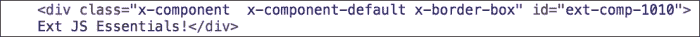
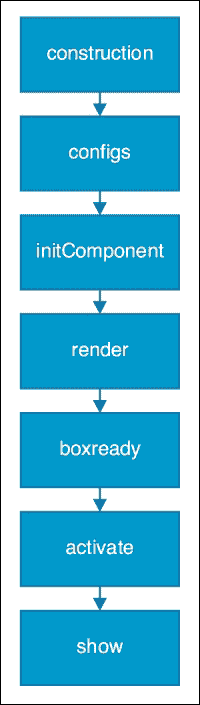
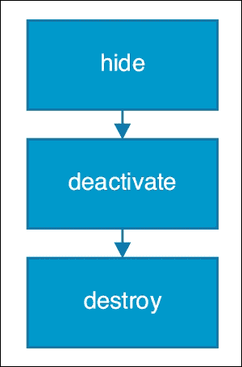
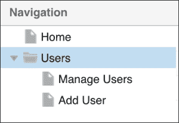
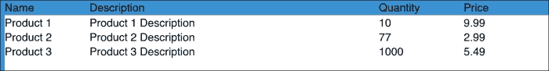
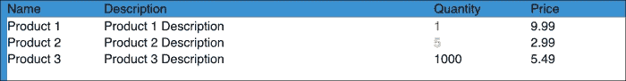
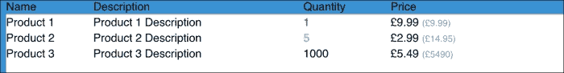
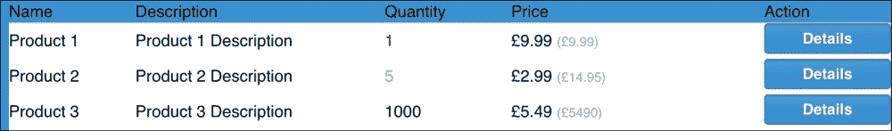
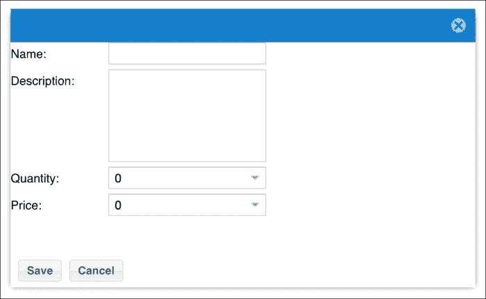

# 第七章. 构建常见的 UI 小部件

吸引开发者使用 Ext JS 的最大特点之一是开箱即用的丰富 UI 小部件。它们可以轻松集成，并且每个小部件提供的吸引力和一致性视觉效果也是一个很大的吸引力。没有其他框架能在这一方面竞争，这也是 Ext JS 在大型 Web 应用领域领先的一个巨大原因。

在本章中，我们将探讨 UI 小部件如何适应框架的结构，它们如何相互交互，以及我们如何检索和引用它们。然后，我们将深入探讨组件的生命周期以及它在应用程序生命周期中将要经历的各个阶段。最后，我们将以数据网格、树、数据视图和表单的形式将第一个 UI 组件添加到我们的 BizDash 应用程序中。

# UI 小部件的解剖结构

Ext JS 中的每个 UI 元素都扩展自基本组件类`Ext.Component`。这个类负责将 UI 元素渲染到 HTML 文档中。它们通常由父组件使用的布局来设置尺寸和定位，并参与自动组件生命周期过程。

您可以将`Ext.Component`的实例想象成用户界面中的一个单独部分，就像您在构建传统 Web 界面时可能会想到 DOM 元素一样。

每个`Ext.Component`的子类都基于这个简单的事实，并负责生成更复杂的 HTML 结构或组合多个`Ext.Component`以创建更复杂的界面。

然而，`Ext.Component`类不能包含其他`Ext.Component`。要组合组件，必须使用`Ext.container.Container`类，该类本身扩展自`Ext.Component`。这个类允许多个组件在其中渲染，并且它们的尺寸和定位由框架的布局类管理（有关更多详细信息，请参阅第六章 Chapter 6，*将 UI 小部件组合成完美的布局*）。

## 组件和 HTML

使用组件创建和操作 UI 需要一种与您在创建带有 jQuery 等库的交互式网站时可能习惯的略有不同的思维方式。

`Ext.Component`类从底层 HTML 提供了一层抽象，使我们能够封装额外的逻辑来构建和操作这个 HTML。这个概念与其他库允许您操作 UI 元素的方式不同，也为新开发者提供了一个需要克服的障碍。

`Ext.Component`类为我们生成 HTML，我们很少需要直接与之交互；相反，我们操作组件的配置和属性。以下代码和截图显示了简单`Ext.Component`实例生成的 HTML：

```js
var simpleComponent = Ext.create('Ext.Component', {
  html    : 'Ext JS Essentials!',
  renderTo: Ext.getBody()
});
```



如你所见，创建了一个简单的 `<DIV>` 标签，它被赋予了某些 CSS 类和一个自动生成的 ID，并在其中显示了 HTML 配置。

这个生成的 HTML 是由 `Ext.dom.Element` 类创建和管理的，它包装了一个 DOM 元素及其子元素，为我们提供了许多辅助方法来查询和操纵它。渲染后，每个 `Ext.Component` 实例都将元素实例存储在其 `el` 属性中。然后你可以使用这个属性来操纵代表组件的底层 HTML。

如前所述，`el` 属性将在组件被渲染到 DOM 中之前不会被填充。你应该在 `afterrender` 事件监听器中将依赖于更改组件原始 HTML 的逻辑放入，或者覆盖 `afterRender` 方法。

以下示例显示了组件渲染后如何操纵底层 HTML。它将元素的背景色设置为红色：

```js
Ext.create('Ext.Component', {
  html     : 'Ext JS Essentials!',
  renderTo : Ext.getBody(),
  listeners: {
    afterrender: function(comp) {
      comp.el.setStyle('background-color', 'red');
    }
  }
});
```

重要的是要理解，深入挖掘和更新 Ext JS 为你创建的 HTML 和 CSS 是一个危险的游戏，当框架尝试自己更新内容时，可能会导致意外结果。通常有一个 *框架方式* 来实现你想要包含的操纵，我们建议你首先使用它。

我们总是建议新开发者开始时尽量不要与框架过多对抗。相反，我们鼓励他们遵循其约定和模式，而不是强迫它以他们可能以前在开发传统网站和 Web 应用时的方式做事。

# 组件生命周期

当一个组件被创建时，它会遵循一个重要的生命周期过程，了解这一点很重要，以便了解事情发生的顺序。通过理解这一系列事件，你将更好地了解你的逻辑将适合何处，并确保你在正确的点上对组件有控制权。

## 创建生命周期

当一个新的组件通过将其添加到现有容器中实例化和渲染到文档时，会遵循以下过程。当一个组件被显式显示（例如，没有添加到父组件，如浮动组件）时，会包含一些额外的步骤。这些步骤在以下过程中用 * 表示。

### 构造函数

首先，执行类的构造函数，这会依次触发其他所有步骤。通过重写这个函数，我们可以为组件添加任何所需的设置代码。

### 处理配置选项

下一步要处理的是类中存在的配置选项（有关详细信息，请参阅第二章，*掌握框架的构建块*）。这涉及到每个选项的 `apply` 和 `update` 方法被调用（如果存在），这意味着值现在可以通过 getter 获取。

### 初始化组件

现在会调用 `initComponent` 方法，通常用于应用配置并执行任何初始化逻辑。

### render

一旦添加到容器中，或者当调用 `show` 方法时，组件就会被渲染到文档中。

### boxready

在这个阶段，组件已经被渲染并由其父布局类布局，并且以初始大小准备好。此事件仅在组件的第一次布局时发生。

### activate (*)

如果组件是一个浮动项，则激活事件将会触发，表明该组件是屏幕上的活动组件。当组件被带回焦点时，例如在 **Tab** 面板中选中标签时，这也会触发。

### show (*)

与前一步类似，当组件最终在屏幕上可见时，show 事件会被触发。



## 销毁过程

当我们从视图中移除组件并想要销毁它时，它将遵循一个销毁序列，我们可以使用这个序列来确保充分清理，以避免内存泄漏等问题。框架会为我们处理大部分清理工作，但重要的是我们也要整理好我们实例化的任何额外事物。

### hide (*)

当组件被手动隐藏（使用 hide 方法）时，此事件将会触发，并且可以在此处包含任何额外的隐藏逻辑。

### deactivate (*)

与激活步骤类似，当组件变得不活跃时，此事件会被触发。与激活步骤一样，这将在浮动和嵌套组件被隐藏且不再是焦点下的项目时发生。

### destroy

这是拆解过程的最后一步，在组件及其内部属性和对象被清理时实现。在这个阶段，最好移除事件处理器、销毁子类，并确保释放任何其他引用。



# 组件查询

Ext JS 自带一个强大的系统来检索组件引用，称为组件查询。这是一个类似于 CSS/XPath 的查询语法，允许我们针对应用中的广泛集合或特定组件进行定位。例如，在我们的控制器中，我们可能想要找到一个类型为 MyForm 的组件中的“保存”按钮。

在本节中，我们将演示组件查询语法以及如何使用它来选择组件。我们还将详细介绍如何在 `Ext.container.Container` 类中使用它来限定选择范围。

## xtypes

在深入探讨之前，了解 Ext JS 中的 xtypes 概念非常重要。xtype 是 `Ext.Component` 的简称，允许我们识别其声明性组件配置对象。例如，我们可以使用以下代码创建一个新的 `Ext.Component` 作为 `Ext.container.Container` 的子组件，并使用 xtype：

```js
Ext.create('Ext.Container', {
  items: [
    {
      xtype: 'component',
      html : 'My Component!'
    }
  ]
});
```

使用 xtypes 可以在需要时延迟实例化组件，而不是一开始就创建所有组件。

常见的组件 xtypes 包括：

| 类别 | xtypes |
| --- | --- |
| `Ext.tab.Panel` | `tabpanel` |
| `Ext.container.Container` | `container` |
| `Ext.grid.Panel` | `gridpanel` |
| `Ext.Button` | `button` |

xtypes 以与元素类型（例如，`div`、`p`、`span`等）在 CSS 选择器中的作用相同的方式构成了我们的组件查询语法的基石。我们将在以下示例中大量使用这些。

## 样例组件结构

我们将使用以下样本组件结构——一个包含子标签页面板、表单和按钮的面板——来执行我们的示例查询：

```js
var panel = Ext.create('Ext.panel.Panel', {
  height : 500,
  width : 500,
  renderTo: Ext.getBody(),
  layout: {
    type : 'vbox',
    align: 'stretch'
  },
  items : [
    {
      xtype : 'tabpanel',
      itemId: 'mainTabPanel',
      flex : 1,
      items : [
        {
          xtype : 'panel',
          title : 'Users',
          itemId: 'usersPanel',
          layout: {
            type : 'vbox',
            align: 'stretch'
            },
            tbar : [
              {
                xtype : 'button',
                text : 'Edit',
                itemId: 'editButton'
                }
              ],
              items : [
                {
                  xtype : 'form',
                  border : 0,
                  items : [
                    {
                      xtype : 'textfield',
                      fieldLabel: 'Name',
                      allowBlank: false
                    },
                    {
                      xtype : 'textfield',
                      fieldLabel: 'Email',
                      allowBlank: false
                    }
                  ],
                  buttons: [
                    {
                      xtype : 'button',
                      text : 'Save',
                      action: 'saveUser'
                    }
                  ]
                },
                {
                  xtype : 'grid',
                  flex : 1,
                  border : 0,
                  columns: [
                    {
                      header : 'Name',
                      dataIndex: 'Name',
                      flex : 1
                    },
                    {
                      header : 'Email',
                      dataIndex: 'Email'
                    }
                  ],
                  store : Ext.create('Ext.data.Store', {
                    fields: [
                      'Name',
                      'Email'
                    ],
                    data : [
                      {
                        Name : 'Joe Bloggs',
                        Email: 'joe@example.com'
                      },
                      {
                        Name : 'Jane Doe',
                        Email: 'jane@example.com'
                      }
                    ]
                  })
                }
              ]
            }
          ]
        },
        {
          xtype : 'component',
          itemId : 'footerComponent',
          html : 'Footer Information',
          extraOptions: {
            option1: 'test',
            option2: 'test'
          }, 
          height : 40
        }
      ]
    });
```

## 使用 Ext.ComponentQuery 的查询

`Ext.ComponentQuery`类用于执行组件查询，其中`query`方法是主要使用的。此方法接受两个参数：一个查询字符串和一个可选的`Ext.container.Container`实例，用作选择的根（即，只有层次结构中此组件以下的组件将被返回）。该方法将返回一个组件数组或一个空数组，如果没有找到任何组件。

我们将通过几个场景，并使用组件查询来找到一组特定的组件。

### 基于 xtype 查找组件

正如我们所见，我们使用 xtypes，就像在 CSS 选择器中使用元素类型一样。我们可以使用其 xtype——`panel`来选择所有`Ext.panel.Panel`实例：

```js
var panels = Ext.ComponentQuery.query('panel');
```

我们还可以通过包含一个用空格分隔的第二个 xtype 来添加层次结构的概念。以下代码将选择所有是`Ext.panel.Panel`类后代的`Ext.Button`实例：

```js
var buttons = Ext.ComponentQuery.query('panel buttons');
```

我们也可以使用`>`字符将其限制为直接是`panel`后代的按钮。

```js
var directDescendantButtons = Ext.ComponentQuery.query('panel > button');
```

### 基于属性查找组件

基于属性的值选择组件很简单。我们使用 XPath 语法来指定属性和值。以下代码将选择具有`saveUser`动作属性的按钮：

```js
var saveButtons = Ext.ComponentQuery.query('button[action="saveUser"]);
```

### 基于 itemIds 查找组件

ItemIds 通常用于检索组件，并且在`ComponentQuery`类中对性能进行了特别优化。它们只在其父容器内是唯一的，而不是全局唯一，就像`id`配置一样。要基于 itemId 选择一个组件，我们需要在 itemId 前加上一个`#`符号：

```js
var usersPanel = Ext.ComponentQuery.query('#usersPanel');
```

### 基于成员函数查找组件

也可以根据该组件的函数的结果来识别匹配的组件。例如，我们可以选择所有值有效的文本字段（即，当调用`isValid`方法返回`true`时）：

```js
var validFields = Ext.ComponentQuery.query('form > textfield{isValid()}');
```

## 作用域组件查询

我们之前的所有示例都会搜索整个组件树以找到匹配项，但通常我们可能希望将搜索限制在特定的容器及其后代中。这可以帮助减少查询的复杂性并提高性能，因为需要处理的组件更少。

Ext 容器有三个方便的方法来做这件事：`up`、`down`和`query`。我们将逐一介绍这些方法及其功能。

### up

此方法接受一个选择器，并将遍历层次结构以找到单个匹配的父组件。这可以用来找到按钮所属的网格面板，以便对其执行操作：

```js
var grid = button.up('gridpanel');
```

### down

这将返回第一个匹配给定选择器的子组件：

```js
var firstButton = grid.down('button');
```

### 查询

`query`方法与`Ext.ComponentQuery.query`类似，但它是自动限定在当前容器的作用域内。这意味着它将搜索当前容器的所有子组件，并返回所有匹配的组件作为一个数组。

```js
var allButtons = grid.query('button');
```

# 使用树表示分层数据

现在我们已经了解并理解了组件、它们的生命周期以及如何获取它们的引用，我们将继续介绍更具体的 UI 小部件。

树面板组件允许我们以反映数据结构和关系的方式显示分层数据。

在我们的应用程序中，我们将使用树面板来表示我们的导航结构，使用户能够看到应用程序的不同区域是如何链接和组织的。

## 绑定到数据源

与所有其他数据绑定组件一样，树面板必须绑定到一个数据存储——在这个特定情况下，它必须是一个`Ext.data.TreeStore`实例或子类，因为它利用了添加到这个专业存储类中的额外功能。

我们将使用在第五章中创建的`BizDash.store.Navigation` TreeStore 来绑定到我们的树面板。

## 定义树面板

树面板定义在`Ext.tree.Panel`类中（它有一个`xtype`为`treepanel`），我们将扩展它来创建一个名为`BizDash.view.navigation.NavigationTree`的自定义类：

```js
Ext.define('BizDash.view.navigation.NavigationTree', {
  extend: 'Ext.tree.Panel',
  alias: 'widget.navigation-NavigationTree',
  store : 'Navigation',
  columns: [
    {
      xtype : 'treecolumn',
      text : 'Navigation',
      dataIndex: 'Label',
      flex : 1
    }
  ],
  rootVisible: false,
  useArrows : true
});
```

我们通过使用其`storeId`配置树绑定到我们的 TreeStore，在这种情况下，是 Navigation。

树面板是`Ext.panel.Table`类的一个子类（类似于`Ext.grid.Panel`类），这意味着它必须有一个列配置。这告诉组件显示树的部分值。在一个简单的、*传统*的树中，我们可能只有一个列显示项目及其子项；然而，我们可以定义多个列，并在每一行显示额外的字段。如果我们显示文件和文件夹，并希望有额外的列来显示每个项目的文件类型和文件大小，这将非常有用。

在我们的示例中，我们只将有一个列，显示标签字段。我们通过使用`treecolumn` xtype 来实现这一点，它负责渲染树的导航元素。如果没有定义`treecolumn`，组件将无法正确显示。

`treecolumn` xtype 的配置允许我们定义要使用的数据模型字段（`dataIndex`）、列的标题文本（`text`），以及列应该填充水平空间的事实（flex：参见第六章中的*使用 VBox 布局*和*使用 HBox 布局*部分，*将 UI 小部件组合成完美布局*，了解更多关于这个概念的信息）。

此外，我们将 `rootVisible` 设置为 `false`，因此数据的根被隐藏，因为它除了将其他数据组合在一起外没有实际意义。最后，我们将 `useArrows` 设置为 `true`，因此带有子项的项目使用箭头而不是 +/- 图标。



# 显示表格数据

网格组件是开发者选择 Ext JS 的最大原因之一。它的性能、功能和灵活性使其成为一个强大的特性。在本节中，我们将通过创建一个网格来显示我们的产品数据的示例来操作。

## 产品数据

在我们深入创建网格组件之前，我们必须创建一个数据存储，它将保存我们的网格将显示的产品数据。在第五章，*为您的 UI 建模数据结构*中，我们定义了表示我们的产品数据的数据模型，但我们没有创建一个产品存储来保存产品模型实例的集合。为此，我们在项目的 `store` 文件夹中创建了一个名为 `Products.js` 的新文件，其中包含以下类定义：

```js
Ext.define('BizDash.store.Products', {
  extend: 'Ext.data.Store',
  model: 'BizDash.model.Product',
  autoLoad: true,
  proxy: {
    type : 'ajax',
    url : 'products.json',
    reader: {
      type : 'json',
      rootProperty: 'rows'
    }
  }
});
```

这是一个简单的存储定义，唯一的新配置是 `autoLoad: true` 设置，它将在存储实例化后立即使用定义的代理执行加载。为了使此存储自动实例化，我们将它包含在 `Application.js` 文件的 `stores` 配置中。

我们的 `products.json` 文件包含一些简单的产品数据，如下所示：

```js
{
  "success": true,
  "rows": [
    {
      "id"         : 1,
      "Name"       : "Product 1",
      "Description": "Product 1 Description",
      "Quantity"   : 1,
      "Price"      : 9.99
    },
    {
      "id"         : 2,
      "Name"       : "Product 2",
      "Description": "Product 2 Description",
      "Quantity"   : 5,
      "Price"      : 2.99
    },
    {
      "id"         : 3,
      "Name"       : "Product 3",
      "Description": "Product 3 Description",
      "Quantity"   : 1000,
      "Price"      : 5.49
    }
  ]
}
```

## 产品网格

要创建一个网格，我们使用 `Ext.grid.Panel` 组件，它扩展自 `Ext.panel.Panel` 类，因此可以像简单面板一样使用（例如，它可以有停靠项，给定尺寸等）。

我们将在项目视图文件夹下的一个名为 `product` 的新文件夹中的 `ProductGrid.js` 文件中定义我们的产品网格。我们给它一个基本的配置：

```js
Ext.define('BizDash.view.product.ProductGrid', {
  extend: 'Ext.grid.Panel',
  xtype: 'product-ProductGrid',
  store: 'Products',
  columns: [
    {
      text: 'Name',
      dataIndex: 'Name'
    },
    {
      text: 'Description',
      dataIndex: 'Description',
      flex: 1
    },
    {
      text: 'Quantity',
      dataIndex: 'Quantity'
    },
    {
      text: 'Price ',
      dataIndex: 'Price'
    }
  ]
});
```

你会认出 `Ext.define` 结构与我们在整本书中使用的一样，其中定义了类名和父类。`xtype` 配置允许我们定义一个字符串，当懒加载产品网格时可以使用。

网格组件只有两个必需的配置，我们在前面的示例中已经包含：包含要显示的数据的存储和一个定义显示什么数据的列数组。

存储可以是实际的存储引用或用于查找存储实例的存储 ID——在这种情况下，是我们之前定义的产品存储。

我们的列定义包含一个配置对象数组，这些对象将被用来实例化 `Ext.grid.column.Column` 类（或其子类，例如 Date、Template、Number 等）。`text` 属性将定义列的标题文本，而 `dataIndex` 是映射到存储记录中的字段。在我们的例子中，我们选择显示所有产品的字段。

最后，我们可以在我们的应用程序中包含新的 `ProductGrid` 并看到它的实际效果。我们必须首先在 `Application.js` 的 `views` 数组中引入新的组件：

```js
...
  views: [
    'product.ProductGrid'
  ]
...
```

然后，我们可以在主视图的 `items` 集合中使用 xtype，将其放置在中心区域：

```js
...
{
  region: 'center',
  xtype : 'product-ProductGrid'
}
...
```

重新加载我们的应用程序应该显示一个包含三行数据的网格：



## 自定义列显示

到目前为止，我们的网格只是简单地显示模型中持有的数据值，这对于简单值来说是可以的，但某些数据将受益于更高级的格式化。

在格式化列值时，有多种实现相同效果的方法。我们将介绍两种主要选项：列渲染器和模板列。

### 列渲染器

我们将首先通过自定义 **数量** 列的样式来给我们的网格添加一些颜色，当数量开始变低时。我们将当数量降至 3 或以下时使数字变红，当数量在 7 到 3 之间时变橙。

列 `renderer` 是一个函数，它允许我们在数据值显示之前对其进行操作（而不影响底层存储的值）。我们向列定义中添加 `renderer` 属性，并给它一个具有以下参数的函数：

+   **value**: 绑定模型字段的值

+   **metaData**: 正在被渲染的单元格的额外属性，例如 `tdCls`、`tdAttr` 和 `tdStyle`

+   **record**: 当前行的记录

+   **rowIndex**: 当前行的索引

+   **colIndex**: 当前列的索引

+   **store**: 绑定到网格的存储

+   **view**: 网格视图

渲染器函数应该返回一个字符串，然后将在单元格中显示。以下代码显示了我们的 `renderer` 函数：

```js
{
  text : 'Quantity',
  dataIndex: 'Quantity',
  renderer : function(value, metaData, record, rowIndex, colIndex, store, view) {
    var colour = 'black';
    if(value <= 3){
      colour = 'red';
    } else if(value > 3 && value <= 7){
    colour = 'orange';
    }
    return '' + value + '';
  }
}
```



## 模板列

如我们之前提到的，还有各种其他列类型提供了额外的功能。模板列允许我们定义一个与行记录合并的 `Ext.XTemplate`。如果我们想在单元格中包含更复杂的 HTML，这尤其有用。

下一个示例展示了我们如何在 `Price` 之外包含 `StockValue` 字段。我们首先在列定义中添加一个 `xtype: 'templatecolumn'` 属性，然后定义一个 `tpl` 字符串，该字符串将被转换为 `Ext.XTemplate` 实例：

```js
{
  xtype: 'templatecolumn',
  width: 200,
  text: 'Price ',
  dataIndex: 'Price',
  tpl: '£{Price} (£{StockValue})'
}
```



## 网格小部件

在网格中渲染复杂组件一直是 Ext JS 开发者的一个愿望，而现在随着网格小部件的引入，这已经变得容易得多。这些是在网格单元格内渲染并绑定到模型字段的组件。网格小部件的例子包括按钮、迷你图表、表单字段等等。

我们打算在我们的网格中添加一个简单的按钮小部件，以便查看每个产品的详细信息。我们首先在我们的网格列数组中添加一个新的`widgetcolumn`。小部件选项定义了显示的小部件类型：

```js
{
  xtype : 'widgetcolumn',
  width : 100,
  text  : 'Action',
  widget: {
    xtype    : 'button',
    text     : 'Details'
  }
}
```

这将在每一行渲染一个按钮，然后我们可以将其连接到点击事件以打开产品详情视图（有关此操作的更多详细信息，请参阅下一节）。



我们可以使用`listeners`配置来挂钩小部件的事件，就像我们会在应用程序的任何其他地方使用组件一样。以下代码片段显示了如何将一个简单的`click`处理程序附加到按钮上：

```js
{
  xtype : 'widgetcolumn',
  width : 100,
  text : 'Action',
  widget: {
    xtype : 'button',
    text : 'Details',
    listeners: {
      click: function(btn){
        var rec = btn.getWidgetRecord();
        console.log('Widget Button clicked! - ', rec.get('Name'));
      }
    }
  }
}
```

# 使用表单输入数据

网络应用的一个关键方面是表单。能够将数据输入到我们的系统中是必不可少的，因此 Ext JS 提供了适用于所有类型输入的表单组件，这些组件可以轻松地绑定到我们的数据模型和相关视图。

在本节中，我们将扩展我们的产品网格，并允许用户通过一个简单的表单来编辑产品。

## 定义表单

我们就像定义任何其他视图一样定义我们的产品表单——通过创建一个文件（在这种情况下命名为 view/product/ProductForm.js）并在其中调用`Ext.define`。我们扩展了`Ext.form.Panel`类，并给它一个 xtype 为 product—`ProductForm`：

```js
Ext.define('BizDash.view.product.ProductForm', {
  extend: 'Ext.form.Panel',
  xtype: 'product-ProductForm'
});
```

在我们的表单中，我们希望有输入字段来输入产品的名称、描述、数量和价格。我们可以使用多种特定的`form`字段类型来适应大多数数据类型：`text`、`number`、`textarea`、`combobox`、`time`、`file`、`date`、`html`等等。查看`Ext.form.field.*`命名空间以获取所有可能性。

我们将使用`text`、`textarea`和`number`字段来构建我们的表单。我们通过它们的 xtypes 和`fieldLabel`来配置每个字段。此外，我们将为我们的`textarea`指定一个显式的高度，并告诉我们的`Price`字段它可以有`2`位的`decimalPrecision`：

```js
Ext.define('BizDash.view.product.ProductForm', {
  extend: 'Ext.form.Panel',
  xtype: 'product-ProductForm',
  items: [
    {
      xtype: 'textfield',
      fieldLabel: 'Name'
    },
    {
      xtype: 'textarea',
      fieldLabel: 'Description',
      height: 100
    },
    {
      xtype: 'numberfield',
      fieldLabel: 'Quantity'
    },
    {
      xtype: 'numberfield',
      fieldLabel: 'Price',
      decimalPrecision: 2
    }
  ]
});
```

现在我们已经准备好了输入字段，我们还将添加两个按钮：`保存`和`取消`。我们使用`bbar`配置，这是一个添加底部停靠工具栏的快捷方式，并定义了两个按钮：

```js
...
  items: [ ... ],
  bbar : [
    {
      xtype: 'button',
      text: 'Save'
    },
    {
      xtype: 'button',
      text: 'Cancel'
    }
  ]
...
```

## 显示我们的表单

我们希望在用户点击网格中产品旁边的**详情**按钮时打开我们的表单，并希望它预先填充该产品的信息。

我们首先创建一个名为`product.ProductGridController`的 ViewController，它将被附加到`ProductGrid`视图上：

```js
Ext.define('BizDash.view.product.ProductGridController', {
  extend: 'Ext.app.ViewController',
  alias: 'controller.ProductGrid'
});
```

这个类扩展了`Ext.app.ViewController`类，并给它一个别名`ProductGrid`。我们使用这个别名通过在`ProductGrid`类中添加`controller: 'ProductGrid'`来将其与`ProductGrid`视图关联起来。

我们现在将使用 `ProductGridController` 来监听点击 **详情** 按钮的事件，并创建并显示我们的 `ProductForm`。

在上一节中添加到 **详情** 按钮的点击处理程序必须替换为我们想要在事件发生时执行的 ViewController 方法的名称。我们将称之为 `onDetailsClick`：

```js
// ProductGrid.js
{
  xtype : 'widgetcolumn',
  width : 100,
  text  : 'Action',
  widget: {
    xtype    : 'button',
    text     : 'Details',
    listeners: {
      click: 'onDetailsClick'
    }
  }
}
```

ViewController 的 `onDetailsClick` 方法将实例化一个 `ProductForm` 实例，并添加一些额外的配置来调整大小和浮动，使其位于现有的 UI 之上，然后显示它：

```js
onDetailsClick: function(btn) {
  var rec = btn.getWidgetRecord(),
  productForm = Ext.create('BizDash.view.product.ProductForm', {
    floating: true,
    modal : true,
    closable: true,
    center : true,
    width : 500,
    height : 300
  });
  productForm.show();
}
```

如果我们运行我们的应用，我们将看到表单以模态窗口的形式显示在我们的网格上方。



## 填充我们的表单

目前，我们的产品表单已显示，但它没有填充我们点击的产品详情。为了做到这一点，我们必须通过 `ViewModel` 将每个表单字段绑定到产品模型。

我们首先创建一个具有非常简单配置的 `ProductFormModel` 类。该类扩展了 `Ext.app.ViewModel` 类，并赋予了一个别名 `ProductForm`。

我们还定义了 `data` 属性，它包含要绑定的数据，以及一个 `rec` 属性，它将是我们想要显示的产品模型实例的引用：

```js
Ext.define('BizDash.view.product.ProductFormModel', {
  extend: 'Ext.app.ViewModel',
  alias: 'viewmodel.ProductForm',
  data: {
    rec: null
  }
});
```

然后将这个类与 `ProductForm` 类通过其别名关联起来：

```js
// ProductForm.js
viewModel: {
  type: 'ProductForm'
}
```

现在这两者已经绑定在一起，我们可以利用每个表单字段的 `bind` 选项来告诉框架使用 `ViewModel` 中的值填充字段。我们也可以这样做表单的标题属性，以便显示产品名称：

```js
...
  bind: {
    title: '{rec.Name}'
  },
  items: [
    {
      xtype     : 'textfield',
      fieldLabel: 'Name',
      bind      : '{rec.Name}'
    },
    {
      xtype     : 'textarea',
      fieldLabel: 'Description',
      height    : 100,
      bind      : '{rec.Description}'
    },
    {
      xtype     : 'numberfield',
      fieldLabel: 'Quantity',
      bind      : '{rec.Quantity}'
    },
    {
      xtype           : 'numberfield',
      fieldLabel      : 'Price',
      decimalPrecision: 2,
      bind            : '{rec.Price}'
    }
  ]
...
```

最后一个拼图是给 `ViewModel` 提供正确的产品模型实例的引用。我们在 `ProductGridController` 的 `onDetailsClick` 方法中这样做：

```js
// ProductGridController.js
...
productForm.getViewModel().setData({
  rec: rec
});
...
```

现在，当我们打开表单时，字段将被预先填充。你还会注意到，当你编辑产品名称时，例如，网格和表单标题将自动实时更新。非常聪明。

## 持久化更新

目前，我们的 `保存` 和 `取消` 按钮没有任何作用，所以让我们将它们连接起来。

我们首先定义当按钮被点击时会发生什么。我们使用与产品网格的 `详情` 按钮相同的模式，并为点击事件分配一个与 ViewController 中的方法相对应的方法名：

```js
// ProductForm.js
bbar: [
  {
    xtype: 'button',
    text: 'Save',
    listeners: {
      click: 'onSave'
    }
  },
  {
    xtype: 'button',
    text: 'Cancel',
    listeners: {
      click: 'onCancel'
    }
  }
]
```

现在，我们必须创建一个名为 `ProductFormController` 的 ViewController。就像我们对 `ProductGrid` 所做的那样，我们必须通过添加 `controller: 'ProductFormController'` 来告诉视图 ViewController 的存在。ViewModel 和 ViewController 也必须由视图 *要求*，因此它们是可用的：

```js
requires: [
  'BizDash.view.product.ProductFormController',
  'BizDash.view.product.ProductFormModel'
],
```

在 ViewController 的处理程序中，我们使用 `getView` 方法来获取表单的引用，以便我们可以对其操作。`onSave` 方法将获取产品记录的引用（通过 ViewModel）并提交它（或者，如果你有一个合适的后端设置，你会调用 `save` 方法）。`onCancel` 方法在产品模型上调用 `reject` 方法，因此所做的任何更改都将被撤销。然后这两个方法都会关闭表单并销毁它。

```js
//ProductFormController.js
onSave: function(btn){
  var productModel = this.getView().getViewModel().getData().rec;
  productModel.commit();
  this.closeForm();
},
onCancel: function(btn){
  var productModel = this.getView().getViewModel().getData().rec;
  productModel.reject();
  this.closeForm();
},
closeForm: function(){
  var productForm = this.getView();
  productForm.close();
  productForm.destroy();
}
```

# 数据绑定视图

到目前为止，我们已经看到了如何在树和网格中显示数据集，但如果我们想要在显示方式上获得更多灵活性怎么办？

数据视图给我们这种自由，并允许我们为数据集中的每个项目定义自定义 HTML 来显示，同时保留强大的自动绑定设置。然后我们可以将我们自己的自定义 CSS 应用到这个 HTML 上，以按我们的意愿进行样式设计。

我们将通过一个示例来演示，创建一个用于我们系统中用户的 数据视图。

## 定义我们的用户数据视图

与往常一样，我们创建一个新的视图类—`BizDash.view.user.UsersView`—扩展基本框架类 `Ext.view.View`：

```js
Ext.define('BizDash.view.user.UsersView', {
  extend: 'Ext.view.View',
  alias: 'widget.user-UsersView'
});
```

数据视图需要三个属性才能完全功能：一个 `store`、一个 `tpl` 和一个 `itemSelector`。

### 存储

与我们之前查看的网格和树完全相同，这是组件将要绑定到的数据源。对这个存储或其记录所做的任何更改都将自动反映在视图中。

在这种情况下，我们将使用用户存储，并使用 `storeId` 进行配置：

```js
Ext.define('BizDash.view.user.UsersView', {
  extend: 'Ext.view.View',
  alias: 'widget.user-UsersView',
  store: 'Users'
});
```

### 模板

数据视图基于为绑定数据存储中的每个记录渲染 HTML 的概念。`tpl` 配置定义了将合并到记录中以生成该 HTML 片段的 `Ext.XTemplate`。没有这个，屏幕上不会渲染任何内容。

我们想显示每个用户的姓名、角色和照片。我们使用以下模板字符串定义数据视图：

```js
    tpl: [
        '<tpl for=".">',
        '   <div class="user-item">',
        '       ',
        '       <div class="name">{Name}</div>',
        '       <div class="role">{Role}</div>',
        '   </div>',
        '</tpl>'
    ].join('')
```

我们首先使用 `tpl` 标记标签和 `for` 属性。这告诉模板遍历它给出的数组，并将它内部的 HTML 与每个记录依次合并。我们使用 `{{...}}` 符号标记数据占位符，其名称与模型的字段名称匹配。

### 项目选择器

最后，为了使我们的视图组件能够识别单个记录的 HTML，我们必须给它一个可以识别单个节点的 CSS 选择器。这用于允许在单个项目上引发事件（例如，点击、双击等）。

我们已经给包装 div 分配了 `user-item` 类，我们可以将其用作唯一选择器：

```js
...
  itemSelector: 'user-item'
...
```

## 视图样式

如果你展示我们的数据视图，它看起来可能有点简陋，所以我们需要添加一些样式来使其看起来更美观。

我们通过在 `sass/src` 文件夹中创建一个名为 `UsersView.scss` 的 `.scss` 文件，并复制视图文件夹的结构来实现这一点，这样 SASS 就会自动被选中。在这种情况下，我们在 `sass/src/view/user/UsersView.scss` 中创建它：

```js
.user-item
{
  float: left;
  width: 120px;
  text-align: center;
  margin: 20px;
  img {
    width: 100%;
  }
  .name
  {
    font-size: 1.2em;
    font-weight: bold;
  }
  .role
  {
    font-size: 0.8em;
    color: #CCC;
  }
}
```

执行`sencha app build`命令并刷新后，您应该会看到一个样式更佳的数据视图，如下所示：


# 摘要

在本章中，我们学习了 Ext JS 组件是如何相互配合的，以及它们在创建和销毁时遵循的生命周期。

然后，我们转向使用一些最受欢迎和最有用的组件。在我们的 BizDash 应用程序中，我们探索了以下组件的详细信息：

+   树形结构

+   网格

+   表单

+   数据视图

除了解释这些组件的主要特性和配置选项外，我们还在一个简单的 MVVM 架构中将它们链接在一起，利用双向数据绑定和事件监听。

在下一章中，我们将介绍 Ext JS 主题以及如何自定义它们以使您的应用程序独特。
