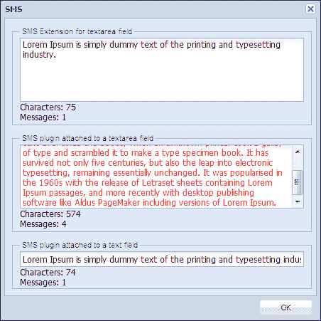

# 第一章. 插件和扩展

本章介绍了 Ext JS 插件和扩展的定义，它们之间的区别，并最终展示了如何开发插件和扩展。

在本章中，我们将涵盖：

+   插件是什么

+   扩展是什么

+   扩展和插件之间的区别，以及选择最佳选项

+   构建 Ext JS 插件

+   构建 Ext JS 扩展

在这个现代的 JavaScript 世界中，Ext JS 是包含大量跨浏览器实用工具、UI 小部件、图表、数据对象存储等众多功能的最佳 JavaScript 框架。

在开发应用程序时，我们通常寻找最佳功能支持和提供该功能的组件。但通常我们会遇到框架缺乏我们需要的特定功能或组件的情况。幸运的是，Ext JS 拥有一个强大的类系统，这使得扩展现有功能或组件或完全构建新的功能变得容易。

# 插件是什么？

Ext JS 插件是一个用于向现有组件提供额外功能的类。插件必须实现一个名为 `init` 的方法，该方法在组件初始化时由组件调用，并在组件的生命周期开始时作为参数传递。`destroy` 方法在插件的所有者组件在组件销毁时调用。我们不需要实例化插件类。插件通过使用该组件的插件配置选项插入到组件中。

插件不仅被它们附加的组件使用，还被从该组件派生的所有子类使用。我们还可以在单个组件中使用多个插件，但我们需要意识到，在单个组件中使用多个插件不应让插件相互冲突。

# 扩展是什么？

Ext JS 扩展是一个现有 Ext JS 类的派生类或子类，旨在允许包含额外的功能。Ext JS 扩展主要用于添加自定义功能或修改现有 Ext JS 类的行为。Ext JS 扩展可以像预配置的 Ext JS 类一样基本，基本上为现有类配置提供一组默认值。这种类型的扩展在需要的功能在多个地方重复出现的情况下非常有用。让我们假设我们有一个应用程序，其中几个 Ext JS 窗口在底部栏中都有相同的帮助按钮。因此，我们可以创建一个 Ext JS 窗口的扩展，其中我们可以添加这个帮助按钮，并可以使用这个扩展窗口而不需要为按钮提供重复的代码。优势在于我们可以轻松地在单个地方维护帮助按钮的代码，并且可以在所有地方获得更改。

# 扩展和插件之间的区别

Ext JS 扩展和插件用于相同的目的；它们向 Ext JS 类添加扩展功能。但它们主要在编写方式和使用原因方面有所不同。

Ext JS 扩展是扩展类或 Ext JS 类的子类。为了使用这些扩展，我们需要通过创建一个对象来实例化这些扩展。我们可以提供额外的属性、函数，甚至可以覆盖任何父成员以改变其行为。这些扩展与它们派生的类紧密耦合。Ext JS 扩展主要用于我们需要修改现有类或组件的行为，或者我们需要创建一个全新的类或组件。

Ext JS 插件也是 Ext JS 类，但它们包括`init`函数。为了使用插件，我们不需要直接实例化这些类；相反，我们需要在组件的插件配置选项中注册插件。添加后，选项和函数将可用于组件本身。插件与它们插入的组件松散耦合，并且可以轻松地与多个组件和派生组件交互。插件用于我们需要向组件添加功能时。由于插件必须附加到现有组件，因此像扩展那样创建一个全新的组件是没有用的。

# 选择最佳选项

当我们需要增强或更改现有 Ext JS 组件的功能时，我们有几种方法可以实现，每种方法都有其优点和缺点。

让我们假设我们需要开发一个具有将文本颜色更改为红色以表示文本长度超过消息分配长度的简单功能的短信文本字段；这样用户就可以看到他们正在输入多于一条消息。现在，在 Ext JS 中，这种功能可以通过三种不同的方式实现，以下章节将讨论这一点。

## 通过配置现有类

我们可以选择将配置应用于现有类。例如，我们可以在监听器的配置中提供一个作为配置的所需短信功能来创建一个文本字段，或者我们可以在使用`on`方法实例化文本字段后提供事件处理器。

这是在同一功能只在少数地方使用时最简单的选项。但是，一旦功能在多个地方或多种情况下重复出现，就可能出现代码重复。

## 通过创建子类或扩展

通过创建一个扩展，我们可以轻松解决上一节中讨论的问题。因此，如果我们通过扩展 Ext JS 文本字段来创建一个 SMS 文本字段的扩展，我们就可以在需要的地方使用这个扩展，也可以通过使用这个扩展来创建其他扩展。所以，这个扩展的代码是集中的，更改一个地方可以在使用这个扩展的所有地方反映出来。

但存在一个问题：当在其他 Ext JS 文本字段子类（如 Ext JS 文本区域字段）中需要相同的功能时，我们无法使用开发的 SMS 文本字段扩展来利用 SMS 功能。此外，假设有一个基类的两个子类，每个子类都提供了自己的功能，而我们想在单个类中使用这两个功能，那么在这个实现中这是不可能的。

## 通过创建一个插件

通过创建一个插件，我们可以最大限度地重用代码。作为一个类的插件，它可以被该类的子类使用，而且我们还有灵活性，可以在单个组件中使用多个插件。这就是为什么如果我们为 SMS 功能创建一个插件，我们可以在文本字段和文本区域字段中使用 SMS 插件。此外，我们还可以在其他类中使用其他插件，包括这个 SMS 插件。

# 构建 Ext JS 插件

让我们开始开发一个 Ext JS 插件。在本节中，我们将开发一个简单的 SMS 插件，针对 Ext JS 的 `textareafield` 组件。我们希望为 SMS 功能提供的特性是，它应该在包含字段的底部显示字符数和消息数。此外，消息文本的颜色应该改变，以便在用户超过消息允许长度时通知他们。

在以下代码中，SMS 插件类已被创建在 Ext JS 应用程序的 `Examples` 命名空间内：

```js
Ext.define('Examples.plugin.Sms', {

  alias : 'plugin.sms',

  config : {

    perMessageLength : 160,
    defaultColor : '#000000',
    warningColor : '#ff0000'

  },

  constructor : function(cfg) {

    Ext.apply(this, cfg);

    this.callParent(arguments);
  },

  init : function(textField) {

    this.textField = textField;
    if (!textField.rendered) {
      textField.on('afterrender', this.handleAfterRender, this);
    }
    else {
      this.handleAfterRender();
    }
  },
  handleAfterRender : function() {

    this.textField.on({
      scope : this,
      change : this.handleChange
    });

    var dom = Ext.get(this.textField.bodyEl.dom);

    Ext.DomHelper.append(dom, {
      tag : 'div',
      cls : 'plugin-sms'
    });

  },

  handleChange : function(field, newValue) {

    if (newValue.length > this.getPerMessageLength()) {
      field.setFieldStyle('color:' + this.getWarningColor());
    }
    else {
      field.setFieldStyle('color:' + this.getDefaultColor());
    }
    this.updateMessageInfo(newValue.length);

  },

  updateMessageInfo : function(length) {

    var tpl = ['Characters: {length}<br/>', 'Messages:{messages}'].join('');
    var text = new Ext.XTemplate(tpl);
    var messages = parseInt(length / this.getPerMessageLength());

    if ((length / this.getPerMessageLength()) - messages > 0) {
      ++messages;
    }

    Ext.get(this.getInfoPanel()).update(text.apply({
      length : length,
      messages : messages
    }));

  },

  getInfoPanel : function() {

    return this.textField.el.select('.plugin-sms');

  }
});
```

### 小贴士

**下载示例代码**

您可以从您在 [`www.packtpub.com`](http://www.packtpub.com) 的账户下载您购买的所有 Packt 书籍的示例代码文件。如果您在其他地方购买了这本书，您可以访问 [`www.packtpub.com/support`](http://www.packtpub.com/support) 并注册，以便将文件直接通过电子邮件发送给您。

在前面的插件类中，你可以看到在这个类中我们定义了一个名为 "必须实现" 的函数 `init`。在 `init` 函数中，我们检查此插件附加的组件是否已渲染，然后在渲染时调用 `handleAfterRender` 函数。在这个函数中，提供了一段代码，当 `change` 事件触发 `textareafield` 组件时，此类的 `handleChange` 函数应该被执行；同时，在 `handleAfterRender` 函数中创建一个 HTML `<div>` 元素，以便显示有关字符和消息计数器的信息。`handleChange` 函数是计算消息长度以显示彩色警告文本并调用 `updateMessageInfo` 函数以更新字符长度和消息数量的处理器。

现在我们可以轻松地将以下插件添加到组件中：

```js
{
    xtype : 'textareafield',
    plugins : ['sms']
}
```

此外，在将插件插入到 `plugins` 配置选项中时，我们可以提供配置选项来覆盖默认值，如下所示：

```js
plugins : [Ext.create('Examples.plugin.Sms', {
  perMessageLength : 20,
  defaultColor : '#0000ff',
  warningColor : "#00ff00"
})]
```

# 构建 Ext JS 扩展

让我们开始开发 Ext JS 扩展。在本节中，我们将开发一个 SMS 扩展，该扩展完全满足先前开发的 SMS 插件的要求。

我们已经知道 Ext JS 扩展是现有 Ext JS 类的派生类，我们将扩展 Ext JS 的 `textarea` 字段，该字段便于输入多行文本并提供多个事件处理、渲染和其他功能。

以下是我们创建的 `Extension` 类的代码，该类位于 Ext JS 应用程序的 `Examples` 命名空间下的 SMS 视图中：

```js
Ext.define('Examples.view.sms.Extension', {
  extend : 'Ext.form.field.TextArea',
  alias : 'widget.sms',

  config : {

    perMessageLength : 160,
    defaultColor : '#000000',
    warningColor : '#ff0000'

  },

  constructor : function(cfg) {

    Ext.apply(this, cfg);

    this.callParent(arguments);
  },

  afterRender : function() {

    this.on({
      scope : this,
      change : this.handleChange
    });

    var dom = Ext.get(this.bodyEl.dom);

    Ext.DomHelper.append(dom, {
      tag : 'div',
      cls : 'extension-sms'
    });

  },

  handleChange : function(field, newValue) {

    if (newValue.length > this.getPerMessageLength()) {
      field.setFieldStyle('color:' + this.getWarningColor());
    }
    else {
      field.setFieldStyle('color:' + this.getDefaultColor());
    }
    this.updateMessageInfo(newValue.length);

  },

  updateMessageInfo : function(length) {

    var tpl = ['Characters: {length}<br/>', 'Messages:{messages}'].join('');
    var text = new Ext.XTemplate(tpl);
    var messages = parseInt(length / this.getPerMessageLength());

    if ((length / this.getPerMessageLength()) - messages > 0) {
      ++messages;
    }

    Ext.get(this.getInfoPanel()).update(text.apply({
      length : length,
      messages : messages
    }));

  },

  getInfoPanel : function() {

    return this.el.select('.extension-sms');

  }
});
```

如前述代码所示，`extend` 关键字用作类属性，用于扩展 `Ext.form.field.TextArea` 类以创建扩展类。在 `afterRender` 事件处理器中，我们提供了一段代码，以便当 `change` 事件触发 `textarea` 字段时，我们可以执行此类的 `handleChange` 函数，并在 `afterRender` 事件处理器中创建一个 Html `<div>` 元素，以便显示有关字符计数器和消息计数器的信息。并且从这一部分开始，显示警告、消息字符计数器和消息计数器的逻辑与我们在 SMS 插件中使用的是相同的。

现在我们可以轻松地创建此扩展的实例：

```js
Ext.create('Examples.view.sms.Extension');
```

此外，在创建此类的实例时，我们可以提供配置选项来覆盖默认值：

```js
Ext.create('Examples.view.sms.Extension', {
    perMessageLength : 20,
    defaultColor : '#0000ff',
    warningColor : "#00ff00"
});
```

下面的截图显示了我们已经使用了 SMS 插件和扩展：



在上面的截图中，我们创建了一个 Ext JS 窗口，并集成了 SMS 扩展和 SMS 插件。正如我们之前讨论编写插件的好处时提到的，我们不仅可以在文本区域字段中使用 SMS 插件，还可以在文本字段中使用它。

# 摘要

通过本章，我们学习了插件和扩展是什么，两者之间的区别，它们提供的便利，如何使用它们，以及如何根据所需功能选择扩展或插件。在本章中，我们还开发了一个简单的 SMS 插件和 SMS 扩展。
