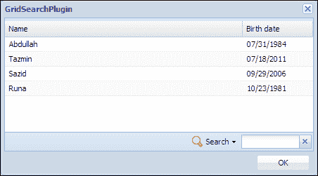
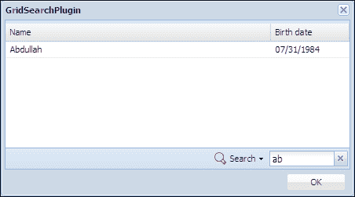

# 第六章 网格搜索

在本章中，我们将开发一个 Ext JS 插件，该插件将在网格内提供搜索功能。这个插件最初是由 Ing. Jozef Sakáloš开发的，它是一个非常实用且受欢迎的插件。我们将为 Ext JS 4x 版本重写这个插件。

在本章中，我们将涵盖：

+   功能需求

+   网格搜索的规划和编码

# 功能需求

我们希望开发一个插件，该插件将帮助用户通过文本字段在网格面板中进行搜索。该插件还将为用户提供选择或取消选择他们想要应用搜索的网格列的选项。将有一个清除按钮来清除搜索文本。将有一个配置选项，用户可以设置他们想要在搜索文本框中输入以触发搜索的字符数。

# 网格搜索的规划和编码

为了开发这个插件，我们将创建一个菜单，用户可以在其中选择和取消选择网格的列，一个文本字段，用户可以在其中输入他们的搜索查询，以及一个清除按钮，它将帮助清除搜索查询。最初，我们将开发所需的 UI 字段，然后我们将添加相应的功能到这些字段中。现在让我们开始编码：

```js
Ext.define("Examples.plugin.GridSearch", {

  extend : 'Ext.util.Observable',
  alias : 'plugin.gridsearch',

  config : {

    iconCls : 'icon-zoom',
    checkIndexes : "all",
    mode : 'local',
    minChars : 1,
    width : 100,
    searchText : 'Search',
    selectAllText : 'Select all',
    position: 'bottom' ,
    paramNames: {
      fields:'fields'
      ,query:'query'
    }

  },

  init : function(cmp) {

    this.grid = cmp.view.up('gridpanel');

    if (this.grid.rendered)
      this.onRender();
    else {
      this.grid.on('render', this.onRender, this);
    }

  },
…
```

您可以看到，我们已经定义了几个配置选项，以及插件所需的`init`函数。现在让我们定义`onRender`函数：

```js
onRender : function() {

  var tb = this.getToolbar();
  this.menu = new Ext.menu.Menu();

  this.field = Ext.create("Ext.form.field.Trigger", {
    width : this.width,
    selectOnFocus : undefined === this.selectOnFocus ? 
             true : this.selectOnFocus,
       triggerCls : 'x-form-clear-trigger', 
        minLength : this.minLength
  });

  tb.add('->', {
    text : this.searchText,
    menu : this.menu,
    iconCls : this.iconCls
  }, this.field);

}
```

在这个函数中，首先我们尝试通过调用`getToolbar`函数来获取工具栏，因为我们需要在工具栏上渲染我们的插件 UI。然后我们创建一个菜单字段，该字段将包含列选择，然后是搜索字段。在此之后，我们将菜单字段和搜索字段添加到该工具栏中。现在让我们定义`getToolbar`函数：

```js
getToolbar: function(){

  var me = this,
  dockedItems = this.grid.getDockedItems(),
  toolbar = null,
  hasToolbar = false;

  if(dockedItems.length>0){
    Ext.each(dockedItems, function(item){
      if(item.xtype ==='toolbar' && item.dock == me.position){
        hasToolbar = true;
        toolbar = item;
        return false;
      }
    });
  }

  if(!hasToolbar){
    toolbar = this.grid.addDocked({
      xtype: 'toolbar',
      dock: this.position
    })[0];
  }

  return toolbar;

}
```

在这个函数中，我们正在寻找一个工具栏项，该工具栏项位于位置配置选项中定义的位置。我们将在返回的工具栏上渲染我们的插件 UI。

现在让我们在这个网格中使用这个插件，插件输出应该看起来像以下截图：



因此，现在我们的插件看起来完全符合要求。现在让我们开始添加功能。首先让我们修改插件代码中的`onRender`函数：

```js
this.field = Ext.create("Ext.form.field.Trigger", {
  width : this.width,
  selectOnFocus : undefined === this.selectOnFocus ?
           true : this.selectOnFocus,
     triggerCls : 'x-form-clear-trigger',
 onTriggerClick : Ext.bind(this.onTriggerClear, this),
      minLength : this.minLength
});
```

您可以看到，我们已经为`onTriggerClick`事件提供了`onTriggerClear`处理程序来清除搜索。我们需要添加和处理一些键盘事件：按下*Enter*键将触发搜索，按下*Esc*键将触发清除搜索。因此，我们需要在定义触发字段后添加以下代码：

```js
this.field.on('render', function() {

  if (this.minChars) {
    this.field.el.on({
      scope : this,
      buffer : 300,
      keyup : this.onKeyUp
    });
  }

  var map = new Ext.KeyMap(this.field.el, [{
    key : Ext.EventObject.ENTER,
    scope : this,
    fn : this.onTriggerSearch
  }, {
    key : Ext.EventObject.ESC,
    scope : this,
    fn : this.onTriggerClear
  }]);
  map.stopEvent = true;
}, this, {
  single : true
});
```

现在，我们需要准备菜单以加载列名，我们将调用`initMenu`函数来完成这个操作。这就是我们在`onRender`函数中需要做的所有事情。

现在让我们定义`onKeyUp`处理程序：

```js
onKeyUp : function(e) {

  if (e.isNavKeyPress()) {
    return;
  }

  var length = this.field.getValue().toString().length;
  if (0 === length || this.minChars <= length) {
    this.onTriggerSearch();
  }

}
```

让我们继续定义`initMenu`函数：

```js
initMenu : function() {

  var menu = this.menu;
  menu.removeAll();

  menu.add(new Ext.menu.CheckItem({
    text : this.selectAllText,
    checked : !(this.checkIndexes instanceof Array),
    hideOnClick : false,
    handler : function(item) {
      var checked = item.checked;
      menu.items.each(function(i) {
        if (item !== i && i.setChecked && !i.disabled) {
          i.setChecked(checked);
        }
      });
    }
  }), '-');

  var cm = this.grid.headerCt.items.items;

  var group = undefined;
  Ext.each(cm, function(item) {
    var config = item.initialConfig;
    var disable = false;

    if (config.header && config.dataIndex) {
      Ext.each(this.disableIndexes, function(item) {
        disable = disable ? disable : 
          item === config.dataIndex;
      });
      if (!disable) {
        menu.add(new Ext.menu.CheckItem({
          text : config.header,
          hideOnClick : false,
          group : group,
          checked : 'all' === this.checkIndexes,
          dataIndex : config.dataIndex
        }));
      }
    }
  }, this);

  if (this.checkIndexes instanceof Array) {
    Ext.each(this.checkIndexes, function(di) {
      var item = menu.items.find(function(itm) {
        return itm.dataIndex === di;
      });
      if (item) {
        item.setChecked(true, true);
      }
    }, this);
  }

}
```

您可以看到我们是如何在先前的`initMenu`函数中准备菜单以选择和取消选择列的。现在让我们定义`onTriggerClear`函数，该函数负责清除搜索查询：

```js
onTriggerClear : function() {

  if (this.field.getValue()) {
    this.field.reset();
    this.field.focus();
    this.onTriggerSearch();
  }

}
```

接下来，我们定义`onTriggerSearch`函数：

```js
onTriggerSearch : function() {

  if (!this.field.isValid()) {
    return;
  }
  var val = this.field.getValue(),
    store = this.grid.store,
    proxy = store.getProxy();
…
```

我们需要检查为`mode`配置选项设置的值，如果设置为`'local'`或者存储代理是服务器代理，我们需要提供单独的逻辑。现在，当模式设置为`'local'`时，我们需要在`onTriggerSearch`函数中添加以下代码：

```js
if ('local' === this.mode) {
  store.clearFilter();
  if (val) {
    store.filterBy(function(r) {
      var retval = false;
      this.menu.items.each(function(item) {
        if (!item.dataIndex || !item.checked || retval) {
          return;
        }

        var rv = r.get(item.dataIndex), rv = rv instanceof Date ?
        Ext.Date.format(rv, this.getDateFormat(item)) : rv;
        var re = new RegExp(Ext.String.escape(val), 'gi');
        retval = re.test(rv);
      }, this);
      if (retval) {
        return true;
      }
      return retval;
    }, this);
  }
}
```

如果值不是设置为`local`，我们需要检查代理是否是服务器代理。以下是需要在`onTriggerSearch`函数中添加的代码，在`if ('local' === this.mode)`块之后：

```js
else if(proxy instanceof Ext.data.proxy.Server) {

  if(store.lastOptions && store.lastOptions.params) {
    store.lastOptions.params[store.paramNames.start] = 0;
  } 

  var fields = [];
  this.menu.items.each(function(item) {
    if(item.checked && item.dataIndex) {
      fields.push(item.dataIndex);
    }
  });

  delete(proxy.extraParams[this.paramNames.fields]);
  delete(proxy.extraParams[this.paramNames.query]);
  if (store.lastOptions && store.lastOptions.params) {
    delete(proxy.lastOptions.params[this.paramNames.fields]);
    delete(proxy.lastOptions.params[this.paramNames.query]);
  }
  if(fields.length) {
    proxy.extraParams[this.paramNames.fields] = Ext.encode(fields);
    proxy.extraParams[this.paramNames.query] = val;
  }

  store.load();
}
```

现在我们定义`getDateFormat`函数：

```js
getDateFormat : function(menuItem) {

  var columnNames = Ext.Array.pluck(this.grid.columns, 'dataIndex'),
  columnIndex = Ext.Array.indexOf(columnNames, menuItem.dataIndex),
  format = this.grid.columns[columnIndex].format;

  return this.dateFormat || format;
}
```

下面是我们工作插件的截图：



您可以看到我们的插件是根据搜索查询过滤数据的。

# 摘要

在本章中，我们开发了一个 Ext JS 插件，以在网格内提供搜索功能。现在我们清楚地了解了 Ext JS 插件是多么强大。我们可以在网格中轻松使用此插件，并在需要时提供此出色的搜索功能。

在下一章中，我们将介绍另一个针对文本组件的有用插件，该插件在文本字段上方显示一个清晰的按钮，我们将看到点击按钮将如何清除文本字段中的文本。
