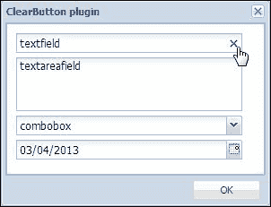

# 第七章：带清除按钮的输入字段

在本章中，我们将介绍 Stephen Friedrich 的`ClearButton`插件。这个插件针对显示在文本字段上方的“清除”按钮的文本组件。当点击清除按钮时，文本字段将被清空。此外，可以使用 CSS 控制图标图像及其定位。

涵盖的主题包括：

+   功能需求

+   清除按钮的规划和编码

# 功能需求

我们希望有一个插件，可以帮助用户清除文本组件中的文本，例如`Ext.form.field.Text`、`Ext.form.field.TextArea`、`Ext.form.field.ComboBox`和`Ext.form.field.Date`。这个插件应该提供一个按钮，用户可以点击以清除文本组件中的文本。这个插件应该有几个有用的配置选项和 CSS 样式，我们可以设置我们的要求，例如清除按钮应该始终/仅在鼠标进入输入字段时显示，或者当输入字段为空时显示，或者当用户按下*Esc*键时清除。清除按钮可以通过 CSS 自定义按钮图像/位置等。

# 清除按钮的规划和编码

为了开发这个插件，我们首先将创建一个将在文本组件上渲染的清除按钮，并根据配置选项应用 CSS 样式。之后，我们需要为清除按钮添加几个事件处理器，例如`click`、`mouseover`、`mouseout`、`mouseup`和`mousedown`，以及为文本组件添加几个事件处理器，例如`destroy`、`resize`、`change`、`mouseover`和`mouseout`。现在让我们开始编码：

```js
Ext.define('Examples.plugin.ClearButton', {
  alias : 'plugin.clearbutton',

  hideClearButtonWhenEmpty : true,
  hideClearButtonWhenMouseOut : true,
  animateClearButton : true,
  clearOnEscape : true,
  clearButtonCls : 'ext-ux-clearbutton',
  textField : null,
  animateWithCss3 : false,

  constructor : function(cfg) {
    Ext.apply(this, cfg);

    this.callParent(arguments);
  },

  init : function(textField) {
    this.textField = textField;
    if (!textField.rendered) {
      textField.on('afterrender', this.handleAfterRender, this);
    }
    else {
      this.handleAfterRender();
    }
  }
```

在前面的代码片段中，你可以看到我们定义了几个配置选项和必需的`init`函数。

现在，让我们定义`handleAfterRender`函数：

```js
handleAfterRender : function(textField) {
  this.isTextArea = (this.textField.inputEl.dom.type.toLowerCase() == 'textarea');
  this.createClearButtonEl();
  this.addListeners();
  this.repositionClearButton();
  this.updateClearButtonVisibility();
  this.addEscListener();
}
```

在这个`handleAfterRender`函数中，首先，我们检查文本字段是否是`textarea`，因为我们需要处理可能带有滚动条的`textarea`的自定义功能。然后我们调用`createClearButtonEl`函数来创建清除按钮的元素和 DOM。

现在，让我们定义`createClearButtonEl`函数：

```js
createClearButtonEl : function() {
  var animateWithClass = this.animateClearButton &&this.animateWithCss3;
  this.clearButtonEl = this.textField.bodyEl.createChild({
    tag : 'div',
    cls : this.clearButtonCls
  });
  if (this.animateClearButton) {
    this.animateWithCss3 = this.supportsCssTransition(this.clearButtonEl);
  }
  if (this.animateWithCss3) {
    this.clearButtonEl.addCls(this.clearButtonCls + '-off');
  }
  else {
    this.clearButtonEl.setStyle('visibility', 'hidden');
  }
}
```

在前面的函数中，清除按钮已经被创建并分配了一个基于配置选项的动画。在这个函数中，我们还通过调用`supportsCssTransition`函数来检查浏览器是否支持 CSS3 过渡。

现在，让我们定义`supportsCssTransition`函数：

```js
supportsCssTransition: function(el) {
  var styles = ['transitionProperty', 'WebkitTransitionProperty','MozTransitionProperty', 'OTransitionProperty','msTransitionProperty', 'KhtmlTransitionProperty'];

  var style = el.dom.style;
  for(var i = 0, length = styles.length; i < length; ++i) {
    if(style[styles[i]] !== 'undefined') { 
      return true;
    }
  }
  return false;
}
```

在`handleAfterRender`函数中，我们接下来调用的函数是`addListeners`函数，用于向字段、其输入元素和清除按钮添加监听器，以处理如`mouseover`、`mouseout`和`click`等调整大小的事件。

现在，让我们定义`addListeners`函数：

```js
addListeners: function() { 
  var textField = this.textField;
  var bodyEl = textField.bodyEl;
  bodyEl.on('mouseover', this.handleMouseOverInputField, this);
  bodyEl.on('mouseout', this.handleMouseOutOfInputField, this);

  textField.on('destroy', this.handleDestroy, this);
  textField.on('resize', this.repositionClearButton, this);
  textField.on('change', function() {
    this.repositionClearButton();
    this.updateClearButtonVisibility();
  }, this);

  var clearButtonEl = this.clearButtonEl;
  clearButtonEl.on('mouseover', this.handleMouseOverClearButton,this);
  clearButtonEl.on('mouseout', this.handleMouseOutOfClearButton,this);
  clearButtonEl.on('mousedown', this.handleMouseDownOnClearButton,this);
    clearButtonEl.on('mouseup', this.handleMouseUpOnClearButton,this);
  clearButtonEl.on('click', this.handleMouseClickOnClearButton,this);
}
```

接下来我们定义`mouseover`事件处理器`handleMouseOverInputField`和`mouseout`事件处理器`handleMouseOutOfInputField`，用于`textField`的`bodyEl`：

```js
handleMouseOverInputField: function(event, htmlElement, object) {
  this.clearButtonEl.addCls(this.clearButtonCls +'-mouse-over-input');
  if (event.getRelatedTarget() == this.clearButtonEl.dom) {
    this.clearButtonEl.removeCls(this.clearButtonCls +'-mouse-over-button');
    this.clearButtonEl.removeCls(this.clearButtonCls +'-mouse-down');
  }
  this.updateClearButtonVisibility();
},
handleMouseOutOfInputField: function(event, htmlElement, object) {
  this.clearButtonEl.removeCls(this.clearButtonCls +'-mouse-over-input');
  if (event.getRelatedTarget() == this.clearButtonEl.dom) { 
    this.clearButtonEl.addCls(this.clearButtonCls +'-mouse-over-button');
  }
  this.updateClearButtonVisibility();
}
```

现在，让我们定义 `textField` 的 "destroy" 事件处理器，因为当字段被销毁时，我们还需要销毁清除按钮元素以防止内存泄漏：

```js
handleDestroy: function() {
  this.clearButtonEl.destroy();
}
```

现在，让我们开始定义清除按钮的 `mouseover`、`mouseout`、`mousedown`、`mouseup` 和 `click` 事件的处理程序：

```js
handleMouseOverClearButton: function(event, htmlElement, object) {
  event.stopEvent();
  if (this.textField.bodyEl.contains(event.getRelatedTarget())) {
    return;
  }
  this.clearButtonEl.addCls(this.clearButtonCls +'-mouse-over-button');
  this.updateClearButtonVisibility();
},

handleMouseOutOfClearButton: function(event, htmlElement, object){
  event.stopEvent();
  if (this.textField.bodyEl.contains(event.getRelatedTarget())) { 
    return;
  }
  this.clearButtonEl.removeCls(this.clearButtonCls +'-mouse-over-button');
    this.clearButtonEl.removeCls(this.clearButtonCls +'-mouse-down');
  this.updateClearButtonVisibility();
},

handleMouseDownOnClearButton: function(event, htmlElement,object){
  if (!this.isLeftButton(event)) {
    return;
  }
  this.clearButtonEl.addCls(this.clearButtonCls +'-mouse-down');
},

handleMouseUpOnClearButton: function(event, htmlElement, object) {
  if (!this.isLeftButton(event)) {
    return;
  }
  this.clearButtonEl.removeCls(this.clearButtonCls +'-mouse-down');
},

handleMouseClickOnClearButton: function(event, htmlElement, object) {
  if (!this.isLeftButton(event)) {
    return;
  }
  this.textField.setValue('');
  this.textField.focus();
}
```

在 `handleAfterRender` 函数中，我们将调用的下一个函数是 `repositionClearButton` 函数，根据 `textField` 的 `inputEl` 元素重新定位清除按钮元素。现在，让我们定义这个函数：

```js
repositionClearButton: function() {
  var clearButtonEl = this.clearButtonEl;
  if (!clearButtonEl) {
    return;
  }
  var clearButtonPosition = this.calculateClearButtonPosition(this.textField);
  clearButtonEl.dom.style.right = clearButtonPosition.right +'px';
  clearButtonEl.dom.style.top = clearButtonPosition.top + 'px';
}
```

您可以看到，我们通过调用 `calculateClearButtonPosition` 函数来获取清除按钮的位置值。此函数根据 `textField` 的 `inputEl` 元素计算清除按钮的位置。现在，让我们定义这个函数：

```js
calculateClearButtonPosition: function(textField) {
  var positions = textField.inputEl.getBox(true, true);
  var top = positions.y;
  var right = positions.x;
  if (this.fieldHasScrollBar()) {
    right += Ext.getScrollBarWidth();
  }
  if (this.textField.triggerWrap) {
    right += this.textField.getTriggerWidth();
  }
  return {
    right: right,
    top: top
  };
}
```

您可以看到，我们检查了字段是否有滚动条，如果有滚动条，我们将 `Ext.getScrollBarWidth` 函数的值添加到 `right` 位置。现在，让我们定义 `fieldHasScrollBar` 函数：

```js
fieldHasScrollBar: function() {
  if (!this.isTextArea) {
    return false;
  }

  var inputEl = this.textField.inputEl;
  var overflowY = inputEl.getStyle('overflow-y');
  if (overflowY == 'hidden' || overflowY == 'visible') {
    return false;
  }
  if (overflowY == 'scroll') {
    return true;
  }
  if (inputEl.dom.scrollHeight <= inputEl.dom.clientHeight) {
    return false;
  }
  return true;
}
```

然后，我们在 `handleAfterRender` 函数中调用了 `updateClearButtonVisibility` 函数来修复清除按钮的可见性：

```js
updateClearButtonVisibility: function() {
  var oldVisible = this.isButtonCurrentlyVisible();
  var newVisible = this.shouldButtonBeVisible();

  var clearButtonEl = this.clearButtonEl;
  if (oldVisible != newVisible) {
    if(this.animateClearButton && this.animateWithCss3) {
      this.clearButtonEl.removeCls(this.clearButtonCls +(oldVisible ? '-on' : '-off'));
      clearButtonEl.addCls(this.clearButtonCls + (newVisible ? '-on' : '-off'));
    }
    else {
      clearButtonEl.stopAnimation();
      clearButtonEl.setVisible(newVisible,this.animateClearButton);
    }

    clearButtonEl.setStyle('background-color',this.textField.inputEl.getStyle('background-color'));

    if (!(this.isTextArea && Ext.isGecko) && !Ext.isIE) {
      var deltaPaddingRight = clearButtonEl.getWidth() - this.clearButtonEl.getMargin('l');
      var currentPaddingRight = this.textField.inputEl.getPadding('r');
      var factor = (newVisible ? +1 : -1);
      this.textField.inputEl.dom.style.paddingRight = (currentPaddingRight + factor * deltaPaddingRight) + 'px';
    }
  }
}
```

您可以看到，我们通过调用 `isButtonCurrentlyVisible` 和 `shouldButtonBeVisible` 函数来获取当前可见状态值以及新的可见状态。`isButtonCurrentlyVisible` 函数是 `clearButtonEl.isVisible()` 的包装器，用于处理可能仍在进行的 `setVisible` 动画，而 `shouldButtonBeVisible` 函数检查配置选项和当前鼠标状态，以确定清除按钮是否应该可见。现在，让我们定义这些函数：

```js
isButtonCurrentlyVisible: function() {
  if (this.animateClearButton && this.animateWithCss3) {
    return this.clearButtonEl.hasCls(this.clearButtonCls + '-on');
  } 
  var cachedVisible = Ext.core.Element.data(this.clearButtonEl.dom, 'isVisible');
  if (typeof(cachedVisible) == 'boolean') {
    return cachedVisible;
  }
  return this.clearButtonEl.isVisible();
},

shouldButtonBeVisible: function() {
  if (this.hideClearButtonWhenEmpty && Ext.isEmpty(this.textField.getValue())) {

    return false;
  }

  var clearButtonEl = this.clearButtonEl;

  if (this.hideClearButtonWhenMouseOut && !clearButtonEl.hasCls(this.clearButtonCls + '-mouse-over-button') && !clearButtonEl.hasCls(this.clearButtonCls + '-mouse-over-input')) {

    return false;
  }

  return true;
}
```

在 `handleAfterRender` 函数中，我们调用的最后一个函数是 `addEscListener` 函数。我们需要做的是，如果配置选项 `clearOnEscape` 设置为 `true`，则添加一个键监听器来清除此字段。现在，让我们定义这个函数：

```js
addEscListener: function() {
  if (!this.clearOnEscape) {
    return;
  }

  this.textField.inputEl.on('keydown', function(e) {
    if (e.getKey() == Ext.EventObject.ESC) {
      if (this.textField.isExpanded) {
        return;
      }
      Ext.Function.defer(this.textField.setValue, 1,this.textField, ['']);
      e.stopEvent();
    }
  },
  this);
}
```

以下截图显示了使用此插件为 **textfield**、**textareafield**、**combobox** 和日期字段生成的输出：



您可以看到，在悬停在 **textfield** 组件上时，清除按钮是可见的，并且点击此按钮将清除相应的字段。

# 摘要

在本章中，我们介绍了一个 Ext JS 插件，该插件为文本组件提供了一个清晰的清除按钮，用于清除其内部的内容。我们可以看到，单个插件可以用于多种类型的组件，以及我们如何轻松地注入插件的功能。

在下一章中，我们将开发一个用于花哨动画消息栏的 Ext JS 扩展。消息栏将提供一个可配置的持续时间计时器来显示消息。它将有一个关闭按钮，并且它还可以在消息旁边显示 "错误" 和 "成功" 图标。
