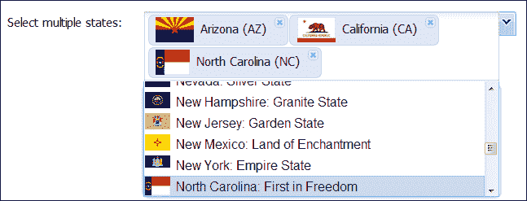
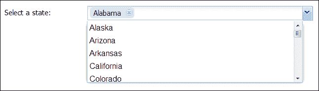
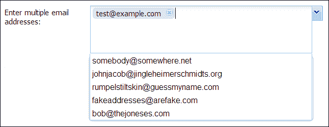

# 第九章. 直观的多选 Combobox

在本章中，我们将探讨一个优秀的 Ext JS 扩展：`BoxSelect`，该扩展最初由 Kevin Vaughan 开发。这个扩展非常实用，并为多选提供了更友好的 combobox，可以轻松地为每个选择创建可移除的标签，还有很多其他功能。

涵盖的主题包括：

+   BoxSelect 的功能

+   `BoxSelect`扩展：

    +   基本配置

    +   模板

    +   单值选择

    +   使用未知值进行远程查询

    +   使用自动建议添加新记录

    +   BoxSelect 特定配置

    +   值处理和事件

# BoxSelect 的功能

`BoxSelect`是一个为更直观的多选功能开发的扩展`ComboBox`组件。`BoxSelect`附带大量示例和适当的文档。以下是由`BoxSelect`扩展提供的功能：

+   可以单独移除所选项目。

+   可定制的项目模板，用于控制所选值的显示。

+   支持基于键盘的选择和导航所选值。

+   当设置未知值时，支持从远程存储按需加载值，并且`queryMode`选项设置为`remote`，`forceSelection`设置为`true`。

+   将`forceSelection`设置为`false`将创建新记录。

+   当`multiSelect`设置为`true`时，选择列表可以配置为在做出选择后是否应该折叠。

+   可以配置所选项目以堆叠或自动调整大小。

+   大多数现有的`ComboBox`功能性和配置选项都应该与`BoxSelect`一起工作。

# 使用 BoxSelect

`BoxSelect`扩展了`ComboBox`控件，以提供更友好的多选`ComboBox`控件。本章包含的示例显示了默认`ComboBox`控件和此扩展之间的差异，并提供了关于`BoxSelect`高级使用的通用信息。

## 基本配置

`BoxSelect`应支持所有配置值，如`ComboBox`支持。对于此扩展，默认值有一些变化：

+   `multiSelect`选项默认设置为`true`。

+   `forceSelection`选项默认设置为`true`。

+   在大多数情况下，多选是从预定义的列表中进行的，但我们可以配置`BoxSelect`扩展以添加带有自动建议列表的新记录。

+   当`multiSelect`选项设置为`true`时，`ComboBox`组件不支持`typeAhead`，尽管`BoxSelect`扩展中`typeAhead`的值默认设置为`false`，但已添加对此功能的支持。

+   可以使用`value`选项来初始化`multiSelect`值。`setValue`方法接受相同的值格式。

现在，让我们使用以下配置开始使用`BoxSelect`扩展：

```js
{
  "value": [
    "TX",
    "CA"
  ],
  "fieldLabel": "Select multiple states",
  "displayField": "name",
  "valueField": "abbr",
  "width": 500,
  "labelWidth": 130,
  "emptyText": "Pick a state, any state",
  "store": "States",
  "queryMode": "local"
}
```

截图应如下所示：


在先前的屏幕截图中，我们可以看到如何轻松地在`BoxSelect`组合框扩展中选择多个值。

## 模板

我们可以通过模板轻松配置选中值和下拉列表项的显示：

+   **labelTpl**：它是模板配置选项，用于控制输入字段中选中值的显示。

+   **listConfig**：它是模板配置选项，用于控制下拉列表项的显示。此选项在默认的`ComboBox`字段中可用，并由`BoxSelect`支持。

现在，让我们看看如何设置配置以自定义`labelTpl`和`listConfig`选项：

```js
{
  "delimiter": ", ",
  "value": "AZ, CA, NC",
  "labelTpl": " {name} ({abbr})",
  "listConfig": {
    "tpl": [
      "<ul><tpl for=\".\">",
      "<li role=\"option\"class=\"x-boundlist-item\"style=\"background-image:url({flagUrl});background-repeat: no-repeat;background-size: 25px;padding-left: 30px;\">{name}: {slogan}</li>",
         "</tpl></ul>"
    ]
  },
  "fieldLabel": "Select multiple states",
  "displayField": "name",
  "valueField": "abbr",
  "width": 500,
  "labelWidth": 130,

  "store": "States",
  "queryMode": "local"
}
```

以下截图显示了使用先前的`labelTpl`和`listConfig`配置的`BoxSelect`扩展：



在先前的屏幕截图中，我们可以看到`BoxSelect`扩展正常工作，并使用配置的`labelTpl`和`listConfig`组合框显示选中的项目。

## 单值选择

`BoxSelect`扩展针对多选，但它也支持单选，通过将`multiSelect`选项设置为`false`。如果我们需要默认的单选选项，我们可以在创建`BoxSelect`扩展之前添加以下代码行：

```js
Ext.ux.form.field.BoxSelect.prototype.multiSelect = false;
```

现在，让我们为单选配置`BoxSelect`扩展：

```js
{
  "fieldLabel": "Select a state",
  "multiSelect": false,
  "filterPickList": true,
  "displayField": "name",
  "valueField": "abbr",
  "width": 500,
  "labelWidth": 130,
  "emptyText": "Pick a state, any state",
  "store": "States",
  "queryMode": "local"
}
```

输出结果应如下所示：



在先前的屏幕截图中，当`multiSelect`选项设置为`false`时，我们可以在组合框中仅选择单个值。

## 带有未知值的远程查询

当我们将`queryMode`选项设置为`remote`并将`forceSelection`选项设置为`true`，并且我们传递给`BoxSelect`扩展的值不在存储中时，将向存储配置的代理“x”发送一个查询，其中包含`valueField`选项的名称和一组由配置的`delimiter`分隔的未知值作为参数。例如，如果`valueField`选项是`abbr`，`delimiter`值是`|`，并且设置了未知值`'NC'`、`'VA'`和`'ZZ'`，则将传递以下参数到存储配置的代理：

```js
{ abbr: 'NC|VA|ZZ' }
```

这种尝试加载未知值的操作将在每次`initValue`/`setValue`调用中只执行一次。在此请求之后仍然未知的数据记录将从字段值中删除，但所有已知值都将保留。在先前的示例中，`'ZZ'`条目被丢弃。

现在，让我们为远程存储配置`BoxSelect`扩展：

```js
{
  "fieldLabel": "With Remote Store",
  "store": "RemoteStates",
  "pageSize": 25,
  "queryMode": "remote",
  "delimiter": "|",
  "value": "NC|VA|ZZ",
  "triggerOnClick": false,
  "labelTpl": "{name} ({abbr})",
  "listConfig": {
    "tpl": [
      "<ul><tpl for=\".\">",
        "<li role=\"option\"class=\"x-boundlist-item\">{name}: {slogan}</li>",
      "</tpl></ul>"
    ]
  },
  "displayField": "name",
  "valueField": "abbr",
  "width": 500,
  "labelWidth": 130
}
```

以下截图显示了我们对`BoxSelect`扩展使用此配置：


在先前的屏幕截图中，我们可以看到我们配置的`BoxSelect`在远程存储中工作正常，并且检索到了`'NC'`和`'VA'`的值，而`'ZZ'`的值被丢弃。

## 使用自动建议添加新记录

在此示例中，我们将展示当`forceSelection`设置为`false`时`forceSelection`的使用，以启用使用从附加存储提供的自动建议输入新值。新记录将使用用户输入的配置`displayField`和`valueField`来创建。这些新记录不会自动添加到`ComboBox`存储中。

可以通过以下四种方式中的任何一种创建新条目：

+   当我们输入配置的`delimiter`（默认为逗号`,`）时，`delimiter`之前输入的值将用于创建新的记录。

+   当我们将文本粘贴到字段中时，值将根据配置的`delimiter`进行分割，默认为逗号`,`，输入的任何值都将解析到新的/现有的记录中。

+   默认情况下，`createNewOnEnter`选项设置为`false`。如果设置为`true`，则在按下*Enter*键时将创建一个新的条目。此配置选项仅适用于`forceSelection`选项设置为`false`的情况。

+   默认情况下，`createNewOnBlur`选项设置为`false`。如果设置为`true`，则在焦点离开输入字段时将创建一个新的条目。此配置选项仅适用于`forceSelection`设置为`false`的情况，并且被`autoSelect`和`selectOnTab`所取代。

现在，让我们配置`BoxSelect`扩展以实现自动建议：

```js
{
  "fieldLabel": "Enter multiple email addresses",
  "width": 500,
  "growMin": 75,
  "growMax": 120,
  "labelWidth": 130,
  "store": [
    "test@example.com",
    "somebody@somewhere.net",
    "johnjacob@jingleheimerschmidts.org",
    "rumpelstiltskin@guessmyname.com",
    "fakeaddresses@arefake.com",
    "bob@thejoneses.com"
  ],
  "queryMode": "local",
  "forceSelection": false,
  "createNewOnEnter": true,
  "createNewOnBlur": true,
  "filterPickList": true,
  "displayField": "name",
  "valueField": "abbr"
}
```

使用此配置，我们将得到以下`BoxSelect`组件：



在前面的屏幕截图中，我们可以看到`BoxSelect`组件提供了一个自动建议列表，我们可以从中选择列表项或创建新的记录。

## `BoxSelect`特定配置

以下配置选项是针对`BoxSelect`扩展的特定选项：

+   默认情况下，`createNewOnEnter`选项设置为`false`。如果此选项设置为`true`且`forceSelection`选项设置为`false`，则用户按下*Enter*键时将立即创建一个新的条目。

+   默认情况下，`createNewOnBlur`选项设置为`false`。如果此选项设置为`true`且`forceSelection`选项设置为`false`，则在焦点离开输入字段时将创建一个新的条目。此配置选项被`autoSelect`和`selectOnTab`所取代。

+   默认情况下，`stacked`选项设置为`false`。如果此选项设置为`true`，则标签项将填充列表的可用宽度，而不是仅与显示的值一样宽。

+   默认情况下，`pinList`选项设置为`true`。如果此选项设置为`false`，则在`multiSelect`为`true`时，选择列表将在选择后自动折叠，这模仿了`multiSelect`为`false`时的默认行为。

+   默认情况下，`triggerOnClick`选项设置为`true`。当选项设置为`true`时，选择列表将模拟在字段中点击时的触发器，就像当`ComboBox`组件的`editable`选项设置为`false`时一样。

+   `grow`选项默认设置为`true`。如果将此选项设置为`false`，当需要时，选择列表将滚动，字段的高度将不会改变。如果为字段设置了固定高度，无论是直接设置（例如，通过高度配置）还是通过包含的布局设置，此设置将没有效果。

+   `growMin`选项默认设置为`false`。如果将此选项设置为`true`，任何数值都将用于字段的最小高度。

+   `growMax`选项默认设置为`false`。如果将此选项设置为`true`，任何数值都将用于字段的最高高度，并且当需要时，选择列表将滚动。

+   `filterPickList`选项默认设置为`false`。如果将此选项设置为`true`，当前选定的值将从展开的拾取列表中隐藏。

现在，让我们通过更改一些默认值来配置`BoxSelect`组件，以查看其效果：

```js
{
  "fieldLabel": "Select multiple states",
  "displayField": "name",
  "width": 500,
  "labelWidth": 130,
  "store": "States",
  "queryMode": "local",
  "valueField": "abbr",
  "value": "WA, TX",
  "stacked": true,
  "pinList": false,
  "filterPickList": true
}
```

以下是在使用此配置的`BoxSelect`组件的截图：


在前面的截图中，我们可以看到，由于我们将`stacked`选项设置为`true`，标记的项目填充了可用的全部宽度。由于我们将`pinList`选项设置为`false`，一旦做出选择，拾取列表就会自动折叠，并且由于我们将`filterPickList`选项设置为`true`，当前选定的值将从展开的拾取列表中隐藏。

## 值处理和事件

在`BoxSelect`中，以下方法可用于处理组合框的值：

+   `addValue(mixedValue)`: 向字段的当前值添加一个或多个值。

+   `removeValue(mixedValue)`: 从字段的当前值中移除一个或多个值。

+   `getValueRecords()`: 返回字段当前值的记录。

+   `getSubmitData()`: 允许将字段作为 JSON 编码的数组提交。

此外，`BoxSelect`组件还提供了以下两个事件来管理选定的项目：

+   valueSelectionChange

+   valueFocusChange

# 摘要

在本章中，我们探讨了`BoxSelect`组合框扩展的功能，并介绍了其使用方法。我们学习了如何配置`BoxSelect`扩展及其正确使用。我们可以看到，通过使用 Ext JS 的扩展功能，我们可以轻松地使用 Ext JS 库的`ComboBox`字段的全部功能，并可以添加我们自己的自定义功能以满足我们的需求。

在整本书中，我们学习了 Ext JS 插件和扩展的基础知识，介绍了几个流行的 Ext JS 库和社区提供的插件和扩展，我们还提供了几个带有适当解释和代码的实战插件和扩展开发示例。现在，我们对 Ext JS 插件和扩展的正确使用和开发有了清晰的认识。
