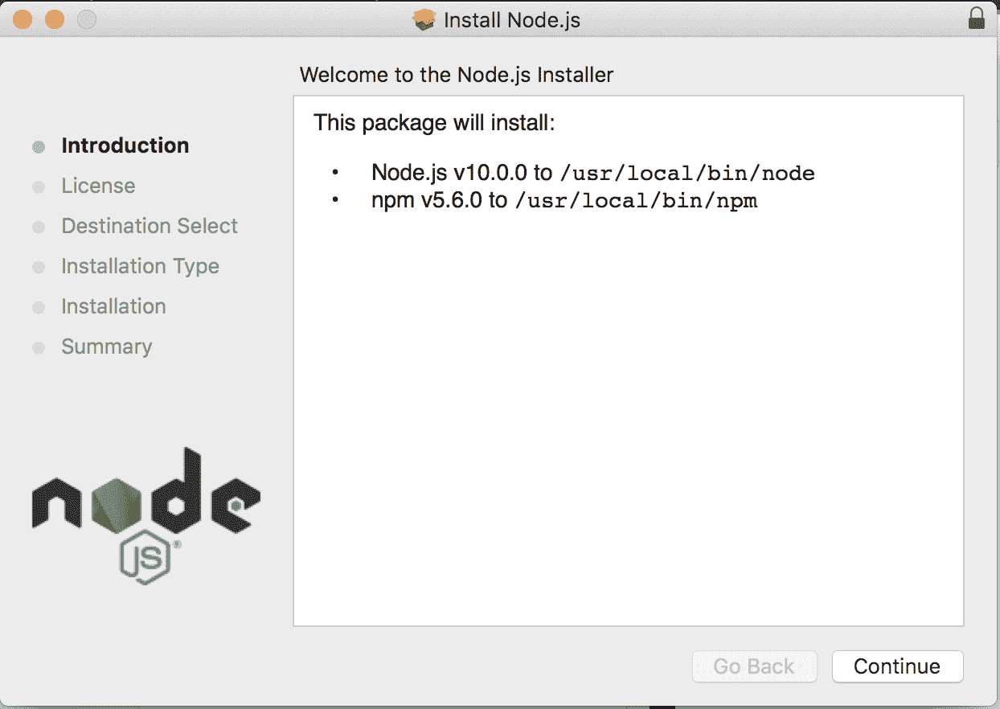
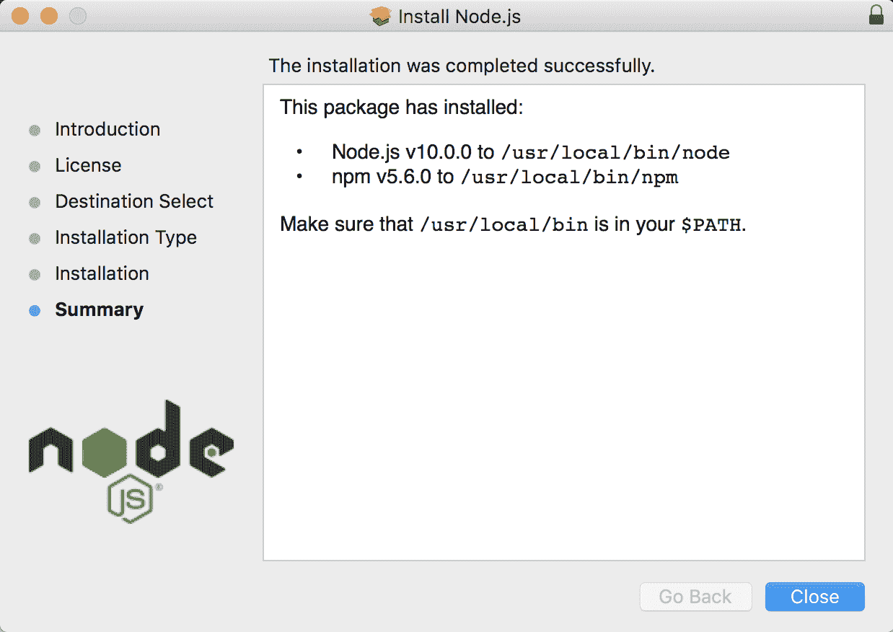
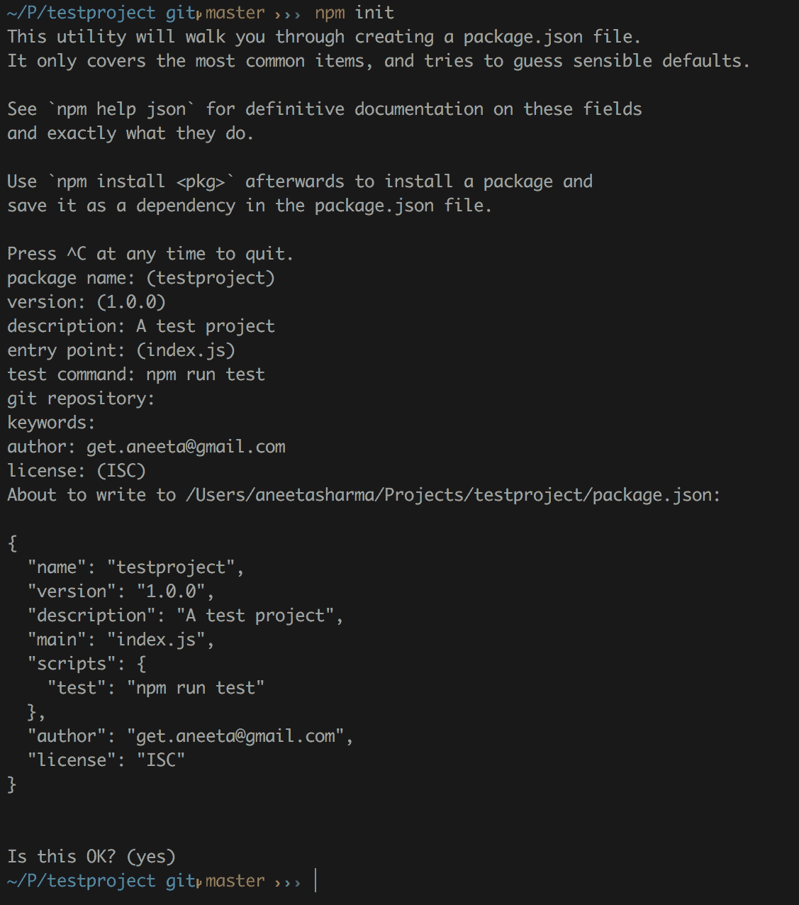
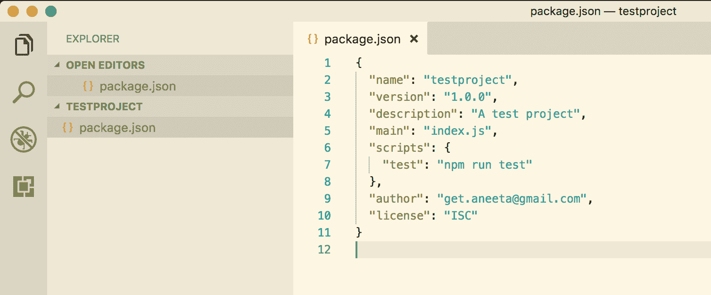
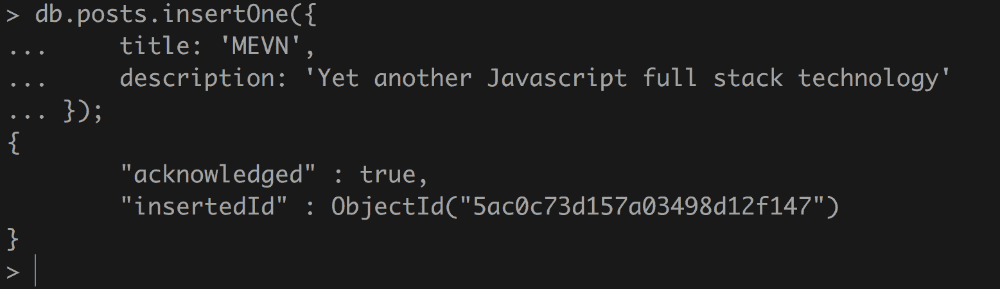
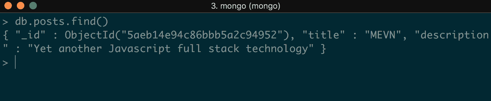
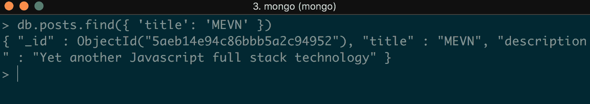
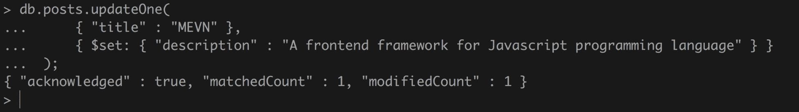
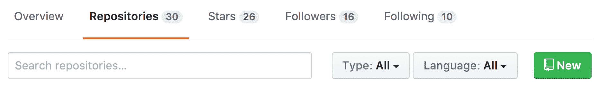
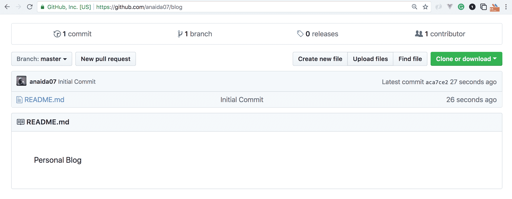

# 第一章：介绍 MEVN

**Mongo, Express, Vue.js 和 Node.js**（**MEVN**）是一组 JavaScript 技术，就像**MongoDB**，**Express**，**Angular**和**Node.js**（**MEAN**）一样，以及**MongoDB**，**Express**，**React**和**Node.js**（**MERN**）一样。这是一个全栈解决方案，用于构建使用 MongoDB 作为数据存储的基于 Web 的应用程序，Express.js 作为后端框架（构建在 Node.js 之上），Vue.js 作为前端的 JavaScript 框架，Node.js 作为后端的主要引擎。

本书适用于有兴趣学习使用 MongoDB，Express.js，Vue.js 和 Node.js 构建全栈 JavaScript 应用程序的 Web 开发人员。适合具有 HTML，CSS 和 JavaScript 基础知识的初学者和中级开发人员。

MEVN 可能是一个新名词，但其中使用的技术并不新。这里介绍的唯一新技术是 Vue.js。Vue.js 是一个开源的 JavaScript 框架，其受欢迎程度正在迅速增长。学习 Vue.js 并不需要太多的学习曲线，它也是 AngularJS 和 ReactJS 等其他 JavaScript 框架的激烈竞争对手。

现代 Web 应用程序需要快速且易于扩展。过去，JavaScript 仅在 Web 应用程序中用于添加一些常规 HTML 和 CSS 无法实现的视觉效果或动画。但今天，JavaScript 已经改变。今天，JavaScript 几乎在每个基于 Web 的应用程序中使用，从小型到大型应用程序。当应用程序需要更快速和更具交互性时，会选择 JavaScript。

使用 JavaScript 作为唯一编程语言构建全栈应用有其自身的好处：

+   如果您刚开始学习编程，您只需要掌握一种语言：JavaScript。

+   全栈工程师需求量大。成为全栈开发人员意味着您了解数据库的工作原理，知道如何构建后端和前端，并且还具备 UI/UX 技能。

在本书中，我们将使用这些技术栈构建应用程序。

本章将涵盖以下主题：

+   MEVN 技术栈介绍

+   Node.js 及其在 Windows，Linux 和 macOS 上的安装介绍

+   `npm`及其安装概述

+   介绍 MongoDB 及其安装以及 MongoDB 中使用的一些基本命令

+   介绍 GitHub 版本控制以及它如何帮助软件工程师轻松访问代码历史和协作

# JavaScript 技术栈的演变

JavaScript 是当今最重要的编程语言之一。由 Brendan Eich 于 1995 年创建，它不仅在保持其地位方面表现出色，而且在超越所有其他编程语言方面也表现出色。

JavaScript 的受欢迎程度不断增长，没有止境。使用 JavaScript 作为唯一编程语言构建 Web 应用程序一直很受欢迎。随着这种快速增长的步伐，软件工程师需要了解 JavaScript 的需求也在不断增加。无论您选择擅长哪种编程语言，JavaScript 总是以某种方式介入并与其他编程语言一起参与。

在开发应用程序时，前端和后端有很多技术可供选择。虽然本书使用 Express.js 作为后端，但也有其他框架可供学习。

其他可用的后端框架包括**Meteor.js**，**Sails.js**，**Hapi.js**，**Mojito**，**Koa.js**等。

同样，对于前端，技术包括**Vue.js**，**React**，**Angular**，**Backbone**等。

除了 MongoDB 之外，数据库的选项还有 MySQL，PostgreSQL，Cassandra 等。

# 介绍 MEVN

JavaScript 框架每天都在增长，无论是数量还是使用率。 JavaScript 过去只用于客户端逻辑，但多年来它已经有了显着增长，现在它在前端和后端都有使用。

在 MEVN 堆栈中，Express.js 用于管理所有与后端相关的内容，而 Vue.js 处理所有与视图相关的内容。使用 MEVN 堆栈的优点如下：

+   整个应用程序都使用一种语言，这意味着您需要了解的唯一语言是 JavaScript

+   使用一种语言很容易理解客户端和服务器端

+   它是一个非常快速和可靠的应用程序，具有 Node.js 的非阻塞 I/O

+   这是一个了解 JavaScript 不断增长的生态系统的好方法

# 安装 Node.js

要开始，我们需要添加 MEVN 堆栈应用程序所需的所有依赖项。我们还可以参考官方网站（[`nodejs.org/`](https://nodejs.org/)）上有关如何在任何操作系统中安装 Node.js 的详细文档。

# 在 macOS 上安装 Node.js

在 macOS 上安装 Node.js 有两种方法：使用安装程序或使用 bash。

# 使用安装程序安装 Node.js

要使用安装程序安装 Node.js，请执行以下步骤：

1.  安装程序：我们可以从官方网站的下载页面（[`nodejs.org/en/#download`](https://nodejs.org/en/#download)）下载 macOS 的安装程序。我们将安装最新的`node`版本，即`10.0.0`。您可以安装任何您想要的`node`版本，但是我们在本书中将构建的应用程序将需要`node`版本`>= 6.0.0`。运行安装程序并按照给定的说明进行操作。当我们下载并运行安装程序时，将提示我们出现以下对话框：



1.  只需点击继续，直到安装完成。安装完成后，我们将能够看到以下对话框：



只需点击关闭，我们就完成了。

# 使用 bash 安装 Node.js

Node.js 可以在 macOS 中使用 Homebrew 轻松安装。Homebrew 是一个免费的开源软件包管理器，用于在 macOS 上安装软件。我个人更喜欢 Homebrew，因为它使在 Mac 上安装不同的软件变得非常容易：

1.  要安装`Homebrew`，请输入以下命令：

```js
$ /usr/bin/ruby -e "$(curl -fsSL https://raw.githubusercontent.com/Homebrew/install/master/install)"
```

1.  现在，使用`Homebrew`来安装 Node.js，使用以下命令：

```js
$ brew install node
```

# 在 Linux 上安装 Node.js

对于 Linux，我们可以安装 Node.js 的默认发行版，或者可以从 NodeSource 下载最新版本。

# 从默认发行版安装 Node.js

要从默认发行版安装，我们可以使用以下命令在 Linux 上安装 Node.js：

```js
$ sudo apt-get install -y nodejs
```

# 从 NodeSource 安装 Node.js

要从 NodeSource 安装 Node.js，请执行以下步骤：

1.  首先从 NodeSource 下载最新版本的 Node.js：

```js
$ curl -sL https://deb.nodesource.com/setup_9.x | sudo -E bash 
```

1.  然后，使用以下命令安装 Node.js：

```js
$ sudo apt-get install -y nodejs
```

`apt`是 Advanced Package Tool 的缩写，用于在 Debian 和 Linux 发行版上安装软件。基本上，这相当于 macOS 中的 Homebrew 命令。

# 在 Windows 上安装 Node.js

我们可以通过以下步骤在 Windows 上安装 Node.js：

1.  从官方网站（[`nodejs.org/en/download/`](https://nodejs.org/en/download/)）下载 Node.js 安装程序。

1.  运行安装程序并按照给定的说明进行操作。

1.  单击关闭/完成按钮。

通过安装程序在 Windows 上安装 Node.js 几乎与在 macOS 上相同。下载并运行安装程序后，将提示我们出现对话框。只需点击继续，直到安装完成。当我们最终看到确认对话框时，点击关闭。Node.js 将被安装！

# 介绍 NVM

**NVM** 代表 **Node Version Manager**。NVM 跟踪我们安装的所有 `node` 版本，并允许我们在不同版本之间切换。当我们为一个 Node.js 版本构建的应用程序与其他版本不兼容时，我们需要特定的 `node` 版本来使事情正常运行时，这就非常方便了。NVM 允许我们轻松管理这些版本。当我们需要升级或降级 `node` 版本时，这也非常有帮助。

# 从 NVM 安装 Node.js

1.  要下载 NVM，请使用以下命令：

```js
$ curl -o- https://raw.githubusercontent.com/creationix/nvm/v0.33.0/install.sh | bash
```

1.  我们也可以使用以下命令：

```js
$ wget -qO- https://raw.githubusercontent.com/creationix/nvm/v0.33.6/install.sh | bash
```

1.  使用以下命令检查 `nvm` 是否已成功安装：

```js
$ nvm --version 
```

1.  现在，要通过 `nvm` 安装 `node`，请使用此命令：

```js
$ nvm install node
```

# 介绍 npm

npm 是 **Node Package Manager** 的缩写。基本上，它是一个工具，负责我们为 Node.js 安装的所有包。我们可以在官方网站 ([`www.npmjs.com/`](https://www.npmjs.com/)) 上找到所有现有的包。`npm` 使开发人员能够轻松地保持其代码更新，并重用许多其他开发人员共享的代码。

开发人员经常对包和模块这两个术语感到困惑。然而，这两者之间有明显的区别。

# 模块

模块是可以通过 `require` 命令由 Node.js 加载并具有命名空间的东西。一个模块有一个与之关联的 `package.json` 文件。

# 包

一个 `package` 只是一个文件，或者一组文件，它能够独立运行。每个包还有一个包含描述该包的所有元数据信息的 `package.json` 文件。一组模块组成了一个 `node` 包。

# 安装 npm

当我们从安装程序安装 Node.js 时，`npm` 作为 `node` 的一部分被安装。我们可以使用以下命令来检查 `npm` 是否已安装：

```js
$ npm --version
```

如果 `npm` 未安装，该命令会显示错误，而如果已安装，它只会打印出已安装的 `npm` 的版本。

# 使用 npm

`npm` 用于在我们的应用程序中安装不同的包。有两种安装包的方式：本地和全局。当我们想要安装特定于我们的应用程序的某个包时，我们希望将该包安装在本地。然而，如果我们想要将某个包用作命令行工具或者能够在应用程序之外访问它，我们将希望将其安装为全局包。

# 本地安装 npm 包

要仅安装特定于我们的应用程序的包，我们可以使用以下命令：

```js
$ npm install <package_name> --save
```

# 全局安装 npm 包

要全局安装一个包，我们可以使用以下命令：

```js
 $ npm install -g <package_name>
```

# 介绍 package.json

所有的 `node` 包和模块都包括一个名为 `package.json` 的文件。这个文件的主要功能是携带与该包或模块相关的所有元信息。`package.json` 文件需要内容是一个 JSON 对象。

作为最低要求，一个 `package.json` 文件包括以下内容：

+   **name**：包的名称。这是一个 `package.json` 文件的重要部分，因为它是区分它与其他包的主要内容，因此它是一个必填字段。

+   **version**：包的版本。这也是一个必填字段。为了能够安装我们的包，需要给出 `name` 和 `version` 字段。

+   **description**：包的简短摘要。

+   **main**：这是用于查找包的主要入口点。基本上，它是一个文件路径，因此当用户安装此包时，它知道从哪里开始查找模块。

+   **scripts**：这个字段包含可以在应用程序的各种状态下运行的命令。它是一个键值对。`key` 是应该运行命令的事件，`value` 是实际命令。

+   **author/contributors**：作者和贡献者是人。它包含一个人的标识符。作者是一个人，而贡献者可以是一组人。

+   **license**：当提供许可字段时，用户可以轻松使用我们的软件包。这有助于确定在使用软件包时的权限和限制。

# 创建一个 package.json 文件

我们可以手动创建一个`package.json`文件并自己指定选项，或者我们可以使用命令从命令提示符交互式地创建它。

让我们继续使用`npm`初始化一个带有`package.json`的示例应用程序。

首先，在项目目录中使用以下命令创建一个文件夹：

```js
$ mkdir testproject
```

要创建一个`package.json`文件，在我们创建的应用程序中运行以下命令：

```js
$ npm init
```

运行此命令将询问我们一系列问题，我们可以从命令行交互式地回答这些问题：



最后，它将创建一个`package.json`文件，其中将包含以下内容：



# 安装 MongoDB

MongoDB 是 MEVN 堆栈中技术的第一部分。MongoDB 是一个免费的开源文档数据库，发布在 GNU 许可下。它是一个 NoSQL 数据库，意味着它是一个非关系数据库。与关系数据库不同，关系数据库使用表和行来表示数据，MongoDB 使用集合和文档。MongoDB 将数据表示为 JSON 文档的集合。它为我们提供了灵活性，可以以任何方式添加字段。单个集合中的每个文档可以具有完全不同的结构。除了添加字段，它还提供了在文档之间以任何方式更改字段的灵活性，这在关系数据库中是一项繁琐的任务。

# 与关系数据库管理系统（RDBMS）相比，MongoDB 的优势

MongoDB 相比关系数据库管理系统提供了许多优势：

+   无模式架构：MongoDB 不要求我们为其集合设计特定的模式。一个文档的模式可以不同，另一个文档可以完全不同。

+   每个文档都以 JSON 结构格式存储。

+   查询和索引 MongoDB 非常容易。

+   MongoDB 是一个免费的开源程序。

# 在 macOS 上安装 MongoDB

安装 MongoDB 有两种方法。我们可以从官方 MongoDB 网站([`www.mongodb.org/downloads#production`](https://www.mongodb.org/downloads#production))下载，或者我们可以使用 Homebrew 进行安装。

# 通过下载安装 MongoDB

1.  从[`www.mongodb.com/download-center#production.`](https://www.mongodb.com/download-center#production)下载您想要的 MongoDB 版本

1.  将下载的 gzipped 复制到根文件夹。将其添加到根文件夹将允许我们全局使用它：

```js
 $ cd Downloads $ mv mongodb-osx-x86_64-3.0.7.tgz ~/
```

1.  解压缩 gzipped 文件：

```js
 $ tar -zxvf mongodb-osx-x86_64-3.0.7.tgz
```

1.  创建一个目录，Mongo 将用来保存数据：

```js
 $ mkdir -p /data/db
```

1.  现在，要检查安装是否成功，请启动 Mongo 服务器：

```js
 $ ~/mongodb/bin/mongod
```

在这里，我们已成功安装并启动了`mongo`服务器。

# 通过 Homebrew 安装 MongoDB

要从 Homebrew 在 macOS 上安装 MongoDB，请按照以下步骤：

1.  使用 Homebrew，我们只需要一个命令来安装 MongoDB：

```js
$ brew install mongodb
```

1.  创建一个目录，Mongo 将用来保存数据：

```js
 $ sudo mkdir -p /data/db
```

1.  启动 Mongo 服务器：

```js
 $ ~/mongodb/bin/mongod 
```

因此，MongoDB 最终安装完成。

# 在 Linux 上安装 MongoDB

在 Linux 上安装 MongoDB 也有两种方法：我们可以使用`apt-get`命令，或者我们可以下载 tarball 并解压缩它。

# 使用 apt-get 安装 MongoDB

要使用`apt-get`安装 MongoDB，请执行以下步骤：

1.  运行以下命令安装最新版本的 MongoDB：

```js
 $ sudo apt-get install -y mongodb-org
```

1.  通过运行命令验证`mongod`是否已成功安装：

```js
 $ cd /var/log/mongodb/mongod.log
```

1.  要启动`mongod`进程，请在终端中执行以下命令：

```js
 $ sudo service mongod start
```

1.  查看日志文件是否有一行表示 MongoDB 连接成功建立：

```js
 $ [initandlisten] waiting for connections on port<port>
```

1.  停止`mongod`进程：

```js
 $ sudo service mongod stop
```

1.  重新启动`mongod`进程：

```js
 $ sudo service mongod restart
```

# 使用 tarball 安装 MongoDB

1.  从[`www.mongodb.com/download-center?_ga=2.230171226.752000573.1511359743-2029118384.1508567417`](https://www.mongodb.com/download-center?_ga=2.230171226.752000573.1511359743-2029118384.1508567417)下载二进制文件。使用这个命令：

```js
 $ curl -O https://fastdl.mongodb.org/linux/mongodb-linux-x86_64-
 3.4.10.tgz
```

1.  提取下载的文件：

```js
 $ tar -zxvf mongodb-linux-x86_64-3.4.10.tgz
```

1.  复制并提取到目标目录：

```js
 $ mkdir -p mongodb $ cp -R -n mongodb-linux-x86_64-3.4.10/ mongodb
```

1.  设置二进制文件的位置到 PATH 变量：

```js
 $ export PATH=<mongodb-install-directory>/bin:$PATH
```

1.  创建一个目录供 Mongo 使用来存储所有与数据库相关的数据：

```js
 $ mkdir -p /data/db
```

1.  启动`mongod`进程：

```js
 $ mongod
```

# 在 Windows 上安装 MongoDB

从安装程序安装 MongoDB 在 Windows 上和安装其他软件一样简单。就像我们为 Node.js 做的那样，我们可以从官方网站([`www.mongodb.com/download-center#atlas`](https://www.mongodb.com/download-center#atlas))下载 Windows 的 MongoDB 安装程序。这将下载一个可执行文件。

一旦可执行文件下载完成，运行安装程序并按照说明进行操作。仔细阅读对话框中的说明。安装完成后，只需点击“关闭”按钮，你就完成了。

# 使用 MongoDB

让我们深入了解一下 MongoDB。正如之前提到的，Mongo 由一个包含集合（表/数据组）和文档（行/条目/记录）的数据库组成。我们将使用 MongoDB 提供的一些命令来创建、更新和删除文档：

首先，使用这个命令启动 Mongo 服务器：

```js
$ mongod
```

然后，使用这个命令打开 Mongo shell：

```js
$ mongo
```

# 创建或使用 MongoDB 数据库

这是我们可以看到所有数据库、集合和文档的地方。

要显示我们拥有的数据库列表，我们可以使用以下命令：

```js
> show dbs
```

现在，这个命令应该列出所有现有的数据库。要使用我们想要的数据库，我们可以简单地运行这个命令：

```js
> use <database_name>
```

但是如果没有列出数据库，不要担心。MongoDB 为我们提供了一个功能，当我们运行前面的命令时，即使该数据库不存在，它也会自动为我们创建一个具有给定名称的数据库。

因此，如果我们已经有一个要使用的数据库，我们只需运行该命令，如果还没有数据库，我们可以使用这个命令创建一个：

```js
> use posts
```

当我们运行这个命令时，将创建一个名为`posts`的数据库。

# 创建文档

现在，让我们快速回顾一下在 MongoDB 中使用的命令。`insert`命令用于在 MongoDB 的集合中创建新文档。让我们向我们刚刚创建的名为`posts`的数据库添加一条新记录。

同样，在向集合添加文档之前，我们首先需要一个集合，但我们目前还没有。但是 MongoDB 允许我们通过运行`insert`命令轻松创建一个集合。同样，如果集合存在，它将把文档添加到给定的集合中，如果集合不存在，它将简单地创建一个新的集合。

现在，在 Mongo shell 中运行以下命令：

```js
> db.posts.insertOne({
 title: 'MEVN',
 description: 'Yet another Javascript full stack technology'
});
```

这个命令将在`posts`数据库中创建一个名为`posts`的新集合。这个命令的输出是：



它将返回一个 JSON 对象，其中包含我们刚刚在`insertedId`键中创建的文档的 ID，以及事件被接收为`acknowledged`的标志。

# 获取文档

当我们想要从集合中获取记录时，就会使用这个命令。我们可以获取所有记录，也可以通过传递参数来获取特定文档。我们可以向`posts`数据库添加一些文档，以更好地学习这个命令。

# 获取所有文档

要从`posts`集合中获取所有记录，请运行以下命令：

```js
> db.posts.find()
```

这将返回我们在`posts`集合中拥有的所有文档：



# 获取特定文档

让我们找到一个标题为`MEVN`的帖子。为了做到这一点，我们可以运行：

```js
> db.posts.find({ 'title': 'MEVN' }) 
```

这个命令将只返回标题为`MEVN`的文档：



# 更新文档

当我们想要更新集合中的某个部分时，可以使用这个命令。比如说我们想要更新标题为`Vue.js`的帖子的描述，我们可以运行以下命令：

```js
> db.posts.updateOne(
 { "title" : "MEVN" },
 { $set: { "description" : "A frontend framework for Javascript programming language" } }
 )
```

这个命令的输出将是：



我们可以看到`matchedCount`是`1`，这意味着关于我们发送的参数来更新标题为`MEVN`的记录，`posts`集合中有一个匹配查询的文档。

另一个关键称为`modifiedCount`，它给出了更新的文档数量。

# 删除文档

`delete`命令用于从集合中删除文档。有几种方法可以从 MongoDB 中删除文档。

# 删除符合给定条件的文档

要删除所有带有特定条件的文档，我们可以运行：

```js
> db.posts.remove({ title: 'MEVN' })
```

这个命令将从`posts`集合中删除所有标题为`MEVN`的文档。

# 删除符合给定条件的单个文档

要仅删除满足给定条件的第一条记录，我们可以使用：

```js
> db.posts.deleteOne({ title: 'Expressjs' })
```

# 删除所有记录

要从集合中删除所有记录，我们可以使用：

```js
> db.posts.remove({})
```

# 介绍 Git

Git 是用于跟踪应用程序中代码更改的版本控制系统。它是一个免费的开源软件，用于在构建应用程序时跟踪和协调多个用户。

要开始使用这个软件，我们需要先安装它。在每个操作系统上都有一种非常简单的安装方法。

# 在 Windows 上安装 Git

我们可以在[`gitforwindows.org/.`](https://gitforwindows.org/)找到 Windows 版 Git 的安装程序。

下载 Windows 的可执行安装程序文件，并按照逐步说明进行操作。

# 在 Mac 上安装 Git

我们可以通过 Homebrew 轻松在 Mac 上安装 Git。只需在命令行中输入以下命令即可在 Mac 上安装 Git：

```js
$ brew install git 
```

# 在 Linux 上安装 Git

在 Linux 上安装 Git 就像在 macOS 上安装 Git 一样容易。只需输入以下命令并按 Enter 键在 Linux 上安装 Git：

```js
$ sudo apt-get install git
```

# 介绍 GitHub

GitHub 是一个版本控制服务。它是一个专门设计用于跟踪代码更改的源代码管理工具。GitHub 还提供了社交网络功能，如添加评论和显示动态，这使得它更加强大，因为多个开发人员可以同时在一个应用程序中进行协作。

# 为什么要使用 GitHub？

GitHub 对软件工程师来说是救星。GitHub 提供了几个优势，使得使用它非常值得。GitHub 提供的一些好处列在这里：

+   **跟踪代码更改**：GitHub 帮助跟踪代码的更改，这意味着它维护了我们代码的历史。这使我们能够查看在任何时间段内对我们代码库所做的修订。

+   **文档**：GitHub 提供了添加文档、维基等功能，这些可以使用简单的 Markdown 语言编写。

+   **图表和报告**：GitHub 提供了对各种指标的洞察，包括对代码进行了多少次添加和删除，谁是最大的贡献者，谁有最多的提交。

+   **Bug 跟踪**：由于 GitHub 跟踪了每个时间点的所有活动，当出现问题时，我们可以轻松地回溯到导致代码出错的时间点。我们还可以集成第三方工具，如 Travis 进行持续集成，这有助于我们轻松跟踪和识别错误。

+   **合作很容易**：GitHub 跟踪每个合作者在项目上的每一个活动，并发送电子邮件通知。它还提供社交媒体功能，如动态、评论、表情符号和提及。

+   **托管我们自己的网站**：我们还可以使用 GitHub 的一个名为 GitHub Pages 的功能来托管我们自己的网站。我们只需要为我们自己的项目创建一个仓库，并使用 Github Pages 进行托管，然后网站就可以适用于 URL：`https://<username>.github.io`。

# 使用 GitHub

GitHub 非常易于使用。但是，要开始使用 GitHub，我们需要至少了解一些 GitHub 中使用的术语：

+   **Repository/Repo**：存储库是存储我们所有代码库的地方。存储库可以是私有的或公共的。

+   **ssh-key**：ssh-key 是在 GitHub 中授权的一种方式。它存储了我们的身份。

+   **Branch**：分支可以被定义为存储库的多个状态。任何存储库的主要分支都是`master`分支。多个用户可以并行在不同的分支上工作。

+   **Commit**：提交使得很容易区分文件在给定时间的不同状态。当我们进行提交时，会为该提交分配一个唯一的标识符，以便轻松检查在该提交中进行了哪些更改。提交需要一个消息作为参数，以描述正在进行的更改的类型。

+   **Push**：推送将我们所做的提交发送回我们的存储库。

+   **Pull**：与推送相反，拉取是从远程存储库到我们的本地项目获取提交的过程。

+   **Merge**：合并基本上是在多个分支之间进行的。它用于将一个分支的更改应用到另一个分支。

+   **Pull requests**：创建`pull request`基本上是将我们对代码库所做的更改发送给其他开发人员进行批准。我们可以开始讨论一个`pull request`来检查代码的质量，并确保更改不会破坏任何东西。

要了解 GitHub 中使用的词汇，请访问[`help.github.com/articles/github-glossary/`](https://help.github.com/articles/github-glossary/)。

# 设置 GitHub 存储库

现在我们知道了 GitHub 的基础知识，让我们开始为我们想要构建的项目创建一个 GitHub 存储库：

1.  首先，在根文件夹中为应用程序创建一个文件夹。让我们将这个应用程序命名为`blog`：

```js
 $ mkdir blog
```

1.  在 GitHub 上创建一个帐户[`github.com/`](https://github.com/)。

1.  转到您的个人资料。在存储库选项卡下，单击新建，如下所示：



1.  将此存储库命名为`blog`。

1.  现在，在终端上，转到此应用程序的位置，并使用此命令初始化一个空存储库：

```js
 $ cd blog $ git init
```

1.  现在，让我们创建一个名为`README.md`的文件，并为应用程序编写描述，然后保存它：

```js
 $ echo 'Blog' > README.md 
```

1.  将此文件添加到 GitHub：

```js
 $ git add README.md
```

1.  添加一个`commit`，以便我们有这个代码更改的历史记录：

```js
 $ git commit -m 'Initial Commit'
```

1.  现在，要将本地应用程序与 GitHub 中的`remote`存储库链接起来，请使用以下命令：

```js
$ git remote add origin https://github.com/{github_username}/blog.git
```

1.  最后，我们需要将这个`commit`推送到 GitHub：

```js
 $ git push -u origin master
```

当完成后，访问 GitHub 存储库，在那里您将找到对我们存储库所做的提交的历史，如下所示：



就是这样。现在，当我们想要进行更改时，我们将首先创建一个分支并将更改推送到该分支。

# 总结

在本章中，我们学习了什么是 MEVN 堆栈。我们了解了 Node.js、npm 和 MongoDB，以及对 GitHub 的简要概述以及它如何帮助软件工程师轻松访问代码历史和协作。

在下一章中，我们将更多地了解 Node.js 和 Node.js 模块。我们将学习 MVC 架构以及如何通过使用 Express.js 构建应用程序来实现它。
