# 第二章：构建 Express 应用程序

Express.js 是一个 Node.js Web 应用程序框架。Express.js 使得使用 Node.js 更加容易并发挥其能力。在本章中，我们将仅使用 Express.js 创建一个应用程序。Express.js 也是一个`node`包。我们可以使用应用程序生成器工具，让我们轻松地创建一个 Express 应用程序的框架，或者我们可以从头开始自己创建一个。

在上一章中，我们了解了`npm`是什么，什么是包，以及如何安装包。在本章中，我们将涵盖以下元素：

+   Node.js 是什么以及它能做什么

+   它所增加的好处

+   Node.js 的基本编程

+   Node.js 核心和自定义模块

+   Express.js 简介

+   使用 Express.js 创建应用程序

+   Express.js 中的路由

+   MVC 架构：它是什么，以及在应用程序中实现时增加了什么价值

+   应用程序的文件命名约定

+   文件夹重新组织以整合 MVC

+   为 Express.js 应用程序创建视图

有很多`npm`包可以让我们为 Express.js 应用程序创建一个框架。其中一个包是`express-generator`。这让我们可以在几秒钟内创建整个应用程序的框架。它会以模块化结构创建所有必要的文件和文件夹。它以非常易于理解的方式生成文件结构。我们唯一需要做的就是定义模板视图和路由。

我们也可以根据自己的需求修改这个结构。当我们时间紧迫，想在一天内构建一个应用程序时，这非常方便。这个过程非常简单。

`express-generator`只是许多可用于创建 Express 应用程序的脚手架或模块化结构的工具之一。每个生成器工具可能都有自己的构建文件结构的方式，可以很容易地定制。

如果你是初学者，并且想了解文件夹结构是如何工作的，我建议你从头开始构建应用程序。我们将在本章中进一步讨论这一点。

要开始，首先我们需要在深入 Express.js 之前更多地了解 Node.js。

# Node.js 简介

Node.js 是建立在 JavaScript 引擎上的 JavaScript 运行时。它是用于服务器端管理的开源框架。Node.js 轻量高效，并在各种平台上运行，如 Windows、Linux 和 macOS。

Node.js 是由 Ryan Dahl 于 2009 年创建的。JavaScript 过去主要用于客户端脚本编程，但 Node.js 使得 JavaScript 也可以用于服务器端。Node.js 的发明引入了在 Web 应用程序中使用单一编程语言的概念。Node.js 带来了许多好处，其中一些如下：

+   事件驱动编程：它意味着将对象的状态从一个状态改变为另一个状态。Node.js 使用事件驱动编程，这意味着它使用用户的交互操作，如鼠标点击和按键按下，来改变对象的状态。

+   非阻塞 I/O：非阻塞 I/O，或者非同步 I/O，意味着异步 I/O。同步进程会等待当前运行的进程完成，因此会阻塞进程。另一方面，异步进程不需要等待该进程完成，这使得它快速且可靠。

+   单线程：单线程意味着 JavaScript 只在一个事件循环中运行。由于异步进程允许我们同时拥有多个进程，似乎所有这些进程都在自己的特定线程中运行。但是 Node.js 处理异步的方式有些不同。Node.js 中的事件循环在相应事件发生后触发下一个被安排执行的回调函数。

# 理解 Node.js

在深入研究 Node.js 编程之前，让我们先了解一些 Node.js 的基础知识。Node.js 在 JavaScript V8 引擎上运行。JavaScript V8 引擎是由*Chromium 项目*为 Google Chrome 和 Chromium 网络浏览器构建的。它是一个用 C++编写的开源项目。该引擎用于客户端和服务器端的 JavaScript Web 应用程序。

# Node.js 编程

让我们首先运行一个`node`进程。打开终端并输入以下命令：

```js
$ node
```

这将启动一个新的`node`进程。我们可以在这里编写普通的 JavaScript。

例如，我们可以在新的 Node shell 中写入以下 JavaScript 命令：

```js
> var a = 1;
```

当我们输入`a`并按回车时，它返回`1`。

我们也可以在`node`进程中运行带有`.js`扩展名的文件。让我们在根目录中创建一个名为`tutorial`的文件夹，命令是`mkdir tutorial`，并在其中创建一个名为`tutorial.js`的文件。

现在，在终端中，让我们用以下命令进入该目录：

```js
$ cd tutorial $ node tutorial.js
```

我们应该看到类似以下的东西：

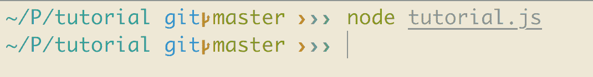

这不会返回任何东西，因为我们还没有为`tutorial.js`编写任何内容。

现在，让我们在`tutorial.js`中添加一些代码：

```js
console.log('Hello World');
```

现在，用以下命令运行文件：

```js
$ node tutorial.js
```

我们将看到一个输出，上面写着`Hello World`。这就是我们在 Node.js 中执行文件的方式。

除了在 V8 引擎上运行并在 Web 浏览器中执行 JavaScript 代码之外，Node.js 还提供了一个服务器运行环境。这是 Node.js 最强大的功能。Node.js 提供了自己的 HTTP 模块，可以实现非阻塞的 HTTP。让我们构建一个简单的 Web 服务器来理解这一点。

在同一个文件中，在`tutorial.js`中，用以下代码覆盖文件：

```js
const http = require('http');

http.createServer(function (req, res) {
 res.writeHead(200, { 'Content-Type': 'text/plain' });
 res.end('Hello World\n');
}).listen(8080, '127.0.0.1');

console.log('Server running at http://127.0.0.1:8080/');
```

在这里，`var http = require('http');`的代码将 HTTP 模块引入了我们的应用程序。这意味着现在我们可以通过`http`变量访问 HTTP 库中定义的函数。现在我们需要创建一个 Web 服务器。前面的代码告诉 Node.js 在 8080 端口运行 Web 服务器。`createServer`方法中的`function`参数接受两个参数，`req`和`res`，它们分别是请求和响应的简写。在该函数内部，我们需要做的第一件事是设置 HTTP 头。这基本上是定义我们希望从该请求中得到的响应类型。然后，我们通过`res.send`定义我们想要在响应中获取的内容。最后，我们要求 Web 服务器监听 8080 端口。

当我们用`$ node tutorial.js`运行这段代码时，输出看起来像这样：

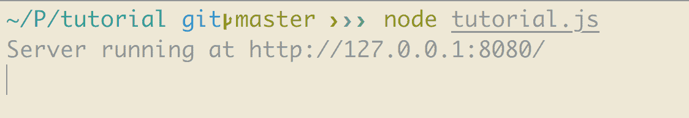

当我们在浏览器中输入该 URL 时，我们应该能够看到这个：

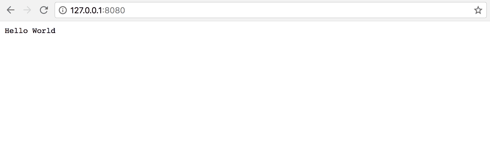

这就是 Node.js 作为服务器程序的工作方式。

要退出`node`控制台，请按两次*Ctrl* *+* *C*。

# Node.js 模块

一个 Node.js 模块只是一个包含可重用代码的普通 JavaScript 文件。每个模块都有其特定的功能。我们可以将其视为一个库。

例如，如果我们想在我们的应用程序中将所有与用户相关的活动分隔开，我们可以为其创建一个模块，该模块将处理有关用户的所有数据库。

我们在 Node.js 中使用模块的方式是通过`require`。我们刚刚展示的创建 Web 服务器的示例也是一个 Node.js 模块。

# Node.js 核心模块

Node.js 有两种类型的模块。核心模块是内置在 Node.js 中的模块。它们在我们安装 Node.js 时就存在了。这些也被称为内置模块。Node.js 中有很多核心模块：

+   调试器

+   文件系统

+   HTTP

+   路径

+   进程

+   事件

如果您想了解每个核心模块的更多细节，可以访问文档：

[`nodejs.org/api/.`](https://nodejs.org/api/)

# 自定义模块

这些是我们在 Node.js 之上自己创建的模块。由于 Node.js 拥有一个非常庞大的生态系统，有大量不同的模块可以根据我们的需求免费获取。我们可以自己构建一个，也可以使用别人的模块。这是 Node.js 强大的另一个方面。它给了我们使用社区模块的灵活性，或者我们可以自己构建它们。

我们可以在[`www.npmjs.com/browse/depended`](https://www.npmjs.com/browse/depended)上查看所有现有可用模块的列表：

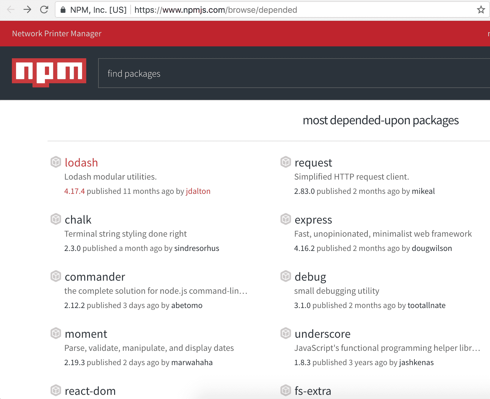

# 介绍 Express.js

Express.js 是一个用于 Node.js 的极简的服务器端 Web 框架。它是建立在 Node.js 之上的，以便轻松管理 Node.js 服务器。Express.js 最重要的优势是它使路由非常非常容易。它提供的强大 API 非常容易配置。它很容易接收来自前端的请求，也很容易连接到数据库。Express.js 也是 Node.js 最流行的 Web 框架。它使用**模型视图控制器**（**MVC**）设计模式，我们将在本章后面讨论。

# 安装 Express.js

我们已经介绍了如何通过`npm`安装`node`模块。同样，我们可以使用以下命令通过 NPM 安装 Express.js：

```js
$ npm install express
```

这是安装`node`模块的一种简单方式。但是，在构建应用程序时，我们将需要许多不同类型的模块。我们还希望在多个应用程序之间共享这些模块。因此，为了使模块全局可用，我们必须全局安装它。为此，`npm`在安装`node`模块时提供了添加`-g`的选项。所以，现在我们可以使用：

```js
$ npm install -g express
```

这将全局安装 Express.js，这允许我们在多个应用程序中使用`express`命令。

# 创建 Express.js 应用程序

现在我们已经安装了 Express.js，让我们开始使用 Express.js 创建应用程序。

我们将把我们的应用程序命名为`express_app`。使用`express`命令非常简单地构建一个 Express 应用程序的大纲。我们可以简单地使用：

```js
$ express express_app
```

输出如下：

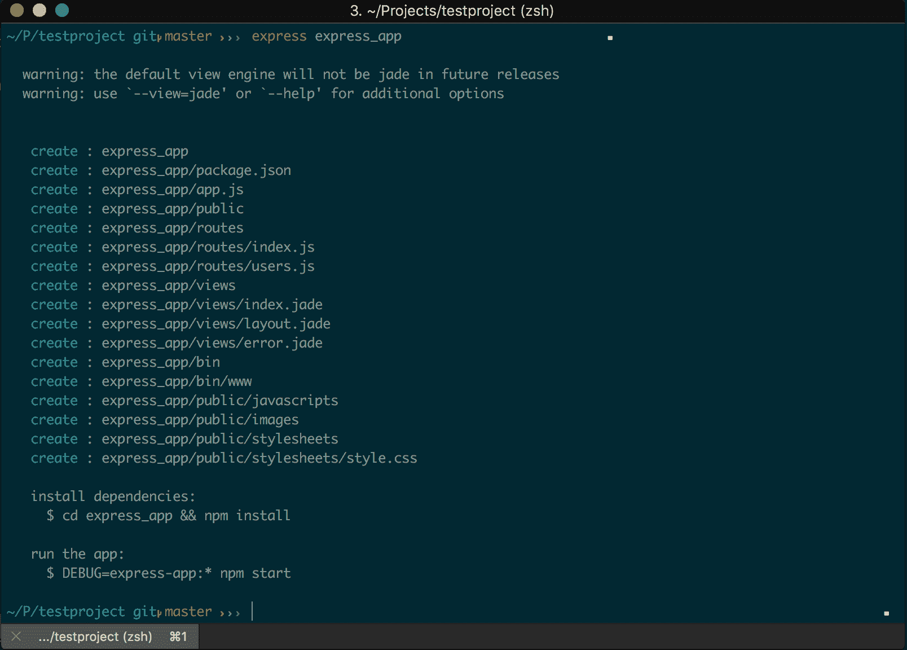

该命令会在我们的应用程序中创建许多文件和文件夹。让我们快速看一下这些：

+   `package.json`：这个文件包含了我们在应用程序中安装的所有`node`包的列表和应用程序的介绍。

+   `app.js`：这个文件是 Express 应用程序的主入口页面。Web 服务器代码驻留在这个文件中。

+   `public`：我们可以使用这个文件夹来插入我们的资产，如图像、样式表或自定义 JavaScript 代码。

+   `views`：这个文件夹包含了所有将在浏览器中呈现的视图文件。它有一个主布局文件（包含视图文件的基本 HTML 模板），一个`index.jade`文件（扩展布局文件，只包含可变或动态的内容），以及一个`error.jade`文件（在需要向前端显示某种错误消息时显示）。

+   `routes`：这个文件夹包含了我们将要构建的访问应用程序不同页面的所有路由的完整列表。我们将在后续章节中更多地讨论这个问题。

+   `bin`：这个文件夹包含了 Node.js 的可执行文件。

所以，这些是我们需要知道的基本事情。现在，使用你喜欢的文本编辑器来处理应用程序，让我们开始吧。现在，如果我们查看`package.json`，会发现有一些包我们没有安装，但在依赖项中列出了：

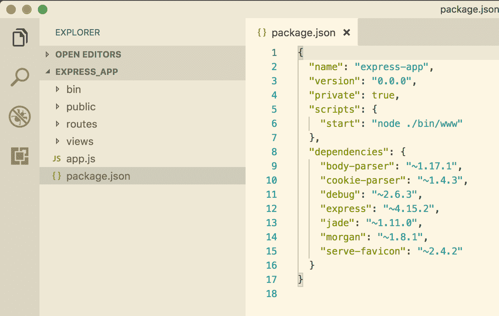

这是因为这些是任何应用程序的 Express.js 依赖项。这意味着，当我们使用`express`命令创建应用程序时，它将自动安装所有需要的依赖项。例如，前面`package.json`文件中列出的依赖项做了以下事情：

+   **body-parser**：用于解析我们在发出 HTTP 请求时提供的 body 参数

+   **debug**：这是一个 JavaScript 实用程序包，可以对`console.log`返回的内容进行漂亮的格式化

我们也可以通过`package.json`文件安装或删除包。只需在`package.json`文件中添加或删除包的名称以安装或删除它。然后运行`$ npm install`。

+   **express**：这是一个 Node.js JavaScript 框架，用于构建可扩展的 Web 应用程序。

+   **jade**：如前所述，这是 Node.js 的默认模板引擎。在使用`express`命令创建应用程序时，应该会看到一个警告，指出默认视图引擎在将来的版本中将不再是 jade。这是因为`jade`将被`pug`取代；`jade`曾经是一家公司拥有的，后来更名为`pug`。

express 生成器使用过时的`jade`模板引擎。要更改模板引擎，请执行以下步骤：

1.  在`package.json`文件中，删除`"jade": "~1.11.0"`一行，并运行：

```js
$ cd express_app
$ npm install
```

1.  现在，要安装新的`pug`模板引擎，请运行：

```js
$ npm install pug --save
```

1.  如果我们查看`package.json`文件，应该会看到类似于以下内容的一行：

`"pug": "².0.0-rc.4"`.

1.  重命名`views`文件夹中的文件：

+   `error.jade` to `error.pug`

+   `index.jade` to `index.pug`

+   `layout.jade` to `layout.pug`

1.  最后，在`app.js`中删除以下行：

```js
app.set('view engine', 'jade');
```

1.  添加以下行以使用`pug`作为视图引擎：

```js
app.set('view engine', 'pug');
```

+   **morgan**：这是用于记录 HTTP 请求的中间件

+   **serve-favicon**：用于在浏览器中显示一个 favicon 以识别我们的应用程序

对于我们的应用程序来说，并不需要所有这些依赖项。它们来自安装 Express.js。只需查找您想要的内容，然后根据应用程序的需要添加或删除包。

现在，我们将保持原样。`express`命令只是将依赖项添加到我们的`package.json`文件中，并为我们的应用程序创建一个框架。为了实际安装`package.json`文件中列出的这些模块和包，我们需要运行：

```js
$ npm install
```

这个命令将实际安装所有的依赖项。现在，如果我们查看文件结构，我们会看到一个名为`node_modules`的新文件夹被添加。这是我们在该应用程序中安装的所有包的所在地。

现在，我们要做的第一件事是设置一个 Web 服务器。为此，在`app.js`文件中添加以下行：

```js
// error handler
app.use(function(err, req, res, next) {
  // set locals, only providing error in development
  res.locals.message = err.message;
  res.locals.error = req.app.get('env') === 'development' ? err : {};

  // render the error page
  res.status(err.status || 500);
  res.render('error');
});

app.listen(3000, function() { console.log('listening on 3000') })

module.exports = app;

```

现在，运行以下命令：

```js
$ node app.js
```

这将启动我们的应用程序服务器。现在，当我们访问`http://localhost:3000/`URL 时，我们应该能够得到这个：


就是这样。我们已经成功创建了一个 Express 应用程序。

# Express 路由器

让我们继续学习 Express 路由器。正如本章前面提到的，Express.js 最重要的一个方面之一是为应用程序提供了简单的路由。路由是应用程序的 URL 的定义。如果我们查看`app.js`，我们会看到类似于以下内容的部分：

```js
...
app.use('/', index);
app.use('/users', users);
...
```

这意味着当我们访问一个网页，并且当请求发送到主页时，express 路由器会将其重定向到一个名为`index`的路由器。现在，查看`routes/index.js`，其中包含以下代码：

```js
var express = require('express');
var router = express.Router();

/* GET home page. */
router.get('/', function(req, res, next) {
  res.render('index', { title: 'Express' });
});

module.exports = router;
```

这意味着当我们访问主页时，它会渲染一个名为`index`的页面，该页面位于`views/index.pug`中，并传递一个`title`参数以在页面上显示。现在，查看`views`文件夹中的`index.pug`文件，其中包含以下代码：

```js
extends layout

block content
  h1= title
  p Welcome to #{title}
```

这意味着它使用了`layout.pug`文件的布局，并显示了一个`h1`标题以及一个渲染我们从路由文件传递的标题的段落。因此，输出如下：

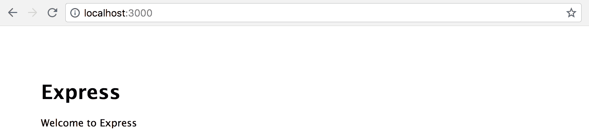

非常简单和直接了当，对吧？

# 请求对象

请求对象是一个包含有关 HTTP 请求信息的对象。请求的属性有：

+   **query: **这包含有关解析查询字符串的信息。通过`req.query`访问。

+   **params: **这包含有关解析路由参数的信息。通过`req.params`访问。

+   **body: **这包含有关解析请求体的信息。通过`req.body`访问。

# 响应对象

在`req`变量上接收到`request`后，`res`对象是我们作为`response`发送回去的东西。

响应的属性包括：

+   **send: **用于向视图发送响应。通过`res.send`访问。它接受两个参数，状态码和响应体。

+   **status: **如果我们想要发送应用程序的成功或失败，使用`res.status`。这是 HTTP 状态码。

+   **redirect: **当我们想要重定向到特定页面而不是以其他格式发送响应时，使用`res.redirect`。

# MVC 介绍

无论使用何种编程语言，构建应用程序时 MVC 模型都是必不可少的。MVC 架构使得组织应用程序的结构和分离逻辑部分和视图部分变得容易。我们可以随时引入这种 MVC 结构，即使我们已经完成了应用程序的一半。最好的实施时间是在任何应用程序开始时。

顾名思义，它有三个部分：

+   **Model: **应用程序的所有业务逻辑都驻留在这些`models`下。它们处理数据库。它们处理应用程序的所有逻辑部分。

+   **View: **浏览器渲染的一切——用户所见的一切——都由这些视图文件处理。它处理我们发送给客户端的任何内容。

+   **Controller: **`Controllers`基本上连接这些`models`和视图。它负责将在`models`中进行的逻辑计算传递到`views`部分：

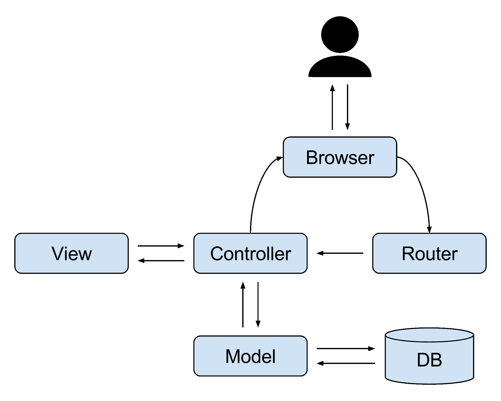

在我们构建的应用程序中，不需要实现 MVC 平台。JavaScript 是一种模式不可知的语言，这意味着我们可以创建自己的文件夹结构。与其他编程语言不同，我们可以选择最适合我们的结构。

# 为什么要使用 MVC？

将 MVC 架构应用到我们的应用程序中时，会增加很多好处：

+   清晰地分离业务逻辑和视图。这种分离允许我们在整个应用程序中重用业务逻辑。

+   开发过程变得更快。这是显而易见的，因为各部分被清晰地分离出来。我们只需将视图添加到我们的视图文件夹中，并在`models`文件夹中添加逻辑。

+   修改现有代码变得容易。当多个开发人员在同一个项目上工作时，这非常方便。任何人都可以从任何地方接手应用程序并开始对其进行更改。

# 改变文件夹结构以包含 MVC

现在我们已经了解了足够多关于 MVC 的知识，让我们修改我们创建的应用程序`express_app`的文件结构。首先，我们需要在根目录中创建这三个文件夹。已经有一个视图文件夹，所以我们可以跳过它。让我们继续创建`models`和`controllers`文件夹。

在我们的`app.js`中，我们需要包含我们的控制器文件。为了做到这一点，我们首先要引入一个叫做文件系统的新包。这个模块使得执行与文件相关的操作变得容易，比如读取/写入文件。

因此，要将这个包添加到我们的应用程序中，运行：

```js
$ npm install file-system --save 
```

当我们只想要将一个`node`模块安装到我们的应用程序中时，使用`--save`参数。此外，在安装后，这个包将自动包含在我们的`package.json`中。

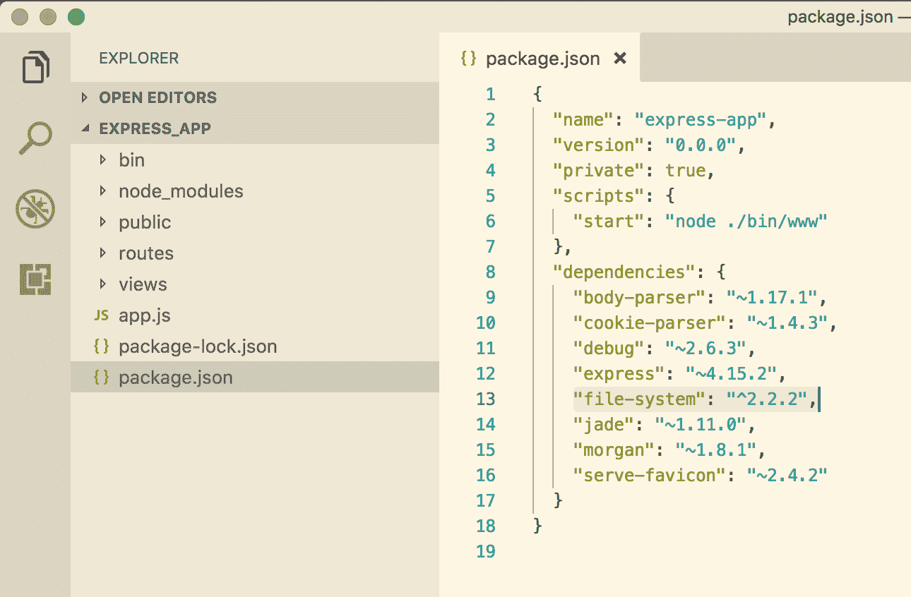

现在，我们需要引入这个模块并使用它来包含控制器中的所有文件。为此，在我们的`app.js`中添加这些代码行。确保在我们的 web 服务器运行代码之前添加这些行：

```js
var index = require('./routes/index');
var users = require('./routes/users');

var app = express();

// Require file system module
var fs = require('file-system');

// Include controllers
fs.readdirSync('controllers').forEach(function (file) {
 if(file.substr(-3) == '.js') {
 const route = require('./controllers/' + file)
 route.controller(app)
 }
})

// view engine setup
app.set('views', path.join(__dirname, 'views'));
app.set('view engine', 'pug');
```

让我们继续添加一个路由到我们的控制器。让我们在应用程序的根目录中创建一个名为`controllers`的文件夹，并在`controllers`文件夹中添加一个名为`index.js`的文件，并粘贴以下代码：

```js
module.exports.controller = (app) => {
 // get homepage
 app.get('/', (req, res) => {
 res.render('index', { title: 'Express' });
 })
}
```

现在，我们所有的路由都将由控制器文件处理，这意味着我们不需要在控制路由的`app.js`中的代码。因此，我们可以从文件中删除这些行：

```js
var index = require('./routes/index');
var users = require('./routes/users');

app.use('/', index);
app.use('/users', users);
```

实际上，我们不再需要`routes`文件夹。让我们也删除`routes`文件夹。

同样，让我们添加一个新的路由来控制所有与用户相关的操作。为此，在`controllers`文件夹中添加一个名为`users.js`的新文件，并在其中粘贴以下代码：

```js
module.exports.controller = (app) => {
 // get users page
 app.get('/users', (req, res) => {
 res.render('index', { title: 'Users' });
 })
}
```

现在，让我们重新启动我们的应用程序的 node 服务器： 

```js
$ node app.js
```

有了这个，当我们访问`http://localhost:3000/users`时，我们将能够看到以下内容：

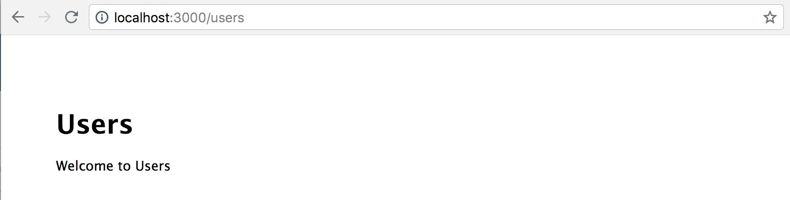

我们已经成功设置了 MVC 架构的`controllers`和`views`部分。我们将在后续章节中更多地涵盖`models`部分。

在上一章中，我们谈到了 GitHub 以及如何使用它来通过进行小的提交来制作代码历史。不要忘记设置一个 repo 并持续将代码推送到 GitHub。

npm 软件包存储在`node_modules`目录中，我们不应该将其推送到 GitHub。为了忽略这些文件，我们可以添加一个名为`.gitignore`的文件，并指定我们不想推送到 GitHub 的文件。

让我们在我们的应用程序中创建一个名为`.gitignore`的文件，并添加以下内容：

```js
node_modules/
```

这样，当我们安装任何软件包时，它不会显示为提交到 GitHub 时的代码差异。

每次我们对代码进行更改时，都必须重新启动我们的`node`服务器，这非常耗时。为了简化这个过程，`node`提供了一个名为`nodemon`的软件包，它会在我们对代码进行更改时自动重新启动服务器。

要安装软件包，请运行：

```js
$ npm install nodemon --save
```

要运行服务器，请使用以下命令：

```js
$ nodemon app.js
```

# 文件命名约定

在开发应用程序时，我们需要遵循一定的命名约定来命名文件。随着应用程序的构建，我们将拥有大量文件，这可能会变得混乱。MVC 允许在不同文件夹中具有并行命名约定，这可能导致不同文件夹中具有相同的文件名。

如果这是我们发现易于维护的方式，我们也可以处理这样的文件名。否则，我们可以只向每个文件附加文件类型，如以下示例中所示；对于处理与用户相关的活动的控制器文件，我们可以将其保留为`controllers/users.js`，或者将其重命名为`controllers/users_controller.js`。我们将在我们的应用程序中使用`controllers/users`。

对于`models`、`services`或任何其他需要在应用程序中不同区域之间共享的文件夹，情况也是如此。对于这个应用程序，我们将使用以下命名约定：

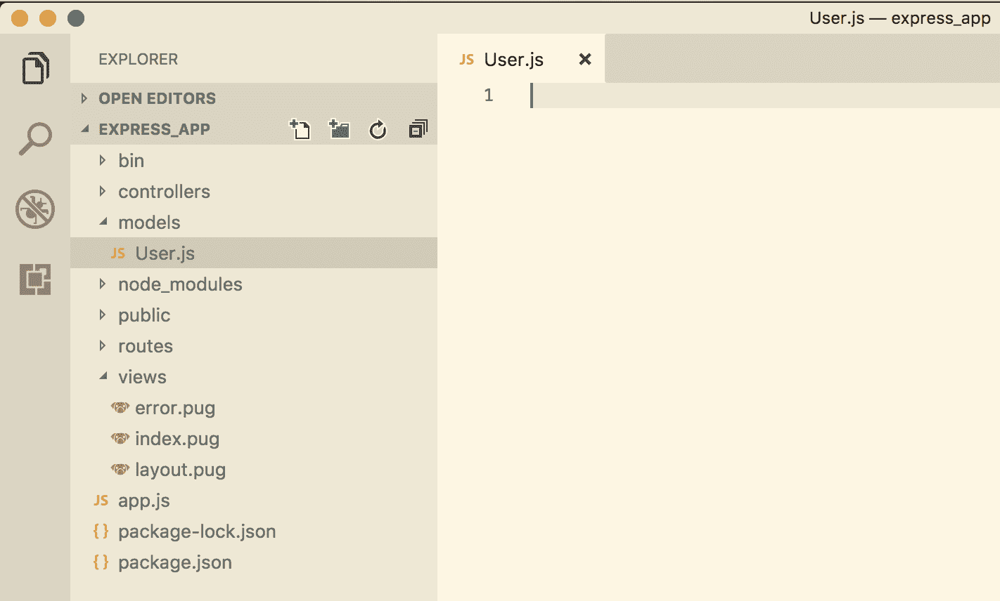

记住，在 Node.js 中没有官方的命名约定。我们绝对可以自定义我们发现更简单的方式。我们将在后续章节中讨论更多关于创建`models`的内容。这将要求我们与 Mongo 建立连接，我们将在后续章节中描述。

# 为 Express.js 应用程序创建视图文件

在上一节中，我们学习了如何创建`controllers`。在本节中，我们将讨论如何添加和自定义视图文件。如果你记得，我们在`controllers/users.js`中有这段代码：

```js
module.exports.controller = (app) => {
  // get users page
  app.get('/users', (req, res) => {
    res.render('index', { title: 'Users' });
  })
}
```

让我们更改渲染`index`文件的一行为：

```js
module.exports.controller = (app) => {
  // get users page
  app.get('/users', (req, res) => {
    res.render('users', { title: 'Users' });
  })
}
```

这意味着控制器想要加载`users`文件，该文件位于`views`文件夹中。让我们继续在`views`文件夹中创建一个`users.pug`文件。

创建文件后，粘贴以下代码；这与我们`views`文件夹中的`index.pug`文件中的代码相同：

```js
extends layout

block content
 h1= title
 p Welcome to #{title}
```

现在，如果我们使用`nodemon`，我们不必重新启动服务器；只需重新加载位置为`http://localhost:3000/users`的浏览器。这应该呈现如下内容：


现在我们知道如何连接`controllers`和`views`以及如何创建视图文件，让我们对文件的代码有更多了解。

第一行说：

```js
extends layout
```

这意味着它要求扩展已经在`layout.pug`文件中的视图。现在，看看`layout.pug`：

```js
doctype html
html
  head
    title= title
    link(rel='stylesheet', href='/stylesheets/style.css')
  body
    block content
```

这是一个简单的 HTML 文件，包括`doctype`，`HTML`，`head`和`body`标签。在`body`标签内，它说要阻止内容，这意味着它会产生在此`block content`语句下编写的任何其他文件的内容。如果我们看`users.jade`，我们可以看到内容是在`block content`语句下编写的。现在，这非常有用，因为我们不必在创建的每个视图文件中重复整个 HTML 标签。

另外，如果我们查看控制器内的`users.js`，会有一行说：

```js
res.render('users', { title: 'Users' });
```

render 方法有两个参数：它想要加载的视图和要传递给该视图的变量。在这个例子中，`Users`被传递给了 title 变量。在`views`文件夹中的`users.jade`中，我们有：

```js
block content
  h1= title
  p Welcome to #{title}
```

这将在`h1`标签和`p`标签内呈现该变量。这样，我们可以从`controllers`传递任何我们想要的内容到视图中。让我们在`users.js`控制器的`render`方法中添加一个名为`description`的新变量：

```js
module.exports.controller = (app) => {
  // get homepage
  app.get('/users', (req, res) => {
    res.render('users', { title: 'Users', description: 'This is the description of all the users' });
  })
}
```

另外，让我们创建一个在`users.pug`中呈现的地方：

```js
extends layout

block content
  h1= title
  p Welcome to #{title}
  p #{description}
```

如果我们重新加载浏览器，我们会得到：

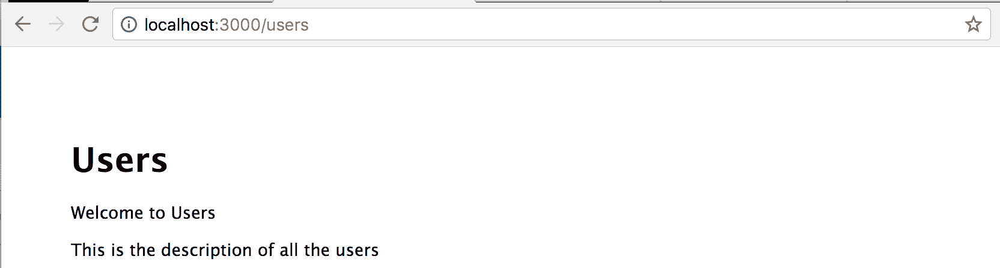

这就是我们为 express 应用程序创建视图的方式。现在，继续根据我们应用程序的需要添加视图。

始终确保将更改提交并推送到 GitHub。提交越小，代码就越易维护。

# 总结

在本章中，我们学习了 Node.js 是什么，Express.js 是什么。我们学习了如何使用 Express.js 创建应用程序，并了解了 MVC 架构。

在下一章中，我们将讨论 MongoDB 及其查询。我们还将讨论使用 Mongoose 进行快速开发以及 Mongoose 查询和验证。
