# 第三章：介绍 MongoDB

MongoDB 的名称来源于 huMONGOus 数据一词，意思是它可以处理大量数据。MongoDB 是一种面向文档的数据库架构。它使我们能够更快地开发和扩展。在关系数据库设计中，我们通过创建表和行来存储数据，但是使用 MongoDB，我们可以将数据建模为 JSON 文档，这与关系数据库相比要简单得多。如果我们灵活并且需求经常变化，并且需要进行持续部署，那么 MongoDB 就是我们的选择。作为基于文档的数据模型，MongoDB 也非常灵活。

使用 MongoDB 的最大优势是数据是非结构化的。我们可以按任何格式自定义我们的数据。在关系数据库管理系统中，我们必须精确定义表可以拥有的字段数量，但是使用 MongoDB，每个文档可以拥有自己的字段数量。我们甚至可以添加新数据，而不必担心更改模式，这就是为什么 Mongo 对数据库采用了**无模式设计模型**。

如果我们的业务增长迅速，我们需要更快地扩展，我们需要以更灵活的方式访问数据，如果我们需要对数据进行更改而不必担心更新应用程序的数据库模式，那么 MongoDB 是我们的最佳选择。在关系数据库管理系统中添加新列也会导致一些性能问题。但是，由于 MongoDB 是无模式的，添加新字段可以立即完成，而不会影响我们应用程序的性能。

在关系数据库中，我们使用的术语是**数据库**、**表**和**行**，而在 MongoDB 中，我们分别使用**数据库**、**集合**和**文档**。

以下是本章节将涵盖的内容的简要总结：

+   介绍 MongoDB 以及使用 MongoDB 的好处

+   理解 MongoDB 数据库、集合和文档

+   介绍 Mongoose，创建与 Mongoose 的连接，理解 Mongoose 以及使用 Mongoose 进行 CRUD 操作

+   使用 Mongoose 添加默认和自定义验证

# 为什么选择 MongoDB？

MongoDB 提供了许多优势，其中一些是：

+   **灵活的文档**：MongoDB 集合包含多个文档。每个集合下的文档可以具有可变的字段名称，也可以具有不同的大小，这意味着我们不必定义模式。

+   **没有复杂的关系**：MongoDB 中的文档存储为 JSON 文档，这意味着我们不再需要费心学习应用程序各个组件之间的关系。

+   **易于扩展**：MongoDB 易于扩展，因为它通过使用一种称为分片的分区方法来最小化数据库大小。分片是一种数据库分区方法，允许我们将大型数据库分隔成较小的部分。

# MongoDB 查询

我们在第一章中快速回顾了 Mongo 查询的外观。在这里，我们将深入研究这些查询。

我们需要做的第一件事是启动 MongoDB 服务器。我们可以使用以下命令来做到这一点：

```js
$ mongod
```

现在，让我们通过在终端中输入`mongo`来打开 mongo shell。当我们进入 mongo shell 时，要显示数据库列表，我们输入`show dbs`。

如果在列表中看到数据库，请输入`use {database_name}`来开始使用该数据库。如果我们还没有创建我们的数据库，只需使用`use {database_name}`就会为我们创建一个数据库。就是这么简单。在这个练习中，让我们创建一个名为`mongo_test_queries`的数据库。为此，我们需要使用：

```js
> use mongo_test_queries
```

这应该在终端中输出以下内容：

```js
# switched to db mongo_test_queries
```

现在，一旦我们进入数据库，我们需要的第一件事是一个集合。我们有一个数据库，但没有集合。在 MongoDB 中创建集合的最佳方法是通过插入文档。这不仅初始化了一个集合，还将文档添加到该集合中。就是这么简单。现在，让我们继续进行 Mongo 查询。

# 创建文档

在 MongoDB 中有不同的查询来创建文档，例如`insertOne()`，`insertMany()`和`insert()`。

# insertOne()

`insertOne()`命令将单个文档添加到我们的集合中。例如：

```js
> db.users.insertOne(
 {
 name: "Brooke",
 email: "brooke@app.com",
 address: 'Kathmandu'
 }
)
```

此命令仅接受一个参数，即对象，我们可以传递我们想要的`users`集合的字段名称和值。当我们在 Mongo shell 中的终端中运行上述代码时，我们应该得到以下输出：

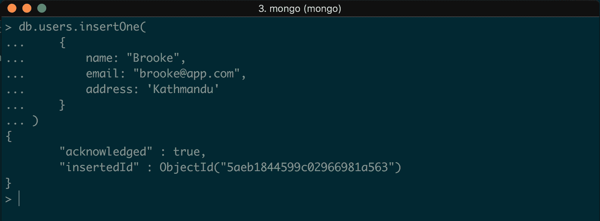

它返回刚刚创建的文档的`_id`。我们已成功在`users`集合中创建了一个集合和一个文档。

`insertOne()`和`insertMany()`命令仅适用于 Mongo 版本 3.2 或更高版本。

# insertMany()

此命令用于将多个文档插入到集合中。在前面的示例中，我们看到`insertOne()`命令接受一个对象作为参数。`insertMany()`命令接受一个数组作为参数，以便我们可以在其中传递多个对象并在集合中插入多个文档。让我们看一个例子：

```js
> db.users.insertMany(
 [
 { name: "Jack", email: "jack@mongo.com" },
 { name: "John", email: "john@mongo.com" },
 { name: "Peter", email: "peter@mongo.com" }
 ]
)
```

此片段在`users`集合中创建了三个文档。当我们运行命令时，输出应该是：

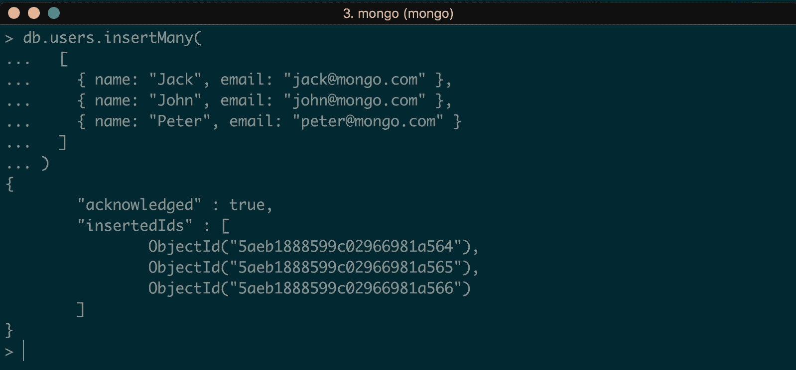

# insert() 

此命令将单个文档以及多个文档插入到集合中。它可以执行`insertOne()`和`insertMany()`命令的工作。要插入单个文档，我们可以使用：

```js
> db.users.insert(
    { name: "Mike", email: "mike@mongo.com" }
)
```

如果命令成功执行，我们应该看到以下输出：

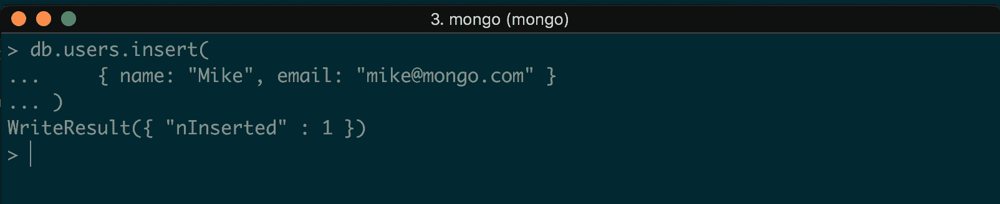

现在，如果我们要插入多个文档，我们可以简单地使用：

```js
> db.users.insert(
  [
    { name: "Josh", email: "josh@mongo.com" },
    { name: "Ross", email: "ross@mongo.com" },
  ]
)
```

输出应该如下：

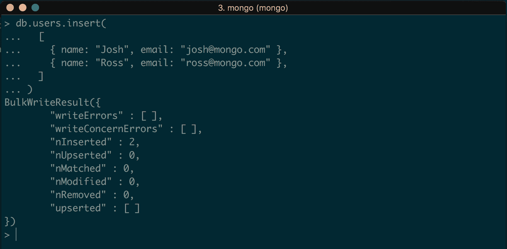

# 检索文档

在 MongoDB 中检索集合中的文档是使用`find()`命令完成的。有许多使用此命令的方法。

# 查找所有文档

要从集合中检索所有文档，我们可以使用：

```js
> db.users.find()
```

我们也可以使用以下内容：

```js
> db.users.find({})
```

这将输出以下内容：

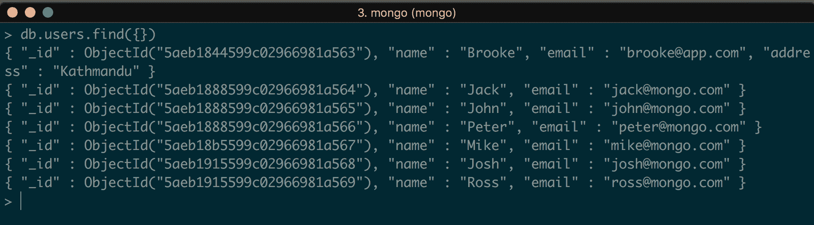

# 通过过滤器查找文档

我们也可以向`find()`命令添加过滤器。让我们检索名称为`Mike`的文档。为此，我们可以使用：

```js
> db.users.find({ name: 'Mike' })
```

它应该返回以下文档：

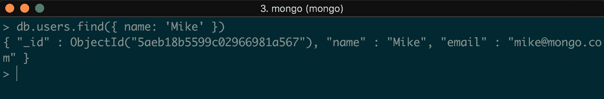

我们还可以使用`AND`或`OR`查询指定多个条件。

要查找名称为`Mike`且电子邮件为`mike@mongo.com`的集合，我们可以简单地使用：

```js
> db.users.find({ name: 'Mike', email: 'mike@mongo.com' })
```

逗号运算符表示`AND`运算符。我们可以使用逗号分隔的值指定尽可能多的条件。前面的命令应该输出：

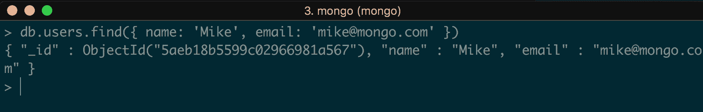

现在，使用`AND`或逗号运算符指定条件很简单。如果要使用 OR 运算符，则应使用：

```js
> db.users.find(
 {
 $or: [ { email: "josh@mongo.com" }, { name: "Mike" } ]
 }
)
```

在这里，我们说：检索那些名称为 Mike 的用户的文档，电子邮件也可以是`josh@mongo.com`。输出如下：

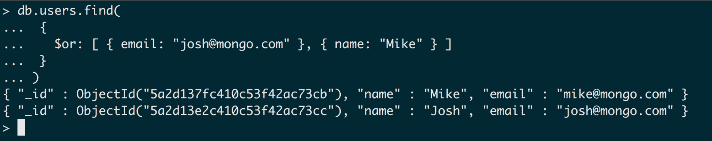

# 更新文档

就像`insert()`一样，在 MongoDB 中使用`update()`命令有三种方法：`updateOne()`，`updateMany()`和`update()`。

# updateOne()

此命令仅在集合中更新单个文档。在这里，我们插入了一对具有不正确电子邮件的用户条目。对于名称为`Peter`的用户，电子邮件是`jack@mongo.com`。让我们使用`updateOne()`更新此文档：

```js
> db.users.updateOne(
 { "name": "Peter" },
 {
 $set: { "email": "peter@mongo.com" }
 }
 )
```

此命令将更新 Peter 的电子邮件为`peter@mongo.com`。输出为：

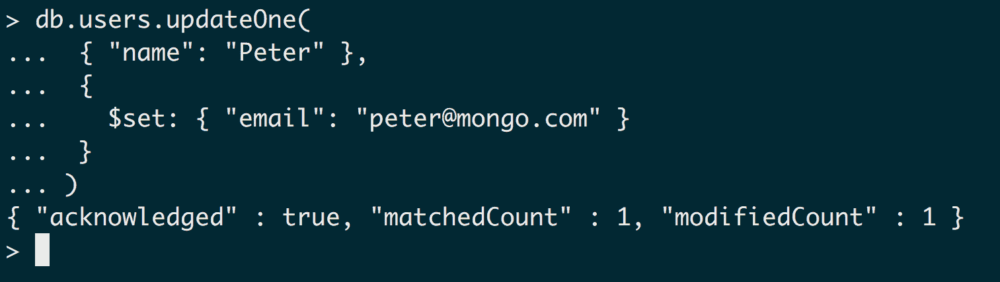

正如输出所说，`modifiedCount`是`1`，`matchedCount`是`1`，这意味着找到并更新了具有给定条件的文档。

# updateMany()

此命令用于更新集合中的多个文档。使用`updateOne()`和`updateMany()`更新文档的命令相同。要更新多条记录，我们指定条件，然后设置所需的值：

```js
> db.users.updateOne(
 { "name": "Peter" },
 {
 $set: { "email": "peter@mongo.com" }
 }
 )
```

`updateOne()`和`updateMany()`之间的唯一区别是，`updateOne()`只更新匹配的第一个文档，而`updateMany()`更新所有匹配的文档。

# update()

就像插入一样，`update()`命令可以为`updateOne()`和`updateMany()`执行任务。为了避免混淆，我们可以使用`update()`命令而不是`updateOne()`和`updateMany()`：

```js
> db.users.update(
 { "name": "John" },
 {
 $set: { "email": "john@mongo.com" }
 }
 )
```

输出如下：

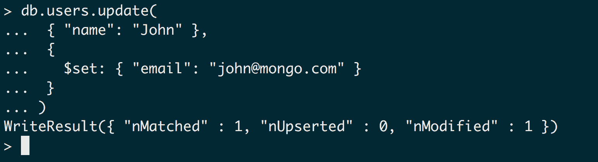

# 删除文档

MongoDB 提供了多个命令来从集合中删除和移除文档。

# deleteOne()

`deleteOne()`只从集合中删除单个文档：

```js
> db.users.deleteOne( { name: "John" } )
```

这将删除名为`John`的用户的条目。输出如下：

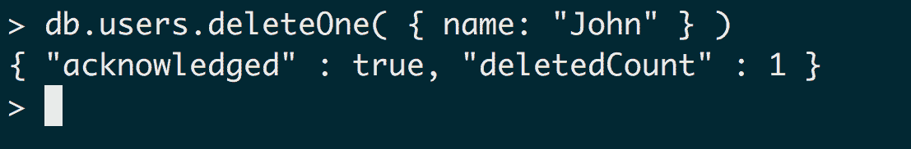

正如您在输出中所看到的，`deletedCount`是`1`，这意味着记录已被删除。

# deleteMany()

`deleteMany()`的命令与`deleteOne()`相同。唯一的区别是，`deleteOne()`只删除与匹配过滤器匹配的单个条目，而`deleteMany()`删除所有符合给定条件的文档：

```js
> db.users.deleteMany( { name: "Jack" } )
```

输出如下：

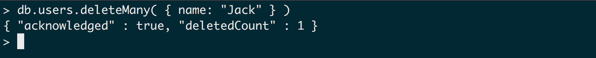

# remove()

`remove()`命令用于从集合中删除单个条目，以及多个条目。如果我们只想删除符合某些条件的单个文档，那么我们可以传递我们希望删除的条目计数。例如，让我们首先创建一个条目：

```js
> db.users.insertOne({ name: 'Mike', email: 'mike@mike.com' })
```

有了这个，现在我们有了两个`Mike`的条目。现在，如果我们想要使用`remove()`来删除一个条目，我们可以这样做：

```js
> db.users.remove({ name: 'Mike' }, 1)
```

输出如下：

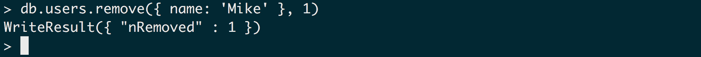

如您所见，我们有两个名为`Mike`的条目，但只删除了一个。同样，如果我们想要删除所有文档，我们可以使用：

```js
> db.users.remove({})
```

所有文档将被删除。

我们谈到了如何在 Mongo 中查询文档的基本思想。要了解更多详细信息，请访问[`docs.mongodb.com/v3.2/tutorial/query-documents/`](https://docs.mongodb.com/v3.2/tutorial/query-documents/)。

# 介绍 Mongoose

Mongoose 是一个优雅的 MongoDB 对象建模库，适用于 Node.js。正如我之前提到的，MongoDB 是一个无模式的数据库设计。虽然这有其优点，但有时我们也需要添加一些验证，这意味着为我们的文档定义模式。Mongoose 提供了一种简单的方法来添加这些验证，并对文档中的字段进行类型转换。

例如，要将数据插入 MongoDB 文档，我们可以使用：

```js
> db.posts.insert({ title : 'test title', description : 'test description'})
```

现在，如果我们想要添加另一个文档，并且我们想在该文档中添加一个额外的字段，我们可以使用：

```js
> db.posts.insert({ title : 'test title', description : 'test description', category: 'News'})
```

这在 MongoDB 中是可能的，因为没有定义模式。构建应用程序时也需要这些类型的文档。MongoDB 将默默接受任何类型的文档。但是，有时我们需要让文档看起来相似，以便在某些验证中表现出特定的数据类型。在这种情况下，Mongoose 就派上用场了。我们也可以利用这些功能与原始的 MongoDB 一起使用，但是在 MongoDB 中编写验证是一项极其痛苦的任务。这就是为什么创建了 Mongoose。

Mongoose 是用 Node.js 编写的 Mongo 的数据建模技术。Mongoose 集合中的每个文档都需要固定数量的字段。我们必须明确定义`Schema`并遵守它。Mongoose 模式的一个示例是：

```js
const UserSchema = new Schema({
 name: String,
 bio: String,
 extras: {}
})
```

这意味着名称和描述字段必须是字符串，而额外的字段可以接受一个完整的 JSON 对象，其中我们还可以存储嵌套值。

# 安装 Mongoose

像任何其他包一样，Mongoose 可以通过 NPM 在我们的项目中安装。在我们的终端中运行以下命令，进入我们在上一章中创建的`express_app`文件夹，以在该应用程序中安装 Mongoose：

```js
$ npm install mongoose --save
```

如果成功安装，我们应该在我们的`package.json`文件中添加一行：

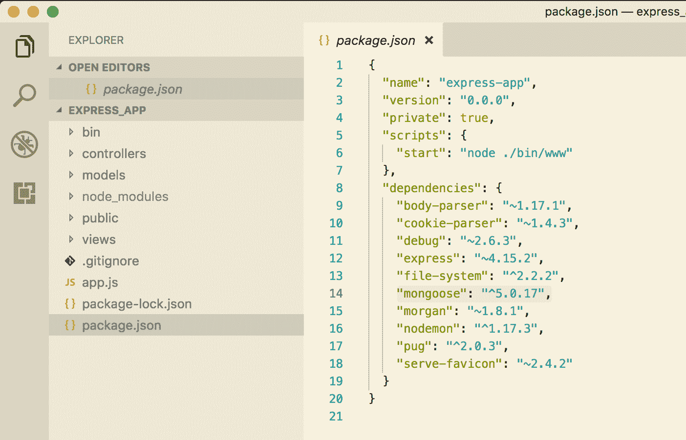

# 将 Mongoose 连接到 MongoDB

安装 Mongoose 后，我们必须将其连接到 MongoDB 才能开始使用它。这在 Mongoose 中非常简单；我们只需在`app.js`文件中添加一行代码来`require` Mongoose，并使用`mongoose.connect`方法将其连接到数据库。让我们继续做这件事。在`app.js`文件中，添加以下代码：

```js
var express = require('express');
var path = require('path');
var favicon = require('serve-favicon');
var logger = require('morgan');
var cookieParser = require('cookie-parser');
var bodyParser = require('body-parser');
var mongoose = require('mongoose');
```

这将把 Mongoose 模块导入到我们的代码库中。

要连接到 MongoDB 数据库，将以下代码添加到我们的`app.js`中：

```js
var express = require('express');
var path = require('path');
var favicon = require('serve-favicon');
var logger = require('morgan');
var cookieParser = require('cookie-parser');
var bodyParser = require('body-parser');
var mongoose = require('mongoose');

var app = express();

//connect to mongodb
mongoose.connect('mongodb://localhost:27017/express_app', function() {
 console.log('Connection has been made');
})
.catch(err => {
 console.error('App starting error:', err.stack);
 process.exit(1);
});

// Require file system module
var fs = require('file-system');
```

这样就创建了与我们的 Mongoose 数据库的连接。现在，让我们用以下命令运行应用程序：

```js
$ nodemon app.js
```

并在我们的终端中显示成功或失败的消息：

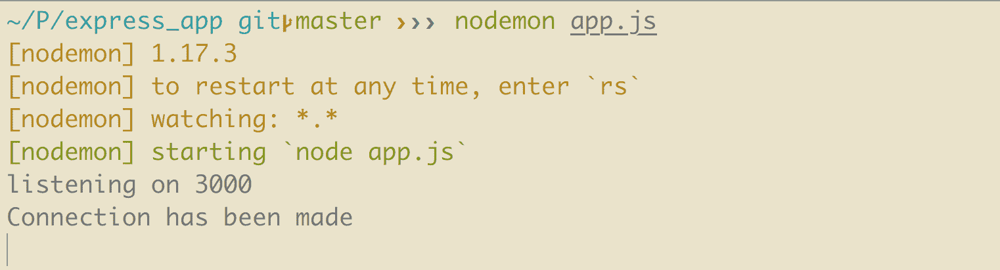

就是这样！我们已经成功地连接到了我们的 MongoDB 数据库。这里的 URL 是本地托管的数据库 URL。

# 在 Mongoose 中创建记录

让我们从在我们应用的`express_app`中创建一个新的模型开始。在项目的根目录下创建一个名为`models`的文件夹，命名为`User.js`。

我们在文件名的开头字母使用大写字母。此外，我们在`models`中使用单数形式。与此相反，在`controllers`中，我们使用复数形式和小写字母，比如`users.js`。

创建文件后，将以下代码粘贴到其中：

```js
const mongoose = require('mongoose');

const Schema = mongoose.Schema;

const UserSchema = new Schema({
 name: String,
 email: String
})

const User = mongoose.model("User", UserSchema)
module.exports = User
```

这里的第一行只是导入了 Mongoose 模块。这个 Mongoose 包为我们提供了几个属性，其中之一是定义`Schema`。现在，这里的原始`Schema`定义是这个高亮部分：

```js
const mongoose = require('mongoose');

const Schema = mongoose.Schema;

const UserSchema = new Schema({
 name: String,
 email: String
})

const User = mongoose.model("User", UserSchema)
module.exports = User
```

这样做的作用是向我们的`User`数据模型添加验证，其中规定总共必须有两个字段。在创建 Mongoose 集合的文档时，它不会接受一个或两个以上的数据字段。此外，它还向这个`Schema`添加了一个验证层，规定这两个字段，即`name`和`email`都应该是有效的字符串。它不会接受整数、布尔值或其他任何非字符串类型的数据。这是我们如何定义`Schema`的方式：

```js
const mongoose = require("mongoose")
const Schema = mongoose.Schema

const UserSchema = new Schema({
  name: String,
  email: String
})

const User = mongoose.model("User", UserSchema)
module.exports = User
```

代码的高亮部分表示创建模型的方式。方法的第一个参数是我们的模型名称，它映射到集合名称的相应复数版本。因此，当我们创建一个`User`模型时，这自动映射到我们数据库中的`user`集合。

现在，要创建一个用户，首先要做的是创建一个资源：

```js
const user_resource = new User({
  name: 'John Doe',
  email: 'john@doe.com'
})
```

现在，最终创建`user`的部分是：

```js
user_resource.save((error) => {
  if(error)
 console.log(error);

  res.send({
    success: true,
    code: 200,
    msg: "User added!"
  })
})
```

上面的代码使用了一个名为`save`的 Mongoose 函数。`save`方法有一个回调函数，用于错误处理。当我们在保存资源到数据库时遇到错误时，我们可以在那里做任何我们想做的事情：

```js
user_resource.save((error) => {
  if(error)
    console.log(error);

  res.send({
 success: true,
 code: 200,
 msg: "User added!"
 })
})
```

`res.send`方法允许我们设置当资源成功保存到数据库时要发送给客户端的内容。对象的第一个元素是`success: true`，表示执行是否成功。第二个元素是状态码或响应码。`200`响应码表示执行成功。我们在后面的章节中也会讨论这个。最后一个元素是发送给客户端的消息；用户在前端看到这个消息。

这就是我们在 Mongoose 中创建资源的方式。

# 从 Mongoose 中获取记录

现在我们已经成功创建了一个用户，在数据库的`users`集合中有一条记录。有两种方法可以在我们的客户端中获取这条记录：获取我们拥有的所有用户的记录，或者获取特定的用户。

# 获取所有记录

Mongoose 模型中有很多方法可以让我们的生活变得更轻松。其中两种方法是`find()`和`findById()`。在 MongoDB 中，我们看到了如何通过原始的 MongoDB 查询检索集合的记录数据。这是类似的，唯一的区别是 Mongoose 有一种非常简单的方法来做到这一点。我建议你先学习 MongoDB 而不是 Mongoose，因为 MongoDB 可以让你对数据库有一个整体的了解，你将学习数据库的基本知识和查询。Mongoose 只是在 MongoDB 的基础上添加了一层，使其看起来更容易进行快速开发。

有了这个，让我们看一下这里的代码片段：

```js
User.find({}, 'name email', function (error, users) {
  if (error) { console.error(error); }
  res.send({
    users: users
  })
})
```

Mongoose 模型`User`调用了一个名为`find()`的方法。第一个参数是我们的查询字符串，在前面的查询中为空：`{}`。因此，如果我们想要检索所有与相同姓名的用户，比如 Peter，那么我们可以将空的`{}`替换为`{ name: 'Peter'}`。

第二个参数表示我们想要从数据库中检索哪些字段。如果我们想要检索所有字段，可以将其留空，或者在这里指定。在这个例子中，我们只检索用户的姓名和电子邮件。

第三个参数附加了一个回调函数。这个函数有两个参数，不像`create`方法。第一个参数处理错误。如果一些原因，执行没有成功完成，它会返回一个错误，我们可以按照我们的意愿进行自定义。第二个参数在这里很重要；当执行成功完成时，它返回响应。在这种情况下，`users`参数是从`users`集合中检索到的对象数组。这个调用的输出将是：

```js
users: [
  {
    name: 'John Doe',
    email: 'john@doe.com'
  }
]
```

现在我们有了`users`集合中的所有记录。

# 获取特定记录

这也和从集合中获取所有记录一样简单。我们在上一节讨论了使用`find()`。要获取单个记录，我们必须使用`findById()`或`findOne()`，或者我们也可以使用`where`查询。`where`查询与我们之前讨论的相同，当我们需要传递参数以获取属于同一类别的记录时。

让我们继续使用以下查询：

```js
User.findById(1, 'name email', function (error, user) {
  if (error) { console.error(error); }
  res.send(user)
}) 
```

正如你所看到的，`find()`和`findById()`的语法是相似的。它们都接受相同数量的参数并且行为相同。这两者之间唯一的区别是，前者`find()`方法返回一个记录数组作为响应，而`findById()`返回一个单一对象。因此，前面查询的响应将是：

```js
{
    name: 'John Doe',
    email 'john@doe.com'
}
```

就是这样 - 简单！

# 在 Mongoose 中更新记录

让我们继续更新集合中的记录。更新集合记录的方法有多种，就像从集合中检索数据一样。在 Mongoose 中更新文档是`read`和`create`(save)方法的组合。要更新文档，我们首先需要使用 Mongoose 的读取查询找到该文档，修改该文档，然后保存更改。

# findById()和 save()

让我们看一个例子如下：

```js
User.findById(1, 'name email', function (error, user) {
  if (error) { console.error(error); }

  user.name = 'Peter'
  user.email = 'peter@gmail.com'
  user.save(function (error) {
    if (error) {
      console.log(error)
    }
    res.send({
      success: true
    })
  })
})
```

所以，我们需要做的第一件事是找到用户文档，我们通过`findById()`来实现。这个方法返回具有给定 ID 的用户。现在我们有了这个用户，我们可以随意更改这个用户的任何内容。在前面的例子中，我们正在更改该人的姓名和电子邮件。

现在重要的部分。更新这个用户文档的工作是由`save()`方法完成的。我们已经通过以下方式更改了用户的姓名和电子邮件：

```js
user.name = 'Peter'
user.email = 'peter@gmail.com'
```

我们直接更改了通过`findById()`返回的对象。现在，当我们使用`user.save()`时，这个方法会用新的姓名和电子邮件覆盖之前的值。

我们可以使用其他方法来更新 Mongoose 中的文档。

# findOneAndUpdate()

当我们想要更新单个条目时，可以使用这种方法。例如：

```js
User.findOneAndUpdate({name: 'Peter'}, { $set: { name: "Sara" } },   function(err){
  if(err){
    console.log(err);
  }
});
```

正如你所看到的，第一个参数定义了描述我们想要更新的记录的条件，这种情况下是名字为 Peter 的用户。第二个参数是我们定义要更新的`user`的属性的对象，由`{ $set: { name: "Sara" }`定义。这将`Peter`的`name`设置为`Sara`。

现在，让我们对上述代码进行一些小的修改：

```js
User.findOneAndUpdate({name: 'Peter'}, { $set: { name: "Sara" } },   function(err, user){
  if(err){
    console.log(err);
  }
  res.send(user);
});
```

在这里，请注意我向回调函数添加了一个名为`user`的第二个参数。这样做的作用是，当 Mongoose 完成对数据库中文档的更新时，它会返回该对象。当我们想要在更新记录后做出一些决定并且想要使用新更新的文档时，这非常有用。

# findByIdAndUpdate()

这与`findOneAndUpdate()`有些相似。这个方法接受一个 ID 作为参数，不像`findOneAndUpdate()`，在那里我们可以添加自己的条件，并更新该文档：

```js
User.findByIdAndUpdate(1, { $set: { name: "Sara" } },   function(err){
  if(err){
    console.log(err);
  }
});
```

这里唯一的区别是第一个参数接受一个单一的整数值，即文档的 ID，而不是一个对象。这个方法也返回正在更新的对象。所以我们可以使用：

```js
User.findByIdAndUpdate(1, { $set: { name: "Sara" } }, function(err){
  if(err, user){
    console.log(err);
  }
 res.send(user);
});
```

# 在 Mongoose 中删除记录

就像在 Mongoose 中有许多方法来创建、获取和更新记录一样，它也提供了几种方法来从集合中删除记录，比如`remove()`、`findOneAndRemove()`和`findByIdAndRemove()`。我们可以使用`remove()`来删除一个或多个文档。我们也可以先找到我们想要删除的文档，然后使用`remove()`命令只删除这些文档。如果我们想要根据一些条件找到特定的文档，我们可以使用`findOneAndRemove()`。当我们知道要删除的文档的 ID 时，我们可以使用`findByIdAndRemove()`。

# remove()

让我们看一个使用这种方法的示例：

```js
User.remove({
  _id: 1
}, function(err){
  if (err)
    res.send(err)
  res.send({
    success: true
  })
})
```

`remove()`方法的第一个参数是过滤我们想要删除的用户的条件。它接受一个 ID 作为参数。它找到具有给定 ID 的用户并从集合中删除文档。第二个参数是我们之前讨论过的回调函数。如果上述操作出现问题，它会返回一个错误，我们可以用来更好地处理应用程序中发生的异常或错误。在成功的情况下，我们可以定义自己的逻辑来返回什么。在上述情况下，我们返回`{ success: true }`。

# findOneAndRemove

`findOneAndRemove()`的行为方式与`remove()`相同，并且需要相同数量的参数：

```js
User.findOneAndRemove({
  _id: 1
}, function(err){
  if (err)
    res.send(err)
  res.send({
    success: true
  })
})
```

我们只需要定义要删除的文档的条件。

现在，我们也可以修改上述代码：

```js
User.findOneAndRemove({
  _id: 1
}, function(err, user){
  if (err)
    res.send(err)
  res.send({
    success: true,
    user: user
  })
})
```

在这里，我突出显示了添加的代码片段。我们还可以将第二个参数传递给回调函数，该回调函数返回被删除的`user`对象。如果我们想要向前端显示某个消息并添加一些用户属性，比如`user`的`name`或`email`，那么这将非常有用。例如，如果我们想要在前端显示一个消息，说用户{name}已被删除。然后我们可以传递`user`或`user`的其他属性；在这种情况下，它是要在前端显示的名字。

`remove()`和`findOneAndRemove()`之间的主要区别是`remove()`不返回被删除的文档，但`findOneAndRemove()`会。现在我们知道何时使用这两种方法了。

# findByIdAndRemove()

这与`findOneAndRemove()`相同，只是这总是需要一个`id`作为参数传递：

```js
User.findByIdAndRemove(1, function(err){
  if (err)
    res.send(err)
  res.send({
    success: true
  })
})
```

你在`findOneAndRemove()`和前面的`findByIdAndRemove()`的代码之间找到了什么不同吗？如果我们看一下这个方法的第一个参数，它只接受一个简单的整数值，即文档 ID。现在，如果我们看一下前面的`findOneAndRemove()`代码，我们会注意到我们在第一个参数中传递了一个对象。这是因为对于`findOneAndRemove()`，我们可以传递除 ID 之外的不同参数。例如，我们还可以在`findOneAndRemove()`的参数中传递`{ name: 'Anita' }`。但是对于`findByIdAndRemove()`，从方法名称显而易见，我们不需要传递一个对象，而只需要一个表示文档 ID 的整数。

它在参数中查找具有指定 ID 的文档，并从集合中删除该文档。与`findOneAndRemove()`一样，它也返回被删除的文档。

# 使用 Mongoose 添加验证

Mongoose 中的验证是在模式级别定义的。验证可以在字符串和数字中设置。Mongoose 为字符串和数字提供了内置的验证技术。此外，我们也可以根据需要自定义这些验证。由于验证是在模式中定义的，因此当我们对任何文档执行`save()`方法时，它们会被触发。如果我们只想测试这些验证，我们也可以通过`{doc}.validate()`方法执行验证方法。

`validate()`也是中间件，这意味着当我们以异步方式执行某些方法时，它具有控制权。

# 默认验证

让我们谈谈 Mongoose 提供给我们的一些默认验证。这些也被称为内置验证器。

# required()

`required()`验证器检查我们在其上添加了此验证的字段是否有一些值。以前，在`User`模型中，我们有这样的代码：

```js
var mongoose = require("mongoose");
var Schema = mongoose.Schema;

var UserSchema = new Schema({
  name: String,
  email: String
});

var User = mongoose.model("User", UserSchema);
module.exports = User;
```

这段代码也与用户的字段相关联了验证。它要求用户的姓名和电子邮件必须是字符串，而不是数字、布尔值或其他任何东西。但是这段代码并不确保用户的姓名和电子邮件字段已设置。

因此，如果我们想添加`required()`验证，代码应该修改为这样：

```js
var mongoose = require("mongoose");
var Schema = mongoose.Schema;

var UserSchema = new Schema({
  name: {
 required: true
 },
  email: {
 required: true
 }
});

var User = mongoose.model("User", UserSchema);
module.exports = User;
```

如您所见，我们已将 name 键的值更改为对象，而不仅仅是一个字符串。在这里，我们可以添加任意多的验证。因此，添加的验证`required: true`在将该文档保存到集合之前检查用户的姓名和电子邮件是否设置了某些值。如果验证未满足，它将返回错误。

当验证返回错误时，我们还可以传递消息。例如：

```js
var mongoose = require("mongoose");
var Schema = mongoose.Schema;

var UserSchema = new Schema({
  name: {
 required: [true, 'Let us know you by adding your name!']
 },
  email: {
 required: [true, 'Please add your email as well.']
 }
});

var User = mongoose.model("User", UserSchema);
module.exports = User;
```

通过这种方式，我们还可以根据需要自定义消息。很酷，对吧？

# 类型验证

类型验证方法定义了文档中字段的类型。类型的不同变体可以是`String`、`boolean`和`number`。

# 字符串

字符串本身有几个验证器，如`enum`、`match`、`maxlength`和`minlength`。

`maxlength`和`minlength`定义了字符串的长度。

# 数字

数字有两个验证器：`min`和`max`。`min`和`max`的值定义了集合中字段的值范围。

# 自定义验证

如果默认的内置验证不够用，我们还可以添加自定义验证。我们可以传递一个`validate`函数，并在该函数中编写我们的自定义代码。让我们看一个例子：

```js
var userSchema = new Schema({
  phone: {
    type: String,
    validate: {
 validator: function(v) {
 return /\d{3}-\d{3}-\d{4}/.test(v);
 },
 message: '{VALUE} is not a valid phone number!'
 }
  }
});
```

在这里，我们向`Schema`传递了一个`validate`方法。它接受一个验证函数，我们可以在其中添加自己的验证代码。前面的方法检查用户的电话号码字段是否符合正确的格式。如果未通过验证，则显示消息`{value} is not a valid phone number`。

我们还可以在 Mongoose 中添加嵌套验证：例如，如果我们的用户集合中的名称保存为`{ name: { first_name: 'Anita', last_name: 'Sharma' } }`，我们将需要为`first_name`和`last_name`都添加验证。为了做到这一点，我们可以使用：

```js
var nameSchema = new Schema({
  first_name: String,
  last_name: String
});

userSchema = new Schema({
  name: {
    type: nameSchema,
    required: true
  }
});
```

首先，我们为低级对象定义`Schema`，即`first_name`和`last_name`。然后，对于`userSchema`，我们将`nameSchema`传递给名称字段。

请记住，我们不能像这样在单个`Schema`中添加嵌套验证：

```js
var nameSchema = new Schema({
  first_name: String,
  last_name: String
});

personSchema = new Schema({
  name: {
    type: {
      first_name: String,
      last_name: String
    },
    required: true
  }
});
```

您可以在这里查看 Mongoose 验证：[`mongoosejs.com/docs/validation.html`](http://mongoosejs.com/docs/validation.html)。

# 总结

在本章中，我们介绍了关于 MongoDB 及其优势的基本信息，如何在 MongoDB 中进行 CRUD 操作和查询，以及 Mongoose 中的基本验证。

在接下来的章节中，我们将更多地讨论关于 REST API 和我们应用程序中的 RESTful 架构设计。
