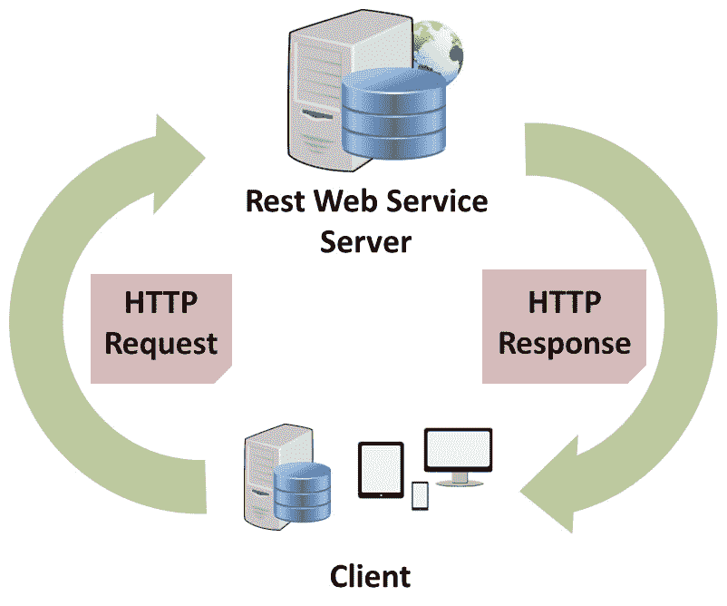
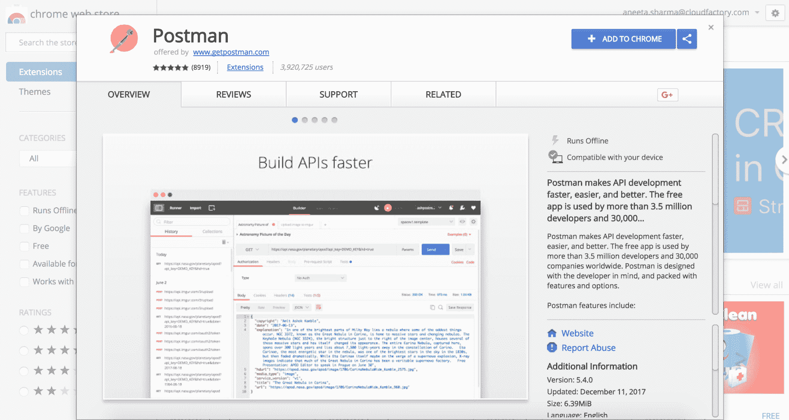
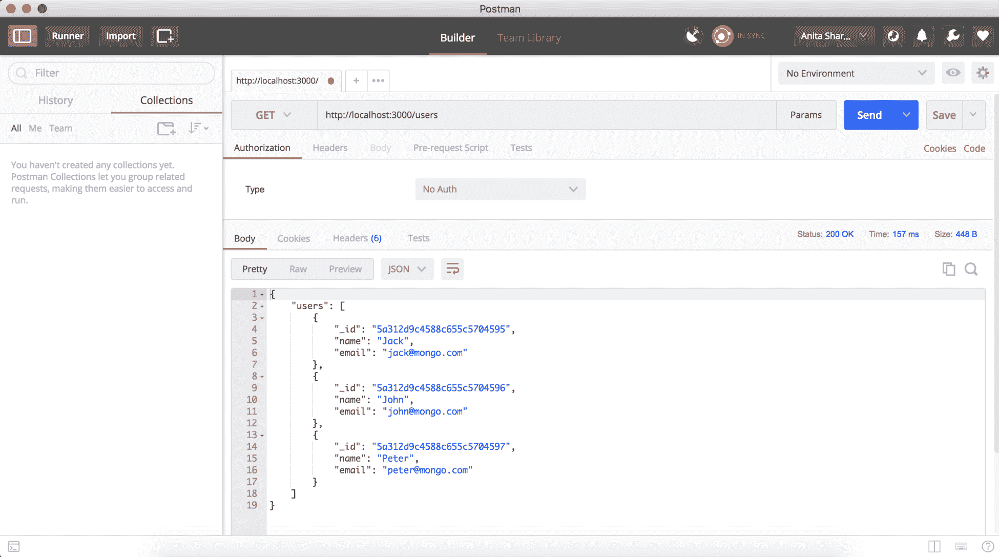
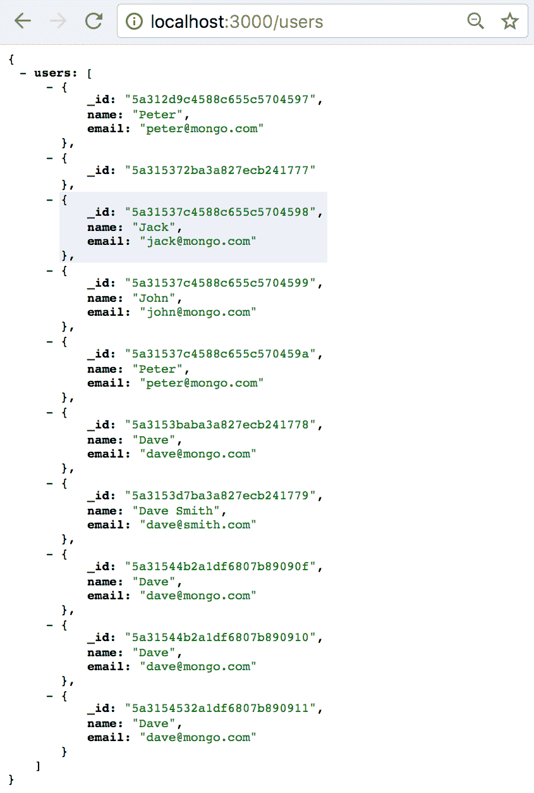
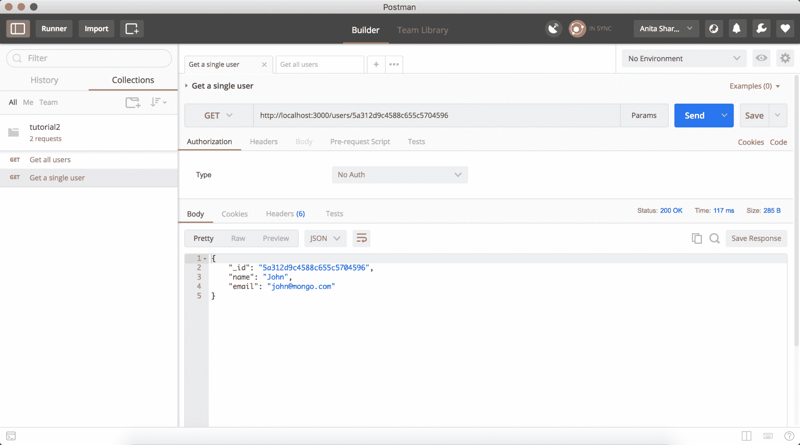
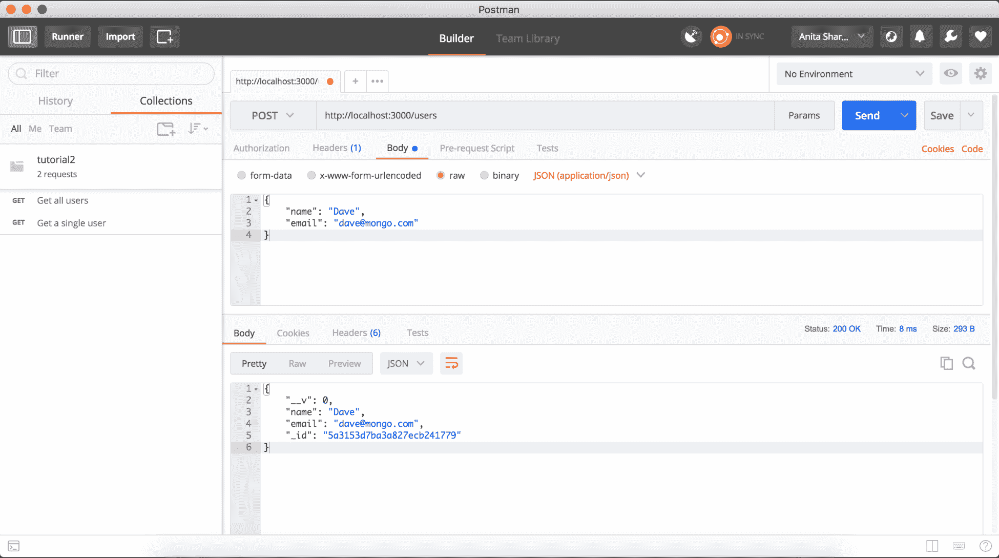
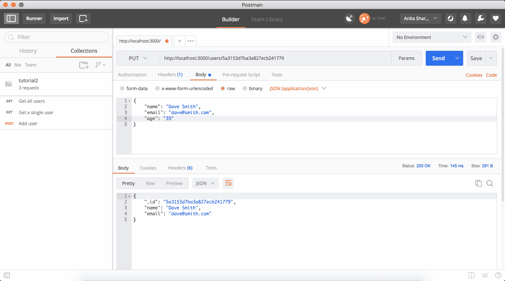
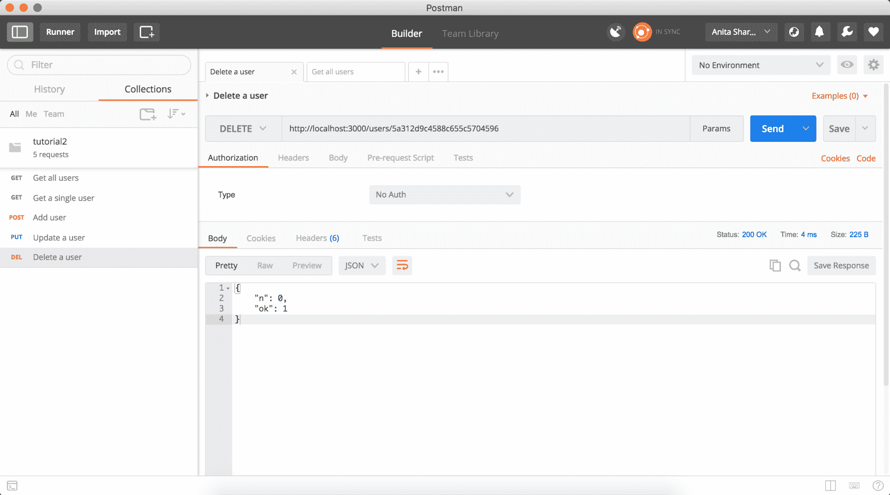

# 第四章：介绍 REST API

**应用程序编程接口**（**API**）通常用于从一个应用程序获取数据到另一个应用程序。有不同类型的 API 用于不同领域，比如硬件和编程，但我们只会讨论 Web API。Web API 是一种提供接口以在多个应用程序之间通信的 Web 服务形式。通过这些 API，一个应用程序的数据通过 HTTP 协议发送到另一个应用程序。

在本章中，我们将讨论：

+   REST 架构和 RESTful API

+   HTTP 动词和状态码

+   使用 Postman 开发和测试 API

Web API 的工作方式与浏览器与我们的应用服务器交互的方式类似。客户端从服务器请求一些数据，服务器以格式化的数据回应客户端；API 也是类似的。例如，多个应用程序之间事先设定了一个合同。因此，如果有两个应用程序需要共享数据，那么一个应用程序将向另一个应用程序提交请求，表示它需要以这种格式获取这些数据。当另一个应用程序收到请求时，它从服务器获取数据，并以结构化和格式化的数据回应客户端或请求者。

Web API 被分类为**简单对象访问协议**（**SOAP**）、**远程过程调用**（**RPC**）或**表述状态转移**（**REST**）类别。这些 API 的响应格式可以是各种形式，如 XML、JSON、HTML、图像和视频。

API 还有不同的模型，如公共 API 和私有 API：

+   **私有 API**：私有或内部 API 仅在组织内部的应用程序中使用

+   **公共 API**：公共或外部 API 设计成可以与组织外的公众方分享

# REST 是什么？

REST 是一种通过 HTTP 协议在多个应用程序之间交换数据的 Web 服务。RESTful Web 服务具有可扩展性和易维护性。

这是一个简单的图表，解释了 REST Web 服务的工作原理：



正如我们在图表中所看到的，客户端通过调用 Rest Web 服务服务器来请求一些数据。在这里，当我们发送 HTTP 请求时，我们还提供一些头部信息，比如我们希望作为响应返回的数据类型。这些响应可以是 JSON、XML、HTML 或任何其他形式。当服务器接收到请求并从存储中提取数据时，它不仅仅是将数据库资源作为响应返回。它发送这些资源的表示。这就是为什么它被称为**表现**。当服务器用这种格式化的数据回应客户端时，我们的应用程序的状态会发生变化。这就是为什么它被称为**状态转移**。

# 介绍 REST API

REST API 采用 RESTful 架构设计。根据 RESTful 架构原则构建的 API 称为 RESTful API。RESTful 架构也被称为**无状态架构**，因为客户端和服务器之间的连接不会被保留。在客户端和服务器之间的每次交易之后，连接都会被重置。

由于存在多个 Web 服务，我们必须能够选择我们的需求和需求，以便为我们的应用程序构建完美的 API。SOAP 和 REST 协议都有一些优点和局限性。

SOAP 协议是由 Dave Winer 于 1998 年设计的。它使用**可扩展标记语言**（**XML**）进行数据交换。在开发时选择使用 SOAP 还是 REST 取决于我们选择的编程语言以及应用程序的需求。

REST API 允许我们在 JSON/XML 数据格式之间进行通信。JSON/XML 是易于格式化和人类可读的数据表示。通过 RESTful API，我们可以从一个应用程序执行**创建**、**读取**、**更新**和**删除**（**C****RUD**）操作到另一个应用程序。

# REST API 的好处

REST API 提供了许多好处。以下是使用 REST API 可以获得的一些优势：

+   很容易从一个应用程序向另一个应用程序发出请求并获取响应。

+   响应可以以 JSON 或 XML 的形式以人类可读的格式检索。

+   所有内容都以 URI 的形式进行操作，这意味着每个请求都由 URI 请求标识。

+   客户端和服务器之间的分离使得在需要时轻松迁移到不同的服务器，并且只需进行最小的更改。客户端和服务器之间的分离也使得扩展变得容易。

+   它不依赖于任何编程语言。无论我们使用 PHP、JAVA、Rails、Node.js 等，都可以实现 REST 架构。

+   很容易上手，学习曲线很短。

# HTTP 动词

HTTP 动词是用于定义我们要对资源执行的操作的不同方法。最常用的 HTTP 动词是 GET、POST、PUT、PATCH 和 DELETE。HTTP 动词是请求方法，可以实现多个应用程序之间的通信。这些 HTTP 动词使得可以在不需要完全更改 URL 的情况下对资源执行多个操作。让我们更详细地了解每一个。

# GET

`GET`请求是幂等请求。当我们要获取有关资源的信息时使用。这不会修改或删除资源。`GET`请求的等效 CRUD 操作是`READ`，这意味着它只获取信息，仅此而已。`GET`请求的示例 URL 如下：

+   获取所有记录：

```js
GET http://www.example.com/users
```

+   获取有关单个用户的信息：

```js
GET http://www.example.com/users/{user_id}
```

# POST

`POST`请求的等效 CRUD 操作是`CREATE`。这用于向集合中添加新记录。由于这会改变服务器的状态，因此这不是幂等请求。如果我们使用相同的参数两次请求`POST`方法，那么将在数据库中创建两个相同的新资源。`POST`请求的示例 URL 如下：

```js
POST http://www.example.com/users/
```

# PUT

`PUT`请求用于创建或更新记录。如果资源尚不存在，则创建新记录，如果资源已经存在，则更新现有记录。等效的 CRUD 操作是`update()`。它替换了资源的现有表示。`PUT`请求的示例 URL 如下：

```js
PUT http://www.example.com/users/
```

# DELETE

这用于从集合中删除资源。等效的 CRUD 操作是`delete()`。

`DELETE`请求的示例 URL 如下：

```js
DELETE http://www.example.com/users/{user_id}
```

# HTTP 状态代码

状态代码是服务器对向其发出的请求所做出的响应的一部分。它指示请求的状态，无论其是否成功执行。状态代码有三位数。第一位数表示该响应的类别或类别。HTTP 状态代码范围从*100-500*。我们将在本节中介绍一些主要的状态代码。

# 2XX 代码

200 范围状态代码是 API 中任何请求的成功范围。在 200 范围内，有许多代表不同形式成功的代码。这里解释了一些可用的状态代码：

+   **200 OK**：这个响应是标准的。这只是请求成功的表示。此状态代码还返回执行请求的资源。

+   **201 Created**：表示成功创建资源。

+   **204 No Content**：此状态代码成功执行请求，但不返回任何内容。

# 4XX 代码

当客户端出现错误时，会出现 400 范围状态代码：

+   **400 错误请求**：当请求参数格式不正确，或者语法错误时，服务器会返回 400 状态代码。

+   **401 未经授权**：当未经授权的一方尝试发送 API 请求时，返回此状态代码。这基本上检查了认证部分。

+   **403 Forbidden**：这与 401 相似。这检查执行 API 请求的一方的授权。当执行 API 的不同用户有不同的权限设置时，就会执行这个操作。

+   **404 未找到**：当服务器在数据库中找不到我们要执行某些操作的资源时，返回此状态。

# 5XX 代码

500 范围的状态代码告诉我们，在给定资源中执行的操作出现了问题：

+   **500 内部服务器错误**：当操作未成功执行时，显示此状态代码。与 200 状态代码一样，当服务器出现问题时，服务器会返回这个通用代码。

+   **503 服务不可用**：当我们的服务器没有运行时，显示此状态代码。

+   **504 网关超时**：这表示请求已发送到服务器，但在给定时间内没有收到任何响应。

# 介绍 Postman

Postman 是一个工具，让我们能够更快地开发和测试我们的 API。这个工具提供了一个 GUI，可以让我们更快地调整我们的 API，从而减少了 API 的开发时间。我们还可以通过创建所有我们开发的 API 的集合来保持历史记录。

Postman 也有不同的替代品，如 Runscope 和 Paw。我们将在这本书中使用 Postman。

# 安装 Postman

有不同的使用 Postman 的方法：

1.  我们可以通过以下方式获取 Chrome 扩展程序：如果您访问[`chrome.google.com/webstore/detail/postman/fhbjgbiflinjbdggehcddcbncdddomop?hl=en`](https://chrome.google.com/webstore/detail/postman/fhbjgbiflinjbdggehcddcbncdddomop?hl=en)，我们将看到以下内容：



点击“添加到 Chrome”按钮，扩展将被安装。

1.  我们可以通过以下方式为我们的操作系统下载正确的桌面应用程序

[`www.getpostman.com/`](https://www.getpostman.com/)。

我们已经为这本书使用了桌面应用程序。

# 使用 Postman 测试 API

首先，让我们快速回顾一下我们到目前为止所做的事情。在我们正在构建的应用程序中，`app.js`文件应该包含以下代码：

```js
var express = require('express');
var path = require('path');
var favicon = require('serve-favicon');
var logger = require('morgan');
var cookieParser = require('cookie-parser');
var bodyParser = require('body-parser');
var fs = require('file-system');
var mongoose = require('mongoose');

var app = express();
var mongoose = require('mongoose');
mongoose.connect('mongodb://localhost:27017/tutorial2', {
  useMongoClient: true
});
var db = mongoose.connection;
db.on("error", console.error.bind(console, "connection error"));
db.once("open", function(callback){
  console.log("Connection Succeeded");
});

// view engine setup
app.set('views', path.join(__dirname, 'views'));
app.set('view engine', 'pug');

// uncomment after placing our favicon in /public
//app.use(favicon(path.join(__dirname, 'public', 'favicon.ico')));
app.use(logger('dev'));
app.use(bodyParser.json());
app.use(bodyParser.urlencoded({ extended: false }));
app.use(cookieParser());
app.use(express.static(path.join(__dirname, 'public')));

// Include controllers
fs.readdirSync("controllers").forEach(function (file) {
  if(file.substr(-3) == ".js") {
    const route = require("./controllers/" + file)
    route.controller(app)
  }
})

// catch 404 and forward to error handler
app.use(function(req, res, next) {
  var err = new Error('Not Found');
  err.status = 404;
  next(err);
});

// error handler
app.use(function(err, req, res, next) {
  // set locals, only providing error in development
  res.locals.message = err.message;
  res.locals.error = req.app.get('env') === 'development' ? err : {};

  // render the error page
  res.status(err.status || 500);
  res.render('error');
});

module.exports = app;

app.listen(3000, function() {
  console.log('listening on 3000')
})
```

由于此文件是通过命令行 CLI 构建应用程序时自动生成的，因此它使用了 typescript 语法。如果我们想使用 ES 6 语法，我们可以用`const`替换`var`。

在我们的`models/User.js`中，我们有以下内容：

```js
const mongoose = require("mongoose")
const Schema = mongoose.Schema
const UserSchema = new Schema({
 name: String,
 email: String
})

const User = mongoose.model("User", UserSchema)
module.exports = User
```

另外，在`controllers/users.js`中，我们有以下内容：

```js
module.exports.controller = (app) => {
  // get homepage
  app.get('/users', (req, res) => {
    res.render('index', { title: 'Users' });
  })
}
```

# 在用户控制器中添加一个 GET 端点

让我们在`controllers/users.js`中添加一个路由，它将从数据库中获取所有用户的记录。

目前，在我们的`users`控制器中的代码，当我们访问`http://localhost:3000/users`时，它只返回一个标题，`Users`。让我们修改这段代码，以包含一个`GET`请求来获取所有用户请求。

# 获取所有用户

首先，使用`$ nodemon app.js`启动服务器。现在，在`controllers/users.js`中：

```js
var User = require("../models/User");

module.exports.controller = (app) => {
  // get all users
  app.get('/users', (req, res) => {
    User.find({}, 'name email', function (error, users) {
      if (error) { console.log(error); }
      res.send(users);
    })
  })
}
```

现在我们已经有了我们的代码，让我们使用 Postman 应用程序测试这个端点。在 Postman 应用程序中，添加 URL 中的必要细节。当我们点击发送按钮时，我们应该看到以下响应：



`_id`是用户的 Mongo ID，默认情况下由 Mongoose 查询发送，我们正在获取用户的名称和电子邮件。如果我们只想要名称，我们可以在`users`控制器中更改我们的查询，只获取名称。

Postman 让我们可以编辑端点和请求，易于开发。如果我们想要使用我们自己的本地浏览器进行测试，我们也可以这样做。

我使用了一个名为 JSONview 的 Chrome 插件来格式化 JSON 响应。您可以从这里获取插件：

[`chrome.google.com/webstore/detail/jsonview/chklaanhfefbnpoihckbnefhakgolnmc`](https://chrome.google.com/webstore/detail/jsonview/chklaanhfefbnpoihckbnefhakgolnmc)。

如我之前提到的，如果我们访问`http://localhost:3000/users`，我们应该能够看到类似以下内容的东西：



我们可以使用 Postman 提供的`save`查询功能来在将来运行这些查询。只需点击应用程序右上角的保存按钮，并随着我们的进展创建新的查询。

# 获取单个用户

如 HTTP 动词部分所述，要从集合中获取单个记录，我们必须在参数中传递用户的 id 以获取用户详细信息。从前面的 Postman 响应示例中，让我们选择一个 id 并使用它来获取用户的记录。首先，让我们在控制器中添加端点。在`controllers/users.js`中，添加以下代码：

```js
var User = require("../models/User");

module.exports.controller = (app) => {
  // get all users
  app.get('/users', (req, res) => {
    User.find({}, 'name email', function (error, users) {
      if (error) { console.log(error); }
       res.send({
        users: users
      })
    })
  })

  //get a single user details
 app.get('/users/:id', (req, res) => {
 User.findById(req.params.id, 'name email', function (error, user) {
 if (error) { console.log(error); }
 res.send(user)
 })
 })
}
```

现在在 Postman 中创建一个新的查询，具有以下参数。我们将创建一个`GET`请求，URL 为`http://localhost:3000/users/:user_id`，其中`user_id`是您在数据库中创建的任何用户的`id`。通过这个设置，我们应该能够看到类似这样的东西：



查询应该返回具有 URL 中给定 ID 的用户的详细信息。

# 在用户控制器中添加一个 POST 端点

让我们看一个例子。让我们创建一个 API，该 API 将使用 MongoDB 的`insert()`命令将用户资源保存到数据库中。在用户控制器中，添加一个新的端点：

```js
// add a new user
  app.post('/users', (req, res) => {
    const user = new User({
      name: req.body.name,
      email: req.body.email
    })

    user.save(function (error, user) {
      if (error) { console.log(error); }
      res.send(user)
    })
  })
```

在 Postman 中，将方法设置为`POST`，URL 设置为`http://localhost:3000/users`，将参数设置为原始 JSON，并提供以下输入：

```js
{
 "name": "Dave",
 "email": "dave@mongo.com"
}
```



与`GET`请求不同，我们必须在`body`参数中传递要添加的用户的名称和电子邮件。现在，如果我们运行一个`GET all users`查询，我们应该能够看到这个新用户。如果我们使用相同的参数运行`POST`请求两次，那么它将创建两个不同的资源。

# 在用户控制器中添加一个 PUT 端点

让我们更新一个 ID 为`5a3153d7ba3a827ecb241779`的用户（将此 ID 更改为您文档的 ID）。让我们将电子邮件重命名：为此，首先让我们在我们的用户控制器中添加端点，换句话说，在`controllers/user.js`中：

```js
// update a user
  app.put('/users/:id', (req, res) => {
    User.findById(req.params.id, 'name email', function (error, user) {
      if (error) { console.error(error); }

      user.name = req.body.name
      user.email = req.body.email
      user.save(function (error, user) {
        if (error) { console.log(error); }
        res.send(user)
      })
    })
  })
```

我们在这里做的是，添加了一个`PUT`请求的端点，该请求将名称和电子邮件作为参数并保存到数据库中。相应的 Postman 将如下所示：



在这里，我们可以看到用户的名称已经更新。而且，如果我们查看请求参数，我们还添加了一个`age`参数。但是由于在定义 User 模型时我们没有添加`age`到我们的 Schema 中，它会丢弃 age 的值但更新其余部分。

我们还可以使用`PATCH`方法来更新资源。`PUT`和`PATCH`方法之间的区别是：`PUT`方法更新整个资源，而`PATCH`用于对资源进行部分更新。

# 在用户控制器中添加一个 DELETE 端点

同样，对于删除，让我们在`controllers/users.js`中添加一个端点：

```js
// delete a user
  app.delete('/users/:id', (req, res) => {
    User.remove({
      _id: req.params.id
    }, function(error, user){
      if (error) { console.error(error); }
      res.send({ success: true })
    })
  })
```

上面的代码获取用户的 ID 并从数据库中删除具有给定 ID 的用户。在 Postman 中，端点将如下所示：



# 总结

在本章中，我们了解了什么是 RESTful API，不同的 HTTP 动词和状态码，以及如何开发 RESTful API 并使用 Postman 进行测试。

在下一章中，我们将进入 Vue.js 的介绍，并将使用 Vue.js 构建一个应用程序。
