# 第五章：构建真实应用程序

我们已经介绍了构建全栈 JavaScript 应用程序所需的基本组件。从这一点开始，我们将使用所有这些技术来构建一个完整的 Web 应用程序。

我们将构建一个电影评分应用程序，本书将在整个过程中介绍以下功能：

+   一个列出所有电影及其他属性的主页

+   将有一个管理员部分，管理员可以添加电影

+   用户可以登录和注册

+   用户可以对电影进行评分

+   将有一个电影简介部分，用户可以对电影进行评分

所以，让我们开始吧。

# 介绍 Vue.js

Vue.js 是一个用于构建用户界面的开源、渐进式 JavaScript 框架。新的 JavaScript 框架的崛起是巨大的。随着这样的增长，你可能会困惑于从哪里开始以及如何开始。今天有数百种 JavaScript 框架；其中有几十种框架脱颖而出。但是，从这几十种中进行选择可能是一项艰巨的任务。

今天有一些相当受欢迎的框架，比如 React、Ember 和 Angular。虽然这些框架各有优势，但它们也有一些局限性。在使用 React 或 Angular 构建应用程序本身是不错的，但 Vue.js 有助于消除这些框架所带来的一些局限性。

Vue.js 是**渐进式**的。使用 Vue.js，你可以从小处开始，逐渐向构建更大的应用程序发展。这意味着如果你刚开始，你可能想从一个非常小的应用程序开始，然后慢慢扩展。Vue.js 非常适合这样的应用程序。它也很轻量灵活。学习曲线也非常简单，非常容易上手。

Vue.js 是由 Evan You 发明的。它于 2014 年 2 月首次发布，并在 2016 年左右获得了巨大的流行。他曾在谷歌工作，并参与了 Angular 项目。这个发明的动机主要是因为他不想在小项目中使用 Angular，因为 Angular 提供了很多开箱即用的包，因此不够轻量级，也不适合小型应用程序。话虽如此，Vue.js 并不仅仅针对较小的应用程序。它确实不提供所有的包，但您可以随着应用程序的发展逐步添加它们。这就是 Vue.js 的美妙之处。

# 安装 Vue.js

让我们开始安装 Vue.js。有三种安装和使用 Vue.js 的方法。

# 包含在 script 标签中

使用 Vue.js 的最简单方法是下载并将其包含在您的`script`标签中。您可以从[`cdn.jsdelivr.net/npm/vue`](https://cdn.jsdelivr.net/npm/vue)下载它：

```js
<script type="text/javascript" src="img/vue.js"></script>
```

# 使用内容传送网络（CDN）直接链接

CDN 是分布式服务器网络。它在不同的地理位置存储内容的缓存版本，以便在获取时加载内容更快。我们可以直接在我们的`script`标签中使用 CDN 链接：

```js
<script type="text/javascript" src="img/vue.js"></script>
```

# 使用 Vue.js 作为 npm 包

`npm`也有一个`vue`的包，可以按照以下方式安装：

```js
$ npm install vue
```

# 介绍 vue-cli

CLI 代表命令行界面。`cli`在命令行界面上运行一个或多个命令。Vue.js 也有一个`cli`，安装后可以轻松地启动一个项目。在本书中，我们将使用`vue-cli`来创建 Vue.js 应用程序。让我们使用以下命令安装`vue-cli`。您可以在根目录中执行此命令：

```js
$ npm install -g vue-cli
```

# 使用 vue-cli 初始化项目

让我们继续为我们的电影评分应用程序创建一个新的项目文件夹。我们将称之为`movie_rating_app`。在终端中转到您想要创建应用程序的目录，并运行以下命令：

```js
$ vue init webpack movie_rating_app
```

前面的命令初始化了一个具有 Vue.js 项目所需的所有依赖项的应用程序。它会询问您关于项目设置的一些问题，您可以回答*y*，表示*是*，或*n*，表示*否*：

+   **Vue 构建**：您将找到两个选项来构建 Vue.js 应用程序：runtime + compiler，或者仅运行时。这与模板编译器有关：

+   **仅运行时**：运行时选项用于创建`vue`实例。此选项不包括模板编译器。

+   **Runtime + compiler**：此选项包括模板编译器，这意味着`vue`模板被编译为普通的 JavaScript 渲染函数。

+   **Vue-router**：Vue-router 是 Vue.js 应用程序的官方路由器。当我们想要将应用程序制作成**单页面应用**（**SPA**）时，特别使用此选项。使用此选项时，应用程序在页面初始加载时一次性进行所有必要的请求，并在需要新数据时向服务器发送请求。在未来的章节中，我们还将更多地讨论单页面和多页面应用程序。现在，我们将使用 Vue-router。

+   **ESLint**：ESLint 是一个 JavaScript 代码检查工具。它是一个静态代码分析工具，用于查找代码中的错误或错误。它基本上确保代码遵循标准指南。选择 ESLint 也有两个选项：标准检查或 Airbnb 检查。对于这个项目，我们将选择 Airbnb。

+   **设置测试**：通过设置测试，项目为我们将为应用程序编写的测试创建了一个包装器。它创建了测试代码的必要结构和配置，以便能够运行。我们也将使用此选项。对于测试运行器，我们将使用 Mocha 和 Karma，对于端到端测试，我们将使用 Nightwatch，这些将在后续章节中学习。

+   **依赖管理**：最后，为了管理包和依赖项，我们有两个选项：`npm`和`Yarn`。我们在之前的章节中主要讨论了`npm`。`Yarn`也是一种类似`npm`的依赖管理工具。Yarn 和`npm`都有各自的好处，但对于这个应用程序，我们将使用`npm`。您可以在这里了解更多关于 Yarn 的信息（[`yarnpkg.com/en/`](https://yarnpkg.com/en/)）。

这将需要一些时间，因为它将安装所有的依赖项。以下是我们为应用程序选择的选项：

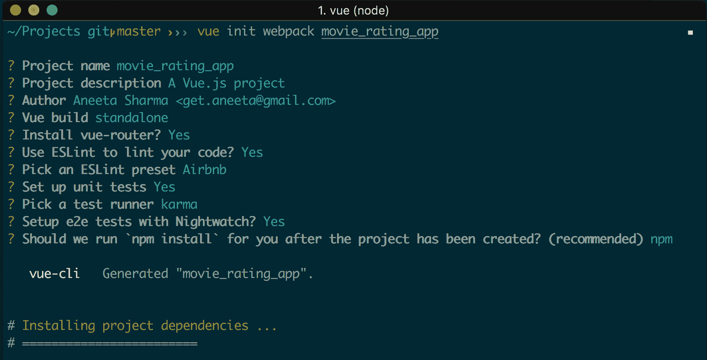

当命令成功执行时，您应该能在终端上看到进一步的步骤：

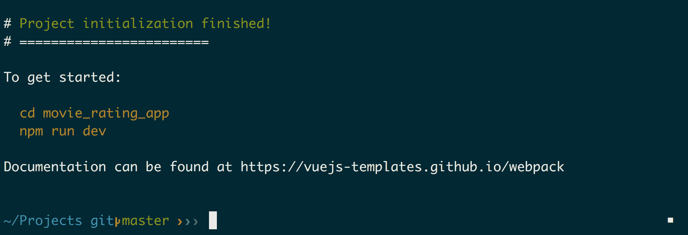

如果构建成功，我们将能够看到前面的输出。现在，让我们按照终端上的指示操作：

```js
$ cd movie_rating_app
$ npm run dev
```

这将启动您的应用程序。Vue.js 应用程序的默认端口是 8080。如您在终端中所见，应该会显示：

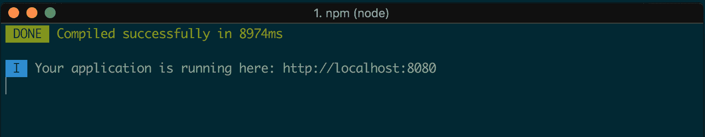

转到浏览器，打开 URL `http://localhost:8080/#/`，我们应该能看到我们的应用程序：

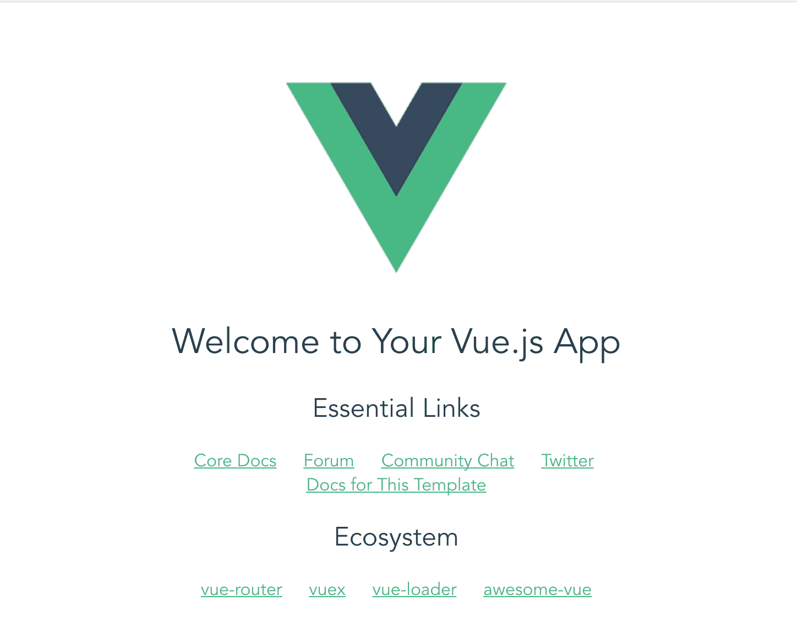

干得漂亮！这非常容易。您已成功创建并运行了一个 Vue.js 应用程序。

# 项目文件夹结构

现在，如果您注意到了，`vue-cli`命令会向您的应用程序添加大量依赖项，这些依赖项在`package.json`文件中列出。`cli`命令还设置了一个文件夹结构，您也可以根据自己的需要进行自定义。让我们回顾并了解`cli`为我们创建的结构：

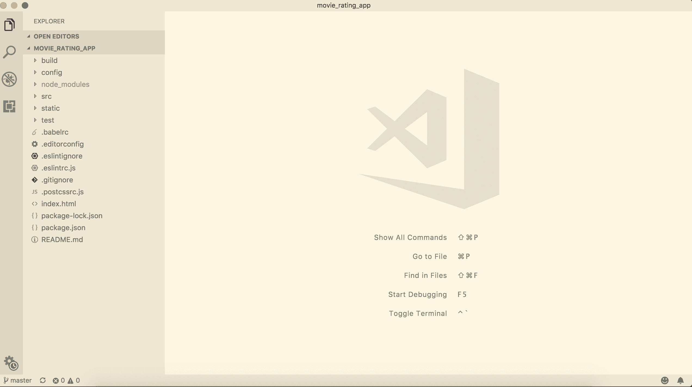

+   `build`文件夹：此文件夹包含不同环境的`webpack`配置文件：开发、测试和生产

+   `config`文件夹：应用程序的所有配置都将放在这里

+   `node_modules`：我们安装的所有`npm`包都存放在这个文件夹中

+   `src`：这个文件夹包含与在浏览器中渲染组件相关的所有文件：

+   `assets`：您可以在此文件夹中为应用程序添加 CSS 和图像。

+   `components`：此文件夹将包含所有具有 `.vue` 扩展名的前端呈现文件。

+   `router`：此文件夹将负责应用程序中不同页面的所有 URL 路由。

+   `App.vue`：您可以将 `App.vue` 视为呈现视图文件的主要组件。其他文件将扩展此文件中定义的布局以创建不同的视图。

+   `main.js`：这是任何 Vue.js 应用程序的主入口点。

+   `Static`：您也可以使用此文件夹来保存静态文件，例如 CSS 和图像。

+   `Test`：此文件夹将用于处理为我们的应用程序编写的所有测试。

# 使用 Vue.js 构建静态应用程序

现在我们已经初始化了一个项目，让我们继续创建一个静态 Web 应用程序。不要忘记在 GitHub 上创建一个存储库，并定期提交和推送更改。

当您访问 URL `http://localhost:8080/#/` 时，您将看到默认页面被呈现。这段代码写在 `src/components/HelloWorld.vue` 中。

如果你查看 `build/webpack.base.conf.js`，你会在 `module.exports` 部分看到这行代码：

```js
module.exports = {
  context: path.resolve(__dirname, '../'),
  entry: {
    app: './src/main.js'
  },
  output: {
```

这意味着当您运行应用程序时，`main.js` 将是应用程序的入口点。一切都将从那里开始。让我们快速查看一下 `src` 中的 `main.js` 文件：

```js
// The Vue build version to load with the `import` command
// (runtime-only or standalone) has been set in webpack.base.conf with an alias.
import Vue from 'vue';
import App from './App';
import router from './router';

Vue.config.productionTip = false;

/* eslint-disable no-new */
new Vue({
 el: '#app',
 router,
 template: '<App/>',
 components: { App },
});
```

前三行导入了此应用程序运行所需的必要包。`App.vue` 是此应用程序的主模板布局。所有其他 `.vue` 文件将扩展此布局。

底部块定义了运行应用程序时要呈现的组件。在这种情况下，这告诉我们的应用程序获取模板 `<App>` 并在 `#app` 元素内呈现它。现在，如果我们查看 `App.vue`：

```js
<template>
 <div id="app">
 
 <router-view/>
 </div>
</template>

<script>
export default {
 name: 'app',
};
</script>

<style>
#app {
 font-family: 'Avenir', Helvetica, Arial, sans-serif;
 -webkit-font-smoothing: antialiased;
 -moz-osx-font-smoothing: grayscale;
 text-align: center;
 color: #2c3e50;
 margin-top: 60px;
}
</style>
```

这里我们有一个模板，其中有一个带有 ID `#app` 的 `div` 元素。这意味着我们创建的 `vue` 模板将在这里呈现。

# 重新定义主页

让我们为主页创建自己的视图页面。为此，我们可以修改 `HelloWorld.vue` 组件。`.vue` 文件应始终以模板开头。因此，该文件的基本模板如下：

```js
<template>
 <div>
 </div>
</template>
```

您还可以在此页面中包含样式表和 JavaScript 代码定义，但是如果我们将它们分开放在其他地方，代码会更加清晰。

让我们从 `HelloWorld.vue` 中删除所有内容，并添加以下代码：

```js
<template>
 <div>
 Hello World
 </div>
</template>
```

我们也不需要 Vue.js 标志，所以让我们也从 `src/assets` 中删除它，并从 `App.vue` 中删除这行代码：

```js

```

现在，如果您重新访问 URL `http://localhost:8080/#/`，您将看到 `Hello World` 被呈现：


# 分离 CSS

是时候分离 CSS 了。让我们在 `src/assets` 文件夹中创建一个名为 `stylesheets` 的文件夹，并添加一个 `main.css` 文件。在 `main.css` 中添加以下代码：

```js
@import './home.css';
```

`main.css` 将是我们的主 CSS 文件，其中包含所有其他 CSS 组件。我们也可以直接在这里添加所有样式代码。但为了保持可读性，我们将为应用程序中的不同部分创建单独的样式表，并在这里导入它们。

由于我们将在这里导入所有样式表，现在我们只需要在主应用程序中包含 `main.css` 文件，以便加载它。为此，让我们在 `src/App.vue` 中添加以下代码：

```js
<template>
  <div id="app">
    <router-view/>
  </div>
</template>

<script>
import './assets/stylesheets/main.css'; 
export default {
  name: 'App',
};
</script>
```

我们在 `main.css` 中导入了一个名为 `home.css` 的样式表，但这个样式表还不存在。所以让我们继续在相同的目录 `src/assets` 中创建它。另外，让我们从 `App.vue` 中删除以下代码，并将其粘贴到 `home.css` 文件中，以便我们的组件更加清晰：

```js
#app {
 font-family: 'Avenir', Helvetica, Arial, sans-serif;
 -webkit-font-smoothing: antialiased;
 -moz-osx-font-smoothing: grayscale;
 text-align: center;
 color: #2c3e50;
 margin-top: 60px;
 width: 100%;
}
```

# Vuetify 简介

Vuetify 是一个可以用于构建 Vue.js 应用程序的物质化网页设计的模块。它提供了几个功能，可以用作我们应用程序的构建块。它是一个类似于 Bootstrap 的 UI 框架，但它主要有物质组件。有关更多详细信息，您可以访问此链接 [`vuetifyjs.com`](https://vuetifyjs.com)。

在构建应用程序时，我们将同时使用 Vuetify 和 Bootstrap。第一步是安装这些包：

```js
$ npm install bootstrap bootstrap-vue vuetify --save
```

安装完这些之后，我们需要做的下一件事是在我们的主文件中引入这些包。因此，在`src/main.js`文件中，添加以下行：

```js
// The Vue build version to load with the `import` command
// (runtime-only or standalone) has been set in webpack.base.conf with an alias.
import 'bootstrap/dist/css/bootstrap.min.css';
import 'bootstrap-vue/dist/bootstrap-vue.css';
import BootstrapVue from 'bootstrap-vue'; 
import Vue from 'vue';
import Vuetify from 'vuetify';
import App from './App';
import router from './router';

Vue.use(BootstrapVue);
Vue.use(Vuetify);

Vue.config.productionTip = false;

/* eslint-disable no-new */
new Vue({
  el: '#app',
  router,
  components: { App },
  template: '<App/>',
});
```

我们还需要使用`vuetify.css`，其中包含与其设计相关的所有样式表。我们也需要这个。我们可以简单地为此链接一个样式表。在`index.html`文件中，在`head`部分添加以下代码：

```js
...
<head>
    <meta charset="utf-8">
    <meta name="viewport" content="width=device-width,initial-scale=1.0">
    <link href="https://unpkg.com/vuetify/dist/vuetify.min.css" rel="stylesheet">
    <title>movie_rating_app</title>
  </head>
...
```

Vuetify 很好地使用了材料图标，因此还要导入字体。在`index.html`中也添加以下代码：

```js
<head>
    <meta charset="utf-8">
    <meta name="viewport" content="width=device-width,initial-scale=1.0">
    <link href="https://unpkg.com/vuetify/dist/vuetify.min.css" rel="stylesheet">
    <link href="https://fonts.googleapis.com/css?family=Roboto:300,400,500,700|Material+Icons" rel="stylesheet">
    <title>movie_rating_app</title>
  </head>
```

# 使用 Vuetify 重新设计页面

现在我们有了 Vuetify，让我们继续创建应用程序的页面。它还为我们提供了一些预定义的主题。我们将为应用程序使用非常简单和极简的主题。当然，我们也可以根据需要自定义这些。

此部分的结果如下：


# 重新设计主页

在我们的`App.vue`中，用以下代码替换文件内容：

```js
<template>
 <v-app id="inspire">
 <v-navigation-drawer
 fixed
 v-model="drawer"
 app
 >
 <v-list dense>
 <router-link v-bind:to="{ name: 'Home' }" class="side_bar_link">
 <v-list-tile>
 <v-list-tile-action>
 <v-icon>home</v-icon>
 </v-list-tile-action>
 <v-list-tile-content>Home</v-list-tile-content>
 </v-list-tile>
 </router-link>
 <router-link v-bind:to="{ name: 'Contact' }" class="side_bar_link">
 <v-list-tile>
 <v-list-tile-action>
 <v-icon>contact_mail</v-icon>
 </v-list-tile-action>
 <v-list-tile-content>Contact</v-list-tile-content>
 </v-list-tile>
 </router-link>
 </v-list>
 </v-navigation-drawer>
 <v-toolbar color="indigo" dark fixed app>
 <v-toolbar-side-icon @click.stop="drawer = !drawer"></v-toolbar-side-icon>
 <v-toolbar-title>Home</v-toolbar-title>
 </v-toolbar>
 <v-content>
 <v-container fluid>
 <div id="app">
 <router-view/>
 </div>
 </v-container>
 </v-content>
 <v-footer color="indigo" app>
 <span class="white--text">&copy; 2018</span>
 </v-footer>
 </v-app>
</template>

<script>
import './assets/stylesheets/main.css';

export default {
 data: () => ({
 drawer: null,
 }),
 props: {
 source: String,
 },
};
</script>
```

这包含了几个标签，大多以`v-`开头。这些是 Vuetify 给出的标签，用于定义我们 UI 中的块。我们已经附加了一个名为`main.css`的`stylesheet`文件。让我们为`App.vue`页面添加一些样式。

将以下代码添加到`src/assets/stylesheets/home.css`：

```js
#app {
 font-family: 'Avenir', Helvetica, Arial, sans-serif;
 -webkit-font-smoothing: antialiased;
 -moz-osx-font-smoothing: grayscale;
 text-align: center;
 color: #2c3e50;
}

#inspire {
 font-family: 'Avenir', Helvetica, Arial, sans-serif;
}

.container.fill-height {
 align-items: normal;
}

a.side_bar_link {
 text-decoration: none;
}
```

我们仍然有一个带有 ID app 的`div`部分。这是我们所有其他`.vue`文件将呈现的部分。

现在，在`HelloWorld.vue`中，用以下内容替换内容：

```js
<template>
 <v-layout>
 this is home
 </v-layout>
</template>
```

现在，如果您访问`http://localhost:8080/#/`，您应该能够查看主页。

# 重新设计联系页面

让我们继续添加一个新的联系页面。要做的第一件事是在我们的路由文件中添加一个路由。在`router/index.js`中，添加以下代码：

```js
import Vue from 'vue';
import Router from 'vue-router';
import HelloWorld from '@/components/HelloWorld';
import Contact from '@/components/Contact';

Vue.use(Router);

export default new Router({
  routes: [
    {
      path: '/',
      name: 'HelloWorld',
      component: HelloWorld,
    },
 {
 path: '/contact',
 name: 'Contact',
 component: Contact,
 },
  ],
});
```

我们在这里做的是为联系页面添加一个路径，组件的名称（我们在`.vue`文件中的导出模块中完成的），以及组件的实际名称。现在我们需要构建一个视图文件。因此，让我们在`src/components/`中创建一个`Contact.vue`文件，并向其中添加以下内容：

```js
<template>
 <v-layout>
 this is contact
 </v-layout>
</template>
```

现在，访问`http://localhost:8080/#/contact`，您应该能够查看两个页面。

为了使其对我们的应用程序可用且易于阅读，让我们将`HelloWorld`组件重命名为`Home`组件。将文件`HelloWorld.vue`重命名为`Home.vue`

还要在`App.vue`中将绑定路由从`HelloWorld`更改为`Home`：

```js
<template>
  <v-app id="inspire">
    <v-navigation-drawer
      fixed
      v-model="drawer"
      app
    >
      <v-list dense>
 <router-link v-bind:to="{ name: 'Home' }" class="side_bar_link">
          <v-list-tile @click="">
            <v-list-tile-action>
              <v-icon>home</v-icon>
```

在`routes/index.js`中，还要将组件名称和路由从`HelloWorld`更改为`Home`：

```js
import Vue from 'vue';
import Router from 'vue-router';
import Home from '@/components/Home';
import Contact from '@/components/Contact';

Vue.use(Router);

export default new Router({
  routes: [
    {
      path: '/',
      name: 'Home',
      component: Home,
    },
    {
      path: '/contact',
      name: 'Contact',
      component: Contact,
    },
  ],
});
```

当我们访问 URL `http://localhost:8080/#/`时，应该能看到类似于这样的东西：

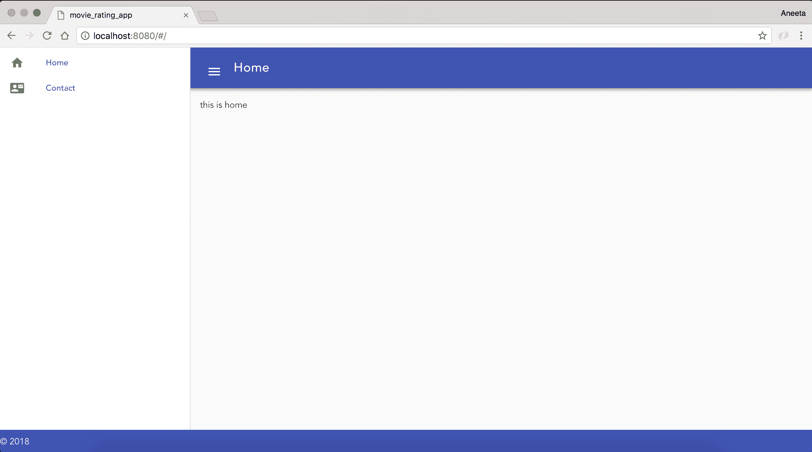

就是这样。您已成功创建了一个基本的静态两页 Web 应用程序！

# 理解 Vue.js 组件

`vue`组件相当于您在应用程序中编写的 HTML 文件。您可以在`.vue`文件中编写纯 HTML 语法。唯一需要注意的是将所有内容包装在`<template></template>`中。

# Vue.js 指令

指令与标记语言一起用于执行 DOM 元素上的一些功能。例如，在 HTML 标记语言中，当我们写：

```js
<div class='app'></div>
```

这里使用的`class`是 HTML 语言的一个指令。同样，Vue.js 还提供了许多这样的指令，以使应用程序开发更加轻松，例如：

+   `v-text`

+   `v-on`

+   `v-ref`

+   `v-show`

+   `v-pre`

+   `v-transition`

+   `v-for`

# v-text

当您想要显示必须动态定义的一些变量时，可以使用`v-text`。让我们看一个例子。在`src/components/Home.vue`中，让我们添加以下内容：

```js
<template>
  <v-layout>
    <div v-text="message"></div>
  </v-layout>
</template>
<script type="text/javascript">
export default {
 data() {
 return {
 message: 'Hello there, how are you this morning?',
 };
 },
};
</script>
```

脚本标记内的代码是一个数据变量，它将其中定义的数据绑定到此组件。当您更改该变量 message 的值时，具有该指令的`div`元素也会更新。

如果我们访问 URL（`http://localhost:8080/#/`），我们可以看到以下内容：

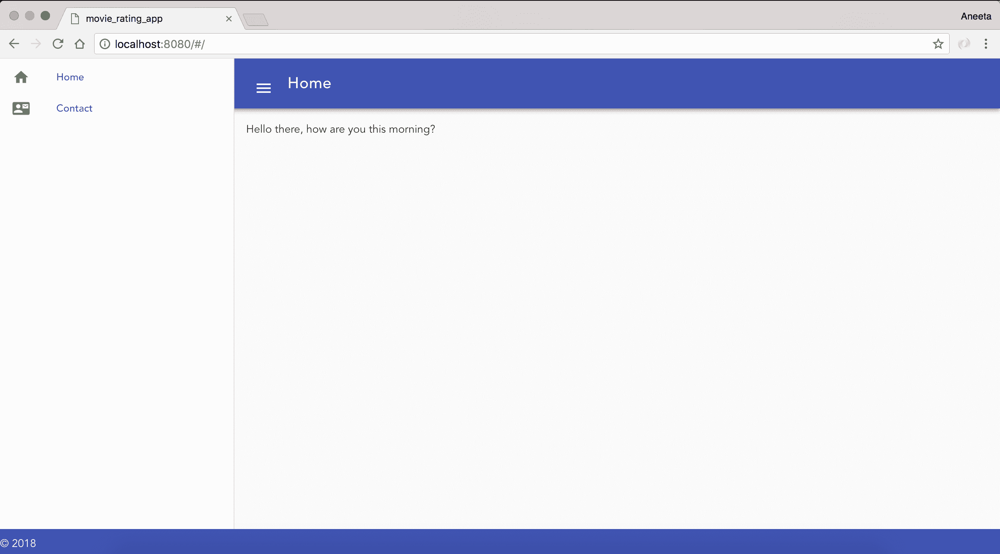

# v-on

这个指令用于事件处理。我们可以使用它来触发应用程序中的一些逻辑。例如，假设我们想回答上一个示例中的问题，为此我们可以执行以下操作。将`src/components/Home.vue`中的代码更改为以下内容：

```js
<template>
  <v-layout row wrap>
 <v-flex xs12>
 <div v-text="message"></div>
 </v-flex>
 <v-flex xs12>
 <v-btn color="primary" v-on:click="reply">Reply</v-btn>
 </v-flex>
 </v-layout>
</template>
<script type="text/javascript">
export default {
  data() {
    return {
      message: 'Hello there, how are you this morning?',
    };
  },
  methods: {
 reply() {
 this.message = "I'm doing great. Thank You!";
 },
 },
};
</script>
```

第一个屏幕将如下所示：

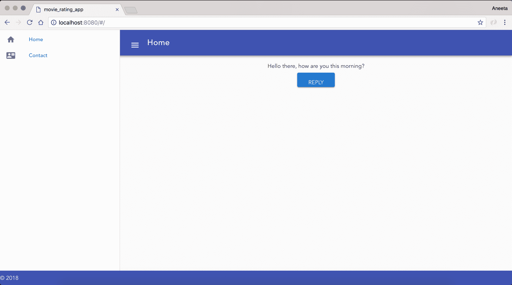

当您单击 REPLY 时，您将看到以下内容：


这些是我们将在应用程序中主要使用的指令。还有很多其他指令，我们将在途中探索。如果您想了解更多关于这些的信息，您可以访问`https://012.vuejs.org/api/directives.html`。

# 数据绑定

**数据绑定**是同步数据的过程。例如，对于我们在`v-text`上所做的相同示例，我们可以使用双大括号进行数据绑定，换句话说，使用`{{}}`操作符。

例如，我们可以使用`{{message}}`而不是使用 Vue.js 指令来显示消息。让我们将`src/components/Home.vue`中的代码更改为以下内容：

```js
<template>
  <v-layout row wrap>
    <v-flex xs12>
      <div>{{message}}</div>
    </v-flex>
    <v-flex xs12>
      <v-btn color="primary" v-on:click="reply">Reply</v-btn>
    </v-flex>
  </v-layout>
</template>
<script type="text/javascript">
  export default {
    data () {
      return {
        message: 'Hello there, how are you?',
      }
    },
    methods: {
      reply () {
        this.message = "I'm doing great. Thank You!"
      }
    }
  }
</script>
```

这将与我们在`v-text`中所做的方式相同。

# 使用 Vue.js 处理表单

现在我们对 Vue.js 的工作原理有了基本的了解，让我们继续进行我们的第一个表单，我们将在其中添加电影的详细信息，并在主页上显示这些电影，以便用户可以查看它们。

# 创建电影列表页面

首先，让我们从为我们的主页创建静态电影卡开始，然后我们将在下一步中使这些数据变得动态。在`Home.vue`中，用以下代码替换`template`中的内容：

```js
<template>
 <v-layout row wrap>
 <v-flex xs4>
 <v-card>
 <v-card-title primary-title>
 <div>
 <div class="headline">Batman vs Superman</div>
 <span class="grey--text">2016 ‧ Science fiction film/Action fiction ‧ 3h 3m</span>
 </div>
 </v-card-title>
 <v-card-text>
 It's been nearly two years since Superman's (Henry Cavill) colossal battle with Zod (Michael Shannon) devastated the city of Metropolis. The loss of life and collateral damage left many feeling angry and helpless, including crime-fighting billionaire Bruce Wayne (Ben Affleck). Convinced that Superman is now a threat to humanity, Batman embarks on a personal vendetta to end his reign on Earth, while the conniving Lex Luthor (Jesse Eisenberg) launches his own crusade against the Man of Steel.
 </v-card-text>
 <v-card-actions>
 <v-btn flat color="purple">Rate this movie</v-btn>
 <v-spacer></v-spacer>
 </v-card-actions>
 </v-card>
 </v-flex>
 <v-flex xs4>
 <v-card>
 <v-card-title primary-title>
 <div>
 <div class="headline">Logan</div>
 <span class="grey--text">2017 ‧ Drama/Science fiction film ‧ 2h 21m</span>
 </div>
 </v-card-title>
 <v-card-text>
 In the near future, a weary Logan (Hugh Jackman) cares for an ailing Professor X (Patrick Stewart) at a remote outpost on the Mexican border. His plan to hide from the outside world gets upended when he meets a young mutant (Dafne Keen) who is very much like him. Logan must now protect the girl and battle the dark forces that want to capture her.
 </v-card-text>
 <v-card-actions>
 <v-btn flat color="purple">Rate this movie</v-btn>
 <v-spacer></v-spacer>
 </v-card-actions>
 </v-card>
 </v-flex>
 <v-flex xs4>
 <v-card>
 <v-card-title primary-title>
 <div>
 <div class="headline">Star Wars: The Last Jedi</div>
 <span class="grey--text">2017 ‧ Fantasy/Science fiction film ‧ 2h 35m</span>
 </div>
 </v-card-title>
 <v-card-text>
 Luke Skywalker's peaceful and solitary existence gets upended when he encounters Rey, a young woman who shows strong signs of the Force. Her desire to learn the ways of the Jedi forces Luke to make a decision that changes their lives forever. Meanwhile, Kylo Ren and General Hux lead the First Order in an all-out assault against Leia and the Resistance for supremacy of the galaxy.
 </v-card-text>
 <v-card-actions>
 <v-btn flat color="purple">Rate this movie</v-btn>
 <v-spacer></v-spacer>
 </v-card-actions>
 </v-card>
 </v-flex>
 <v-flex xs4>
 <v-card>
 <v-card-title primary-title>
 <div>
 <div class="headline">Wonder Woman</div>
 <span class="grey--text">2017 ‧ Fantasy/Science fiction film ‧ 2h 21m</span>
 </div>
 </v-card-title>
 <v-card-text>
 Before she was Wonder Woman (Gal Gadot), she was Diana, princess of the Amazons, trained to be an unconquerable warrior. Raised on a sheltered island paradise, Diana meets an American pilot (Chris Pine) who tells her about the massive conflict that's raging in the outside world. Convinced that she can stop the threat, Diana leaves her home for the first time. Fighting alongside men in a war to end all wars, she finally discovers her full powers and true destiny.
 </v-card-text>
 <v-card-actions>
 <v-btn flat color="purple">Rate this movie</v-btn>
 <v-spacer></v-spacer>
 </v-card-actions>
 </v-card>
 </v-flex>
 <v-flex xs4>
 <v-card>
 <v-card-title primary-title>
 <div>
 <div class="headline">Dunkirk</div>
 <span class="grey--text">2017 ‧ Drama/Thriller ‧ 2 hours</span>
 </div>
 </v-card-title>
 <v-card-text>
 In May 1940, Germany advanced into France, trapping Allied troops on the beaches of Dunkirk. Under air and ground cover from British and French forces, troops were slowly and methodically evacuated from the beach using every serviceable naval and civilian vessel that could be found. At the end of this heroic mission, 330,000 French, British, Belgian and Dutch soldiers were safely evacuated.
 </v-card-text>
 <v-card-actions>
 <v-btn flat color="purple">Rate this movie</v-btn>
 <v-spacer></v-spacer>
 </v-card-actions>
 </v-card>
 </v-flex>
 <v-flex xs4>
 <v-card>
 <v-card-title primary-title>
 <div>
 <div class="headline">The Revenant</div>
 <span class="grey--text">2015 ‧ Drama/Thriller ‧ 2h 36m</span>
 </div>
 </v-card-title>
 <v-card-text>
 While exploring the uncharted wilderness in 1823, frontiersman Hugh Glass (Leonardo DiCaprio) sustains life-threatening injuries from a brutal bear attack. When a member (Tom Hardy) of his hunting team kills his young son (Forrest Goodluck) and leaves him for dead, Glass must utilize his survival skills to find a way back to civilization. Grief-stricken and fueled by vengeance, the legendary fur trapper treks through the snowy terrain to track down the man who betrayed him.
 </v-card-text>
 <v-card-actions>
 <v-btn flat color="purple">Rate this movie</v-btn>
 <v-spacer></v-spacer>
 </v-card-actions>
 </v-card>
 </v-flex>
 </v-layout>
</template>
```

还要将`home.css`中的内容替换为以下内容：

```js
#app {
 font-family: 'Avenir', Helvetica, Arial, sans-serif;
 -webkit-font-smoothing: antialiased;
 -moz-osx-font-smoothing: grayscale;
 text-align: center;
 color: #2c3e50;
 width: 100%;
}

#inspire {
 font-family: 'Avenir', Helvetica, Arial, sans-serif;
}

.container.fill-height {
 align-items: normal;
}

a.side_bar_link {
 text-decoration: none;
}

.card__title--primary, .card__text {
 text-align: left;
}

.card {
 height: 100% !important;
}
```

此外，在`App.vue`中，用以下内容替换内容：

```js
<template>
 <v-app id="inspire">
 <v-navigation-drawer
 fixed
 v-model="drawer"
 app
 >
 <v-list dense>
 <router-link v-bind:to="{ name: 'Home' }" class="side_bar_link">
 <v-list-tile>
 <v-list-tile-action>
 <v-icon>home</v-icon>
 </v-list-tile-action>
 <v-list-tile-content>Home</v-list-tile-content>
 </v-list-tile>
 </router-link>
 <router-link v-bind:to="{ name: 'Contact' }" class="side_bar_link">
 <v-list-tile>
 <v-list-tile-action>
 <v-icon>contact_mail</v-icon>
 </v-list-tile-action>
 <v-list-tile-content>Contact</v-list-tile-content>
 </v-list-tile>
 </router-link>
 </v-list>
 </v-navigation-drawer>
 <v-toolbar color="indigo" dark fixed app>
 <v-toolbar-side-icon @click.stop="drawer = !drawer"></v-toolbar-side-icon>
 <v-toolbar-title>Home</v-toolbar-title>
 <v-spacer></v-spacer>
 <v-toolbar-items class="hidden-sm-and-down">
 <v-btn flat v-bind:to="{ name: 'AddMovie' }">Add Movie</v-btn>
 </v-toolbar-items>
 </v-toolbar>
 <v-content>
 <v-container fluid>
 <div id="app">
 <router-view/>
 </div>
 </v-container>
 </v-content>
 <v-footer color="indigo" app>
 <span class="white--text">&copy; 2018</span>
 </v-footer>
 </v-app>
</template>

<script>
import './assets/stylesheets/main.css';

export default {
 data: () => ({
 drawer: null,
 }),
 props: {
 source: String,
 },
};
</script>
```

最后，替换`src/main.js`中的内容：

```js
// The Vue build version to load with the `import` command
// (runtime-only or standalone) has been set in webpack.base.conf with an alias.
import 'bootstrap/dist/css/bootstrap.min.css';
import 'bootstrap-vue/dist/bootstrap-vue.css'; 
import BootstrapVue from 'bootstrap-vue';
import Vue from 'vue';
import Vuetify from 'vuetify';
import App from './App';
import router from './router';

Vue.use(BootstrapVue);
Vue.use(Vuetify);

Vue.config.productionTip = false;

/* eslint-disable no-new */
new Vue({
 el: '#app',
 router,
 components: { App },
 template: '<App/>',
});
```

有了这个，我们应该在主页上有一个像这样的页面：

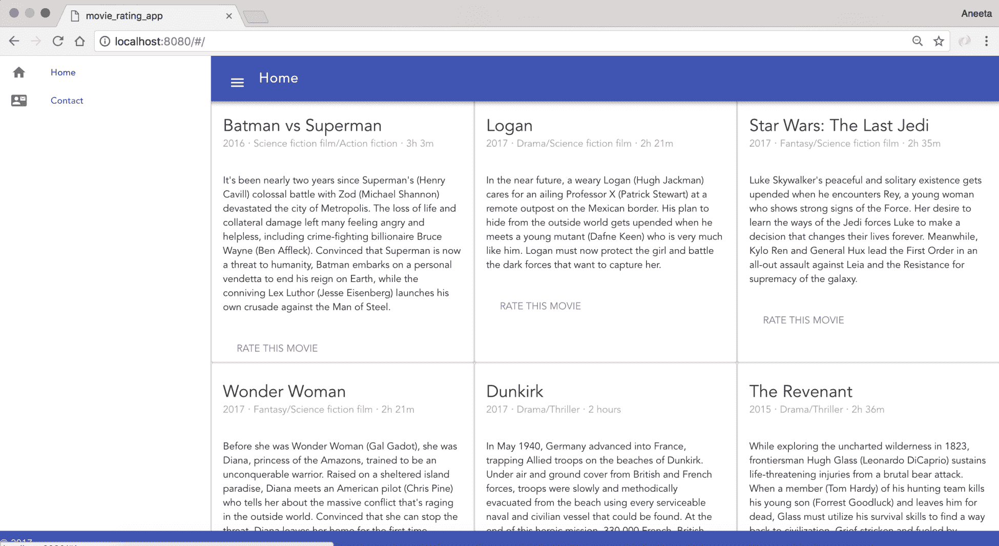

随着我们的进展，我们将使这些页面变得动态起来。

# 创建一个添加电影表单

首先，我们需要添加一个链接，以便跳转到一个添加电影的表单。为此，我们需要更改`App.vue`中的工具栏。因此，让我们在`App.vue`中的工具栏中添加一个链接：

```js
<v-toolbar color="indigo" dark fixed app>
 <v-toolbar-side-icon @click.stop="drawer = !drawer"></v-toolbar-side-icon>
 <v-toolbar-title>Home</v-toolbar-title>
 <v-spacer></v-spacer>
 <v-toolbar-items class="hidden-sm-and-down">
 <v-btn flat v-bind:to="{ name: 'AddMovie' }">Add Movie</v-btn>
 </v-toolbar-items>
</v-toolbar>
```

现在我们有了链接，我们需要添加一个路由将其链接到页面。就像我们为我们的`Contact`页面所做的那样，让我们添加一个路由，用于向我们的应用程序添加电影。因此，在`routes/index.js`中：

```js
import Vue from 'vue';
import Router from 'vue-router';
import Home from '@/components/Home';
import Contact from '@/components/Contact';
import AddMovie from '@/components/AddMovie';

Vue.use(Router);

export default new Router({
  routes: [
    {
      path: '/',
      name: 'Home',
      component: Home,
    },
    {
      path: '/contact',
      name: 'Contact',
      component: Contact,
    },
    {
 path: '/movies/add',
 name: 'AddMovie',
 component: AddMovie,
 },
  ],
});
```

在这里，我们为`AddMovie`添加了一个路由，这意味着我们现在可以在`http://localhost:8080/#/movies/add`访问添加电影页面。

现在我们需要做的下一件事是创建`vue`组件文件。为此，让我们在`src/components`中添加一个新的`AddMovie.vue`文件。Vuetify 提供了一种非常简单的方法来创建表单并添加验证。您可以在[`vuetifyjs.com/components/forms`](https://vuetifyjs.com/components/forms)上查找更多信息。

让我们将以下内容添加到`src/components/AddMovie.vue`中：

```js
<template>
 <v-form v-model="valid" ref="form" lazy-validation>
 <v-text-field
 label="Movie Name"
 v-model="name"
 :rules="nameRules"
 required
 ></v-text-field>
 <v-text-field
 name="input-7-1"
 label="Movie Description"
 v-model="description"
 multi-line
 ></v-text-field>
 <v-select
 label="Movie Release Year"
 v-model="release_year"
 :items="years"
 ></v-select>
 <v-text-field
 label="Movie Genre"
 v-model="genre"
 ></v-text-field>
 <v-btn
 @click="submit"
 :disabled="!valid"
 >
 submit
 </v-btn>
 <v-btn @click="clear">clear</v-btn>
 </v-form>
</template>
```

Vuetify 还为表单提供了一些基本验证。让我们也对其进行一些验证。

将以下代码添加到`AddMovie.vue`的`script`标签内：

```js
<template>
...
</template>
<script>
export default {
 data: () => ({
 valid: true,
 name: '',
 description: '',
 genre: '',
 release_year: '',
 nameRules: [
 v => !!v || 'Movie name is required',
 ],
 select: null,
 years: [
 '2018',
 '2017',
 '2016',
 '2015',
 ],
 }),
 methods: {
 submit() {
 if (this.$refs.form.validate()) {
 // Perform next action
 }
 },
 clear() {
 this.$refs.form.reset();
 },
 },
};
</script>
```

如果我们查看`AddMovie.vue`中的表单元素，其中有一行：

```js
 <v-form v-model="valid" ref="form" lazy-validation> 
```

这里的`v-model="valid"`部分的作用是，它确保表单在为 true 之前不会被提交，这再次与我们在底部添加的脚本相关联。此外，让我们看看我们已经添加到表单中的验证。

第一个基本验证是`required`验证：

```js
<v-text-field
  label="Movie Name"
  v-model="name"
  :rules="nameRules"
  required
></v-text-field>
```

这在`name`字段中添加了一个`required`验证。

此外，对于`release_year`字段，我们希望它是一个年份的下拉菜单，因此，我们添加了以下内容：

```js
<script>
export default {
  data: () => ({
    valid: true,
    name: '',
    description: '',
    genre: '',
    release_year: '',
    nameRules: [
      v => !!v || 'Movie name is required',
    ],
    select: null,
    years: [
 '2018',
 '2017',
 '2016',
 '2015',
 ],
  }),
  methods: {
    submit() {
      if (this.$refs.form.validate()) {
        // Perform next action
      }
    },
    clear() {
      this.$refs.form.reset();
    },
  },
};
</script>
```

这通过脚本动态向选择列表添加项目。

至于最后一部分，我们有两个按钮`Submit`和`Clear`，分别调用方法`submit()`和`clear()`。

现在，当您访问 URL（`http://localhost:8080/#/movies/add`）时，您应该有一个如下的表单：

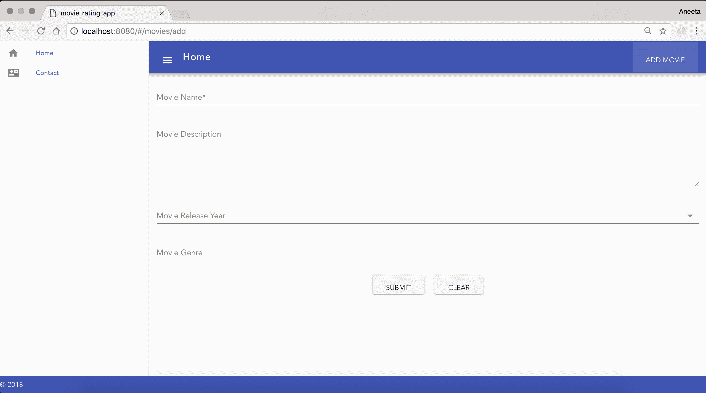

**电影名称**中的`*`表示它是一个必填字段。

如果您注意到，我们一直在添加`#`到我们添加的所有路由。这是因为这是 Vue.js 路由器的默认设置。我们可以通过在`routes/index.js`中添加`mode: 'history'`来删除它：

```js
import Vue from 'vue';
import Router from 'vue-router';
import Home from '@/components/Home';
import Contact from '@/components/Contact';
import AddMovie from '@/components/AddMovie';

Vue.use(Router);

export default new Router({
  mode: 'history',
  routes: [
    {
      path: '/',
      name: 'Home',
      component: Home,
    },
    {
      path: '/contact',
      name: 'Contact',
      component: Contact,
    },
    {
      path: '/movies/add',
      name: 'AddMovie',
      component: AddMovie,
    },
  ],
});
```

现在，我们可以在 URL 中添加路由而不添加`#`，如下所示：

+   `http://localhost:8080/`

+   `http://localhost:8080/contact`

+   `http://localhost:8080/movies/add`

# 与服务器通信

现在我们有了一个电影列表页面，我们有一个添加电影页面，所以接下来我们要做的是在提交表单时将数据保存到 MongoDB 中。

# 将 express 添加到我们的应用程序

现在我们所有的组件都就位了，是时候为我们的应用程序添加服务器层了。

让我们首先添加 express 软件包，如下所示：

```js
npm install express --save
```

下一步是创建必要的端点和模型，以便我们可以将电影添加到数据库中。

为了做到这一点，我们首先需要安装所需的软件包：

+   `body-parser`：解析传入的请求

+   `cors`：处理前端和后端之间的跨域请求

+   `morgan`：HTTP 请求记录器

+   `mongoose`：MongoDB 的对象建模

让我们通过在终端中运行以下命令来安装所有这些软件包：

```js
$ npm install morgan body-parser cors mongoose --save
```

# 添加服务器文件

现在，我们需要为我们的应用程序设置服务器。让我们在应用程序的根目录中添加一个名为`server.js`的文件，并添加以下内容：

```js
const express = require('express');
const bodyParser = require('body-parser');
const mongoose = require('mongoose');
const cors = require('cors');
const morgan = require('morgan');
const fs = require('fs');

const app = express();
const router = express.Router();
app.use(morgan('combined'));
app.use(bodyParser.json());
app.use(cors());

//connect to mongodb
mongoose.connect('mongodb://localhost/movie_rating_app', function() {
 console.log('Connection has been made');
})
.catch(err => {
 console.error('App starting error:', err.stack);
 process.exit(1);
});

router.get('/', function(req, res) {
 res.json({ message: 'API Initialized!'});
});

const port = process.env.API_PORT || 8081;
app.use('/', router);
app.listen(port, function() {
 console.log(`api running on port ${port}`);
});
```

在这里，我们设置了一个服务器，告诉 express 服务器在 8081 端口上运行。我们将使用此服务器通过 express 处理所有 API 请求。

此外，我们在`server.js`文件中需要的所有软件包都已被引入和使用。

此外，对于 mongoose 连接，我们已添加了一个连接到我们的名为`movie_rating_app`的本地数据库的连接，代码如下：

```js
//connect to mongodb
mongoose.connect('mongodb://localhost/movie_rating_app', function() {
  console.log('Connection has been made');
})
.catch(err => {
  console.error('App starting error:', err.stack);
  process.exit(1);
});
```

正如我之前提到的，如果数据库尚不存在，当我们向 DB 添加我们的第一个 Mongoose 文档时，它将自动创建。

接下来要做的是运行我们的 MongoDB 服务器。让我们通过在终端中运行以下命令来做到这一点：

```js
$ mongod
```

一旦 Mongo 服务器启动，让我们使用以下命令为此应用程序启动我们的`node`服务器：

```js
$ node server.js
```

现在，当我们打开`http://localhost:8081/`时，您应该能够看到以下消息：

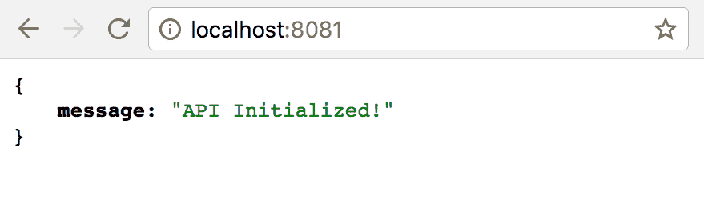

到目前为止，我们的前端服务器在端口 8080 上运行：

```js
$ npm run dev
```

后端服务器在端口 8081 上运行，如下所示：

```js
$ node server.js 
```

一个重要的事情要记住的是，每当我们更改`server.js`中的代码时，我们都必须通过运行以下命令来重新启动服务器：

```js
$ node server.js
```

这是一项非常繁琐的任务。但是，有一种很好的方法可以摆脱它。有一个名为`nodemon`的软件包，安装后，每当代码更新时都会自动重新启动服务器，我们不必每次手动执行。因此，让我们继续安装该软件包：

```js
$ npm install nodemon --save 
```

安装了软件包后，现在我们可以使用以下命令启动我们的服务器：

```js
$ nodemon server.js
```

# 添加一个 Movie 模型

接下来要做的是在提交表单时将电影添加到数据库。让我们继续在根目录中创建一个名为`models`的文件夹，并在`models`目录中添加一个`Movie.js`文件：

我们将使用大写的单数名称来命名模型，以及所有小写的复数名称来命名`Controllers`文件。

将以下代码添加到`Movie.js`中：

```js
const mongoose = require('mongoose');

const Schema = mongoose.Schema;
const MovieSchema = new Schema({
 name: String,
 description: String,
 release_year: Number,
 genre: String,
});

const Movie = mongoose.model('Movie', MovieSchema)
module.exports = Movie;
```

在这里，我们创建了一个 Movie 模型，该模型将接受我们之前在`AddMovie.vue`表单中添加的所有四个属性。

# 添加电影控制器

现在，我们需要设置的最后一件事是设置一个端点以将电影保存到数据库中。让我们在根目录中创建一个名为`controllers`的文件夹，并在该目录中添加一个名为`movies.js`的文件，并添加以下代码：

```js
const MovieSchema = require('../models/Movie.js');

module.exports.controller = (app) => {
 // add a new movie
 app.post('/movies', (req, res) => {
 const newMovie = new MovieSchema({
 name: req.body.name,
 description: req.body.description,
 release_year: req.body.release_year,
 genre: req.body.genre,
 });

 newMovie.save((error, movie) => {
 if (error) { console.log(error); }
 res.send(movie);
 });
 });
};
```

在这里，我们添加了一个端点，该端点接受具有给定参数的 post 请求，并在我们配置的数据库中创建一个 Mongoose 文档。

由于这些控制器有路由，我们也需要在我们的主入口点中包含这些文件。对于我们的后端，主入口文件是`server.js`。所以，让我们在`server.js`中添加以下突出显示的代码块：

```js
...
//connect to mongodb
mongoose.connect('mongodb://localhost/movie_rating_app', function() {
  console.log('Connection has been made');
})
.catch(err => {
  console.error('App starting error:', err.stack);
  process.exit(1);
});

// Include controllers
fs.readdirSync("controllers").forEach(function (file) {
 if(file.substr(-3) == ".js") {
 const route = require("./controllers/" + file)
 route.controller(app)
 }
})

router.get('/', function(req, res) {
  res.json({ message: 'API Initialized!'});
});
...
```

这个代码块将包括所有我们的控制器文件，我们不必手动添加每一个。

# 连接前端和后端

现在，我们有了模型和一个端点。接下来要做的是在`AddMovie.vue`中点击`提交`按钮时调用这个端点。

这是我们需要通信前端和后端的部分。为此，我们需要使用一个名为 axios 的单独包。

axios 包帮助我们从 Node.js 发出 HTTP 请求。它有助于从前端发出 Ajax 调用。还有一些 axios 的替代方案，比如 fetch 和 superagent。但 axios 已经成功地成为其中最受欢迎的。所以我们也将使用它。

# 安装 axios

现在，为了在客户端和服务器之间通信，我们将使用`axios`库。所以，让我们首先安装这个库：

```js
npm install axios --save
```

# 连接所有的部分

现在，我们已经有了所有的东西（电影模型、电影控制器和 axios）来在客户端和服务器之间通信。现在要做的最后一件事就是在点击电影添加表单中的提交按钮时连接这些部分。如果你记得的话，我们之前在`AddMovie.vue`中提交按钮之前添加了一个占位符：

```js
<v-select
      label="Movie Release Year"
      v-model="select"
      :items="years"
    ></v-select>
    <v-text-field
      label="Movie Genre"
      v-model="genre"
    ></v-text-field>
    <v-btn
 @click="submit"
 :disabled="!valid"
 >
      submit
    </v-btn>
    <v-btn @click="clear">clear</v-btn>
```

这段代码告诉我们在点击按钮时执行`submit()`方法。我们也在`script`部分中有它：

```js
...
methods: {
    submit() {
 if (this.$refs.form.validate()) {
 // Perform next action
 }
 },
    clear() {
      this.$refs.form.reset();
    },
  },
...
```

我们将在这一部分添加所有的方法。现在我们有了`submit`的占位符，让我们修改这段代码以整合电影添加表单：

```js
<script>
import axios from 'axios';

export default {
  data: () => ({
    valid: true,
    name: '',
    description: '',
    genre: '',
    release_year: '',
    nameRules: [
      v => !!v || 'Movie name is required',
    ],
    select: null,
    years: [
      '2018',
      '2017',
      '2016',
      '2015',
    ],
  }),
  methods: {
    submit() {
 if (this.$refs.form.validate()) {
 return axios({
 method: 'post',
 data: {
 name: this.name,
 description: this.description,
 release_year: this.release_year,
 genre: this.genre,
 },
 url: 'http://localhost:8081/movies',
 headers: {
 'Content-Type': 'application/json',
 },
 })
 .then(() => {
 this.$router.push({ name: 'Home' });
 this.$refs.form.reset();
 })
 .catch(() => {
 });
 }
 return true;
 },
    clear() {
      this.$refs.form.reset();
    },
  },
};
</script>
```

这应该足够了。现在，让我们继续从 UI 本身添加一部电影到`http://localhost:8080/movies/add`端点。我们应该能够在 MongoDB 中保存一部电影的记录。让我稍微解释一下我们在这里做了什么。

当我们点击`提交`按钮时，我们通过 axios 发出了一个 AJAX 请求，以命中电影控制器中的 post 端点。电影控制器中的`post`方法，反过来，根据我们为电影设计的模型架构保存了记录。当过程完成时，将页面重定向回主页。

为了检查记录是否真的被创建了，让我们查看一下 MongoDB：

```js
$ mongo
$ use movie_rating_app
$ db.movies.find()
```

我们可以看到记录是用我们在表单中提供的参数创建的：

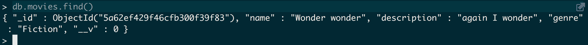

# 添加表单验证

我们也在前面的部分中介绍了如何添加验证。让我们继续为我们的电影添加表单添加一些验证。我们将添加以下验证：

+   `电影名称`不能为空

+   `电影描述`是可选的

+   `电影发行年份`不能为空

+   电影的类型是必需的，最多 80 个字符

在`AddMovie.vue`中，让我们在输入字段中添加规则，并从脚本中绑定规则：

```js
<template>
  <v-form v-model="valid" ref="form" lazy-validation>
    <v-text-field
      label="Movie Name"
      v-model="name"
      :rules="nameRules"
      required
    ></v-text-field>
    <v-text-field
      name="input-7-1"
      label="Movie Description"
      v-model="description"
      multi-line
    ></v-text-field>
    <v-select
      label="Movie Release Year"
      v-model="release_year"
      required
 :rules="releaseRules"
      :items="years"
    ></v-select>
    <v-text-field
      label="Movie Genre"
      v-model="genre"
      required
 :rules="genreRules"
    ></v-text-field>
    <v-btn
      @click="submit"
      :disabled="!valid"
    >
      submit
    </v-btn>
    <v-btn @click="clear">clear</v-btn>
  </v-form>
</template>
<script>
  import axios from 'axios';

  export default {
    data: () => ({
      valid: true,
      name: '',
      description: '',
      genre: '',
      release_year: '',
      nameRules: [
        (v) => !!v || 'Movie name is required'
      ],
      genreRules: [
 v => !!v || 'Movie genre year is required',
 v => (v && v.length <= 80) || 'Genre must be less than equal to 80 characters.',
 ],
 releaseRules: [
 v => !!v || 'Movie release year is required',
 ],
      select: null,
      years: [
        '2018',
        '2017',
        '2016',
        '2015'
      ],
      checkbox: false
    }),
    methods: {
      submit () {
        if (this.$refs.form.validate()) {
          return axios({
            method: 'post',
            data: {
              name: this.name,
              description: this.description,
              release_year: this.release_year,
              genre: this.genre
            },
            url: 'http://localhost:8081/movies',
            headers: {
              'Content-Type': 'application/json'
            }
          })
          .then((response) => {
            this.$router.push({ name: 'Home' });
            this.$refs.form.reset();
          })
          .catch((error) => {
          });
        }
      },
      clear () {
        this.$refs.form.reset()
      }
    }
  }
</script>
```

现在，如果我们尝试提交所有字段为空的表单，并且字段`电影类型`超过 80 个字符，我们应该无法提交表单。表单将显示这些错误消息：

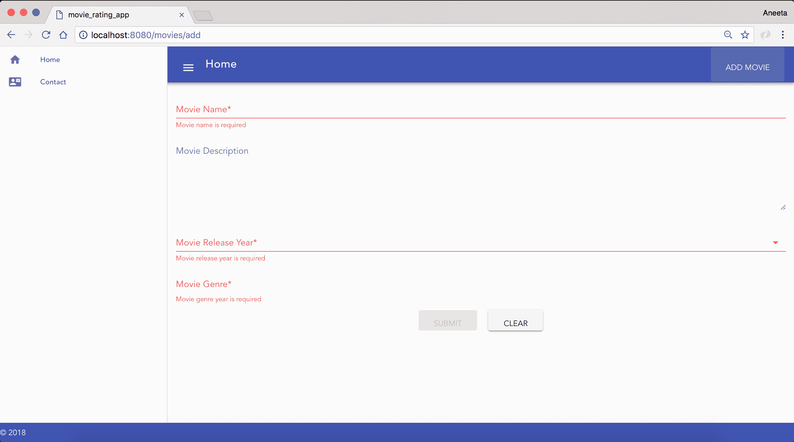

# 添加一个闪存消息

我们已经介绍了应用程序构建的基础知识。现在我们可以添加一部电影，当电影在数据库中成功保存时，有一个特定的消息会很好，或者在出现问题时通知。有几个`npm`包可以做到这一点。我们也可以自己构建。对于这个应用程序，我们将使用一个名为：`vue-swal(https://www.npmjs.com/package/vue-swal)`的包。让我们首先添加这个包：

```js
$ npm install vue-swal --save
```

现在，让我们在我们的`main.js`文件中包含这个包：

```js
// The Vue build version to load with the `import` command
// (runtime-only or standalone) has been set in webpack.base.conf with an alias.
import 'bootstrap/dist/css/bootstrap.min.css';
import 'bootstrap-vue/dist/bootstrap-vue.css';

import BootstrapVue from 'bootstrap-vue';
import Vue from 'vue';
import Vuetify from 'vuetify';
import VueSwal from 'vue-swal';
import App from './App';
import router from './router';

Vue.use(BootstrapVue);
Vue.use(Vuetify);
Vue.use(VueSwal);

Vue.config.productionTip = false;

/* eslint-disable no-new */
new Vue({
  el: '#app',
  router,
  components: { App },
  template: '<App/>',
});
```

现在，让我们修改我们的`AddMovie.vue`，以便在成功执行操作或失败时显示闪存消息：

```js
...
methods: {
  submit() {
    if (this.$refs.form.validate()) {
      return axios({
        method: 'post',
        data: {
          name: this.name,
          description: this.description,
          release_year: this.release_year,
          genre: this.genre,
        },
        url: 'http://localhost:8081/movies',
        headers: {
          'Content-Type': 'application/json',
        },
      })
        .then(() => {
          this.$swal(
 'Great!',
 'Movie added successfully!',
 'success',
 );
          this.$router.push({ name: 'Home' });
          this.$refs.form.reset();
        })
        .catch(() => {
          this.$swal(
 'Oh oo!',
 'Could not add the movie!',
 'error',
 );
        });
    }
    return true;
  },
  clear() {
    this.$refs.form.reset();
  },
},
...
```

现在，当我们提交一部电影时，我们应该能够在重定向到主页之前看到成功消息：

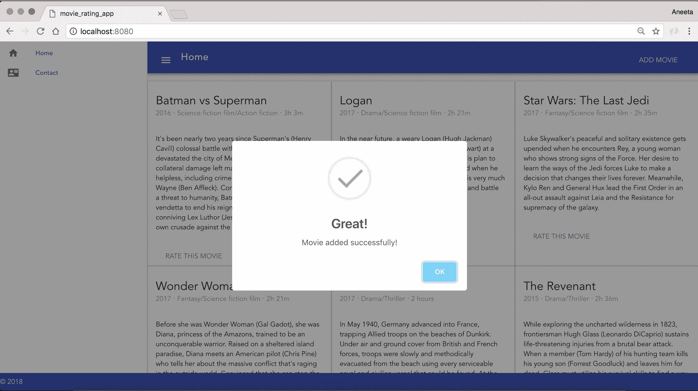

还有一些其他用于消息提醒的包，例如`vue-flash`、`vuex-flash`和`sweet-alert`。

# 在主页上加载动态内容

目前，我们的主页上有所有静态电影的内容。让我们用我们已经添加到数据库中的数据填充数据。为此，首先要做的是向数据库中添加一些电影，我们可以通过 UI 的`http://localhost:8080/movies/add`端点来实现。

# 用于获取所有电影的 API 端点

首先，我们需要添加一个端点，以从 Mongo 数据库中获取所有电影。因此，让我们首先在`controllers/movies.js`中添加一个端点，用于获取所有电影：

```js
const MovieSchema = require('../models/Movie.js');

module.exports.controller = (app) => {
  // fetch all movies
 app.get('/movies', (req, res) => {
 MovieSchema.find({}, 'name description release_year genre', (error, movies) => {
 if (error) { console.log(error); }
 res.send({
 movies,
 });
 });
 });

  // add a new movie
  app.post('/movies', (req, res) => {
    const newMovie = new MovieSchema({
      name: req.body.name,
      description: req.body.description,
      release_year: req.body.release_year,
      genre: req.body.genre,
    });

    newMovie.save((error, movie) => {
      if (error) { console.log(error); }
      res.send(movie);
    });
  });
};
```

现在，如果您访问 URL`http://localhost:8081/movies`，我们应该能够看到我们通过 UI 或 mongo shell 添加的整个电影列表。这是我拥有的：

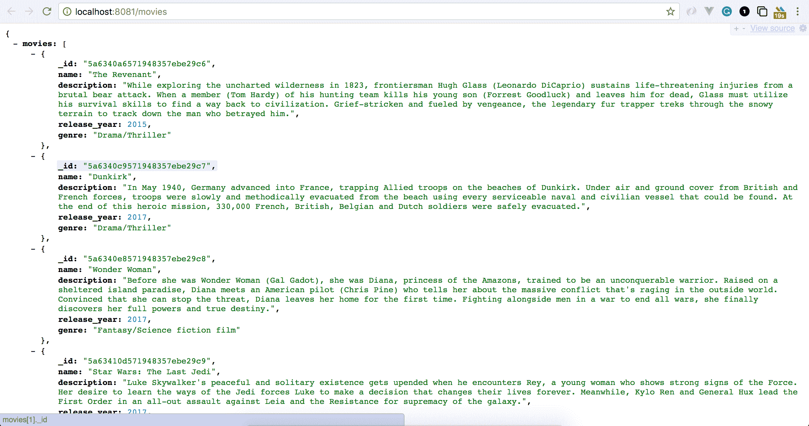

# 修改 Home.vue 以显示动态内容

现在，让我们更新我们的`Home.vue`，它将从我们的 Mongo 数据库中获取电影并显示动态内容。用以下内容替换`Home.vue`中的代码：

```js
<template>
  <v-layout row wrap>
    <v-flex xs4>
      <v-card>
        <v-card-title primary-title>
          <div>
            <div class="headline">Batman vs Superman</div>
            <span class="grey--text">2016 ‧ Science fiction film/Action 
            fiction ‧ 3h 3m</span>
          </div>
        </v-card-title>
        <v-card-text>
          It's been nearly two years since Superman's (Henry Cavill) colossal battle with Zod (Michael Shannon) devastated the city of Metropolis. The loss of life and collateral damage left many feeling angry and helpless, including crime-fighting billionaire Bruce Wayne (Ben Affleck). Convinced that Superman is now a threat to humanity, Batman embarks on a personal vendetta to end his reign on Earth, while the conniving Lex Luthor (Jesse Eisenberg) launches his own crusade against the Man of Steel.
        </v-card-text>
        <v-card-actions>
          <v-btn flat color="purple">Rate this movie</v-btn>
          <v-spacer></v-spacer>
        </v-card-actions>
      </v-card>
    </v-flex>
    <v-flex xs4>
      <v-card>
        <v-card-title primary-title>
          <div>
            <div class="headline">Logan</div>
            <span class="grey--text">2017 ‧ Drama/Science fiction film ‧ 
            2h 21m</span>
          </div>
        </v-card-title>
        <v-card-text>
          In the near future, a weary Logan (Hugh Jackman) cares for an ailing Professor X (Patrick Stewart) at a remote outpost on the Mexican border. His plan to hide from the outside world gets upended when he meets a young mutant (Dafne Keen) who is very much like him. Logan must now protect the girl and battle the dark forces that want to capture her.
        </v-card-text>
        <v-card-actions>
          <v-btn flat color="purple">Rate this movie</v-btn>
          <v-spacer></v-spacer>
        </v-card-actions>
      </v-card>
    </v-flex>
    <v-flex xs4>
      <v-card>
        <v-card-title primary-title>
          <div>
            <div class="headline">Star Wars: The Last Jedi</div>
            <span class="grey--text">2017 ‧ Fantasy/Science fiction film 
            ‧ 2h 35m</span>
          </div>
        </v-card-title>
        <v-card-text>
          Luke Skywalker's peaceful and solitary existence gets upended when he encounters Rey, a young woman who shows strong signs of the Force. Her desire to learn the ways of the Jedi forces Luke to make a decision that changes their lives forever. Meanwhile, Kylo Ren and General Hux lead the First Order in an all-out assault against Leia and the Resistance for supremacy of the galaxy.
        </v-card-text>
        <v-card-actions>
          <v-btn flat color="purple">Rate this movie</v-btn>
          <v-spacer></v-spacer>
        </v-card-actions>
      </v-card>
    </v-flex>
    <v-flex xs4>
      <v-card>
        <v-card-title primary-title>
          <div>
            <div class="headline">Wonder Woman</div>
            <span class="grey--text">2017 ‧ Fantasy/Science fiction film 
            ‧ 2h 21m</span>
          </div>
        </v-card-title>
        <v-card-text>
          Before she was Wonder Woman (Gal Gadot), she was Diana, princess of the Amazons, trained to be an unconquerable warrior. Raised on a sheltered island paradise, Diana meets an American pilot (Chris Pine) who tells her about the massive conflict that's raging in the outside world. Convinced that she can stop the threat, Diana leaves her home for the first time. Fighting alongside men in a war to end all wars, she finally discovers her full powers and true destiny.
        </v-card-text>
        <v-card-actions>
          <v-btn flat color="purple">Rate this movie</v-btn>
          <v-spacer></v-spacer>
        </v-card-actions>
      </v-card>
    </v-flex>
    <v-flex xs4>
      <v-card>
        <v-card-title primary-title>
          <div>
            <div class="headline">Dunkirk</div>
            <span class="grey--text">2017 ‧ Drama/Thriller ‧ 2 
            hours</span>
          </div>
        </v-card-title>
        <v-card-text>
          In May 1940, Germany advanced into France, trapping Allied troops on the beaches of Dunkirk. Under air and ground cover from British and French forces, troops were slowly and methodically evacuated from the beach using every serviceable naval and civilian vessel that could be found. At the end of this heroic mission, 330,000 French, British, Belgian and Dutch soldiers were safely evacuated.
        </v-card-text>
        <v-card-actions>
          <v-btn flat color="purple">Rate this movie</v-btn>
          <v-spacer></v-spacer>
        </v-card-actions>
      </v-card>
    </v-flex>
    <v-flex xs4>
      <v-card>
        <v-card-title primary-title>
          <div>
            <div class="headline">The Revenant</div>
            <span class="grey--text">2015 ‧ Drama/Thriller ‧ 2h 
            36m</span>
          </div>
        </v-card-title>
        <v-card-text>
          While exploring the uncharted wilderness in 1823, frontiersman Hugh Glass (Leonardo DiCaprio) sustains life-threatening injuries from a brutal bear attack. When a member (Tom Hardy) of his hunting team kills his young son (Forrest Goodluck) and leaves him for dead, Glass must utilize his survival skills to find a way back to civilization. Grief-stricken and fueled by vengeance, the legendary fur trapper treks through the snowy terrain to track down the man who betrayed him.
        </v-card-text>
        <v-card-actions>
          <v-btn flat color="purple">Rate this movie</v-btn>
          <v-spacer></v-spacer>
        </v-card-actions>
      </v-card>
    </v-flex>
  </v-layout>
</template>
<script>
import axios from 'axios';

export default {
  name: 'Movies',
  data() {
    return {
      movies: [],
    };
  },
  mounted() {
    this.fetchMovies();
  },
  methods: {
    async fetchMovies() {
      return axios({
        method: 'get',
        url: 'http://localhost:8081/movies',
      })
        .then((response) => {
          this.movies = response.data.movies;
        })
        .catch(() => {
        });
    },
  },
};
</script>
```

此代码在页面加载时调用一个方法，该方法在`mounted`方法中定义。该方法使用 axios 请求获取电影。现在，我们已经从服务器端拉取了数据到客户端。现在，我们将使用`vue`指令循环遍历这些电影并在主页中呈现。在`Home.vue`中，用以下代码替换`<template>`标签的内容：

```js
<template>
  <v-layout row wrap>
    <v-flex xs4 v-for="movie in movies" :key="movie._id">
      <v-card>
        <v-card-title primary-title>
          <div>
            <div class="headline">{{ movie.name }}</div>
            <span class="grey--text">{{ movie.release_year }} ‧ {{ movie.genre }}</span>
          </div>
        </v-card-title>
        <v-card-text>
          {{ movie.description }}
        </v-card-text>
      </v-card>
    </v-flex>
  </v-layout>
</template>
...
```

如您所见，我们使用了`vue`指令`for`。键用于为每个记录分配唯一标识。现在，当您访问`http://localhost:8080/`时，您将看到以下内容：

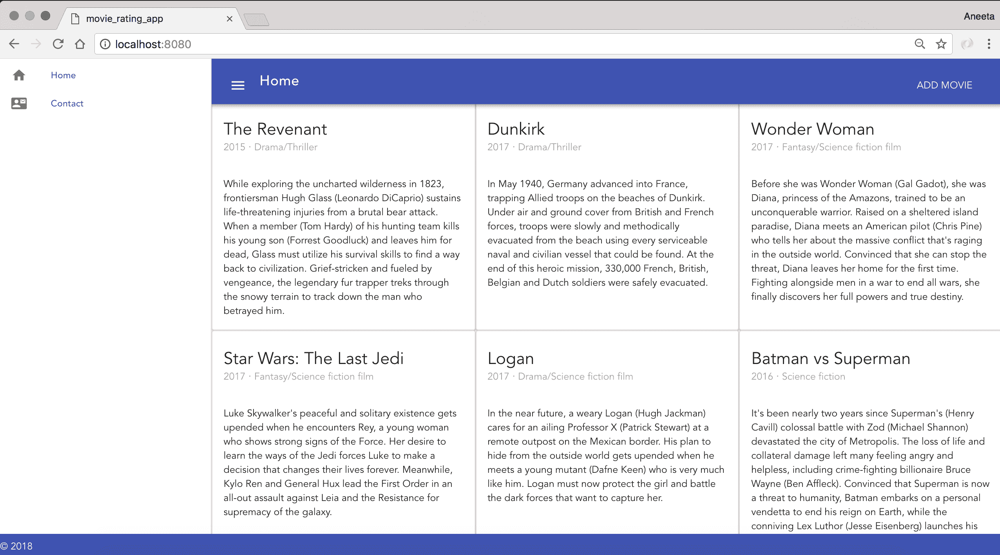

我们已成功构建了一个应用程序，可以将电影添加到 MongoDB 并在主页上显示 DB 记录。

# 添加电影详情页面

现在，我们需要一个页面，用户可以在该页面上对电影进行评分。为此，让我们在主页上电影的标题旁添加一个链接。在`Home.vue`中，用以下内容替换模板部分：

```js
<template>
  <v-layout row wrap>
    <v-flex xs4 v-for="movie in movies" :key="movie._id">
      <v-card>
        <v-card-title primary-title>
          <div>
            <div class="headline">
 <v-btn flat v-bind:to="`/movies/${movie._id}`">
 {{ movie.name }}
 </v-btn>
 </div>
            <span class="grey--text">{{ movie.release_year }} ‧ {{ movie.genre }}</span>
          </div>
        </v-card-title>
        <v-card-text>
          {{ movie.description }}
        </v-card-text>
      </v-card>
    </v-flex>
  </v-layout>
</template>
```

在这里，我们添加了一个链接，用户可以点击该链接转到相应的详细页面。

让我们添加一个详细查看电影页面的页面，用户可以在该页面上对电影进行评分。在`src/components`目录中创建一个名为`Movie.vue`的文件，并添加以下内容：

```js
<template>
 <v-layout row wrap>
 <v-flex xs4>
 <v-card>
 <v-card-title primary-title>
 <div>
 <div class="headline">{{ movie.name }}</div>
 <span class="grey--text">{{ movie.release_year }} ‧ {{ movie.genre }}</span>
 </div>
 </v-card-title>
 <h6 class="card-title">Rate this movie</h6>
 <v-card-text>
 {{ movie.description }}
 </v-card-text>
 </v-card>
 </v-flex>
 </v-layout>
</template>
<script>
import axios from 'axios';

export default {
 name: 'Movie',
 data() {
 return {
 movie: [],
 };
 },
 mounted() {
 this.fetchMovie();
 },
 methods: {
 async fetchMovie() {
 return axios({
 method: 'get',
 url: `http://localhost:8081/api/movies/${this.$route.params.id}`,
 })
 .then((response) => {
 this.movie = response.data;
 })
 .catch(() => {
 });
 },
 },
};
</script>
```

我们在这里添加了一个 axios 请求，以便在用户点击电影标题时获取电影。

现在，我们还需要定义指向该页面的路由。因此，在`routes/index.js`中，用以下内容替换内容：

```js
import Vue from 'vue';
import Router from 'vue-router';
import Home from '@/components/Home';
import Contact from '@/components/Contact';
import AddMovie from '@/components/AddMovie';
import Register from '@/components/Register';
import Login from '@/components/Login';
import Movie from '@/components/Movie';

Vue.use(Router);

export default new Router({
  mode: 'history',
  routes: [
    {
      path: '/',
      name: 'Home',
      component: Home,
    },
    {
      path: '/contact',
      name: 'Contact',
      component: Contact,
    },
    {
      path: '/movies/add',
      name: 'AddMovie',
      component: AddMovie,
    },
    {
 path: '/movies/:id',
 name: 'Movie',
 component: Movie,
 },
  ],
});
```

现在，我们需要添加一个用于获取指定 ID 的电影的 GET 请求的端点。

将`controllers/movies.js`中的内容替换为以下内容：

```js
const MovieSchema = require('../models/Movie.js');

module.exports.controller = (app) => {
  // fetch all movies
  app.get('/movies', (req, res) => {
    MovieSchema.find({}, 'name description release_year genre', (error, movies) => {
      if (error) { console.log(error); }
      res.send({
        movies,
      });
    });
  });

  // fetch a single movie
 app.get('/api/movies/:id', (req, res) => {
 MovieSchema.findById(req.params.id, 'name description release_year genre', (error, movie) => {
 if (error) { console.error(error); }
 res.send(movie);
 });
 });

  // add a new movie
  app.post('/movies', (req, res) => {
    const newMovie = new MovieSchema({
      name: req.body.name,
      description: req.body.description,
      release_year: req.body.release_year,
      genre: req.body.genre,
    });

    newMovie.save((error, movie) => {
      if (error) { console.log(error); }
      res.send(movie);
    });
  });
};
```

现在，当我们点击电影标题上的链接时，我们应该能够看到以下页面：

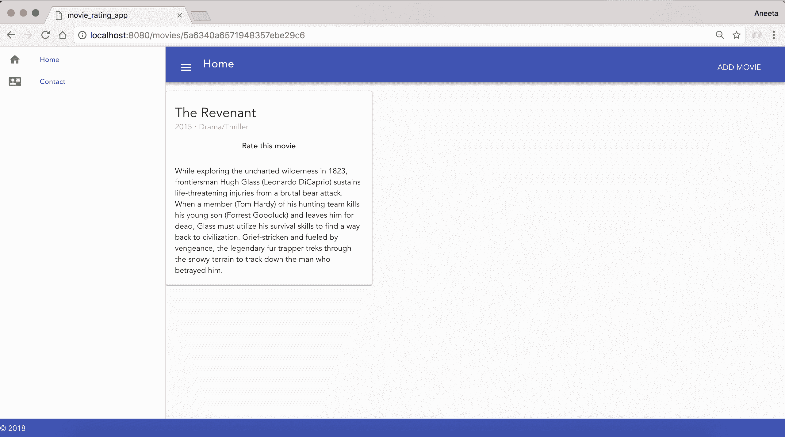

在这里，我们还添加了一个区域，用户可以点击以对电影进行评分。让我们继续添加对电影进行评分的功能。为此，我们将使用一个名为`vue-star-rating`的包，它可以轻松添加评分组件。您也可以在此链接上找到此示例：`https://jsfiddle.net/anteriovieira/8nawdjs7/`。

让我们首先添加该包：

```js
$ npm install vue-star-rating --save
```

在`Movie.vue`中，用以下内容替换内容：

```js
<template>
  <v-layout row wrap>
    <v-flex xs4>
      <v-card>
        <v-card-title primary-title>
          <div>
            <div class="headline">{{ movie.name }}</div>
            <span class="grey--text">{{ movie.release_year }} ‧ {{ movie.genre }}</span>
          </div>
        </v-card-title>
 <h6 class="card-title" v-if="current_user">Rate this movie</h6>
        <v-card-text>
          {{ movie.description }}
        </v-card-text>
      </v-card>
    </v-flex>
  </v-layout>
</template>
<script>
import axios from 'axios';
import Vue from 'vue';
import StarRating from 'vue-star-rating';

const wrapper = document.createElement('div');
// shared state
const state = {
 note: 0,
};
// crate component to content
const RatingComponent = Vue.extend({
 data() {
 return { rating: 0 };
 },
 watch: {
 rating(newVal) { state.note = newVal; },
 },
 template: `
 <div class="rating">
 How was your experience getting help with this issues?
 <star-rating v-model="rating" :show-rating="false"></star-rating>
 </div>`,
 components: { 'star-rating': StarRating },
});

const component = new RatingComponent().$mount(wrapper);

export default {
  name: 'Movie',
  data() {
    return {
      movie: [],
    };
  },
  mounted() {
    this.fetchMovie();
  },
  methods: {
    async rate() {
 this.$swal({
 content: component.$el,
 buttons: {
 confirm: {
 value: 0,
 },
 },
 }).then(() => {
 const movieId = this.$route.params.id;
 return axios({
 method: 'post',
 data: {
 rate: state.note,
 },
 url: `http://localhost:8081/movies/rate/${movieId}`,
 headers: {
 'Content-Type': 'application/json',
 },
 })
 .then(() => {
 this.$swal(`Thank you for rating! ${state.note}`, 'success');
 })
 .catch((error) => {
 const message = error.response.data.message;
 this.$swal('Oh oo!', `${message}`, 'error');
 });
 });
 },
    async fetchMovie() {
      return axios({
        method: 'get',
        url: `http://localhost:8081/api/movies/${this.$route.params.id}`,
      })
        .then((response) => {
          this.movie = response.data;
        })
        .catch(() => {
        });
    },
  },
};
</script>
```

让我们还更新代码，当点击“Rate this Movie”时调用`rate`方法。在`Movie.vue`中，更新以下代码行：

```js
...
<h6 class="card-title" v-if="current_user" @click="rate">Rate this movie</h6>
...
```

现在，我们需要做的最后一件事是在`movies.js`中添加`rate`端点：

```js
var Movie = require("../models/Movie");

module.exports.controller = (app) => {
  // fetch all movies
  app.get("/movies", function(req, res) {
    Movie.find({}, 'name description release_year genre', function (error, movies) {
      if (error) { console.log(error); }
       res.send({
        movies: movies
      })
    })
  })

  // fetch a single movie
  app.get("/api/movies/:id", function(req, res) {
    Movie.findById(req.params.id, 'name description release_year 
    genre', function (error, movie) {
      if (error) { console.error(error); }
      res.send(movie)
    })
  })

  // rate a movie
 app.post('/movies/rate/:id', (req, res) => {
 const rating = new Rating({
 movie_id: req.params.id,
 user_id: req.body.user_id,
 rate: req.body.rate,
 })

 rating.save(function (error, rating) {
 if (error) { console.log(error); }
 res.send({
 movie_id: rating.movie_id,
 user_id: rating.user_id,
 rate: rating.rate
 })
 })
 })

  // add a new movie
  app.post('/movies', (req, res) => {
    const movie = new Movie({
      name: req.body.name,
      description: req.body.description,
      release_year: req.body.release_year,
      genre: req.body.genre
    })

    movie.save(function (error, movie) {
      if (error) { console.log(error); }
      res.send(movie)
    })
  })
}
```

该端点将用户评分保存在一个名为`Rating`的单独集合中，我们尚未创建。让我们继续做这件事。在`models`目录中创建一个名为`Rating.js`的文件，并添加以下内容：

```js
const mongoose = require('mongoose')
const Schema = mongoose.Schema
const RatingSchema = new Schema({
 movie_id: String,
 user_id: String,
 rate: Number
})

const Rating = mongoose.model("Rating", RatingSchema)
module.exports = Rating
```

在`movies.js`中也包括相同的模型：

```js
const Movie = require("../models/Movie");
const Rating = require("../models/Rating");
```

就是这样！现在用户应该能够在登录后对电影进行评分。当点击“评分这部电影”时，用户应该收到一个弹出窗口，并在成功评分后显示评分分数和一条感谢消息。

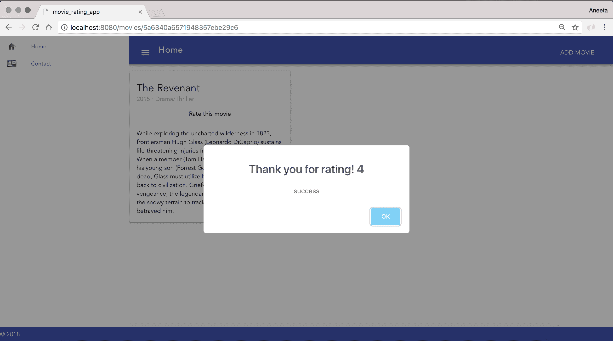

# 摘要

在本章中，我们介绍了 Vue.js 是什么！我们构建了一个静态应用程序，列出了电影，然后通过一个存储电影在 MongoDB 中的表单，为电影列表添加了动态功能。我们还学习了 Vue.js 组件、数据绑定和 Vue.js 指令。

我们还添加了用户能够对电影进行评分的功能。

在下一章中，我们将在同一个应用程序中添加用户和登录/注册功能。
