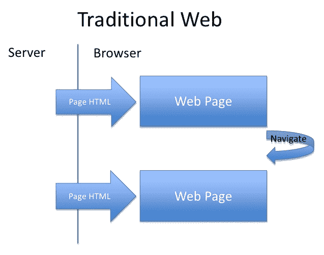
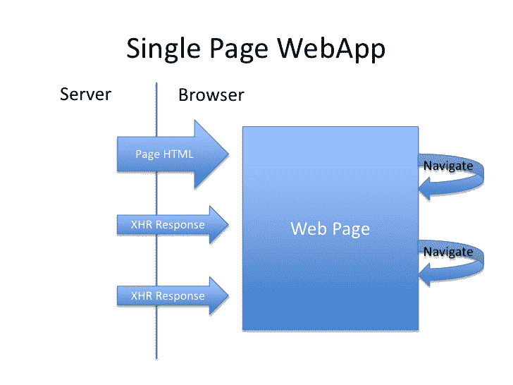
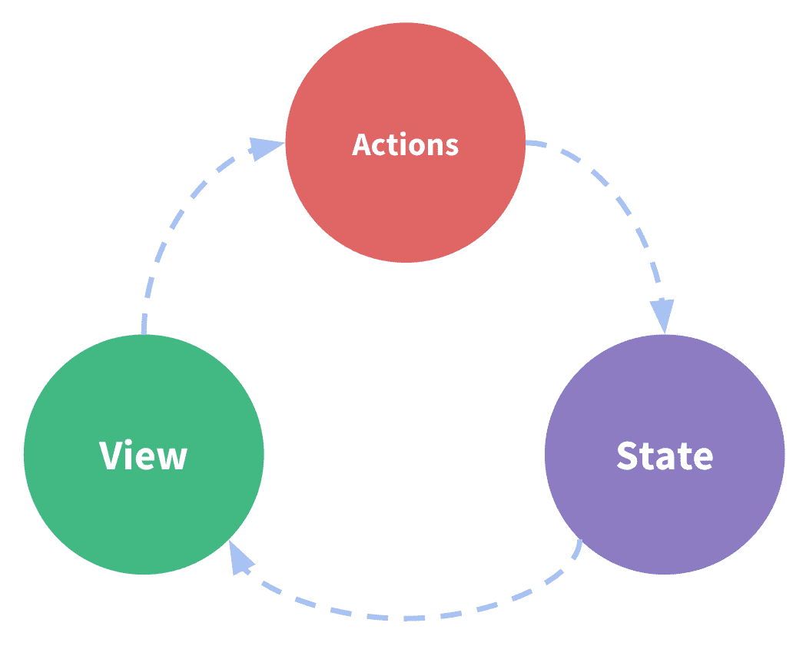
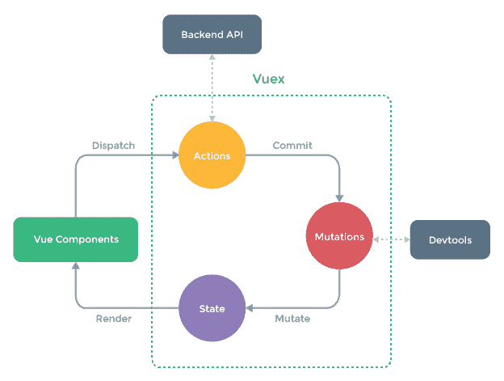
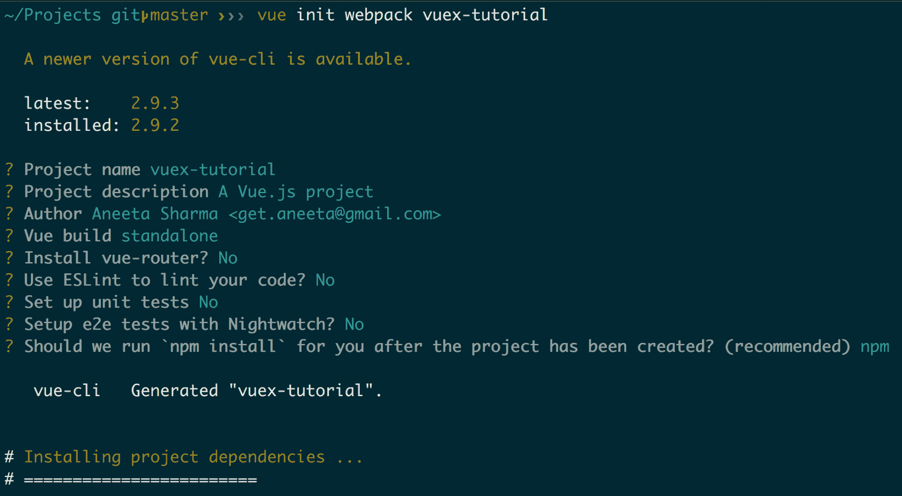
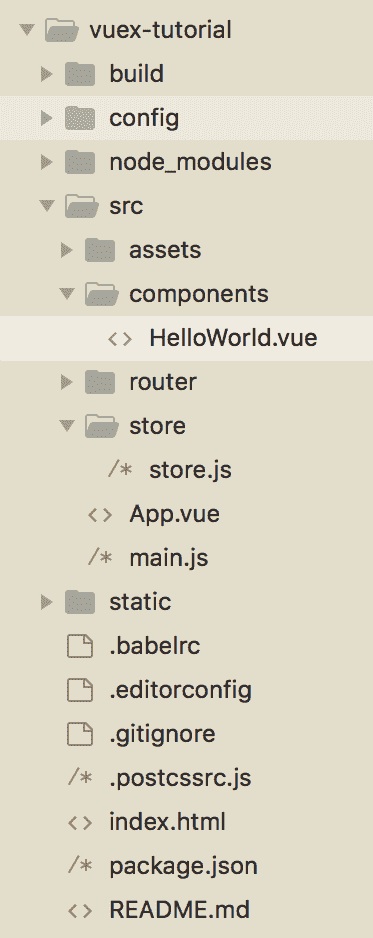
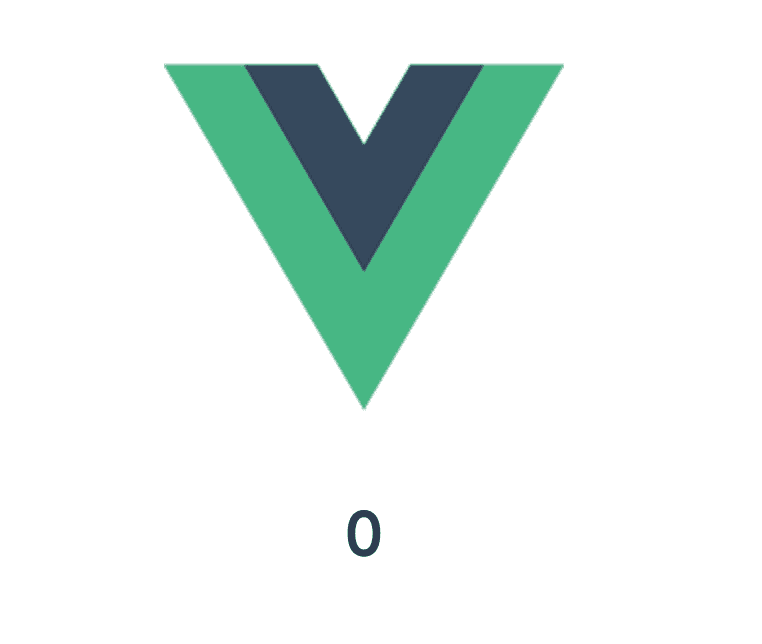
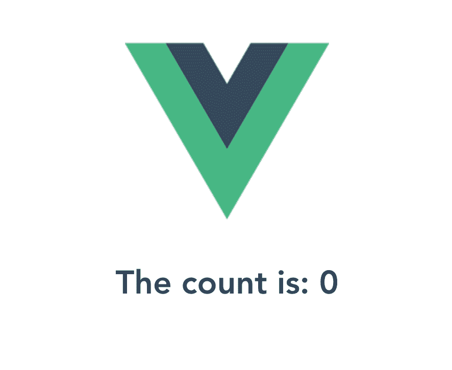
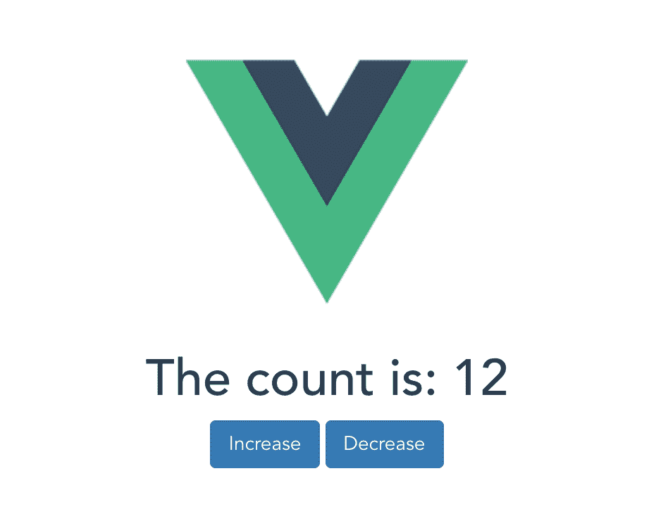

# 第八章：介绍 Vuex

Vuex 是一个库，我们可以与 Vue.js 一起使用来管理应用程序中的不同状态。如果您正在构建一个不需要在其组件之间进行大量数据交换的小型应用程序，则最好不要使用此库。然而，随着应用程序的增长，复杂性也随之而来。应用程序中将会有几个组件，显而易见的是，您将需要从一个组件向另一个组件交换数据，或者在多个组件之间共享相同的数据。这就是 Vuex 发挥作用的时候。

Vue.js 还提供了一个`emit`方法来在不同组件之间传递数据，我们在之前的章节中使用过。随着应用程序的增长，当数据更新时，您可能还希望更新多个组件中的数据。

因此，Vuex 提供了一个集中存储我们应用程序中所有数据的地方。每当数据发生变化，这组新数据将存储在这个集中的地方。此外，所有想要使用该数据的组件都将从存储中获取。这意味着我们有一个单一的源来存储所有数据，并且我们构建的所有组件都将能够访问该数据。

让我们首先了解一些随 Vuex 而来的术语：

+   **状态**：这是一个包含数据的对象。Vuex 使用单一状态树，这意味着它是一个包含应用程序所有数据片段的单一对象。

+   **获取器**：用于从状态树中获取数据。

+   **变化**：它们是改变状态树中数据的方法。

+   **操作**：它们是执行变化的函数。

我们将在本章中讨论这些内容。

# 传统的多网页应用程序

在传统的多网页应用程序中，当我们构建一个 Web 应用程序并通过浏览器导航打开网站时，它会请求 Web 服务器获取该页面并提供给浏览器。当我们在同一网站上单击按钮时，它再次请求 Web 服务器获取另一个页面并再次提供。这个过程对我们在网站上进行的每一次交互都会发生。因此，基本上每次交互网站都会重新加载，这需要大量时间。

以下是一个解释多页面应用程序工作原理的示例图：



当从浏览器发送请求时，请求被发送到服务器。服务器然后返回 HTML 内容并提供一个全新的页面。

**多页面应用程序**（**MPA**）也可以提供一些好处。选择 MPA 还是**单页面应用程序**（**SPA**）并不是问题，而是完全取决于您的应用程序内容。如果您的应用程序包含大量用户交互，您应该选择 SPA；然而，如果您的应用程序唯一目的是为用户提供内容，您可以选择 MPA。我们将在本章后面更多地探讨 SPA 和 MPA。

# 单页面应用程序的介绍

与传统 MPA 相反，SPA 专门为基于 Web 的应用程序设计。当您首次在浏览器中加载网站时，SPA 会获取所有数据。一旦所有数据都被获取，您就不需要再获取任何数据。当进行任何其他交互时，该数据通过互联网获取，无需向服务器发送请求，也无需重新加载页面。这意味着 SPA 比传统 MPA 快得多。然而，由于 SPA 在第一次加载时一次性获取所有内容，因此第一页加载时间可能会很慢。一些具有 SPA 集成的应用程序包括 Gmail、Facebook、GitHub、Trello 等。SPA 的目标是通过将内容放在一个页面上，而不是让用户等待他们想要的信息，从而提高用户体验。

以下是单页面应用程序工作原理的示例图：



网站在第一次加载时就拥有了所有所需的内容。当用户点击某些内容时，它只会获取该特定区域的信息，并刷新网页的那部分。

# SPA 与 MPA

SPA 和 MPA 有不同的用途。根据您的需求，您可能希望选择其中一种。在开始应用程序之前，请确保您清楚您想要构建的应用程序类型。

# 使用 MPA 的优点

如果您希望使应用程序对 SEO 友好，MPA 是最佳选择。Google 可以通过搜索您在每个页面上分配的关键字来抓取应用程序的不同页面，而在 SPA 中是不可能的，因为它只有一个页面。

# 使用 MPA 的缺点

使用 MPA 也有一些缺点：

+   与 SPA 相比，MPA 的开发工作要大得多，因为前端和后端紧密耦合。

+   MPA 具有紧密耦合的前端和后端，这使得在前端和后端开发人员之间分离工作变得更加困难。

# 使用 SPA 的优点

SPA 提供了许多好处：

+   **减少服务器响应时间**：SPA 在网站首次加载时获取所有所需的数据。使用这样的应用程序，服务器不需要重新加载网站上的资源。如果需要获取新数据，它只会从服务器获取更新的信息片段，与多页面应用程序不同，大大减少了服务器响应时间。

+   **更好的用户交互**：服务器响应时间的减少最终改善了用户体验。每次交互，用户都会获得更快渲染的页面，这意味着*满意的客户*。

+   **灵活更改 UI**：SPA 没有紧密耦合的前端和后端。这意味着我们可以更改前端并完全重写它，而不必担心在服务器端破坏任何内容。

+   **数据缓存**：SPA 将数据缓存在本地存储中。它只在第一次请求时进行单个请求并保存数据。这使得应用程序即使在断网时也可用。

# 使用 SPA 的缺点

使用 SPA 也有一些缺点：

+   SPA 对 SEO 不友好。由于所有操作都在单个页面上完成，可抓取性非常低。

+   由于只有一个页面链接，您无法与其他人分享特定的信息。

+   与 MPA 相比，SPA 的安全性问题要大得多。

# Vuex 简介

Vuex 是一个专门设计用于与 Vue.js 构建的应用程序一起工作的状态管理库。它是 Vuex 的集中式状态管理。

# Vuex 的核心概念

在介绍中，我们对这些核心概念有了一瞥。现在，让我们更详细地了解每个概念：



上图是一个简单的图表，解释了 Vuex 的工作原理。最初，所有内容都存储在状态中，这是唯一的真相来源。每个视图组件都从这个状态中获取数据。每当需要进行更改时，动作对数据进行变化并将其存储回状态中：



当我们在浏览器中打开应用程序时，所有 Vue 组件都将被加载。当我们点击一个按钮从组件中获取特定信息时，该组件会触发一个动作，对数据进行变化。当变化成功完成时，状态对象将被更新并使用新值。然后，我们可以使用新状态来为我们的组件提供显示。

# 创建一个简单的 Vuex 应用程序

我们将开始一个全新的应用程序来学习 Vuex 的基础知识。让我们开始吧。

让我们首先创建一个新的应用程序：

```js
$ vue init webpack vuex-tutorial
```

上述代码片段将询问您有关应用程序设置的几个问题。您可以选择要保留的内容。我将选择以下配置：



安装后，导航到项目目录：

```js
$ cd vuex-tutorial
```

接下来要做的是运行以下命令：

```js
$ npm install
```

之后，运行以下命令：

```js
$ npm run dev
```

上述命令将启动服务器并在`localhost:8080`上打开一个端口。

# 安装 Vuex

下一步是安装`vuex`。要做到这一点，运行以下命令：

```js
$ npm install --save vuex
```

# 设置 Vuex

现在，让我们创建一个`store`文件夹来管理我们应用中的`vuex`。

# 创建存储文件

在`src`目录中，创建一个`store`文件夹和一个`store.js`文件。然后，在`store.js`文件中添加以下内容：

```js
import Vue from 'vue'
import Vuex from 'vuex'

Vue.use(Vuex)
```

在上面的代码块中，`Vue.use(Vuex)`一行导入了 Vuex 库。没有这个，我们将无法使用任何`vuex`功能。现在，让我们构建一个存储对象。

# 状态

在同一个`store.js`文件中，添加以下代码行：

```js
import Vue from 'vue'
import Vuex from 'vuex'

Vue.use(Vuex)

const state = {
 count: 0
}

export const store = new Vuex.Store({
 state
})
```

在上面的代码中，我们将名为`count`的变量的默认状态设置为`0`，并通过存储导出了一个 Vuex 状态。

现在，我们需要修改`src/main.js`：

```js
// The Vue build version to load with the `import` command
// (runtime-only or standalone) has been set in webpack.base.conf with an alias.
import Vue from 'vue'
import App from './App'
import { store } from './store/store'

Vue.config.productionTip = false

/* eslint-disable no-new */
new Vue({
  el: '#app',
  store,
  components: { App },
  template: '<App/>'
})
```

上面的代码导入了我们刚刚创建的存储文件，我们可以在我们的 vue 组件中访问这个变量。

让我们继续创建一个组件来获取这个存储数据。当我们使用 Vue 创建一个新应用程序时，会创建一个默认组件。如果我们查看`src/components`目录，我们会找到一个名为`HelloWorld.vue`的文件。让我们使用相同的组件`HelloWorld.vue`，或者你也可以创建一个新的。让我们修改这个文件来访问我们在状态中定义的`count`。

在`src/components/HelloWorld.vue`中，添加以下代码：

```js
<template>
  <div class="hello">
 <h1>{{ $store.state.count }}</h1>
 </div>
</template>

<script>
export default {
  name: 'HelloWorld',
  data () {
    return {
      msg: 'Welcome to Your Vue.js App'
    }
  }
}
</script>

<!-- Add "scoped" attribute to limit CSS to this component only -->
<style scoped>
</style>
```

以下是最终的文件夹结构：



上述截图应该打印`HelloWorld.vue`组件中 count 的默认值。如果你导航到`http://localhost:8080/#/`，你应该看到以下截图：



在上面的截图中，我们直接使用`$`运算符在存储中访问了 count 变量，这不是首选的方法。我们已经学会了使用状态的基础知识。现在，访问变量的正确方法是使用`getters`。

# Getters

`getter`是用来访问存储中的对象的函数。让我们创建一个`getter`方法来获取存储中的 count。

在`store.js`中，添加以下代码：

```js
import Vue from 'vue'
import Vuex from 'vuex'

Vue.use(Vuex)

const state = {
  count: 0
}

const getters = {
 fetchCount: state => state.count
}

export const store = new Vuex.Store({
  state,
  getters
})
```

在上面的代码中，我们添加了一个名为`fetchCount`的方法，它返回`count`的当前值。现在，要在我们的 vue 组件`HelloWorld.vue`中访问这个值，我们需要使用以下代码更新内容：

```js
<template>
  <div class="hello">
 <h1>The count is: {{ fetchCount }}</h1>
  </div>
</template>

<script>
import { mapGetters } from 'vuex'
export default {
  name: 'HelloWorld',
  computed: mapGetters([
 'fetchCount'
 ])
}
</script>

<!-- Add "scoped" attribute to limit CSS to this component only -->
<style scoped>
</style>
```

我们必须从 Vuex 导入一个名为`mapGetters`的模块，用于导入我们在`store.js`中创建的`fetchCount`方法作为`getter`方法。现在，通过重新加载浏览器来检查数字；这也应该打印出`0`的计数：



# mutations

让我们继续讨论`mutations`。`mutations`是执行对存储状态进行修改的方法。我们将定义`mutations`，就像我们定义`getters`一样。

在`store.js`中，添加以下行：

```js
import Vue from 'vue'
import Vuex from 'vuex'

Vue.use(Vuex)

const state = {
  count: 0
}

const getters = {
  fetchCount: state => state.count
}

const mutations = {
 increment: state => state.count++,
 decrement: state => state.count--
}

export const store = new Vuex.Store({
  state,
  getters,
  mutations
})
```

在上面的代码中，我们添加了两个不同的`mutation`函数。`increment`方法将 count 增加 1，而`decrement`方法将 count 减少 1。这就是我们引入 actions 的地方。

# 动作

动作是调度 mutation 函数的方法。动作执行`mutations`。由于`actions`是异步的，而`mutations`是同步的，因此最好使用`actions`来改变状态。现在，就像`getters`和`mutations`一样，让我们也定义`actions`。在同一个文件中，也就是`store.js`中，添加以下代码行：

```js
import Vue from 'vue'
import Vuex from 'vuex'

Vue.use(Vuex)

const state = {
  count: 0
}

const getters = {
  fetchCount: state => state.count
}

const mutations = {
  increment: state => state.count++,
  decrement: state => state.count--
}

const actions = {
 increment: ({ commit }) => commit('increment'),
 decrement: ({ commit }) => commit('decrement')
}

export const store = new Vuex.Store({
  state,
  getters,
  mutations,
  actions
})
```

在上面的代码中，我们添加了两个不同的增加和减少函数。由于这些方法提交了`mutations`，我们需要传递一个参数来使`commit`方法可用。

现在我们需要使用之前定义的`actions`，并在`HelloWorld.vue`中使其可用：

```js
<template>
  <div class="hello">
    <h1>The count is: {{ fetchCount }}</h1>
  </div>
</template>

<script>
import { mapGetters, mapActions } from 'vuex'
export default {
  name: 'HelloWorld',
  computed: mapGetters([
    'fetchCount'
  ]),
  methods: mapActions([
 'increment',
 'decrement'
 ])
}
</script>

<!-- Add "scoped" attribute to limit CSS to this component only -->
<style scoped>
</style>
```

为了调用这些动作，让我们创建两个按钮。在`HelloWorld.vue`中，让我们添加以下代码：

```js
<template>
  <div class="hello">
    <h1>The count is: {{ fetchCount }}</h1>
    <button class="btn btn-primary" @click="increment">Increase</button>
 <button class="btn btn-primary" @click="decrement">Decrease</button>
  </div>
</template>
...
```

上述代码添加了两个按钮，当点击时，调用一个方法来增加或减少计数。让我们也导入 Bootstrap 用于 CSS。在`index.html`中，添加以下代码：

```js
<!DOCTYPE html>
<html>
  <head>
    <meta charset="utf-8">
    <meta name="viewport" content="width=device-width,initial-scale=1.0">
    <!-- Latest compiled and minified CSS -->
    <link rel="stylesheet" href="https://maxcdn.bootstrapcdn.com/bootstrap/3.3.7/css/bootstrap.min.css" integrity="sha384-BVYiiSIFeK1dGmJRAkycuHAHRg32OmUcww7on3RYdg4Va+PmSTsz/K68vbdEjh4u" crossorigin="anonymous">
    <title>vuex-tutorial</title>
  </head>
  <body>
    <div id="app"></div>
    <!-- built files will be auto injected -->
  </body>
</html>
```

就是这样。现在，如果你重新加载浏览器，你应该能够看到以下结果：



当你点击相关按钮时，计数应该增加或减少。这给了你一个关于如何在应用程序中实现 Vuex 的基本思路。

# 在电影应用程序中安装和使用 Vuex

我们介绍了 Vuex 的基础知识——它在应用程序中的工作原理和核心概念。我们介绍了如何创建存储和突变，以及如何使用动作来调度它们，还讨论了如何使用 getter 从存储中获取信息。

在之前的章节中，我们为电影列表页面构建了一个应用程序。我们将使用相同的应用程序来使用 Vuex。我们将执行以下操作：

+   我们将定义一个存储，其中将存储所有电影

+   当添加新电影时，我们将自动将其显示在电影列表页面上，而无需重新加载页面

让我们打开应用程序并运行前端和后端服务器：

```js
$ cd movie_rating_app
$ npm run build
$ nodemon server.js
```

同时，使用以下命令运行`mongo`服务器：

```js
$ mongod
```

电影列表页面应该是这样的：


让我们开始安装`vuex`：

```js
$ npm install --save vuex
```

检查你的`package.json`文件；`vuex`应该在依赖项中列出：

```js
...
"vue-router": "³.0.1",
    "vue-swal": "0.0.6",
    "vue-template-compiler": "².5.14",
    "vuetify": "⁰.17.6",
    "vuex": "³.0.1"
  },
...
```

现在，让我们创建一个文件，我们将能够将我们定义的所有`getters`、`mutations`和`actions`放在一起。

# 定义一个存储

让我们在`src`目录下创建一个名为`store`的文件夹，并在`store`目录中创建一个名为`store.js`的新文件，并添加以下代码：

```js
import Vue from 'vue';
import Vuex from 'vuex';
import axios from 'axios';

Vue.use(Vuex);

export const store = new Vuex.Store({
})
```

就像我们在前面的示例应用程序中所做的那样，让我们添加一个`state`变量来存储电影列表页面的应用程序的当前状态。

在`store.js`中，添加以下代码：

```js
import Vue from 'vue';
import Vuex from 'vuex';
import axios from 'axios';

Vue.use(Vuex);

export const store = new Vuex.Store({
  state: {
 movies: []
 },
})
```

这意味着应用程序的初始状态将有一个空的电影列表。

现在，我们需要将这个`store`导入`main.js`中，以便在整个组件中都可以访问。在`src/main.js`中添加以下代码：

```js
// The Vue build version to load with the `import` command
// (runtime-only or standalone) has been set in webpack.base.conf with an alias.
import 'bootstrap/dist/css/bootstrap.min.css';
import 'bootstrap-vue/dist/bootstrap-vue.css';

import BootstrapVue from 'bootstrap-vue';
import Vue from 'vue';
import Vuetify from 'vuetify';
import VueSwal from 'vue-swal';
import App from './App';
import router from './router';
import { store } from './store/store';

Vue.use(BootstrapVue);
Vue.use(Vuetify);
Vue.use(VueSwal);

Vue.config.productionTip = false;

/* eslint-disable no-new */
new Vue({
  el: '#app',
  store,
  router,
  components: { App },
  template: '<App/>',
});
```

现在，当我们在浏览器中打开位置`http://localhost:8081/`时，我们需要获取电影。这是我们将要做的：

1.  修改`Home.vue`以调用获取电影的动作

1.  创建一个将获取所有电影的动作

1.  创建一个突变来存储获取的电影在电影存储中

1.  创建一个 getter 方法，从状态中获取电影以显示在主页上

# 修改 Home.vue

让我们从修改`Home.vue`组件开始。使用以下代码更新文件的`script`部分：

```js
<script>
export default {
  name: 'Movies',
  computed: {
 movies() {
 return this.$store.getters.fetchMovies;
 }
 },
 mounted() {
 this.$store.dispatch("fetchMovies");
 },
};
</script>
```

在上述代码中，在`mounted()`方法中，我们调度了一个名为`fetchMovies`的动作，我们将在我们的动作中定义。

当电影成功获取时，我们将使用`computed`方法，它将映射到`movies`变量，我们将在我们的模板中使用：

```js
<template>
  <v-layout row wrap>
 <v-flex xs4 v-for="movie in movies" :key="movie._id">
      <v-card>
        <v-card-title primary-title>
        ...
```

# 创建一个动作

让我们继续在`store.js`文件中添加一个动作：

```js
import Vue from 'vue';
import Vuex from 'vuex';
import axios from 'axios';

Vue.use(Vuex);

export const store = new Vuex.Store({
  state: {
    movies: []
  },
  actions: {
 fetchMovies: (context, payload) => {
 axios({
 method: 'get',
 url: '/movies',
 })
 .then((response) => {
 context.commit("MOVIES", response.data.movies);
 })
 .catch(() => {
 });
 }
 }
})
```

在上述代码中，我们将`axios`部分从组件中移动了出来。当我们得到一个成功的响应时，我们将提交一个名为`MOVIES`的突变，然后改变状态中`movies`的值。

# 创建一个突变

让我们继续添加一个突变。在`store.js`中，用以下代码替换内容：

```js
import Vue from 'vue';
import Vuex from 'vuex';
import axios from 'axios';

Vue.use(Vuex);

export const store = new Vuex.Store({
  state: {
    movies: []
  },
  mutations: {
 MOVIES: (state, payload) => {
 state.movies = payload;
 }
 },
  actions: {
    fetchMovies: (context, payload) => {
      axios({
        method: 'get',
        url: '/movies',
      })
        .then((response) => {
          context.commit("MOVIES", response.data.movies);
        })
        .catch(() => {
        });
    }
  }
})
```

上述`mutations`改变了应用程序电影状态。

现在我们有了`action`和`mutation`。现在，最后一部分是添加一个`getter`方法，它从状态中获取`movies`的值。

# 创建一个 getter

让我们在`store.js`中添加我们创建的`getter`方法来管理应用程序的状态：

```js
import Vue from 'vue';
import Vuex from 'vuex';
import axios from 'axios';

Vue.use(Vuex);

export const store = new Vuex.Store({
  state: {
    movies: []
  },
  getters: {
 fetchMovies: state => state.movies,
 },
  mutations: {
    MOVIES: (state, payload) => {
      state.movies = payload;
    }
  },
  actions: {
    fetchMovies: (context, payload) => {
      axios({
        method: 'get',
        url: '/movies',
      })
        .then((response) => {
          context.commit("MOVIES", response.data.movies);
        })
        .catch(() => {
        });
    }
  }
})
```

就是这样。当我们导航到`http://localhost:8081/movies/add`时，我们应该有一个功能齐全的 Vuex 实现，可以将电影获取到主页上。

让我们继续实现当我们向应用程序中添加电影时的存储。我们将按照之前的过程进行：

1.  修改`AddMovie.vue`以调用创建电影的`action`

1.  创建一个调用 POST API 来创建电影的`action`

1.  创建一个`mutation`来将新添加的电影存储到`movies`存储中

用以下代码替换`AddMovie.vue`中的`script`内容：

```js
<script>
export default {
  data: () => ({
    movie: null,
    valid: true,
    name: '',
    description: '',
    genre: '',
    release_year: '',
    nameRules: [
      v => !!v || 'Movie name is required',
    ],
    genreRules: [
      v => !!v || 'Movie genre year is required',
      v => (v && v.length <= 80) || 'Genre must be less than equal to 
      80 characters.',
    ],
    releaseRules: [
      v => !!v || 'Movie release year is required',
    ],
    select: null,
    years: [
      '2018',
      '2017',
      '2016',
      '2015',
    ],
  }),
  methods: {
    submit() {
 if (this.$refs.form.validate()) {
 const movie = {
 name: this.name,
 description: this.description,
 release_year: this.release_year,
 genre: this.genre,
 }
 this.$store.dispatch("addMovie", movie);
 this.$refs.form.reset();
 this.$router.push({ name: 'Home' });
 }
 return true;
 },
    clear() {
      this.$refs.form.reset();
    },
  },
};
</script>
```

然后，在`store.js`文件中添加`action`和`mutations`：

```js
import Vue from 'vue';
import Vuex from 'vuex';
import axios from 'axios';

Vue.use(Vuex);

export const store = new Vuex.Store({
  state: {
    movies: []
  },
  getters: {
    fetchMovies: state => state.movies,
  },
  mutations: {
    ADD_MOVIE: (state, payload) => {
 state.movies.unshift(payload);
 },
    MOVIES: (state, payload) => {
      state.movies = payload;
    }
  },
  actions: {
    addMovie: (context, payload) => {
 return axios({
 method: 'post',
 data: payload,
 url: '/movies',
 headers: {
 'Content-Type': 'application/json',
 },
 })
 .then((response) => {
 context.commit("ADD_MOVIE", response.data)
 this.$swal(
 'Great!',
 'Movie added successfully!',
 'success',
 );
 })
 .catch(() => {
 this.$swal(
 'Oh oo!',
 'Could not add the movie!',
 'error',
 );
 });
 },
    fetchMovies: (context, payload) => {
      axios({
        method: 'get',
        url: '/movies',
      })
        .then((response) => {
          context.commit("MOVIES", response.data.movies);
        })
        .catch(() => {
        });
    }
  }
})
```

最后，运行以下命令来构建我们的 Vue 组件的静态文件：

```js
$ npm run build
```

现在，当我们登录并使用管理员用户添加电影时，电影应该被添加到数据库中，并且也会在主页上列出。

在这样一个小型应用程序中使用 Vuex 是杀鸡用牛刀。Vuex 最好的用法是在大型应用程序中，其中数据需要在多个组件之间传输和共享。这让你了解了 Vuex 的工作原理以及如何实现它。

# 总结

在本章中，我们讨论了 Vuex 是什么——Vuex 的核心概念状态、获取器、突变、操作，以及如何在应用程序中使用它们。我们讨论了如何构建我们的应用程序来实现 Vuex，并且在应用程序变得更大时它所带来的好处。

在下一章中，我们将介绍如何为 Vue.js 和 Node.js 应用程序编写单元测试和集成测试。
