# 第九章：测试 MEVN 应用程序

让我们快速回顾一下我们在之前章节中所做的工作：

+   我们为不同的页面创建了不同的 Vue 组件

+   我们实现了 Vuex——用于 Vue.js 应用程序的集中状态管理，并为组件定义了状态、获取器、变化和操作

+   我们创建了控制器和模型来与 Node.js 后端交互

在本章中，我们将讨论如何编写测试代码，以确保应用程序中的一切都能正常工作。编写测试代码是任何应用程序的重要组成部分。它有助于确保我们编写的功能不会出错，并保持代码的质量。

编写测试时可以遵循不同的实践。在编写实际代码之前，首先编写测试代码总是一个很好的实践。编写测试可以确保我们的应用不会出错，并且一切都会按预期工作。

这有助于我们编写更好的代码，也有助于在问题出现之前揭示潜在问题。

# 编写测试的好处

在开发应用程序时编写测试代码有很多好处。其中一些如下：

+   **确保代码按预期工作**：它有助于确保我们在应用程序中编写的每个功能都能按预期工作。

+   **提高代码质量**：它提高了代码的质量。由于编写测试代码有助于在编写实际代码之前预防可能出现的缺陷，因此它提高了代码的质量。

+   **提前识别错误**：它有助于在早期阶段识别错误。由于为每个功能编写了测试代码，因此可以在早期识别出错误和问题。

+   **为新开发人员提供文档**：测试代码就像文档。如果我们需要新的开发人员开始在同一个应用程序上工作，测试代码可以帮助他们理解应用程序的工作方式，而不必查看所有应用程序代码。

+   **使用测试代码加快应用程序开发速度**：如果我们不编写测试代码，编写代码会更快。然而，如果跳过这个过程，后来我们将花费大部分时间来修复可能已经出现的错误，而这些错误本可以在测试代码中提前识别出来。

+   **应用程序不需要运行**：编写测试代码并运行它不需要应用程序运行。它也不需要构建应用程序。这显著减少了开发时间。

因此，在本章中，我们将讨论以下主题：

+   了解为什么以及如何编写单元测试和端到端测试

+   了解为 Vue.js 和 Node.js 应用程序编写测试代码的技术

+   修改应用程序的结构以实现单元测试和端到端代码

+   为 Vue 组件编写测试代码

# 单元测试简介

单元测试是软件开发过程中对应用程序的最小功能进行测试和检查，以检查它是否按预期工作。一个单元是任何应用程序的最小部分。为应用程序的一个单元编写的每个测试代码都是相互独立的。单元测试本身的目标是执行单独的测试，并确保每个部分都是正确的。

# 编写单元测试的约定

如果在编写单元测试时遵循一定的指导方针和原则，可以使代码易于维护和可读。以下是编写任何应用程序的单元测试时可以使用的一些技术：

+   单元测试应该在小单元中进行——针对单个类或方法。

+   单元测试应该在隔离环境中进行，这意味着单元测试不应依赖于任何其他类或方法，这可以通过模拟这些依赖来实现。

+   由于单元测试是在较小的部分中进行的，因此这些部分应该非常轻量级，这样测试就可以更快地运行。

+   单元测试应该测试应用程序的一个单元的行为。它应该期望某个值并返回某个输出。

+   由于单元测试是独立进行的，不同单元的测试顺序不会造成问题。

+   遵循**不要重复自己**（**DRY**）；代码不应该重复。

+   添加注释以解释在哪里可以解释测试的原因，以便能够理解。

# 端到端测试简介

端到端测试是从头到尾测试我们的应用程序。而单元测试测试应用程序的功能是否独立工作，端到端测试检查应用程序的流程是否按预期执行。通常，端到端测试确保所有用户交互都按预期方式进行。端到端测试确保应用程序的流程按预期工作。

# 编写端到端测试的约定

在编写端到端测试时，需要遵循一些特定的指导方针：

+   测试用例应该考虑最终用户和真实场景

+   应该为不同的场景创建多个测试用例。

+   应该为涉及的所有软件或应用程序收集需求

+   对于每个需求，收集尽可能多的条件或场景

+   为每个场景编写单独的测试用例

# 我们将使用的技术

以下是我们将使用的一些软件包，用于编写应用程序的测试：

+   **Mocha**：JavaScript 测试框架，用于编写单元测试（[`mochajs.org/`](https://mochajs.org/)）

+   **Chai**：Node.js 框架的断言库（[`chaijs.com/`](http://chaijs.com/)）

+   **Sinon**：`sinon`用于测试间谍、存根和模拟对象（[`sinonjs.org/`](http://sinonjs.org/)）

+   **Nightwatch**：用于编写端到端测试的 JavaScript 库（[`nightwatchjs.org/`](http://nightwatchjs.org/)）

+   **Karma**：`karma`是 JavaScript 的测试运行器（[`karma-runner.github.io/2.0/index.html`](https://karma-runner.github.io/2.0/index.html)）

我们将在学习过程中讨论这些技术。

# 介绍 Mocha

让我们创建一个单独的工作目录来学习如何编写测试。创建一个名为`test_js`的文件夹，并切换到`test_js`目录：

```js
> mkdir test_js
> cd test_js
```

让我们还在`test_js`文件夹中创建一个名为`test`的单独文件夹：

```js
> mkdir test
```

要访问`mocha`，您必须全局安装它：

```js
$ npm install mocha -g --save-dev
```

让我们在`mocha`中编写一个简单的测试代码。我们将为一个简单的函数编写一个测试，该函数接受两个参数并返回参数的总和。

让我们在`test`文件夹中创建一个名为`add.spec.js`的文件，并添加以下代码：

```js
const addUtility = require('./../add.js');
```

然后，从`test_js`文件夹运行以下命令：

```js
$ mocha
```

这个测试将失败，我们需要一个名为`add.js`的实用程序，但它不存在。它显示以下错误：

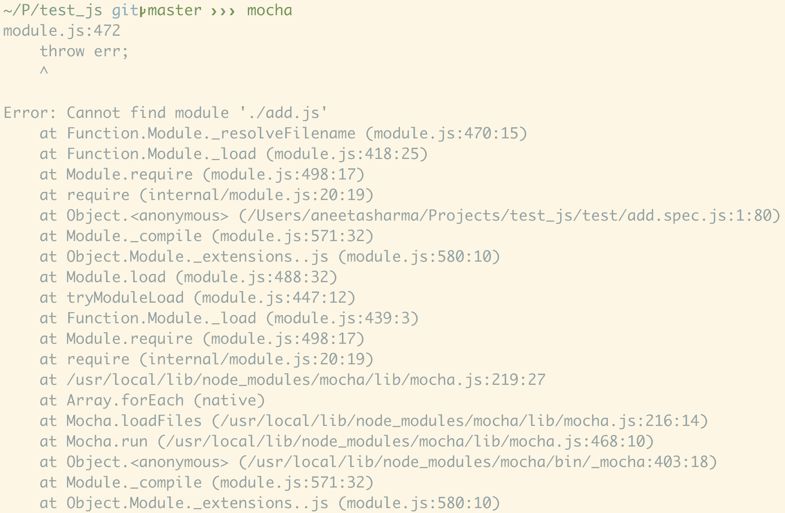

让我们继续并编写足够的代码来通过测试。在`test_js`项目的根目录中创建一个名为`add.js`的文件，并再次运行代码，这应该通过：

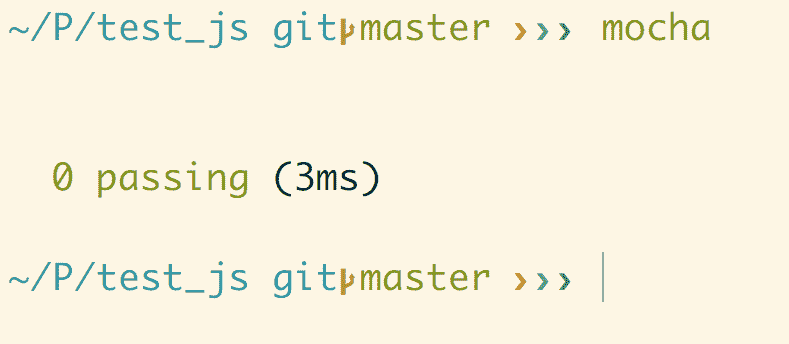

让我们继续并添加逻辑到测试代码中，以检查我们的`add`函数。在`add.spec.js`中，添加以下代码：

```js
var addUtility = require('./../add.js');

describe('Add', function(){
 describe('addUtility', function(){
 it('should have a sum method', function(){
 assert.equal(typeof addUtility, 'object');
 assert.equal(typeof addUtility.sum, 'function');
 })
 })
});
```

现在是`assert`库的时间了。`assert`库有助于检查传递的表达式是对还是错。在这里，我们将使用 Node.js 的内置断言库。

要包含`assert`库，让我们在`add.spec.js`中添加以下代码：

```js
var assert = require("assert")
var addUtility = require("./../add.js");

describe('Add', function(){
  describe('addUtility', function(){
    it('should have a sum method', function(){
      assert.equal(typeof addUtility, 'object');
      assert.equal(typeof addUtility.sum, 'function');
    })
  })
});
```

让我们重新运行`mocha`。这应该再次失败，因为我们还没有向我们的模块添加方法。所以，让我们继续做。在`add.js`中，添加以下代码：

```js
var addUtility = {}

addUtility.sum = function () {
 'use strict';
 return true;
}

module.exports = addUtility;
```

让我们重新运行`mocha`。现在规范应该通过了：

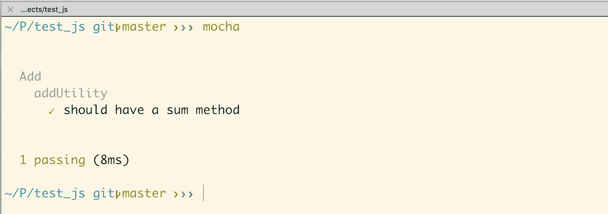

现在，让我们为 sum 方法添加功能部分。在`add_spec.js`中，添加以下代码：

```js
var assert = require("assert")
var addUtility = require("./../add.js");

describe('Add', function(){
  describe('addUtility', function(){
    it('should have a sum method', function(){
      assert.equal(typeof addUtility, 'object');
      assert.equal(typeof addUtility.sum, 'function');
    })

    it('addUtility.sum(5, 4) should return 9', function(){
 assert.deepEqual(addUtility.sum(5, 4), 9)
 })
  })
});
```

然后，查看测试；它失败了。然后，添加逻辑到我们的模块：

```js
var addUtility = {}

addUtility.sum = function (a, b) {
  'use strict';
  return a + b;
}

module.exports = addUtility;
```

然后，重新运行`mocha`，测试应该通过。就是这样！：

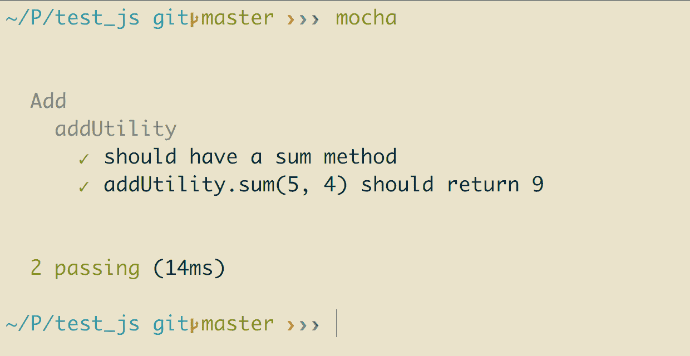

您可以继续添加一些更多的测试用例，以确保没有任何问题。

# 介绍 chai

让我们讨论`chai`。`chai`是一个断言库，与`mocha`一起使用。我们也可以使用原生的`assertion`库，但`chai`增加了很多灵活性。

`chai`使得编写测试定义变得更加容易。让我们安装`chai`并修改上述测试，使其看起来更简单易懂：

```js
$ npm install chai -g
```

我们传递了`-g`选项以全局安装它，因为我们没有`package.json`配置。

让我们在之前的测试中使用`chai`。在`add.spec.js`中，添加以下代码行：

```js
var expect = require('chai').expect;
var addUtility = require("./../add.js");

describe('Add', function(){
  describe('addUtility', function(){
    it('should have a sum method', function(){
      expect(addUtility).to.be.an('object');
 expect(addUtility).to.have.property('sum');
    })

    it('addUtility.sum(5, 4) should return 9', function(){
      expect(addUtility.sum(5, 4)).to.deep.equal(9);
    })

    it('addUtility.sum(100, 6) should return 106', function(){
      expect(addUtility.sum(100, 6)).to.deep.equal(106);
    })
  })
});
```

我们已经用`chai`的`expect()`方法替换了`assertion`库，这使得代码变得更简单和易懂。

# 介绍 sinon

`sinon`用于测试 JavaScript 测试的间谍、存根和模拟。要了解这些，让我们继续进行我们在`controller/movies.js`文件中的电影评分应用程序：

```js
const Movie = require("../models/Movie");
const passport = require("passport");

module.exports.controller = (app) => {
  // fetch all movies
  app.get("/movies", function(req, res) {
    Movie.find({}, 'name description release_year genre', function 
    (error, movies) {
      if (error) { console.log(error); }
       res.send({
        movies: movies
      })
    })
  })

  // add a new movie
  app.post('/movies', (req, res) => {
    const movie = new Movie({
      name: req.body.name,
      description: req.body.description,
      release_year: req.body.release_year,
      genre: req.body.genre
    })

    movie.save(function (error, movie) {
      if (error) { console.log(error); }
      res.send(movie)
    })
  })
}               
```

在上述代码中，每个 API 调用都需要一个请求和一个响应对象，我们需要对其进行模拟。为此，我们有`sinon`。`sinon`为我们提供了一个机制来`stub`和`mock`请求。

`sinon`提供的三种主要方法是间谍、存根和模拟：

+   **间谍**：间谍有助于创建虚假函数。我们可以使用间谍来跟踪函数是否被执行。

+   **存根**：存根帮助我们使函数返回我们想要的任何内容。当我们想要测试给定函数的不同场景时，这是很有用的。

+   **模拟**：模拟用于伪造网络连接。它们有助于创建一个虚拟的类实例，这有助于设置预定的期望。

让我们为`movies`控制器中的`get`调用编写一个测试：

```js
// fetch all movies
  app.get("/movies", function(req, res) {
    Movie.find({}, 'name description release_year genre', function 
    (error, movies) {
      if (error) { console.log(error); }
       res.send({
        movies: movies
      })
    })
  })
```

让我们在`test/units`文件夹中创建一个名为`movies.spec.js`的新文件：

```js
var movies = require("./../../../controllers/movies.js");
var expect = require('chai').expect;

describe('controllers.movies.js', function(){
 it('exists', function(){
 expect(movies).to.exist
 })
})
```

这个测试代码只是检查`controller`是否存在，当我们运行以下命令时应该通过：

```js
$ mocha test/unit/controllers/movies.spec.js
```

这个命令运行我们的`controller/movies.js`的测试，并应该通过以下输出：

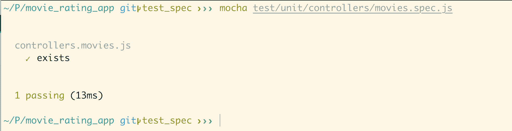

让我们首先为一个简单的方法编写一个测试。让我们创建一个响应只包含一个名称的对象的请求。在`movies.js`中，让我们添加以下代码来创建一个虚拟 API：

```js
const Movie = require("../models/Movie");
const passport = require("passport");

module.exports.controller = (app) => {
 // send a dummy test
 app.get("/dummy_test", function(req, res) {
 res.send({
 name: 'John'
 })
 })
```

在上述代码中，我们有一个返回对象的简单方法。

让我们继续添加功能测试部分。我们将为`/dummy_test`方法编写测试。

在`movies.spec.js`中，让我们添加以下代码行：

```js
var controller = require("./../../../controllers/movies.js");
let chaiHttp = require('chai-http');
let chai = require('chai');
var expect = chai.expect;
var should = chai.should();
var express = require("express");
let server = require('./../../../server.js');
var app = express();
chai.use(chaiHttp);

function buildResponse() {
 return http_mocks.createResponse({eventEmitter: require('events').EventEmitter})
}

describe('controllers.movies', function(){
 it('exists', function(){
 expect(controller).to.exist
 })
})

describe('/GET dummy_test', () => {
 it('it should respond with a name object', (done) => {
 chai.request(server)
 .get('/dummy_test')
 .end((err, res) => {
 res.should.have.status(200);
 res.body.should.be.an('object');
 done();
 });
 });
});
```

在上述代码中，我们添加了一个名为`chai-http`的新包，用于模拟请求。让我们安装这个包，如下所示：

```js
$ npm install chai-http --save
```

现在让我们使用以下命令运行测试：

```js
$ mocha test/unit/controllers/movies.spec.js
```

上述命令应该给我们以下输出：

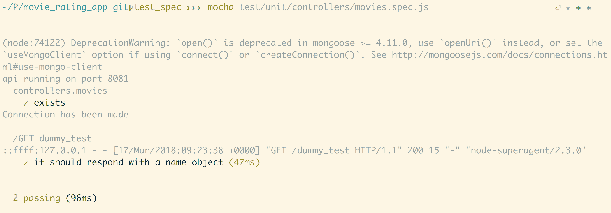

# 为 Node.js 服务器编写测试

让我们开始为我们为`node`服务器的后端部分构建的应用程序编写测试。

我们将使用以下文件夹结构：

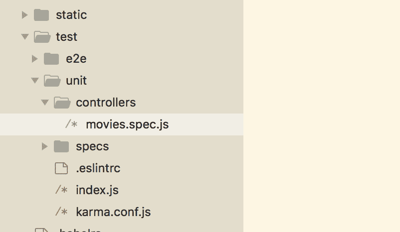

`test`文件夹内有两个文件夹。一个用于单元测试，名为`unit`，另一个用于端到端测试，名为`e2e`。我们将从编写单元测试开始，它们位于`unit`目录下。命名约定是为我们将编写测试的每个文件的文件名添加`.spec`部分。

# 为控制器编写测试

让我们开始为我们添加的控制器编写测试。在`test/unit/specs`内创建一个名为`controllers`的文件夹，并在其中创建一个名为`movies.spec.js`的新文件。这将是我们在为任何组件创建测试文件时遵循的命名约定：控制器、模型或 Vue 组件的实际文件名后跟`.spec.js`。这有助于保持代码的可读性。

让我们首先回顾一下我们的`movies.js`文件中有什么：

```js
var Movie = require("../models/Movie");

module.exports.controller = (app) => {
  // fetch all movies
  app.get("/movies", function(req, res) {
    Movie.find({}, 'name description release_year genre', function  
    (error, movies) {
      if (error) { console.log(error); }
       res.send({
        movies: movies
      })
    })
  })

  // add a new movie
  app.post('/movies', (req, res) => {
    const movie = new Movie({
      name: req.body.name,
      description: req.body.description,
      release_year: req.body.release_year,
      genre: req.body.genre
    })

    movie.save(function (error, movie) {
      if (error) { console.log(error); }
      res.send(movie)
    })
  })
}
```

这个控制器有两个方法——一个是 GET 请求，一个是 POST 请求。GET 请求是为了从数据库中获取所有电影，而 POST 请求是将给定参数的电影保存到数据库中。

让我们继续首先为 GET 请求添加规范。将以下内容添加到我们刚刚创建的`movies.spec.js`文件中：

```js
const controller = require("./../../../../controllers/movies.js");
const Movie = require("./../../../../models/Movie.js");
let server = require('./../../../../server.js');
let chai = require('chai');
let sinon = require('sinon');
const expect = chai.expect;
let chaiHttp = require('chai-http');
chai.use(chaiHttp);
const should = chai.should();
```

前两行需要`Movie`组件的相应控制器和模型，我们稍后会需要。我们还需要服务器文件。

其他包，如`chai`、`sinon`、`expect`和`should`，都是断言所需的。

我们接下来需要向服务器发出请求的是一个名为`chai-http`的包。这个包将用于 HTTP 请求断言。因此，让我们首先使用以下命令安装这个包：

```js
$ npm install chai-http --save
```

现在，我们可以继续添加第一个测试。用以下代码替换`movies.spec.js`中的内容：

```js
const controller = require("./../../../../controllers/movies.js");
const Movie = require("./../../../../models/Movie.js");
let server = require('./../../../../server.js');
let chai = require('chai');
let sinon = require('sinon');
const expect = chai.expect;
let chaiHttp = require('chai-http');
chai.use(chaiHttp);
const should = chai.should();

describe('controllers.movies', function(){
 it('exists', function(){
 expect(controller).to.exist
 })
})
```

前面的方法描述了`movies`控制器。它只是检查我们正在描述的控制器是否存在。

为了确保我们有`node`服务器的连接，让我们从`server.js`中导出服务器。将以下代码添加到`server.js`中：

```js
...
const port = process.env.API_PORT || 8081;
app.use('/', router);
var server = app.listen(port, function() {
  console.log(`api running on port ${port}`);
});

module.exports = server
```

现在，让我们使用以下命令运行测试：

```js
$ mocha test/unit/specs/controllers/movies.spec.js
```

测试应该通过。

让我们继续添加 GET 请求的测试。在`movies.js`中，我们有以下代码：

```js
var Movie = require("../models/Movie");

module.exports.controller = (app) => {
  // fetch all movies
  app.get("/movies", function(req, res) {
 Movie.find({}, 'name description release_year genre', function 
    (error, movies) {
 if (error) { console.log(error); }
 res.send({
 movies: movies
 })
 })
 })  ...
}
```

由于这个方法从数据库中获取所有现有的电影，我们首先需要在这里构建模拟电影来进行实际测试。让我们用以下代码替换`movies.spec.js`中的内容：

```js
const controller = require("./../../../../controllers/movies.js");
const Movie = require("./../../../../models/Movie.js");
let server = require('./../../../../server.js');
let chai = require('chai');
let sinon = require('sinon');
const expect = chai.expect;
let chaiHttp = require('chai-http');
chai.use(chaiHttp);
const should = chai.should();

describe('controllers.movies', function(){
  it('exists', function(){
    expect(controller).to.exist
  })

  describe('/GET movies', () => {
 it('it should send all movies', (done) => {
 var movie1 = {
 name: 'test1',
 description: 'test1',
 release_year: 2017,
 genre: 'test1'
 };
 var movie2 = {
 name: 'test2',
 description: 'test2',
 release_year: 2018,
 genre: 'test2'
 };
 var expectedMovies = [movie1, movie2];
 sinon.mock(Movie)
 .expects('find')
 .yields('', expectedMovies);
 chai.request(server)
 .get('/movies')
 .end((err, res) => {
 res.should.have.status(200);
 res.body.should.be.an('object');
 expect(res.body).to.eql({
 movies: expectedMovies
 });
 done();
 });
 });
 });
})
```

让我们一步一步地学习我们在这里做了什么：

+   我们使用`sinon`模拟了一些电影

+   我们使用`chai`创建了一个 HTTP GET 请求

+   我们有三个期望：

+   请求的状态应该是`200`

+   请求响应应该是一个对象

+   响应应该包含我们使用模拟创建的电影列表

让我们使用以下命令再次运行测试：

```js
$ mocha test/unit/specs/controllers/movies.spec.js 
```

测试应该通过。

现在让我们继续为`movies.js`的 POST 请求添加测试。在`movies.js`中，目前我们有以下内容：

```js
var Movie = require("../models/Movie");

module.exports.controller = (app) => {
  ...

  // add a new movie
  app.post('/movies', (req, res) => {
    const movie = new Movie({
      name: req.body.name,
      description: req.body.description,
      release_year: req.body.release_year,
      genre: req.body.genre
    })

    movie.save(function (error, movie) {
      if (error) { console.log(error); }
      res.send(movie)
    })
  })
}
```

POST 方法获取电影的前四个属性，并将它们保存到数据库中。让我们为这个 POST 请求添加测试。用以下代码替换`movies.spec.js`中的内容：

```js
const controller = require("./../../../../controllers/movies.js");
const Movie = require("./../../../../models/Movie.js");
let server = require('./../../../../server.js');
let chai = require('chai');
let sinon = require('sinon');
const expect = chai.expect;
let chaiHttp = require('chai-http');
chai.use(chaiHttp);
const should = chai.should();

describe('controllers.movies', function(){
  it('exists', function(){
    expect(controller).to.exist
  })

  describe('/GET movies', () => {
    it('it should send all movies', (done) => {
      var movie1 = {
        name: 'test1',
        description: 'test1',
        release_year: 2017,
        genre: 'test1'
      };
      var movie2 = {
        name: 'test2',
        description: 'test2',
        release_year: 2018,
        genre: 'test2'
      };
      var expectedMovies = [movie1, movie2];
      sinon.mock(Movie)
        .expects('find')
        .yields('', expectedMovies);
      chai.request(server)
        .get('/movies')
        .end((err, res) => {
          res.should.have.status(200);
          res.body.should.be.an('object');
          expect(res.body).to.eql({
            movies: expectedMovies
          });
          done();
      });
    });
  });

  describe('POST /movies', () => {
 it('should respond with the movie that was added', (done) => {
 chai.request(server)
 .post('/movies')
 .send({
 name: 'test1',
 description: 'test1',
 release_year: 2018,
 genre: 'test1'
 })
 .end((err, res) => {
 should.not.exist(err);
 res.status.should.equal(200);
        res.body.should.be.an('object');
 res.body.should.include.keys(
 '_id', 'name', 'description', 'release_year', 'genre'
 );
 done();
 });
 });
 });
})
```

在上面的代码块中，我们为 POST 请求做了以下操作：

+   我们正在发送带有电影参数的 POST 请求：`name`、`description`、`release_year`和`genre`

+   我们有三个期望：

+   请求的状态应该是`200`

+   请求响应应该是一个对象

+   响应应该包含所有四个属性，以及电影的 ID。

现在，如果我们再次运行测试，它们应该都通过。

同样，我们也可以为其他控制器添加测试。

# 为模型编写测试

让我们继续添加我们定义的模型的测试。在`test/unit/specs`内创建一个名为`models`的文件夹，并为我们的`Movie.js`模型创建一个测试文件。因此，规范文件的名称将是`Movie.spec.js`。

让我们先看看我们在`Movie.js`中有什么：

```js
const mongoose = require('mongoose');
const Schema = mongoose.Schema
const MovieSchema = new Schema({
  name: String,
   description: String,
   release_year: Number,
   genre: String
})

const Movie = mongoose.model('Movie', MovieSchema)
module.exports = Movie
```

我们在这里只定义了一个`Schema`，它定义了`Movie`集合的数据类型。

让我们为这个模型添加规范。将以下内容添加到`Movie.spec.js`中：

```js
var Movie = require("./../../../../models/Movie.js");
let chai = require('chai');
var expect = chai.expect;
var should = chai.should();
```

我们不需要在这里添加到控制器测试的所有组件。我们只需要简单的断言测试，所以我们需要`Movie`模型和`chai`方法。

让我们像为控制器一样为`Movie`的存在性添加测试。用以下代码替换`Movie.spec.js`中的内容：

```js
var Movie = require("./../../../../models/Movie.js");
let chai = require('chai');
var expect = chai.expect;
var should = chai.should();

describe('models.Movie', function(){
 it('exists', function(){
 expect(Movie).to.exist
 })
})
```

这个测试检查我们正在描述的`Model`是否存在。让我们使用以下命令运行测试：

```js
$ mocha test/unit/specs/models/Movie.spec.js
```

测试应该通过，并输出如下：

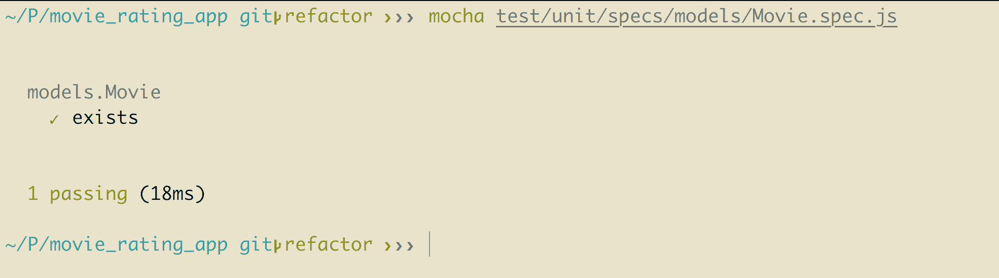

让我们继续添加一个测试，当我们发送`Movie`的`release_year`属性为字符串时。由于我们对`release_year`属性进行了验证，因此向其发送字符串值应该会引发错误。

用以下代码替换`Movie.spec.js`中的内容：

```js
var Movie = require("./../../../../models/Movie.js");
let chai = require('chai');
var expect = chai.expect;
var should = chai.should();

describe('models.Movie', function(){
  it('exists', function(){
    expect(Movie).to.exist
  })

  describe('Movie', function() {
 it('should be invalid if release_year is not an integer', 
    function(done){
 var movie = new Movie({
 name: 'test',
 description: 'test',
 release_year: 'test',
 genre: 'test'
 });

 movie.validate(function(err){
 expect(err.errors.release_year).to.exist;
 done();
 })
 })
 })
})
```

在这里，我们准备了一个带有无效值的`release_year`的电影对象。我们的期望是，在验证模型时，它应该发送一个错误。

让我们运行测试，它应该通过并输出以下内容：

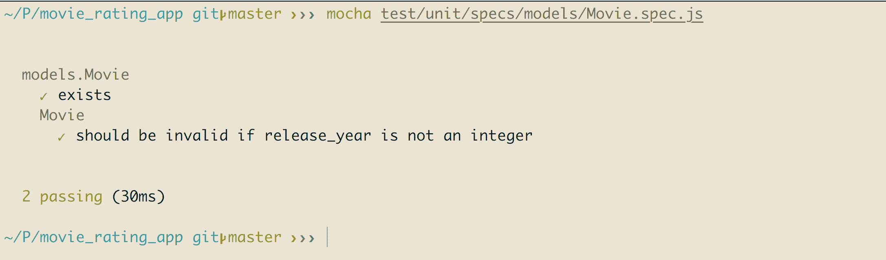

同样，我们也可以为其他模型添加测试。

# 为 Vue.js 组件编写测试

让我们继续为我们的 Vue.js 组件编写测试规范。我们将从最简单的组件开始，即`Contact.vue`页面。

这是我们在`Contact.vue`页面中目前拥有的内容：

```js
<template>
  <v-layout>
    this is contact
  </v-layout>
</template>
```

让我们稍微修改组件，以使测试更容易理解。用以下代码替换`Contact.vue`中的内容：

```js
<template>
 <div class="contact">
 <h1>this is contact</h1>
 </div>
</template>
```

现在，让我们首先创建必要的文件夹和文件来编写我们的测试。在`test/unit/specs`目录中创建一个名为`Contact.spec.js`的文件，并添加以下内容：

```js
import Vue from 'vue';
import Contact from '@/components/Contact';

describe('Contact.vue', () => {
 it('should render correct contents', () => {
 const Constructor = Vue.extend(Contact);
 const vm = new Constructor().$mount();
 expect(vm.$el.querySelector('.contact h1').textContent)
 .to.equal('this is contact');
 });
});
```

在上述代码中，我们添加了一个测试，以检查`vue`组件`Contact.vue`是否呈现了正确的内容。我们期望有一个带有`contact`类的`div`元素，并且在其中应该有一个`h1`标签，其中应该包含`this is contact`内容。

现在，为了确保我们的测试运行，让我们验证我们在`package.json`中设置了正确的脚本来运行单元测试：

```js
...
"scripts": {
    "dev": "webpack-dev-server --inline --progress --config build/webpack.dev.conf.js",
    "start": "nodemon server.js",
    "unit": "cross-env BABEL_ENV=test karma start test/unit/karma.conf.js --single-run",
    "e2e": "node test/e2e/runner.js",
 "test": "npm run unit && npm run e2e",
    "lint": "eslint --ext .js,.vue src test/unit test/e2e/specs",
    "build": "node build/build.js",
    "heroku-postbuild": "npm install --only=dev --no-shrinkwrap && npm run build"
  },
...
```

现在，让我们用以下命令运行测试：

```js
$ npm run unit
```

测试应该通过并输出以下内容：

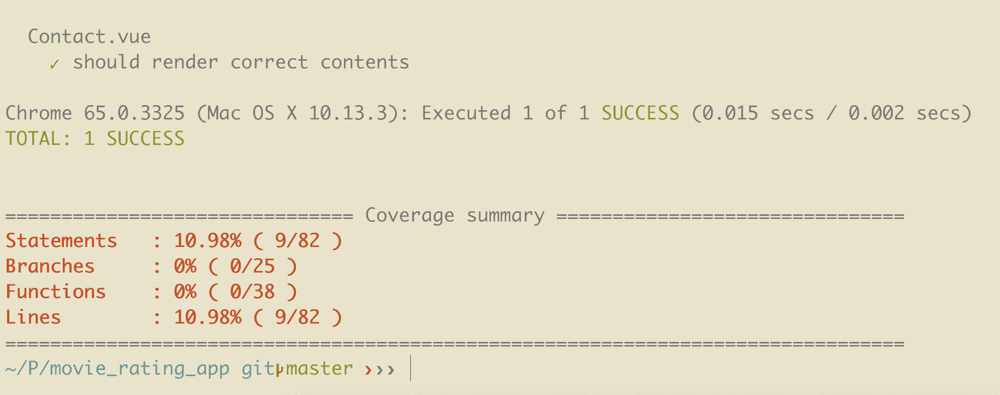

让我们继续为名为`AddMovie.vue`的组件添加规范。在`test/unit/specs`文件夹中创建一个名为`AddMovie.spec.js`的文件，并添加以下内容：

```js
import Vue from 'vue';
import AddMovie from '@/components/AddMovie';

describe('AddMovie', () => {
 let cmp, vm;

 beforeEach(() => {
 cmp = Vue.extend(AddMovie);
 vm = new cmp({
 data: {
 years: ['2018', '2017', '2016', '2015']
 }
 }).$mount()
 })

 it('equals years to ["2018", "2017", "2016", "2015"]', () => {
 console.log(vm.years);
 expect(vm.years).to.eql(['2018', '2017', '2016', '2015'])
 })
})
```

这个测试说明`years`变量应该具有给定的值，即`['2018', '2017', '2016', '2015']`。

让我们添加另一个测试，以检查我们的`vue`组件`AddMovie.js`中是否存在所需的方法。将`AddMovie.spec.js`中的内容替换为以下代码：

```js
import Vue from 'vue';
import AddMovie from '@/components/AddMovie';

describe('AddMovie', () => {
  let cmp, vm;

  beforeEach(() => {
    cmp = Vue.extend(AddMovie);
    vm = new cmp({
      data: {
        years: ['2018', '2017', '2016', '2015']
      }
    }).$mount()
  })

  it('equals years to ["2018", "2017", "2016", "2015"]', () => {
    console.log(vm.years);
    expect(vm.years).to.eql(['2018', '2017', '2016', '2015'])
  })

  it('has a submit() method', () => {
 assert.deepEqual(typeof vm.submit, 'function')
 })

 it('has a clear() method', () => {
 assert.deepEqual(typeof vm.clear, 'function')
 })
})
```

现在，让我们用以下命令运行测试：

```js
$ npm run unit
```

测试应该通过。

最后，要运行所有测试，我们只需运行以下命令：

```js
$ npm run test 
```

# 编写端到端测试

使用`vue-cli`命令创建的 vue.js 应用程序包含对使用`Nightwatch`进行端到端测试的支持。`Nightwatch`是一个非常简单的编写端到端测试的框架。`Nightwatch`使用`Selenium`命令来运行 JavaScript。

# 安装 Nightwatch

如果您还没有为`e2e`设置应用程序，那么让我们首先安装运行`e2e`测试所需的包：

```js
$ npm install nightwatch --save
```

# 配置 Nightwatch

现在，我们需要一个配置文件来运行测试。在`test`文件夹中创建一个名为`e2e`的文件夹。添加`nightwatch.conf.js`文件，并添加以下内容：

```js
require('babel-register')
var config = require('../../config')

// http://nightwatchjs.org/gettingstarted#settings-file
module.exports = {
 src_folders: ['test/e2e/specs'],
 custom_assertions_path: ['test/e2e/custom-assertions'],

 selenium: {
 start_process: true,
 server_path: require('selenium-server').path,
 host: '127.0.0.1',
 port: 4444,
 cli_args: {
 'webdriver.chrome.driver': require('chromedriver').path
 }
 },

 test_settings: {
 default: {
 selenium_port: 4444,
 selenium_host: 'localhost',
 silent: true,
 globals: {
 devServerURL: 'http://localhost:' + (process.env.PORT || config.dev.port)
 }
 },

 chrome: {
 desiredCapabilities: {
 browserName: 'chrome',
 javascriptEnabled: true,
 acceptSslCerts: true
 }
 },

 firefox: {
 desiredCapabilities: {
 browserName: 'firefox',
 javascriptEnabled: true,
 acceptSslCerts: true
 }
 }
 }
}
```

在上述代码中，在`test_settings`属性内的设置中，我们可以看到不同浏览器的不同设置。在这种情况下，Chrome，Firefox 以及在浏览器上运行开发环境的主机和端口设置。

此外，在上述代码中，我们指定了两个文件夹：`specs`和`custom-assertions`。

+   `specs`文件夹包含应用程序的主要测试代码

+   `custom-assertion`包含一个脚本，其中包含在命令行上运行断言测试时显示的自定义消息

让我们首先设置我们的`custom-assertions`。在`custom-assertions`文件夹中创建一个名为`elementCount.js`的文件，并添加以下内容：

```js
// A custom Nightwatch assertion.
// The assertion name is the filename.
// Example usage:
//
// browser.assert.elementCount(selector, count)
//
// For more information on custom assertions see:
// http://nightwatchjs.org/guide#writing-custom-assertions

exports.assertion = function (selector, count) {
 this.message = 'Testing if element <' + selector + '> has count: ' + count
 this.expected = count
 this.pass = function (val) {
 return val === this.expected
 }
 this.value = function (res) {
 return res.value
 }
 this.command = function (cb) {
 var self = this
 return this.api.execute(function (selector) {
 return document.querySelectorAll(selector).length
 }, [selector], function (res) {
 cb.call(self, res)
 })
 }
}
```

如果您在创建此应用程序时选择了`e2e`选项，那么您还应该有`test/e2e/specs/test.js`文件。如果没有，请继续创建此文件并将以下内容添加到其中：

```js
// For authoring Nightwatch tests, see
// http://nightwatchjs.org/guide#usage

module.exports = {
 'default e2e tests': function test(browser) {
 // automatically uses dev Server port from /config.index.js
 // default: http://localhost:8080
 // see nightwatch.conf.js
 const devServer = browser.globals.devServerURL;
 console.log(devServer);

 browser
 .url(devServer)
 .waitForElementVisible('#app', 5000)
 .assert.elementPresent('.hello')
 .assert.containsText('h1', 'Welcome to Your Vue.js App')
 .assert.elementCount('img', 1)
 .end();
 },
};
```

这是主文件，我们将在其中为应用程序添加测试用例。

端到端测试确保我们的应用程序的所有流程是否按预期执行。当我们运行`e2e`测试时，我们希望应用程序的某些部分被点击并表现出应有的行为。这可以描述为测试应用程序的行为。

为了能够运行`e2e`测试，我们需要启动`selenium-server`。如果我们查看`test/e2e/nightwatch.conf.js`文件，可以找到一行代码：

```js
...
selenium: {
 start_process: true,
    server_path: require('selenium-server').path,
    host: '127.0.0.1',
    port: 4444,
    cli_args: {
      'webdriver.chrome.driver': require('chromedriver').path
    }
  },
...
```

这意味着当我们运行`e2e`测试时，`selenium-server`会自动启动，我们不需要运行单独的服务器。端口定义了用于`selenium-server`的端口。您可以将其保留不变并运行测试，或者您可以更改值并自行配置。

最后，我们需要一个`runner`文件来运行`Nightwatch`测试。在`e2e`文件夹中创建一个名为`runner.js`的文件，并添加以下内容：

```js
// 1\. start the dev server using production config
process.env.NODE_ENV = 'testing'

const webpack = require('webpack')
const DevServer = require('webpack-dev-server')

const webpackConfig = require('../../build/webpack.prod.conf')
const devConfigPromise = require('../../build/webpack.dev.conf')

let server

devConfigPromise.then(devConfig => {
 const devServerOptions = devConfig.devServer
 const compiler = webpack(webpackConfig)
 server = new DevServer(compiler, devServerOptions)
 const port = devServerOptions.port
 const host = devServerOptions.host
 return server.listen(port, host)
})
.then(() => {
 // 2\. run the nightwatch test suite against it
 // to run in additional browsers:
 // 1\. add an entry in test/e2e/nightwatch.conf.js under "test_settings"
 // 2\. add it to the --env flag below
 // or override the environment flag, for example: `npm run e2e -- --env chrome,firefox`
 // For more information on Nightwatch's config file, see
 // http://nightwatchjs.org/guide#settings-file
 let opts = process.argv.slice(2)
 if (opts.indexOf('--config') === -1) {
 opts = opts.concat(['--config', 'test/e2e/nightwatch.conf.js'])
 }
 if (opts.indexOf('--env') === -1) {
 opts = opts.concat(['--env', 'chrome'])
 }

 const spawn = require('cross-spawn')
 const runner = spawn('./node_modules/.bin/nightwatch', opts, { stdio: 'inherit' })

 runner.on('exit', function (code) {
 server.close()
 process.exit(code)
 })

 runner.on('error', function (err) {
 server.close()
 throw err
 })
})
```

我们将为此应用使用独立的 Selenium 服务器和端口`5555`。为此，我们首先需要安装独立服务器：

```js
$ npm install selenium-standalone
```

使用以下命令运行包：

```js
$ npx selenium-standalone start -- -port 5555
```

`npx`是运行 npm 包的命令。

由于我们使用`5555`端口，因此我们还需要在`nightwatch.conf.js`文件中进行更新。

使用以下代码更新`nightwatch.conf.js`中的 Selenium 配置：

```js
...
selenium: {
    start_process: false,
    server_path: require('selenium-server').path,
    host: '127.0.0.1',
    port: 5555,
    cli_args: {
      'webdriver.chrome.driver': require('chromedriver').path
    }
  },

  test_settings: {
    default: {
      selenium_port: 5555,
      selenium_host: 'localhost',
      silent: true,
      globals: {
 devServerURL: 'http://localhost:8081'
      }
    },
...
```

由于我们使用`8081`端口运行`node`服务器，请确保您也更新了`devServerURL`属性，就像在前面的代码片段中所做的那样。

现在，我们已经准备好使用以下命令运行测试：

```js
$ npm run e2e
```

测试应该失败，并显示以下输出：

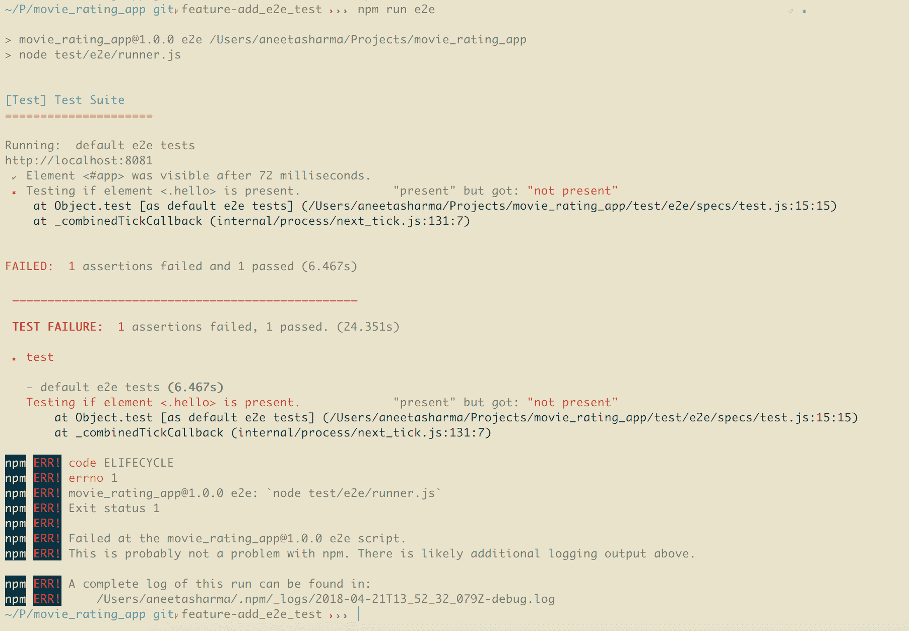

测试失败是因为我们的应用程序中没有具有`.hello`类的元素。因此，为了使测试通过，我们首先需要为元素添加标识符，这将作为`e2e`测试的一部分来完成，具体步骤如下。

以下是我们希望通过`e2e`测试捕获的内容：

1.  使用`http://localhost:8081`打开浏览器

1.  检查是否存在具有`#inspire`ID 的元素。我们在`App.vue`中使用以下代码定义了这一点：

```js
<template>
  <v-app id="inspire">
    <v-navigation-drawer
      fixed
      v-model="drawer"
      app
    >
```

1.  检查侧边栏是否包含`Home`和`Contact`页面链接

1.  点击`Contact`页面

1.  联系页面应包含文本`this is contact`

1.  点击登录页面，确保登录正常工作

1.  向我们的应用程序添加电影

1.  对电影进行评分

1.  最后，添加用户注销应用的功能

这些是我们应用程序的重要部分。因此，我们需要为所有先前的组件添加标识符。在构建应用程序本身时，为元素添加标识符的最佳实践是定义`class`或`id`。但是，我们将为当前分配一个标识符。

在`App.vue`中，使用以下代码更新高亮部分：

```js
<template>
  <v-app id="inspire">
    <v-navigation-drawer
      fixed
      v-model="drawer"
      app
    >
      <v-list dense>
        <router-link v-bind:to="{ name: 'Home' }" class="side_bar_link">
          <v-list-tile>
            <v-list-tile-action>
              <v-icon>home</v-icon>
            </v-list-tile-action>
            <v-list-tile-content id="home">Home</v-list-tile-content>
          </v-list-tile>
        </router-link>
        <router-link v-bind:to="{ name: 'Contact' }" class="side_bar_link">
          <v-list-tile>
            <v-list-tile-action>
              <v-icon>contact_mail</v-icon>
            </v-list-tile-action>
            <v-list-tile-content id="contact">Contact</v-list-tile-content>
          </v-list-tile>
        </router-link>
      </v-list>
    </v-navigation-drawer>
    <v-toolbar color="indigo" dark fixed app>
      <v-toolbar-side-icon id="drawer" @click.stop="drawer = !drawer"></v-toolbar-side-icon>
      <v-toolbar-title>Home</v-toolbar-title>
      <v-spacer></v-spacer>
      <v-toolbar-items class="hidden-sm-and-down">
        <v-btn id="add_movie_link" flat v-bind:to="{ name: 'AddMovie' }"
          v-if="current_user && current_user.role === 'admin'">
          Add Movie
        </v-btn>
        <v-btn id="user_email" flat v-if="current_user">{{ current_user.email }}</v-btn>
        <v-btn flat v-bind:to="{ name: 'Register' }" v-if="!current_user" id="register_btn">
          Register
        </v-btn>
        <v-btn flat v-bind:to="{ name: 'Login' }" v-if="!current_user" id="login_btn">Login</v-btn>
        <v-btn id="logout_btn" flat v-if="current_user" @click="logout">Logout</v-btn>
      </v-toolbar-items>
    </v-toolbar>
    <v-content>
      <v-container fluid>
        <div id="app">
          <router-view/>
        </div>
      </v-container>
    </v-content>
    <v-footer color="indigo" app>
      <span class="white--text">&copy; 2017</span>
    </v-footer>
  </v-app>
</template>

<script>
import axios from 'axios';

import './assets/stylesheets/main.css';
import bus from './bus';

export default {
  name: 'app',
  data: () => ({
    drawer: null,
    current_user: null,
  }),
  props: {
    source: String,
  },
  mounted() {
    this.fetchUser();
    this.listenToEvents();
  },
  methods: {
    listenToEvents() {
      bus.$on('refreshUser', () => {
        this.fetchUser();
      });
    },
    async fetchUser() {
      return axios({
        method: 'get',
        url: '/api/current_user',
      })
        .then((response) => {
          this.current_user = response.data.current_user;
        })
        .catch(() => {
        });
    },
    logout() {
      return axios({
        method: 'get',
        url: '/api/logout',
      })
        .then(() => {
          bus.$emit('refreshUser');
 this.$router.push({ name: 'Home' });
        })
        .catch(() => {
        });
    },
  },
};
</script>

```

此外，让我们更新`AddMovie.vue`中的`id`：

```js
<template>
  <v-form v-model="valid" ref="form" lazy-validation>
    <v-text-field
      label="Movie Name"
      v-model="name"
      :rules="nameRules"
      id="name"
      required
    ></v-text-field>
    <v-text-field
      name="input-7-1"
      label="Movie Description"
      v-model="description"
      id="description"
      multi-line
    ></v-text-field>
    <v-select
      label="Movie Release Year"
      v-model="release_year"
      required
      :rules="releaseRules"
      :items="years"
      id="release_year"
    ></v-select>
    <v-text-field
      label="Movie Genre"
      v-model="genre"
      id="genre"
      required
      :rules="genreRules"
    ></v-text-field>
    <v-btn
      @click="submit"
      :disabled="!valid"
      id="add_movie_btn"
    >
      submit
    </v-btn>
    <v-btn @click="clear">clear</v-btn>
  </v-form>
</template>
```

此外，在`Login.vue`中，让我们为表单字段添加相应的`id`：

```js
<template>
  <div>
    <div class="login">
      <a href="/login/facebook">Facebook</a>
      <a href="/login/twitter">Twitter</a>
      <a href="/login/google">Google</a>
      <a href="/login/linkedin">Linkedin</a>
    </div>
    <v-form v-model="valid" ref="form" lazy-validation>
      <v-text-field
        label="Email"
        v-model="email"
        :rules="emailRules"
        id="email"
        required
      ></v-text-field>
      <v-text-field
        label="Password"
        v-model="password"
        :rules="passwordRules"
        id="password"
        required
      ></v-text-field>
      <v-btn
        @click="submit"
        :disabled="!valid"
        id="login"
      >
        submit
      </v-btn>
      <v-btn @click="clear" id="clear_input">clear</v-btn><br/>
    </v-form>
  </div>
</template>
```

在`Movie.vue`中，使用以下代码更新`Rate this Movie`的`id`：

```js
<template>
  <v-layout row wrap>
    <v-flex xs4>
      <v-card>
        <v-card-title primary-title>
          <div>
            <div class="headline">{{ movie.name }}</div>
            <span class="grey--text">{{ movie.release_year }} ‧ {{ movie.genre }}</span>
          </div>
        </v-card-title>
        <h6 class="card-title" id="rate_movie" v-if="current_user" @click="rate">
          Rate this movie
        </h6>
        <v-card-text>
          {{ movie.description }}
        </v-card-text>
      </v-card>
    </v-flex>
  </v-layout>
</template>
```

我们已经为所有组件添加了必要的标识符。现在，让我们为先前提到的场景添加`e2e`测试。

用以下代码替换`test/e2e/specs/test.js`的内容：

```js
// For authoring Nightwatch tests, see
// http://nightwatchjs.org/guide#usage

module.exports = {
  'default e2e tests': function test(browser) {
    // automatically uses dev Server port from /config.index.js
    // default: http://localhost:8080
    // see nightwatch.conf.js
    const devServer = browser.globals.devServerURL;
    console.log(devServer)

    browser
 .url(devServer)
 .waitForElementVisible('#inspire', 9000)
 .assert.elementPresent('.list')
 .assert.elementPresent('.list .side_bar_link')
 .assert.elementPresent('.side_bar_link #home')
 .assert.elementPresent('.side_bar_link #contact')
 .click('#drawer')
 .pause(1000)
 .click('#contact')
 .pause(1000)
 .assert.elementPresent('#inspire .contact')
 .assert.containsText('#inspire .contact h1', 'this is contact')
 .pause(1000)
 .click('#login_btn')
 .pause(1000)
 .assert.elementCount('input', 2)
 .setValue('input#email', 'get.aneeta@gmail.com')
 .setValue('input#password', 'secret')
 .pause(1000)
 .click('#login')
 .pause(1000)
 .click('.swal-button--confirm')
 .pause(1000)
 .assert.containsText('#user_email', 'GET.ANEETA@GMAIL.COM')
 .click('#add_movie_link')
 .pause(2000)
 .assert.elementCount('input', 3)
 .assert.elementCount('textarea', 1)
 .setValue('input#name', 'Avengers: Infinity War')
 .setValue('textarea#description', 'Iron Man, Thor, the Hulk and the rest of the Avengers unite 
      to battle their most powerful enemy yet -- the evil Thanos. On a mission to collect all six 
      Infinity Stones, Thanos plans to use the artifacts to inflict his twisted will on reality.')
 .click('.input-group__selections')
 .pause(1000)
 .click('.list a ')
 .setValue('input#genre', 'Fantasy/Science fiction film')
 .click('#add_movie_btn')
 .pause(1000)
 .click('.swal-button--confirm')
 .pause(1000)
 .click('.headline:nth-child(1)')
 .pause(1000)
 .assert.containsText('#rate_movie', 'Rate this movie')
 .click('#rate_movie')
 .pause(1000)
 .click('.vue-star-rating span:nth-child(3)')
 .pause(1000)
 .click('.swal-button--confirm')
 .pause(1000)
 .click('.swal-button--confirm')
 .pause(1000)
 .click('#logout_btn')
 .end();
  },
};
```

要运行`e2e`脚本，请确保我们在`package.json`中设置了正确的命令：

```js
...
"scripts": {
    "dev": "webpack-dev-server --inline --progress --config build/webpack.dev.conf.js",
    "start": "nodemon server.js",
    "unit": "cross-env BABEL_ENV=test karma start test/unit/karma.conf.js --single-run",
    "e2e": "node test/e2e/runner.js",
    "test": "npm run unit && npm run e2e",
    "lint": "eslint --ext .js,.vue src test/unit test/e2e/specs",
    "build": "node build/build.js",
    "heroku-postbuild": "npm install --only=dev --no-shrinkwrap && npm run build"
  },
...
```

添加`e2e`脚本后，我们应该能够使用以下命令运行测试：

```js
$ npm run e2e 
```

现在，所有测试应该通过，并且输出应如下所示：

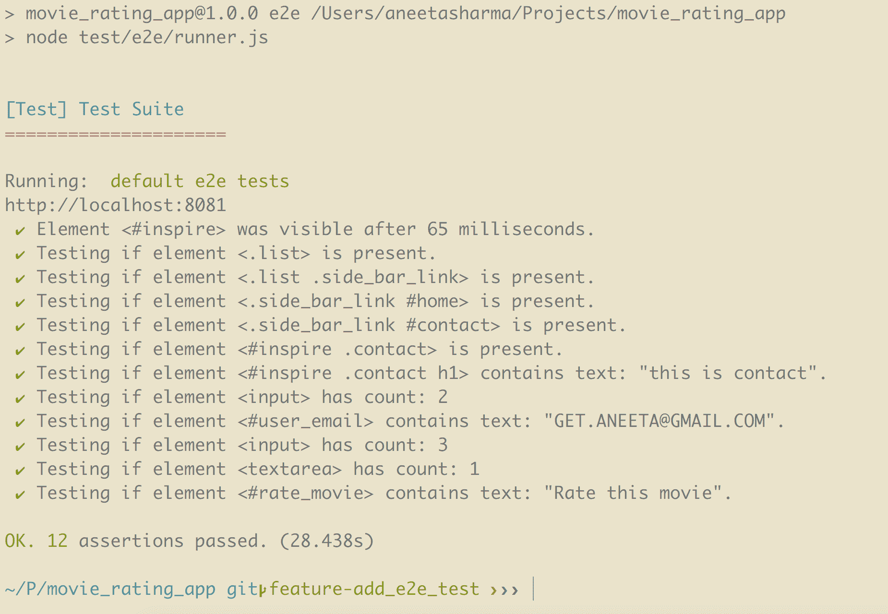

# 总结

在本章中，您学习了如何编写单元测试，并讨论了可以用来编写它们的不同技术，例如`chai`，`mocha`和`sinon`。您还学会了为控制器、模型和 Vue 组件编写测试。

在下一章中，您将学习有关持续集成以及如何使用 GitHub 将应用程序部署到 Heroku 的内容。
