# 第十章：上线

在上一章中，我们学习了如何为我们的应用程序的 Node.js 和 Vue.js 组件编写测试。我们了解了我们可以使用哪些技术来测试 MEVN 应用程序。

在本章中，我们将学习什么是**持续集成**（**CI**），它如何使我们的生活更轻松，以及我们如何在 Heroku 中部署我们的应用程序。

# 持续集成

CI 是软件开发过程中的一种实践，团队中的每个成员都在代码中进行持续的小改动，并将其集成回原始代码库中。每次更改后，开发人员都会将其推送到 GitHub，并在该更改中自动运行测试。这有助于检查更改的代码中是否存在任何错误或问题。

考虑这样一个场景，多个开发人员正在同一个应用程序上工作。每个开发人员都在不同的分支上独立工作。他们都构建功能并为他们构建的功能编写测试代码。一切都进行得很顺利。然后当功能完成时，他们尝试集成所有功能，突然一切都崩溃了。测试也失败了，许多错误开始出现。

如果应用程序很小，那就不是很大的问题，因为错误可以很容易地修复。但如果是一个大型项目，那么仅仅弄清楚出了什么问题就已经很困难了，更不用说修复它了。这就是 CI 的由来。

CI 的实践是为了减轻集成软件时的风险。CI 的规则是早期和频繁地集成，这有助于在向现有代码库添加新功能的过程中及早识别错误和问题。因此，CI 鼓励我们在每次提交到代码库的更改上构建代码库并运行测试套件，而不是等待每个组件的完成。

# CI 的工作流程

这是一个解释 CI 如何工作的图表：

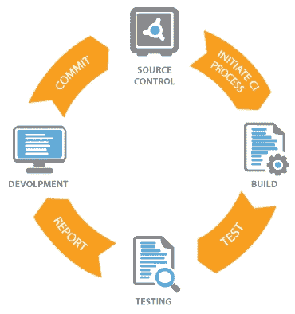

在现实世界的场景中，多个开发人员在同一个应用程序上工作。他们在各自的机器上分别工作。当他们对代码库进行更改时，他们将其推送到他们正在使用的版本控制系统中的存储库中。

现在，这个更改触发了我们集成到应用程序中的 CI 流程，自动运行测试套件并对我们更改的代码进行质量检查。

如果测试套件通过，则进入进一步测试整个应用程序的流程，并交给质量保证人员。

但是，如果测试失败，那么开发人员或整个团队都会收到通知。然后负责该更改的开发人员进行必要的更改以修复错误，进行提交，并将修复后的代码更改推送到存储库。然后，重复相同的过程，直到测试通过。因此，如果有任何错误，它们会在早期被识别并及早修复。

# CI 的好处

现在我们知道了 CI 是什么以及为什么我们应该使用它，让我们来看看它提供的一些好处：

+   自动构建和测试应用程序：虽然预期开发人员在将更改的代码推送到存储库之前构建应用程序并运行测试，但有时开发人员可能会忘记。在这种情况下，集成持续集成流程有助于使流程自动化。

+   给予部署的信心：由于 CI 检查测试套件，并且我们可以配置它来检查我们代码库中代码的质量，我们不需要担心在将代码推送到 GitHub 之前忘记运行测试。

+   简单配置：CI 非常容易配置。我们只需要创建一个包含所有配置的单个文件。

+   错误报告：这是 CI 的强大功能之一。当构建或运行测试时出现问题时，团队会收到通知。它还可以提供关于谁做了什么更改的信息，这很棒。

# Travis CI 简介

现在我们了解了 CI，我们也需要在我们的应用程序中开始使用它。有几种技术可以用于为任何应用程序遵循 CI 流程。有很多工具，每种工具都有其自己的使用优势；我们将为我们的应用程序选择**Travis CI**。

Travis CI 是用于构建 CI 服务器的技术。Travis CI 与 GitHub 一起广泛使用。还有一些其他工具。其中一些是：

+   Circle CI

+   Jenkins

+   信号量 CI

+   无人机

如果您想了解每个选项的更多信息，可以阅读以下内容：

[`blog.github.com/2017-11-07-github-welcomes-all-ci-tools/.`](https://blog.github.com/2017-11-07-github-welcomes-all-ci-tools/)

Travis CI 用于为每次对 GitHub 进行的推送构建，并且非常容易设置。

# 在应用程序中设置 Travis

让我们继续进行设置。这里要做的第一件事是查看 Travis CI 的官方网站[`travis-ci.org/`](https://travis-ci.org/)。

# 激活存储库

我们首先需要注册，可以使用 GitHub 登录轻松完成。完成后，您应该看到您现有的存储库列表。选择要设置 Travis CI 的应用程序，您将能够看到以下页面：

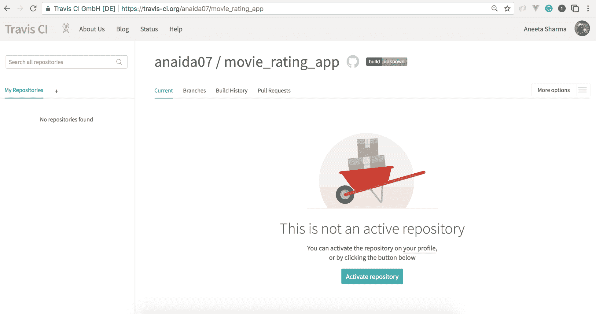

# 指定 Node.js 版本

现在，激活您要在其中添加 Travis CI 的存储库。我们可以在我们的个人资料中看到我们的存储库列表。选择应用程序，然后单击复选标记以在存储库中激活 Travis CI。现在下一步是添加配置详细信息。首先要做的是指定我们将在应用程序中使用的`node`版本。

在根目录的应用程序中创建`.travis.yml`文件：

```js
// travis.yml
language: node_js
node_js:
 - "10.0.0"
```

现在，这个代码块告诉这是一个 Node.js 项目，并且该项目的 Node.js 版本是`10.0.0`。您必须指定安装在应用程序中的 Node.js。您可以使用以下命令检查版本：

```js
$ node -v 
```

您也可以在`.travis.yml`文件中指定相同的版本。

如果指定的版本不是标准或可用的 Node.js 版本，则会引发错误。

我们还可以在名为`.nvmrc`的文件中指定要用于构建项目的 Node.js 版本。如果在`.travis.yml`文件中未指定版本，则`travis.yml`文件将读取此文件的内容。

# 构建脚本

现在下一步是告诉 Travis 运行测试套件。这部分在`.travis.yml`文件的`script`键中指定。Node.js 项目的默认构建脚本是`npm test`。但首先让我们添加一个单个命令在单个文件中运行，以便快速。更新`.travis.yml`文件的内容如下：

```js
language: node_js
node_js:
  - "10.0.0"
script: npm run unit
```

这告诉`script`在对存储库进行任何更改时运行单元测试。

# 管理依赖

下一步是安装依赖项。默认情况下，Travis CI 不会添加任何依赖项。以下命令告诉 Travis CI 在构建`script`之前下载依赖项。它使用`npm`来安装依赖项，因此让我们添加一个`script`来安装这些依赖项：

```js
language: node_js
node_js:
  - "10.0.0"
before_script:
 - npm install
script: npm run unit
```

就是这样。我们已成功为我们的应用程序配置了 Travis CI。

现在，让我们提交并将此文件推送到 GitHub。这样做时，请检查`travis.org`上的分支以查看所有构建：

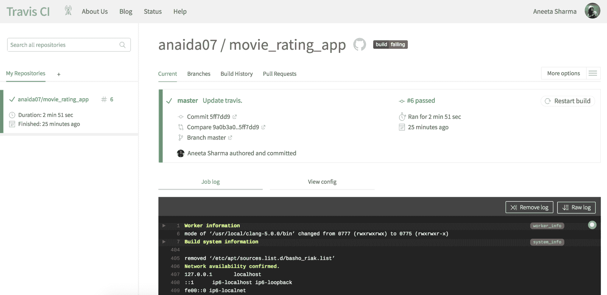

在这里，`master`是我们添加了 Travis CI 构建并且构建通过的分支。您可以通过点击构建来查看`master`分支的详细信息。

虽然这是查看构建的一个好方法，但最好的方法是为每个分支创建一个拉取请求，并在该拉取请求本身中查看构建是否通过或失败。因此，让我们创建一个新的拉取请求，以查看如何最好地利用 Travis CI 来使我们的生活更轻松。

让我们创建一个名为`setup_travis`的分支（您可以为分支命名任何名称，但请确保它指示特定更改，以便更容易识别该分支可以期望的更改）使用以下命令：

```js
$ git checkout -b setup_travis 
```

让我们对应用程序进行简单更改，以便我们的拉取请求包含一些差异。

使用以下内容更新`README.md`文件：

```js
# movie_rating_app

> A Vue.js project

## Build Setup

``` bash

# 安装依赖项

npm install

# 在 localhost:8080 上使用热重新加载进行服务

npm run dev

# 构建以缩小生产

npm run build

# 为生产构建并查看捆绑分析器报告

npm run build --report

# 运行单元测试

npm run unit

# 运行端到端测试

npm run e2e

# 运行所有测试

npm test

```js
```

然后，使用以下命令对更改进行`commit`：

```js
$ git add README.md
$ git commit -m 'Update readme'
```

最后，使用以下命令将更改推送到 GitHub：

```js
$ git push origin setup_travis
```

现在，如果我们转到此应用程序的 GitHub 存储库页面，我们应该能够看到以下内容：

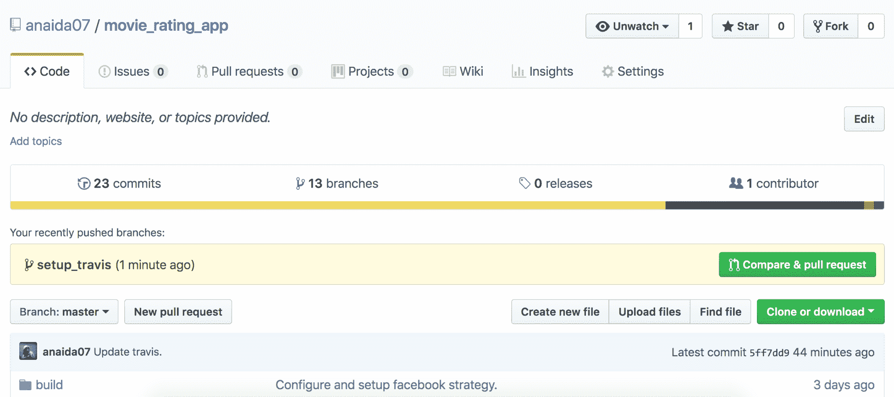

单击“比较和拉取请求”按钮。然后添加必要的描述，点击“创建拉取请求”按钮。

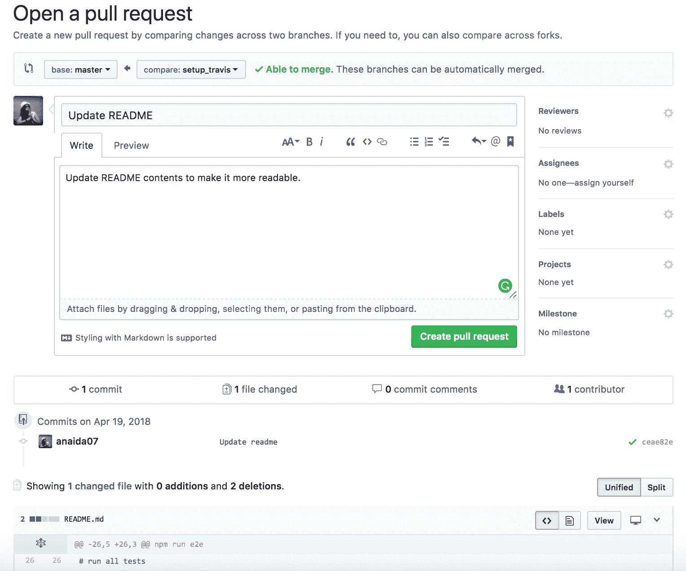

一旦创建拉取请求，Travis CI 将开始构建应用程序，随着您继续添加更多提交并推送更改，Travis CI 将为每个提交构建应用程序。

在将任何更改推送到 GitHub 之前运行测试是一个很好的做法，Travis CI 构建有助于在每次提交时构建应用程序，以便在出现故障时通知我们。

我们还可以添加设置，以便在构建失败或成功时通过电子邮件或任何其他机制通知我们。默认情况下，Travis CI 将通过电子邮件通知我们，如下面的屏幕截图所示：

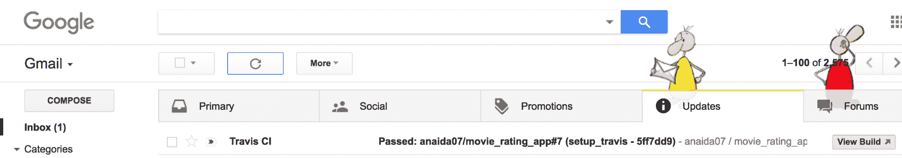

您可以在此处看到 Travis CI 已成功集成，并且测试也通过了：

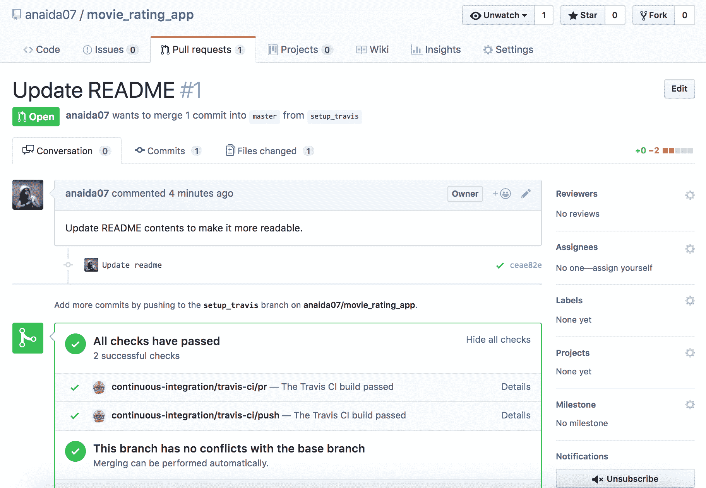

当我们点击“详细信息”时，我们可以看到构建的详细日志：

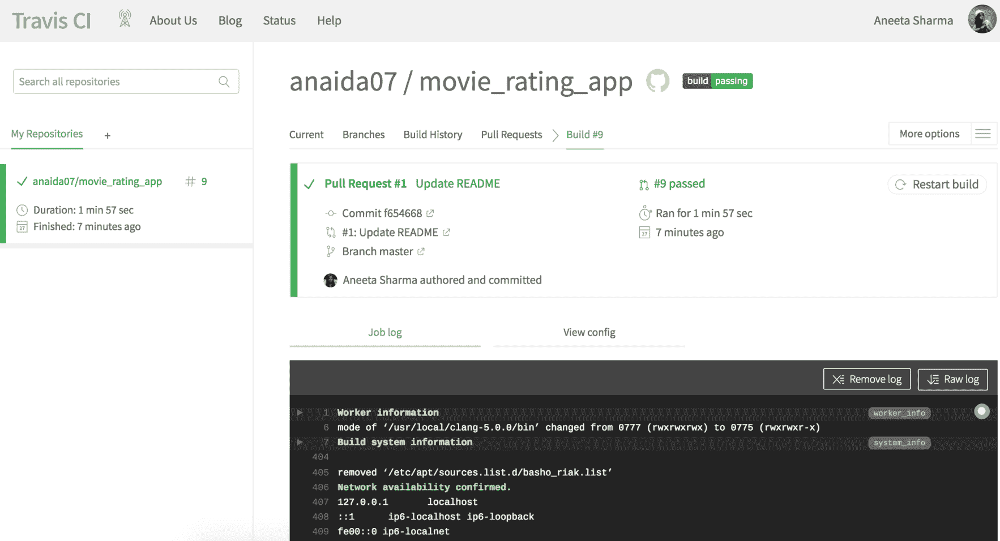

一旦我们对更改感到满意，我们就可以将拉取请求合并到主分支：

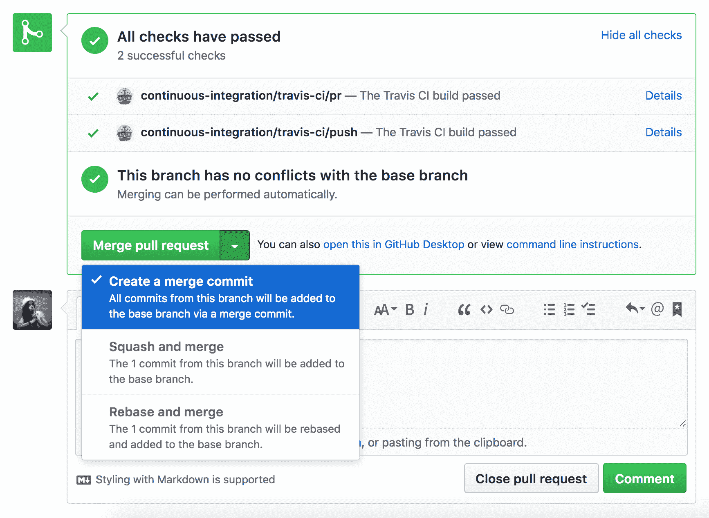

# Heroku 简介

开发应用程序的最后和最重要的部分是部署它。 Heroku 是一种云平台即服务。这是一个云平台，我们可以在其中托管我们的应用程序。 Heroku 是部署和管理我们的应用程序的简单而优雅的方式。

使用 Heroku，我们可以部署使用 Node.js 编写的应用程序，以及许多其他编程语言，如 Ruby、Java 和 Python。无论编程语言如何，Heroku 应用程序所需的设置在所有语言中都是相同的。

有几种使用 Heroku 部署我们的应用程序的方法，例如使用 Git、GitHub、Dropbox 或通过 API。在本章中，我们将专注于使用 Heroku 客户端部署我们的应用程序。

# 设置 Heroku 帐户

要开始在 Heroku 中部署应用程序，我们首先需要创建一个帐户。您可以直接从[`www.heroku.com/`](https://www.heroku.com/)创建您自己的帐户。如果您想了解有关不同类型的应用程序的更多信息，可以在[`devcenter.heroku.com/`](https://devcenter.heroku.com/)上查看官方文档。

创建帐户后，您应该能够看到自己的仪表板：

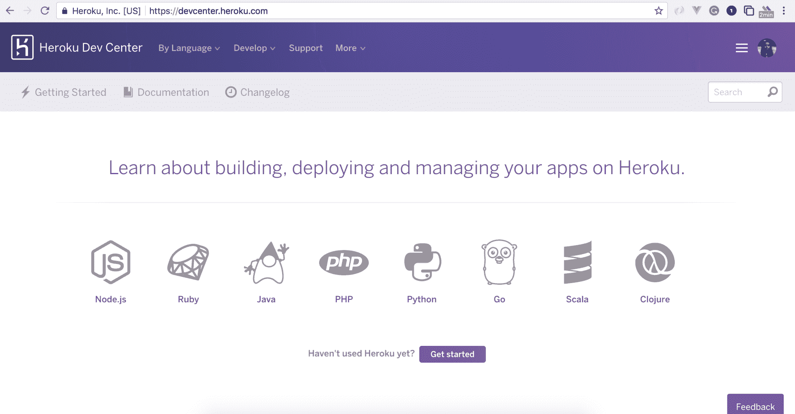

# 创建一个 Node.js 应用程序

Heroku 为我们将构建的应用程序提供了许多选项。它支持 Node.js、Ruby、Java、PHP、Python、Go、Scala 和 Clojure。让我们继续从仪表板中选择 Node.js。

本文档本身将在您按照每个步骤进行时指导您。让我们继续在 Heroku 中部署我们自己的应用程序。

# 安装 Heroku

首先要做的事情是安装 Heroku。

# 在 Windows 中安装 Heroku

我们可以通过从官方页面下载安装程序并运行安装程序来简单地在 Windows 中安装 Heroku，网址为[`devcenter.heroku.com/articles/heroku-cli#download-and-install`](https://devcenter.heroku.com/articles/heroku-cli#download-and-install)。

# 在 Linux 中安装 Heroku

在 Linux 中，可以通过一个命令安装 Heroku：

```js
$ wget -qO- https://cli-assets.heroku.com/install-ubuntu.sh | sh
```

# 在 macOS X 中安装 Heroku

我们可以使用`homebrew`在 macOS 上安装 Heroku：

```js
$ brew install heroku/brew/heroku
```

我们可以使用以下命令检查`Heroku`是否已安装：

```js
$ heroku -v
```

这应该打印我们刚刚安装的 Heroku 的版本。

# 部署到 Heroku

安装 Heroku 后，让我们转到`https://dashboard.heroku.com/apps`，在那里我们将为我们的项目创建一个 Heroku 应用程序。单击“创建新应用”按钮，输入您要为应用程序提供的应用程序名称。我们将为我们的应用程序命名为`movie-rating-app-1`：

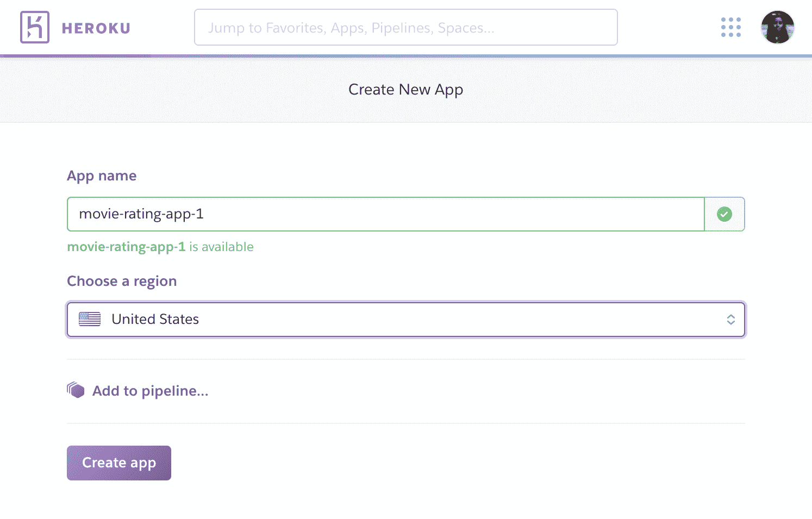

这将创建一个 Heroku 应用程序。现在，让我们切换到终端中的应用程序并运行以下命令：

```js
$ cd movie_rating_app
$ heroku login
```

此命令将提示您输入您的电子邮件和密码：

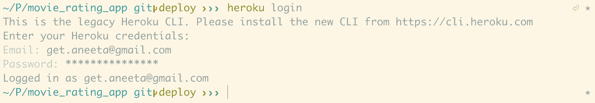

现在，如果您已经在应用程序中初始化了 Git 存储库，则可以跳过以下代码片段中的`git init`部分：

```js
$ git init
$ heroku git:remote -a movie-rating-app-1
```

此命令将链接我们的应用程序到我们刚刚创建的 Heroku 应用程序。

设置部分完成。现在，我们可以继续对应用程序进行一些更改。像我们迄今为止一直在做的那样，提交到 GitHub 存储库并推送更改。

现在，部署到 Heroku 应用程序的简单命令是运行以下命令：

```js
$ git push heroku master
```

这里有几件事情需要注意。

由于我们正在使用`serve-static`包将 Vue.js 组件转换为静态文件进行服务，我们需要更新`package.json`中的启动脚本以运行`node`服务器。让我们在`package.json`中使用以下行更新启动脚本：

```js
"scripts": {
    "dev": "webpack-dev-server --inline --progress --config build/webpack.dev.conf.js",
    "start": "nodemon server.js",
    "unit": "cross-env BABEL_ENV=test karma start test/unit/karma.conf.js --single-run",
    "e2e": "node test/e2e/runner.js",
    "test": "npm run unit && npm run e2e",
    "lint": "eslint --ext .js,.vue src test/unit test/e2e/specs",
    "build": "node build/build.js",
    "heroku-postbuild": "npm install --only=dev --no-shrinkwrap && npm run build"
  },
```

此外，在`config/Config.js`文件中，我们有以下内容：

```js
module.exports = {
  DB: 'mongodb://localhost/movie_rating_app',
  SECRET: 'movieratingappsecretkey',
  FACEBOOK_APP_ID: <facebook_client_id>,
  FACEBOOK_APP_SECRET: <facebook_client_secret>,
  TWITTER_APP_ID: <twitter_consumer_id>,
  TWITTER_APP_SECRET: <twitter_consumer_secret>,
  GOOGLE_APP_ID: <google_consumer_id>,
  GOOGLE_APP_SECRET: <google_consumer_secret>,
  LINKEDIN_APP_ID: <linkedin_consumer_id>,
  LINKEDIN_APP_SECRET: <linkedin_consumer_secret>
}
```

在这里，我们正在指定本地 MongoDB URL，当我们在 Heroku 上托管我们的应用程序时，它将无法工作。为此，我们可以使用一个名为**mLab**的工具。mLab 是一个用于 MongoDB 的数据库服务工具。mLab 允许我们为沙箱数据库创建尽可能多的数据库。

让我们继续在[`mlab.com/`](https://mlab.com/)上创建一个帐户。一旦您登录，单击“创建新”按钮创建一个新数据库：

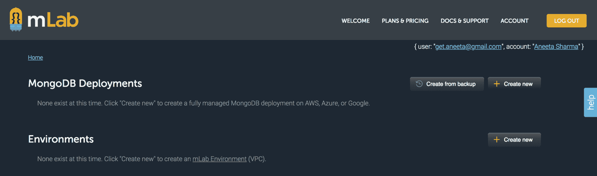

我们可以选择任何我们想要的云提供商。选择沙箱计划类型，然后单击“继续”。选择任何地区，然后单击“继续”，并添加您想要为应用程序使用的数据库名称。最后，单击“提交订单”：

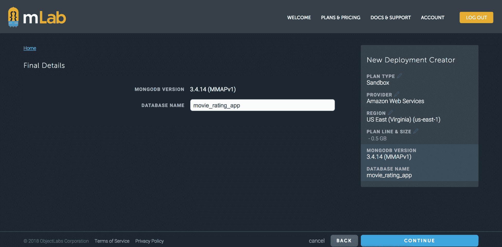

现在，如果我们单击数据库名称，我们可以看到 mLab 提供的 MongoDB URL 的链接。我们还需要创建一个数据库用户，以便能够对数据库进行身份验证。

转到用户选项卡，单击添加数据库用户，提供用户名和密码，然后单击创建。

我们应该能够在数据库配置页面中看到 MongoDB URL：

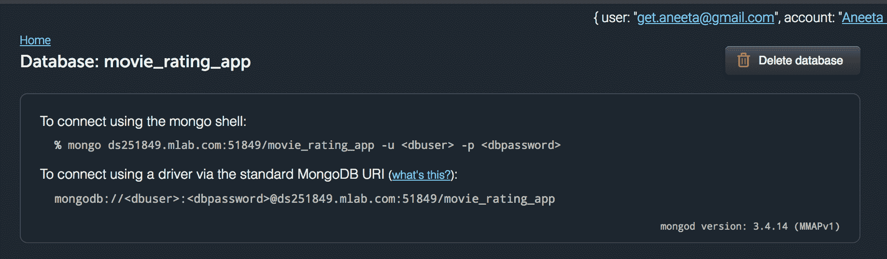

让我们在`config/Config.js`中更新 MongoDB URL：

```js
module.exports = {
  mongodb://<dbuser>:<dbpassword>@ds251849.mlab.com:51849/movie_rating_app
  SECRET: 'movieratingappsecretkey',
  FACEBOOK_APP_ID: <facebook_client_id>,
  FACEBOOK_APP_SECRET: <facebook_client_secret>,
  TWITTER_APP_ID: <twitter_consumer_id>,
  TWITTER_APP_SECRET: <twitter_consumer_secret>,
  GOOGLE_APP_ID: <google_consumer_id>,
  GOOGLE_APP_SECRET: <google_consumer_secret>,
  LINKEDIN_APP_ID: <linkedin_consumer_id>,
  LINKEDIN_APP_SECRET: <linkedin_consumer_secret>
}
```

我们需要更改的最后一件事是应用程序的端口。Heroku 应用程序在部署应用程序时会自动分配一个端口。我们应该只在开发环境中使用端口`8081`。因此，让我们验证我们的`server.js`是否具有以下代码：

```js
const port = process.env.PORT || 8081;
app.use('/', router);
var server = app.listen(port, function() {
  console.log(`api running on port ${port}`);
});

module.exports = server
```

现在，让我们提交并推送更改到`master`，然后再次部署：

```js
$ git add package.json config/Config.js server.js
$ git commit 'Update MongoDB url and app port'
$ git push origin master
$ git push heroku master
```

应用程序应该成功部署到 Heroku，我们应该能够在[`movie-rating-app-1.herokuapp.com/`](https://movie-rating-app-1.herokuapp.com/)上查看我们的应用程序：

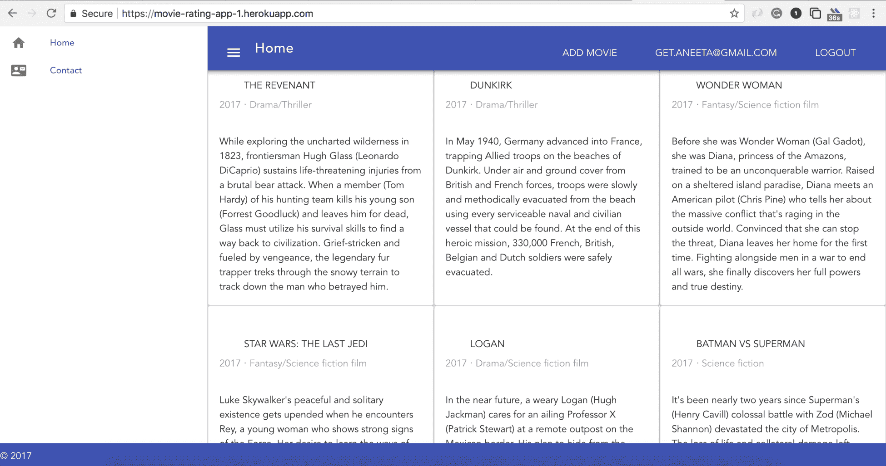

# Heroku 错误日志

如果在 Heroku 部署时出现问题，我们还可以使用以下命令查看 Heroku 提供的错误日志：

```js
$ heroku logs -t
```

# 总结

在本章中，我们学习了 CI 是什么，以及如何使用它使应用程序中的构建自动化。我们还学习了如何使用 Heroku 集成部署应用程序。总的来说，我们学会了如何使用 Vue.js 和 Node.js 技术构建全栈 Web 应用程序，集成了不同的身份验证机制，还学会了如何为应用程序编写测试并进行部署。恭喜！

这只是你将要继续前行的旅程的开始。现在你应该能够使用我们在这里学到的所有技术来制作小到大规模的应用程序。

这本书为你提供了使用 JavaScript 作为唯一编程语言，使用 MEVN 堆栈构建应用程序的技能。如果你打算构建自己的完整应用程序，这可能是一个很好的开始。希望你喜欢阅读这本书，并继续构建令人敬畏的应用程序！
