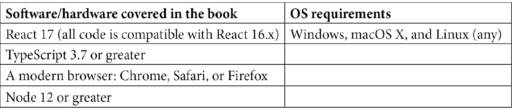

# 前言

根据 GitHub，这是全球最大的开源软件仓库，JavaScript 仍然是世界上最流行的编程语言。比任何其他语言都有更多的项目是用 JavaScript 编写的。甚至通常不与 Web 相关的项目，如机器学习和加密货币，也经常使用 JavaScript。

JavaScript 编程语言非常强大和有能力，但除了语言本身，还有一些框架，包括 React 和 Node，可以增强语言的功能，使其变得更好。此外，TypeScript 现在已成为进行大型 JavaScript 项目的标准。它提供了使 JavaScript 编码更加高效和更适合大型应用程序的语言特性。

现代 Web 开发在多年来取得了巨大进步。过去，客户端代码通常意味着静态的 HTML 和 CSS，可能还有少量的 JavaScript。而后端通常是用完全不同的语言编写的，比如 PHP 或 CGI 脚本。然而，现在通常使用 JavaScript 及其相关框架来编写从客户端到服务器的整个应用程序。只使用一种语言来编写我们的应用程序在开发过程中提供了巨大的好处。此外，可用的强大和成熟的框架使得 JavaScript 全栈编程与任何其他平台竞争力。

在这本书中，我们将学习如何利用 JavaScript 的力量来构建完整的全栈 Web 应用程序。我们将使用 TypeScript 来增强这种力量，TypeScript 是另一种功能强大的前十语言。然后，我们将使用诸如 React、Redux、Node、Express 和 GraphQL 等框架来构建一个现实的、完全功能的最佳实践 Web 应用程序，这将为您提供构建现代全栈 Web 应用程序所需的所有知识。一旦我们的应用程序完成，我们将部署到 AWS 云服务，这是全球最受欢迎和功能丰富的云服务提供商。

# 这本书适合谁

这本书是为那些想要超越前端 Web 开发，进入全栈 Web 开发世界的 Web 开发人员而写的，通过学习现代 Web 技术以及它们如何结合在一起。在开始阅读本 Web 开发书之前，需要对 JavaScript 编程有很好的理解。

# 本书涵盖内容

[*第一章*]《理解 TypeScript》解释了 TypeScript 是什么，以及它为何在大型应用程序开发中是理想的选择。

[*第二章*]《探索 TypeScript》深入探讨了 TypeScript。我们将探索其特性，包括静态类型，以及为什么这些特性比 JavaScript 更好。我们还将研究面向对象编程的应用程序设计以及 TypeScript 特性如何实现这一重要的编程范式。

[*第三章*]《使用 ES6+功能构建更好的应用程序》回顾了每个开发人员都需要了解的 JavaScript 的重要功能。我们将重点关注 ES6 及更高版本中新增的最新功能。

[*第四章*]《学习单页应用程序概念以及 React 如何实现它们》解释了网站是如何构建的，并专注于单页应用程序风格的应用程序。然后我们将介绍 React 以及 React 如何用于创建单页应用程序。

[*第五章*]《使用 Hooks 进行 React 开发》深入探讨了 React。我们将了解旧的类式编写 React 应用程序的局限性，以及学习 Hooks 和函数组件以及它们如何改进旧的类式。

*第六章*，*使用 create-react-app 设置我们的项目并使用 Jest 进行测试*，描述了用于开发 React 应用程序的现代方法。这包括创建 React 项目的标准`create-react-app`，以及使用 Jest 和 testing-library 进行客户端测试。

*第七章*，*学习 Redux 和 React Router*，涵盖了 Redux 和 React Router，帮助我们构建 React 应用程序。自 React 诞生以来，这两个框架一直是管理状态和路由的首选框架。

*第八章*，*学习使用 Node.js 和 Express 进行服务器端开发*，涵盖了 Node 和 Express。Node 是使 JavaScript 服务器应用程序成为可能的基础运行时。Express 是围绕 Node 的框架，使使用 Node 构建强大的服务器端应用程序变得容易。

*第九章*，*GraphQL 是什么？*，回顾了 GraphQL 是什么，以及它如何使用数据模式来帮助构建 Web API。

*第十章*，*使用 TypeScript 和 GraphQL 依赖项设置 Express 项目*，解释了如何使用 TypeScript、Express、GraphQL 和 Jest 创建一个生产质量的服务器端项目进行测试。

*第十一章*，*我们将学到什么-在线论坛应用*，讨论了我们将要构建的应用程序。我们将回顾其特性，以及构建这样一个应用程序将如何帮助我们更详细地了解 Web 开发。

*第十二章*，*构建我们在线论坛应用的 React 客户端*，解释了如何使用 React 开始编写我们应用程序的客户端。我们将使用函数组件、Hooks 和 Redux 来开始构建我们的屏幕。

*第十三章*，*使用 Express 和 Redis 设置会话状态*，探讨了会话状态是什么，以及如何使用 Redis 创建服务器的会话，Redis 是世界上最强大的内存数据存储。我们还开始使用 Express 编写我们的服务器。

*第十四章*，*使用 TypeORM 设置 Postgres 和存储库层*，解释了如何在 Postgres 中为我们的应用程序创建数据库，以及如何使用称为存储库层的强大设计技术访问它。

*第十五章*，*添加 GraphQL 模式-第一部分*，开始将 GraphQL 集成到我们的应用程序中。我们将构建我们的模式并添加我们的查询和变异。我们还将开始向我们的 React 前端添加 GraphQL Hooks。

*第十六章*，*添加 GraphQL 模式-第二部分*，通过完成将 GraphQL 集成到我们的客户端和服务器中的工作来完成我们的应用程序。

*第十七章*，*将应用程序部署到 AWS*，将我们完成的应用程序部署到 AWS 云服务。我们将使用 Ubuntu Linux 和 NGINX 来托管我们的服务器和客户端代码。

# 为了充分利用本书

你应该至少有一年或更多的编程经验，至少掌握一种现代语言，并且具有一些构建应用程序的基础知识，尽管这不一定是为网络而做的。



本书将提供逐步使用或安装这些依赖项的说明。然而，这个列表确实给出了一些所需的想法。应用程序源代码将是最终完成版本的应用程序。本书将包括任何中间代码。

**如果您使用的是本书的数字版本，我们建议您自己输入代码或通过 GitHub 存储库（链接在下一节中提供）访问代码。这样做将帮助您避免与复制和粘贴代码相关的任何潜在错误。**

理想情况下，您应该始终努力自己输入代码，因为这将帮助您记住代码，并让您在出现问题时有所经验。

# 下载示例代码文件

您可以从 GitHub 上的[`github.com/PacktPublishing/Full-Stack-React-TypeScript-and-Node`](https://github.com/PacktPublishing/Full-Stack-React-TypeScript-and-Node)下载本书的示例代码文件。如果代码有更新，将在现有的 GitHub 存储库上进行更新。

我们还有来自我们丰富书籍和视频目录的其他代码包，可在[`github.com/PacktPublishing/`](https://github.com/PacktPublishing/)上找到。去看看吧！

# 使用的约定

本书中使用了许多文本约定。

`文本中的代码`：表示文本中的代码词、数据库表名、文件夹名、文件名、文件扩展名、路径名、虚拟 URL、用户输入和 Twitter 用户名。这里有一个例子：“在`src`文件夹中创建一个名为`Home.tsx`的新文件，并添加以下代码。”

代码块设置如下：

```ts
let a = 5;
let b = '6';
console.log(a + b);
```

当我们希望引起您对代码块的特定部分的注意时，相关的行或项目将以粗体显示：

```ts
[default]
exten => s,1,Dial(Zap/1|30)
exten => s,2,Voicemail(u100)
exten => s,102,Voicemail(b100)
exten => i,1,Voicemail(s0)
```

任何命令行输入或输出都以以下方式编写：

```ts
 npm install typescript
```

**粗体**：表示新术语、重要单词或屏幕上看到的单词。例如，菜单或对话框中的单词会在文本中以这种方式出现。这里有一个例子：“从**管理**面板中选择**系统信息**。”

提示或重要说明

会以这种方式出现。
