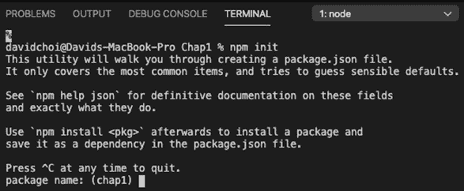
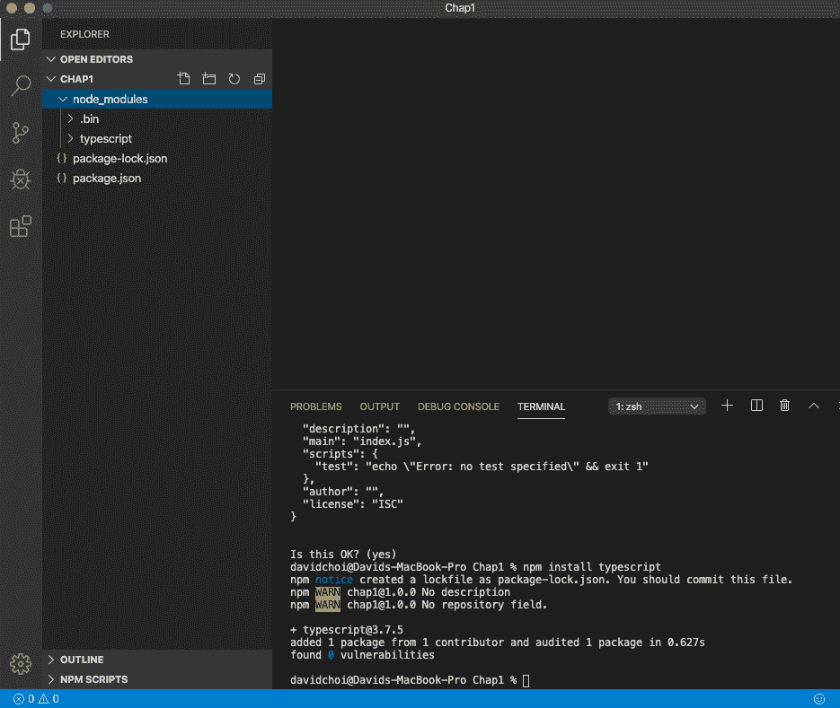
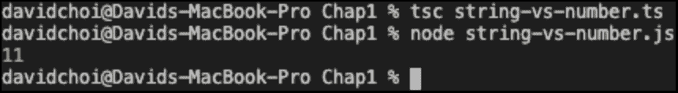
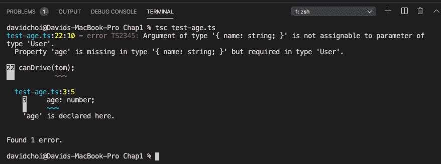
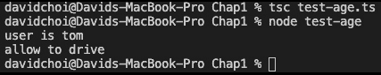

# 第一章：理解 TypeScript

JavaScript 是一种非常流行和强大的语言。根据 GitHub 的数据，它是世界上最流行的语言（是的，甚至比 Python 更多），ES6+中的新功能继续增加有用的功能。然而，对于大型应用程序开发来说，其功能集被认为是不完整的。这就是为什么 TypeScript 被创建的原因。

在本章中，我们将了解 TypeScript 语言，它是如何创建的，以及它为 JavaScript 开发人员提供了什么价值。我们将了解 Microsoft 在创建 TypeScript 时使用的设计哲学，以及为什么这些设计决策为大型应用程序开发提供了重要的支持。

我们还将看到 TypeScript 如何增强和改进 JavaScript。我们将比较 JavaScript 编写代码的方式与 TypeScript 的区别。TypeScript 具有丰富的前沿功能，有利于开发人员。其中最重要的是静态类型和**面向对象编程**（**OOP**）能力。这些功能可以使代码质量更高，更易于维护。

通过本章结束时，您将了解 JavaScript 的一些限制，这些限制使其在大型项目中难以使用。您还将了解 TypeScript 如何填补其中的一些空白，并使编写大型、复杂的应用程序更容易，更不容易出错。

在本章中，我们将涵盖以下主要主题：

+   什么是 TypeScript？

+   为什么需要 TypeScript？

# 技术要求

为了充分利用本章，您应该对 JavaScript 版本 ES5 或更高版本有基本了解，并具有使用 JavaScript 框架构建 Web 应用程序的经验。您还需要安装 Node 和 JavaScript 代码编辑器，如**Visual Studio Code**（**VSCode**）。

您可以在[`github.com/PacktPublishing/Full-Stack-React-TypeScript-and-Node`](https://github.com/PacktPublishing/Full-Stack-React-TypeScript-and-Node)找到本章的 GitHub 存储库。使用`Chap1`文件夹中的代码。

# 什么是 TypeScript？

TypeScript 实际上是两种不同但相关的技术 - 一种语言和一种编译器：

+   该语言是一种功能丰富的静态类型编程语言，为 JavaScript 添加了真正的面向对象的能力。

+   编译器将 TypeScript 代码转换为本机 JavaScript，但也为程序员在编写代码时提供了帮助，减少了错误。

TypeScript 使开发人员能够设计更高质量的软件。语言和编译器的结合增强了开发人员的能力。通过使用 TypeScript，开发人员可以编写更易于理解和重构、包含更少错误的代码。此外，它通过在开发过程中强制修复错误，为开发工作流程增加了纪律性。

TypeScript 是一种开发时技术。它没有运行时组件，也没有任何 TypeScript 代码在任何机器上运行。相反，TypeScript 编译器将 TypeScript 转换为 JavaScript，然后部署和运行该代码在浏览器或服务器上。微软可能考虑开发 TypeScript 的运行时。然而，与操作系统市场不同，微软并不控制 ECMAScript 标准组织（决定 JavaScript 每个版本中将包含什么内容的组织）。因此，获得该组织的支持将是困难且耗时的。因此，微软决定创建一个工具，增强 JavaScript 开发人员的生产力和代码质量。

那么，如果 TypeScript 没有运行时，开发人员如何获得运行代码呢？TypeScript 使用一种称为**转译**的过程。**转译**是一种将一种语言的代码“编译”或转换为另一种语言的方法。这意味着所有 TypeScript 代码最终都会在最终部署和运行之前转换为 JavaScript 代码。

在本节中，我们已经学习了 TypeScript 是什么以及它是如何工作的。在下一节中，我们将学习为什么这些特性对于构建大型复杂应用程序是必要的。

# 为什么需要 TypeScript？

JavaScript 编程语言是由 Brendan Eich 创建的，并于 1995 年添加到 Netscape 浏览器中。从那时起，JavaScript 取得了巨大的成功，现在被用于构建服务器和桌面应用程序。然而，这种流行和普及也成为了一个问题和一个好处。随着越来越大的应用程序被创建，开发人员开始注意到这种语言的局限性。

大型应用程序开发需要比 JavaScript 最初创建的浏览器开发更多的需求。在高层次上，几乎所有大型应用程序开发语言，比如 Java、C++、C#等，都提供静态类型和面向对象编程能力。在本节中，我们将讨论静态类型相对于 JavaScript 动态类型的优势。我们还将了解面向对象编程，以及为什么 JavaScript 的面向对象编程方法对于大型应用程序来说太有限。

但首先，我们需要安装一些包和程序来允许我们的示例。要做到这一点，请按照以下说明操作：

1.  首先让我们安装 Node。你可以从这里下载 Node：[`nodejs.org/`](https://nodejs.org/)。Node 给我们提供了`npm`，这是一个 JavaScript 依赖管理器，它将允许我们安装 TypeScript。我们将在*第八章*中深入学习 Node，*使用 Node.js 和 Express 学习服务器端开发*。

1.  安装 VSCode。它是一个免费的代码编辑器，其高质量和丰富的功能使其迅速成为了在任何平台上编写 JavaScript 代码的标准开发应用程序。你可以使用任何你喜欢的代码编辑器，但我会在本书中广泛使用 VSCode。

1.  在你的个人目录中创建一个名为`HandsOnTypeScript`的文件夹。我们将把所有项目代码保存在这个文件夹中。

重要提示

如果你不想自己输入代码，你可以按照*技术要求*部分提到的方式下载完整的源代码。

1.  在`HandsOnTypeScript`中，创建另一个名为`Chap1`的文件夹。

1.  打开 VSCode，转到**文件** | **打开**，然后打开你刚创建的**Chap1**文件夹。然后，选择**视图** | **终端**，在你的 VSCode 窗口内启用终端窗口。

1.  在终端中输入以下命令。这个命令将初始化你的项目，以便它可以接受`npm`包依赖。你需要这个因为 TypeScript 是作为`npm`包下载的：

```ts
npm init
```

你应该看到一个像这样的屏幕：



图 1.1 – npm 初始化屏幕

你可以接受所有提示的默认值，因为我们现在只安装 TypeScript。

1.  使用以下命令安装 TypeScript：

```ts
npm install typescript
```

在所有项目都安装完成后，你的 VSCode 屏幕应该看起来像这样：



图 1.2 – 安装完成后的 VSCode

我们已经完成了安装和设置环境。现在，我们可以看一些示例，这些示例将帮助我们更好地理解 TypeScript 的好处。

## 动态与静态类型

每种编程语言都有并且使用类型。类型只是描述对象并且可以被重用的一组规则。JavaScript 是一种动态类型语言。在 JavaScript 中，新变量不需要声明它们的类型，即使在设置后，它们也可以被重置为不同的类型。这个特性为语言增加了灵活性，但也是许多 bug 的根源。

TypeScript 使用了一个更好的替代方案叫做**静态类型**。静态类型强制开发人员在创建变量时提前指定变量的类型。这消除了歧义，并消除了许多类型之间的转换错误。在接下来的步骤中，我们将看一些动态类型的缺陷示例，以及 TypeScript 的静态类型如何消除它们：

1.  在`Chap1`文件夹的根目录下，让我们创建一个名为`string-vs-number.ts`的文件。`.ts`文件扩展名是 TypeScript 特有的扩展名，允许 TypeScript 编译器识别该文件并将其转译为 JavaScript。接下来，将以下代码输入到文件中并保存：

```ts
let a = 5;
let b = '6';
console.log(a + b);
```

1.  现在，在终端中，输入以下内容：

```ts
tsc is the command to execute the TypeScript compiler, and the filename is telling the compiler to check and transpile the file into JavaScript. 
```

1.  一旦你运行了`tsc`命令，你应该会在同一个文件夹中看到一个新文件`string-vs-number.js`。让我们运行这个文件：

```ts
node command acts as a runtime environment for the JavaScript file to run. The reason why this works is that Node uses Google's Chrome browser engine, V8, to run JavaScript code. So, once you have run this script, you should see this:

```

将一个数字变量转换为字符串，并将其附加到变量 b。这种情况在现实世界的代码中似乎不太可能发生，但如果不加以检查，它可能会发生，因为在 Web 开发中，大多数来自 HTML 的输入都以字符串形式输入，即使用户输入的是一个数字。

```ts

```

1.  现在，让我们将 TypeScript 的静态类型引入到这段代码中，看看会发生什么。首先，让我们删除`.js`文件，因为 TypeScript 编译器可能会认为`a`和`b`变量有两个副本。看看这段代码：

```ts
let a: number = 5;
let b: number = '6';
console.log(a + b);
```

1.  如果你在这段代码上运行`tsc`编译器，你会得到错误`Type "'6'" is not assignable to the type 'number'`。这正是我们想要的。编译器告诉我们代码中有一个错误，并阻止了成功编译。由于我们指示这两个变量应该是数字，编译器会检查并在发现不符合时进行投诉。因此，如果我们修复这段代码并将`b`设置为一个数字，让我们看看会发生什么：

```ts
let a: number = 5;
let b: number = 6;
console.log(a + b);
```

1.  现在，如果你运行编译器，它将成功完成，并且运行 JavaScript 将得到值`11`：



图 1.3 - 有效数字相加

很好，当我们错误地设置`b`时，TypeScript 捕获了我们的错误，并阻止了它在运行时被使用。

让我们看另一个更复杂的例子，因为它就像你可能在更大的应用代码中看到的那样：

1.  让我们创建一个名为`test-age.ts`的新`.ts`文件，并将以下代码添加到其中：

```ts
function canDrive(usr) {    
    console.log("user is", usr.name);     

    if(usr.age >= 16) {
        console.log("allow to drive");
    } else {
        console.log("do not allow to drive");
    }
} 

const tom = { 
    name: "tom"
} 
canDrive (tom); 
```

如你所见，代码中有一个函数，用于检查用户的年龄，并根据年龄确定他们是否被允许驾驶。在函数定义之后，我们看到创建了一个用户，但没有年龄属性。假设开发人员希望稍后根据用户输入填写该属性。现在，在用户创建下面，调用了`canDrive`函数，并声称用户不被允许驾驶。如果事实证明用户`tom`已经超过 16 岁，并且该函数触发了基于用户年龄采取其他行动，显然这可能会导致一系列问题。

在 JavaScript 中有方法来解决这个问题，或者至少部分解决。我们可以使用`for`循环来迭代用户对象的所有属性键名，并检查是否有`age`名称。然后，我们可以抛出异常或使用其他错误处理程序来处理此问题。但是，如果我们必须在每个函数中都这样做，那么效率会很低，负担也会很重。此外，我们将在代码运行时进行这些检查。显然，对于这些错误，我们更希望在它们传递给用户之前捕获它们。TypeScript 为这个问题提供了一个简单的解决方案，并在代码甚至进入生产之前捕获错误。看看下面更新的代码：

```ts
interface User {
    name: string;
    age: number;
}

function canDrive(usr: User) {     
    console.log("user is", usr.name);     

    if(usr.age >= 16) {
        console.log("allow to drive");
    } else {
        console.log("do not allow to drive");
    }
} 

const tom = { 
    name: "tom"
} 
canDrive (tom); 
```

让我们来看一下这个更新后的代码。在顶部，我们看到一个叫做接口的东西，它被命名为`User`。在 TypeScript 中，接口是一种可能的类型。我将在后面的章节中详细介绍接口和其他类型，但现在，让我们看一下这个例子。`User`接口有我们需要的两个字段：`name`和`age`。现在，在下面，我们看到我们的`canDrive`函数的`usr`参数有一个冒号和`User`类型。这被称为类型注解，它意味着我们告诉编译器只允许将`User`类型的参数传递给`canDrive`。因此，当我尝试使用 TypeScript 编译这段代码时，编译器抱怨说在调用`canDrive`时，传入的参数缺少`age`，因为我们的`tom`对象没有这个属性：



图 1.4 – canDrive 错误

1.  因此，编译器再次捕捉到了我们的错误。让我们通过给`tom`一个类型来解决这个问题：

```ts
const tom: User = { 
    name: "tom"
} 
```

1.  如果我们给`tom`一个`User`类型，但没有添加必需的`age`属性，我们会得到以下错误：

```ts
age property, the error goes away and our canDrive function works as it should. Here's the final working code:

```

用户接口 {

name: string;

age: number;

}

function canDrive(usr: User) {

console.log("user is", usr.name);

if(usr.age >= 16) {

console.log("allow to drive");

} else {

console.log("do not allow to drive");

}

}

// 假设过了一段时间，其他人使用了 canDrive 函数

const tom: User = {

name: "tom",

age: 25

}

canDrive(tom);

```ts

This code provides the required `age` property in the `tom` variable so that when `canDrive` is executed, the check for `usr.age` is done correctly and the appropriate code is then run.
```

一旦进行了这个修复并且重新运行代码，这个输出的截图如下：



图 1.5 – canDrive 成功结果

在本节中，我们了解了动态类型的一些缺陷，以及静态类型如何帮助消除和防止这些问题。静态类型消除了代码中的歧义，对编译器和其他开发人员都有帮助。这种清晰度可以减少错误，并产生更高质量的代码。

## 面向对象编程

JavaScript 被称为面向对象的语言。它确实具有一些其他面向对象语言的能力，比如继承。然而，JavaScript 的实现在可用语言特性和设计方面都是有限的。在本节中，我们将看一下 JavaScript 是如何进行面向对象编程的，以及 TypeScript 如何改进 JavaScript 的能力。

首先，让我们定义一下面向对象编程是什么。面向对象编程有四个主要原则：

+   封装

+   抽象

+   继承

+   多态

让我们来复习一下每一个。 

### 封装

封装的另一种说法是信息隐藏。在每个程序中，你都会有数据和函数，允许你对这些数据进行操作。当我们使用封装时，我们将这些数据放入一种容器中。在大多数编程语言中，这个容器被称为类，基本上，它保护数据，使得容器外部无法修改或查看它。相反，如果你想使用数据，必须通过容器对象控制的函数来完成。这种处理对象数据的方法允许严格控制代码中发生的数据变化，而不是分散在大型应用程序中的许多位置，这可能会使维护变得困难。

有些对封装的解释主要集中在将成员分组在一个共同的容器内。然而，在封装的严格意义上，信息隐藏，JavaScript 没有内置这种能力。对于大多数面向对象编程语言，封装需要通过语言设施明确隐藏成员的能力。例如，在 TypeScript 中，您可以使用`private`关键字，以便属性在其类外部无法看到或修改。现在，虽然可以通过各种变通方法模拟成员的私有性，但这并不是原生代码的一部分，并增加了额外的复杂性。TypeScript 通过`private`等访问修饰符原生支持封装。

重要提示

ECMAScript 2020 将支持类字段的私有性。然而，由于这是一个较新的功能，在撰写本文时，并不是所有浏览器都支持。

### 抽象

抽象与封装有关。在使用抽象时，您隐藏了数据管理的内部实现，并为外部代码提供了更简化的接口。主要是为了实现“松耦合”。这意味着希望负责一组数据的代码独立于其他代码并分开。这样，就可以在应用程序的一个部分更改代码，而不会对另一个部分的代码造成不利影响。

大多数面向对象编程语言的抽象需要使用机制来提供对对象的简化访问，而不会揭示该对象的内部工作方式。对于大多数语言，这要么是一个接口，要么是一个抽象类。我们将在后面的章节中更深入地介绍接口，但现在，接口就像没有实际工作代码的类。您可以将它们视为仅显示对象成员的名称和类型，但隐藏它们的工作方式。这种能力在产生先前提到的“松耦合”并允许更轻松地修改和维护代码方面非常重要。JavaScript 不支持接口或抽象类，而 TypeScript 支持这两个特性。

### 继承

继承是关于代码重用的。例如，如果您需要为几种类型的车辆（汽车、卡车和船）创建对象，为每种车辆类型编写不同的代码是低效的。最好创建一个具有所有车辆的核心属性的基本类型，然后在每种特定的车辆类型中重用该代码。这样，我们只需编写一次所需的代码，并在每种车辆类型中共享它。

JavaScript 和 TypeScript 都支持类和继承。如果您不熟悉类，类是一种存储一组相关字段的类型，还可以具有可以操作这些字段的函数。JavaScript 通过使用原型继承系统来支持继承。基本上，这意味着在 JavaScript 中，特定类型的每个对象实例共享单个核心对象的相同实例。这个核心对象是原型，原型上创建的任何字段或函数都可以在各个对象实例之间访问。这是一种节省资源（如内存）的好方法，但它没有 TypeScript 中继承模型的灵活性或复杂性。

在 TypeScript 中，类可以继承自其他类，但也可以继承自接口和抽象类。由于 JavaScript 没有这些特性，相比之下，它的原型继承是有限的。此外，JavaScript 没有直接从多个类继承的能力，这是另一种称为多重继承的代码重用方法。但是 TypeScript 允许使用混入进行多重继承。我们将在以后深入研究所有这些特性，但基本上，关键是 TypeScript 具有更强大的继承模型，允许更多种类的继承，因此有更多的代码重用方式。

### 多态性

多态性与继承有关。在多态性中，可以创建一个对象，该对象可以设置为任何可能从相同基本谱系继承的多种类型之一。这种能力对于需要的类型不是立即可知的情况很有用，但可以在运行时根据适当的情况进行设置。

这个特性在面向对象编程代码中的使用频率比一些其他特性要低，但仍然可以很有用。在 JavaScript 的情况下，没有直接支持多态的语言特性，但由于它的动态类型，可以相当好地模拟（一些 JavaScript 爱好者会强烈反对这种说法，但请听我说）。

让我们来看一个例子。可以使用 JavaScript 类继承来创建一个基类，并有多个类从这个父基类继承。然后，通过使用标准的 JavaScript 变量声明，不指示类型，我们可以在运行时将类型实例设置为适当的继承类。我发现的问题是，没有办法强制变量成为特定的基本类型，因为在 JavaScript 中没有办法声明类型，因此在开发过程中没有办法强制只有从一个基本类型继承的类。因此，再次，你必须诉诸于解决方法，比如在运行时使用`instanceof`关键字来测试特定类型，以尝试强制类型安全。

在 TypeScript 的情况下，静态类型默认开启，并在变量首次创建时强制类型声明。此外，TypeScript 支持接口，可以由类实现。因此，声明一个变量为特定接口类型会强制所有实例化为该变量的类都是相同接口的继承者。同样，这都是在代码部署之前的开发时间完成的。这个系统比 JavaScript 中的系统更加明确、可强制执行和可靠。

在本节中，我们已经了解了面向对象编程及其在大型应用程序开发中的重要性。我们也了解了为什么 TypeScript 的面向对象编程能力比 JavaScript 更加强大和功能丰富。

# 总结

在本章中，我们介绍了 TypeScript，并了解了它为什么被创建。我们了解了为什么类型安全和面向对象编程能力对于构建大型应用程序如此重要。然后，我们看了一些比较动态类型和静态类型的例子，并了解了为什么静态类型可能是编写代码的更好方式。最后，我们比较了两种语言之间的面向对象编程风格，并了解了为什么 TypeScript 拥有更好、更有能力的系统。本章的信息使我们对 TypeScript 的好处有了一个良好的高层次概念理解。

在下一章中，我们将深入研究 TypeScript 语言。我们将更多地了解类型，并调查 TypeScript 的一些最重要的特性，比如类、接口和泛型。这一章应该为您在 JavaScript 生态系统中使用各种框架和库奠定坚实的基础。
