# 第二章：探索 TypeScript

在本章中，我们将深入了解 TypeScript 语言。我们将学习 TypeScript 的显式类型声明语法，以及 TypeScript 中许多内置类型及其用途。

我们还将学习如何创建自己的类型，并构建遵循面向对象原则的应用程序。最后，我们将回顾语言中添加的一些最新功能，例如可选链和 nullish 合并。

通过本章结束时，您将对 TypeScript 语言有很好的理解，这将使您能够轻松阅读和理解现有的 TypeScript 代码。您还将了解足够多关于该语言，以便编写实现应用程序目标并且可靠的高质量代码。

在本章中，我们将涵盖以下主要主题：

+   什么是类型？

+   探索 TypeScript 类型

+   理解类和接口

+   理解继承

+   学习泛型

+   学习最新功能和配置编译器

# 技术要求

本章的要求与*第一章*中的*理解 TypeScript*相同。您应该对 JavaScript 和 Web 技术有基本的了解。您将再次使用 Node 和**Visual Studio Code**（**VSCode**）。

GitHub 存储库再次位于[`github.com/PacktPublishing/Full-Stack-React-TypeScript-and-Node`](https://github.com/PacktPublishing/Full-Stack-React-TypeScript-and-Node)。使用`Chap2`文件夹中的代码。

在继续之前，让我们为本章做好准备：

1.  转到您的`HandsOnTypeScript`文件夹并创建一个名为`Chap2`的新文件夹。

1.  打开 VSCode 并转到您刚创建的`Chap2`文件夹。然后，选择**视图** | **终端**并在 VSCode 窗口内启用终端窗口。

1.  输入`npm init`命令，就像*第一章*中的*理解 TypeScript*一样，来初始化`npm`项目，并接受所有默认设置。

1.  输入`npm install typescript`命令，就像*第一章*中的*理解 TypeScript*一样，来安装 TypeScript。

现在我们准备好开始了。

# 什么是类型？

**类型**是一组可重复使用的规则。类型可以包括属性和函数（能力）。它也可以被共享和重复使用。当您重用一个类型时，您正在创建它的**实例**。这意味着您正在创建您的类型的一个示例，该示例具有属性的特定值。在 TypeScript 中，正如其名称所示，类型非常重要。这是语言首次创建的主要原因。让我们看看 TypeScript 中类型是如何工作的。

## 类型如何工作？

如前所述，JavaScript 确实具有类型。数字、字符串、布尔值、数组等在 JavaScript 中都是类型。然而，在声明时这些类型并没有被明确设置；它们只是在运行时被推断出来。在 TypeScript 中，类型通常在声明时设置。也可以允许编译器推断您的类型。然而，编译器选择的类型可能不是您想要的，因为它并不总是明显的。除了 JavaScript 支持的类型外，TypeScript 还具有其自己独特的类型，并且还允许您创建自己的类型。

关于 TypeScript 中类型的第一件事是，它们是由它们的形状而不是它们的类型名称处理的。这意味着类型的名称对于 TypeScript 编译器并不重要，但它具有的属性及其类型是重要的。

让我们看一个例子：

1.  创建一个名为`shape.ts`的文件，并添加以下代码：

```ts
class Person {
    name: string;
}	
const jill: { name: string } = {
    name: "jill"
};
const person: Person = jill;
console.log(person);
```

您应该注意到的第一件事是，我们有一个名为`Person`的类，其中有一个名为`name`的属性。在下面，您会看到我们有一个名为`jill`的变量，它是`{ name: string }`类型。这有点奇怪，因为您可以看到，这种类型声明不是实际的类型名称；它更像是类型定义。但是编译器没有任何问题，也没有抱怨。在 TypeScript 中，可以同时定义和声明类型。此外，在下面，您可以看到我们有另一个名为`person`的变量，它是`Person`类型，我们将其设置为`jill`。同样，编译器没有抱怨，一切似乎都很好。

1.  让我们编译此代码并运行它，看看会发生什么。在终端中输入以下行：

```ts
tsc shape
node shape
```

运行命令后，您应该会看到以下内容：

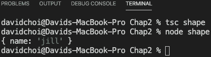

图 2.1 - shape.ts 输出

如您所见，代码编译和运行都没有问题。这表明在 TypeScript 中，编译器查看类型的形状，并不关心其名称。在后面的章节中，当我们更深入地挖掘 TypeScript 类型时，您将看到了解这种行为为何如此重要。

# 探索 TypeScript 类型

在本节中，我们将看一些 TypeScript 中可用的核心类型。使用这些类型将为您提供错误检查和编译器警告，可以帮助改进您的代码。它们还将向其他可能在您团队上的开发人员提供有关您意图的信息。因此，让我们继续看看这些类型是如何工作的。

## 任何类型

“任何”类型是一种动态类型，可以设置为任何其他类型。如果将变量声明为“任何”类型，这意味着可以将其设置为任何内容，并且稍后也可以将其重置为任何其他内容。实际上，它没有类型，因为编译器不会代表您检查它。这是关于“任何”的关键事实 - 编译器不会在开发时干预并警告您的问题。因此，如果可能的话，应避免使用“任何”类型。可能会觉得奇怪，一个旨在静态类型的语言会有这样的特性，但在某些情况下这是必要的。

在大型应用程序中，开发人员并不总是能够控制进入其代码的类型。例如，如果开发人员依赖于 Web 服务 API 调用来获取数据，那么数据的类型可能由其他团队或甚至完全不同的公司控制。在互操作期间，当代码依赖于来自不同编程语言的数据时，这也是真实的情况 - 例如，当公司在另一种语言中维护遗留系统的同时，又在不同的语言中构建其新系统。这些情况需要类型的灵活性和对类型系统的逃生舱。

重要的是不要滥用“任何”类型。您应该小心，只有在知道没有其他选择时才使用它 - 例如，当类型信息不清晰或可能会更改时。但是，有一些替代方案可以使用“任何”类型。根据情况，您可能可以使用接口、泛型、联合类型或“未知”类型。我们将在后面涵盖其余这些可能性，但现在让我们接下来讨论“未知”类型。

## 未知类型

“未知”类型是在 TypeScript 版本 3 中发布的一种类型。它类似于`any`，因为一旦声明了这种类型的变量，就可以将任何类型的值设置给它。随后可以将该值更改为任何其他类型。因此，我可以首先将我的变量设置为字符串类型，然后稍后将其设置为数字。但是，您不能调用其任何成员或将变量设置为另一个变量的值，而不首先检查其真正的类型。我将如下所示地展示一个示例。您可以在不首先检查其类型的情况下将“未知”设置为其他内容的唯一时间是将“未知”类型设置为另一个“未知”或“任何”类型时。

让我们看一个`any`的例子，然后我们将看到为什么`unknown`类型比使用`any`类型更可取（事实上，TypeScript 团队建议使用`unknown`）：

1.  首先，让我们看一下使用`any`存在的问题的一个例子。转到 VSCode，创建一个名为`any.ts`的文件，然后输入以下代码：

```ts
let val: any = 22;
val = "string value";
val = new Array();
val.push(33);
console.log(val);
```

如果您使用以下命令运行此代码，您将看到以下结果：

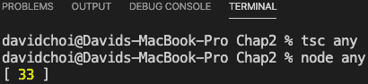

图 2.2 – any 运行结果

1.  由于`val`是`any`类型，我们可以将其设置为任何我们喜欢的值，然后调用`push`进入它，因为`push`是`Array`的一个方法。然而，这只是因为我们作为开发人员知道`Array`中有一个叫做`push`的方法。如果我们意外地调用了`Array`上不存在的东西会怎么样？用以下代码替换上一个代码：

```ts
let val: any = 22;
val = "string value";
val = new Array();
val.doesnotexist(33);
console.log(val);
```

1.  现在，再次运行 TypeScript 编译器：

```ts
any type causes the compiler to no longer check the type. Additionally, we also lost IntelliSense, the VSCode development time code highlighter and error checker. Only when we try and run the code do we get any indication that there is a problem, which is never what we want. If we now try and run the code, as shown next, it fails immediately:
```

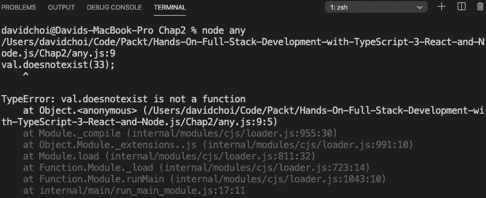

图 2.3 – any 失败

对于这个简单的例子，这种错误不太可能发生，但在一个大型应用程序中，即使错误只是简单地拼错了一些东西，也很容易发生。

让我们看一个类似的使用`unknown`的例子：

1.  首先，注释掉`any.ts`中的代码，并删除`any.js`文件（因为我们将使用相同的变量名，如果不这样做，将会导致冲突错误）。

重要提示

稍后我们将学习一些称为命名空间的东西，它可以消除这些冲突，但现在介绍它们还为时过早。

1.  现在，创建一个名为`unknown.ts`的新文件，并将以下代码添加到其中：

```ts
let val: unknown = 22;
val = "string value";
val = new Array();
val.push(33);
console.log(val);
```

您会注意到 VSCode 给出了一个错误，立即抱怨`push`函数。这很奇怪，因为显然`Array`中有一个叫做`push`的方法。这种行为展示了`unknown`类型的工作原理。您可以将`unknown`类型视为一种标签，而不是一种类型，在该标签下是实际类型。然而，编译器无法自行确定类型，因此我们需要自己向编译器明确证明类型。

1.  我们使用类型守卫来证明`val`是某种类型：

```ts
let val: unknown = 22;
val = "string value";
val = new Array();
if (val instanceof Array) {
    val.push(33);
}
console.log(val);
```

如您所见，我们用一个测试来包装我们的`push`调用，以查看`val`是否是`Array`的一个实例。

1.  一旦我们证明这是真的，对`push`的调用就可以继续进行，如下所示：

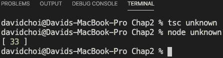

图 2.4 – 未知

这种机制有点繁琐，因为我们总是需要在调用成员之前测试类型。然而，与使用`any`类型相比，它仍然更可取，因为它由编译器检查，更安全。

## 交集和联合类型

还记得我们在本节开始时说过 TypeScript 编译器关注类型形状而不是名称吗？这种机制允许 TypeScript 支持所谓的`obj`，它与两种类型相关联。您会记得在 TypeScript 中，我们不仅可以将命名类型声明为变量的类型，还可以同时动态定义和声明类型。在以下代码中，每种类型都是不同的类型，但`&`关键字用于将两种类型合并为单一类型：

```ts
let obj: { name: string } & { age: number } = {
    name: 'tom',
    age: 25
}
```

让我们尝试运行这段代码，并在控制台上显示结果。创建一个名为`intersection.ts`的新文件，并将以下代码添加到其中：

```ts
let obj: { name: string } & { age: number } = {
    name: 'tom',
    age: 25
}
console.log(obj);
```

如果您编译并运行此代码，您将看到一个包含名称和年龄属性的对象：

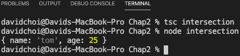

图 2.5 – 交集结果

如您所见，IntelliSense 和编译器都接受了该代码，最终对象具有两个属性。这是一个交集类型。

另一种类型类似，称为`union`类型。在联合的情况下，我们不是合并类型，而是以“或”的方式使用它们，即一个类型或另一个类型。让我们看一个例子。创建一个名为`union.ts`的新文件，并将以下代码添加到其中：

```ts
let unionObj: null | { name: string } = null;
unionObj = { name: 'jon'};
console.log(unionObj);
```

`unionObj`变量被声明为 null 类型或`{ name: string }`，通过使用`|`字符。如果编译并运行这段代码，你会看到它接受两种类型的值。这意味着类型值可以是 null，也可以是`{ name: string }`类型的对象。

## 文字类型

**文字**类型类似于联合类型，但它们使用一组硬编码的字符串或数字值。这是一个相当简单的字符串文字示例，相当容易理解。正如你所看到的，我们有一堆硬编码的字符串作为类型。这意味着只有与这些字符串中的任何一个相同的值才会被接受为文字变量：

```ts
let literal: "tom" | "linda" | "jeff" | "sue" = "linda";
literal = "sue";
console.log(literal);
```

正如你所看到的，编译器很高兴接收列表中的任何值，甚至重置它们。然而，它不会允许设置不在列表中的值。这将导致编译错误。让我们看一个例子。按照将文字变量重置为`john`的方式更新代码：

```ts
let literal: "tom" | "linda" | "jeff" | "sue" = "linda";
literal = "sue";
literal = "john";
console.log(literal);
```

在这里，我们将文字变量设置为`john`，编译会出现以下错误：

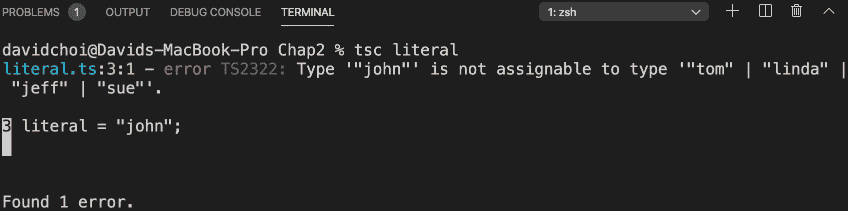

图 2.6 – 一个文字错误

数字文字也可以以相同的方式进行，但值是由数字而不是字符串组成的。

## 类型别名

在 TypeScript 中，类型别名被非常频繁地使用。这只是一种为类型提供不同名称的方法，大多数情况下用于为某些复杂类型提供更短的简单名称。例如，这里是一个可能的用法：

```ts
type Points = 20 | 30 | 40 | 50;
let score: Points = 20;
console.log(score);
```

在这段代码中，我们将一个长数字文字类型赋予一个更短的名字`Points`。然后，我们声明`score`为`Points`类型，并给它一个值`20`，这是`Points`的可能值之一。当然，如果我们试图将分数设置为，比如，`99`，编译将失败。

另一个别名的例子是对象文字类型声明：

```ts
type ComplexPerson = {
    name: string,
    age: number,
    birthday: Date,
    married: boolean,
    address: string
}
```

由于类型声明非常长并且没有名称，例如类会有的，我们使用别名。在 TypeScript 中，类型别名可以用于包括函数和泛型在内的几乎任何类型，我们将在本章后面进一步探讨。

## 函数返回类型

为了完整起见，我想展示一个函数返回声明的例子。它与典型的变量声明非常相似。创建一个名为`functionReturn.ts`的新文件，并将其添加到其中：

```ts
function runMore(distance: number): number {
    return distance + 10;
}
```

`runMore`函数接受`number`类型的参数并返回一个数字。参数声明就像任何变量声明一样，但是函数返回在括号之后，并指示函数返回的类型。如果函数不返回任何内容，那么可以不声明返回的类型，或者可以声明`void`以更明确。

让我们看一个返回`void`的例子。注释掉`runMore`函数和控制台日志，然后编译并运行这段代码：

```ts
function eat(calories: number) {
    console.log("I ate " + calories + " calories");
}
function sleepIn(hours: number): void {
    console.log("I slept " + hours + " hours");
}
let ate = eat(100);
console.log(ate);
let slept = sleepIn(10);
console.log(slept);
```

这两个函数什么都不返回，只是将它们的参数写入控制台，如下所示：

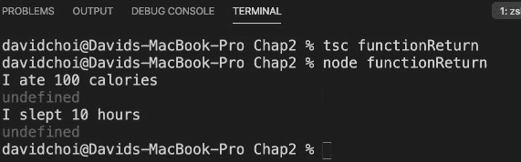

图 2.7 – 函数 void 结果

正如你所看到的，它们的内部`console.log`语句确实运行。然而，尝试获取返回值会导致`undefined`，因为没有返回任何内容。

因此，函数返回类型声明与变量声明非常相似。现在，让我们看看如何将函数用作类型。

## 函数作为类型

在 TypeScript 中，类型也可以是整个函数签名。也就是说，在前面的部分中，我们看到函数可以接受基于类型的参数，并返回一个类型。嗯，这个定义也被称为函数签名。在 TypeScript 中，这个签名也可以作为对象属性的类型。

让我们看一个例子。创建一个名为`functionSignature.ts`的新文件，并将以下代码添加到其中：

```ts
type Run = (miles: number) => boolean;
let runner: Run = function (miles: number): boolean {
    if(miles > 10){
        return true;
    }
    return false;
}
console.log(runner(9));
```

第一行显示了我们将在此代码中使用的函数类型。`Run`类型别名只是为了使重用长函数签名更容易。实际的函数类型是`(miles: number) => boolean`。这看起来很奇怪，但它只是一个简化的函数签名。所以，唯一需要的是用括号表示参数，`=>`符号表示这是一个函数，然后是返回类型。

在函数定义行之后的代码中，您可以看到`runner`变量声明为`Run`类型，这又是一个函数。这个函数简单地检查人是否跑了超过 10 英里，并在他们跑了超过 10 英里时返回`true`，否则返回`false`。然后，在代码底部，`console.log`语句输出函数调用的结果。编译和运行后，您应该能看到这个结果：

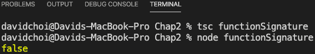

图 2.8 – 函数类型结果

正如您所见，使用参数`9`调用`runner`会使函数返回`false`，这是正确的。在静态类型中，能够对我们返回数据的所有方式进行类型标注是很重要的，这意味着不仅是变量，还有函数。

## 永远类型

这种类型一开始会听起来很奇怪。`never`类型用于指示一个永远不会返回（完成）的函数，或者一个没有设置为任何值的变量，甚至不是`null`。乍一看，这听起来像`void`类型。然而，它们根本不一样。在`void`中，函数确实返回，完全意义上的返回，它只是不返回任何值（返回`undefined`，这是没有值）。在`never`的情况下，函数根本不会完成。现在，这似乎完全没有用，但实际上它对于指示意图是非常有用的。

再次，让我们看一个例子。创建一个名为`never.ts`的文件，并添加以下代码：

```ts
function oldEnough(age: number): never | boolean {
    if(age > 59) {
        throw Error("Too old!");
    }
    if(age <=18){
        return false;
    }
    return true;
}
```

正如您所见，这个函数返回一个`union`类型，要么是`never`，要么是布尔值。现在，我们只能指示布尔值，代码仍然可以工作。然而，在这个函数中，如果人的年龄超过一定年龄，我们会抛出一个错误，表明这是一个意外的`age`值。因此，由于封装是编写高质量代码的高级原则，明确指示函数可能失败而无需开发人员了解函数工作原理的内部细节是有益的。`never`提供了这种沟通。

在这一部分，我们学习了 TypeScript 中许多内置类型。我们能够看到为什么使用这些类型可以提高我们的代码质量，并帮助我们在编码周期的早期发现错误。在下一部分，我们将学习如何使用 TypeScript 来创建我们自己的类型，并遵循面向对象编程原则。

# 理解类和接口

我们已经在之前的部分简要地看过类和接口。让我们在这一部分深入了解一下，并看看为什么这些类型可以帮助我们编写更好的代码。一旦我们完成了这一部分，我们将更好地准备好编写更易读、可重用的代码，bug 更少。

## 类

基本上，TypeScript 中的类看起来就像 JavaScript 中的类。它们是一个相关字段和方法的容器，可以被实例化和重用。然而，TypeScript 中的类支持 JavaScript 不支持的封装的额外特性。让我们看一个例子。

创建一个名为`classes.ts`的新文件，并输入以下代码：

```ts
class Person {
    constructor() {}
    msg: string;
    speak() {
        console.log(this.msg);
    }
}
const tom = new Person();
tom.msg = "hello";
tom.speak();
```

如您所见，这个例子展示了一个简单的类，除了静态类型之外，它与 JavaScript 中看到的类似。首先，您为类命名，以便可以重用。接下来，您有一个构造函数，用于初始化类可能具有的任何字段，并为类实例进行任何其他设置（再次，实例只是我们的类的特定示例，具有自己字段的唯一值）。然后，您声明了一个名为`msg`的变量和一个名为`speak`的函数，该函数将`msg`的值写入控制台。然后，我们创建了我们类的一个实例。最后，我们将`msg`字段设置为`hello`的值，并调用`speak`方法。现在，让我们看一看 TypeScript 和 JavaScript 之间类的区别。

### 访问修饰符

我们之前提到面向对象开发的一个主要原则是封装，或者信息隐藏。好吧，如果我们再次清楚地看一下代码，我们并没有隐藏`msg`变量，因为它在类外是可见和可编辑的。所以，让我们看看 TypeScript 允许我们对此做些什么。让我们像这样更新代码：

```ts
class Person {
    constructor(private msg: string) {}

    speak() {
        console.log(this.msg);
    }
}
const tom = new Person("hello");
// tom.msg = "hello";
tom.speak();
```

如您所见，我们使用关键字`private`更新了构造函数。通过声明构造函数参数并添加访问修饰符，一行代码实际上做了几件事。首先，它告诉编译器类具有一个名为`msg`的`string`类型字段，应该是`private`的。通常，这种声明是在构造函数上方或下方的一行中分开完成的，这样做是完全有效的，但是 TypeScript 允许我们通过将其添加到构造函数参数中来使用快捷方式。此外，通过将其添加到构造函数中，您可以看到它允许我们在实例化时使用`new Person("hello")`调用来设置我们的`msg`字段。

现在，将某些东西设置为`private`实际上是做了什么？通过将字段设置为`private`，我们使其无法从类外部访问。其结果是`tom.msg = "hello"`不再起作用并引发错误。尝试删除注释并重新编译。您应该会看到此消息：

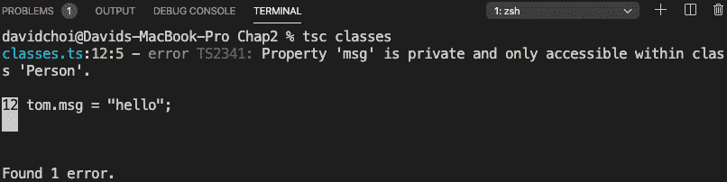

图 2.9 - 类错误

如您所见，它抱怨私有成员`msg`无法从类外部访问。现在，我们只将修饰符应用于字段，但请注意，访问修饰符可以应用于任何成员字段或函数。

重要提示

如前所述，ECMAScript 2020 将通过`#`符号支持私有字段。但是，目前浏览器对其支持有限，因为它只支持字段，并且这是一个全新的标准。

现在，让我们学习`readonly`修饰符。这个相对简单；它使字段在构造函数中设置一次后变为只读。因此，更新代码如下，并在`msg`字段的声明中添加`readonly`：

```ts
class Person {
    constructor(private readonly msg: string) {}

    speak () {
        this.msg = "speak " + this.msg;
        console.log(this.msg);
    }
}
const tom = new Person("hello");
// tom.msg = "hello";
tom.speak();
```

如果这样做，IntelliSense 会抱怨，因为在`speak`函数中，尽管`msg`已经通过构造函数设置了一次，我们仍然试图改变`msg`的值。

`private`和`readonly`访问修饰符并不是 TypeScript 中唯一的修饰符。还有几种其他类型的访问修饰符。但是，如果我们稍后在继承的上下文中解释它们，它们会更有意义。

### Getter 和 setter

类的另一个特性实际上在 TypeScript 和 JavaScript 中都可用：**getter**和**setter**：

+   **Getter**：允许在返回相关字段之前修改或验证值的属性

+   **Setter**：允许在设置到相关字段之前修改或计算值的属性

在其他一些语言中，这些类型的属性被称为计算属性。让我们看一个例子。创建一个名为`getSet.ts`的文件，并添加以下代码：

```ts
class Speaker {
    private message: string;
    constructor(private name: string) {}

    get Message() {
        if(!this.message.includes(this.name)){
            throw Error("message is missing speaker's name");
        }
        return this.message;
    }
    set Message(val: string) {
        let tmpMessage = val;
        if(!val.includes(this.name)){
            tmpMessage = this.name + " " + val;
        }
        this.message = tmpMessage;
    }
}
const speaker = new Speaker("john");
speaker.Message = "hello";
console.log(speaker.Message);
```

这里发生了很多事情，所以在编译和运行之前让我们来看一下。首先，你可以看到我们的`message`字段不在构造函数中可用，而是一个`private`字段，因此不能直接从我们的类外部访问。构造函数接受的唯一初始化器是我们的`name`字段。之后，你可以看到`Message`属性是一个 getter，因为它的名称前缀带有`get`关键字。在 getter 中，我们测试看看我们的`message`字段值是否包含说话者的名字，如果不包含，我们抛出一个异常来指示一个不需要的情况。setter，也称为`Message`，由`set`关键字指示，这个属性接收一个字符串，并通过检查`message`字段是否缺少说话者的名字来添加它。请注意，尽管`getter`和`setter`看起来像函数，但它们并不是。当它们在后面的代码中被调用时，它们被调用就像一个字段被调用一样，不带括号。因此，在代码的最后，speaker 对象被实例化为一个名为`john`的新 speaker，并且它的`Message`属性被设置为`hello`。此后，消息被写入控制台。

现在，我们想要编译这段代码，以便我们可以运行它，但这次我们需要做一些不同的事情。TypeScript 编译器有一些选项，它可以接受以定制其行为。在这个例子中，getter 和 setter 以及`includes`函数只在 ES5 和 ES6 中才可用。如果你对此不熟悉，`includes`函数检查一个字符串是否是另一个较大字符串的子字符串。因此，让我们告诉 TypeScript 编译器，它需要编译到比默认的 ES3 更新的 JavaScript 目标。

这是你需要的新编译命令（我们稍后会更深入地讨论`tsc`编译器选项，包括使用配置文件）：

```ts
tsc --target "ES6" getSet
```

现在，你可以运行命令。再一次，它如下所示：

```ts
node getSet
```

所以，你现在得到了以下输出：

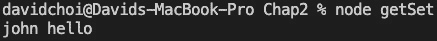

图 2.10 – getSet 输出

为了进一步强调这一点，让我们尝试将`speaker.Message = "hello"`这一行切换为`speaker.message = "hello"`。如果你编译，你应该会看到这个错误：

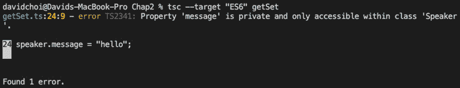

图 2.11 – Message 字段错误

你能猜到为什么会失败吗？是的，这是因为`message`是一个`private`字段，不能从我们的类外部访问。

也许你会想为什么我在这里提到`getter`和`setter`，当它们在常规 JavaScript 中也是可用的。如果你看一下例子，你会发现`message`字段是`private`的，而`getter`和`setter`属性是`public`的（注意，当你没有显式声明访问修饰符时，默认为`public`）。因此，为了允许良好的封装，最好的做法是隐藏我们的字段，并且只在需要时通过 getter 和/或 setter 或一些允许修改字段的函数来暴露它。还要记住，在决定成员的访问级别时，你希望从最严格的能力开始，然后根据需要变得不那么严格。此外，通过允许通过访问器访问字段，我们可以做各种检查和修改，就像我们在例子中所做的那样，这样我们就可以对进出我们的类的内容有最终的控制。

### 静态属性和方法

最后，让我们讨论**静态**属性和方法。当你在类内部将某些东西标记为静态时，你是在说这个成员是类类型的成员，而不是类实例的成员。因此，它可以在不需要创建类的实例的情况下访问，而是通过在类名前加上前缀来访问。

让我们看一个例子。创建一个名为`staticMember.ts`的新文件，并添加以下代码：

```ts
class ClassA {
    static typeName: string;
    constructor(){}

    static getFullName() {
        return "ClassA " + ClassA.typeName;
    }
}
const a = new ClassA();
console.log(a.typeName);
```

如果你尝试编译这段代码，它将失败，并声明`typeName`是`ClassA`类型的静态成员。再次强调，静态成员必须使用类名调用。以下是修复后的代码版本：

```ts
class ClassA {
    static typeName: string;
    constructor(){}

    static getFullName() {
        return "ClassA " + ClassA.typeName;
    }
}
const a = new ClassA();
console.log(ClassA.typeName);
```

正如你所看到的，我们用类名引用了`typeName`。那么，为什么我要使用静态成员而不是实例成员呢？在某些情况下，跨类实例共享数据可能是有用的。例如，我可能想要做这样的事情：

```ts
class Runner {    
    static lastRunTypeName: string;
    constructor(private typeName: string) {}

    run() {        
        Runner.lastRunTypeName = this.typeName;
    }
}
const a = new Runner("a");
const b = new Runner("b");
b.run();
a.run();
console.log(Runner.lastRunTypeName);
```

在这个例子中，我试图确定在任何给定时间内最后调用`run`函数的类实例。通过使用静态成员，这可以很简单。还要注意的一点是，在类内部，静态成员可以被静态成员和实例成员调用。但是，静态成员不能调用实例成员。

现在我们已经在本节中学习了类及其特性。这将有助于我们为封装设计代码，从而提高其质量。接下来，我们将学习接口和基于合同的编码。

## 接口

在面向对象编程设计中，另一个重要的原则是抽象。抽象的目标是通过不暴露内部实现来减少代码的复杂性和紧密耦合（我们已经在《第一章》《理解 TypeScript》中涵盖了抽象）。这样做的一种方式是使用接口来仅显示类型的签名，而不是其内部工作方式。接口有时也被称为合同，因为对参数和返回类型进行特定类型的约束会强制执行接口的用户和创建者之间的某些期望。因此，对接口的另一种思考方式是对类型实例的输出和输入施加严格的规则。

现在，接口只是一组规则。为了使代码正常工作，我们需要对这些规则进行实现。因此，让我们展示一个带有实现的接口的示例以开始。创建一个名为`interfaces.ts`的新文件，并添加以下接口定义：

```ts
interface Employee {
    name: string;
    id: number;
    isManager: boolean;
    getUniqueId: () => string;
}
```

这个接口定义了我们稍后将创建实例的`Employee`类型。正如你所看到的，`getUniqueId`函数没有实现，只有其签名。实现将在我们定义它时进行。

现在，将实现添加到`interfaces.ts`文件中。插入以下代码，创建`Employee`接口的两个实例：

```ts
const linda: Employee = {
    name: "linda",
    id: 2,
    isManager: false,
    getUniqueId: (): string => {
        let uniqueId = linda.id + "-" + linda.name;
        if(!linda.isManager) {
            return "emp-" + uniqueId;
        }
        return uniqueId;
    }
}
console.log(linda.getUniqueId());
const pam: Employee = {
    name: "pam",
    id: 1,
    isManager: true,
    getUniqueId: (): string => {
        let uniqueId = pam.id + "-" + pam.name;
        if(pam.isManager) {
            return "mgr-" + uniqueId;
        }
        return uniqueId;
    }
}
console.log(pam.getUniqueId());
```

因此，我们通过实例化一个名为`linda`的对象文字来创建一个实例，设置两个字段名 - `name`和`id`，然后实现`getUniqueId`函数。稍后，我们在控制台记录`linda.getUniqueId`调用。之后，我们创建另一个对象，名为`pam`，基于相同的接口。然而，它不仅具有不同的字段值，而且其`getUniqueId`的实现也与`linda`对象不同。这是接口的主要用途：允许对象之间有一个统一的结构，但可以实现不同的实现。通过这种方式，我们对类型结构施加严格的规则，但也允许函数在执行其工作时具有一定的灵活性。以下是我们代码的输出：

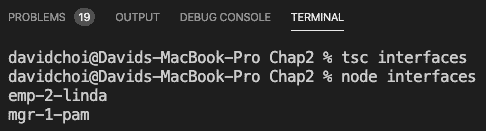

图 2.12 - 员工接口结果

接口的另一个可能用途是在使用第三方 API 时。有时，类型信息没有很好地记录，你得到的只是无类型的 JSON 或者对象类型非常庞大，有许多你永远不会使用的字段。在这种情况下，很容易只是使用`any`作为类型并完成它。然而，如果可能的话，你应该更倾向于提供类型声明。

在这种情况下，您可以创建一个只包含您知道并关心的字段的接口。然后，您可以声明您的数据类型为此类型。在开发时，TypeScript 将无法检查类型，因为 API 网络调用的数据将在运行时传入。但是，由于 TypeScript 只关心任何给定类型的形状，它将忽略未在类型声明中提到的字段，只要数据以您在接口中定义的字段传入，运行时就不会抱怨，您将保持开发时的类型安全。但是，请务必小心处理`null`或`undefined`字段，允许它们使用联合或测试这些类型。

在本节中，我们学习了接口和接口与类之间的区别。我们将能够使用接口来抽象类的实现细节，从而在我们的代码之间产生松耦合，从而提高代码质量。在下一节中，我们将学习类和接口如何允许我们执行继承，从而实现代码重用。

# 理解继承

在本节中，我们将学习**继承**。面向对象编程中的继承是一种代码重用的方法。这将缩小我们的应用程序代码大小，并使其更易读。此外，一般来说，较短的代码往往会有更少的错误。因此，一旦开始构建，所有这些因素都将提高我们应用程序的质量。

如前所述，继承主要是允许代码重用。继承在概念上也被设计成像现实生活中的继承，以便继承关系的逻辑流可以直观且更易于理解。现在让我们看一个例子。创建一个名为`classInheritance.ts`的文件，并添加以下代码：

```ts
class Vehicle {
    constructor(private wheelCount: number) {}
    showNumberOfWheels() {
        console.log(`moved ${this.wheelCount} miles`);
    }
}
class Motorcycle extends Vehicle {
    constructor() {
        super(2);
    }
}
class Automobile extends Vehicle {
    constructor() {
        super(4);
    }
}
const motorCycle = new Motorcycle();
motorCycle.showNumberOfWheels();
const autoMobile = new Automobile();
autoMobile.showNumberOfWheels();
```

重要提示

如果您以前从未见过反引号``和`${}`，这是一个快速和简单的方法，称为字符串插值，通过嵌入对象在字符串中插入字符串值。

如您所见，有一个基类，也称为父类，名为`Vehicle`。这个类充当了源代码的主要容器，稍后将被从中继承的任何类重用，也称为子类。子类使用`extends`关键字从`Vehicle`继承。一个重要的事情要注意的是，在每个子类的构造函数中，您会看到第一行代码是对`super`的调用。`super`是子类继承的父类的实例的名称。因此，在这种情况下，那将是`Vehicle`类。现在，您可以看到，每个子类通过父类的构造函数向父类的`wheelCount`变量传递了不同数量的轮子。然后，在代码的末尾，创建了每个子类的实例`Motorcycle`和`Automobile`，并调用了`showNumberOfWheels`函数。如果我们编译并运行此代码，我们会得到以下结果：

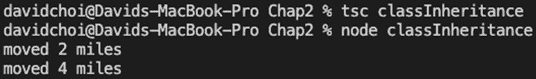

图 2.13 - classInheritance 结果

因此，每个子类向父类的`wheelCount`变量提供了不同数量的轮子，尽管它们无法直接访问该变量。现在，假设子类希望直接访问父类的`wheelCount`变量有一个原因。例如，假设发生了爆胎，需要更新轮胎数量。我们该怎么办？好吧，让我们尝试为每个子类创建一个独特的函数，试图更新`wheelCount`。让我们看看会发生什么。通过向`Motorcycle`类添加一个新函数`updateWheelCount`来更新代码：

```ts
class Vehicle {
    constructor(private wheelCount: number) {}
    showNumberOfWheels() {
        console.log(`moved ${this.wheelCount} miles`);
    }
}
class Motorcycle extends Vehicle {
    constructor() {
        super(2);
    }
    updateWheelCount(newWheelCount: number){
        this.wheelCount = newWheelCount;
    }
}
class Automobile extends Vehicle {
    constructor() {
        super(4);
    }
}
const motorCycle = new Motorcycle();
motorCycle.showNumberOfWheels();
const autoMobile = new Automobile();
autoMobile.showNumberOfWheels();
```

作为一个测试，如果我们只更新`Motorcycle`类并添加一个`updateWheelCount`函数，如下所示，我们会得到一个错误。你能猜到为什么吗？这是因为我们试图访问父类的私有成员。因此，即使子类从父类继承其成员，它们仍然无法访问父类的`private`成员。这是正确的行为，再次促进封装。那么，我们该怎么办呢？好吧，让我们再次尝试编辑代码来允许这样做：

```ts
class Vehicle {
    constructor(protected wheelCount: number) {}
    showNumberOfWheels() {
        console.log(`moved ${this.wheelCount} miles`);
    }
}
class Motorcycle extends Vehicle {
    constructor() {
        super(2);
    }
    updateWheelCount(newWheelCount: number){
        this.wheelCount = newWheelCount;
    }
}
class Automobile extends Vehicle {
    constructor() {
        super(4);
    }
}
const motorCycle = new Motorcycle();
motorCycle.showNumberOfWheels();
const autoMobile = new Automobile();
autoMobile.showNumberOfWheels();
```

您看到我们做的小改变了吗？没错，我们将`Vehicle`父类构造函数中的`wheelCount`参数更改为`protected`访问器类型。`protected`允许类和任何继承类访问成员。

在我们继续下一个主题之前，让我们介绍`namespaces.ts`的概念，并添加以下代码：

```ts
namespace A {
    class FirstClass {}
}
namespace B {
    class SecondClass {}
    const test = new FirstClass();
}
```

从这段代码中可以看出，即使在编译之前，VSCode IntelliSense 已经抱怨找不到`FirstClass`。这是因为它被隐藏在`namespace B`中，因为它只在`namespace A`中定义。这就是命名空间的目的，将一个范围内的信息隐藏在其他范围之外。

在这一部分，我们学习了从类中继承。类继承是重用代码的一个非常重要的工具。在下一节中，我们将学习使用抽象类，这是一种更灵活的继承方式。

## 抽象类

如前所述，接口可以用于定义合同，但它们本身没有工作代码的实现。类有工作实现，但有时只需要一个签名。对于这种类型的情况，您将使用`abstractClass.ts`，并将我们的`classInheritance.ts`文件中的代码复制粘贴到其中。如果这样做，您可能会遇到一些错误，因为这两个文件都有相同的类和变量名。

因此，在我们的新的`abstractClass.ts`文件中，我们将使用命名空间更新它，并将`Vehicle`类修改为抽象类。添加命名空间并像这样更新`Vehicle`类：

```ts
namespace AbstractNamespace {
    abstract class Vehicle {
        constructor(protected wheelCount: number) {}
        abstract updateWheelCount(newWheelCount: number): void;
        showNumberOfWheels() {
            console.log(`moved ${this.wheelCount} miles`);
        }
    }
```

因此，首先，我们显然将所有代码包装在一个名为`namespace AbstractNamespace`的括号中（请注意，命名空间可以有任何名称；它的名称不需要在名称中包含`namespace`）。同样，这只是一个容器，允许我们控制作用域，以便我们的`abstractClass.ts`文件的成员不会泄漏到全局作用域，并影响其他文件。

如果您查看新的`Vehicle`代码，我们在类名`abstract`之前有一个`new`关键字。这表明该类将是一个抽象类。您还可以看到我们有一个名为`updateWheelCount`的新函数。这个函数在`Vehicle`类前面有一个`abstract`关键字，这表明它在`Vehicle`类中没有实现，需要由继承类实现。

现在，在`Vehicle abstract`类之后，我们想要继承它的子类。因此，在`Vehicle`类下面添加`Motorcycle`和`Automobile`类：

```ts
    class Motorcycle extends Vehicle {
        constructor() {
            super(2);
        }
        updateWheelCount(newWheelCount: number){
            this.wheelCount = newWheelCount;
            console.log(`Motorcycle has ${this.wheelCount}`);
        }
    }
    class Automobile extends Vehicle {
        constructor() {
            super(4);
        }
        updateWheelCount(newWheelCount: number){
            this.wheelCount = newWheelCount;
            console.log(`Automobile has ${this.wheelCount}`);
        }
        showNumberOfWheels() {
            console.log(`moved ${this.wheelCount} miles`);
        }
    }
```

添加类之后，我们实例化它们并调用它们各自的`updateWheelCount`方法，如下所示：

```ts
    const motorCycle = new Motorcycle();
    motorCycle.updateWheelCount(1);
    const autoMobile = new Automobile();
    autoMobile.updateWheelCount(3);
}
```

正如您所看到的，`abstract`成员`updateWheelCount`的实现在子类中。这是抽象类提供的功能。抽象类既可以作为常规类，提供成员实现，也可以作为接口，只提供子类实现的规则。请注意，由于抽象类可以有抽象成员，您不能实例化抽象类。

此外，如果您查看`Automobile`类，您会发现它有自己的`showNumberOfWheels`的实现，即使这个函数不是抽象的。这展示了一种称为**覆盖**的东西，即子类成员能够创建父类成员的独特实现的能力。

在本节中，我们学习了不同类型的基于类的继承。学习继承将使我们能够重用更多的代码，减少代码大小和潜在的错误。在下一节中，我们将学习如何使用接口进行继承，以及它与基于类的继承有何不同。

## 接口

正如前面所解释的，**接口**是一种为类型设置约定规则的方式。它们将允许我们将实现与定义分离，从而提供抽象，这又是一个强大的面向对象编程原则，将为我们提供更高质量的代码。让我们学习如何使用接口来明确继承并以一种良好结构的方式使用。

TypeScript 接口为接口的成员提供一组类型签名，但它们本身没有实现。现在，我们确实展示了一些使用独立接口的例子，但这次，让我们看看如何可以使用接口作为继承和代码重用的手段。创建一个名为`interfaceInheritance.ts`的新文件，并添加以下代码：

```ts
namespace InterfaceNamespace {
    interface Thing {
        name: string;
        getFullName: () => string;
    }
    interface Vehicle extends Thing {
        wheelCount: number;
        updateWheelCount: (newWheelCount: number) => void;
        showNumberOfWheels: () => void;
    }
```

在命名空间之后，您可以看到有一个名为`Thing`的接口，之后是定义了`Vehicle`接口，并使用`extends`关键字从`Thing`继承。我将这放入示例中以表明接口也可以从其他接口继承。`Thing`接口有两个成员 - `name`和`getFullName` - 正如您所看到的，尽管`Vehicle`扩展了`Thing`，但在`Vehicle`的任何地方都没有提到这些成员。这是因为`Vehicle`是一个接口，因此不能有任何实现。然而，如果您查看以下代码，在`Motorcycle`类中，您会发现，由于这个类扩展了`Vehicle`，实现是存在的：

```ts
    class Motorcycle implements Vehicle {
        name: string;
        wheelCount: number;
        constructor(name: string) {
            // no super for interfaces
            this.name = name;
        }
        updateWheelCount(newWheelCount: number){
            this.wheelCount = newWheelCount;
            console.log(`Automobile has ${this.wheelCount}`);
        }
        showNumberOfWheels() {
            console.log(`moved Automobile ${this.wheelCount}            miles`);
        }
        getFullName() {
            return "MC-" + this.name;
        }
    }
    const moto = new Motorcycle("beginner-cycle");
    console.log(moto.getFullName());
}
```

因此，如果我们编译并运行此代码，我们会得到以下结果：

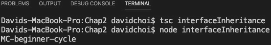

图 2.14 – 接口继承结果

接口本身并不直接提供代码重用的手段，因为它们没有实现。然而，它仍然有利于代码重用，因为接口的结构提供了对代码将接收和返回什么的明确期望。将实现隐藏在接口后面也有利于进行封装和抽象，这也是面向对象编程的重要原则。

重要提示

在使用 TypeScript 时，充分利用面向对象编程中可用的继承模型。使用接口来抽象实现细节。使用`private`和`protected`来帮助封装数据。请记住，当编译并将您的代码转换为 JavaScript 时，TypeScript 编译器将为您执行任何翻译工作，以将事物重新转换为原型样式。但在开发模式下，您应该充分利用 TypeScript 提供的所有功能，以增强您的开发体验。

在本节中，我们学习了继承以及如何将其用于代码重用。我们了解了如何使用三种主要的容器类型：类、抽象类和接口进行继承。一旦我们开始编写应用程序，您将会看到为什么能够进行代码重用是大型应用程序开发中如此关键的因素。在下一节中，我们将介绍泛型，它将使用我们在本节中学到的类型。

# 学习泛型

**泛型**允许类型定义包括一个关联类型，可以由泛型类型的用户选择，而不是由类型创建者指定。这样，有一些结构和规则，但仍然有一定的灵活性。泛型在我们后面使用 React 编码时肯定会发挥作用，所以让我们在这里学习一下。

泛型可以用于函数、类和接口。让我们看一个使用函数泛型的例子。创建一个名为`functionGeneric.ts`的文件，并添加以下代码：

```ts
function getLength<T>(arg: T): number {
    if(arg.hasOwnProperty("length")) {
        return arg["length"];
    }
    return 0;
}
console.log(getLength<number>(22));
console.log(getLength("Hello world."));
```

如果我们从顶部开始，我们会看到一个名为`getLength<T>`的函数。这个函数使用了一个泛型，告诉编译器无论它在哪里看到`T`符号，它都可以期望任何可能的类型。现在，在内部，我们的函数实现检查`arg`参数是否有一个名为`length`的字段，然后尝试获取它。如果没有，它就返回`0`。最后，在底部，您可以看到`getLength`函数被调用了两次：一次是为了一个数字，另一次是为了一个字符串。此外，您可以看到对于`number`，它明确地有`<number>`类型指示符，而对于`string`，它没有。这只是为了表明您可以明确指定类型，但编译器通常可以根据使用情况推断出您的意图。

这个例子的问题在于为了检查`length`字段而需要额外的代码。这使得代码变得繁忙，比实际需要的代码更长。让我们更新这段代码，以防止调用这个函数如果参数没有`length`属性。首先，注释掉我们刚刚写的代码，然后在其下面添加以下新代码：

```ts
interface HasLength {
    length: number;
}
function getLength<T extends HasLength>(arg: T): number {
    return arg.length;
}
console.log(getLength<number>(22));
console.log(getLength("Hello world."));
```

这段代码非常相似，只是我们使用了一个`HasLength`接口来限制允许的类型。通过使用`extends`关键字来约束泛型类型。通过编写`T extends HasLength`，我们告诉编译器无论`T`是什么，它必须继承自`HasLength`类型，这有效地意味着它必须具有`length`属性。因此，当进行前两个调用时，对于`number`类型会失败，因为它们没有`length`属性，但对于`string`则有效。

现在，让我们看一个使用接口和类的例子。让我们创建一个名为`classGeneric.ts`的文件，并向其中添加以下代码：

```ts
namespace GenericNamespace {
    interface Wheels {
        count: number;
        diameter: number;
    }
    interface Vehicle<T> {
        getName(): string;
        getWheelCount: () => T;
    }
```

因此，我们可以看到我们有一个名为`Wheels`的接口，它提供了轮子信息。我们还可以看到`Vehicle`接口采用了类型`T`的泛型，表示任何特定类型。

随后，我们看到`Automobile`类实现了具有泛型作为`Wheel`类型的`Vehicle`接口，将`Wheel`关联到`Automobile`。然后，最后，我们看到`Chevy`类扩展了`Automobile`，提供了一些默认值：

```ts
    class Automobile implements Vehicle<Wheels> {
        constructor(private name: string, private wheels:          Wheels){}
        getName(): string {
            return this.name;
        }
        getWheelCount(): Wheels {
            return this.wheels;
        }
    }
    class Chevy extends Automobile {
        constructor() {
            super("Chevy", { count: 4, diameter: 18 });
        }
    }
```

在定义了所有这些类型之后，我们创建了`Chevy`类的一个实例，并从中记录了一些输出：

```ts
    const chevy = new Chevy();
    console.log("car name ", chevy.getName());
    console.log("wheels ", chevy.getWheelCount());
}
```

这段代码编译并成功运行，并给出以下结果：

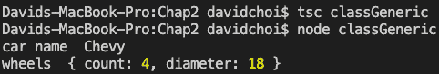

图 2.15 – classGeneric.ts 的结果

您可以看到我们的继承层次结构有几个级别，但我们的代码能够成功返回有效的结果。虽然现实世界代码中的具体细节可能不同，但是在这里显示的多级类型层次结构在面向对象编程设计中是经常发生的事情。

在本节中，我们学习了如何在函数和类类型上使用泛型。泛型通常在 React 开发中使用，以及一些 Node 包中也会用到。因此，一旦我们在后面的章节开始编码，它们将会很有用。在下一节中，我们将看一些其他杂项内容来完成本章。

# 学习最新功能并配置编译器

在本节中，我们将学习 TypeScript 中一些较新的特性，以及如何配置 TypeScript 编译器。通过了解这些较新的特性，我们将能够编写更清晰、更易读的代码，这当然对团队中使用应用程序是有益的。通过使用 TypeScript 的配置选项，我们可以让编译器以我们认为最适合我们项目的方式工作。

## Optional chaining

让我们来看看`null`对象。让我们创建一个名为`optionalChaining.ts`的文件，并将以下代码添加到其中：

```ts
namespace OptionalChainingNS {
    interface Wheels {
        count?: number;
    }
    interface Vehicle {
        wheels?: Wheels;
    }
    class Automobile implements Vehicle {
        constructor(public wheels?: Wheels) {}
    }
    const car: Automobile | null = new Automobile({
        count: undefined
    });
    console.log("car ", car);
    console.log("wheels ", car?.wheels);
    console.log("count ", car?.wheels?.count);
}
```

如果我们看这段代码，我们可以看到有几种类型被一起使用。`car`有一个`wheels`属性，而`wheels`有一个`count`属性。因此，稍后当我们记录时，你可以看到调用被链接在一起。例如，最后的`console.log`行引用了`car?.wheels?.count`。这被称为可选链。问号表示对象可能是`null`或`undefined`。如果它是`null`或`undefined`，那么代码将在该对象结束，返回对象或属性的任何值，并且不继续到其余的属性，但不会导致错误。

因此，如果我们以旧的方式编写底部的控制台代码，我们将不得不进行大量的代码测试，以确保我们不会通过调用可能是`undefined`的东西而导致错误。我们将使用三元操作符，它可能看起来像这样：

```ts
const count = !car ? 0 
    : !car.wheels ? 0 
    : !car.wheels.count ? 0
    : car.wheels.count;
```

显然，这既难写又难读。因此，通过使用可选链，我们允许编译器在发现`null`或`undefined`时立即停止并返回。这使我们免于编写大量冗长、可能容易出错的代码。

## Nullish coalescing

Nullish coalescing 是三元运算符的简化形式。因此，它非常直接，看起来像这样：

```ts
const val1 = undefined;
const val2 = 10;
const result = val1 ?? val2;
console.log(result);
```

双问号从左到右工作。该语句的意思是，如果`val1`不是`null`或`undefined`并且有实际值，则返回该值。然而，如果`val1`没有值，则返回`val2`。因此，在这种情况下，编译和运行将导致`10`被写入控制台。

你可能想知道这是否与`||`运算符相同。它有些相似但更受限制。逻辑或运算符在这种情况下，检查“真值”。在 JavaScript 中，这是一个概念，其中大量可能的值可以被认为是“真值”或“假值”。例如，`0`，`true`或`false`，`undefined`和`""`在 JavaScript 中都有真或假的等价性。然而，在 nullish coalescing 的情况下，只有`null`或`undefined`被明确检查。

## TypeScript 配置

TypeScript 配置可以通过命令行传递，或者更常见的是通过一个名为`tsconfig.json`的文件。如果你使用命令行，那么调用编译器就像这样：

```ts
tsc tsfile.ts –lib 'es5, dom'
```

这告诉 TypeScript 忽略任何`tsconfig.json`文件，只使用命令行选项 - 在这种情况下，`-lib`选项，它声明在开发过程中使用的 JavaScript 版本，并且只编译这一个文件。如果你只在命令行上输入`tsc`，TypeScript 将寻找一个`tsconfig.json`文件并使用该配置，并编译它找到的所有`ts`文件。

有许多选项，所以我们在这里不会涵盖所有。然而，让我们回顾一些最重要的选项（当我们开始编码时，我会提供一个示例`tsconfig.json`文件供使用）：

+   `--lib`：这用于指示在开发过程中将使用哪个 JavaScript 版本。

+   `--target`：这表示你想要发射到`.js`文件中的 JavaScript 版本。

+   `--noImplicitAny`：不允许`any`类型，除非显式声明它。

+   `--outDir`：这是 JavaScript 文件将保存到的目录。

+   `--outFile`：这是最终的 JavaScript 文件名。

+   `--rootDirs`：这是一个存储`.ts`文件源代码的数组。

+   `--exclude`：这是一个要从编译中排除的文件夹和文件的数组。

+   `--include`：这是一个要包含在编译中的文件夹和文件的数组。

本节仅提供了 TypeScript 一些新特性的简要概述，以及一些与配置相关的信息。然而，这些新特性和配置 TypeScript 的能力非常重要，在我们开始编写代码的后续章节中将会被广泛使用。

# 总结

在本章中，我们学习了 TypeScript 语言。我们了解了语言中存在的许多不同类型，以及如何创建我们自己的类型。我们还学习了如何使用 TypeScript 来创建面向对象的代码。这是一个庞大而复杂的章节，但对于我们开始构建应用程序时将是绝对必要的知识。

在下一章中，我们将回顾一些传统 JavaScript 中最重要的特性。我们还将了解一些最新版本语言中的新特性。由于 TypeScript 是 JavaScript 的真正超集，因此了解 JavaScript 的最新情况对于充分利用 TypeScript 非常重要。
