# 第三章：使用 ES6+功能构建更好的应用程序

在本章中，我们将回顾 JavaScript 在其最新的 ES6+形式中的一些重要特性（我添加了加号表示 ES6 及更高版本）。重要的是要理解，尽管本书使用 TypeScript，但这两种语言是互补的。换句话说，TypeScript 并不取代 JavaScript。它增强和增强了 JavaScript，添加了使其更好的功能。因此，我们将回顾 JavaScript 语言中一些最重要的特性。我们将回顾变量作用域和新的`const`和`let`关键字。此外，我们将深入研究`this`关键字以及在需要时如何切换它。我们还将学习 JavaScript 中许多新功能，例如新的数组函数和`async await`。这些知识将为我们提供一个坚实的基础，使我们能够在 TypeScript 中编码。

在本章中，我们将涵盖以下主要主题：

+   学习 ES6 变量类型和 JavaScript 作用域

+   学习箭头函数

+   更改`this`上下文

+   学习有关传播、解构和剩余

+   学习新的数组函数

+   学习新的集合类型

+   学习`async await`

# 技术要求

本章的要求与*第二章** TypeScript 探索*相同。您应该对 JavaScript 和 Web 技术有基本的了解。您将再次使用 Node 和**Visual Studio Code**（**VSCode**）。

GitHub 存储库位于[`github.com/PacktPublishing/Full-Stack-React-TypeScript-and-Node`](https://github.com/PacktPublishing/Full-Stack-React-TypeScript-and-Node)。使用`Chap3`文件夹中的代码。

让我们设置本章的代码文件夹：

1.  转到您的`HandsOnTypescript`文件夹并创建一个名为`Chap3`的新文件夹。

1.  打开 VSCode 并转到您刚创建的`Chap3`文件夹。然后，选择**View** | **Terminal**并在 VSCode 窗口内启用终端窗口。

1.  键入`npm init`命令，就像上一章那样，初始化`npm`项目，并接受所有默认值（您也可以使用`npm init -y`自动接受所有默认值）。

1.  键入`npm install typescript`命令，就像上一章那样，安装 TypeScript。

现在我们准备开始了。

# 学习 ES6 变量类型和 JavaScript 作用域

在本节中，我们将学习 JavaScript 的作用域规则和一些新的变量类型，这有助于澄清和改进有关这些作用域规则的一些问题。这些信息很有价值，因为作为软件开发人员，您将不断地创建变量，并且了解变量可以在什么范围内访问以及在什么情况下可能会更改是很重要的。

在大多数其他语言中，变量作用域发生在任意一组括号或*begin end*作用域语句内。然而，在 JavaScript 中，作用域由函数体处理，这意味着当使用`var`关键字在函数体内声明变量时，该变量只能在该体内访问。让我们看一个例子。创建一个名为`functionBody.ts`的新文件，并将以下代码添加到其中：

```ts
if (true) {
    var val1 = 1;
}
function go() {
    var val2 = 2;
}
console.log(val1);
console.log(val2);
```

在 VSCode 中，您应该看到对`console.log(val2)`的调用的错误指示，而对`console.log(val1)`的调用却可以正常工作。您可能会认为，由于`val1`是在`if`语句的括号内声明的，所以稍后将无法访问它。然而，显然它是可以的。但另一方面，由`go`函数作用域的`val2`在外部是不可访问的。这表明就变量声明而言，使用`var`的函数充当作用域容器。

这个功能实际上是 JavaScript 中很多混淆的根源。因此，在 ES6 中，创建了一组新的变量声明前缀：`const`和`let`。让我们在这里回顾一下。

`const`变量支持一种称为块级作用域的东西。块级作用域是在任何花括号之间的作用域。例如，在我们之前的例子中，那将是`if`语句。此外，顾名思义，`const`创建一个常量变量值，一旦设置，就不能重新设置为其他值。然而，这意味着的内容与其他一些语言有点不同。在 JavaScript 中，这意味着变量的赋值不能被更改。但是，变量本身可以被编辑。这很难想象，所以让我们看一些例子。创建一个名为`const.ts`的新文件，并添加以下代码：

```ts
namespace constants {
    const val1 = 1;
    val1 = 2;
    const val2 = [];
    val2.push('hello');
}
```

在 VSCode 中，这段代码将对`val1 = 2`显示错误，但对于`val2.push('hello')`则没有问题。原因是在`val1`的情况下，变量实际上被重置为一个全新的值，这是不允许的。然而，对于`val2`，数组值保持不变，并且新元素被添加到其中。因此，这是允许的。

现在，让我们看一下`let`关键字。`let`变量与`const`变量一样，也是块级作用域的。然而，它们可以随意设置和重置（当然，在 TypeScript 中，类型需要保持不变）。让我们展示一个`let`的例子。创建一个名为`let.ts`的文件，并添加以下代码：

```ts
namespace lets {
    let val1 = 1;
    val1 = 2;
    if(true) {
        let val2 = 3;
        val2 = 3;
    }
    console.log(val1);
    console.log(val2);
}
```

因此，在这里，我们有两组`let`变量。`val1`没有在块中作用域，但`val2`在`if`块中作用域。正如你所看到的，只有对`console.log(val2)`的调用失败了，因为`val2`只存在于`if`块内部。

那么，你会使用哪种变量声明方法？社区中目前的最佳实践是优先使用`const`，因为不可变性是一个有益的属性，而且使用常量还会带来微小的性能优势。然而，如果你知道需要能够稍后重置变量，那么请使用`let`。最后，避免使用`var`。

我们已经了解了作用域和 ES6 中新的`const`和`let`变量类型。理解作用域并知道何时使用`const`和何时使用`let`是进行现代 JavaScript 开发的重要技能。在较新的 JavaScript 代码中，你会经常看到这些关键字。接下来，我们将回顾`this`上下文和箭头函数。

# 学习箭头函数

箭头函数是 ES6 的一个新添加。基本上，它们有两个主要目的：

+   它们缩短了编写函数的语法。

+   它们还会自动使立即作用域父级成为`this`对象，箭头函数的父级。

在继续之前，让我更详细地解释一下`this`，因为这对 JavaScript 开发人员来说是至关重要的知识。

在 JavaScript 中，`this`对象，即成员属性和方法所属的所有者对象实例，可以根据调用的上下文而改变。因此，当直接调用函数时，例如`MyFunction()`，父`this`将是函数的调用者；也就是说，当前作用域的`this`对象。对于浏览器来说，通常是`window`对象。然而，在 JavaScript 中，函数也可以用作对象构造函数，例如`new MyFunction()`。在这种情况下，函数内部的`this`对象将是从`new MyFunction`构造函数创建的对象实例。

让我们看一个例子来澄清一下，因为这是 JavaScript 的一个非常重要的特性。创建一个名为`testThis.ts`的新文件，并添加以下代码：

```ts
function MyFunction () {
    console.log(this);
}

MyFunction();
let test = new MyFunction();
```

如果你编译然后运行这段代码，你会看到以下结果：

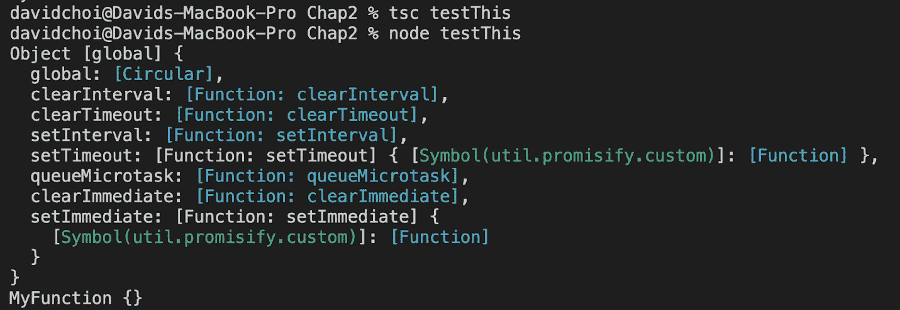

图 3.1 - testThis 结果

因此，当直接调用`MyFunction`时，立即作用域父级将是 Node 的全局对象，因为我们不是在浏览器中运行。接下来，如果我们使用`new MyFunction()`从`MyFunction`创建一个新对象，`this`对象将成为它自己的对象实例，因为该函数被用来创建一个对象，而不是直接运行。

既然我们已经了解了这一点，让我们看看箭头函数是什么样子的。创建`arrowFunction.ts`文件，并添加以下代码：

```ts
const myFunc = (message: string): void => {
    console.log(message);
}

myFunc('hello');
```

如果编译并运行此代码，您将看到打印出`hello`。语法与函数类型非常相似；但它们并不相同。如果我们看一下代码，您会看到参数括号后面有一个冒号，然后是参数括号后面的 void 类型。这是函数的返回类型。在函数类型的情况下，返回类型在`=>`符号之后表示。

关于箭头函数还有一些额外的事情需要注意。JavaScript 中的所有非箭头函数都可以访问一个称为`arguments`的集合。这是给定给函数的所有参数的集合。箭头函数没有自己的`arguments`集合。但是，它们可以访问立即函数父级的`arguments`集合。

箭头函数有几种主体样式。以下是三种样式的示例：

```ts
const func = () => console.log('func');
const func1 = () => ({ name: 'dave' });
const func2 = () => {
    const val = 20;
    return val;
}
console.log(func());
console.log(func1());
console.log(func2());
```

让我们看看这三种样式：

+   第一个函数`func`显示了函数体中只使用了一行代码，没有返回任何内容，您可以看到函数体没有闭合括号或括号。

+   第二个函数`func1`显示了只有一行，但返回了一些内容的情况。在这种情况下，不需要`return`关键字，只有在返回对象时才需要括号。

+   最后一个案例是`func2`。在这种情况下，需要花括号，因为这是一个多行语句（无论是否返回）。

我们在本节中介绍了箭头函数。箭头函数在现代 JavaScript 和 TypeScript 代码中被广泛使用，因此深入了解这个特性是有益的。

# 更改 this 上下文

我们已经在前一节讨论了`this`上下文对象。如前所述，在 JavaScript 中，函数可以访问一个称为`this`的内部对象，该对象表示函数的调用者。现在，使用`this`的令人困惑的部分是，`this`的值可能会根据函数的调用方式而改变。因此，JavaScript 提供了一些帮助器，允许您将函数的`this`对象重置为您想要的对象，而不是给定的对象。有几种方法，包括`apply`和`call`，但我们要学习的最重要的是`bind`关键字。这对我们很重要，因为在 React 基于类的组件中经常使用`bind`。现在展示一个完整的 React 示例还为时过早。所以，让我们从一些更简单的东西开始。创建一个名为`bind.ts`的新文件，并将以下代码添加到其中：

```ts
class A {
    name: string = 'A';
    go() {
        console.log(this.name);
    }
}
class B {
    name: string = 'B';
    go() {
        console.log(this.name);
    }
}
const a = new A();
a.go();
const b = new B();
b.go = b.go.bind(a);
b.go();
```

从这段代码中可以看出，有两个不同的类：`A`和`B`。这两个类都有一个`go`函数，将特定的类名写入日志。现在，当我们将`b`对象的`go`函数的`this`对象的`bind`重置为`a`对象时，它会将`console.log(this.name)`语句切换为使用`a`作为`this`对象。因此，如果我们编译并运行，我们会得到这个：

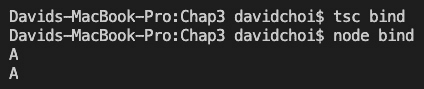

图 3.2 - bind

正如您所看到的，`a.go()`写入了`A`，但`b.go()`也写入了`A`，而不是`B`，因为我们将`this`切换为`a`而不是`b`。请注意，除了接受`this`参数外，`bind`还可以在此后接受任意数量的参数。

您可能想知道使用`bind`、`call`和`apply`之间的区别是什么。`bind`用于更改`this`上下文，稍后在调用函数时，它将具有更改后的`this`对象。但是，`call`和`apply`是在调用函数时立即替换调用时的`this`上下文。`call`和`apply`之间的区别在于，`call`接受不确定数量的参数，而`apply`接受参数数组。让我们看一些示例。创建一个名为`call.js`的文件，并将以下代码添加到其中：

```ts
const callerObj = {
    name: 'jon'
}
function checkMyThis(age) {    
    console.log(`What is this ${this}`)
    console.log(`Do I have a name? ${this.name}`)
    this.age = age;
    console.log(`What is my age ${this.age}`);
}
checkMyThis();
checkMyThis.call(callerObj, 25);
```

首先，我们创建一个名为`callerObj`的新对象，它有一个名为`name`的字段，即`jon`。之后，我们声明一个`checkMyThis`函数，测试当前的`this`是什么，以及它是否有一个名字。最后，我们运行两个调用。请注意，第二个调用看起来很奇怪，但`checkMyThis.call`实际上是对`checkMyThis`函数的执行。如果我们运行这段代码，我们会看到一些有趣的东西。运行以下命令：

```ts
node call
```

您将看到以下结果：

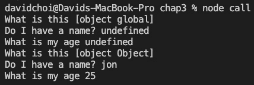

图 3.3 – node call

`checkMyThis`函数的第一次执行默认使用全局对象，因为它没有被覆盖。对于 Node 来说，是 Node 的全局对象，但对于浏览器来说，是`window`对象。我们还看到`name`和`age`字段是未定义的，因为 Node 的全局对象没有`name`字段，而 age 没有作为参数传递给`checkMyThis`。然而，在函数的第二次执行中，使用`call`，我们看到对象已经改变为标准对象类型，它有一个名为`jon`的`name`字段，这是`callerObj`的`name`字段，以及一个等于`25`的`age`字段，这是我们传递给`call`的参数。您应该注意`call`的参数列表的顺序遵循被调用函数的参数列表的顺序。`apply`的用法是相同的；但是，它将参数作为数组。

在本节中，我们了解了处理`this`上下文的困难以及如何使用`bind`来处理这个问题。一旦我们开始创建 React 组件，我们将广泛使用`bind`。但即使超出了特定的用例，您会发现您的代码有时需要能够更改`this`上下文，可能还需要一些函数的参数。因此，这种能力是一个非常有用的功能。

# 学习 spread、解构和 rest

在 ES6+中，有新的方法来处理对象的复制和显示变量和参数。这些功能在使 JavaScript 代码更短、更易读方面发挥了重要作用。这些特性已经成为现代 JavaScript 的标准实践，因此我们需要了解它们并正确使用它们。

## Spread、Object.assign 和 Array.concat

`Object.assign`和`Array.concat` JavaScript 功能非常相似。基本上，您将多个对象或数组追加到一个对象或数组中。但严格来说，有一些区别。

在对象的情况下，有两种合并或连接对象的方法：

+   Spread—例如，`{ … obja, …objb }`: 您正在创建这两个对象的非修改副本，然后创建一个全新的对象。请注意，spread 可以处理不止两个对象。

+   `Object.assign`—`(obja, objb)`: 将`objb`的属性添加到`obja`中并返回`obja`。因此，`obja`被修改。以下是一个示例。创建一个名为`spreadObj.ts`的新文件，并添加以下代码：

```ts
namespace NamespaceA {
    class A {
        aname: string = 'A';
    }
    class B {
        bname: string = 'B';
    }
    const a = new A();
    const b = new B();
    c, which is set using the spread operator, …. After that, we create d from the Object.assign call. Let's try running this code. You'll need to target ES6 since Object.assign is only available on that version of JavaScript. Let's compile and then run with the following commands:

```

tsc spreadObj –target 'es6'

node spreadObj

```ts

Once these commands run, you will see the following:
```

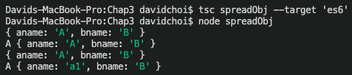

图 3.4 – spreadObj

如您所见，`c`既有`aname`和`bname`属性，但它是一个独特的对象。然而，`d`实际上是对象`a`具有对象`b`的属性，这由`a.aname = 'a1'`设置后`aname`变量等于`a1`来证明。

现在，对于合并或连接数组，您还有两种方法：

+   展开运算符：与对象的展开类似，它合并数组并返回一个新的单一数组。原始数组不会被修改。

+   `Array.concat`：通过将两个源数组合并成一个新数组来创建一个新数组。原始数组不会被修改。

让我们看一个使用这两种方法的示例。创建一个名为`spreadArray.ts`的文件，并添加以下代码：

```ts
namespace SpreadArray {
    const a = [1,2,3];
    const b = [4,5,6];
    const c = [...a, ...b];
    const d = a.concat(b);
    console.log('c before', c);
    console.log('d before', d);
    a.push(10);
    console.log('a', a);
    console.log('c after', c);
    console.log('d after', d);
}
```

正如您所看到的，数组`c`是使用 spread 从两个数组`a`和`b`创建的。然后，数组`d`是使用`a.concat(b)`创建的。在这种情况下，两个结果数组都是唯一的，不引用任何原始数组。让我们像之前一样编译和运行这段代码，看看我们得到了什么：

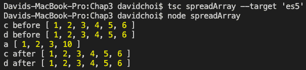

图 3.5 – spreadArray

您会发现`a.push(10)`对`console.log('d after', d)`语句没有影响，即使数组`d`是从数组`a`创建的。这表明数组的 spread 和`concat`都会创建新的数组。

解构

**解构**是显示和直接使用对象内部属性的能力，而不仅仅依赖于对象名称。我稍后会用一个例子来解释这一点，但请注意，这是现代 JavaScript 开发中非常常用的功能，特别是在 React hooks 中，所以我们需要熟悉它。

让我们来看一个对象解构的例子。对于这个例子，让我们只使用一个 JavaScript 文件，这样例子会更清晰。创建一个名为`destructuring.js`的新文件，并将以下代码添加到其中：

```ts
function getEmployee(id) {
    return {
        name: 'John',
        age: 35,
        address: '123 St',
        country: 'United States'
    }
}
const { name: fullName, age } = getEmployee(22);
console.log('employee', fullName, age);
```

假设一下`getEmployee`函数去服务器并通过`id`检索员工的信息。现在，正如您所看到的，`employee`对象有很多字段，也许并不是每个调用该函数的人都需要每个字段。因此，我们使用对象解构来选择我们关心的字段。此外，请注意，我们还使用冒号给字段名称取了一个别名`fullName`。

数组也可以进行解构。让我们将以下代码添加到这个文件中：

```ts
function getEmployeeWorkInfo(id) {
    return [
        id,
        'Office St',
        'France'
    ]
}
const [id, officeAddress] = getEmployeeWorkInfo(33);
console.log('employee', id, officeAddress);
```

在这个例子中，`getEmployeeWorkInfo`函数返回一个关于员工工作位置的事实数组；但它以数组的形式返回。因此，我们也可以对数组进行解构，但请注意，在解构时元素的顺序是很重要的。让我们看看这两个函数的结果。请注意，由于这是一个 JavaScript 文件，我们只需要调用 Node。运行以下命令：

```ts
node destructuring.js 
```

您将看到这两个函数的以下结果：

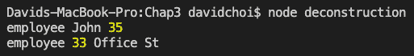

图 3.6 – 解构

正如您所看到的，这两个函数都返回了正确的相关数据。

## 休息

`…`关键字。任何 rest 参数都是数组，因此可以访问所有数组函数。rest 关键字指的是"其余的项目"，而不是"暂停"或"停止"。这个关键字在创建函数签名时提供了更多的灵活性，因为它允许调用者确定他们想要传递多少参数。请注意，只有最后一个参数可以是 rest 参数。以下是使用 rest 的一个例子。创建一个名为`rest.js`的文件，并添加以下代码：

```ts
function doSomething(a, ...others) {
    console.log(a, others, others[others.length - 1]);
}
doSomething(1,2,3,4,5,6,7);
```

正如您所看到的，`…others`指的是`a`之后的其余参数。这表明 rest 参数不必是函数的唯一参数。因此，如果您运行此代码，您会得到以下结果：

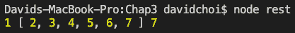

图 3.7 – Rest

`doSomething`函数接收两个参数：`a`变量和`a`参数，rest 参数（再次是参数数组），以及 rest 参数的最后一个元素。Rest 并不像 spread 和解构那样经常使用。尽管如此，您会看到它，所以您应该意识到它。

在本节中，我们学习了使代码更简洁和易读的 JavaScript 特性。这些特性在现代 JavaScript 编程中非常常见，因此学会使用这些功能将使您受益匪浅。在下一节中，我们将学习一些非常重要的数组操作技术，这些技术可以简化处理数组，并且也非常常用。

# 学习新的数组函数

在本节中，我们将回顾 ES6 中用于操作数组的许多方法。这是一个非常重要的部分，因为你将经常在 JavaScript 编程中处理数组，并且使用这些性能优化的方法比创建自己的方法更可取。使用这些标准方法还可以使代码更一致和易读，其他开发人员在你的团队上也会更容易理解。我们将在 React 和 Node 开发中广泛利用这些方法。让我们开始吧。

## find

`find`关键字允许你从数组中抓取与搜索条件匹配的第一个元素。让我们看一个简单的例子。创建`find.ts`并添加以下代码：

```ts
const items = [
    { name: 'jon', age: 20 },
    { name: 'linda', age: 22 },
    { name: 'jon', age: 40}
]
const jon = items.find((item) => {
    return item.name === 'jon'
});
console.log(jon);
```

如果你看一下`find`的代码，你会发现它接受一个函数作为参数，这个函数是在寻找名为`jon`的项目。该函数进行真值检查，以判断项目的名称是否等于`jon`。如果项目的真值检查为真，`find`将返回该项目。然而，你也可以看到数组中有两个`jon`项目。让我们编译并运行这段代码，看看哪一个会返回。运行以下命令：

```ts
tsc find –target 'es6'
node find
```

编译并运行上述命令后，你应该会看到以下结果：

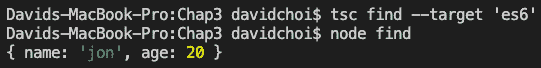

Figure 3.8 – find

你可以在输出中看到第一个找到的`jon`项目被返回。这就是`find`的工作方式；它总是只返回一个项目——数组中找到的第一个项目。

## filter

`filter`与`find`类似，只是它返回所有匹配搜索条件的项目。让我们创建一个名为`filter.ts`的新文件，并添加以下代码：

```ts
const filterItems = [
    { name: 'jon', age: 20 },
    { name: 'linda', age: 22 },
    { name: 'jon', age: 40}
]
const results = filterItems.filter((item, index) => {
    return item.name === 'jon'
});
console.log(results);
```

正如你所看到的，`filter`函数也可以接受数组中项目的索引号作为可选的第二个参数。但是，内部实现上，它看起来与`find`的工作方式相同，都是通过真值检查来判断是否找到了某个匹配项。然而，对于`filter`来说，所有匹配项都会被返回，如下所示：

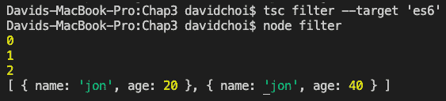

Figure 3.9 – filter

正如你所看到的，对于`filter`来说，所有满足过滤条件的项目都会被返回，这在这个示例中是两个`jon`项目。

## map

`map`函数是 ES6 风格编码中需要了解的更重要的数组函数之一。它经常出现在 React 组件创建中，以便从数据数组中创建一组组件元素。请注意，`map`函数与`Map`集合不同，我们将在本章后面介绍。创建一个名为`map.ts`的新文件，并添加以下代码：

```ts
const employees = [
    { name: 'tim', id: 1 },
    { name: 'cindy', id: 2 },
    { name: 'rob', id: 3 },
]
const elements = employees.map((item, index) => {
    return `<div>${item.id} - ${item.name}</div>`;
});
console.log(elements);
```

正如你所看到的，`map`函数有两个参数，`item`和`index`（你可以随意命名，但顺序很重要），它将自定义的返回值映射到每个数组元素。要清楚，`return`意味着将每个项目返回到一个新数组中。它并不意味着返回并停止运行迭代。如果我们运行代码，结果将是以下 DOM 字符串：

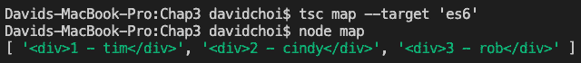

Figure 3.10 – map

这个函数实际上可能是最常见的 ES6 数组函数，所以你非常重要要理解它是如何工作的。尝试修改代码并练习使用它与不同的数组项目类型。

## reduce

`reduce`函数是一个聚合器，它接受数组中的每个元素，并根据自定义逻辑创建一个最终值。让我们看一个例子。创建一个`reduce.js`文件——同样，我们将使用 JavaScript 文件来减少 TypeScript 编译器的一些噪音，并专注于代码——并添加以下代码：

```ts
const allTrucks = [
    2,5,7,10
]
const initialCapacity = 0;
const allTonnage = allTrucks.reduce((totalCapacity,  currentCapacity) => {
    totalCapacity = totalCapacity + currentCapacity;

    return totalCapacity;
}, initialCapacity);
console.log(allTonnage);
```

在这个例子中，让我们想象一下我们需要计算一家卡车公司所有卡车的总吨位容量。然后，`allTrucks`列出了它所有卡车的吨位。然后，我们使用`allTrucks.reduce`来获得所有卡车的总容量。`initialCapacity`变量仅用于有一个起始点，目前设置为`0`。然后，当我们记录最终值时，我们会看到以下结果：

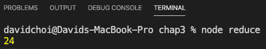

图 3.11 - reduce

所有卡车的总容量是`24`，因为每辆卡车的容量之和为 24。请注意，reducer 的逻辑可以是任何内容；它不一定要是求和。它可以是减法或者您可能需要的任何其他逻辑。核心点在于最终，您将只有一个单一的值或对象结果。这就是为什么它被称为`reduce`。

## some 和 every

这些函数旨在测试特定的条件。因此，它们只返回`true`或`false`。`some`用于检查数组中是否有*任何*元素满足特定条件，而`every`用于检查*所有*元素是否满足特定条件。让我们来看看两者。创建一个名为`someEvery.js`的文件，并添加以下代码：

```ts
const widgets = [
    { id: 1, color: 'blue' },
    { id: 2, color: 'yellow' },
    { id: 3, color: 'orange' },
    { id: 4, color: 'blue' },
]
console.log('some are blue', widgets.some(item => {
    return item.color === 'blue';
}));
console.log('every one is blue', widgets.every(item => {
    return item.color === 'blue';
}));
```

代码非常简单，`some`和`every`的两个条件都被测试了。如果你运行这段代码，你会看到以下结果：

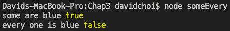

图 3.12 - someEvery

如您所见，结果对每个测试都是有效的。

在本节中，我们学习了 ES6 中添加的许多新函数，这些函数可以帮助我们更有效地处理和使用 JavaScript 中的数组。在构建应用程序时，您肯定会在自己的代码中使用许多这些函数。接下来，我们将学习一些可以用来替代数组的新集合类型。

# 学习新的集合类型

ES6 有两种新的集合类型，`Set`和`Map`，它们对于特定的场景可能会很有用。在本节中，我们将学习这两种类型以及如何为它们编写代码，以便在我们开始构建应用程序时稍后使用它们。

## Set

`Set`是一组唯一值或对象。当您只想查看一个项目是否包含在一个大型复杂列表中时，这是一个很好的函数。让我们看一个例子。创建一个名为`set.js`的新文件，并添加以下代码：

```ts
const userIds = [
    1,2,1,3
]
const uniqueIds = new Set(userIds);
console.log(uniqueIds);
uniqueIds.add(10);
console.log('add 10', uniqueIds);
console.log('has', uniqueIds.has(3));
console.log('size', uniqueIds.size);
for (let item of uniqueIds) {
    console.log('iterate', item);
}
```

`Set`对象有许多成员，但这些是它最重要的一些特性。正如您所看到的，`Set`有一个构造函数，可以接受一个数组，使该数组成为一个唯一集合。

重要提示

关于集合，`size`用于检查数量而不是长度。

在底部，请注意迭代`Set`与正常使用数组索引的方式不同。运行此文件将产生以下结果：

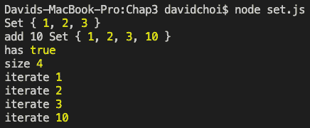

图 3.13 - Set

从概念上讲，它仍然与数组非常相似，但是针对唯一集合进行了优化。

## Map

`Map`是键值对的集合。换句话说，它是一个字典。`Map`的每个成员都有一个唯一的键。让我们创建一个示例`Map`对象。创建一个名为`mapCollection.js`的新文件，并添加以下代码：

```ts
const mappedEmp = new Map();
mappedEmp.set('linda', { fullName: 'Linda Johnson', id: 1 });
mappedEmp.set('jim', { fullName: 'Jim Thomson', id: 2 });
mappedEmp.set('pam', { fullName: 'Pam Dryer', id: 4 });
console.log(mappedEmp);
console.log('get', mappedEmp.get('jim'));
console.log('size', mappedEmp.size);
for(let [key, val] of mappedEmp) {
    console.log('iterate', key, val);
}
```

正如您所看到的，一些调用与`Set`非常相似。然而，一个不同之处在于底部的迭代循环，它使用数组来指示键和值。运行此文件将产生以下输出：

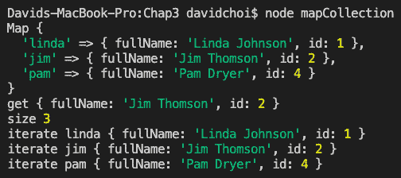

图 3.14 - mapCollection

这很简单。首先，记录了所有`Map`对象的列表。然后，我们使用`get`通过其键值获取了`jim`项。接下来是`size`，最后是对所有元素的迭代。

本节展示了 ES6 中的两种新集合类型。这些类型并不经常使用，但如果您有这些集合所需的需求，它们可能会派上用场。在下一节中，我们将讨论`async await`，这是一个 ES7 功能。`async await`已经被 JavaScript 开发者社区广泛采用，因为它使难以阅读的异步代码变得更加可读，并使其看起来像是同步的。

# 学习关于`async await`

在解释`async`和`await`之前，让我们解释一下什么是异步代码。在大多数语言中，代码通常是同步的，这意味着语句一个接一个地运行。如果有语句`A`，`B`和`C`，语句`B`在语句`A`完成之前无法运行，语句`C`在语句`B`完成之前无法运行。然而，在异步编程中，如果语句`A`是异步的，它将开始，但紧接着，语句`B`将立即开始。因此，语句`B`在运行之前不会等待`A`完成。这对性能来说很好，但使代码更难阅读和修复。JavaScript 中的`async` `await`试图解决其中一些困难。

因此，异步编程提供了更快的性能，因为语句可以同时运行，而无需等待彼此。然而，为了理解异步编程，我们首先需要理解回调。回调是 Node.js 编程自诞生以来的核心特性，因此理解它是很重要的。让我们看一个回调的例子。创建一个名为`callback.js`的新文件，并输入以下代码：

```ts
function letMeKnowWhenComplete(size, callback) {
    var reducer = 0;
    for (var i = 1; i < size; i++) {
        reducer = Math.sin(reducer * i);
    }
    callback();
}
letMeKnowWhenComplete(100000000, function () { console.log('Great it completed.'); });
```

如果我们看一下这段代码，我们可以看到`letMeKnowWhenComplete`函数有两个参数。第一个参数表示要进行数学计算的迭代的大小，第二个参数是实际的回调。从代码中可以看出，`callback`是一个在数学工作完成后执行的函数，因此得名。准确地说，技术上回调实际上并不是异步的。然而，它提供了实际上相同的能力，即次要工作，即回调，在主要工作完成后立即完成，而无需等待或轮询。现在，让我们看一下 JavaScript 的第一种异步完成方法。

JavaScript 获得的第一个执行异步的能力是使用`setTimeout`和`setInterval`函数。这些函数很简单；它们接受一个回调，一旦指定的时间完成，就会执行。在`setInterval`的情况下，唯一的区别是它会重复。这些函数之所以真正是异步的原因是，当计时器运行时，它在当前的`setTimer.js`之外运行，并输入以下代码：

```ts
// 1
console.log('Let's begin.');
// 2
setTimeout(() => {
    console.log('I waited and am done now.');
}, 3000);
// 3
console.log('Did I finish yet?');
```

让我们回顾一下这段代码。我已经添加了注释来分隔主要部分。首先，在注释 1 下，我们有一个日志消息，指示这段代码正在开始。然后，在注释 2 下，我们有`setTimeout`，它将在等待 3 秒后执行我们的箭头函数回调。当回调运行时，它将记录它已经完成。在`setTimeout`之后，我们看到另一个日志消息，在注释 3 下，询问计时器是否已经完成。现在，当您运行这段代码时，将会发生一件奇怪的事情，如下图所示：

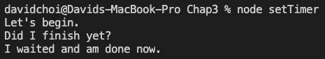

图 3.15 - setTimer

最后一个日志消息询问“我完成了吗？”将首先运行，然后完成日志“我等待并且现在完成了”。为什么呢？`SetTimeout`是一个异步函数，所以当它执行时，它允许之后写的任何代码立即执行（即使`setTimeout`还没有完成）。这意味着在这种情况下，注释 3 中的日志实际上在注释 2 中的回调之前运行。因此，如果我们想象注释 3 中有一些需要立即运行的重要代码，而不需要等待注释 2，我们就可以看到使用异步调用对性能有多么有帮助。现在，让我们结合对回调和异步调用的理解，来看一下 Promise。

在`async await`之前，异步代码是使用 Promises 来处理的。`Promise`是一个在未来某个不确定的时间延迟完成的对象。`Promise`代码的一个例子可能是这样的。创建一个名为`promise.js`的文件，并添加以下代码：

```ts
const myPromise = new Promise((resolve, reject) => {
    setTimeout(() => {
        //resolve('I completed successfully');
        reject('I failed');
    }, 500);
});
myPromise
.then(done => {
    console.log(done);
})
.catch(err => {
    console.log(err);
});
```

在这段代码中，我们首先创建一个`Promise`对象，并在内部使用异步计时器在 500 毫秒后执行一个语句。在第一次尝试中，我们故意通过调用`reject`来使计时器失败，这会导致`Promise`定义下面的代码进入`catch`处理程序。现在，如果我们注释掉`reject`，然后取消注释`resolve`，底部的代码将进入`then`处理程序。显然，这段代码是有效的，但是如果想象一个更复杂的`Promise`，有许多`then`语句，甚至有许多 Promise，那么阅读和理解将变得越来越复杂。

这就是`async await`的作用。它有两个主要作用：它清理了代码，使其更简单更小，并且使代码更易于理解，因为它*看起来*像同步代码。让我们看一个例子。创建一个名为`async.js`的新文件，并添加以下代码：

```ts
async function delayedResult() {
    return new Promise((resolve, reject) => {
        setTimeout(() => {
            resolve('I completed successfully');
        }, 500);
    });
}
(async function execAsyncFunc() {
    const result = await delayedResult();
    console.log(result);
})();
```

这段代码有一个名为`delayedResult`的函数，正如您所看到的，它在前面有`async`前缀。在函数前面加上`async`告诉运行时，这个函数将返回一个`Promise`，因此应该异步处理。在`delayedResult`之后，我们看到一个名为`execAsyncFunc`的函数，它同时声明和执行。如果您不熟悉它，这种能力被称为`execAsyncFunc`函数也是`async`-capable，并且正如您所看到的，它内部使用了`await`关键字。`await`关键字告诉运行时，我们即将执行一个异步函数，因此它应该代表我们等待，然后，一旦语句完成，给我们实际的返回值。如果我们运行这段代码，我们会看到以下内容：


图 3.16 – 异步

正如您所看到的，`result`变量包含`I completed successfully`字符串，而不是`delayedResult`通常返回的`Promise`。这种语法显然比有许多嵌套的`Promise` `then`语句更短更易读。请注意，`async`和`await`已经在 JavaScript 社区中取代了异步开发。您必须深刻理解它，才能成功地使用现代 JavaScript。我们将看一个更多的例子来加深理解。

重要提示

我们必须为`execAsyncFunc`函数使用 IIFE，因为在当前的 JavaScript 中，不允许顶层的`await`。顶层的`await`基本上意味着能够运行一个不在另一个`async`函数内部的函数的等待调用。在 JavaScript 的 ECMAScript 2020 版本中，这是被启用的，但在撰写本文时，它尚未完全在所有浏览器中得到支持。

因为`async await`非常重要，让我们再看一个例子。让我们调用一个网络资源来获取一些数据。我们将使用`fetch` API，但由于 Node 不支持它，我们需要先安装另一个`npm`包。以下是步骤：

1.  在终端中运行以下命令以安装`fetch`：

```ts
npm i node-fetch
```

1.  创建一个名为`fetch.js`的文件，并输入以下代码：

```ts
const fetch = require('node-fetch');
(async function getData() {
    const response = await fetch('https://pokeapi.co/api/v2/     pokemon/ditto/');
    if(response.ok) {
        const result = await response.json();
        console.log(result);
    } else {
        console.log('Failed to get anything');
    }
})();
```

请注意，在这个例子中，代码的易读性和自然流程。正如您所看到的，我们正在使用`fetch` API，它允许我们进行异步网络调用。在导入`fetch`之后，我们再次创建一个`async`包装函数来执行对我们的`fetch`函数的`await`调用。如果您想知道，URL 是一个不需要身份验证的宠物小精灵角色的公共 API。第一次调用`await`是为了实际的网络调用本身。一旦该调用完成，使用`response.ok`进行成功检查。如果成功，再次调用`await`将数据转换为 JSON 格式。每次调用`await`都会阻塞代码，直到函数完成并返回。

我们正在*等待*，因为没有来自网络 API 的数据，所以我们别无选择，只能等待。如果运行此代码，您将看到以下数据：

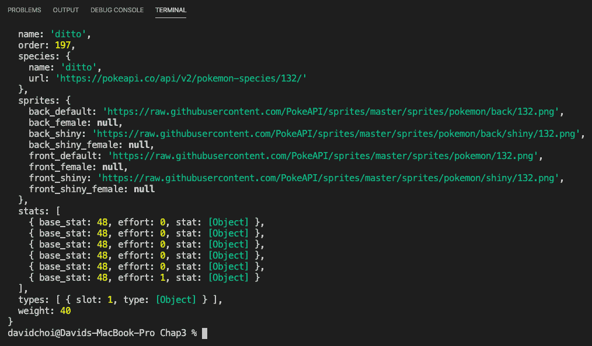

图 3.17 - 获取

当这段代码运行时，你可能会注意到代码完成之前有一小段延迟。这显示了代码需要等待数据的网络调用完成。

在本节中，我们了解了什么是异步编程。我们还讨论了 Promise，这是 JavaScript 中异步编程的基础，以及`async await`，它为我们提供了一种简化异步代码的方法。你将会在 React 和 Node 开发中大量看到`async await`的使用。

# 总结

在这一章中，我们看了很多 JavaScript 编程的新功能，比如用`async await`合并对象和数组的方法，这是一种新的非常流行的处理异步代码的方式。理解这些功能非常重要，因为它们在现代 JavaScript 和 React 开发中被广泛使用。

在接下来的部分中，我们将开始深入学习使用 React 进行单页应用程序开发。我们将开始使用本章学到的许多功能。
