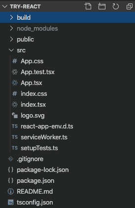
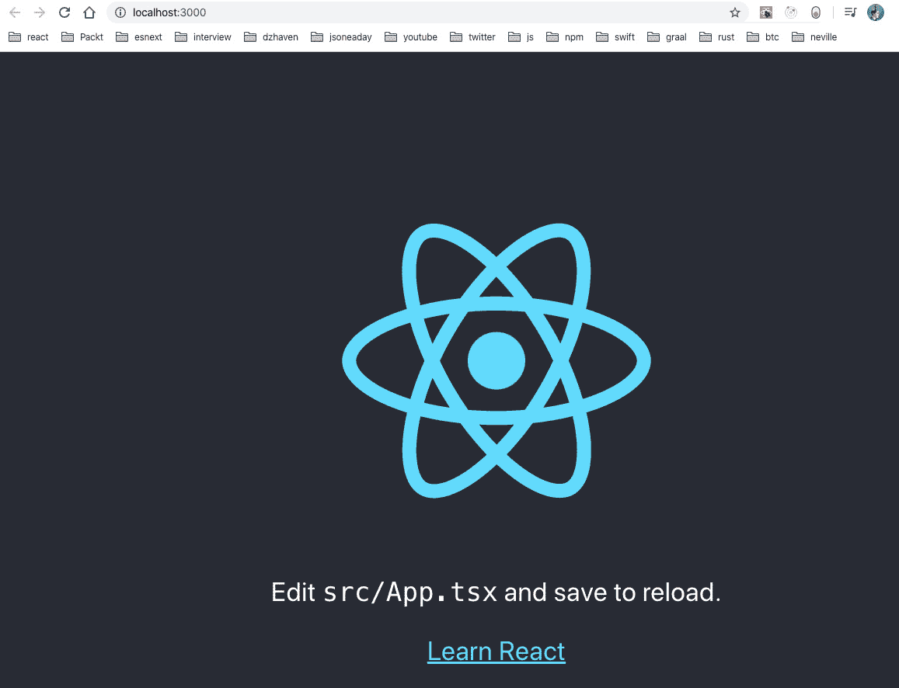
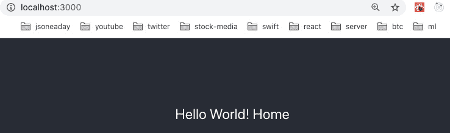
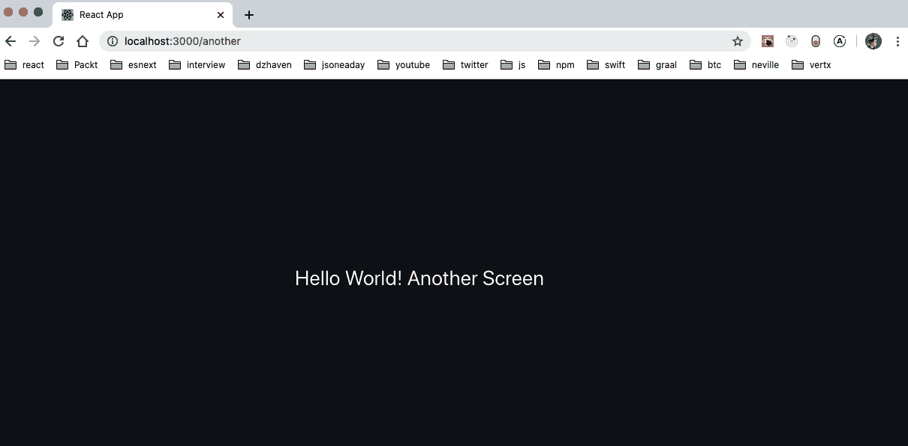
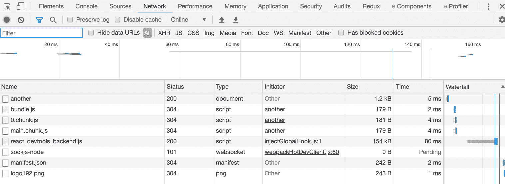

# 第四章：学习单页应用程序的概念以及 React 如何实现它们

在本章中，我们将学习**单页应用程序**（**SPA**）。这种编程 Web 应用程序的风格在 Web 开发的历史上相对较新，但近年来已经得到了广泛的应用。它的使用现在是构建需要感觉像原生桌面或移动应用程序的大型复杂 Web 应用程序的常见做法。

我们将回顾构建 Web 应用程序的以前方法以及为什么创建了 SPA 风格的应用程序。然后，我们将学习 React 如何帮助我们以高效和有效的方式构建这种应用程序风格。

在本章中，我们将涵盖以下主要主题：

+   了解过去网站是如何构建的

+   理解 SPA 的好处和属性

+   了解 React 如何帮助构建 SPA 应用程序

# 技术要求

本章的要求与*第三章*的要求相似，*使用 ES6+功能构建更好的应用程序*。您应该对 JavaScript 以及 HTML 和 CSS 有基本的了解。我们将再次使用 Node.js 和**Visual Studio Code**（**VSCode**）。

GitHub 存储库再次位于[`github.com/PacktPublishing/Full-Stack-React-TypeScript-and-Node`](https://github.com/PacktPublishing/Full-Stack-React-TypeScript-and-Node)。使用`Chap4`文件夹中的代码。

设置本章的代码文件夹，转到您的`HandsOnTypescript`文件夹并创建一个名为`Chap4`的新文件夹。

# 了解过去网站是如何构建的

在本节中，我们将通过回顾设计和编写网页的原始方法来调查 SPA 风格编程的创建原因。了解这些知识将帮助我们理解转向 SPA 的原因。

最初，当 Web 开始时，没有 JavaScript 语言。最初，这只是为了在科学家之间共享文档而创建的静态 HTML 页面。一旦这种文档格式和互联网变得更受欢迎，人们意识到这些文档需要改进的样式方法来增强沟通。因此，创建了 CSS，并且它成为了 HTML 文档的样式和布局的标准。最后，网景浏览器公司决定 Web 需要一种脚本语言来使页面内容更加动态，于是他们创建了 JavaScript。

尽管有这些功能，原始的 Web 仍然非常静态。当您在浏览器中输入 URL 时，您会收到一个文档，即服务器上的实际文件，对于您输入的每个 URL 都是如此。CSS 和 JavaScript 确实有助于使 Web 看起来更好，更具动态性，但它并没有改变 Web 的面向页面的模型。

随着网站变得越来越复杂，许多网页开发人员希望更好地控制他们的网页文档。他们希望动态控制网页的布局和内容。这导致了**通用网关接口**（**CGI**）的创建。CGI 是对**服务器端渲染**（**SSR**）的早期尝试。这基本上意味着浏览器的请求被 Web 服务器接收，但服务器不会返回静态 HTML 页面，而是运行一个处理器，根据参数和逻辑动态生成页面，然后发送回去。

无论网站使用静态 HTML 页面还是在服务器上使用服务器端逻辑呈现其页面，在过去，重点是向浏览器发送完整的 HTML 页面作为文件。这通常是网站的工作方式。

这种单文件或基于页面的模型与本机应用程序的工作方式完全不同，无论是在桌面还是移动设备上。本机应用程序模型不同之处在于整个应用程序被下载并安装到用户的设备上。用户打开应用程序时，它已经准备好在那一刻全部使用。需要在屏幕上绘制的任何控件都是从已经存在的代码中完成的，除了发送或获取数据的调用之外，不需要额外调用后端服务器（其他调用）。这使应用程序的响应速度和速度比旧模型中不断需要刷新页面以显示新内容的经典 Web 应用程序明显更快。

SPA 应用程序的动机是使 Web 应用程序感觉更像本机设备应用程序，以便给它们相同的速度和响应性感觉。因此，SPA 风格使用各种技术和库使 Web 应用程序的功能和感觉更像本机应用程序。

在本节中，我们回顾了早期 Web 构建网站的方式。当时，重点是生成和提供单独的 HTML 文档文件。我们看到了这种编程风格的局限性，特别是与本机应用程序相比，以及 SPA 风格应用程序是试图解决这些限制并使 Web 应用程序看起来像本机应用程序的尝试。在下一节中，您将看到 SPA 应用程序是什么，以及它们如何改进原始 Web 的页面集中模型。

# 理解 SPA 的好处和特性

在本节中，我们将了解 SPA 应用程序的好处和特性。通过了解这些特性，它们将帮助我们理解在创建 React 时所做的一些架构决策，以及在创建 React 应用程序时使用的一些相关库和组件。

正如前面提到的，使用 SPA 风格的应用程序构建的动机是使我们的 Web 应用程序看起来和感觉上更像本机应用程序。通过使用 SPA 应用程序方法，我们将使我们的程序响应和外观看起来像是安装在设备上的。经典风格的 Web 应用程序可能会显得迟钝，因为对页面的任何更改都需要回调服务器以获取新屏幕。然而，SPA 风格的应用程序可以立即重绘屏幕的部分，而无需等待服务器返回新文件。因此，就用户而言，SPA 应用程序就像本机设备应用程序一样。

构建 SPA 应用程序非常复杂，需要使用许多组件和库。然而，无论我们使用 Angular、Vue、React 还是其他框架，SPA 应用程序始终具有某些特性和要求。

让我们了解一些要求：

+   顾名思义，整个应用程序只存在于一个 HTML 页面上。与使用单独页面显示不同屏幕的标准 HTML 应用程序不同，第一个页面是 SPA 应用程序上唯一加载的页面。

+   与静态 HTML 文件不同，JavaScript 动态渲染屏幕。因此，首先下载的 HTML 页面实际上几乎完全没有内容。但它将有一个根元素，位于 body 标记内，成为整个应用程序的容器，再次随着用户与应用程序的交互而实时渲染。

+   通常在检索主 HTML 文件时，需要运行应用程序的所有脚本和文件都会被下载。然而，这种方法正在改变，越来越多的应用程序只下载一个基本级别的脚本文件，然后根据需要按需下载其他脚本。我们将在后面讨论如何使用这些技术，因为它们可以通过减少屏幕等待时间来增强用户体验。

+   对于单页应用程序，URL 路由的处理方式有所不同。在 SPA 应用程序中，根据您选择的框架，会使用一些机制来创建**虚拟路由**。虚拟路由简单地意味着，尽管对用户来说，不同的调用会导致对不同的服务器端 URL 的访问，但实际上，“路由”只是在客户端浏览器上进行，以便对不同的屏幕进行逻辑转换。换句话说，不会发出对服务器的调用，URL 路由成为将应用程序逻辑上分隔成不同屏幕的手段。例如，当用户在浏览器中输入 URL 时，他们必须按下*Enter*才能将提交发送回 URL 的目的地服务器。然而，在 SPA 应用程序中发生路由时，URL 中并没有实际的服务器路径。它不存在。因此，提交不会被触发。相反，应用程序使用 URL 作为应用程序各部分的容器，并在给定某些 URL 时触发某些行为。话虽如此，URL 路由仍然是一个有用的功能，因为大多数用户都希望具有路由功能，并且它允许他们将屏幕加为书签。

在本节中，我们已经了解了构成 SPA 的属性。我们涵盖了处理整个应用程序只有一个文件的不同方法以及用于构建这些应用程序的方法。在下一节中，我们将深入了解 React 如何实现 SPA 以及 React 团队为创建这种应用程序风格所做的决定。

# 理解 React 如何帮助构建单页应用

在这一部分，我们将以高层次了解 React。这种理解将有助于我们构建更好的基于 React 的应用程序，因为我们将了解 React 在内部是如何运作的。

如前所述，网站主要只是一个 HTML 文件，这是一个基于文本的文档。这个文件包含浏览器用来创建一个称为**文档对象模型**（**DOM**）的逻辑树的代码。这个树根据它们的顺序和相对于结构中其他元素的位置来表示文件中的所有 HTML 元素。所有网站都在其页面上有一个 DOM 结构，无论它们是否使用 SPA 风格。然而，React 以独特的方式利用 DOM 来帮助构建应用程序。

React 有两个主要构造：

+   React 在运行时维护自己的虚拟 DOM。这个虚拟 DOM 与浏览器的 DOM 是不同的。它是 React 根据我们的代码指令创建和维护的 DOM 的独特副本。这个虚拟 DOM 是根据 React 服务内部执行的协调过程创建和编辑的。协调过程是一个比较过程，React 会查看浏览器 DOM 并将其与自己的虚拟 DOM 进行对比。这个协调过程通常被称为**渲染阶段**。当发现差异时，例如虚拟 DOM 包含一个浏览器 DOM 中没有的元素时，React 将向浏览器 DOM 发送指令，以创建该元素，以使浏览器 DOM 和虚拟 DOM 匹配。这个添加、编辑或删除元素的过程被称为**提交阶段**。

+   React 开发的另一个主要特点是它是状态驱动的。在 React 中，一个应用程序由许多组件组成，在每个组件中可能有一些本地状态（即数据）。如果由于任何原因这些数据发生变化，React 将触发其协调过程，并在需要时更改 DOM。

为了使这些概念更具体，我们应该看一个简单的 React 应用程序的例子。但在这之前，让我们回顾一下 React 应用程序是由什么组成的。

## React 应用程序的属性

在其核心，现代 React 应用程序需要一些基本功能才能运行。我们需要`npm`来帮助我们管理应用程序的依赖关系。正如您从我们之前的练习中看到的，`npm`是一个允许我们从中央存储库下载开源依赖项并在我们的应用程序中使用它们的存储库。我们还需要一个称为捆绑的工具。捆绑系统是一种服务，它聚合我们所有的脚本文件和资产，例如 CSS 文件，并将它们最小化为一组文件。最小化过程会从我们的脚本中删除空格和其他不需要的文本，以便最终下载到用户浏览器上的文件尽可能小。这种较小的有效载荷大小可以提高应用程序的启动时间并改善用户体验。我们将使用的捆绑系统称为 webpack，我们选择它是因为它是捆绑 React 应用程序的行业标准。此外，我们可以使用`npm`的内置脚本系统并创建脚本来自动化我们的一些工作。例如，我们可以创建脚本来启动我们的测试服务器，运行我们的测试，并构建应用程序的最终生产版本。

如果我们使用`create-react-app` `npm`包，我们可以获得所有先前提到的依赖项，以及进行 React 开发的常见依赖项和一些内置脚本来管理我们的应用程序。让我们使用这个包并创建我们的第一个应用程序：

1.  在您的终端或命令行中，转到`HandsOnTypescript/Chap4`文件夹并运行以下命令：

```ts
npx, instead of npm i -g, so that you don't have to install create-react-app locally.
```

1.  一旦这个命令完成，打开 VSCode 并打开新创建的`try-react`文件夹，这是我们在本章开始时创建的。

1.  在 VSCode 中打开终端并运行以下命令：

```ts
build. After the build completes, you should see the following structure from VSCode:
```



图 4.1 - try-react

让我们从顶部开始看看`create-react-app`给我们提供了什么：

+   `build`文件夹是所有捆绑和最小化的最终生产文件的目的地。它们已经被缩小到尽可能小，并且调试信息也已被删除以提高性能。

+   接下来，我们有`node_modules`文件夹，其中包含我们从`npm`存储库下载的所有依赖项。

+   然后，我们有`public`文件夹，这是一个用于静态资产的文件夹，例如`index.html`文件，它将用于构建我们的最终应用程序。

+   接下来，也许最重要的文件夹是`src`。正如缩写的名称所示，这是包含所有源脚本的文件夹。任何扩展名为`.tsx`的文件都表示一个 React 组件。`.ts`文件只是普通的 TypeScript 文件。最后，`.css`文件包含我们的样式属性（可能不止一个）。`d.ts`文件包含 TypeScript 类型信息，编译器用它来确定需要进行的静态类型检查。

+   接下来是`.gitignore`文件。这个文件用于 GitHub 代码存储库，我们正在用它来保存本书的源代码。正如其名称所示，通过这个文件，我们告诉我们的`git`系统不要上传某些文件和文件夹，而是忽略它们。

+   `package.json`和`package-lock.json`文件用于配置和设置我们的依赖关系。此外，它们还可以存储我们构建、测试和运行脚本的配置，以及 Jest 测试框架的配置。

+   最后，我们有我们的`tsconfig.json`文件，我们在*第二章*中讨论过，*探索 TypeScript*。它将配置 TypeScript 编译器。请注意，默认情况下，严格模式已打开，因此我们不能使用隐式的`any`或`undefined`。

现在我们已经快速盘点了我们的项目，让我们来看看一些文件的内容。首先，我们将从`package.json`文件开始。`package.json`文件有许多部分，但让我们看一些最重要的部分：

+   `dependencies`部分包含我们的应用程序将用于某些功能的库。这些依赖包括 React，以及用于测试的 TypeScript 和 Jest 库。`@types`依赖项包含 TypeScript 定义文件。TypeScript 定义文件存储了 JavaScript 编写的框架的静态类型信息。换句话说，这个文件告诉 TypeScript 编译器框架使用的类型的形状，以便进行类型声明和检查。

+   还有另一个依赖项部分，称为`devDependencies`——虽然这里没有使用——通常存储开发时依赖项（与`dependencies`部分相对，后者通常只存储运行时依赖项）。出于某种原因，React 团队决定将两者合并为`dependencies`。话虽如此，你应该意识到这一点，因为你会在许多项目中看到这个部分。

+   脚本部分用于存储管理应用程序的脚本。例如，`start`脚本通过调用`npm run start`或`npm start`来使用。此脚本用于使用开发服务器启动我们的应用程序。我们还可以添加自己的脚本，稍后将会这样做，用于将生产文件部署到服务器等操作。

请注意，由`create-react-app`创建的项目已经被 React 团队进行了大量修改。它们已经被团队优化，并且隐藏了不容易看到的脚本和配置，例如基本的 webpack 配置和脚本。如果你感兴趣，你可以运行`npm run eject`来查看所有这些配置和脚本。然而，请注意这是不可逆转的。因此，你将无法撤消它。我们不会使用已弹出的项目，因为这样做没有太多好处。

现在，让我们看一些脚本。从`src`文件夹中打开`index.tsx`文件，你会看到以下内容：

```ts
import React from 'react';
import ReactDOM from 'react-dom';
import './index.css';
import App from './App';
import * as serviceWorker from './serviceWorker';
ReactDOM.render(
  <React.StrictMode>
    <App />
  </React.StrictMode>,
  document.getElementById('root')
);
// If you want your app to work offline and load faster, you 
   // can change
// unregister() to register() below. Note this comes with some 
 // pitfalls.
// Learn more about service workers: https://bit.ly/CRA-PWA
serviceWorker.unregister();
```

Service workers

Service workers 是 JavaScript 中进行简单线程处理的一种方式。我们不会使用这个功能，但它作为`create-react-app`项目的一部分存在，所以我留下它是为了完整性。

再次强调，任何包含返回 JSX 的 React 组件的文件都将具有`.tsx`文件扩展名。我们从这个文件开始，因为这是 React 应用程序的入口点。这是 React 开始其运行时构建过程的地方。现在，如果我们从顶部开始，我们可以看到正在使用 ES6 语法导入依赖项。导入了 React 和相关模块，包括核心的`App`模块，我们很快会探索。在导入之后，我们可以看到调用了`ReactDOM.render`，它最终“写出”了所有组件组合的 HTML。它接受两个参数。一个是从哪个最低级的 React 组件开始渲染，另一个是用于包含渲染内容的 HTML 元素。正如你所看到的，`App`组件被包裹在一个名为`React.StrictMode`的组件中。这个组件只是开发的辅助。在生产模式下编译时，它没有影响，也不会影响性能。然而，在开发模式下，它提供了关于代码潜在问题的额外信息。这可能会随时间而改变，但这里是它目前提供的帮助列表：

+   识别具有不安全生命周期的组件：它将向您显示是否正在使用不安全的生命周期调用，例如`componentWillMount`，`componentWillReceiveProps`和`componentWillUpdate`。在使用 Hooks 编码时，这些问题不适用，但了解传统基于类的组件对它们很有好处。

+   关于传统字符串引用 API 的警告：创建对 HTML 元素的引用的旧方法，而不是 React 组件，是使用字符串，例如`<div ref="myDiv">{content}</div>`。因为这种方法使用字符串，它存在问题，现在更倾向于使用`React.createRef`。我们将在后面的章节讨论为什么可能使用引用。

+   关于废弃的`findDOMNode`用法的警告：`findDOMNode`现在已经被废弃，因为它违反了抽象原则。具体来说，它允许父组件在组件树中为特定子组件编写代码。这种与代码实现的关联意味着以后更改代码变得困难，因为父组件现在依赖于其组件树中存在的某些内容。我们在*第二章*中讨论了面向对象编程原则，包括抽象。

+   检测意外副作用：副作用是我们代码的意外后果。例如，如果我的类组件在构造函数中从其他函数或属性初始化其状态，那么如果该状态有时接收不同的值进行初始化，这是不可接受的。为了帮助捕捉这类问题，`React.StrictMode`将运行某些生命周期调用，例如构造函数或`getDerivedStateFromProps`，两次尝试并显示是否发生了这种情况。请注意，这仅在开发过程中发生。

+   检测旧版上下文 API：上下文 API 是 React 的一个功能，它提供了应用程序所有组件的全局状态。有一个更新版本的 API，旧版本现在已经不推荐使用。这检查您是否在使用旧版本。

大部分检查都围绕旧的基于类的组件样式进行。然而，由于您可能需要维护的现有代码绝大部分仍然是用旧样式和类编写的，因此了解这一点仍然很重要。

接下来，让我们看一下`App.tsx`文件：

```ts
import React from 'react';
import logo from './logo.svg';
import './App.css';
function App() {
  return (
    <div className="App">
      <header className="App-header">
        
        <p>
          Edit <code>src/App.tsx</code> and save to reload.
        </p>
        <a
          className="App-link"
          href="https://reactjs.org"
          target="_blank"
          rel="noopener noreferrer"
        >
          Learn React
        </a>
      </header>
    </div>
  );
}
export default App;
```

重要提示

请注意，这里显示的 JSX 语法实际上不是 HTML。它是自定义的 JavaScript。因此，每当可能与 JavaScript 关键字发生冲突时，React 都会使用另一个名称。例如，`class`是 JavaScript 中的保留关键字。因此，React 使用`className`来表示 CSS 类。

尽管`index.tsx`文件是 React 的主要起点，但我们将为应用程序构建的实际组件始于`App.tsx`文件。因此，这对我们来说是非常重要的文件。

让我们讨论一下这段代码中的一些项目：

+   首先，我们从 React 的`npm`依赖中导入 React。如果你查看`npm_modules`文件夹，你会发现一个名为`react`的子文件夹，这个文件夹就是这个`import`语句所指的。我们自己没有创建的任何代码导入都将在`node_modules`文件夹中。

+   接下来是`logo`的导入。图像资源被导入到一个 JavaScript 变量中，这种情况下是`logo`变量。另外，正如你所看到的，由于这不是一个`npm`模块，它需要一个点引用。`npm`模块不需要相对路径，因为系统知道从哪个文件夹开始查找，`npm_modules`。

+   接下来，我们导入`App.css`。这个文件是样式文件，因此没有与之关联的 JavaScript 变量。由于它不是一个`npm`包，所以它还需要一个相对路径。

+   `App`组件是一个函数组件，如其语法所示。`App`组件是整个应用程序的根父组件。该组件本身没有状态，只是渲染内容。因此，`return`语句是渲染的内容，它使用**JSX**。

+   我们将在后面的章节中详细讨论 JSX 是什么；但是，现在，JSX 是用 JavaScript 编写的类似 HTML 的语法。它是由 React 团队创建的，旨在使使用 React 组件创建 HTML 内容更容易和更清晰。需要注意的主要事项是，尽管它看起来几乎与 HTML 相同，但它实际上并不是 HTML，因此在工作方式上存在一些差异。

+   对 CSS 类的样式引用，通常设置为`class`，现在设置为`className`，如代码所示。这是因为`class`是 JavaScript 关键字，因此不能在这里使用。

+   花括号表示正在传递代码，而不是字符串。例如，`img`标签的`src`属性接受 JavaScript 变量`logo`作为其值，并且该值也在花括号内。要传递字符串，请使用引号。

让我们以开发模式启动我们的应用程序，看看这个基本屏幕是什么样子。运行以下命令：

```ts
npm start
```

运行前面的命令后，你应该在浏览器中看到以下屏幕：



图 4.2 – 应用程序启动

如你所见，来自我们的`App.tsx`文件的文本和标志正在显示，因为这是我们应用程序的主要起始组件。一旦我们开始编码，我们将让这个服务器保持运行状态，当我们保存任何脚本文件时，页面将自动更新，让我们实时看到我们的更改。

为了更好地了解在 React 中构建组件以及 React 路由是如何工作的，让我们创建我们的第一个简单组件：

1.  在`src`文件夹中创建一个名为`Home.tsx`的新文件，并添加以下代码：

```ts
import React, { FC } from "react";
const Home: FC = () => {
  return <div>Hello World! Home</div>;
};
export default Home;
```

1.  现在，如你所见，我们正在创建一个名为`Home`的组件，它返回一个带有`Hello World!`字样的`div`标签。你还应该注意到，我们使用了`FC`，函数组件，声明来为我们的组件进行类型定义。在使用 React Hooks 时，函数组件是创建组件的唯一方式，而不是旧的类样式。这是因为 React 团队认为组合作为代码重用的手段比继承更有效。但请注意，无论采用何种方法，代码重用的重要性仍然存在。

1.  现在，为了让我们的组件显示在屏幕上，我们需要将它添加到我们的`App.tsx`文件中。但让我们也为我们的应用程序添加路由并探索一下。首先，像这样更新`index.tsx`文件：

```ts
import React from 'react';
import ReactDOM from 'react-dom';
import './index.css';
import App from './App';
import * as serviceWorker from './serviceWorker';
import { BrowserRouter } from "react-router-dom";
ReactDOM.render(
  <React.StrictMode>
    <BrowserRouter>
    <App />
    </BrowserRouter>
  </React.StrictMode>,
  document.getElementById('root')
);
// If you want your app to work offline and load faster, 
  // you can change
// unregister() to register() below. Note this comes with
  // some pitfalls.
// Learn more about service workers: 
   // https://bit.ly/CRA-PWA
serviceWorker.unregister();
```

`index.tsx`文件现在有一个名为`BrowserRouter`的组件。这个组件是 React Router 的一部分，是一个基础组件，允许整个应用程序进行路由。由于它包裹了我们的`App`组件，而应用程序的其余部分都存在于这个`App`组件内部，这意味着整个应用程序都提供了路由服务。

1.  由于我们将使用 React Router，让我们也为第二个路由创建一个名为`AnotherScreen`的组件：

```ts
import React, { FC } from "react";
const AnotherScreen: FC = () => {
  return <div>Hello World! Another Screen</div>;
};
export default AnotherScreen;
```

1.  现在，像这样更新`App.tsx`文件：

```ts
import React from "react";
import "./App.css";
import Home from "./Home";
import AnotherScreen from './AnotherScreen';
import { Switch, Route } from "react-router";
function App() {
  return (
    <div className="App">
      <header className="App-header">
        Switch. This component acts a lot like a switch statement. It tells React Router which component to display when a certain route, URL path, is given. Inside of the Switch component, we can see two Route components. The first one is for the default root route, as indicated by path being equal to "/". For this route, React Router will display the Home component (note that using exact just means the URL should be an exact match). The second route is for the "/another" path. So, when this path is in the URL box, the AnotherScreen component will be loaded. 
```

1.  如果你让`npm start`保持运行状态，你应该会看到**Hello World!** Home，如下所示：

图 4.3 – 主页

1.  如果你看一下 URL，你会发现它在站点的根目录上。让我们尝试将 URL 切换到`http://localhost:3000/another`：



图 4.4 – 另一个屏幕

如你所见，它加载了`AnotherScreen`组件，根据我们的指示加载了该组件用于特定 URL。

此外，如果你打开 Chrome 浏览器的调试器，你会发现实际上没有网络调用到该特定路径。再次确认了 React Router 对这些路径没有进行任何后台处理，它们只存在于浏览器本地：



图 4.5 – Chrome 调试器

这只是一个快速的例子，用于构建 React 应用程序和组件，让我们开始。

在本节中，我们了解了 React 的内部工作原理以及如何设置 React 项目。随着我们开始构建我们的应用程序，这些知识将在接下来的章节中变得有价值。

# 摘要

在本章中，我们了解了早期网站是如何构建的。我们还了解了旧式网页开发的一些局限性，以及 SPA 应用程序是如何试图克服它们的。我们看到了 SPA 应用程序的主要驱动力是使 Web 应用程序更像本机应用程序。最后，我们对 React 开发和构建组件有了一个简介。

在下一章中，我们将在这些知识的基础上深入探讨 React 组件的构建。我们将研究基于类的组件，并将它们与更新的 Hook-style 组件进行比较和对比。到目前为止，我们所学到的关于 Web 开发和基于 React 的 Web 开发的知识将帮助我们更好地理解下一章。
