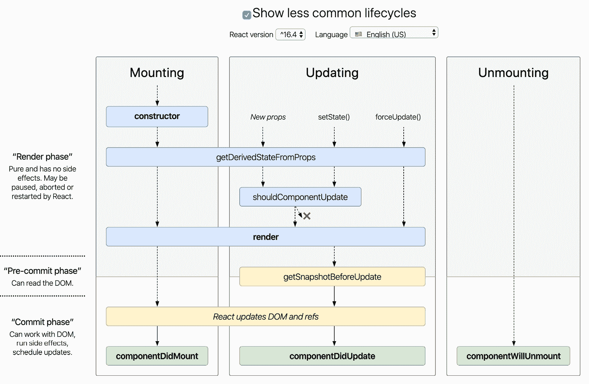
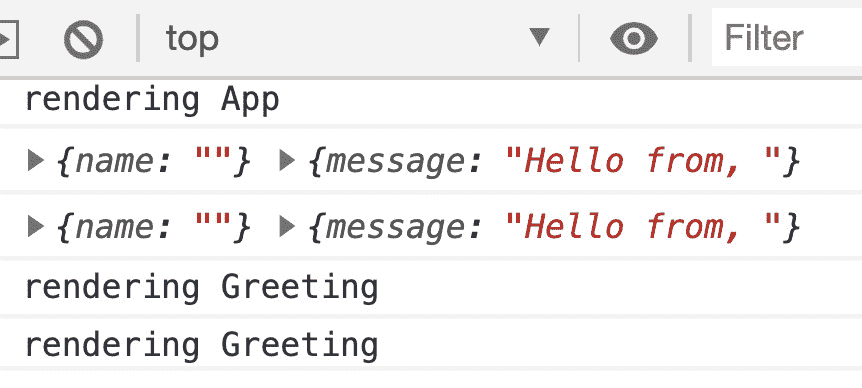
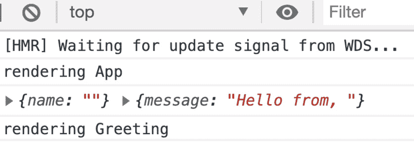
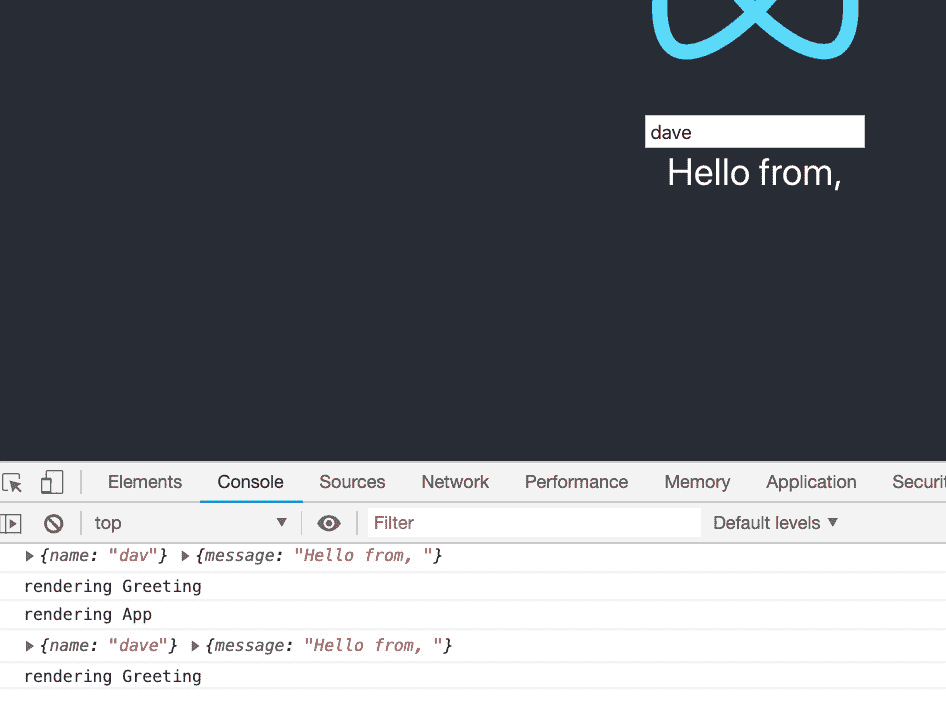
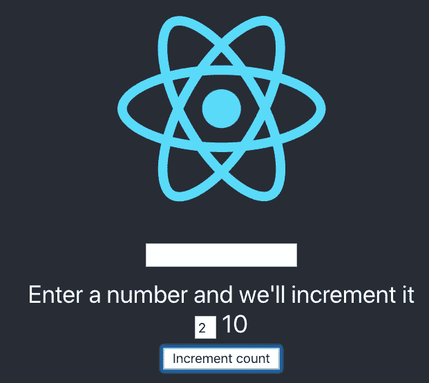
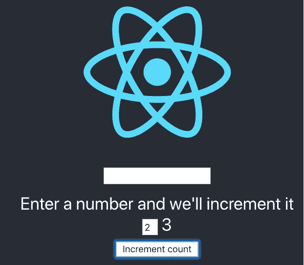

# 第五章：使用 Hooks 进行 React 开发

在本章中，我们将学习使用 React Hooks 进行开发。我们将比较和对比使用旧的基于类的样式和使用 Hooks 进行开发的方式，看看为什么使用 Hooks 进行开发是 React 中更好的开发方式。我们还将学习在使用 Hooks 编码时的最佳实践，以便我们可以拥有最高质量的代码。

在本章中，我们将涵盖以下主要主题：

+   了解类式组件的限制

+   学习 React Hooks 并了解其好处

+   比较和对比类式和 Hooks 式样

# 技术要求

您应该对 Web 开发和 SPA 编码风格有基本的了解。我们将再次使用 Node 和 Visual Studio Code。

GitHub 存储库位于[`github.com/PacktPublishing/Full-Stack-React-TypeScript-and-Node`](https://github.com/PacktPublishing/Full-Stack-React-TypeScript-and-Node)。使用`Chap5`文件夹中的代码。

设置*第五章*的代码文件夹，转到您的`HandsOnTypescript`文件夹并创建一个名为`Chap5`的新文件夹。

# 了解旧类式组件的限制和问题

在本节中，我们将回顾什么是类式组件。我们将看到为什么继承式代码重用和生命周期方法，尽管初衷良好，最终并没有提供良好的代码重用和组件结构能力。尽管我们不会用类组件编写代码，但了解基于类的组件非常重要，因为大多数现有的 React 代码使用类，因为 Hooks 仍然有些新。因此，作为专业开发人员，您将不得不阅读和维护这些代码库，直到它使用 Hooks 为止。

为了了解类式组件的限制，我们首先需要回顾一下它们是什么。一个 React 应用程序由许多称为组件的个体结构组成。在使用基于类的样式时，这些组件是继承自`React.Component`的 JavaScript ES6 类。组件基本上是一个可能包含数据（称为状态）的机器，并且根据这些数据的更改通过一种称为 JSX 的语言发出 HTML。尽管组件可能变得非常复杂，但在基本层面上，这就是它们。

类组件通常有自己的状态，尽管这不是必需的。此外，基于类的组件可以有子组件。子组件只是其他 React 组件，已嵌入到父组件的渲染函数中，因此在渲染父组件时也会被渲染出来。

类组件必须继承自`React.Component`对象。通过这样做，它将获得作为 React 组件的所有功能，包括生命周期函数。这些函数是 React 提供的事件处理程序，允许开发人员在 React 组件的生命周期中特定时间发生的事件中进行挂钩。换句话说，这些函数允许我们作为开发人员在所需的时间注入我们自己的代码和逻辑到 React 组件中。

## 状态

我们在*第四章**中提到了状态，学习单页应用程序概念以及 React 如何实现它们*。在我们学习更多关于 React 组件之前，让我们深入了解一下。React 使用 JSX 将 HTML 呈现到浏览器。然而，触发这些呈现的是组件状态，或者更准确地说，是对组件状态的任何更改。那么，什么是组件状态？在 React 类组件中，有一个名为`state`的字段。这个字段是一个对象，可以包含描述相关组件的任意数量的属性。函数不应用于状态，但您可以将任意数量的函数作为类组件的成员。

正如前面提到的，改变状态会导致 React 系统重新渲染您的组件。状态变化驱动了 React 中的渲染，组件只包含自己的 UI 元素，这是保持关注点分离和清晰编码实践的好方法。基于类的组件中的状态变化是由`setState`函数触发的。这个函数接受一个参数，即您的新状态，React 稍后会异步更新您的状态。这意味着实际的状态更改不会立即发生，而是由 React 系统控制。

除了状态之外，还可以使用 props 共享组件的状态。Props 是已传递给组件的子组件的状态属性。就像当状态改变时，如果 props 改变，子组件也会触发重新渲染。父组件的重新渲染也会触发子组件的重新渲染。请注意，重新渲染并不意味着整个 UI 都会更新。协调过程仍将运行，并且将根据状态的变化和屏幕上已有的内容来确定需要更改什么。

## 生命周期方法

下面的图片很好地概述了基于类的 React 组件中的生命周期调用。正如您所看到的，它非常复杂。此外，图表中还没有提到几个已弃用的函数，比如`componentWillReceiveProps`，它们已经完全被淘汰，因为它们会导致不必要的渲染和无限循环：



图 5.1 – React 类组件生命周期

图片来源：[`projects.wojtekmaj.pl/react-lifecycle-methods-diagram/`](http://projects.wojtekmaj.pl/react-lifecycle-methods-diagram/)

让我们从高层次开始审查这个图表。首先，您可以看到我们有**装载**、**更新**和**卸载**。装载只是组件的实例化和初始化，然后将初始化的组件添加到虚拟 React DOM 中。我们在*第四章**，学习单页应用程序概念以及 React 如何实现它们*中讨论了 React 使用的虚拟 DOM 来在自身和真实浏览器 DOM 之间协调组件。更新指的是重新渲染。当状态改变时，UI 必须更新。卸载是指组件不再使用并且将从 DOM 中移除。

现在我们将介绍生命周期方法。由于有很多方法，让我们列出它们。

### 装载

在装载下，我们有以下方法：

+   构造函数：这不是一个生命周期方法，而是内置的类构造函数。传统上用于初始化状态和绑定任何自定义事件函数。您可能还记得*第三章**，使用 ES6+功能构建更好的应用程序*中提到，`bind`用于切换函数的`this`对象。这是在构造函数中完成的。

+   `getDerivedStateFromProps(props, state)`: 如果您的本地状态基于父级的 props，您将使用此函数。这是一个静态函数。应该谨慎使用，因为它会触发额外的渲染。它也可以在更新中使用。

+   `render`：这也可以在更新时运行进行重新渲染。这个函数触发了 React 的协调过程。它应该只渲染出 JSX，也可以在数组或纯文本中。如果由于状态或 props 决定没有东西需要渲染，应该返回`null`。可能返回布尔值，但除了测试之外，我认为这样做没有太大的价值。

+   `componentDidMount`：这个函数在组件完成挂载（初始化）后触发。你可以在这里放置网络 API 调用。你也可以在这里添加事件处理程序订阅，但你必须记得在`componentWillUnmount`函数中取消订阅，否则会导致内存泄漏。你可以在这里调用`setState`来改变本地状态数据，但这样会触发第二次渲染，所以应该谨慎使用。`SetState`用于更新本地状态。

+   `UNSAFE`已弃用的方法（不要使用）是`UNSAFE_componentWillMount`，`UNSAFE_componentWillReceiveProps`和`UNSAFE_componentWillUpdate`。

### 更新

让我们来看看更新下的方法：

+   `shouldComponentUpdate(nextProps, nextState)`：用于决定是否应该进行重新渲染。它通常会比较先前的 props 和当前的 props。

+   `getSnapshotBeforeUpdate(prevProps, prevState)`：这个函数在 DOM 渲染之前立即运行，这样你就可以在 React 改变它之前捕获 DOM 状态。如果你从这个函数返回了一些东西，它会作为参数传递给`componentDidUpdate`函数。

+   `componentDidUpdate(prevProps, prevState, snapshot)`：这个函数在重新渲染完成后立即运行。你可以在这里对完成的 DOM 进行更改，或者你可以调用`setState`，但你必须有一个条件，以免引起无限循环错误。快照状态来自`getSnapshotBeforeUpdate`函数。

### 卸载

以下方法在这个级别上使用：

+   `componentWillUnmount`：这类似于 C#等语言中的`dispose`函数，可以用于清理工作，例如，移除事件监听器或其他订阅。

处理任何生命周期方法时的主要关注点是防止不必要或不想要的重新渲染。我们必须选择那种不太可能触发不必要重新渲染的方法，或者如果我们需要在特定时间运行代码，我们应该添加 prop 和 state 检查以减少不必要的重新渲染。重要的是要控制渲染，否则用户体验会因为慢和有 bug 的应用而受到影响。

让我们来看一些主要的调用。让我们从`getDerivedStateFromProps`开始。一般来说，最好避免使用这个函数，或者只是少量使用。根据经验，这使得很难弄清楚组件何时会重新渲染。一般来说，它往往会触发不必要的重新渲染，这可能会导致意外行为，而这又很难追踪。

React 团队推荐了一些替代方法，我们应该始终优先考虑这些方法，因为它们几乎总是更容易理解和行为更一致：

+   当需要根据改变的 prop 值触发行为时。例如，获取网络数据或触发其他操作。使用`componentDidUpdate`。只要在引起任何改变状态之前进行检查，就不太可能触发无限循环。例如，你可以使用`prevProps`参数并将其与你的本地状态值进行比较，然后调用`setState`来改变你的状态数据。

+   使用`memoization`技术（请注意，这个想法不一定是 React 的一部分；它只是一种编程技术）。`Memoization`基本上就像缓存，只是不是通过缓存过期来更新缓存，而是通过变量改变来更新缓存。因此，在 React 中，这只是意味着使用一个属性或函数，首先检查 props 值是否与上次不同，只有在不同的情况下才触发状态更新。

React 中有一个内置的组件包装器叫做`React.memo`。它只会在子组件的 props 改变时触发重新渲染，而不会在父组件重新渲染时触发重新渲染。

+   使您的组件完全受控，这意味着它不会有自己的状态，并且在父组件的指导下渲染，每当 props 改变或父组件渲染时。Facebook 还建议使用未受控组件，方法是通过更改它们的 key（key 是组件的唯一标识符），然后触发重新渲染。然而，我不同意这个建议。正如您所记得的，我们在[*第一章*]（B15508_01_Final_JC_ePub.xhtml#_idTextAnchor017）*，理解 TypeScript*中讨论了封装和抽象，这意味着未受控组件的行为对父组件来说应该是未知的。这也意味着它不完全受父组件控制，也不应该受到控制。因此，让未受控组件执行父组件想要的操作可能会诱使在组件内部添加实现更改，这将使其与父组件更紧密地联系在一起。有时这是不可避免的，但如果可以避免，就应该避免。

+   如果您的组件的渲染状态取决于网络数据，您可以使用`componentDidMount`在那里进行网络调用，然后更新状态（假设您只需要在加载时获取此数据）。请注意，`componentDidMount`仅在组件首次加载时运行一次。此外，如果您使用此函数，将会进行一次额外的渲染，但这仍然比可能导致额外不必要的渲染要好。

+   `ComponentDidUpdate`可用于处理由于 prop 更改而需要更改状态的情况。由于此方法在渲染后调用，因此触发任何状态更改之前将 props 与状态进行比较，不太可能导致无限渲染循环。话虽如此，最好尽量避免派生状态，并将状态保留在单个父根组件中，并通过 props 共享该状态。老实说，这是繁琐的工作，因为您需要通过 props 将状态传递给可能有几层深的子组件。这也意味着您需要很好地构建状态模式，以便可以清晰地分离为特定子组件绑定的状态。稍后当我们使用 Hooks 时，您将看到使用 Hooks 比使用单个状态对象更容易。然而，尽可能减少本地组件状态是 React 开发的最佳实践。

让我们创建一个小项目，尝试使用类组件并讨论其特性：

1.  将您的命令行或终端切换到`Chap5`文件夹。

1.  在该文件夹中运行以下命令：

```ts
npx create-react-app class-components -–template typescript
```

1.  现在在您刚创建的`class-components`文件夹中打开 Visual Studio，并在同一文件夹中打开终端或命令行。让我们在`src`文件夹中创建一个名为`Greeting.tsx`的新文件。它应该是这样的：

```ts
import React from "react";
interface GreetingProps {
    tsx. When using TypeScript and creating a React component you must use tsx as your file's extension. Next, when we look at the code we see the import of React, which provides not only the Component to inherit from but also access to JSX syntax. Next, we see two new interfaces: GreetingProps and GreetingState. Again, because we are using TypeScript and want type safety we are creating the expected types for both any props that come into our component and the state that is being used inside of our component. Also take note that the name field in the GreetingProps interface is optional, which means it can also be set to undefined, as we'll use it later. Again, avoid having local state in your non-parent non-root components when possible. I am doing this for example purposes here.
```

1.  当我们创建类时，还需要记得导出它，以便任何将使用它的组件都可以访问它。这是通过`React.Component<GreetingProps>`完成的。这种类型声明不仅表示这个类是一个 React 组件，还表示它接受`GreetingProps`类型的 prop。声明设置后，我们定义构造函数，它接受相同类型的 prop，`GreetingProps`。

重要提示

如果您的组件接受 props，重要的是在构造函数内部进行的第一个调用是对基类构造函数`super(props)`的调用。这确保了 React 知道您传入的 props，因此可以在 props 改变时做出反应（无意冒犯）。在构造函数内部，我们不需要使用`this.props`来引用`props`对象，因为它作为构造函数参数传入。在其他任何地方，都需要使用`this.props`。

1.  接下来，我们看到`state`在`constructor`中被实例化，变量及其类型在下一行被声明为`GreetingState`类型。最后，我们有我们的`render`函数，它声明了最终将被转换为 HTML 的 JSX。请注意，`render`函数具有逻辑`if`/`else`语句，根据`this.props.name`的值显示不同的 UI。`render`函数应该尽量控制正确的 UI，在没有理由渲染任何内容时不要渲染任何内容。这样做可以在一致性的情况下提高性能和内存。如果没有要`render`的内容，只需返回`null`，因为 React 理解这个值表示不要渲染任何内容。

1.  现在我们只需要更新`App.tsx`文件，以便包含我们的`Greeting.tsx`组件。打开`App.tsx`文件并像这样更新它：

```ts
import React from 'react';
import logo from './logo.svg';
import './App.css';
Greeting class. Since our Greeting class is the default export of the Greeting.tsx module file (we don't need to indicate the extension) we need not use {} in between import and from. If the Greeting class was not the default export, for example, if we had many exports in the same module file, then we would need to use this syntax: import { Greeting } from "./Greeting".
```

1.  正如您所看到的，我们使用`Greeting`组件替换了部分已经存在的 JSX。请注意，我们没有将`name`属性传递给`Greeting`。让我们看看当我们运行应用程序时会发生什么。在终端中执行此命令，确保您在`class-components`文件夹中：

```ts
name property to our Greeting component. As we saw, it was possible to leave this property empty because of the ? next to the field's type definition. 
```

1.  现在让我们去我们的`App.tsx`文件，并更新`Greeting`以添加一个`name`值。用以下内容替换`App.tsx`中的`Greeting`组件：

```ts
import React from 'react';
import logo from './logo.svg';
import './App.css';
import Greeting from "./Greeting";
function App() {
  return (
    <div className="App">
      <header className="App-header">
        
        name with a value of my own name. Feel free to enter your name instead and then save the file. Since React includes an auto-updating test server, the browser page should update with your new code automatically. You should see your name like this on the screen:
```


图 5.3 - 更新屏幕

好的，我们已经创建了一个简单的基于类的组件。现在让我们开始使用一些生命周期方法，并看看它们是如何工作的：

1.  更新`Greeting.tsx`以包括`getDerivedStateFromProps`函数：

```ts
import React from "react";
interface GreetingProps {
    name?: string
}
interface GreetingState {
    message: string
}
export default class Greeting extends 
 React.Component<GreetingProps> {
    constructor(props: GreetingProps){
        super(props);
        this.state = {
            message: `Hello from, ${props.name}`
        }
    }
    state: GreetingState;
```

1.  代码几乎相同，除了我们现在将`getDerivedStateFromProps`函数添加到`render`函数的上面：

```ts
    render function we are console logging the fact that the render function was called. 
```

1.  现在让我们暂时保留这段代码，并更新我们的`App.tsx`文件，以便它可以接受一个输入，该输入获取当前用户的名字：

```ts
import React from 'react';
import logo from './logo.svg';
import './App.css';
import Greeting from "./Greeting";
class App extends React.Component {
  constructor(props:any) {
    super(props);
    state object with a field called enteredName. We also create a new function called onChangeName and bind it to the current this class instance, like we learned in *Chapter 3**, Building Better Apps with ES6+ Features*.
```

1.  在`onChangeName`中，我们将`state`属性`enteredName`设置为用户输入的值，使用`setState`函数。在类组件中，您绝对不能在不使用这个函数的情况下修改状态，否则您的状态将与 React 运行时失去同步：

```ts
  render() {
      console.log("rendering App");
      return (
      <div className="App">
        <header className="App-header">
          
          <input value={this.state.enteredName} 
            onChange={this.onChangeName} />
          <Greeting name={this.state.enteredName} />
        </header>
      </div>
    )
  }
}
export default App;
```

1.  接下来，我们添加了一个`console.log`语句，以查看`App.tsx`的`render`函数何时被调用。此外，我们定义了一个新的`input`控件，其值为`this.state.enteredName`，其`onChange`事件与我们的`onChangeName`函数相关联。如果您保存此代码并打开 Chrome 开发工具，您将会看到这个：

图 5.4 - 渲染问候

您可以看到我们的`render`日志消息，以及`Greeting`的`name`属性和`message`状态值。另外，由于我们没有在`input`中输入值，`name`属性为空，因此我们的`Greeting`组件的`name`属性和`message`字符串的末尾也为空。您可能想知道为什么`Greeting`的日志运行两次。这是因为我们正在开发目的下运行在 StrictMode 中。

1.  让我们快速删除它，以免混淆。转到您的`index.tsx`文件，并用以下代码替换：

```ts
import React from 'react';
import ReactDOM from 'react-dom';
import './index.css';
import App from './App';
import * as serviceWorker from './serviceWorker';
ReactDOM.render(
  StrictMode with Fragment. We don't actually need Fragment as it's only used to wrap a set of JSX elements that don't have a parent wrapping element such as div, but it's fine for our testing, and I want to leave a placeholder to put back the StrictMode tags. 
```

1.  如果您保存并查看浏览器调试控制台，您将会看到这个：

图 5.5 - 浏览器调试控制台

所有这些工作的原因是为了显示特定可以触发渲染调用的内容，以及我们如何更加小心谨慎地处理这些内容。

1.  现在让我们在输入框中输入我们的名字，您会看到这个：

图 5.6 - App.tsx 输入

1.  问题是，为什么我的消息以"Hello from, "结尾？如果您查看`Greeting`中的代码，您会发现我们只在构造函数运行期间设置了`message`状态属性一次（这实际上就像使用`componentDidMount`）。因此，由于此事件仅在屏幕首次加载时运行一次，那时`this.props.name`为空，因为我们还没有输入值。那么，我们能做些什么呢？好吧，让我们尝试使用`getDerivedStateFromProps`函数，看看会发生什么：

```ts
export default class Greeting extends React. Component<GreetingProps> {
    constructor(props: GreetingProps){
        super(props);
        this.state = {
            message: Greeting.getNewMessage(props.name)
        }
    }
    state: GreetingState;
```

1.  我只展示`Greeting`类，因为这是我想要为这个示例做出改变的唯一内容。因此，在下面的代码中，看一下更新的`getDerivedStateFromProps`：

```ts
    static getDerivedStateFromProps(props: GreetingProps, 
      state:GreetingState) {
        console.log(props, state);
        if(props.name && props.name !== state.message) {
            const newState = {...state};
            newState.message =
              Greeting.getNewMessage(props.name);
            return newState;
        }
        return state;
    }
    static getNewMessage(name: string = "") {
        return `Hello from, ${name}`;
    }
    render() {
        console.log("rendering Greeting")
        if(!this.props.name) {
            return <div>no name given</div>;
        }
        return <div>
            {this.state.message}
        </div>;
    }
}
```

正如您所看到的，这个函数现在变得更加复杂，我正在对新的属性和我们现有的状态进行比较。然后我们克隆我们的`state`对象。非常重要的是要确保您这样做，以免意外直接编辑您的状态。然后我们使用一个新的静态函数`getNewMessage`来更新`state.message`的值（因为我在多个地方设置了消息）。现在让我们尝试添加我们的名字。如果您这样做，您会发现我们的名字被添加到消息中，但是每输入一个字母，我们都会得到一个`Greeting`和`App`的渲染。现在这还不算太糟糕，因为我们的代码还不多，但是您可以想象，如果我们在`Greeting`组件的本地状态上不断添加新属性，并且我们有一个更复杂的应用程序，事情可能会变得非常困难。

让我们重构一下这段代码，看看我们是否能稍微改进一下：

1.  更新`App.tsx`：

```ts
class App extends React.Component {
  constructor(props:any) {
    super(props);
    this.state = {
      enteredName: "",
      App class since that's all we're changing. As you can see, we add a new property to our state object called message (we'll be removing message from Greeting shortly) and we update it whenever the user enters a new username into the input element:

```

render() {

console.log("rendering App");

return (

<div className="App">

<header className="App-header">


<input value={this.state.enteredName}

onChange={this.onChangeName} />

<Greeting message state property to our Greeting component as a prop.

```ts

```

1.  现在我们将看一下我们的`Greeting`组件，但为了保持清晰，让我们创建一个名为`GreetingFunctional.tsx`的新文件，并将以下代码放入其中：

```ts
import React from "react";
interface GreetingProps {
    message: string
}
export default function Greeting(props: GreetingProps) {
    console.log("rendering Greeting")
    return (<div>
            {props.message}
        </div>);    
}
```

1.  一旦您添加了这个文件，您还需要更新您的`App.tsx`文件中对`Greeting`的导入，以便像这样引用这个文件：

```ts
import Greeting from "./GreetingFunctional";
```

正如您所看到的，`Greeting`已经大大缩短并变得更简单。它现在是一个功能组件，因为最佳实践是将没有本地状态的组件制作成函数而不是类。我们无法减少重新渲染，因为更改消息必然会触发重新渲染，但即使这种缩短和减少代码也值得这种改变。此外，即使我们将一些代码移到`App.tsx`中，您会注意到这段代码也比我们原来的`Greeting`组件中的代码少得多。

这种组件构建风格存在一个问题，即大部分状态都在一个单独的父组件中，子组件通过传递 props 来获取状态，对于复杂的多级组件层次结构，可能需要大量的样板代码来将 props 传递给多个级别的组件。对于这些情况，我们可以使用 React Context 来绕过层次结构，直接将父状态发送给子组件。但是，我不喜欢使用 Context，因为绕过自然的组件层次结构，任意向某个组件注入状态，感觉像是一种反模式（一种不应该使用的设计方法）。这很可能会引起混乱，并使以后重构代码变得更加困难。我稍后会更详细地介绍 Context，见*第七章**，学习 Redux 和 React Router*。

在本节中，我们了解了基于类的 React 组件。由于 Hooks 仍然相对较新，大多数现有的 React 应用程序仍在使用基于类的组件，因此了解这种编码风格仍然很重要。在下一节中，我们将探索基于 Hook 的组件，然后稍后比较这两种风格。

# 学习 React Hooks 并了解它是如何改进类式组件的。

在本节中，我们将学习 React Hooks。我们将看一个示例项目并了解它是如何工作的。由于本书主要是关于 Hooks，至少就 React 而言，它将帮助我们以后编写我们的代码。

让我们讨论一些使用 Hooks 的原因。我们在类组件部分看到，类有生命周期方法，允许您处理组件存活时发生的某些事件。使用 React Hooks，我们没有这些生命周期方法，因为使用 Hooks 时所有组件都是功能组件。在上一节的类组件示例应用程序中创建了一个功能组件`GreetingFunctional`。功能组件是一个 JavaScript 函数并返回 JSX 的组件。这种变化的原因是整个设计试图摆脱**面向对象编程**（**OOP**）继承模型，而是使用组合作为其主要代码重用模型。我们在*第二章**，探索 TypeScript*中介绍了 OOP 继承模型，但组合意味着我们不是从某个父类继承功能，而是简单地组合功能组件，有点像乐高积木，来设计我们的屏幕。

除了这些功能组件，我们还有 Hooks。Hooks 只是提供某些功能给组件的 JavaScript 函数。这些功能包括状态的创建、访问网络数据，以及组件需要的任何其他功能。此外，Hooks 不是特定于组件的，因此任何 Hook 都可以在任何组件中使用——假设它是有用的并且是合理的。如果您回顾一下我们的类组件项目，您会发现没有办法共享生命周期事件方法中的逻辑。我们不能轻松地将其提取出来，然后在其他类组件中重用。这是 React 中创建 Hooks 模型的主要原因之一。因此，这两个部分，功能组件和可重用函数（Hooks），是理解 React Hooks 的关键。

首先，让我们列出我们在代码中将要使用的一些更重要的 Hooks。我们很快会在代码中给出它们的使用示例，但现在，我们将在高层次上讨论它们：

+   `useState`：这个函数是使用 Hooks 进行开发的基础。它替换了类组件中的`state`和`setState`调用。`useState`以一个值作为参数，表示它正在尝试表示的状态属性的初始状态。它还返回一个数组。第一项是实际的状态属性，第二项是一个可以更新该属性的函数。一般来说，它用于更新单个值，而不是具有多个属性的更复杂的对象。这种类型状态的更好的 Hook 可能是`useReducer`，稍后会解释。

+   `useEffect`：这个函数在组件完成绘制到屏幕后触发。它类似于`componentDidMount`和`componentDidUpdate`。但是，它们在绘制到屏幕之前运行。它旨在用于更新状态对象。因此，例如，如果您需要获取网络数据然后更新状态，可以在这里做。您也可以在这里订阅事件，但是您还应该通过返回一个执行取消订阅的函数来取消订阅。

您可以有多个独立的`useEffect`实现，每个负责执行某些独特的操作。这个函数通常在每次完成屏幕绘制后运行。因此，如果任何组件状态或 props 发生变化，它将运行。您可以通过将空数组作为参数传递来强制它只运行一次，就像`componentDidMount`一样。您还可以通过将它们作为数组传递到`useEffect`数组参数中，来强制它仅在特定的 props 或状态更改时运行。

这个函数是异步运行的，但是如果你需要知道屏幕上一些元素的值，比如滚动位置，你可能需要使用`useLayoutEffect`。这个函数是同步运行的，允许你以同步的方式获取屏幕上某些元素的值，然后以同步的方式对它们进行操作。但是，当然，这会阻塞你的 UI，所以你只能做一些非常快速的事情，否则用户体验会受到影响。

+   `useCallback`：这个函数将在一组参数发生变化时创建一个函数实例。这个函数存在是为了节省内存，否则函数的实例将在每次渲染时重新创建。它以处理函数作为第一个参数，然后以一个可能会改变的项目数组作为第二个参数。如果项目没有改变，回调函数就不会得到一个新的实例。因此，这个函数内部使用的任何属性都将是之前的值。当我第一次了解这个函数时，我觉得很难理解，所以我稍后会举个例子。

+   `useMemo`：这个函数旨在保存长时间运行任务的结果。它有点像缓存，但只有在参数数组发生变化时才会运行，所以在这个意义上它类似于`useCallback`。然而，`useMemo`返回的是一些重型计算的结果。

+   `useReducer`：这个函数与`React Redux`类似。它接受两个参数，`reducer`和`initial state`，并返回两个对象：一个由`reducer`更新的`state`对象和一个接收更新后的状态数据（称为`action`）并将其传递给`reducer`的分发器。`reducer`充当过滤机制，并确定如何使用动作数据来更新状态。我们稍后会在代码中展示一个例子。当你想要有一个具有多个可能需要更新的属性的单一复杂状态对象时，这种方法效果很好。

+   `useContext`：这个函数是一种具有全局状态数据的方式，可以在组件之间共享。最好谨慎使用它，因为它可以任意地将状态注入到任何子组件中，而不考虑层次结构。我们将使用`React Redux`而不是`Context`，但知道它的存在是很好的。

+   `useRef`：这可以用来保存当前属性中的任何值。如果它发生变化，这个值不会触发重新渲染，而且这个值的生存期与它所创建的组件的生存期一样长。这是一种保持状态的方式，对渲染没有影响。它的一个用例是保存 DOM 元素。你可能想这样做，因为在某些情况下，有必要退出标准的基于状态的 React 模型，直接访问 HTML 元素。为此，`useRef`用于访问元素的实例。

当然，还有许多其他的 Hooks，既有来自 React 团队的，也有第三方的。但是一旦你熟悉了，你就能看到你可能需要什么，甚至更好的是，能够创建你自己的 Hooks。我们也将为我们的项目创建自己的 Hooks。

让我们来看一些使用 Hooks 的例子。我们将在`Chap5`中创建一个新项目来开始：

1.  将你的命令行或终端切换到`Chap5`文件夹，并在该文件夹中运行以下命令：

```ts
npx create-react-app hooks-components –template typescript
```

1.  在类组件项目的最后一个例子中，我们创建了一个名为`Greeting.tsx`的类组件，它有自己的状态。为了演示目的，让我们将相同的组件创建为 React Hooks 函数组件。在`hooks-components`项目的`src`文件夹中，创建一个名为`Greeting.tsx`的新文件，并添加以下代码：

```ts
import React, { FC, useState, useEffect } from 'react';
interface GreetingProps {
    name?: string
}
const Greeting: FC<GreetingProps> = ({name}:GreetingProps) => {
    const [message, setMessage] = useState("");
    useEffect(() => {
        if(name) {
            setMessage(`Hello from, ${name}`);
        }
    }, [name])
    if(!name) {
        return <div>no name given</div>;
    }
    return <div>
        {message}
    </div>;
}
export default Greeting;
```

这是代码的一个版本，我们将一个名字作为 prop 并拥有我们自己的本地状态。我们应该尽量避免使用本地状态，但我正在做这个来进行演示。正如你所看到的，这比类版本要短得多。此外，我们没有生命周期函数需要重写。我们使用箭头函数是因为它比使用常规函数要短，而且我们不需要函数的特性。正如你所看到的，我们对`Greeting`组件进行了声明。它使用了`FC`，`GreetingProps`接口。状态存储在`message`属性中，使用了`useState`函数，这是一个小的一行语句，没有构造函数，因为这是一个函数而不是一个类。注意`GreetingProps`在参数旁边并不是必要的；我只是为了完整性才包含它。还要注意，我们使用了参数解构，通过传递`{ name }`而不是`props`。

接下来，我们有我们的`useEffect`函数。正如所述，这有点类似于`componentDidMount`或`componentDidUpdate`，但是在绘制到屏幕完成后运行。每当我们的`name`prop 更新时，它将更新`message`状态属性，因为我们将它作为参数传递给`useEffect`函数。由于这不是一个类，我们没有渲染函数。函数的返回值是调用渲染。

1.  现在我们将通过将我们的状态放入`App.tsx`组件中来进行一些重构。让我们像我们在组件的类版本中做的那样，将`GreetingFunctional.tsx`组件做成这样：

```ts
import React from "react";
interface GreetingProps {
    message: string
}
export default function Greeting(props: GreetingProps) {
    console.log("rendering Greeting")
    return (<div>
            {props.message}
        </div>);    
}
```

1.  现在让我们将`App.tsx`重构为一个函数组件，并使用我们在本节学到的`useReducer` Hook。我们将省略导入，因为它们是一样的：

```ts
const reducer = (state: any, action: any) => {
  console.log("enteredNameReducer");
  switch(action.type) {
    case "enteredName":
      if(state.enteredName === action.payload) {
        return state;
      }
      return { ...state, enteredName: action.payload}
    case "message":
      return { ...state, message: `Hello, ${action.       payload}` }
    default:
      throw new Error("Invalid action type " + action.       type);
  }
}
const initialState = {
  enteredName: "",
  message: "",
};
```

我们定义了我们的 reducer 和一个名为`initialState`的初始状态对象。reducer 的默认签名是`any`类型的参数，因为状态和动作对象都可以是任何类型。如果你看一下`reducer`函数，你会注意到它试图通过返回一个新的状态对象和一个适当更新的成员来处理不同类型的动作（再次强调，你绝对不能直接修改原始状态对象。复制它，然后在新对象上进行更新并返回它）。所以，这就是`useReducer`的预期用法。如果你的状态对象很复杂，改变属性的逻辑也很复杂，你会使用`useReducer`函数。你可以把它看作是对状态对象上相关逻辑的一种封装。接下来，你可以在`App`组件中看到对`useReducer`的实际调用：

```ts
function App() {  
    const [{ message, enteredName }, dispatch] = 
      useReducer(reducer, initialState);

    const onChangeName = (e: React.     ChangeEvent<HTMLInputElement>)
      => {
      dispatch ({ type: "enteredName", payload: e.target.       value 
       });
      dispatch ({ type: "message", payload: e.target.       value });
    }

    return (
    <div className="App">
      <header className="App-header">
        
        <input value={enteredName}        onChange={onChangeName} />
        <Greeting message={message} />
      </header>
    </div>
    )
  }
  export default App;
```

正如你所看到的，这个函数返回一个对象和一个`dispatch`函数。对象是 reducer 运行后的整个状态对象，但在我们的情况下，我们进行了解构，所以我们可以直接调用`message`和`enteredName`属性。在这个设置之后，定义了`onChangeName`事件，当触发时，运行`useReducer`的分发器`dispatch`，通过发送适当的动作来触发实际的更改。如果你运行这段代码，你会发现它和以前一样运行。

现在，所有这些的好处是，正如你所看到的，我们可以把我们的`reducer`函数拿来在其他函数组件中重用。我们也可以把我们的分发器传递给子组件，这样子组件也可以触发对我们状态的更新。让我们试一试：

1.  让我们用这段代码更新我们的`GreetingFunctional.tsx`组件：

```ts
import React from "react";
interface GreetingProps {
    enteredName: string;
    message: string;
     greetingDispatcher: React.Dispatch<{ type: string,     payload: string }>;
}
export default function Greeting(props: GreetingProps) {
    console.log("rendering Greeting")
    const onChangeName = (e: React.      ChangeEvent<HTMLInputElement>) => {
        props. greetingDispatcher ({ type: "enteredName", 
          payload: e.target.value });
        props. greetingDispatcher ({ type: "message", 
           payload: e.target.value });
      }
    return (<div>
        <input value={props.enteredName} onChange=
          {onChangeName} />
            <div>
                {props.message}
            </div>
        </div>);    
}
```

正如你所看到的，我们已经将`enteredName`和`greetingDispatcher`作为 props 传递给了我们的`Greeting`组件。然后我们还带入了`input`和`onChangeName`事件，以便在我们的组件中使用它们。

1.  现在，让我们像这样更新我们的`App.tsx`文件：

```ts
function App() {  
const [{ message, enteredName }, dispatch] = useReducer(reducer, initialState);
  return (
  <div className="App">
    <header className="App-header">
      

      <Greeting 
        message={message} 
        enteredName={enteredName} 
        greetingDispatcher={ dispatch } />
    </header>
  </div>
  )
}
```

正如你所看到的，我们已经移除了`onChangeName`和输入，以便我们可以在我们的`GreetingFunctional.tsx`组件中使用它。我们还将`enteredName`、`message`和`dispatch`作为参数传递给`Greeting`组件。如果你运行这个，你会看到触发`reducer`更新的是我们的子`GreetingFunctional.tsx`组件。

1.  接下来，让我们看看`useCallback`函数。像这样更新`App.tsx`：

```ts
function App() {  
const [{ message, enteredName }, dispatch] = useReducer(reducer, initialState);
  const [startCount, setStartCount] = useState(0);
  const [count, setCount] = useState(0);
  const setCountCallback = useCallback(() => {
    const inc = count + 1 > startCount ? count + 1 : 
      Number(count + 1) + startCount;
    setCount(inc);
  }, [count, startCount]);
  const onWelcomeBtnClick = () => {
    setCountCallback();
  }
  const onChangeStartCount = (e: 
   React.ChangeEvent<HTMLInputElement>) => {
    setStartCount(Number(e.target.value));
  }
```

我们正在使用一个输入，该输入将使用`startCount`获取用户的初始数字值。然后，我们将通过单击`setCountCallback`递增该数字。但请注意，`useCallback`是如何将`count`状态作为参数的。这意味着当`count`更改时，`setCountCallback`将重新初始化为当前值。其余的代码返回了所需的 JSX，将生成最终的 HTML：

```ts
  console.log("App.tsx render");
  return (    
  <div className="App">
    <header className="App-header">
      

      <Greeting 
        message={message} 
        enteredName={enteredName} 
        greetingDispatcher={dispatch} />
      <div style={{marginTop: '10px'}}>
        <label>Enter a number and we'll increment           it</label>
        <br/>
        <input value={startCount}          onChange={onChangeStartCount} 
          style={{width: '.75rem'}} />&nbsp;
        <label>{count}</label>
        <br/>
        <button onClick={onWelcomeBtnClick}>Increment           count</button>
      </div>
    </header>
  </div>
  )
}
```

返回提供了这种递增能力的 UI。

如果您运行此代码并单击**增加计数**按钮，您将看到它会增加，如下所示：



图 5.7 – 单击增加计数 8 次

但是，尝试更改传入的数组`[count, startCount]`，并删除`count`变量，使其只说`[startCount]`。现在，它不会继续递增，因为没有依赖于`count`。无论我们点击多少次，它只会计数一次，第一次运行时，无论我们点击多少次：



图 5.8 – 删除 count 后

因此，即使您点击多次，它也将始终递增一次，因为该函数被缓存在内存中，并且始终以`count`的相同初始值运行。

让我们再看一个性能示例。我们将在此示例中使用 memo 包装器以减少重新渲染。这不是一个 Hook，但它是最近添加到 React 中的一个新功能。让我们看看步骤：

1.  创建一个名为`ListCreator.tsx`的新文件，并添加以下代码：

```ts
import React, { FC, useEffect, useRef } from 'react';
export interface ListItem {
    id: number;
}
export interface ListItems {
    listItems?: Array<ListItem>;
}
const ListCreator: FC<ListItems> = ({listItems}:ListItems) => {
    let renderItems = useRef<Array<JSX.Element> |     undefined>();
    useEffect(() => {
        console.log("listItems updated");
        renderItems.current = listItems?.map((item,          index) => {
            return <div key={item.id}>
                {item.id}
            </div>;
        });
    }, [listItems]);
    console.log("ListCreator render");
    return (
        <React.Fragment>
        {renderItems.current}
        </React.Fragment>
    );
}
export default ListCreator;
```

此组件将接受一个项目列表并将其呈现为列表。

1.  现在，让我们更新我们的`App.tsx`文件，以根据递增计数发送新的列表项。再次，我只包含了`App`函数。请注意，还需要一个名为`ListCreator`的新导入：

```ts
function App() {  
const [{ message, enteredName }, dispatch] = useReducer(reducer, initialState);
  const [startCount, setStartCount] = useState(0);
  const [count, setCount] = useState(0);
  const setCountCallback = useCallback(() => {
    const inc = count + 1 > startCount ? count + 1 :      Number(count
      + 1) + startCount;
    setCount(inc);
  }, [count, startCount]);
  listItems and a new useEffect function to populate that list. The list is updated any time count is updated:

```

const onWelcomeBtnClick = () => {

setCountCallback();

}

const onChangeStartCount = (e:

React.ChangeEvent<HTMLInputElement>) => {

setStartCount(Number(e.target.value));

}

console.log("App.tsx render");

return (

<div className="App">

<header className="App-header">


问候

message={message}

enteredName={enteredName}

greetingDispatcher={ dispatch } />

<div style={{marginTop: '10px'}}>

<label>输入一个数字，我们将递增           它</label>

<br/>

<input value={startCount}           onChange={onChangeStartCount}

style={{width: '.75rem'}} />&nbsp;

<label>{count}</label>

<br/>

<button onClick={onWelcomeBtnClick}>增加

count</button>

</div>

<div>

<ListCreator listItems={listItems} />

</div>

</header>

</div>

)

}

```ts

If you run this example, you will see that not only do we get new list item elements when we increment the number, but we also get them when we type our name. This is because whenever the parent component renders, as its state was updated, so do any children.
```

1.  让我们对`ListCreator`进行一些小的更新，以减少我们的渲染：

```ts
const ListCreator: FC<ListItems> = 
  React.memo(({listItems}:ListItems) => {
    let renderItems = useRef<Array<JSX.Element> |     undefined>();
    useEffect(() => {
        console.log("listItems updated");
        renderItems.current = listItems?.map((item,           index) => {
            return <div key={item.id}>
                {item.id}
            </div>;
        });
    }, [listItems]);
    console.log("ListCreator render");
    return (
        <React.Fragment>
        {renderItems.current}
        </React.Fragment>
    );
});
```

我只展示了`ListCreator`组件，但是您可以看到我们添加了一个名为`React.memo`的包装器。此包装器仅在传入的 props 发生更改时才允许组件更新。因此，我们获得了一些小的性能优势。如果这是一个具有大量元素的复杂对象，它可能会产生很大的差异。

正如您在这些示例中所看到的，对于任何给定的 Hook，我们可以在不同的组件中重用相同的 Hook，并使用不同的参数。这是 Hooks 的关键要点。代码重用现在变得更加容易。

请注意，`useState`和`useReducer`只是可重用的函数，允许您在多个组件中使用函数。因此，在组件 A 中使用`useState`，然后在组件 B 中使用`useState`将不允许您在两个组件之间共享状态，即使状态名称相同也是如此。你只是重用功能，仅此而已。

在本节中，我们学习了 React Hooks。我们回顾了库中一些主要的 Hooks 以及如何使用其中一些。我们将在以后的章节中涵盖更多的 Hooks，并开始构建我们的应用程序。这些 Hooks 的覆盖将帮助我们以后开始构建我们的组件。

# 比较和对比类方式与 Hooks 方式

在本节中，我们将讨论在 React 中以类方式和 Hooks 方式编写代码之间的一些差异。我们将看到为什么 React 团队决定使用 Hooks 是前进的方式。了解这些细节将使我们对在自己的代码中使用 Hooks 更有信心。

## 代码重用

如果你看一下基于类的生命周期方法，不仅有许多需要记住和理解的方法，而且你还可以看到对于每个类组件，你将有一个几乎独特的生命周期函数实现。这使得使用类进行代码重用变得困难。使用 Hooks，我们还有许多不同的内置 Hooks 可以使用和需要了解。然而，它们不是组件特定的，可以随意重用于不同的组件。这是使用 Hooks 的关键动机。代码重用变得更容易，因为 Hooks 不与任何特定的类绑定。每个 Hook 都专注于提供特定的功能或功能，无论它在哪里使用。此外，如果我们努力构建自己的 Hooks，我们也可以在适当的时候重用它们。

在类组件项目中查看`Greeting`。我们如何在这个组件中重用代码？即使我们可以做到这一点，它也没有真正的价值或好处。除此之外，`getDerivedStateFromProps`增加了可能触发重新渲染的复杂性。而且我们根本没有使用任何其他生命周期方法。

Hook 组件和 React 总体上优先考虑组件化而不是继承。事实上，React 团队表示，最佳实践是使用组件在其他组件中共享代码，而不是继承。

因此，要重申一下，生命周期组件通常与特定组件绑定，但是通过一些工作，Hooks 可以跨组件使用并适当地泛化它们。

## 简单性

你还记得一旦我们在其中添加了`getDerivedStateFromProps`调用，`Greeting`变得多么庞大吗？此外，我们总是需要一个构造函数来实例化我们的状态，并为所有组件使用`bind`。由于我们的组件很简单，这并不重要。但是对于生产代码，你会看到许多函数的组件都需要进行`bind`调用。

在 hooks-component 项目中，`Greeting`要简单得多。即使该组件增长，调用的 Hooks 大部分都会重复，这还会使代码更易于阅读。

# 总结

本章涵盖了大量的信息。我们了解了基于类的组件以及使它们难以使用的原因。我们还了解了基于 Hook 的组件，它们更简单，更容易重用。

我们现在了解了 React 编程的基础知识。我们现在可以创建自己的 React 组件并开始构建我们的应用程序！

在下一章中，我们将学习关于 React 周围的工具。我们将结合我们在这里获得的知识和工具信息，这将帮助我们编写干净、响应迅速的代码。
