# 第六章：使用 create-react-app 设置我们的项目，并使用 Jest 进行测试

在本章中，我们将学习帮助我们构建 React 应用程序的工具。无论语言或框架如何，高级的专业应用程序开发总是涉及使用工具来帮助更快地构建应用程序并提高代码质量。React 开发生态系统也不例外。一个社区已经围绕着某些工具和编码方法形成，并且我们将在本章中介绍这些。这些复杂的工具和方法将帮助我们编写更好的应用程序，并帮助我们重构我们的代码以使其适应新的需求。

在本章中，我们将涵盖以下主要主题：

+   学习 React 开发方法和构建系统

+   了解 React 的客户端测试

+   学习 React 开发的常见工具和实践

# 技术要求

您应该对 Web 开发和我们在之前章节中学习的 SPA 编码风格有基本的了解。我们将再次使用 Node（npm）和 VS Code。

GitHub 存储库位于[`github.com/PacktPublishing/Full-Stack-React-TypeScript-and-Node`](https://github.com/PacktPublishing/Full-Stack-React-TypeScript-and-Node)。使用`Chap6`文件夹中的代码。

要在您自己的机器上设置*第六章*代码文件夹，请转到您的`HandsOnTypescript`文件夹并创建一个名为`Chap6`的新文件夹。

# 学习 React 开发方法和构建系统

在本节中，我们将学习用于编码和构建 React 应用程序的工具和实践。这些方法中的许多方法通常用于现代 JavaScript 开发，甚至在竞争框架如 Angular 和 Vue 中也是如此。

为了构建大型、复杂的应用程序，我们需要工具 - 大量的工具。其中一些工具将帮助我们编写更高质量的代码，一些将帮助我们共享和管理我们的代码，还有一些将存在只是为了增强开发人员的生产力，并使调试和测试我们的代码变得更容易。因此，通过学习用于构建现代 React 应用程序的工具，我们将确保我们的应用程序能够以最少的问题正常工作。

## 项目工具

正如我们从之前的章节中看到的，现代 React 开发使用许多组件来构建最终的应用程序。对于项目结构和基本依赖项，大多数开发人员将使用`create-react-app`，这是基于最初为 Node 开发（npm）创建的开发工具。我们已经看到了`create-react-app`可以做什么，但在本节中，我们将深入了解一下。

但首先，我们需要了解我们是如何使用当前的工具和编码方式的。这些知识将帮助我们更好地理解为什么要转向当前的风格以及好处是什么。

### 以前是如何完成的

网络实际上是由不同的技术拼凑而成的。HTML 首先出现，用于创建文本共享功能。然后是 CSS，用于更好的样式和文档结构。最后是 JavaScript，用于添加一些事件驱动的功能和编程控制。因此，难怪有时将这些技术整合到一个统一的应用程序中会感到尴尬甚至困难。让我们看一些例子，将这些部分整合在一起而不使用太多的工具：

1.  打开您的终端或命令行到`Chap6`文件夹。创建一个名为`OldStyleWebApp`的新文件夹。

1.  使用 VS Code 创建一个名为`index.html`的 HTML 文件，并将以下代码添加到其中。我们将创建一个简单的输入和显示：

```ts
<html lang="en">
<head>
  <meta charset="utf-8">
  <title>Learn React</title>
  <link rel="stylesheet" href="core.css">
</head>
<body>	
<label>Enter your name</label>
<input id="userName" />
<p id="welcomeMsg"></p>
  	<script src="img/script.js"></script>
</body>
</html>
```

1.  在同一文件夹中创建一个名为`core.css`的`.css`文件。

1.  在同一文件夹中创建一个名为`script.js`的`.js`文件。

现在，我们稍后会填写 CSS 和 JS 文件，但是立即我们遇到了一个问题。我怎么运行这个应用程序？换句话说，我怎么看到它运行，以便我可以检查它是否工作？让我们看看我们能做什么：

1.  在您的 VS Code 中，右键单击`index.html`文件并复制其路径，如下所示：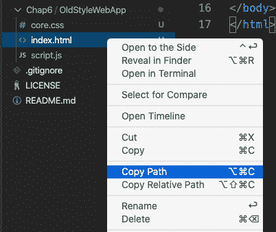

图 6.1 – 复制 index.html

1.  现在，打开您的浏览器，并将此文件路径粘贴到 URL 中。您应该会看到以下内容：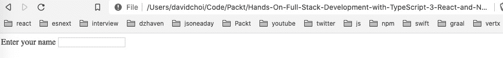

图 6.2 – 浏览器中的 index.html

您可能还不知道，但您不需要 HTTP 服务器才能在浏览器中查看 HTML 文件。但是，您可以看到这个过程并不是最有效的，如果能自动化，包括在我对任何相关文件进行更改时自动刷新，那将更好。

1.  现在，让我们填写我们的 CSS 文件：

```ts
label {
    color: blue;
}
p {
    font-size: 2rem;
}
```

您会注意到，即使我保存了这个文件，Web 浏览器上的`label`元素也不会自动更新。我必须刷新浏览器，然后它才会更新。如果我在开发会话期间更新了数十个文件怎么办？每次都手动刷新将不是一个好的体验。

1.  接下来，让我们在`script.js`中添加一些代码：

```ts
const inputEl = document.querySelector("#userName");
console.log("input", doesnotexist);
```

我们要仔细阅读这段代码，因为它存在多个问题。让我们看看这些问题是什么。如果我们保存这个文件，打开浏览器调试工具，然后刷新浏览器，您会看到在`create-react-app`项目工具中立即出现了这个错误。`create-react-app`项目具有所谓的 linter。linter 是一个代码检查工具，它在您编写代码时在后台运行。它将检查常见错误，比如我们刚刚看到的错误，以便它们不会出现在您的生产代码中。linter 还有更多功能，但我们将在以后更深入地探讨它们。关键在于我们希望在运行应用程序之前避免这些类型的错误。而`create-react-app`，或者在这种情况下一些内置的工具，可以帮助我们做到这一点。

1.  让我们尝试添加正确的变量名，并再次重新加载浏览器。像这样更新`script.js`文件，保存它，然后重新加载浏览器：

```ts
const inputEl = document.querySelector("#userName");
console.log("input", inputEl);
```

正如您在调试器控制台中所看到的，日志语句找不到`inputEl`，因为它返回`null`。这是因为我们将`input`元素的`id`误写为`"userNam"`而不是`"userName"`。现在，再次运行`create-react-app`项目时，这种错误根本不可能发生，因为绝大多数 React 代码不会尝试查询或查找我们 HTML 页面中的元素。相反，我们直接使用 React 组件，因此我们可以完全避免这类错误。诚然，可以选择退出此行为并通过`useRef`使用对 HTML 元素的引用。然而，这应该是一种谨慎的做法，因为通过使用此 Hook 故意退出正常的 React 生态系统行为，从而失去其好处。

1.  让我们修复我们的`script.js`文件并完成它。像这样更新它：

```ts
const inputEl = document.querySelector("#userName");
console.log("input", inputEl);
const parEl = document.querySelector("#welcomeMsg");
inputEl.addEventListener("change", (e) => {
    parEl.innerHTML = "Welcome " + e.target.value;
});
```

如果您通过刷新浏览器来运行此代码，您会看到如果您在输入框中输入您的姓名，然后点击输入元素外部，将显示如下消息：

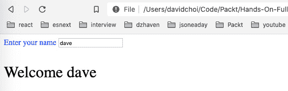

图 6.4 – 欢迎显示

所以，这段代码确实可以显示欢迎消息。然而，很容易出错，而且没有任何帮助指示原因。除此之外，请注意，由于浏览器不运行 TypeScript，我们没有 TypeScript。这意味着我们也缺少了类型指示器，这些指示器在避免与不正确类型相关的错误方面也很有帮助。

所以，我们已经看到了在原始的 web 方式下做事情的一些问题。但事实上，我们甚至还没有触及以这种方式进行开发的问题的表面。例如，在我们的 HTML 中嵌入脚本标签是一个合理的做法，当我们只有少量脚本要处理时。但是当我们的依赖增长时呢？对于更大的应用程序，很可能会有数百个依赖项。管理那么多脚本标签将会非常困难。而且不仅如此 - 很多 JavaScript 依赖项不再提供可以调用的 URL。

说了这么多，也许最大的问题之一是代码的高度自由形式。如果你再看一下`script.js`文件，你会发现代码没有模式或结构。当然，你的团队可能会自己想出一种模式，但是新加入团队的程序员呢？他们将不得不学习一种特定于你的团队的代码结构方式。

因此，工具、框架和结构提供了一致、可重复的编写和维护代码的方式。你可以把它看作是一种编程文化，每个人都接受了文化的规范和实践，因此知道该做什么和如何行事。这使得代码更容易编写、共享和重构。现在我们已经看过了自由形式的编码，让我们开始更深入地了解`create-react-app`。

### create-react-app

在之前的章节中，比如[*第四章*]（B15508_04_Final_JC_ePub.xhtml#_idTextAnchor072），*学习单页应用程序概念以及 React 如何实现它们*，以及[*第五章*]（B15508_05_Final_JC_ePub.xhtml#_idTextAnchor081），*使用 Hooks 进行 React 开发*，我们使用`create-react-app`来设置我们的基础应用程序项目。让我们更仔细地看一下`create-react-app`项目的内部。为了更好地理解组成`create-react-app`项目的部分，我们首先需要`弹出`它。在这里，弹出只是意味着我们将揭示所有使`create-react-app`工作的内部依赖项和脚本，因为通常这些是隐藏的。

警告：弹出是一个不可逆转的操作

在绝大多数情况下，你不会弹出`create-react-app`项目，因为这样做没有多大价值。我们在这里这样做只是为了更深入地了解这个项目是如何工作的。

让我们看一下步骤：

1.  通过在`Chap6`文件夹内执行以下命令来在其中创建一个新项目：

```ts
Chap6 called ejected-app.
```

1.  现在让我们弹出项目。在命令行中切换到新的`ejected-app`文件夹，并运行以下命令：

```ts
npm run eject
```

然后在提示符处输入`y`继续。

让我们从 VS Code 资源管理器菜单的顶部看一下这个项目：

+   `config`

这个文件夹包含了大部分配置文件和脚本，项目用来设置自身。需要注意的主要是，React 团队默认使用**Jest**进行测试和**Webpack**进行 JavaScript 文件的捆绑和最小化。我们将在*了解 React 的客户端测试*部分讨论 Jest，而 Webpack 将在本节后面讨论。

+   `node_modules`

正如你所知，这个文件夹包含了我们项目的依赖项。正如你所看到的，即使在我们添加自己的依赖项之前，默认的依赖项集合就已经非常庞大了。试图使用 HTML 脚本标签列出这些依赖项将会非常困难。而且在大多数情况下，这些依赖项不支持脚本标签引用。

+   `public`

这个文件夹包含用于生成我们的单页应用程序的静态资产。这包括我们的一个名为`index.html`的 HTML 文件，如果我们正在构建 PWA 应用程序，则需要的`manifest.json`文件。还可以添加其他文件，比如用于部署的图像文件。

+   `scripts`

`scripts` 文件夹包含用于管理项目的脚本，例如，构建、启动或启动应用程序测试的脚本。实际的测试文件不应该添加在这里。我们将在稍后的 *理解 React 客户端测试* 部分介绍测试。

+   `src` 

这当然是包含我们项目源文件的文件夹。

+   `.gitignore`

`.gitignore` 是一个文件，告诉 Git 源代码仓库系统不要跟踪哪些文件和文件夹。我们将在本节后面更深入地了解 Git。

+   `package.json` 

如前几章所述，npm 是最初为 Node 服务器框架创建的依赖管理系统。这个依赖管理器的功能和流行度最终使它成为客户端开发的标准。因此，React 团队使用 npm 作为项目创建和依赖管理的基础系统。

除了列出项目的依赖关系，它还可以列出可以运行以管理项目的脚本。

它还具有配置 Jest、ESLint 和 Babel 等功能。

+   `Package-lock.json`

这是一个相关文件，它有助于维护一组正确的依赖关系和子依赖关系，而不管它们安装的顺序如何。我们不需要直接处理这个文件，但知道这有助于防止不同开发人员在不同时间使用不同的现有依赖关系更新他们的 `npm_modules` 文件夹时出现问题是很有用的知识。

+   `tsconfig.json`

我们已经在 *第二章* 中回顾过这个文件，*探索 TypeScript*，并且如该章节中提到的，它包含了 TypeScript 编译器的设置。请注意，一般来说，React 团队更喜欢更严格的编译设置。还要注意目标 JavaScript 版本是 ES5。这是因为一些浏览器尚不兼容 ES6。

`create-react-app` 还包含两个非常重要的工具，它们使一些功能得以实现：Webpack 和 ESLint。Webpack 是一个捆绑和最小化工具，它自动完成了收集项目中所有文件的任务，移除任何多余的、未使用的部分，并将它们合并成几个文件。通过移除多余的部分，比如空格和未使用的文件或脚本，它可以大大减小用户浏览器需要下载的文件大小。当然，这会增强用户体验。除了这个核心功能，它还提供了一个“热重载”开发服务器，可以让某些脚本更改自动显示在浏览器中，而无需刷新页面（尽管大多数更改似乎会触发浏览器刷新，但至少这些是自动的）。

ESLint 也是一个重要的工具。由于 JavaScript 是一种脚本语言而不是编译语言，它没有编译器来检查语法和代码的有效性（显然，TypeScript 有，但 TypeScript 编译器主要关注类型问题）。因此，ESLint 提供了开发时代码检查，以确保它是有效的 JavaScript 语法。此外，它还允许创建自定义代码格式规则。这些规则通常用于确保团队中的每个人都使用相同的编码风格；例如，变量命名约定和括号缩进。一旦规则设置好，ESLint 服务将通过警告消息强制执行这些规则。

这些规则不仅适用于 JavaScript，还可以是关于如何为 React 等框架编写代码的规则。例如，在 `create-react-app` 项目中，ESLint 设置为 `react-app`，如 `package.json` 中所示，这是一组特定于 React 开发的编码规则。因此，我们将看到的许多消息并不一定是 JavaScript 错误，而是关于编写 React 应用程序的最佳实践的规则。

Webpack 虽然功能强大，但设置起来也非常困难。为 ESLint 创建自定义规则可能需要很长时间。所幸使用`create-react-app`的另一个好处是它为这两个工具提供了良好的默认配置。

## 转译

我们在*第一章*中介绍了转译，*理解 TypeScript*。然而，在这一章中，我们应该更深入地介绍它，因为`create-react-app`在很大程度上依赖于转译来生成其代码。`create-react-app`允许我们使用 TypeScript 或 Babel，以便我们可以用一种语言或语言版本开发代码，并将代码作为不同的语言或语言版本发出。下面是一个简单的图表，显示了在 TypeScript 转译过程中代码的流动。

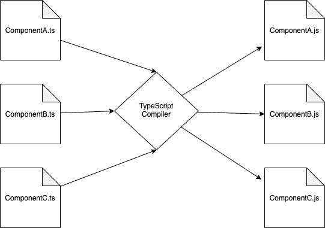

图 6.5-从 TypeScript 到 JavaScript 的转译

TypeScript 编译器将搜索您的项目，并找到根代码文件夹（通常为`src`）中的所有`ts`或`tsx`文件。如果有错误，它会停止并通知我们，否则，它将解析并将 TypeScript 转换为纯 JavaScript 作为`js`文件，并在系统上运行。请注意，在图表中，我们还更改了 JavaScript 版本。因此，转译很像编译。代码被检查有效性和某些类别的错误，但不是转换为可以直接运行的字节码，而是转换为不同的语言或语言版本。Babel 也能够发出 JavaScript 并处理 TypeScript 开发人员的代码。但是，我更喜欢使用原始的 TypeScript 编译器，因为它是由设计 TypeScript 的同一个团队制作的，通常更加更新。

选择转译作为编译方法有多个重要的好处。首先，开发人员不需要担心他们的代码是否能在浏览器上运行，或者用户是否需要在机器上升级或安装一堆依赖。TypeScript 编译器发出 Web 标准 ECMAScript（ES3、ES5、ES6 等），因此代码可以在任何现代浏览器上运行。

转译还允许开发人员在最终发布之前利用 JavaScript 的新版本。由于 JavaScript 几乎每年都会更新一次，这个功能在利用新的语言特性或性能能力方面非常有用；例如，当考虑 JavaScript 的新功能时。ECMA 基金会，维护 JavaScript 语言的标准机构，在将更改纳入 JavaScript 的官方版本之前会经历几个阶段。但是 TypeScript 和 Babel 团队有时会在这些较早阶段之一接受新的 JavaScript 功能。这就是许多 JavaScript 开发人员在它成为官方标准之前就能在他们的代码中使用 async-await 的方式。

## 代码存储库

代码存储库是一个允许多个开发人员共享源代码的系统。代码可以被更新、复制和合并。对于大型团队来说，这个工具对于构建复杂的应用程序是绝对必要的。最流行的现代源代码控制和存储库是 Git。而最流行的在线存储库主机是 GitHub。

尽管彻底学习 Git 超出了本书的范围，但了解一些基本概念和命令是很重要的，因为在与其他开发人员互动和维护自己的项目时，您将需要它们。

任何代码存储库的更重要的概念之一是分支。这意味着能够指示项目的多个版本。例如，这些分支可以用于项目的版本号，如 1.0.0、1.0.1 等。也可以用于创建应用程序的不同版本，其中可能正在尝试一些实验性或高风险的代码。将这样的代码放入主分支不是一个好主意。这是 React GitHub 页面及其许多版本的一个例子：


图 6.6 – React GitHub

如您所见，有许多分支。当前稳定的分支，虽然在此截图中看不到，通常称为主分支。

再次，要全面了解 Git 需要一本专门的书，所以在这里我只会介绍一些您每天会使用的主要命令：

+   `git`：此命令是 Git `git`命令，您正在使用存储库的本地副本；直到将更改推送到服务器之前，您不会直接在在线存储库上工作或影响您的队友的存储库。

+   `克隆`：此命令允许您将存储库复制到本地计算机上。请注意，当您克隆时，通常会默认为主分支。这是一个例子：

```ts
git clone https://github.com/facebook/react.git
```

+   `检出`：此子命令允许您将工作分支更改为不同的所需分支。因此，如果您想要在主分支之外的另一个分支中工作，您将使用此命令。这是一个例子：

```ts
git checkout <branch-name>
```

+   `添加`：此子命令将您最近更改的文件添加为需要跟踪的文件，这表示您稍后将它们提交到存储库中。您可以使用`add`后的`.`一次性处理所有更改的文件，或者明确指定文件：

```ts
git add <file name>
```

+   `提交`：此子命令表示您最终将使用您刚刚在本地添加的文件更新您的工作分支。如果添加`-m`参数，您可以内联添加标签来描述您的提交。此命令有助于团队成员跟踪每个提交中所做的更改：

```ts
git commit -m "My change to xyz"
```

+   `推送`：此子命令将本地提交的文件实际移动到远程存储库中：

```ts
git push origin <branch name>
```

在本节中，我们介绍了一些适用于 React 开发人员的核心项目工具。`create-react-app`、ESLint、Webpack 和 npm 提供了宝贵的功能，使开发更高效，减少错误。我们还介绍了转译，以了解如何利用新的语言版本，而不影响最终用户设备的兼容性。

另外，我们快速看了一下 Git。目前，它是最受欢迎的代码共享存储库。作为专业开发人员，您肯定会在项目中使用它。

现在我们已经掌握了一些重要的核心工具知识，我们将在下一节中继续讨论测试。现代开发实践大量使用测试和测试框架。幸运的是，JavaScript 有很好的测试框架，可以帮助我们编写高质量的测试。

# 理解 React 的客户端测试

单元测试是开发的一个非常重要的部分。如今，没有任何大型项目会在没有一定级别的单元测试的情况下编写。测试的目的是确保您的代码始终正常工作并执行预期的操作。当代码被修改时，即重构时，这一点尤为重要。事实上，更改现有复杂代码可能比创建全新代码更困难。单元测试可以防止在重构过程中破坏现有代码。但是，如果代码出现故障，它也可以帮助准确定位代码不再起作用的确切位置，以便快速修复。

在 React 中，以前有两个常用的主要测试库：`create-react-app`。因此，在本书中，我们将学习 Jest 和 testing-library。

所有单元测试都以相同的方式工作。这不仅适用于 React 和 JavaScript 测试，而且适用于任何语言的测试都以相同的方式工作。那么，什么是单元测试？单元测试尝试测试代码的一个特定部分，并试图断言关于它的某些内容是真实的。基本上就是这样。换句话说，这意味着测试是在检查某些预期的东西是否确实如此。如果不是，那么测试应该失败。尽管这个目标很简单，但创建高质量的测试并不简单。因此，我们将在这里介绍一些例子，但请记住，大型应用程序的测试可能会比实际创建应用程序的代码更复杂。因此，您需要一些时间才能熟练地编写测试。

为了更清晰，让我们看一个简单的测试。请执行以下操作：

1.  打开 VS Code 并在路径`ejected-app/src/App.test.tsx`中打开文件。这是对`App`组件的测试。我们将在接下来的内容中讨论测试的内容。

1.  打开您的终端到`ejected-app`并运行以下命令：

```ts
test. Additionally, this test script is actually running our tests in a:
```

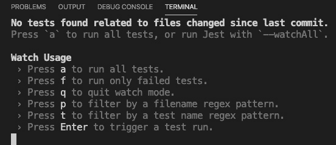

图 6.7 – 测试运行选项

如果您的测试已经运行或者您选择了`a`，您应该会看到以下结果：

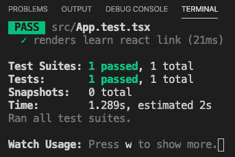

图 6.8 – 测试成功完成

正如您所看到的，我们的测试已经被自动发现并运行（尽管目前我们只有一个）。在这次运行中，一个测试成功，这意味着预期的事情发生了。如果有任何失败，同样的 UI 将指示有多少测试失败和多少成功。

现在，让我们看一下`App.test.tsx`中的测试：

```ts
import React from 'react';
import { render } from '@testing-library/react';
import App from './App';
test('renders learn react link', () => {
  const { getByText } = render(<App />);
  const linkElement = getByText(/learn react/i);
  expect(linkElement).toBeInTheDocument();
});
```

首先，您会注意到文件名中包含文本`test`。这告诉 Jest 这是一个测试文件。一些团队喜欢将所有测试放在一个文件夹中。一些团队更喜欢将测试放在被测试的实际文件旁边，就像这种情况。没有标准答案。做最适合您和您的团队的事情。在本书中，我们将把我们的测试放在被测试的文件旁边。让我们来看看我们`test`文件的内容：

1.  请注意，在导入中，我们引用了`@testing-library/react`。如前所述，这个库将为我们提供一些额外的工具，以使组件输出的测试更容易。

1.  现在，注意`test`函数。这个函数充当我们单个测试的封装包装器。这意味着与这个测试相关的所有内容都存在于这个函数内部，不能从外部访问。这确保了我们的测试不会受到其他测试的影响。

1.  这个函数的第一个参数是一个描述。描述是完全任意的，您的团队将有自己的标准，描述应该如何编写。我们唯一需要关注的是让描述简洁明了，清楚地说明正在测试的内容。

1.  第二个参数是运行实际测试的函数。在这种情况下，测试检查特定文本是否出现在我们的`App`组件的生成的 HTML 中。让我们逐行查看代码。

1.  在*第 6 行*，我们运行`render`，将`App`组件传递给它。这个`render`函数执行我们的组件，并返回一些属性和函数，允许我们测试生成的 HTML。在这种情况下，我们决定只接收`getByText`函数，这意味着返回一个包含特定文本的元素。

1.  在*第 7 行*，我们通过使用参数`/learn react/i`调用`getByText`来获取我们的 HTML DOM 元素，这是用于运行正则表达式的语法，但在这种情况下，它是针对文本的硬编码。

1.  最后，在*第 8 行*，进行了一个称为`expect`的断言，它期望名为`linkElement`的元素对象使用`toBeInTheDocument`函数在 DOM 中。因此，理解测试的一种简单方法是将它们的断言读作一个句子。例如，我们可以这样读取这个断言，"我期望 linkElement 在文档中"（当然，文档是浏览器 DOM）。通过这种方式阅读，很清楚意图是什么。

1.  现在，让我们看看如果我们稍微改变代码会发生什么。使用以下内容更新`App.tsx`（出于简洁起见，我只显示`App`函数）：

```ts
function App() {
  return (
    <div className="App">
      <header className="App-header">
        
        <p>
          Edit <code>src/App.tsx</code> and save to             reload.
        </p>
        <a
          className="App-link"
          href="https://reactjs.org"
          target="_blank"
          rel="noopener noreferrer"
        >
          React in Learn React.
```

1.  保存此文件后，您应该立即看到如下错误：

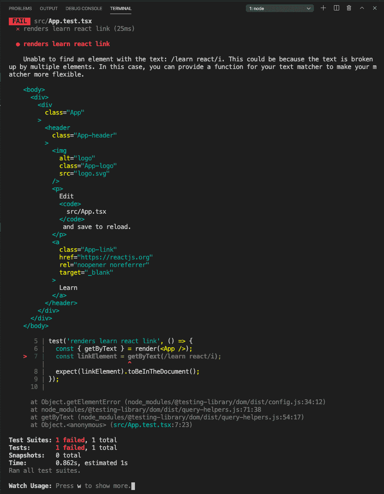

图 6.9-更改 App.tsx 后的错误

同样，测试运行程序正在观察模式下运行，因此只要保存更改，您就应该看到测试结果。正如您所看到的，我们的测试失败，因为未找到文本`learn react`，因此断言`expect(linkElement).toBeInTheDocument()`不成立。

好的，所以我们已经看了一下`create-react-app`提供的内置测试。现在让我们创建一个新组件，这样我们就可以从头开始编写我们自己的测试。请按照以下步骤操作：

1.  让我们保持测试处于观察模式运行，即使它显示错误，并通过单击 VS Code 终端窗口右上角的加号按钮创建一个新的终端窗口。该按钮如下所示：

图 6.10：新终端的加号标志

1.  现在，在`src`文件夹中创建一个名为`DisplayText.tsx`的新文件，并添加以下代码：

```ts
import React, { useState } from "react";
const DisplayText = () => {
    const [txt, setTxt] = useState("");
    const [msg, setMsg] = useState("");
    const onChangeTxt = (e: React.      ChangeEvent<HTMLInputElement>)
     => {
        setTxt(e.target.value);
    }
    const onClickShowMsg = (e: React.      MouseEvent<HTMLButtonElement, MouseEvent>) => {
        e.preventDefault();
        setMsg(`Welcome to React testing, ${txt}`);
    }
```

这个组件将在有人输入他们的名字并点击`DisplayText`后简单地显示一个新消息。

1.  然后，我们创建一些组件工作所必需的状态和事件处理程序，以处理新文本和消息的显示（我们已经介绍了如何在*第五章*中使用 Hooks 创建 React 组件）：

```ts
    return (
        <form>
            <div>
                <label>Enter your name</label>
            </div>
            <div>
                <input data-testid="user-input" 
                  value={txt} onChange={onChangeTxt} />
            </div>
            <div>
                <button data-testid="input-submit" 
                 onClick={onClickShowMsg}>Show                     Message</button>
            </div>
            <div>
                <label data-testid="final-msg" 
                   >{msg}</label>
            </div>
        </form>
    )
}
export default DisplayText;
```

1.  最后，我们返回我们的 UI，其中包括一个输入和一个提交按钮。请注意`data-testid`属性，以便稍后可以轻松地通过我们的测试找到元素。如果您运行此代码并输入您的姓名并单击按钮，您应该会看到类似于这样的东西：

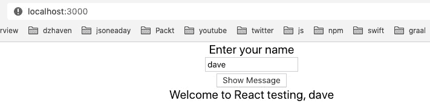

图 6.11-用于测试的新组件

正如您所看到的，我们的显示只是返回输入的文本和欢迎消息。然而，即使这个简单的例子也有几个不同的测试内容。首先，我们希望确保输入框中输入了文本，并且是单词而不是数字或符号。我们还希望确保当我们单击按钮时，消息被显示，并且以字符串`"Welcome to React testing"`开头，并以用户输入的文本结尾。

现在我们有了我们的组件，让我们为它构建我们的测试：

1.  我们需要注意一下我们的`tsconfig.json`文件中的一个小问题。正如我之前所述，您可以将测试放在一个单独的文件夹中，通常称为`__test__`，或者您可以将其与组件文件放在一起。为了方便起见，我们将它放在一起。如果我们这样做，我们将需要更新我们的`tsconfig.json`文件以包括这个`compilerOption`：

```ts
"types": ["node", "jest"]
```

1.  通过创建一个名为`DisplayText.test.tsx`的新文件为这个组件创建测试文件，并将初始代码添加到其中：

```ts
import React from 'react';
import { render, fireEvent } from '@testing-library/react';
import DisplayText from './DisplayText';
import "@testing-library/jest-dom/extend-expect";
describe("Test DisplayText", () => {
    it("renders without crashing", () => {
        const { baseElement } = render(<DisplayText />);
        expect(baseElement).toBeInTheDocument();
    });
    it("receives input text", () => {
        const testuser = "testuser";
        const { getByTestId } = render(<DisplayText />);
        const input = getByTestId("user-input");
        fireEvent.change(input, { target: { value:         testuser } });
        expect(input).toBeInTheDocument();
        expect(input).toHaveValue(testuser);
    })
});
```

从顶部开始，您会注意到我们从`@testing-library/react`导入了`render`，我们还从`@testing-library/jest-dom/extend-expect`导入了扩展，这使我们能够进行断言。`expect`关键字的扩展给了我们额外的函数，让我们能够以更多的方式进行测试。例如，我们使用`toHaveValue`来获取`input`的值。

在导入之后，您会注意到一些新的语法。`describe`就像其名称所示的那样，只是一种创建带有有用标签的分组容器的方法。此容器可以有多个测试，但这些测试应该都与测试特定组件或功能相关。在这种情况下，我们试图测试`DisplayText`组件，因此`describe`中的所有测试都将仅测试该组件。

因此，我们的第一个测试是使用名为`it`的函数开始的。此函数检查我们的组件`DisplayText`是否可以呈现为 HTML 而不崩溃或出错。`render`函数尝试进行呈现，`expect`和`toBeInTheDocument`函数通过检查它是否在 DOM 中来确定呈现是否成功。作为一个实验，在第一个测试`it`函数中的以`const { baseElement }`开头的行下面添加此代码`console.log(baseElement.innerHTML)`。您应该在终端中看到这个 HTML 字符串：

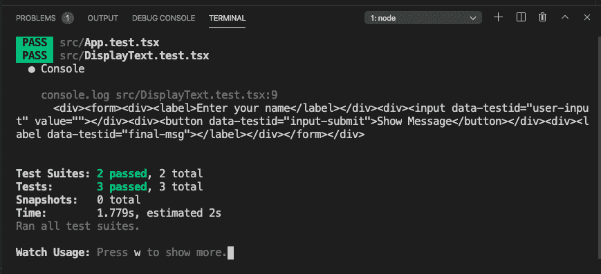

```ts
it("receive input text", () => {
        const username = "testuser";        
        const { getByTestId } = render(<DisplayText />);
        const input = getByTestId("user-input");
        fireEvent.change(input, { target: { value:           username } });
        expect(input).toBeInTheDocument();
        expect(input).toHaveValue(username);
    });
```

1.  现在，让我们创建另一个测试，以显示我们组件的端到端测试。在第二个`it`函数之后添加以下代码：

```ts
it("shows welcome message", () => {
        const testuser = "testuser";
        const msg = `Welcome to React testing,           ${testuser}`;
        const { getByTestId } = render(<DisplayText />);
        const input = getByTestId("user-input");
        const label = getByTestId("final-msg");
        fireEvent.change(input, { target: { value:           testuser } });
        const btn = getByTestId("input-submit");
        fireEvent.click(btn);

        expect(label).toBeInTheDocument();
        expect(label.innerHTML).toBe(msg);
    });
```

这个测试类似于我们的第二个测试，它在我们的`input`中添加了一个值，然后继续获取我们的`button`，然后获取我们的`label`。然后创建一个`click`事件来模拟按下按钮，在常规代码中，这会导致我们的`label`被我们的欢迎消息填充。然后测试我们`label`的内容。同样，一旦保存了这个文件，我们的测试应该重新运行，所有测试都应该通过。

1.  现在，让我们也看看快照。显然，React 开发的一个重要部分不仅是我们应用程序中可用的行为或操作，还有我们向用户呈现的实际 UI。因此，通过快照测试，我们能够检查组件确实创建了所需的 UI，HTML 元素。让我们在“呈现无崩溃”测试之后的测试中添加此代码：

```ts
it("matches snapshot", () => {
        const { baseElement } = render(<DisplayText />);
        expect(baseElement).toMatchSnapshot();
    });
```

正如您所看到的，我们的`render`函数设置为通过使用`baseElement`属性返回`DisplayText`组件的最根元素。此外，我们可以看到我们有一个名为`toMatchSnapshot`的新`expect`函数。此函数执行了一些操作：

+   第一次运行时，它会在我们的`src`文件夹的根目录下创建一个名为`__snapshot__`的文件夹。

+   然后，它添加或更新一个与我们的测试文件同名且以扩展名`.snap`结尾的文件。因此，在这种情况下，我们的测试文件快照文件将是`DisplayText.test.tsx.snap`。

此快照文件的内容是我们组件的发出 HTML 元素。因此，您拥有的快照应该看起来像这样：

```ts
// Jest Snapshot v1, https://goo.gl/fbAQLP
exports[`Test DisplayText matches snapshot 1`] = `
<body>
  <div>
    <form>
      <div>
        <label>
          Enter your name
        </label>
      </div>
      <div>
        <input
          data-testid="user-input"
          value=""
        />
      </div>
      <div>
        <button
          data-testid="input-submit"
        >
          Show Message
        </button>
      </div>
      <div>
        <label
          data-testid="final-msg"
        />
      </div>
    </form>
  </div>
</body>
`;
```

正如您所看到的，这是我们期望的 HTML 的精确副本，由我们的`DisplayText`组件发出。还要注意给出的描述以及指示它是“快照 1”。随着您的添加，编号将递增。

1.  好的，现在我们有了一个快照，我们的第一次测试运行成功了。让我们看看如果我们改变我们的`DisplayText` JSX 会发生什么。更新`DisplayText.tsx`文件，而不是您的测试文件，就像这样（为了简洁起见，我只会显示组件定义）：

```ts
const DisplayText = () => {
    const [txt, setTxt] = useState("");
    const [msg, setMsg] = useState("");
    const onChangeTxt = (e: React.     ChangeEvent<HTMLInputElement>)
      => {
        setTxt(e.target.value);
    }
    const onClickShowMsg = (e: 
      React.MouseEvent<HTMLButtonElement, MouseEvent>) =>      {
        e.preventDefault();
        setMsg(`Welcome to React testing, ${txt}`);
    }
```

前面的代码保持完全相同，但是在`return`中，我们添加了一个虚拟的`div`标签，如下所示：

```ts
    return (
        <form>
            <div>
                <label>Enter your name</label>
            </div>
            <div>
                <input data-testid="user-input"                 value={txt} 
                  onChange={onChangeTxt} />
            </div>
            <div>
                <button data-testid="input-submit" 
                 onClick={onClickShowMsg}>Show                   Message</button>
            </div>
            <div>
                <label data-testid="final-msg" >{msg}                    </label>
            </div>
            DisplayText component UI? In this case, we can force a snapshot update by entering the u character under the w character. If this does not work for you, just stop and restart your test. This is what the Watch Usage list looks like: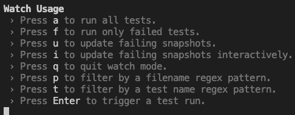Figure 6.14 – Watch Usage list
```

1.  在选择`u`之后，我们的快照文件应该成功更新，我们的快照测试应该完成。如果您打开本地快照文件，您应该看到我们之前添加到组件中的相同的新`div`标签。

所以现在我们已经看到了一些简单的测试，帮助我们入门。接下来，我们将介绍模拟的主题。

# 模拟

模拟就是用默认值替换测试中的特定功能。模拟的一个例子可能是假装进行网络调用，而实际上返回一个硬编码的值。我们这样做的原因是我们只想测试单个单元或代码的一小部分。通过模拟一些与我们正在测试的内容无关的代码部分，我们避免了混淆，并确保我们的测试始终有效。例如，如果我们试图测试代码中的输入，我们不希望网络调用失败影响该测试的结果，因为网络调用与输入元素无关。当我们想进行端到端测试或集成测试时，我们可以担心网络调用。但这与单元测试是不同的（在一些团队中，集成测试由 QA 团队单独处理），我们在这里不涉及它。现在，当涉及到 React 组件时，testing-library 实际上建议不要模拟，因为这实际上使我们的测试不太像实际代码。话虽如此，有时模拟仍然是有帮助的，所以我将展示如何模拟组件。

## 使用 jest.fn 进行模拟

让我们学习使用 Jest 进行模拟，因为它也与 Node 开发一起使用。在 Jest 中进行模拟的第一种方法是使用`fn`模拟特定函数。这个函数接受另一个函数作为参数，这个函数将执行您需要执行的任何操作来设置您想要的模拟。但除了替换任意现有代码和值的能力之外，创建模拟还将使您可以访问一个名为`mock`的成员。这个成员提供了有关您的模拟调用的指标。这很难概念化，所以让我们创建一个例子：

1.  让我们更新我们的`DisplayText`组件，以便向 Web API 发出网络调用。我们将使用`DisplayText`，它是一个根据用户名返回用户全名的函数。我们需要首先更新`App`函数文件如下：

```ts
function App() {
  const getUserFullname = async (username: string):   Promise<string> => {
    getUserFullname and then passing that as a property to our DisplayText component. As you can see, it is based on a network call to the web API of JsonPlaceholder. It calls into the users collection and then it filters the collection using the find array function. The result will get a user's full name from their username by calling userByName.name.
```

1.  现在，让我们看看更新的`DisplayText`组件代码：

```ts
import React, { useState, FC } from "react";
DisplayTextProps to house our getUserFullname function. This function is being passed in as a prop from our App component. And then we use that function within the onClickShowMsg event handler to show the welcome message with the user's full name:

```

返回（

<form>

<div>

<label>输入您的姓名</label>

</div>

<div>

<input data-testid="user-input"                   value={txt}

onChange={onChangeTxt} />

</div>

<div>

<button data-testid="input-submit"

onClick={onClickShowMsg}>显示消息</                  按钮>

</div>

<div>

<label data-testid="final-msg" >{msg}</label>

</div>

</form>

)

}

export default DisplayText;

```ts

The rest of the code is the same but is shown for completeness. So then, now if we run our app, we should see something like this:
```

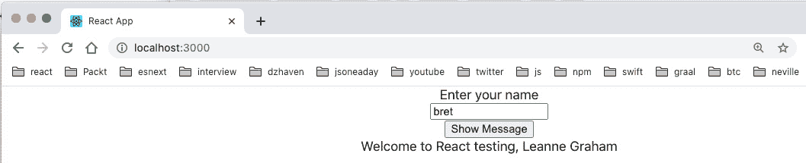

图 6.15 - 用户的全名

如您所见，具有用户名**bret**的用户的全名为**Leanne Graham**。

现在让我们编写我们的测试，并使用 Jest 模拟我们的网络调用：

1.  打开`DisplayText.test.tsx`，注意到我们所有的测试都失败了，因为它们都没有新属性`getUserFullname`。所以，让我们更新我们的测试并模拟这个函数。以下是新的测试：

```ts
import React from 'react';
import { render, fireEvent, cleanup, wait from @testing-library/react. This is to handle asynchronous calls within our test items. For example, getUserFullname is an asynchronous call and so we need to await it. But if we do not await it, our test will fail because it will not have waited for the call to finish before moving to the next step: 

```

afterEach(cleanup);

userFullName 和 getUserFullnameMock。由于我们将在几个测试中运行我们的模拟函数，我们创建了 getUserFullnameMock 函数，以便我们可以重复使用它来给我们提供 getUserFullname 模拟函数和其他一些需要的项目。但问题可能是为什么它们看起来这么复杂？让我们浏览一下代码，弄清楚它在做什么：*在设置`userFullName`变量之后，我们创建了`getUserFullnameMock`函数。正如你所看到的，`getUserFullnameMock`函数接受一个`username`作为参数，就像真正的`getUserFullname`函数一样，并返回一个`promise`和一个`Mock`对象。*在`getUserFullnameMock`内部，定义实例化了一个`promise`对象，并使用`jest.fn`来模拟我们的`getUserFullname`函数。我们需要一个 promise 来模拟网络调用，并且稍后使用 testing-library 的`wait`调用来等待它。*如前所述，`jest.fn`用于实例化一个模拟，并让模拟执行我们可能需要的任何操作。在这种情况下，由于我们正在模拟的`getUserFullname`函数正在进行网络调用，我们需要让我们的`jest.fn`模拟返回一个 promise。它通过返回我们在上一行创建的`promise`来实现这一点。*最后，`promise`和新的模拟函数`getUserFullname`都被返回。*我们在这里做了很多工作，但在这种情况下，消除慢速和容易出错的网络调用是一个好主意。否则，如果网络调用失败，我们可能会错误地认为我们的测试和代码失败了。*接下来，让我们看看我们的模拟在测试中是如何使用的：

```ts
     it("renders without crashing", () => {
        const username = "testuser";
        getUserFullname function and pass it as a property to DisplayText. They don't otherwise use it, but it's still needed since it's a required property of DisplayText.
```

```ts

```

1.  最后一个测试已更新，因为它测试了欢迎消息。像这样更新你的最后一个测试：

```ts
    it("shows welcome message", async () => {
        const username = "testuser";
        getUserFullname function provides the user's fullname and that is fed into the welcome message that's shown in our label. In order to test that, we do an assertion with expect and toBe. Additionally, notice the await wait call just above toBe. This call must run first because our getUserFullname function is an async function and needs therefore to be awaited in order to get its results.
```

因此，通过使用`jest.fn`，我们可以模拟出一段代码，以便它可以给我们一个一致的值。同样，这有助于我们创建一致、可重现的测试，我们只测试特定的代码单元。

## 组件模拟

第二种模拟的形式是完全替换整个组件，并在我们想要测试其他代码时使用它们代替真实组件。为了测试这个，按照这里给出的步骤进行：

1.  让我们的`DisplayText`组件根据插入的用户名显示用户待办事项列表。更新组件如下：

```ts
import React, { useState, FC } from "react";
interface DisplayTextProps {
    getUserFullname: (username: string) =>       Promise<string>;
}
const DisplayText: FC<DisplayTextProps> = ({ getUserFullname })
  => {
    const [txt, setTxt] = useState("");
    const [msg, setMsg] = useState("");
    const [todos, setTodos] = useState<Array<JSX.     Element>>();
```

在这里，我们创建了一些稍后使用的状态：

```ts
    const onChangeTxt = (e: React.      ChangeEvent<HTMLInputElement>)
      => {
        setTxt(e.target.value);
    }
```

在这里，我们使用用户提供的用户名的值更新我们的输入：

```ts
    const onClickShowMsg = async (e: 
      React.MouseEvent<HTMLButtonElement, MouseEvent>) =>         {
        e.preventDefault();
        setMsg(`Welcome to React testing, ${await 
         getUserFullname(txt)}`);  
        setUsersTodos();      
    }   
```

一旦单击**显示消息**按钮，我们就会更新要显示的消息以及要显示的待办事项列表。

1.  我们将接受一个属性作为我们的消息前缀使用：

```ts
const setUsersTodos = async () => {
        const usersResponse = await 
          fetch('https://jsonplaceholder.typicode.com/          users');
        if(usersResponse.ok) {
            const users = await usersResponse.json();
            const userByName = users.find((usr: any) => {
                return usr.username.toLowerCase() ===                    txt;
            });
            console.log("user by username", userByName);
```

类似于我们通过使用他们的`username`获取用户的`fullname`，我们通过调用 JSONPlaceholder API 来获取用户的待办事项列表。首先，我们通过调用用户集合来找到用户：

```ts
            const todosResponse = await  
             fetch('https://jsonplaceholder.typicode.com/              todos');
            if(todosResponse.ok) {
                const todos = await todosResponse.json();
                const usersTodos = todos.filter((todo:                 any) => {
                    return todo.userId === userByName.id;
                });
                const todoList = usersTodos.map((todo:                  any) => {
                    return <li key={todo.id}>
                        {todo.title}
                    </li>
                });
                setTodos(todoList);
                console.log("user todos", usersTodos);
            }
        }
    }
```

然后我们调用待办事项集合，并将待办事项与先前找到的用户进行匹配。

1.  最后，我们通过 UI 返回一个未排序的待办事项列表：

```ts
    return (
        <form>
            <div>
                <label>Enter your name</label>
            </div>
            <div>
                <input data-testid="user-input"                 value={txt} 
                  onChange={onChangeTxt} />
            </div>
            <div>
                <button data-testid="input-submit" 
                 onClick={onClickShowMsg}>Show Message</                  button>
            </div>
            <div>
                <label data-testid="final-msg" >{msg}</                label>
            </div>
            bret has any todos). Note that the text that you see is *lorem ipsum*. It is just placeholder text. It is coming straight from the JSONPlaceholder API:
```

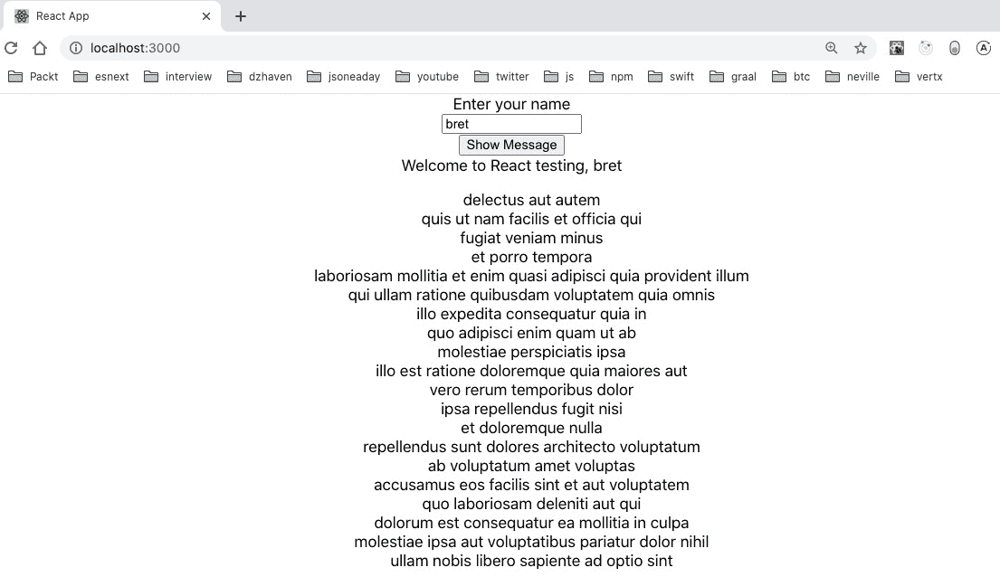

图 6.16 - 用户待办事项列表

在这里，我们显示用户 bret 的待办事项列表。

现在，假设我们想要测试我们的`DisplayText`组件，而不测试这个待办事项列表。我们如何重构这段代码，使得我们的测试不会那么庞大？让我们重构我们的`DisplayText`组件，并将待办事项功能提取为自己的组件：

1.  像这样更新`DisplayText`文件：

```ts
import React, { useState, FC } from "react";
import UserTodos from "./UserTodos";
interface DisplayTextProps {
    getUserFullname: (username: string) =>       Promise<string>;
}
const DisplayText: FC<DisplayTextProps> = ({ getUserFullname }) => {
    const [txt, setTxt] = useState("");
    const [msg, setMsg] = useState("");
    todoControl. The type of this state is the type of our new UserTodos component, which we'll show later. We've gotten this type by using the utility type ReturnType. As you can see, it is a simple way of creating a type definition by using an object: 

```

const onClickShowMsg = async (e：

React.MouseEvent<HTMLButtonElement, MouseEvent>) =>         {

e.preventDefault();

setTodoControl(null);

setMsg(`欢迎来到 React 测试，${await

getUserFullname(txt)}`);

onClickShowMsg 事件处理程序将调用 setTodoControl 并将我们的 UserTodos 组件传递给用户名：

```ts
    return (
        <form>
            <div>
                <label>Enter your name</label>
            </div>
            <div>
                <input data-testid="user-input"                 value={txt} 
                  onChange={onChangeTxt} />
            </div>
            <div>
                <button data-testid="input-submit" 
                 onClick={onClickShowMsg}>Show Message</                    button>
            </div>
            <div>
                <label data-testid="final-msg" >{msg}</                label>
            </div>    
            todoControl gets displayed with our UI.
```

```ts

```

1.  现在让我们创建我们的新`UserTodos`组件。创建一个名为`UserTodos.tsx`的文件，并添加以下代码：

```ts
import React, { FC, useState, useEffect } from 'react';
interface UserTodosProps {
    username: string;
}
```

我们现在从父级获取用户名作为一个属性：

```ts
const UserTodos: FC<UserTodosProps> = ({ username }) => {
    const [todos, setTodos] = useState<Array<JSX.      Element>>();
    const setUsersTodos = async () => {
        const usersResponse = await 
         fetch('https://jsonplaceholder.typicode.com/          users');
        if(usersResponse) {
            const users = await usersResponse.json();
            const userByName = users.find((usr: any) => {
                return usr.username.toLowerCase() ===                  username;
            });
            console.log("user by username", userByName);
```

首先，我们再次从用户集合中获取我们的用户，并过滤以找到我们的一个用户，通过匹配`username`：

```ts
            const todosResponse = await 
             fetch('https://jsonplaceholder.typicode.com/             todos');
            if(userByName && todosResponse) {
                const todos = await todosResponse.json();
                const usersTodos = todos.filter((todo:                 any) => {
                    return todo.userId === userByName.id;
                });
                const todoList = usersTodos.map((todo:                 any) => {
                    return <li key={todo.id}>
                        {todo.title}
                    </li>
                });
                setTodos(todoList);
                console.log("user todos", usersTodos);
            }
        }
    }
```

然后我们获取找到用户的匹配待办事项。然后我们运行 JavaScript 的`map`函数为每个待办事项创建一个`li`元素的集合：

```ts
    useEffect(() => {
        if(username) {
        setUsersTodos();
        }
    }, [username]);
```

通过使用`useEffect`，我们表明每当我们的`username`属性发生变化时，我们都希望更新我们的待办事项列表：

```ts
    return <ul style={{marginTop: '1rem', listStyleType: 
     'none'}}>
        {todos}
    </ul>;
}
export default UserTodos;
```

最后，我们将我们的待办事项输出为无序列表元素。如果你运行这段代码，当你点击**显示消息**时，你应该会看到这个：

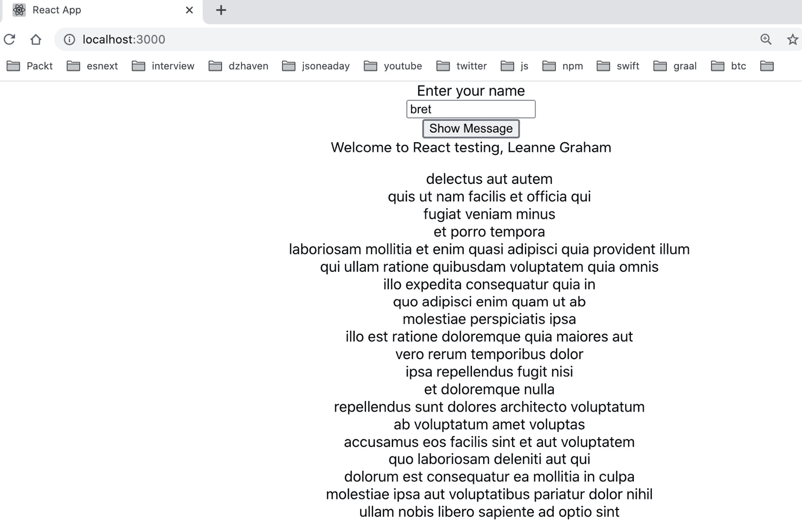

图 6.17 – 重构后的待办事项

好的，现在我们可以添加一个新的测试，模拟我们的`UserTodos`组件，从而允许独立测试`DisplayText`。还要注意，使用 Jest 有两种主要的模拟方式。我们可以进行内联调用来模拟，也可以使用一个模拟文件。在这个例子中，我们将使用一个模拟文件。让我们看看步骤：

1.  在`src`文件夹中，创建一个新文件夹`__mocks__`。在该文件夹中，创建一个名为`UserTodos.tsx`的文件，并将以下代码添加到其中：

```ts
import React, { ReactElement } from 'react';
export default (): ReactElement => {
    return <></>;
  };
```

这个文件将是函数组件的模拟版本。正如你所看到的，它什么也不返回，也没有真正的成员。这意味着与真实组件不同，它不会进行任何网络调用或发出任何 HTML，这对于测试来说是我们想要的。

1.  现在让我们用以下代码更新`DisplayText.test.tsx`：

```ts
import React from 'react';
import { render, fireEvent, cleanup, wait } from '@testing-library/react';
import DisplayText from './DisplayText';
import "@testing-library/jest-dom/extend-expect";
jest.mock("./UserTodos");
afterEach(cleanup);
describe("Test DisplayText", () => {
    const userFullName = "John Tester";

    const getUserFullnameMock = (username: string): 
    [Promise<string>, jest.Mock<Promise<string>,         [string]>] => {        
        const promise = new Promise<string>((res, rej) => {
            res(userFullName);
        });
        const getUserFullname = jest.fn(async (username:          string):
          Promise<string> => {             
            return promise;
        });
        return [promise, getUserFullname];
    }
```

首先，我们可以看到我们在任何测试之外导入了我们的模拟`UserTodos`组件。这是必要的，因为在测试内部这样做是行不通的。

其余的测试都是一样的，但现在它们内部使用`UserTodos`的模拟。因此，由于没有网络调用，测试运行得更快。作为对你新学到的测试技能的试验，尝试单独为`UserTodos`组件创建你自己的测试。

在本节中，我们学习了使用 Jest 和 testing-library 测试 React 应用程序。单元测试是应用程序开发的一个非常重要的部分，作为专业程序员，你几乎每天都会编写测试。它可以帮助编写和重构代码。

在接下来的部分，我们将继续通过讨论在 React 应用程序开发中常用的工具来增加我们的开发者技能。

# 学习 React 开发的常用工具和实践

有许多工具可以帮助编写 React 应用程序。它们太多了，无法详尽列举，但我们将在这里回顾一些最常见的。这些工具对于编写和调试你的代码至关重要，所以你应该花一些时间熟悉它们。

## VS Code

在整本书中，我们一直使用 VS Code 作为我们的代码编辑器。对于 JavaScript 开发，VS Code 显然是目前使用最广泛的编辑器。以下是一些你应该知道的事实，以便最大限度地利用 VS Code：

+   VS Code 有一个庞大的扩展生态系统，可以帮助编码。其中许多依赖于开发者的偏好，所以你应该快速搜索并查看一下。然而，以下是一些你应该考虑使用的常见扩展：

**Visual Studio IntelliCode**：提供了一个基于人工智能驱动的代码完成和语法高亮的语言服务。

阿波罗 GraphQL：GraphQL 的代码完成和格式化助手。

**与 React 相关的插件**：有许多与 React 相关的插件，可以通过提供代码片段或将 Hooks 集成到 NPM 等服务来帮助。以下只是其中一些：

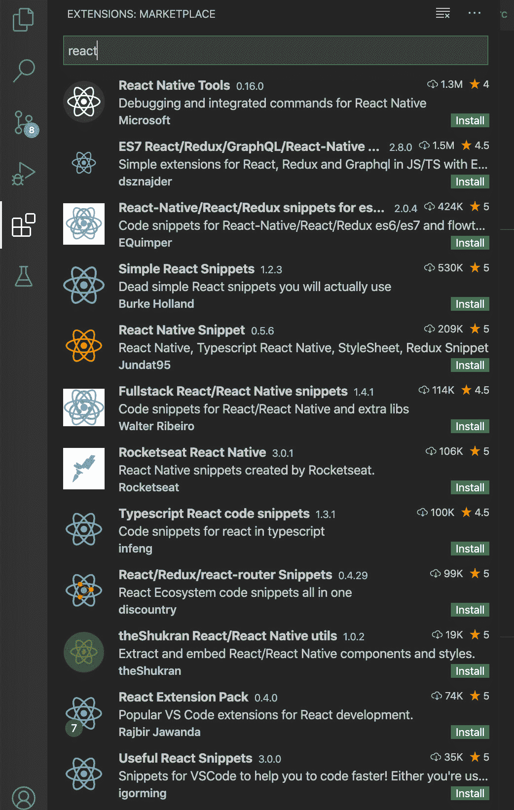

图 6.18 – React VS Code 插件

+   VS Code 有一个内置的调试器，允许你在代码上中断（停止）并查看变量值。我不会在这里演示它，因为前端开发的标准是使用 Chrome 调试器，它也允许在代码上中断，但一旦我们开始使用 Node，我会演示它。

+   配置文件：在 VS Code 中，有两种设置项目偏好的方式，一个是工作区，另一个是`settings.json`文件。关于字体、扩展、窗口等方面，VS Code 有大量的配置方式。这些配置可以在全局范围内进行，也可以在每个项目中进行。我在`ejected-app`项目中包含了一个`.vscode/settings.json`文件，用于演示目的。工作区文件基本上与设置文件相同，只是它们用于在单个文件夹中使用多个项目。工作区文件的命名为`<name>.code-workspace`。

## Prettier

在编写代码时，使用一致的风格非常重要，以提高可读性。例如，如果想象一个有许多开发人员的大团队，如果他们每个人都以自己的风格编写代码，采用不同的缩进方式、变量命名等，那将是一团混乱。此外，有行业标准的 JavaScript 格式化方式可以使其更易读，因此更易理解。这就是 Prettier 等工具提供的功能。

Prettier 将在每次保存时自动将您的代码格式化为一致且可读的格式，无论是谁在编写代码。只需记住，在安装 Prettier 后，您需要设置`settings.json`或您的工作区文件来使用它。同样，我在我们的`ejected-app`项目中包含了一个示例`settings.json`文件。

## Chrome 调试器

Chrome 浏览器提供了用于 Web 开发的内置工具。这些工具包括查看页面的所有 HTML、查看控制台消息、在 JavaScript 代码上中断以及查看浏览器所做的网络调用。即使没有任何插件，它也非常广泛。对于许多前端开发人员来说，Chrome 是调试代码的主要工具。

让我们来看看`ejected-app`的调试器，并学习一些基础知识：

1.  如果您的本地`ejected-app`实例没有运行，请重新启动它，并打开您的 Chrome 浏览器到默认的`localhost:3000` URL。一旦到达那里，通过按下*F12*键或转到`root div`标签打开您的 Chrome 调试器，那里是我们应用程序的其余部分。在这个截图中，我们可以看到我们已经调用 Web API 来获取用户`Bret`的待办事项。因此，我们可以使用 Chrome 调试器来找到我们的 HTML 元素，检查它们的属性，并调整 CSS 值，使我们的 UI 精确地符合我们的要求。

1.  接下来，转到**控制台**选项卡，您应该会看到类似于这样的内容：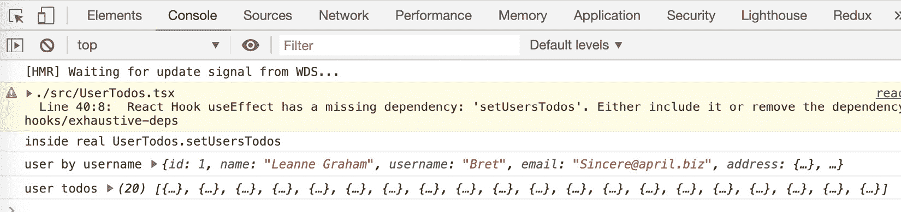

图 6.20：Chrome 调试器控制台选项卡

所以，在这里，我们可以检查变量和函数返回数据的值，确保它们是我们想要的并且符合预期。

1.  使用 Chrome 调试器，可以在运行代码时中断。打开`UserTodos.tsx`文件，然后添加如下所示的断点：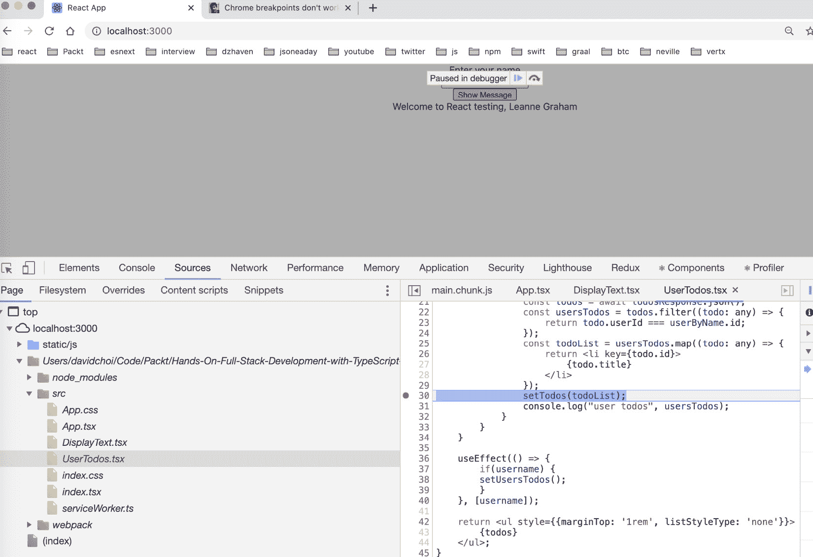

图 6.21 - Chrome 调试器源选项卡

正如你所看到的，我们能够在我们的断点上停下来，这是由*行 30*旁边的点所指示的。如果你悬停在某些变量上，你将能够看到它们当前的值，即使它们包含其他组件等对象。这是一个在代码调试中非常有用的功能。这个功能是由一种叫做源映射的东西所启用的。源映射是将源代码映射或绑定到缩小后的运行时代码的文件。它们在开发时被创建并发送到浏览器，允许在运行时断点和查看变量值。

1.  现在让我们移除断点，转到**网络**选项卡。这个选项卡显示了浏览器所做的所有网络连接。这不仅包括对网络资源（如数据）的调用，还可以包括获取图像或静态文件（如 HTML 文件）的调用。如果我们打开这个选项卡，然后进行调用以获取用户 Bret 的待办事项，我们应该会看到这个：

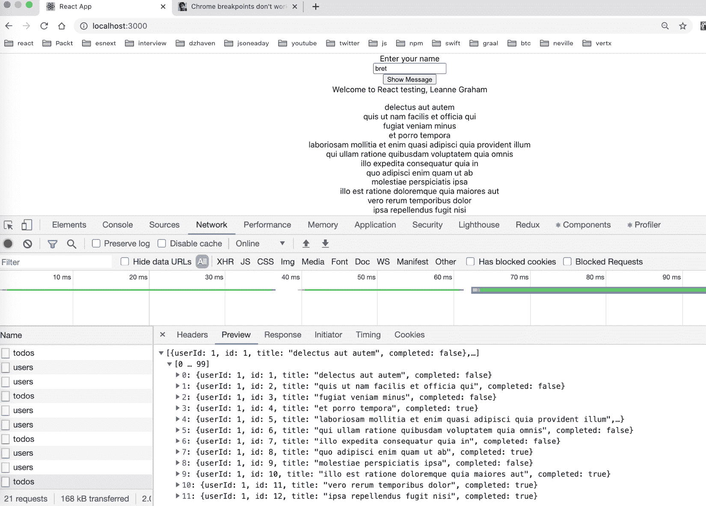

图 6.22 – Chrome 调试器网络选项卡

正如你所看到的，我们可以查看从 Web API 调用返回的所有数据。这是一个方便的工具，可以让我们比较来自我们网络资源的数据，并将其与我们的代码似乎正在使用的数据进行比较。当我们进行 GraphQL 调用时，我们也将在以后使用这个工具。

好的，这是对 Chrome 调试器的快速概述，但 Chrome 还提供了能够提供 React 特定帮助的扩展。React 开发者工具提供有关我们组件层次结构和每个组件的属性信息；例如，这是我们应用程序中的一个示例：

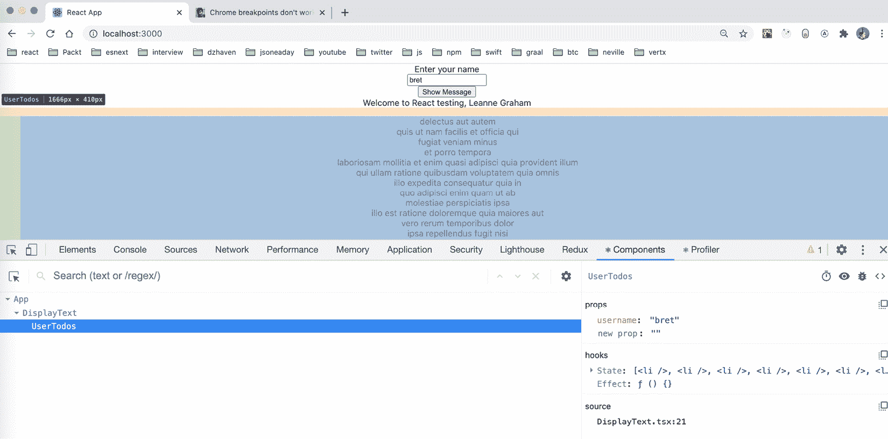

图 6.23 – React 开发者工具

正如你所看到的，这个工具显示了我们的组件层次结构，并显示了当前选定组件的属性。当我们在层次结构中选择特定组件时，它还会在屏幕上显示组成我们组件的元素的高亮显示。这是一个方便的工具，可以从 React 组件结构的角度查看我们的元素，而不是 HTML 结构。Chrome 生态系统的扩展非常广泛，还有针对 Redux 和 Apollo GraphQL 的扩展。我们将在*第八章*中探索这些，*使用 Node.js 和 Express 学习服务器端开发*，以及*第九章*中，*什么是 GraphQL？*。

## 替代 IDE

在本书中，我们使用 VS Code 作为我们的代码编辑器。它运行良好，并已成为最受欢迎的 JavaScript 和 TypeScript 编辑器。但是，你没有理由非要使用它。你应该知道还有其他选择。我只会在这里列出其中一些，这样你就知道一些选项：

+   **Atom**：除了 VS Code 之后可能是最受欢迎的免费编辑器。

+   **Sublime Text**：更快速、更响应的编辑器之一。也有免费版本。

+   **Vim**：Unix 文本编辑器，通常用于编辑代码。

+   **Webstorm**：来自 JetBrains 的商业编辑器。

尝试一些这些编辑器，因为拥有一个好的代码编辑器肯定可以提高你的生产力。

本节回顾了 React 开发中一些常用的工具。虽然这些工具并不是我们应用程序编写代码的主要工具，但它们对于帮助我们更快速、更高质量地编写代码至关重要。它们还将减少我们编写代码时的痛点，因为找到错误通常与解决错误一样具有挑战性。

# 总结

在本章中，我们了解了许多专业前端开发人员用来帮助编写高质量代码的工具。无论是用于编写代码的 VS Code 编辑器，还是用于共享代码的源代码存储库 Git，这里提到的所有工具在前端工程师的工作中都至关重要。

通过了解这些工具，你将成为一个更好的程序员，你的代码质量将大大提高。此外，作为开发人员，你的生活质量也会提高，因为这些工具中的许多工具可以帮助你更快速地跟踪问题，并帮助你比完全靠自己解决问题更容易地解决问题。

在下一章中，我们将通过学习 Redux 和 React Router 来扩展我们对 React 的了解。Redux 将帮助我们管理全局状态，而 React Router 将帮助我们创建客户端 URL。这两个框架在 React 社区中非常受欢迎，并提供许多功能，将帮助我们创建一个更复杂、更有能力的应用程序。
