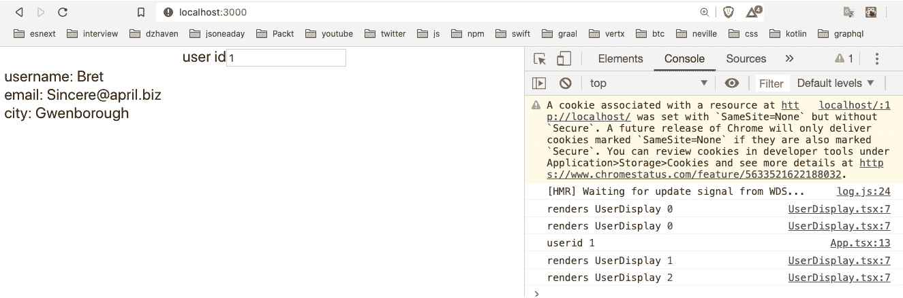
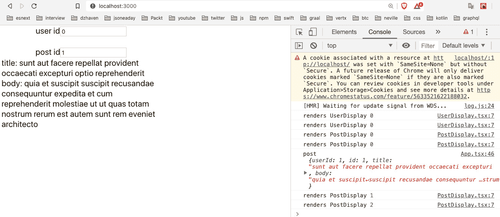
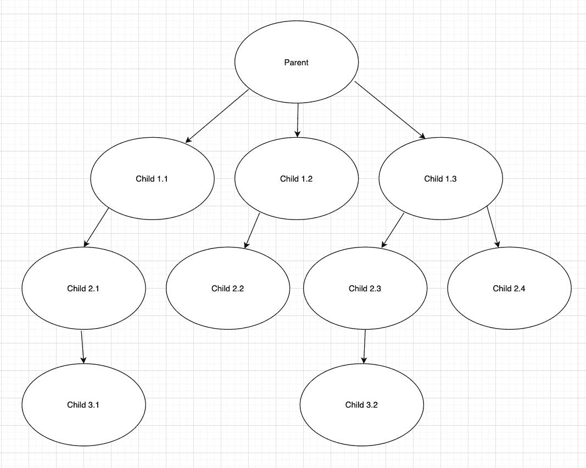
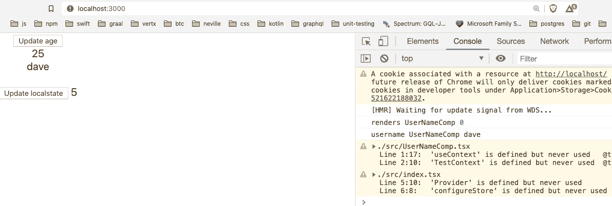
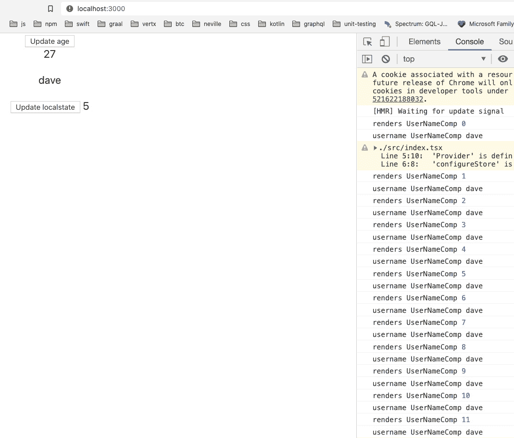
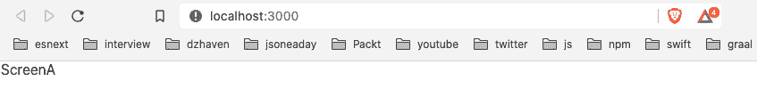
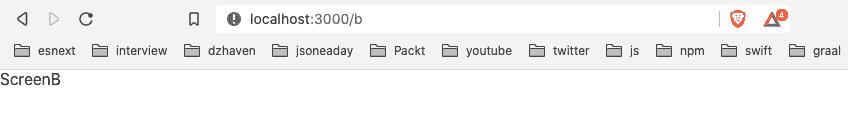
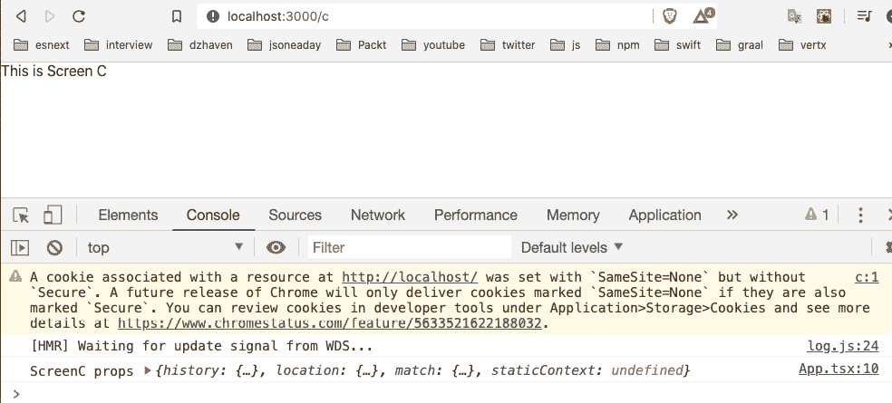
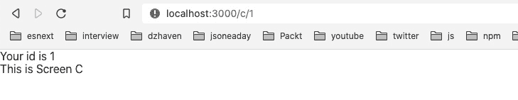
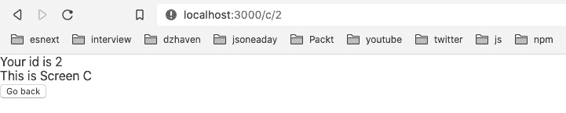

# 第七章：学习 Redux 和 React Router

在本章中，我们将学习 Redux 和 React Router。Redux 仍然是管理 React 应用程序中共享的全局状态的最常见方法。使用 Redux 全局状态，我们可以减少大量样板代码并简化应用程序。React Router 也是管理客户端 URL 路由的最流行框架。客户端 URL 路由允许 SPA 应用程序以用户期望的经典样式 Web 应用程序的方式行为。这两种技术对于构建外观和感觉像标准 Web 应用程序的 SPA 应用程序是必不可少的。

在本章中，我们将涵盖以下主要主题：

+   学习 Redux 状态

+   学习 React Router

# 技术要求

您应该对使用 React 进行 Web 开发有基本的了解。我们将再次使用 Node 和 Visual Studio Code。

GitHub 存储库位于[`github.com/PacktPublishing/Full-Stack-React-TypeScript-and-Node`](https://github.com/PacktPublishing/Full-Stack-React-TypeScript-and-Node)。使用`Chap7`文件夹中的代码。

要设置本章的代码文件夹，请转到您的`HandsOnTypescript`文件夹并创建一个名为`Chap7`的新文件夹。

# 学习 Redux 状态

Redux 仍然是在 React 应用程序中创建和管理全局状态的最流行的企业级框架（尽管我们可以在任何 JavaScript 应用程序中使用 Redux，而不仅仅是 React）。许多新的框架已经被创建，其中一些已经获得了相当大的追随者；然而，Redux 仍然是最常用的。您可能会发现一开始很难理解 Redux。然而，一旦我们学会了它，我们将看到它的许多好处，以及为什么它经常成为大型复杂 React 应用程序的首选框架。

我们在*第四章*中学习了 React 状态，*学习单页应用程序概念以及 React 如何实现它们*，以及*第五章*，*使用 Hooks 进行 React 开发*。因此，再次强调，状态或组件的数据是 React 中所有 UI 更改的主要驱动程序。这就是为什么 React 框架的名称中有"react"一词的原因，因为它对这些状态变化做出反应（这也被称为响应式）。因此，在创建和管理状态时，我们通常希望大部分时间将本地状态与组件或组件的根父级关联起来。

基于组件的状态可能有限。有些情况下，状态不仅适用于一个组件，甚至不适用于组件层次结构。状态有时可能对多个组件或构成应用程序的其他非组件服务是必要的。除此之外，在 React 中，状态只能单向传递，从父级向子级传递作为 props。不应该向上游传递。这进一步限制了 React 中状态的使用。因此，Redux 不仅提供了一种在全局共享状态的机制，还允许根据需要从任何组件注入和更新状态。

让我们举个例子来详细说明一下。在典型的企业级应用程序中，我们总是会有身份验证。一旦用户经过身份验证，我们可能会收到关于用户的某些数据 - 例如，用户的全名、用户 ID、电子邮件等。因此，认为这些数据点可能被应用程序中的大部分组件使用并不是不合理的。因此，让每个组件调用以获取这些数据，然后在它们自己的状态中保存它，这样做将是乏味且容易出错的。这样做意味着数据会有多个副本，并且随着数据的更改，一些组件可能会保留旧版本的数据。

这种冲突可能是 bug 的来源。因此，能够在客户端的一个地方维护这些数据并与需要它的任何组件共享将是有帮助的。这样，如果这些数据有更新，我们可以确保所有组件，无论在应用程序的哪个部分，都能获得最新的有效数据。这就是 Redux 可以为我们的应用程序做的事情。我们可以把它看作是**唯一的真相源**。

Redux 是一个数据存储服务，它在我们的 React 应用程序中维护所有全局共享的数据。Redux 不仅提供存储本身，还提供了添加、删除和共享这些数据所需的基本功能。然而，与 React 状态的一个不同之处是，Redux 状态不一定会触发 UI 更新。如果我们希望这样做，它当然可以，但并不一定需要这样做。因此，我们应该记住这一点。

让我们看看如何设置 Redux：

1.  在`Chap7`文件夹中创建一个新的 React 项目，如下所示：

```ts
create-react-app redux-sample --template typescript
```

1.  一旦我们的项目设置好了，打开它并使用命令行`cd`到`redux-sample`文件夹。

1.  我们现在将安装 Redux，实际上是几个不同的依赖项。首先，运行这个命令：

```ts
npm i redux react-redux @types/redux @types/react-redux
```

这个命令给我们主要的依赖项，包括 TypeScript 类型。

好的，现在我们已经完成了一些基本设置，我们需要在继续之前了解一些关于 Redux 的更多内容。Redux 使用了一对叫做 reducers 和 actions 的概念。让我们看看它们各自的作用。

## Reducers 和 actions

在 Redux 中，所有数据只有一个单一的存储。因此，我们所有的全局数据都将存在于一个 Redux 对象中。现在，这种设计的问题是，由于这是全局状态，不同的应用程序功能将需要不同类型的数据，而整个数据并不总是与应用程序的所有部分相关。因此，Redux 的创建者提出了一种方案，使用 reducers 来过滤和拆分单一存储为分离的块。因此，如果组件 A 只需要特定的数据片段，它就不必处理整个存储。

这种设计是分离数据关注点的好方法。但这种设计的副作用是，我们需要一种更新相关数据部分而不影响其他部分的方法。这就是 actions 的作用。Actions 是提供特定 reducer 数据的对象。

现在我们已经对 reducers 和 actions 有了一个高层次的了解，让我们在代码中看一些例子：

1.  在`src`下创建一个名为`store`的新文件夹。

1.  然后，创建一个名为`AppState.ts`的文件。这个文件将存储我们的聚合 reducer 对象`rootReducer`，类型为`AppState`，它代表了全局状态。将以下代码插入文件中：

```ts
import { combineReducers } from "redux";
export const rootReducer = combineReducers({
});
export type AppState = ReturnType<typeof rootReducer>;
```

`rootReducer`代表了我们所有 reducer 的聚合对象。我们还没有任何 reducer，但是一旦我们的设置完成，我们将添加实际的 reducer。`combineReducers`接受我们的每个 reducer，并将它们组合成一个单一的对象。在底部，我们使用`ReturnType 实用类型`基于我们的`rootReducer`创建了一个 TypeScript 类型，然后导出了新类型`AppState`。

注意

实用类型只是 TypeScript 团队创建的一个帮助类，用于提供特定功能。有许多不同的实用类型，可以在这里找到列表：[`www.typescriptlang.org/docs/handbook/utility-types.html`](https://www.typescriptlang.org/docs/handbook/utility-types.html)。

1.  接下来，我们创建一个名为`configureStore.ts`的文件，其中包含了 Redux 和应用程序使用的实际存储对象。它应该是这样的：

```ts
import { createStore } from "redux";
import { rootReducer } from "./AppState";
const configureStore = () => {
  return createStore(rootReducer, {});
};
export default configureStore;
```

正如我们所看到的，Redux 的`createStore`方法用于基于我们的`AppState`对象`rootReducer`构建实际的存储。`configureStore`被导出并稍后用于执行存储的创建。

1.  现在，我们必须更新我们的`index.tsx`文件，调用我们的`configureStore`方法并为我们的应用程序初始化 Redux。像这样更新`index.tsx`：

```ts
import React from 'react';
import ReactDOM from 'react-dom';
import './index.css';
import App from './App';
import { Provider } from "react-redux";
import configureStore from "./store/configureStore";
import * as serviceWorker from './serviceWorker';
ReactDOM.render(
  <React.StrictMode>
    <Provider store={configureStore()}>
    <App />
    </Provider>
  </React.StrictMode>,
  document.getElementById('root')
);
```

首先，我们从`react-redux`中导入`Provider`。`Provider`是一个 React 组件，作为所有其他组件的父组件，并且*提供*我们的存储数据。此外，如所示，`Provider`接收了通过接受`configureStore`函数的返回值来初始化的存储：

```ts
// If you want your app to work offline and load faster, 
  // you can change
// unregister() to register() below. Note this comes with 
  // some pitfalls.
// Learn more about service workers: 
  // https://bit.ly/CRA-PWA
serviceWorker.unregister();
```

这些注释的代码来自`create-react-app`项目。这里包含它是为了完整性。好的，现在我们已经建立了 Redux 的基本设置。因此，我们的示例将继续通过创建一个调用来获取用户对象。我们将使用我们在*第六章*中学到的 JSONPlaceholder API，*使用 create-react-app 设置我们的项目并使用 Jest 进行测试*。成功登录后，它通过将用户信息放入 Redux 作为 reducer 来共享用户信息。现在让我们来做这个：

1.  创建一个名为`UserReducer.ts`的新文件，放在`store`文件夹中，像这样：

```ts
export const USER_TYPE = "USER_TYPE";
```

我们首先创建一个名为`USER_TYPE`的 action 类型的常量。这是可选的，但有助于我们避免诸如拼写错误之类的问题：

```ts
export interface User {
    id: string;
    username: string;
    email: string;
    city: string;
}
```

然后，我们创建一个表示我们的`User`的类型：

```ts
export interface UserAction {
    type: string;
    payload: User | null;
}
```

现在，按照惯例，一个 action 有两个成员：类型和有效负载。因此，我们创建了一个`UserAction`类型，其中包含这些成员：

```ts
export const UserReducer = ( state: User | null = null, action: 
  UserAction): User | null => {
    switch(action.type) {
        case USER_TYPE:
            console.log("user reducer", action.payload);
            return action.payload;
        default:
            return state;
    }
};
```

然后，最后，我们创建了名为`UserReducer`的 reducer。reducer 始终接受`state`和`action`参数。请注意，`state`并不是整个状态，它只是与某个 reducer 相关的部分状态。这个 reducer 将根据`action`类型知道传入的`state`是否属于它自己。还要注意，原始状态永远不会被改变。这一点非常重要。绝对不要直接改变状态。你应该要么返回原状态，这在`case` `default`中完成，要么返回其他数据。在这种情况下，我们返回`action.payload`。

1.  现在，我们必须回到我们的`AppState.ts`文件中，添加这个新的 reducer。文件现在应该是这样的：

```ts
import { combineReducers } from "redux";
import { UserReducer } from "./UserReducer";
export const rootReducer = combineReducers({
  user, which is updated by UserReducer. If we had more reducers, we would simply give them a name and add them below user with their reducer, and the combineReducers Redux function would combine all of them into a single aggregate rootReducer.
```

1.  现在，让我们开始使用我们的新状态。像这样更新`App.tsx`文件：

```ts
import React, { useState } from 'react';
import ContextTester from './ContextTester';
import './App.css';
function App() {
  const [userid, setUserid] = useState(0);
  const onChangeUserId = (e: React.   ChangeEvent<HTMLInputElement>)
   => {
    console.log("userid", e.target.value);
    setUserid(e.target.value ? Number(e.target.value) :      0);
  }
  return (
    <div className="App">
      <label>user id</label>
      <input value={userid} onChange={onChangeUserId} />
    </div>
  );
}
export default App;
```

我们将以`userid`作为参数，然后根据该 ID 从 JSON Placeholder API 中获取关联的用户。为了做到这一点，我们需要使用一些 Redux 特定的 Hooks，这样我们就可以将我们找到的用户添加到 Redux 存储中。

1.  让我们像这样更新`App`组件中的`App.tsx`：

```ts
function App() {
  const [userid, setUserid] = useState(0);
dispatch. We get an instance of dispatch with the useDispatch Hook. dispatch is a Redux function that sends our action data to Redux. Redux then sends the action to each of our reducers for processing. Then the reducer that recognizes the action type accepts it as its state payload:

```

通过`onChangeUserId`处理程序，我们调用 JSONPlaceholder API。然后我们使用`usersResponse`响应对象从我们的网络 API 中获取结果。然后我们通过筛选从 UI 中获取的用户 ID 来获取我们想要的用户。然后我们使用 dispatch 将我们的 action 发送给我们的 reducer。还要注意`onChangeUserId`现在是一个异步函数：

```ts
  }
  return (
    <div className="App">
      <label>user id</label>
      <input value={userid} onChange={onChangeUserId} />
    </div>
  );
}
```

这个 UI 将以`userid`作为输入。

```ts

```

现在，让我们创建一个子组件，可以显示我们所有与用户相关的数据：

1.  创建一个名为`UserDisplay.tsx`的新组件，并添加这段代码：

```ts
import React from 'react';
import { AppState } from './store/AppState';
import { useSelector } from 'react-redux';
const UserDisplay = () => {
    useSelector Hook gets the specific user reducer. It takes a function as a parameter and this function takes the entire aggregated reducer state and only returns the user reducer. Also in this component, we are displaying the properties of our found user but taken from Redux and the user reducer. Notice also how we return null if no user is found.
```

1.  现在，让我们将`UserDisplay`组件添加到我们的`App`组件中：

```ts
import React, { useState } from 'react';
import './App.css';
import { useDispatch } from 'react-redux';
import { USER_TYPE } from './store/UserReducer';
UserDisplay component:

```

function App() {

const [userid, setUserid] = useState(0);

const dispatch = useDispatch();

const onChangeUserId = async (e:

React.ChangeEvent<HTMLInputElement>) => {

const useridFromInput = e.target.value ?

Number(e.target.value) : 0;

console.log("userid", useridFromInput);

setUserid(useridFromInput);

const usersResponse = await

fetch('https://jsonplaceholder.typicode.com/      users');

if(usersResponse.ok) {

const users = await usersResponse.json();

const usr = users.find((userItem: any) => {

return userItem && userItem.id ===         useridFromInput;

});

dispatch({

type: USER_TYPE,

payload: {

id: usr.id,

username: usr.username,

email: usr.email,

city: usr.address.city

}

});

}

}

```ts

No real changes up to here:

```

return (

<React.Fragment>

<div className="App">

<label>用户 ID</label>

<input value={userid} onChange={onChangeUserId}           />

</div>

在返回的 JSX UI 中使用`UserDisplay`，这样我们的用户信息就会显示出来。

```ts

```

1.  现在，如果你在浏览器中加载`http://localhost:3000`并在输入框中输入`1`，你应该会看到这个：



图 7.1 – 来自 Redux 存储的用户对象

因此，现在我们已经看到了一个简单 Redux 存储用例的示例，让我们进一步展示当我们在同一个存储中有多个 reducer 时会发生什么：

1.  创建一个名为`PostDisplay.tsx`的新文件，并添加以下代码。这个组件将显示来自 JSON Placeholder API 的发布评论：

```ts
import React, { useRef } from 'react';
import { AppState } from './store/AppState';
import { useSelector } from 'react-redux';
const PostDisplay = React.memo(() => {
    const renderCount = useRef(0);
    console.log("renders PostDisplay", renderCount.     current++);
    const post = useSelector((state: AppState) => state.     post);
```

与我们之前的示例一样，这里我们使用`useSelector`设置我们想要的状态数据：

```ts
    if(post) {
        return (<React.Fragment>
            <div>
                <label>title:</label>
                &nbsp;{post.title}
            </div>
            <div>
                <label>body:</label>
                &nbsp;{post.body}
            </div>
        </React.Fragment>);
    } else {
        return null;
    }
});
export default PostDisplay
```

如您所见，它看起来与`UserDisplay`非常相似，但它显示与`post`相关的信息，如`title`和`body`。

1.  现在，我们更新我们的 Redux 代码以添加我们的新 reducer。首先，在`store`文件夹内添加一个名为`PostReducer.ts`的新文件，然后添加以下代码：

```ts
export const POST_TYPE = "POST_TYPE";
export interface Post {
    id: number;
    title: string;
    body: string;
}
export interface PostAction {
    type: string;
    payload: Post | null;
}
export const PostReducer = ( state: Post | null = null, 
  action: PostAction): Post | null => {
    switch(action.type) {
        case POST_TYPE:
            return action.payload;
        default:
            return state;
    }
};
```

同样，这与`UserReducer`非常相似，但专注于帖子而不是用户。

1.  接下来，我们想要更新`AppState.tsx`文件，并将我们的新 reducer 添加到其中。添加以下代码：

```ts
import { combineReducers } from "redux";
import { UserReducer } from "./UserReducer";
import { PostReducer } from "./PostReducer";
export const rootReducer = combineReducers({
  user: UserReducer,
  PostReducer.
```

1.  好的，现在我们将更新我们的`App`组件，并添加特定于从 JSON Placeholder API 中查找特定帖子的代码。使用以下代码更新`App`：

```ts
function App() {
  const [userid, setUserid] = useState(0);
  const dispatch = useDispatch();
  const [postid, setPostId] = useState(0);
```

请注意，我们没有针对任何 reducer 特定的`dispatch`。这是因为分派程序只是通用执行函数。该操作最终将被路由到适当的 reducer。

`onChangeUserId`没有改变，但出于完整性，这里显示一下：

```ts
  const onChangeUserId = async (e: 
   React.ChangeEvent<HTMLInputElement>) => {
    const useridFromInput = e.target.value ? 
     Number(e.target.value) : 0;
    console.log("userid", useridFromInput);
    setUserid(useridFromInput);
    const usersResponse = await 
      fetch('https://jsonplaceholder.typicode.com/      users');
    if(usersResponse.ok) {
      const users = await usersResponse.json();

      const usr = users.find((userItem: any) => {
        return userItem && userItem.id ===          useridFromInput;
      });

      dispatch({
        type: USER_TYPE,
        payload: {
          id: usr.id,
          username: usr.username,
          email: usr.email,
          city: usr.address.city
        }
      });
    }
  }
```

`onChangePostId`是一个新的事件处理程序，用于处理与`post`相关的数据更改：

```ts
  const onChangePostId = async (e: 
    React.ChangeEvent<HTMLInputElement>) => {
    const postIdFromInput = e.target.value ? 
      Number(e.target.value) : 0;
    setPostId(postIdFromInput);
    const postResponse = await 
      fetch("https://jsonplaceholder.typicode.com/posts/" 
        + postIdFromInput);
    if(postResponse.ok) {
      const post = await postResponse.json();
      console.log("post", post);
      dispatch({
        type: POST_TYPE,
        payload: {
          id: post.id,
          title: post.title,
          body: post.body
        }
      })
    }
  }
```

`OnChangePostId`通过`dispatch`函数分派相关的`action`。

UI 已经稍微更新以处理新的`PostDisplay`组件，并将其与`UserDisplay`组件分开：

```ts
  return (
    <React.Fragment>
      <div style={{width: "300px"}}>
        <div className="App">
          <label>user id</label>
          <input value={userid} onChange={onChangeUserId}            />
        </div>
        <UserDisplay />
      </div>
      <br/>
      <div style={{width: "300px"}}>
        <div className="App">
          <label>post id</label>
          <input value={postid} onChange={onChangePostId}             />
        </div>
        <postid, you should see an interesting thing:
```



图 7.2 – PostDisplay 结果

请注意，在控制台中，当更新`postid`输入时，没有`UserDisplay`的日志。这表明 Redux 存储不直接连接到 React 渲染管道，只有与特定状态更改相关的组件才会重新渲染。这与 React Context 的行为不同，并且可以通过减少不需要的渲染来提高性能（我们将在下一节中讨论 Context）。

在本节中，我们了解了 Redux，这是在 React 中管理全局状态的最流行方式。在更大的应用程序中，我们经常会使用全局状态管理器，因为通常会发生大量的全局数据共享。在我们的应用程序中，我们将存储有关已登录用户和其他将在整个应用程序中共享的数据的信息，因此具有这种能力将是有价值的。

## React Context

Context 是在 Hooks 之前推出的一个较新的功能。Context 不是一个单独的依赖项，而是内置到 React 核心中的。它允许类似于 Redux 的功能，即允许状态存储在单一源中，然后在组件之间共享，而无需手动通过组件层次结构传递 props。

从开发人员编码的角度来看，这种能力非常高效，因为它消除了从父级到其子级传递状态所需的大量样板代码。这是一个更大的 React 应用程序中可能的一组层次结构的可视化：



图 7.3 – React 组件层次结构

在这个示例图中，我们有一个单一的父组件，它有几个子组件，它在自己的 JSX 中使用。这些子组件也有它们自己的子组件，依此类推。因此，如果我们要为每个组件层次结构配置传递 props，那将是相当多的代码，特别是知道有些层次结涉及传递可能回调到某个任意父级的函数。这种类型的 prop 关系也会给开发人员带来额外的认知负担，因为他们需要考虑数据关系以及数据在组件之间的传递方式。

当适当时，React 上下文和 Redux 都是避免这种状态传递样板代码的好方法。对于较小的项目，上下文的简单性效果很好。然而，对于较大的项目，我建议不要使用上下文。

React 上下文可以有多个父提供者，这意味着可能有多个根上下文。对于更大的应用程序，这可能会令人困惑，并增加更多样板代码。此外，全局状态提供者的混合可能会令人困惑。如果团队决定同时使用 Context 和 Redux，那么我们何时使用每一个？如果我们现在同时使用两者，那么我们必须维护两种全局状态管理样式。

此外，与 Redux 不同，上下文没有 reducers 的概念。因此，上下文的所有用户将接收整个状态数据集，这在关注点分离方面不是一个好的实践。随着时间的推移，特定组件应处理哪个数据子集可能会变得令人困惑。

拥有所有状态数据对所有组件用户都可用的一个额外副作用是，即使组件实际上没有访问特定状态成员，任何上下文更改都会触发重新渲染。例如，假设上下文状态如下`{ username, userage }`，而我们的组件只使用`username`。即使仅`userage`发生变化，它也会触发该组件的重新渲染。即使使用了`memo`（我们在*第五章*中介绍了`memo`），这也是正确的。让我们看一个演示这种效果的例子：

1.  从`index.tsx`中删除`React.StrictMode`和`Provider`，以避免混淆。我们稍后会把它们放回去。现在，`index.tsx`文件应该是这样的：

```ts
import React from 'react';
import ReactDOM from 'react-dom';
import './index.css';
import App from './App';
import { Provider } from "react-redux";
import configureStore from "./store/configureStore";
import * as serviceWorker from './serviceWorker';
ReactDOM.render(
    <App />
  ,
  document.getElementById('root')
);
```

同样，这些注释来自`create-react-app`，仅出于完整性而包含在这里：

```ts
// If you want your app to work offline and load faster,  
 // you can change
// unregister() to register() below. Note this comes with
  // some pitfalls.
// Learn more about service workers:   // https://bit.ly/CRA-PWA
serviceWorker.unregister();
```

You can also remove any unused imports to avoid triggering warning messages.

1.  现在，创建这两个子组件，每个组件将使用我们上下文状态的一个唯一成员。首先，创建`UserAgeComp.tsx`组件，并添加以下代码：

```ts
import React, { useContext } from 'react';
import { TestContext } from './ContextTester';
const UserAgeComp = () => {
    const { userage } = useContext(TestContext);

    return <div>
        {userage}
    </div>
};
export default UserAgeComp;
```

这段代码使用对象解构来仅使用`TestContext`的`userage`成员，通过使用稍后我们将创建的`useContext` Hook，并仅显示它。现在，创建`UserNameComp.tsx`组件，并添加以下代码：

```ts
import React, { useContext, useRef } from 'react';
import { TestContext } from './ContextTester';
const UserNameComp = React.memo(() => {
    const renders = useRef(0);
    username (note, I have it commented out), but before we can show the ramifications of using Context, I wanted to show this component working as expected first. So, this component has two main features. One is a ref that counts the number of times this component was rendered, and a variable called username that gets displayed. It will also log the renders count as well in order to show when a re-render is triggered.
```

1.  现在，我们需要创建一个包含上下文的父组件。创建`ContextTester.tsx`文件，并添加以下代码：

```ts
import React, { createContext, useState } from 'react';
import UserNameComp from './UserNameComp';
import UserAgeComp from './UserAgeComp';
```

在这里，我们使用`createContext`来创建我们的`TestContext`对象，它将保存我们的状态：

```ts
export const TestContext = createContext<{ username:   string, userage: number }>({ username: "",   userage:0 });
const ContextTester = () => {
    const [userage, setUserage] = useState(20);
    const [localState, setLocalState] = useState(0);
    const onClickAge = () => {
        setUserage(
            userage + 1
        );
    }
    const onClickLocalState = () => {
        setLocalState(localState + 1);
    }
    return (<React.Fragment>
        <button onClick={onClickAge}>Update age</button>        
        <TestContext.Provider value={{ username: "dave",
          userage }}>
            localState, which is incremented by the onClickLocalState handler, and the other is the renders of the two child components, UserNameComp and UserAgeComp. Notice UserNameComp, for now, lives outside of the TestContext Context component, and therefore is not affected by TestContext changes. *This is very important to note*.
```

1.  现在，如果我们点击“更新年龄”或“更新本地状态”，你会发现`UserNameComp`中的`console.log`语句从未执行过。该日志语句仅在页面首次加载时执行了一次，这是应该发生的，因为`UserNameComp`使用了`memo`（`memo`只允许在 props 更改时重新渲染）。你应该在**控制台**选项卡中只看到一组日志（忽略警告，因为我们很快会重新添加我们的依赖项）：

图 7.4 - 上下文渲染结果

1.  好的，现在，让我们强制`UserNameComp`使用我们的`TestContext`中的`username`。所以现在，`UserNameComp`应该是这样的：

```ts
import React, { useContext, useRef } from 'react';
import { TestContext } from './ContextTester';
const UserNameComp = React.memo(() => {
    const renders = useRef(0);
    console.log("renders UserNameComp", renders.      current++);
    UserNameComp is using the username variable from the TestContext context. It never makes use of the userage variable and you will recall username has a hardcoded value so it never changes. So, theoretically, the username state of UserNameComp never changes and therefore should not cause a re-render. Now we need to place UserNameComp inside the TestContext tag as well. We are doing this because if a component needs to use a Context's state, it must be inside that Context's tag. Edit ContextTester like so:

```

const ContextTester = () => {

const [userage, setUserage] = useState(20);

const [localState, setLocalState] = useState(0);

const onClickAge = () => {

setUserage(

userage + 1

);

}

const onClickLocalState = () => {

setLocalState(localState + 1);

}

返回（<React.Fragment>

<button onClick={onClickAge}>更新年龄</button>

<username is hardcoded to "dave" and never changes. And as you can see, UserNameComp was moved into TestContext.

```ts

```

1.  现在，如果我们运行这段代码，然后多次点击按钮，我们应该看到类似这样的结果：



图 7.5 - 使用上下文时的重新渲染

正如你所看到的，我们的`UserNameComp`组件不断重新渲染，即使我们只改变了`localState`变量。为什么会发生这种情况？`TestContext`是一个像任何其他 React 组件一样的组件。它不使用`memo`。因此，当父组件`ContextTester`重新渲染时，它也会重新渲染，这对于它的任何子组件都会产生连锁效应。这就是为什么`UserNameComp`不断重新渲染，尽管它从不使用`userage`变量。

因此，正如你所看到的，上下文在使用上有一些问题，我认为对于大型的 React 应用程序，如果你必须在这两者之间做出选择，使用 Redux 可能更好，尽管更复杂。

在本节中，我们学习了有关上下文的基础知识。上下文相对来说很容易学习和使用。对于较小的项目，它非常有效。然而，由于其简单的设计，对于更复杂的项目，更复杂的全局状态管理系统可能更可取。

# 学习 React Router

React Router 是 React 中最常用的路由框架。它相对来说很简单学习和使用。路由，正如我们在*第四章*中发现的，*学习单页应用程序的概念以及 React 如何实现它们*，在 Web 开发中是无处不在的。这是 Web 应用程序用户所期望的功能，因此学习如何在我们的 React 应用程序中使用它是一个要求。

在 React Router 中，路由只是包含我们自己应用程序组件的 React Router 组件，而这些组件又代表我们的屏幕。换句话说，React Router 中的路由是虚拟位置的逻辑表示（通过虚拟位置，我指的是一个仅仅是标签而不实际存在于任何服务器上的 URL）。React Router 中的“路由器”充当父组件，而我们的屏幕渲染组件充当子组件。仅仅通过阅读是有点难以理解的，所以让我们创建一个例子：

1.  通过在终端中调用这个命令，在`Chap7`文件夹下创建一个新的 React 项目：

```ts
create-react-app try-react-router --template typescript 
```

1.  一旦它完成了创建我们的项目，`cd`进入新的`try-react-outer`文件夹，然后让我们添加一些包：

```ts
dom.
```

1.  现在，让我们更新我们的`index.tsx`文件，以便在我们的应用程序中包含根 React Router 组件。像这样更新`index.tsx`：

```ts
import React from "react";
import ReactDOM from "react-dom";
import "./index.css";
import App from "./App";
import * as serviceWorker from "./serviceWorker";
import { App component, called BrowserRouter. BrowserRouter is a bit like Redux's Provider in the sense that it is a single parent component that provides various props to child components that are relevant to doing routing. We will go over these props soon, but for now, let's finish our setup of React Router.
```

1.  现在，由于这个工具为我们提供了路由，我们必须设置我们的个别路由。然而，由于路由最终只是代表我们屏幕的组件的容器，让我们首先创建两个屏幕。创建一个名为`ScreenA.tsx`的文件，并添加以下代码：

```ts
import React from "react";
const ScreenA = () => {
  return <div>ScreenA</div>;
};
export default ScreenA;
```

这是一个简单的组件，在浏览器中显示**ScreenA**。

1.  现在，创建一个名为`ScreenB.tsx`的文件，并添加以下代码：

```ts
import React from "react";
const ScreenB = () => {
  return <div>ScreenB</div>;
};
export default ScreenB;
```

再次，这是一个简单的组件，在浏览器中显示**ScreenB**。

1.  现在，让我们试试我们的路由。打开`App.tsx`并添加以下代码：

```ts
import React from "react";
import "./App.css";
import { Switch, Route } from "react-router-dom";
import ScreenA from "./ScreenA";
import ScreenB from "./ScreenB";
function App() {
  return (
    <Switch>
      <Route exact={true} path="/" component={Switch component indicates a parent that determines which route to choose by matching the browser URL to a path property of a Route instance. For example, if we start our app and go to the "/" route (the root of our application), we should see this:
```



图 7.6 - 路由到 ScreenA

但是，如果我们要去到路由`"/b"`，我们应该看到**ScreenB**，就像这样：



图 7.7 - 路由到 ScreenB

所以，正如我在本节开头所述，React Router 路由是 React 组件。这可能看起来很奇怪，因为它们没有可见的 UI。尽管如此，它们是父组件，除了渲染它们的子组件之外，它们自己没有 UI。

现在，我们知道当我们的应用程序首次加载时，首先运行的是`index.tsx`文件。这也是核心 React Router 服务所在的地方。当这个服务遇到一个 URL 时，它会查看我们的`App.tsx`文件中定义的路由集，并选择一个匹配的路由。一旦选择了匹配的路由，就会渲染该路由的子组件。因此，例如，具有`path="/b"`的路由将渲染`ScreenB`组件。

让我们深入了解我们的路由代码的细节。如果我们回顾一下我们的路由，我们应该看到我们的第一个路由有一个叫做`exact`的属性。这告诉 React Router 不要使用正则表达式来确定路由匹配，而是要寻找一个精确匹配。接下来，我们看到一个叫做`path`的属性，这当然是我们在根域之后的 URL 路径。这个路径默认是一个"包含"路径，意味着任何包含与`path`属性相同值的 URL 都将被接受，并且将呈现第一个匹配的路由，除非我们包含了`exact`属性。

现在，你还会注意到我们有一个叫做`component`的属性，它当然是指要呈现的子组件。对于简单的场景，使用这个属性是可以的。但是如果我们需要向组件传递一些额外的 props 怎么办？React Router 提供了另一个叫做`render`的属性，它允许我们使用所谓的**渲染属性**。

`render`属性是一个以函数作为参数的属性。当父组件进行渲染时，它将在内部调用`render`函数。让我们看一个例子：

1.  创建一个名为`ScreenC.tsx`的新组件，并在其中添加以下代码：

```ts
import React, { FC } from "react";
interface ScreenCProps {
  message: string;
}
const ScreenC: FC<ScreenCProps> = ({ message }) => {
  return <div>{message}</div>;
};
export default ScreenC;
```

`ScreenC`组件与其他组件非常相似。但是它还接收一个叫做`message`的 prop，并将其用作显示。让我们看看如何通过 React Router 的`render`属性传递这个 prop。

1.  现在让我们更新我们的`App`组件，并将这个新组件作为一个路由添加进去：

```ts
import React from "react";
import "./App.css";
import { Switch, Route } from "react-router-dom";
import ScreenA from "./ScreenA";
import ScreenB from "./ScreenB";
import ScreenC from "./ScreenC";
function App() {
  const renderScreenC, and it takes props as a parameter and then passes it to the ScreenC component and then returns that component. Along with passing props, we also have it passing the string "This is Screen C" into the message property. If we had tried to use the component property of Route, there would be no way to pass the message property and so we are using the render property instead. 
```

1.  接下来，我们添加一个使用`render`属性的新的`Route`，并将其传递给`renderScreenC`函数。如果我们去`"/c"`路径，我们会看到基本上与其他屏幕相同的东西，但是有我们的消息，**这是屏幕 C**：



图 7.8 - 路由到 ScreenC

但是，我还包含了一个传递给组件的 props 的日志，我们可以看到诸如`history`、`location`和`match`成员等内容。你会记得我们的渲染函数`renderScreenC`，它的签名是`(props:any) => { … }`。这个`props`参数是由 React Router 服务的`Route`组件传递进来的。我们稍后会看一下这些路由属性。

所以，现在我们知道了如何通过使用`render`属性更好地控制我们的屏幕组件渲染，但是一个典型的 URL 也可以有传递数据到屏幕的参数。让我们看看如何在 React Router 中实现这一点：

1.  让我们像这样更新`ScreenC`的`Route`：

```ts
<Route path="/c/:userid" render={renderScreenC} />
```

`userid`字段现在是 URL 上的一个参数。

1.  现在让我们更新我们的`ScreenC`组件，接受 Route props 并处理我们的新的`userid`参数字段：

```ts
import React, { FC } from "react";
interface ScreenCProps {
  message: string;
  props) => {
  return (
    <div>
      <div>props member without having to write them out. And now our component takes the history and match props members as its own props and it is also handling the userid field by using the match.params.userid property. Since the history object already contains location as a member, we did not add that member to our ScreenCProps interface. The screen should look like this:
```



图 7.9 - 带参数路由到 ScreenC

正如你所看到的，我们的`userid`参数的值为**1**。

好的，现在我们更实际地使用了 React Router，但关于 React Router 的工作方式还有另一个重要特点需要注意。React Router 基本上就像一个 URL 的堆栈。换句话说，当用户访问站点的 URL 时，他们是以线性方式进行的。他们先去 A，然后去 B，也许回到 A，然后去 C，依此类推。由此产生的结果是用户的浏览器历史可以保存为一个堆栈，用户可以前进到一个新的 URL，或者后退到先前访问过的 URL。这种浏览器行为特性在 React Router 的`history`对象中大多得到了维护。

所以，再次，让我们更新我们的代码，看看`history`对象提供的一些功能：

1.  更新`ScreenC`组件如下：

```ts
import React, { FC, useEffect } from "react";
interface ScreenCProps {
  message: string;
  history: any;
  match: any;
}
const ScreenC: FC<ScreenCProps> = (props) => {
useEffect and in this function, we are waiting 3 seconds with a timer and then by using the history.push function, we are redirecting our URL to "/", which is rendered by the ScreenA component.
```

1.  让我们在`history`对象内部使用另一个函数。再次更新`ScreenC`，像这样：

```ts
import React, { FC } from "react";
interface ScreenCProps {
  message: string;
  history: any;
  match: any;
}
const ScreenC: FC<ScreenCProps> = (props) => {
  const history.goBack function. In order to test this code, we need to open the web page to URL localhost:3000/b first and then go to URL localhost:3000/c/2. Your screen should then look like this:Figure 7.10 – Routed to ScreenC with a Go back button
```

1.  你可以看到我们有一个名为`"/b"`的路由按钮。

1.  还有一件事要回顾一下：React Router 最近添加了 Hooks 功能。因此，我们不再需要通过子组件的 props 传递路由属性；我们可以直接使用 Hooks。以下是它的样子（我已经将非 Hooks 部分作为注释保留给您）：

```ts
import React, { FC } from "react";
import { useHistory, useParams } from "react-router-dom";
```

在这里，我们有我们的新的`useHistory`和`useParams` Hooks 导入：

```ts
interface ScreenCProps {
  message: string;
  history: any;
  match: any;
}
const ScreenC: FC<ScreenCProps> = (props) => {
  // useEffect(() => {
  //   setTimeout(() => {
  //     props.history.push("/");
  //   }, 3000);
  // });
  const history = useHistory();
  const { userid } = useParams();
```

在这里，我们调用我们的`useHistory`和`useParams` Hooks 来获取`history`和`userid` URL 参数：

```ts
  const onClickGoback = () => {
    // props.history.goBack();
    history.goBack();
  };
  return (
    <div>
      {/* <div>{"Your id is " + props.match.params.        userid}</div>
       */}
      <div>{"Your id is " + userid}</div>
      <div>{props.message}</div>
      <div>
        <button onClick={onClickGoback}>Go back</button>
      </div>
    </div>
  );
};
export default ScreenC;
```

在这里，我们使用 Hooks 对象来显示与之前相同的消息。使用起来非常简单和方便。

当然，`history`对象和 React Router 整体还有更多功能，但这是对这些功能的一个很好的介绍，我们将在接下来的章节中开始构建我们的应用程序时使用更多这些特性。

路由是 Web 开发的重要部分。路由帮助用户了解他们在应用程序中的位置，并提供一种上下文的感觉。路由还帮助我们作为开发人员结构化应用程序的逻辑部分，并将相关项目组合在一起。React Router 通过提供许多编程功能，使我们能够将复杂的路由集成到我们的应用程序中。

# 总结

本章涵盖了一些最重要的与 React 相关的框架。Redux 是一个管理全局应用程序状态的复杂工具。React Router 提供了类似经典 Web URL 的客户端 URL 管理。

使用高质量的技术，如 Redux 和 React Router，将帮助我们编写更好的代码。这反过来将帮助我们为用户提供最佳体验。

我们已经到达了重点放在客户端技术的*第二部分*的结尾。现在我们将开始学习*第三部分*的服务器端技术。
