# 第八章：学习使用 Node.js 和 Express 进行服务器端开发

在本章中，我们将学习有关 Node 和 Express 的知识。我们将了解 Node 如何帮助我们创建高性能的 Web 服务。我们还将了解 Node 和 Express 之间的关系以及如何将它们一起使用来构建我们的 Web API。

在本章中，我们将涵盖以下主要主题：

+   理解 Node 的工作原理

+   学习 Node 的能力

+   理解 Express 如何改进 Node 开发

+   学习 Express 的能力

+   使用 Express 创建 Web API

# 技术要求

您应该对使用 JavaScript 进行 Web 开发有基本的了解。我们将再次使用 Node 和**Visual Studio Code**（**VSC**）。

GitHub 存储库再次位于[`github.com/PacktPublishing/Full-Stack-React-TypeScript-and-Node`](https://github.com/PacktPublishing/Full-Stack-React-TypeScript-and-Node)。使用`Chap8`文件夹中的代码。

要设置本章的代码文件夹，请转到本地的`HandsOnTypescript`文件夹并创建一个名为`Chap8`的新文件夹。

# 理解 Node 的工作原理

Node 是世界上最流行的 JavaScript 框架之一。它被用作数百万网站的核心技术。其原因有很多。它相对容易编码。它也非常快，当与诸如集群和工作线程之类的东西一起使用时，它非常可扩展。此外，由于它使用 JavaScript，它允许仅使用一种语言创建全栈应用程序，从前端到后端。所有这些特征使 Node 成为如果你的目标是网络的话一个绝佳选择。在本节中，我们将探讨 Node 的架构以及它如何实现强大的性能。

首先，重要的是要意识到 Node 不是一个特定于服务器的框架。它实际上是一个通用的运行时环境，而不仅仅是一个 Web 服务器。Node 为 JavaScript 提供了通常不具备的功能，例如访问文件系统和接受传入的网络连接。

为了解释 Node 的工作原理，让我们以 Web 浏览器作为类比。浏览器也是我们的 JavaScript 代码（以及 HTML 和 CSS）的运行时环境。浏览器通过具有核心 JavaScript 引擎来工作，该引擎提供基本级别的 JavaScript 语言功能。这包括一个语言解释器，用于读取我们的代码以获取有效的 JavaScript，以及一个在不同设备上运行我们的代码的虚拟机。

在这个核心之上，浏览器提供了一个安全的内存容器来运行应用程序，即沙盒。但它还提供了额外的 JavaScript 功能，通常称为 Web API（不是服务器端的，而是在浏览器级别）。Web API 增强了基本的 JavaScript 引擎，提供诸如**文档对象模型**（**DOM**）访问，以便 JavaScript 代码可以访问 HTML 文档并对其进行操作。它提供了诸如 fetch 之类的调用，允许异步网络调用到其他机器，以及用于图形的 WebGL 等等。您可以在这里看到完整的列表：[`developer.mozilla.org/en-US/docs/Web/API`](https://developer.mozilla.org/en-US/docs/Web/API)。

这些功能作为额外功能提供，超出了 JavaScript“开箱即用”的功能，如果你考虑一下，这是有道理的，因为在其核心，JavaScript 只是一种语言，因此不特定于任何特定平台，甚至是网络。

Node 遵循与浏览器类似的模型，因为它也使用核心 JavaScript 引擎（来自谷歌 Chrome 的 V8 引擎），并为我们的代码提供运行时容器。然而，由于它不是浏览器，它提供了不太专注于图形显示的不同附加功能。

那么，Node 是什么？Node 是一个专注于高性能和可扩展性的通用运行时环境。您可以使用 Node 构建许多类型的应用程序，包括计算机管理脚本和终端程序。但是 Node 的扩展能力也使其非常适合作为 Web 服务器。

Node 具有许多功能，使其作为编程运行时非常有能力，但其核心是**libuv**。Libuv 是一个用 C 编写的 Node 服务，它与操作系统内核进行接口，并提供异步输入/输出功能。为了及时访问这些服务，libuv 使用称为事件循环的东西，我们将很快解释，以处理这些任务。在 libuv 之上，Node 有一个类似于 Chrome 扩展的插件系统。它允许开发人员使用 C++扩展 Node，并添加默认情况下不存在的高性能功能。此外，为了允许开发人员继续使用 JavaScript 调用 C++，提供了一个称为 Addons 的 JavaScript 到 C++绑定系统。让我们更深入地探讨 libuv 和事件循环。

## 事件循环

Node 的核心是 libuv 和事件循环。这是使其扩展的主要功能。Libuv 的主要工作是提供对底层操作系统的异步**输入/输出**（I/O）功能的访问（Node 支持 Linux、macOS 和 Windows）。但是，这并不总是可能的，因此它还拥有一个线程池，可以通过在线程内运行它们来有效地使同步任务异步化。但是，Node 可扩展性的核心驱动程序是异步 I/O，而不是线程。运行计时器、允许网络连接、使用操作系统套接字和访问文件系统都来自 libuv。

那么，事件循环是什么？事件循环是 libuv 中的任务运行程序，类似于 Chrome 事件循环，以迭代方式运行异步回调任务。在高层次上，它是这样工作的。

当触发某些异步任务时，它们将由事件循环执行。事件循环以阶段或集合的形式进行处理。如下图所示，它首先运行**计时器**，如果已经排队了任何计时器回调，则按顺序执行它们（如果没有，它稍后返回，如果计时器已完成，则排队它们的回调）。然后，它处理任何**挂起的回调**（操作系统设置的回调-例如 TCP 错误），以此类推，依次进行阶段处理。请注意，如果由 libuv 执行，任务本质上是异步的，但回调本身可能不是。因此，可能会阻塞事件循环，因为它不会触发队列中的下一个回调，直到当前回调返回。以下是大致显示其工作原理的图表：

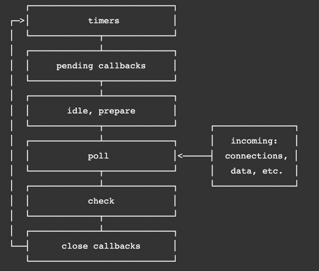

图 8.1-来自 Node 文档的节点事件循环

您还可以将阶段视为异步任务及其回调的类别。

所有框架都有其优势和劣势。Node 的主要优势在于异步 I/O 绑定的可扩展性。因此，Node 最适用于需要许多同时连接的高并发工作负载。在 Node 的后续版本中，从 10.5 开始，Node 团队确实引入了工作线程，以增加运行 CPU 绑定任务的多线程能力，这些任务主要是执行长时间运算。但是，这不是 Node 的主要优势。对于计算密集型工作负载，可能有更好的选择。但由于我们在 Node 的优先级是为我们的 React 前端创建一个高度可扩展的 API，Node 对我们的需求非常适用。

在下一节中，我们将开始深入挖掘 Node，编写 Node 代码，而不使用任何包装库，如 Express 或 Koa。这不仅会让我们更清楚地了解 Node 核心的工作原理，还将帮助我们更好地理解 Node 和 Express 之间的区别。

# 学习 Node 的能力

在上一节中，我们对 Node 是什么以及为什么它如此强大进行了高层次的概念性概述。在本节中，我们将开始利用这种可伸缩性，通过 Node 编写代码。我们将安装 Node，设置一个项目，并开始探索 Node API。

## 安装 Node

在我们可以使用 Node 编写代码之前，我们需要安装它。在前几章中，您可能已经这样做了，但让我们再次回顾如何安装它，因为 Node 经常更新：

1.  前往[`nodejs.org`](https://nodejs.org)。以下截图显示了本书撰写时的页面：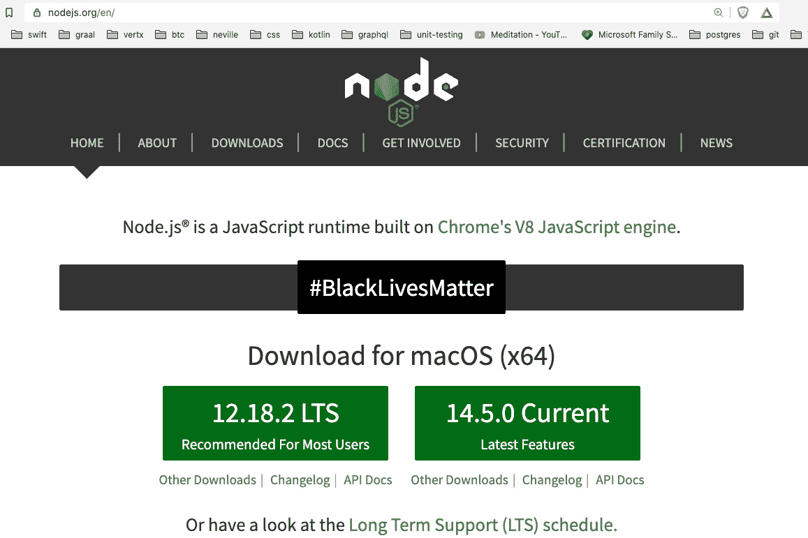

图 8.2 – Node 网站

对于生产使用，您可能希望选择更保守的路线，并使用`npm`包管理器。

1.  一旦您点击您选择的版本，您将被要求保存一个与您的操作系统匹配的安装包。保存该包，然后启动它。然后您应该会看到以下屏幕：

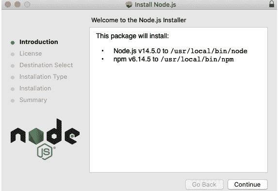

图 8.3 – Node 设置

按照设置窗口的指导完成安装。

很好，现在我们已经安装或更新了我们的 Node 运行时和`npm`包管理器。如前所述，Node 不仅是一个服务器框架，还是一个完整的运行时环境，允许您编写各种不同的应用程序。例如，Node 有一个名为 REPL 的命令行界面。如果您打开命令行或终端并输入`node`，您将看到它转换为接受 JavaScript 命令，就像这样：

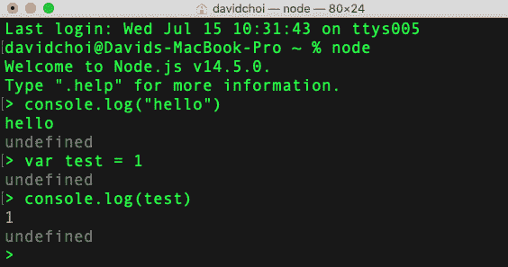

图 8.4 – Node REPL

在本书中，我们将不使用 REPL，但我在这里包含它，以便您知道它的存在，并且可能对您未来的项目有用。您可以在官方文档中了解更多关于 REPL 的信息，[`nodejs.org/api/repl.html#repl_design_and_features`](https://nodejs.org/api/repl.html#repl_design_and_features)。此外，如果您好奇，`undefined`是因为每个命令都没有返回任何内容，在 JavaScript 中，这总是`undefined`。 

好的，现在，让我们创建我们的第一个 Node 应用程序，并探索一些 Node 的更多特性：

1.  打开 VSCode，然后打开到`Chap8`文件夹的终端。

1.  然后，在`Chap8`文件夹中创建一个名为`try-node`的新文件夹。

1.  现在，创建一个名为`app.js`的文件。现在让我们暂时不使用 TypeScript，以便我们可以保持简单。

1.  然后，在`app.js`中添加一个简单的控制台消息，如下所示：

```ts
console.log("hello world");
```

然后运行它：

```ts
node app.js
```

您应该会看到以下输出：

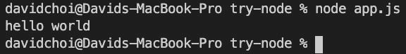

图 8.5 – 运行 app.js

这不是一个特别有用的应用程序，但是正如您所看到的，Node 正在运行标准的 JavaScript 代码。现在，让我们做一些更有用的事情。让我们使用以下步骤访问文件系统：

1.  在同一个`app.js`文件中，删除控制台消息并输入以下代码：

```ts
const fs = require("fs");
```

您可能会对这段代码感到困惑，因为它不是当前的导入风格。但我想在这里包含它，因为很多旧的 Node 代码仍然使用这种 CommonJS 风格的语法来导入依赖项。因此，您应该对此有所了解。

1.  接下来，编写以下代码来创建一个文件，然后读取其内容：

```ts
fs.writeFile("test.txt", "Hello World", () => {
  fs.readFile("test.txt", "utf8", (err, msg) => {
    console.log(msg);
  });
});
```

如果您运行此代码，您将看到以下输出，并在您的`try-node`文件夹中创建一个名为`test.txt`的文件：

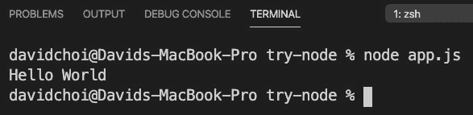

```ts
const fs = require("fs/promises");
(async function () {
  await fs.writeFile("test-promise.txt", "Hello    Promises");
  const readTxt = await fs.readFile("test-promise.txt",    "utf-8");
  console.log(readTxt);
})();
```

请注意，我们正在使用 IIFE 来允许我们进行顶层等待调用。

如果您使用的是较旧版本的 Node，`fs`/Promises 在 11 版本之后变得稳定，因此您可以使用一个名为`promisify`的工具来包装回调式调用，以使它们在`async await`风格中工作。

尽管如此，重要的是您要了解旧的回调式调用，因为这是历史上编写 Node 代码的方式，今天可能仍然有大量的 Node 代码保持这种风格。

1.  我们在代码的顶部看到，我们使用`require`来进行我们的`fs`导入。让我们切换到更新的导入语法。我们需要做两件事：将文件扩展名从`.js`改为`.mjs`，并更新`require`语句如下：

```ts
import fs from "fs";
```

如果再次运行`app.mjs`，您会发现它仍然有效。我们可以在`package.json`中设置配置标志"type"："module"，但是对于这个示例应用程序，我们没有使用`npm`。另外，如果我们全局设置此标志，我们将无法再使用`require`。这可能是一个问题，因为一些较旧的`npm`依赖项仍然使用`require`进行导入。

注意

有一个名为`--experimental-modules`的旧命令行标志，允许使用`import`，但现在已经不推荐使用，应该避免在新版本的 Node 中使用。

## 创建一个简单的 Node 服务器

我们了解到 Node 是基于一些较旧的 JavaScript 技术构建的，如回调和 CommonJS。Node 是在 JavaScript Promise 和 ES6 等更新版本的 JavaScript 之前创建的。尽管如此，Node 仍然运行良好，持续更新，以后，当我们添加额外的库时，我们将能够在大多数情况下使用`async await`和 Promise。

现在，让我们来看一个更现实的 Node 服务器示例。我们将使用`npm`创建一个新项目：

1.  在`Chap8`的根目录下，创建一个名为`node-server`的新文件夹。

1.  进入`node-server`文件夹，并使用以下命令初始化`npm`：

```ts
npm init
```

1.  让我们将我们的包名称命名为`node-server`，并接受其他`package.json`属性的默认值。

1.  在根目录下创建一个名为`server.mjs`的新文件，并添加以下代码：

```ts
import http from "http";
```

别担心，我们很快就会开始使用 TypeScript。现在，让我们保持简单，这样我们就可以专注于学习 Node。

1.  我们从 Node 核心导入了`http`库。然后我们使用`createServer`来创建一个服务器对象。请注意，我们的`createServer`函数接受一个函数作为参数，带有两个参数。参数`req`和`res`分别是`Request`和`Response`类型。`Request`对象将具有与我们的用户所做的请求相关的所有成员，而响应允许我们在发送回去之前修改我们的响应。

在我们的`createServer`处理程序函数的末尾，我们通过使用`res.end`显式结束我们的调用并返回文本。如果我们没有发送`end`，我们的响应将永远不会完成，浏览器上也不会出现任何内容：

```ts
const server = http.createServer((req, res) => {
  console.log(req);
  res.end("hello world");
});
```

1.  最后，我们使用我们的新服务器对象来等待并监听新的请求，使用带有端口号和回调函数的`listen`函数打印服务器已启动：

```ts
const port = 8000;
server.listen(port, () => {
  console.log(`Server started on port ${port}`);
});
```

1.  通过执行我们的`server.mjs`脚本来运行此代码（确保使用正确的扩展名`.mjs`）：

```ts
node server.mjs
```

请记住，在我们工作时，当前没有自动重新加载功能。因此，在代码更改时，我们将不得不手动停止和重新启动。随着我们继续向我们的项目添加更多功能，我们将稍后添加这个功能。

1.  如果你打开浏览器到`http://localhost:8000`，你应该在浏览器中看到**hello world**，并在控制台中看到以下内容：

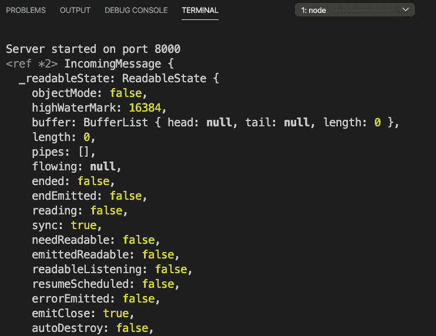

图 8.7 - 第一个 node 服务器运行

终端显示了`req`对象及其成员。当然，我们很快将更详细地介绍`Request`和`Response`。

另一个有趣的事情是，无论我们给出什么 URL，它总是返回相同的**hello world**文本。这是因为我们没有实现任何路由处理。处理路由是我们必须学习的另一项内容，以便正确使用 Node。

您可以不断刷新浏览器，服务器将继续以**hello world**进行响应。正如您所看到的，服务器保持运行，无论我们发送多少请求，而不像典型的脚本程序一样返回并结束。这是因为事件循环，Node 的核心，是一种无限循环，将继续等待新任务并忠实地处理它们。

恭喜，您现在已经运行了您的第一个 Node 服务器！毫无疑问，这只是一个谦卑的开始，但是您现在可以进行真正的浏览器调用，我们的服务器将做出响应。所以，您已经走上了正道。

## 请求和响应

当来自浏览器的请求到达服务器时，所有服务器框架通常都会有两个对象：`Request`和`Response`。这两个对象代表了来自浏览器的请求的相关数据，以及将返回给它的响应。让我们从浏览器的角度来看看这些对象是由什么组成的。重新加载您的浏览器，但这次在`Network`选项卡上打开 Chrome 开发工具：

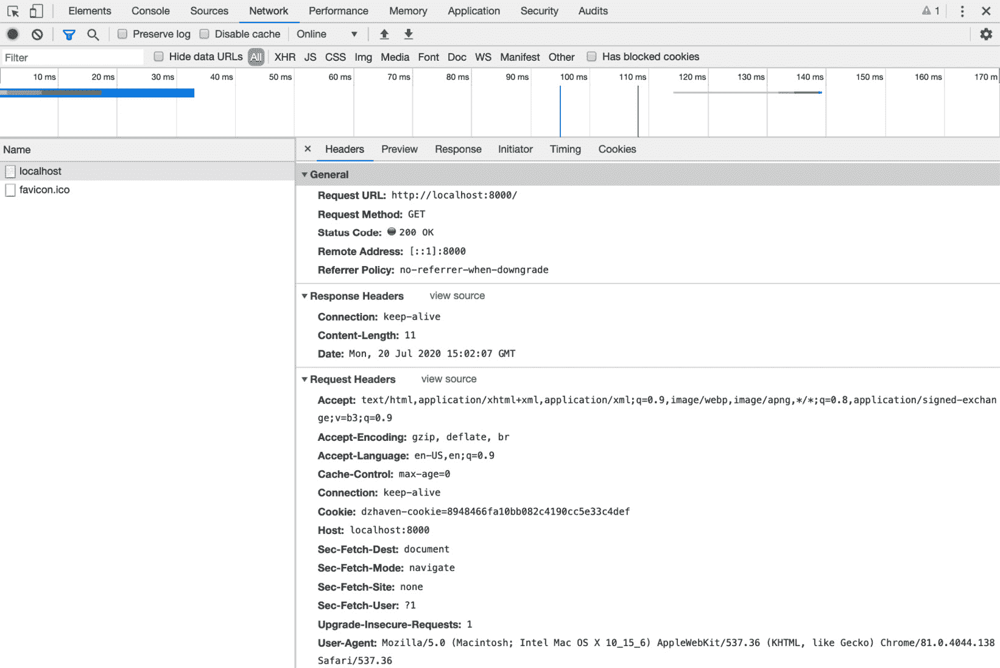

图 8.8 – Chrome 开发工具网络选项卡

这个视图只是从浏览器的角度来看的，在 Node 中，这些对象中有更多的信息。然而，我们需要首先了解一个网络请求由什么组成，然后才能尝试创建任何真正的网络服务器。因此，让我们列出一些更重要的项目，并描述它们的含义。

### 请求 URL

显然，这代表了发送到服务器的完整 URL 路径。但服务器需要知道完整路径的原因是，URL 中通常会发送大量附加信息。例如，如果我们的 URL 是`http://localhost:8000/home?userid=1`，实际上这里有相当多的信息。首先，我们告诉服务器我们要在`home`子目录中寻找网页或 API 数据。这使得服务器能够根据 URL 返回响应，只返回 HTML 页面或特定于该 URL 的数据。此外，我们传递了一个名为`userid`的参数（参数在问号后开始，多个参数可以用`&`符号分隔），服务器可以使用该参数在请求中提供唯一的数据。

### 请求方法

请求方法表示所谓的 HTTP 动词。动词只是一个描述，告诉服务器客户端打算执行什么操作。默认动词是 GET，这意味着，正如名称所示，浏览器想要读取一些数据。其他动词是 POST，表示创建或插入，PUT 表示更新，然后 DELETE 表示删除。在*第九章*，*什么是 GraphQL？*中，我们将看到 GraphQL 只使用 POST 方法，但这实际上不是错误，因为动词不是硬性规则，而更像是指导方针。还有一件事需要注意的是，当使用 GET 时，所需的任何参数将在 URL 中提供，就像请求 URL 的项目示例所示的那样。然而，对于 POST，参数将在请求的正文中提供。我们将在*学习 Express 功能*部分更详细地讨论这些差异。

### 状态码

所有网络请求都将返回这些代码以指示请求的结果。例如，状态码`200`表示成功。我不会在这里列出所有的状态码，但我们应该了解一些最常见的状态码，因为有时这可能有助于调试：

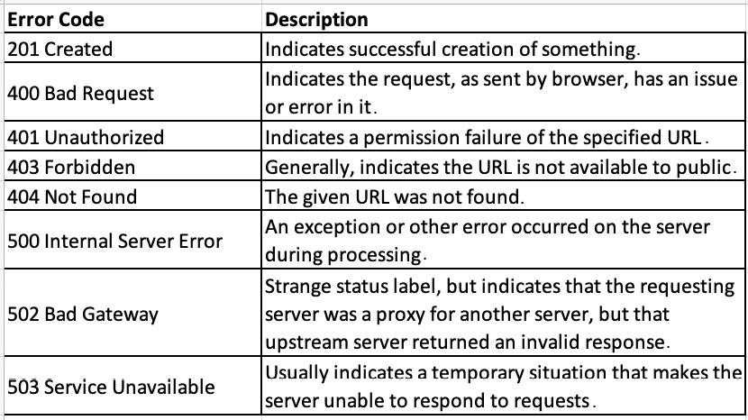

图 8.9 – 错误代码

### 标头

标头提供了额外的信息，充当描述或元数据。如图所示，有多种类型的标头：通用、请求、响应和实体。再次强调，我不会涵盖所有的标头，但有一些我们应该熟悉。以下是请求标头：

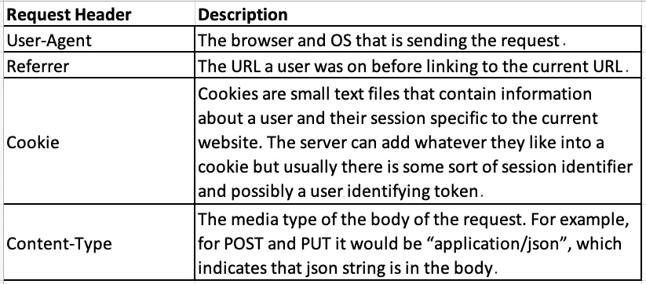

图 8.10 – 请求标头

以下是响应标头：

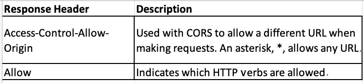

图 8.11 – 响应标头

当然，这只是干燥的信息。然而，了解制作这些请求和响应所涉及的内容有助于我们更好地理解网络的工作原理，因此编写更好的网络应用程序。现在让我们更深入地看一下路由。

## 路由

在某种意义上，路由有点像向服务器传递参数。当服务器看到特定的路由时，它会知道响应需要以某种特定的方式进行。响应可以是返回一些特定的数据或将数据写入数据库，但有了路由，我们可以管理服务器对每个请求的行为方式。

让我们在 Node 中进行一些路由处理：

1.  像这样在`node-server`项目的`server.mjs`文件中更新`server`对象：

```ts
const server = http.createServer((req, res) => {
  if (req.url === "/") {
    res.end("hello world");
  } else if (req.url === "/a") {
    res.end("welcome to route a");
  } else if (req.url === "/b") {
    res.end("welcome to route b");
  } else {
    res.end("good bye");
  }
});
```

如你所见，我们获取`req.url`字段并将其与几个 URL 进行比较。对于每一个匹配的 URL，我们用一些独特的文本结束我们的响应。

1.  再次运行服务器并尝试每个路由。例如，如果你的路由是`http://localhost:8000/a`，那么你应该看到这个：

图 8.12 - 路由/a

1.  好的，现在让我们看看如果我们收到一个 POST 请求会发生什么。像这样更新你的`createServer`函数：

```ts
const server = http.createServer((req, res) => {
  if (req.url === "/") {
    res.end("hello world");
  } else if (req.url === "/a") {
    res.end("welcome to route a");
  } else if (req.url === "/b") {
    res.end("welcome to route b");
  } else if (req.url === "/c" && req.method === "POST") {
    let body = [];
    req.on("data", (chunk) => {
      body.push(chunk);
    });
    req.on("end", () => {
      const params = Buffer.concat(body);
      console.log("body", params.toString());
      res.end(`You submitted these parameters: 
       ${params.toString()}`);
    });
  } else {
    res.end("good bye");
  }
});
```

正如你所看到的，我们添加了另一个带有`/c`路由和`POST`方法类型的`if else`语句。你可能会惊讶地发现，为了从我们的调用中获取发布的数据，我们需要处理`data`事件，然后处理`end`事件，以便我们可以返回调用。

让我解释一下这是怎么回事。Node 是非常低级的，这意味着它不会隐藏其复杂的细节以使事情变得更容易，以便更高效。因此，当发出请求并向服务器发送一些信息时，这些数据将作为流发送。这只是意味着数据不是一次性发送的，而是分成片段发送的。Node 不会向开发人员隐藏这一事实，并使用事件系统来接收数据的块，因为一开始不清楚有多少数据要进来。然后，一旦接收完这些数据，`end`事件就会触发。

在这个示例中，`data`事件用于将我们的数据聚合到一个数组中。然后，`end`事件用于将该数组放入内存缓冲区，然后可以作为一个整体进行处理。在我们的情况下，它只是 JSON，所以我们将其转换为字符串。

1.  为了测试这个，让我们使用`curl`提交一个 POST 请求。`curl`只是一个命令行工具，允许我们在不使用浏览器的情况下进行 web 服务器请求。这对测试很有用。在你的终端中执行以下代码（如果你在 Windows 上，你可能需要先安装`curl`；在 macOS 上，它应该已经存在）：

```ts
curl --header "Content-Type: application/json"  --request POST --data '{"userid":"1","message":"hello"}' "http://localhost:8000/c"
```

你应该得到以下返回：

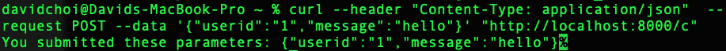

图 8.13 - curl POST 的结果

显然，所有这些都有效，但从开发生产力的角度来看并不理想。我们不希望在单个`createServer`函数中有 30 个这样的`if else`语句。这很难阅读和维护。我们将看到 Express 如何帮助我们避免这些问题，它提供了额外的封装来加快开发速度并提高可靠性。我们将在*了解 Express 如何改进 Node 开发*部分看到这一点。让我们先了解一些工具来帮助我们的 Node 编码。

## 调试

就像我们在 React 中看到的那样，调试器是一个非常重要的工具，可以帮助我们排除代码中的问题。当然，在 Node 的情况下，我们不能使用浏览器工具，但 VSCode 确实有一个内置的调试器，可以让我们在代码上断点并查看值。让我们来看看这个，因为我们也将在 Express 中使用它：

1.  点击 VSCode 中的调试器图标，你会看到以下屏幕。在撰写本文时的当前版本中，它看起来是这样的：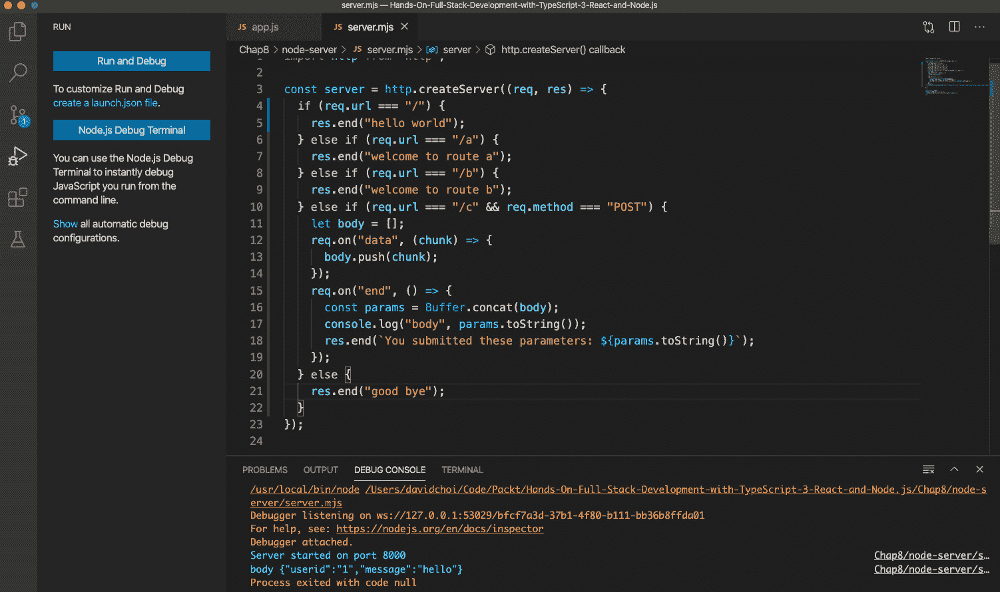

图 8.14 - VSCode 调试器菜单

第一个按钮运行调试器，第二个显示终端的调试器版本。运行调试器时，通常希望查看调试器控制台，因为它可以显示运行时发生的错误。

1.  运行 VSCode 调试器时，你需要点击`npm start`命令：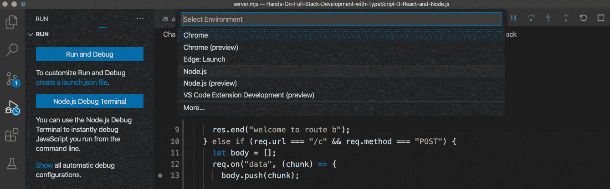

图 8.15 - Node.js 调试器选择

1.  一旦启动调试器，如果您通过单击任何行号旁边设置了断点，您将能够在那里使代码暂停。然后，您可以查看与该范围相关的值：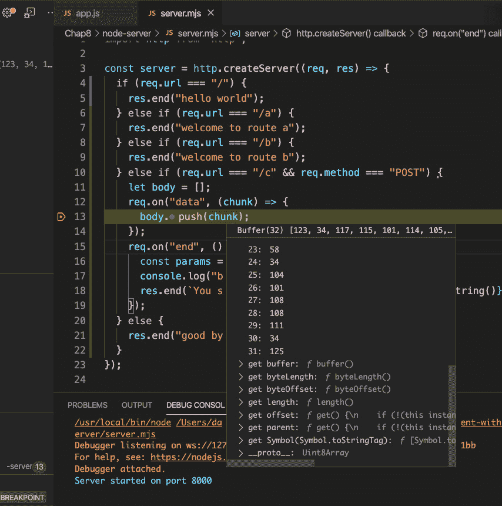

图 8.16 – 行视图中断

正如您所见，我们已在`data`事件中的第 13 行设置了断点，并且能够查看当前块。点击继续按钮或点击*F5*继续运行程序。

1.  悬停在断点上的值是有用的，但并不是帮助调试我们的应用程序的唯一方法。我们还可以使用调试器屏幕来帮助我们了解我们在断点停止时的值是什么。看一下下面的截图：

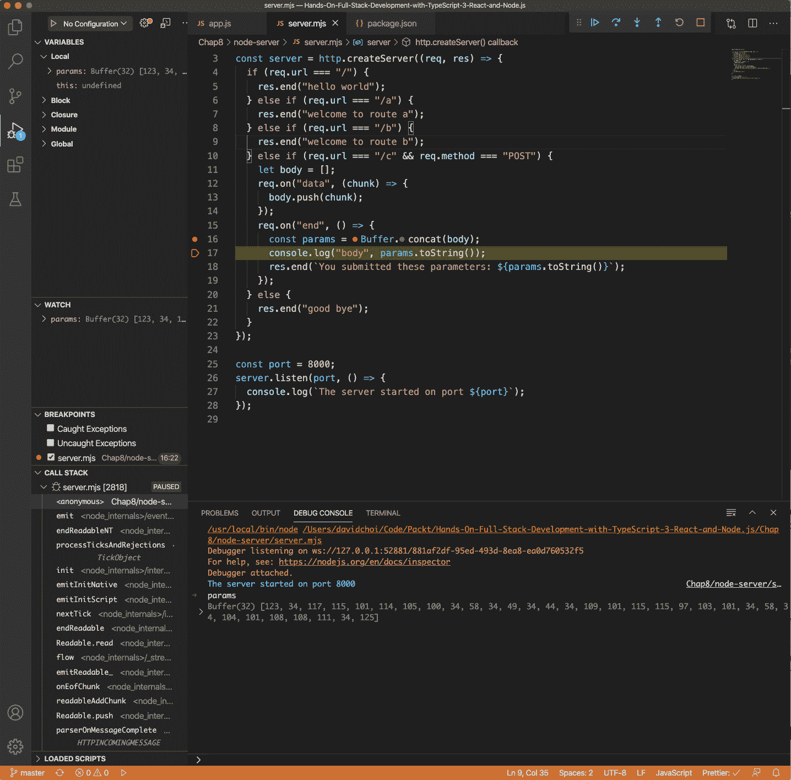

图 8.17 – 调试窗口全景视图

看看我们的断点，截图中间。我们可以看到我们已经在`end`事件处理程序范围内中断。让我们看一下列出的一些功能：

+   从左上角菜单开始，称为`params`和`this`。同样，我们正在查看`end`事件，这就是为什么我们只有这两个变量。

+   在中间左侧，有`params`，我添加了。在这个部分中有一个加号，允许我们添加我们感兴趣的变量，当它们进入范围时，当前值将显示在那里。

+   然后，在左下角，我们看到**CALL STACK**。调用堆栈是我们程序正在运行的调用列表。列表将以相反的顺序显示，最后一个命令位于顶部。通常，这些调用中的许多将是来自 Node 或我们自己没有编写的其他框架的代码。

+   然后，在右下角，我们有我们的`params`变量和其缓冲区被显示。

+   最后，在右上角，我们看到了调试继续按钮。左侧的第一个按钮是继续按钮，它会从上一个断点继续运行我们的应用程序。接下来是步过按钮，它将转到下一个立即行并在那里停止。接下来是步入按钮，它将在函数或类的定义内部运行。然后是步出按钮，它将使您退出并返回到父调用者。最后，方形按钮完全停止我们的应用程序。

这是对 VSCode 调试器的一个快速介绍。随着我们进入 Express，然后稍后使用 GraphQL，我们将会更多地使用它。

现在，正如您所见，每次进行任何更改时都必须手动重新启动 Node 服务有点麻烦并且会减慢开发速度。因此，让我们使用一个名为`nodemon`的工具，它将在保存脚本更改时自动重新启动我们的 Node 服务器：

1.  通过运行以下命令全局安装`nodemon`：

```ts
nodemon to our entire system. Installing it globally allows all apps to run nodemon without needing to keep installing it. Note that on macOS and Linux, you may need to prefix this command with sudo, which will elevate your rights so that you can install it globally.
```

1.  现在，我们希望在应用程序启动时启动它。通过找到`"scripts"`部分并添加一个名为`"start"`的子字段，然后将以下命令添加到`package.json`文件中：

```ts
package.json "scripts" section should look like this now: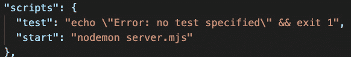Figure 8.18 – package.json "scripts" section
```

1.  现在，使用以下命令运行新脚本：

```ts
npm command, you need to run npm run <file name>. However, for start scripts, we can skip the run sub-command.You should see the app start up as usual.
```

1.  现在应用程序正在运行，让我们尝试更改并保存`server.mjs`文件。将`listen`函数中的字符串更改为``The server started on port ${port}``。保存此更改后，您应该看到 Node 重新启动并在终端上显示新文本。

1.  `package.json` 中的设置不会影响我们的 VSCode 调试器。因此，为了设置自动重启，我们需要进行设置。再次转到调试器菜单，点击`configurations`字段是一个数组，这意味着您可以继续向这个文件添加配置。但是对于我们的配置，请注意`type`是`node`，当然。我们还将`name`更新为`"Launch node-server Program"`。但是，请注意，我们将`runtimeExecutable`切换为`nodemon`而不是`node`，`console`现在是集成终端。为了在调试器中使用`nodemon`，我们必须切换到**TERMINAL**选项卡，而不是调试器控制台。

1.  现在我们至少有一个`launch.json`配置，我们的调试菜单将显示以下视图：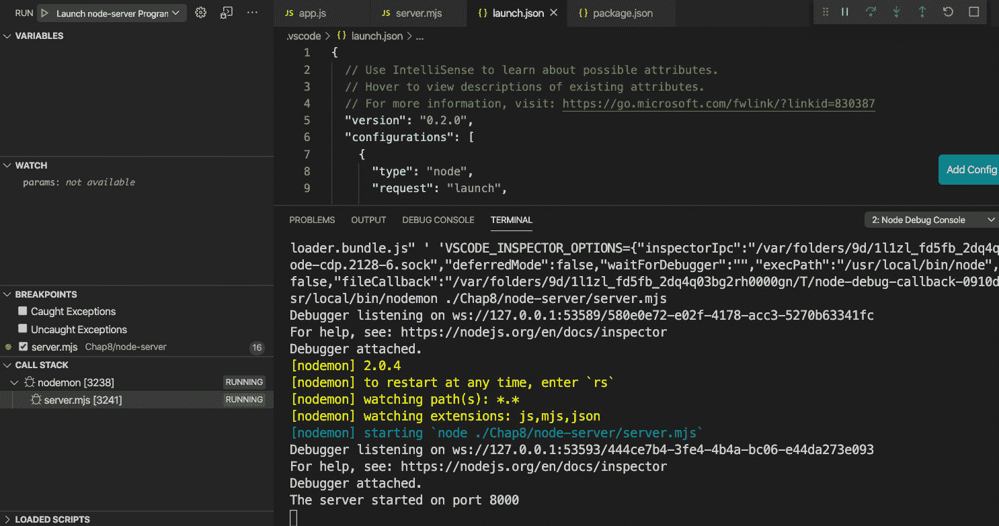

图 8.20 - 从 launch.json 调试器

如果您的下拉菜单没有显示**启动 node-server 程序**，请选择它，然后按播放按钮。然后，您应该再次看到调试器启动，只是这次它将自动重新启动。

1.  现在，尝试进行小的更改，调试器应该会自动重新启动。我从`listen`函数的日志消息中删除了`T`：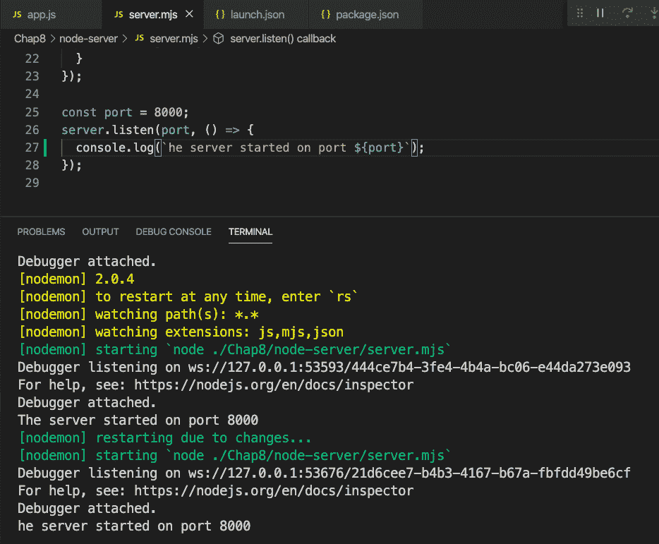

图 8.21 - 调试器自动重新启动

1.  太好了，现在我们可以轻松地中断和调试我们的 Node 代码！

这是一次快速介绍一些将有助于我们开发和调试的工具。

在本节中，我们学习了直接使用 Node 来编写我们的服务器。我们还学习了调试和工具，以改进我们的开发流程。直接使用 Node 进行编码可能会耗费时间，也不直观。在接下来的几节中，我们将学习 Express 以及它如何帮助我们改进 Node 开发体验。

# 了解 Express 如何改进 Node 开发

正如我们所见，直接使用 Node 进行编码具有一种笨拙和繁琐的感觉。拥有一个更易于使用的 API 将使我们更加高效。这就是 Express 框架尝试做的事情。在本节中，我们将学习 Express 是什么，以及它如何帮助我们更轻松地为我们的 Node 应用程序编写代码。

Express 不是一个独立的 JavaScript 服务器框架。它是一个代码层，位于 Node 之上，因此使用 Node 来使使用 Node 开发 JavaScript 服务器变得更加容易和更有能力。就像 Node 一样，它有自己的核心功能，然后通过依赖包提供一些额外的功能。Express 也有其核心能力以及提供额外功能的丰富中间件生态系统。

那么，Express 是什么？根据网站的说法，Express 只是一系列中间件调用的应用程序。让我们首先通过查看图表来解释这一点：

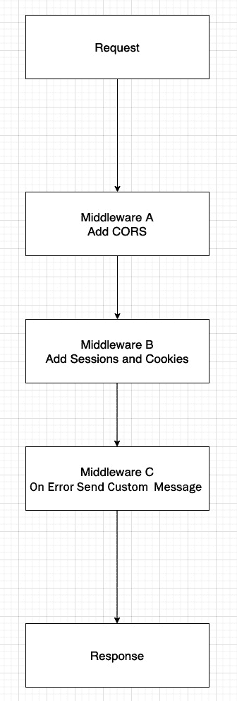

图 8.22 - Express 请求响应流程

每当有新的服务器请求到来时，它都会沿着顺序路径进行处理。通常，您只会有一个请求，一旦请求被理解和处理，您就会得到一些响应。然而，当使用 Express 时，您可以有多个中间函数插入到过程中并进行一些独特的工作。

因此，在*图 8.22*中所示的示例中，我们首先看到添加了 CORS 功能的中间件，这是一种允许来自与服务器所在的 URL 域不同的 URL 域的请求的方式。然后，我们有处理会话和 cookie 的中间件。会话只是关于用户当前使用网站的唯一数据 - 例如，他们的登录 ID。最后，我们看到一个处理错误的处理程序，它将根据发生的错误确定将显示的一些唯一消息。当然，您可以根据需要添加更多的中间件。这里的关键点是 Express 以相当简单的方式使 Node 通常不具备的额外功能注入成为可能。

除了这个中间件的能力之外，Express 还为`Request`和`Response`对象添加了额外的功能，进一步增强了开发人员的生产力。我们将在下一节中查看这些功能，并进一步探索 Express。

# 学习 Express 的能力

Express 基本上是 Node 的中间件运行器。但是，就像生活中的大多数事情一样，简单的解释很少提供必要的信息来正确使用它。因此，在本节中，我们将探索 Express，并通过示例了解其功能。

让我们将 Express 安装到我们的`node-server`项目中。在终端中输入以下命令：

```ts
npm I express -S
```

这将给你一个更新后的`package.json`文件，其中有一个新的依赖项部分：

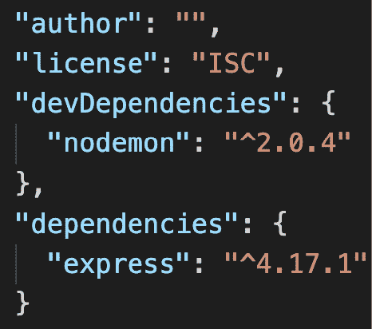

图 8.23 – 更新的 package.json

现在，在我们开始编写代码之前，我们需要了解一些事情。再次提到，Express 是 Node 的封装。这意味着 Express 已经在内部使用了 Node。因此，当我们使用 Express 编写代码时，我们不会直接调用 Node。让我们看看这是什么样子的：

1.  创建一个名为`expressapp.mjs`的新服务器文件，并将以下代码添加到其中：

```ts
import express from "express";
const app = express();
app.listen({ port: 8000 }, () => {
  console.log("Express Node server has loaded!");
});
```

正如你所看到的，我们创建了一个`express`实例，然后在其上调用了一个名为`listen`的函数。在内部，`express.listen`函数调用了 Node 的`createServer`和`listen`函数。如果你运行这个文件，你将会看到以下日志消息：

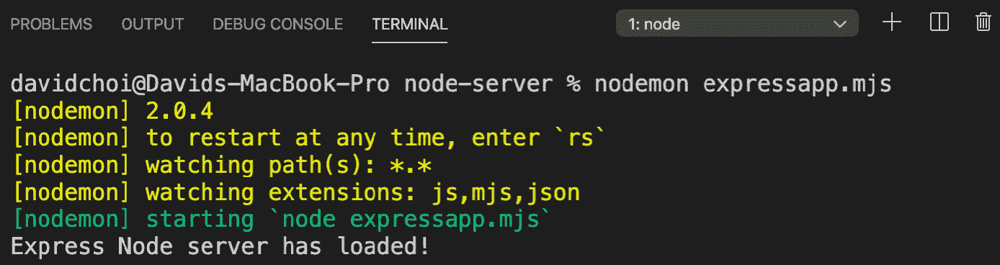

图 8.24 – 运行 expressapp.mjs 文件

因此，现在我们有一个正在运行的 Express 服务器。但是，在添加一些中间件之前，它什么也不做。Express 的中间件运行在几个主要的伞形或部分下。有一些中间件是为整个应用程序运行的，有一些是仅在路由期间运行的，还有一些是在错误时运行的。Express 还有一些内部使用的核心中间件。当然，我们可以使用`npm`包提供的第三方中间件，而不是实现我们自己的中间件代码。我们已经在前一节*理解 Express 如何改进 Node 开发*中的*图 8.22*中看到了其中一些。

1.  让我们从添加我们自己的中间件开始。使用以下代码更新`expressapp.mjs`：

```ts
import express from "express";
const app = express();
app.use((req, res, next) => {
  console.log("First middleware.");
  next();
});
app.use((req, res, next) => {
  res.send("Hello world. I am custom middleware.");
});
app.listen({ port: 8000 }, () => {
  console.log("Express Node server has loaded!");
});
```

因此，对于这个第一个例子，我们决定使用`app`对象上的应用级中间件，通过在`app`对象上使用`use`函数。这意味着无论路由如何，对于整个应用程序的任何请求，都必须处理这两个中间件。

让我们逐个来。首先，注意所有中间件都是按照在代码中声明的顺序进行处理的。其次，除非在中间件的最后结束调用，否则我们必须调用`next`函数去到下一个中间件，否则处理将会停止。

第一个中间件只是记录一些文本，但第二个中间件将使用 Express 的`send`函数在浏览器屏幕上写入内容。`send`函数很像 Node 中的`end`函数，因为它结束了处理，但它还发送了一个`text/html`类型的内容类型头。如果我们使用 Node，我们将不得不自己显式地发送头。

1.  现在，让我们为路由添加中间件。请注意，从技术上讲，你可以将路由（例如`/routea`路由）传递给`use`函数。然而，最好使用`router`对象，并将我们的路由包含在一个容器下。在 Express 中，路由器也是中间件。让我们看一个例子：

```ts
import express from "express";
const router = express.Router();
```

首先，我们从`express.Router`类型创建了我们的新`router`对象：

```ts
const app = express();
app.use((req, res, next) => {
  console.log("First middleware.");
  next();
});
app.use((req, res, next) => {
  res.send("Hello world. I am custom middleware.");
});
app.use(router);
```

因此，我们像之前一样将相同的一组中间件添加到了`app`对象中，使其在所有路由上全局运行。但是，我们还将`router`对象作为中间件添加到了我们的应用中。然而，路由器中间件只对定义的特定路由运行：

```ts
router.get("/a", (req, res, next) => {
  res.send("Hello this is route a");
});
router.post("/c", (req, res, next) => {
  res.send("Hello this is route c");
});
```

因此，我们再次向我们的`router`对象添加了两个中间件：一个用于`/a`路由，使用`get`方法函数，另一个用于`/c`路由，使用`post`方法函数。同样，这些函数代表了可能的 HTTP 动词。`listen`函数调用与之前相同：

```ts
app.listen({ port: 8000 }, () => {
  console.log("Express Node server has loaded!");
});
```

现在，如果我们通过访问以下 URL 运行这段代码：`http://localhost:8000/a`，将会发生一个奇怪的事情。所有调用都将在那里结束，不会继续到下一个中间件。

删除发送`Hello world…`消息的第二个`app.use`调用，尝试访问`http://localhost:8000/a`。现在你应该看到以下消息：

![图 8.25 – 路由/a 的中间件

]（img/Figure_8.25_B15508.jpg）

图 8.25-路由/ a 的中间件

很好，那起作用了，但现在尝试使用浏览器转到`http://localhost:8000/c`。那起作用吗？不，它不起作用，您会得到`/c`路由只能是 POST 路由。如果您打开终端并运行我们在*学习节点的功能*部分中使用的最后一个 POST `curl`命令，您会看到这个：

！[图 8.26-路由/ c

]（img/Figure_8.26_B15508.jpg）

图 8.26-路由/ c

正如您所看到的，我们收到了适当的文本消息。

1.  现在，让我们添加第三方中间件。在*学习节点的功能*部分，我们看到了如何解析 POST 数据以及使用 Node 可能会有多么艰难。对于我们的示例，让我们使用 body parser 中间件来使这个过程更容易。更新代码如下：

```ts
import express from "express";
/c route handler so that its text message shows the value passed in the message field:

```

app.use（（req，res，next）= > {

控制台.log("第一个中间件。");

下一个；

}）;

app.use（路由器）;

路由器获取("/a"，（req，res，next）= > {

res.send("您好，这是路由 a");

}）;

路由器.post("/c"，（req，res，next）= > {

res.send(`您好，这是路由 c。消息是

${数据和结束。

```ts

```

1.  现在，最后，让我们做一个错误中间件。只需在`bodyParser.json()`中间件调用下面添加以下代码：

```ts
import express from "express";
import bodyParser from "body-parser";
const router = express.Router();
const app = express();
app.use(bodyParser.json());
app.use((req, res, next) => {
  console.log("First middleware.");
  throw new Error("A failure occurred!");
});
```

然后，我们从我们的第一个自定义中间件中抛出一个错误：

```ts
app.use(router);
router.get("/a", (req, res, next) => {
  res.send("Hello this is route a");
});
router.post("/c", (req, res, next) => {
  res.send(`Hello this is route c. Message is ${req.body.   message}`);
});
app.use((err, req, res, next) => {
  res.status(500).send(err.message);
});
```

现在，我们已经将我们的错误处理程序添加为代码中的最后一个中间件。此中间件将捕获以前未处理的所有错误并发送相同的状态和消息：

```ts
app.listen({ port: 8000 }, () => {
  console.log("Express Node server has loaded!");
});
```

1.  转到`http://localhost:8000/a`，您应该看到以下消息：

！[图 8.27-错误消息

]（img/Figure_8.27_B15508.jpg）

图 8.27-错误消息

由于我们的顶级中间件抛出异常，所有路由都将抛出此异常，因此将被我们的错误处理程序中间件捕获。

这是 Express 框架及其功能的概述。正如您所看到的，它可以使使用 Node 变得更加简单和清晰。在下一节中，我们将看看如何使用 Express 和 Node 构建返回 JSON 的 Web API，这是 Web 的默认数据模式。

# 使用 Express 创建 Web API

在本节中，我们将学习有关 Web API 的知识。目前，它是提供 Web 上数据的最流行方式之一。在我们的最终应用程序中，我们将不使用 Web API，因为我们打算使用 GraphQL。但是，了解 Web API 设计是很好的，因为在互联网上，它非常常用，并且在 GraphQL 的内部也类似地工作。

什么是 Web API？ **API**代表**应用程序编程接口**。这意味着这是一个编程系统与另一个系统进行交互的方式。因此，Web API 是使用 Web 技术向其他系统提供编程服务的 API。Web API 以字符串形式发送和接收数据，而不是二进制数据，通常以 JSON 格式。

所有 Web API 都将具有由 URI 表示的端点，基本上与 URL 相同。此路径必须是静态的，不得更改。如果需要更改，则预期 API 供应商将进行版本更新，保留旧的 URI 并创建由版本升级界定的新 URI。例如，如果 URI 从`/api/v1/users`开始，那么下一个迭代将是`/api/v2/users`。

让我们为演示目的创建一个简单的 Web API：

1.  让我们使用以下新路由更新我们的`expressapp.mjs`文件：

```ts
import express from "express";
import bodyParser from "body-parser";
const router = express.Router();
const app = express();
app.use(bodyParser.json());
app.use((req, res, next) => {
  console.log("First middleware.");
  /api/v1/users path. This type of pathing is fairly standard for web APIs. It indicates the version and a related container of data to query – in this case, users. For example purposes, we are using a hardcoded array of users and finding only one with a matching ID. Since id is a number and anything coming from req.query is a string, we are using == as opposed to ===. If you load the browser to the URI, you should see this: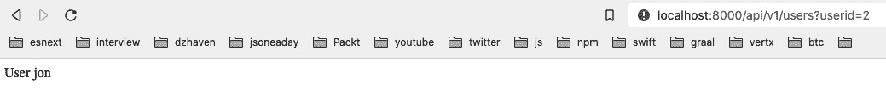Figure 8.28 – User GET requestAs you can see, our second user, `jon`, is returned.
```

1.  接下来，对于此中间件，我们对组进行了几乎相同的操作。请注意资源路径之间的路径设置在两者之间是一致的。这是 Web API 的一个重要特性。同样，我们从数组中获取一个项目，但在这种情况下，我们使用了 POST 方法，因此参数是从正文中获取的：

```ts
router.post("/api/v1/groups", (req, res, next) => {
  const groups = [
    {
      id: 1,
      groupname: "Admins",
    },
    {
      id: 2,
      groupname: "Users",
    },
    {
      id: 3,
      groupname: "Employees",
    },
  ];
  const group = groups.find((grp) => grp.id == req.body.   groupid);
  res.send(`Group ${group.groupname}`);
});
```

如果您运行终端命令到此 URI，您应该会看到以下内容：

！[图 8.29-组 POST 请求

]（img/Figure_8.29_B15508.jpg）

图 8.29-组 POST 请求

如所示，我们返回了第一个组`Admins`。其余代码相同：

```ts
app.use((err, req, res, next) => {
  res.status(500).send(err.message);
});
app.listen({ port: 8000 }, () => {
  console.log("Express Node server has loaded!");
});
```

重要说明

由于 Web API 特定于 Web 技术，它支持使用所有的 HTTP 方法进行调用：GET、POST、PATCH、PUT 和 DELETE。

这是一个关于使用 Express 和 Node 构建 Web API 的快速介绍。我们现在对 Node 及其最重要的框架 Express 有了一个广泛的概述。

# 总结

在本章中，我们学习了 Node 和 Express。Node 是驱动网络服务器的核心服务器端技术，Express 是构建 Web 应用程序的最流行和经常使用的基于 Node 的框架。我们现在对前端和后端技术如何共同创建网站有了完整的了解。

在下一章中，我们将学习 GraphQL，这是一种非常流行且相对较新的标准，用于创建基于 Web 的 API 服务。一旦我们掌握了这个知识，我们就可以开始构建我们的项目了。
