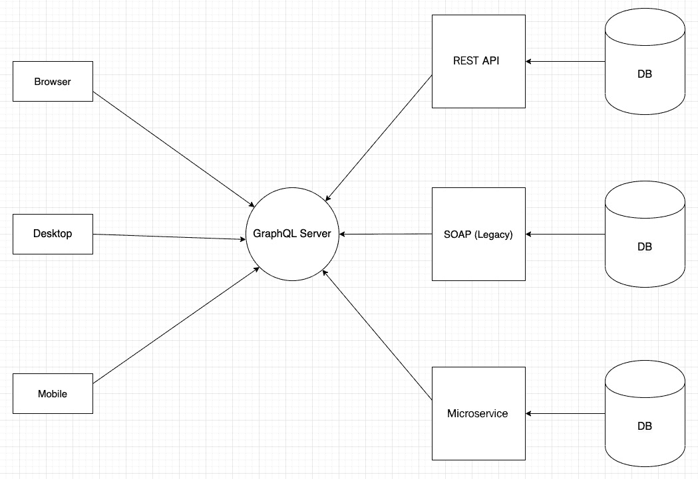
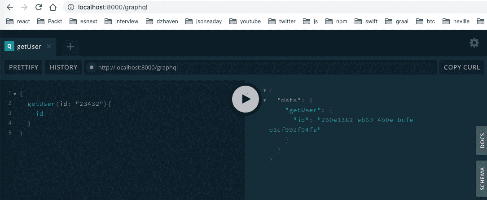
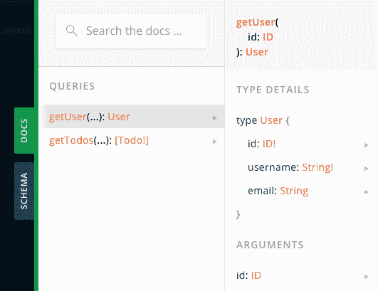
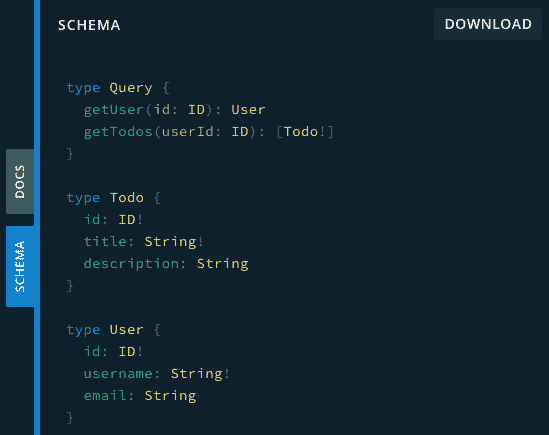
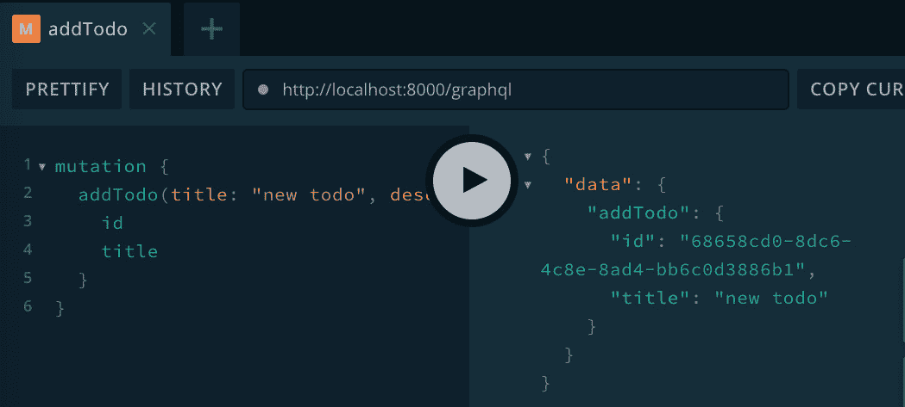
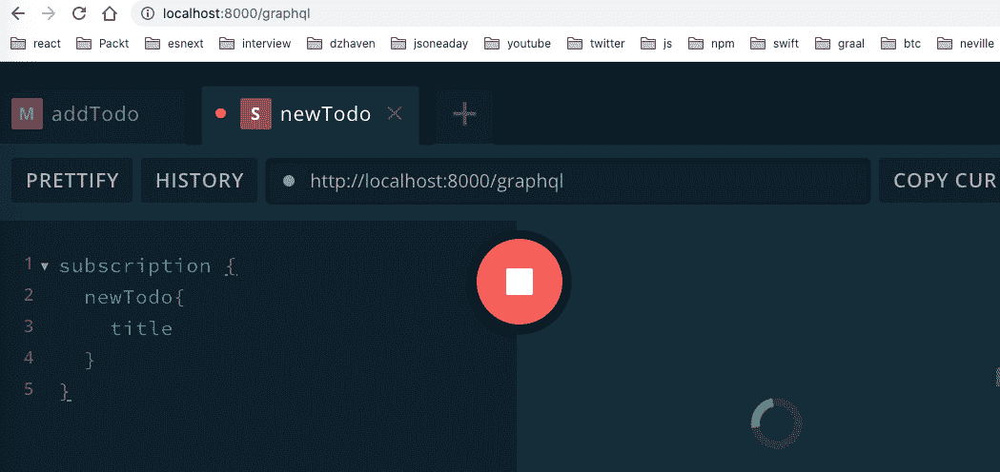
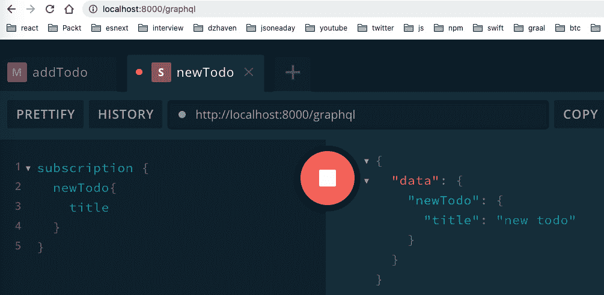

# 第九章：什么是 GraphQL？

在本章中，我们将学习 GraphQL，这是目前最热门的 web 技术之一。许多大公司已经采用了 GraphQL 作为他们的 API，包括 Facebook、Twitter、纽约时报和 GitHub 等公司。我们将学习 GraphQL 为什么如此受欢迎，它内部是如何工作的，以及我们如何利用它的特性。

在本章中，我们将涵盖以下主要主题：

+   理解 GraphQL

+   理解 GraphQL 模式

+   理解类型定义和解析器

+   理解查询、变异和订阅

# 技术要求

你应该对使用 Node 进行 web 开发有基本的了解。我们将再次使用 Node 和 Visual Studio Code。

GitHub 存储库位于[`github.com/PacktPublishing/Full-Stack-React-TypeScript-and-Node`](https://github.com/PacktPublishing/Full-Stack-React-TypeScript-and-Node)。使用`Chap9`文件夹中的代码。

要设置`Chap9`代码文件夹，转到你的`HandsOnTypescript`文件夹并创建一个名为`Chap9`的新文件夹。

# 理解 GraphQL

在本节中，我们将探讨 GraphQL 是什么，为什么它被创建以及它试图解决什么问题。了解 GraphQL 存在的根本原因很重要，因为它将帮助我们设计更好的 web API。

那么，GraphQL 是什么？让我们列举一些它的主要特点：

+   **GraphQL 是 Facebook 开发的数据模式标准。**

GraphQL 提供了一个标准语言来定义数据、数据类型和相关数据查询。你可以把 GraphQL 大致类比为提供合同的接口。那里没有代码，但你仍然可以看到可用的类型和查询。

+   **GraphQL 跨平台、框架和语言运行。**

当我们使用 GraphQL 创建 API 时，无论我们使用什么编程语言或操作系统，都将使用相同的 GraphQL 语言来描述我们的数据、类型和查询。在各种系统和平台上拥有一致可靠的数据表示当然对客户端和系统来说是一件好事。但对程序员来说也是有益的，因为我们可以继续使用我们正常的编程语言和选择的框架。

+   **GraphQL 将查询的控制权交给调用者。**

在标准 web 服务中，是服务器控制返回的数据字段。然而，在 GraphQL API 中，是客户端确定他们想要接收哪些字段。这给客户端更好的控制权，减少了带宽使用和成本。

广义上说，GraphQL 端点有两个主要用途。一个是作为整合其他数据服务的网关，另一个是作为直接从数据存储接收数据并提供给客户端的主要 web API 服务。下面是一个使用 GraphQL 作为其他数据网关的图表：



图 9.1 - GraphQL 作为网关

正如你所看到的，GraphQL 作为所有客户端的唯一真相来源。它在这方面表现良好，因为它是基于标准的语言，支持各种系统。

对于我们自己的应用程序，我们将把它用作我们整个的 web API，但也可以将其与现有的 web 服务混合在一起，以便 GraphQL 仅处理正在进行的部分服务调用。这意味着你不需要重写整个应用程序。你可以逐渐有意识地引入 GraphQL，只在有意义的地方这样做，而不会干扰你当前的应用程序服务。

在这一部分，我们从概念层面上了解了 GraphQL。GraphQL 有自己的数据语言，这意味着它可以在不同的服务器框架、应用程序编程语言或操作系统上使用。这种灵活性使得 GraphQL 成为在整个组织甚至整个网络中共享数据的强大手段。在下一部分中，我们将探索 GraphQL 模式语言并了解它是如何工作的。这将帮助我们构建我们的数据模型并了解如何设置我们的 GraphQL 服务器。

# 理解 GraphQL 模式

正如所述，GraphQL 是一种用于为我们的实体数据提供结构和类型信息的语言。无论服务器上使用的是哪个供应商的 GraphQL 实现，我们的客户端都可以期望返回相同的数据结构。将服务器的实现细节抽象化给客户端是 GraphQL 的优势之一。

让我们创建一个简单的 GraphQL 模式并看看它是什么样子的：

1.  在`Chap9`文件夹中，创建一个名为`graphql-schema`的新文件夹。

1.  在该文件夹中打开你的终端，然后运行这个命令，接受默认值：

```ts
npm init
```

1.  现在安装这些包：

```ts
npm i express apollo-server-express @types/express
```

1.  使用这个命令初始化 TypeScript：

```ts
tsconfig.json setting is strict.
```

1.  创建一个名为`typeDefs.ts`的新的 TypeScript 文件，并将其添加到其中：

```ts
import { gql } from "apollo-server-express";
```

这个导入获取了`gql`对象，它允许对 GraphQL 模式语言进行语法格式化和高亮显示：

```ts
const typeDefs = gql`
  type User {
    id: ID!
    username: String!
    email: String
  }
  type Todo {
    id: ID!
    title: String!
    description: String
  }
  type Query {
    getUser(id: ID): User
    getTodos: [Todo!]
  }
`;
```

这种语言相当简单，看起来很像 TypeScript。从顶部开始，首先我们有一个`User`实体，如`type`关键字所示。`type`是一个 GraphQL 关键字，表示正在声明某种结构的对象。正如你所看到的，`User`类型有多个字段。`id`字段的类型是`ID!`。`ID`类型是一个内置类型，表示一个唯一的值，基本上是某种 GUID。感叹号表示该字段不能为`null`，而没有感叹号表示它可以为`null`。接下来，我们看到`username`字段及其类型为`String!`，这当然意味着它是一个非空字符串类型。然后，我们有`description`字段，但它的类型是`String`，没有感叹号，所以它是可空的。

`Todos`类型具有类似的字段，但请注意`Query`类型。这表明即使查询在 GraphQL 中也是类型。因此，如果你查看两个查询，`getUser`和`getTodos`，你可以看到为什么我们创建了`User`和`Todos`类型，因为它们成为我们两个`Query`方法的返回值。还要注意`getTodos`函数返回一个非空的`Todos`数组，这由括号表示。最后，我们使用`typeDefs`变量导出我们的类型定义：

```ts
export default typeDefs;
```

类型定义被 Apollo GraphQL 用来描述模式文件中的模式类型。在你的服务器可以开始提供任何 GraphQL 数据之前，它必须首先有一个完整的模式文件，列出你应用程序的所有类型、它们的字段和将在其 API 中提供的查询。

另一个需要注意的是，GraphQL 有几种默认的标量类型内置到语言中。这些是`Int`、`Float`、`String`、`Boolean`和`ID`。正如你在模式文件中注意到的，我们不需要为这些类型创建类型标记。

在这一部分，我们回顾了一个简单的 GraphQL 模式文件是什么样子。在下一部分中，我们将深入了解 GraphQL 语言，并学习解析器是什么。

# 理解类型定义和解析器

在这一部分，我们将进一步探讨 GraphQL 模式，但我们也将实现解析器，这些解析器是实际工作的函数。这一部分还将向我们介绍 Apollo GraphQL 以及如何创建一个 GraphQL 服务器实例。

解析器是什么？解析器是从我们的数据存储中获取或编辑数据的函数。然后将这些数据与 GraphQL 类型定义进行匹配。

为了更深入地了解解析器的作用，我们需要继续构建我们之前的项目。让我们看看步骤：

1.  安装依赖 UUID。这个工具将允许我们为我们的`ID`类型创建一个唯一的 ID：

```ts
npm i uuid @types/uuid
```

1.  创建一个名为`server.ts`的新文件，它将启动我们的服务器，使用这段代码：

```ts
import express from "express";
import { ApolloServer, makeExecutableSchema } from "apollo-server-express";
import typeDefs from "./typeDefs";
import resolvers from "./resolvers";
```

在这里，我们导入了设置服务器所需的依赖项。我们已经创建了`typeDefs`文件，很快我们将创建`resolvers`文件。

1.  现在我们创建我们的 Express 服务器`app`对象：

```ts
const app = express();
```

1.  `makeExecutableSchema`从我们的`typeDefs`文件和`resolvers`文件的组合构建了一个程序化的模式：

```ts
const schema = makeExecutableSchema({ typeDefs, resolvers });
```

1.  最后，我们创建了一个 GraphQL 服务器的实例：

```ts
const apolloServer = new ApolloServer({
  schema,
  context: ({ req, res }: any) => ({ req, res }),
});
apolloServer.applyMiddleware({ app, cors: false });
```

`context`由 Express 的请求和响应对象组成。然后，我们添加了我们的中间件，对于 GraphQL 来说，就是我们的 Express 服务器对象`app`。`cors`选项表示禁用 GraphQL 作为我们的 CORS 服务器。随着我们构建应用程序，我们将在后面的章节中讨论 CORS。

在这段代码中，我们现在通过监听端口`8000`启动我们的 Express 服务器：

```ts
app.listen({ port: 8000 }, () => {
  console.log("GraphQL server ready.");
});
```

`listen`处理程序只是记录一条消息来宣布它已经启动。

现在让我们创建我们的解析器：

1.  创建`resolvers.ts`文件，并将这段代码添加到其中：

```ts
import { IResolvers } from "apollo-server-express";
import { v4 } from "uuid";
import { GqlContext } from "./GqlContext";
interface User {
  id: string;
  username: string;
  description?: string;
}
interface Todo {
  id: string;
  title: string;
  description?: string;
}
```

1.  由于我们使用 TypeScript，我们希望使用类型来表示我们返回的对象，这就是`User`和`Todo`代表的。这些类型将与我们在`typeDefs.ts`文件中创建的同名的 GraphQL 类型相匹配：

```ts
const resolvers: IResolvers = {
  Query: {
    getUser: async (
      obj: any,
      args: {
        id: string;
      },
      ctx: GqlContext,
      info: any
    ): Promise<User> => {
      return {
        id: v4(),
        username: "dave",
      };
    },
```

这是我们的第一个解析器函数，匹配`getUser`查询。请注意，参数不仅仅是`id`参数。这是来自 Apollo GraphQL 服务器的，为我们的调用添加了额外的信息。（请注意，为了节省时间，我硬编码了一个`User`对象。）另外，我们稍后将创建`GqlContext`类型，但基本上，它是一个容器，保存了我们在*第八章**中学到的请求和响应对象。

1.  类似于`getUser`，我们的`getTodos`解析器接收类似的参数，并返回一个硬编码的`Todo`集合：

```ts
    getTodos: async (
      parent: any,
      args: null,
      ctx: GqlContext,
      info: any
    ): Promise<Array<Todo>> => {
      return [
        {
          id: v4(),
          title: "First todo",
          description: "First todo description",
        },
        {
          id: v4(),
          title: "Second todo",
          description: "Second todo description",
        },
        {
          id: v4(),
          title: "Third todo",
        },
      ];
    },
```

1.  然后我们导出`resolvers`对象：

```ts
  },
};
export default resolvers;
```

正如你所看到的，我们的实际数据获取器只是普通的 TypeScript 代码。如果我们使用 Java 或 C#或任何其他语言，解析器也将是这些语言中的**Create Read Update Delete** (**CRUD**)操作。然后，GraphQL 服务器只是将数据实体模型转换为我们类型定义模式文件中的类型。

1.  现在让我们创建我们的`GqlContext`类型。创建一个名为`GqlContext.ts`的文件，并添加这段代码：

```ts
import { Request, Response } from "express";
export interface GqlContext {
  req: Request;
  res: Response;
}
```

这只是一个简单的 shell 界面，允许我们在 GraphQL 解析器调用中为我们的上下文提供类型安全性。正如你所看到的，这个类型包含了 Express 的`Request`和`Response`对象。

1.  因此，现在我们需要将我们的代码编译成 JavaScript，因为我们使用的是 TypeScript。运行这个命令：

```ts
js versions of all the ts files.
```

1.  现在我们可以运行我们的新代码；输入这个：

```ts
nodemon server.js
```

1.  如果你去到 URL `http://localhost:` `8000/graphql`，你应该会看到 GraphQL Playground 屏幕。这是 Apollo GraphQL 提供的一个查询测试页面，允许我们手动测试我们的查询。它看起来像这样：

图 9.2 - GraphQL 开发客户端

请注意，我已经运行了一个查询，它看起来像 JSON 并且在左边，结果也显示在右边，也是 JSON。如果你看左边的查询，我明确要求只返回`id`字段，这就是为什么只有`id`字段被返回。请注意，标准的结果格式是`data > <function name> > <fields>`。尝试运行`getTodos`查询作为测试。

1.  另一个需要注意的是**DOCS**标签，它显示了所有可用的查询、变异和订阅（我们将在下一节中讨论这些）。它看起来像这样：

图 9.3 - DOCS 标签

1.  最后，**SCHEMA** 标签显示了所有实体和查询的模式类型信息：



图 9.4 – SCHEMA 标签

如您所见，它看起来与我们的 `typeDefs.ts` 文件相同。

在本节中，我们通过运行一个小型的 GraphQL 服务器来查看解析器。解析器是使 GraphQL 实际运行的另一半。我们还看到了使用 Apollo GraphQL 库相对容易地运行一个小型的 GraphQL 服务器。

在下一节中，我们将更深入地研究查询，看看 mutations 和 subscriptions。

# 了解查询、mutations 和 subscriptions

在创建 GraphQL API 时，我们不仅想要获取数据：我们可能还想要写入数据存储或在某些数据发生变化时收到通知。在本节中，我们将看到如何在 GraphQL 中执行这两个操作。

让我们先看看如何使用 mutations 写入数据：

1.  我们将创建一个名为 `addTodo` 的 mutation，但为了使 mutation 更真实，我们需要一个临时数据存储。因此，我们将为测试目的创建一个内存数据存储。创建 `db.ts` 文件并将以下代码添加到其中：

```ts
import { v4 } from "uuid";
export const todos = [
  {
    id: v4(),
    title: "First todo",
    description: "First todo description",
  },
  {
    id: v4(),
    title: "Second todo",
    description: "Second todo description",
  },
  {
    id: v4(),
    title: "Third todo",
  },
];
```

我们刚刚将我们以前列表中的 `Todos` 添加到一个数组中，并将其导出。

1.  现在我们需要更新我们的 `typeDefs.ts` 文件以包含我们的新 mutation。更新如下：

```ts
import { gql } from "apollo-server-express";
const typeDefs = gql`
  type User {
    id: ID!
    username: String!
    email: String
  }
  type Todo {
    id: ID!
    title: String!
    description: String
  }
  type Query {
    getUser(id: ID): User
    getTodos: [Todo!]
  }
Mutation, which is where any queries that change data will reside. We also added our new mutation called addTodo.
```

1.  现在我们想要添加我们的 `addTodo` 解析器。将以下代码添加到您的 `resolvers.ts` 文件中：

```ts
Mutation: {
    addTodo: async (
      parent: any,
      args: {
        title: string;
        description: string;
      },
      ctx: GqlContext,
      info: any
    ): Promise<Todo> => {
      todos.push({
        id: v4(),
        title: args.title,
        description: args.description
      });
      return todos[todos.length - 1];
    },
  },
```

如您所见，我们有一个名为 `Mutation` 的新容器对象，里面是我们的 `addTodo` mutation。它具有与查询类似的参数，但此 mutation 将向 `todos` 数组添加一个新的 `Todo`。如果我们在 playground 中运行此代码，我们会看到这样：



图 9.5 – addTodo mutation 的 GraphQL playground

当我们的查询是 Query 类型时，我们可以省略查询前缀。但是，由于这是一个 mutation，我们必须包含它。如您所见，我们只返回 `id` 和 `title`，因为这是我们要求的全部内容。

现在让我们看一下订阅，这是一种在某些数据发生变化时收到通知的方式。让我们在我们的 `addTodo` 添加一个新的 `Todo` 对象时收到通知：

1.  我们需要在 GraphQL 服务器的 `context` 中添加一个 `PubSub` 类型的对象，这个对象允许我们订阅（要求在发生变化时收到通知）和发布（在发生变化时发送通知）。更新 `server.ts` 文件如下：

```ts
import express from "express";
import { PubSub type. Notice we also get createServer; we'll use that later.
```

1.  这是我们的 `pubsub` 对象，基于 `PubSub` 类型：

```ts
const app = express();
const pubsub = new PubSub();
```

1.  现在我们将 `pubsub` 对象添加到 GraphQL 服务器的 `context` 中，以便从我们的解析器中使用：

```ts
const schema = makeExecutableSchema({ typeDefs, resolvers });
const apolloServer = new ApolloServer({
  schema,
  context: ({ req, res }: any) => ({ req, res, pubsub }),
});
```

1.  从 Node 直接创建一个 `httpServer` 实例，然后在其上使用 `installSubscription Handlers` 函数。然后，当我们调用 `listen` 时，我们现在是在 `httpServer` 对象上调用 `listen`，而不是在 `app` 对象上：

```ts
apolloServer.applyMiddleware({ app, cors: false });
const httpServer = createServer(app);
apolloServer.installSubscriptionHandlers(httpServer);
httpServer.listen({ port: 8000 }, () => {
  console.log("GraphQL server ready." + 
    apolloServer.graphqlPath);
  console.log("GraphQL subs server ready." +
    apolloServer.subscriptionsPath);
});
```

1.  现在让我们更新我们的 `typeDefs.ts` 文件以添加我们的新 mutation。只需添加此类型：

```ts
type Subscription {
    newTodo: Todo!
  }
```

1.  现在我们可以用新的订阅解析器更新我们的 `resolvers.ts` 文件：

```ts
import { IResolvers } from "apollo-server-express";
import { v4 } from "uuid";
import { GqlContext } from "./GqlContext";
import { todos } from "./db";
interface User {
  id: string;
  username: string;
  email?: string;
}
interface Todo {
  id: string;
  title: string;
  description?: string;
}
NEW_TODO constant to act as the name of our new subscription. Subscriptions require a unique label, sort of like a unique key, so that they can be correctly subscribed to and published:

```

const resolvers: IResolvers = {

Query: {

getUser: async (

parent: any,

args: {

id: string;

},

ctx: GqlContext,

info: any

): Promise<User> => {

return {

id: v4(),

用户名："dave",

};

},

```ts

As you can see, nothing in our query changes, but it's included here for completeness:

```

getTodos: async (

parent: any,

args: null,

ctx: GqlContext,

info: any

): Promise<Array<Todo>> => {

return [

{

id: v4(),

标题："第一个待办事项",

描述："第一个待办事项描述",

},

{

id: v4(),

标题："第二个待办事项",

描述："第二个待办事项描述",

},

{

id: v4(),

标题："第三个待办事项",

},

];

},

},

```ts

Again, our query remains the same:

```

Mutation: {

addTodo: async (

parent: any,

args: {

标题: string;

描述: string;

},

ctx 对象，我们已将其解构为只使用 pubsub 对象，因为这是我们唯一需要的：

```ts
      info: any
    ): Promise<Todo> => {
      const newTodo = {
        id: v4(),
        title: args.title,
        description: args.description,
      };
      todos.push(newTodo);
      publish, which is a function to notify us when we have added a new Todo. Notice the newTodo object is being included in the publish call, so it can be provided to the subscriber later:

```

return todos[todos.length - 1];

},

},

Subscription: {

添加待办事项。请注意，我们的订阅 newTodo 不是一个函数。它是一个带有成员 subscribe 的对象：

```ts
     },
  },
};
export default resolvers;
```

其余部分与之前相同。

```ts

```

```ts

```

1.  让我们尝试测试一下。首先，确保您已经用`tsc`编译了您的代码，启动了服务器，并刷新了 playground。然后，在 playground 中打开一个新的标签页，输入这个订阅，然后点击播放按钮：



图 9.6 – 新的待办事项订阅

当您点击播放按钮时，什么也不会发生，因为还没有添加新的`Todo`。所以，让我们回到我们的`addTodo`标签页，添加一个新的`Todo`。一旦你做到了，回到`newTodo`标签页，你应该会看到这个：



图 9.7 – 新的待办事项订阅结果

正如你所看到的，这很有效，我们得到了新添加的`Todo`。

在本节中，我们学习了关于 GraphQL 查询、变更和订阅。我们将使用这些来构建我们的应用程序 API。因为 GraphQL 是一个行业标准，所有 GraphQL 客户端框架都可以与任何供应商的 GraphQL 服务器框架一起工作。此外，使用 GraphQL API 的客户端可以期望在服务器或供应商不同的情况下获得一致的行为和相同的查询语言。这就是 GraphQL 的力量。

# 总结

在本章中，我们探讨了 GraphQL 的强大和能力，这是创建 Web API 的最热门的新技术之一。GraphQL 是一种非常有能力的技术，而且，因为它是一个行业标准，我们总是可以期待在服务器、框架和语言之间获得一致的行为。

在下一章中，我们将开始整合我们迄今学到的技术，并使用 TypeScript、GraphQL 和辅助库创建一个 Express 服务器。
