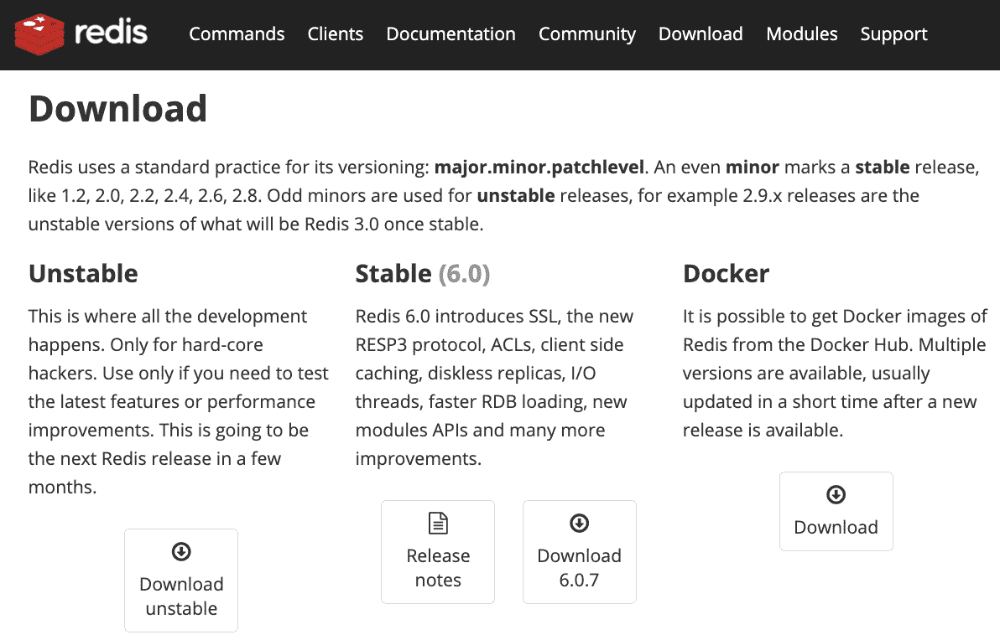
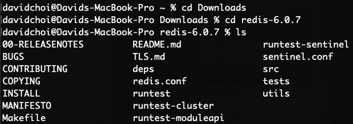
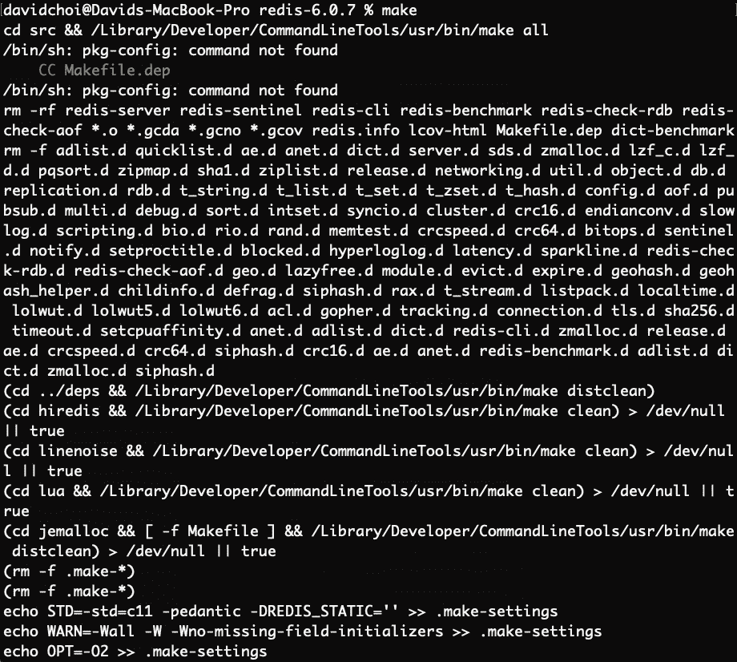
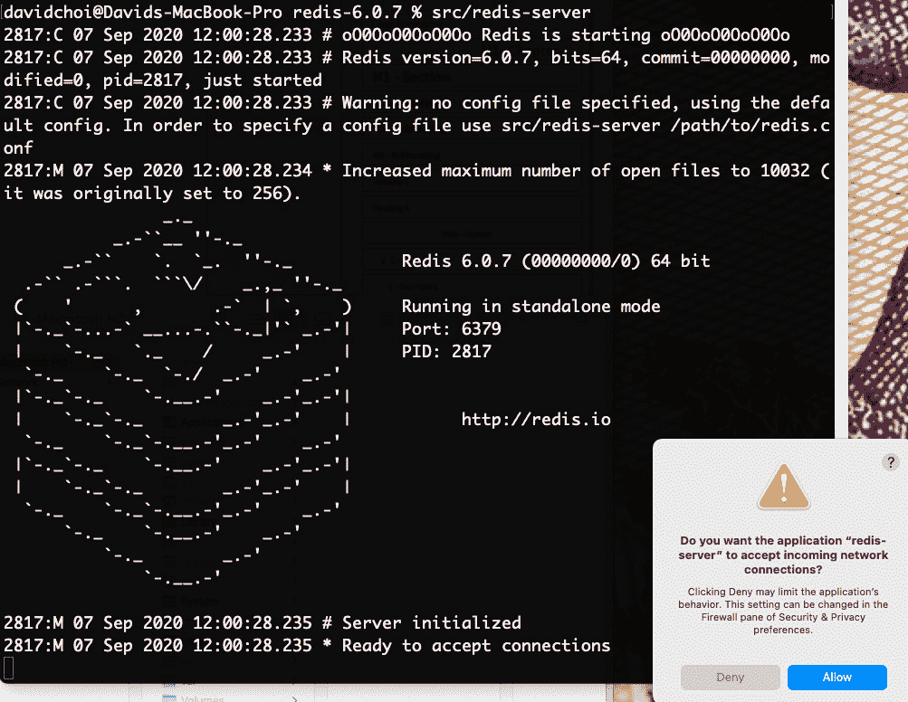
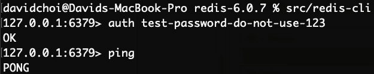
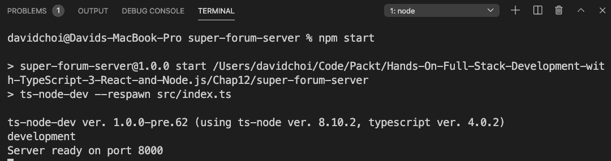
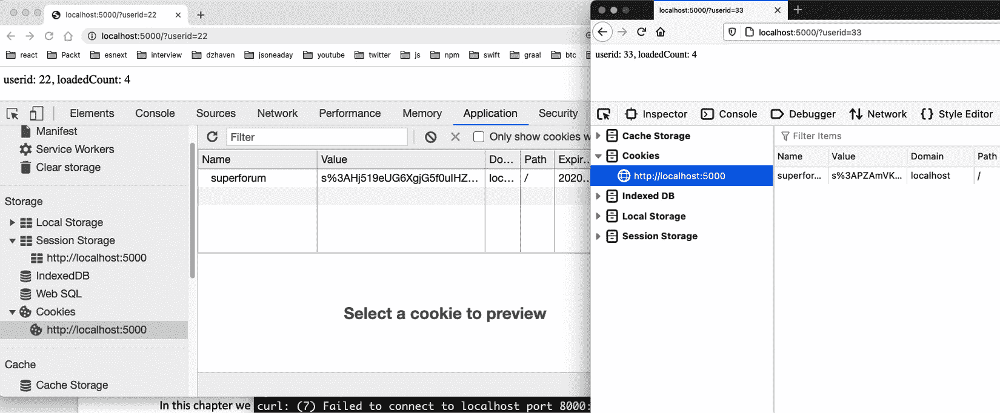

# 第十三章：使用 Express 和 Redis 设置会话状态。

在本章中，我们将学习如何使用 Express 和 Redis 数据存储创建会话状态。Redis 是最流行的内存数据存储之一。它被 Twitter、GitHub、Stack Overflow、Instagram 和 Airbnb 等公司使用。我们将使用 Express 和 Redis 来创建我们的会话状态，这将成为我们应用程序身份验证功能的基础。

在本章中，我们将涵盖以下主要主题：

+   理解会话状态

+   理解 Redis

+   使用 Express 和 Redis 构建会话状态

# 技术要求

您应该对使用 Node.js 进行 Web 开发有很好的理解。我们将再次使用 Node 和 Visual Studio Code。

GitHub 存储库位于[`github.com/PacktPublishing/Full-Stack-React-TypeScript-and-Node`](https://github.com/PacktPublishing/Full-Stack-React-TypeScript-and-Node)。使用`Chap13`文件夹中的代码。

要设置*第十三章*代码文件夹，请转到您的`HandsOnTypescript`文件夹并创建一个名为`Chap13`的新文件夹。

# 理解会话状态

在本节中，我们将学习会话状态是什么以及为什么需要它。我们将重新审视网络工作的一些概念，并理解为什么我们需要会话状态。

网络实际上并不是一件事。它是许多技术的集合。网络的核心是 HTTP 协议。这是允许网络在互联网上工作的通信协议。协议只是一组用于通信的约定规则。这听起来有些简单，对于某些事情来说可能是。然而，对于我们的应用程序来说，情况就有点复杂了。

HTTP 协议是一种无连接的协议。这意味着 HTTP 连接仅在发出请求时建立，然后释放。因此，即使用户在网站上活跃使用数小时，连接也不会保持。这使得 HTTP 更具可伸缩性。然而，这也意味着在使用该协议时更难创建大型网站需要的某些功能。

让我们看一个现实世界的例子。假设我们是亚马逊，我们网站上有数百万用户试图购买物品。现在因为人们正在尝试购买物品，我们需要能够唯一标识这些用户。例如，如果我们同时在亚马逊上购物，您试图将物品添加到购物车中，我们需要确保您的物品不会出现在我的购物车中，反之亦然。这似乎应该很容易做到。然而，在像 HTTP 这样的无连接协议中，这很难。

在 HTTP 中，每个请求都会创建一个新的连接，每个新请求都不知道任何先前的请求。也就是说，它不保存状态数据。因此，回到我们的亚马逊例子，这意味着如果用户发出请求将物品添加到购物车中，没有内置的功能可以区分这个用户的请求和其他任何请求。当然，我们可以介入使用我们自己的功能，当然，这正是我们将在本章讨论的内容。但关键是，没有现成的东西可以直接使用。

需要明确的是，处理这个特定问题有许多方法。也许我们可以给每个用户一个唯一的 ID，并且他们可以在每次调用时传递它。或者我们可以将会话信息保存到数据库中，例如将购买物品保存在购物车中。当然，根据具体的要求，还有许多其他选项。然而，这些简单的想法需要详细阐述并详细说明。然后我们需要花时间测试它们。因此，实际上，无论我们在哪里，我们都希望避免自己开发功能，并且应选择行业标准解决方案。如果我们使用这些解决方案，我们知道它们已经经过了健壮性和安全性测试，并且将使用最佳实践。

我们将使用区分用户的方法将重点放在服务器端技术上，使用 Express 会话和 Redis 作为我们的数据存储。我们不会使用 JWT，因为它是客户端技术，比服务器端解决方案更容易受到安全漏洞的影响。

重要提示

每种解决方案都有其优缺点。当然，任何服务器都可能被黑客攻击。在服务器上使用安全解决方案并不能保证任何事情。然而，当涉及到您的服务器时，您至少可以保护和控制其设置，以尽量最大化其安全性。在用户的机器上，您根本无法控制。

在本节中，我们了解了会话状态是什么以及为什么它是必要的。我们了解了 HTTP 协议的一些缺失功能，以及我们如何为自己提供这些功能。在下一节中，我们将继续学习 Redis，这是我们将用来维护会话数据的数据存储。

# 了解 Redis

在这一部分，我们将学习关于 Redis 并安装它。我们还将简单介绍 Redis 以及它的工作原理。

Redis 是一个内存数据存储。它非常快速和可扩展。您可以使用 Redis 存储字符串、数据列表、集合等。成千上万的公司使用 Redis，它是免费和开源的。一般来说，Redis 最常用作内存数据库或缓存。

对于我们的用例，我们将使用 Redis 来作为 Express 会话的数据存储。Redis 支持 Linux 和 Mac。它在 Windows 上没有官方支持。您可以通过在 Windows 上使用 Docker 镜像来获得非官方支持，但这超出了本书的范围。然而，您通常可以在云提供商上获得免费的 Linux 虚拟机进行试用。因此，如果您使用 Windows，可以尝试其中的一项服务。

注意

`Redis.conf`有一个叫做 bind 的设置，它设置了 Redis 服务器将使用的本地 IP 地址，以及允许访问它的外部 IP 地址。将此设置注释将允许任何 IP 地址访问服务器。这对开发目的来说是可以的。然而，一旦进入生产阶段，您应该将其设置为特定值，并且只允许您希望访问服务器 IP 的 IP 地址。

让我们开始安装 Redis。目前，我正在使用 Mac：

1.  转到 Redis 网站[`redis.io/download`](https://redis.io/download)，并在稳定版本下选择**下载**。这是当前 6.0.7 版本的示例屏幕截图：

注意

请下载 6.0.x 版本，因为更高或更低版本可能会有破坏性的更改。



图 13.1 – Redis 下载

1.  一旦您下载并成功解压缩文件到一个文件夹中，使用终端并进入该文件夹。例如，这是我解压缩 tar 文件后终端的样子：

图 13.2 – Redis 稳定版解压缩

1.  现在我们必须将我们的源文件制作成可运行的应用程序。只需在终端中输入`make`并让其运行。这将需要一些时间来完成。`make`命令运行的开始将如下所示：

图 13.3 – 运行 make 命令

1.  现在我们已经构建了我们的服务器，随意将其移动到任何您喜欢的位置。我将其移动到了我的`Applications`文件夹中。在切换到`Redis`文件夹后，您需要运行以下命令：

```ts
src/redis-server
```

这是我本地运行的 Redis 服务器的屏幕截图：



图 13.4 – 运行 Redis

警告

在 Mac 上，您可能会收到一个警告，询问您是否要允许 Redis 接受传入的网络请求。您应该允许此操作。

1.  让我们快速测试一下 Redis 是否正常工作。在 Redis 运行时，打开一个新的终端窗口，并从 Redis 的`src`文件夹中，输入以下命令：

```ts
ping to check that Redis is running. Then we use the set command to create a new value with the key test and value 1. Then we get that value successfully.
```

1.  现在我们知道我们的服务器已经正确安装，我们需要进行一些小的配置。首先用这个命令关闭服务器：

```ts
Chapter13 source code folder and copy the contents of the redis/redis.conf file. Then, in the terminal, run the following command:

```

sudo 密码，输入你的密码。这是大多数 Redis 配置位置的默认文件夹。接下来，运行这个命令：

```ts
redis.conf, file into this newly created file on /etc/redis/redis.conf.If you view this file and search for the keyword `requirepass`, pressing *Ctrl* + *W* or viewing from VSCode, you will see the password we are going to use for testing purposes only. Please do not use this password in production.For any other settings, we should be fine with the defaults.
```

```ts

```

1.  好的，现在让我们重新启动我们的 Redis 服务器，但这次指向我们的新`redis.conf`文件。输入这个命令：

```ts
Configuration loaded.Note that if you want to test the server again, this time you need to authenticate since we configured a password:

```

src/redis-cli

auth <password>

```ts

This is what it looks like:
```



图 13.6 - Redis 的测试重启和 auth

在这一部分，我们讨论了 Redis 是什么，并进行了 Redis 服务的基本安装。在下一部分中，我们将通过创建一个最基本的 Node 和 Express 服务器并设置基于 Redis 的会话状态来启动我们的后端服务器代码。

# 使用 Express 和 Redis 构建会话状态

在这一部分，我们将开始构建我们的后端。我们将创建我们的 Express 项目并设置基于 Redis 的会话状态。

现在我们了解了 Redis 是什么以及如何安装它。让我们来看看 Express 和 Redis 如何在我们的服务器中一起工作。正如我们在*第八章*中讨论的那样，*使用 Node.js 和 Express 学习服务器端开发*，Express 基本上是 Node 的一个包装器。这个包装器通过使用中间件为 Node 提供了额外的功能。会话状态也是 Express 的一个中间件。

在我们的应用程序中，Express 将提供一个具有相关功能的会话对象，比如在用户浏览器上创建 cookie 以及各种函数来帮助设置和维护会话。Redis 将是我们会话数据的数据存储。由于 Redis 在存储和检索数据方面非常快速，它是 Redis 的一个很好的使用案例。

现在让我们使用 Express 和 Redis 创建我们的项目：

1.  首先，我们需要创建我们的项目文件夹`super-forum-server`。创建后，我们需要通过运行这个命令将其初始化为一个 NPM 项目（确保你的终端已经在`super-forum-server`文件夹中）：

```ts
name field inside of package.json to say super-forum-server. Feel free to also update the author field to your name as well.
```

1.  现在让我们安装我们的依赖项：

```ts
express package, but we also installed express-session. This package is what enables sessions in Express. We also installed connect-redis, which is what connects our Express session to a Redis data store. In addition to connect-redis, we need the ioredis package because it is the client that gives us access to the Redis server itself. I'll explain this further once we start coding. The dotenv package will allow us to use a config file, .env, to hold things like server passwords and other configurations. Then, in the second `install` command, we can see our development-related packages, which are mostly TypeScript definition packages like `@types/express`. However, notice in the end, we also install `ts-node-dev`. We use this package to help us start our server through the main `index.ts` file. The `ts-node-dev` package will trigger `tsc`, the TypeScript compiler, and get the final server up and running.WarningNever include your `dotenv` config file, `.env`, in your Git repository. It has sensitive information. You should have an offline process to maintain this file and share it with your developers.
```

1.  现在让我们更新我们的`package.json`文件，使用`ts-node-dev`助手。这个包非常有用，因为它在我们更改任何脚本时也会自动重新启动我们的服务器。将这一行添加到`package.json`的`scripts`部分中：

```ts
"start": "ts-node-dev --respawn src/index.ts"
```

注意在`respawn`之前有两个破折号。`index.ts`文件将是启动我们服务器的根文件。

1.  现在我们应该在我们的项目中设置 TypeScript。我们之前已经多次看到了 TypeScript 配置文件`tsconfig.json`，所以我不会在这里列出它（当然你可以在我们的源文件中找到它）。但请注意，我们将`target`设置为`ES6`，并且生产文件保存在`./dist`文件夹中。

1.  在项目的根目录下创建`src`文件夹。

1.  现在让我们创建我们的`.env`文件及其条目。将这些设置复制到你自己的文件中，但使用你自己的唯一的秘密值！[](img/B15508_13_Table_AM.jpg)

1.  现在让我们创建`index.ts`文件。首先让我们创建一个最基本的文件，只是为了确保我们的服务器能够运行。将这个输入到文件中：

```ts
import express from "express";
```

在这里，我们已经导入了 Express。

```ts
console.log(process.env.NODE_ENV);
```

在这里，我们展示了我们所在的环境 - 生产环境还是开发环境。如果你还没有设置你的本地环境，请在终端上使用这个命令来设置。

对于 Mac，使用这个命令：

```ts
dotenv package and set up default configurations. This is what allows our .env file to be used in our project.

```

const app = express();

```ts

Here, we instantiate our `app` object with `express`. So, we'll add all our middleware onto the `app` object. Since almost everything in Express is middleware, session state is also middleware.

```

app.listen({ port: process.env.SERVER_PORT }, () => {

console.log(`服务器已准备就绪，端口为${process.env.   SERVER_PORT}`);

});

```ts

And here, we have initialized our server and when it is running, it will show the log message shown. Run the following command:

```

npm start

```ts

You should see the following log message on your terminal:Figure 13.7 First run of the Express server
```

1.  现在我们知道我们的基本服务器已经正确运行，让我们添加我们的 Express 会话状态和 Redis：

```ts
import express from "express";
import session from "express-session";
import connectRedis from "connect-redis";
import Redis from "ioredis";
```

首先，你可以看到我们导入了`expression-session`和我们的与 Redis 相关的包。

```ts
console.log(process.env.NODE_ENV);
require("dotenv").config();
const app = express();
const router = express.Router();
```

在这里，我们初始化了我们的`router`对象。

```ts
const redis = new Redis({
  port: Number(process.env.REDIS_PORT),
  host: process.env.REDIS_HOST,
  password: process.env.REDIS_PASSWORD,
});
```

`redis`对象是我们的 Redis 服务器的客户端。正如你所看到的，我们已经将配置信息的值隐藏在我们的`.env`文件后面。你可以想象一下，如果我们能够看到密码和其他安全信息硬编码到我们的代码中，那将是多么不安全。

```ts
const RedisStore = connectRedis(session);
const redisStore = new RedisStore({
  client: redis,
});
```

现在我们已经创建了我们的`RedisStore`类和`redisStore`对象，我们将使其成为我们 Express 会话的数据存储。

```ts
app.use(
  session({
    store: redisStore,
    name: process.env.COOKIE_NAME,
    sameSite: "Strict",
    secret: process.env.SESSION_SECRET,
    resave: false,
    saveUninitialized: false,
    cookie: {
      path: "/",
      httpOnly: true,
      secure: false,
      maxAge: 1000 * 60 * 60 * 24,
    },
  } as any)
);
```

会话对象有一些选项。一个选项，`store`，是我们添加`redisStore`对象的地方。`sameSite`值表示不允许来自其他域的 cookie，这增强了安全性。`secret`字段再次是我们特定会话的一种密码或唯一 ID。`cookie`字段设置了我们保存到用户浏览器上的 cookie。`httpOnly`字段意味着 cookie 无法从 JavaScript 中获取。这使得 cookie 更加安全，可以防止 XSS 攻击。`secure`字段是`false`，因为我们没有使用 HTTPS。

```ts
app.use(router);
router.get("/", (req, res, next) => {
  if (!req.session!.userid) {
    req.session!.userid = req.query.userid;
    console.log("Userid is set");
    req.session!.loadedCount = 0;
  } else {
    req.session!.loadedCount = Number(req.session!.     loadedCount) + 1;
  }
```

我们已经设置了我们的`router`对象和我们的一个路由，即 GET。基本上，我们所做的是从 URL 查询字符串中获取`userid`，然后用它设置我们用户的唯一`session.userid`字段。我们还计算调用的次数，以显示会话在调用之间保持活动状态。

```ts
  res.send(
    `userid: ${req.session!.userid}, loadedCount: 
      ${req.session!.loadedCount}`
  );
```

在这里，我们通过发送会话信息作为字符串返回来做出响应。

```ts
});
app.listen({ port: process.env.SERVER_PORT }, () => {
  console.log(`Server ready on port ${process.env.SERVER_   PORT}`);
});
```

最后，我们的`express`服务器在端口 5000 上监听，这是我们的`SERVER_PORT`设置的值。如下图所示，cookie 在第一次加载时被创建：



图 13.8 - 两个浏览器显示不同的会话状态

请注意，我们使用两个浏览器来显示创建唯一会话。如果我们使用一个浏览器，会话将不是唯一的，因为将使用相同的 cookie。

在本节中，我们利用了我们对 Express 和 Redis 的知识，并为我们的 SuperForum 应用程序实现了一个基本项目。我们看到了 Express 和 Redis 在创建会话中所起的作用。我们还看到了如何使用会话为每个访问我们网站的用户创建一个唯一的数据容器。

# 总结

在本章中，我们学习了会话和 Redis 数据存储服务。我们还学习了如何将 Redis 与 Express 集成，以便为我们的用户创建唯一的会话。这对于在后续章节中构建我们的身份验证服务至关重要。

在下一章中，我们将设置我们的 Postgres 服务器并创建我们的数据库架构。我们还将学习 TypeOrm，这将允许我们从我们的应用程序集成和使用 Postgres。最后，我们还将构建我们的身份验证服务并将其与我们的会话状态联系起来。
