# 第十四章：使用 TypeORM 设置 Postgres 和存储库层

在本章中，我们将学习如何使用 Postgres 作为我们的数据库和 TypeORM 作为访问数据库的库来设置存储库层。我们将构建我们的数据库架构，并借助 TypeORM，我们将能够为我们的应用程序执行**CRUD**（**创建，读取，更新，删除**）操作。这是一个关键的章节，因为我们的后端的核心活动将是检索和更新数据。

在本章中，我们将涵盖以下主要主题：

+   设置我们的 Postgres 数据库

+   通过使用 TypeORM 来理解对象关系映射器

+   使用 Postgres 和 TypeORM 构建我们的存储库层

# 技术要求

本书不会教授关系数据库知识。因此，你应该对 SQL 有基本的了解，包括简单的查询和表结构，以及使用 Node 进行 Web 开发。我们将再次使用 Node 和 Visual Studio Code 来编写我们的代码。

GitHub 存储库位于[`github.com/PacktPublishing/Full-Stack-React-TypeScript-and-Node`](https://github.com/PacktPublishing/Full-Stack-React-TypeScript-and-Node)。使用`Chap14`文件夹中的代码。

要设置*第十四章*的代码文件夹，请转到你的`HandsOnTypescript`文件夹，并创建一个名为`Chap14`的新文件夹。

# 设置我们的 Postgres 数据库

在本节中，我们将安装和设置 Postgres 数据库。关系数据库仍然非常重要，而现在 NoSQL 数据库非常流行。然而，根据 StackOverflow 的说法，Postgres 仍然是世界上最受欢迎的数据库之一。此外，它的性能是世界一流的，比 MongoDB 高出很大的边际（[`www.enterprisedb.com/news/new-benchmarks-show-postgres-dominating-mongodb-varied-workloads`](https://www.enterprisedb.com/news/new-benchmarks-show-postgres-dominating-mongodb-varied-workloads)）。因此，Postgres 是我们将使用的数据库技术。

让我们安装我们的 Postgres 数据库。我们将使用 EDB 提供的安装程序。EDB 是一家第三方公司，提供支持 Postgres 的工具和服务：

1.  转到网址[`www.enterprisedb.com/downloads/postgres-postgresql-downloads`](https://www.enterprisedb.com/downloads/postgres-postgresql-downloads)，并选择适合你平台的下载。我将使用 Mac 的 12.4 版本，这是我写作时的最新 Mac 版本。

1.  接受安装程序上的所有默认设置，包括要安装的组件列表，如下所示：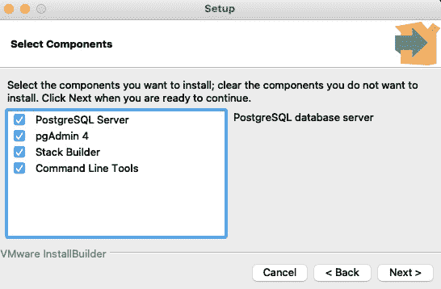

图 14.1 - Postgres 设置屏幕

1.  安装完成后，启动`pgAdmin`应用程序。这个应用程序是 Postgres 的管理员应用程序。你应该会看到这样的屏幕：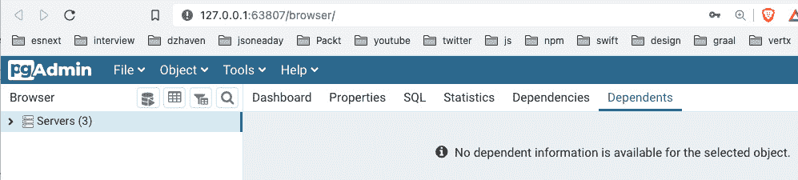

图 14.2 - pgAdmin 的第一个视图

如你所见，这是一个 Web 浏览器应用程序。我在我的安装中有一些其他服务器，但如果这是你的第一个`pgAdmin`安装，你的安装应该没有任何服务器。

1.  现在，让我们创建一个名为`HandsOnFullStackGroup`的新服务器组，这样我们就可以将我们的工作与其他人分开。服务器组只是一个容器，可以容纳多个服务器实例，每个服务器可以在其中拥有多个数据库。请注意，一个服务器**并不**表示一个单独的物理机器。

1.  首先，通过右键单击**Servers**项目，选择**Server Group**选项，如下所示：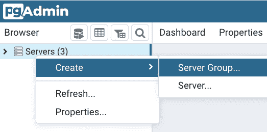

图 14.3 - pgAdmin 添加服务器组

1.  接下来，在第一个屏幕上右键单击新的`SuperForumServers`，创建一个服务器，如下所示：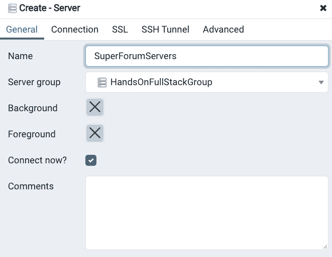

图 14.4 - 创建 - 服务器选项卡

1.  现在，选择第二个选项卡，`localhost`作为`postgres`。Postgres 账户是根管理员账户，所以你需要记住这个密码。这是这个选项卡的截图：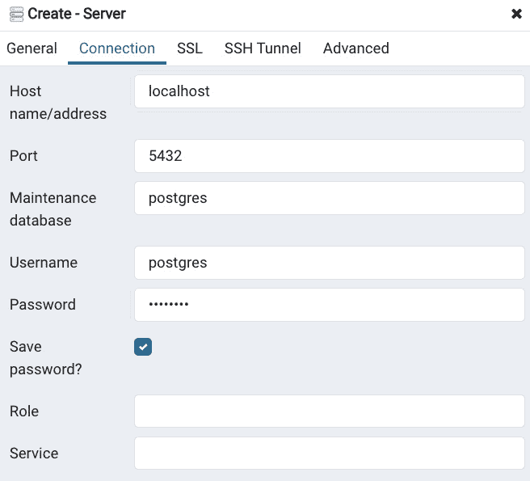

图 14.5 – 连接选项卡

1.  选择**保存**，你的服务器将被创建。你应该会看到以下视图：

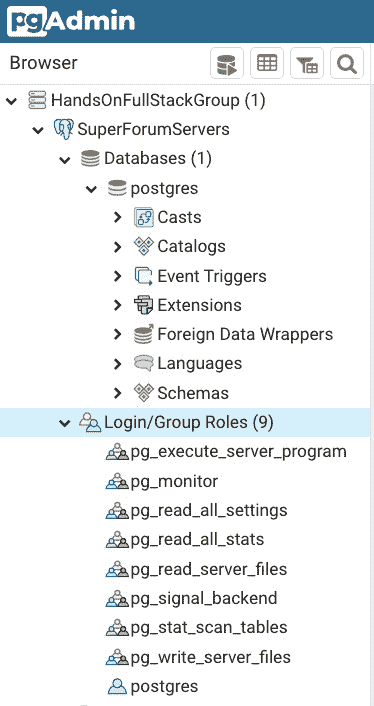

图 14.6 – 新的 HandsOnFullStackGroup 和 SuperForumServers 视图

请注意，那里已经有一个名为**postgres**的数据库。这个数据库是空的，但可以用来存储全局数据。

现在，让我们为我们的应用程序创建数据库。但是，在我们这样做之前，我们需要创建一个新的账户，专门用于与我们的新数据库相关联。使用默认管理员账户 postgres 不是一个好主意，因为如果被黑客攻击，它将给予攻击者对整个服务器的访问权限：

1.  在`pgAdmin`中，右键单击`superforumsvc`。然后，在**定义**选项卡中，设置您自己的密码。接下来，转到**权限**选项卡，并**确保**启用登录。其余设置可以保持默认设置。

1.  接下来，右键单击`SuperForum`，选择**superforumsvc**作为**所有者**：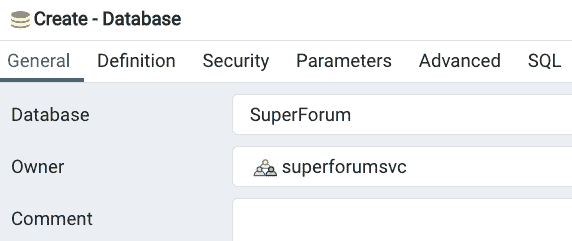

图 14.7 – 创建 SuperForum 数据库

1.  然后，点击**保存**。你的视图现在应该显示如下：

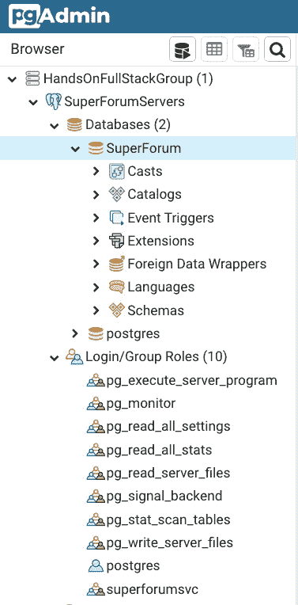

图 14.8 – 新数据库和用户

太棒了！我们现在有了一个数据库。如果我们不使用 ORM，我们将不得不经历手动创建表和字段的繁琐过程。但是，正如你将看到的，TypeORM 可以帮我们省去这些苦工，同时为我们提供了很棒的语言特性来查询我们的数据库。

在下一节中，我们将深入了解 TypeORM。我们将学习它是如何工作的，以及它如何在许多层面上帮助我们与我们的数据库交互。

# 通过使用 TypeORM 来理解对象关系映射器

在本节中，我们将学习什么是**对象关系映射器**（**ORM**）技术。我们还将了解 TypeORM，这是 JavaScript 中最流行的 ORM 框架之一。ORM 可以使与数据库的工作变得更加容易，并减少开发人员的一些认知负担。

作为程序员，你知道不同的编程语言具有不兼容的类型。例如，尽管名字相似，JavaScript 不能直接使用甚至访问 Java 类型。为了让任一语言使用另一语言的类型，我们需要进行某种形式的翻译。部分原因是有了诸如 Web API 这样的服务。Web API 以字符串格式（如 JSON）提供所有数据给调用者。这允许任何调用者使用数据，因为它可以被任何语言读取。

数据库到编程语言的转换具有类似的类型不兼容性。因此，通常在进行返回数据的查询之后，我们需要从数据库中取出每个字段的值，并手动编写代码将其转换为编程语言中的特定类型。然而，如果我们使用 ORM，大部分工作都会消失。

ORM 被设计成*知道*如何将数据库字段映射到代码字段，并为我们处理这些翻译工作。此外，大多数 ORM 都具有某种能力，根据在代码中创建的实体结构自动在数据库上创建表和字段。你可以将实体视为编程语言端表示与数据库端表类似对象的类型。例如，如果我们在 JavaScript 中有一个名为`User`的实体，那么我们期望在数据库中有一个名为`Users`的表与之匹配（它是复数形式，因为一个表可以容纳多个用户）。

仅此功能就可以为开发人员节省大量的时间和精力，但除此之外，一个良好的 ORM 还将具有帮助构建查询、安全插入参数（减少 SQL 注入攻击的机会）以及处理事务的功能。事务是必须完全完成的原子数据库操作，否则涉及的所有操作都将被撤消。

注意

SQL 注入攻击是恶意人员尝试插入与开发人员最初意图不同的 SQL 代码的尝试。它可能导致诸如数据丢失和应用程序失败等问题。

对于我们的应用程序，我们将使用 TypeORM。TypeORM 是一个受欢迎且备受好评的 TypeScript ORM，在 GitHub 上有超过 20,000 个赞。它提供了所有提到的功能，并且很容易入门，尽管成为高级用户需要相当大的努力。它支持多个数据库，包括 Microsoft SQL、MySQL 和 Oracle。

它将通过其丰富的功能集为我们节省大量时间，并且因为许多 JavaScript 项目使用 TypeORM，所以有一个庞大的开发人员社区可以在您使用它时提供帮助。

在本节中，我们了解了 ORM 技术。我们了解了它是什么，以及为什么使用它是重要和有价值的。在下一节中，我们将使用 TypeORM 来构建我们自己的项目。让我们开始吧。

# 使用 Postgres 和 TypeORM 构建我们的存储库层

在本节中，我们将了解使用存储库层的重要性。为我们的应用程序的一个重要部分设置一个单独的层可以帮助简化代码重构。从逻辑上分离主要部分也有助于理解应用程序的工作原理。

在*第一章*中，*理解 TypeScript*，我们学习了**面向对象编程**（**OOP**）。实现 OOP 设计的主要机制之一是使用抽象。通过在其自己的单独层中创建我们的数据库访问代码，我们正在使用抽象。正如您可能记得的那样，抽象的好处之一是它隐藏了代码的内部实现并向外部调用者公开接口。此外，因为与访问数据库相关的所有代码都在一个地方，我们不必四处寻找我们的数据库查询代码。我们知道这段代码位于我们应用程序的哪个层中。保持代码逻辑上的分离被称为关注点分离。

因此，让我们开始构建我们的存储库层：

1.  首先，我们需要复制我们在*第十三章*中创建的服务器代码，*使用 Express 和 Redis 设置会话状态*。转到源代码中的`Chapter13`文件夹，并将`super-forum-server`文件夹复制到`Chapter14`文件夹中。

```ts
npm install 
```

1.  接下来，我们需要安装 TypeORM 及其相关依赖项。运行以下命令：

```ts
typeorm. pg is the client to communicate with Postgres. bcryptjs is an encryption library that we will use to encrypt our passwords before inserting into the database. cors is needed to allow us to receive client-side requests from a different domain, other than our server's domain. In modern apps, it's possible the client-side code is not being served from the same server as the server-side code. This is especially true when we are creating an API such as GraphQL, which may be used by multiple clients. You'll also see this when we start integrating our client's React app with the server, as they will run on different ports.`class-validator` is a dependency for assigning decorators for validation. We'll discuss this in more detail later with the help of examples.
```

1.  现在，在我们开始创建我们的实体数据库之前，我们需要创建一个配置文件，以便我们的 TypeORM 代码可以访问我们的 Postgres 数据库。这意味着我们还需要更新我们的`.env`文件与我们的数据库配置。打开`.env`文件并添加这些变量。我们的服务器是在本地安装的，所以`PG_HOST`的值为`localhost`：

```ts
PG_HOST=localhost
```

服务器用于通信的端口如下：

```ts
PG_PORT=5432
```

我们的数据库帐户名称如下：

```ts
PG_ACCOUNT=superforumsvc
```

使用您为自己的数据库创建的密码：

```ts
PG_PASSWORD=<your-password>
```

我们的数据库名称如下：

```ts
PG_DATABASE=SuperForum
```

如前所述，TypeORM 将为我们创建表和字段，并在其更改时对其进行维护。 `PG_SYNCHRONIZE`启用了该功能：

```ts
PG_SYNCHRONIZE=true
```

当然，一旦您在生产中投入使用，您必须禁用此功能，以防止不必要的数据库更改。

我们的实体文件的位置，包括子目录，如下：

```ts
PG_ENTITIES="src/repo/**/*.*"
```

我们的实体的根目录如下：

```ts
PG_ENTITIES_DIR="src/repo"
```

`PG_LOGGING`确定是否在服务器上启用日志记录：

```ts
PG_LOGGING=false
```

在生产环境中应该启用日志以跟踪问题。但是，日志可能会创建巨大的文件，所以我们不会在开发中启用它。

1.  现在我们可以创建我们的 TypeORM 配置文件。在我们项目的根目录`Chap13/super-forum-server`中，创建名为`ormconfig.js`的文件，并将以下代码添加到其中：

```ts
require("dotenv").config();
```

首先，我们通过`require`获取我们的`.env`配置：

```ts
module.exports = [
  {
    type: "postgres",
```

我们将连接到哪种数据库类型？由于 TypeORM 支持多个数据库，我们需要指示这一点。

其余的值使用我们的`.env`文件中的配置，因此它们是不言自明的：

```ts
    host: process.env.PG_HOST,
    port: process.env.PG_PORT,
    username: process.env.PG_ACCOUNT,
    password: process.env.PG_PASSWORD,
    database: process.env.PG_DATABASE,
    synchronize: process.env.PG_SYNCHRONIZE,
    logging: process.env.PG_LOGGING,
    entities: [process.env.PG_ENTITIES],
    cli: {
      entitiesDir: process.env.PG_ENTITIES_DIR
    },
  }
];
```

现在，我们准备开始创建我们的实体。

1.  现在我们已经安装了依赖项并设置了数据库的配置，让我们创建我们的第一个实体，用户。将目录更改为`Chap14/super-forum-server`文件夹，然后在`src`文件夹内创建一个名为`repo`的文件夹。我们将把所有的存储库代码放在那里。然后，在`repo`内创建一个名为`User.ts`的文件，并在其中添加以下代码：

```ts
import { Entity, PrimaryGeneratedColumn, Column } from "typeorm";
```

这些 TypeORM 导入将允许我们创建我们的`User`实体类。`Entity`、`PrimaryGeneratedColumn`和`Column`被称为装饰器。装饰器是放置在相关代码行之前的属性，提供有关字段或对象的附加配置信息。你可以把它们看作是一种快捷方式。你可以简单地添加一个标签来设置配置，而不是编写一些长长的代码行。我们将在这段代码中看到例子：

```ts
import { Length } from "class-validator";
```

这是一个长度的验证器。

接下来是我们第一次使用装饰器。`Entity`装饰器告诉 TypeORM 即将定义的类是一个名为`Users`的实体。换句话说，在我们的代码中，我们将有一个称为`User`的对象，它直接映射到我们数据库中称为`Users`的表：

```ts
@Entity({ name: "Users" })
```

在数据库中，每个表必须有一个唯一的标识字段。这就是`PrimaryGeneratedColumn`的含义。字段名称将是`id`。请注意，`id`中的"""不是大写。我们稍后会解决这个问题：

```ts
export class User {
  @PrimaryGeneratedColumn({ name: "id", type: "bigint" })
  id: string;
```

接下来，我们将首次使用`Column`装饰器：

```ts
  @Column("varchar", {
    name: "Email",
    length: 120,
    unique: true,
    nullable: false,
  })
  email: string;
```

正如你所看到的，它用于定义数据库字段`Email`，在我们的 TypeScript 代码中将被称为`email`。因此，装饰器再次被用来将我们的代码对象映射到数据库实体。现在，让我们更仔细地看一下`Column`装饰器。首先，它定义了我们的列是`varchar`数据库类型。再次强调，数据库类型与代码类型不同，如此处所示。接下来，我们看到`name`字段，设置为`Email`。这将是`Users`表中此字段的确切名称。然后我们有`length`，它表示此字段允许的最大字符数。`unique`属性告诉 Postgres 强制每个`User`条目必须具有唯一的电子邮件。最后，我们将`nullable`设置为`false`，这意味着此字段在数据库中必须有一个值：

```ts
  @Column("varchar", {
    name: "UserName",
    length: 60,
    unique: true,
    nullable: false,
  })
  userName: string;
  @Column("varchar", { name: "Password", length: 100,   nullable: false })
@Length(8, 100)
```

在这里，我们使用`Length`装饰器来确保输入的字段具有最小和最大字符长度：

```ts
  password: string;
```

两个字段，`userName`和`password`，都将`varchar`作为列，具有与`email`类似的设置：

```ts
  @Column("boolean", { name: "Confirmed", default: false, 
    nullable: false })
  confirmed: boolean;
```

现在，我们看到了一个`confirmed`字段，它是`boolean`类型。`confirmed`字段将显示新注册用户帐户是否已经通过电子邮件验证。请注意，这是相当不言自明的，但默认设置表明，当前记录插入数据库时，除非明确设置，它将被设置为`false`：

```ts
  @Column("boolean", { name: "IsDisabled", default:     false, nullable: false }) 
  isDisabled: boolean;
}
```

最后，这是`isDisabled`字段，它将允许我们出于管理目的禁用帐户。

1.  太好了！现在我们可以看到 TypeORM 是否会代表我们创建新的`Users`表。我们需要做的最后一件事是从我们的代码连接到 Postgres 数据库。像这样更新`index.ts`：

```ts
import express from "express";
import session from "express-session";
import connectRedis from "connect-redis";
import Redis from "ioredis";
import { createConnection } from "typeorm";
require("dotenv").config();
```

我们已经从 TypeORM 导入了`createConnection`函数：

```ts
const main = async () => {
  const app = express();
  const router = express.Router();
await createConnection();
```

在这里，我们调用了`createConnection`。但请注意，我们的代码现在包裹在一个名为`main`的`async`函数中。我们需要这样做的原因是`createConnection`是一个`async`调用，需要一个`await`前缀。因此，我们不得不将其包装在一个`async`函数中，这就是`main`函数的作用。

其余的代码是一样的，如下所示：

```ts
  const redis = new Redis({
    port: Number(process.env.REDIS_PORT),
    host: process.env.REDIS_HOST,
    password: process.env.REDIS_PASSWORD,
  });
  const RedisStore = connectRedis(session);
  const redisStore = new RedisStore({
    client: redis,
  });
  app.use(
    session({
      store: redisStore,
      name: process.env.COOKIE_NAME,
      sameSite: "Strict",
      secret: process.env.SESSION_SECRET,
      resave: false,
      saveUninitialized: false,
      cookie: {
        path: "/",
        httpOnly: true,
        secure: false,
        maxAge: 1000 * 60 * 60 * 24,
      },
    } as any)
);
```

再次，代码是一样的：

```ts
  app.use(router);
  router.get("/", (req, res, next) => {
    if (!req.session!.userId) {
      req.session!.userId = req.query.userid;
      console.log("Userid is set");
      req.session!.loadedCount = 0;
    } else {
      req.session!.loadedCount = Number(req.session!.       loadedCount) + 1;
    }
    res.send(
      `userId: ${req.session!.userId}, loadedCount: 
        ${req.session!.loadedCount}`
    );
  });
  app.listen({ port: process.env.SERVER_PORT }, () => {
    console.log(`Server ready on port 
     ${process.env.SERVER_PORT}`);
  });
};
main();
```

最后，我们调用了我们的`main`函数来执行它。

1.  现在，通过运行以下命令来运行我们的应用程序：

```ts
pgAdmin and go to the Users table with all of its columns created for us: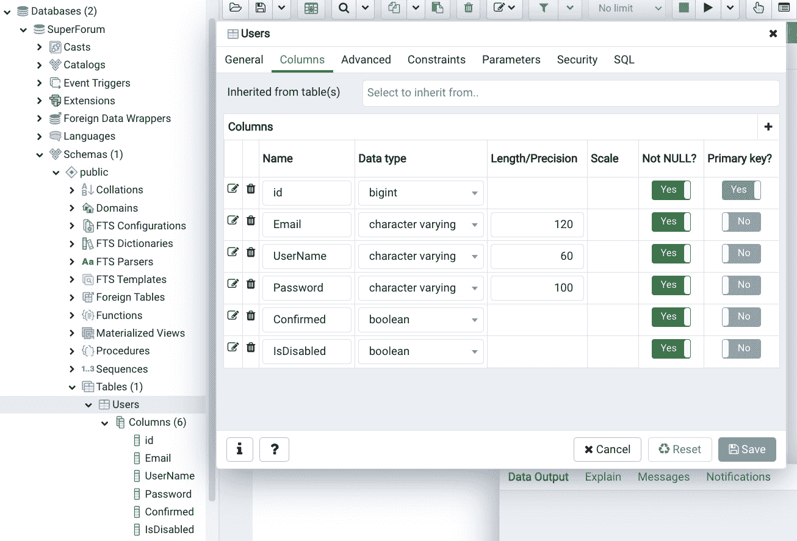Figure 14.9 – New Users tableThis is such a huge time saver! Could you imagine if we had to create each of our tables manually ourselves? With all of their fields and constraints? This would take hours.Notice that our columns have the same settings as from our decorators. For example, our email has a variety of characters, with a length of 120, and is not nullable. 
```

1.  然而，我们有一个小问题。我们的`id`列尽管其他列都是大写，但没有使用大写。让我们来修复这个问题。再次打开`User.ts`文件，只需将`PrimaryGeneratedColumn`装饰器的名称设置更改为`Id`而不是`id`（只在装饰器中；在我们的 JavaScript 中保留`id`字段名称）。如果您的服务器没有运行，请重新启动。但重新启动后，刷新`id`列已更新为`Id`。这是 TypeORM 的一个很棒的功能，因为手动更改列名或约束有时可能很痛苦。

1.  太棒了！现在我们只需要创建我们的其他实体：`Thread`和`ThreadItem`。再次强调，`Thread`是我们论坛中的初始帖子，而`ThreadItems`是回复。首先，停止服务器，以免在我们准备好之前创建数据库项。现在，由于这大部分是重复的，我将在这里只显示代码而不加注释。

这两个文件的导入将是相同的，如下所示：

```ts
import { Entity, PrimaryGeneratedColumn, Column } from "typeorm";
import { Length } from "class-validator";
```

`Thread`实体目前看起来是这样的（一旦建立了表关系，我们将添加更多字段）：

```ts
@Entity({ name: "Threads" })
export class Thread {
  @PrimaryGeneratedColumn({ name: "Id", type: "bigint" })
  id: string;
  @Column("int", { name: "Views", default: 0, nullable:    false })
  views: number;
  @Column("boolean", { name: "IsDisabled", default:     false, nullable: false }) 
  isDisabled: boolean;
  @Column("varchar", { name: "Title", length: 150,    nullable: false })
  @Length(5, 150)
  title: string;
  @Column("varchar", { name: "Body", length: 2500,    nullable: true
   })
  @Length(10, 2500)
  body: string;
}
```

`ThreadItem`看起来是这样的：

```ts
@Entity({ name: "ThreadItems" })
export class ThreadItem {
  @PrimaryGeneratedColumn({ name: "Id", type: "bigint" })
  id: string;
  @Column("int", { name: "Views", default: 0, nullable:   false })
  views: number;
  @Column("boolean", { name: "IsDisabled", default:    false, nullable: false })
  isDisabled: boolean;
  @Column("varchar", { name: "Body", length: 2500,    nullable: true
   })
  @Length(10, 2500)
  body: string;
}
```

1.  如您所见，这两个实体都非常简单。现在重新启动服务器，您应该会看到两个新表：**Threads**和**ThreadItems**：

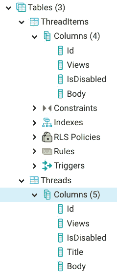

图 14.10 - Threads 和 ThreadItems

我们还有许多字段要添加，比如 points 列。但首先，让我们在表之间建立一些关系。例如，每个表都应该与特定的用户有关联。让我们从添加这些关系开始：

1.  首先，停止服务器。然后，在您的`User.ts`文件中，将此添加到您的类的底部。我假设您现在知道如何添加任何必需的导入，不再提及它们：

```ts
@OneToMany(() => Thread, (thread) => thread.user)
  threads: Thread[];
```

`OneToMany`装饰器显示每个单独的`User`可能有多个关联的`Threads`。

1.  现在，将这段代码添加到您的`Thread.ts`文件的`Thread`类的底部：

```ts
@ManyToOne(
    () => User,
    (user:User) => user.threads
  )
  user: User;
```

`ManyToOne`装饰器显示每个`Thread`只有一个与之关联的`User`。尽管教授 SQL 超出了本书的范围，但简单地说，这些关系作为数据库的约束，意味着我们无法插入没有意义的数据；例如，拥有多个`Users`*拥有*一个`Thread`。

1.  现在，让我们建立`Thread`与`ThreadItems`之间的关系。将以下代码添加到`Thread`类中：

```ts
@OneToMany(
    () => ThreadItem,
    threadItems => threadItems.thread
  )
  threadItems: ThreadItem[];
```

再次，这表明一个`Thread`可以有多个与之关联的`ThreadItems`。现在，让我们更新我们的`ThreadItem`：

```ts
@ManyToOne(() => User, (user) => user.threads)
  user: User;
```

`ThreadItem`和`Thread`一样，只能与一个`User`关联为所有者：

```ts
  @ManyToOne(() => Thread, (thread) => thread.   threadItems)
  thread: Thread;
```

1.  每个`ThreadItem`只能有一个父`Thread`。现在，如果重新启动服务器，您应该会看到这些新的关系：

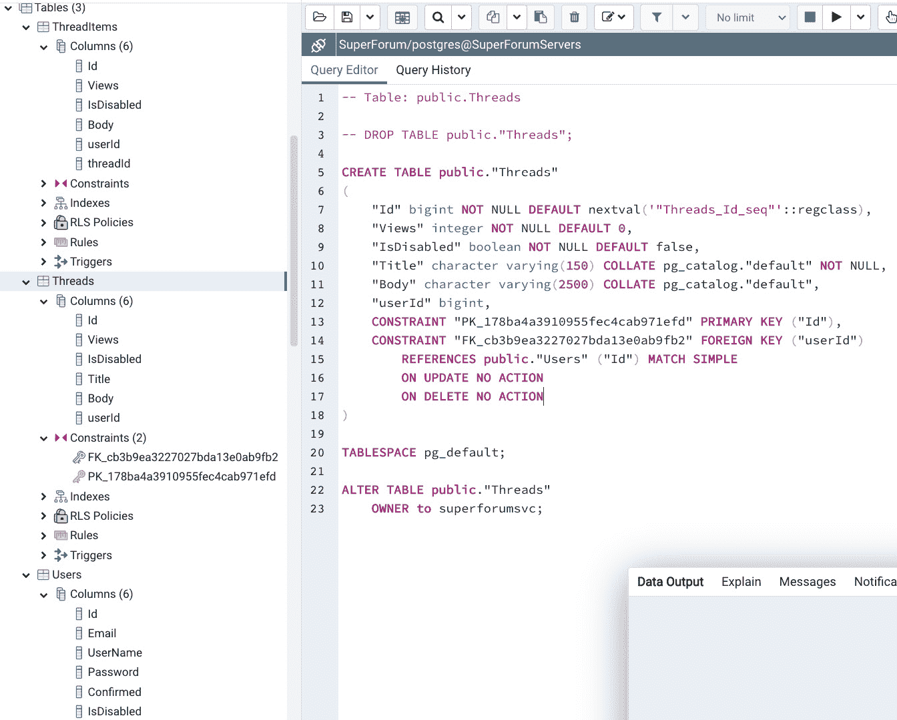

图 14.11 - 关系

您将看到`Threads`和`ThreadItems`表中已添加了新列。例如，在`ThreadItems`中，添加了`userId`和`threadId`以指示它们的相关关系。但是，在`Users`表中没有添加任何内容。这是因为`Users`表与`Threads`表具有`OneToMany`关系。因此，此关系由图像中`CREATE TABLE public."Threads"`脚本所示的约束表示。正如您所看到的，`userId`列有一个约束。因此，通过指示每个线程都有一个与之关联的`User`，它隐含地指示每个`User`可以拥有一个或多个自己拥有的`Threads`。

现在，让我们设置我们的积分系统。在积分的情况下，即喜欢或不喜欢，我们需要允许用户只能投票一次。但是，没有办法在单个表的术语中指示这一点。因此，我们将创建两个新表，`ThreadPoints`和`ThreadItemPoints`，它们将与相关的`Users`，`Threads`和`ThreadItems`关联。

1.  首先，关闭服务器，然后创建`ThreadPoint.ts`文件。然后，将以下代码添加到其中：

```ts
@Entity({ name: "ThreadPoints" })
export class ThreadPoint {
  @PrimaryGeneratedColumn({ name: "Id", type: "bigint" }) 
    // for typeorm
  id: string;
  @Column("boolean", { name: "IsDecrement", default:    false, nullable: false })
  isDecrement: boolean;
  @ManyToOne(() => User, (user) => user.threadPoints)
  user: User;
  @ManyToOne(() => Thread, (thread) => thread.   threadPoints)
  thread: Thread;
}
```

因此，在这段代码中，我们在指定特定的`User`和`Thread`。我们还指出，如果`isDecrement`字段为`true`，则这构成了不喜欢。这意味着积分有三种可能的状态：没有积分，喜欢或不喜欢。我们稍后将编写一些代码来处理这三种状态的存储库查询。

1.  现在，将以下代码添加到`User.ts`类中：

```ts
@OneToMany(() => ThreadPoint, (threadPoint) => threadPoint.user)
  threadPoints: ThreadPoint[];
```

同样，此代码完成了代码中的关联。

1.  接下来，将以下内容添加到`Thread.ts`类中：

```ts
@OneToMany(() => ThreadPoint, (threadPoint) => 
 threadPoint.thread)
  threadPoints: ThreadPoint[];
```

这也完成了与`ThreadPoint`的关联。

1.  现在，我们需要为`ThreadItemPoints`做同样的事情。创建`ThreadItemPoint.ts`并添加以下代码：

```ts
@Entity({ name: "ThreadItemPoints" })
export class ThreadItemPoint {
  @PrimaryGeneratedColumn({ name: "Id", type: "bigint" }) 
    // for typeorm
  id: string;
  @Column("boolean", { name: "IsDecrement", default:   false,
   nullable: false })
  isDecrement: boolean;
  @ManyToOne(() => User, (user) => user.threadPoints)
  user: User;
  @ManyToOne(() => ThreadItem, (threadItem) => 
    threadItem.threadItemPoints)
  threadItem: ThreadItem;
}
```

这与`ThreadPoint`的设置非常相似。

1.  现在，通过添加以下内容来更新我们的`User`类：

```ts
@OneToMany(() => ThreadItemPoint, (threadItemPoint) => 
 threadItemPoint.user)
  threadItemPoints: ThreadItemPoint[];
```

然后，通过添加以下内容来更新我们的`ThreadItem`类：

```ts
@OneToMany(
    () => ThreadItemPoint,
    (threadItemPoint) => threadItemPoint.threadItem
  )
  threadItemPoints: ThreadItemPoint[];
```

这也完成了与`ThreadItemPoint`相关的关联。

但我们还没有完成。您可能还记得*第十一章*，*我们将学到什么-在线论坛应用*，我们的主题将有类别，因此我们还需要创建该实体及其关系：

1.  首先，创建`ThreadCategory.ts`文件，并将以下代码添加到其中：

```ts
@Entity({ name: "ThreadCategories" })
export class ThreadCategory {
  @PrimaryGeneratedColumn({ name: "Id", type: "bigint" }) 
    // for typeorm
  id: string;
  @Column("varchar", {
    name: "Name",
    length: 100,
    unique: true,
    nullable: false,
  })
  name: string;
  @Column("varchar", {
    name: "Description",
    length: 150,
    nullable: true,
  })
  description: string;
  @OneToMany(() => Thread, (thread) => thread.category)
  threads: Thread[];
}
```

`ThreadCategory`与其他实体有一个非常相似的设置。

1.  现在，将以下内容添加到`Thread.ts`类中：

```ts
@ManyToOne(() => ThreadCategory, (threadCategory) => 
  threadCategory.threads)
  category: ThreadCategory;
```

当然，这就建立了`Thread`和`ThreadCategory`之间的关系。

1.  现在，运行服务器，它应该创建表和关联。

现在我们已经创建了所需的实体及其关联。但是，每当我们向数据库添加数据时，我们希望记录其创建或更改的时间。但是，实现这一点将在所有实体中创建相同的字段，我们不希望一遍又一遍地编写相同的代码。

由于 TypeScript 允许我们在类中使用继承，因此让我们创建一个具有我们需要的这些字段的基本类型，然后让每个实体简单地从这个基类继承。此外，TypeORM 要求我们的实体必须从其自己的基类继承，以便能够连接到其 API。因此，让我们在我们自己的基类中也添加 TypeORM 基类：

1.  创建一个名为`Auditable.ts`的文件，并添加以下代码：

```ts
import { Column, BaseEntity } from "typeorm";
export class Auditable extends BaseEntity {
  @Column("varchar", {
    name: "CreatedBy",
    length: 60,
    default: () => `getpgusername()`,
    nullable: false,
  })
  createdBy: string;
```

`Getpgusername`是服务账户`superforumsvc`，除非明确设置，否则该字段将默认为此：

```ts
  @Column("timestamp with time zone", {
    name: "CreatedOn",
    default: () => `now()`,
    nullable: false,
  })
  createdOn: Date;
```

除非明确设置，否则该字段将默认为当前时间和日期`now()`。

正如您所看到的，字段的作用是相当不言自明的。但是，请注意我们的基类`Auditable`还扩展了名为`BaseEntity`的 TypeORM 基类。这种`BaseEntity`继承是允许我们的实体通过 TypeORM 访问 Postgres 数据库的原因：

```ts
  @Column("varchar", {
    name: "LastModifiedBy",
    length: 60,
    default: () => `getpgusername()`,
    nullable: false,
  })
  lastModifiedBy: string;
  @Column("timestamp with time zone", {
    name: "LastModifiedOn",
    default: () => `now()`,
    nullable: false,
  })
  lastModifiedOn: Date;
}
```

1.  好的，这就是新的`Auditable`基类的内容。现在我们想让我们的实体继承它。这很简单。例如，在`User`类中，只需添加`extends`关键字并像这样添加`Auditable`类：

```ts
export class User extends Auditable {
```

对每个实体重复此过程，然后重新启动服务器（记得根据需要添加导入语句）。刷新视图后，您应该看到新的字段如下：

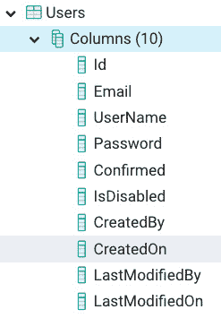

图 14.12-更新为可审计的用户

太棒了！现在我们可以创建实际调用我们数据库的存储库库。由于我们在上一章中创建了我们的会话状态，[*第十三章*]（B15508_13_Final_JC_ePub.xhtml#_idTextAnchor208），*使用 Express 和 Redis 设置会话状态*，让我们首先创建与身份验证相关的调用：

1.  在创建我们的主要代码之前，我们需要先做一些事情。您可能还记得[*第十一章*]（B15508_11_Final_JC_ePub.xhtml#_idTextAnchor167），*我们将学到什么-在线论坛应用*，我们使用了一个名为`isPasswordValid`的函数来检查用户的密码是否足够长和复杂。因为，正如我当时提到的，通常应该在客户端和服务器上进行验证。因此，让我们暂时将`PasswordValidator.ts`文件和`common/validators`文件夹结构复制到我们的服务器项目中，稍后我将展示一种在多个项目之间共享代码的方法。

1.  让我们还为电子邮件地址创建一个验证器。在相同的`common/validators`目录中创建一个`EmailValidator.ts`文件，并添加此代码：

```ts
export const isEmailValid = (email: string) => {
if (!email) return "Email cannot be empty";
```

在这里，我检查了一个空地址。

```ts
  if (!email.includes("@")) {
    return "Please enter valid email address.";
```

在这里，我检查了@符号。

```ts
  }
  if (/\s+/g.test(email)) {
    return "Email cannot have whitespaces";
```

最后，在这里我检查了空格。

```ts
  }
  return "";
};
```

如果没有发现问题，将返回一个空字符串。

1.  创建`UserRepo.ts`文件并添加此代码：

```ts
import { User } from "./User";
import bcrypt from "bcryptjs";
import { isPasswordValid } from "../common/validators/PasswordValidator";
import { isEmailValid } from "../common/validators/EmailValidator";
```

首先，我们有我们的导入，包括我们的验证器。

```ts
const saltRounds = 10;
```

`saltRounds`用于密码加密，很快您就会看到。

```ts
export class UserResult {
  constructor(public messages?: Array<string>, public    user?:
   User) {}
}
```

我们将使用`UserResult`类型指示身份验证期间是否发生错误。正如您所看到的，它基本上是`User`对象的包装器。我们正在将此对象用作我们函数的返回类型。我们这样做是因为在进行网络调用或其他复杂调用时，出现问题是很常见的。因此，具有在对象中包含错误或状态消息的能力是有益的。请注意，`messages`和`user`两个成员都是可选的。一旦我们开始使用这种类型，这将非常方便。

```ts
export const register = async (
  email: string,
  userName: string,
  password: string
): Promise<UserResult> => {
```

这是我们的`register`函数的开始。

```ts
  const result = isPasswordValid(password);
  if (!result.isValid) {
    return {
      messages: [
        "Passwords must have min length 8, 1 upper          character, 1 number, and 1 symbol",
      ],
    };
  }
  const trimmedEmail = email.trim().toLowerCase();
  const emailErrorMsg = isEmailValid(trimmedEmail);
  if (emailErrorMsg) {
    return {
      messages: [emailErrorMsg],
    };
  }
```

在这里，我们运行了我们的两个验证器`isPasswordValid`和`isEmailValid`。请注意，我们使用对象字面量作为返回对象，而没有包含`user`成员。同样，TypeScript 只关心我们对象的形状是否与类型的形状匹配。因此，在这种情况下，由于我们的`UserResult`成员`user`是可选的，我们可以创建一个不包括它的`UserResult`对象。TypeScript 真的很灵活。

```ts
  const salt = await bcrypt.genSalt(saltRounds);
  const hashedPassword = await bcrypt.hash(password,    salt);
```

在这里，我们使用`saltRounds`常量和`bcryptjs`加密了我们的密码。

```ts
  const userEntity = await User.create({
    email: trimmedEmail,
    userName,
    password: hashedPassword,
  }).save();
```

然后，如果我们通过了验证，我们将`create`我们的`User`实体，然后立即`save`它。这两种方法都来自 TypeORM，请注意，当对实体数据库进行更改时，您需要使用`save`函数，否则它将无法在服务器上完成。

```ts
  userEntity.password = ""; // blank out for security
  return {
     user: userEntity
  };
};
```

然后，我们返回新实体，再次，由于我们的调用没有错误，我们只返回不包含任何`messages`的`user`对象。

1.  让我们尝试这个新功能`register`，进行真正的网络调用。像这样更新`index.ts`文件：

```ts
import express from "express";
import session from "express-session";
import connectRedis from "connect-redis";
import Redis from "ioredis";
import { createConnection } from "typeorm";
import { register } from "./repo/UserRepo";
import bodyParser from "body-parser";
```

请注意，我们现在导入了`bodyParser`。

```ts
require("dotenv").config();
const main = async () => {
  const app = express();
  const router = express.Router();
  await createConnection();
  const redis = new Redis({
    port: Number(process.env.REDIS_PORT),
    host: process.env.REDIS_HOST,
    password: process.env.REDIS_PASSWORD,
  });
  const RedisStore = connectRedis(session);
  const redisStore = new RedisStore({
    client: redis,
  });
  app.use(bodyParser.json());	
```

在这里，我们设置了我们的`bodyParser`，这样我们就可以从帖子中读取`json`参数。

```ts
  app.use(
    session({
      store: redisStore,
      name: process.env.COOKIE_NAME,
      sameSite: "Strict",
      secret: process.env.SESSION_SECRET,
      resave: false,
      saveUninitialized: false,
      cookie: {
        path: "/",
        httpOnly: true,
        secure: false,
        maxAge: 1000 * 60 * 60 * 24,
      },
    } as any)
  );
```

所有这些代码保持不变：

```ts
  app.use(router);
  router.post("/register", async (req, res, next) => {
    try {
      console.log("params", req.body);
      const userResult = await register(
        req.body.email,
        req.body.userName,
        req.body.password
      );
      if (userResult && userResult.user) {
        res.send(`new user created, userId: ${userResult.         user.id}`);
      } else if (userResult && userResult.messages) {
        res.send(userResult.messages[0]);
      } else {
        next();
      }
    } catch (ex) {
      res.send(ex.message);
    }
  });
```

如您所见，我们删除了以前的`get`路由，并在注册 URL 上用`post`替换它。这个调用现在运行我们的`UserRepo` `register`函数，如果成功，它会发送一个带有新用户 ID 的消息。如果不成功，它会发送回来自存储库调用的错误消息。在这种情况下，我们只使用第一条消息，因为我们将删除这些路由，并在*第十五章*中用 GraphQL 替换它们，*添加 GraphQL 模式-第一部分*：

```ts
  app.listen({ port: process.env.SERVER_PORT }, () => {
    console.log(`Server ready on port
     ${process.env.SERVER_PORT}`);
  });
};
main();
```

现在我们将开始测试。但是，我们需要切换到使用 Postman 而不是 curl。Postman 是一个免费的应用程序，它允许我们向服务器发出`GET`和`POST`调用，并接受会话 cookie。它非常容易使用：

1.  首先，转到[`www.postman.com/downloads`](https://www.postman.com/downloads)，并下载并安装适用于您系统的 Postman。

1.  安装后，您应该首先在 Postman 上运行站点根目录的`GET`调用。我在`index.ts`中为根目录创建了一个简单的路由，它将初始化会话及其 cookie。像这样在我们的站点上运行`GET`调用：

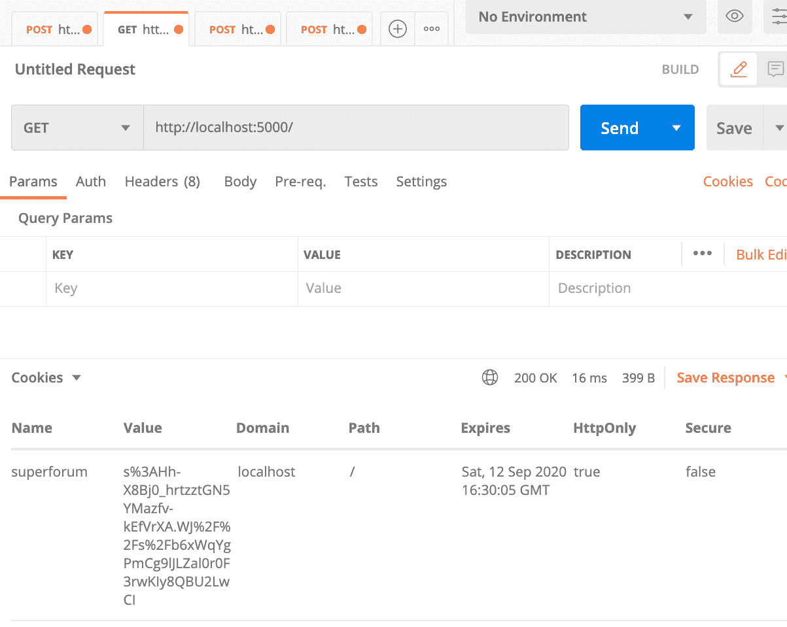

图 14.13-在站点根目录上运行 Postman

这就是您可以运行相同`GET`调用的方法：

1.  在标有**GET**的顶部标签下，您应该看到左侧的一个下拉菜单。选择**GET**并添加本地 URL。没有参数，所以只需点击**Send**。

1.  然后，在左下角，您将看到另一个下拉菜单。选择**Cookies**，您应该会看到我们的名为**superforum**的 cookie。

现在您已经获得了维护会话状态所需的 cookie。因此，我们现在可以继续我们的测试，从`register`函数开始：

1.  打开一个新标签，选择`http://localhost:5000/register`。

1.  点击**Headers**选项卡，并插入**Content-Type**，如下所示：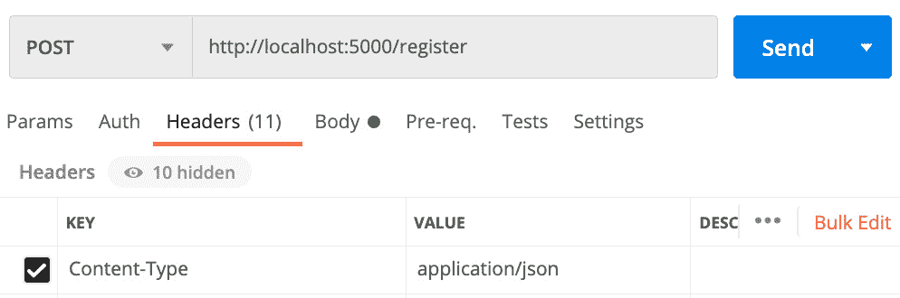

图 14.14-内容类型

1.  现在，选择`电子邮件`，尽管它是无效的，`用户名`和`密码`，也是无效的。

但是，这种失败仍然是好的，因为我们已经确认了我们的验证是有效的。

1.  让我们修复密码，然后再试一次。将密码更新为`Test123!@#`，然后再次运行它：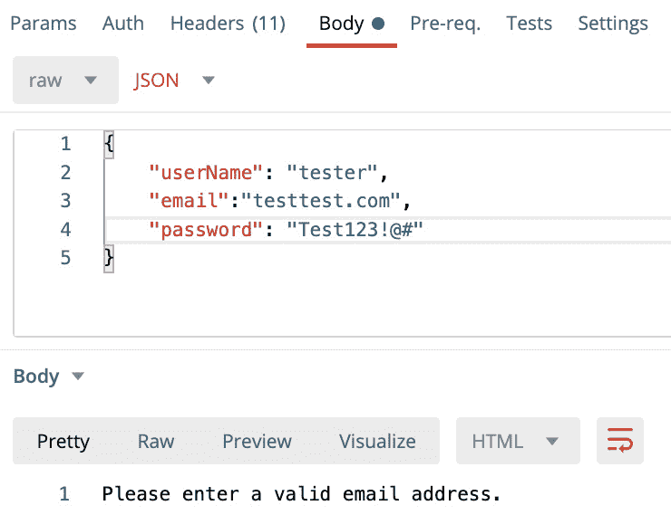

图 14.16-尝试再次注册

现在您应该会看到消息**请输入有效的电子邮件地址**。再次强调，这正是我们想要的，因为显然给出的电子邮件是无效的。

1.  让我们再试一次。将电子邮件更新为`test@test.com`，并运行此操作：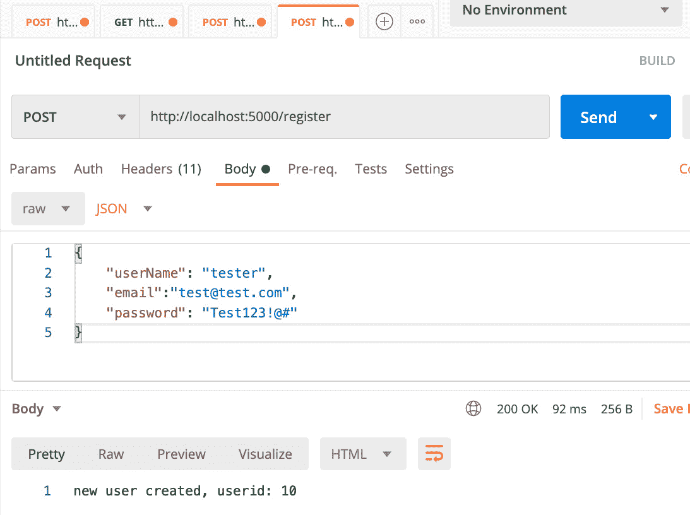

图 14.17-成功注册

输出消息为`10`，因为我在准备本书时进行了一些测试。ID 字段通常将从`1`开始。如果您再次看不到此结果，请确保在使用`GET`调用时在我们网站的根目录上运行 Postman。

1.  太棒了！成功了！现在，让我们查看我们的`Users`表，以确保用户确实已添加：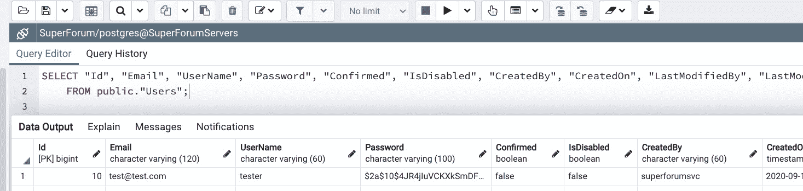

图 14.18-向用户表添加新用户

您可以通过右键单击`pgAdmin`中的`Users`表并选择`Scripts > SELECT Script`来运行所示的查询。您可以通过点击顶部的播放按钮来运行脚本。但是，如您所见，我们的用户已插入到数据库中。

1.  现在，让我们用我们的`login`函数更新`UserRepo`。将以下代码添加到`UserRepo`的末尾：

```ts
export const login = async (
  userName: string,
  password: string
): Promise<UserResult> => {
  const user = await User.findOne({
    where: { userName },
  });
  if (!user) {
    return {
      messages: [userNotFound(userName)],
    };
  }
  if (!user.confirmed) {
    return {
      messages: ["User has not confirmed their        registration email yet."],
    };
  }
  const passwordMatch = await bcrypt.compare(password, 
    user?.password);
  if (!passwordMatch) {
    return {
      messages: ["Password is invalid."],
    };
  }
  return {
    user: user,
  };
};
```

这里没有太多要展示的。 我们尝试查找具有给定`userName`的用户。 如果找不到，则返回一条消息，指出未找到`user`，使用名为`userNotFound`的函数。 我使用函数是因为我们稍后将重用此消息。 这是一个简单的函数，所以我不会在这里介绍它（它在源代码中）。 如果找到用户，那么我们首先看一下帐户是否已确认。 如果没有，我们会提供一个错误。 接下来，我们通过使用`bcryptjs`来检查他们的密码，因为我们在注册时使用了该工具对其进行加密。 如果不匹配，我们还会提供一个错误。 如果一切顺利，用户存在，我们将返回用户。

1.  让我们也尝试运行这个。 通过在注册路线下方添加这个新路线来更新`index.ts`：

```ts
router.post("/login", async (req, res, next) => {
    try {
      console.log("params", req.body);
      const userResult = await login(req.body.userName, 
        req.body.password);
      if (userResult && userResult.user) {
        req.session!.userId = userResult.user?.id;
        res.send(`user logged in, userId: 
         ${req.session!.userId}`);
      } else if (userResult && userResult.messages) {
        res.send(userResult.messages[0]);
      } else {
        next();
      }
    } catch (ex) {
      res.send(ex.message);
    }
  });
```

这与我们的`register`路线非常相似。 但是，在这里，我们将用户的`id`保存到会话状态中，然后使用该会话发送一条消息。

1.  让我们运行这个路线，看看会发生什么。 再次在 Postman 中打开一个新标签，并按照这里显示的设置运行。 **记住**在**Headers**选项卡中**添加** **Content-Type**标头：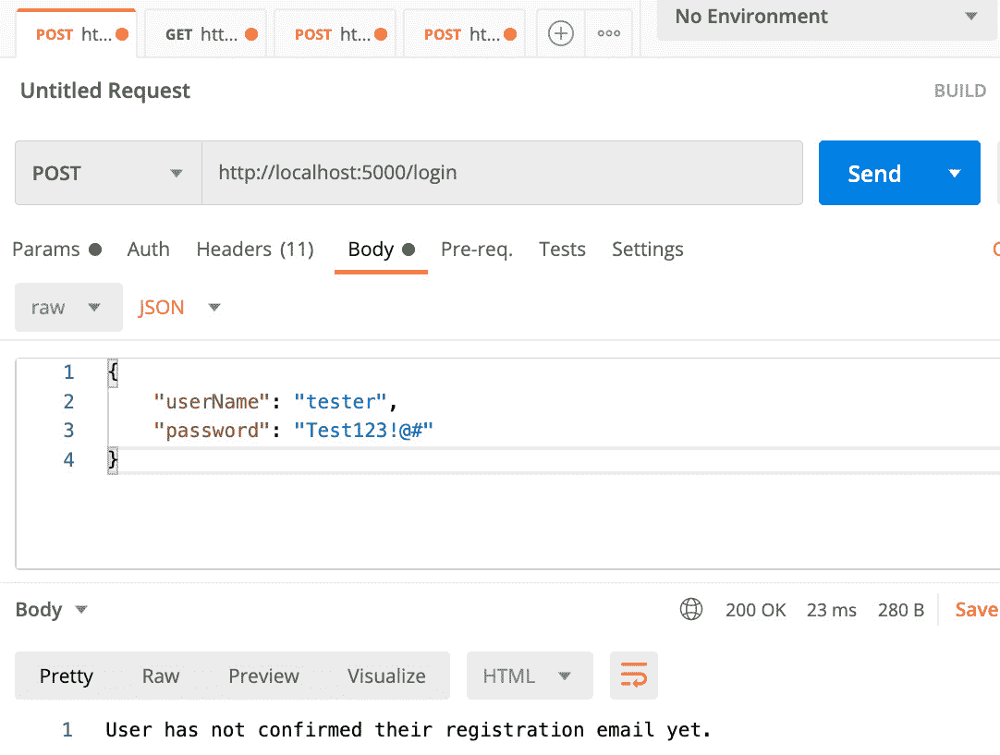

图 14.19 - 登录路线

同样，这是很好的，因为我们的验证正在起作用。

1.  转到您的`pgAdmin`，打开您用于运行`SELECT`查询以查看我们第一个插入的用户的相同屏幕。 然后，运行此 SQL 以将我们的用户的`confirmed`列更新为`true`：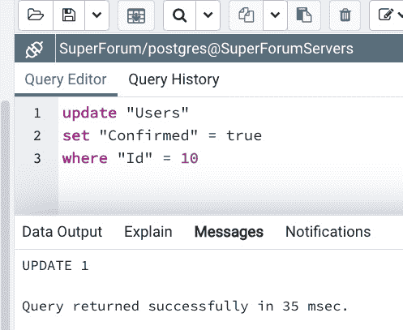

图 14.20 - 更新用户的确认字段

运行查询后，您应该会看到与*图 14.20*中显示的相同消息。

1.  现在，让我们运行 Postman 再次尝试登录：

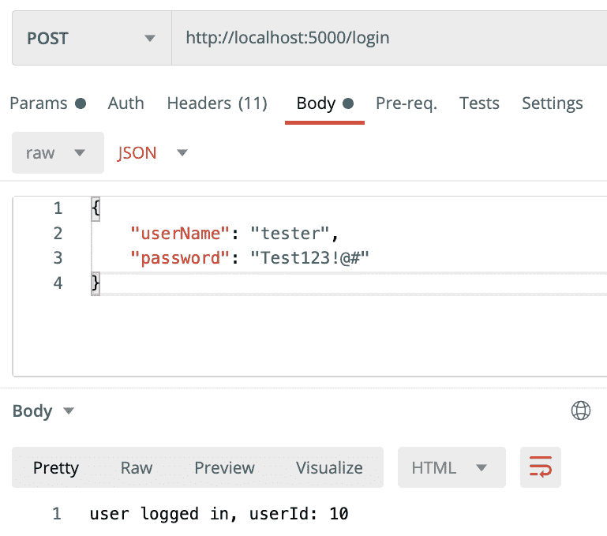

图 14.21 - 登录用户

现在，我们的用户可以登录，并且根据返回的消息，我们现在可以看到我们正在使用会话状态。 我已在源代码中创建了`logout`函数和路线。 我不会在这里展示它，因为它很简单。

注意

如果您尝试保存到会话失败，请确保您的 Redis 服务正在运行。

太棒了！ 我们已经走了很长的路。 我们现在拥有基于会话的身份验证，但我们还没有完成。 我们需要创建插入`Threads`和`ThreadItems`以及检索它们的方法。 让我们从`Threads`开始：

1.  在创建新的`ThreadRepo`存储库之前，让我们构建一个小助手。 在`UserRepo`中，我们有一个名为`UserResult`的类型，其中包含一组消息和一个用户作为成员。 您会注意到任何`Threads`、`ThreadItems`和`Categories`的存储库都需要类似的构造。 它应该有一组消息和实体，尽管返回的实体将是一组项目，而不仅仅是一个。

这似乎是使用 TypeScript 泛型的好地方，这样我们可以在所有这些实体之间共享单个结果类型。 让我们创建一个名为`QueryResult`的新通用结果对象类型。 我们在*第二章*中学习了有关 TypeScript 泛型的知识，*探索 TypeScript*。

创建一个名为`QueryArrayResult.ts`的文件，并将以下代码添加到其中：

```ts
export class QueryArrayResult<T> {
  constructor(public messages?: Array<string>, public    entities?: Array<T>) {}
}
```

如您所见，这与原始的`UserResult`非常相似。 但是，此类型使用类型`T`的通用类型来指示我们的任何实体。

警告

`pg`依赖项还有一个名为`QueryArrayResult`的类型。 在导入我们的依赖项时，请确保导入我们的文件，而不是`pg`。

1.  现在，让我们在`ThreadRepo`中使用这种新的`QueryArrayResult`类型。 在`repo`文件夹中创建一个名为`ThreadRepo.ts`的新文件，并添加以下代码：

```ts
export const createThread = async (
  userId: string,
  categoryId: string,
  title: string,
  body: string
): Promise<QueryArrayResult<Thread>> => {
```

所示的参数是必需的，因为每个“线程”必须与用户和类别相关联。 请注意，`userId`是从我们的会话中获取的。

```ts
  const titleMsg = isThreadTitleValid(title);
  if (titleMsg) {
    return {	
      messages: [titleMsg],
    };
  }
  const bodyMsg = isThreadBodyValid(body);
  if (bodyMsg) {
    return {
      messages: [bodyMsg],
    };
  }
```

在这里，我们验证我们的`title`和`message`。

```ts
  // users must be logged in to post
  const user = await User.findOne({
    id: userId,
  });
  if (!user) {
    return {
      messages: ["User not logged in."],
    };
  }
```

在这里，我们获取我们提供的会话`userId`，并尝试找到匹配的`user`。 我们稍后需要这个`user`对象来创建我们的新`Thread`。

```ts
  const category = await ThreadCategory.findOne({
    id: categoryId,
  });
  if (!category) {
    return {
      messages: ["category not found."],
    };
  }
```

在这里，我们得到一个`category`对象，因为我们在创建新的`Thread`时需要传递它。

```ts
  const thread = await Thread.create({
    title,
    body,
    user,
    category,
  }).save();
  if (!thread) {
    return {
      messages: ["Failed to create thread."],
    };
  }
```

正如你所看到的，我们传递`title`、`body`、`user`和`category`来创建我们的新`Thread`。

```ts
  return {
    messages: ["Thread created successfully."],
  };
};
```

我们只返回消息，因为我们不需要返回实际的对象。此外，返回不需要的对象在 API 负载大小方面是低效的。

1.  在我们继续之前，我们需要向数据库中添加一些`ThreadCategories`，这样我们才能真正使用`createThread`函数。去源代码中找到`utils/InsertThreadCategories.txt`文件。将这些`insert`语句复制粘贴到`pgAdmin`的查询屏幕中并运行。这将创建列出的`ThreadCategories`。

1.  接下来，我们需要添加用于创建`Threads`的路由。将以下代码添加到`index.ts`中：

```ts
router.post("/createthread", async (req, res, next) => {
    try {
      console.log("userId", req.session);
      console.log("body", req.body);
      const msg = await createThread(
        req.session!.userId, // notice this is from          session!
        req.body.categoryId,
        req.body.title,
        req.body.body
      );
```

在这个超级简单的调用中，我们向`createThread`函数传递参数。同样，我们的`userId`来自我们的会话，因为用户应该登录才能被允许发布，然后我们简单地返回结果消息。

```ts
      res.send(msg);
    } catch (ex) {
      console.log(ex);
      res.send(ex.message);
    }
  });
```

1.  让我们尝试运行这个路由。不过，在此之前，先在 Postman 中运行登出路由。你可以在`http://localhost:5000/logout`URL 中找到它。我相信你现在可以自己设置 Postman。一旦完成，让我们尝试运行`createthread`路由，希望它应该会失败验证: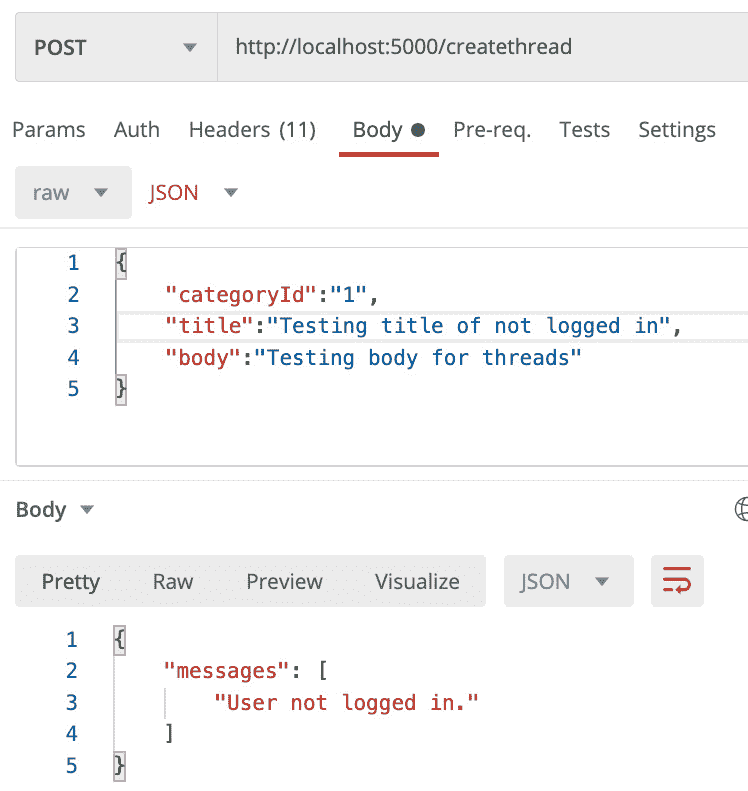

图 14.22 – 测试 createthread 路由

是的，它如预期般失败了验证。

1.  现在，让我们再次登录，以便我们的会话得到创建。再次使用 Postman 进行操作，然后再次运行`createthread`路由。这次，它应该会显示消息，**Thread created successfully**。

1.  好的。现在我们需要另外两个函数，一个是根据其 ID 获取单个`Thread`，另一个是获取`ThreadCategory`的所有线程。将以下代码添加到`ThreadRepo`中：

```ts
export const getThreadById = async (
  id: string
): Promise<QueryOneResult<Thread>> => {
  const thread = await Thread.findOne({ id });
  if (!thread) {
    return {
      messages: ["Thread not found."],
    };
  }
  return {
    entity: thread,
  };
};
```

这个`getThreadById`函数非常简单。它只是基于 ID 查找单个线程。

```ts
export const getThreadsByCategoryId = async (
  categoryId: string
): Promise<QueryArrayResult<Thread>> => {
  const threads = await Thread.   createQueryBuilder("thread")
    .where(`thread."categoryId" = :categoryId`, {       categoryId })
    .leftJoinAndSelect("thread.category", "category")
    .orderBy("thread.createdOn", "DESC")
    .getMany();
```

这个`getThreadsByCategoryId`函数更有趣。`Thread.createQueryBuilder`是 TypeORM 中的一个特殊函数，允许我们构建更复杂的查询。函数的`thread`参数是一个别名，用于表示查询中的 Threads 表。因此，如果你看一下查询的其余部分，比如`where`子句，你会发现我们使用`thread`作为字段或关系的前缀。`leftJoinAndSelect`函数意味着我们要进行 SQL 左连接，但同时也要返回相关的实体，即`ThreadCategory`与结果集一起。`OrderBy`相当直观，`getMany`只是意味着返回所有项目。

```ts
  if (!threads) {
    return {
      messages: ["Threads of category not found."],
    };
  }
  console.log(threads);
  return {
    entities: threads,
  };
};
```

1.  其余的代码非常简单。让我们测试`getThreadsByCategoryId`作为一个路由。将其添加到`index.ts`文件中：

```ts
router.post("/threadbycategory", async (req, res, next) => {
    try {
      const threadResult = await 
       getThreadsByCategoryId(req.body.categoryId);
```

在这里，我们使用`categoryId`参数调用了`getThreadsByCategoryId`。

```ts
      if (threadResult && threadResult.entities) {
        let items = "";
        threadResult.entities.forEach((th) => {
          items += th.title + ", ";
        });
        res.send(items);
      } else if (threadResult && threadResult.messages) {
        res.send(threadResult.messages[0]);
      }
```

在这个`if else`代码中，我们要么显示所有标题，要么显示错误。

```ts
    } catch (ex) {
      console.log(ex);
      res.send(ex.message);
    }
  });
```

1.  其余的代码与之前一样。在你的 Postman 客户端中运行这个，你应该会看到这个。再次提醒，你的 ID 号码可能会有所不同：

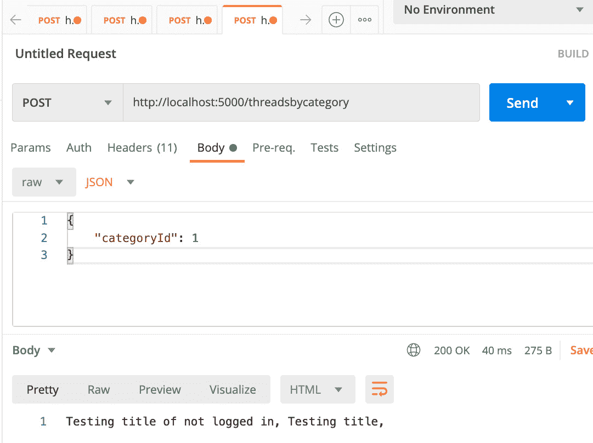

图 14.23 – 测试 threadsbycategory 路由

我会把`getThreadById`的测试留给你，因为它很容易。同样，源代码在我们的项目存储库中。

`ThreadItems`的代码几乎相同，并且在我们的源代码中。所以，我不会在这里进行复习。现在，我们需要一些额外的函数来获取诸如`ThreadCategories`之类的东西，以填充我们的 React 应用程序的`LeftMenu`。我们还需要检索我们的`Threads`和`ThreadItems`的积分。我们还需要`UserProfile`屏幕的相关`Thread`数据。然而，这些调用将重复我们在本节学到的许多概念，而且我们将不得不创建路由，最终我们将在开始 GraphQL 服务器代码后删除。因此，让我们把这些留到*第十五章*，*添加 GraphQL 模式-第一部分*，在那里我们还可以开始将后端 GraphQL 代码与我们的 React 前端集成。

在本节中，我们学习了如何构建一个存储库层，并使用 TypeORM 进行 Postgres 查询。一旦我们开始在下一章中集成 GraphQL，我们将会重复使用我们的查询技能，因此这是我们将继续使用的重要知识。

# 总结

在本章中，我们学习了如何设置一个 Postgres 数据库以及如何使用 ORM TypeORM 进行查询。我们还学习了如何通过使用存储库层来保持我们的代码清晰分离。

在下一章中，我们将学习如何在我们的服务器上启用 GraphQL。我们还将完成我们的数据库查询，并将我们的后端集成到我们的 React 前端中。
