# 第十五章：添加 GraphQL 模式第一部分

在本章中，我们将继续通过集成 GraphQL 来构建我们的应用程序。我们将在客户端和服务器上都这样做。我们还将完成构建后端 Express 服务器并将该后端与我们的 React 客户端集成。

在本章中，我们将涵盖以下主要主题：

+   创建 GraphQL 服务器端的 typedefs 和解析器

+   将身份验证与 GraphQL 解析器集成

+   为查询 Apollo GraphQL 创建 React 客户端 Hooks

# 技术要求

您应该对 GraphQL 有基本的了解，并且对 React、Node.js、Postgres 和 Redis 有很好的了解。我们将再次使用 Node 和**Visual Studio Code**（**VSCode**）来编写我们的代码。

GitHub 存储库位于[`github.com/PacktPublishing/Full-Stack-React-TypeScript-and-Node`](https://github.com/PacktPublishing/Full-Stack-React-TypeScript-and-Node)。使用`Chap15`文件夹中的代码。

要设置*第十五章*代码文件夹，请执行以下操作：

1.  转到您的`HandsOnTypescript`文件夹，并创建一个名为`Chap15`的新文件夹。

1.  现在转到`Chap14`文件夹，并将`super-forum-server`文件夹复制到`Chap15`文件夹中。确保所有文件都已复制。

1.  在`super-forum-server`文件夹中删除`node_modules`文件夹和`package-lock.json`文件。确保您在`super-forum-server`文件夹中，并运行此命令：

```ts
npm install 
```

1.  现在确保您的 Postgres 服务器和 Redis 服务器正在运行，如*第十三章*中所示，*使用 Express 和 Redis 设置会话状态*，以及*第十四章*，*使用 TypeORM 设置 Postgres 和存储库层*。然后，通过运行此命令来测试您的服务器：

```ts
npm start 
```

1.  现在让我们复制我们的客户端应用。转到`Chap13`文件夹，将`super-forum-client`复制到`Chap15`的根目录。确保所有文件都已复制。

1.  删除`node_modules`文件夹和`package-lock.json`文件。现在确保您在`super-forum-client`文件夹中，并运行此命令：

```ts
npm install
```

1.  通过运行此命令测试它是否有效：

```ts
npm start 
```

# 创建 GraphQL 服务器端 typedefs 和解析器

在本节中，我们将把 GraphQL 服务添加到我们的 Express 服务器中。我们还将开始将我们在*第十四章*中创建的路由转换为 GraphQL 查询。我们还将完善我们需要的其余调用，作为 GraphQL 查询。

让我们首先将 GraphQL 集成到我们的 Express 应用程序中（我们在*第九章*中介绍了 GraphQL，*什么是 GraphQL*，以及*第十章*，*使用 TypeScript 和 GraphQL 依赖项设置 Express 项目*）：

注意

本章中将有大量的代码，不是所有代码都可以在文本中显示。请经常参考 GitHub 存储库代码，这是章节源代码。还要注意，章节源代码是最终运行的项目，只包含最终的工作代码。

1.  让我们开始安装 GraphQL。运行这个命令：

```ts
npm i apollo-server-express graphql graphql-middleware graphql-tools
```

1.  接下来，让我们创建我们的初始类型定义`typeDefs`。在`src`文件夹内创建一个名为`gql`的文件夹。然后在其中创建文件`typeDefs.ts`。现在添加此代码：

```ts
import { gql } from "apollo-server-express";
const typeDefs = gql`
  scalar Date
```

我们定义了一个新的自定义`scalar`类型，`Date`，在 GraphQL 中默认不可用于日期和时间：

```ts
  type EntityResult {
    messages: [String!]
  }
```

这种`EntityResult`类型将在我们的解析器返回错误或消息而不是实体时使用：

```ts
  type User {
    id: ID!
    email: String!
    userName: String!
    password: String!
    confirmed: Boolean!
    isDisabled: Boolean!
    threads: [Thread!]
    createdBy: String!
    createdOn: Date!
    lastModifiedBy: String!
    lastModifiedOn: Date!
  }
```

我们在这里创建了我们的`User`类型。注意到与`Thread`和`ThreadItem`的关系。我们还使用了我们的`Date`类型：

```ts
  type Thread {
    id: ID!
    views: Int!
    isDisabled: Boolean!
    title: String!
    body: String!
    user: User!
    threadItems: [ThreadItem!]
    category: ThreadCategory
    createdBy: String!
    createdOn: Date!
    lastModifiedBy: String!
    lastModifiedOn: Date!
}
```

我们创建了我们的`Thread`类型及其关系：

```ts
  union ThreadResult = Thread | EntityResult
```

现在我们正在实现我们的真实应用程序，是时候使用一些更复杂的 GraphQL 特性了。`union`类型与 TypeScript 中的概念相同。它将允许我们从可能的 GraphQL 类型列表中返回任何类型。例如，在这个例子中，这个类型可以表示*要么*是 Thread，要么是 EntityResult，但不能同时是两者。我将很快展示这种类型的用法，它将变得更清晰。

```ts
  type ThreadItem {
    id: ID!
    views: Int!
    isDisabled: Boolean!
    body: String!
    user: User!
    thread: Thread!
    createdBy: String!
    createdOn: Date!
    lastModifiedBy: String!
    lastModifiedOn: Date!
  }
```

我们创建了我们的`ThreadItem`类型。

```ts
  type ThreadCategory {
    id: ID!
    name: String!
    description: String
    threads: [Thread!]!
    createdBy: String!
    createdOn: Date!
    lastModifiedBy: String!
    lastModifiedOn: Date!
}
```

`ThreadCategory`类型还指的是它包含的`Threads`。

```ts
  type Query {
    getThreadById(id: ID!): ThreadResult
  }
`;
```

在这里，我们有一个带有`getThreadById`函数的`Query`。注意它返回我们的`union` `ThreadResult`。我们稍后会详细介绍这个。

```ts
export default typeDefs;
```

1.  现在让我们创建一个简单的解析器文件，以开始使用我们的 GraphQL 安装。在`gql`文件夹中创建一个名为`resolvers.ts`的文件，并添加以下代码：

```ts
import { IResolvers } from "apollo-server-express";
interface EntityResult {
  messages: Array<string>;
}
```

我们将使用`EntityResult`作为我们的错误和状态消息的返回类型。还要将我们的类型映射添加到`typeDefs`文件中的相同类型：

```ts
const resolvers: IResolvers = {
  ThreadResult: {
    __resolveType(obj: any, context: GqlContext, info:      any) {
      if (obj.messages) {
        return "EntityResult";
      }
      return "Thread";
    },
},
```

这是我们正在使用的 GraphQL 的另一个新特性。`ThreadResult`是在 GraphQL 中表示两种类型`Thread`和`EntityResult`的`union`。这个解析器注意到即将返回一个`ThreadResult`，并在内部确定它是哪种类型。您使用的方法完全取决于您确定要发送的类型，但在这里，我们通过检查`obj.message`对`EntityResult`类型的`message`字段进行了简单的检查：

```ts
  Query: {
    getThreadById: async (
      obj: any,
      args: { id: string },
      ctx: GqlContext,
      info: any
    ): Promise<Thread | EntityResult> => {
      let thread: QueryOneResult<Thread>;
      try {
        thread = await getThreadById(args.id);
        if (thread.entity) {
          return thread.entity;
        }
        return {
          message: thread.messages ? thread.messages[0] :            "test",
        };
      } catch (ex) {
        throw ex;
      }
    },
  },
};
export default resolvers;
```

我们在*第九章*中学习了 GraphQL 查询，所以我不会在这里过多地介绍它。只需注意，在这个调用中，我接受来自`getThreadById`调用的结果类型`QueryOneResult`，并在一些处理之后，返回实际的实体本身或`EntityResult`。同样，由于我们的`typeDefs`文件将我们的查询返回为`ThreadResult`，它将转到`ThreadResult`查询并确定要返回的类型。这是我们将重复用于大多数存储库调用的模式。存储库在*第十四章*中有所涵盖，*使用 TypeORM 设置 Postgres 和存储库层*。

注意

对于这个示例应用程序，我们只是重新抛出可能发生的错误。但在您的生产应用程序中，您应该根据您的应用程序适当地处理错误，通常意味着至少记录问题，以便以后查看。

我们将稍后用更多的查询和变异填充这段代码，但现在让我们专注于完成我们的基本设置。

1.  将`Chap10/gql-server/src`文件夹中的`GqlContext.ts`文件复制并粘贴到`gql`文件夹中。正如我们在*第九章*中所展示的，*什么是 GraphQL？*，这是我们的请求和响应对象在 GraphQL 调用中的位置。

1.  现在让我们打开我们的`index.ts`文件，并将 GraphQL 添加到其中。在调用`listen`之前添加以下代码，并确保添加必要的导入，现在您应该能够自己完成：

```ts
const schema = makeExecutableSchema({ typeDefs, resolvers });
const apolloServer = new ApolloServer({
    schema,
    context: ({ req, res }: any) => ({ req, res }),
});
apolloServer.applyMiddleware({ app });
```

这基本上是与*第九章*中相似的代码，*什么是 GraphQL？*，在那里我们实例化我们的`ApolloServer`并将其带入我们的`typeDefs`、`resolvers`和 Express`app`实例。

1.  让我们测试一下，确保它能正常工作。打开 URL `http://localhost:5000/graphql`。这是我们在*第九章*中审查过的 GraphQL playground，*什么是 GraphQL？*。按照所示运行它：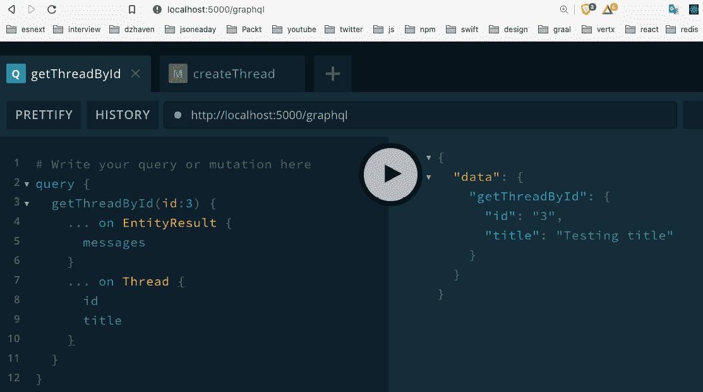

图 15.1 – 对 GraphQL 的第一个查询

所以，你可以看到，我们的调用现在可以工作了。与我们之前对 GraphQL 的一些调用的唯一区别是，由于我们的调用可能返回两种不同的类型，我们使用`… on <some type>`语法来决定返回时我们想要哪个实体和字段（这个功能称为内联片段）。同样，请记住你的本地 ID 号可能不会和我的一样，所以你需要发送在你的数据库中确实存在的 ID。

1.  好的，让我们再做一个。这次，我们选择一个不返回实体的函数 - `createThread`函数。首先，在你的`typeDefs`文件末尾添加这个 mutation：

```ts
type Mutation {
    createThread(
      userId: ID!
      categoryId: ID!
      title: String!
      body: String!
    ): EntityResult
}
```

请注意我们没有返回`ThreadResult`。我们的`createThread`函数只返回一个字符串消息。所以这就是我们需要的全部。

1.  现在让我们更新`resolvers`文件。将此函数作为一个 mutation 添加进去。同样，你需要自己导入所需的任何内容：

```ts
Mutation: {
    createThread: async (
      obj: any,
      args: { userId: string; categoryId: string; title:        string; body: string },
      ctx: GqlContext,
      info: any
    ): Promise<EntityResult> => {
```

再次，和往常一样的参数列表，但这次我们只返回`EntityResult`，因为没有必要返回整个实体：

```ts
      let result: QueryOneResult<Thread>;
      try {
        result = await createThread(
          args.userId,
          args.categoryId,
          args.title,
          args.body
        );
```

在这里，我们调用了存储库的`createThread`并得到了结果。

```ts
        return {
          messages: result.messages
            ? result.messages
            : ["An error has occurred"],
        };
```

现在我们正在返回可能的消息列表来指示结果的状态。

```ts
      } catch (ex) {
        throw ex;
```

在生产中，你不应该简单地重新抛出异常，而是应该记录或以其他方式处理错误。我们在这里重新抛出异常是为了简化并专注于手头的概念，而不要被岔开。

```ts
      }
    },
  },
```

1.  所以，现在如果我们运行我们的代码，我们应该会看到这个：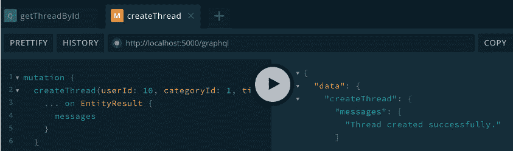

图 15.2 - createThread 函数

1.  好的，让我们再为 Threads 做一个调用。在`ThreadRepo`中有一个调用`getThreadsByCategoryId`，它返回一个 Threads 数组。这是一个问题，因为 GraphQL 的`union`运算符不支持数组。所以我们需要在`typeDefs`文件中创建另一个新的实体来表示一个 Threads 数组，然后我们可以创建我们的 union。通过在 ThreadResult union 下面添加以下内容来更新`typeDefs`文件：

```ts
type ThreadArray {
    threads: [Thread!]
}
union ThreadArrayResult = ThreadArray | EntityResult
```

所以我们首先创建了一个返回 Threads 数组的实体。然后我们创建了我们的`union`，它可以返回该实体类型或`EntityResult`。

现在在`getThreadById`查询之后添加这个：

```ts
getThreadsByCategoryId(categoryId: ID!): ThreadArrayResult!
```

1.  现在我们可以构建我们的解析器。通过添加以下内容更新`resolvers`查询部分：

```ts
getThreadsByCategoryId: async (
      obj: any,
      args: { categoryId: string },
      ctx: GqlContext,
      info: any
    ): Promise<{ threads: Array<Thread> } | EntityResult>      => {
      let threads: QueryArrayResult<Thread>;
      try {
        threads = await getThreadsByCategoryId(args.         categoryId);
        if (threads.entities) {
          return {
            threads: threads.entities,
          };
        }
```

在这里，我们返回我们的 Threads 数组。

```ts
        return {
          messages: threads.messages
            ? threads.messages
            : ["An error has occurred"],
        };
```

在这里，如果没有 Threads，我们返回我们的消息。

```ts
      } catch (ex) {
        throw ex;
      }
    },
```

1.  我们只缺少一个项目。当我们首次使用`union`时，我们必须为`EntityResult`类型创建一个查询。因此，我们需要为我们的新`ThreadArrayResult`类型做同样的事情。在`resolvers`文件中`EntityResult`定义之后输入以下代码：

```ts
ThreadArrayResult: {
    __resolveType(obj: any, context: GqlContext, info:     any) {
      if (obj.messages) {
        return "EntityResult";
      }
      return "ThreadArray";
    },
  },
```

这和之前的情况一样。如果`obj`有一个`messages`属性，我们返回`EntityResult`类型；如果没有，我们返回`ThreadArray`类型。

1.  如果我们运行这个查询，我们应该会看到类似这样的结果（注意我的结果中充满了重复的测试数据）：

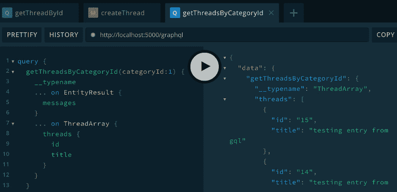

图 15.3 - getThreadsByCategoryId 函数

请注意我们添加了一个额外的字段叫做`__typename`。这个字段将告诉我们返回的是哪种类型，如所示是`ThreadArray`。

好的，现在我们有一个可以工作的 GraphQL 服务器，可以查询 Threads。尝试并集成*第十四章*中与身份验证无关的调用，*使用 TypeORM 设置 Postgres 和存储库层*。如果你遇到困难，可以参考源代码。但重要的是你尝试并且*不要*查看，因为这样你才能确切地知道你是否理解了材料。

## ThreadPoint System

现在我们已经集成了现有的解析器调用，让我们创建一些我们仍然需要的调用。我们为我们的 Threads 和 ThreadItems 创建了一个点系统。现在让我们实现一种增加和减少点数的方法。如果已经有一段时间了，请在继续之前查看一下 ThreadPoint 和 ThreadItemPoint 实体。您会注意到一个名为 `points` 的新字段，我将在我们开始编写代码时解释：

1.  首先，在 repo 文件夹内创建一个名为 `ThreadPointRepo.ts` 的文件，并将以下代码添加到其中（再次假设您知道如何添加必要的导入）：

```ts
export const updateThreadPoint = async (
  userId: string,
  threadId: string,
  increment: boolean
): Promise<string> => {
```

请注意参数中有一个 `increment` 布尔值。这决定了我们是要添加还是删除一个点。

```ts
  // todo: first check user is authenticated
```

一旦我们创建了我们的身份验证调用，我们将重新访问这个注释，并用代码填充它。请注意，添加一个 `todo` 注释是跟踪剩余待完成项目的好方法。它还通知团队成员这一事实。

```ts
  let message = "Failed to increment thread point";
  const thread = await Thread.findOne({
    where: { id: threadId },
    relations: ["user"],
  });
  if (thread!.user!.id === userId) {
    message = "Error: users cannot increment their own      thread";
    return message;
}
```

因此，我们首先获取给定 `threadId` 的 `Thread`。请注意，我们还检查了给定的 `User` 是否不是拥有该线程的相同 `User`。如果您的数据库中只有一个 `User`，您需要添加另一个 `User`，以便拥有 `Thread` 的所有者不是尝试增加其点数的相同人。您可以通过使用 SQL 插入查询或重用我们在*第十四章*中的注册路由来添加用户，*使用 TypeORM 设置 Postgres 和存储库层*。

```ts
  const user = await User.findOne({ where: { id: userId } });
```

在这里，我们在实际需要使用它们之前稍微获取了匹配的 `User`。我们稍后会看到为什么我们正在做一些看起来可能效率低下的事情。

```ts
  const existingPoint = await ThreadPoint.findOne({
    where: {
      thread: { id: threadId },
      user: { id: userId },
    },
    relations: ["thread"],
});
```

在这里，我们正在查看现有的点实体是否已经存在。我们将使用这个对象来决定如何稍后添加或删除点：

```ts
await getManager().transaction(async (transactionEntityManager) => {
```

正如您所看到的，我们有一些新的 TypeORM 代码。`getManager().transaction` 调用正在创建一个 SQL 事务。事务是一种将多个 SQL 操作作为单个原子操作执行的方式。换句话说，要么每个操作都将成功完成，要么全部失败。因此，此范围内运行的所有内容都是事务的一部分。

另外，我们之前注意到我们提前创建了一个 `User` 实体。这是因为最佳实践是避免在事务内进行选择查询。这不是一个硬性规定。但一般来说，在事务内进行选择查询会使事情变慢。

```ts
    if (existingPoint) {
      if (increment) {
        if (existingPoint.isDecrement) {
          await ThreadPoint.remove(existingPoint);
          thread!.points = Number(thread!.points) + 1;
          thread!.lastModifiedOn = new Date();
          thread!.save();
        }
      } else {
        if (!existingPoint.isDecrement) {
          await ThreadPoint.remove(existingPoint);
          thread!.points = Number(thread!.points) - 1;
          thread!.lastModifiedOn = new Date();
          thread!.save();
        }
      }
```

在本节中，我们通过检查 `existingPoint`（记住 `ThreadPoint` 可以表示正点或负点，如 `isDecrement` 字段所示）来检查 `ThreadPoint` 是否已经存在。一旦确定了这一点，我们决定是在进行增加还是减少。如果进行增加并且存在减少的 `ThreadPoint`，我们将删除该实体并且不做其他操作。如果我们正在进行减少并且存在增加的 `ThreadPoint`，我们将删除该实体并且不做其他操作。

现在，另一件需要注意的事情是我们的 Thread 实体现在有一个名为 points 的字段，我们根据需要进行增加或减少。这个字段将作为我们的 UI 中的一种快捷方式，它将允许我们获取当前 `Thread` 的点总数，而无需对该 `Thread` 的所有 `ThreadPoints` 进行求和：

```ts
    } else {
      await ThreadPoint.create({
        thread,
        isDecrement: !increment,
        user,
      }).save();
      if (increment) {
        thread!.points = Number(thread!.points) + 1;
      } else {
        thread!.points = Number(thread!.points) - 1;
      }
      thread!.lastModifiedOn = new Date();
      thread!.save();
    }
```

否则，如果根本没有现有的点，我们只需创建一个新的点，无论是增加还是减少：

```ts
    message = `Successfully ${
      increment ? "incremented" : "decremented"
    } point.`;
  });
  return message;
};
```

1.  现在像这样向 `typeDefs` 添加 `Mutation`：

```ts
updateThreadPoint(userId: ID!, threadId: ID!, increment: Boolean!): String!
```

1.  然后，通过将 `updateThreadPoint` 调用添加到 `Mutation` 部分来更新解析器。由于这只是对执行实际工作的存储库调用的包装器，我不会在这里显示代码。尝试看看是否可以在不查看代码的情况下创建 `Mutation`。

注意

我们将使用的大多数解析器只是我们的存储库调用的包装器。这使我们的解析器代码与我们的数据库和存储库调用分开。因此，大多数时候，我不会显示解析器代码，因为它很少并且在源代码中可用。

1.  运行如上所示的`Mutation`，然后检查您的数据库：

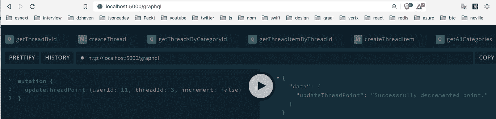

图 15.4 - 运行 updateThreadPoint

在这里，我们在 Postgres 数据库中的 mutation 结果，使用 pgAdmin：

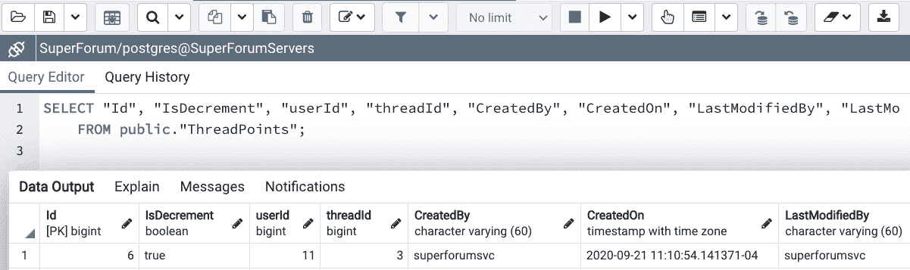

图 15.5 - 运行 updateThreadPoint 数据库结果

因此，我们的记录已成功创建，如图所示。

现在让我们再多讨论一下我们拥有的积分系统以及它是如何工作的。*喜欢*积分系统可以允许正面和负面积分，就像我们的系统一样。然而，它还必须防止用户投票超过一次。为了做到这一点，我们需要将每个积分与给出它的用户以及他们放在其上的 Thread 或 ThreadItem 相关联。这就是为什么我们有 ThreadPoint 和 ThreadPointItem 实体。

在一个用户众多的流量大的网站上，随时添加或删除积分可能对服务器造成重大负载。但比这更糟糕的是，如果我们每次调用获取 Thread 或 ThreadItem 数据时都必须总结所有这些 ThreadPoints 或 ThreadItemPoints。这是不可行的。因此，对于第一个问题，我们必须将其视为“每个用户一票”的积分系统的一部分。然而，对于积分总和的问题，我们可以尝试几种不同的方法来提高性能。

最有效的方法是添加一个缓存系统，使用像 Redis 这样的辅助服务。然而，构建缓存系统并不是一件微不足道的事情，远远超出了本书的范围。我们可以争论说，在我们的网站刚刚起步之前，要取得辉煌的成功和数十亿美元，我们不会有那种流量。因此，作为一个开始，我们可以尝试一些更简单的东西。

因此，我们所做的是将积分字段添加到我们的 Thread 和 ThreadItem 实体中，并在进行添加或删除积分的调用时递增值。这不是最好的解决方案，但现在可以。随着时间的推移，可以构建出更复杂的缓存系统或其他机制。

ThreadItemPoint 的代码几乎是相同的。继续尝试看看是否可以自己构建`ThreadItemPointRepo.ts`文件。如果遇到困难，可以随时查看源代码。

在本节中，我们开始将我们的存储库调用与我们的 GraphQL 层集成。我们还完善了我们的 Thread 和 ThreadItem 积分系统。在下一节中，我们将继续通过集成我们的身份验证调用来构建我们的 GraphQL API。 

# 将身份验证与 GraphQL 解析器集成

将身份验证集成到 GraphQL 中并不比添加任何其他功能有多大区别。在本节中，我们将学习如何做到这一点。

现在让我们集成我们与身份验证相关的调用。让我们从`register`调用开始：

1.  您会记得我们已经在*第十四章*中创建了我们的`register`调用，*使用 TypeORM 设置 Postgres 和存储库层*。现在，让我们添加我们的`typeDefs`和`resolvers`。首先，在`Mutation`部分的`typeDefs`文件中添加源代码中的`register`调用：

1.  现在，在我们的解析器文件中，在`Mutation`部分，添加我们的 GitHub 源代码中的代码。

这只是我们存储库调用的一个包装器，所以没有太多需要解释的，但请注意我们没有返回`User`对象；我们只返回一个状态消息。这是因为我们希望减少泄露不必要信息的机会。在尝试运行之前，让我们启用 GraphQL playground 以接受 cookie，以便我们进行测试。我们需要启用 cookie，以便我们的会话状态可以被保存，这样我们的调用可以检查用户是否已经登录。

在播放器的右上角，点击齿轮图标。将`request.credentials`字段设置为`include`，然后保存并刷新屏幕。如果现在运行它，我们应该会看到这个：

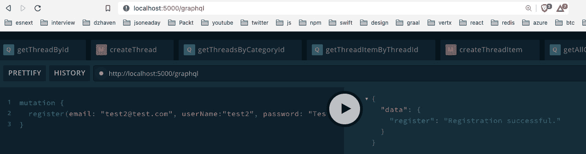

图 15.6 - 注册

1.  让我们继续`login`函数。将登录源代码添加到您的`typeDefs`文件的`Mutation`部分。

1.  现在添加源代码中的`login`解析器代码。我们的 Repository `login`调用正在检查用户是否存在，并确保密码匹配。然后 GraphQL 调用将`user.id`取出，并将其设置为 Session 对象`ctx.req.session.userId`，如果登录成功的话。还要注意的是，我们的解析器在成功时不返回`user`对象。我们稍后将创建一个新的函数来提供`User`信息。

1.  现在让我们做`logout`函数。首先，按照源代码中所示，在`Mutation`部分内添加`typeDefs`条目。

1.  现在从源代码中更新`Mutation`的解析器`logout`解析器代码。请注意，无论存储库`logout`调用返回什么响应，我们都会使用`ctx.req.session?.destroy`来`destroy` `session`，并将`ctx.req.session?.userId`设置为`undefined`。

1.  现在我们需要添加一个新的调用和一个新的类型到我们的`typeDefs`中。按照源代码中的代码，在`typeDefs`文件的`Query`部分中添加`me`函数。接下来，在`User`类型下面，添加这个`union`：

```ts
union UserResult = User | EntityResult
```

为什么我们需要这些？在我们调用`register`和`login`时，我们消除了返回的`User`对象，因为在这些调用之后可能会或可能不会使用`User`详细信息，我们不希望不必要地暴露`User`数据。然而，有时一旦`User`登录，我们可能希望查看他们的相关数据。例如，当他们访问他们的 UserProfile 屏幕时。因此，我们将使用这个`me`函数来处理。

1.  现在让我们为`me`函数添加我们的`UserRepo`调用。将此函数添加到`UserRepo`中：

```ts
export const me = async (id: string): Promise<UserResult> => {
  const user = await User.findOne({
    where: { id },
    relations: ["threads", "threads.threadItems"],
});
```

首先，请注意我们找到的`user`对象包括属于用户的任何`Threads`和`ThreadItems`。我们将在我们的 UserProfile 屏幕中使用这些：

```ts
  if (!user) {
    return {
      messages: ["User not found."],
    };
  }
  if (!user.confirmed) {
    return {
      messages: ["User has not confirmed their       registration email yet."],
    };
  }
  return {
    user: user,
  };
};
```

函数的其余部分与登录函数非常相似。

1.  现在让我们为`UserResult`和`me`函数创建我们的`resolvers`。在`const`的解析器顶部，按照代码中所示添加 UserResult 解析器。这与其他 Result `union`解析器相同-这里没有新的内容需要解释。

1.  在`Query`部分，按照源代码中的代码添加`me`函数的代码。

请注意，此解析器不接受任何参数，因为它从会话中获取`userId`。在第 193 行，它检查会话中是否有`userId`。如果没有，它会提前退出。如果会话中有`userId`，它将使用我们的`UserRepo` `me`函数来获取当前登录的`user`。其余部分基本上与返回实体的其他函数相同。

1.  让我们尝试运行我们的`me`解析器。确保您已经登录过一次，并且已经按照 GraphQL playground 中*Step 3*的说明进行了操作。如果您按照所示运行`me`，您应该会得到相关的数据：

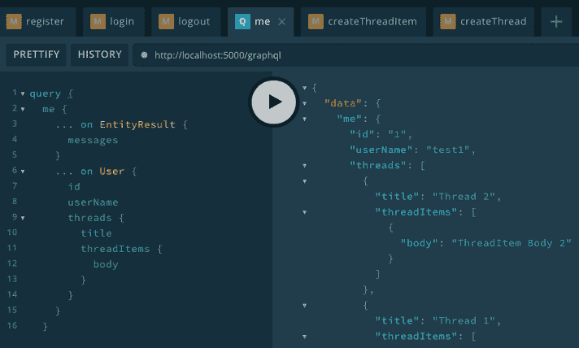

图 15.7 - 调用 me 解析器

如您所见，我们再次使用内联片段，并且能够获取相关的 Threads 和 ThreadItems。

在本节中，我们将我们的存储库层身份验证调用与 GraphQL 联系起来，并测试它们的功能。在下一节中，我们将通过将我们几乎完成的后端与我们的前端联系起来，完成我们的应用程序。

# 为 Apollo GraphQL 查询创建 React 客户端端 Hooks

在本节中，我们将通过将我们的 React 客户端连接到我们的 GraphQL 后端来完成我们的应用程序。我们已经走了很长的路，我们快要到达目的地了。

为了将我们应用程序的两个部分联系起来，我们需要将 CORS 添加到我们的 Express 服务器中。**CORS**代表**跨源资源共享**。这意味着我们的服务器将被设置为允许与其自身域不同的客户端域。

在即使是相当复杂的大多数服务器配置中，托管客户端应用程序的服务器和提供 API 的服务器并不位于同一域上。通常，您会有某种代理，例如 NGINX，它将接受来自浏览器的调用。该代理将根据需要“重定向”调用。我们将在*第十七章*中更详细地解释反向代理的工作原理，*将应用程序部署到 AWS*。

注意

代理是服务或某些服务的替身。当使用代理时，如果客户端调用服务，他们最终首先访问代理而不是直接访问服务。然后代理确定客户端的请求应该路由到哪里。因此，代理为公司提供了更好地控制其服务访问的能力。

启用 CORS 也是必要的，因为 React 应用程序在其自己的测试 Web 服务器上运行。在我们的情况下，它在端口`3000`上运行，而服务器在端口`5000`上运行。尽管它们都使用 localhost，但具有不同的端口实际上意味着不同的域。要更新 CORS，请执行以下操作：

1.  首先，我们需要更新我们的`.env`文件，以便包含客户端开发服务器的路径：

```ts
CLIENT_URL=http://localhost:3000
```

1.  打开`index.ts`并在`const app = express();`之后立即添加以下代码：

```ts
app.use(
    cors({
      credentials: true,
      origin: process.env.CLIENT_URL,
    })
);
```

`credentials`设置启用了标题 Access-Control-Allow-Credentials。这允许客户端 JavaScript 在成功提供凭据后从服务器接收响应。

1.  还要更新 Apollo Server，以便禁用其自己的`cors`。在`listen`之前更新此行：

```ts
apolloServer.applyMiddleware({ app, cors, which is enabled by default so we want to disable it.
```

现在我们已经将 CORS 安装到我们的服务器上。现在让我们在自己的 VSCode 窗口中打开我们的 React 项目，并安装 GraphQL 以开始与我们的 GraphQL 服务器集成：

1.  在自己的 VSCode 窗口中打开`super-forum-client`文件夹后，首先尝试运行它以确保它正常工作。如果您还没有这样做，请删除`node_modules`文件夹和`package-lock.json`文件，然后运行`npm install`一次。

1.  现在让我们安装 Apollo GraphQL 客户端。打开终端到`super-forum-client`的根目录，并运行以下命令：

```ts
npm install @apollo/client graphql 
```

1.  现在我们需要配置我们的客户端。打开`index.ts`并在`ReactDOM.render`之前添加以下代码：

```ts
const client = new ApolloClient({
  uri: 'http://localhost:5000/graphql',
  credentials: "include",
  cache: new InMemoryCache()
});
```

像往常一样，添加你的导入 - 这很容易理解。我们设置服务器的 URL，包括所需的任何凭据，并设置`cache`对象。请注意，这意味着 Apollo 会缓存我们所有的查询结果。

1.  接下来更新`ReactDOM.render`，并让其包括`ApolloProvider`：

```ts
ReactDOM.render(
  <Provider store={configureStore()}>
    <BrowserRouter>
    <ApolloProvider client={client}>
      <ErrorBoundary>{[<App key="App" />]}</       ErrorBoundary>
      </ApolloProvider>
    </BrowserRouter>
  </Provider>,
  document.getElementById("root")
);
```

1.  现在让我们通过获取 ThreadCategories 来测试它是否正常工作。打开`src/components/areas/LeftMenu.tsx`文件并进行以下更新：

```ts
import React, { useEffect, useState } from "react";
import { useWindowDimensions } from "../../hooks/useWindowDimensions";
import "./LeftMenu.css";
import { gql, useQuery } from "@apollo/client";
```

我们已经从 Apollo 客户端导入了一些项目。`gql`允许我们为 GraphQL 查询获取语法高亮显示和格式化。`UseQuery`是我们的第一个与 GraphQL 相关的客户端 Hook。它允许我们执行 GraphQL 查询，而不是执行 Mutation，但它会立即运行。稍后，我将展示一个允许延迟加载的 Hook：

```ts
const GetAllCategories = gql`
  query getAllCategories {
    getAllCategories {
      id
      name
    }
  }
`;
```

这是我们的查询。这里没有什么需要解释的，但请注意我们获取了`id`和`name`。

```ts
const LeftMenu = () => {
const { loading, error, data } = useQuery(GetAllCategories);
```

我们的`useQuery`调用返回属性`loading`，`error`和`data`。每个 Apollo GraphQL Hook 返回一组不同的相关属性。我们将看到这些特定属性如何在以下代码中使用：

```ts
  const { width } = useWindowDimensions();
  const [categories, setCategories] = useState<JSX.   Element>(
    <div>Left Menu</div>
  );
  useEffect(() => {
    if (loading) {
      setCategories(<span>Loading ...</span>);
```

在刚刚显示的代码中，我们首先检查数据是否仍在加载，方法是使用`loading`属性并在这种情况下提供占位文本。

```ts
    } else if (error) {
      setCategories(<span>Error occurred loading        categories ...</span>);
```

在此错误部分中，我们指示查询运行期间发生了错误。

```ts
    } else {
      if (data && data.getAllCategories) {
        const cats = data.getAllCategories.map((cat: any)         => {
          return <li key={cat.id}>
        <Link to={`/categorythreads/${cat.id}`}>{cat.         name}</Link>
     </li>;
        });
        setCategories(<ul className="category">{cats}        </ul>);
      }
```

最后，如果一切顺利，我们得到了我们的数据，然后我们显示一个无序列表，表示每个 ThreadCategory。请注意，每个`li`元素都有一个唯一的键标识符。在提供一组类似元素时，拥有键总是很重要的，因为它减少了不必要的渲染。此外，每个元素都是一个链接，向用户显示与特定`ThreadCategory`相关的所有 Threads：

```ts
    }
    // eslint-disable-next-line react-hooks/exhaustive-     //deps
  }, [data]);
  if (width <= 768) {
    return null;
  }
  return <div className="leftmenu">{categories}</div>;
};
export default LeftMenu;
```

1.  在桌面模式下运行应用程序应该显示这个屏幕。请注意，我已经点击了一个具有关联 Thread 数据的 ThreadCategory 链接。但当然，我们目前仍在使用`dataService`返回硬编码数据：

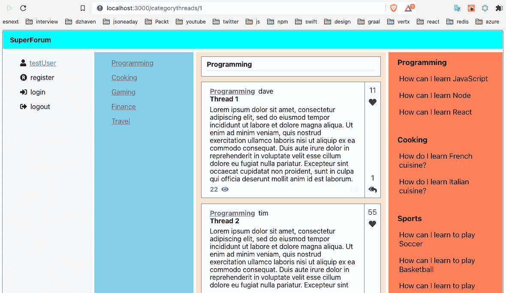

图 15.8 – 左侧菜单线程类别列表

太棒了 - 我们现在连接到了我们的 GraphQL 服务器！

## 主屏幕

恭喜 - 你已经走了很长的路。现在我们需要更新我们的 Main 组件，以便从我们的 GraphQL 服务返回真实的数据。让我们现在创建它：

1.  转到我们的`super-forum-server`项目，打开`typeDefs`文件，并在源代码中的`getThreadsByCategoryId`查询下方添加函数`getThreadsLatest`的模式条目。在这里，我们正在创建一个新的解析器`getThreadsLatest`，当没有特定的 ThreadCategory 给出时，它会给我们最新的 Threads。当给出 ThreadCategory 时，我们已经有了`getThreadsByCategoryId`解析器。

1.  打开`ThreadRepo`并添加这个函数：

```ts
export const getThreadsLatest = async (): Promise<QueryArrayResult<Thread>> => {
  const threads = await Thread.createQueryBuilder("thread")
    .leftJoinAndSelect("thread.category", "category")
    .leftJoinAndSelect("thread.threadItems",      "threadItems")
    .orderBy("thread.createdOn", "DESC")
    .take(10)
    .getMany();
```

我们有一个包括 ThreadCategories 和 ThreadItems 的查询 - `leftJoinAndSelect`，按`createdOn`字段排序，`orderBy`，并且只取最多 10 个项目（`take`）：

```ts
  if (!threads || threads.length === 0) {
    return {
      messages: ["No threads found."],
    };
  }
  return {
    entities: threads,
  };
};
```

其余部分与`getThreadsByCategoryId`类似，不再赘述。

让我们也更新我们的`getThreadsByCategoryId`函数，包括 ThreadItems：

```ts
export const getThreadsByCategoryId = async (
  categoryId: string
): Promise<QueryArrayResult<Thread>> => {
  const threads = await Thread.   createQueryBuilder("thread")
    .where(`thread."categoryId" = :categoryId`, {       categoryId })
    .leftJoinAndSelect("thread.category", "category")
    .leftJoinAndSelect("thread.threadItems",       "threadItems")
    .orderBy("thread.createdOn", "DESC")
    .getMany();
  if (!threads || threads.length === 0) {
    return {
      messages: ["Threads of category not found."],
    };
  }
  return {
    entities: threads,
  };
};
```

它与以前一样，只是多了一个`leftJoinAndSelect`函数。

1.  打开`resolvers`文件，并在 Query 部分的末尾添加源代码中的`getThreadsLatest`函数。这是一个几乎与`getThreadsByCategoryId`解析器相同的包装器，只是调用了`getThreadsLatest`。

1.  现在我们需要更新我们的`Main`React 组件，使其使用我们的 GraphQL 解析器而不是来自`dataService`的假数据。打开`Main`并像这样更新文件。

`const` `GetThreadsByCategoryId`是我们的第一个查询。正如您所看到的，它使用内联片段并获取我们的 Thread 数据字段：

```ts
const GetThreadsByCategoryId = gql`
  query getThreadsByCategoryId($categoryId: ID!) {
    getThreadsByCategoryId(categoryId: $categoryId) {
      ... on EntityResult {
        messages
      }
      ... on ThreadArray {
        threads {
          id
          title
          body
          views
          threadItems {
            id
          }
          category {
            id
            name
          }
        }
      }
    }
  }
`;
```

`GetThreadsLatest`基本上与`GetThreadsByCategoryId`相同：

```ts
const GetThreadsLatest = gql`
  query getThreadsLatest {
    getThreadsLatest {
      ... on EntityResult {
        messages
      }
      ... on ThreadArray {
        threads {
          id
          title
          body
          views
          threadItems {
            id
          }
          category {
            id
            name
          }
        }
      }
    }
  }
`;
```

现在我们开始使用`useLazyQuery` Hooks 定义我们的`Main`组件：

```ts
const Main = () => {
  const [
    execGetThreadsByCat,
    {
      //error: threadsByCatErr,
      //called: threadsByCatCalled,
      data: threadsByCatData,
    },
  ] = useLazyQuery(GetThreadsByCategoryId);
  const [
    execGetThreadsLatest,
    {
      //error: threadsLatestErr,
      //called: threadsLatestCalled,
      data: threadsLatestData,
    },
] = useLazyQuery(GetThreadsLatest);
```

现在显示的两个 Hooks 正在使用我们的查询。请注意，这些是延迟的 GraphQL 查询。这意味着它们不会立即运行，不像`useQuery`，只有在进行`execGetThreadsByCat`或`execGetThreadsLatest`调用时才会运行。`data`属性包含我们查询的返回数据。此外，我已经注释掉了两个返回的属性，因为我们没有使用它们。但是，如果您的调用遇到错误，它们是可用的。`Error`包含有关失败的信息，`called`指示 Hook 是否已经被调用。

```ts
  const { categoryId } = useParams();
  const [category, setCategory] = useState<Category |   undefined>();
  const [threadCards, setThreadCards] =   useState<Array<JSX.Element> | null>(
    null
  );
```

先前的状态对象保持不变。

```ts
  useEffect(() => {
    if (categoryId && categoryId > 0) {
      execGetThreadsByCat({
        variables: {
          categoryId,
        },
      });
    } else {
      execGetThreadsLatest();
    }
    // eslint-disable-next-line react-hooks/exhaustive-    // deps
  }, [categoryId]);
```

这个`useEffect`现在更新为只在需要时执行`execGetThreadsByCat`或`execGetThreadsLatest`。如果给定了`categoryId`参数，应该运行`execGetThreadsByCat`；如果没有，应该运行另一个：

```ts
  useEffect(() => {
    if (
      threadsByCatData &&
      threadsByCatData.getThreadsByCategoryId &&
      threadsByCatData.getThreadsByCategoryId.threads
    ) {
      const threads = threadsByCatData.      getThreadsByCategoryId.threads;
      const cards = threads.map((th: any) => {
        return <ThreadCard key={`thread-${th.id}`}         thread={th} />;
      });
      setCategory(threads[0].category);
      setThreadCards(cards);
    }
}, [threadsByCatData]);
```

在`useEffect`中，`threadsByCatData`的变化导致我们使用`getThreadsByCategoryId`查询的数据更新`category`和`threadCards`。

```ts
  useEffect(() => {
    if (
      threadsLatestData &&
      threadsLatestData.getThreadsLatest &&
      threadsLatestData.getThreadsLatest.threads
    ) {
      const threads = threadsLatestData.getThreadsLatest.      threads;
      const cards = threads.map((th: any) => {
        return <ThreadCard key={`thread-${th.id}`}         thread={th} />;
      });
      setCategory(new Category("0", "Latest"));
      setThreadCards(cards);
    }
  }, [threadsLatestData]);
```

在`useEffect`中，`threadsLatestData`的变化导致我们使用`getThreadsLatest`查询的数据更新`category`和`threadCards`。请注意，当没有给出`categoryId`时，我们只是使用一个通用的“最新”名称作为我们的 ThreadCategory。

```ts
  return (
    <main className="content">
      <MainHeader category={category} />
      <div>{threadCards}</div>
    </main>
  );
};
export default Main;
```

其余代码与以前相同。

1.  现在，如果我们为`categoryId`运行这个，我们应该会看到这个：

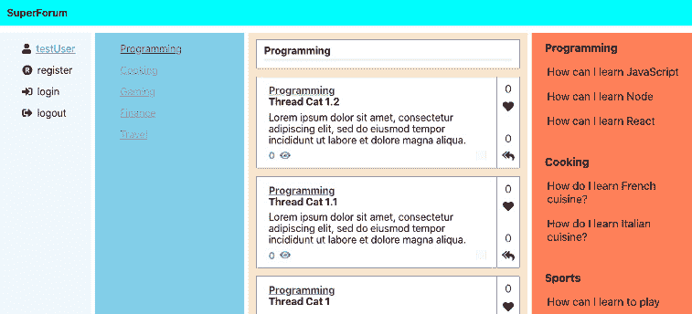

图 15.9 – 有 categoryId

如果我们在没有`categoryId`的情况下运行这个，我们应该会看到这个：

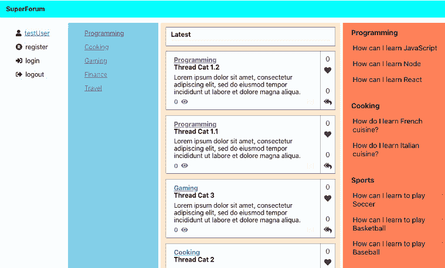

图 15.10 – 没有 categoryId

好了，现在我们的网站屏幕上有一些实际的真实数据了。在继续之前，让我们稍微清理一下我们的样式，并去掉一些占位背景颜色。我对`Nav.css`和`Home.css`文件进行了微小的更改。现在是这个样子的：

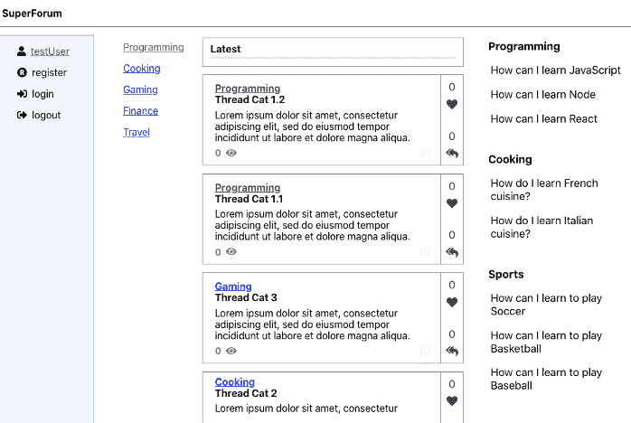

图 15.11 - 主屏幕样式更新

好了，这样好多了。在我们屏幕的移动版本上有一件事要注意 - 我们没有办法让用户切换到另一个类别，如下图所示：

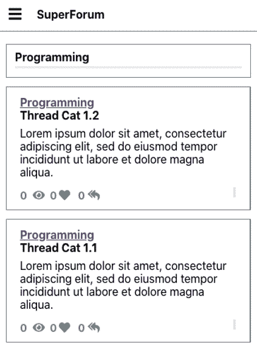

图 15.12 - 主屏幕移动视图

因此，让我们添加一个下拉菜单，允许用户切换类别。这个下拉菜单应该只在移动模式下出现。在跟随之前尝试构建这个控件。提示：使用 React-DropDown 构建下拉菜单，并用下拉控件替换类别标签。例如，在*图 15.12*中，我们看到所选的类别是`MainHeader`控件。因此，只在移动模式下用下拉菜单替换该标签。请注意，我们已经在我们的 ThreadCategory 路由中使用了下拉菜单，因此我们应该将其创建为一个组件，以便它可以被重用。

如果你已经尝试过了，现在让我们一起开始构建，这样你就可以进行比较。这里有一点我说了谎。这是一个相当复杂的改变，因为它需要两个主要的事情。首先，我们希望为 ThreadCategories 添加一个新的 Reducer，因为我们知道 ThreadCategories 的列表至少在两个独立的组件中被使用。我们还需要将 ThreadCategory 组件中的下拉菜单组件化，以便它可以在多个地方使用。第二个部分相当复杂，因为新的下拉组件必须足够复杂，以便从外部接收 props，并在每次更改时发送所选的类别：

1.  首先，让我们创建我们的新 Reducer。在`store`文件夹中创建一个名为`categories`的新文件夹。在该文件夹中，创建一个名为`Reducer.ts`的文件，并将源代码添加到其中。这个文件很像我们的`User` Reducer，只是它返回一个`Category`对象数组作为有效负载。

1.  接下来，我们需要将新的 Reducer 添加到我们的`AppState`的`rootReducer`中，就像这样：

```ts
export const rootReducer = combineReducers({
  user: UserProfileReducer,
  categories: ThreadCategoriesReducer,
});
```

我们的新`rootReducer`成员将被称为`Categories`。

1.  现在更新`App.tsx`组件，以便在应用程序加载时，我们立即获取我们的 ThreadCategories 并将它们添加到 Redux 存储中。

在这里，我们添加了`GetAllCategories` GraphQL 查询：

```ts
const GetAllCategories = gql`
  query getAllCategories {
    getAllCategories {
      id
      name
    }
  }
`;
function App() {
  const { data } = useQuery(GetAllCategories);
  const dispatch = useDispatch();
  useEffect(() => {
    dispatch({
      type: UserProfileSetType,
      payload: {
        id: 1,
        userName: "testUser",
      },
    });
    if (data && data.getAllCategories) {
      dispatch({
        type: ThreadCategoriesType,
        payload: data.getAllCategories,
      });
```

我们之前看到的大部分代码都是一样的，但这是我们将 ThreadCategories 的有效负载发送到 Redux 存储的地方：

```ts
    }
  }, [dispatch, data]);
  const renderHome = (props: any) => <Home {...props} />;
  const renderThread = (props: any) => <Thread {...props}    />;
  const renderUserProfile = (props: any) => <UserProfile    {...props} />;
  return (
    <Switch>
      <Route exact={true} path="/" render={renderHome} />
      <Route path="/categorythreads/:categoryId"       render={renderHome} />
      <Route path="/thread/:id" render={renderThread} />
      <Route path="/userprofile/:id"       render={renderUserProfile} />
    </Switch>
  );
}
```

其他一切都保持不变。请注意，您需要更新您的导入。

1.  `LeftMenu`和`ThreadCategory`组件将需要删除它们获取 ThreadCategories 和创建下拉菜单的代码。但首先，让我们创建我们的共享控件来完成所有这些。在`src/components`文件夹中创建一个名为`CategoryDropDown.tsx`的文件，并添加这段代码。确保您添加任何必要的导入：

```ts
const defaultLabel = "Select a category";
const defaultOption = {
  value: "0",
  label: defaultLabel
};
```

通过`defaultOption`，我们为我们的下拉菜单创建了一个初始值。

```ts
class CategoryDropDownProps {
  sendOutSelectedCategory?: (cat: Category) => void;
  navigate?: boolean = false;
  preselectedCategory?: Category;
}
```

`CategoryDropDownProps`将是我们的`CategoryDropDown`组件的参数类型。`sendOutSelectedCategory`是由父调用者传递的函数，将用于接收父级选择的下拉选项。`Navigate`是一个布尔值，确定在选择新的下拉选项时屏幕是否会移动到新的 URL。`preselectedCategory`允许父级在加载时强制下拉菜单选择指定的 ThreadCategory：

```ts
const CategoryDropDown: FC<CategoryDropDownProps> = ({
  sendOutSelectedCategory,
  navigate,
  preselectedCategory,
}) => {
  const categories = useSelector((state: AppState) =>   state.categories);
  const [categoryOptions, setCategoryOptions] = useState<
    Array<string | Option>
  >([defaultOption]);
  const [selectedOption, setSelectedOption] =   useState<Option>(defaultOption);
  const history = useHistory();
```

根据我们之前的学习，这些列出的 Hooks 的使用是非常明显的。但请注意，我们正在使用`useSelector`从 Redux 存储中获取 ThreadCategories 的列表。

```ts
  useEffect(() => {
    if (categories) {
      const catOptions: Array<Option> = categories.      map((cat: Category) => {
        return {
          value: cat.id,
          label: cat.name,
        };
      });
```

在这里，我们构建了一个选项数组，以供稍后给我们的下拉菜单。

```ts
      setCategoryOptions(catOptions);
```

在`setCategoryOptions`中，我们正在接收我们的 ThreadCategory 选项元素列表并设置它们，以便稍后可以被我们的下拉菜单使用。

```ts
      setSelectedOption({
        value: preselectedCategory ? preselectedCategory.        id : "0",
        label: preselectedCategory ? preselectedCategory.        name : defaultLabel,
      });
```

在这里，我们已经设置了我们默认的下拉选择。

```ts
    }
  }, [categories, preselectedCategory]);
  const onChangeDropDown = (selected: Option) => {
    setSelectedOption(selected);
    if (sendOutSelectedCategory) {
      sendOutSelectedCategory(
        new Category(selected.value, selected.label?.valueOf().toString() ?? "")
      );
    }
```

在这里的下拉更改处理程序中，我们正在通知父级选择发生了变化。

```ts
    if (navigate) {
      history.push(`/categorythreads/${selected.value}`);
    }
```

如果父级请求，我们将导航到下一个 ThreadCategory 路由。

```ts
  };
  return (
    <DropDown
      className="thread-category-dropdown"
      options={categoryOptions}
      onChange={onChangeDropDown}
      value={selectedOption}
      placeholder=defaultLabel
    />
  );
};
export default CategoryDropDown;
```

最后，这是我们实际的 JSX，它非常容易理解。

1.  现在我们需要像这样更新`MainHeader.tsx`文件：

```ts
interface MainHeaderProps {
  category?: Category;
}
const MainHeader: FC<MainHeaderProps> = ({ category }) => {
  const { width } = useWindowDimensions();
```

唯一重要的更改是`getLabelElement`函数，它决定屏幕是否为移动设备，并在是的情况下呈现`CategoryDropDown`：

```ts
  const getLabelElement = () => {
    if (width <= 768) {
      return (
        <CategoryDropDown navigate={true}         preselectedCategory={category} />
      );
    } else {
      return <strong>{category?.name || "Placeholder"}      </strong>;
    }
  };
  return (
    <div className="main-header">
      <div
        className="title-bar"
        style={{ marginBottom: ".25em", paddingBottom:         "0" }}
      >
        {getLabelElement function.

```

</div>

</div>

);

};

```ts

```

其余的代码大部分是删除的代码，所以请尝试自己做。当然，如果需要，可以查看源代码。受影响的文件是`ThreadCategory.tsx`，`LeftMenu.tsx`和`Thread.css`。

## 与身份验证相关的功能

现在让我们继续更新与身份验证相关的功能。请记住，所有您的“用户”帐户在能够登录之前必须将其`confirmed`字段设置为 true：

1.  我们首先要做的是让用户能够登录。为了做到这一点，然后能够更新我们在全局 Redux 存储中的`User`对象，我们将重构我们的 Redux 用户 Reducer。

首先，在`models`文件夹中，创建一个名为`User.ts`的新文件并将源代码添加到其中。请注意，我们的`User`类有一个名为 threads 的字段。这将包含不仅是用户拥有的 Threads，还有这些 Threads 的 ThreadItems。

1.  现在让我们更新我们的 Reducer。打开`store/user/Reducer.ts`并通过删除`UserProfilePayload`接口并用我们刚刚创建的新`User`类替换其引用来更新它。如果需要，查看源代码。

1.  现在我们可以像这样更新我们的`Login`组件。根据需要更新导入。

请注意，我们已经导入了 Hook`useRefreshReduxMe`。我们将在一会儿定义这个 Hook，但首先我想介绍一些`useMutation` GraphQL Hook 的特性：

```ts
const LoginMutation = gql`
  mutation Login($userName: String!, $password: String!)  {
    login(userName: $userName, password: $password)
  }
`;
```

这是我们的登录`Mutation`：

```ts
const Login: FC<ModalProps> = ({ isOpen, onClickToggle }) => {
  const [execLogin] = useMutation(LoginMutation, {
    refetchQueries: [
      {
        query: Me,
      },
    ],
  });
```

让我解释一下这个`useMutation`调用。调用以 Mutation 查询`LoginMutation`和称为`refetchQueries`的东西作为参数。`refetchQueries`强制其中列出的任何查询重新运行，然后缓存它们的值。如果我们不使用`refetchQueries`并再次运行`Me`查询，我们最终会得到最后缓存的版本而不是最新的数据。请注意，它不会自动刷新依赖于其查询的任何调用；我们仍然必须进行这些调用以获取新数据。

输出`execLogin`是一个可以随后执行的函数。

```ts
const [
    { userName, password, resultMsg, isSubmitDisabled },
    dispatch,
  ] = useReducer(userReducer, {
    userName: "test1",
    password: "Test123!@#",
    resultMsg: "",
    isSubmitDisabled: false,
  });
  const { execMe, updateMe } = useRefreshReduxMe();
  const onChangeUserName = (e: React.   ChangeEvent<HTMLInputElement>) => {
    dispatch({ type: "userName", payload: e.target.value     });
    if (!e.target.value)
      allowSubmit(dispatch, "Username cannot be empty",       true);
    else allowSubmit(dispatch, "", false);
  };
  const onChangePassword = (e: React.  ChangeEvent<HTMLInputElement>) => {
    dispatch({ type: "password", payload: e.target.value     });
    if (!e.target.value)
      allowSubmit(dispatch, "Password cannot be empty",       true);
    else allowSubmit(dispatch, "", false);
  };
```

之前的调用与以前一样。

```ts
const onClickLogin = async (
    e: React.MouseEvent<HTMLButtonElement, MouseEvent>
  ) => {
    e.preventDefault();
    onClickToggle(e);
    const result = await execLogin({
      variables: {
        userName,
        password,
      },
    });
    execMe();
    updateMe();
  };
```

`onClickLogin`处理程序现在正在使用适当的参数调用我们的`execLogin`函数。在`execLogin`完成后，它将自动调用我们的`refetchQueries`查询列表。之后，我们调用来自我们的 Hook 的函数，`useRefreshReduxMe`，`execMe`和`updateMe`。`execMe`函数将获取最新的`User`对象，`updateMe`将将其添加到 Redux 存储中。其余的代码是相同的，所以我不会在这里展示它。

1.  现在让我们定义我们的 Hook`useRefreshReduxMe`。我们想要创建这个 Hook，以便我们的设置或取消 Redux`User`对象的代码可以在这个单个文件中。我们将从几个组件中使用这个 Hook。在 hooks 文件夹中创建一个名为`useRefreshReduxMe.ts`的文件并添加源代码。

从顶部，我们可以看到`Me` `const`是用于获取用户信息的查询。`EntityResult`内联片段用于获取消息的字符串（如果返回的是消息）。如果我们获取实际的用户数据，那么所需的字段由`User`内联片段定义。

接下来，`UseRefreshReduxMeResult`接口是我们 Hook 的返回类型。

在第 37 行，我们已经定义了`useLazyQuery`，以允许我们的 Hook 用户在自己选择的时间执行对`Me`查询的调用。

接下来，我们定义了一个函数`deleteMe`，允许我们的 Hook 的用户随时销毁 Redux`User`对象。例如，当用户注销时。

最后，我们有`updateMe`函数，允许设置 Redux`User`对象。然后我们返回所有这些函数，以便它们可以被我们的 Hook 调用者使用。

1.  在应用加载时，我们应立即检查我们的`User`是否已登录以及是谁。因此，打开`App.tsx`并像这样更新它：

```ts
function App() {
  const { data: categoriesData } =   useQuery(GetAllCategories);
  const { execMe, updateMe } = useRefreshReduxMe();
```

在这里，我们初始化了我们的`useRefreshReduxMe` Hook。

```ts
  const dispatch = useDispatch();
  useEffect(() => {
    execMe();
  }, [execMe]);
```

在这里，我们调用我们的`execMe`来从 GraphQL 获取`User`数据。

```ts
  useEffect(() => {
    updateMe();
  }, [updateMe]);
```

在这里，我们调用`updateMe`来使用`User`数据更新我们的 Redux 用户 Reducer。

```ts
  useEffect(() => {
    if (categoriesData && categoriesData.    getAllCategories) {
      dispatch({
        type: ThreadCategoriesType,
        payload: categoriesData.getAllCategories,
      });
    }
  }, [dispatch, categoriesData]);
```

我将我们原始的数据字段名称更改为`categoriesData`，这样它就更清楚它的用途了。其余的代码保持不变。

1.  如果您现在登录，您会看到我们的`SideBar` `userName`更新为已登录用户：

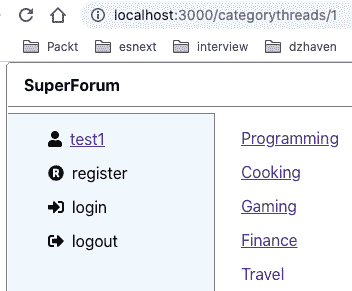

图 15.13 - 已登录用户

所以，现在我们可以登录，然后显示`userName`。

很棒，但现在让我们修复我们的`SideBar`，以便在适当的时间只显示适当的链接。例如，如果用户已登录，我们不应该看到**登录**或**注册**链接：

1.  为了确保用户登录或注销时显示正确的菜单，让我们首先更新我们的`Logout`组件。确保导入已经更新：

```ts
const LogoutMutation = gql`
  mutation logout($userName: String!) {
    logout(userName: $userName)
  }
`;
```

这是我们的`logout` mutation。

```ts
const Logout: FC<ModalProps> = ({ isOpen, onClickToggle }) => {
  const user = useSelector((state: AppState) => state.  user);
  const [execLogout] = useMutation(LogoutMutation, {
    refetchQueries: [
      {
        query: Me,
      },
    ],
  });
```

在这里，我们再次强制刷新我们的 GraphQL 缓存，以获取`Me`查询的数据。

```ts
  const { execMe, deleteMe } = useRefreshReduxMe();
  const onClickLogin = async (
    e: React.MouseEvent<HTMLButtonElement, MouseEvent>
  ) => {
    e.preventDefault();
    onClickToggle(e);
    await execLogout({
      variables: {
        userName: user?.userName ?? "",
      },
    });    
    deleteMe();
  };
```

我们再次使用了我们的`useRefreshReduxMe` Hook，但这里我们只调用了`deleteMe`函数，因为我们只是在注销。其余的代码保持不变，所以我不会在这里展示。

1.  现在我们要更新`SideBarMenus`组件，以便在适当的时间只显示适当的菜单。打开该文件并按照以下方式更新它。

在这种情况下，我只会显示返回的 JSX，因为除了导入之外，这是唯一改变的事情：

```ts
return (
    <React.Fragment>
      <ul>
        {user ? (
          <li>
            <FontAwesomeIcon icon={faUser} />
            <span className="menu-name">
              <Link to={`/userprofile/${user?.               id}`}>{user?.userName}</Link>
            </span>
          </li>
        ) : null}
```

正如您所看到的，我们正在测试`user`对象是否有值，然后显示相同的`userName` UI，否则我们什么都不显示。

```ts
        {user ? null : (
          <li>
            <FontAwesomeIcon icon={faRegistered} />
            <span onClick={onClickToggleRegister}              className="menu-name">
              register
            </span>
            <Registration
              isOpen={showRegister}
              onClickToggle={onClickToggleRegister}
            />
          </li>
        )}
```

在这种情况下，如果用户存在，我们不想显示我们的注册 UI，这就是我们正在做的。

```ts
        {user ? null : (
          <li>
            <FontAwesomeIcon icon={faSignInAlt} />
            <span onClick={onClickToggleLogin}             className="menu-name">
              login
            </span>
            <Login isOpen={showLogin}              onClickToggle={onClickToggleLogin} />
          </li>
        )}
```

同样，如果`user`对象已经存在，我们不会显示登录，因为这表示用户已经登录。

```ts
        {user ? (
          <li>
            <FontAwesomeIcon icon={faSignOutAlt} />
            <span onClick={onClickToggleLogout}              className="menu-name">
              logout
            </span>
            <Logout isOpen={showLogout}              onClickToggle={onClickToggleLogout} />
          </li>
        ) : null}
```

在这里，如果`user`对象有值，我们会显示注销 UI。

```ts
      </ul>
    </React.Fragment>
  );
```

1.  如果您现在运行此代码，当尚未登录时，您会看到这个：

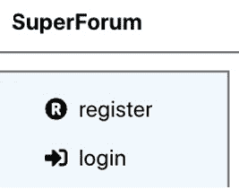

图 15.14 - 未登录的 SideBarMenus

现在，当登录时，我们应该看到这个：

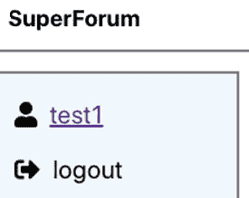

图 15.15 - 已登录的 SideBarMenus

所以我们的侧边栏现在显示正确的链接和文本。现在让我们来处理我们的用户资料屏幕。

## 用户资料屏幕

现在，既然我们在认证部分，让我们完成我们的用户资料屏幕。我们需要进行多个更改来配置这个屏幕：

1.  首先，让我们通过向我们的`User`类型添加一个字段来更新我们的 GraphQL。通过在`typeDefs`文件的`User`类型下面添加这个字段来更新`User`类型：

```ts
  threadItems. Note that this is different from threadItems that's part of the threads field, as we are trying to retrieve the ThreadItem entities the user themselves has authored.
```

1.  我们还需要通过添加一个新字段来更新我们的 User Entity。通过在`User.ts`文件中添加这个字段来更新`User` Entity：

```ts
  @OneToMany(() => ThreadItem, (threadItem) =>   threadItem.user)
  threadItems: ThreadItem[];
```

这允许我们的`User`实体在 ThreadItems 实体上有关联的实体。还要确保您已经在`ThreadItem.ts`文件中有匹配的字段，像这样：

```ts
@ManyToOne(() => User, (user) => user.threadItems)
  user: User;
```

1.  现在让我们打开我们的 UserRepo Repository 文件，并更新我们的`me`函数，以便它包括用户的 ThreadItems。像这样更新 UserRepo `User.findOne`函数：

```ts
    relations: ["threads", "threads.threadItems",    threadItems and threadItems.thread relations.
```

1.  您会注意到用户资料屏幕具有更改密码功能。所以现在让我们构建出来。首先，我们需要在我们的`typeDefs`文件中添加一个新的 Mutation。将此 Mutation 添加到 Mutation 部分：

```ts
changePassword(newPassword: String!): String!
```

一个相当自解释的 Mutation 定义。

1.  现在让我们在我们的 UserRepo 中实现这个函数。在源代码中的 UserRepo 末尾添加`changePassword`函数。

从第 125 行开始，因为如果进行了这个调用，用户将会被登录，我们期望从解析器代码中传递用户 `id`。如果不存在，那么当然我们会出错。

然后我们尝试获取 `User` 对象，然后运行一些检查以确保用户是有效的。最后，我们使用 `bcrypt` 生成我们的哈希密码。

1.  现在我们可以创建我们的解析器。打开 `resolvers` 文件，并将 `changePassword` 函数的源代码添加到 Mutation 部分。

首先，在第 389 行，我们检查一个有效的 Session 和在该 Session 中存在的 `userId`，因为这是指示用户已登录的标志。

最后，我们使用 Session `userId` 和给定的新密码调用我们的 `changePassword` 仓库函数。

1.  现在让我们更新我们的 `UserProfile` 组件。更新代码如下：

更新导入，因为我们导入了一些新项目，`gql` 和 `useMutation`：

```ts
const ChangePassword = gql`
  mutation ChangePassword($newPassword: String!) {
    changePassword(newPassword: $newPassword)
  }
`;
```

这里，我们有我们的新 Mutation，`ChangePassword`。

```ts
const UserProfile = () => {
  const [
    { userName, password, passwordConfirm, resultMsg,    isSubmitDisabled },
    dispatch,
  ] = useReducer(userReducer, {
    userName: "",
    password: "*********",
    passwordConfirm: "*********",
    resultMsg: "",
    isSubmitDisabled: true,
  });
  const user = useSelector((state: AppState) => state.   user);
  const [threads, setThreads] = useState<JSX.Element |    undefined>();
  const [threadItems, setThreadItems] = useState<JSX.   Element | undefined>();
  const [execChangePassword] =    useMutation(ChangePassword Mutation with useMutation.The `useEffect` code shown here is the same as before:

```

useEffect(() => {

if (user) {

dispatch({

type: "userName",

payload: user.userName,

});

getUserThreads(user.id).then((items) => {

const threadItemsInThreadList: Array<ThreadItem>        = [];

const threadList = items.map((th: Thread) => {

for (let i = 0; i < th.threadItems.length; i++) {

threadItemsInThreadList.push(th.            threadItems[i]);

}

return (

<li key={`user-th-${th.id}`}>

<Link to={`/thread/${th.id}`}    className="userprofile-link">

{th.title}

</Link>

</li>

);

});

setThreads(<ul>{threadList}</ul>);

const threadItemList = threadItemsInThreadList.        map((ti: ThreadItem) => (

<li key={`user-th-${ti.threadId}`}>

<Link to={`/thread/${ti.threadId}`}       className="userprofile-link">

{ti.body}

</Link>

</li>

));

setThreadItems(<ul>{threadItemList}</ul>);

});

}

}, [user]);

```ts

This `onClickChangePassword` function is new. It triggers the `changePassword` call and then updates the UI status message.

```

const onClickChangePassword = async (

e: React.MouseEvent<HTMLButtonElement, MouseEvent>

) => {

e.preventDefault();

const { data: changePasswordData } = await       execChangePassword({

variables: {

newPassword: password,

},

});

dispatch({

type: "resultMsg",

payload: changePasswordData ? changePasswordData.      changePassword : "",

});

};

return (

<div className="screen-root-container">

<div className="thread-nav-container">

<Nav />

</div>

<form className="userprofile-content-container">

<div>

<strong>用户资料</strong>

<label style={{ marginLeft: ".75em"     }}>{userName}</label>

</div>

<div className="userprofile-password">

<div>

<PasswordComparison

dispatch={dispatch}

password={password}

passwordConfirm={passwordConfirm}

/>

<button

className="action-btn"

disabled={isSubmitDisabled}

onClick={onClickChangePassword}

```ts

The `onClickChangePassword` handler is set here onto our Change Password button.

```

修改密码

</button>

</div>

<div style={{ marginTop: ".5em" }}>

<label>{resultMsg}</label>

</div>

</div>

<div className="userprofile-postings">

<hr className="thread-section-divider" />

<div className="userprofile-threads">

<strong>发布的主题</strong>

{threads}

</div>

<div className="userprofile-threadIems">

<strong>发布的主题项</strong>

{threadItems}

</div>

</div>

</form>

</div>

);

};

export default UserProfile;

```ts

The remaining code is the same.
```

现在让我们展示用户的主题和主题项：

1.  首先，我们需要更新我们的用户模型。在 `User.ts` 文件中添加这个字段：

```ts
public threadItems: Array<ThreadItem>
```

1.  现在像这样更新 `useRefreshReduxMe` Hook 中的 `Me` 查询：

```ts
export const Me = gql`
  query me {
    me {
      ... on EntityResult {
        messages
      }
      ... on User {
        id
        userName
        threads {
          id
          title
        }
        threadItems from getting the threads' threadItems to getting the user's threadItems. We also now get the threadItems' thread.
```

1.  现在，在你的 `UserProfile` 组件中，像这样更新 `useEffect`：

```ts
useEffect(() => {
    if (user) {
      dispatch({
        type: "userName",
        payload: user.userName,
      });
```

我们现在从 `user.threads` 数组中获取我们的主题，而不是我们的虚假 `dataService` 调用，如下所示：

```ts
      const threadList = user.threads?.map((th: Thread)      => {
        return (
          <li key={`user-th-${th.id}`}>
            <Link to={`/thread/${th.id}`}             className="userprofile-link">
              {th.title}
            </Link>
          </li>
        );
      });
      setThreads(
        !user.threadItems || user.threadItems.length ===          0 ? undefined : (
          <ul>{threadList}</ul>
        )
      );
```

我们也对 `threadItems` 做同样的事情。注意我们的 `Link to` 被更新了，所以它使用 `ti.thread?.id` 而不是 `ti.threadId`：

```ts
      const threadItemList = user.threadItems?.map((ti:        ThreadItem) => (
        <li key={`user-ti-${ti.id}`}>
          <Link to={`/thread/${ti.thread?.id}`}            className="userprofile-link">
            {ti.body.length <= 40 ? ti.body : ti.body.             substring(0, 40) + " ..."}
```

在这里，我们添加了一点额外的逻辑来格式化可能会横向超出屏幕并换行的长文本。基本上，这意味着如果文本超过 40 个字符，我们会在文本后面添加 `"…"`。

```ts
          </Link>
        </li>
      ));
      setThreadItems(
        !user.threadItems || user.threadItems.length ===          0 ? undefined : (
          <ul>{threadItemList}</ul>
        )
      );
    } else {
      dispatch({
        type: "userName",
        payload: "",
      });
      setThreads(undefined);
      setThreadItems(undefined);
    }
  }, [user]);
```

剩下的代码是相同的。如果你运行这个，你应该会看到类似以下的东西（再次说明，你的数据将会不同）：

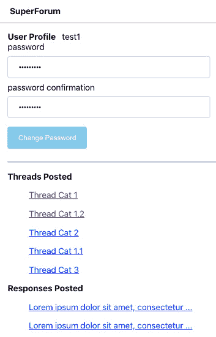

图 15.16-用户的 Threads 和 ThreadItems

好的，这就是我们的 UserProfile。因为这是一大堆要涵盖的材料，让我们在下一章继续我们的工作，[*第十六章*]，*添加 GraphQL 模式-第二部分*。

# 总结

在本章中，我们通过将前端和后端与 GraphQL 集成，几乎完成了我们的应用。这是一个庞大而复杂的章节，所以你应该为自己已经走过的路感到自豪。

在下一章，[*第十六章*]，*添加 GraphQL 模式-第二部分*，我们将通过在 Thread 屏幕上工作来完成我们应用的编码，这样我们就可以查看和发布 Threads，并且通过 Points 系统来查看用户对单个 Threads 的受欢迎程度。
