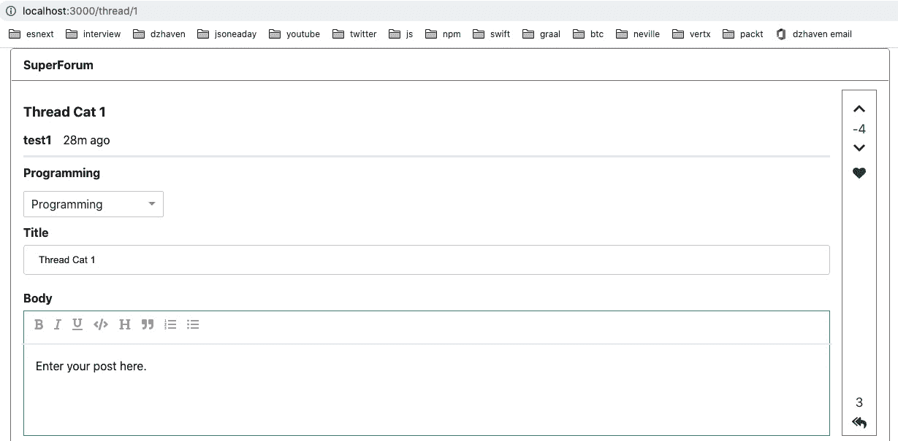
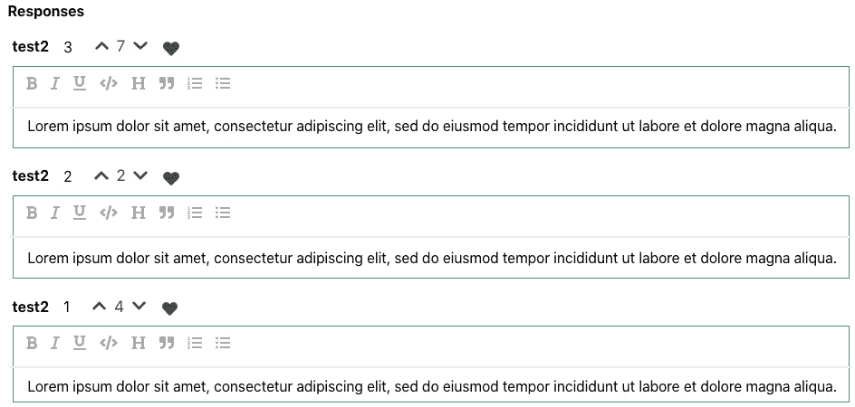
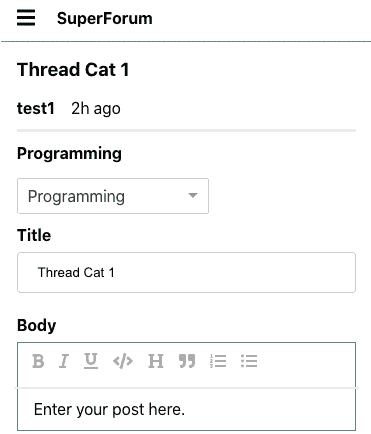
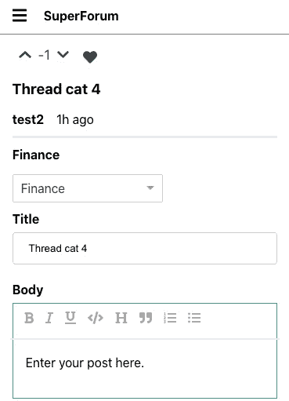
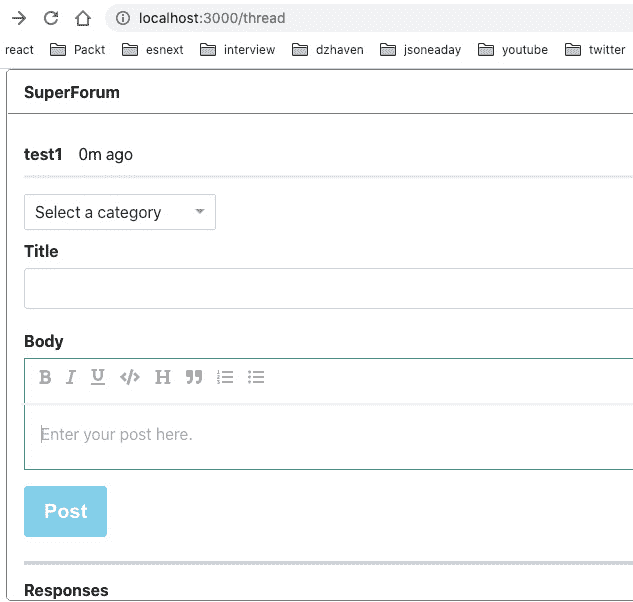
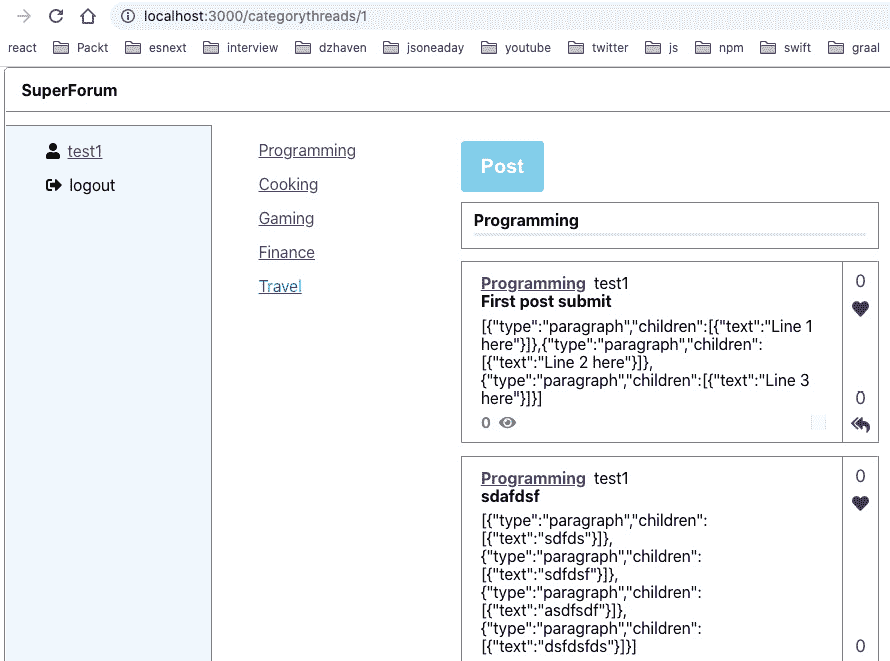
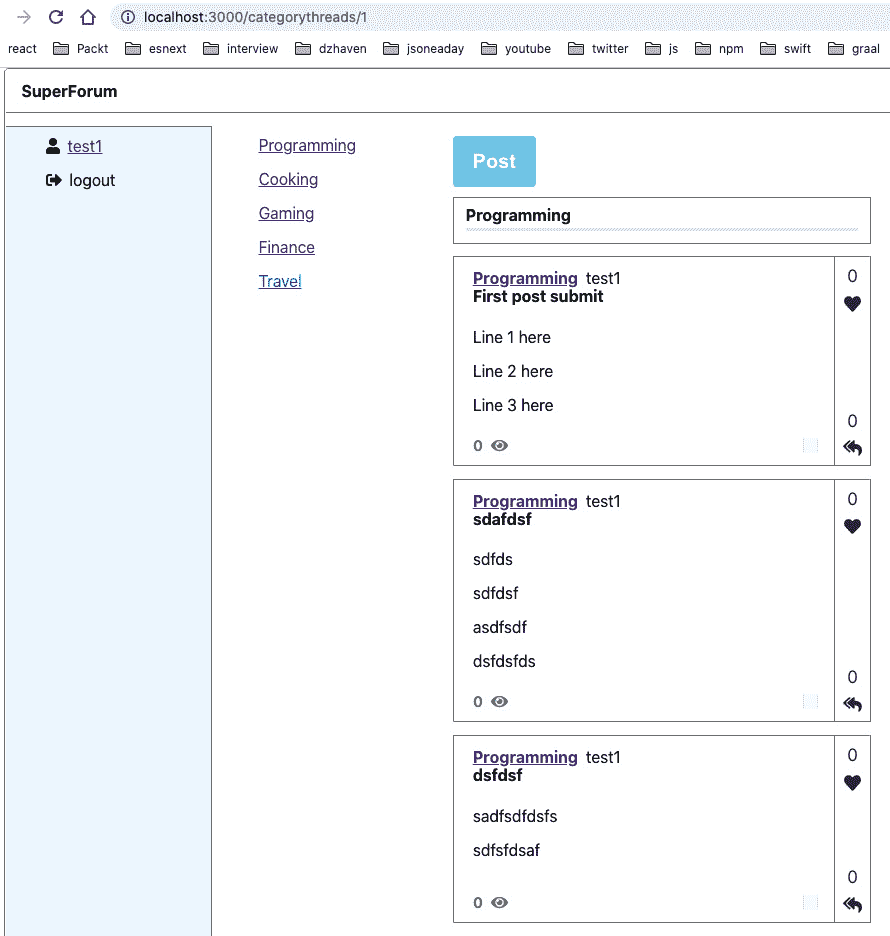
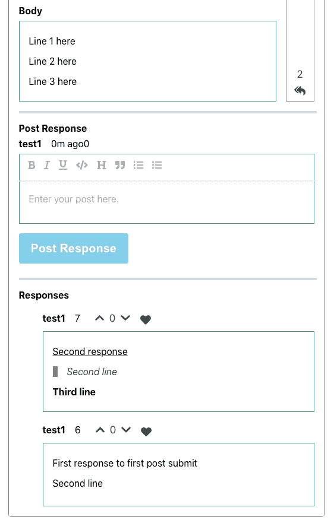
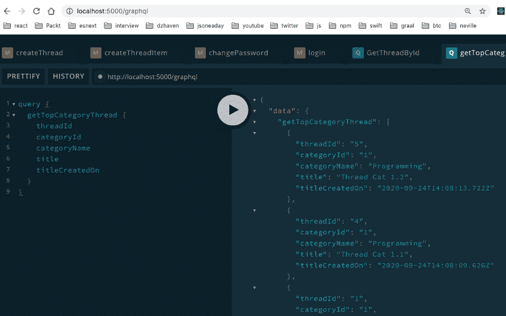
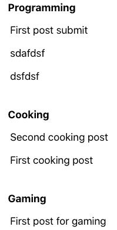

# 第十六章：添加 GraphQL 模式-第 II 部分

在本章中，我们将继续完成我们的客户端和服务器代码。我们将完成我们的 Thread 屏幕，允许我们发布新的 Threads 和它们的回复，并完成网站的积分系统。请使用*第十五章**，添加 GraphQL 模式-第 I 部分*中的源代码来完成此操作。

# Thread 路由

在本节中，我们将更新我们的`Thread`组件，该组件提供我们的线程路由。在进行此操作时，我们将涉及许多文件。请按照以下步骤进行操作：

1.  打开`typeDefs`并编辑`Thread`和`ThreadItem`类型。然后，在`views`下方添加此字段：

```ts
points: Int!
```

1.  现在，打开`ThreadRepo`文件并更新`getThreadById`函数，就像这样：

```ts
export const getThreadById = async (
  id: string
): Promise<QueryOneResult<Thread>> => {
  const thread = await Thread.findOne({
    where: {
      id,
    },
    relations: ["user", "threadItems", "threadItems.     user", "category"],
  });
```

我们在这里所做的只是在我们的`findOne`查询中添加了以下`relations`：

```ts
  if (!thread) {
    return {
      messages: ["Thread not found."],
    };
  }
  return {
    entity: thread,
  };
};
```

1.  接下来，更新`getThreadsByCategoryId`函数调用`Thread.createQueryBuilder`，就像这样：

```ts
const threads = await Thread.createQueryBuilder("thread")
    .where(`thread."categoryId" = :categoryId`, {       categoryId })
    .leftJoinAndSelect("thread.category", "category")
    .leftJoinAndSelect("thread.threadItems",       "threadItems")
    .leftJoinAndSelect("thread.user", "user")
    .orderBy("thread.createdOn", "DESC")
    .getMany();
```

我们在这里包含了 User 实体的关系。此函数的其余代码保持不变。

1.  现在，打开您的客户端应用中的`User.ts`文件，并更新`threads`和`threadItems`字段，使它们成为可选的。我们需要这样做，以便我们可以添加一个尚未发布任何内容的`User`账户：

```ts
public threads?: Array<Thread>,
public threadItems?: Array<ThreadItem>
```

1.  现在，打开 React 客户端项目中的`models/Thread.ts`和`models/ThreadItem.ts`文件，并用单个字段 user 替换`userName`和`userId`字段，就像这样：

```ts
public user: User,
```

1.  我们还需要在我们的`DataService.ts`文件中用用户对象替换`userName`和`userId`字段的引用。在这里，我在文件顶部放置了一个对象，并在整个文件中使用它来替换这两个字段：

```ts
const user = new User("1", "test1@test.com", "test1");
```

如果需要帮助，请查看`DataService.ts`文件，尽管这应该是相当琐碎的。

1.  现在我们已经更新了我们的`User`模式类型和我们的实体，我们需要更新一些查询。在`Main.tsx`文件中，更新`GetThreadsByCategoryId`和`GetThreadsLatest`查询，就像这样：

```ts
const GetThreadsByCategoryId = gql`
  query getThreadsByCategoryId($categoryId: ID!) {
    getThreadsByCategoryId(categoryId: $categoryId) {
      ... on EntityResult {
        messages
      }
      ... on ThreadArray {
        threads {
          id
          title
          body
          views
          points and user fields, as follows:

```

const GetThreadsLatest = gql`

查询 getThreadsLatest {

getThreadsLatest {

... on EntityResult {

messages

}

... on ThreadArray {

threads {

id

title

body

views

points

user {

userName

}

threadItems {

id

}

category {

id

name

}

}

}

}

}

`;

```ts

```

1.  现在，在我们的`ThreadCard.tsx`文件中，找到以下 JSX：

```ts
<span className="username-header" style={{ marginLeft: ".5em" }}>
   {thread.userName}
</span>
```

用以下内容替换它：

```ts
<span className="username-header" style={{ marginLeft: ".5em" }}>
   {thread.user to get its userName field instead of trying to access it directly.
```

1.  现在，我们需要对我们的`RichEditor.tsx`文件进行一些更改。请注意，我们的 Thread 屏幕将显示用户提交的文本。因此，一旦用户提交了他们希望发布的内容，我们将使其无法在此后进行编辑。我们将通过将只读设置为一个属性来实现这一点。

将`RichEditorProps`接口转换为类并更新，就像这样：

```ts
class RichEditorProps {
  existingBody?: string;
  false is the normal setting (interfaces don't allow default values). Now, update the parameter list in the RichEditor component, like this:

```

const RichEditor: FC<RichEditorProps> = ({ existingBody, readOnly field as a parameter. Now, inside the Editable component, add it as an attribute, like this:

```ts
<Editable
        className="editor"
        renderElement={renderElement}
        renderLeaf={renderLeaf}
        placeholder="Enter some rich text…"
        spellCheck
        autoFocus
        onKeyDown={(event) => {
          for (const hotkey in HOTKEYS) {
            if (isHotkey(hotkey, event as any)) {
              event.preventDefault();
              const mark = HOTKEYS[hotkey];
              toggleMark(editor, mark);
            }
          }
        }}
        readOnly prop.
```

```ts

```

1.  现在，打开`src/components/routes/thread/Thread.tsx`文件。这个文件是我们加载 Thread 路由的主要屏幕。让我们更新这个文件。

在这里，我们添加了一个新的`GetThreadById`查询来获取我们相关的 Thread：

```ts
const GetThreadById = gql`
  query GetThreadById($id: ID!) {
    getThreadById(id: $id) {
      ... on EntityResult {
        messages
      }
      ... on Thread {
        id
        user {
          userName
        }
        lastModifiedOn
        title
        body
        points
        category {
          id
          name
        }
        threadItems {
          id
          body
          points
          user {
            userName
          }
        }
      }
    }
  }
`;
const Thread = () => {
  const [execGetThreadById, { data: threadData }] =   useLazyQuery(GetThreadById);
```

在这里，我们使用我们的`GetThreadById`查询，以及我们的`useLazyQuery` Hook，并创建了一个名为`execGetThreadById`的执行函数，稍后我们将运行它。

```ts
  const [thread, setThread] = useState<ThreadModel |    undefined>();
```

`thread`状态对象是我们将用来填充我们的 UI 并与其他组件共享的对象。

```ts
  const { id } = useParams();
```

`id`是代表 Thread 的`id`值的 URL 参数。

```ts
  const [readOnly, setReadOnly] = useState(false);
```

如果我们处理的是现有的 Thread 记录，我们将使用这个`readOnly`状态使我们的`RichEditor`只读。

```ts
  useEffect(() => {
    if (id && id > 0) {
      console.log("id", id);
      execGetThreadById({
        variables: {
          id,
        },
      });
```

在这里，我们通过使用 URL 给出的参数运行了我们的`execGetThreadById`调用，以获取 Thread 的`id`。

```ts
    }
  }, [id, execGetThreadById]);
  useEffect(() => {
    console.log("threadData", threadData);
    if (threadData && threadData.getThreadById) {
      setThread(threadData.getThreadById);
    } else {
      setThread(undefined);
    }
```

一旦我们完成了`execGetThreadById`调用，就会返回一个`threadData`对象。我们可以使用这个对象来设置我们的本地`thread`状态。

```ts
  }, [threadData]);
  return (
    <div className="screen-root-container">
      <div className="thread-nav-container">
        <Nav />
      </div>
      <div className="thread-content-container">
        <div className="thread-content-post-container">
          <ThreadHeader
            userName={thread?.user.userName}
```

在这里，我们使用`thread?.user`对象来获取我们的`userName`字段，而不是`thread?.userName`，这是我们之前设置的方式。

```ts
            lastModifiedOn={thread ? thread.             lastModifiedOn : new Date()}
            title={thread?.title}
          />
          <ThreadCategory category={thread?.category} />
```

`ThreadCategory`现在已经更新，这样它将把`CategoryDropDown`设置为提供的`Category`选项。我们稍后会看一下这个。

```ts
          <ThreadTitle title={thread?.title} />
          <ThreadBody body={thread?.body}            readOnly={readOnly} />
```

在这里，我们将`readOnly`状态值传递给了`ThreadBody`，因为`ThreadBody`在内部使用了`RichEditor`。

```ts
        </div>
        <div className="thread-content-points-container">
          <ThreadPointsBar
            points={thread?.points || 0}
            responseCount={
              thread && thread.threadItems && thread.               threadItems.length
            }
          />
        </div>
      </div>
      <div className="thread-content-response-container">
        <hr className="thread-section-divider" />
        <ThreadResponsesBuilder threadItems={thread?.         threadItems} readOnly={readOnly} />
```

在这里，我们将`readOnly`状态值传递给了`ThreadResponsesBuilder`，它显示了我们的 ThreadItem responses。

```ts
      </div>
    </div>
  );
};
```

其余的 UI 与以前一样。

1.  现在，让我们看看`ThreadCategory`组件。现在它是这样的：

```ts
interface ThreadCategoryProps {
  category?: Category;
}
```

我们已经切换了接口定义，使其接受`Category`对象而不是字符串。这使我们可以将其传递给我们的`CategoryDropDown`组件：

```ts
const ThreadCategory: FC<ThreadCategoryProps> = ({ category }) => {
  const sendOutSelectedCategory = (cat: Category) => {
    console.log("selected category", cat);
  };
  return (
    <div className="thread-category-container">
      <strong>{category?.name}</strong>
```

在这里，我们使用了`Category`对象的`category?.name`，而以前我们使用`categoryName`作为必要的参数：

```ts
      <div style={{ marginTop: "1em" }}>
        <CategoryDropDown
          preselectedCategory={category}
```

在这里，我们明确地传递了`preselectedCategory`属性，从我们组件的`category`属性中：

```ts
sendOutSelectedCategory={sendOutSelectedCategory}
        />
      </div>
    </div>
  );
};
```

1.  现在，通过传递`readOnly`字段来更新`ThreadBody`组件对`RichEditor`的调用，就像这样：

```ts
interface ThreadBodyProps {
  body?: string;
  readOnly: boolean;
}
```

在这里，我们已经将`readOnly`字段添加到我们的 props 类型中；也就是`ThreadBodyProps`：

```ts
const ThreadBody: FC<ThreadBodyProps> = ({ body, readOnly prop to our RichEditor.
```

1.  现在，让我们更新`ThreadResponseBuilder`组件，就像这样：

```ts
interface ThreadResponsesBuilderProps {
  threadItems?: Array<ThreadItem>;
  readOnly: boolean;
}
```

再次，这是一个`readOnly`属性定义。这是因为这个组件使用了`ThreadResponse`，而`ThreadResponse`在内部使用了`RichEditor`：

```ts
const ThreadResponsesBuilder: FC<ThreadResponsesBuilderProps> = ({
  threadItems,
  readOnly,
}) => {
  const [responseElements, setResponseElements] =   useState<
    JSX.Element | undefined
  >();
  useEffect(() => {
    if (threadItems) {
      const thResponses = threadItems.map((ti) => {
        return (
          <li key={`thr-${ti.id}`}>
            <ThreadResponse
              body={ti.body}
              userName={ti.user.userName}
```

在这里，我们使用了 Thread 的`user`对象来获取所需的`userName`。

```ts
              lastModifiedOn={ti.createdOn}
              points={ti.points}
              readOnly={readOnly}
```

这是我们的`readOnly`字段被传递到`ThreadResponse`中。

```ts
            />
          </li>
        );
      });
      setResponseElements(<ul>{thResponses}</ul>);
    }
  }, [threadItems, readOnly]);
  return (
    <div className="thread-body-container">
      <strong style={{ marginBottom: ".75em" }}>Responses</strong>
      {responseElements}
    </div>
  );
};
```

其余的代码与以前一样。

最后，我们有了我们的`ThreadResponse`组件，它使用了`readOnly`属性，就像这样：

```ts
interface ThreadResponseProps {
  body?: string;
  userName?: string;
  lastModifiedOn?: Date;
  points: number;
  readOnly: boolean;
```

这是属性定义。

```ts
}
const ThreadResponse: FC<ThreadResponseProps> = ({
  body,
  userName,
  lastModifiedOn,
  points,
  readOnly prop in.

```

}) => {

return (

<div>

<div>

<UserNameAndTime userName={userName} lastModifiedOn={lastModifiedOn} />

<span style={{ marginLeft: "1em" }}>

<ThreadPointsInline points={points || 0} />

</span>

</div>

<div className="thread-body-editor">

<RichEditor existingBody={body} readOnly={readOnly} />

```ts

And here, we've passed `readOnly` into our `RichEditor` component.

```

</div>

</div>

);

};

```ts

```

由于没有明显的视觉线索，有点难以看到，但你会注意到在任何现有 Thread 的线程路由上，比如`http://localhost:5000/thread/1`，你的 Thread 和任何响应的编辑器都将处于只读模式，这意味着它们不能被编辑。

## 积分系统

现在我们已经设置好了可以显示积分的一切，我们需要一个机制来设置它们。这就是我们现在要做的。让我们开始吧：

1.  打开`Thread.tsx`文件，看一下代码。你会在 JSX 的末尾找到一个名为`ThreadPointsBar`的组件。这是我们的`ThreadCard`和`Thread.tsx`路由中显示积分垂直条的组件。

1.  我们将添加按钮来允许增加或减少积分。我们已经构建了后端和解析器，所以我们在这里要做的工作只是将它与我们的客户端代码联系起来。

在`ThreadPointsBar.tsx`文件中，按照以下方式更新现有的 JSX。这是一个重大的变化，让我们来分解一下：

```ts
import React, { FC } from "react";
import { FontAwesomeIcon } from "@fortawesome/react-fontawesome";
import {
  faHeart,
  faReplyAll,
  faChevronDown,
  faChevronUp,
} from "@fortawesome/free-solid-svg-icons";
import { useWindowDimensions } from "../../hooks/useWindowDimensions";
import { gql, useMutation } from "@apollo/client";
const UpdateThreadPoint = gql`
  mutation UpdateThreadPoint(
    $userId: ID!
    $threadId: ID!
    $increment: Boolean!
  ) {
    updateThreadPoint(
      userId: $userId
      threadId: $threadId
      increment: $increment
    )
  }
`;
```

首先，我们有我们的`updateThreadPoint` mutation。

```ts
export class ThreadPointsBarProps {
  points: number = 0;
  responseCount?: number;
  userId?: string;
  threadId?: string;
  allowUpdatePoints?: boolean = false;
  refreshThread?: () => void;
}
```

有了这个，我们将我们的`ThreadPointsBarProps`接口转换成了一个类，这样我们就可以给一些字段设置默认值。请注意，在字段中，我们有一个`refreshThread`函数，我们将用它来强制更新我们的父 Thread，这样一旦我们更新了积分，这将反映在我们的 UI 中。我们将在使用这些字段时逐一讨论其他字段。此外，我们将不再与我们的`ThreadPointsInline`组件共享这个属性，我稍后会展示。

```ts
const ThreadPointsBar: FC<ThreadPointsBarProps> = ({
  points,
  responseCount,
  userId,
  threadId,
  allowUpdatePoints,
  refreshThread,
}) => {
  const { width } = useWindowDimensions();
  const [execUpdateThreadPoint] = useMutation(UpdateThreadPoint);
```

请注意，我们的`useMutation`没有使用`refetchQueries`来刷新 Apollo Client。通常情况下，我会使用这种机制，但在测试中，我发现 Apollo Client 缓存默认缓存所有 GraphQL 查询，无法正确刷新线程。所有框架都会遇到这些问题。作为开发人员，你的工作之一就是找到解决这些问题的方法和解决方案。因此，我们将使用我们的`refreshThread`函数，而不是依赖`refetchQueries`，我们可以从父级那里得到它，以强制刷新。稍后我会向你展示`Thread`路由组件中这个函数的实现。

```ts
  const onClickIncThreadPoint = async (
    e: React.MouseEvent<SVGSVGElement, MouseEvent>
  ) => {
    e.preventDefault();
    await execUpdateThreadPoint({
      variables: {
        userId,
        threadId,
        increment: true,
      },
    });
    refreshThread && refreshThread();
  };
  const onClickDecThreadPoint = async (
    e: React.MouseEvent<SVGSVGElement, MouseEvent>
  ) => {
    e.preventDefault();
    await execUpdateThreadPoint({
      variables: {
        userId,
        threadId,
        increment: false,
      },
    });
    refreshThread && refreshThread();
  };
```

这两个函数`onClickIncThreadPoint`和`onClickDecThreadPoint`在调用`refreshThread`之前执行`execUpdateThreadPoint`变异。`refreshThread && refreshThread（）`语法是 JavaScript 的一种能力，它允许你写更少的代码。这种语法允许你检查这个可选函数是否存在，如果存在，就执行它。

```ts
  if (width > 768) {
    console.log("ThreadPointsBar points", points);
    return (
      <div className="threadcard-points">
        <div className="threadcard-points-item">
          <div
            className="threadcard-points-item-btn"
            style={{ display: `${allowUpdatePoints ?              "block" : "none"}` }}
          >
```

在这里，我们有一小段逻辑，使用`allowUpdatePoints`属性，决定是否显示或隐藏允许用户增加点数的图标容器。我们必须对减少按钮做同样的事情：

```ts
            <FontAwesomeIcon
              icon={faChevronUp}
              className="point-icon"
              onClick={onClickIncThreadPoint}
            />
          </div>
          {points}
          <div
            className="threadcard-points-item-btn"
            style={{ display: `${allowUpdatePoints ?              "block" : "none"}` }}
          >
            <FontAwesomeIcon
              icon={faChevronDown}
              className="point-icon"
              onClick={onClickDecThreadPoint}
            />
          </div>
          <FontAwesomeIcon icon={faHeart}           className="points-icon" />
```

在这里，我们添加了两个新的图标，`faChevronUp`和`faChevronDown`。当点击时，它们将增加或减少我们线程的点数。

```ts
        </div>
        <div className="threadcard-points-item">
          {responseCount}
          <br />
          <FontAwesomeIcon icon={faReplyAll}            className="points-icon" />
        </div>
      </div>
    );
  }
  return null;
};
export default ThreadPointsBar;
```

其余的代码保持不变。但是，请注意我们的 CSS 略有改变。我们更新了现有的`threadcard-points-item`类，并添加了一个名为`threadcard-points-item-btn`的新类。

```ts
.threadcard-points-item {
  display: flex;
  flex-direction: column;
  justify-content: space-between;
  align-items: center;
  color: var(--point-color);
  font-size: var(--sm-med-font-size);
  text-align: center;
}
```

`threadcard-points-item`类现在是一个列的 flexbox，这样它可以垂直显示其内容。

```ts
.threadcard-points-item-btn {
  cursor: pointer;
  margin-top: 0.35em;
  margin-bottom: 0.35em;
}
```

`threadcard-points-item-btn`类将我们的图标光标转换为指针，以便当用户悬停在上面时，光标变成手，表示可以点击。

1.  现在我们已经做出了这些改变，我们需要更新一些其他相关的组件。我们首先要做的是在我们的`ApolloClient`中禁用`resultCaching`。打开`index.tsx`文件并更新`client`对象，像这样：

```ts
const client = new ApolloClient({
  uri: "http://localhost:5000/graphql",
  credentials: "include",
  cache: new InMemoryCache({
    resultCaching: false,
  }),
});
```

正如其名称所示，此设置应该禁用查询结果的缓存。但是，它本身并不能做到这一点-我们必须向我们的查询添加另一个设置。

1.  更新`Thread.tsx`文件。我们只显示已更改的代码。

首先，`getThreadById`查询略有更新：

```ts
const GetThreadById = gql`
  query GetThreadById($id: ID!) {
    getThreadById(id: $id) {
      ... on EntityResult {
        messages
      }
      ... on Thread {
        id
        user {
          fetchPolicy, which controls the caching policy for our individual call. In this case, we want no caching at all. Again, I had to use fetchPolicy and resultCaching together to get the desired no-cache effect.

```

const [thread，setThread] = useState<ThreadModel |    undefined>();

const { id } = useParams（）;

const [readOnly，setReadOnly] = useState(false);

刷新线程的常量=（）=》{

if（id && id > 0）{

execGetThreadById（{

variables：{

id，

}，

}）;

}

};

```ts

Here, we have defined a function, called `refreshThread`, that calls our `execGetThreadById` executable. This function will be passed to our `ThreadPointBar` component later.

```

useEffect（（）=》{

if（id && id > 0）{

execGetThreadById（{

variables：{

id，

}，

}）;

}

}，[id，execGetThreadById]）;

```ts

You're probably wondering why we haven't reused `refreshThread` in the first `useEffect` call. To reuse it, we would have to include `refreshThread` in our `useEffect` call list and make an additional call to `useCallback` so that changes to `refreshThread` do not trigger a re-render. The tiny benefit this brings does not justify the extra code:

```

useEffect（（）=》{

如果（threadData && threadData.getThreadById）{

setThread(threadData.getThreadById);

setReadOnly(true);

} else {

setThread(undefined);

setReadOnly(false);

}

}，[threadData]）;

return（

<div className="screen-root-container">

<div className="thread-nav-container">

<Nav />

</div>

<div className="thread-content-container">

<div className="thread-content-post-container">

<ThreadHeader

userName={thread？.user.userName}

lastModifiedOn={thread？线程。             lastModifiedOn：new Date（）}

标题={线程？.标题}

/>

<ThreadCategory category={thread？.category} />

<ThreadTitle title={thread？.title} />

<ThreadBody body={thread？.body}            readOnly={readOnly} />

</div>

<div className="thread-content-points-container">

```ts

Here, in our `ThreadPointsBar`, we are passing the new props we defined earlier:

```

<ThreadPointsBar

points={thread？.points || 0}

responseCount={

线程&&线程。线程项&&线程。               threadItems.length

}

userId={thread？.user.id || "0"}

threadId={thread？.id || "0"}

allowUpdatePoints={true}

refreshThread={refreshThread}

/>

</div>

</div>

<div className="thread-content-response-container">

<hr className="thread-section-divider" />

<ThreadResponsesBuilder

threadItems={thread？.threadItems}

readOnly={readOnly}

/>

</div>

</div>

);

};

```ts

```

1.  现在，Thread 路由屏幕看起来像这样，我们的新点数系统已经就位：

图 16.1-Thread 路由屏幕

如果您尝试点击点按钮，您会注意到两件事。首先，有时，尽管我们在消除缓存问题上做了很多工作，但点数变化并没有立即显示在屏幕上。这是因为我们在 Repository 调用中有一个微妙的错误，我稍后会讨论。另一个问题是我们的用户可以一次添加或删除多个点。这是我们样式层中的另一个问题。一旦我们的客户端代码完成，我们将重新讨论这两个问题。

1.  现在，我们需要更新我们的`ThreadItem`和`Thread`响应的点数功能。我们将从`ThreadResponsesBuilder`开始。更新`useEffect`，像这样：

```ts
useEffect(() => {
    if (threadItems) {
      const thResponses = threadItems.map((ti) => {
        return (
          <li key={`thr-${ti.id}`}>
            <ThreadResponse
              body={ti.body}
              userName={ti.user.userName}
              lastModifiedOn={ti.createdOn}
              points={ti.points}
              readOnly={readOnly}
              userId={ti?.user.id || "0"}
              threadItemId={ti?.id || "0"}
            />
```

我们现在传递了`ThreadReponse`组件，显示了 Thread 的`ThreadItem`，`userId`和`threadItemId`。在这个组件中，我们有`ThreadPointsInline`组件，根据传入的是`ThreadItem`还是`Thread`来显示点赞点数，一旦我们到达该控件，我会澄清：

```ts
          </li>
        );
      });
      setResponseElements(<ul>{thResponses}</ul>);
    }
  }, [threadItems, readOnly]);
```

1.  现在，`ThreadResponse`组件可以更新。我只在这里显示了更改的代码。

首先，将以下两个字段添加到`ThreadResponseProps`接口中：

```ts
  userId: string;
  threadItemId: string;
```

现在，在 JSX 中，我们可以添加我们的`userId`和`threadItemId`字段：

```ts
  return (
    <div>
      <div>
        <UserNameAndTime userName={userName}          lastModifiedOn={lastModifiedOn} />
        {threadItemId}
        <span style={{ marginLeft: "1em" }}>
          <ThreadPointsInline
            points={points || 0}
            userId and threadItemId data to the ThreadPointsInline component. Note that this component will display points for either Threads or ThreadItems eventually. Also, note that I put threadItemId in there just so we could distinguish between each ThreadItem for now:

```

</span>

</div>

<div className="thread-body-editor">

<RichEditor existingBody={body} readOnly={readOnly} />

</div>

</div>

）;

```ts

```

1.  现在，让我们看看我们必须对`ThreadPointsInline`组件进行的更改。

将以下导入添加到现有导入列表中：

```ts
import "./ThreadPointsInline.css";
```

看一下源代码。在大多数情况下，它很像`ThreadPointsBar`的 CSS：

```ts
const UpdateThreadItemPoint = gql`
  mutation UpdateThreadItemPoint(
    $userId: ID!
    $threadItemId: ID!
    $increment: Boolean!
  ) {
    updateThreadItemPoint(
      userId: $userId
      threadItemId: $threadItemId
      increment: $increment
    )
  }
`;
```

在这里，我们添加了我们的`updateThreadItemPoint`mutation 定义。

```ts
class ThreadPointsInlineProps {
  points: number = 0;
  userId?: string;
  threadId?: string;
  threadItemId?: string;
  allowUpdatePoints?: boolean = false;
  refreshThread?: () => void;
}
```

现在，这将是我们的 props 列表。请注意，我们有一个`threadId`字段。我们将使用这个`ThreadPointsInline`控件在移动屏幕上显示我们的 Thread 点数：

```ts
const ThreadPointsInline: FC<ThreadPointsInlineProps> = ({
  points,
  userId,
  threadId,
  threadItemId,
  allowUpdatePoints,
  refreshThread,
}) => {
  const [execUpdateThreadItemPoint] =   useMutation(UpdateThreadItemPoint);
  const onClickIncThreadItemPoint = async (
    e: React.MouseEvent<SVGSVGElement, MouseEvent>
  ) => {
    e.preventDefault();
    await execUpdateThreadItemPoint({
      variables: {
        userId,
        threadItemId,
        increment: true,
      },
    });
    refreshThread && refreshThread();
  };
```

这里没有什么特别特殊的地方-我们的`onClickIncThreadItemPoint`和`onClickDecThreadItemPoint`调用都在`ThreadPointsBar`组件中做着类似的事情，它们调用我们的更新 mutation 然后刷新 Thread 数据：

```ts
  const onClickDecThreadItemPoint = async (
    e: React.MouseEvent<SVGSVGElement, MouseEvent>
  ) => {
    e.preventDefault();
    await execUpdateThreadItemPoint({
      variables: {
        userId,
        threadItemId,
        increment: false,
      },
    });
    refreshThread && refreshThread();
  };
```

现在，在我们的 JSX 中，我们将做与我们的`ThreadPointsBar`组件类似的事情，并包括允许我们增加或减少实体点数的图标：

```ts
  return (
    <span className="threadpointsinline-item">
      <div
        className="threadpointsinline-item-btn"
        style={{ display: `${allowUpdatePoints ? "block"          : "none"}` }}
      >
        <FontAwesomeIcon
          icon={faChevronUp}
          className="point-icon"
          onClick={onClickIncThreadItemPoint}
        />
      </div>
      {points}
      <div
        className="threadpointsinline-item-btn"
        style={{ display: `${allowUpdatePoints ? "block"         : "none"}` }}
      >
        <FontAwesomeIcon
          icon={faChevronDown}
          className="point-icon"
          onClick={onClickDecThreadItemPoint}
        />
      </div>
      <div className="threadpointsinline-item-btn">
        <FontAwesomeIcon icon={faHeart}          className="points-icon" />
      </div>
    </span>
  );
};
export default ThreadPointsInline;
```

1.  现在，如果您再次加载`Thread`路由屏幕，您应该会看到我们 Thread 的`ThreadItems`。再次强调，您的本地数据会有所不同，因此请确保您的 Thread 包含`ThreadItem`数据及其相应的点数，以及如下屏幕截图所示的图标按钮：

图 16.2-ThreadItem 点

同样，如果您点击增加和减少按钮，您会发现我们与 Thread 点数相同的问题。我们的点数得分并不总是更新，用户可以继续添加或删除点数。让我们现在解决这个问题。

1.  转到您的服务器项目，打开`ThreadItemPointRepo.ts`文件，找到`updateThreadItemPoint`函数，并转到对`threadItem.save()`的第一个调用。在函数中的所有这些调用之前添加一个前缀，就像这样：

```ts
await threadItem.save();
```

你能猜到这将如何解决我们遇到的问题吗？通过在`save`调用上调用`await`，我们强制我们的函数等待保存完成。然后，当我们获取我们的`ThreadItem`数据时，我们可以确保它确实包含最新的`points`值。这是使用异步代码的棘手一面之一。它更快，但您必须考虑自己在做什么；否则，您可能会遇到这样的问题。

现在，继续自己更新`updateThreadPoint`函数，类似于我们刚刚对`updateThreadItemPoint`函数所做的。确保更新每个`save`函数。

现在，如果您尝试增加或减少积分，您应该会看到它们正确更新。

1.  现在，让我们解决用户可以继续添加或删除积分的问题。在这段代码中实际上存在多个问题。我们的两个更新积分的解析器`updateThreadPoint`和`updateThreadItemPoint`在尝试允许用户更新他们的积分之前没有检查用户身份验证。这显然是错误的。此外，我们的客户端代码实际上传递了`Thread`或`ThreadItem`的`userId`值，而不是当前登录的用户。我们可以一起解决这两个问题。首先，更新`updateThreadPoint`解析器，就像这样：

```ts
updateThreadPoint: async (
      obj: any,
      args: { threadId: string; increment: boolean },
      ctx: GqlContext,
      info: any
    ): Promise<string> => {
```

我们不再将`userId`作为此解析器的参数。这是因为，如下面的代码所示，我们现在通过`session.userId`字段检查用户是否已登录。然后，当我们调用我们的`updateThreadPoint`存储库查询时，我们将`session.userId`字段作为`userId`参数传递：

```ts
      let result = "";
      try {
        if (!ctx.req.session || !ctx.req.session?.userId)          {
          return "You must be logged in to set likes.";
        }
        result = await updateThreadPoint(
          ctx.req.session!.userId,
          args.threadId,
          args.increment
        );
        return result;
      } catch (ex) {
        throw ex;
      }
    },
```

对于`updateThreadItemPoint`解析器也进行相同的更改，因为它们几乎是相同的调用。还要不要忘记更新我们的`typeDefs`，以便这些调用的 Mutation 签名不再具有`userId`参数。我们还需要更新客户端中的代码路径，并稍后删除那里的`userId`参数。

1.  现在，将以下代码添加到实现的顶部的`updateThreadPoint`存储库调用中：

```ts
if (!userId || userId === "0") {
    return "User is not authenticated";
}
```

这将防止`userId`传递任何奇怪的值，并且我们认为用户已经通过身份验证，而实际上并没有。将相同的代码添加到`updateThreadItemPoint`存储库调用中。

现在，让我们修复客户端代码并删除`userId`参数。最简单的方法是从`ThreadPointsBar`和`ThreadPointsInline`组件中删除调用。然后保存代码，编译器会告诉您相关调用通过`userId`的位置。

1.  让我们从`ThreadPointsBar`开始。像这样更新它。从`UpdateThreadPoint` Mutation 参数中删除`userId`。然后，从组件的`ThreadPointsBarProps`类型的 props 中删除它。接下来，从`ThreadPointsBar`的 props 参数中删除它。最后，从对`execUpdateThreadPoints`的调用中删除`userId`。

1.  接下来，在`Thread.tsx`路由组件中，找到对`ThreadPointsBar`的调用，并简单地删除`userId` props。还要删除`useSelector`调用以获取用户 reducer，因为它不再被使用。

`ThreadPointsInline`组件也需要进行相同类型的重构，但我会把这个改变留给你，因为它基本上和我们为`ThreadPointsBar`做的改变是一样的。同样，尝试从`ThreadPointsInline`组件开始进行更改并保存您的代码。编译器应该会告诉您`userId`的引用仍然存在的位置。

有了这个，我们的积分应该可以正确更新。积分应该只在用户登录时更新，并且只能增加或减少一个积分。用户也不应该被允许更改他们自己的`Thread`或`ThreadItem`的积分。

现在，让我们看看其他的东西。在移动模式下查看`Thread`路由组件时，您会发现我们的积分计数不再可见，如下所示：



图 16.3 - 移动模式下的 Thread 路由屏幕

当然，这是故意的，因为水平空间很小。所以，让我们把我们的`ThreadPointsInline`组件放在这个移动屏幕上，并更新它，使它可以为 Threads 和 ThreadItems 工作：

1.  因为`ThreadPointsInline`正在重构以使用`ThreadPointBar`正在使用的`updateThreadPoint` Mutation，我们必须将这些调用移到它们自己的 Hook 中并共享它们。在 Hooks 文件夹内创建一个名为`useUpdateThreadPoint.ts`的新文件，并将相应的 Git 源代码添加到其中。

通过这样做，我们只是将大部分代码从`ThreadPointBar`组件复制到这里。完成这一步后，我们将返回事件处理程序供我们调用的组件使用；也就是`onClickIncThreadPoint`和`onClickDecThreadPoint`。

1.  现在，让我们重构`ThreadPointBar`组件，以便它可以使用这个 Hook。将其更新如下：

```ts
import useUpdateThreadPoint from "../../hooks/useUpdateThreadPoint";
```

在这里，我们导入了我们的新 Hook，并移除了`UpdateThreadPoint`的 Mutation：

```ts
export class ThreadPointsBarProps {
  points: number = 0;
  responseCount?: number;
  threadId?: string;
  allowUpdatePoints?: boolean = false;
  refreshThread?: () => void;
}
const ThreadPointsBar: FC<ThreadPointsBarProps> = ({
  points,
  responseCount,
  threadId,
  allowUpdatePoints,
  refreshThread,
}) => {
  const { width } = useWindowDimensions();
  const { onClickDecThreadPoint, onClickIncThreadPoint }    = useUpdateThreadPoint(
    refreshThread,
    threadId
  );
```

在这里，我们从`useUpdateThreadPoint` Hook 中接收了事件处理程序。其余的代码是相同的。

1.  现在，让我们像这样重构`ThreadPointsInline`：

```ts
import React, { FC } from "react";
import { FontAwesomeIcon } from "@fortawesome/react-fontawesome";
import {
  faHeart,
  faChevronDown,
  faChevronUp,
} from "@fortawesome/free-solid-svg-icons";
import { gql, useMutation } from "@apollo/client";
import "./ThreadPointsInline.css";
import useUpdateThreadPoint from "../../hooks/useUpdateThreadPoint";
const UpdateThreadItemPoint = gql`
  mutation UpdateThreadItemPoint($threadItemId: ID!,    $increment: Boolean!) {
    updateThreadItemPoint(threadItemId: $threadItemId,     increment: $increment)
  }
`;
class ThreadPointsInlineProps {
  points: number = 0;
  threadId?: string;
  threadItemId?: string;
  allowUpdatePoints?: boolean = false;
  refreshThread?: () => void;
}
const ThreadPointsInline: FC<ThreadPointsInlineProps> = ({
  points,
  threadId,
  threadItemId,
  allowUpdatePoints,
  refreshThread,
}) => {
  const [execUpdateThreadItemPoint] =    useMutation(UpdateThreadItemPoint);
  const { onClickDecThreadPoint, onClickIncThreadPoint }    = useUpdateThreadPoint(
    refreshThread,
    threadId
  );
```

在这里，我们从`useUpdateThreadPoint` Hook 中获取了我们的事件处理程序：

```ts
  const onClickIncThreadItemPoint = async (
    e: React.MouseEvent<SVGSVGElement, MouseEvent>
  ) => {
    e.preventDefault();
    await execUpdateThreadItemPoint({
      variables: {
        threadItemId,
        increment: true,
      },
    });
    refreshThread && refreshThread();
  };
  const onClickDecThreadItemPoint = async (
    e: React.MouseEvent<SVGSVGElement, MouseEvent>
  ) => {
    e.preventDefault();
    await execUpdateThreadItemPoint({
      variables: {
        threadItemId,
        increment: false,
      },
    });
    refreshThread && refreshThread();
  };
  return (
    <span className="threadpointsinline-item">
      <div
        className="threadpointsinline-item-btn"
        style={{ display: `${allowUpdatePoints ? "block"          : "none"}` }}
      >
        <FontAwesomeIcon
          icon={faChevronUp}
          className="point-icon"
          onClick={threadId ? onClickIncThreadPoint :            onClickIncThreadItemPoint}
```

在以下代码中，有一小部分逻辑决定了我们是否会更新`Thread`或`ThreadItem`的点：

```ts
        />
      </div>
      {points}
      <div
        className="threadpointsinline-item-btn"
        style={{ display: `${allowUpdatePoints ? "block"          : "none"}` }}
      >
        <FontAwesomeIcon
          icon={faChevronDown}
          className="point-icon"
          onClick={threadId ? onClickDecThreadPoint :            onClickDecThreadItemPoint}
        />
```

我们在这里也有相同的点选择逻辑：

```ts
      </div>
      <div className="threadpointsinline-item-btn">
        <FontAwesomeIcon icon={faHeart}          className="points-icon" />
      </div>
    </span>
  );
};
export default ThreadPointsInline;
```

现在，如果你在移动模式下运行`Thread`路由，你会看到这个：



图 16.4 - 移动端的 Thread 路由屏幕与我们的点增量器

请注意，我已对`ThreadCategory`组件进行了一些样式更新，以便在移动模式下在主页路由上查看它。

现在，我们可以在屏幕上查看现有的 Threads。但是，我们还需要能够添加新的 Threads 和 ThreadItems。现在让我们添加这些功能：

1.  首先，我们需要对我们的`createThread` Repository 调用进行一些小的更改。打开`ThreadRepo`文件，并更新`createThread`的最后一个`return`语句，如下所示：

```ts
return { messages: ["Thread created successfully."] };
```

将其更改为如下所示：

```ts
return { messages: [thread.id] };
```

现在，如果我们的`createThread`成功，它将只返回 ID。这样可以最小化有效载荷大小，但可以给客户端提供所需的信息。

1.  接下来，我们必须对我们的`Thread`路由进行另一个小的更改。打开`App.tsx`，找到`Thread`的路由。将该路由更新如下：

```ts
<Route path="/thread/? immediately after the id parameter. This will allow the Thread route to load with no parameters, which is what tells the screen that we want to make a new Thread post.
```

1.  现在，我们将添加一个`useHistory`，以便我们可以修改我们所在的 URL：

```ts
  useEffect(() => {
    if (categoryId && categoryId > 0) {
      execGetThreadsByCat({
        variables: {
          categoryId,
        },
      });
    } else {
      execGetThreadsLatest();
    }
    // eslint-disable-next-line react-hooks/exhaustive-     // deps
  }, [categoryId]);
  useEffect(() => {
    console.log("main threadsByCatData",      threadsByCatData);
    if (
      threadsByCatData &&
      threadsByCatData.getThreadsByCategoryId &&
      threadsByCatData.getThreadsByCategoryId.threads
    ) {
      const threads = threadsByCatData.       getThreadsByCategoryId.threads;
      const cards = threads.map((th: any) => {
        return <ThreadCard key={`thread-${th.id}`} thread={th} />;
      });
      setCategory(threads[0].category);
      setThreadCards(cards);
    } else {
      setCategory(undefined);
      setThreadCards(null);
    }
  }, [threadsByCatData]);
  useEffect(() => {
    if (
      threadsLatestData &&
      threadsLatestData.getThreadsLatest &&
      threadsLatestData.getThreadsLatest.threads
    ) {
      const threads = threadsLatestData.getThreadsLatest.       threads;
      const cards = threads.map((th: any) => {
        return <ThreadCard key={`thread-${th.id}`}          thread={th} />;
      });
      setCategory(new Category("0", "Latest"));
      setThreadCards(cards);
    }
  }, [threadsLatestData]);
  const onClickPostThread = () => {
    history.push("/thread");
  };
```

在这里，我们有一个新的处理程序用于`Post`按钮点击，它会将用户重定向到没有`id`的线程屏幕。我会稍后告诉你为什么这很重要：

```ts
  return (
    <main className="content">
      <button className="action-btn"        onClick={onClickPostThread}>
        Post
      </button>
```

在这里，我们有一个带有处理程序的`button`声明：

```ts
      <MainHeader category={category} />
      <div>{threadCards}</div>
    </main>
  );
};
```

其余的代码与以前一样。

1.  现在，我们需要更新我们的`Thread.tsx`组件，以便当它看到我们没有`id`时，它知道要设置自身，以便它可以添加一个新的 Thread。但是，为了做到这一点，我们需要更新一些它的子组件。让我们从`RichEditor`开始。更新此组件如下。我只会在这里展示已更改的代码：

```ts
export const getTextFromNodes = (nodes: Node[]) => {
  return nodes.map((n: Node) => Node.string(n)).   join("\n");
};
```

`getTextFromNodes`是一个新的辅助函数，它将允许我们的 Node 数组的 Slate.js 格式被转换为字符串：

```ts
const HOTKEYS: { [keyName: string]: string } = {
  "mod+b": "bold",
  "mod+i": "italic",
  "mod+u": "underline",
  "mod+`": "code",
};
const initialValue = [
  {
    type: "paragraph",
    children: [{ text: "" }],
```

`InitialValue`现在是一个空字符串：

```ts
  },
];
const LIST_TYPES = ["numbered-list", "bulleted-list"];
class RichEditorProps {
  existingBody?: string;
  readOnly?: boolean = false;
  sendOutBody?: (body: Node[]) => void;
```

我们添加了这个额外的 prop，这样当我们的编辑器的文本更新时，这个变化将向上组件层次结构传递到我们的`Thread.tsx`组件。`Thread.tsx`需要知道最新的值，以便在尝试创建新的 Thread 时将其作为参数发送。我们将在这些子组件中重复这种*sendOut*模式：

```ts
}
const RichEditor: FC<RichEditorProps> = ({
  existingBody,
  readOnly,
  sendOutBody,
}) => {
  const [value, setValue] =   useState<Node[]>(initialValue);
  const renderElement = useCallback((props) => <Element {...props} />, []);
  const renderLeaf = useCallback((props) => <Leaf {...   props} />, []);
  const editor = useMemo(() =>    withHistory(withReact(createEditor())), []);
  useEffect(() => {
    console.log("existingBody", existingBody);
    if (existingBody) {
      setValue(JSON.parse(existingBody));
```

`existingBody`属性是从父组件发送过来的初始值。当从现有 Thread 加载`Thread.tsx`路由屏幕时，这个值将进来。这个 Thread 当然是从我们的数据库加载的，这意味着文本数据将被保存到我们的数据库中作为一个字符串。这是因为 Postgres 不理解 Slate.js 的`Node`类型。这样做的副作用是，在`setValue`可以接收这些数据之前，它必须首先以 JSON 格式进行解析，这就是为什么你可以看到`setValue(JSON.parse(existingBody))`。

```ts
    }
    // eslint-disable-next-line react-hooks/exhaustive-    // deps
  }, [existingBody]);
  const onChangeEditorValue = (val: Node[]) => {
    setValue(val);
    sendOutBody && sendOutBody(val);
```

在这里，我们从编辑器中设置了我们的`val`，但也使用`sendOutBody`将其发送回父组件。

```ts
  };
  return (
    <Slate editor={editor} value={value}      onChange={onChangeEditorValue}>
      <Toolbar>
        <MarkButton format="bold" icon="bold" />
        <MarkButton format="italic" icon="italic" />
        <MarkButton format="underline" icon="underlined"           />
        <MarkButton format="code" icon="code" />
        <BlockButton format="heading-one" icon="header1"           />
        <BlockButton format="block-quote" icon="in_          quotes" />
        <BlockButton format="numbered-list" icon="list_          numbered" />
        <BlockButton format="bulleted-list" icon="list_          bulleted" />
      </Toolbar>
      <Editable
        className="editor"
        renderElement={renderElement}
        renderLeaf={renderLeaf}
        placeholder="Enter your post here."
```

以下是一个微不足道的`placeholder`更改。

```ts
        spellCheck
        autoFocus
        onKeyDown={(event) => {
          for (const hotkey in HOTKEYS) {
            if (isHotkey(hotkey, event as any)) {
              event.preventDefault();
              const mark = HOTKEYS[hotkey];
              toggleMark(editor, mark);
            }
          }
        }}
        readOnly={readOnly}
      />
    </Slate>
  );
};
```

1.  现在，我们需要更新`ThreadCategory`组件。我只会在这里展示已更改的代码：

```ts
interface ThreadCategoryProps {
  category?: Category;
  sendOutSelectedCategory: (cat: Category) => void;
```

在这里，我们有`sendOutSelectedCategory`函数，它允许我们使用`sendOut`方法发送回类别选择：

```ts
}
const ThreadCategory: FC<ThreadCategoryProps> = ({
  category,
  sendOutSelectedCategory,
}) => {
```

1.  接下来，我们将更新我们的`ThreadTitle`组件，就像这样：

```ts
import React, { FC, useEffect, useState } from "react";
interface ThreadTitleProps {
  title?: string;
  readOnly: boolean;
```

现在，当我们加载现有的主题时，我们希望使我们的标题只读：

```ts
  sendOutTitle: (title: string) => void;
```

再次，在这里，我们使用`sendOutTitle`使用`sendOut`模式：

```ts
}
const ThreadTitle: FC<ThreadTitleProps> = ({
  title,
  readOnly,
  sendOutTitle,
}) => {
  const [currentTitle, setCurrentTitle] = useState("");
  useEffect(() => {
    setCurrentTitle(title || "");
  }, [title]);
  const onChangeTitle = (e: React.   ChangeEvent<HTMLInputElement>) => {
    setCurrentTitle(e.target.value);
    sendOutTitle(e.target.value);
```

在这里，我们已经设置了我们的标题，并将其发送到我们组件的父级：

```ts
  };
  return (
    <div className="thread-title-container">
      <strong>Title</strong>
      <div className="field">
        <input
          type="text"
          value={currentTitle}
          onChange={onChangeTitle}
          readOnly={readOnly}
```

在这里，我们使用了我们的新 props：

```ts
        />
      </div>
    </div>
  );
};
export default ThreadTitle;
```

1.  现在，让我们更新`ThreadBody`，就像这样：

```ts
import React, { FC } from "react";
import RichEditor from "../../editor/RichEditor";
import { Node } from "slate";
interface ThreadBodyProps {
  body?: string;
  readOnly: boolean;
  sendOutBody: (body: Node[]) => void;
```

再次，我们需要`sendOut`模式用于`sendOutBody`函数：

```ts
}
const ThreadBody: FC<ThreadBodyProps> = ({ body, readOnly, sendOutBody }) => {
  return (
    <div className="thread-body-container">
      <strong>Body</strong>
      <div className="thread-body-editor">
        <RichEditor
          existingBody={body}
          readOnly={readOnly}
          sendOutBody={sendOutBody}
```

现在，我们必须将`sendOutBody`函数发送到我们的`RichEditor`，因为该控件处理正文更新：

```ts
        />
      </div>
    </div>
  );
};
export default ThreadBody;
```

1.  最后，我们有`Thread.tsx`文件。我们必须在这里做一些更改。让我们一起看看。

您应该能够自己添加适当的导入；例如，在这里，我们需要`getTextFromNodes`助手：

```ts
const GetThreadById = gql`
  query GetThreadById($id: ID!) {
    getThreadById(id: $id) {
      ... on EntityResult {
        messages
      }
      ... on Thread {
        id
        user {
          id
          userName
        }
        lastModifiedOn
        title
        body
        points
        category {
          id
          name
        }
        threadItems {
          id
          body
          points
          user {
            id
            userName
          }
        }
      }
    }
  }
`;
const CreateThread = gql`
  mutation createThread(
    $userId: ID!
    $categoryId: ID!
    $title: String!
    $body: String!
  ) {
    createThread(
      userId: $userId
      categoryId: $categoryId
      title: $title
      body: $body
    ) {
      messages
    }
  }
`;
```

这是我们的新`CreateThread` mutation：

```ts
const threadReducer = (state: any, action: any) => {
  switch (action.type) {
    case "userId":
      return { ...state, userId: action.payload };
    case "category":
      return { ...state, category: action.payload };
    case "title":
      return { ...state, title: action.payload };
    case "body":
      return { ...state, body: action.payload };
    case "bodyNode":
      return { ...state, bodyNode: action.payload };
    default:
      throw new Error("Unknown action type");
  }
};
```

还需要添加一个新的 reducer；即`threadReducer`：

```ts
const Thread = () => {
  const { width } = useWindowDimensions();
  const [execGetThreadById, { data: threadData }] =    useLazyQuery(
    GetThreadById,
    { fetchPolicy: "no-cache" }
  );
  const [thread, setThread] = useState<ThreadModel |    undefined>();
  const { id } = useParams();
  const [readOnly, setReadOnly] = useState(false);
  const user = useSelector((state: AppState) => state.   user);
```

这是我们的`user`对象，只有在用户登录时才会出现。我们只会在创建新主题时使用这个对象：

```ts
  const [
    { userId, category, title, body, bodyNode },
    threadReducerDispatch,
  ] = useReducer(threadReducer, {
    userId: user ? user.id : "0",
    category: undefined,
    title: "",
    body: "",
    bodyNode: undefined,
  });
```

这是我们的 reducer。这些字段将用于在创建模式下提交新主题：

```ts
  const [postMsg, setPostMsg] = useState("");
```

以下代码显示了我们尝试创建主题的状态：

```ts
  const [execCreateThread] = useMutation(CreateThread);
```

这是我们实际的`CreateThread` Mutation 调用者，`execCreateThread`：

```ts
  const history = useHistory();
```

我们将使用`useHistory()`来切换到新创建的主题路由。例如，如果新主题的`id`是 25，那么路由将是`"/thread/25"`：

```ts
  const refreshThread = () => {
    if (id && id > 0) {
      execGetThreadById({
        variables: {
          id,
        },
      });
    }
  };
  useEffect(() => {
    console.log("id");
    if (id && id > 0) {
      execGetThreadById({
        variables: {
          id,
        },
      });
    }
  }, [id, execGetThreadById]);
  useEffect(() => {
    threadReducerDispatch({
      type: "userId",
      payload: user ? user.id : "0",
    });
  }, [user]);
```

在这里，我们正在更新 reducer 的`userId`，以防用户已登录：

```ts
  useEffect(() => {
    if (threadData && threadData.getThreadById) {
      setThread(threadData.getThreadById);
      setReadOnly(true);
    } else {
      setThread(undefined);
      setReadOnly(false);
    }
  }, [threadData]);
  const receiveSelectedCategory = (cat: Category) => {
    threadReducerDispatch({
      type: "category",
      payload: cat,
    });
  };
```

在这里，我们已经开始为我们在子组件中使用的`sendOut`模式添加处理程序函数的定义。在这种情况下，`receiveSelectedCategory`从`CategoryDropDown`控件接收新设置的`ThreadCategory`：

```ts
  const receiveTitle = (updatedTitle: string) => {
    threadReducerDispatch({
      type: "title",
      payload: updatedTitle,
    });
  };
  const receiveBody = (body: Node[]) => {
    threadReducerDispatch({
      type: "bodyNode",
      payload: body,
    });
    threadReducerDispatch({
      type: "body",
      payload: getTextFromNodes(body),
    });
  };
```

`receiveTitle`和`receiveBody`函数还处理从它们各自的子组件进行的`title`和`body`更新：

```ts
  const onClickPost = async (
    e: React.MouseEvent<HTMLButtonElement, MouseEvent>
  ) => {
```

`onClickPost`函数处理`id`：

```ts
      } else {
        setPostMsg(createThreadMsg.createThread.         messages[0]);
```

如果尝试失败，我们会向用户显示服务器错误：

```ts
      }
    }
  };
  return (
    <div className="screen-root-container">
      <div className="thread-nav-container">
        <Nav />
      </div>
      <div className="thread-content-container">
        <div className="thread-content-post-container">
          {width <= 768 && thread ? (
            <ThreadPointsInline
              points={thread?.points || 0}
              threadId={thread?.id}
              refreshThread={refreshThread}
              allowUpdatePoints={true}
            />
          ) : null}
```

如果屏幕显示在移动设备上并且主题存在，我们会显示此控件；否则，我们不会：

```ts
          <ThreadHeader
            userName={thread ? thread.user.userName :             user?.userName}
            lastModifiedOn={thread ? thread.             lastModifiedOn : new Date()}
            title={thread ? thread.title : title}
          />
          <ThreadCategory
            category={thread ? thread.category :              category}
            sendOutSelectedCategory=
              {receiveSelectedCategory} 
          />
          <ThreadTitle
            title={thread ? thread.title : ""}
            readOnly={thread ? readOnly : false}
            sendOutTitle={receiveTitle}
          />
          <ThreadBody
            body={thread ? thread.body : ""}
            readOnly={thread ? readOnly : false}
            sendOutBody={receiveBody}
          />
```

其他子组件中包含相同的逻辑。如果`thread`对象存在，我们显示一个主题。如果没有，那么我们进入主题发布模式：

```ts
          {thread ? null : (
            <>
              <div style={{ marginTop: ".5em" }}>
                <button className="action-btn"                   onClick={onClickPost}>
                  Post
                </button>
              </div>
              <strong>{postMsg}</strong>
            </>
          )}
```

这是我们的主题**发布**按钮和状态消息。同样，如果我们的主题对象存在，我们不显示这些，而如果主题存在，我们就显示它们。

其余代码与之前完全相同，所以我不会在这里展示它。

1.  现在，如果我们在没有`id`的情况下运行主题路由，我们会得到以下屏幕：

图 16.6 - 新主题屏幕

警告

由于我们现在将 Slate.js Nodes 保存为 JSON 字符串，存储在我们的`Thread`表的`Body`字段中，因此在测试代码之前，您必须清除任何现有的`Thread`和`ThreadItem`数据，然后才能再次显示它。

这里有一个问题。由于我们现在在数据库的`Body`字段中有 JSON 字符串，当这些数据返回时，它将在主屏幕上看起来像这样：



图 16.7 - 主屏幕

显然，这不是我们想要的。在这里，我们需要更新这个文本，使其成为普通字符串。幸运的是，我们可以使用现有的`RichEditor`来显示文本并保持所有格式不变。

1.  通过在`Toolbar`上放置一个`readOnly`检查来更新`RichEditor`组件，就像这样：

```ts
{readOnly mode, this Toolbar does not appear.
```

1.  通过用以下内容替换 JSX 中的`<div>{thread.body}</div>`行来更新`ThreadCard`组件：

```ts
<RichEditor existingBody={thread.body} readOnly={true} />
```

同样，确保您的`RichEditor`的导入也在那里。

1.  现在，在主屏幕上应该看到类似于这样的东西。您自己的数据将与此处显示的数据不同：



图 16.8 - 带有正文的主屏幕

请注意，这也会导致我们的 Thread 路由屏幕上的`RichEditor`在`readOnly`模式下隐藏工具栏。现在，我们只需要允许提交新的`ThreadItem`响应，然后我们就完成了这一部分。我们将重新设计`ThreadResponse`组件，以便它也允许提交 ThreadItems，而不仅仅是显示：

1.  首先，我们需要对服务器端进行一些微小的调整。打开`ThreadItemRepo`，找到`createThreadItem`。在最后的`return`语句中，更新如下：

```ts
return { messages: [`${threadItem.id}`] };
```

就像我们在`createThread`函数中所做的那样，我们返回 ThreadItem 的`id`。

1.  现在，在`ThreadRepo`中，更新对`findOne`的调用，就像这样：

```ts
const thread = await Thread.findOne({
    where: {
      id,
    },
    relations: 
      "user",
      "threadItems",
      "threadItems.user",
      ThreadItem response, we can associate it with the correct parent Thread.
```

1.  现在，我们需要重构我们客户端代码中的`ThreadItem.ts`模型，以便它接受一个`thread`对象而不是一个`threadId`：

```ts
public thread: Thread
```

通过这样做，我们从刚刚更新的查询中接收了`Thread`对象。

1.  现在，根据源代码中所示，更新`ThreadResponse`。确保您有所有的导入。

首先，您会看到我们的新的`CreateThreadItem` Mutation。

在`ThreadResponseProps`接口中，我们可以看到`body`属性是在进行任何更改之前`RichEditor`的初始值。如果我们要提交新的`ThreadItem`，我们还需要接收父`threadId`。

之后，我们需要从`useSelector`中获取`user`对象。我们这样做是因为当前用户将提交新的 ThreadItems。

接下来，我们有`execCreateThreadItem`，这是我们的`CreateThreadItem`的 Mutation 执行器。

然后，我们有我们的状态消息`postMsg`，当用户尝试保存时会显示。

然后，在`RichEditor`中有当前编辑的 body 值`bodyToSave`。

接下来，`useEffect`用于从传入的 prop `body`初始化我们的`bodyToSave`值，以便我们有一个初始值可以开始。

`onClickPost`函数允许我们在尝试提交新的`ThreadItem`之前进行一些验证检查。一旦我们完成了这个，我们就可以提交并刷新我们的父 Thread。

在`receiveBody`函数中，我们从`RichEditor`组件中接收到我们更新的文本。如果我们要提交新的`ThreadItem`，我们会使用这个。

在返回的 JSX 中，我们决定如果不是在`readOnly`模式下，就不显示`ThreadPointsInline`。但是，如果我们处于编辑模式，我们允许显示发布按钮和状态消息。

1.  现在，如果我们创建了一些`ThreadItem`帖子，我们应该会看到类似这样的东西：



这就是 Thread 路由屏幕的全部内容。我们几乎完成了，到目前为止你做得非常出色。我们已经涵盖了很多材料和代码，以达到这个阶段。你应该为自己的进步感到很棒。我们还有一个部分要完成，然后我们就完成了我们的应用程序！

我们需要配置的最后一项是`RightMenu`。在这个菜单中，我们将列出最多三个顶级 ThreadCategories，根据每个`ThreadCategory`所归属的 Threads 的数量。这将涉及一个更长的多部分查询，是一个很好的练习：

1.  首先，我们需要在`typeDefs`文件中添加一个名为`CategoryThread`的新类型，就像这样：

```ts
    type CategoryThread {        
        threadId: ID!        
        categoryId: ID!        
        categoryName: String!        
        title: String!        
        titleCreatedOn: Date!      
    }    
```

请注意，`titleCreatedOn`只是用于检查排序。我们不会在客户端代码中使用它。

1.  现在，在我们的存储库文件夹中添加一个名为`CategoryThread.ts`的新模型，并添加以下代码。请注意，这个类不会成为我们数据库中的实体。相反，它将是一个聚合类，将包含来自多个实体的字段：

```ts
    export default class CategoryThread {      
        constructor(        
            public threadId: string,        
            public categoryId: string,        
            public categoryName: string,        
            public title: string,        
            public titleCreatedOn: Date      
        ) {}    
    }    
```

1.  现在，从源代码中获取代码，并创建`CategoryThreadRepo.ts`文件。从头开始，首先，我们通过使用`ThreadCategory.createQueryBuilder("threadCategory")`从数据库中获取`ThreadCategory`数据进行了初始查询。请注意，我们还包括了与 Threads 表的关系。

现在，我们将对查询进行后处理，以获得我们想要的结果。我们没有在 TypeORM 查询中进行此工作，因为对于更复杂的排序和过滤，TypeORM 有时很难处理。使用标准的 JavaScript 将更容易地得到我们需要的内容。

在第 14 行调用`categories.sort`时，我们根据每个`ThreadCategory`包含的 Thread 记录数量进行降序排序。然后，我们只取结果的前三条记录。然后，我们将获取的结果按照`createdOn`时间戳的降序对实际的 Thread 记录进行排序。

通过这样做，我们最多会得到每个类别的三条 Thread 记录，按照它们的`createdOn`时间戳排序。

1.  现在，让我们使用 GraphQL Playground 进行测试：



图 16.10 – 获取热门分类主题排序结果

正如你所看到的，排序和过滤都在起作用。

1.  现在，让我们完成客户端代码。打开`CategoryThread.ts`并更新`category`，使其成为`categoryName`。这将与我们服务器端模型中此字段的名称匹配。

1.  打开`TopCategory.tsx`并更新返回的 JSX 中显示的行：

```ts
<strong>{topCategories[0].category}</strong>
```

将`category`更改为`categoryName`。

1.  现在，打开`RightMenu.tsx`并从源代码进行更新：

在进行必要的导入后，我们需要定义我们的 GraphQL 查询`GetTopCategoryThread`，然后在第 20 行调用`useQuery`来使用该查询。在这里，我们正在使用该查询。

然后，在第 26 行，`useEffect`已更新以使用结果的`categoryThreadData`。`lodash`中的`groupBy`方法正在将我们的数据按`categoryName`分组，以便更容易处理。这个操作的原始代码在*第十一章**中有所涉及，我们将学到的内容 – 在线论坛应用程序*。

最后，我们需要检查移动宽度，它会返回`null`或我们的 UI。

1.  现在，如果我们运行我们的主屏幕，我们应该会看到我们的`RightMenu`中填充了数据：



图 16.11 – 主屏幕显示热门分类

再次，你的本地数据会有所不同。

至此，我们完成了！有很多代码，还有许多框架和概念。你已经做得非常出色。好好休息一下吧。

在本节中，我们介绍了应用程序的客户端代码以及如何将其与后端 GraphQL 服务器连接起来。我们不得不调整样式并通过重构代码进行调整。我们还必须修复难以找到的错误。这正是我们在现实生活中要做的事情，所以这是很好的练习。

# 总结

在这最后的编码章节中，我们通过完成代码并将前端 React 应用程序与后端 GraphQL 服务器集成，将所有内容整合在一起。在本章和整本书中，我们学到了大量知识。你应该为自己取得的进步感到自豪。

我建议，在进入最后一章之前，尝试对应用程序进行更改。想出自己的功能想法并尝试构建它们。最终，这是你真正学习的唯一方式。

在本书的最后一章*第十七章**，将学习如何将应用程序部署到 AWS*，我们将学习如何将我们的应用程序部署到 Azure 云上的 Linux 和 NGINX。
