# 第十七章：将应用部署到 AWS

一旦应用程序最终确定，就必须部署才能使用。我们有许多选择，包括使用我们自己的基础设施。然而，如今，大多数公司更倾向于使用云提供商的服务，以减少与 IT 相关的支出。

在本章中，我们将学习如何将我们的应用部署到**Amazon Web Services**。(**AWS**)当然是云提供商的标准。我们将在 Linux VM 上设置我们的应用服务 Redis、Postgres 和 NGINX。

在本章中，我们将涵盖以下主要主题：

+   在 AWS 云上设置 Ubuntu Linux

+   在 Ubuntu 上设置 Redis、Postgres 和 Node

+   在 NGINX 上设置和部署我们的应用

# 技术要求

您现在应该对 Web 技术有了扎实的了解。虽然成为高级开发人员可能需要多年时间，但您现在应该对 TypeScript、JavaScript、React、Express 和 GraphQL 感到满意。在本章中，我们将再次使用 Node 和 Visual Studio Code。

GitHub 存储库再次可在[`github.com/PacktPublishing/Full-Stack-React-TypeScript-and-Node`](https://github.com/PacktPublishing/Full-Stack-React-TypeScript-and-Node)找到。使用`Chap17`文件夹中的代码。

让我们在开发机器上进行一些基本设置：

1.  创建一个`Chap17`文件夹，然后从`Chap15`文件夹的源代码中复制`super-forum-server`和`super-forum-client`文件夹。

1.  如果`node_modules`和`package-lock.json`被复制过来，那么删除这些文件夹和文件。

1.  现在，终端进入`Chap17/super-forum-server`文件夹并运行此命令：

```ts
npm install
```

1.  现在，终端进入`Chap17/super-forum-client`文件夹并运行此命令：

```ts
npm install
```

# 在 AWS 云上设置 Ubuntu Linux

在本节中，我们将学习如何在 AWS VM 上选择和设置 Ubuntu Linux 服务器。我假设您已经知道如何创建 AWS 账户。这个过程非常简单，因为现有的 Ubuntu Linux 镜像已经可以使用。让我们开始：

1.  登录后，此处显示的截图将是当前的 AWS 门户。请注意，这些屏幕经常更改，因此您的视图可能会有所不同：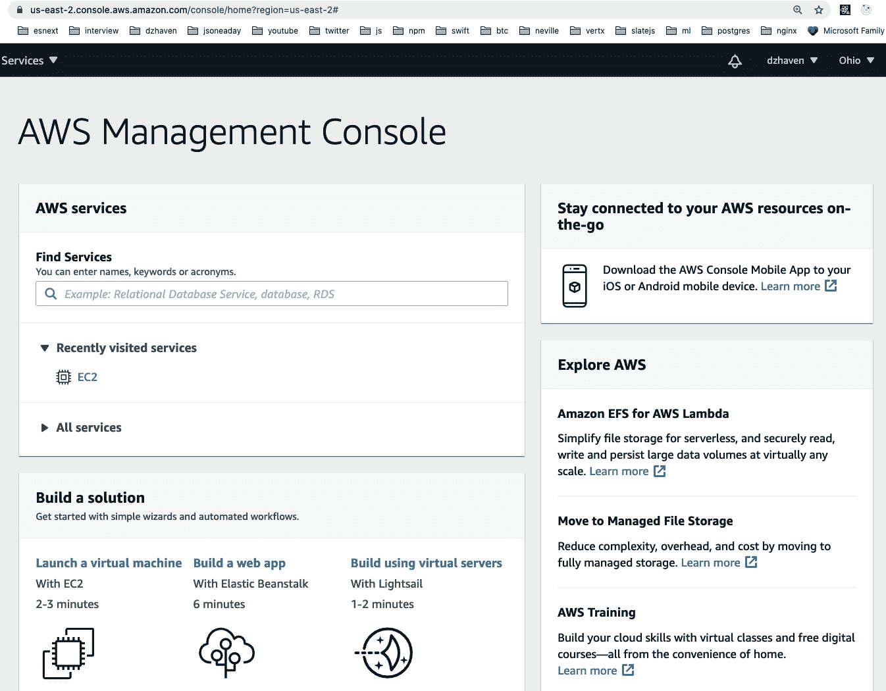

图 17.1 – AWS 门户首页

1.  我们可以看到**启动虚拟机**链接。选择它，您将进入下一个屏幕：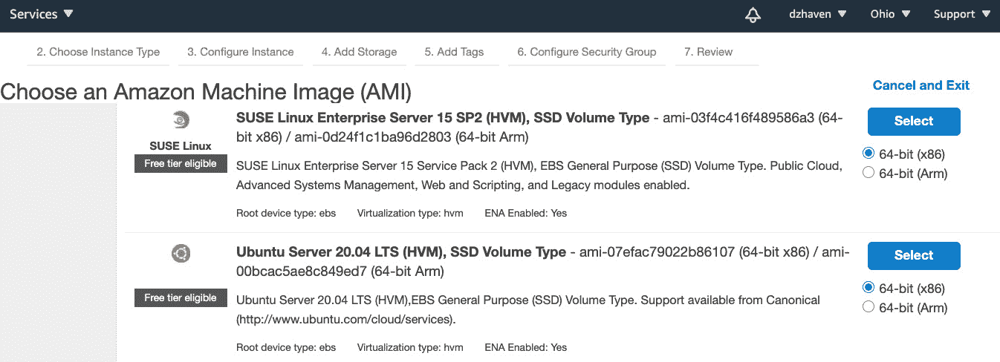

图 17.2 – 初始 VM 屏幕

让我们选择**Ubuntu 20.04 LTS**的镜像。这是 Ubuntu 的最新**长期支持**版本。

1.  一旦选择，您应该看到以下屏幕：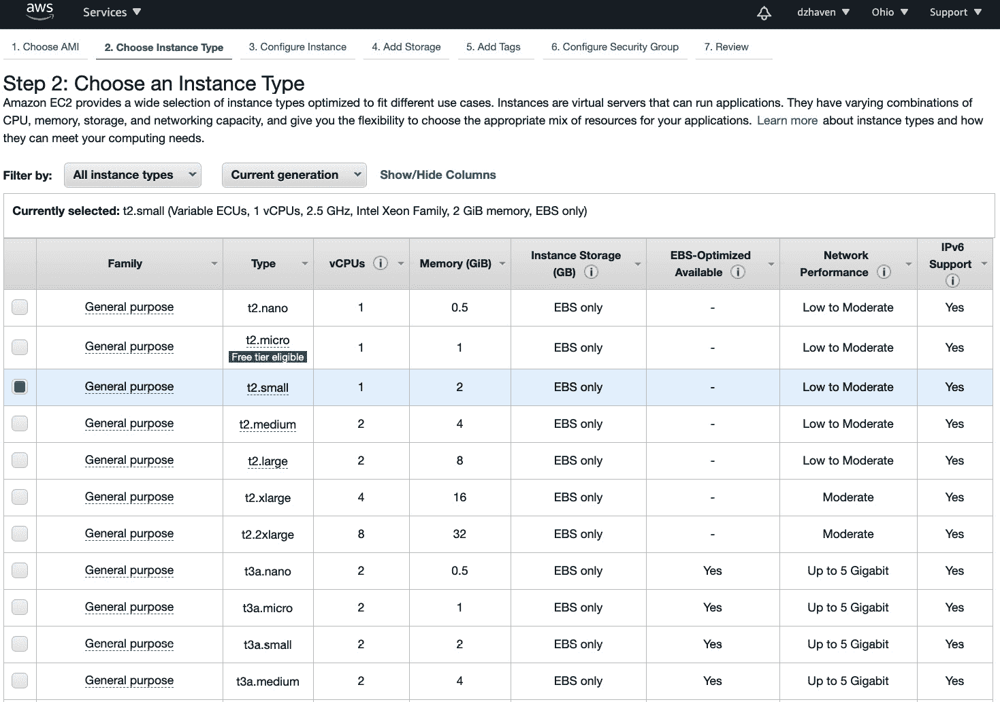

图 17.3 – VM 实例类型选择器

我已经选择了一个低端的镜像，配备 1 个 vCPU 和 2GB 内存。请注意，EBS 是 AWS 特定的存储性能优化。

让我们保持默认设置简单，并在做出选择后选择屏幕底部的**审阅和启动**按钮。

1.  以下是我选择的主要细节：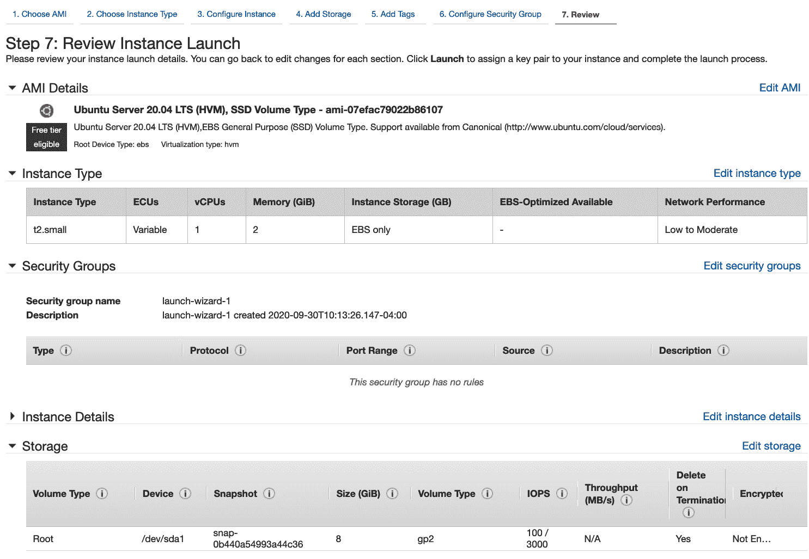

图 17.4 – 初始配置屏幕

现在，在底部选择**启动**按钮继续。

1.  接下来，您将看到以下提示：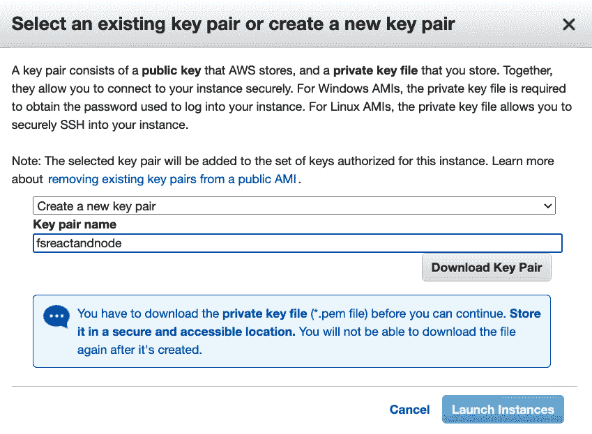

图 17.5 – 选择现有密钥对对话框

此屏幕创建一组用于 SSH 的加密密钥，一个用于您，一个用于 AWS，这样我们就可以远程终端进入 VM。下载这些文件并保持安全。点击**启动实例**按钮继续。

警告

您必须将 pem 文件保存在安全且可访问的位置。您将无法再次下载它。

1.  完成后，您应该看到**启动状态**屏幕。只需点击底部的**查看实例**按钮继续访问门户网站：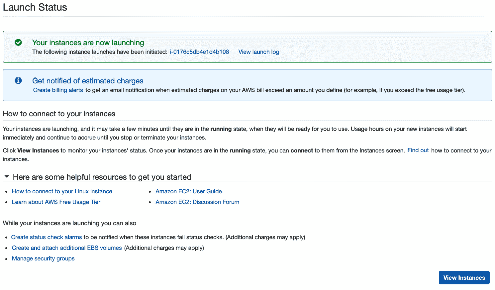

图 17.6 – VM 设置完成屏幕

1.  这将是您的 VM 实例门户网站：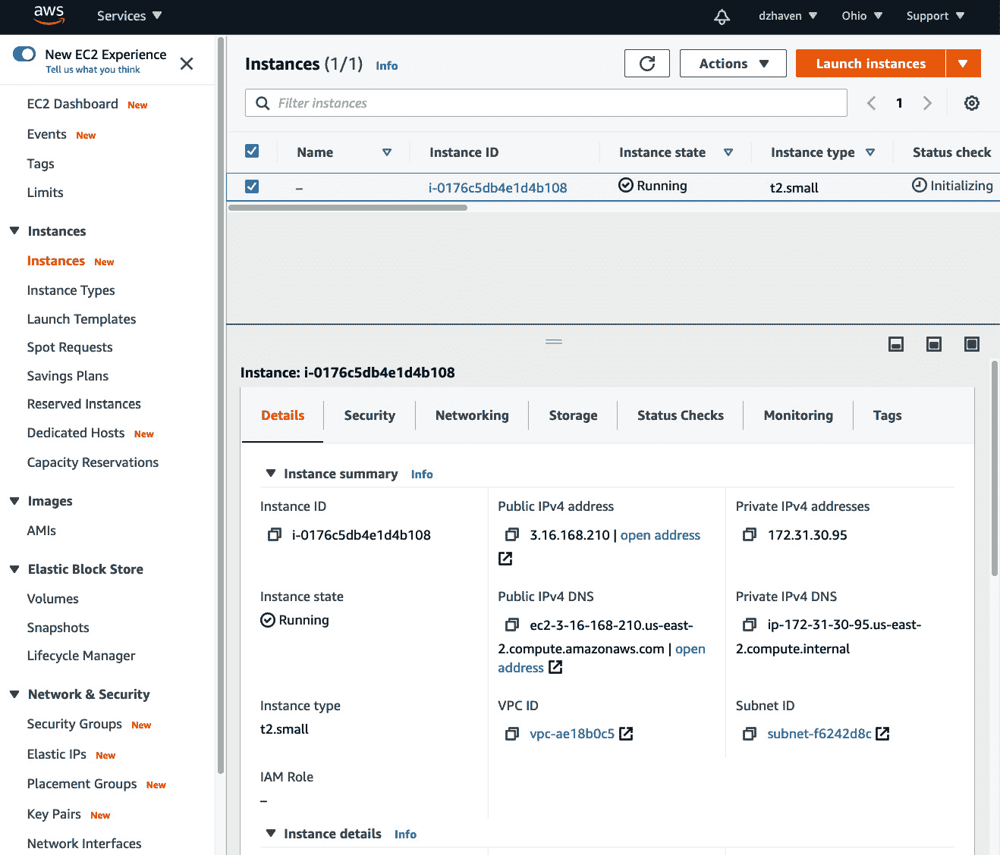

图 17.7 – VM 门户网站

1.  点击**实例 ID**，您将看到**实例摘要**屏幕：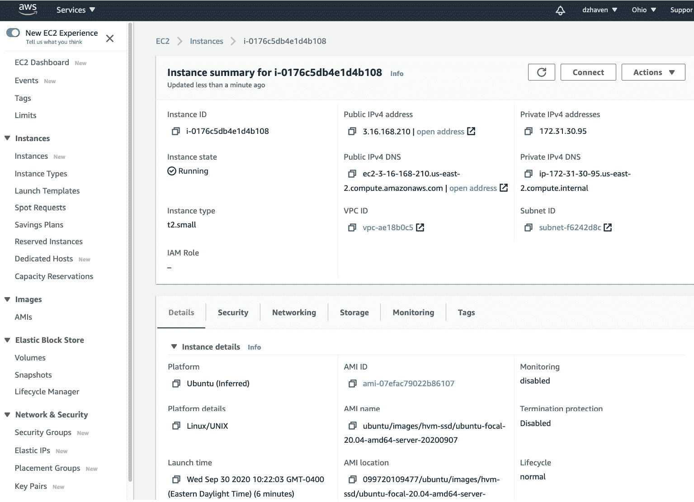

图 17.8 – 实例摘要

您可以看到一些快速信息，例如运行实例状态、公共 IP 地址和公共 DNS 名称。

1.  在此屏幕的右上角附近，您将看到**连接**按钮。单击它以获取**连接到实例**屏幕：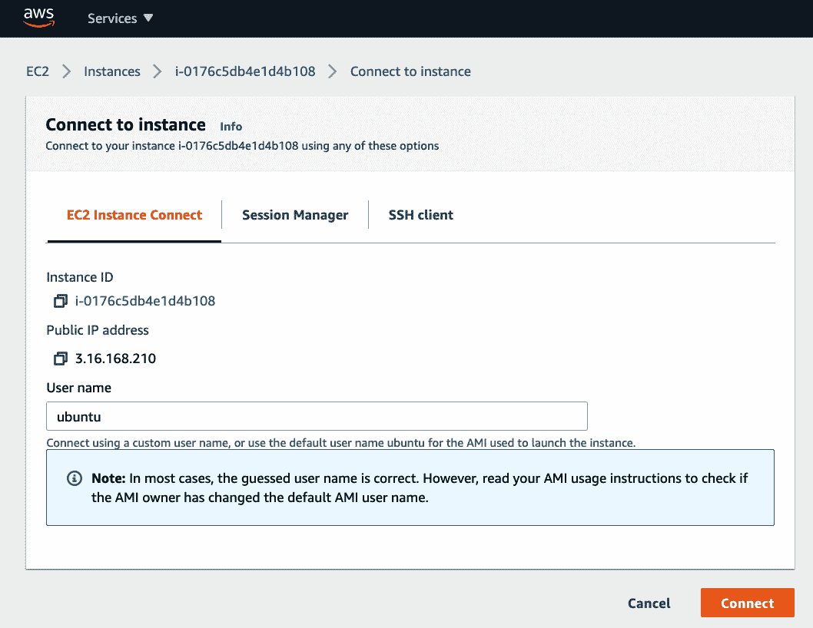

图 17.9 – 连接到实例屏幕

第一个选项卡是**EC2 实例连接**，这是 AWS 为我们提供的终端。单击**连接**按钮，我们将在浏览器内看到我们的 Ubuntu 服务器终端，如下所示：

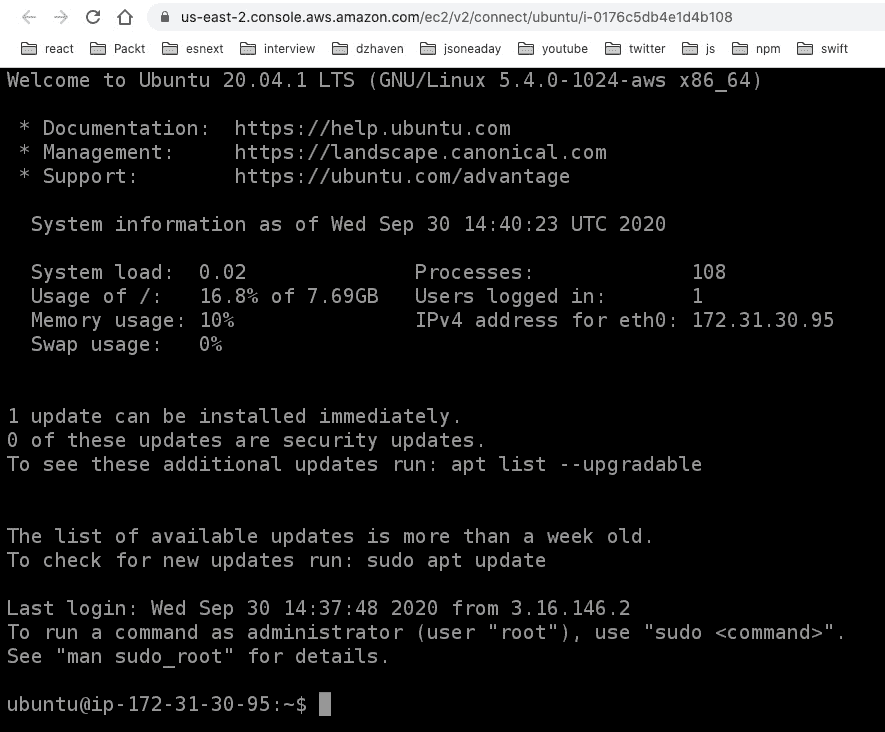

图 17.10 – AWS EC2 实例连接

这是一个可选的界面，如果 SSH 由于某种原因无法工作，我们可以使用它。在本演示中，我将使用 SSH 界面。

1.  返回到您的**连接到实例**屏幕，并选择第三个选项卡**SSH 客户端**。您应该看到类似于这样的内容。当然，您的值将是唯一的：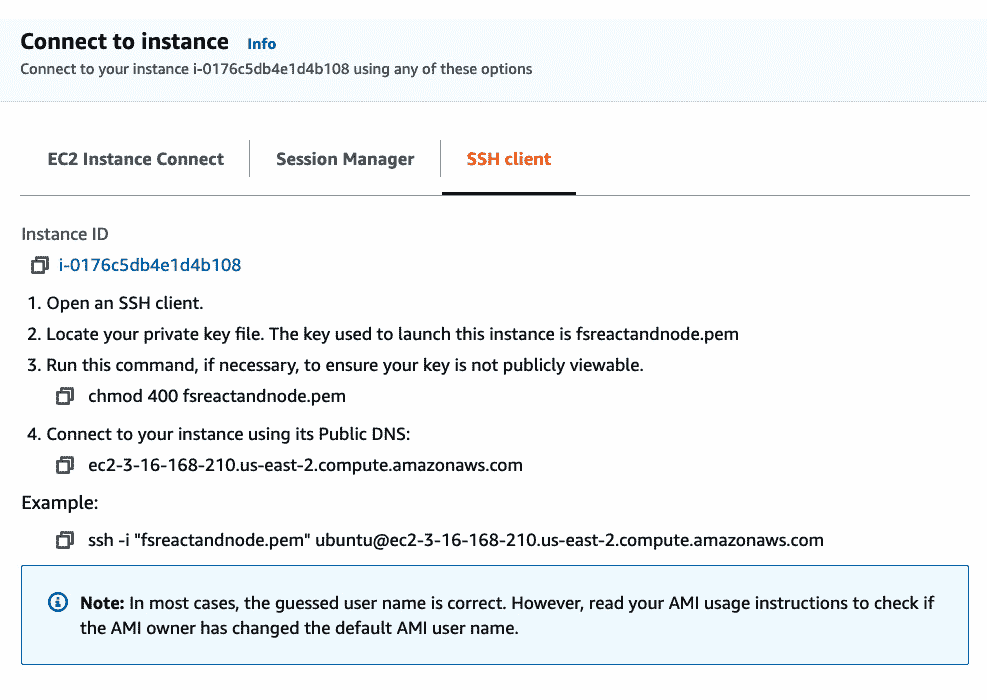

图 17.11 – SSH 如何操作说明

1.  这是我在自己的终端上运行这些说明的示例：

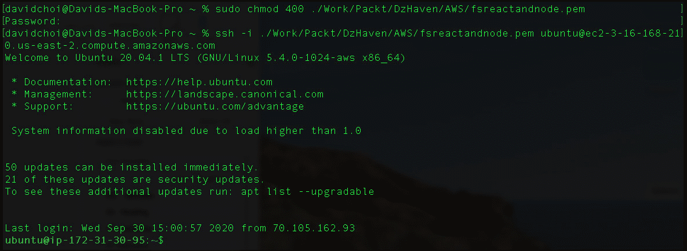

图 17.12 – 第一个 SSH 终端

首先，根据 AWS 的说明更改了本地 pem 文件的权限。然后，我运行了如图所示的 SSH。请注意，我使用`ubuntu`作为用户名，您的 VM 也应该是相同的，并且我使用了我的服务器的`DNS 名称`。

注意

如果这对您不起作用，请尝试打开您的网络入站规则以使 SSH 为**任何来源**。如果这也不起作用，您还可以恢复使用 AWS 提供的终端，如之前所示。

这完成了我们对 Ubuntu Linux 的设置。接下来让我们安装 Redis。

# 在 Ubuntu 上设置 Redis、Postgres 和 Node

在本节中，我们将在 Linux 服务器上安装我们的主要要求。我们已经在*第十三章*中涵盖了 Redis 的设置和配置，*使用 Express 和 Redis 设置会话状态*，但让我们最后再做一次，因为我们现在都有相同的基础操作系统。

## 设置 Redis

在本节中，我们将安装我们的 Redis 服务器并为我们的应用程序进行配置：

1.  在您的终端上，登录服务器并运行以下两个命令：

```ts
Apt is a software dependency packaging tool for Linux distributions such as Ubuntu and Debian. Its roughly comparable to NPM. So here, we are updating our apt to the latest version and then using it to install Redis.
```

1.  安装完成后，像这样打开`redis.conf`文件：

```ts
sudo nano /etc/redis/redis.conf
```

1.  找到`requirepass`条目，取消注释，并添加您自己的密码。

警告

源代码文件夹`super-forum-server/dev-config/.env`中的`REDIS_PASSWORD`变量的密码必须与您在`redis.conf`文件中输入的密码匹配。在部署时，我们将稍后包括`dev-config`文件夹中的文件。

1.  接下来，找到`supervised`条目，并将其设置为`systemd`的值。这允许 Ubuntu 通过其`init`系统控制 Redis，该系统使用一个名为`systemctl`的命令。现在，保存并退出。

1.  现在，让我们重新启动 Redis 服务器以应用新的设置：

```ts
sudo systemctl restart redis.service
```

如果我们想要停止服务，我们可以运行以下命令：

```ts
sudo systemctl stop redis.service
```

如果我们想要启动服务，我们运行以下命令：

```ts
sudo systemctl start redis.service
```

1.  如果您运行此命令，它将显示 Redis 是否正常运行：

```ts
sudo systemctl status redis
```

您应该看到类似于这样的内容：

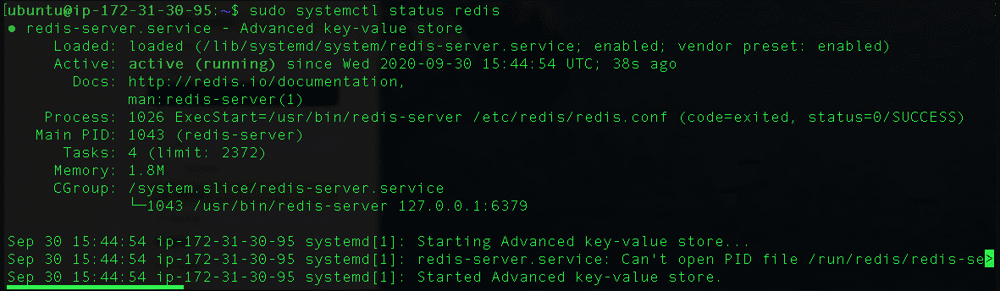

图 17.13 – Redis 状态

在本节中，我们在我们的 Ubuntu 服务器上安装了 Redis，并打开了根据需要启动和停止服务器的能力。现在我们将继续安装 Postgres。

## 设置 Postgres

现在，让我们为我们的应用安装 Postgres：

1.  我们将再次使用`apt`。运行此命令：

```ts
sudo apt install postgresql
```

1.  让我们通过运行此屏幕截图中显示的命令来检查它是否正常工作：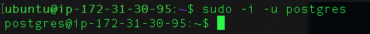

图 17.14 - psql 命令

命令中显示的`postgres`角色是 Postgres 中默认创建的全局管理员帐户。我们基本上通过在命令中使用`-i`，使我们登录的 Linux 帐户临时充当`postgres`帐户。`-u`表示我们正在使用哪个角色。

注意

我们不使用`pgAdmin`，因为我们可以使用`psql`命令行工具获得相同的功能，并且在 AWS 上启用`pgAdmin`很麻烦和困难。

1.  因此，现在我们正在以`postgres@<your ip>`用户身份运行，就像屏幕截图中显示的那样。如果我们不是以 Postgres 身份运行，我们需要在任何 Postgres 命令前加上`sudo -u postgres`前缀。但由于我们正在以 Postgres 的角色运行，我们可以像*图 17.13*中显示的那样运行命令。

`createuser --interactive`命令根据一系列提示创建新用户。运行此命令并按照提示进行回答。

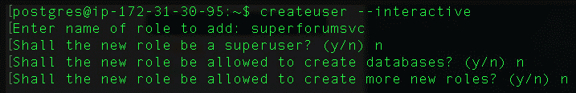

图 17.15 - createuser

我已将用户名设置为`superforumsvc`。

1.  现在，我们将给我们的新用户设置密码，就像这样：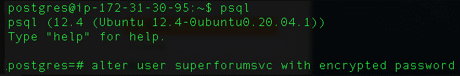

图 17.16 - 设置新用户密码

首先，我启用命令行工具`psql`。然后，我输入一个 SQL 查询来更改`superforumsvc`用户的密码。

请注意，我在关键字密码后面截断了末尾，显示密码是什么，但它应该用单引号括起来，就像这样**'<your password>'**。显然，您会想要创建自己的密码。

1.  现在，让我们为应用创建数据库。首先，退出`psql`命令，然后像这样创建数据库：

```ts
superforumsvc role the owner of the new database.
```

1.  现在让我们将我们的`ThreadCategory`默认添加到我们的数据库中。在`super-forum-server`项目中，您会找到`utils/InsertThreadCategories.txt`文件。其中包含我们一直在使用的`Categories`。当然，您也可以添加自己的`Categories`。这是我尝试插入类别的示例：

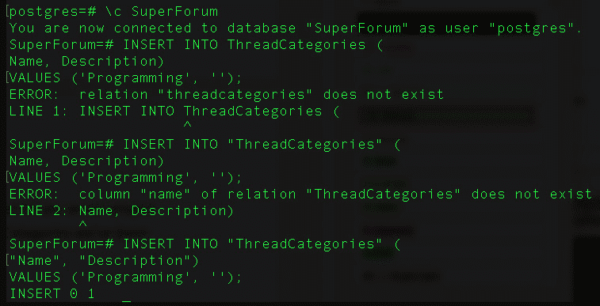

图 17.17 - 插入 ThreadCategory

正如您所看到的，前几次失败了。所以，让我们深入研究一下。首先，您必须在正确的数据库上。因此，再次使用`\c`来执行。请注意，数据库名称区分大小写。然后，请确保您的表和字段名称周围有双引号。对于`psql`命令行，请不要仅使用`pgAdmin`。

这就是我们的 Postgres 设置。接下来，让我们设置 Node。

## 设置 Node

现在，让我们安装 Node：

1.  运行以下命令：

```ts
sudo apt install nodejs 
```

1.  现在，运行此命令进行检查，您应该看到您的 Node 安装的版本号：

```ts
node -v
```

您的 Node 版本应该*至少*是 12 或更高版本。如果不是，您需要运行此命令：

```ts
curl -sL https://deb.nodesource.com/setup_12.x | sudo -E bash -
```

然后再次运行此命令：

```ts
sudo apt install nodejs
```

1.  现在，让我们通过运行以下命令来安装 NPM：

```ts
sudo apt install npm
```

1.  现在，我们需要安装一种管理我们的 Node 服务器的方法，也就是关闭它并自动重新启动它。因此，我们将使用`pm2`，这是目前管理 Node 最流行的方法之一。请注意，我们使用`-g`开关全局安装它：

```ts
sudo npm install -g pm2
```

在本节中，我们回顾了如何设置我们的核心服务依赖项：Redis，Postgres 和 Node。我们现在准备开始使用 NGINX 设置实际服务器。

# 设置和部署我们的应用在 NGINX 上

在本节中，我们将安装和配置我们的应用以使用 NGINX。NGINX 是一个非常受欢迎的高性能 Web 服务器，反向代理和负载均衡器。它以其强大的性能和处理使用多个服务器的站点的不同配置的能力而受到尊重。

我们将用它来为两个站点提供服务。一个将为我们的 React 客户端提供服务，另一个将为我们的 GraphQL Express 服务器提供服务。我们所有的站点流量都将首先经过 NGINX，然后它将将这些请求重定向到我们应用程序的适当部分。让我们首先安装 NGINX：

1.  SSH 登录到您的服务器，如前面的*在 AWS 云上设置 Ubuntu Linux*部分所示，并运行以下命令安装 NGINX：

```ts
sudo apt update
sudo apt install nginx
```

1.  现在 NGINX 已安装好，让我们创建一个文件夹来存储我们的服务器文件：

```ts
/var/www directory is the default location for web files, as the name implies.
```

## 设置超级论坛服务器

在本节中，我们将为我们的服务器代码创建构建和部署过程。有一个标准化的部署过程是很好的，这样您的部署就会保持一致和可靠：

1.  在我们开始复制文件之前，我们需要进行一些基本设置和构建我们的服务器项目。在 VSCode 中打开`super-forum-server`项目。如果您查看`package.json`文件的 scripts 部分，您会发现我们有一个名为`build`的新脚本。这将编译我们的服务器代码，并将其适当地打包到`dist`文件夹中进行分发。现在，为了使此命令起作用，我们需要先在您的开发机器上全局安装一些 NPM 包。在您的开发机器上运行以下命令，*而不是 Ubuntu 服务器*：

```ts
del-cli package is a universal command-line delete command. This means that irrespective of whether your development machine is Linux, Mac, or Windows, this command will work the same. Similarly, the cpy-cli package allows the universal copying of files and folders. We use these commands so that we can have a single NPM script command that will work the same across all developer operating systems.Let's explain this script. The build script first deletes the `dist` folder, so that we start afresh each time. It then copies the contents of `dev-config` into `dist` and separately copies the `.env` file into `dist`. And then, finally, it runs the TypeScript compiler.So, notice we also have a new folder called `dev-config`. This folder will hold configuration-related files that will ultimately be copied into our `dist` folder by the build script. The files in this folder are the `.env` file, for global configuration, the `ormconfig.js` file, for TypeORM configuration, and our `package.json` file. NoteYour `.env` file in the `dev-config` folder must have the working configuration for *your* server. This includes the passwords you are using, the account names, and the IP addresses. They must all be set correctly according to *your* configurations. If you have trouble getting your server to work, this file is the first place to look.
```

1.  不幸的是，最新的 Express NPM 包似乎存在某种 bug，因此我们需要安装一个额外的 NPM 包依赖。在您的开发机器上运行以下命令：

```ts
@types/express, but we are making sure the latest version is now there. If you want to learn more about this bug, refer to this link: https://github.com/DefinitelyTyped/DefinitelyTyped/issues/47339.
```

1.  注意一件事。在`super-forum-server/src/index.ts`文件中，我在文件顶部添加了一个新函数`loadEnv`。这个文件将使用 Node 的`__dirname`变量处理`.env`文件在您的开发和服务器环境之间的相对路径差异。

我还调整了`super-forum-server/dev-config/ormconfig.js`文件，以便它使用`__dirname`作为 TypeORM 实体的路径。

警告

我们已经在`ormconfig.js`中启用了`synchronize`字段为`true`。此设置仅用于开发部署。在生产环境中，请勿使用此设置，因为它可能触发不需要的数据库更改。对于生产环境，您应该使用预先制作的数据库，然后直接部署，将`synchronize`设置为`false`。

1.  好的。现在让我们尝试运行我们的构建脚本。在您的开发机器上运行以下命令：

```ts
dist folder, as shown in the following screenshot: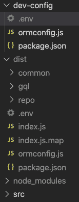Figure 17.18 – The dist folder
```

1.  现在，让我们尝试将我们的`dist`文件夹复制到我们的服务器上。在您的开发机器终端上，使用适合您的配置运行以下命令：

```ts
pscp.Now, when I run this on my machine, I get the following result: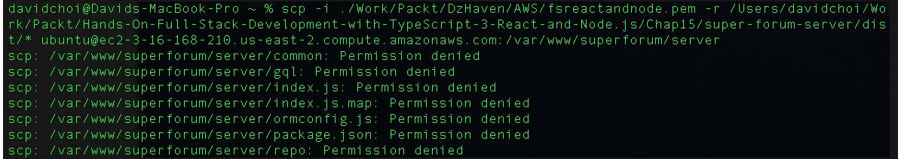Figure 17.19 – Attempt dist copy failureSo, obviously this failed. This failure is due to a lack of permissions on the destination folder on the Ubuntu server. Let's fix this now.
```

1.  重新登录到您的 Ubuntu SSH 会话，并运行以下命令：

```ts
sudo chmod -R 777 /var/www/superforum/server
```

此命令将暂时打开所有访问权限，以便我们可以复制我们的文件。在复制完成后，我们将关闭它，以减少安全风险。

1.  现在，通过使用与您的开发终端相同的`scp`命令来复制文件。例如，这是我从我的开发机器上运行的命令，在打开权限后：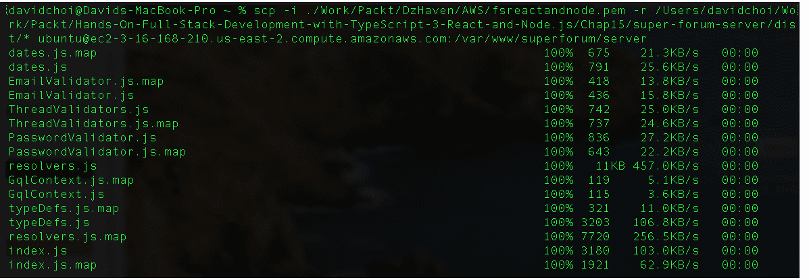

图 17.20 – Scp 复制

1.  现在，通过查看`server`文件夹来检查所有配置文件是否已复制到服务器中，如下所示：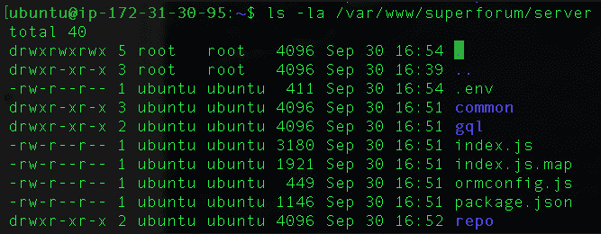

```ts
scp -i <your pem path> <your path>/.env <username><yourserverpath>/.env
```

再次说明，对于您的机器，确切的路径将有所不同。

现在，我们应该使用以下命令再次关闭我们的权限：

```ts
sudo chmod -R 755 /var/www/superforum/server
```

此权限给予所有者完全访问权限，但只给予其他人执行和读取权限。

注意

如果我们陷入安全优化的兔子洞，我们可能会写另一本书。由于这将是一个可能被丢弃的开发服务器，让我们现在专注于主要任务。一旦您准备好使用您的亿美元应用程序进行生产，您将需要对安全性进行一些尽职调查，或者更好的是，雇佣至少有 10 年经验的人。

1.  现在，在 Ubuntu 服务器上的 SSH 终端会话中，cd 进入`/var/www/superforum/server`文件夹，然后运行以下命令：

```ts
npm install 
```

当然，这将安装我们 Node 应用服务器的所有依赖。

1.  现在，我们需要设置我们的`pm2`系统，以便它可以控制我们的 Node 服务器。运行此命令：

```ts
pm2 with systemd and start our Node server when restarting the server. Systemd again is our Ubuntu services controller. After running that command, you should see something similar to this: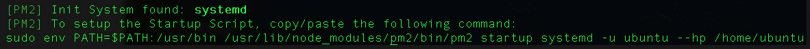Figure 17.22 – pm2 startup
```

1.  因此，请复制并粘贴此命令，从`sudo`开始，然后在 Ubuntu 服务器的 SSH 会话中运行。运行后，您应该看到类似于这样的东西：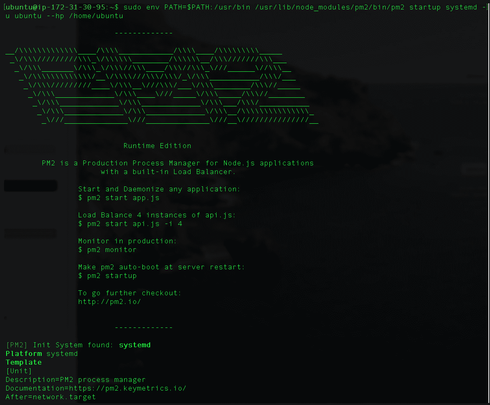

图 17.23 – pm2 启动运行的结果

1.  接下来，我们要启动我们的 Node 服务器，如下所示：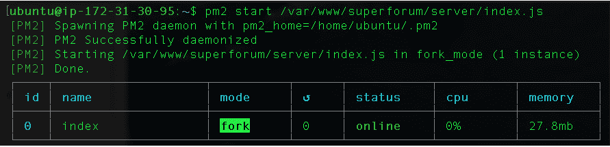

图 17.24 – Node 服务器已启动

1.  我们现在可以通过运行此命令将其保存为 pm2 启动列表的一部分：

```ts
pm2 save 
```

运行后，您应该看到以下内容：

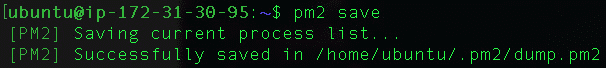

图 17.25 – pm2 保存运行

通过执行此保存操作，我们的 Node 服务器现在将在服务器重新启动时自动启动。

在本节中，我们创建了一个过程来构建、部署和启动我们的 Node 服务器。通过配置这个设置，我们可以确保在将来更新我们的代码时可以重复使用。

## 设置超级论坛客户端

好的，现在我们必须为我们的客户端项目执行类似的过程。您应该已经将`super-forum-client`复制到`Chap17`文件夹中，因为这是本章开头我们做的第一件事：

1.  现在，回到您的 Ubuntu 服务器上的 SSH 终端会话，并像这样为客户端项目创建文件夹：

```ts
sudo mkdir /var/www/superforum/client
```

1.  现在，回到`super-forum-client`项目文件夹中的开发终端，以便我们可以进行客户端构建和部署。首先，我们需要对我们的项目进行一些微小的调整。您看到我们的服务器项目使用`.env`文件进行设置。我们不需要任何涉及我们客户端项目的东西。但是，至少我们应该能够根据部署环境的需要设置 GraphQL 服务器 URL。因此，请执行以下步骤：

+   用 VSCode 打开`index.ts`，并像这样更新`ApolloClient`的代码：

```ts
const client = new ApolloClient({
  uri: process.env.REACT_APP_GQL_URL, just like how we did it on our server. But where is this variable coming from? I'll show that now.
```

+   打开`package.json`文件并查看脚本部分。您应该看到一个名为`build-dev`的新脚本，它设置了`REACT_APP_GQL_URL`变量。随意根据自己的需求创建多个版本的此脚本，具有不同的变量值。

1.  因此，现在让我们运行`build-dev`脚本：

```ts
create-react-app, but we tweaked it by adding the environment variable. Once it completes, you should see this folder called REACT_APP_. If this prefix is missing, the variable will be ignored.2\. They are inserted into our code at build time and the value gets deployed as part of our client script code. This means users will be able to search the browser scripts and view this data. Therefore, **never** include sensitive information in these environment variables.
```

1.  现在，我们只需要暂时打开服务器的客户端文件夹，以便我们可以进行复制。运行以下命令：

```ts
sudo chmod -R 777 /var/www/superforum/client
```

1.  现在我们可以部署我们的客户端构建文件。从您的开发终端，运行这个命令，当然要用您自己正确的路径：

```ts
scp -i <your pem path> -r <your path>/* <username><yourserverpath>
```

结果将看起来像这样：

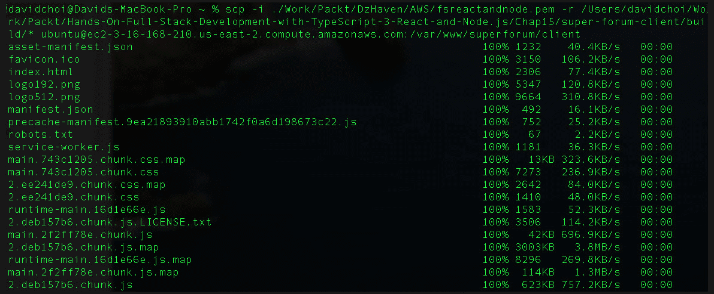

图 17.27 – 复制客户端文件到服务器

1.  现在，按照以下步骤撤消权限：

```ts
sudo chmod -R 755 /var/www/superforum/client
```

### 配置 NGINX

好的。我们已经对服务器构建进行了大量配置，现在我们可以继续配置我们安装的 NGINX 服务器：

1.  我们需要在 Ubuntu 服务器启动系统时启动 NGINX。在您的 SSH 终端上运行所示的命令，然后按照所示进行身份验证：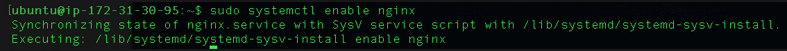

图 17.28 – 启用 NGINX 在系统启动时启动

1.  现在，使用此处显示的`status`命令检查 NGINX 是否正在运行：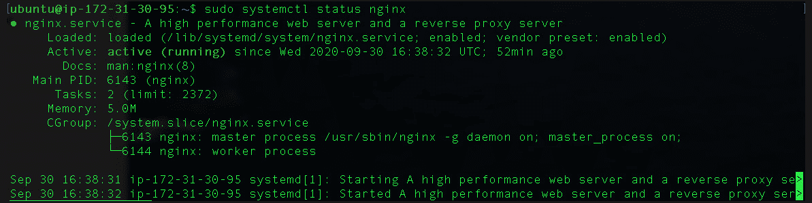

图 17.29 – NGINX 状态

1.  现在，我们需要在 AWS VM 防火墙上打开端口 80。打开浏览器到 AWS 门户，然后选择**安全组**，在**网络和安全**菜单下。然后您会看到这个：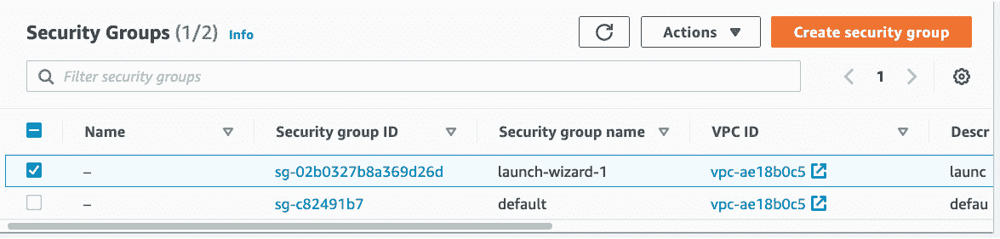

图 17.30 – 安全组

1.  现在，选择非默认组，您将看到以下截图中显示的屏幕。请注意**入站规则**在底部附近：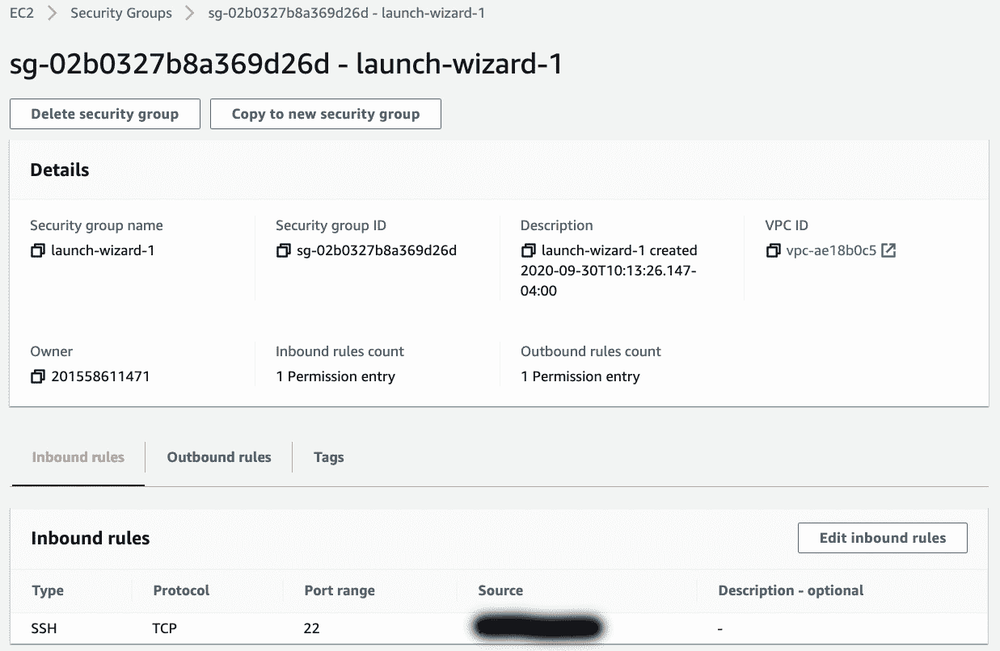

图 17.31 – 网络选项卡；添加入站端口规则

1.  选择**编辑入站规则**按钮，然后在下一个屏幕上，单击**添加规则**按钮。

选择后，您应该会看到*图 17.32*中显示的屏幕。添加 HTTP 的新入站规则，如下截图所示：

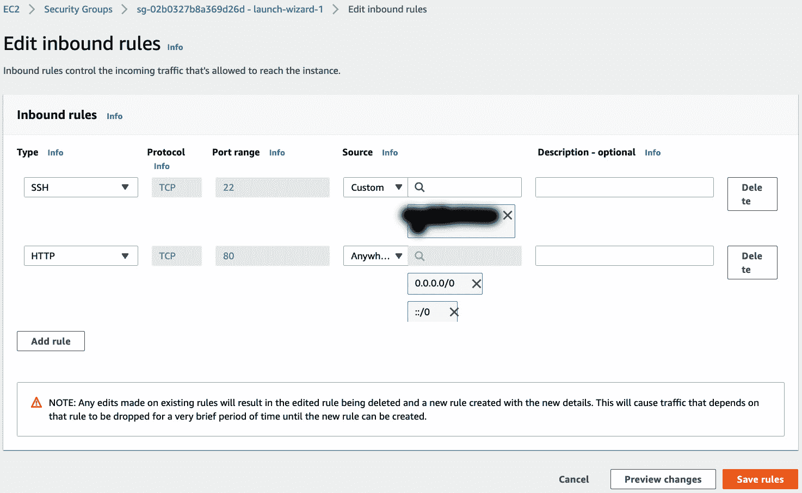

图 17.32 – 新的 HTTP 入站规则

通过选择**0.0.0.0/0**作为源，您允许任何 IP 地址，这是我们想要的。现在，点击**保存规则**按钮保存规则。

1.  通常，本地 Ubuntu 防火墙未启用。但是，如果启用了，我们还需要让防火墙通过到 NGINX 的流量。如果需要，运行以下命令：

```ts
ec2-3-16-168-210.us-east-2.compute.amazonaws.com, yours will be different and again you can find it on your VM instance screen, you should see this: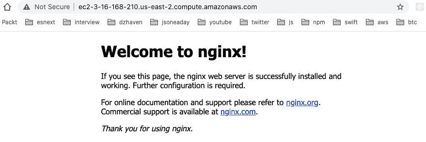Figure 17.34 – Default NGINX load screen
```

1.  显然，我们的 NGINX 已安装并正在运行。现在我们需要让它提供我们的网站。请注意，NGINX 似乎存在处理非常长的域名的 bug，就像我在 AWS 注册后收到的那样。因此，对于我们的网站，我们将使用 IP 地址。

NGINX 有两种设置站点的选项。一种允许我们使用`/etc/nginx/conf.d`文件夹中的配置文件。另一种称为 Server Blocks，使用`/etc/nginx/sites-available`文件夹。我们将使用`conf.d`方法。

运行此命令：

```ts
sudo nano /etc/nginx/conf.d/superforum.conf
```

1.  现在您的文件应该包含以下内容，再次使用您自己的文件夹路径和域名：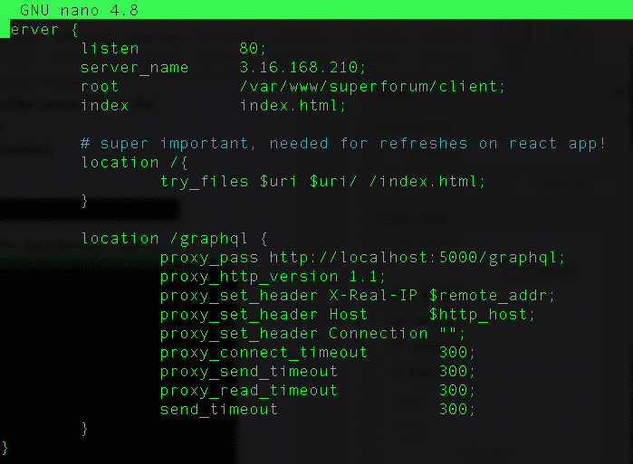

图 17.35 – 新的 NGINX 配置文件

以下是一些需要注意的事项：

不要忘记每行结尾的分号。如果没有，将会出现错误。

`server_name`是域名或 IP 地址。

`root`是包含我们的 HTML 文件的文件夹。

`位置/`是我们网站的根目录。

`位置/graphql`是我们的 GraphQL 服务器所在的地方。我们使用`proxy_pass`将调用重定向到`http://<domain or ip>/graphql`到我们的`http://localhost:5000/graphql`服务器（我们的 Node 服务器）。

`<prefix>_timeout`字段用于防止错误 503 网关超时问题，这在 NGINX 中有时会发生。

1.  接下来，我们需要通过运行以下命令测试我们的配置更改是否正常：

```ts
sudo nginx -t
```

您应该会看到这个：

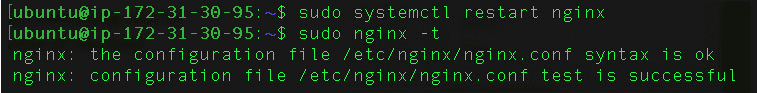

```ts
sudo systemctl restart nginx
```

1.  现在，让我们看看浏览器上的应用程序是否出现。首先，让我们停止我们的 Node 服务器，并重新启动它，而不使用`pm2`，这样我们就可以看到可能发生的任何错误。在 Ubuntu SSH 终端上运行以下命令：

```ts
pm2 stop index
node /var/www/superforum/server/index.js
```

您应该会看到类似于这样的内容：

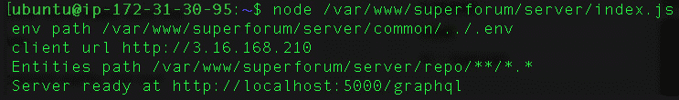

图 17.37 – 第一次运行 Node 服务器

再次说明，您的 IP 地址将不同，如果更改了路径，可能也会不同。如果看到错误，请稍后查看故障排除部分。

1.  现在，打开浏览器，转到 AWS 给出的 IP 地址。然后，点击**注册**按钮，让我们注册一个新用户，如下所示：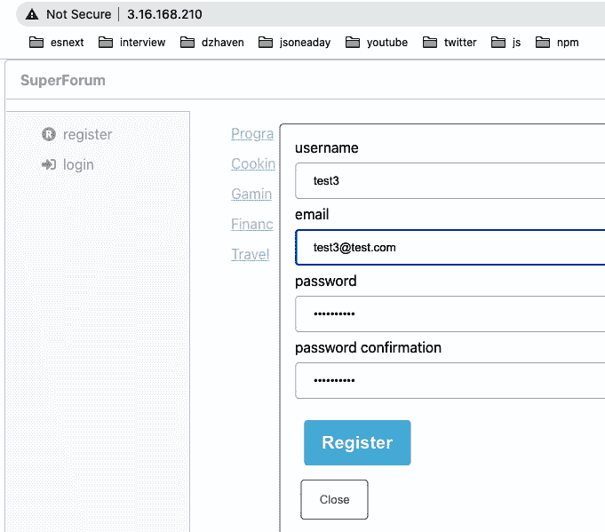

图 17.38 – 注册新用户测试

根据需要填写值，然后点击**注册**按钮。您应该会看到类似于这样的内容：

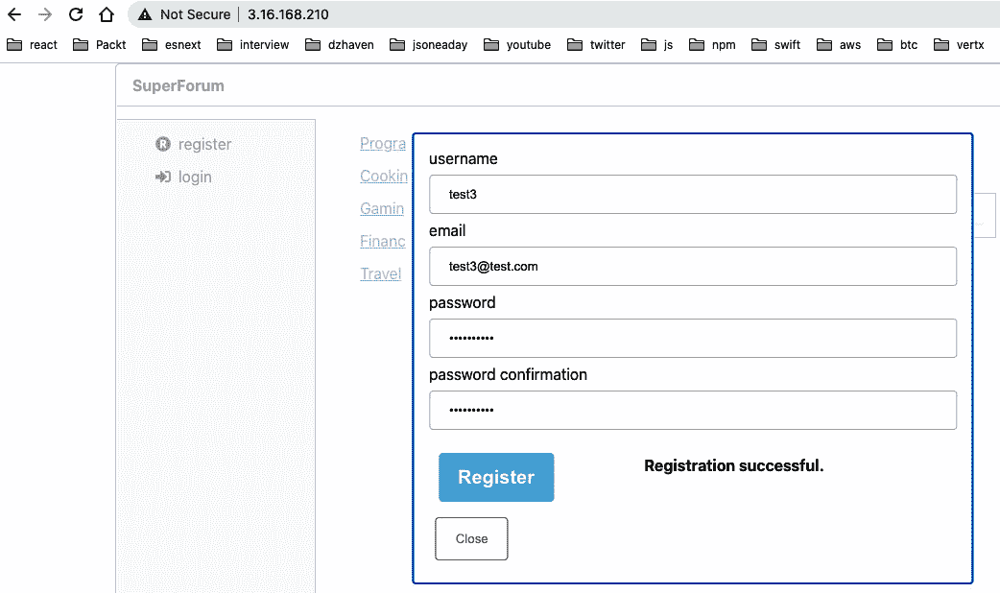

图 17.39 – 注册成功

1.  现在我们需要确认我们的新用户。在 Ubuntu SSH 终端上运行以下命令：

```ts
sudo -u postgres psql
\c SuperForum
Update "Users" set "Confirmed" = true;
```

让我们确认所有用户都已注册。完成命令后，您应该会看到确认，如下所示：

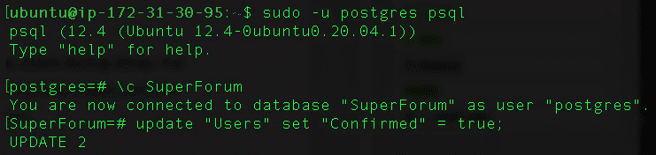

图 17.40 – 确认注册用户

1.  现在，让我们尝试使用我们的新用户登录：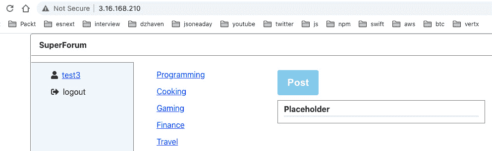

图 17.41 – 登录测试 3 用户

1.  当然，目前我们没有数据，所以现在我们将添加一个主题帖，就像这样：

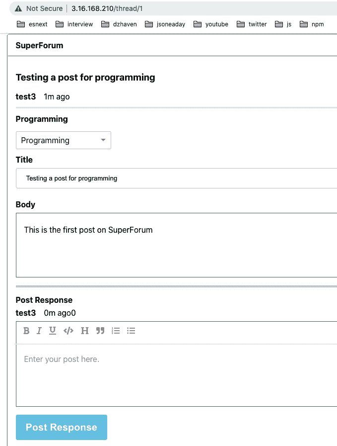

图 17.42 – 第一篇文章

现在，这是我们的主页：

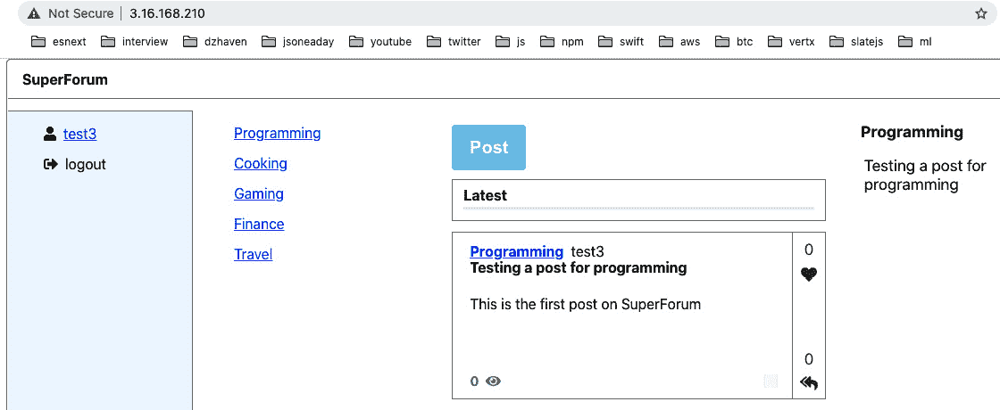

图 17.43 – 第一篇文章后的主屏幕

就是这样。我们完成了！

在本节中，我们使用 NGINX 和所有其他服务完成了应用程序的设置。恭喜！您做得非常出色，并且已经通过了大量高度技术性的材料。

## 故障排除

设置和使用云服务可能比仅在自己的网络上使用服务器要复杂得多。以下是处理问题的一些基本提示：

+   每次更新客户端文件时，都必须重新启动 NGINX。

+   每次更新服务器文件时，都必须重新启动 Node 服务器。

+   始终验证您的`.env`设置是否正确，并与设置过程中选择的名称匹配；例如，您的 Postgres 数据库的名称、用户名和密码。还要确保`.env`文件的路径正确，并且 Node 服务器正在使用它。

+   确保`PG_ENTITIES`和`PG_ENTITIES_DIR`变量具有正确的路径。对于我们当前的应用程序，这将是以下内容：

`PG_ENTITIES="/repo/**/*.*"`

`PG_ENTITIES_DIR="/repo"`

如果这些设置不正确，您可能会收到错误消息，比如“找不到<Entity Name>的存储库”。

+   如果您在服务器上编辑`.env`文件，请确保在部署过程中**不会**被覆盖。换句话说，不要在服务器上编辑文件！

+   在更新任何 NGINX 的`.conf`文件后，始终使用`sudo nginx -t`命令，然后在配置更改完成后重新启动 NGINX 服务。如果出现错误，请确保所有配置行都以分号结尾。

+   如果您在开发环境中进行更改并在那里进行测试，请确保已将`NODE_ENV`环境变量设置为开发。您需要永久设置这个变量，否则它将在重新启动时消失。

+   NGINX 常见的错误是`504 网关超时`。确保您的超时配置足够。您需要调整它们。

+   请注意，非常长的域名似乎在 NGINX 中会出现问题。出于测试目的，请查看是否使用 IP 地址有效。如果有效，而域名无效，则您就知道了问题所在。

# 摘要

在本章中，我们通过将应用程序最终部署到云上，巩固了我们对 React、Node 和 GraphQL 的 Web 开发知识。学习如何将应用程序部署到 AWS 云上非常有价值，因为它目前是最受欢迎和广泛使用的云服务。此外，使用 NGINX 是正确的选择，因为 NGINX 在 Node 社区中非常高效和受欢迎。

非常感谢您加入我的旅程。作为开发人员，总是有新的东西可以学习和尝试。但是，通过了解一些最重要和关键的 Web 技术，您已经迈出了一大步。现在，您拥有了创建真正的、全栈、尖端 Web 应用所需的所有工具。再次恭喜！

祝您继续成功。
