# 第三章：介绍 MongoDB

MongoDB 的名称来源于短语 huMONGOus data，意味着它可以处理大量数据。MongoDB 是一种面向文档的数据库架构。它使我们能够更快地开发并更好地扩展。在关系型数据库设计中，我们通过创建表和行来存储数据，但与 MongoDB 相比，我们可以将数据建模为 JSON 文档，这比那些关系型数据库要简单得多。如果我们是敏捷的，并且我们的需求经常变化，并且如果我们需要持续部署，那么 MongoDB 是我们的选择。作为一个基于文档的数据模型，MongoDB 也非常灵活。

使用 MongoDB 的最大优势是数据非结构化。我们可以以任何我们喜欢的格式自定义我们的数据。在**关系型数据库管理系统**（**RDBMS**）中，我们必须精确地定义一个表可以有多少字段，但与 MongoDB 不同，每个文档都可以有自己的字段数。我们可以添加新数据，甚至无需担心更改模式，这就是为什么 Mongo 数据库采用了**无模式设计模型**。

如果我们的业务增长迅速，我们需要更快地扩展，以更灵活的方式访问数据，如果我们需要更改数据而无需担心更新应用程序的数据库模式，那么 MongoDB 是我们最佳的选择。在 RDBMS 的表中添加新列也会引起一些性能问题。但是，由于 MongoDB 是无模式的，添加新字段可以瞬间完成，而不会影响我们应用程序的性能。

在关系型数据库中，我们使用的术语是**数据库**、**表**和**行**，而在 MongoDB 中，我们分别使用**数据库**、**集合**和**文档**。

本章将简要概述我们将要涵盖的内容：

+   介绍 MongoDB 及其使用 MongoDB 的好处

+   理解 MongoDB 数据库、集合和文档

+   介绍 Mongoose，使用 Mongoose 建立连接，理解 Mongoose，以及使用 Mongoose 进行 CRUD 操作

+   使用 Mongoose 添加默认和自定义验证

# 为什么选择 MongoDB？

MongoDB 提供了许多优势，其中一些包括：

+   **灵活的文档**：MongoDB 的集合包含多个文档。一个集合下的每个文档可以有不同的字段名，并且可以有不同的尺寸，这意味着我们不需要定义模式。

+   **无复杂关系**：MongoDB 中的文档以 JSON 文档的形式存储，这意味着我们不再需要费心学习应用程序各个组件之间的关系。

+   **易于扩展**：MongoDB 易于扩展，因为它通过使用称为分片的方法来最小化数据库大小。分片是一种数据库分区方法，允许我们将大型数据库分割成更小的部分。

# MongoDB 查询

我们在 第一章，“MEVN 简介”中简要回顾了 Mongo 查询的外观。在这里，我们将深入探讨这些查询。

我们需要做的第一件事是启动 MongoDB 服务器。我们可以使用以下命令来完成：

```js
$ mongod
```

现在，让我们通过在终端中键入 `mongo` 来打开 mongo shell。当我们进入 mongo shell 时，要显示数据库列表，我们键入 `show dbs`。

如果你看到数据库在列表中，键入 `use {database_name}` 以开始使用此数据库。如果我们还没有创建我们的数据库，只需使用 `use {database_name}` 就会为我们创建一个数据库。就这么简单。对于这个练习，让我们创建一个名为 `mongo_test_queries` 的数据库。为此，我们需要使用：

```js
> use mongo_test_queries
```

这应该在终端中输出以下内容：

```js
# switched to db mongo_test_queries
```

现在，一旦我们进入数据库，我们首先需要的是一个集合。我们有一个数据库，但没有集合。在 MongoDB 中创建集合的最佳方式是通过插入一个文档。这不仅初始化了一个集合，还将文档添加到该集合中。就这么简单。现在，让我们继续学习 Mongo 查询。

# 创建文档

在 MongoDB 中创建文档有不同的查询，例如 `insertOne()`、`insertMany()` 和 `insert()`。

# insertOne()

`insertOne()` 命令将单个文档添加到我们的集合中。例如：

```js
> db.users.insertOne(
 {
 name: "Brooke",
 email: "brooke@app.com",
 address: 'Kathmandu'
 }
)
```

此命令仅接受一个参数，即一个对象，我们可以传递我们想要为 `users` 集合指定的字段名称和值。当我们运行上述代码时，我们应该在 Mongo shell 的终端中得到以下输出：

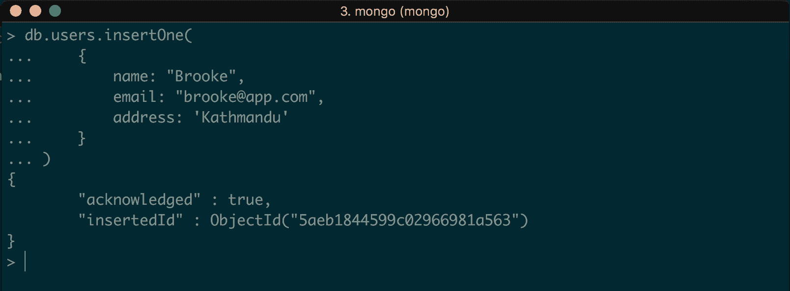

它返回刚刚创建的文档的 `_id`。我们已经成功在 `users` 集合中创建了一个集合和文档。

`insertOne()` 和 `insertMany()` 命令仅适用于 Mongo 版本 3.2 或更高版本。

# insertMany()

此命令用于将多个文档插入到集合中。在先前的示例中，我们看到了 `insertOne()` 命令接受一个参数，该参数是一个对象。`insertMany()` 命令接受一个数组作为参数，这样我们就可以在它内部传递多个对象，并将多个文档插入到集合中。让我们看一个例子：

```js
> db.users.insertMany(
 [
 { name: "Jack", email: "jack@mongo.com" },
 { name: "John", email: "john@mongo.com" },
 { name: "Peter", email: "peter@mongo.com" }
 ]
)
```

此代码片段在 `users` 集合中创建了三个文档。当我们运行此命令时，输出应该是：

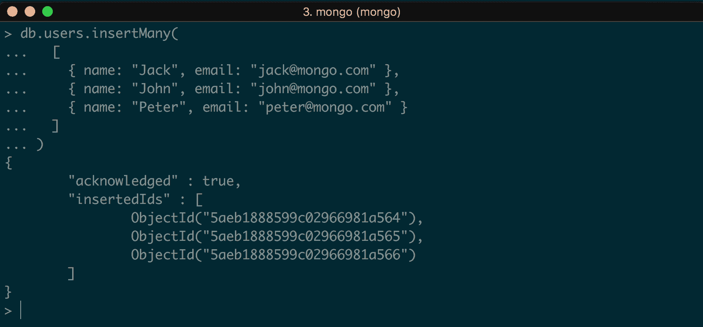

# insert()

此命令将单个文档以及多个文档插入到集合中。它同时完成了 `insertOne()` 和 `insertMany()` 命令的工作。要插入单个文档，我们可以使用：

```js
> db.users.insert(
    { name: "Mike", email: "mike@mongo.com" }
)
```

如果命令执行成功，我们应该看到以下输出：

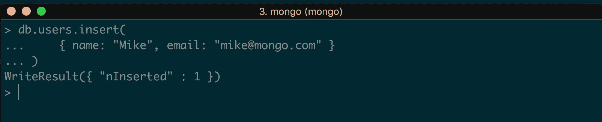

现在，如果我们想插入多个文档，我们可以简单地使用：

```js
> db.users.insert(
  [
    { name: "Josh", email: "josh@mongo.com" },
    { name: "Ross", email: "ross@mongo.com" },
  ]
)
```

输出应该是以下内容：

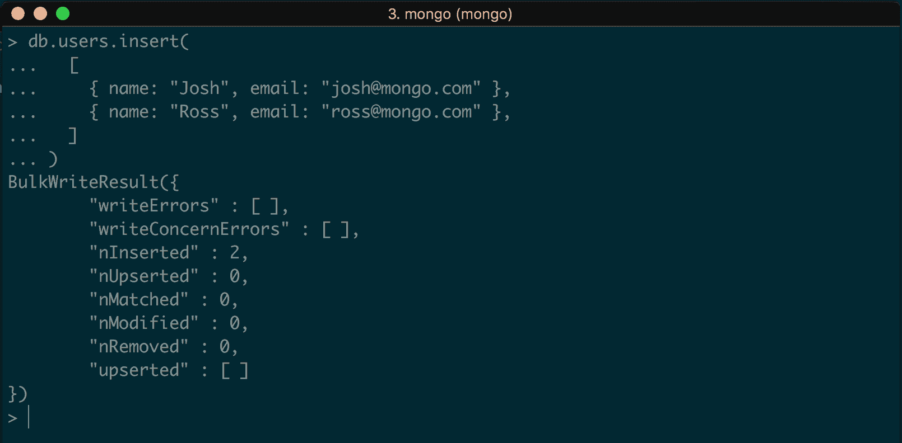

# 检索文档

使用 `find()` 命令从 MongoDB 的集合中检索文档。有多种使用此命令的方法。

# 查找所有文档

要从集合中检索所有文档，我们可以使用：

```js
> db.users.find()
```

我们也可以使用以下：

```js
> db.users.find({})
```

这会输出以下内容：

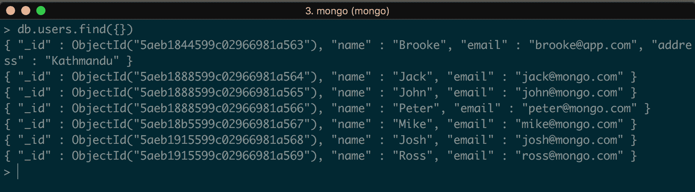

# 通过过滤器查找文档

我们也可以在 `find()` 命令中添加过滤器。让我们检索名为 `Mike` 的文档。为此，我们可以使用：

```js
> db.users.find({ name: 'Mike' })
```

它应该返回以下文档：

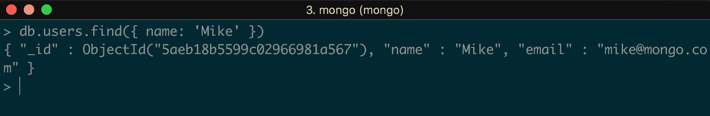

我们也可以使用 `AND` 或 `OR` 查询指定多个条件。

要查找名为 `Mike` 且电子邮件为 `mike@mongo.com` 的集合，我们可以简单地使用：

```js
> db.users.find({ name: 'Mike', email: 'mike@mongo.com' })
```

逗号运算符表示 `AND` 运算符。我们可以使用逗号分隔的值指定任意数量的条件。前面的命令应该输出：

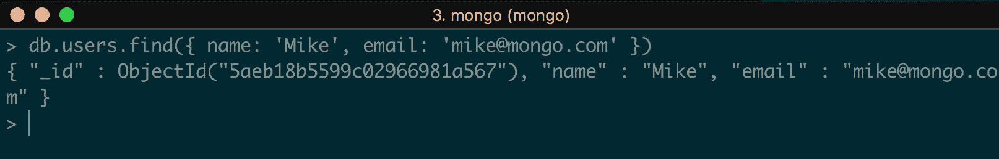

现在指定 `AND` 或逗号运算符的条件变得简单。如果我们想使用 `OR` 运算符，那么我们应该使用：

```js
> db.users.find(
 {
 $or: [ { email: "josh@mongo.com" }, { name: "Mike" } ]
 }
)
```

这里，我们说的是：检索那些名为 Mike 的用户文档，电子邮件可以是 `josh@mongo.com`。输出如下：

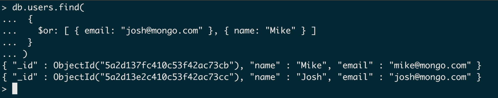

# 更新文档

就像 `insert()` 一样，在 MongoDB 中使用 `update()` 命令有三种方法：`updateOne()`、`updateMany()` 和 `update()`。

# updateOne()

此命令只更新集合中的一个文档。在这里，我们插入了一些用户条目，电子邮件不正确。对于名为 `Peter` 的用户，电子邮件是 `jack@mongo.com`。让我们使用 `updateOne()` 更新此文档：

```js
> db.users.updateOne(
 { "name": "Peter" },
 {
 $set: { "email": "peter@mongo.com" }
 }
 )
```

此命令将更新 Peter 的电子邮件为 `peter@mongo.com`。输出如下：

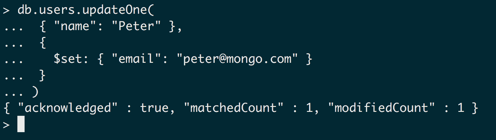

正如输出所示，`modifiedCount` 是 `1`，`matchedCount` 也是 `1`，这意味着找到了符合给定条件的文档并已更新。

# updateMany()

此命令用于更新集合中的多个文档。`updateOne()` 和 `updateMany()` 更新文档的命令相同。要更新多个记录，我们指定条件并设置所需的值：

```js
> db.users.updateOne(
 { "name": "Peter" },
 {
 $set: { "email": "peter@mongo.com" }
 }
 )
```

`updateOne()` 和 `updateMany()` 之间的唯一区别是 `updateOne()` 只更新第一个匹配的文档，而 `updateMany()` 更新所有匹配的文档。

# update()

就像插入一样，`update()` 命令为 `updateOne()` 和 `updateMany()` 做了同样的事情。为了消除混淆，我们可以直接使用 `update()` 命令而不是 `updateOne()` 和 `updateMany()`：

```js
> db.users.update(
 { "name": "John" },
 {
 $set: { "email": "john@mongo.com" }
 }
 )
```

输出如下：

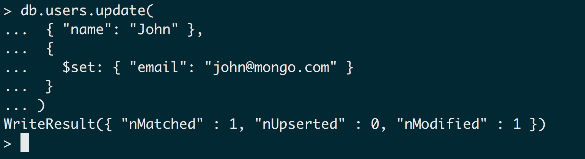

# 删除文档

MongoDB 提供了多个命令用于从集合中删除和移除文档。

# deleteOne()

`deleteOne()` 只从集合中删除一个文档：

```js
> db.users.deleteOne( { name: "John" } )
```

这会删除名为 `John` 的用户条目。输出如下：

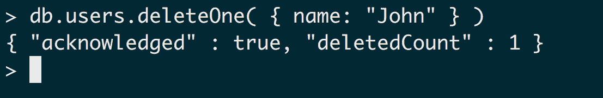

如您在输出中看到的，`deletedCount` 是 `1`，这意味着记录已被删除。

# deleteMany()

`deleteMany()` 命令与 `deleteOne()` 相同。唯一的区别是 `deleteOne()` 只删除与匹配过滤器匹配的单个条目，而 `deleteMany()` 则删除所有符合给定条件的文档：

```js
> db.users.deleteMany( { name: "Jack" } )
```

输出如下：

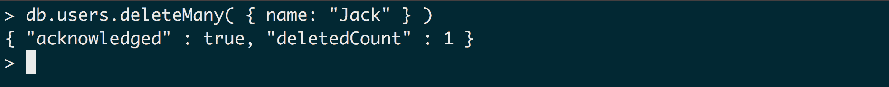

# remove()

`remove()` 命令用于从集合中删除单个条目以及多个条目。如果我们只想删除符合某些条件的单个文档，则可以传递我们希望删除的条目数。例如，让我们首先创建一个条目：

```js
> db.users.insertOne({ name: 'Mike', email: 'mike@mike.com' })
```

使用此方法，现在我们有两个 `Mike` 的条目。现在，如果我们想使用 `remove()` 删除单个条目，我们可以这样做：

```js
> db.users.remove({ name: 'Mike' }, 1)
```

输出如下：

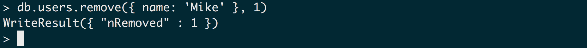

如您所见，我们有两个名为 `Mike` 的条目，但它只删除了一个。同样，如果我们想删除所有文档，我们只需使用：

```js
> db.users.remove({})
```

所有文档都将被删除。

我们讨论了如何在 Mongo 中查询文档的基本思路。要了解更多详细信息，请访问 [`docs.mongodb.com/v3.2/tutorial/query-documents/`](https://docs.mongodb.com/v3.2/tutorial/query-documents/)。

# 介绍 Mongoose

Mongoose 是一个优雅的 MongoDB 对象建模库，适用于 Node.js。正如我之前提到的，MongoDB 是一种无模式的数据库设计。虽然这有其自身的优势，但有时我们还需要添加某些验证，这意味着我们需要为我们的文档定义模式。Mongoose 提供了一种简单的方法来添加此类验证以及将文档中的字段类型化。

例如，要将数据插入 MongoDB 文档中，我们可以使用：

```js
> db.posts.insert({ title : 'test title', description : 'test description'})
```

现在，如果我们想添加另一个文档并且想在其中添加一个额外的字段，我们可以使用：

```js
> db.posts.insert({ title : 'test title', description : 'test description', category: 'News'})
```

这在 MongoDB 中是可能的，因为没有定义模式。这些类型的文档在构建应用程序时也是必需的。MongoDB 会默默地接受任何类型的文档。然而，有时我们需要文档看起来相似，以便在特定的验证中表现良好或具有特定的数据类型。在这种情况下，Mongoose 就派上用场了。我们也可以利用这些功能与原始 MongoDB 一起使用，但在 MongoDB 中编写验证是一个极其痛苦的任务。这就是为什么创建 Mongoose 的原因。

Mongoose 是用 Node.js 编写的 Mongo 数据建模技术。Mongoose 集合中的每个文档都需要固定数量的字段。我们必须显式定义一个 `Schema` 并遵守它。一个 Mongoose 模式的例子是：

```js
const UserSchema = new Schema({
 name: String,
 bio: String,
 extras: {}
})
```

这意味着名称和描述字段必须是字符串，而额外字段可以是一个完整的 JSON 对象，在其中我们可以存储嵌套值。

# 安装 Mongoose

就像任何其他包一样，Mongoose 可以使用 NPM 在我们的项目中安装。在上一章中创建的 `express_app` 文件夹内的终端中运行以下命令来安装 Mongoose：

```js
$ npm install mongoose --save
```

如果安装成功，我们应该在我们的 `package.json` 文件中添加一行：

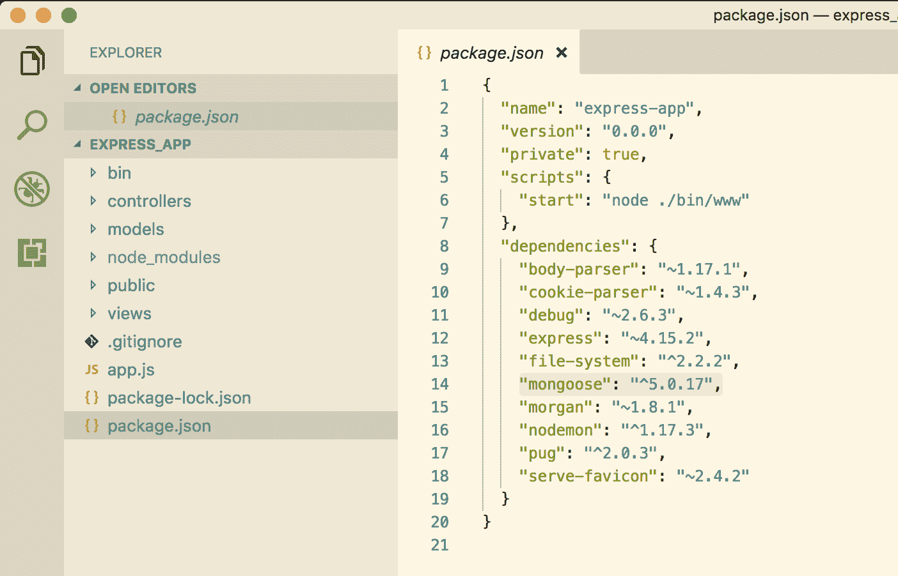

# 将 Mongoose 连接到 MongoDB

一旦安装了 Mongoose，我们必须将其连接到 MongoDB 才能开始使用它。使用 Mongoose 来做这件事非常直接；我们只需在 `app.js` 文件中添加一段代码来 `require` Mongoose，并使用 `mongoose.connect` 方法将其连接到数据库。让我们继续这样做。在 `app.js` 文件中，添加以下代码：

```js
var express = require('express');
var path = require('path');
var favicon = require('serve-favicon');
var logger = require('morgan');
var cookieParser = require('cookie-parser');
var bodyParser = require('body-parser');
var mongoose = require('mongoose');
```

这将把 Mongoose 模块导入到我们的代码库中。

现在，为了连接到 MongoDB 数据库，请在我们的 `app.js` 文件中添加以下代码行：

```js
var express = require('express');
var path = require('path');
var favicon = require('serve-favicon');
var logger = require('morgan');
var cookieParser = require('cookie-parser');
var bodyParser = require('body-parser');
var mongoose = require('mongoose');

var app = express();

//connect to mongodb
mongoose.connect('mongodb://localhost:27017/express_app', function() {
 console.log('Connection has been made');
})
.catch(err => {
 console.error('App starting error:', err.stack);
 process.exit(1);
});

// Require file system module
var fs = require('file-system');
```

这与我们的 Mongoose 数据库建立了一个连接。现在，让我们使用以下命令运行应用程序：

```js
$ nodemon app.js
```

并在我们的终端中显示一条消息，如果成功或失败：

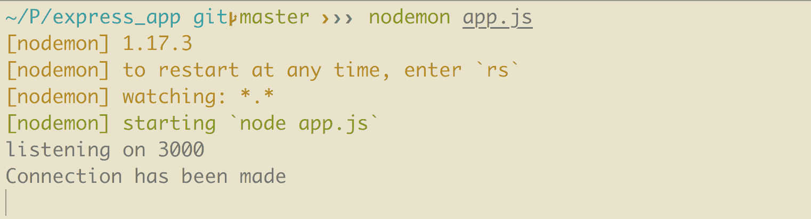

就这样！我们已经成功连接到我们的 MongoDB 数据库。这里的 URL 是本地托管的数据库名称。

# 在 Mongoose 中创建记录

让我们从在应用程序的 `express_app` 中创建一个新的模型开始。在项目的根目录下创建一个名为 `models` 的文件夹，并将其命名为 `User.js`。

我们使用文件名的首字母大写。同样，我们使用 `models` 的单数形式。与此相反，对于 `controllers`，我们使用复数形式和小写字母，例如 `users.js`。

一旦我们创建了文件，将以下代码粘贴到其中：

```js
const mongoose = require('mongoose');

const Schema = mongoose.Schema;

const UserSchema = new Schema({
 name: String,
 email: String
})

const User = mongoose.model("User", UserSchema)
module.exports = User
```

这里的第一行只是导入 Mongoose 模块。这个 Mongoose 包为我们提供了几个属性，其中之一是定义 `Schema`。现在，这里的原始 `Schema` 定义是以下高亮部分：

```js
const mongoose = require('mongoose');

const Schema = mongoose.Schema;

const UserSchema = new Schema({
 name: String,
 email: String
})

const User = mongoose.model("User", UserSchema)
module.exports = User
```

这所做的就是在我们的 `User` 数据模型中添加了一个验证，其中说明总共必须有两个字段。在为 Mongoose 集合创建文档时，它不会接受一个或多个数据字段。此外，它还向这个 `Schema` 添加了一个验证层，说明两个字段，即 `name` 和 `email`，应该是一个有效的字符串。它不会接受整数、布尔值或这两个字段之外的任何其他类型。这就是我们定义 `Schema` 的方式：

```js
const mongoose = require("mongoose")
const Schema = mongoose.Schema

const UserSchema = new Schema({
  name: String,
  email: String
})

const User = mongoose.model("User", UserSchema)
module.exports = User
```

这段代码的高亮部分表示创建模型的方式。该方法的第一参数是我们的模型名称，它映射到集合名称的相应复数形式。因此，当我们创建一个 `User` 模型时，这会自动映射到我们数据库中的 `user` 集合。

现在，要创建一个用户，首先要创建一个资源：

```js
const user_resource = new User({
  name: 'John Doe',
  email: 'john@doe.com'
})
```

现在，最后，真正创建 `user` 的部分是：

```js
user_resource.save((error) => {
  if(error)
 console.log(error);

  res.send({
    success: true,
    code: 200,
    msg: "User added!"
  })
})
```

之前的代码使用了一个名为`save`的 Mongoose 函数。`save`方法有一个用于错误处理的回调函数。当我们将资源保存到数据库时遇到错误，我们可以做任何我们想做的事情：

```js
user_resource.save((error) => {
  if(error)
    console.log(error);

  res.send({
 success: true,
 code: 200,
 msg: "User added!"
 })
})
```

`res.send`方法允许我们在资源成功保存到数据库时向客户端发送我们想要的内容。对象中的第一个元素是`success: true`，表示执行是否成功。第二个元素是状态码或响应码。一个`200`响应码表示成功执行。我们将在后续章节中进一步讨论这一点。最后一个元素是发送给客户端的消息；用户在前端会看到这个消息。

这就是我们在 Mongoose 中创建资源的方式。

# 从 Mongoose 获取记录

现在我们已经成功创建了一个用户，我们在数据库的`users`集合中有一个记录。在我们的客户端中，有两种方式可以获取这个记录：获取所有用户的记录或者获取一个特定的用户。

# 获取所有记录

Mongoose 模型有很多开箱即用的方法，可以使我们的工作更轻松。其中两种方法是`find()`和`findById()`。在 MongoDB 中，我们看到了如何通过原始 MongoDB 查询检索集合的记录数据。这与此类似，唯一的区别是 Mongoose 有一个非常简单的方式来做到这一点。我建议你先学习 MongoDB 而不是 Mongoose，因为 MongoDB 可以给你一个数据库的整体概念，你将学习数据库的基础知识和其查询。Mongoose 只是在 MongoDB 之上添加了一层，使其看起来更容易，以便更快地开发。

这样，让我们来看看这里的代码片段：

```js
User.find({}, 'name email', function (error, users) {
  if (error) { console.error(error); }
  res.send({
    users: users
  })
})
```

Mongoose 模型`User`调用一个名为`find()`的方法。第一个参数是我们的查询字符串，它是空的：前一个查询中的`{}`。因此，如果我们想检索所有同名用户，比如 Peter，那么我们可以将那个空`{}`替换为`{ name: 'Peter'}`。

第二个参数表示我们想从数据库中检索哪些字段。如果我们想检索所有字段，可以将其留空，或者我们也可以在这里指定。对于这个例子，我们只是检索用户名和电子邮件。

第三个参数附加了一个回调函数。这个函数有两个参数，与`create`方法不同。第一个参数处理错误。如果执行未成功完成，它返回一个错误，我们可以按我们想要的方式自定义它。第二个参数是这里的一个重要参数；它返回执行成功时的响应。在这种情况下，`users`参数是从`users`集合中检索到的对象的数组。这个调用的输出将是：

```js
users: [
  {
    name: 'John Doe',
    email: 'john@doe.com'
  }
]
```

现在我们已经从`users`集合中获取了所有记录。

# 获取特定记录

这与从集合中检索所有记录一样简单。我们在上一节中讨论了使用 `find()`。要检索单个记录，我们必须使用 `findById()` 或 `findOne()`，或者我们也可以使用 `where` 查询。`where` 查询与我们之前讨论的相同，当时我们需要传递一个参数来检索属于同一类别的记录。

让我们继续使用以下查询：

```js
User.findById(1, 'name email', function (error, user) {
  if (error) { console.error(error); }
  res.send(user)
}) 
```

如您所见，`find()` 和 `findById()` 的语法相似。它们接受相同数量的参数，表现相同。这两个方法之间的唯一区别是，前面的 `find()` 方法返回了一个记录数组作为响应，而 `findById()` 返回一个单个对象。因此，前面查询的响应将是：

```js
{
    name: 'John Doe',
    email 'john@doe.com'
}
```

就这么简单 - 简单！

# 在 Mongoose 中更新记录

让我们继续更新集合中的记录。更新集合记录的方法也很多，就像从集合中检索数据一样。在 Mongoose 中更新文档是 `read`（读取）和 `create`（保存）方法的组合。要更新文档，我们首先需要使用 Mongoose 的读取查询找到该文档，然后更改该文档，最后保存更改。

# findById() 和 save()

让我们看看以下示例：

```js
User.findById(1, 'name email', function (error, user) {
  if (error) { console.error(error); }

  user.name = 'Peter'
  user.email = 'peter@gmail.com'
  user.save(function (error) {
    if (error) {
      console.log(error)
    }
    res.send({
      success: true
    })
  })
})
```

因此，我们首先需要找到用户文档，我们通过 `findById()` 来做这件事。此方法返回具有给定 ID 的用户。现在我们有了这个用户，我们可以更改我们想要的任何内容。在前面的例子中，我们更改了那个人的姓名和电子邮件。

现在重要的部分来了。更新此用户文档的工作是由这里的 `save()` 方法完成的。我们已经通过以下方式更改了用户的姓名和电子邮件：

```js
user.name = 'Peter'
user.email = 'peter@gmail.com'
```

我们正在直接更改最初通过 `findById()` 返回的对象。现在，当我们使用 `user.save()` 时，此方法会使用新的姓名和电子邮件覆盖此用户之前的所有值。

我们还可以使用其他方法来更新 Mongoose 中的文档。

# findOneAndUpdate()

当我们想要更新单个条目时，可以使用此方法。例如：

```js
User.findOneAndUpdate({name: 'Peter'}, { $set: { name: "Sara" } },   function(err){
  if(err){
    console.log(err);
  }
});
```

如您所见，第一个参数定义了描述我们想要更新的记录的准则，在这种情况下，是名为 Peter 的用户。第二个参数是我们定义要更新的 `user` 的哪些属性的对象，它由 `{ $set: { name: "Sara" }` 定义。这会将 Peter 的 `name` 设置为 Sara。

现在，让我们对前面的代码进行一些小的修改：

```js
User.findOneAndUpdate({name: 'Peter'}, { $set: { name: "Sara" } },   function(err, user){
  if(err){
    console.log(err);
  }
  res.send(user);
});
```

在这里，请注意，我向回调函数 `user` 添加了一个第二个参数。这样做的作用是，当 Mongoose 完成在数据库中更新该文档后，它会返回该对象。当我们更新记录后想要做出一些决定，并想要操作新更新的文档时，这非常有用。

# findByIdAndUpdate()

这与`findOneAndUpdate()`有些相似。此方法接受一个 ID 作为参数，与`findOneAndUpdate()`不同，后者我们可以添加自己的条件，并更新该文档：

```js
User.findByIdAndUpdate(1, { $set: { name: "Sara" } },   function(err){
  if(err){
    console.log(err);
  }
});
```

这里的唯一区别在于，第一个参数接受一个单独的整数值，即文档的 ID，而不是一个对象。此方法还会返回正在更新的对象。因此，我们可以使用：

```js
User.findByIdAndUpdate(1, { $set: { name: "Sara" } }, function(err){
  if(err, user){
    console.log(err);
  }
 res.send(user);
});
```

# 在 Mongoose 中删除记录

正如 Mongoose 中有许多创建、获取和更新记录的方法一样，它也提供了几种从集合中删除记录的方法，例如`remove()`、`findOneAndRemove()`和`findByIdAndRemove()`。我们可以使用`remove()`来删除一个或多个文档。我们也可以先找到我们想要删除的文档，然后使用`remove()`命令仅删除那些文档。如果我们想根据某些条件找到特定的文档，我们可以使用`findOneAndRemove()`。当我们知道要删除的文档的 ID 时，我们可以使用`findByIdAndRemove()`。

# `remove()`

让我们看看使用此方法的示例：

```js
User.remove({
  _id: 1
}, function(err){
  if (err)
    res.send(err)
  res.send({
    success: true
  })
})
```

`remove()`方法的第一个参数接受过滤条件，指定我们想要删除哪个用户。它接受一个 ID 作为参数。它找到具有给定 ID 的用户，并从集合中删除该文档。第二个参数是之前提到的回调函数。如果上述操作出现错误，它将返回一个错误，我们可以使用它来更好地处理应用程序中发生的异常或错误。在成功的情况下，我们可以定义自己的逻辑来决定返回什么。在前面的例子中，我们返回了`{ success: true }`。

# `findOneAndRemove`

`findOneAndRemove()`的行为与`remove()`相同，并且接受相同数量的参数：

```js
User.findOneAndRemove({
  _id: 1
}, function(err){
  if (err)
    res.send(err)
  res.send({
    success: true
  })
})
```

我们只需要定义我们想要删除的文档的筛选条件。

现在，我们也可以修改前面的代码：

```js
User.findOneAndRemove({
  _id: 1
}, function(err, user){
  if (err)
    res.send(err)
  res.send({
    success: true,
    user: user
  })
})
```

在这里，我已经突出显示了新增的代码片段。我们还可以向回调函数传递第二个参数，该参数返回被删除的`user`对象。现在，如果我们想在前端显示某些消息并添加一些用户属性，如`user`的`name`或`email`，这将非常有用。例如，如果我们想在前端显示一条消息，说明名为{x}的用户已被删除，那么我们可以在这里传递`user`或其他`user`属性；在这种情况下，是名称，将在前端显示。

`remove()`和`findOneAndRemove()`之间的主要区别在于，`remove()`不会返回被删除的文档，而`findOneAndRemove()`会。现在我们知道何时使用这两种方法。

# `findByIdAndRemove()`

这与`findOneAndRemove()`相同，但总是需要传递一个`id`作为参数：

```js
User.findByIdAndRemove(1, function(err){
  if (err)
    res.send(err)
  res.send({
    success: true
  })
})
```

你在`findOneAndRemove()`和前面的`findByIdAndRemove()`代码之间发现了任何区别吗？如果我们查看这个方法的第一参数，它只接受一个简单的整数值，即文档 ID。现在，如果我们查看前面的`findOneAndRemove()`代码，我们会注意到我们在第一个参数中传递了一个对象。这是因为对于`findOneAndRemove()`，我们除了 ID 之外还可以传递其他参数。例如，我们也可以在`findOneAndRemove()`的参数中传递`{ name: 'Anita' }`。但是，对于`findByIdAndRemove()`，正如方法名所暗示的，我们不需要传递对象，只需要传递表示文档 ID 的整数。

它在参数中找到指定 ID 的文档，并将其从集合中删除。就像`findOneAndRemove()`一样，这个操作也会返回被删除的文档。

# 使用 Mongoose 添加验证

Mongoose 中的验证是在模式级别定义的。验证可以设置在字符串和数字中。Mongoose 为我们提供了字符串和数字的内置验证技术。此外，我们也可以根据我们的需求自定义这些验证。由于验证是在模式中定义的，因此当我们在任何文档上调用`save()`方法时，它们会被触发。如果我们只想测试这些验证，我们也可以通过仅通过`{doc}.validate()`执行验证方法来做到这一点。

`validate()`也是中间件，这意味着它在以异步方式执行某些方法时具有控制权。

# 默认验证

让我们谈谈 Mongoose 为我们提供的默认验证。这些也被称为内置验证器。

# required()

`required()`验证器检查我们添加验证的字段是否有值。在之前的`User`模型中，我们有以下代码：

```js
var mongoose = require("mongoose");
var Schema = mongoose.Schema;

var UserSchema = new Schema({
  name: String,
  email: String
});

var User = mongoose.model("User", UserSchema);
module.exports = User;
```

这段代码也与用户的字段相关联的验证有关。它要求用户的名字和电子邮件必须是字符串，而不是数字、布尔值或其他任何东西。但这段代码并没有确保用户的名字和电子邮件字段已被设置。

因此，如果我们想添加一个`required()`验证，代码应该这样修改：

```js
var mongoose = require("mongoose");
var Schema = mongoose.Schema;

var UserSchema = new Schema({
  name: {
 required: true
 },
  email: {
 required: true
 }
});

var User = mongoose.model("User", UserSchema);
module.exports = User;
```

如您所见，我们已经将 name 键的值从字符串更改为对象。在这里，我们可以添加我们想要的任何验证。因此，添加的验证`required: true`检查在将文档保存到集合之前，用户的名字和电子邮件是否已设置某个值。如果验证未通过，它将返回一个错误。

我们还可以在验证返回错误时传递一个消息。例如：

```js
var mongoose = require("mongoose");
var Schema = mongoose.Schema;

var UserSchema = new Schema({
  name: {
 required: [true, 'Let us know you by adding your name!']
 },
  email: {
 required: [true, 'Please add your email as well.']
 }
});

var User = mongoose.model("User", UserSchema);
module.exports = User;
```

这样，我们也可以根据我们的需求自定义消息。非常酷，对吧？

# 类型验证

类型验证方法定义了文档中字段的类型。类型的不同变体可以是`String`、`boolean`和`number`。

# String

字符串本身下面有几个验证器，例如`enum`、`match`、`maxlength`和`minlength`。

`maxlength` 和 `minlength` 定义了字符串的长度。

# 数字

数字有两个验证器：`min` 和 `max`。`min` 和 `max` 的值定义了集合中字段值的范围。

# 自定义验证

如果默认的内置验证不够用，我们还可以添加自定义验证。我们可以传递一个 `validate` 函数并将我们的自定义代码写入该函数。让我们看一个例子：

```js
var userSchema = new Schema({
  phone: {
    type: String,
    validate: {
 validator: function(v) {
 return /\d{3}-\d{3}-\d{4}/.test(v);
 },
 message: '{VALUE} is not a valid phone number!'
 }
  }
});
```

这里，我们向 `Schema` 传递了一个 `validate` 方法。它接受一个验证器函数，我们可以在其中添加自己的验证代码。前面的方法检查用户的电话号码字段是否处于正确的格式。如果它未通过验证，则显示消息 `{value} 不是一个有效的电话号码}`。

我们还可以在 Mongoose 中添加嵌套验证：例如，如果我们的用户集合中的名称保存为 `{ name: { first_name: 'Anita', last_name: 'Sharma' } }`，我们需要为 `first_name` 和 `last_name` 添加验证。为此，我们可以使用：

```js
var nameSchema = new Schema({
  first_name: String,
  last_name: String
});

userSchema = new Schema({
  name: {
    type: nameSchema,
    required: true
  }
});
```

首先，我们定义一个低级对象的 `Schema`，它包括 `first_name` 和 `last_name` 字段。然后，对于 `userSchema`，我们将 `nameSchema` 传递给名称字段。

记住，我们无法在这个 `Schema` 中添加嵌套验证，如下所示：

```js
var nameSchema = new Schema({
  first_name: String,
  last_name: String
});

personSchema = new Schema({
  name: {
    type: {
      first_name: String,
      last_name: String
    },
    required: true
  }
});
```

你可以在这里查看 Mongoose 验证的相关信息：[`mongoosejs.com/docs/validation.html`](http://mongoosejs.com/docs/validation.html)。

# 摘要

在本章中，我们介绍了 MongoDB 的基本信息和它的好处，如何在 MongoDB 中进行 CRUD 操作和查询，以及使用 Mongoose 的基本验证。

在下一章中，我们将进一步讨论我们的应用程序中的 REST API 和 RESTful 架构设计。
