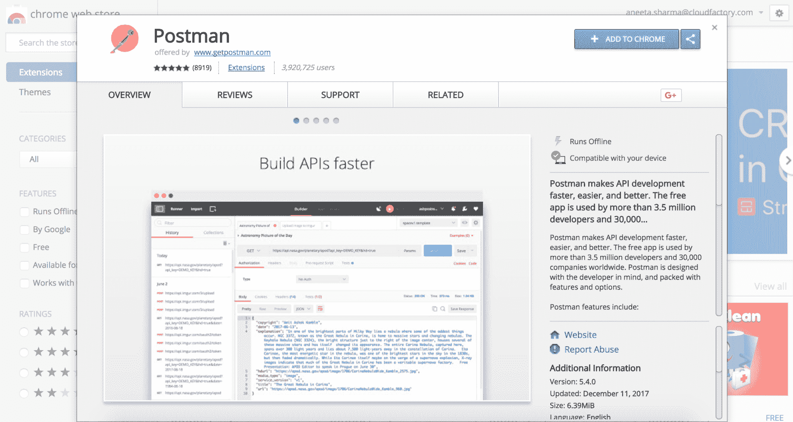
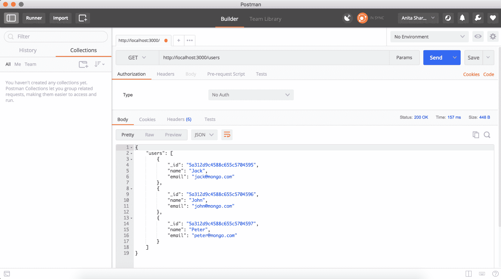
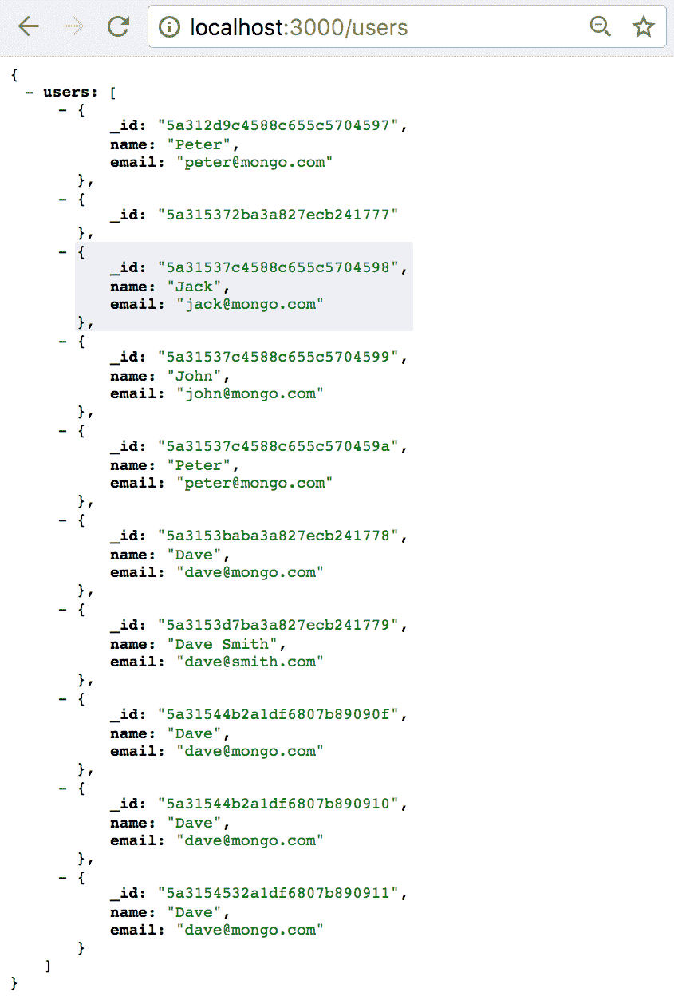
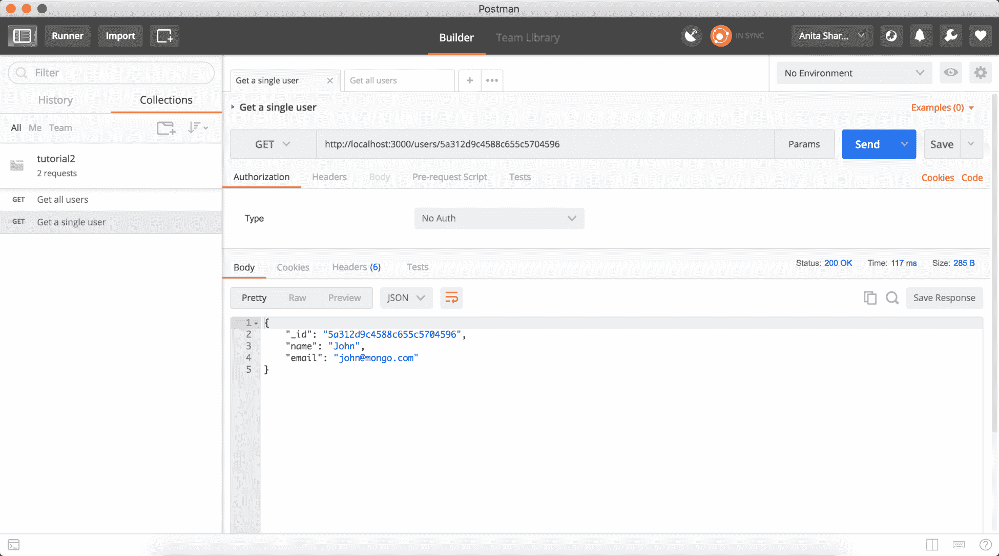
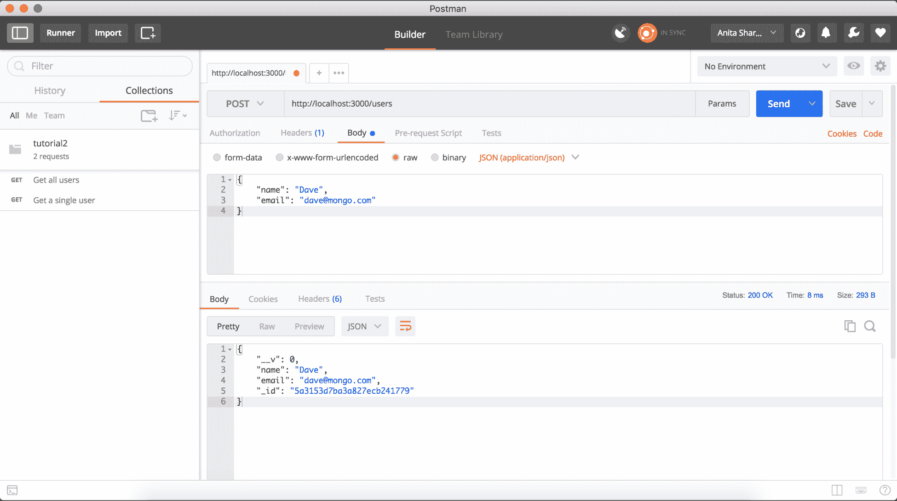
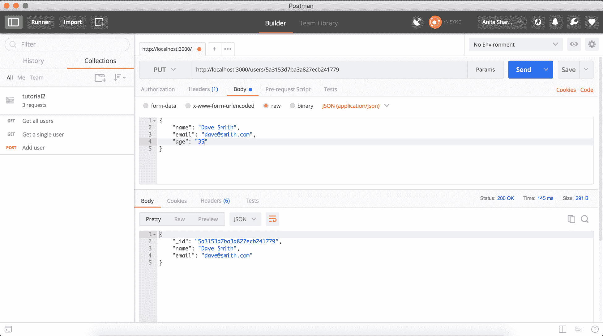
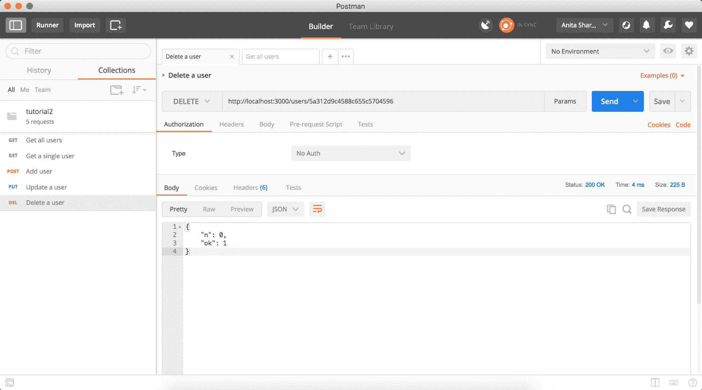

# 第四章：介绍 REST API

**应用程序编程接口**（**API**）通常用于从一个应用程序获取数据到另一个应用程序。不同领域有不同的 API，例如硬件和编程，但我们将只讨论 Web API。Web API 是一种提供多个应用程序之间通信接口的 Web 服务。使用这些 API，一个应用程序的数据通过 HTTP 协议发送到另一个应用程序。

在本章中，我们将讨论：

+   REST 架构和 RESTful API

+   HTTP 动词和状态码

+   使用 Postman 开发和测试 API

Web API 的工作方式与浏览器如何与我们的应用程序服务器交互相似。客户端从服务器请求一些数据，服务器以格式化的数据对客户端做出响应；API 做的是类似的事情。例如，多个应用程序之间事先有一个合同。所以，如果有两个应用程序需要共享数据，那么一个应用程序将向另一个应用程序提交一个请求，说明它需要以这种格式的数据。当另一个应用程序收到请求时，它会从其服务器获取数据，并以结构化和格式化的数据对客户端或请求者做出响应。

Web API 被分为**简单对象访问协议**（**SOAP**）、**远程过程调用**（**RPC**）或**表示性状态转移**（**REST**）类别。这些 API 的响应格式可以是各种形式，如 XML、JSON、HTML、图片和视频。

API 也有不同的模型，例如公共 API 和私有 API：

+   **私有 API**：私有或内部 API 仅用于组织内部的内部应用程序

+   **公共 API**：公共或外部 API 设计的方式使得它们可以被组织外部的公众共享

# 什么是 REST？

REST 是一种通过 HTTP 协议在多个应用程序之间交换数据的 Web 服务。RESTful Web 服务是可扩展的且易于维护的。

这里有一个简单的图解，说明了 REST Web Service 是如何工作的：


如图中所示，客户端通过调用 Rest Web Service Server 来请求一些数据。在这里，当我们发送一个 HTTP 请求时，我们也会提供一些头部信息，例如我们希望作为响应的数据类型。这些响应可以是 JSON、XML、HTML 或其他任何形式。当服务器接收到请求并从存储中提取数据时，它不会简单地以数据库资源的形式返回响应。它发送这些资源的表示。这就是为什么它被称为**表示性**。当服务器以这种格式化的数据对客户端做出响应时，我们应用程序的状态发生了变化。这就是为什么它被称为**状态转移**。

# 介绍 REST API

REST API 是基于 RESTful 架构设计的。遵循 RESTful 架构原则构建的 API 被称为 RESTful API。RESTful 架构也被称为 **无状态架构**，因为客户端和服务器之间的连接不会被保留。在客户端和服务器之间每次事务之后，连接都会被重置。

由于存在多个网络服务，我们必须能够选择我们的需求和需求，以便为我们的应用程序构建完美的 API。SOAP 和 REST 协议都有一些优点和局限性。

SOAP 协议是在 1998 年由 Dave Winer 设计的。它使用 **可扩展标记语言** (**XML**) 进行数据交换。是否使用 SOAP 或 REST 取决于我们在开发时选择的编程语言以及应用程序的需求。

REST API 允许我们在 JSON/XML 数据格式之间进行应用程序间的通信。JSON/XML 是一种易于格式化和易于人类阅读的数据表示。通过 RESTful API，我们可以从一个应用程序到另一个应用程序执行 **创建**、**读取**、**更新** 和 **删除** （**CRUD**） 操作。

# REST API 的好处

REST API 提供了许多好处。以下是我们通过使用 REST API 可以获得的一些优势：

+   从一个应用程序向另一个应用程序发送请求和获取响应非常容易。

+   响应可以以 JSON 或 XML 的人类可读格式检索。

+   所有的操作都是以 URI 的形式进行的，这意味着每个请求都通过 URI 来标识。

+   客户端和服务器之间的分离使得在需要时可以轻松迁移到不同的服务器，并且更改最小。客户端和服务器之间的隔离也使得扩展变得容易。

+   它与任何编程语言无关。无论我们使用 PHP、JAVA、Rails、Node.js 等何种编程语言，都可以实现 REST 架构。

+   开始使用非常容易，学习曲线也很短。

# HTTP 动词

HTTP 动词是用来定义我们对资源想要执行的操作的不同方法。最常用的 HTTP 动词是 GET、POST、PUT、PATCH 和 DELETE。HTTP 动词是使多个应用程序之间通信成为可能请求方法。这些 HTTP 动词使得在不需要完全更改 URL 的情况下对资源执行多个操作成为可能。让我们更详细地看看这些。

# GET

`GET` 请求是无效请求。这在我们想要获取资源信息时使用。这不会修改或删除资源。`GET` 请求的等效 CRUD 操作是 `READ`，这意味着它只获取信息，仅此而已。一个 `GET` 请求的示例 URL 是：

+   要获取所有记录：

```js
GET http://www.example.com/users
```

+   要获取单个用户的信息：

```js
GET http://www.example.com/users/{user_id}
```

# POST

对于`POST`请求的等效 CRUD 操作是`CREATE`。这用于向集合中添加新记录。由于这会改变服务器状态，因此这不是一个幂等请求。如果我们两次以相同的参数请求`POST`方法，那么将在数据库中创建两个相同的新资源。以下是一个`POST`请求的示例 URL：

```js
POST http://www.example.com/users/
```

# PUT

`PUT`请求用于创建或更新记录。如果资源尚不存在，则创建新记录；如果资源已存在，则更新现有记录。等效的 CRUD 操作是`update()`。它替换了资源的现有表示。以下是一个`PUT`请求的示例 URL：

```js
PUT http://www.example.com/users/
```

# DELETE

这用于从集合中删除资源。等效的 CRUD 操作是`delete()`。

以下是一个`DELETE`请求的示例 URL：

```js
DELETE http://www.example.com/users/{user_id}
```

# HTTP 状态码

状态码是服务器对请求做出的响应的一部分。它表示请求的状态，无论它是否成功执行。状态码有三个数字。第一个数字表示该响应的类别或类别。HTTP 状态码的范围是*100-500*。在本节中，我们将介绍一些主要的状态码。

# 2XX 代码

200 范围内的状态码是 API 中任何请求的成功范围。在 200 范围内，有许多代码表示不同的成功形式。以下是可用的许多状态码中的一些解释：

+   **200 OK**：这是一个标准响应。它只是表示请求成功。此状态码还返回请求执行的资源。

+   **201 Created**：这表示资源的成功创建。

+   **204 No Content**：此状态码成功执行请求，但不返回任何内容。

# 4XX 代码

当客户端发生错误时，会出现 400 范围内的状态码：

+   **400 Bad Request**：当请求参数格式不正确或语法错误时，服务器会返回 400 状态码。

+   **401 Unauthorized**：当未经授权的方尝试发送 API 请求时，会返回此状态码。这基本上检查了认证部分。

+   **403 Forbidden**：这与 401 有些相似。这检查执行 API 请求的方的授权。这通常在执行 API 的不同用户有不同的权限设置时进行。

+   **404 Not Found**：当服务器在数据库中找不到我们尝试执行某些操作的资源时，会返回此响应。

# 5XX 代码

状态码 500 表示在给定资源执行的动作执行过程中存在问题：

+   **500 Internal Server Error**：当动作未成功执行时，会显示此状态码。与 200 状态码一样，这是服务器在出现问题时返回的通用代码。

+   **503 服务不可用**：当我们的服务器没有运行时，会显示这个状态码。

+   **504 网关超时**：这表示请求已发送到服务器，但在给定时间内没有收到任何响应。

# 介绍 Postman

Postman 是一个让我们更快地开发和测试我们的 API 的工具。这个工具提供了一个 GUI，使得调整我们的 API 变得容易，从而减少了我们 API 的开发时间。我们还可以通过创建所有已开发的 API 的集合来维护历史记录。

Postman 也有不同的替代方案，例如 Runscope 和 Paw。我们将在这本书中使用 Postman。

# 安装 Postman

使用 Postman 有不同的方式：

1.  我们可以通过以下方式获取 Chrome 扩展程序：如果您访问 [`chrome.google.com/webstore/detail/postman/fhbjgbiflinjbdggehcddcbncdddomop?hl=en`](https://chrome.google.com/webstore/detail/postman/fhbjgbiflinjbdggehcddcbncdddomop?hl=en)，我们会看到以下内容：



点击“添加到 Chrome”按钮，扩展程序将被安装。

1.  我们可以通过以下方式下载适合我们操作系统的桌面应用程序：

    [`www.getpostman.com/`](https://www.getpostman.com/).

我们在这本书中使用了桌面应用程序。

# 使用 Postman 测试 API

首先，让我们快速回顾一下到目前为止我们已经做了什么。在我们正在构建的应用程序中，`app.js` 文件应该包含以下代码：

```js
var express = require('express');
var path = require('path');
var favicon = require('serve-favicon');
var logger = require('morgan');
var cookieParser = require('cookie-parser');
var bodyParser = require('body-parser');
var fs = require('file-system');
var mongoose = require('mongoose');

var app = express();
var mongoose = require('mongoose');
mongoose.connect('mongodb://localhost:27017/tutorial2', {
  useMongoClient: true
});
var db = mongoose.connection;
db.on("error", console.error.bind(console, "connection error"));
db.once("open", function(callback){
  console.log("Connection Succeeded");
});

// view engine setup
app.set('views', path.join(__dirname, 'views'));
app.set('view engine', 'pug');

// uncomment after placing our favicon in /public
//app.use(favicon(path.join(__dirname, 'public', 'favicon.ico')));
app.use(logger('dev'));
app.use(bodyParser.json());
app.use(bodyParser.urlencoded({ extended: false }));
app.use(cookieParser());
app.use(express.static(path.join(__dirname, 'public')));

// Include controllers
fs.readdirSync("controllers").forEach(function (file) {
  if(file.substr(-3) == ".js") {
    const route = require("./controllers/" + file)
    route.controller(app)
  }
})

// catch 404 and forward to error handler
app.use(function(req, res, next) {
  var err = new Error('Not Found');
  err.status = 404;
  next(err);
});

// error handler
app.use(function(err, req, res, next) {
  // set locals, only providing error in development
  res.locals.message = err.message;
  res.locals.error = req.app.get('env') === 'development' ? err : {};

  // render the error page
  res.status(err.status || 500);
  res.render('error');
});

module.exports = app;

app.listen(3000, function() {
  console.log('listening on 3000')
})
```

由于此文件是在我们通过命令行构建应用程序时自动生成的，它使用 TypeScript 语法。如果我们想使用 ES 6 语法，我们可以将 `var` 替换为 `const`。

在我们的 `models/User.js` 文件中，我们有以下内容：

```js
const mongoose = require("mongoose")
const Schema = mongoose.Schema
const UserSchema = new Schema({
 name: String,
 email: String
})

const User = mongoose.model("User", UserSchema)
module.exports = User
```

此外，在 `controllers/users.js` 文件中，我们有以下内容：

```js
module.exports.controller = (app) => {
  // get homepage
  app.get('/users', (req, res) => {
    res.render('index', { title: 'Users' });
  })
}
```

# 在用户控制器中添加 GET 端点

让我们在 `controllers/users.js` 中添加一个路由，该路由将从数据库中获取所有用户的记录。

目前，根据我们 `users` 控制器中的代码，当我们访问 `http://localhost:3000/users` 时，它只返回一个标题，`Users`。让我们修改这段代码以包含一个 `GET` 请求来获取所有用户请求。

# 获取所有用户

首先，使用 `$ nodemon app.js` 启动服务器。现在，在 `controllers/users.js` 中：

```js
var User = require("../models/User");

module.exports.controller = (app) => {
  // get all users
  app.get('/users', (req, res) => {
    User.find({}, 'name email', function (error, users) {
      if (error) { console.log(error); }
      res.send(users);
    })
  })
}
```

现在我们已经将代码设置好了，让我们使用 Postman 应用程序测试这个端点。在 Postman 应用程序中，在 URL 中添加必要的详细信息。当我们点击发送按钮时，我们应该看到以下响应：



`_id` 是用户的 MongoDB ID，这是 Mongoose 查询默认发送的，我们正在获取用户的名字和电子邮件。如果我们只想获取名字，我们可以在 `users` 控制器中更改我们的查询以只获取名字。

Postman 允许我们编辑端点，并且请求的开发变得容易。如果我们想使用自己的本地浏览器进行测试，我们也可以这样做。

我使用了一个名为 JSONview 的 Chrome 插件来格式化 JSON 响应。您可以从这里获取插件：

[`chrome.google.com/webstore/detail/jsonview/chklaanhfefbnpoihckbnefhakgolnmc`](https://chrome.google.com/webstore/detail/jsonview/chklaanhfefbnpoihckbnefhakgolnmc).

如我之前所述，如果我们访问`http://localhost:3000/users`，我们应该能够看到类似以下的内容：



我们可以使用 Postman 提供的`save`查询功能在将来运行这些查询。只需点击右上角的保存按钮，然后在我们继续前进的过程中创建新的查询。

# 获取单个用户

如 HTTP 动词部分所述，要从集合中获取单个记录，我们必须在参数中传递用户的`id`以获取用户详细信息。从先前的 Postman 响应示例中，让我们选择一个`id`并使用它来获取用户的记录。首先，让我们在我们的控制器中添加端点。在`controllers/users.js`中添加以下代码行：

```js
var User = require("../models/User");

module.exports.controller = (app) => {
  // get all users
  app.get('/users', (req, res) => {
    User.find({}, 'name email', function (error, users) {
      if (error) { console.log(error); }
       res.send({
        users: users
      })
    })
  })

  //get a single user details
 app.get('/users/:id', (req, res) => {
 User.findById(req.params.id, 'name email', function (error, user) {
 if (error) { console.log(error); }
 res.send(user)
 })
 })
}
```

现在，在 Postman 中创建一个新的查询，以下参数。我们将创建一个带有 URL `http://localhost:3000/users/:user_id` 的`GET`请求，其中`user_id`是您在数据库中创建的任何用户的`id`。使用此设置，我们应该能够看到如下内容：



查询应返回 URL 中给定 ID 的用户详细信息。

# 在用户控制器中添加 POST 端点

让我们看看一个例子。让我们创建一个 API，它将使用 MongoDB 的`insert()`命令将用户资源保存到数据库中。在用户控制器中添加一个新的端点：

```js
// add a new user
  app.post('/users', (req, res) => {
    const user = new User({
      name: req.body.name,
      email: req.body.email
    })

    user.save(function (error, user) {
      if (error) { console.log(error); }
      res.send(user)
    })
  })
```

在 Postman 中，将方法设置为`POST`，URL 设置为`http://localhost:3000/users`，将参数设置为原始 JSON，并输入以下内容：

```js
{
 "name": "Dave",
 "email": "dave@mongo.com"
}
```



与`GET`请求不同，我们必须在`body`参数中传递我们想要添加的用户的名字和电子邮件。现在，如果我们运行一个`GET all users`查询，我们应该能够看到这个新用户。如果我们用相同的参数运行两次`POST`请求，那么它将创建两个不同的资源。

# 在用户控制器中添加 PUT 端点

让我们更新一个 ID 为`5a3153d7ba3a827ecb241779`的用户（将此 ID 更改为您的文档 ID），这是我们刚刚创建的。让我们重命名电子邮件：为此，首先让我们在我们的用户控制器中添加端点，换句话说，在`controllers/user.js`中：

```js
// update a user
  app.put('/users/:id', (req, res) => {
    User.findById(req.params.id, 'name email', function (error, user) {
      if (error) { console.error(error); }

      user.name = req.body.name
      user.email = req.body.email
      user.save(function (error, user) {
        if (error) { console.log(error); }
        res.send(user)
      })
    })
  })
```

我们在这里所做的是，我们添加了一个用于`PUT`请求的端点，它接受名称和电子邮件作为参数并将其保存到数据库中。相应的 Postman 看起来如下所示：



在这里，我们可以看到用户的名字已经被更新。而且，如果我们查看请求参数，我们还添加了一个`age`参数。但由于我们在定义用户模型时没有添加`age`，它丢弃了年龄值但更新了其余部分。

我们还可以使用 `PATCH` 方法来更新资源。`PUT` 和 `PATCH` 方法的区别是：`PUT` 方法更新整个资源，而 `PATCH` 用于对资源进行部分更新。

# 在用户控制器中添加 DELETE 端点

同样地，对于删除操作，让我们在 `controllers/users.js` 中添加一个端点：

```js
// delete a user
  app.delete('/users/:id', (req, res) => {
    User.remove({
      _id: req.params.id
    }, function(error, user){
      if (error) { console.error(error); }
      res.send({ success: true })
    })
  })
```

以下代码获取用户的 ID，并从数据库中删除具有给定 ID 的用户。在 Postman 中，端点将如下所示：



# 摘要

在本章中，我们学习了什么是 RESTful API，不同的 HTTP 动词和状态码，以及如何使用 Postman 开发和测试 RESTful API。

在下一章中，我们将进入 Vue.js 的介绍，并使用 Vue.js 构建一个应用程序。
